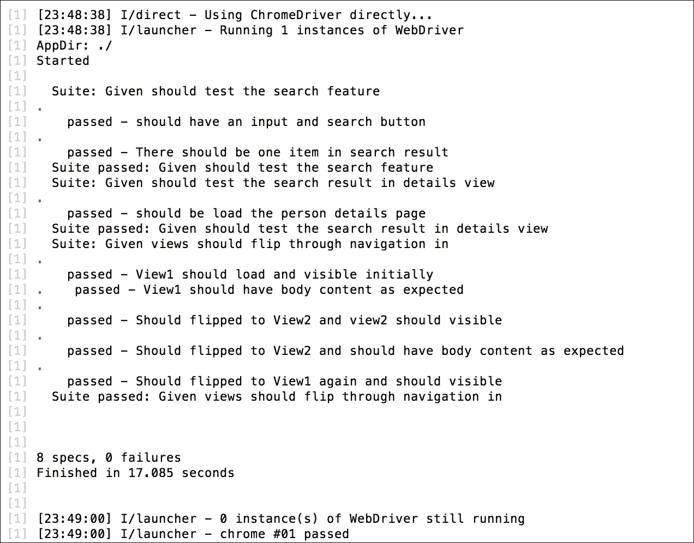
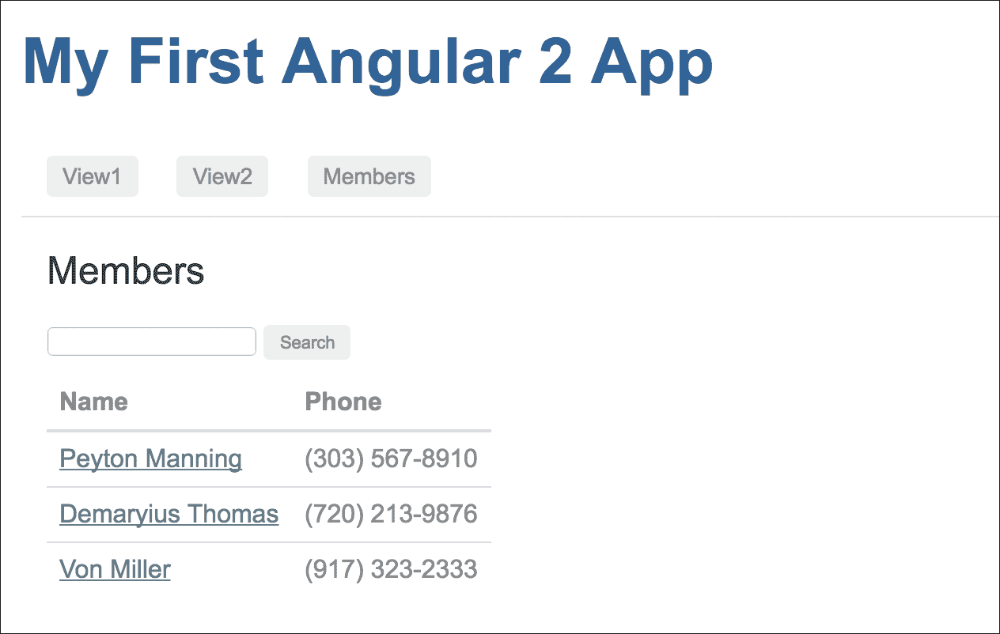
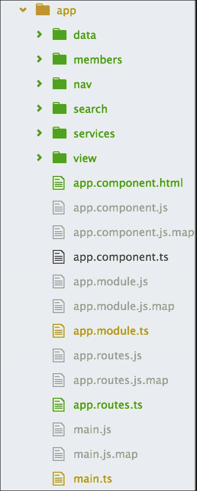

# 第八章。告诉世界

TDD 的构建主要关注基本组件，即生命周期和过程，使用逐步讲解。我们从底层研究了几个应用程序，理解了如何构建 Angular 应用程序并使用工具来测试它们。

是时候进一步深入 Angular 的深处并集成服务、EventEmitters 和路由了。

本章在几个方面将与其他章节略有不同：

+   我们将使用第七章中的搜索应用程序，而不是构建全新的应用程序，*翻转*

+   我们将为 Angular 路由和导航添加上一章中跳过的单元测试

+   我们将通过将常用操作分离到服务中来使现有的搜索应用程序更加现代化

+   我们将利用 Angular 的`EventEmitter`类在不同的组件之间进行通信

# 准备进行通信

在本章中，我们将采取不同的方法，因为我们已经学习了 TDD 方法。我们在上一章开发了一个小型项目，我们的计划是使用这个项目并使其变得更好，以便向世界展示。

因此，在开始讲解之前，我们必须回顾并识别项目中存在的问题以及改进的范围。为此，我们必须对搜索应用程序的代码库有信心。

## 加载现有项目

首先，我们将从第七章，*翻转*复制项目，该项目最初来自[`github.com/angular/quickstart`](https://github.com/angular/quickstart)，并将其重命名为`angular-member-search`。

让我们继续前进，准备运行它：

```js
$ cd angular-member-search
$ npm install 
$ npm start

```

为了确认安装并运行项目，应用程序将自动在网页浏览器中运行它。

当我们运行项目时，我们应该得到以下输出：


哦！我们在项目中已经有了端到端测试。在我们进行更新之前，我们必须确保现有的 e2e 测试是成功的。

让我们在单独的控制台中运行`e2e`测试：

```js
$ npm run e2e

```

是的，一切测试都成功通过：



# 单元测试

在上一章中，我们开始使用自顶向下的方法。目标是基于我们所学的内容详细阐述端到端测试。我们有明确用户场景，我们通过了测试，并且我们的场景通过了我们的实现。

在上一章中，我们只涵盖了端到端测试。因此，在本章中，我们将尽可能多地涵盖单元测试。

此外，在上一章中，我们主要关注 Angular 路由和导航。因此，现在作为一个逻辑上的扩展，我们将探讨如何测试 Angular 路由和导航。

## 测试组件

在我们进行组件测试之前，我们应该讨论一些关于测试 Angular 组件的观点。我们已经有了一个基本的概念：在 Angular 中，一切都是一些组件的组合。因此，深入了解 Angular 组件测试对我们来说将是非常有益的。

我们可以根据组件的行为和用例以各种方式测试组件。我们甚至可以为多个组件编写测试规范，当它们作为一个应用程序一起工作时。

让我们看看测试组件的一些方法。

### 隔离测试

隔离测试，也称为单独测试，之所以这样命名，是因为这种测试可以在不需要根据测试规范编译组件的情况下运行。如果它没有编译，它将不会在测试规范中有编译后的模板；只有组件类及其方法。这意味着如果组件的功能不太依赖于 DOM，它可以通过隔离的方式进行测试。

隔离测试主要用于复杂功能或计算测试，其中它只需初始化组件类并调用所有方法。

例如，看看第六章的单元测试，*第一步*，其中`AppComponent`负责添加评论和增加它们的点赞数：

```js
beforeEach(() => { 
    comp = new AppComponent(); 
    comp.add('a sample comment'); 
    comp.like(comp.comments[0]); 
}); 

    it('First item in the item should match', () => { 
        expect(comp.comments[0].title).toBe('a sample 
        comment'); 
    }); 

    it('Number of likes should increase on like', () => { 
        expect(comp.comments[0].likes).toEqual(1); 
    }); 

```

### 浅层测试

隔离测试有时可以满足测试规范的要求，但并不总是如此。大多数时候，组件都有依赖于 DOM 的功能。在这种情况下，在测试规范中渲染组件的模板非常重要，这样我们就有编译后的模板在作用域内，并且测试规范能够与 DOM 交互。

例如，如果我们想为我们的`AppComponent`编写一个基本的单元测试，该组件主要依赖于 DOM，因为组件类中没有方法，那么我们只需要编译组件并检查它是否已定义。此外，如果组件的模板在`<h1>`元素内具有正确的文本，我们还可以有一个测试规范。

代码将如下所示：

```js
beforeEach(async(() => { 
    TestBed.configureTestingModule({ 
        declarations: [ AppComponent ]
    }) 
    .compileComponents(); 
})); 

beforeEach(() => { 
    fixture = TestBed.createComponent(AppComponent); 
    comp = fixture.componentInstance; 
    de = fixture.debugElement.query(By.css('h1')); 
}); 

it('should create and initiate the App component', () => { 
    expect(comp).toBeDefined(); 
}); 

it('should have expected test in <h1> element', () => { 
    fixture.detectChanges(); 
    const h1 = de.nativeElement; 
    expect(h1.innerText).toMatch(/My First Angular 2 App/i, 
    '<h1> should say something about "Angular App"'); 
}); 

```

### 集成测试

下面是一些关于集成测试的关键点：

+   “集成测试”这个名字应该给我们一些关于它是哪种测试的线索。它与浅层测试类似，因为它也需要编译带有模板的组件并与 DOM 交互。

+   接下来，我们将查看我们的路由和导航测试套件，其中我们将集成`AppComponent`、路由器和导航测试套件。

+   我们已经为`AppComponent`准备好了测试套件，因为它包括`navbar`组件和`router-outlet`组件。所有这些一起工作以满足路由规范。

+   因此，为了获得对路由器的自信测试规范，我们应该选择集成测试。

在接下来的几节中，我们将通过一个详细的示例来查看路由器测试。

### 注意

集成测试和浅层测试之间的主要区别在于，集成测试适用于完整应用程序的测试套件或应用程序的小部分，其中多个组件协同工作以解决某些目的。它与端到端测试有一些相似之处，但采用不同的方法。

# Karma 配置

在前面的章节中，使用了默认的 Karma 配置，但尚未对此默认配置进行解释。**文件监视** 是一个有用的默认行为，现在将对其进行审查。

## 文件监视

当使用 Karma `init` 命令时，默认启用文件监视。Karma 中的文件监视通过在 `karma.conf.js` 文件中的以下定义进行配置：

```js
autoWatch: true, 

```

文件监视功能按预期工作，监视配置中定义的 `files` 数组中的文件。当文件更新、更改或删除时，Karma 会通过重新运行测试来响应。从 TDD 的角度来看，这是一个很棒的功能，因为测试将在没有任何手动干预的情况下继续运行。

需要注意的主要点是文件的添加。如果被添加的文件不匹配 `files` 数组中的标准，`autoWatch` 参数不会对更改做出响应。例如，让我们考虑以下文件定义：

```js
files : [ 'dir1/**/*.js'] 

```

如果是这样，监视器将找到所有以 `.js` 结尾的文件和子目录文件。如果新文件位于不同的目录中，而不是 `dir1` 目录中，那么监视器将无法响应新文件，因为它不在配置的目录中。

# 测试路由器和导航

我们在 第七章 *翻转* 中介绍了 Angular 路由器和导航，与一般组件一起。

既然我们已经讨论了 Angular 组件、路由器和导航的不同类型的测试，我们将查看集成测试。为此，我们将使用我们的应用程序组件测试，即我们的基础组件，然后我们将集成导航和 `router-outlet` 组件测试与应用程序组件一起测试路由器。

## 测试应用程序组件

在我们进行路由器测试之前，我们将为我们的应用程序组件测试做好准备。在应用程序组件测试中，我们将测试组件是否被正确定义和初始化，然后我们将通过选择 DOM 元素来测试页面标题。

我们在前面章节中学习了浅层测试；当我们与 DOM 元素交互时，我们需要浅层测试。这里也是一样：由于我们将不得不处理 DOM 元素，我们将使用浅层测试作为我们的应用程序组件测试。

对于浅层测试，我们需要依赖于 Angular 核心测试中的 `TestBed` Angular 测试 API，它将用于编译和初始化测试套件中的组件。除此之外，我们还需要依赖于核心测试中的 `ComponentFixture` 模块。我们还需要从 Angular 核心和平台 API 中获取两个额外的模块，名为 `By` 和 `DebugElement`，以与 DOM 元素交互。

我们的组件测试将位于 `spec/unit/app.component.ts`，其结构如下：

```js
import { async, ComponentFixture, TestBed } from '@angular/core/testing'; 
import { By }           from '@angular/platform-browser'; 
import { DebugElement } from '@angular/core'; 

import { AppComponent } from '../../app/app.component'; 
import { NavbarComponent } from '../../app/nav/navbar.component';
import { RouterOutlet } from '@angular/router';

describe('AppComponent test suite', function () { 
  let comp: AppComponent; 
  let fixture: ComponentFixture<AppComponent>; 
  let de: DebugElement; 

  beforeEach(async(() => { 
   TestBed.configureTestingModule({ 
      declarations: [ AppComponent ] 
    }) 
    .compileComponents(); 
  })); 

  beforeEach(() => { 
    fixture = TestBed.createComponent(AppComponent); 
    comp = fixture.componentInstance; 
    de = fixture.debugElement.query(By.css('h1')); 
  }); 

  it('should create and initiate the App component', () => { 
    expect(comp).toBeDefined(); 
  }); 

  it('should have expected test in <h1> element', () => { 
    fixture.detectChanges(); 
    const h1 = de.nativeElement; 
    expect(h1.innerText).toMatch(/My First Angular 2 App/i, 
      '<h1> should say something about "Angular App"'); 
  }); 
}); 

```

如果我们运行这个测试，我们将看到以下结果：

```js
   Chrome 54.0.2840 (Mac OS X 10.10.5): Executed 2 of 2 SUCCESS
   (0 secs / 0.522 secs)

```

我们的应用程序组件测试现在已经准备好了；接下来，我们将执行一个路由测试，包括 `router-outlet` 和导航。

## 测试路由

Angular 路由不是 Angular 核心的一部分；它是一个单独的模块，在使用之前必须导入。它有一些指令，如 `RouterOutlet` 和 `RouterLink`，在执行路由活动时发挥着积极作用。为了测试路由，我们首先将测试这些指令，以便为测试完整路由准备平台。

### 小贴士

我们可以使用实际的路由模块来测试路由，但有时它会给整个路由系统带来一些复杂性。因此，测试规范可能会在没有提供准确错误的情况下失败。为了避免这种情况，建议创建路由占位符并使用这些占位符进行路由测试。

### 路由占位符

我从 Angular 的官方测试文档中得到了路由占位符的想法。我喜欢路由占位符的想法，并从 Angular 的 GitHub 仓库中的 `angular.io/public/docs/_examples/testing/ts/testing/router-stubs.ts` 复制了 `router-stubs` 文件。第一个路由占位符指令是 `RouterStubLinksDirective`，它负责托管元素或锚点链接 (`<a>`) 以执行指令的 `onClick()` 方法。绑定到 `[routerLink]` 属性的 URL 流向指令的 `linkParams` 属性。当锚点链接 (`<a>`) 被点击时，应该触发 `onClick()` 方法，并将其设置为暂定的 `navigateTo` 属性。

这个 `router-stubs` 文件依赖于 Angular 路由和相关指令，包括 `RouterLink` 和 `RouterOutlet`，因此我们需要导入这些。

因此，路由占位符将位于 `spec/unit/stub/router-stub.ts`，代码如下：

```js
export  {Router, NavigationExtras, RouterLink, RouterOutlet} from '@angular/router'; 

import { Component, Directive, Injectable, Input } from '@angular/core'; 

@Directive({ 
  selector: '[routerLink]', 
  host: { 
    '(click)': 'onClick()' 
  } 
}) 
export class RouterLinkStubDirective { 
  @Input('routerLink') linkParams: any; 
  navigatedTo: any = null; 

  onClick() { 
    this.navigatedTo = this.linkParams; 
  } 
} 

```

除了 `RouterLinkStubDirective`，这个占位符还应包含 `RouterOutletStubComponent` 以支持 `router-outlet` 指令，以及 `RouterStub` 以支持主路由模块：

```js
@Component({selector: 'router-outlet', template: ''}) 
export class RouterOutletStubComponent { } 

@Injectable() 
export class RouterStub { 
  navigate(commands: any[], extras?: NavigationExtras) { } 
} 

```

### 路由出口和导航测试

如我们所知，`router-outlet` 和导航 (`RouterLink`) 菜单与应用程序的着陆页（即我们的应用程序组件）协同工作。测试机制将具有相同的形式。这意味着我们将使用应用程序组件测试这两个模块。

如前所述，我们将在这里使用集成测试进行`router-outlet`测试。我们已经有了应用程序组件测试套件；现在是时候集成`router-outlet`和导航（`RouterLink`），我们将拥有包含`router-outlet`和`RouterLink`的应用程序组件的集成测试套件。

我们有`navbar`组件，它基本上是一个包含导航`RouterLink`以通过路由进行导航的导航组件。我们必须将该组件导入到我们的测试套件中，以便它能够正确执行。除了实际的路由模块之外，我们还需要导入我们创建的`RouterStub`。再次强调，`router-stubs`包含`RouterOutletStubComponent`和`RouterLinkStubDirective`组件。

在导入所有必需的组件后，我们将在`TestBed`配置中声明它们。作为设置的一部分，我们将从测试套件的范围内获取所有`navLinks`以进行测试并将`click`事件绑定到`linkParams`。

测试套件的设置将如下所示：

```js
import { NavbarComponent } from '../../app/nav/navbar.component'; 
import { AppComponent } from '../../app/app.component';
import { RouterOutletStubComponent, RouterLinkStubDirective } from './stub/router-stubs.js'; 

describe('AppComponent test suite', function () { 
  let navDestination:any; 
  let navLinks:any; 
  let fixture: ComponentFixture<AppComponent>; 
  let de: DebugElement;  

  beforeEach(async(() => { 
   TestBed.configureTestingModule({ 
      declarations: [ AppComponent, NavbarComponent, 
                     RouterLinkStubDirective, 
                     RouterOutletStubComponent ] 
    }) 
    .compileComponents(); 
  })); 

  beforeEach(() => { 
    fixture.detectChanges(); 

    navDestination = fixture.debugElement 
      .queryAll(By.directive(RouterLinkStubDirective)); 

    navLinks = navDestination 
      .map(de => de.injector.get(RouterLinkStubDirective) as 
      RouterLinkStubDirective); 
  });

```

对于测试规范，首先我们将测试导航菜单中的链接参数。我们有`navLinks`，我们将它们与`navLinks`的`linkParams`进行匹配。

然后，我们将测试点击导航菜单项时的预期导航。我们将使用`navigatedTo`方法进行测试。

我们的测试规范将如下所示：

```js
  it('can get RouterLinks from template', () => { 
    expect(navLinks.length).toBe(3, 'should have 3 links'); 
    expect(navLinks[0].linkParams).toBe('/view1', '1st link should
    go to View1'); 
    expect(navLinks[1].linkParams).toBe('/view2', '1st link should
    go to View2'); 
    expect(navLinks[2].linkParams).toBe('/members', '1st link should
    go to members search page'); 
  }); 

  it('can click nav items link in template and navigate 
  accordingly', () => { 
    navDestination[0].triggerEventHandler('click', null); 
    fixture.detectChanges(); 
    expect(navLinks[0].navigatedTo).toBe('/view1'); 

    navDestination[1].triggerEventHandler('click', null); 
    fixture.detectChanges(); 
    expect(navLinks[1].navigatedTo).toBe('/view2'); 

    navDestination[2].triggerEventHandler('click', null); 
    fixture.detectChanges(); 
    expect(navLinks[2].navigatedTo).toBe('/members'); 
  }); 

```

因此，我们可以说这将涵盖`router-outlet`和`routerLink`的测试，这将确认路由链接按预期工作，并且我们能够在点击导航菜单后通过预期的路由进行导航。

## 实施集成测试

我们的测试规范已准备就绪。我们一直在计划进行集成测试，现在我们可以进行一次测试。在这里，我们将应用程序组件和`navbar`组件以及`router-outlet`和`routerLink`结合起来，以测试路由和导航。我们必须借助浏览器平台 API 中的`debugElement`模块与 DOM 元素进行交互。

测试套件已准备就绪--现在是时候运行测试了。

让我们使用以下命令运行它：

```js
npm test 

```

所有测试规范都按预期通过。结果将如下所示：

```js
   Chrome 54.0.2840 (Mac OS X 10.10.5): Executed 4 of 4 SUCCESS
   (0 secs / 1.022 secs) 

```

## 更多测试...

我们刚刚添加了一些测试，这些测试将涵盖我们迄今为止开发的一些功能，主要关注路由（`router-outlet`和`routerLink`）。

我们将为成员和搜索功能添加更多测试，但我们将更新现有搜索和成员列表功能的操作行为。除此之外，我们的当前代码库在组件功能之间没有适当的解耦，这将使得单独测试功能变得复杂。

我们已经有了端到端测试，它将验证我们从组件中期望的输出，但对于单元测试，我们需要重构代码并解耦它们。在更新行为和重构正确的代码库之后，我们将涵盖其余功能的测试。

# 应用程序行为概述

让我们快速概述一下搜索应用程序：

+   我们的搜索应用程序在 DOM 中调用`Members`组件。它包含两个主要部分：搜索区域和结果区域。

+   在搜索区域，我们输入搜索查询并将其提交到结果区域以获取预期的结果。

+   结果区域根据搜索查询列出成员列表。我们可能已经意识到，我们在`Members`组件的初始化期间获取了所有数据；这是因为我们使用`ngOnInit()`调用`Members`组件的`search()`方法，并且它返回所有数据，因为我们的逻辑已经设置为在没有设置搜索查询时返回所有数据。

+   通过点击成员的姓名，我们可以在详情页面上看到该成员的详细信息。

# 更新应用程序行为

根据之前的规范，似乎我们在搜索功能中存在一些不正确的行为。目前，我们在初始化搜索组件的成员时调用`search()`。这似乎有点不对；我们应该在输入搜索查询和/或点击**搜索**按钮后开始搜索。

预期的行为是它将首先加载所有成员数据，然后在开始搜索后，数据列表将根据搜索查询进行更新。

为了做到这一点，让我们更新`members.component.ts`中的`ngOnInit()`方法，并添加一个新的方法`getMember()`，以便在组件初始化时拥有整个数据列表。

预期的更改如下：

```js
ngOnInit() { 
    this.getMembers(); 
  } 

  getMembers() { 
    this.getData() 
    .then(data => { 
      data.map(item => { 
        this.memberList.push(item); 
      }); 
    }) 
    return this.memberList; 
  } 

search() { 
    // Do Search 
  } 

```

## 识别问题

基于现有代码，看起来我们在`members.component.ts`和`person.component.ts`中定义了两次`getData()`方法，因为在两个组件中我们都需要调用 JSON 数据源来获取成员数据集。

那么，这有什么问题吗？这是不好的做法，因为它重复了代码，而当应用程序变得庞大和复杂时，代码重复难以管理。

例如，现在我们有两个这样的方法：

```js
getData() { 
    return this.http.get('app/data/people.json') 
      .toPromise() 
      .then(response => response.json()); 
  } 

```

如果我们必须更改数据源 URL 或 API，我们就必须在这两个地方更改这个方法。更改两次并不那么困难，但如果是 10-12 次，或者对于更大的应用程序来说更多呢？

是的，这是一个问题，需要解决方案。

## 寻找解决方案

我们已经确定了问题，即代码重复。我们知道解决方案：我们必须在公共位置编写该方法并在两个组件中使用它。简而言之，我们必须使此方法可重用，以便每个组件都可以共享它。

这看起来很简单，但我们必须以 Angular 的方式来做。我们不能只是将方法移动到单独的文件并导入。

Angular 为这种情况引入了服务。现在我们将通过示例查看一些这些服务。

# Angular 服务

Angular 服务是为了在组件之间共享代码而引入的。所以如果我们需要许多组件的代码，建议创建一个单一的可重用服务，并且无论何时需要那段代码，我们都可以将其注入到组件中并按需使用其方法。

服务用于抽象应用程序逻辑。它们用于为特定操作提供单一责任。单一责任允许组件易于测试和更改。这是因为重点是单个组件，而不是所有内部依赖项。

通常，一个服务充当任何应用程序的数据源。每当我们需要一段代码与服务器通信以获取数据（通常是 JSON）时，我们就会使用一个服务。

这是因为大多数组件都需要访问数据，每个人都可以根据需要注入通用服务。因此，我们有一个常用的代码片段，这实际上是我们的应用程序的数据层。我们应该将这些部分移动到服务中，使我们的应用程序更智能，这样我们就可以告诉全世界我们不会以任何方式重复代码。

## 我们现在有服务了吗？

按照计划，我们已经将`getData()`方法从`members.component.ts`和`person.component.ts`组件移动到了一个新的文件中，这样我们就可以消除代码重复。

在`app/services/members.service.ts`创建一个新的文件，创建一个新的类以导出，命名为`MembersService`，并将`getData()`方法移到那里。除了移动方法外，我们还需要从 Angular HTTP 模块导入`{ Http, Response }`，因为`getData`依赖于 HTTP。

观察以下代码示例：

```js
import { Http, Response } from '@angular/http'; 

export class MembersService { 
  constructor(private http:Http) { 

  } 

  getAPIData() { 
    return this.http.get('app/data/people.json'); 
  } 

  getData() { 
    return this.getAPIData() 
      .toPromise() 
      .then(response => response.json()); 
  } 

} 

```

我们现在有服务了，我们可以开始使用它。让我们导入并使用它来在 Members 组件中。

等一下；在那之前，我们必须将服务导入到应用程序模块中以便识别它。只要它是服务，我们就必须将其标识为提供者；服务将充当服务提供者。

我们的`app.module.ts`文件将看起来像这样：

```js
import {MembersService} from './services/members.service'; 

@NgModule({ 
  declarations: [AppComponent, NavbarComponent, ....], 
  imports     : [BrowserModule, FormsModule, ......], 
  providers   : [MembersService], 
  bootstrap   : [AppComponent] 
}) 

```

现在，为了在组件中使用服务，我们必须导入并使用服务名`MembersService`将其注入到我们的 MembersComponents 中。只要我们将服务作为组件的构造函数注入，我们就可以在整个组件中使用该服务。要访问方法，我们需要调用它`this.membersService.getData()`。

因此，我们的 Members 组件将看起来像这样：

```js
import { MembersService } from '../services/members.service'; 
@Component({ 
   ............ 
}) 
export class MembersComponent implements OnInit { 
 constructor(public membersService: MembersService, private router:Router) { 

  } 

  getMembers() { 
    this.membersService.getData() 
    .then(data => { 
      data.map(item => { 
        this.memberList.push(item); 
      }); 
    }) 
    return this.memberList; 
  } 

```

是时候运行并查看输出来看看服务是如何与 Members 组件一起工作的。

让浏览器指向`http://localhost:3000/members`。

哎呀！发生了什么？我们在浏览器控制台中遇到了错误：

```js
Error: (SystemJS) Can't resolve all parameters for MembersService: (?) 

```

根据错误，我们犯了一个错误：`SystemJS`（用作加载的模块）不能注入`MembersService`，因为我们没有在服务中添加某些内容来使其完美。在 Angular 中，我们必须在每个服务中说明它是否可注入；如果不这样做，我们就无法将此服务注入到任何组件中。

为了做到这一点，我们必须使用 Angular 的**Injectable**装饰器。我们将简要地了解一下它。

## 可注入服务

Injectable 装饰器是 Angular 核心库的一部分，用于创建可注入服务。如果不将其定义为可注入的，就无法识别服务的依赖项。要将其定义为可注入的，我们将在类定义的顶部使用`@Injectable()`。

代码将看起来像这样：

```js
import { Injectable } from '@angular/core'; 
import { Http, Response } from '@angular/http'; 

@Injectable() 
export class MembersService { 
  constructor(private http:Http) { 

  } 

  getData() { 
    return this.http.get('app/data/people.json') 
      .toPromise() 
      .then(response => response.json()); 
  } 
} 

```

我们已经使服务可注入。现在，我们应该可以将其注入到`Members`组件中，并将浏览器指向`http://localhost:3000/members`。

哈喽！没有更多错误，我们正在获取预期的数据列表：



看起来我们的服务是可注入的并且运行良好。现在是时候将其实现到`PersonComponent`中，因为我们也需要在那个组件上使用数据服务。和`Members`组件一样，让我们使用服务名`membersService`将其导入并注入到`PersonComponent`中。再次，我们将不得不使用`this.membersService.getData()`来访问数据服务的方法。

我们的`PersonComponent`将看起来像这样：

```js
import { MembersService } from '../../services/members.service'; 

@Component({ 
  ........... 
}) 
export class PersonComponent implements OnInit { 
  constructor(public membersService: MembersService, private route: ActivatedRoute, private router: Router) { 

  } 

.................... 

  getPerson(id:number) { 
    return this.membersService.getData() 
          .then(data => data.find(member => member.id === id)); 
  } 
} 

```

是时候运行并查看服务与`Members`组件一起工作的输出了。

我们有我们的端到端测试，它将确认新的更改是否一切顺利：

```js
$ npm run e2e

```

是的，一切通过成功：


哈喽！我们的代码重构没有影响我们的预期行为。

## 服务将为您带来更多

为了获得服务的全部好处，我们将从`Members`和`Person`组件中移动两个更多的方法。在此之前，这些方法是组件特定的；现在，通过将它们添加到服务中，这些方法可以通过注入服务从任何组件中使用。

也许我们将来会从这次更改中受益，但想保持这些方法与组件解耦。

新增的代码将看起来像这样：

```js
@Injectable() 
export class MembersService { 
  constructor(private http:Http) { 

  } 

  ............ 

  searchQuery(q:string) { 
    if (!q || q === '*') { 
      q = ''; 
    } else { 
      q = q.toLowerCase(); 
    } 
    return this.getData() 
      .then(data => { 
      let results:any = []; 
      data.map(item => { 
        if (JSON.stringify(item).toLowerCase().includes(q)) { 
          results.push(item); 
        } 
      }); 
      return results; 
    }); 
  } 

  getPerson(id:number) { 
    return this.getData() 
   .then(data => data.find(member => member.id === id)); 
  } 
} 

```

## 测试服务

代码解耦和分离背后的目标是使代码可测试。我们做到了，我们将数据检索部分从`Members`组件中分离出来，并创建了一个服务，这样它将很容易进行测试。服务是可注入的；除此之外，它和 Angular 组件类似。因此，为了执行单元测试，我们将测试服务包含的方法。

### 测试服务注入

和其他 Angular 组件一样，我们可以测试服务是否定义良好。但主要区别在于，只要服务是可注入的，我们就需要在测试规范中注入它以获取要测试的实例。

对于一个示例测试规范，我们可以这样设置：它会导入 `TestBed` 和 `inject`，然后使用 MembersService 作为提供者配置 `TestingModule`。然后，在测试规范中，我们将注入服务并检查服务是否按预期定义。

我们的示例测试套件将如下所示：

```js
import { inject, TestBed } from '@angular/core/testing'; 
import { MembersService } from '../../app/services/members.service'; 

describe('Given service should be defined', () => { 

  beforeEach(() => { 
    TestBed.configureTestingModule({ 
      providers: [ 
        MembersService, 
      ],  
    }); 
  }); 

 it('should initiate the member service', inject([MembersService], (membersService) => { 
    expect(membersService).toBeDefined(); 
  })); 

}); 

```

对于这个测试，预期的结果将是 true。

### 测试 HTTP 请求

为了进行 HTTP 请求的单元测试，我们必须使用异步技术来保持 HTTP 调用异步，在 Angular 测试中，我们将使用 `fakeAsync` 模块，这是一个用于模拟 HTTP 请求的异步模块。

等等，“模拟”？

嗯，是的；为了在 Angular 测试套件中测试 HTTP 请求，我们不需要进行实际的 HTTP 请求。为了达到 HTTP 请求的效果，我们可以模拟我们的 HTTP 服务；Angular 已经提供了一个名为 **MockBackend** 的模拟服务。

`MockBackend` 是一个可以被配置为提供 HTTP 模拟请求的模拟响应的类，并且它将像 HTTP 服务一样工作，但不会进行实际的网络请求。

在我们配置了 `MockBackend` 之后，它可以被注入到 HTTP 中。因此，从我们使用 `http.get` 的服务中，我们将得到预期的数据返回。

我们的带有 HTTP 请求的测试套件将如下所示：

```js
import { fakeAsync, inject, TestBed } from '@angular/core/testing'; 

import { Http, BaseRequestOptions, Response, ResponseOptions } from '@angular/http'; 
import { MockBackend, MockConnection } from '@angular/http/testing'; 

import { MembersService } from '../../app/services/members.service'; 

const mockData = { 
  "id": 2, 
  "name": "Demaryius Thomas", 
  "phone": "(720) 213-9876", 
  "address": { 
    "street": "5555 Marion Street", 
    "city": "Denver", 
    "state": "CO", 
    "zip": "80202" 
  } 
}; 

describe('Given service should be defined and response HTTP request', () => { 

  beforeEach(() => { 
    TestBed.configureTestingModule({ 
      providers: [ 
        MembersService, 
        BaseRequestOptions, 
        MockBackend, 
        { 
          provide: Http, 
          useFactory: (backend, defaultOptions) => { 
            return new Http(backend, defaultOptions); 
          }, 
          deps: [MockBackend, BaseRequestOptions], 
        }, 
      ], 
    }); 
  });
}); 

```

在这里，首先，除了导入 `MockBackend`，我们还导入了 `MockConnection`，它用于订阅后端连接并提供连接数据给下一步。然后，我们配置 `MockBackend`，它将返回 HTTP 对象。

接下来，我们将通过注入 `MockBackend` 和 `MembersService` 准备我们的测试规范：

```js
  it('should return response when subscribed to getUsers', fakeAsync( 
    inject([MockBackend, MembersService], (backend, membersService) => { 
      backend.connections.subscribe( 
        (c: MockConnection) => { 
          c.mockRespond( 
            new Response( 
              new ResponseOptions({ body: mockData }) 
            )); 
          }); 

        membersService.getAPIData().subscribe(res => { 
          expect(res.json()).toEqual(mockData); 
        }); 
  }))); 

}); 

```

在测试规范中，我们注入了 `MockBackend`，除了 MembersService。`MockBackend` 将使用 MockConnection 对象订阅 `backend` 服务。MockConnection 将创建一个新的 `ResponseOptions` 对象，其中，我们可以使用 `ResponseOptions` 对象来配置我们的响应属性。

在这里，我们只设置了响应对象的 `body` 属性，并将 `body` 值设置为预定义的 `mockData` 对象。

## 服务模拟

我们可以使用模拟数据测试服务。例如，我们可以创建一个名为 `MembersServiceSpy` 的模拟 `MembersService` 版本，它将模拟该服务所需的所有必要功能。

这个模拟服务将返回一个带有模拟数据的已解析 `Promise`，因此我们可以直接使用这个模拟方法进行测试。它将为服务中的所有方法创建一个间谍，并为每个单独的方法返回一个单独的 `Promise`。

模拟服务将位于 `spec/unit/stub/members.service.stub.ts`，如下所示：

```js
import { Component, Directive, Injectable, Input } from '@angular/core'; 

export class MembersServiceSpy { 
  members = { 
    "id": 2, 
    "name": "Demaryius Thomas", 
    "phone": "(720) 213-9876", 
    "address": { 
      "street": "5555 Marion Street", 
      "city": "Denver", 
      "state": "CO", 
      "zip": "80202" 
    } 
  }; 

  getData = jasmine.createSpy('getData').and.callFake( 
    () => Promise 
      .resolve(true) 
      .then(() => Object.assign({}, this.members)) 
  ); 

  getPerson = jasmine.createSpy('getPerson').and.callFake( 
    () => Promise 
      .resolve(true) 
      .then(() => Object.assign({}, this.members)) 
  ); 

  searchQuery = jasmine.createSpy('searchQuery').and.callFake( 
    () => Promise 
      .resolve(true) 
      .then(() => Object.assign({}, this.members)) 
  ); 

} 

```

### 使用模拟数据的 Service 测试

在这里，我们将使用模拟数据测试 `MembersService`。为此，我们需要导入模拟服务。并且使用 `TestBed` 配置，我们必须提供 `MemberServiceSpy` 作为服务而不是实际的成员服务。

`MembersService` 测试套件的代码将如下所示：

```js
import { MembersServiceSpy } from './stub/members.service.stub.js'; 
import { MembersService } from '../../app/services/members.service'; 

const mockData = { 
  "id": 2, 
  "name": "Demaryius Thomas", 
  "phone": "(720) 213-9876", 
  "address": { 
    "street": "5555 Marion Street", 
    "city": "Denver", 
    "state": "CO", 
    "zip": "80202" 
  } 
}; 

describe('Given service will response for every method', () => { 

  beforeEach(() => { 
    TestBed.configureTestingModule({ 
      providers: [{ provide: MembersService, useClass: MembersServiceSpy }] 
    }); 
  }); 

  it('should return data', fakeAsync(inject( 
    [MembersService], (service) => { 
      service.getData(); 
      expect(service.members).toEqual(mockData); 
    }))); 

    it('should return data', fakeAsync(inject( 
      [MembersService], (service) => { 
        service.searchQuery('Thomas'); 
        expect(service.members.name).toBe('Demaryius Thomas'); 
    }))); 

    it('should return data', fakeAsync(inject( 
      [MembersService], (service) => { 
        service.getPerson(2); 
        expect(service.members.id).toBe(2); 
    }))); 

}); 

```

## 组合和运行服务的测试

我们在这里有两个成员服务的测试套件。我们可以将它们合并在一起并运行测试。

完整测试套件的代码将如下代码片段所示：

```js
import { fakeAsync, inject, TestBed } from '@angular/core/testing'; 

import { Http, BaseRequestOptions, Response, ResponseOptions } from '@angular/http'; 
import { MockBackend, MockConnection } from '@angular/http/testing'; 

import { MembersServiceSpy } from './stub/members.service.stub.js'; 
import { MembersService } from '../../app/services/members.service'; 

const mockData = { 
  "id": 2, 
  "name": "Demaryius Thomas", 
  "phone": "(720) 213-9876", 
  "address": { 
    "street": "5555 Marion Street", 
    "city": "Denver", 
    "state": "CO", 
    "zip": "80202" 
  } 
}; 

describe('Given service should be defined and response HTTP request', () => { 

  beforeEach(() => { 
    TestBed.configureTestingModule({ 
      providers: [ 
        MembersService, 
        BaseRequestOptions, 
        MockBackend, 
        { 
          provide: Http, 
          useFactory: (backend, defaultOptions) => { 
            return new Http(backend, defaultOptions); 
          }, 
          deps: [MockBackend, BaseRequestOptions], 
        }, 
      ], 
    }); 
  }); 

  it('should initiate the member service', inject([MembersService], (membersService) => { 
    expect(membersService).toBeDefined(); 
  })); 

  it('should return response when send HTTP request', fakeAsync( 
    inject([MockBackend, MembersService], (backend, membersService) => { 
      backend.connections.subscribe( 
        (c: MockConnection) => { 
          c.mockRespond( 
            new Response( 
              new ResponseOptions({ body: mockData }) 
            )); 
          }); 

        membersService.getAPIData().subscribe(res => { 
          expect(res.json()).toEqual(mockData); 
        }); 
  }))); 

}); 

describe('Given service will response for every method', () => { 

  beforeEach(() => { 
    TestBed.configureTestingModule({ 
      providers: [{ provide: MembersService, useClass: MembersServiceSpy }] 
    }); 
  }); 

  it('should return data', fakeAsync(inject( 
    [MembersService], (service) => { 
      service.getData(); 
      expect(service.members).toEqual(mockData); 
    }))); 

    it('should return data', fakeAsync(inject( 
      [MembersService], (service) => { 
        service.searchQuery('Thomas'); 
        expect(service.members.name).toBe('Demaryius Thomas'); 
    }))); 

    it('should return data', fakeAsync(inject( 
      [MembersService], (service) => { 
        service.getPerson(2); 
        expect(service.members.id).toBe(2); 
    }))); 

}); 

```

成员服务的测试套件已准备好运行。让我们用这个命令运行它：

```js
npm test 

```

所有测试规范都按预期通过。结果将如下所示：

```js
   Chrome 54.0.2840 (Mac OS X 10.10.5): Executed 9 of 9 SUCCESS 
   (0 secs / 4.542 secs) 

```

# 通过事件的力量进行通信

与 Angular 1.x 相比，Angular 具有更强大的事件处理能力。Angular 1.x 具有双向数据绑定，而 Angular 不推荐这样做。Angular 通过事件的力量处理数据和模板之间的通信。

Angular 项目建立在一些组件的组合之上。为了运行，这些组件需要相互通信以共享数据和事件。通常，当组件具有父子关系时，它们需要通信。Angular 在父组件和子组件之间通信的方式有几种。其中最好的方式是通过处理自定义事件。我们将查看自定义事件的详细信息，并了解它们如何与我们的搜索应用程序一起工作。

## Angular 事件

如我们所知，Angular 推荐单向数据绑定，这意味着只有从组件到 DOM 元素。这是一种单向数据流，这也是 Angular 的工作方式。那么当我们需要从 DOM 元素到组件的数据流时怎么办？这样做取决于不同的事件，如点击、按键、鼠标悬停和触摸。这些事件将与 DOM 元素绑定，以监听用户操作并将该操作传递给组件。

事件绑定语法由目标事件组成，目标事件位于等号左侧的括号内。组件将目标事件作为方法包含，因此每当事件触发时，它将调用组件中的方法。让我们看看搜索表单中的事件：

```js
<button type="button" (click)="search()">Search</button>

```

任何元素的任何事件都是常见的目标，但在 Angular 中略有不同，因为 Angular 首先检查目标名称是否与任何已知指令或组件的事件属性匹配。

## Angular 中的自定义事件

自定义事件由 Angular `EventEmitter`的指令或组件引发。指令创建一个`EventEmitter`对象，并通过`@Output`装饰器将其自身作为属性公开。我们将接下来查看`@Output`装饰器的详细信息。在将`EventEmitter`对象公开为属性之后，指令将调用`EventEmitter.emit(value)`来触发事件并将值传递给父级指令。

自定义指令/组件类将如下定义自定义事件：

```js
  @Output() someCustomEvent: EventEmitter<any> = new EventEmitter(); 

    this.someCustomEvent.emit(value);

```

父级指令将通过绑定到这个属性来监听事件，并通过`$event`对象接收值。

父级指令/组件将包含自定义指令，如下所示，其中它将包含自定义事件`someCustomEvent`，这将触发父级指令的`doSomething()`方法：

```js
<custom-component (someCustomEvent)="doSomething($event)"></custom-component> 

```

父指令/组件将包含`doSomething()`方法，如下所示：

```js
doSomething(someValue) { 
    this.value = someValue; 
} 

```

## 输出和`EventEmitter` API

输出是 Angular 核心中的一个装饰器类，用于从子组件传递自定义事件到父组件。要使用它，我们需要从`@angular/core`导入它。

当我们将自定义事件设置为`@Output`时，该事件将在父组件中可用以进行监听。此装饰器将放置在类内部，如下所示：

```js
export class SearchComponent { 
  @Output() someCustomEvent: EventEmitter<any> = new EventEmitter(); 
}

```

`EventEmitter`也是 Angular 的一个核心类。当我们需要使用它时，我们必须从`@angular/core`导入它。`EventEmitter` API 用于在子组件中的值发生变化时通过调用`EventEmitter.emit(value)`来通知父组件。正如我们所知，父组件始终监听自定义事件。

# 进一步规划改进

我们目前拥有的搜索应用程序是一个简单的搜索应用程序。但我们可以通过保持其简单性来使其变得更好。我的意思是，我们可以以最佳方式做到这一点，就像我们试图通过将可重用代码分离到新服务中来解耦数据逻辑一样。

我们还有一些其他的事情要改进。看起来我们的应用程序还没有完全解耦。我们的组件没有像预期的那样解耦。我们正在谈论包含搜索功能和成员列表功能的`MembersComponent`。

我们将遵循单一职责原则，这意味着每个组件都应该有一个单一职责。在这里，`MembersComponent`有两个。因此，我们应该将这个组件分解为两个单独的组件。

让我们将它分解为两个单独的组件，分别称为`MembersComponent`和`SearchComponent`。实际上，我们只是为新组件`SearchComponent`制定了一个计划，并将搜索功能从成员组件中迁移到那里。

现在，让我们为两个组件预期的行为制定一个计划：

+   搜索组件将负责接收用户输入作为搜索查询，并使用我们拥有的服务获取预期的搜索结果。

+   然后，我们将搜索结果传递给成员组件

+   成员组件将从搜索组件获取搜索结果，并将数据列表绑定到 DOM

+   这两个组件将通过事件进行通信和交换数据

计划是通过遵循最佳实践和使用 Angular 的内置功能来使这个简单的应用程序完美。

## 搜索组件

如计划所示，我们必须将搜索功能从成员组件中分离出来。为此，让我们在`app/search/search.component.ts`中创建一个新的组件`SearchComponent`，并创建搜索组件的模板文件。模板文件将简单地包含搜索表单。

搜索组件文件将需要导入和注入`MembersService`，因为这将用于根据搜索查询执行搜索。组件将包含搜索查询，并将请求服务进行搜索并获取搜索结果。

搜索组件的代码将看起来像这样：

```js
import { Component } from '@angular/core'; 

import { MembersService, Person } from '../services/members.service'; 

@Component({ 
  selector: 'app-search', 
  moduleId: module.id, 
  templateUrl: 'search.component.html' 
}) 
export class SearchComponent { 
  query: string; 
  memberList: Array<Person> = []; 

  constructor(public membersService: MembersService) { 

  } 

  search() { 
    this.doSearch(); 
  } 

  doSearch(): void { 
    this.membersService.searchQuery(this.query) 
    .then(results => { 
      this.memberList = results; 
    }); 
  } 

} 

```

搜索组件的模板将看起来像这样：

```js
<form> 
  <input type="search" [(ngModel)]="query" name="query" (keyup.enter)="search()"> 
  <button type="button" (click)="search()">Search</button> 
</form> 

```

只要我们的应用程序输出没有中断，我们就必须将搜索组件绑定到成员列表页面，就像之前一样。所以，我们必须将搜索组件添加到成员组件的模板中。在这种情况下，它将成为成员组件的子组件。

成员组件的模板将看起来像这样：

```js
<h2>Members</h2> 
<app-search></app-search> 
<table *ngIf="memberList" id="searchList"> 
  ...... 
</table> 

```

## 启用组件间的共享

现在我们有两个独立的组件，搜索和成员组件。搜索组件已经被添加到成员组件中，但搜索结果在成员组件中不可用。

搜索和成员是独立的组件，它们之间没有桥梁。两者都有一个独立的范围来包含它们的元素和变量。

要在组件间共享数据，我们需要启用它们之间的通信。如前所述，Angular 事件将帮助我们启用搜索和成员组件之间的通信。从搜索组件出发，我们需要使用 Angular 自定义事件与其父组件`MembersComponent`通信。

## 与父组件通信

搜索组件是成员组件的子组件。它们需要相互通信以共享数据。我们将需要使用 Angular 的`EventEmitter` API 来帮助使用自定义事件，这样我们就可以在得到结果后从搜索组件中发出搜索结果。除此之外，我们还需要使用`@OutPut`装饰器将搜索结果设置为输出，以便用于父组件。

要使用这两个组件，我们需要从 Angular core 中导入它们。然后，我们需要将`@Output`的`searchResult`设置为一个新的`EventEmitter`实例。这个`@Output`装饰器使得`searchResult`属性可以作为事件绑定使用。

当搜索组件更新搜索结果时，我们希望通知父组件`searchResult`事件已经发生。为此，我们需要调用`emit(data)`，其中`searchResult`是我们已声明的带有`@Output`装饰器的 Emitter 对象。`emit()`方法用于在每次通过自定义事件传递结果时通知。

现在，成员组件可以获取`$event`对象，因为我们已经通过`(searchRessult)="anyMethod($event);"`将其传递到模板中。

在更新了`EventEmitter`之后，搜索组件将看起来像这样：

```js
import { Component, Output, EventEmitter } from '@angular/core'; 

@Component({ 
  ................... 
}) 
export class SearchComponent { 
  ............. 
  @Output() searchResult: EventEmitter<any> = new EventEmitter(); 

  doSearch(): void { 
    this.membersService.searchQuery(this.query) 
    .then(results => { 
      this.memberList = results; 
      this.searchResult.emit(this.memberList)); 
    }); 
  } 

} 

```

现在是时候与`MembersComponent`通信了。让我们在成员组件中声明`onSearch()`方法，它将接受事件作为参数。

成员组件将变为以下形式：

```js
export class MembersComponent implements OnInit { 

  ngOnInit() { 
    this.getMembers(); 
  } 

  onSearch(searchResult) { 
    this.memberList = searchResult; 
  } 

  getMembers() { 
    this.membersService.getData() 
    .then(data => { 
      data.map(item => { 
        this.memberList.push(item); 
      }); 
    }) 
    return this.memberList; 
  } 

} 

```

由于我们是从成员模板中添加搜索组件，所以让我们将`onSearch`函数连接到搜索组件标签。我们将用括号包围它，命名为`(searchResult)`来告诉 Angular 这是一个事件绑定。

搜索组件的模板将如下所示：

```js
<h2>Members</h2> 
<app-search (searchResult)="onSearch($event)" ></app-search> 
<table *ngIf="memberList" id="searchList"> 
  ...... 
</table> 

```

## 检查重构后的输出

搜索应用程序将被重新命名为商店应用程序，而不是重写已经编写好的搜索功能。为了利用现有的搜索项目，它将被复制到一个新的项目文件中。然后，新项目将使用测试来驱动开发更改和重构。重构步骤已被省略，但代码审查将显示代码和测试是如何被修改以创建产品应用程序的。

是时候运行它并查看服务如何与 Members 组件一起工作了。让我们将浏览器指向 `http://localhost:3000/members`。


我们有端到端测试，它将确认新更改一切正常：

```js
 $ npm run e2e

```

是的，我们可以看到一切都成功通过：


是的！我们的代码重构没有影响我们预期的行为。

**当前项目目录**

我们已经更新和重构了代码，为此我们有一些新的组件、服务等等。现在，我们将有一个新的项目结构，将逻辑分离并解耦组件。

我们当前的目录结构如下所示：



# 接下来

在这本书中，我试图将主题覆盖到一定水平，以便任何人都可以从基于 Angular 的测试驱动开发开始。但是，我们有很多东西都跳过了，最重要的是 rxJS。

rxJS 是基于响应式编程的一个独立模块。因此，我们需要熟悉响应式编程才能理解它。

## 可观察对象

默认情况下，Angular 中的 HTTP 请求返回可观察对象作为响应，而不是解析的承诺。由于我们没有在这里查看 rxJS，我们跳过了可观察对象并将响应转换为承诺。但我们应该学习可观察对象如何在 Angular 中工作。

## 发布和订阅

发布和订阅消息是一个强大的工具，但就像任何事物一样，如果使用不当，可能会导致混乱。

消息可以通过两种方式发布：emit 或 broadcast。了解它们之间的区别很重要，因为它们的工作方式略有不同，可能会影响我们应用程序的性能。

# 自我测试问题

Q1. 回调函数是指在异步函数完成后被调用的函数。

+   正确

+   错误

Q2. 异步函数总是按照它们被调用的顺序完成。

+   正确

+   错误

Q3. 有一个名为 `MockBackend` 的模块可以在 Angular 中模拟 HTTP 调用以进行单元测试。

+   正确

+   错误

Q4. 在 Angular 中，`EventEmitter` API 用于组件通信。

+   正确

+   错误

# 摘要

在本章中，我们探讨了 Angular 中的服务和事件的力量。我们还看到了一些使用服务和事件分离代码的例子。

此外，我们研究了 Angular 组件的不同测试类型，并为 Angular 路由编写了单元测试，并将其与应用程序组件和导航集成。我们还进一步探索了 Karma 的配置，以便使用其功能。

现在我们已经到达了本书的结尾，是时候将我们在现实世界中的知识付诸实践了。在离开之前，让我们快速回顾一下我们已经学到的内容。我们学习了测试驱动开发（TDD），TDD 如何与 JavaScript 上下文协同工作，以及可用的测试工具、技术和框架。我们还通过实际的 Angular 项目学习了 Karma 和 Protractor。现在我们知道了如何为 Angular 项目编写单元测试和端到端测试。

本书向您展示了实践 TDD 的路径；现在，你的任务是继续学习，提高这方面的知识，并通过更复杂的项目进行更多实践，以便对 TDD 更加自信。
