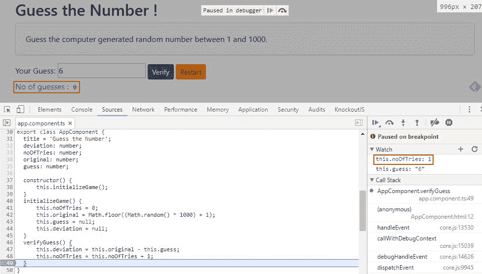

# 入门

在 JavaScript 中开发应用程序始终是一个挑战。由于其可塑性和缺乏类型检查，构建一个相当大的 JavaScript 应用程序是困难的。此外，我们使用 JavaScript 进行各种过程，如**用户界面（UI）**操作、客户端-服务器交互以及业务处理/验证。结果，我们得到了难以维护和测试的意大利面代码。

类似于 jQuery 这样的库在处理各种浏览器怪癖和提供可以减少代码行数的结构方面做得很好。然而，这些库缺乏任何结构性的指导，这在我们代码库`/增长`时能帮助我们。

近年来，JavaScript 框架已经出现以管理这种复杂性。许多这些框架，包括 Angular 的早期版本，使用一种称为**模型-视图-控制器（MVC）**的设计模式来将应用程序的元素分割成更易于管理的部分。这些框架的成功以及它们在开发者社区中的流行确立了使用这种模式的价值。

Web 开发，然而，一直在不断演变，自从 2009 年 Angular 首次推出以来已经发生了很大变化。诸如 Web 组件、JavaScript 的新版本（ES2015）和 TypeScript 等技术都已经出现。综合来看，它们为我们提供了构建一个新、前瞻性框架的机会。而随着这个新框架的出现，也带来了一种新的设计模式——组件模式。

本章致力于理解组件模式，以及如何在构建一个简单的 Angular 应用时将其付诸实践。

本章我们将涵盖以下主题：

+   **Angular 基础知识**：我们将简要介绍用于构建 Angular 应用的组件模式。

+   **构建我们的第一个 Angular 应用**：我们将使用 Angular 构建一个小游戏——“猜数字！”

+   **一些 Angular 构造的介绍**：我们将回顾 Angular 中使用的一些构造，例如插值、表达式和数据绑定语法。

+   **变更检测**：我们将讨论在 Angular 应用中如何管理变更检测。

+   **工具和资源**：最后，我们将提供一些在 Angular 开发和调试过程中会很有用的资源和工具。

# Angular 基础知识

让我们从了解 Angular 如何实现组件模式开始。

# 组件模式

Angular 应用使用组件模式。你可能没有听说过这种模式，但它无处不在。它不仅用于软件开发，还用于制造、建筑和其他领域。简单来说，它涉及将较小的、离散的构建块组合成更大的成品。例如，电池是汽车的一个组件。

在软件开发中，组件是逻辑单元，可以组合成更大的应用程序。组件通常具有内部逻辑和属性，这些逻辑和属性被屏蔽或隐藏在更大的应用程序中。然后，更大的应用程序通过称为**接口**的特定网关消耗这些构建块，这些接口仅公开使用组件所需的内容。这样，只要接口没有改变，就可以修改组件的内部逻辑，而不会影响更大的应用程序。

回到我们的电池例子，汽车通过一系列连接器消耗电池。然而，如果电池耗尽，只要新电池有相同的连接器，就可以完全更换。这意味着汽车制造商不必担心电池的内部结构，这简化了汽车制造的过程。更重要的是，车主不必每次电池耗尽时都更换他们的汽车。

为了扩展这个类比，电池制造商可以将它们推广到各种不同的车辆上，例如 ATV、船只或雪地摩托车。因此，组件模式使它们能够实现更大的规模经济。

# 在 Web 应用程序中使用组件模式

随着 Web 应用程序变得越来越复杂，能够用更小、更离散的组件构建它们的必要性变得更加迫切。组件允许以防止应用程序变成一团乱麻代码的方式构建应用程序。相反，基于组件的设计允许我们独立于其他部分对应用程序的特定部分进行推理，然后我们可以通过约定的连接点将应用程序缝合成一个完整的成品。

此外，维护成本较低，因为每个组件的内部逻辑可以单独管理，而不会影响应用程序的其他部分。并且使用自描述组件组装应用程序使得在更高层次上理解应用程序变得更加容易。

# 为什么以前在 Angular 中没有使用组件？

如果这个想法如此合理，为什么组件模式没有被早期版本的 Angular 采用？答案是，Angular 最初发布时存在的技术并没有完全支持在 Web 应用程序中实现这种模式。

然而，Angular 的早期版本在实现更智能的 Web 应用程序设计和组织方向上迈出了实质性的步伐。例如，它们实现了 MVC 模式，将应用程序分为模型、视图和控制（你将在我们将在 Angular 中构建的组件中看到 MVC 模式的持续使用）。

使用 MVC 模式，模型是数据，视图是一个网页（或移动应用屏幕，甚至 Flash 页面），控制器从模型中填充视图的数据。通过这种方式，实现了关注点的分离。遵循这个模式并智能地使用指令，可以使你非常接近组件。

因此，Angular 的早期版本允许以更逻辑的方式设计和构建应用程序。然而，这种方法受到所使用的技术并非真正隔离的限制。相反，它们最终都被渲染，没有任何真正的分离，与其他屏幕上的元素混合在一起。

# 什么新特性使得 Angular 能够使用组件模式？

相比之下，Angular 的最新版本拥抱了最近兴起的科技，这使得更全面地实现组件模式成为可能。这些技术包括 Web Components、ES2015（JavaScript 的新版本）和 TypeScript。让我们讨论一下这些技术各自为这个可能带来的贡献。

# Web Components

Web Components 是一个总称，实际上涵盖了四个针对网络浏览器的正在兴起的标准化：

+   自定义元素

+   阴影 DOM

+   模板

+   HTML 导入

更多关于 Web Components 的信息可以在[`www.webcomponents.org/introduction`](https://www.webcomponents.org/introduction)找到

现在我们将详细讨论这些内容：

+   **自定义元素**允许创建除标准 HTML 标签（如`<div>`和`<p>`）之外的新类型的 DOM 元素。你将在本书的各个部分看到这些自定义元素的使用。例如，我们在本章构建的应用程序将有一个名为`<app-root>`的根元素，但你也可以给它任何你喜欢的名字。单个组件也将使用自定义元素。例如，在接下来的章节中，我们将构建一个更复杂的应用程序，将屏幕分解成组件。页面的头部将使用自定义元素`<abe-header>`来显示其内容（前缀`abe`仅属于我们的应用程序，有助于避免与原生 HTML 元素或其他应用程序中的自定义元素发生命名冲突）。添加自定义标签的能力提供了一个屏幕上的位置，可以用于绑定组件。简而言之，这是将组件从页面其余部分分离出来并使其真正自包含的第一步。

+   **阴影 DOM**在页面上提供了一个隐藏区域，用于脚本、CSS 和 HTML。这个隐藏区域内的标记和样式不会影响页面的其余部分，同样重要的是，它们也不会受到页面其他部分标记和样式的影响。我们的组件可以使用这个隐藏区域来渲染其显示。因此，这是使我们的组件自包含的第二步。

+   **模板**是 HTML 片段，最初不会在网页中渲染，但可以在运行时通过 JavaScript 激活。许多 JavaScript 框架已经支持某种形式的模板。Web Components 标准化了这种模板，并在浏览器中直接提供支持。模板可以用来使我们的组件使用的 Shadow DOM 中的 HTML 和 CSS 动态化。因此，这是制作我们组件的第三步。

+   构成 Web Components 的最后一个标准是**HTML 导入**。它们提供了一种在单个包中加载资源（如 HTML、CSS 和 JavaScript）的方法。Angular 不使用 HTML 导入。相反，它依赖于 JavaScript 模块加载，我们将在本章稍后讨论这一点。

# Angular 和 Web Components

Web Components 在当前的网络浏览器中并未得到完全支持。因此，Angular 组件并不是严格意义上的 Web Components。可能更准确的说法是，Angular 组件实现了 Web Components 背后的设计原则。它们还使得构建能在当今浏览器中运行的组件成为可能。

在撰写本文时，Angular 支持 Chrome、Firefox、Safari 和 Edge 等 evergreen 浏览器，以及 IE 9 及以上版本。它还支持 Android 和 iOS。要查看 Angular 支持的浏览器列表，请访问[`angular.io/guide/browser-support.`](https://angular.io/guide/browser-support)

因此，在本书的剩余部分，我们将专注于构建 Angular 组件而不是 Web Components。尽管有这种区别，Angular 组件与 Web Components 非常接近，甚至可以与它们交互。随着浏览器开始更全面地支持 Web Components，Angular 组件与 Web Components 之间的差异将开始消失。所以，如果你想要开始采用未来的 Web Component 标准，Angular 为你提供了这样的机会。

# Angular 中的语言支持

你可以使用 ES5（所有当前浏览器支持的 JavaScript 版本）开发组件，但 Angular 通过添加对最新语言（如 ES2015 和 TypeScript）中找到的关键特性的支持，增强了开发组件的能力。

# ES2015

ES2015 是 JavaScript 的新版本；它在 2015 年 6 月获得批准。它为语言添加了许多改进，我们将在本书的整个过程中看到这些改进，但在此阶段最吸引我们注意的两个是以下内容：

+   类

+   模块加载

**类**在 JavaScript 中之前并不存在。现在它们存在后，使用它们的关键优势是它们提供了一个简单、清晰的语法，我们可以用它来创建方便的容器来存放组件中的代码。正如你将在本书中的应用程序开发中找到的那样。类还为我们的组件提供了一个方便的简写名称，这使得通过诸如依赖注入之类的手段将它们拼接在一起变得更加容易。

为了明确，JavaScript 类并没有引入完全新的东西。**Mozilla 开发者网络**（**MDN**）将它们描述为在 JavaScript 现有的基于原型的继承之上的主要语法糖。更多信息请访问[`developer.mozilla.org/en-US/docs/Web/JavaScript/Reference/Classes`](https://developer.mozilla.org/en-US/docs/Web/JavaScript/Reference/Classes)。

我们将在本书的示例中探索类。如果你没有使用过面向对象的语言，你可能对类不太熟悉，因此我们将随着本章的示例逐步介绍它们。

ES2015 还引入了一种新的模块加载方法。模块提供了一种封装 JavaScript 文件的方式。当它们被封装时，它们不会污染全局命名空间，并且可以以受控的方式与其他模块交互。

一旦我们定义了我们的模块，我们需要一种方法将它们加载到我们的应用程序中以执行。模块加载允许我们从构成 Angular 和我们创建或使用的其他组件的模块中选择我们需要的部分。

目前，存在一系列方法和库来支持 JavaScript 中的模块加载。ES2015 为加载模块添加了一种新的、一致的语法，作为语言的一部分。这种语法简单明了，涉及在模块前加上 `export` 关键字（或使用默认导出），然后在应用程序的其他地方使用 `import` 来消费它们。

ES 2015 模块加载使我们能够将组件组合成有用的包或功能，这些包或功能可以在我们的应用程序中导入或导出。实际上，模块是 Angular 本身的核心。我们将看到模块在 Angular 本身以及本书中构建的应用程序中都被广泛使用。

重要的是要理解，虽然 Angular 使用与 ES2015 模块加载语法相似的语法，但 Angular 模块（我们将在本章稍后讨论）并不等同于 JavaScript 模块。有关这些差异的更多详细信息，请参阅 Angular 文档[`angular.io/guide/architecture#ngmodules-vs-javascript-modules`](https://angular.io/guide/architecture#ngmodules-vs-javascript-modules)。

由于 ES2015 并非今天所有浏览器都完全支持，因此我们需要将 ES2015 转换为 ES5，以便在我们的应用程序中使用类和模块加载等功能。我们通过一个称为**转译**的过程来完成这项工作。

转译类似于编译，但与编译将我们的代码转换为机器语言不同，转译将一种源代码转换为另一种源代码。在这种情况下，它将 ES2015 转换为 ES5。有几个称为**转译器**的工具使我们能够做到这一点。常见的转译器包括 Traceur 和 Babel。TypeScript（我们将在下一节讨论）也是一个转译器，我们将使用它来本书中的示例。

一旦 ES2015 被转换为 ES5，我们就可以使用像**SystemJS**这样的模块加载器来加载我们的模块。**SystemJS**遵循 ES2015 的模块加载语法，并使我们能够在今天的浏览器中执行模块加载。或者，我们可以使用像**webpack**这样的模块打包器来加载和组合我们的模块。对于本书中的项目，我们将使用**webpack**来加载、打包和部署我们的应用程序中的模块。

自从 ES2015 发布以来，ECMAScript（JavaScript 的官方名称）新版本的发布周期已经变为每年一次——因此我们现在有了 ES2016 和 ES2017，很快我们还将有 ES2018。由于本书中强调的功能最初是在 ES2015 中引入的，因此我们将引用 ES2015 而不是任何更新的版本。然而，更新的版本与本书中强调的语言功能完全兼容。

# TypeScript

TypeScript 是由微软创建的，它是 JavaScript 的超集，这意味着它包含了 ES2015 的功能（如类和模块加载）并添加了以下内容：

+   类型

+   装饰器

**类型**允许我们在类中标记变量、属性和参数，以指示它们是数字、字符串、布尔值或各种结构，如数组和对象。这使得我们能够在设计时执行类型检查，以确保在我们的应用程序中使用正确的类型。

**装饰器**是我们可以使用`@`符号和函数添加到我们的类中的简单注释。它们为我们的类的使用提供了指令（称为元数据）。在 Angular 的情况下，装饰器允许我们将我们的类标识为 Angular 组件。装饰器还使我们能够指定一个自定义元素来绑定我们的组件，并识别一个模板，该模板为我们的组件添加 HTML 视图。随着我们通过本书的学习，我们将详细介绍装饰器的使用。

装饰器不是 ES2015 的一部分，但它是将它们包含在 JavaScript 语言未来版本中的一个提案的一部分。它们作为微软和谷歌合作的一部分被添加到 TypeScript 中。如前所述，TypeScript 编译成 ES5，因此我们能够在不完全支持 ES2015 或装饰器提议标准的浏览器中使用类型和装饰器。

如前所述，使用 ES2015 或 TypeScript 与 Angular 一起使用并非必需。然而，我们认为，随着我们通过本书中的示例进行，你会看到使用它们的优点。

# 将所有内容整合在一起

通过遵循 Web 组件标准并添加对 ES2015 和 TypeScript 的支持，Angular 使我们能够创建实现组件设计模式的 Web 应用程序。这些组件有助于实现通过自描述和自包含的构建块构建大型应用程序的愿景。

我们希望你在本书的示例中看到，Angular 使组件能够以简单和声明性的方式构建，这使得开发者更容易实现它们。随着我们通过本书中的示例进行，我们将突出显示这些技术被使用的位置。

# Angular 模块

组件是 Angular 应用程序的基本构建块。但我们是如何将这些构建块组织成完整的应用程序的呢？Angular 模块为这个问题提供了答案。它们使我们能够将我们的组件组合成可重用的功能组，这些组可以在整个应用程序中导出和导入。例如，在一个更复杂的应用程序中，我们可能希望有用于认证、通用工具和外部服务调用的模块。同时，模块使我们能够以允许按需加载的方式对应用程序中的功能进行分组。这被称为懒加载，我们将在第四章“构建个人教练”中介绍这个主题。

每个 Angular 应用程序将有一个或多个包含其组件的模块。Angular 引入了`NgModule`作为方便指定构成模块的组件的方式。每个 Angular 应用程序都必须至少有一个这样的模块——根模块。

Angular 本身是作为模块构建的，我们将它们导入到我们的应用程序中。所以，当你构建 Angular 应用程序时，你将看到模块的广泛应用。

# 构建 Angular 应用程序的基本步骤

总结一下：在基本层面上，你会发现，要在 Angular 中开发应用程序，你需要做以下事情：

1.  创建组件

1.  将它们打包成模块

1.  引导你的应用程序

通过看到 Angular 和组件设计模式在实际中的应用来理解 Angular 和组件设计模式是最佳方式。因此，我们将使用 Angular 构建我们的第一个 Hello World 应用程序。这个应用程序将帮助你熟悉 Angular 框架，并看到组件设计模式在实际中的应用。

让我们开始做吧。

# 传统的 Hello Angular 应用程序 - 猜数字！

作为我们的第一个练习，我们希望保持简单，但仍然展示框架的能力。因此，我们将构建一个非常简单的游戏，名为*猜数字！*。游戏的目标是用尽可能少的尝试次数猜出一个随机生成的计算机数字。

这就是这个游戏的外观：


让我们现在构建“猜数字”！

# 构建“猜数字”！

在构建用户界面时，通常的做法是从上到下构建。首先设计 UI，然后根据需要插入数据和行为。采用这种方法，应用程序的 UI、数据和行为方面都紧密耦合，这并不是一个理想的情况！

基于组件的设计，我们的工作方式有所不同。我们首先查看 UI 和预期的行为，然后将其封装到一个我们称之为**组件**的构建块中。然后，这个组件被托管在我们的页面上。在组件内部，我们将 UI 分为视图，将行为分为类，并包含支持行为的适当属性和方法。如果您不熟悉类，请不要担心。随着我们通过示例的进展，我们将详细讨论它们是什么。

好的，那么让我们确定我们应用程序需要的 UI 和行为。

# 设计我们的第一个组件

为了确定我们的组件需要包含什么，我们将首先详细说明我们希望应用程序支持的功能：

+   生成随机数字（`original`）

+   为用户提供猜测值的输入（`guess`）

+   跟踪已经做出的猜测数量（`noOfTries`）

+   根据用户的输入（`偏差`）提供提示以改善他们的猜测

+   如果用户猜对了数字，显示成功消息（`偏差`）

现在我们有了我们的功能，我们可以确定我们需要向用户显示什么，以及我们需要跟踪哪些数据。对于前面的功能集，括号中的元素表示将支持这些功能的属性，并将需要包含在我们的组件中。

设计组件是一个非常关键的过程。如果做得正确，我们可以逻辑地组织我们的应用程序，使其易于理解和维护。

在构建任何应用程序时，我们强烈建议您首先考虑您想要提供的功能，然后是支持该功能的数据和行为。最后，考虑如何为它构建用户界面。这是一个无论您使用什么库或框架来构建应用程序都是良好的实践。

# 开发我们的第一个组件

现在我们已经为我们的第一个组件设计了方案，我们将开始使用**Angular 命令行界面**（**Angular CLI**）来开发它。Angular CLI 使我们能够通过一系列控制台命令开始构建 Angular 应用程序并将它们部署出去。我们将在未来的章节中更详细地介绍**Angular CLI**。目前，我们将安装它并使用它来生成一个基本的应用程序，作为我们第一个组件的起点。

要使用 **Angular CLI**，您必须首先安装 **Node.js** 和 **npm**（**Node** 的包管理器）。**Node** 可跨平台使用，您可以从 [`nodejs.org`](http://nodejs.org) 下载它。安装 **Node** 也会安装 **npm**。对于本书，我们使用 **Node.js** 版本 8.9.4 和 **npm** 版本 5.6.0。您可以在 [`docs.npmjs.com/getting-started/installing-node`](https://docs.npmjs.com/getting-started/installing-node) 找到有关安装 **Node** 和将 **npm** 更新到最新版本的更多信息。

一旦安装了 **Node** 和 **npm**，打开命令提示符并输入以下内容：

```js
npm install -g @angular/cli
```

这将安装我们将用于启动应用程序的 **Angular CLI**。现在，从您的本地机器上的一个目录中，输入以下命令：

```js
ng new guessthenumber --inlineTemplate
cd guessthenumber
ng serve
```

第一个命令将使用 **Angular CLI** 在您的本地机器上创建一个新的 Angular 项目（`--inlineTemplate` 标志在组件内部创建模板，这对于我们本章要展示的内容非常合适）。第二个命令将您导航到 **Angular CLI** 为您的新项目创建的目录。第三个命令启动应用程序，您可以在 `http://localhost:4200/` 上查看。如果您这样做，您应该在浏览器中看到一个标准的默认 Angular 页面。

# 安装 Bootstrap

在我们构建应用程序的具体细节之前，还有一步。让我们添加 Bootstrap 库来增强应用程序的外观和感觉。首先，通过在启动应用程序的终端中输入 *Ctrl* + *C* 来停止应用程序，并在被询问是否要终止批处理作业时输入 *Y*。然后从 `guessthenumber` 目录，输入以下命令：

```js
npm install bootstrap --save
```

这将安装 Bootstrap 的最新版本（在撰写本文时为版本 4.0.0）。您可能会看到一些关于未满足依赖项的警告消息。您可以忽略它们。

接下来配置您的项目以包含 Bootstrap 样式表：

1.  在 `guessthenumber` 目录中找到并打开文件 `angular.json`

1.  在该文件中找到 `projects` 属性，它包含我们新项目的设置

1.  然后找到 `architect.build.options` 中的 `styles` 属性，您会看到它包含一个数组，该数组包含 `styles.css`，这是新项目的默认样式表。

1.  将 `bootstrap.min.css` 样式表的路径添加到该数组中：

```js
"styles": [
   "node_modules/bootstrap/dist/css/bootstrap.min.css",
   "src/styles.css"
],
```

使用 **Angular CLI** 包含 Bootstrap 的说明可以在 [`github.com/angular/angular-cli/wiki/stories-include-bootstrap`](https://github.com/angular/angular-cli/wiki/stories-include-bootstrap) 找到。

# 我们目前有什么？

如果你查看`guessthenumber`目录，你会看到**Angular CLI**已经创建，你会看到大量的文件。一开始这可能会让你感到不知所措，但重要的是要理解**Angular CLI**只通过几个命令行语句就为我们生成了所有这些文件。这样，它使得开始使用 Angular 应用程序变得更加顺畅和容易。它从过程中移除了繁琐的工作，使我们能够以最小的努力构建和提供我们的应用程序。在本章中，我们将专注于我们为了创建应用程序需要接触的几个文件。

如果你正在使用 Internet Explorer 运行应用程序，你需要查看一个文件——`polyfill.ts`。这个文件添加了运行应用程序在 Internet Explorer 中所需的其他文件。你需要取消注释该文件中的几个部分以添加这些必要的文件。有关如何操作的说明包含在该文件本身中。

在转向构建我们应用程序的具体细节之前，让我们先看看一个关键的文件，这个文件将用于使我们的应用程序启动和运行。

下载示例代码

本书中的代码可在 GitHub 上找到，网址为[`github.com/chandermani/angular6byexample`](https://github.com/chandermani/angular6byexample)。它组织成检查点，允许你跟随我们的步骤逐步构建本书中的示例项目。本章要下载的分支是 GitHub 的分支：checkpoint1.1。在`guessthenumber`文件夹中查找我们在这里覆盖的代码。如果你不使用 Git，请从以下 GitHub 位置下载 Checkpoint 1.1 的快照（ZIP 文件）：[`github.com/chandermani/angular6byexample/tree/checkpoint1.1`](https://github.com/chandermani/angular6byexample/tree/checkpoint1.1)。在设置快照时，请参考`guessthenumber`文件夹中的`readme.md`文件。

# 主文件 - index.html

导航到`guessthenumber`目录中的`src`文件夹并打开`index.html`。你会看到以下内容：

```js
<!doctype html>
<html lang="en">
<head>
  <meta charset="utf-8">
  <title>Guessthenumber</title>
  <base href="/">

  <meta name="viewport" content="width=device-width, initial-scale=1">
  <link rel="icon" type="image/x-icon" href="favicon.ico">
</head>
<body>
  <app-root></app-root>
</body>
</html>
```

`index.html`是我们应用程序的主文件。当应用程序首次运行时，浏览器将启动它，并托管我们的应用程序组件。如果你有任何接触过 Web 开发，这个文件中的大部分 HTML 代码应该看起来很熟悉。它有标准的`html`、`head`和`body`标签，以及几个可选标签，其中一个是一个 viewport 的 meta 标签，它配置了应用程序在移动设备上的显示方式，另一个是链接到 Angular favicon 图像的链接，该图像将在加载应用程序的浏览器标签中显示。

# 自定义元素

然而，页面上还有一个可能对你来说不那么熟悉的标签：

```js
<app-root></app-root> 
```

这个标签是一个**自定义元素**。它指示 Angular 将我们构建的组件注入到何处。

*猜数字游戏!* 以及本书中的所有其他应用程序都已针对 Angular 6 最终版本进行了测试。

# 组件文件

现在，让我们转向构建我们应用程序的具体细节。鉴于之前对组件模式的讨论，你不会对这样做需要构建一个组件感到惊讶。在这种情况下，我们的应用程序足够简单，我们只需要一个组件（在本书的后面部分，你将看到在构建更复杂的应用程序时使用多个组件）。Angular CLI 已经为我们生成了一个组件文件。当然，该文件不包含我们应用程序的任何特定细节，因此我们需要对其进行修改。为此，导航到 `app` 目录下的 `src` 文件夹并打开 `app.component.ts`。

# 导入语句

在页面顶部，你会找到以下行：

```js
import { Component } from '@angular/core';
```

这是一个导入语句。它告诉我们将在组件中加载和使用哪些模块。在这种情况下，我们正在选择从 Angular 加载的一个模块：`Component`。Angular 有许多其他模块，但我们只加载所需的模块。

你会注意到，我们导入的位置并没有被标识为应用程序中的路径或目录。相反，它被标识为 `@angular/core`。Angular 已经被划分为以 `@angular` 为前缀的桶模块。

这些桶组合了逻辑上相关的几个模块。在这种情况下，我们表示我们想要导入 `core` 桶模块，它反过来又引入了 `Component` 模块。

Angular 文档将桶描述为**：**一种将多个 ES2015 模块的导出汇总到一个方便的 ES2015 模块中的方法。桶本身是一个 ES2015 模块文件，它重新导出其他 ES2015 模块的选定导出。

更多关于桶（barrel）的信息，请参阅 [`angular.io/guide/glossary#barrel`](https://angular.io/guide/glossary#barrel)。

# 装饰器

接下来，将开始于 `@Component` 的代码块替换为以下内容：

```js
@Component({
 selector: 'app-root',
 template: `
  <div class="container">
      <h2>Guess the Number !</h2>
        <div class="card bg-light mb-3">
           <div class="card-body">
              <p class="card-text">Guess the computer generated random number between 1 
                                                                          and 1000.</p>
           </div>
        </div>
       <div>
         <label>Your Guess: </label>
         <input type="number" [value]="guess" (input)="guess = $event.target.value" />
         <button (click)="verifyGuess()" class="btn btn-primary btn-sm">Verify</button>
         <button (click)="initializeGame()" class="btn btn-warning btn-
                                                               sm">Restart</button>
       </div>
      <div>
         <p *ngIf="deviation<0" class="alert alert-warning">Your guess is higher.</p>
         <p *ngIf="deviation>0" class="alert alert-warning">Your guess is lower.</p>
         <p *ngIf="deviation===0" class="alert alert-success">Yes! That's it.</p>
      </div>
      <p class="text-info">No of guesses :
        <span class="badge">{{noOfTries}}</span>
      </p>
  </div> 
  `
})
```

这是我们的组件装饰器，它直接放置在类定义之上，我们将在稍后讨论。`@` 符号用于标识装饰器。`@Component` 装饰器有一个名为 selector 的属性，你可能会惊讶地看到它被设置为我们的 HTML 页面中的 `<app-root>` 标签。这个设置告诉 Angular 将此组件注入到 HTML 页面中的该标签。

装饰器还有一个名为 `template` 的属性，这个属性用于标识我们组件的 HTML 标记。注意这里使用了反引号（由 ES2015 引入）来在多行中渲染模板字符串。或者，我们也可以设置一个 `templateUrl` 属性，它将指向一个单独的文件。

# 定义类

现在，将开始于 `export class AppComponent` 的代码块替换为以下内容：

```js
export class AppComponent {
  deviation: number;
  noOfTries: number;
  original: number;
  guess: number;

  constructor() {
      this.initializeGame();
  }
  initializeGame() {
      this.noOfTries = 0;
      this.original = Math.floor((Math.random() * 1000) + 1);
      this.guess = null;
      this.deviation = null;
  }
  verifyGuess() {
      this.deviation = this.original - this.guess;
      this.noOfTries = this.noOfTries + 1;
  }
}
```

如果你一直在使用 ES5 开发，这是所有当前浏览器都支持的 JavaScript 版本，你可能不熟悉这里类的使用。因此，我们将花几分钟时间来解释一下类由什么组成（对于那些使用面向对象编程语言（如 C# 或 Java）进行开发的你们来说，这应该是一个熟悉的地方）。

类文件包含我们将用于运行组件的代码。在顶部，我们给类一个名字，它是 `AppComponent`。然后，在括号内，我们有四行声明了我们类的属性。这些类似于 ES5 变量，我们将使用它们来保存我们需要运行应用程序的值（你会注意到这些是我们设计组件时确定的四个值）。

这些属性与标准 JavaScript 变量不同的地方在于，每个属性名称后面跟着 `:` 和一个数字。这些设置了属性的类型。在这种情况下，我们表明这四个属性将被设置为数字类型，这意味着我们期望所有这些属性的值都是数字。为我们的属性指定类型的能力是由 TypeScript 提供的，而在标准 JavaScript 中不可用。

随着我们向下移动，我们将看到三个带有名称的脚本块，后面跟着括号，然后是包含多行脚本的括号。这些是我们类的函数，它们包含我们的组件将支持的运算。它们与标准的 JavaScript 函数非常相似。

这些方法中的第一个是 `constructor()`，这是一个特殊的方法，当我们的组件实例首次创建时将会运行。在我们的例子中，当类被创建时，构造函数只做了一件事；它调用我们类中的另一个方法，称为 `initializeGame()`。

`initializeGame()` 方法使用赋值运算符 `=` 设置类中四个属性的起始值。我们将这些值设置为 `null` 或 `zero`，除了 `original`，我们使用随机数生成器来创建要猜测的数字。

该类还包含一个名为 `verifyGuess()` 的方法，该方法更新 `deviation` 和 `noOfTries` 属性。这个方法不是在组件类内部被调用的；相反，它将从视图中被调用，正如我们稍后更仔细地检查视图时将会看到的。你也会注意到，我们的方法通过在它们前面添加 `this` 来引用同一类中的属性。

# 模块文件

如我们之前提到的，每个 Angular 组件都必须包含在一个 Angular 模块中。这意味着我们至少必须在应用程序的根目录中添加至少一个 Angular 模块文件。我们称这个为**根模块**。对于像“猜数字！”这样的简单应用程序，根模块可能就是我们所需要的唯一模块。然而，随着 Angular 应用程序规模的增加，通常有多个按功能划分的 Angular 模块文件是有意义的。随着我们在本书后面的章节中构建更复杂的应用程序，我们将讨论这种情况。

让我们继续查看我们的 Angular 模块文件。同样，Angular CLI 已经为我们创建了此文件。在`src`文件夹中的`app`目录下打开`app.module.ts`，你会看到以下内容：

```js
import { BrowserModule } from '@angular/platform-browser';
import { NgModule } from '@angular/core';

import { AppComponent } from './app.component';

@NgModule({
  declarations: [
    AppComponent
  ],
  imports: [
    BrowserModule
  ],
  providers: [],
  bootstrap: [AppComponent]
})
export class AppModule { }
```

前两个语句导入了`BrowserModule`和`NgModule`。注意，虽然`NgModule`是从`@angular/core`导入的，但`BrowserModule`是从一个不同的模块导入的：`@angular/platform-browser`。这里重要的是，导入不是来自`@angular/core`，而是来自一个专门针对基于浏览器的应用程序的独立模块。这是一个提醒，Angular 可以支持除浏览器以外的设备，因此需要将`BrowserModule`放入一个单独的模块中。

此文件中的另一个导入是我们自己的组件`AppComponent`。如果你回到那个组件，你会注意到在类定义前添加了`export`，这意味着我们正在使用我们自己的应用程序中的模块加载。

接下来，我们定义一个新的组件`AppModule`。在类本身中除了几个导入和一个装饰器`@ngModule`之外，没有其他内容。我们可以使用这个装饰器来配置我们的应用程序模块。第一个属性是声明，通过这个属性我们提供了一个数组，其中包含了将在我们的应用程序中使用的组件。在这种情况下，我们只有一个组件：`AppComponent`。

接下来，我们添加了导入，其中包含`BrowserModule`。正如其名所示，这个模块将提供在浏览器中运行我们的应用程序所需的功能。下一个属性是`providers`。这个属性用于注册提供者（如服务和其他对象），这些提供者将通过依赖注入在整个应用程序中可用。在我们构建的简单应用程序中，我们没有必要使用提供者，因此这个属性是空的。我们将在第三章“更多 Angular – SPA，路由”中详细讨论提供者和依赖注入。

最后，我们设置了`bootstrap`属性。这表示当我们的应用程序启动时将首先加载的第一个组件。再次强调，这是`AppComponent`。

在此配置就绪后，我们现在可以引导我们的组件了。

# 引导启动

`AppComponent`的类定义作为组件的蓝图，但其中的脚本在创建组件实例之前不会运行。为了运行我们的应用，我们需要在应用中添加一些代码来启动组件。完成这个过程需要我们添加启动组件的代码。

在`src`文件夹中，寻找一个名为`main.ts`的文件。打开它，您将看到以下代码：

```js
import { enableProdMode } from '@angular/core';
import { platformBrowserDynamic } from '@angular/platform-browser-dynamic';

import { AppModule } from './app/app.module';
import { environment } from './environments/environment';

if (environment.production) {
  enableProdMode();
}

platformBrowserDynamic().bootstrapModule(AppModule)
  .catch(err => console.log(err));
```

如您所见，我们正在从`@angular/core`导入`enableProdMode`，以及从`@angular/platform-browser-dynamic`导入`platformBrowserDynamic`模块。就像在`appModule`文件中导入`BrowseModule`一样，这个后者的导入专门用于基于浏览器的应用。接下来，我们添加了对我们的`AppModule`和一个位于应用`environments`目录中的名为`environment`的文件的导入。

在接下来的代码行中，我们检查`environment`文件中的常量`environment`是否将其`production`属性设置为`true`，如果是，则调用`enableProdMode()`，正如其名称所暗示的，这将启用生产模式。`environment.production`的默认设置是`false`，这对于我们的目的来说很合适，因为我们不是在生产模式下运行应用。

如果您打开`environments.ts`，您将看到一些注释，这些注释提供了在构建过程中覆盖此文件设置的指导。我们不会在第二章“构建我们的第一个应用 – 7 分钟健身”中涵盖 Angular 的构建过程；因此，我们在这里不会涉及该材料。

最后，我们使用`platformBrowserDynamic().boostrapModule`方法并传入我们的`AppModule`作为参数。然后，`bootstrapModule`方法创建了一个新的`AppModule`组件实例，它反过来初始化我们的`AppComponent`，这是我们标记为启动组件的。它是通过调用我们组件的构造函数方法来做到这一点的。

# 我们已经启动并运行了！

好吧，应用已经完成，准备进行测试！再次从`guessthenumber`目录中输入以下命令：

```js
    ng serve
```

应用应该会出现在您的浏览器上。

如果你在运行应用时遇到困难，可以在 GitHub 上查看可用的工作版本，链接为[`github.com/chandermani/angular6byexample`](https://github.com/chandermani/angular6byexample)。如果你不使用 Git，可以从以下 GitHub 位置下载 Checkpoint 1.1 的快照（ZIP 文件）：[`github.com/chandermani/angular6byexample/tree/checkpoint1.1`](https://github.com/chandermani/angular6byexample/tree/checkpoint1.1)。在首次设置快照时，请参考`guessthenumber`文件夹中的`readme.md`文件。

如果我们浏览一下组件文件和模板，我们应该会对我们所取得的成就感到非常震撼。我们在应用运行时并没有编写任何代码来更新 UI。尽管如此，一切运行得都非常完美。

# 深入挖掘

要理解这个应用程序在 Angular 环境中的工作方式，我们需要更深入地了解我们的组件。虽然组件中的类定义非常简单直接，但我们需要更仔细地查看模板中的 HTML，以了解 Angular 在这里是如何工作的。它看起来像标准的 HTML，但有一些新的符号，如 `[ ]`、`( )`、`{{` 和 `}}`。

在 Angular 的世界里，这些符号的含义如下：

+   `{{` 和 `}}` 是插值符号

+   `[ ]` 表示属性绑定

+   `( )` 表示事件绑定

显然，这些符号有一些附加的行为，并且似乎将视图 HTML 和组件代码连接起来。让我们尝试理解这些符号实际上做什么。

# 插值

请查看 `app.component.ts` 模板中的此 HTML 片段：

```js
<p class="text-info">No of guesses :  
  <span class="badge">{{noOfTries}}</span> 
</p> 
```

术语 `noOfTries` 被夹在两个插值符号之间。插值通过将插值标记的内容替换为插值符号内表达式的值（`noOfTries`）来实现。在这种情况下，`noOfTries` 是一个组件属性的名称。因此，组件属性的值将显示为插值标签内的内容。

插值使用以下语法声明：`{{expression}}`。这个表达式看起来类似于 JavaScript 表达式，但总是在组件的上下文中进行评估。请注意，我们没有做任何事情来传递属性的值到视图中。相反，插值标签直接从组件中读取属性的值，而不需要任何额外的代码。

# 跟踪尝试次数的变化

插值的一个有趣方面是，对组件属性的更改会自动与视图同步。运行应用程序并做出一些猜测；每次猜测后，`noOfTries` 的值都会改变，视图内容也会相应改变：


在我们需要查看模型状态的场景中，插值是一个出色的调试工具。有了插值，我们不必在代码中设置断点，只需知道组件属性的值。由于插值可以接受表达式，我们可以传递组件的方法调用或属性并查看其值。

# 表达式

在继续之前，我们需要花几分钟时间来理解 Angular 中的模板表达式是什么。

Angular 中的模板表达式不过是用于在它们使用的模板上下文中评估的纯 JavaScript 代码片段。但正如[`angular.io/docs/ts/latest/guide/template-syntax.html#template-expressions`](https://angular.io/docs/ts/latest/guide/template-syntax.html#template-expressions)文档所明确指出的，有一些差异：

+   赋值是被禁止的

+   `new` 运算符是被禁止的

+   按位运算符 `|` 和 `&` 不受支持

+   增量和减量运算符 `++` 和 `--` 不受支持

+   模板表达式运算符，如 `|` 和 `?.`，添加了新的含义

在基于组件的设计讨论中，您可能不会对文档也明确了一些事情感到惊讶；模板表达式不能：

+   引用全局命名空间中的任何内容

+   引用窗口或文档

+   调用 `console.log`

相反，这些表达式被限制在表达式上下文中，这通常是支持特定模板的组件实例。

然而，这些限制并不会阻止我们用表达式做一些巧妙的事情。正如我们可以在以下示例中看到，这些都是有效的表达式：

```js
// outputs the value of a component property 
{{property}} 

// adds two values 
{{ 7 + 9 }} 

//outputs the result of boolean comparison. Ternary operator 
{{property1 >=0?'positive': 'negative'}} 

//call a component's testMethod and outputs the return value 
{{testMethod()}} 
```

在了解了表达式之后，我们强烈建议您保持表达式简单，这样可以使 HTML 更易于阅读。`*ngIf="formHasErrors()"` 表达式总是比 `*ng-if="name==null || email==null || emailformatInValid(email) || age < 18"` 更好。因此，当表达式开始变得复杂时，请将其移动到组件中的方法中。

# 安全导航操作符

在我们继续之前，还有一个其他表达式我们应该讨论一下：Angular 安全导航操作符 (`?.`)。这个操作符提供了一个方便的方式来检查长属性路径中的空值，如下所示：

```js
{{customer?.firstName }} 
```

如果安全导航操作符发现空值（这里指客户），它会停止处理路径，但允许应用程序继续运行。如果没有它，应用程序在到达第一个空值（这里指客户名称）之后将会崩溃，视图将不会显示。安全导航操作符在您异步加载数据且数据可能无法立即提供给视图的情况下特别有用。安全导航操作符将防止应用程序崩溃，并在数据可用时加载数据。

# 数据绑定

学习插值和表达式很容易。现在让我们看看另一个框架结构，即我们示例应用中使用的数据绑定。我们将在接下来的章节中更详细地介绍数据绑定。在此阶段，我们只是简要地讨论我们正在构建的示例应用中使用的绑定。

# 属性绑定

如果我们查看 `app.component.ts` 中的模板，我们会看到几个使用方括号 `[ ]` 的地方。这些都是**属性绑定**。

让我们看看我们创建的第一个绑定：

```js
<input type="number" [value]="guess" (input)="guess = $event.target.value" />
```

这种绑定通过将组件类中 `guess` 属性的值与视图中的输入字段的 `value` 相链接来实现。绑定是动态的；因此，当 `guess` 属性的值发生变化时，输入字段的 `value` 也会同步到相同的值；我们不需要编写任何代码来做这件事。

在一开始，当我们初始化游戏时，这个属性在组件类的初始化方法中被设置为 null，所以我们不会在输入字段中看到任何内容。然而，随着游戏的进行，这个数字将随着猜测值的变化而更新。

# 事件绑定

再次查看 `app.component.ts` 中的模板，我们发现有几个地方出现了括号 `( )`。这些是 **事件绑定**。

让我们看看我们为这些事件绑定中的第一个创建的 HTML 代码行。它应该很熟悉，因为事件绑定是在我们最初查看属性绑定时相同的标签上：`input` 标签：

```js
<input type="number" [value]="guess" (input)="guess = $event.target.value" />
```

在这种情况下，输入元素的 `input` 事件绑定到一个表达式上。该表达式将我们的组件类中的 `guess` 属性设置为 `$event.target.value`，这是用户输入的值。在幕后，当我们使用这种语法时，Angular 为我们绑定的事件设置了一个事件处理器。在这种情况下，每当用户在 `input` 字段中输入一个数字时，处理器就会更新我们的组件类中的 `guess` 属性。

在我们的代码中还有其他几个地方出现了 `( )` 括号：

```js
<button (click)="verifyGuess()" class="btn btn-primary btn-sm">Verify</button>
<button (click)="initializeGame()" class="btn btn-warning    btn-sm">Restart</button>
```

这两个事件绑定将屏幕上按钮的 `click` 事件绑定到我们的组件中的方法。因此在这种情况下，在幕后，Angular 设置了直接绑定到我们的组件中方法的处理器。当点击验证按钮时，会调用 `verifyGuess` 方法，而当点击重启按钮时，会调用 `initializeGame` 方法。

在你通读这本书的示例时，你会看到很多将属性绑定中的 `[]` 标签与事件绑定中的 `()` 标签结合的地方。事实上，这种配对如此常见，以至于我们稍后将会看到，Angular 已经想出了一个简写语法来将这些标签合并为一个。

# 结构指令

接下来，我们将检查一些看起来类似于数据绑定但结合了之前我们没有见过的 Angular 功能的东西：**结构指令**：

```js
<div>
  <p *ngIf="deviation<0" class="alert alert-warning"> Your guess is higher.</p> 
  <p *ngIf="deviation>0" class="alert alert-warning"> Your guess is lower.</p>
  <p *ngIf="deviation===0" class="alert alert-success"> Yes! That's it.</p> 
</div> 
```

`<p>` 标签内的 `*ngIf` 是 `NgIf` 结构指令。结构指令允许我们操作 DOM 元素的结构。`NgIf` 指令根据分配给它的表达式的结果来删除或添加 DOM 元素。

前面的 `ngIf` 中的星号 `*` 是 Angular 在底层扩展为 `ng-template` 的简化语法，而 `ng-template` 是 Angular 对我们之前讨论过的 Web Components 模板的实现。我们将在下一章中学习更多关于这种语法和结构指令的内容。

在这种情况下，我们使用 `NgIf` 与一个简单的表达式，类似于我们看到的插值表达式。该表达式根据猜测的值及其与正确数字的关系（更高、更低或相等）解析为 `true` 或 `false`。然后它将该结果分配给 `NgIf`，这将根据结果为 `true` 时添加 DOM 元素，为 `false` 时删除它。

# 重新审视我们的应用

现在我们已经更仔细地研究了构成我们视图的内容，让我们再次看看我们的应用程序在运行时的样子。当我们运行应用程序时，Angular 绑定会在浏览器渲染我们视图中的原始 HTML 后启动。然后，框架编译这个视图模板，在这个过程中设置必要的绑定。接下来，它在我们组件类和视图模板之间进行必要的同步，以生成最终的渲染输出。以下截图展示了在为我们应用程序完成数据绑定后视图模板所发生的转换：


我们可以通过从输入框下方的段落中移除三个`*ngIf`指令及其分配的表达式，并在浏览器中刷新应用程序，来查看应用程序未转换的视图模板（如前一个截图左侧所示）。

Angular 与其他模板框架不同，其组件与其视图之间的绑定是动态的。对组件属性的更改会更新视图。Angular 永远不会重新生成 HTML；它只是在 HTML 的相关部分上工作，并仅更新需要根据组件属性更改而更改的 HTML 元素。这种数据绑定能力使 Angular 成为一个卓越的视图模板引擎。

# 查看我们的代码如何处理更新

如果我们回顾一下我们类的代码，我们会看到类中的属性和方法并不直接引用视图。相反，方法只是对类中的属性进行操作。因此，我们类的代码更易于阅读，因此更易于维护（当然，可测试）：


到目前为止，我们已经讨论了 Angular 如何根据组件属性的更改来更新视图。这是一个重要的概念，因为它可以让我们避免无数小时的调试和挫败感。下一节将专门介绍变更检测以及这些更新是如何管理的。

# 维护状态

首先，让我们看看如何在我们的 Angular 应用程序中维护状态。由于 Angular 应用程序是动态的而不是静态的，我们需要了解确保这些动态值随着应用程序数据的更新而保持更新的机制。例如，在我们的应用程序中，屏幕上的猜测次数是如何更新的？应用程序是如何根据用户输入决定显示关于猜测是否正确的正确消息的？

# 组件作为状态的容器

由于我们之前一直在强调 Angular 使用组件设计模式，因此你可能不会对知道应用程序状态的基本容器是组件本身而感到惊讶。这意味着当我们有一个组件实例时，组件中的所有属性及其值都可用于组件中引用的模板实例。在实践层面，这意味着我们可以在模板中直接使用这些值，而不需要编写任何管道代码来连接它们。

例如，在示例应用中，为了确定要显示的消息，我们可以在模板表达式中直接使用`deviation`。Angular 会扫描我们的组件以找到具有该名称的属性并使用其值。对于`noOfTries`也是如此；Angular 将在我们的组件内查找该属性的值，然后将其用于在模板的插值中设置其值。我们不需要编写任何其他代码：

```js
 <div>
    <p *ngIf="deviation<0" class="alert alert-warning"> Your guess is higher.</p>
    <p *ngIf="deviation>0" class="alert alert-warning"> Your guess is lower.</p>
    <p *ngIf="deviation===0" class="alert alert-success"&gt; Yes! That's it.</p></div> 
    <p class="text-info">No of guesses : 
      <span class="badge">{{noOfTries}}</span> 
    </p> 
</div>
```

# 变更检测

那么，Angular 是如何在运行时跟踪我们组件中的变更的呢？到目前为止，这似乎都是通过魔法完成的。我们只是设置了组件属性和方法，然后通过插值以及属性和事件绑定将它们绑定到视图上。Angular 完成其余的工作！

但这当然不是魔法发生的，为了有效地使用 Angular，你需要了解它是如何随着这些值的变化而更新它们的。这被称为**变更检测**，Angular 在执行这一操作时与之前的方法非常不同。

如果你使用浏览器中的调试工具遍历应用程序，你会看到变更检测是如何工作的。在这里，我们使用 Chrome 的开发者工具并监视`noOfTries`属性。如果你在`verifyGuess()`方法的末尾设置断点，你会看到当你输入一个猜测时，`noOfTries`属性会立即在到达断点时更新，如下所示：



一旦你越过断点，屏幕上的显示将更新为正确的猜测次数，如下面的截图所示：


在引擎盖下真正发生的事情是，Angular 正在响应应用程序中的事件，并使用变更检测器，这些检测器遍历每个组件，以确定是否有任何影响视图的变更发生。在这种情况下，事件是一个按钮点击。按钮点击生成的事件在组件上调用`verifyGuess()`方法，以更新`noOfTries`属性。

该事件触发了变更检测周期，该周期识别出在视图中使用的`noOfTries`属性已更改。因此，Angular 使用该属性的新值更新绑定到`noOfTries`的视图中的元素。

如您所见，这是一个多步骤的过程，其中 Angular 首先根据事件更新组件和域对象，然后运行变更检测，最后重新渲染已更改的视图元素。而且，它会在每个浏览器事件（以及其他异步事件，如 XHR 请求和定时器）上执行此操作。Angular 的变更检测是响应式的且单向的。

这种方法允许 Angular 只通过一次遍历变更检测图。这被称为 **单向数据绑定**，并且极大地提高了 Angular 的性能。

我们将在第八章“一些实用场景”中深入探讨 Angular 的变更检测。要了解 Angular 团队对这一过程的描述，请访问 [`vsavkin.com/two-phases-of-angular-2-applications-fda2517604be#.fabhc0ynb`](https://vsavkin.com/two-phases-of-angular-2-applications-fda2517604be#.fabhc0ynb)。

# 工具

工具使我们的生活变得简单，我们将分享一些工具，这些工具将帮助你在 Angular 开发的不同方面，从代码编写到调试：

+   **Visual Studio Code**: 这是 Microsoft 开发的新 IDE ([`code.visualstudio.com/`](https://code.visualstudio.com/))。它为 Angular 和 TypeScript 提供了出色的 IntelliSense 和代码补全支持。Visual Studio 2017 ([`www.visualstudio.com/`](https://www.visualstudio.com/)) 也包括对 Angular 和 TypeScript 的支持。

+   **IDE 扩展**: 市面上许多流行的 IDE 都有插件/扩展，使 Angular 开发变得容易。例如：

    +   **JetBrains WebStorm**: [`www.jetbrains.com/webstorm/`](https://www.jetbrains.com/webstorm/)

    +   **Angular2 Snippets for Sublime Text**: [`github.com/evanplaice/angular2-snippets`](https://github.com/evanplaice/angular2-snippets) 以及 **Sublime Text 的 TypeScript 插件** [`github.com/Microsoft/TypeScript-Sublime-Plugin`](https://github.com/Microsoft/TypeScript-Sublime-Plugin)

    +   **Angular 2 TypeScript snippets for Atom** [`atom.io/packages/angular-2-typescript-snippets`](https://atom.io/packages/angular-2-typescript-snippets) 和 **Atom 的 TypeScript 插件** [`atom.io/packages/atom-typescript`](https://atom.io/packages/atom-typescript)

+   **Angular 语言服务**：这是一款令人兴奋的新开发者工具，它为放置在组件装饰器或外部 HTML 文件中的 Angular 模板提供自动补全、错误检查和 F12 导航。您可以在 [`angular.io/guide/language-service`](https://angular.io/guide/language-service) 找到安装说明和有关该服务的更多信息。

+   **浏览器开发者控制台**：所有当前浏览器在 JavaScript 调试方面都有出色的功能。由于我们使用 JavaScript，我们可以设置断点、添加监视，并执行所有其他使用 JavaScript 可能执行的操作。请记住，许多代码错误仅通过查看浏览器的控制台窗口就可以检测到。

+   **Augury** ([`augury.angular.io/`](https://augury.angular.io/))：这是一个用于调试 Angular 应用程序的 Chrome Dev Tools 扩展。

+   组件供应商也开始提供对 Angular 的支持。例如，Telerik 发布了 Kendo UI for Angular：[`www.telerik.com/kendo-angular-ui/`](http://www.telerik.com/kendo-angular-ui/).

# 资源

Angular 是一个新的框架，但已经有一个充满活力的社区开始围绕它形成。与这本书一起，还有博客、文章、支持论坛以及大量的帮助。以下是一些有用的突出资源：

+   **框架代码和文档**：Angular 的文档可以在[`angular.io/docs`](https://angular.io/docs)找到。然后，还有 Angular 的源代码，这是一个很好的学习资源。它可以在[`github.com/angular/angular`](https://github.com/angular/angular)找到。

+   **Angular 团队博客**：您可以通过 Angular 团队博客了解有关 Angular 的更多信息，网址为[`blog.angular.io/`](https://blog.angular.io/).

+   **Awesome Angular**：**精选的 Angular 资源列表**：这是一个由社区驱动的努力，维护在[`github.com/gdi2290/awesome-angular`](https://github.com/gdi2290/awesome-angular).

+   **Angular gitter 聊天室** (**[`gitter.im/angular/angular`](https://gitter.im/angular/angular)**)非常活跃。同时，您也可以在**Reddit**上查看**Angular**的相关内容：[`www.reddit.com/r/Angular`](https://www.reddit.com/r/Angular).

+   **Angular Google 群组** ([`groups.google.com/forum/#!forum/angular`](https://groups.google.com/forum/#!forum/angular))和**Stack Overflow 频道** ([`stackoverflow.com/questions/tagged/Angular`](http://stackoverflow.com/questions/tagged/Angular))：如果您有任何问题或遇到某些问题，请前往这里。

+   **Angular Expo** ([`angularexpo.com/`](http://angularexpo.com/))：人们使用 Angular 创建了一些令人惊叹的应用程序。这个网站展示了这些应用程序，其中大部分都提供了可供我们查看的源代码。

就这样！这一章已经完成，现在是时候总结您所学的内容了。

# 摘要

旅程已经开始，我们已经达到了第一个里程碑。尽管这一章名为“入门”，但我们已经涵盖了您为了理解整体概念所需了解的大量概念。您的学习来自于我们构建并剖析整章的“猜数字”应用程序。

您学习了 Angular 如何使用 Web Components 的兴起标准和 JavaScript 和 TypeScript 的最新版本来实现组件设计模式。我们还回顾了 Angular 中使用的一些结构，例如插值、表达式和数据绑定语法。最后，我们探讨了变更检测以及一些有助于您开始 Angular 开发的实用工具和资源。

基础工作已经完成，现在我们准备在 Angular 框架上进行一些严肃的应用程序开发。在下一章中，我们将开始处理一个更复杂的练习，并接触许多新的 Angular 构造。
