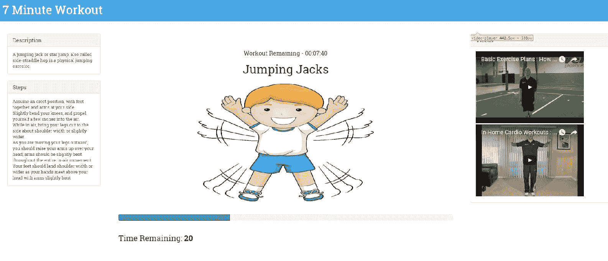
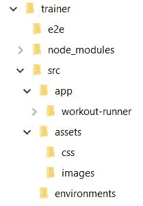
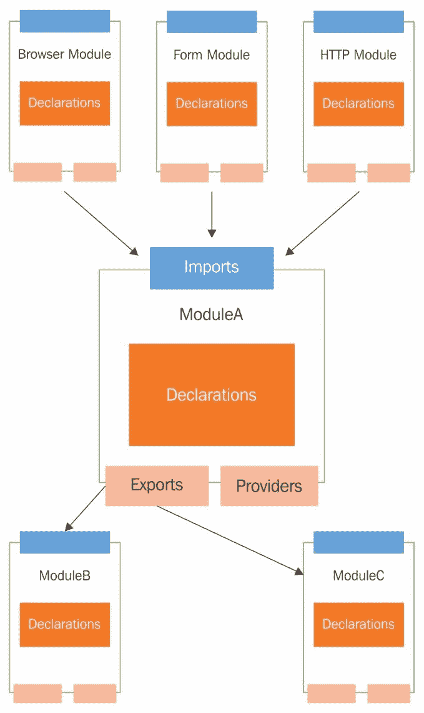
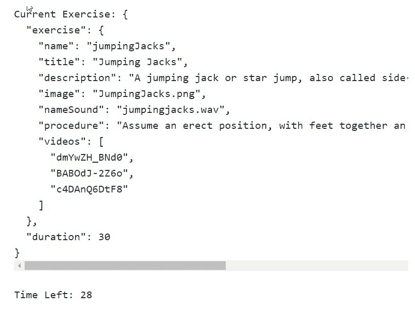
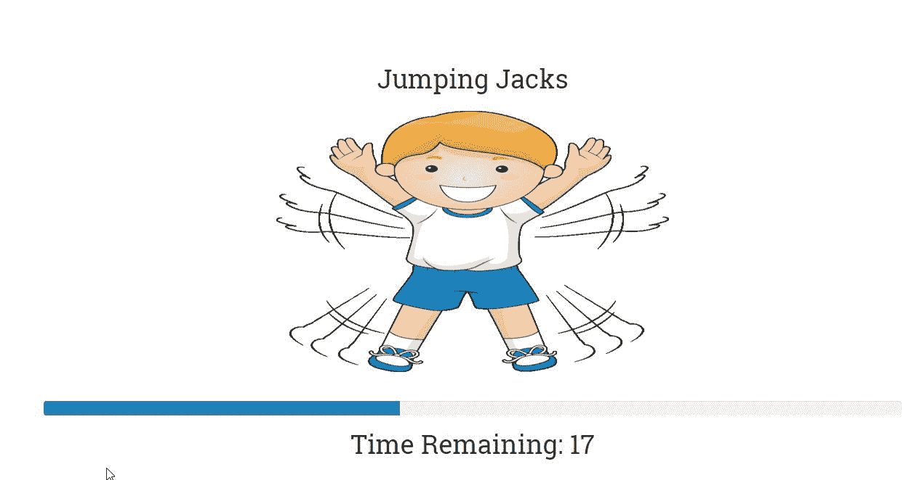
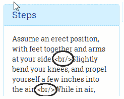
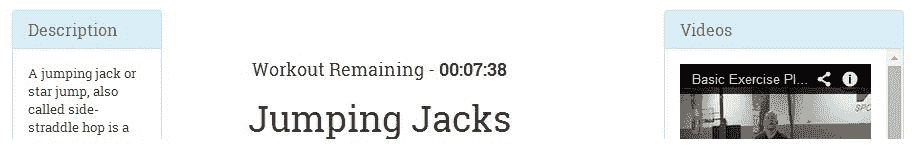
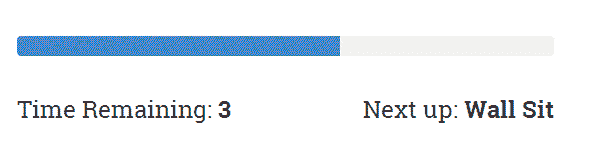
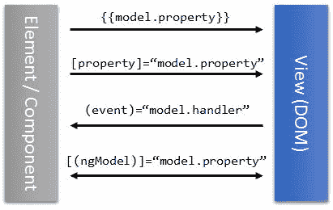

# 构建我们的第一个应用 – 7 分钟健身

我希望第一章足够吸引人，让你想要了解更多关于 Angular 的知识——相信我，我们只是触及了表面！这个框架有很多东西可以提供，与 TypeScript 一起，它致力于使前端开发更加有组织，因此更容易管理。

按照本书的主题，我们将使用 Angular 构建一个新的应用，在这个过程中，我们将更加熟悉这个框架。这个应用也将帮助我们探索 Angular 的一些新功能。

本章我们将涵盖以下主题：

+   **7 分钟健身问题描述**：我们详细说明了本章中构建的应用的功能。

+   **代码组织**：对于我们的第一个真实应用，我们将尝试解释如何组织代码，特别是 Angular 代码。

+   **设计模型**：我们应用的一个构建块是其模型。我们根据应用的需求设计应用模型。

+   **理解数据绑定基础设施**：在构建 *7 分钟健身* 视图时，我们将查看框架的数据绑定功能，包括 *属性*、*属性*、*类*、*样式* 和 *事件* 绑定。

+   **探索 Angular 平台指令**：我们将涵盖的一些指令包括 `ngFor`、`ngIf`、`ngClass`、`ngStyle` 和 `ngSwitch`。

+   **使用输入属性进行跨组件通信**：当我们构建嵌套组件时，我们学习如何使用输入属性将数据从父组件传递到其子组件。

+   **使用事件进行跨组件通信**：Angular 组件可以订阅和触发事件。我们了解了 Angular 中的事件绑定支持。

+   **Angular 管道**：Angular 管道提供了一种格式化视图内容的方式。我们探讨了几个标准的 Angular 管道，并构建了自己的管道以支持秒到 hh:mm:ss 的转换。

让我们开始吧！我们首先要做的是定义我们的 *7 分钟健身* 应用。

# 什么是 7 分钟健身？

我们希望所有阅读这本书的人都身体健康。因此，这本书应该具有双重目的；它不仅应该刺激你的大脑，还应该敦促你关注你的身体健康。还有什么比构建一个针对身体健康的应用更好的方式呢！

*7 分钟健身* 是一个锻炼/健身应用，要求我们在七分钟的时间范围内快速连续完成一组 12 个练习。由于其短小精悍的长度和巨大的益处，*7 分钟健身* 已经变得相当受欢迎。我们无法证实或反驳这些说法，但进行任何形式的剧烈体育活动都比什么都不做要好。如果你想了解更多关于这个健身的信息，那么请查看 [`well.blogs.nytimes.com/2013/05/09/the-scientific-7-minute-workout/`](http://well.blogs.nytimes.com/2013/05/09/the-scientific-7-minute-workout/)。

该应用的技术细节包括执行一组 12 个练习，每个练习分配 30 秒。在开始下一个练习之前，会有一个简短的休息期。对于我们要构建的应用，我们将休息 10 秒。因此，总时长略超过七分钟。

在本章结束时，我们将拥有一个准备好的**7 分钟健身**应用，其外观可能如下所示：



7 分钟健身应用

# 下载代码库

该应用的代码可以从专门为此书建立的 GitHub 网站([`github.com/chandermani/angular6byexample`](https://github.com/chandermani/angular6byexample))下载。由于我们是逐步构建应用，我们创建了多个**检查点**，这些检查点对应于**GitHub 分支**，如`checkpoint2.1`、`checkpoint2.2`等。在叙述过程中，我们将突出显示这些分支以供参考。这些分支将包含到那个时间点为止在应用上所做的所有工作。

**7 分钟健身**的代码位于名为`trainer`的仓库文件夹中。

那么，让我们开始吧！

# 设置构建环境

记住，我们正在构建一个现代平台，而浏览器对此仍缺乏支持。因此，直接在 HTML 中引用脚本文件是不可能的（虽然常见，但这是一个过时的方法，我们本应避免）。浏览器不理解**TypeScript**；这意味着必须有一个将用 TypeScript 编写的代码转换为标准**JavaScript (ES5**)的过程。因此，为任何 Angular 应用设置构建环境变得至关重要。而且，由于 Angular 日益流行，我们从不缺乏选择。

如果你是一名从事 Web 栈前端开发的开发者，你无法避免**Node.js**。这是最广泛使用的 Web/JavaScript 开发平台。因此，无需猜测，大多数 Angular 构建解决方案都由 Node 支持。例如**Grunt**、**Gulp**、**JSPM**和**webpack**是任何构建系统的最常见构建模块。

由于我们也是在 Node.js 平台上进行开发，因此在开始之前请先安装 Node.js。

对于本书和这个示例应用，我们推荐**Angular CLI**([`bit.ly/ng6be-angular-cli`](http://bit.ly/ng6be-angular-cli))。这是一个命令行工具，它具有构建系统和脚手架工具，极大地简化了 Angular 的开发工作流程。它很受欢迎，易于设置，易于管理，并支持现代构建系统应该拥有的几乎所有功能。关于它的更多信息将在后面介绍。

就像任何成熟的框架一样，Angular CLI 并不是网络上的唯一选择。社区创建的一些值得注意的起始网站和构建设置如下：

| **起始网站** | **位置** |
| --- | --- |
| `angular2-webpack-starter` | [`bit.ly/ng2webpack`](http://bit.ly/ng2webpack) |
| `angular-seed` | [`github.com/mgechev/angular-seed`](https://github.com/mgechev/angular-seed) |

让我们从安装 Angular CLI 开始。在命令行中，输入以下内容：

```js
npm i -g @angular/cli
```

安装完成后，Angular CLI 将在我们的执行环境中添加一个新的命令 `ng`。要从命令行创建一个新的 Angular 项目，请运行以下命令：

```js
ng new PROJECT-NAME
```

这将生成一个包含大量文件、一个模板化的 Angular 应用和一个预配置的构建系统的文件夹结构。要从命令行运行应用程序，请执行以下操作：

```js
ng serve --open
```

你可以看到一个基本的 Angular 应用正在运行！

对于我们的 *7 分钟健身* 应用，我们不会从头开始，而是从一个基于 `ng new` 生成的项目结构稍作修改的版本开始。以下是一些步骤：

好奇默认项目包含什么吗？运行 `ng new 项目名称`。查看生成的内容结构和 Angular CLI 文档，以了解默认设置中包含的内容。

1.  从 [`bit.ly/ngbe-base`](http://bit.ly/ngbe-base) 下载此应用的基版，并将其解压到您的机器上的某个位置。如果您熟悉 Git 的工作方式，您可以直接克隆存储库并切换到 `base` 分支：

```js
git checkout base
```

这段代码是我们应用的开端。

1.  使用命令行导航到 `trainer` 文件夹，并执行命令 `npm install` 以安装我们应用的 **包依赖**。

在 Node.js 世界中，**包**是用于应用或支持应用构建过程的第三方库（例如，我们的应用中使用 Angular）。**npm** 是一个用于从远程仓库拉取这些包的命令行工具。

1.  一旦 npm 从 npm 存储库中拉取了应用依赖，我们就可以构建和运行应用了。从命令行输入以下命令：

```js
    ng serve --open
```

这会编译并运行应用。如果构建过程顺利，默认的浏览器窗口/标签页将打开一个基本的网页（`http://localhost:4200/`）。我们现在可以开始使用 Angular 开发我们的应用了！

但在我们这样做之前，了解一些关于 Angular CLI 和我们对默认项目模板所做的自定义将很有趣。

# Angular CLI

**Angular CLI** 的创建目的是为了标准化和简化 Angular 应用的开发和部署工作流程。正如文档所建议的：

"Angular CLI 使得创建一个即开即用的应用变得简单。它已经遵循我们的最佳实践！"

它包含：

+   基于 **webpack** 的构建系统

+   一个用于生成所有标准 Angular 艺术品的 **脚手架工具**，包括模块、指令、组件和管道

+   遵循 **Angular 风格指南** ([`bit.ly/ngbe-styleguide`](http://bit.ly/ngbe-styleguide))，确保我们使用社区驱动的标准来处理各种规模的项目

你可能从未听说过风格指南这个术语，或者可能不理解它的意义。在任何技术中，风格指南都是一系列指导原则，帮助我们组织编写易于开发、维护和扩展的代码。要理解和欣赏 Angular 自己的风格指南，对框架本身有一定的熟悉度是可取的，我们已经开始了这段旅程。

+   一个**目标式代码检查器**；Angular CLI 集成了**codelyzer**([`bit.ly/ngbe-codelyzer`](http://bit.ly/ngbe-codelyzer))，这是一个**静态代码分析工具**，它将我们的 Angular 代码与一系列规则进行验证，以确保我们编写的代码遵循 Angular 风格指南中规定的标准。

+   预配置的**单元测试**和**端到端测试**（**e2e**）框架

以及更多！

想象一下，如果我们必须手动完成所有这些工作！陡峭的学习曲线会很快让我们感到不知所措。幸运的是，我们不必处理它，Angular CLI 会为我们处理。

Angular CLI 的构建设置基于 webpack，但它不暴露底层的 webpack 配置；这是故意的。Angular 团队希望保护开发者免受 webpack 的复杂性和内部工作原理的影响。Angular CLI 的最终目标是消除任何入门级障碍，并使设置和运行 Angular 代码变得简单。

这并不意味着 Angular CLI 不可配置。有一个*配置文件*（`angular.json`），我们可以用它来修改构建设置。我们在这里不会介绍这个。请检查 7 分钟健身计划的配置文件，并在此处阅读文档：[`bit.ly/ng6be-angular-cli-config`](http://bit.ly/ng6be-angular-cli-config)。

我们对默认生成的项目模板所做的调整包括：

+   在`style.css`文件中引用了 Bootstrap CSS。

+   升级了一些 npm 库的版本。

+   将生成的代码的前缀配置更改为使用`abe`（代表 Angular By Example），而不是`app`。这个更改意味着所有我们的组件和指令选择器都将使用`abe`作为前缀，而不是`app`。检查`app.component.ts`；选择器是`abe-root`而不是`app-root`。

在讨论 Angular CLI 和构建时，我们在继续之前应该了解一些事情。

*我们编写的 TypeScript 代码会发生什么？*

# 代码转译

浏览器，众所周知，只支持 JavaScript，它们不理解 TypeScript。因此，我们需要一个机制将我们的 TypeScript 代码转换为纯 JavaScript（**ES5**是我们的最佳选择）。**TypeScript 编译器**负责这项工作。编译器将 TypeScript 代码转换为 JavaScript。这个过程通常被称为**转译**，由于 TypeScript 编译器执行这个操作，因此被称为**转译器**。

JavaScript 语言在过去的几年中不断发展，每个新版本都为语言添加了新的功能/能力。最新的版本 ES2015 继承了 ES5，是语言的一次重大更新。尽管于 2015 年 6 月发布，但一些较旧的浏览器仍然不支持 ES2015 版本的 JavaScript，这使得其采用成为一项挑战。

当将 TypeScript 代码转换为 JavaScript 代码时，我们可以指定要使用的 JavaScript 版本。如前所述，ES5 是我们的最佳选择，但如果我们打算只与最新的浏览器合作，可以选择 ES2015。对于 7 分钟健身应用，我们将代码转换为 ES5 格式。我们在 `tsconfig.json` 中设置了此 TypeScript 编译器配置（请参阅 `target` 属性）。

有趣的是，转换可以在构建/编译时和运行时发生：

+   **构建时转换**：构建过程中的转换将脚本文件（在我们的例子中是 TypeScript `.ts` 文件）编译成纯 JavaScript。Angular CLI 执行构建时转换。

+   **运行时转换**：这发生在浏览器运行时。我们直接引用 TypeScript 文件（在我们的例子中是 `.ts` 文件），并且 TypeScript 编译器，在浏览器中预先加载，会即时编译这些脚本文件。这种设置仅适用于小型示例/代码片段，因为加载转换器和即时转换代码会带来额外的性能开销。

转换过程不仅限于 TypeScript。所有针对 Web 的语言，如 **CoffeeScript**、**ES2015**（是的，JavaScript 本身！）或任何浏览器本身无法理解的任何其他语言，都需要转换。大多数语言都有转换器，其中最著名的是（除了 TypeScript 之外）**tracuer** 和 **babel**。

Angular CLI 构建系统负责设置 TypeScript 编译器，并设置文件监视器，每次我们更改 TypeScript 文件时都会重新编译代码。

如果你刚接触 TypeScript，请记住 TypeScript 不依赖于 Angular；实际上，Angular 是基于 TypeScript 构建的。我强烈建议你查看 TypeScript 的官方文档（[`www.typescriptlang.org/`](https://www.typescriptlang.org/)）并在 Angular 的范畴之外学习这门语言。

让我们回到我们正在构建的应用程序，并开始探索代码设置。

# 代码组织

Angular CLI 的优势在于它规定了适用于所有规模应用程序的代码组织结构。以下是当前代码组织结构的样子：



+   `trainer` 是应用程序的根文件夹。

+   `trainer` 文件夹内的文件是配置文件和一些标准文件，它们是每个标准 Node 应用程序的一部分。

+   `e2e` 文件夹将包含应用程序的端到端测试。

+   `src` 是所有开发发生的主要文件夹。所有应用程序的工件都放入 `src`。

+   `src` 文件夹内的 `assets` 文件夹托管静态内容（例如图片、CSS、音频文件等）。

+   `app` 文件夹包含应用程序的源代码。

+   `environments` 文件夹用于为不同的部署环境（如 *dev、qa、production*）设置配置。

为了在 `app` 文件夹内组织 Angular 代码，我们借鉴了 Angular 团队发布的 Angular 风格指南（[`bit.ly/ng6be-style-guide`](http://bit.ly/ng6be-style-guide)）。

# 功能文件夹

风格指南建议使用**功能文件夹**来组织代码。使用功能文件夹，将链接到单个功能的文件放在一起。如果一个功能增长，我们将它进一步拆分为子功能，并将代码放入子文件夹中。将 `app` 文件夹视为我们的第一个功能文件夹！随着应用程序的增长，`app` 将添加子功能以更好地组织代码。

直接进入构建应用程序。我们的第一个重点领域，应用程序的模型！

# 7 分钟健身模型

设计该应用程序的模型需要我们首先详细说明 *7 分钟健身* 应用程序的功能方面，然后推导出一个满足这些要求的模型。根据之前定义的问题陈述，一些明显的要求如下：

+   能够开始锻炼。

+   提供关于当前练习及其进度的视觉提示。这包括以下内容：

    +   提供当前练习的视觉表示

    +   提供如何进行特定练习的逐步说明

    +   当前练习剩余时间

+   当锻炼结束时通知用户。

我们将添加到该应用程序的一些其他有价值的功能如下：

+   暂停当前锻炼的能力。

+   提供关于接下来要进行的练习的信息。

+   提供音频提示，以便用户可以在不经常查看屏幕的情况下进行锻炼。这包括：

    +   计时器点击声音

    +   关于下一项练习的详细信息

    +   信号表示练习即将开始

+   显示正在进行中的练习的相关视频，并能够播放它们。

如我们所见，该应用的核心主题是**锻炼**和**练习**。在这里，一个锻炼是一组按照特定顺序进行、持续特定时间的练习。因此，让我们继续定义我们的锻炼和练习模型。

根据刚刚提到的要求，我们将需要以下关于一项练习的详细信息：

+   名称。这应该是唯一的。

+   标题。这会显示给用户。

+   练习的描述。

+   如何执行练习的说明。

+   练习的图片。

+   练习音频片段的名称。

+   相关视频。

使用 TypeScript，我们可以为我们的模型定义类。

`Exercise` 类如下所示：

```js
export class Exercise { 
  constructor( 
    public name: string,
    public title: string,
    public description: string, 
    public image: string,
    public nameSound?: string,
    public procedure?: string,
    public videos?: Array<string>) { }
} 
```

TypeScript 小贴士

使用 `public` 或 `private` 声明构造函数参数是一种创建和初始化类成员的快捷方式。`nameSound`、`procedure` 和 `videos` 后的 `?` 后缀表示这些是可选参数。

对于锻炼，我们需要跟踪以下属性：

+   名称。这应该是唯一的。

+   标题。这会显示给用户。

+   组成锻炼的练习。

+   每个练习的时长。

+   两次练习之间的休息时间。

用于跟踪锻炼进度的模型类 (`WorkoutPlan`) 如下所示：

```js
export class WorkoutPlan { 
  constructor( 
    public name: string, 
    public title: string, 
    public restBetweenExercise: number, 
 public exercises: ExercisePlan[], 
    public description?: string) { } 

  totalWorkoutDuration(): number { ... } 
} 
```

`totalWorkoutDuration` 函数返回锻炼的总时长（以秒为单位）。

`WorkoutPlan` 在前面的定义中引用了另一个类，`ExercisePlan`。它跟踪锻炼和锻炼中的持续时间，一旦我们查看 `ExercisePlan` 的定义，这一点就非常明显：

```js
export class ExercisePlan { 
  constructor( 
    public exercise: Exercise, 
    public duration: number) { } 
} 
```

让我为您节省一些输入，并告诉您在哪里获取模型类，但在那之前，我们需要决定在哪里添加它们。我们已经准备好进行第一个功能。

# 第一个功能模块

*7 分钟锻炼* 的主要功能是执行预定义的练习集。因此，我们现在将创建一个功能模块，稍后会将功能实现添加到该模块中。我们称此模块为 `workout-runner`。让我们使用 Angular CLI 的脚手架功能初始化功能。

从命令行导航到 `trainer/src/app` 文件夹并运行以下命令：

```js
ng generate module workout-runner --module app.module.ts
```

跟踪控制台日志以了解生成的文件。该命令本质上：

+   在新的 `workout-runner` 文件夹内创建一个新的 Angular `WorkoutRunnerModule` 模块

+   将新创建的模块导入主应用程序模块 app (`app.module.ts`)

我们现在有一个新的 **功能模块**。

给每个功能创建自己的模块。

注意 Angular CLI 在构建 Angular 实体时遵循的约定。从前面的示例中，通过命令行提供的模块名称是 `workout-runner`。虽然生成的文件夹和文件名使用相同的名称，但生成的模块的类名是 `WorkoutRunnerModule`（Pascal 大写并带有 `Module` 后缀）。

打开新生成的模块定义文件 (`workout-runner.module.ts`) 并查看生成的内容。`WorkoutRunnerModule` 导入 `CommonModule`，这是一个包含常见 Angular 指令（如 `ngIf` 和 `ngFor`）的模块，允许我们在 `WorkoutRunnerModule` 中定义的任何组件/指令中使用这些常见指令。

模块是 Angular 组织代码的方式。我们将在稍后讨论 Angular 模块。

将 `model.ts` 文件从 [`bit.ly/ng6be-2-1-model-ts`](http://bit.ly/ng6be-2-1-model-ts) 复制到 `workout-runner` 文件夹。不久我们将看到这些模型类是如何被利用的。

由于我们从一个预配置的 Angular 应用程序开始，我们只需要了解应用程序是如何启动的。

# 应用程序启动

第一章，*入门*，对应用程序启动过程进行了良好的介绍。*7 分钟锻炼* 的应用程序启动过程保持不变；查看 `src` 文件夹。有一个 `main.ts` 文件通过调用以下内容启动应用程序：

```js
platformBrowserDynamic().bootstrapModule(AppModule)
    .catch(err => console.log(err));
```

重量级的工作由 Angular CLI 完成，它编译应用程序，将脚本和 CSS 引用包含到`index.html`中，并运行应用程序。我们不需要进行任何配置。这些配置是默认 Angular CLI 配置的一部分（`.angular-cli.json`）。

我们已经创建了一个新模块，并将一些模型类添加到`module`文件夹中。在我们进一步实施功能之前，让我们先谈谈**Angular 模块**。

# 探索 Angular 模块

随着 *7 分钟健身* 应用程序的增长，我们向其中添加了新的组件/指令/管道/其他工件，这就需要对这些项目进行组织。每个项目都需要成为 Angular 模块的一部分。

一种天真方法是在我们应用程序的根模块（`AppModule`）中声明一切，就像我们对`WorkoutRunnerComponent`所做的那样，但这违背了 Angular 模块的全部目的。

为了了解为什么单模块方法永远不会是一个好主意，让我们来探索 Angular 模块。

# 理解 Angular 模块

在 Angular 中，**模块**是将代码组织成属于一起并作为一个统一单元工作的块的方式。模块是 Angular 对代码分组和组织的方式。

一个 Angular 模块主要定义：

+   它拥有的组件/指令/管道

+   它公开的组件/指令/管道，供其他模块消费

+   它所依赖的其他模块

+   模块想要在应用程序范围内提供的服务

任何相当规模的 Angular 应用都将有模块相互链接：一些模块消费来自其他模块的工件，一些向其他模块提供工件，还有一些模块两者都做。

作为一项标准实践，模块隔离是基于功能的。人们将应用分为功能或子功能（对于大型功能），并为每个功能创建模块。甚至框架也遵循此指南，因为所有框架构造都分布在模块中：

+   存在`CommonModule`，它聚合了在所有基于浏览器的 Angular 应用中使用的标准框架构造。

+   如果我们想使用 Angular 路由框架，则存在`RouterModule`。

+   如果我们的应用需要通过 HTTP 与服务器通信，则存在`HtppModule`。

Angular 模块是通过将`@NgModule`装饰器应用于 TypeScript 类来创建的，这是我们已经在第一章 *入门* 中学到的。装饰器定义暴露了足够的元数据，使 Angular 能够加载模块引用的所有内容。

装饰器有多个属性，允许我们定义：

+   外部依赖（使用`imports`）。

+   模块工件（使用`declarations`）。

+   模块导出（使用`exports`）。

+   在模块内部定义并需要全局注册的服务（使用`providers`）。

+   主要应用程序视图，称为**根组件**，它托管所有其他应用程序视图。只有根模块应该使用`bootstrap`属性设置此属性。

此图突出了模块的内部结构以及它们是如何相互链接的：



在 Angular 的上下文中定义的模块（使用`@NgModule`装饰器）与我们通过 TypeScript 文件中的`import`语句导入的模块不同。通过`import`语句导入的模块是**JavaScript 模块**，可以是遵循*CommonJS*、*AMD*或*ES2015*规范的任何格式，而 Angular 模块是 Angular 用于隔离和组织其工件的结构。除非讨论的上下文是特定的 JavaScript 模块，否则任何关于模块的提及都指的是 Angular 模块。我们可以在这里了解更多信息：[`bit.ly/ng2be6-module-vs-ngmodule`](http://bit.ly/ng2be6-module-vs-ngmodule)。

我们希望从所有这些讨论中可以清楚地看出：除非你正在构建一些基础的东西，否则创建单个应用程序范围的模块不是正确使用 Angular 模块的方式。

是时候深入到行动的核心了；让我们构建我们的第一个组件。

# 我们的第一个组件 - WorkoutRunnerComponent

`WorkoutRunnerComponent`是我们*7 分钟锻炼*应用的核心部分，它将包含执行锻炼的逻辑。

在`WorkoutRunnerComponent`实现中，我们将做以下事情：

1.  开始锻炼

1.  展示正在进行的锻炼过程并显示进度指示器

1.  练习时间结束后，显示下一个练习

1.  重复此过程，直到所有练习结束

我们准备好创建（或搭建）我们的组件。

从命令行导航到`src/app`文件夹并执行以下`ng`命令：

```js
ng generate component workout-runner -is
```

生成器在`workout-runner`文件夹中生成一些文件（三个），并更新`WorkoutRunnerModule`中的模块声明，以包括新创建的`WorkoutRunnerComponent`。

`-is`标志用于停止为组件生成单独的 CSS 文件。由于我们使用全局样式，我们不需要组件特定的样式。

记住要从`src/app`文件夹运行此命令，而不是从`src/app/workout-runner`文件夹运行。如果我们从`src/app/workout-runner`运行前面的命令，Angular CLI 将为`workout-runner`组件定义创建一个新的子文件夹。

前面的`ng generate`命令为组件生成以下三个文件：

+   `<component-name>.component.html`：这是组件的视图 HTML。

+   `<component-name>.component.spec.ts`：用于单元测试的测试规范文件。我们将用完整的一章来介绍 Angular 应用程序的单元测试。

+   `<component-name>.component.ts`：包含组件实现的主体组件文件。

再次，我们将鼓励您查看生成的代码，以了解生成了什么。Angular CLI 组件生成器为我们节省了一些按键，一旦生成，样板代码可以按需演变。

在第一章“入门”中，我们提到了组件装饰器（`@Component`），这里应用的装饰器也没有什么不同。虽然我们只看到了四个装饰器元数据属性（例如`templateUrl`），但组件装饰器还支持一些其他有用的属性。查看 Angular 文档中的组件部分，了解更多关于这些属性及其应用的信息。在接下来的章节中，我们将利用一些除了每个组件上使用的标准属性之外的其他元数据属性。

一个细心的读者可能会注意到生成的`selector`属性值有一个前缀`abe`；这是故意的。由于我们正在扩展 HTML**领域特定语言**（**DSL**）以包含一个新元素，前缀`abe`帮助我们区分我们开发的 HTML 扩展。因此，我们不是在 HTML 中使用`<workout-runner></workout-runner>`，而是使用`<abe-workout-runner></abe-workout-runner>`。前缀值已在`angular.json`中配置，请参阅`prefix`属性。

总是为你的组件选择器添加一个前缀。

我们现在有了`WorkoutRunnerComponent`的模板；让我们开始添加实现，首先添加模型引用。

在`workout-runner.component.ts`中，导入所有锻炼模型：

```js
import {WorkoutPlan, ExercisePlan, Exercise} from '../model';
```

接下来，我们需要设置锻炼数据。让我们通过在生成的`ngOnInit`函数和相关类属性中添加一些代码到`WorkoutRunnerComponent`类中来实现这一点：

```js
workoutPlan: WorkoutPlan; 
restExercise: ExercisePlan; 
ngOnInit() { 
   this.workoutPlan = this.buildWorkout(); 
   this.restExercise = new ExercisePlan( 
     new Exercise('rest', 'Relax!', 'Relax a bit', 'rest.png'),  
     this.workoutPlan.restBetweenExercise);   
} 
```

`ngOnInit`是一个 Angular 在组件初始化时调用的特殊函数。我们很快就会讨论`ngOnInit`。

`WorkoutRunnerComponent`上的`buildWorkout`设置完整的锻炼，正如我们很快就会定义的。我们还初始化了一个`restExercise`变量来跟踪休息时间（注意`restExercise`是`ExercisePlan`类型的一个对象）。

`buildWorkout`函数是一个较长的函数，所以最好从 Git 分支 checkpoint2.1 中可用的锻炼运行器的实现中复制实现（[`bit.ly/ng6be-2-1-workout-runner-component-ts`](http://bit.ly/ng6be-2-1-workout-runner-component-ts)）。`buildWorkout`代码如下：

```js
buildWorkout(): WorkoutPlan { 
let workout = new WorkoutPlan('7MinWorkout',  
"7 Minute Workout", 10, []); 
   workout.exercises.push( 
      new ExercisePlan( 
        new Exercise( 
          'jumpingJacks', 
          'Jumping Jacks', 
          'A jumping jack or star jump, also called side-straddle hop
           is a physical jumping exercise.', 
          'JumpingJacks.png', 
          'jumpingjacks.wav', 
          `Assume an erect position, with feet together and 
           arms at your side. ...`, 
          ['dmYwZH_BNd0', 'BABOdJ-2Z6o', 'c4DAnQ6DtF8']), 
        30)); 
   // (TRUNCATED) Other 11 workout exercise data. 
   return workout; 
} 
```

这段代码构建了`WorkoutPlan`对象，并将锻炼数据推入`exercises`数组（`ExercisePlan`对象数组），返回新构建的锻炼。

初始化已完成；现在，是时候实际实现*开始*锻炼了。在`WorkoutRunnerComponent`实现中添加一个`start`函数，如下所示：

```js
start() { 
   this.workoutTimeRemaining =  
   this.workoutPlan.totalWorkoutDuration(); 
   this.currentExerciseIndex = 0;  
   this.startExercise(this.workoutPlan.exercises[this.currentExerciseIndex]); 
} 
```

然后在函数顶部声明在函数中使用的新的变量，以及其他变量声明：

```js
workoutTimeRemaining: number; 
currentExerciseIndex: number; 
```

`workoutTimeRemaining`变量跟踪锻炼剩余的总时间，`currentExerciseIndex`跟踪当前执行的锻炼索引。对`startExercise`的调用实际上启动了一个锻炼。这就是`startExercise`代码的样子：

```js
startExercise(exercisePlan: ExercisePlan) { 
    this.currentExercise = exercisePlan; 
    this.exerciseRunningDuration = 0; 
    const intervalId = setInterval(() => { 
      if (this.exerciseRunningDuration >=  this.currentExercise.duration) { 
          clearInterval(intervalId);  
      } 
      else { this.exerciseRunningDuration++; } 
    }, 1000); 
} 
```

我们首先初始化`currentExercise`和`exerciseRunningDuration`。`currentExercise`变量跟踪正在进行的锻炼，`exerciseRunningDuration`跟踪其时长。这两个变量也需要在顶部声明：

```js
currentExercise: ExercisePlan; 
exerciseRunningDuration: number; 
```

我们使用延迟为一秒（1,000 毫秒）的`setInterval` JavaScript 函数来使进度。在`setInterval`回调函数内部，`exerciseRunningDuration`随着每一秒的过去而递增。嵌套的`clearInterval`调用一旦锻炼时长结束就停止计时器。

TypeScript 箭头函数

传递给`setInterval`的回调参数（`()=>{...}`）是一个 lambda 函数（或 ES 2015 中的箭头函数）。Lambda 函数是匿名函数的简写形式，具有额外的优势。你可以在[`bit.ly/ng2be-ts-arrow-functions`](http://bit.ly/ng2be-ts-arrow-functions)了解更多关于它们的信息。

组件的第一版几乎完成，但当前它有一个静态视图（UI），因此我们无法验证其实现。我们可以通过添加一个基本的视图定义来快速纠正这种情况。打开`workout-runner.component.ts`，注释掉`templateUrl`属性，并添加一个内联模板属性（`template`），并将其设置为以下内容：

```js
template: `<pre>Current Exercise: {{currentExercise | json}}</pre>
<pre>Time Left: {{currentExercise.duration - exerciseRunningDuration}}</pre>`,
```

用反引号（`` ` ` ``）括起来的字符串是 ES2015 的新增功能。也称为模板字面量，这种字符串字面量可以是多行的，并允许在内部嵌入表达式（不要与 Angular 表达式混淆）。查看 MDN 文章[`bit.ly/template-literals`](http://bit.ly/template-literals)以获取更多详细信息。

内联视图与外部视图模板（使用`templateUrl`指定的`external template file`）用于详细视图。Angular CLI 默认生成外部模板引用，但我们可以通过将`--inline-template`标志传递给`ng`组件生成命令（如`--inline-template true`）来影响这种行为。

前面的模板 HTML 将渲染原始的`ExercisePlan`对象和剩余的锻炼时间。在第一个插值表达式内部有一个有趣的表达式：`currentExercise | json`。`currentExercise`属性在`WorkoutRunnerComponent`中定义，但关于`|`符号以及其后的内容（`json`）是什么？在 Angular 世界中，它被称为**管道**。管道的唯一目的是转换/格式化模板数据。

这里的`json`管道用于 JSON 数据格式化。你将在本章后面了解更多关于管道的内容，但为了对`json`管道的作用有一个大致的了解，我们可以移除`json`管道以及`|`符号，并渲染模板；我们将在下一部分做这件事。

为了渲染新的`WorkoutRunnerComponent`实现，必须将其添加到根组件的视图中。修改`src/components/app/app.component.html`，将`h3`标签替换为以下代码：

```js
<div class="container body-content app-container">
      <abe-workout-runner></abe-workout-runner>
</div>
```

虽然实现看起来已经完整，但还缺少一个关键部分。代码中没有任何地方真正开始锻炼。锻炼应该在页面加载后立即开始。

组件生命周期钩子将帮助我们解决问题！

# 组件生命周期钩子

Angular 组件的生命周期是充满事件的。组件被创建，在其生命周期中改变状态，最终被销毁。Angular 提供了一些**生命周期钩子**/**函数**，当发生此类事件时，框架会调用（在组件上）。考虑以下示例：

+   当组件初始化时，Angular 会调用`ngOnInit`

+   当组件的数据绑定属性发生变化时，Angular 会调用`ngOnChanges`

+   当组件被销毁时，Angular 会调用`ngOnDestroy`

作为开发者，我们可以利用这些关键时刻，并在相应的组件中执行一些自定义逻辑。

我们将要利用的钩子是`ngOnInit`。`ngOnInit`函数在组件的数据绑定属性首次初始化时触发，但在视图初始化开始之前。

虽然`ngOnInit`和类构造函数看起来很相似，但它们有不同的用途。*构造函数*是一种语言特性，用于初始化类成员。另一方面，`ngOnInit`用于在组件准备好后执行一些初始化操作。避免将构造函数用于除成员初始化之外的其他任何用途。

将`ngOnInit`函数更新为`WorkoutRunnerComponent`类，并调用开始锻炼：

```js
ngOnInit() { 
    ...
    this.start(); 
} 
```

Angular CLI 作为组件脚手架的一部分已经生成了`ngOnInit`的签名。`ngOnInit`函数在`OnInit`接口上声明，该接口是 Angular 核心框架的一部分。我们可以通过查看`WorkoutRunnerComponent`的导入部分来确认这一点：

```js
import {Component,OnInit} from '@angular/core'; 
... 
export class WorkoutRunnerComponent implements OnInit {
```

组件支持许多其他生命周期钩子，包括`ngOnDestroy`、`ngOnChanges`和`ngAfterViewInit`，但在这里我们不会深入探讨它们。有关其他此类钩子的更多信息，请参阅开发者指南（[`angular.io/guide/lifecycle-hooks`](https://angular.io/guide/lifecycle-hooks)）。

实现接口（如前例中的`OnInit`）是可选的。只要函数名匹配，这些生命周期钩子就会正常工作。我们仍然建议您使用接口来清楚地传达意图。

是时候运行我们的应用了！打开命令行，导航到`trainer`文件夹，并输入以下行：

```js
ng serve --open
```

代码编译通过了，但没有渲染 UI。是什么出了问题？让我们查看浏览器控制台中的错误。

打开浏览器的开发者工具（常见快捷键`F12`），查看控制台标签页以查找错误。存在模板解析错误。Angular 无法定位到`abe-workout-runner`组件。让我们做一些合理性检查来验证我们的设置：

+   `WorkoutRunnerComponent`实现完成 - *检查*

+   在`WorkoutRunnerModule`中声明的组件 - *检查*

+   已将 `WorkoutRunnerModule` 导入到 `AppModule` 中 - *检查*

尽管如此，`AppComponent` 模板找不到 `WorkoutRunnerComponent`。这是否是因为 `WorkoutRunnerComponent` 和 `AppComponent` 在不同的模块中？确实如此！这是问题所在！虽然 `WorkoutRunnerModule` 已被导入到 `AppModule` 中，但 `WorkoutRunnerModule` 仍然没有导出新的 `WorkoutRunnerComponent`，这将允许 `AppComponent` 使用它。

记住，将组件/指令/管道添加到模块的 `声明` 部分会使它们在模块内部可用。只有在我们导出组件/指令/管道之后，它才能在模块之间使用。

让我们通过更新 `WorkoutRunnerModule` 声明的导出数组来导出 `WorkoutRunnerComponent`：

```js
declarations: [WorkoutRunnerComponent],
exports:[WorkoutRunnerComponent]
```

这次，我们应该看到以下输出：



如果你想在其他模块中使用在 Angular 模块内部定义的工件，请始终导出这些工件。

模型数据每秒都会更新！现在你将理解为什么插值 (`{{ }}`) 是一个很好的调试工具。

这也是一个尝试不带 `json` 管道渲染 `currentExercise` 的好时机，看看会渲染什么。

我们还没有完成！在页面上等待足够长的时间，我们会意识到计时器在 30 秒后停止。应用程序没有加载下一个锻炼数据。是时候修复它了！

更新 `setInterval` 函数内部的代码：

```js
if (this.exerciseRunningDuration >=  this.currentExercise.duration) { 
   clearInterval(intervalId); 
 const next: ExercisePlan = this.getNextExercise(); if (next) { if (next !== this.restExercise) { this.currentExerciseIndex++; } this.startExercise(next);}
 else { console.log('Workout complete!'); } 
} 
```

使用 `if (this.exerciseRunningDuration >= this.currentExercise.duration)` 条件语句，一旦当前锻炼的时间耗尽，就切换到下一个锻炼。我们使用 `getNextExercise` 获取下一个锻炼，并再次调用 `startExercise` 以重复此过程。如果 `getNextExercise` 调用没有返回任何锻炼，则认为锻炼已完成。

在锻炼切换期间，只有当下一个锻炼不是休息锻炼时，我们才增加 `currentExerciseIndex`。记住，原始锻炼计划中没有休息锻炼。为了保持一致性，我们创建了一个休息锻炼，现在在休息锻炼和锻炼计划中的标准锻炼之间切换。因此，当下一个锻炼是休息时，`currentExerciseIndex` 不会改变。

让我们快速添加 `getNextExercise` 函数。将函数添加到 `WorkoutRunnerComponent` 类中：

```js
getNextExercise(): ExercisePlan { 
    let nextExercise: ExercisePlan = null; 
    if (this.currentExercise === this.restExercise) { 
      nextExercise = this.workoutPlan.exercises[this.currentExerciseIndex + 1]; 
    } 
    else if (this.currentExerciseIndex < this.workoutPlan.exercises.length - 1) { 
      nextExercise = this.restExercise; 
    } 
    return nextExercise; 
} 
```

`getNextExercise` 函数返回需要执行的下个锻炼。

注意，`getNextExercise` 返回的对象是一个 `ExercisePlan` 对象，它内部包含锻炼的详细信息以及锻炼的持续时间。

实现相当直观。如果当前锻炼是休息，则从 `workoutPlan.exercises` 数组中获取下一个锻炼（基于 `currentExerciseIndex`）；否则，如果不在最后一个锻炼上（`else if` 条件检查），下一个锻炼是休息。

这样，我们就准备好测试我们的实现了。练习应该在每 10 秒或 30 秒后翻转。太棒了！

当前的构建设置会在保存脚本文件时自动编译对脚本文件所做的任何更改；它也会在这些更改后刷新浏览器。但以防万一 UI 没有更新或事情没有按预期工作，请刷新浏览器窗口。如果你在运行代码时遇到问题，请查看 Git 分支`checkpoint2.1`以获取我们迄今为止所做工作的一个工作版本。或者如果你不使用 Git，可以从[`bit.ly/ng6be-checkpoint2-1`](http://bit.ly/ng6be-checkpoint2-1)下载 Checkpoint 2.1 的快照（一个 ZIP 文件）。在第一次设置快照时，请参考`trainer`文件夹中的`README.md`文件。

目前我们对组件的工作已经足够，让我们来构建视图。

# 构建 7 分钟健身视图

在定义模型和实现组件时，大部分艰苦的工作已经完成。现在，我们只需要使用 Angular 超棒的数据绑定功能来“皮肤”HTML。这将简单、甜蜜且优雅！

对于*7 分钟健身*视图，我们需要显示练习名称、练习图像、进度指示器和剩余时间。将`workout-runner.component.html`文件的本地内容替换为 Git 分支`checkpoint2.2`中的文件内容（或从[`bit.ly/ng6be-2-2-workout-runner-component-html`](http://bit.ly/ng6be-2-2-workout-runner-component-html)下载）。视图 HTML 看起来如下：

```js
<div class="row">
  <div id="exercise-pane" class="col-sm">
    <h1 class="text-center">{{currentExercise.exercise.title}}</h1>
    <div class="image-container row">
      
    </div>
    <div class="progress time-progress row">
      <div class="progress-bar col-sm" 
            role="progressbar" 
            [attr.aria-valuenow]="exerciseRunningDuration" 
            aria-valuemin="0" 
            [attr.aria-valuemax]="currentExercise.duration"
            [ngStyle]="{'width':(exerciseRunningDuration/currentExercise.duration) * 
                                                                100 + '%'}">
      </div>
    </div>
    <h1>Time Remaining: {{currentExercise.duration-exerciseRunningDuration}}</h1>
  </div>
</div>
```

`WorkoutRunnerComponent`目前使用内联模板；相反，我们需要恢复使用外部模板。更新`workout-runner.component.ts`文件，删除`template`属性，然后取消注释我们之前注释掉的`templateUrl`。

在我们理解视图中的 Angular 组件之前，让我们再次运行应用程序。保存`workout-runner.component.html`中的更改，如果一切顺利，我们将看到健身应用程序的全貌：



基本应用现在已经上线并运行。练习图像和标题显示出来，进度指示器显示进度，当练习时间结束时发生练习转换。这感觉真是太棒了！

如果你运行代码时遇到问题，请查看 Git 分支`checkpoint2.2`以获取我们迄今为止所做工作的一个工作版本。你还可以从这个 GitHub 位置下载`checkpoint2.2`的快照（一个 ZIP 文件）：[`bit.ly/ng6be-checkpoint-2-2`](http://bit.ly/ng6be-checkpoint-2-2)。在第一次设置快照时，请参考`trainer`文件夹中的`README.md`文件。

观察视图 HTML，除了一些 Bootstrap 样式外，还有一些需要我们注意的有趣的 Angular 组件。在我们详细研究这些视图结构之前，让我们分解这些元素并提供一个快速总结：

+   `<h1 ...>{{currentExercise.exercise.title}}</h1>`: 使用 **插值**

+   ``: 使用 **属性绑定** 将图像的 `src` 属性绑定到组件模型属性 `currentExercise.exercise.image`

+   `<div ... [attr.aria-valuenow]="exerciseRunningDuration" ... >`: 使用 **属性绑定** 将 `div` 上的 aria 属性绑定到 `exerciseRunningDuration`

+   `<div ... [ngStyle]="{'width':(exerciseRunningDuration/currentExercise.duration) * 100 + '%'}">`: 使用 **指令** `ngStyle` 将进度条 `div` 上的 `style` 属性绑定到一个评估练习进度的表达式

呼吸！这里涉及了很多绑定。让我们更深入地了解绑定基础设施。

# Angular 绑定基础设施

今天，大多数现代 JavaScript 框架都提供了强大的模型-视图绑定支持，Angular 也不例外。任何绑定基础设施的主要目标是减少开发者需要编写的用于保持模型和视图同步的样板代码。一个健壮的绑定基础设施总是声明性和简洁的。

Angular 绑定基础设施允许我们将模板（原始）HTML 转换为与模型数据绑定的实时视图。根据使用的绑定构造，数据可以双向流动和同步：从模型到视图和从视图到模型。

组件的模型与其视图之间的链接是通过 `@Component` 装饰器的 `template` 或 `templateUrl` 属性建立的。除了 `script` 标签外，几乎任何 HTML 片段都可以作为 Angular 绑定基础设施的模板。

要使这种绑定魔法生效，Angular 需要获取视图模板，编译它，将其链接到模型数据，并在无需任何自定义同步代码的情况下保持与模型更新的同步。

根据数据流方向，这些绑定可以分为三种类型：

+   **从模型到视图的单向绑定**：在模型到视图绑定中，模型的变化与视图保持同步。插值、属性、属性、类和样式绑定属于此类。

+   **从视图到模型的单向绑定**：在这个类别中，视图变化流向模型。事件绑定属于此类。

+   **双向/双向绑定**：正如其名所示，双向绑定保持视图和模型同步。用于双向绑定的有一个特殊的绑定构造 `ngModel`，以及一些标准的 HTML 数据输入元素，如 `input` 和 `select` 支持双向绑定。

让我们了解如何利用 Angular 的绑定能力来支持视图模板化。Angular 提供了以下绑定构造：

+   插值

+   属性绑定

+   属性绑定

+   类绑定

+   样式绑定

+   事件绑定

我们已经在第一章“入门”中提到了许多绑定功能，所以在这里我们力求减少重复，并建立在上一章获得的知识之上。

现在是学习所有这些绑定结构的好时机。**插值**是第一个。

# 插值

**插值**非常简单。插值符号（`{{ }}`）内的表达式（通常称为模板表达式）在模型（或组件类成员）的上下文中被评估，评估结果（字符串）被嵌入到 HTML 中。这是一个方便的框架结构，用于显示组件的数据/属性。我们在第一章“入门”中一直看到这些，也在我们刚刚添加的视图中看到。我们使用插值来渲染练习标题和剩余练习时间：

```js
<h1>{{currentExercise.exercise.title}}</h1>
... 
<h1>Time Remaining: {{currentExercise.duration?-exerciseRunningDuration}}</h1> 
```

记住，插值同步模型变化与视图。插值是从模型到视图绑定的一种方式。

Angular 中的视图绑定始终在组件的作用域上下文中进行评估。

实际上，插值是属性绑定的一种特殊情况，它允许我们将任何 HTML 元素/组件属性绑定到模型。我们将很快讨论如何使用属性绑定语法编写插值。将插值视为属性绑定的语法糖。

# 属性绑定

如在第一章“入门”中讨论的那样，属性绑定使我们能够将原生 HTML/组件属性绑定到组件模型并保持它们同步（从模型到视图）。让我们从不同的角度来探讨属性绑定。

看看 7 分钟健身组件视图（`workout-runner.component.html`）的这段视图摘录：

```js
 
```

看起来我们正在将`img`的`src`属性设置为在运行时评估的表达式。但我们真的是绑定到属性吗？或者这是一个属性？属性和属性是否不同？

在 Angular 领域，虽然前面的语法看起来像是在设置 HTML 元素的属性，但实际上它正在进行**属性绑定**。此外，由于我们很多人没有意识到 HTML 元素的属性和其属性之间的区别，这个声明非常令人困惑。因此，在我们查看属性绑定的工作方式之前，让我们先尝试理解元素属性和其属性之间的区别。

# 属性与属性的区别

选取任何 DOM 元素 API，你都会发现属性、属性、函数和事件。虽然事件和函数是自解释的，但理解属性和属性之间的区别却很困难。在日常使用中，我们经常互换使用这些词，这也没有太大帮助。以以下这段代码为例：

```js
<input type="text" value="Awesome Angular"> 
```

当浏览器为这个输入文本框创建 DOM 元素（确切地说是 `HTMLInputElement`）时，它使用 `input` 上的 `value` 属性来设置 `input` 的 `value` 属性的初始状态为 `Awesome Angular`。

在此初始化之后，对 `input` 的 `value` 属性的任何更改都不会反映在 `value` 属性上；属性始终是 `Awesome Angular`（除非再次明确设置）。这可以通过查询 `input` 状态来确认。

假设我们将 `input` 数据更改为 `Angular rocks!` 并查询 `input` 元素状态：

```js
input.value // value property 
```

`value` 属性始终返回当前输入内容，即 `Angular rocks!`。而此 DOM API 函数：

```js
input.getAttribute('value')  // value attribute 
```

返回 `value` 属性，并且始终是最初设置的 `Awesome Angular`。

元素属性的主要作用是在创建相应的 DOM 对象时初始化元素的状态。

还有许多其他细微差别增加了这种混淆。以下是一些例子：

+   属性和属性同步在属性之间并不一致。正如我们在前面的例子中所看到的，对 `input` 上的 `value` 属性的更改不会影响 `value` 属性，但这并不是所有属性值对的普遍情况。图像元素的 `src` 属性是这种情况的一个主要例子；属性或属性值的更改始终保持同步。

+   令人惊讶的是，属性和属性之间的映射也不是一对一的。有许多属性没有任何后置属性（例如 `innerHTML`），也有属性在 DOM 上没有定义相应的属性（例如 `colspan`）。

+   属性和属性映射也增加了这种混淆，因为它们并不遵循一个一致的模式。Angular 开发者指南中有一个很好的例子，我们将在这里逐字复制：

`disabled` 属性是另一个独特的例子。按钮的 `disabled` 属性默认为 `false`，因此按钮是启用的。当我们添加禁用属性时，其存在本身就会将按钮的 `disabled` 属性初始化为 `true`，从而使按钮被禁用。添加和删除禁用属性会启用和禁用按钮。属性值无关紧要，这就是为什么我们不能通过编写 `<button disabled="false">仍被禁用</button>` 来启用按钮。

这次讨论的目的是确保我们理解 DOM 元素的属性和属性之间的区别。这个新的思维模型将帮助我们继续探索框架的属性和属性绑定功能。让我们回到我们对属性绑定的讨论。

# 属性绑定继续...

现在我们已经了解了属性和属性之间的区别，让我们再次看看绑定示例：

```js
 
```

使用 `[propertName]` 方括号语法将 `img.src` 属性绑定到 Angular 表达式。

属性绑定的通用语法如下：

```js
[target]="sourceExpression"; 
```

在属性绑定的案例中，`target` 是 DOM 元素或组件上的一个属性。使用属性绑定，我们可以直接绑定到元素 DOM 上的任何属性。`img` 元素上的 `src` 属性就是我们使用的；这种绑定适用于任何 HTML 元素及其上的所有属性。

表达式目标也可以是一个事件，正如我们将在探索事件绑定时很快看到的。

绑定源和目标理解 Angular 绑定中的源和目标之间的区别很重要。出现在 `[]` 内部的属性是一个目标，有时被称为**绑定目标**。目标是数据的消费者，始终指向组件/元素上的一个属性。**源**表达式构成了为目标提供数据的源。

在运行时，表达式在组件的/元素的属性上下文中被评估（在前面的案例中是 `WorkoutRunnerComponent.currentExercise.exercise.image` 属性）。

总是要记得在目标周围添加方括号 `[]`。如果我们不这样做，Angular 会将表达式视为一个字符串常量，并且目标简单地被分配了字符串值。

属性绑定、事件绑定和属性绑定都不使用插值符号。以下是不合法的：`[src]="{{'/static/images/' + currentExercise.exercise.image}}"`。

如果你曾经使用过 AngularJS，属性绑定与事件绑定一起使用可以让 Angular 摆脱许多指令，例如 `ng-disable`、`ng-src`、`ng-key*`、`ng-mouse*` 以及一些其他指令。

从数据绑定的角度来看，Angular 以与原生元素相同的方式处理组件。因此，属性绑定也适用于组件属性！组件可以定义**输入**和**输出**属性，这些属性可以绑定到视图，例如：

```js
<workout-runner [exerciseRestDuration]="restDuration"></workout-runner> 
exerciseRestDuration property on the WorkoutRunnerComponent class to the restDuration property defined on the container component (parent), allowing us to pass the rest duration as a parameter to the WorkoutRunnerComponent. As we enhance our app and develop new components, you will learn how to define custom properties and events on a component.
```

我们可以使用 `bind-` 语法启用属性绑定，这是属性绑定的规范形式。这意味着 `[src]="'/assets/images/' + currentExercise.exercise.image"` 等同于以下：`bind-src="img/' + currentExercise.exercise.image"`。

属性绑定，就像插值一样，是单向的，从组件/元素源到视图。模型数据的变化与视图保持同步。

我们刚刚创建的模板视图中只有一个属性绑定（在 `[src]` 上）。其他带有方括号的绑定不是属性绑定。我们将在稍后介绍它们。

# 插值是属性绑定的语法糖

我们通过将插值描述为属性绑定的语法糖来结束关于插值的章节。目的是强调两者可以互换使用。插值语法比属性绑定更简洁，因此非常有用。这就是 Angular 解释插值的方式：

```js
<h3>Main heading - {{heading}}</h3> 
<h3 [text-content]="' Main heading - '+ heading"></h3>
```

Angular 将第一个语句中的插值转换为 `textContent` 属性绑定（第二个语句）。

插值可以在你想象不到的更多地方使用。以下示例对比了使用插值和属性绑定执行相同绑定的例子：

```js

      // interpolation on attribute

<span [text-content]="helpText"></span>
<span>{{helpText}}</span>
```

虽然属性绑定（和插值）使我们能够轻松地将任何表达式绑定到目标属性，但我们应该小心使用的表达式。Angular 的变更检测系统将在应用的整个生命周期中多次评估你的表达式绑定，只要我们的组件是活跃的。因此，在将表达式绑定到属性目标时，请记住以下两个准则。

# 快速表达式评估

属性绑定表达式应该快速评估。慢速表达式评估会杀死你的应用性能。这种情况发生在执行 CPU 密集型工作的函数是表达式的一部分时。考虑这个绑定：

```js
<div>{{doLotsOfWork()}}</div> 
```

Angular 每次执行变更检测运行时都会评估前面的`doLotsOfWork()`表达式。这些变更检测运行比我们想象的要频繁，并且基于一些内部启发式算法，因此我们使用的表达式必须快速评估。

# 无副作用绑定表达式

如果在绑定表达式中使用函数，则该函数应该是无副作用的。考虑另一个绑定：

```js
<div [innerHTML]="getContent()"></div> 
```

以及其底层函数，`getContent`：

```js
getContent() { 
  var content=buildContent(); 
  this.timesContentRequested +=1; 
  return content; 
} 
```

`getContent`调用通过每次调用时更新`timesContentRequested`属性来改变组件的状态。如果这个属性在如下视图中使用：

```js
<div>{{timesContentRequested}}</div> 
```

Angular 会抛出如下错误：

```js
Expression '{{getContent()}}' in AppComponent@0:4' has changed after it was checked. Previous value: '1'. Current value: '2'
```

Angular 框架以两种模式运行，开发模式和产品模式。如果我们启用了应用程序的产品模式，前面的错误就不会显示。查看框架文档[`bit.ly/enableProdMode`](http://bit.ly/enableProdMode)以获取更多详细信息。

核心问题是你在属性绑定中使用的表达式应该是无副作用的。

现在我们来看一个有趣的东西，`[ngStyle]`，它看起来像属性绑定，但实际上不是。在`[]`中指定的目标不是一个组件/元素属性（`div`没有`ngStyle`属性），而是一个指令。

需要介绍两个新概念，**目标选择**和**指令**。

# Angular 指令

作为一款框架，Angular 试图增强 HTML **DSL**（即**领域特定语言**）：

+   在 HTML 中使用自定义标签如`<abe-workout-runner></abe-workout-runner>`（不是标准 HTML 结构的一部分）来引用组件。这突出了第一个扩展点。

+   使用`[]`和`()`进行属性和事件绑定定义了第二个。

+   然后是**指令**，这是第三个扩展点，它们进一步分为**属性指令**和**结构指令**，以及**组件**（组件也是指令！）。

虽然组件自带视图，但属性指令旨在增强现有元素/组件的外观和/或行为。

结构指令没有自己的视图；它们改变它们所应用元素的 DOM 布局。我们将在本章后面部分用完整章节来理解这些结构指令。

在`workout-runner`视图中使用的`ngStyle`指令实际上是一个属性指令：

```js
<div class="progress-bar" role="progressbar"  
 [ngStyle] = "{'width':(exerciseRunningDuration/currentExercise.duration) * 100 + '%'}"></div>  
```

`ngStyle`指令没有自己的视图；相反，它允许我们通过绑定表达式在 HTML 元素上设置多个样式（在这种情况下是`width`）。我们将在本书的后面部分介绍许多框架属性指令。

指令命名法

指令是一个总称，用于指代组件指令（也称为组件）、属性指令和结构指令。在本书中，当我们使用“指令”一词时，我们将根据上下文指代属性指令或结构指令。组件指令始终被称为组件。

在对 Angular 具有基本指令类型理解的基础上，我们可以理解绑定目标选择的过程。

# 绑定目标选择

在`[]`中指定的目标不仅限于组件/元素属性。虽然属性名是一个常见的目标，但 Angular 模板引擎实际上会进行启发式搜索以决定目标类型。Angular 首先搜索具有匹配选择器的已注册已知指令（属性或结构），然后再寻找与目标表达式匹配的属性。考虑以下视图片段：

```js
<div [ngStyle]='expression'></div> 
```

目标搜索从框架查看所有具有匹配选择器（`ngStyle`）的内部和自定义指令开始。由于 Angular 已经有一个`NgStyle`指令，因此它成为目标（指令类名为`NgStyle`，而选择器为`ngStyle`）。如果 Angular 没有内置的`NgStyle`指令，绑定引擎就会在底层组件上查找名为`ngStyle`的属性。

如果没有匹配目标表达式的内容，则会抛出未知指令错误*.*

这样就完成了我们对目标选择的讨论。下一节将关于属性绑定。

# 属性绑定

在 Angular 中，属性绑定存在的唯一原因是存在一些 HTML 属性没有对应的 DOM 属性。`colspan`和`aria`属性就是一些没有对应属性的属性的例子。我们视图中的进度条 div 使用了属性绑定。

如果属性指令还在让你感到困惑，我无法责怪你，这可能会变得有点复杂。从根本上说，它们是不同的。属性指令（如`[ngStyle]`）会改变 DOM 元素的外观或行为，正如其名称所暗示的那样，它们是指令。任何 HTML 元素上都没有名为`ngStyle`的属性或属性。另一方面，属性绑定完全是关于绑定到没有 DOM 属性支持的 HTML 属性。

*7 分钟锻炼* 在两个地方使用了属性绑定，`[attr.aria-valuenow]` 和 `[attr.aria-valuemax]`。我们可能会问一个问题：我们可以使用标准插值语法来设置属性吗？不，这不起作用！让我们试试：打开 `workout-runner.component.html` 并将两个被突出显示的 aria 属性 `attr.aria-valuenow` 和 `attr.aria-valuemax` 包围在 `[]` 中替换为以下代码：

```js
<div class="progress-bar" role="progressbar"  
    aria-valuenow = "{{exerciseRunningDuration}}"  
    aria-valuemin="0"  
    aria-valuemax= "{{currentExercise.duration}}"  ...> </div> 
```

保存视图，如果应用没有运行，请运行它。此错误将在浏览器控制台中弹出：

```js
Can't bind to 'ariaValuenow' since it isn't a known native property in WorkoutRunnerComponent ... 
```

Angular 正在尝试在不存在 `ariaValuenow` 属性的 `div` 中查找一个名为 `ariaValuenow` 的属性！记住，插值实际上是属性绑定。

我们希望这能说明问题：要绑定到 HTML 属性，请使用属性绑定。

Angular 默认绑定到属性，而不是绑定到属性。

为了支持属性绑定，Angular 在 `[]` 内使用前缀表示法 `attr`。属性绑定看起来如下所示：

```js
[attr.attribute-name]="expression" 
```

恢复原始的 aria 设置以使属性绑定生效：

```js
<div ... [attr.aria-valuenow]="exerciseRunningDuration" 
    [attr.aria-valuemax]="currentExercise.duration" ...> 
```

记住，除非显式附加了 `attr.` 前缀，否则属性绑定不会生效。

尽管我们在我们的锻炼视图中没有使用样式和基于类的绑定，但这些是一些可能派上用场的绑定能力。因此，它们值得探索。

# 样式和类绑定

我们使用 **类绑定** 根据组件状态设置和移除特定的类，如下所示：

```js
[class.class-name]="expression" 
```

当 `expression` 为 `true` 时添加 `class-name`，当它为 `false` 时移除它。一个简单的例子可以如下所示：

```js
<div [class.highlight]="isPreferred">Jim</div> // Toggles the highlight class 
```

使用样式绑定根据组件状态设置内联样式：

```js
[style.style-name]="expression";
```

虽然我们已经使用了 `ngStyle` 指令来处理锻炼视图，但我们也可以轻松地使用样式绑定，因为我们只处理一个样式。使用样式绑定，相同的 `ngStyle` 表达式将变为以下内容：

```js
[style.width.%]="(exerciseRunningDuration/currentExercise.duration) * 100" 
```

`width` 是一个样式，因为它也接受单位，所以我们扩展我们的目标表达式以包括 `%` 符号。

记住，`style.` 和 `class.` 是设置单个类或样式的便捷绑定。为了获得更多灵活性，有相应的属性指令：`ngClass` 和 `ngStyle`。

在本章的早期部分，我们正式介绍了指令及其分类。其中一种指令类型，属性指令（再次提醒，不要与我们在上一节中介绍的属性绑定混淆）将是下一节关注的焦点。

# 属性指令

属性指令是 HTML 扩展，可以改变组件/元素的外观、感觉或行为。如 Angular 指令部分所述，这些指令不定义自己的视图。

除了 `ngStyle` 和 `ngClass` 指令之外，还有一些属性指令是核心框架的一部分。`ngValue`、`ngModel`、`ngSelectOptions`、`ngControl` 和 `ngFormControl` 是 Angular 提供的一些属性指令。

由于 *7 分钟健身法* 使用了 `ngStyle` 指令，因此深入了解这个指令及其紧密相关的 `ngClass` 是明智的。

虽然下一节是关于学习如何使用 `ngClass` 和 `ngStyle` 属性指令，但我们直到第六章 *Angular 指令深入* 才学习如何创建自己的属性指令。

# 使用 ngClass 和 ngStyle 样式化 HTML

Angular 有两个优秀的指令，允许我们动态地为任何元素设置样式并切换 CSS 类。对于 Bootstrap 进度条，我们使用 `ngStyle` 指令动态设置元素的样式，`width`，随着练习的进行：

```js
<div class="progress-bar" role="progressbar" ... 
    [ngStyle]="{'width':(exerciseRunningDuration/currentExercise.duration) * 100 + '%'}"> </div> 
```

`ngStyle` 允许我们一次性将一个或多个样式绑定到组件的属性上。它接受一个对象作为参数。对象上的每个属性名是样式名，值是绑定到该属性的 Angular 表达式，如下例所示：

```js
<div [ngStyle]= "{ 
'width':componentWidth,  
'height':componentHeight,  
'font-size': 'larger',  
'font-weight': ifRequired ? 'bold': 'normal' }"></div> 
```

样式不仅可以绑定到组件属性（`componentWidth` 和 `componentHeight`），还可以设置为常量值（`'larger'`）。表达式解析器还允许使用三元运算符（`?:`）；查看 `isRequired`。

如果在 HTML 中样式变得难以管理，我们也有选择在组件中编写一个函数，该函数返回对象哈希，并将其设置为表达式：

```js
<div [ngStyle]= "getStyles()"></div> 
```

此外，组件上的 `getStyles` 看起来如下：

```js
getStyles () { 
    return { 
      'width':componentWidth, 
      ... 
    } 
} 
```

`ngClass` 的工作原理也类似，只不过它用于切换一个或多个类。例如，查看以下代码：

```js
<div [ngClass]= "{'required':inputRequired, 'email':whenEmail}"></div> 
```

当 `inputRequired` 为 `true` 时应用 `required` 类，当它评估为 `false` 时移除。

指令（自定义或平台）就像任何其他 Angular 艺术品一样，始终属于一个模块。要跨模块使用它们，模块需要被导入。想知道 `ngStyle` 在哪里定义吗？`ngStyle` 是核心框架模块 `CommonModule` 的一部分，并在 `workout-runner.module.ts` 模块定义中导入。`CommonModule` 定义了多个有用的指令，这些指令在 Angular 中被广泛使用。

好吧！这就涵盖了我们需要了解的关于我们新开发视图的所有内容。

如前所述，如果您在运行代码时遇到问题，请查看 Git 分支 `checkpoint2.2`。如果不使用 Git，请从 [`bit.ly/ng2be-checkpoint2-2`](http://bit.ly/ng2be-checkpoint2-2) 下载 `checkpoint2.2` 的快照（ZIP 文件）。在首次设置快照时，请参考 `trainer` 文件夹中的 `README.md` 文件。

是时候添加一些增强功能并学习更多关于框架的知识了！

# 了解更多关于练习的信息

对于第一次做这个练习的人来说，详细说明每个练习涉及的步骤会很好。我们还可以为每个练习添加一些 YouTube 视频的引用，以帮助用户更好地理解练习。

我们将在左侧面板添加练习描述和说明，并将其称为**描述面板**。我们还将添加 YouTube 视频的引用，这是视频播放面板。为了使事情更加模块化并学习一些新概念，我们将为每个描述面板和视频面板创建独立的组件。

此模型的已有数据。`Exercise`类中的`description`和`procedure`属性（见`model.ts`）提供了关于练习的必要细节。`videos`数组包含一些相关的 YouTube 视频 ID，这些视频将被用于获取这些视频。

# 添加描述和视频面板

一个 Angular 应用不过是一个组件的层次结构，类似于树结构。到目前为止，*7 Minute Workout*有两个组件，根组件`AppComponent`及其子组件`WorkoutRunnerComponent`，与 HTML 组件布局一致，现在看起来如下所示：

```js
<abe-root>
    ...
    <abe-workout-runner>...</abe-workout-runner>
</abe-root>
```

运行应用并查看源代码以验证此层次结构。随着我们在应用程序中添加更多组件以实现新功能，此组件树会增长并分支。

我们将在`WorkoutRunnerComponent`中添加两个子组件，每个子组件分别支持练习描述和练习视频。虽然我们可以在`WorkoutRunnerComponent`视图中直接添加一些 HTML，但我们在这里希望学习更多关于跨组件通信的知识。让我们从添加左侧的描述面板开始，并了解组件如何接受输入。

# 带有输入的组件

导航到`workour-runner`文件夹，生成一个模板练习描述组件：

```js
ng generate component exercise-description -is
```

在生成的`exercise-description.component.ts`文件中，添加突出显示的代码：

```js
import { Component, OnInit, Input } from '@angular/core';
...
export class ExerciseDescriptionComponent { 
 @Input() description: string; 
  @Input() steps: string; } 
```

`@Input`装饰器表示组件属性可用于数据绑定。在我们深入研究`@Input`装饰器之前，让我们完成视图并将其与`WorkoutRunnerComponent`集成。

从 Git 分支`checkpoint2.3`中的`workout-runner/exercise-description`文件夹（GitHub 位置：[`bit.ly/ng6be-2-3-exercise-description-component-html`](http://bit.ly/ng6be-2-3-exercise-description-component-html)）复制练习描述的视图定义，`exercise-description.component.html`。查看突出显示的练习描述 HTML：

```js
<div class="card-body">
    <div class="card-text">{{description}}</div>
</div> 
...  
<div class="card-text">
    {{steps}}
</div> 
```

前面的插值引用了`ExerciseDescriptionComponent`的输入属性：`description`和`steps`。

组件定义已完成。现在，我们只需在`WorkoutRunnerComponent`中引用`ExerciseDescriptionComponent`，并为`ExerciseDescriptionComponent`视图提供`description`和`steps`的值，以便正确渲染。

打开`workout-runner.component.html`，并更新以下代码中突出显示的 HTML 片段。在`exercise-pane` div 之前添加一个新的 div，名为`description-panel`，并对`exercise-pane` div 进行调整一些样式，如下所示：

```js
<div class="row">
    <div id="description-panel" class="col-sm-3">
 <abe-exercise-description 
            [description]="currentExercise.exercise.description"
 [steps]="currentExercise.exercise.procedure"></abe-exercise-description>
 </div>
   <div id="exercise-pane" class="col-sm-6">  
   ... 
```

如果应用程序正在运行，描述面板应显示在左侧，并显示相关的练习详情。

`WorkoutRunnerComponent`能够使用`ExerciseDescriptionComponent`是因为它已经在`WorkoutRunnerModule`上声明过（参见`workout-runner.module.ts`声明属性）。Angular CLI 组件生成器为我们完成了这项工作。

回顾前一个视图中的`abe-exercise-description`声明。我们以与本章早期使用 HTML 元素属性相同的方式引用`description`和`steps`属性（``）。简单、直观且非常优雅！

Angular 数据绑定基础设施确保每当`WorkoutRunnerComponent`上的`currentExercise.exercise.description`和`currentExercise.exercise.procedure`属性发生变化时，`ExerciseDescriptionComponent`、`description`和`steps`上的绑定属性也会更新。

`@Input`装饰器可以接受一个属性别名作为参数，这意味着以下内容：考虑一个属性声明，例如：`@Input("myAwesomeProperty") myProperty:string`。它可以在视图中如下引用：`<my-component [myAwesomeProperty]="expression"....>`

Angular 绑定基础设施的力量允许我们通过将其附加`@Input`装饰器（以及`@Output`）来使用任何组件属性作为可绑定属性。我们不仅限于基本数据类型，如`string`、`number`和`boolean`；还可以是复杂对象，我们将在添加视频播放器时看到这一点：

`@Input`装饰器也可以应用于复杂对象。

在`workout-runner`目录下生成一个新的组件用于视频播放器：

```js
ng generate component video-player -is
```

通过从`video-player.component.ts`和`video-player.component.html`（位于 Git 分支`checkpoint2.3`中的`trainer/src/components/workout-runner/video-player`文件夹，GitHub 位置：[`bit.ly/ng6be-2-3-video-player`](http://bit.ly/ng6be-2-3-video-player)）复制实现来更新生成的模板代码。

让我们看看视频播放器的实现。打开`video-player.component.ts`并查看`VideoPlayerComponent`类：

```js
export class VideoPlayerComponent implements OnInit, OnChanges { 
  private youtubeUrlPrefix = '//www.youtube.com/embed/'; 

  @Input() videos: Array<string>; 
  safeVideoUrls: Array<SafeResourceUrl>; 

  constructor(private sanitizer: DomSanitizationService) { } 

  ngOnChanges() { 
    this.safeVideoUrls = this.videos ? 
        this.videos 
            .map(v => this.sanitizer.bypassSecurityTrustResourceUrl(this.youtubeUrlPrefix + v)) 
    : this.videos; 
  } 
} 
```

此处的`videos`输入属性接受一个字符串数组（YouTube 视频代码）。虽然我们将`videos`数组作为输入，但我们不会直接在视频播放器视图中使用此数组；相反，我们将输入数组转换成一个新的`safeVideoUrls`数组并绑定它。这可以通过查看视图实现来确认：

```js
<div *ngFor="let video of safeVideoUrls"> 
   <iframe width="198" height="132" [src]="video" frameborder="0" allowfullscreen></iframe> 
</div> 
```

视图还使用了一个新的 Angular 指令`ngFor`来绑定到`safeVideoUrls`数组。`ngFor`指令属于一类称为**结构指令**的指令。该指令的职责是接受一个 HTML 片段，并根据绑定集合中的元素数量重新生成它。

如果你对于 `ngFor` 指令如何与 `safeVideoUrls` 一起工作以及为什么我们需要生成 `safeVideoUrls` 而不是使用 `videos` 输入数组感到困惑，请稍等，我们很快就会解答这些问题。但首先，让我们完成 `VideoPlayerComponent` 与 `WorkoutRunnerComponent` 的集成，以查看最终结果。

通过在 `exercise-pane` div 后添加组件声明来更新 `WorkoutRunnerComponent` 视图：

```js
<div id="video-panel" class="col-sm-3">
    <abe-video-player [videos]="currentExercise.exercise.videos"></abe-video-player>
</div> 
```

`VideoPlayerComponent` 的 `videos` 属性绑定到练习的视频集合。

启动/刷新应用程序，视频缩略图应该显示在右侧。

如果你在运行代码时遇到问题，请查看 Git 分支 `checkpoint2.3` 以获取我们迄今为止所做工作的有效版本。您还可以从 [`bit.ly/ng6be-checkpoint-2-3`](http://bit.ly/ng6be-checkpoint-2-3) 下载 `checkpoint2.3` 的快照（ZIP 文件）。在首次设置快照时，请参考 `trainer` 文件夹中的 `README.md` 文件。

现在，是时候回顾 `VideoPlayerComponent` 的实现部分了。我们特别需要理解：

+   `ngFor` 指令是如何工作的

+   为什么需要将输入 `videos` 数组转换为 `safeVideoUrls`

+   Angular 组件生命周期事件 `OnChanges`（在视频播放器中使用）的重要性

首先，是时候正式介绍 `ngFor` 以及它所属的指令类别：结构化指令类别了。

# 结构化指令

指令的第三种分类，结构化指令，通过操作组件/元素来操纵它们的布局。

Angular 文档以简洁的方式描述了结构化指令：

"与组件指令定义和控制视图，或者像属性指令一样修改元素的外观和行为不同，结构化指令通过添加和删除整个元素子树来操纵布局。"

由于我们已经讨论了组件指令（如 `workout-runner` 和 `exercise-description`）和属性指令（如 `ngClass` 和 `ngStyle`），我们可以很好地将它们的行为与结构化指令进行对比。

`ngFor` 指令属于此类。我们可以通过 `*` 前缀轻松识别此类指令。除了 `ngFor` 之外，Angular 还提供了一些其他结构化指令，例如 `ngIf` 和 `ngSwitch`。

# 非常有用的 NgForOf

每种模板语言都有允许模板引擎生成 HTML（通过重复）的构造。Angular 有 `NgForOf`。`NgForOf` 指令是一个非常实用的指令，用于将 HTML 片段重复 n 次以上。让我们再次看看我们在视频播放器中是如何使用 `NgForOf` 的：

```js
<div *ngFor="let video of safeVideoUrls"> 
   <iframe width="198" height="132" [src]="video" frameborder="0" allowfullscreen></iframe> 
</div>
```

`NgForOf` 的指令选择器为 `{selector: '[ngFor][ngForOf]'}`，因此我们可以在视图模板中使用 `ngFor` 或 `ngForOf`。我们有时也把此指令称为 `ngFor`。

前面的代码会为每个练习视频（使用 `safeVideoUrls` 数组）重复 `div` 片段。`let video of safeVideoUrls` 字符串表达式被解释如下：取 `safeVideoUrls` 数组中的每个视频并将其分配给模板输入变量 `video`。

现在，这个输入变量可以在 `ngFor` 模板 HTML 中被引用，就像我们设置 `src` 属性绑定时做的那样。

有趣的是，分配给 `ngFor` 指令的字符串不是一个典型的 Angular 表达式。相反，它是一个 **微语法**——一种微语言，Angular 引擎可以解析。

你可以在 Angular 的开发者指南中了解更多关于微语法的知识：[`bit.ly/ng6be-micro-syntax`](http://bit.ly/ng6be-micro-syntax)。

这种微语法公开了一些迭代上下文属性，我们可以将它们分配给模板输入变量并在 `ngFor` HTML 块中使用它们。

其中一个例子是 `index`。`index` 在每次迭代中从 0 增加到数组的长度，类似于任何编程语言中的 `for` 循环。以下示例显示了如何捕获它：

```js
<div *ngFor="let video of videos; let i=index"> 
     <div>This is video - {{i}}</div> 
</div> 
```

除了 `index` 之外，还有一些其他的迭代上下文变量；这些包括 `first`、`last`、`even` 和 `odd`。这些上下文数据允许我们做一些巧妙的事情。考虑以下示例：

```js
<div *ngFor="let video of videos; let i=index; let f=first"> 
     <div [class.special]="f">This is video - {{i}}</div> 
</div> 
```

它将一个 `特殊` 类应用到第一个视频 `div` 上。

`NgForOf` 指令可以应用于 HTML 元素以及我们的自定义组件。这是 `NgForOf` 的有效用法：

```js
<user-profile *ngFor="let userDetail of users" [user]= "userDetail"></user-profile>
```

总是要记得在 `ngFor`（以及其他结构化指令）之前添加一个星号（`*`）。`*` 有其重要性。

# 结构化指令中的星号（*）

`*` 前缀是一种更简洁的结构化指令表示格式。例如，视频播放器使用 `ngFor` 的用法。`ngFor` 模板：

```js
<div *ngFor="let video of safeVideoUrls"> 
   <iframe width="198" height="132" [src]="video" frameborder="0" allowfullscreen></iframe> 
</div>
```

实际上扩展为以下内容：

```js
<ng-template ngFor let-video [ngForOf]="safeVideoUrls">  
    <div>
        <iframe width="198" height="132"  [src]="video" ...></iframe>  
    </div> 
</ng-template>  
```

`ng-template` 标签是一个 Angular 元素，它声明了 `ngFor`，一个模板输入变量（`video`），以及一个属性（`ngForOf`），该属性指向 `safeVideoUrls` 数组。前两个声明都是 `ngFor` 的有效用法。

不确定你是否这样，但我更喜欢 `ngFor` 的简洁格式！

# NgForOf 性能

由于 `NgForOf` 根据集合元素生成 HTML，因此它因导致性能问题而臭名昭著。但我们不能责怪这个指令。它做了它应该做的事情：迭代并生成元素！如果底层集合很大，UI 渲染可能会受到性能影响，尤其是如果集合变化过于频繁。对变化集合不断销毁和创建元素的成本可能会迅速变得难以承受。

`NgForOf` 的性能调整之一允许我们改变 `ngForOf` 在创建和销毁 DOM 元素（当底层集合元素被添加或删除时）时的行为。

想象一个场景，我们经常从服务器获取一个对象数组，并使用 `NgForOf` 将其绑定到视图中。`NgForOf` 的默认行为是在每次刷新列表时重新生成 DOM（因为 Angular 进行标准的对象相等性检查）。然而，作为开发者，我们可能非常清楚变化不大。可能添加了一些新对象，删除了一些，也许还有一些被修改了。但 Angular 只是重新生成了完整的 DOM。

为了缓解这种情况，Angular 允许我们指定一个自定义的**跟踪函数**，这样 Angular 就知道当比较的两个对象相等时。看看下面的函数：

```js
trackByUserId(index: number, hero: User) { return user.id; } 
```

可以使用这样的函数在 `NgForOf` 模板中告诉 Angular 根据其 `id` 属性比较 *user* 对象，而不是进行引用相等性检查。

这就是我们如何在 `NgForOf` 模板中使用前面提到的函数：

```js
<div *ngFor="let user of users; trackBy: trackByUserId">{{user.name}}</div> 
```

`NgForOf` 现在将避免为已经渲染的具有 ID 的用户重新创建 DOM。

记住，如果用户的绑定属性已更改，Angular 可能仍然会更新现有的 DOM 元素。

关于 `ngFor` 指令就讲到这里；让我们继续前进。

我们仍然需要理解 `safeVideoUrls` 和 `OnChange` 生命周期事件在 `VideoPlayerComponent` 实现中的作用。让我们先解决前者，并理解 `safeVideoUrls` 的必要性。

# Angular 安全性

通过尝试 `videos` 数组，我们可以最容易地理解为什么我们需要绑定到 `safeVideoUrls` 而不是 `videos` 输入属性。用以下内容替换现有的 `ngFor` 片段 HTML：

```js
<div *ngFor="let video of videos"> 
    <iframe width="198" height="132"  
        [src]="'//www.youtube.com/embed/' + video"  frameborder="0" allowfullscreen></iframe> 
</div>
```

然后看看浏览器的控制台日志（可能需要刷新页面）。框架抛出了一大堆错误，例如：

`Error: 在资源 URL 上下文中使用了不安全的值（请参阅 http://g.co/ng/security#xss）`

不用猜测正在发生什么！Angular 正在尝试保护我们的应用程序免受 **跨站脚本攻击（XSS**）。

这种攻击使攻击者能够将恶意代码注入我们的网页中。一旦注入，恶意代码可以读取当前站点上下文中的数据。这使得它能够窃取机密数据，并冒充已登录的用户，从而获得对受保护资源的访问权限。

Angular 已经被设计用来通过清理任何注入到 Angular 视图中的外部代码/脚本来阻止这些攻击。记住，内容可以通过多种机制注入到视图中，包括属性/属性/样式绑定或插值。

考虑一个通过组件模型将 HTML 标记绑定到 HTML 元素的 `innerHTML` 属性（属性绑定）的例子：

```js
this.htmlContent = '<span>HTML content.</span>'    // Component

<div [innerHTML]="htmlContent"> <!-- View -->
```

当 HTML 内容被发出时，任何不安全的内容（如 *script*）如果存在，将被移除。

但关于 Iframes 呢？在我们前面的例子中，Angular 也阻止了对 Iframe 的 `src` 属性进行属性绑定。这是对使用 Iframe 在我们自己的网站上嵌入第三方内容的警告。Angular 也阻止了这种行为。

总的来说，该框架定义了四个关于内容清理的安全上下文。这些包括：

1.  **HTML 内容清理**，当使用 `innerHTML` 属性绑定 HTML 内容时

1.  **样式清理**，当将 CSS 绑定到 `style` 属性时

1.  **URL 清理**，当使用 `anchor` 和 `img` 等标签时

1.  **资源清理**，当使用 `Iframes` 或 `script` 标签时；在这种情况下，内容无法清理，因此默认情况下会被阻止

Angular 正尽力让我们远离危险。但有时，我们知道内容是安全的，因此想要绕过默认的清理行为。

# 信任安全内容

为了让 Angular 知道正在绑定的内容是安全的，我们使用 `DomSanitizer` 并根据刚才描述的安全上下文调用适当的方法。可用的函数如下：

+   `bypassSecurityTrustHtml`

+   `bypassSecurityTrustScript`

+   `bypassSecurityTrustStyle`

+   `bypassSecurityTrustUrl`

+   `bypassSecurityTrustResourceUrl`

在我们的视频播放器实现中，我们使用 `bypassSecurityTrustResourceUrl`；它将视频 URL 转换为可信的 `SafeResourceUrl` 对象：

```js
this.videos.map(v => this.sanitizer.bypassSecurityTrustResourceUrl(this.youtubeUrlPrefix + v)) 
```

`map` 方法将视频数组转换为 `SafeResourceUrl` 对象集合，并将其分配给 `safeVideoUrls`。

列出的每个方法都接受一个字符串参数。这是我们希望 Angular 知道是安全的内容。返回的对象可以是 `SafeStyle`、`SafeHtml`、`SafeScript`、`SafeUrl` 或 `SafeResourceUrl` 中的任何一个，然后可以将其绑定到视图中。

有关这个主题的全面介绍可以在框架安全指南中找到，该指南可在 [`bit.ly/ng6be-security`](http://bit.ly/ng6be-security) 获取。强烈推荐阅读！

最后一个问题是要回答为什么在 `OnChanges` Angular 生命周期事件中这样做？

# `OnChange` 生命周期事件

`OnChanges` 生命周期事件在组件的输入（s）更改时触发。对于 `VideoPlayerComponent` 来说，当加载新的练习时，`videos` 数组输入属性会更改。我们使用这个生命周期事件来重新创建 `safeVideoUrls` 数组并将其重新绑定到视图中。简单！

视频面板实现现已完成。让我们添加一些更多的小增强，并在 Angular 中进一步探索它。

# 使用 innerHTML 绑定格式化练习步骤

当前应用程序的一个痛点是练习步骤的格式化。这些步骤读起来有点困难。

步骤应该有换行符 (`<br>`) 或格式化为 HTML `list`，以便易于阅读。这似乎是一个简单的任务，我们可以直接更改绑定到步骤插值的绑定数据，或者编写一个管道，使用行分隔约定（`.`）添加一些 HTML 格式化。为了快速验证，让我们通过在 `workout-runner.component.ts` 中的第一个练习步骤后添加一个换行符（`<br>`）来更新它：

```js
`Assume an erect position, with feet together and arms at your side. <br> 
 Slightly bend your knees, and propel yourself a few inches into the air. <br> 
 While in air, bring your legs out to the side about shoulder width or slightly wider. <br> 
 ... 
```

当锻炼重新开始时，看看第一个锻炼步骤。输出与我们的预期不符，如下所示：



换行标签在浏览器中被直接渲染。Angular 没有将插值作为 HTML 渲染；相反，它转义了 HTML 字符，我们知道为什么，安全！

如何修复它？很简单！将插值替换为属性绑定，将步骤数据绑定到元素的`innerHTML`属性（在`exercise-description.html`中），然后你就完成了！

```js
<div class="card-text" [innerHTML]="steps"> 
```

刷新锻炼页面以确认。

防止跨站脚本（XSS）安全问题

通过使用`innerHTML`，我们指示 Angular 不要转义 HTML，但 Angular 仍然会像前面安全部分中描述的那样对输入 HTML 进行清理。它会移除如`<script>`标签和其他 JavaScript，以防止 XSS 攻击。如果你想在 HTML 中动态注入样式/脚本，请使用`DomSanitizer`来绕过这个清理检查。

是时候进行另一个增强了！现在是学习 Angular 管道的时候了。

# 使用管道显示剩余锻炼时长

如果我们能在锻炼过程中告诉用户剩余时间而不是仅仅显示正在进行的锻炼时长，那就太好了。我们可以在锻炼面板中添加一个倒计时计时器来显示剩余的总时间。

我们在这里将要采取的方法是定义一个名为`workoutTimeRemaining`的组件属性。这个属性将在锻炼开始时初始化为总时间，并且每过一秒就会减少，直到达到零。由于`workoutTimeRemaining`是一个数值，但我们想以`hh:mm:ss`格式显示计时器，我们需要在秒数据和时间格式之间进行转换。**Angular 管道**是实现此功能的一个很好的选择。

# Angular 管道

管道的主要目的是格式化视图中显示的数据。**管道**允许我们将这种内容转换逻辑（格式化）封装为一个可重用的元素。框架本身提供了多个预定义的管道，例如`date`、`currency`、`lowercase`、`uppercase`、`slice`等。

这就是我们如何在视图中使用管道。

```js
{{expression | pipeName:inputParam1}} 
```

表达式后面跟着管道符号（`|`），然后是管道名称，然后是一个可选的参数（`inputParam1`），参数之间用冒号（`:`）分隔。如果管道需要多个输入，它们可以一个接一个地放置，用冒号分隔，例如内置的`slice`管道，它可以切割数组或字符串：

```js
{{fullName | slice:0:20}} //renders first 20 characters  
```

传递给管道的参数可以是一个常量或组件属性，这意味着我们可以使用管道参数的模板表达式。请看以下示例：

```js
{{fullName | slice:0:truncateAt}} //renders based on value truncateAt 
```

这里有一些使用`date`管道的示例，如 Angular `date`文档中所述。假设`dateObj`初始化为*2015 年 6 月 15 日*，时间为*21:43:11*，地区为*en-US*：

```js
{{ dateObj | date }}               // output is 'Jun 15, 2015        ' 
{{ dateObj | date:'medium' }}      // output is 'Jun 15, 2015, 9:43:11 PM' 
{{ dateObj | date:'shortTime' }}   // output is '9:43 PM            ' 
{{ dateObj | date:'mmss' }}        // output is '43:11'     
```

最常用的管道如下：

+   **日期（date）**：正如我们刚才看到的，日期过滤器用于以特定方式格式化日期。这个过滤器支持相当多的格式，并且也是区域感知的。要了解日期管道支持的其他格式，请查看框架文档，网址为[`bit.ly/ng2-date`](http://bit.ly/ng2-date)。

+   **大写（uppercase）**和**小写（lowercase）**：这两个管道，正如其名所示，会改变字符串输入的大小写。

+   **小数（decimal）**和**百分比（percent）**：`decimal`和`percent`管道用于根据当前浏览器区域设置格式化小数和百分比值。

+   **货币（currency）**：这用于根据当前浏览器区域设置将数值格式化为货币：

```js
 {{14.22|currency:"USD" }} <!-Renders USD 14.22 --> 
    {{14.22|currency:"USD":'symbol'}}  <!-Renders $14.22 -->
```

+   **JSON**：这是一个方便的管道，用于调试，可以将任何输入转换为字符串，使用`JSON.stringify`。我们在本章开头就很好地使用了它来渲染`WorkoutPlan`对象（参见 Checkpoint 2.1 代码）。

+   **切片（slice）**：这个管道允许我们将列表或字符串值分割成更小的、经过裁剪的列表/字符串。我们已经在前面的代码中看到了一个例子。

我们不会详细介绍前面的管道。从开发角度来看，只要我们知道有哪些管道以及它们有什么用途，我们就可以始终参考平台文档以获取确切的使用说明。

# 管道链

管道的强大功能之一是它们可以被链式调用，其中一个管道的输出可以作为另一个管道的输入。考虑以下示例：

```js
{{fullName | slice:0:20 | uppercase}} 
```

第一个管道将`fullName`的前 20 个字符切片，第二个管道将它们转换为大写。

现在我们已经看到了管道是什么以及如何使用它们，为什么不实现一个用于*7 分钟锻炼*应用的管道：一个**秒到时间**管道？

# 实现自定义管道 - SecondsToTimePipe

`SecondsToTimePipe`，正如其名所示，应该将数值转换为`hh:mm:ss`格式。

在`workout-runner`文件夹中创建一个名为`shared`的文件夹，并从共享文件夹中调用以下 CLI 命令以生成管道模板：

```js
ng generate pipe seconds-to-time
```

`shared`文件夹已经创建，用于添加在`workout-runner`模块中可以使用的公共组件/指令/管道。这是我们遵循的将共享代码组织在不同级别的约定。在未来，我们可以在应用模块级别创建一个共享文件夹，其中包含全局共享的工件。实际上，如果需要将时间到秒管道用于其他应用模块，也可以将其移动到应用模块中。

将以下`transform`函数实现复制到`seconds-to-time.pipe.ts`文件中（定义也可以从 GitHub 网站上的 Git 分支`checkpoint.2.4`下载：[`bit.ly/nng6be-2-4-seconds-to-time-pipe-ts`](http://bit.ly/nng6be-2-4-seconds-to-time-pipe-ts))：

```js
export class SecondsToTimePipe implements PipeTransform { 
  transform(value: number): any { 
    if (!isNaN(value)) { 
      const hours = Math.floor(value / 3600);
      const minutes = Math.floor((value - (hours * 3600)) / 60);
      const seconds = value - (hours * 3600) - (minutes * 60);

      return ('0' + hours).substr(-2) + ':'
        + ('0' + minutes).substr(-2) + ':'
        + ('0' + seconds).substr(-2);
    } 
    return; 
  } 
} 
```

在 Angular 管道中，实现逻辑放入 `transform` 函数中。作为 `PipeTransform` 接口的一部分定义，前面的 `transform` 函数将输入的秒数值转换成 *hh:mm:ss* 字符串。`transform` 函数的第一个参数是管道输入。后续的参数（如果提供），是传递给管道的参数，使用冒号分隔符（`pipe:argument1:arugment2..`）从视图中传递。

对于 `SecondsToTimePipe`，虽然 Angular CLI 生成了一个样板参数（`args?:any`），但我们没有使用任何管道参数，因为实现不需要它。

管道实现相当简单，因为我们把秒数转换成小时、分钟和秒。然后，我们将结果连接成一个字符串值并返回该值。在每个 `hours`、`minutes` 和 `seconds` 变量左侧添加 0 是为了格式化值，如果计算出的小时、分钟或秒的值小于 10，则前面会有一个前导 0。

我们刚刚创建的管道只是一个标准的 TypeScript 类。是管道装饰器（`@Pipe`）指示 Angular 将此类视为管道：

```js
@Pipe({ 
  name: 'secondsToTime' 
}) 
```

管道定义已完成，但要使用管道在 `WorkoutRunnerComponent` 中，必须在 `WorkoutRunnerModule.` 中声明管道。Angular CLI 已经为我们完成了这部分工作，作为样板生成的一部分（参见 `workout-runner.module.ts` 中的 `declaration` 部分）。

现在我们只需要在视图中添加管道。通过添加高亮片段更新 `workout-runner.component.html`：

```js
<div class="exercise-pane" class="col-sm-6"> 
    <h4 class="text-center">Workout Remaining - {{workoutTimeRemaining | secondsToTime}}</h4>
    <h1 class="text-center">{{currentExercise.exercise.title}}</h1> 
```

惊讶的是，实现仍然没有完成！我们还有一个步骤。我们有一个管道定义，并且我们在视图中引用了它，但 `workoutTimeRemaining` 需要随着每一秒的过去更新，以便 `SecondsToTimePipe` 能够有效。

我们已经在 `start` 函数中初始化了 `WorkoutRunnerComponent` 的 `workoutTimeRemaining` 属性，设置为总训练时间：

```js
start() { 
    this.workoutTimeRemaining = this.workoutPlan.totalWorkoutDuration(); 
    ... 
} 
```

现在的问题是：如何随着每一秒的过去更新 `workoutTimeRemaining` 变量？记住，我们已经有了一个 `setInterval` 设置来更新 `exerciseRunningDuration`。虽然我们可以为 `workoutTimeRemaining` 写另一个 `setInterval` 实现，但如果一个 `setInterval` 设置可以同时处理这两个要求会更好。

向 `WorkoutRunnerComponent` 添加一个名为 `startExerciseTimeTracking` 的函数；它看起来如下：

```js
startExerciseTimeTracking() {
    this.exerciseTrackingInterval = window.setInterval(() => {
      if (this.exerciseRunningDuration >= this.currentExercise.duration) {
        clearInterval(this.exerciseTrackingInterval);
        const next: ExercisePlan = this.getNextExercise();
        if (next) {
          if (next !== this.restExercise) {
            this.currentExerciseIndex++;
          }
          this.startExercise(next);
        }
        else {
          console.log('Workout complete!');
        }
        return;
      }
      ++this.exerciseRunningDuration;
      --this.workoutTimeRemaining;
    }, 1000);
  }  
```

如您所见，该函数的主要目的是跟踪运动进度并在运动完成后翻转运动。然而，它也跟踪 `workoutTimeRemaining`（它会递减这个计数器）。第一个 `if` 条件设置只是确保一旦所有运动完成，就清除计时器。内部 `if` 条件用于保持 `currentExerciseIndex` 与正在进行的运动同步。

这个函数使用一个名为`exerciseTrackingInterval`的数字实例变量。将其添加到类声明部分。我们稍后将要使用这个变量来实现练习暂停功能。

从`startExercise`中移除完整的`setInterval`设置，并用对`this.startExerciseTimeTracking();`的调用替换它。我们已经准备好测试我们的实现。如果需要，刷新浏览器并验证实现：



下一个部分将介绍另一个内置的 Angular 指令`ngIf`以及一些小的增强。

# 使用 ngIf 添加下一个练习指示器

在练习之间的短暂休息期间，如果用户能被告知下一个练习的内容，那将是一件很棒的事情。这将帮助他们为下一个练习做好准备。所以，让我们添加这个功能。

要实现这个功能，我们可以简单地从`workoutPlan.exercises`数组中输出下一个练习的标题。我们在`Time Remaining`倒计时部分旁边显示标题。

将锻炼区域（`class="exercise-pane"`）改为包含高亮内容，并移除现有的`Time Remaining` `h1`：

```js
<div class="exercise-pane"> 
<!-- Exiting html --> 
   <div class="progress time-progress"> 
       <!-- Exiting html --> 
   </div> 
 <div class="row">
 <h4 class="col-sm-6 text-left">Time Remaining:
 <strong>{{currentExercise.duration-exerciseRunningDuration}}</strong>
 </h4>
 <h4 class="col-sm-6 text-right" *ngIf="currentExercise.exercise.name=='rest'">Next up:
 <strong>{{workoutPlan.exercises[currentExerciseIndex + 1].exercise.title}}</strong>
 </h4>
 </div>
</div> 
```

我们将现有的`Time Remaining h1`包装起来，并添加另一个`h3`标签来显示新`div`中的下一个练习，同时进行一些样式更新。此外，第二个`h3`中有一个新的指令`ngIf`。`*`前缀表示它属于与`ngFor`相同的指令集：**结构指令**。让我们简单谈谈`ngIf`。

`ngIf`指令用于根据提供给它的表达式返回`true`或`false`来添加或删除 DOM 中的特定部分。当表达式评估为`true`时，DOM 元素被添加，否则被销毁。将`ngIf`声明从前面的视图中隔离出来：

```js
ngIf="currentExercise.details.name=='rest'" 
```

指令表达式检查我们是否目前处于休息阶段，并根据此显示或隐藏链接的`h3`。

同样在这个`h3`中，有一个插值表达式显示了来自`workoutPlan.exercises`数组的练习名称。

这里有一个注意事项：`ngIf`会添加和销毁 DOM 元素，因此它与我们用来显示和隐藏元素的可见性构造不同。虽然`style`和`display:none`的最终结果与`ngIf`相同，但机制完全不同：

```js
<div [style.display]="isAdmin" ? 'block' : 'none'">Welcome Admin</div> 
```

与此行：

```js
<div *ngIf="isAdmin" ? 'block' : 'none'">Welcome Admin</div> 
```

使用 `ngIf`，每当表达式从 `false` 变为 `true` 时，内容将进行完整的重新初始化。递归地，从父元素到子元素创建新元素/组件，并设置数据绑定，当表达式从 `true` 变为 `false` 时，发生相反的操作：所有这些都被销毁。因此，如果 `ngIf` 包裹了大量的内容，并且附加的表达式经常改变，那么使用 `ngIf` 有时可能成为一个昂贵的操作。但除此之外，将视图包裹在 `ngIf` 中比使用基于 CSS/样式的显示或隐藏更高效，因为当 `ngIf` 表达式评估为 `false` 时，既不会创建 DOM 也不会设置数据绑定表达式。

新版本的 Angular 也支持分支结构。这允许我们在视图 HTML 中实现 `if then else` 流程。以下示例直接来自 `ngIf` 的平台文档：

```js
<div *ngIf="show; else elseBlock">Text to show</div>
<ng-template #elseBlock>Alternate text while primary text is hidden</ng-template>
```

`else` 绑定指向一个带有模板变量 `#elseBlock` 的 `ng-template`。

这里还有一个属于这个系列的指令：`ngSwitch`。当在父 HTML 中定义时，它可以根据 `ngSwitch` 表达式交换子 HTML 元素。考虑以下示例：

```js
<div id="parent" [ngSwitch] ="userType"> 
<div *ngSwitchCase="'admin'">I am the Admin!</div> 
<div *ngSwitchCase="'powerUser'">I am the Power User!</div> 
<div *ngSwitchDefault>I am a normal user!</div> 
</div> 
```

我们将 `userType` 表达式绑定到 `ngSwitch`。根据 `userType` 的值（`admin`、`powerUser` 或任何其他 `userType`），将渲染一个内部 div 元素。`ngSwitchDefault` 指令是一个通配符匹配/后备匹配，当 `userType` 既不是 `admin` 也不是 `powerUser` 时，它将被渲染。

如果你还没有意识到，请注意，这里有三个指令在这里协同工作，以实现类似 switch-case 的行为：

+   `ngSwitch`

+   `ngSwitchCase`

+   `ngSwitchDefault`

回到我们的下一个练习实现，我们准备验证实现，启动应用程序，并等待休息期。在休息阶段应该提到下一个练习，如下所示：



应用程序正在成形。如果你已经使用过该应用程序，并且与它一起进行了一些身体锻炼，你将非常怀念暂停锻炼功能。锻炼直到结束才会停止。我们需要修复这种行为。

# 暂停练习

要暂停锻炼，我们需要停止计时器。我们还需要在视图中添加一个按钮，允许我们暂停和恢复锻炼。我们计划通过在页面中心的锻炼区域绘制按钮覆盖层来实现这一点。点击时，它将在暂停和运行之间切换锻炼状态。我们还将添加键盘支持，使用键绑定 `p` 或 `P` 来暂停和恢复锻炼。让我们更新组件。

更新 `WorkoutRunnerComponent` 类，添加这三个函数，并为 `workoutPaused` 变量添加声明：

```js
workoutPaused: boolean; 
...
pause() { 
    clearInterval(this.exerciseTrackingInterval); 
    this.workoutPaused = true; 
} 

resume() { 
    this.startExerciseTimeTracking(); 
    this.workoutPaused = false; 
} 

pauseResumeToggle() { 
    if (this.workoutPaused) { this.resume();    } 
    else {      this.pause();    } 
} 
```

暂停的实现很简单。我们首先通过调用 `clearInterval(this.exerciseTrackingInterval);` 来取消现有的 `setInterval` 设置。在恢复时，我们再次调用 `startExerciseTimeTracking`，这再次从我们离开的地方开始跟踪时间。

现在我们只需要为视图调用 `pauseResumeToggle` 函数。将以下内容添加到 `workout-runner.html`：

```js
<div id="exercise-pane" class="col-sm-6"> 
 <div id="pause-overlay" (click)="pauseResumeToggle()"><span class="pause absolute-center" 
            [ngClass]="{'ion-md-pause' : !workoutPaused, 'ion-md-play' : workoutPaused}">
        </span> </div> 
    <div class="row workout-content"> 
```

`div` 上的 `click` 事件处理器切换锻炼的运行状态，并使用 `ngClass` 指令在 `ion-md-pause` 和 `ion-md-play` 之间切换 - 这是标准的 Angular 东西。现在缺少的是在按 *P* 键时暂停和恢复的能力。

一种方法是在 `div` 上应用一个 `keyup` 事件处理器：

```js
 <div id="pause-overlay" (keyup)= "onKeyPressed($event)"> 
```

但这种方法有一些不足之处：

+   `div` 元素没有焦点概念，因此我们还需要在 `div` 上添加 `tabIndex` 属性来使其工作

+   即使如此，它也只有在至少点击过 `div` 一次的情况下才会工作

有一种更好的方法来实现这一点；将事件处理器附加到全局 `window` 事件 `keyup`。这就是事件绑定应该在 `div` 上应用的方式：

```js
<div id="pause-overlay" (window:keyup)= "onKeyPressed($event)">
```

注意在 `keyup` 事件之前的特殊 `window:` 前缀。我们可以使用这种语法将事件附加到任何全局对象，例如 `document`。Angular 绑定基础设施的一个方便且非常强大的功能！需要在 `WorkoutRunnerComponent` 中添加 `onKeyPressed` 事件处理器。将此函数添加到类中：

```js
onKeyPressed(event: KeyboardEvent) {
    if (event.which === 80 || event.which === 112) {
      this.pauseResumeToggle();
    }
  }
```

`$event` 对象是 Angular 提供的标准 **DOM 事件对象**，用于操作。由于这是一个键盘事件，所以专门的类是 `KeyboardEvent`。`which` 属性与 `p` 或 `P` 的 ASCII 值相匹配。刷新页面后，你应该会在鼠标悬停在锻炼图像上时看到播放/暂停图标，如下所示：


当我们谈论到 **事件绑定** 时，这是一个探索 Angular 事件绑定基础设施的好机会

# Angular 事件绑定基础设施

Angular 事件绑定允许组件通过事件与其父组件通信。

如果我们回顾一下应用实现，到目前为止我们所遇到的是属性/属性绑定。这些绑定允许组件/元素从外部世界获取输入。数据流入组件。

事件绑定是属性绑定的逆过程。它们允许组件/元素通知外部世界任何状态变化。

正如我们在暂停/恢复实现中所看到的，事件绑定使用圆括号 (`()`) 来指定目标事件：

```js
<div id="pause-overlay" (click)="pauseResumeToggle()"> 
```

这会将一个 `click` 事件处理器附加到 `div` 上，当点击 `div` 时调用表达式 `pauseResumeToggle()`。

与属性一样，事件也有一个规范形式。而不是使用圆括号，可以使用 `on-` 前缀：`on-click="pauseResumeToggle()"`

Angular 支持所有类型的事件。与键盘输入、鼠标移动、按钮点击和触摸相关的事件。该框架甚至允许我们为我们创建的组件定义自己的事件，例如：

```js
<workout-runner (paused)= "stopAudio()"></workout-runner> 
```

我们将在下一章中介绍自定义组件事件，其中我们将为*7 分钟健身操*添加音频支持。

预期事件会有副作用；换句话说，事件处理器可能会改变组件的状态，这反过来又可能触发一系列反应，其中多个组件对状态变化做出反应并改变它们自己的状态。这与属性绑定表达式不同，它应该是无副作用的。即使在我们的实现中，点击`div`元素也会切换练习运行状态。

# 事件冒泡

当 Angular 将事件处理器附加到标准 HTML 元素事件时，事件传播的方式与标准 DOM 事件传播的方式相同。这也被称为**事件冒泡**。子元素上的事件会向上传播，因此父元素上也可以进行事件绑定，如下所示：

```js
<div id="parent " (click)="doWork($event)"> Try 
  <div id="child ">me!</div> 
</div> 
```

点击任何一个 div 都会在父`div`上调用`doWork`函数。此外，`$event.target`包含触发事件的`div`的引用。

在 Angular 组件上创建的自定义事件不支持事件冒泡。

如果分配给目标的表达式评估为`falsey`值（例如`void`、`false`），则事件冒泡会停止。因此，为了继续传播，表达式应该评估为`true`：

```js
<div id="parent" (click)="doWork($event) || true"> 
```

在这里，`$event`对象也值得特别注意。

# 绑定$event 对象的事件

当目标事件被触发时，Angular 会提供一个`$event`对象。这个`$event`包含了发生事件的详细信息。

这里需要注意的是，`$event`对象的结构是根据事件类型决定的。对于 HTML 元素，它是一个 DOM 事件对象([`developer.mozilla.org/en-US/docs/Web/Events`](https://developer.mozilla.org/en-US/docs/Web/Events))，它可能根据实际事件而变化。

但如果是自定义组件事件，`$event`对象中传递的内容由组件实现决定。我们将在下一章再次讨论这个问题。

我们现在已经涵盖了 Angular 的大部分数据绑定功能，除了双向绑定。在我们结束本章之前，有必要对双向绑定构造进行简要介绍。

# 使用 ngModel 的双向绑定

**双向绑定**帮助我们保持模型和视图的一致性。模型的变化会更新视图，视图的变化会更新模型。双向绑定适用的明显领域是表单输入。让我们看看一个简单的例子：

```js
<input [(ngModel)]="workout.name"> 
```

这里的`ngModel`指令在`input`的`value`属性和底层组件上的`workout.name`属性之间设置了一个双向绑定。用户在前面`input`中输入的任何内容都会与`workout.name`同步，而`workout.name`的任何更改都会反映在前面`input`上。

有趣的是，我们也可以不使用`ngModel`指令达到相同的效果，通过结合属性和事件绑定语法。考虑下一个示例；它的工作方式与之前的`input`相同：

```js
<input [value]="workout.name"  
    (input)="workout.name=$event.target.value" > 
```

在`value`属性上设置了一个属性绑定，在`input`事件上设置了一个事件绑定，使得双向同步得以实现。

我们将在第四章*个人教练*中更详细地介绍双向绑定，在那里我们将构建自己的自定义训练。

我们创建了一个图表，总结了迄今为止讨论的所有绑定的数据流模式。这是一个方便的图表，可以帮助你记住每个绑定构造以及数据如何流动：



现在我们有一个功能齐全的*7 分钟训练*应用，还有一些额外的功能，希望你在创建应用的过程中玩得开心。现在是时候结束本章并总结所学内容了。

如果你在运行代码时遇到问题，请查看 Git 分支`checkpoint2.4`以获取我们迄今为止所做的工作的版本。您还可以从以下 GitHub 位置下载`checkpoint2.4`（ZIP 文件）：[`bit.ly/ng6be-checkpoint-2-4`](http://bit.ly/ng6be-checkpoint-2-4)。在首次设置快照时，请参考`trainer`文件夹中的`README.md`文件。

# 摘要

我们以创建一个比第一章中创建的示例更复杂的 Angular 应用为目标开始本章。*7 分钟训练*应用符合要求，你在构建这个应用的过程中也学到了很多关于 Angular 框架的知识。

我们首先定义了*7 分钟训练*应用的功能规范。然后，我们集中精力定义应用代码结构。

为了构建应用，我们首先定义了应用的模型。一旦模型就位，我们就通过构建一个**Angular 组件**来开始实际的实现。Angular 组件不过是装饰了框架特定装饰器`@Component`的类。

我们还了解了**Angular 模块**以及 Angular 如何使用它们来组织代码元素。

一旦我们创建了一个功能齐全的组件，我们就为该应用创建了一个支持视图。我们还探索了框架的数据绑定功能，包括**属性**、**属性**、**类**、**样式**和**事件绑定**。此外，我们还强调了**插值**是属性绑定的一种特殊情况。

组件是一类特殊的指令，它们附加了一个视图。我们提到了指令是什么，以及特殊类指令，包括**属性**和**结构化指令**。

我们学习了如何使用**输入属性**进行跨组件通信。我们组合的两个子组件（`ExerciseDescriptionComponent`和`VideoPlayerComponent`）通过输入属性从父组件`WorkoutRunnerComponent`获取输入。

接着，我们介绍了 Angular 的另一个核心结构，**管道**。我们看到了如何使用日期管道以及如何创建我们自己的管道。

在本章中，我们讨论了多个 Angular 指令，包括以下内容：

+   `ngClass/ngStyle`：用于使用 Angular 绑定能力应用多个样式和类

+   `ngFor`：用于使用循环结构生成动态 HTML 内容

+   `ngIf`：用于条件性地创建/销毁 DOM 元素

+   `ngSwitch`：用于使用 switch-case 结构创建/销毁 DOM 元素

我们现在有一个基本的*7 分钟健身*应用。为了提供更好的用户体验，我们还对其添加了一些小改进，但我们仍然缺少一些使我们的应用更易用的功能。从框架的角度来看，我们有意忽略了某些核心/高级概念，例如**变更检测**、**依赖注入**、**组件** **路由**和数据流模式，这些内容我们计划在下一章中介绍。
