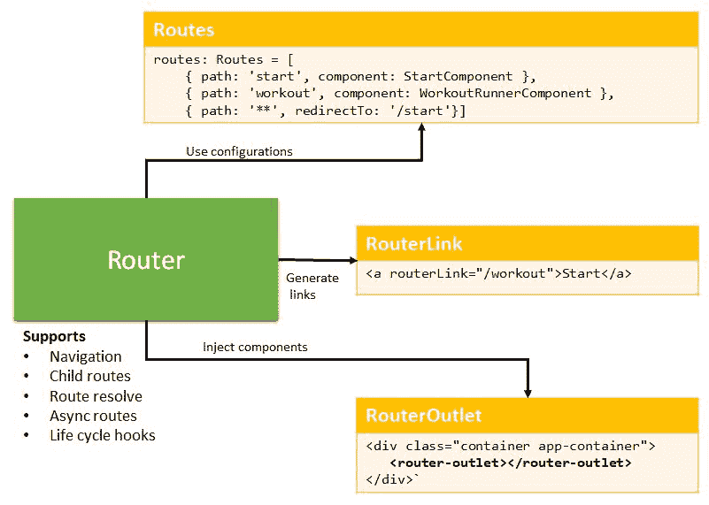
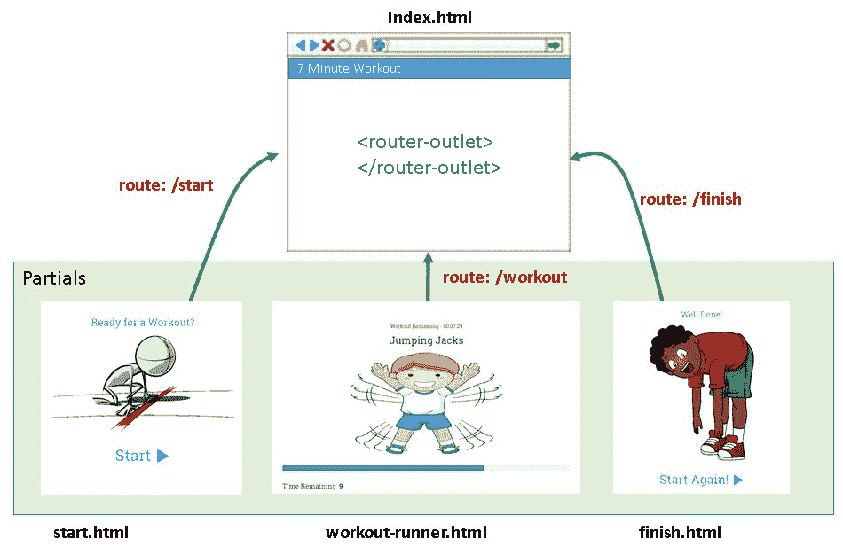
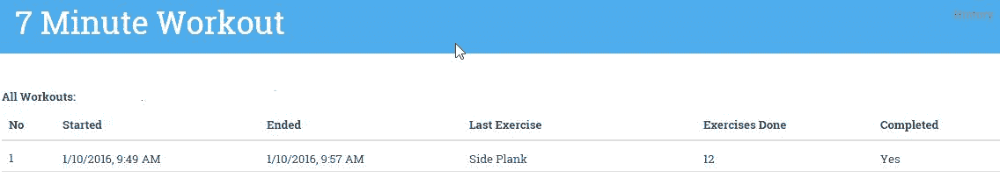
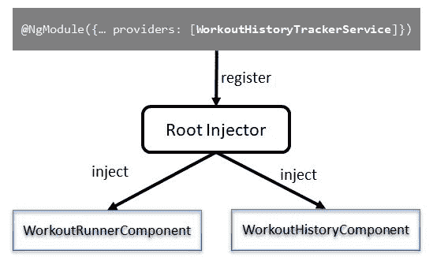
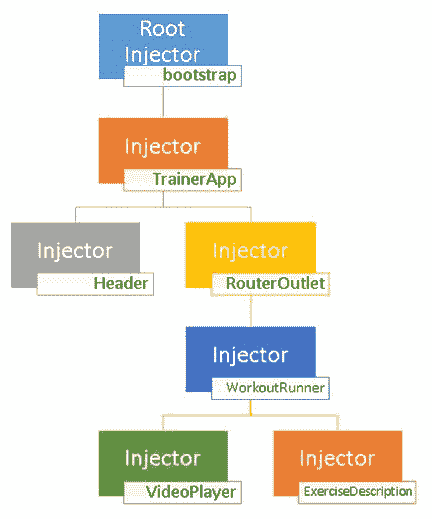
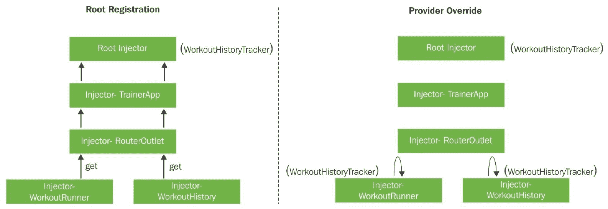

# 第三章：更多 Angular – 单页应用和路由

上一章我们讲述了在 Angular 中构建我们的第一个有用应用，然后这一章将介绍如何为它添加大量的 Angular 优点。在学习曲线中，我们已经开始了探索一个技术平台，现在我们可以使用 Angular 构建一些基本的应用。但这只是开始！在我们能够有效地在一个中等规模的应用中使用 Angular 之前，还有很多东西要学习。这一章让我们更接近实现这一目标。

*7 分钟锻炼*应用还有一些粗糙的边缘，我们可以在改进整体应用体验的同时修复它们。这一章完全是关于添加这些增强功能和特性。而且，像往常一样，这个应用构建过程为我们提供了足够的机会来增强我们对框架的理解，并学习关于它的新事物。

本章我们将涵盖以下主题：

+   **探索 Angular 的单页应用**（**SPA**）：我们探索 Angular 的 SPA 功能，包括路由导航、链接生成和路由事件。

+   **理解依赖注入**：这是平台的核心功能之一。在这一章中，我们学习 Angular 如何有效地使用依赖注入来注入组件和服务到应用程序中。

+   **Angular 纯（无状态）和纯（有状态）管道**：当我们构建一些新的管道时，我们将更详细地探索 Angular 的主要数据转换结构——管道。

+   **跨组件通信**：由于 Angular 的一切都是关于组件及其交互，我们来看看如何在父组件-子组件和兄弟组件设置中进行跨组件通信。我们学习 Angular 的*模板变量*和*事件*如何促进这种通信。

+   **创建和消费事件**：我们学习一个组件如何公开其自己的事件，以及如何从 HTML 模板和其他组件中绑定到这些事件。

作为旁注，我期望你正在定期使用*7 分钟锻炼*来锻炼你的身体。如果不是，现在就进行七分钟的锻炼休息吧。我坚持这样做！

希望锻炼很有趣！现在让我们回到一些严肃的业务。让我们从探索 Angular 的**单页应用**（**SPA**）功能开始。

我们从第二章*构建我们的第一个应用 - 7 分钟锻炼*中继续进行。`checkpoint2.4` Git 分支可以作为本章的基础。代码也已在 GitHub ([`github.com/chandermani/angular6byexample`](https://github.com/chandermani/angular6byexample)) 上提供，供大家下载。检查点作为 GitHub 中的分支实现。如果你不使用 Git，可以从 GitHub 位置下载`checkpoint2.4`的快照（ZIP 文件）：[`bit.ly/ng6be-checkpoint-2-4`](http://bit.ly/ng6be-checkpoint-2-4)。在首次设置快照时，请参考`trainer`文件夹中的`README.md`文件。

# 探索单页应用功能

*7 分钟健身法*在加载应用时开始，但最后一个练习会永久地停留在屏幕上。这不是一个非常优雅的解决方案。我们为什么不给应用添加一个开始和结束页面呢？这会让应用看起来更专业，并允许我们理解 Angular 的单页命名空间。

# Angular SPA 基础设施

随着现代 Web 框架，如 Angular 和 Vue.js，我们现在已经习惯了不执行全页刷新的应用。但如果你是新手，那么提到*SPAs*是值得的。

**单页应用（SPAs**）是基于浏览器的应用，没有全页刷新。在这样的应用中，一旦初始 HTML 加载完毕，未来的页面导航将通过 AJAX 和 HTML 片段检索，并注入到已加载的视图中。Google Mail 是 SPA 的一个很好的例子。SPAs 提供了极佳的用户体验，因为用户会得到类似桌面应用的感觉，没有常规的回发和页面刷新，这些都是传统 Web 应用通常具有的。

就像任何现代 JavaScript 框架一样，Angular 也提供了 SPA 实现所需的必要结构。让我们了解它们，并添加我们的应用页面。

# Angular 路由

Angular 支持使用其**路由基础设施**进行 SPA 开发。这个基础设施跟踪浏览器 URL，启用超链接生成，公开路由事件，并为响应 URL 变化的视图提供一组指令/组件。

有四个主要的框架组件协同工作，以支持 Angular 的路由基础设施：

+   **路由器（Router）**：实际上是提供组件导航的主要基础设施组件。

+   **路由配置（Route）**：组件路由依赖于路由配置来设置路由。

+   **路由器组件**：`RouterOutlet`组件是用于加载特定路由视图的占位符容器（*宿主*）。

+   **路由器链接指令**：这个指令生成可以在锚标签中嵌入的超链接，用于导航。

下面的图示突出了这些组件在路由设置中的作用：



我强烈建议大家在设置*7 分钟健身法*的路由时，不断回顾这张图。

*路由器*是这个完整设置中的核心组件；因此，快速了解路由器将很有帮助。

# Angular 路由

如果你曾经使用过任何支持 SPA 的 JavaScript 框架，那么工作原理是这样的。框架会监视浏览器 URL，并根据加载的 URL 提供视图。为此，有专门的框架组件。在 Angular 的世界里，这种跟踪是通过一个*框架服务*，**路由器**来完成的。

在 Angular 中，任何提供一些通用功能的类、对象或函数都被称为**服务**。*Angular 没有为组件、指令和管道提供任何特殊的声明服务结构，就像它对它们所做的那样。任何可以被组件/指令/管道消费的东西都可以称为服务。路由器就是这样一种服务。框架中还有许多其他服务。*如果你来自 Angular 1 领域，这会是一个令人愉快的惊喜——没有服务、工厂、提供者、值或常量！*

Angular 路由器的作用是：

+   在路由更改时启用组件之间的导航

+   在组件视图之间传递路由数据

+   使当前路由的状态对活动/加载的组件可用

+   提供 API，允许从组件代码中进行导航

+   跟踪导航历史，使我们能够使用浏览器按钮在组件视图之间前后移动

+   提供生命周期事件和守卫条件，使我们能够根据某些外部因素影响导航

路由器还支持一些高级路由概念，例如父子路由。这使我们能够在组件树内部定义多级路由。父组件可以定义路由，子组件可以进一步向父路由定义中添加更多子路由。这是我们在第四章“构建个人教练”中详细讨论的内容。

路由器不能单独工作。如前图所示，它依赖于其他框架组件以实现预期结果。让我们添加一些应用页面并处理每个拼图的一部分。

# 路由设置

Angular 路由器不是 Angular 核心框架的一部分。它有一个独立的 Angular 模块和自己的 npm 包。Angular CLI 已经作为项目设置的一部分安装了此包。查看`package.json`以确认这一点：

```js
"@angular/platform-browser-dynamic": "6.0.0", "@angular/router": "6.0.0",
```

由于路由器已经安装，我们只需将其集成到*7 分钟锻炼*中。

我们可以先向`index.html`的`head`部分添加`base`引用（突出显示），如果尚未存在：

```js
<title>Trainer</title>
<base href="/">
```

*路由器需要设置`base href`。`href`值指定了用于 HTML 文档中所有相对 URL 的基本 URL，包括链接到 CSS、脚本、图像以及其他资源。此设置有助于路由器创建导航 URL*。

# 添加开始和结束页面

此处的计划是为*7 分钟锻炼*提供三个页面：

+   **开始页面**：这成为应用的着陆页

+   **锻炼页面**：我们目前拥有的

+   **完成页面**：当锻炼完成后，我们将导航到这个页面

锻炼组件及其视图（`workout-runner.component.ts`和`workout-runner.component.html`）已经存在。因此，让我们创建`StartComponent`和`FinishComponent`。

再次使用 Angular CLI 生成开始和结束组件的样板代码。导航到`trainer/src/app`文件夹并执行组件生成命令：

```js
ng generate component start -is
ng generate component finish -is
```

接下来，从`checkpoint3.1` Git 分支（下载位置为[`bit.ly/ng6be-3-1-app`](http://bit.ly/ng6be-3-1-app)）复制`start`和`finish`组件的视图。

`start`和`finish`组件的实现都是空的。有趣的部分在视图中。开始组件视图有一个链接可以导航到锻炼运行者组件（`<a routerLink="/workout" ...`），结束组件也是如此。我们还没有定义路由。

`start`和`finish`组件已经被添加到`app module`中，因为它们是基本的视图，与拥有自己`WorkoutRunnerModule`模块的锻炼运行者不同。

所有三个组件都已准备就绪。现在是定义路由配置的时候了！

# 路由配置

要设置`7-Minute Workout`的路由，我们将创建一个`route definition module file`。在`trainer/src/app`文件夹中创建一个名为`app-routing.module.ts`的文件，定义应用的顶级路由。添加以下路由设置或从`checkpoint3.1` Git 分支复制：

```js
import { NgModule } from '@angular/core';
import { Routes, RouterModule } from '@angular/router';
import { WorkoutRunnerComponent } from './workout-runner/workout-runner.component';
import { StartComponent } from './start/start.component';
import { FinishComponent } from './finish/finish.component';

const routes: Routes = [
    { path: 'start', component: StartComponent },
    { path: 'workout', component: WorkoutRunnerComponent },
    { path: 'finish', component: FinishComponent },
    { path: '**', redirectTo: '/start' }
];

@NgModule({
    imports: [RouterModule.forRoot(routes, { enableTracing: true })],
    exports: [RouterModule]
})
export class AppRoutingModule { }

```

Angular CLI 还支持为模块生成样板路由。我们没有使用该功能。我们可以从 CLI 文档中了解它，文档地址为[`bit.ly/ng-cli-routing`](http://bit.ly/ng-cli-routing)。

`routes`变量是一个`Route`对象的数组。每个`Route`定义了一个单独路由的配置，它包含：

+   `path`：要匹配的目标路径

+   `component`：当路径被访问时需要加载的组件

这样的路由定义可以解释为：“当用户导航到 URL（在`path`中定义）时，加载`component`属性中定义的相应组件。”以第一个路由示例为例；导航到`http://localhost:9000/start`将加载`StartComponent`的组件视图。

你可能已经注意到最后一个`Route`定义看起来有点不同。`path`看起来很奇怪，它也没有`component`属性。带有`**`的路径表示一个通配符路径或应用的**通配符路由**。任何不匹配前三个路由的导航都将匹配通配符路由，导致应用导航到起始页面（在`redirectTo`属性中定义）。

路由设置完成后，我们可以尝试一下。输入任何随机的路由，例如`http://localhost:9000/abcd`，应用会自动重定向到`http://localhost:9000/start`。

我们最终通过调用`RouterModule.forRoot`创建并导入一个新的模块到`AppRoutingModule`中。通过重新导出 Angular 的`RouterModule`，我们可以导入`AppRoutingModule`而不是`RouterModule`，并访问所有路由构造以及`AppModule`中可用的应用路由。

`forRoot` 函数参数上的 `enableTracing: true` 属性允许我们在导航发生并正确解析路由时监控 *路由事件*（例如 `NavigationStart`、`NavigationEnd` 和 `NavigationCancel`）。日志在浏览器的调试控制台中可见。*仅用于调试目的，请从生产构建中移除*。

前面的路由设置是否可以在 `AppModule` 内完成？是的，这绝对可能，但我们建议不要这样做。随着路由数量的增加和路由设置的复杂性增加，有一个独立的路由模块有助于我们更好地组织代码。

这里要强调的一个重要事项是：*路由定义中的路由顺序很重要*。由于路由匹配是自顶向下的，它会在定义你的特定路由之前停止，在任何一个通用的捕获所有路由之前，例如在我们的定义中声明的 `**` 通配符路由，这是在最后声明的。

默认的路由设置使用 **pushstate** 机制进行 URL 导航。在这种设置中，URL 看起来像：

+   `localhost:4200/start`

+   `localhost:4200/workout`

+   `localhost:4200/finish`

这可能看起来不是什么大问题，但请记住，我们正在进行客户端导航，而不是我们如此习惯的全页重定向。正如 **开发者指南** 所述：

现代 HTML 5 浏览器支持 `history.pushState`，这是一种在不触发服务器页面请求的情况下改变浏览器位置和历史的技巧。路由器可以组合一个“自然”的 URL，这个 URL 与需要页面加载的 URL 无法区分。

# Pushstate API 和服务器端 URL 重写

路由器在两种情况下使用 pushstate API：

+   当我们点击视图中嵌入的链接（`<a>` 标签）

+   当我们使用路由器 API

在这两种情况下，路由器拦截任何导航事件，加载适当的组件视图，并最终更新浏览器 URL。请求永远不会发送到服务器。

但如果我们刷新浏览器窗口会怎样呢？

Angular 路由无法拦截浏览器的刷新事件，因此会发生完整的页面刷新。在这种情况下，服务器需要响应仅存在于客户端的资源请求（URL）。典型的服务器响应是发送应用入口文件（例如 `index.html`）以响应任何可能导致 `404 (Not Found)` 错误的任意请求。这就是我们所说的服务器 **URL 重写**。这意味着对任何不存在的 URL 的请求，例如 `/start`、`/workout` 或 `/finish`，都会加载索引页面。

每个服务器平台都有不同的机制来支持 URL 重写。我们建议您查看您使用的服务器堆栈文档，以启用 Angular 应用的 URL 重写。

当应用路由完成后，我们可以看到服务器端重写的实际效果。完成后，尝试刷新应用并查看浏览器的网络日志；*服务器每次都会发送相同的* 生成的 *`index.html` 内容，无论请求的 URL 是什么。

路由模块定义现在已完成。在继续之前，打开 `app.module.ts` 并导入 `AppRoutingModule`：

```js
import { FinishComponent } from './finish/finish.component';
import { AppRoutingModule } from './app-routing.module';
 @NgModule({ 
  imports: [..., StartModule, FinishModule, AppRoutingModule], 
```

现在我们已经拥有了所有必需的组件和所有已定义的路由，在路由更改时我们在哪里注入这些组件？我们只需要在宿主视图中定义一个占位符即可。

# 使用 router-outlet 渲染组件视图

查看当前的 `AppComponent` 模板（`app.component.html`），它包含一个内嵌的 `WorkoutRunnerComponent`：

```js
<abe-workout-runner></abe-workout-runner>
```

这需要改变，因为我们需要根据 URL（`/start`，`/workout`，或 `/finish`）渲染不同的组件。删除前面的声明，并用一个 *router 指令* 替换它：

```js
<router-outlet></router-outlet>
```

`RouterOutlet` 是 Angular 组件指令，它在路由更改时充当加载特定路由组件的占位符。它与路由服务集成，根据当前浏览器 URL 和路由定义加载适当的组件。

以下图表帮助我们轻松地可视化 `router-outlet` 设置中正在发生的事情：



我们几乎完成了；现在是时候触发导航。

# 路由导航

与标准浏览器导航一样，Angular 导航发生：

+   当用户直接在浏览器地址栏中输入 URL

+   在点击锚点标签上的链接

+   在使用脚本/代码进行导航时

如果尚未启动，请启动应用程序并加载 `http://localhost:4200` 或 `http://localhost:4200/start`。启动页面应该被加载。

点击 Start 按钮，锻炼应该在 `http://localhost:4200/workout` URL 下开始。

Angular 路由器还支持基于 *hash (#)-based routing* 的旧式路由。当启用基于 hash 的路由时，路由如下所示：

+   `localhost:9000/#/start`

+   `localhost:9000/#/workout`

+   `localhost:9000/#/finish`

要将其更改为基于 hash 的路由，顶级路由的路由配置应在 `RouterModule.forRoot` 函数（第二个参数）中增加一个额外的 `useHash:true` 属性。

有趣的是，在 `StartComponent` 视图定义中的锚点链接没有 `href` 属性。相反，有一个 `RouterLink` 指令（指令名称为 `RouterLink`，选择器为 `routerLink`）：

```js
<a routerLink="/workout">
```

在前面的例子中，由于路由是固定的，指令采用了一个常量表达式（`"/workout"`）。我们在这里不使用标准的方括号表示法（`[]`），而是将指令分配一个固定值。这被称为 **一次性绑定**。对于动态路由，我们可以使用模板表达式和链接参数数组。我们很快就会涉及到动态路由和链接参数数组。

注意在先前的路由路径中的 **/** 前缀。`/` 用于指定绝对路径。Angular 路由器也支持相对路径，这在处理子路由时非常有用。我们将在接下来的几章中探讨子路由的概念。

刷新应用并检查渲染的 HTML 中的`StartComponent`；前面的锚标签被渲染为正确的`href`值：

```js
<a ... href="/workout">
```

避免硬编码路由链接

虽然你可以直接使用`<a href="/workout">`，但为了避免硬编码路由，建议使用`routerLink`。

# 链接参数数组

当前**7 分钟锻炼**的路由设置相当简单，不需要在生成链接时传递参数。但非平凡路由需要动态参数时，这个功能是存在的。看看这个例子：

```js
@RouteConfig([ 
 { path: '/users/:id', component: UserDetail }, 
  { path: '/users', component: UserList}, 
])
```

这就是如何生成第一个路由的方法：

```js
<a [routerLink]="['/users', 2]  // generates /users/2
```

分配给`RouterLink`指令的数组就是我们所说的**链接参数数组**。该数组遵循特定的模式：

```js
['routePath', param1, param2, {prop1:val1, prop2:val2} ....] 
```

第一个元素始终是路由路径，下一组参数用于替换在路由模板中定义的占位符标记。

Angular 路由器非常强大，几乎支持我们从现代路由库中期望的所有功能。它支持子路由、异步路由、生命周期钩子、次要路由和一些其他高级场景。我们将推迟对这些主题的讨论，直到后面的章节。本章只是让我们开始使用 Angular 路由，但还有更多内容要介绍！

路由链接参数也可以是一个对象。这样的对象用于向路由提供**可选参数**。看看这个例子：

```js
<a [routerLink]="['/users', {id:2}]  // generates /users;id=2
```

注意，生成的链接中包含分号，用于将可选参数与路由和其他参数分开。

实现的最后缺失部分是在锻炼完成后路由到完成页面。

# 使用路由服务进行组件导航

从锻炼页面到完成页面的导航不是手动触发的，而是在锻炼完成后触发的。`WorkoutRunnerComponent`需要触发这个转换。

为了这个目的，`WorkoutRunnerComponent`需要获取路由并对其调用`navigate`方法。

`WorkoutRunnerComponent`是如何获取路由实例的？使用 Angular 的**依赖注入框架**。我们至今一直对这个话题有所回避。我们取得了很多成就，甚至不知道一直都有依赖注入框架在发挥作用。让我们稍等片刻，首先集中精力解决导航问题。

为了让`WorkoutRunnerComponent`获取路由服务实例，它只需要在构造函数中声明该服务。更新`WorkoutRunnerComponent`构造函数并添加导入：

```js
import {Router} from '@angular/router'; 
...
constructor(private router: Router) {
```

当`WorkoutRunnerComponent`实例化时，Angular 神奇地将当前路由注入到`router`私有变量中。这个魔法是通过**依赖注入框架**完成的。

现在只需要将`console.log("Workout complete!");`语句替换为对`navigation`路由的调用即可：

```js
this.router.navigate( ['/finish'] );
```

`navigate`方法接受与`RouterLink`指令相同的**链接参数数组**。我们可以通过耐心等待锻炼完成来验证实现。

如果你在运行代码时遇到问题，请查看`checkpoint3.1`Git 分支，以获取我们迄今为止所做工作的一个可工作版本。或者，如果您不使用 Git，可以从[`bit.ly/ng6be-checkpoint-3-1`](http://bit.ly/ng6be-checkpoint-3-1)下载`checkpoint3.1`的快照（ZIP 文件）。在首次设置快照时，请参考训练文件夹中的`README.md`文件。

在我们定义的*7 分钟健身法*中的路线是标准的简单路线。但如果存在需要参数的动态路线，我们如何使这些参数在我们的组件中可用？Angular 有一个服务可以做到这一点，那就是`ActivatedRoute`服务。

# 使用 ActivatedRoute 服务访问路由参数

有时候，应用程序需要访问活动路由状态。在组件实现过程中，有关当前 URL 片段、当前路由参数和其他与路由相关的数据等信息可能会派上用场。

`ActivatedRoute`服务是所有当前路由相关查询的一站式商店。它有几个属性，包括`url`和`paramMap`，可以用来查询路由的当前状态。

让我们看看一个参数化路由的例子以及如何访问从组件传递过来的参数，给定这个路由：

```js
{ path: '/users/:id', component: UserDetailComponent },
```

当用户导航到`/user/5`时，底层组件可以通过首先将其构造函数中的`ActivatedRoute`注入来访问`:id`参数值：

```js
export class UserDetailComponent { 
  constructor( private route: ActivatedRoute ... 
```

然后，在代码中需要参数的任何地方，调用`ActivatedRoute.paramMap`属性的`get`方法：

```js
ngOnInit() {
    let id = +this.route.paramMap.get('id'); // (+) converts string 'id' to a number
    var currentUser=this.getUser(id) 
}  
```

`ActivatedObject`上的`paramMap`属性实际上是一个**可观察对象**。我们将在本章后面部分了解更多关于可观察对象的内容，但就目前而言，理解可观察对象是对象，通过引发其他人可以监听的事件来让外界了解其状态变化就足够了。

我们将在后面的章节中使用这个路由器功能，在那里我们将构建一个新的应用程序，可以创建健身计划并编辑现有的健身计划。在即将到来的章节中，我们还将探讨一些高级路由概念，包括*子路由*、*懒加载路由*和*守卫条件*。

我们已经涵盖了 Angular 路由的基础知识，现在是时候集中精力在一个久违的话题上了：*依赖注入*。

# Angular 依赖注入

Angular 大量使用依赖注入来管理应用程序和框架的依赖。令人惊讶的是，我们可以在开始讨论路由器之前忽略这个话题。在这段时间里，Angular 依赖注入框架一直在支持我们的实现。一个好的依赖注入框架的标志是，消费者可以在不太多关注内部结构和很少的仪式的情况下使用它。

如果你不确定依赖注入是什么，或者只是对它有一个模糊的概念，那么 DI 的介绍肯定不会伤害任何人。

# 依赖注入 101

对于任何应用程序，其组件（不要与 Angular 组件混淆）并不是独立工作的。它们之间存在依赖关系。一个组件可能使用其他组件来实现其所需的功能。"**依赖注入**"是一种管理此类依赖的模式。

依赖注入模式在许多编程语言中都很流行，因为它允许我们以松耦合的方式管理依赖。有了这样的框架，依赖对象由 DI 容器管理。这使得依赖可交换，整体代码更加解耦和可测试。

依赖注入背后的理念是，一个对象不创建/管理自己的依赖。相反，依赖由外部提供。这些依赖可以通过构造函数提供，这被称为**构造函数注入**（Angular 也这样做）或者通过直接设置对象属性，这被称为**属性注入**。

这里是一个依赖注入操作的初步示例。考虑一个名为`Tracker`的类，它需要一个`Logger`来进行日志操作：

```js
class Tracker() { 
  logger:Logger; 
  constructor() { 
    this.logger = new Logger();    
  } 
}
```

`Logger`类的依赖在`Tracker`内部硬编码，因为`Tracker`本身实例化了`Logger`实例。如果我们外部化这个依赖呢？所以这个类变成了：

```js
class Tracker { 
  logger:Logger; 
  constructor(logger:Logger) { 
    this.logger = logger;    
  } 
}
```

这个看似无害的更改产生了重大影响。通过添加提供依赖外部的能力，我们现在可以：

+   **解耦这些组件并启用可扩展性**。依赖注入模式允许我们修改`Tracker`类的日志行为，而不需要触及该类本身。以下是一个示例：

```js
        var trackerWithDBLog=new Tracker(new DBLogger()); 
        var trackerWithMemoryLog=new Tracker(new MemoryLogger()); 
```

我们刚才看到的两个`Tracker`对象具有相同的`Tracker`类实现的不同日志功能。"trackerWithDBLog"将日志记录到数据库，而"trackerWithMemoryLog"则记录到内存中（假设`DBLogger`和`MemoryLogger`都派生自`Logger`类）。由于`Tracker`不依赖于`Logger`的具体实现（`DBLogger`或`MemoryLogger`），这表明`Logger`和`Tracker`是松耦合的。在未来，我们可以派生一个新的`Logger`类实现，并用于日志记录，而无需更改`Tracker`的实现。

+   **模拟依赖**：模拟依赖的能力使得我们的组件更容易测试。`Tracker`实现可以通过提供`Logger`的模拟实现（如`MockLogger`）或使用可以轻松模拟`Logger`接口的模拟框架来独立（单元测试）测试。

我们现在可以理解 DI 有多强大。

仔细思考：一旦 DI 就位，解决依赖的责任现在落在调用/消费代码上。在先前的示例中，之前实例化`Tracker`的类现在需要创建一个`Logger`派生类并将其注入到`Tracker`中，然后再使用它。

显然，这种在组件内部交换依赖项的灵活性是有代价的。调用代码的实现可能会变得过于复杂，因为它现在还必须管理子依赖项。这看起来可能很简单，但考虑到依赖组件本身可能也有依赖项，我们正在处理的是一个复杂的依赖树结构。

这就是 DI 容器/框架增加价值的地方。它们使调用代码管理依赖项变得更加简单。然后这些容器构建/管理依赖项，并将其提供给我们的客户端/消费者代码。

Angular DI 框架负责管理我们的 Angular 组件、指令、管道和服务的依赖项。

# 探索 Angular 中的依赖注入

Angular 使用其自己的 DI 框架来管理应用程序中的依赖项。第一个可见的依赖注入示例是将组件路由注入到`WorkoutRunnerComponent`中：

```js
constructor(private router: Router) { 
```

当`WorkoutRunnerComponent`类被实例化时，DI 框架内部定位/创建正确的路由实例，并将其注入到调用者（在我们的例子中是`WorkoutRunnerComponent`）。

虽然 Angular 在隐藏 DI 基础设施方面做得很好，但了解 Angular DI 的工作方式至关重要。否则，一切可能看起来都很神奇。

DI 是关于创建和管理依赖项的，执行此操作的是被称为**注入器**的框架组件。为了管理依赖项，注入器需要理解以下内容：

+   **是什么**：依赖项是什么？依赖项可以是类、对象、工厂函数或值。每个依赖项在注入之前都需要在 DI 框架中注册。

+   **在哪里/何时**：DI 框架需要知道在哪里注入依赖项以及何时注入。

+   **如何**：DI 框架还需要知道在请求时创建依赖项的配方。

任何注入的依赖项都需要回答这些问题，无论它是框架构造还是我们创建的工件。

以`WorkoutRunnerComponent`中完成的`Router`实例注入为例。为了回答“是什么”和“如何做”的问题，我们在`AppRoutingModule`中通过导入`RouterModule`来注册`Router`服务：

```js
imports: [..., AppRoutingModule];
```

`AppRoutingModule`是一个模块，它导出多个路由以及所有与 Angular-router 相关的服务（技术上它重新导出`RouterModule`）。

“在哪里”和“何时”是由需要依赖项的组件决定的。`WorkoutRunnerComponent`的构造函数接受一个`Router`依赖项。这会通知注入器在创建`WorkoutRunnerComponent`作为路由导航的一部分时注入当前的`Router`实例。

在内部，注入器根据从 TypeScript 转换为 ES5 代码（由 TypeScript 编译器完成）时反射的元数据来确定类的依赖关系。只有当我们向类添加装饰器，如 `@Component` 或 `@Pipe` 时，才会生成元数据。

如果我们将 `Router` 注入到另一个类中会发生什么？是否使用相同的 `Router` 实例？简短的答案是是的。Angular 注入器创建和缓存依赖关系以供将来重用，因此这些服务本质上是单例的。

虽然注入器中的依赖关系是单例的，但在任何给定时间，Angular 应用程序中可能有多个注入器处于活动状态。你很快就会了解注入器层次结构。与路由器一样，还有另一层复杂性。由于 Angular 支持子路由概念，这些子路由中的每一个都有自己的路由实例。等到我们下一章介绍子路由时，你就可以理解其中的复杂性了！

让我们创建一个 Angular 服务来跟踪锻炼历史记录。这个过程将帮助你了解如何使用 Angular DI 连接依赖关系。

# 跟踪锻炼历史记录

如果我们能跟踪我们的锻炼历史记录，那将是一个很好的补充。我们上次是什么时候锻炼的？我们完成了吗？我们花了多少时间？

为了回答这些问题，我们需要跟踪锻炼开始和结束的时间。然后需要将这些跟踪数据持久化到某个地方。

一种可能的解决方案是将所需的函数扩展到我们的 `WorkoutRunnerComponent` 中。但这会给 `WorkoutRunnerComponent` 增加不必要的复杂性，这不是它的主要任务。

我们需要为这项工作创建一个专门的历史跟踪服务，一个跟踪历史数据并在整个应用程序中共享的服务。让我们开始构建 workout-history-tracker 服务。

# 构建 workout-history-tracker 服务

workout-history-tracker 服务将跟踪锻炼进度。该服务还将公开一个接口，允许 `WorkoutRunnerComponent` 开始和停止锻炼跟踪。

再次受到 *Angular 风格指南* 的启发，我们将创建一个新的模块，**核心模块**，并将服务添加到这个模块中。核心模块的作用是托管应用程序中可用的服务。这也是添加在应用程序启动时所需的单次使用组件的好地方。导航栏和忙碌指示器就是这样的组件示例。

在命令行中，导航到 `trainer/src/app` 文件夹并生成一个新的模块：

```js
ng generate module core --module app
```

这将创建一个新的 `CoreModule` 模块并将其导入到 `AppModule` 中。接下来，在 `trainer/src/app/core` 文件夹中创建一个新的服务，再次使用 Angular CLI：

```js
ng generate service workout-history-tracker
```

生成的代码相当简单。生成器创建了一个新的类 `WorkoutHistoryTrackerService` (`workout-history-tracker.service.ts`)，并在类上应用了 `@Injectable` 装饰器：

```js
@Injectable({
  providedIn: 'root'
})
export class WorkoutHistoryTrackerService {
    ...
}
```

`Injectable` 上的 `providedIn:'root'` 属性指示 Angular 使用 *root injector* 创建 **一个提供者**。这个提供者的唯一任务是创建 `WorkoutHistoryTrackerService` 服务并在 Angular 的 DI 注入器需要时返回它。我们创建/使用的任何服务都需要在注入器上注册。正如 Angular 关于 *providers* 的文档所描述的，

*提供者告诉注入器如何创建服务。没有提供者，注入器将不知道它负责注入服务，也无法创建服务*。

在 Angular 中，服务只是一个已注册到 Angular DI 框架的类。它们没有什么特别之处！

有时，将服务作为模块的一部分而不是与根注入器注册可能是希望的。在这种情况下，服务可以在模块级别注册。有两种方法可以实现这一点：

+   **选项 1**：使用 `providedIn` 属性引用模块：

```js
@Injectable({
  providedIn: CoreModule
})
export class WorkoutHistoryTrackerService {
```

+   **选项 2**：在模块上注册服务，使用 `providers` 数组：

```js
@NgModule({
  providers: [WorkoutHistoryTrackerService],
})
export class CoreModule { }
```

在模块级别注册服务在模块是懒加载的场景中具有优势。

使用 `Injectable`（*选项 1*）注册服务还有另一个优点。它使 Angular CLI 构建能够执行代码捆绑的高级优化，省略任何已声明但从未使用的服务（这个过程称为 **tree shaking**）。

不论我们使用哪两种选项，服务仍然通过提供者（provider）与根注入器注册。

我们将使用 `Injectable` 方法在本书中注册依赖项，除非另有说明。打开 `workout-history-tracker.service.ts` 并添加以下实现：

```js
import { ExercisePlan } from '../workout-runner/model';
import { CoreModule } from './core.module';
import { Injectable } from '@angular/core';
@Injectable({
  providedIn: CoreModule
})
export class WorkoutHistoryTrackerService { 
  private maxHistoryItems = 20;   //Tracking last 20 exercises 
  private currentWorkoutLog: WorkoutLogEntry = null; 
  private workoutHistory: Array<WorkoutLogEntry> = []; 
  private  workoutTracked: boolean;
```

```js
  constructor() { } 

  get tracking(): boolean { 
    return this. workoutTracked; 
  } 
}

export class WorkoutLogEntry { 
  constructor( 
    public startedOn: Date, 
    public completed: boolean = false, 
    public exercisesDone: number = 0, 
    public lastExercise?: string, 
    public endedOn?: Date) { } 
}
```

定义了两个类：`WorkoutHistoryTrackerService` 和 `WorkoutLogEntry`。正如其名称所暗示的，`WorkoutLogEntry` 定义了单个锻炼执行的日志数据。`maxHistoryItems` 允许我们配置要存储在包含历史数据的 `workoutHistory` 数组中的最大项目数。`get tracking()` 方法在 TypeScript 中定义了 `workoutTracked` 的 getter 属性。在锻炼执行期间，`workoutTracked` 被设置为 `true`。

让我们向 `WorkoutHistoryTrackerService` 添加开始跟踪、停止跟踪和完成锻炼的函数：

```js
startTracking() { 
  this.workoutTracked = true; 
  this.currentWorkoutLog = new WorkoutLogEntry(new Date()); 
  if (this.workoutHistory.length >= this.maxHistoryItems) { 
    this.workoutHistory.shift(); 
  } 
    this.workoutHistory.push(this.currentWorkoutLog); 
} 

exerciseComplete(exercise: ExercisePlan) { 
  this.currentWorkoutLog.lastExercise = exercise.exercise.title; 
  ++this.currentWorkoutLog.exercisesDone; 
} 

endTracking(completed: boolean) { 
  this.currentWorkoutLog.completed = completed; 
  this.currentWorkoutLog.endedOn = new Date(); 
  this.currentWorkoutLog = null; 
  this.workoutTracked = false; 
}
```

`startTracking` 函数创建一个 `WorkoutLogEntry` 并将其添加到 `workoutHistory` 数组中。通过将 `currentWorkoutLog` 设置为新创建的日志条目，我们可以在锻炼执行过程中稍后对其进行操作。`endTracking` 函数和 `exerciseComplete` 函数仅修改 `currentWorkoutLog`。`exerciseComplete` 函数应在完成每个作为锻炼一部分的锻炼时调用。为了节省您的按键次数，您可以从此 gist 获取到目前为止的实现完整代码：[`bit.ly/ng6be-gist-workout-history-tracker-v1-ts`](http://bit.ly/ng6be-gist-workout-history-tracker-v1-ts)。

服务实现现在还包括一个获取锻炼历史数据的函数：

```js
getHistory(): Array<WorkoutLogEntry> { 
  return this.workoutHistory; 
}
```

这就完成了`WorkoutHistoryTrackerService`的实现；现在，是时候将其集成到锻炼执行中了。

# 与`WorkoutRunnerComponent`集成

`WorkoutRunnerComponent`需要`WorkoutHistoryTrackerService`来跟踪锻炼历史；因此有一个依赖项需要满足。我们已经在 Angular 的 DI 框架中使用`Injectable`装饰器注册了`WorkoutHistoryTrackerService`，现在是时候使用构造函数注入来消费这个服务了。

# 使用构造函数注入注入依赖项

消费依赖项很容易！*通常情况下，我们使用构造函数注入来消费依赖项*。

在顶部添加`import`语句，并更新`WorkoutRunnerComponent`构造函数，如下所示：

```js
import { WorkoutHistoryTrackerService } from '../core/workout-history-tracker.service';
... 
constructor(private router: Router,
    private tracker: WorkoutHistoryTrackerService   
) {
```

与`router`一样，当创建`WorkoutRunnerComponent`时，Angular 也会注入`WorkoutHistoryTrackerService`。很简单！

一旦服务被注入并可供`WorkoutRunnerComponent`使用，当锻炼开始、一项锻炼完成以及锻炼结束时，需要调用服务实例（`tracker`）。

将此作为`start`函数中的第一个语句：

```js
this.tracker.startTracking();
```

在`startExerciseTimeTracking`函数中，在`clearInterval`调用之后添加高亮代码：

```js
clearInterval(this.exerciseTrackingInterval); 
if (this.currentExercise !== this.restExercise) { this.tracker.exerciseComplete(this.workoutPlan.exercises[this.currentExerciseIndex]); }
```

并且在锻炼中高亮显示的代码，以完成同一函数中的`else`条件：

```js
this.tracker.endTracking(true); 
this.router.navigate(['/finish']); 
```

历史跟踪几乎完成了，除了一个特殊情况。如果用户手动导航离开锻炼页面怎么办？我们如何停止跟踪？

当这种情况发生时，我们总能依赖组件的生命周期钩子/事件来帮助我们。当`NgOnDestroy`事件被触发时，可以停止锻炼跟踪。在组件从组件树中移除之前执行任何清理工作的合适位置。让我们这么做。

将此函数和相应的生活周期事件接口添加到`workout-runner.component.ts`中：

```js
export class WorkoutRunnerComponent implements OnInit, OnDestroy {
...
ngOnDestroy() { 
  this.tracker.endTracking(false); 
} 
```

锻炼历史跟踪实现已完成。我们渴望开始锻炼历史页面/组件的实现，但在完成我们对 Angular DI 能力的讨论之前，我们不会这么做。

如果你想保持应用构建速度，现在可以自由跳过下一节。用清新和放松的心态回到这一节。在下一节中，我们将分享一些非常重要的核心概念。

# 深入了解依赖注入

让我们先尝试理解我们可以使用`WorkoutHistoryTrackerService`作为示例来注册依赖项的不同位置。

# 注册依赖项

注册依赖的标准方式是在根/全局级别注册。这可以通过在`NgModule`装饰器的`provides`属性（数组）中传递依赖类型，或者使用`Injectable`服务装饰器的`providedIn`属性来完成。

记得我们的`WorkoutHistoryTrackerService`注册吗？请检查以下内容：

```js
@Injectable({
  providedIn: CoreModule
})
export class WorkoutHistoryTrackerService {
```

同样的事情也可以在模块声明中完成，如下所示：

```js
@NgModule({...providers: [WorkoutHistoryTrackerService],})
```

从技术上讲，当使用上述任何一种机制时，服务都会注册到应用的**根注入器**，而不管它在哪个 Angular 模块中声明。从今往后，任何跨模块的 Angular 工件都可以使用该服务（`WorkoutHistoryTrackerService`）。根本不需要任何模块导入。

这种行为与组件/指令/管道注册不同。这样的工件必须从一个模块导出，以便另一个模块可以使用它们。

*依赖项可以注册的另一个地方是在组件上*。`@Component` 装饰器有一个 `providers` 数组参数来注册依赖项。有了这两个依赖项注册级别，我们需要回答的明显问题是，哪一个该使用？

显然，如果依赖项仅由组件及其子组件使用，它应该注册在 `@Component` 装饰器级别。但并非如此！在我们可以回答这个问题之前，我们还需要了解很多。需要介绍一个全新的分层注入器世界。让我们等待，并通过继续讨论提供者来学习注册依赖项的其他方法。

*当 Angular 注入器请求时，提供者创建依赖项*。*这些提供者有创建这些依赖项的配方*。虽然类似乎是可以注册的明显依赖项，但我们也可以注册：

+   一个特定的对象/值

+   工厂函数

使用 `Injectable` 装饰器注册 `WorkoutHistoryTrackerService` 是最常见的注册模式。但有时我们需要在依赖项注册方面有一定的灵活性。要注册一个对象或工厂函数，我们需要使用在 `NgModule` 上可用的提供者注册的扩展版本。

要了解这些变化，我们需要更详细地探索提供者和依赖项注册。

# Angular 提供者

提供者创建由 DI 框架提供的依赖项。

看看在 `NgModule` 上完成的这个 `WorkoutHistoryTrackerService` 依赖项注册：

```js
providers: [WorkoutHistoryTrackerService],
```

这种语法是以下版本的简写形式：

```js
providers:({ provide: WorkoutHistoryTrackerService, useClass: WorkoutHistoryTrackerService })
```

第一个属性（`provide`）是一个用作注册依赖项键的令牌。这个键也允许我们在依赖注入期间定位依赖项。

第二个属性（`useClass`）是一个**提供者定义对象**，它定义了创建依赖项值的配方。

使用 `useClass`，我们正在注册一个**类提供者**。**类提供者通过实例化请求的对象类型来创建依赖项**。还有一些其他的提供者类型。

# 值提供者

*类提供者创建类对象并满足依赖项，但有时我们想在 DI 提供者中注册一个特定的对象/原始值*。**值提供者**解决了这个用例。

如果我们使用这种技术注册 `WorkoutHistoryTrackerService`，注册将看起来像这样：

```js
{provide: WorkoutHistoryTrackerService, useValue: new WorkoutHistoryTrackerService()};
```

**使用值提供者，我们有责任为 Angular DI 提供一个服务/对象/原始实例。**

使用`value provider`，由于我们手动创建依赖项，因此我们也负责构建任何子依赖项（如果存在）。再次以`WorkoutHistoryTrackerService`为例。如果`WorkoutHistoryTrackerService`有一些依赖项，这些依赖项也需要通过手动注入来满足：

```js
{provide: WorkoutHistoryTrackerService, useValue: new WorkoutHistoryTrackerService(new LocalStorage())});
```

在先前的例子中，我们不仅要创建`WorkoutHistoryTrackerService`的实例，还要创建`LocalStorage`服务的实例。对于具有复杂依赖图的服务，使用值提供者设置该服务变得具有挑战性。

在可能的情况下，优先选择`class provider`而不是`value provider`。

在特定的场景中，值提供者仍然很有用。例如，我们可以使用值提供者注册一个通用的应用程序配置：

```js
{provide: AppConfig, {useValue: {name:'Test App', gridSetting: {...} ...}}
```

或者，在单元测试时注册一个模拟依赖项：

```js
{provide:WorkoutHistoryTrackerService, {useValue: new MockWorkoutHistoryTracker()}
```

# 工厂提供者

有时候，依赖项构建并不是一件简单的事情。构建取决于外部因素。这些因素决定了创建和返回哪些对象或类实例。**工厂提供者**做这项繁重的工作。

以一个例子为例，我们想要为开发和生产发布提供不同的配置。我们可以很好地使用工厂实现来选择正确的配置：

```js
{provide: AppConfig, useFactory: () => { 
  if(PRODUCTION) { 
    return {name:'Production App', gridSetting: {...} ...} 
  } 
  else { 
    return {name:'Test App', gridSetting: {...} ...} 
  }
}
```

工厂函数也可以有自己的依赖。在这种情况下，语法略有变化：

```js
{provide: WorkoutHistoryTrackerService, useFactory: (environment:Environment) => { 
  if(Environment.isTest) { 
    return new MockWorkoutHistoryTracker(); 
  } 
  else { 
    return new WorkoutHistoryTrackerService(); 
  }, 
    deps:[Environment]
}
```

依赖作为参数传递给工厂函数，并在提供者定义对象的属性`deps`上注册（在先前的例子中`Environment`是注入的依赖）。

如果依赖项的构建复杂，且在依赖项连接期间不能决定所有内容，请使用`UseFactory`提供。

虽然我们有多种选项来声明依赖，但消费依赖要简单得多。我们在“使用构造函数注入注入依赖”这一节中看到了一种方法。

# 使用注入器进行显式注入

我们甚至可以使用 Angular 的**Injector 服务**进行显式注入。这是 Angular 用来支持 DI 的同一个注入器。以下是使用`Injector`注入`WorkoutHistoryTrackerService`服务的方法：

```js
constructor(private router: Router, private injector:Injector) {
  this.tracker=injector.get(WorkoutHistoryTrackerService);
```

我们注入`Injector`服务，然后明确请求`WorkoutHistoryTrackerService`实例。

什么时候有人会想这样做呢？嗯，几乎从不会。避免这种模式，因为它将 DI 容器暴露给实现，并增加了一些噪音。

我们现在知道如何注册依赖和如何消费它，但 DI 框架是如何定位这些依赖的呢？

# 依赖项令牌

记住之前展示的依赖注册的扩展版本：

```js
{ provide: WorkoutHistoryTrackerService, useClass: WorkoutHistoryTrackerService }
```

`provide` 属性值是一个 **令牌**。此令牌用于标识要注入的依赖。在先前的示例中，我们使用类名或类型来标识依赖，因此该令牌被称为 **类令牌**。

根据 前面的注册，每当 Angular 看到类似以下语句时，它将根据类类型注入正确的依赖，这里 `WorkoutHistoryTrackerService`：

```js
constructor(tracker: WorkoutHistoryTrackerService)
```

Angular 还支持一些其他的令牌。

# 使用 InjectionToken

有时候，我们定义的依赖项要么是原始数据类型、对象或函数。在这种情况下，类令牌不能使用，因为没有类。Angular 通过使用 `InjectionToken` （或我们稍后将看到的**字符串令牌**）来解决这个问题。如果不存在 `AppConfig` 类，我们之前分享的应用配置注册示例可以使用字符串令牌重写。

要使用 `InjectionToken` 注册依赖，我们首先需要创建 `InjectionToken` 类实例：

```js
export const APP_CONFIG = new InjectionToken('Application Configuration');
```

然后，使用令牌来注册依赖：

```js
{ provide: APP_CONFIG, useValue: {name:'Test App', gridSetting: {...} ...});
```

最后，使用 `@Inject` 装饰器在任何地方注入依赖：

```js
constructor(@Inject(APP_CONFIG) config) { }
```

有趣的是，当 `@Inject()` 不存在时，注入器使用参数的类型/类名（*类令牌*）来定位依赖。

# 使用字符串令牌

Angular 也支持 **字符串令牌**，允许我们使用字符串字面量来标识和注入依赖。使用字符串令牌的前一个示例变为：

```js
{ provide: 'appconfig', useValue: {name:'Test App', gridSetting: {...} ...});
...
constructor(@Inject('appconfig') config) { }
```

字符串令牌的一个缺点是，你可能会在声明和注入过程中拼写错误令牌。

呼吁！这是关于 Angular 依赖注入的一个非常长的部分，还有很多内容要介绍。现在，让我们回到正轨，添加锻炼历史页面。

# 添加锻炼历史页面

在执行锻炼过程中收集的锻炼历史数据现在可以在视图中呈现。让我们添加一个 `History` 组件。该组件将在 `/history` 位置可用，可以通过点击应用页眉部分中的链接来加载。

在 `app.routes.ts` 中更新路由定义以包含新的路由和相关导入：

```js
import { WorkoutHistoryComponent } from './workout-history/workout-history.component'; 
... 
export const routes: Routes = [ 
  ..., 
 { path: 'history', component: WorkoutHistoryComponent } ,
  { path: '**', redirectTo: '/start' } 
]) 
```

需要将 `History` 链接添加到应用页眉部分。让我们将页眉部分重构为其自己的组件。更新 `app.component.html` 模板，并用以下代码替换 `nav` 元素：

```js
<div id="header">
    <abe-header></abe-header>
</div> 
```

将 `nav` 元素移动到页眉组件中，我们仍然需要创建它。在 `trainer/src/app/core` 文件夹内运行命令来使用 `ng generate` 生成一个新的 `HeaderComponent` 组件：

```js
ng generate component header -is
```

此语句创建了一个新的页眉组件，并在核心模块中声明了它。接下来，从 `checkpoint3.2` Git 分支（GitHub 位置：[`bit.ly/ng6be-3-2-header`](http://bit.ly/ng6be-3-2-header)）更新页眉组件的定义（`header.component.ts`）及其视图（`header.component.html`）。

虽然我们已经向`app.component.html`添加了标题元素，但除非我们导入核心模块并从核心模块导出组件，否则标题组件不会渲染。Angular CLI 为我们完成了第一部分，对于第二部分，更新`core.module.ts`如下：

```js
imports: [ CommonModule, RouterModule],
declarations: [HeaderComponent],    
exports: [HeaderComponent]
```

如果你查看`HeaderComponent`的视图，历史链接现在就在那里。我们必须导入`RouterModule`，因为以下链接是使用`RouterLink`指令生成的，而`RouterLink`是`RouterModule`的一部分：

```js
<a class="nav-link" routerLink="/history" title="Workout History">History</a>
```

让我们先通过生成组件的模板来添加锻炼历史组件。从命令行导航到`trainer/src/app`并运行：

```js
ng generate component workout-history -is
```

`WorkoutHistoryComponent`的实现可以在`checkpoint3.2`Git 分支中找到；文件夹是`workout-history`（GitHub 位置：[`bit.ly/ng6be-3-2-workout-history`](http://bit.ly/ng6be-3-2-workout-history))。

至少可以说，`WorkoutHistoryComponent`的视图代码很简单：一些 Angular 构造，包括`ngFor`和`ngIf`。组件实现也很简单。注入`WorkoutHistoryTrackerService`服务依赖项，并在`WorkoutHistoryComponent`初始化时加载历史数据：

```js
ngOnInit() { 
  this.history = this.tracker.getHistory(); 
}
```

这次，我们使用`Location`服务而不是`Router`来从`history`组件导航离开：

```js
goBack() { 
  this.location.back(); 
}
```

位置服务用于与浏览器 URL 交互。根据 URL 策略，要么使用 URL 路径（例如`/start`或`/workout`），要么使用 URL 哈希段（例如`#/start`或`#/workout`）来跟踪位置变化。路由器服务内部使用位置服务来触发导航。

路由器与位置

虽然`Location`服务允许我们执行导航，但使用`Router`是执行路由导航的首选方式。我们在这里使用位置服务是因为需要导航到最后一个路由，而不必担心如何构建路由。

我们已经准备好测试我们的锻炼历史实现。加载起始页面并点击“历史”链接。历史页面加载了一个空网格。返回，开始锻炼，并完成一项练习。再次检查历史页面；应该有一个锻炼被列出：



看起来不错！如果我们多次运行锻炼并让历史记录列表累积，我们会发现这个列表中有一个痛点。历史数据没有按倒序时间排序，最新数据在顶部。此外，如果我们有一些过滤功能那就太好了。

# 使用管道排序和过滤历史数据

在第二章，“构建我们的第一个应用 - 7 分钟锻炼”，我们探讨了管道。我们甚至构建了自己的管道来格式化秒数值为 hh:mm:ss。管道的主要目的是转换数据，而且令人惊讶的是，它们也可以在数组上工作！对于数组，管道可以排序和过滤数据。我们创建了两个管道，一个用于排序，一个用于过滤。

AngularJS 预建了用于此目的的过滤器（在 Angular 中，过滤器是管道），`orderBy` 和 `filter`。Angular 并不自带这些管道，这有一个很好的原因。这些管道容易导致性能不佳。在框架文档中了解关于管道的决策背后的理由：[`bit.ly/ng-no-filter-orderby-pipe`](http://bit.ly/ng-no-filter-orderby-pipe)。

让我们从 `orderBy` 管道开始。

# 排序管道

我们实现的 `orderBy` 管道将根据对象的任何属性对对象数组进行排序。根据 `fieldName` 属性按升序排序的项目使用模式如下：

```js
*ngFor="let item of items| orderBy:fieldName"
```

对于按降序排序项目，使用模式如下：

```js
*ngFor="let item of items| orderBy:-fieldName"
```

注意 `fieldName` 前面的额外连字符（`-`）。

我们计划在新的共享模块中添加 `OrderByPipe`。你在想，为什么不添加到核心模块中呢？按照惯例，核心模块包含全局服务和一次性使用的组件。每个应用程序只有一个核心模块。另一方面，共享模块包含跨模块共享的组件/指令/管道。这样的共享模块也可以在多个级别上定义，跨越父模块和子模块。在这种情况下，我们将在 `AppModule` 内定义共享模块。

通过在 `trainer/src/app` 目录中运行此命令来创建新的 `SharedModule` 模块：

```js
ng generate module shared --module app
```

从命令行导航到 `trainer/src/app/shared` 文件夹并生成排序管道模板：

```js
ng generate pipe order-by
```

打开 `order-by.pipe.ts` 并更新定义，从 checkpoint3.2 代码（GitHub 位置：[`bit.ly/ng6be-3-2-order-by-pipe`](http://bit.ly/ng6be-3-2-order-by-pipe)）中获取。虽然我们不会深入探讨管道的实现细节，但一些相关部分需要突出显示。看看这个管道概要：

```js
@Pipe({ name: 'orderBy' }) 
export class OrderByPipe {
  transform(value: Array<any>, field:string): any { 
   ... 
  } 
}
```

前面的 `field` 变量接收需要排序的字段。如果字段有 `-` 前缀，我们在按降序排序数组之前截断前缀。

该管道还使用了扩展运算符 `...`，这可能对你来说很新。在 MDN 上了解更多关于扩展运算符的信息：[`bit.ly/js-spread`](http://bit.ly/js-spread)。

要使用 `OrderByPipe`，更新 `workout` 历史视图的模板：

```js
<tr *ngFor="let historyItem of history|orderBy:'-startedOn'; let i = index"> 
```

再次，我们需要从共享模块导出管道，允许 `WorkoutHistoryComponent` 使用它。在 `SharedModule` 上添加一个 `exports` 属性并将其设置为 `OrderByPipe`：

```js
declarations:[...],
exports:[OrderByPipe]
```

历史数据现在将根据 `startedOn` 字段按降序排序。

注意管道参数（`'-startedOn'`）周围的单引号。我们正在将一个字面字符串传递给 `orderBy` 管道。管道参数支持数据绑定，也可以绑定到组件属性。

对于 `orderBy` 管道来说，这就足够了。让我们来实现过滤功能。

# 与搜索管道的管道链

我们首先通过在 `trainer/src/app/shared` 文件夹中运行以下命令来创建搜索管道模板：

```js
ng generate pipe search
```

实现现在可以从 checkpoint3.2（GitHub 位置：[`bit.ly/ng6be-3-2-search-pipe`](http://bit.ly/ng6be-3-2-search-pipe)）复制。`SearchPipe`执行基于基本相等性的过滤。没有什么特别的。

看看管道代码；管道接受两个参数，第一个是要搜索的字段，第二个是要搜索的值。我们使用 JavaScript 数组的`filter`函数来过滤记录，进行严格的相等性检查。关于`Pipe`装饰器上的`pure`属性有什么疑问吗？这将是下一节讨论的主题。

让我们更新锻炼历史视图并包含搜索管道。打开`workout-history.component.html`并取消注释包含单选按钮的 div。这些单选按钮根据是否完成来过滤锻炼。这是 HTML 过滤器选择看起来像这样：

```js
<label><input type="radio" name="searchFilter" value=""  
    (change)="completed = null" checked="">All </label> 
<label><input type="radio" name="searchFilter" value="true"  
    (change)="completed = $event.target.value=='true'"> Completed </label> 
<label><input type="radio" name="searchFilter" value="false"  
    (change)="completed = $event.target.value=='true'"> Incomplete </label> 
```

我们定义了三个过滤器：`all`、`completed`和`incomplete`工作集。通过使用`change`事件表达式，单选按钮选择设置组件的`completed`属性。`$event.target`是点击的单选按钮。

现在可以将`search`管道添加到`ngFor`指令表达式中。我们将链式连接`search`和`orderBy`管道。更新`ngFor`表达式为：

```js
<tr *ngFor="let historyItem of history |search:'completed':completed |orderBy:'-startedOn';  
    let i = index">
```

这是 Angular 管道链式功能的一个很好的例子！

正如我们在`OrderByPipe`中所做的那样，`SearchPipe`也需要在使用之前从共享模块中导出。

`search`管道首先过滤历史数据，然后由`orderBy`管道重新排序。请特别注意`search`管道的参数：第一个参数是一个表示要搜索字段的字符串字面量（`historyItem.completed`），而第二个参数是从组件的`completed`属性派生出来的。能够将管道参数绑定到组件属性使我们具有很大的灵活性。

继续验证历史页面的搜索功能。根据单选按钮的选择，历史记录被过滤，当然，它们根据锻炼开始日期按逆时间顺序排序。

虽然使用数组的管道看起来很简单，但如果我们不了解管道何时被评估，它可能会带来一些惊喜。

# 数组管道的注意事项

为了理解应用于数组的管道的问题，让我们重现这个问题。

打开`search.pipe.ts`并移除`@Pipe`装饰器的`pure`属性。同时，取以下语句：

```js
if (searchTerm == null) return [...value];
```

然后将其更改为这样：

```js
if (searchTerm == null) return [value];
```

在`workout-history.component.html`的收尾处添加一个按钮，该按钮将新的日志条目添加到`history`数组中：

```js
<button (click)="addLog()">Add Log</button>
```

向`WorkoutHistoryComponent`添加一个函数：

```js
addLog() { 
  this.history.push(Object.assign({}, this.history[this.history.length-1])); 
}
```

前面的函数复制了第一个历史条目并将其添加回`history`数组。如果我们加载页面并点击按钮，则会在历史数组中添加一个新的日志条目，但除非我们更改过滤器（通过点击其他单选按钮），否则它不会显示在视图中。有趣！

在调用 `addLog` 之前，确保至少已经存在一个历史日志；否则，`addLog` 函数将失败。

我们迄今为止构建的管道在本质上是无状态的（也称为**纯**）。它们只是将输入数据转换为输出。**无状态****管道**仅在管道输入更改（管道符号左侧的表达式）或任何管道参数更新时重新评估。

对于数组，这发生在数组赋值/引用更改时，而不是在添加或删除元素时。切换过滤器条件有效，因为它会导致搜索管道再次评估，因为搜索参数（`completed` 状态）已更改。这种行为是需要注意的。

修复方法是什么？首先，我们可以使历史数组不可变，这意味着一旦创建后就不能更改。要添加一个新元素，我们需要创建一个新的数组，并包含新的值，类似于：

```js
this.history = [...this.history,  Object.assign({}, this.history[0])];
```

这工作得很好，但我们正在更改我们的实现，使其与管道一起工作，这是不正确的。相反，我们可以更改管道。该管道应该被标记为有状态的。

无状态管道和有状态管道之间的区别在于，有状态管道在 Angular 每次进行变更检测运行时都会被评估，这涉及到检查整个应用程序的变化。因此，在有状态管道中，检查不仅限于管道输入/参数的变化。

要使 `search` 管道无状态，只需撤销我们做的第一个更改，并在 `Pipe` 装饰器上添加 `pure: false`：

```js
@Pipe({ 
  name: 'search', 
 pure:false 
}) 
```

这仍然不起作用！`search` 管道还有一个需要修复的怪癖。全选单选按钮并不完美。添加一个新的锻炼日志，它仍然不会显示，除非我们切换过滤器。

这里的修复是撤销第二个更改。在 `search` 管道中隔离这一行：

```js
if (searchTerm == null) return value;
```

并将其更改为以下内容：

```js
if (searchTerm == null) return [...value];
```

我们将 `if` 条件更改为每次都返回一个新的数组（使用展开运算符），即使 `searchTerm` 是 `null`。如果我们返回相同的数组引用，Angular 不会检查数组的大小变化，因此不会更新 UI。

这就完成了我们的历史页面实现。你现在可能想知道管道的最后几个修复与变更检测的工作方式有什么关系。或者你可能想知道什么是变更检测。让我们消除所有这些疑虑，并向大家介绍 *Angular 的变更检测系统*。

Angular 的变更检测将在第八章，*一些实际场景*中详细介绍。下一节的目标是介绍变更检测的概念以及 Angular 如何执行此过程。

# Angular 变更检测概述

简而言之，变更检测就是跟踪应用执行期间对组件模型的更改。这有助于 Angular 的数据绑定基础设施确定哪些视图部分需要更新。每个数据绑定框架都需要解决这个问题，并且这些框架跟踪更改的方法各不相同。甚至从 AngularJS 到 Angular 也有所不同。

要理解 Angular 中的变更检测是如何工作的，我们需要注意以下几点。

+   一个 Angular 应用不过是由组件组成的层次结构，从根到叶。

+   我们绑定到视图的组件属性并没有什么特殊之处；因此，Angular 需要一个高效的机制来知道这些属性何时发生变化。它不能持续轮询这些属性的变化。

+   为了检测属性值的变化，Angular 在先前值和当前值之间进行**严格比较**（`===`）。对于引用类型，这意味着只比较引用。不进行深度比较。

正是因为这个原因，我们不得不将我们的搜索管道标记为有状态的。向现有数组添加元素不会改变数组引用，因此 Angular 无法检测到数组中的任何变化。一旦管道被标记为有状态的，无论数组是否已更改，管道都会被评估。

由于 Angular 无法知道任何绑定属性何时自动更新，因此它会在触发变更检测运行时检查每个绑定属性。从组件树的根开始，Angular 在遍历组件层次结构时检查每个绑定属性的变化。如果检测到变化，则标记该组件为刷新。值得重申的是，绑定属性的变化并不会立即更新视图。相反，变更检测运行分为两个阶段。

+   在**第一阶段**，它遍历组件树，并标记因模型更新需要刷新的组件。

+   在**第二阶段**，实际视图与底层模型同步。

在变更检测运行期间，模型更改和视图更新永远不会交织在一起。

我们现在只需要回答两个更多的问题：

+   变更检测运行何时被触发？

+   它运行了多少次？

当以下任何事件被触发时，Angular 的变更检测运行会被触发：

+   **用户输入/浏览器事件**：我们点击按钮、输入文本、滚动内容。这些操作中的每一个都可以更新视图（以及底层模型）。

+   **远程 XHR 请求**：这是视图更新的另一个常见原因。从远程服务器获取数据以显示在网格上，以及获取用户数据以渲染视图都是这种情况的例子。

+   **setTimeout 和 setInterval**：实际上，我们可以使用`setTimeout`和`setInterval`来异步执行一些代码，并在特定的时间间隔内执行。这样的代码也可以更新模型。例如，一个`setInterval`计时器可能会定期检查股票报价，并在 UI 上更新股票价格。

为了回答“多少次”，**答案是 1 次**。每个组件模型只检查一次，以自顶向下的方式，从根组件到树叶子。

当 Angular 配置为生产模式运行时，上述说法是正确的。在开发模式下，组件树会被遍历两次以检测更改。Angular 期望在第一次树遍历后模型是稳定的。如果情况不是这样，Angular 会在开发模式下抛出错误，并在生产模式下忽略更改。我们可以在调用`bootstrap`函数之前通过调用`enableProdMode`函数来启用生产模式。

现在是时候选择另一个与 Angular 的依赖注入相关的主题了。**分层注入器**的概念将成为我们接下来讨论的主题。这是一个非常强大的功能，在我们使用 Angular 构建更大更好的应用时非常有用。

# 分层注入器

在 Angular 的依赖注入设置中，**注入器**是一个容器，负责存储依赖项并在需要时提供它们。之前分享的提供者注册示例实际上是将依赖项注册到一个全局注入器中。

# 注册组件级别的依赖

我们迄今为止所做的所有依赖项注册都是在模块上完成的。Angular 更进一步，允许在组件级别注册依赖项。在`@Component`装饰器上也有类似的`providers`属性，允许我们在组件级别注册依赖项。

我们完全可以在`WorkoutRunnerComponent`上注册`WorkoutHistoryTrackerService`依赖项。大致如下：

```js
@Component({ 
  selector: 'abe-workout-runner', 
  providers: [WorkoutHistoryTrackerService] 
  ...
})
```

但我们是否应该这样做是我们在这里讨论的问题。

在关于分层注入器的讨论背景下，重要的是要理解 Angular 为每个组件创建一个注入器（简化说明）。在组件级别完成的依赖注册在组件及其后代中都是可用的。

我们还了解到依赖项本质上是单例的。一旦创建，注入器将始终在每次请求时返回相同的依赖项。这一特性在锻炼历史实现中很明显。

`WorkoutHistoryTrackerService`与`CoreModule`注册，然后注入到两个组件中：`WorkoutRunnerComponent`和`WorkoutHistoryComponent`。这两个组件都获得`WorkoutHistoryTrackerService`的相同实例。下个图例突出了这个注册和注入：



为了确认，只需在`WorkoutHistoryTrackerService`构造函数中添加一个`console.log`语句：

```js
console.log("WorkoutHistoryTrackerService instance created.")
```

通过点击页眉链接刷新应用并打开历史页面。无论我们运行锻炼或打开历史页面多少次，消息日志只生成一次。

这也是一种新的交互/数据流模式！

仔细思考；正在使用一个服务在两个组件之间共享状态。`WorkoutRunnerComponent`正在生成数据，而`WorkoutHistoryComponent`正在消费它。并且没有任何相互依赖。我们正在利用依赖本质上是单例的事实。这种数据共享/交互/数据流模式可以用来在任意数量的组件之间共享状态。实际上，这是我们武器库中非常强大的武器。下次需要在不相关的组件之间共享状态时，想想服务。

但这一切与分层注入器有什么关系？好吧，我们不再绕弯子；让我们直接进入正题。

虽然与注入器注册的依赖项是单例的，但`Injector`本身不是！在任何给定的时间点，应用程序中都有多个活动注入器。实际上，注入器是在与组件树相同的层次结构中创建的。Angular 为组件树中的每个组件创建一个`Injector`实例（这是一个简化的说法；请参见下一个信息框）。

Angular 并不是为每个组件都创建一个注入器。正如 Angular 开发者指南中解释的那样：每个组件不需要自己的注入器，为没有好处的目的创建大量的注入器将会非常低效。但确实，每个组件都有一个注入器（即使它与其他组件共享该注入器），并且可能存在许多不同的注入器实例在不同的组件树层级上运行。假装每个组件都有自己的注入器是有用的。

当一个锻炼正在进行时，组件和注入器树看起来大致如下：



插入文本框表示组件名称。**根注入器**是在应用程序引导过程中创建的注入器。

这个注入器层次结构的意义是什么？为了理解其影响，我们需要了解当组件请求依赖项时会发生什么。

# Angular DI 依赖项遍历

当请求一个依赖项时，Angular 首先尝试从组件自己的注入器中满足依赖项。如果它找不到请求的依赖项，它会查询父组件注入器以获取依赖项，如果探测失败，它会查询父组件的父组件，以此类推，直到找到依赖项或达到根注入器。要点：任何依赖项搜索都是基于层次的。

在我们之前注册`WorkoutHistoryTrackerService`时，它是与根注入器一起注册的。来自`WorkoutRunnerComponent`和`WorkoutHistoryComponent`的`WorkoutHistoryTrackerService`依赖项请求由根注入器满足，而不是由它们自己的组件注入器满足。

这种层次注入器结构带来了很多灵活性。我们可以在不同的组件级别配置不同的提供者，并在子组件中覆盖父提供者配置。这仅适用于在组件上注册的依赖项。如果依赖项被添加到模块中，它将在根注入器上注册。

此外，如果依赖项在组件级别注册，其生命周期将与组件的生命周期绑定。每次组件加载时都会创建依赖项，当组件被销毁时销毁。与仅在第一次请求时创建的模块级别依赖项不同。

让我们在使用它的组件中尝试覆盖全局的`WorkoutHistoryTrackerService`服务，以了解在这样覆盖时会发生什么。这将很有趣，我们将学到很多！

打开`workout-runner.component.ts`并为`@Component`装饰器添加一个`providers`属性：

```js
providers: [WorkoutHistoryTrackerService]
```

在`workout-history.component.ts`中也这样做。现在如果我们刷新应用，开始锻炼，然后加载历史页面，网格是空的。无论我们尝试运行锻炼多少次，历史网格总是空的。

原因很明显。在为每个`WorkoutRunnerComponent`和`WorkoutHistoryComponent`设置`WorkoutHistoryTrackerService`提供者之后，依赖项由各自的组件注入器本身来满足。当请求时，两个组件注入器都会创建自己的`WorkoutHistoryTrackerService`实例，因此历史跟踪被破坏。查看以下图表以了解在两种情况下请求是如何被满足的：



一个快速问题：如果我们不在模块上而是在根组件`TrainerAppComponent`中注册依赖项，会发生什么？类似于以下这样：

```js
@Component({ 
  selector: 'abe-root', 
 providers:[WorkoutHistoryTrackerService] 
} 
export class AppComponent { 
```

有趣的是，在这种设置下，一切工作得都很完美。这一点很明显；`TrainerAppComponent`是`RouterOutlet`的父组件，它内部加载`WorkoutRunnerComponent`和`WorkoutHistoryComponent`。因此，在这种设置中，依赖项由`TrainerAppComponent`注入器来满足。

如果中间组件已声明自己为宿主组件，则可以在组件层次结构上操作依赖项查找。我们将在后面的章节中了解更多关于它的内容。

层次注入器允许我们在组件级别注册依赖项，避免需要全局注册所有依赖项。

此功能的典型用例是在构建 Angular 库组件时。此类组件可以注册自己的依赖项，而无需要求库的消费者注册库特定的依赖项。

记住：如果你在加载正确的服务/依赖项时遇到麻烦，请确保检查任何级别的组件层次结构中是否进行了覆盖。

我们现在理解了组件中依赖项解析的工作方式。但是，如果一个服务有依赖项会发生什么？还有更多未知的领域要探索。让我们进一步扩展我们的应用程序。

在继续进一步之前，移除在组件上完成的任何`provider`注册。

# 使用`@Injectable`进行依赖注入

`WorkoutHistoryTrackerService`有一个基本缺陷：历史数据没有持久化。刷新应用程序，历史数据就会丢失。我们需要添加持久化逻辑来存储历史数据。为了避免任何复杂的设置，我们将使用浏览器本地存储来存储历史数据。

通过从`trainer/src/app/core`文件夹调用此 CLI 命令添加一个新的`LocalStorageService`服务：

```js
ng generate service local-storage
```

将以下两个函数复制到生成的类中，或者从`checkpoint3.2`GitHub 分支复制它们：

```js
getItem<T>(key: string): T {
    if (localStorage[key]) {
      return <T>JSON.parse(localStorage[key]);
    }
    return null;
}

setItem(key: string, item: any) {
    localStorage[key] = JSON.stringify(item);
}
```

这是一个简单的浏览器`localStorage`对象的包装器。

就像任何其他依赖项一样，将其注入到`WorkoutHistoryTrackerService`构造函数（`workout-history-tracker.ts`文件）中，并使用必要的导入：

```js
import {LocalStorage} from './local-storage'; 
... 
constructor(private storage: LocalStorageService) {
```

建议在服务上应用默认的`Injectable`装饰器，即使我们在模块上注册了依赖项（`NgModule`提供者注册语法）。特别是当服务本身有依赖项时，就像前面的`WorkoutHistoryTrackerService`示例一样。在使用基于模块的服务注册时，不要使用`Injectable`的`providedIn`装饰器属性。

通过添加`@Injectable`装饰器，我们迫使 TypeScript 编译器为`WorkoutHistoryTrackerService`类生成元数据。这包括有关构造函数参数的详细信息。Angular DI（依赖注入）消耗这些生成的元数据以确定服务具有的依赖项类型，并在服务创建时满足这些依赖项。

那么，使用`WorkoutHistoryTrackerService`的`WorkoutRunnerComponent`呢？我们没有在那里使用`@Injectable`，但仍然，DI（依赖注入）工作。我们不需要。任何装饰器都行，并且已经应用了`@Component`装饰器到所有组件上。

实际上，`LocalStorage`服务与`WorkoutHistoryTrackerService`之间的集成是一个平凡的过程。

按照以下方式更新`WorkoutHistoryTrackerService`的构造函数：

```js
constructor(private storage: LocalStorage) { 
   this.workoutHistory = (storage.getItem<Array<WorkoutLogEntry>>(this.storageKey) || [])
      .map((item: WorkoutLogEntry) => {
        item.startedOn = new Date(item.startedOn.toString());
        item.endedOn = item.endedOn == null ? null : new Date(item.endedOn.toString());
        return item;
      }); 
} 
```

并添加一个`storageKey`的声明：

```js
private storageKey = 'workouts';
```

构造函数从本地存储中加载锻炼日志。调用`map`函数是必要的，因为存储在`localStorage`中的所有内容都是字符串。因此，在反序列化时，我们需要将字符串转换回日期值。

在`startTracking`、`exerciseComplete`和`endTracking`函数中最后添加以下语句：

```js
this.storage.setItem(this.storageKey, this.workoutHistory);
```

每当历史数据发生变化时，我们都会将锻炼历史保存到本地存储中。

就这样！我们已经通过`localStorage`构建了锻炼历史跟踪。验证一下！

在我们继续到重要项目——音频支持之前，需要做一些小的修复以提供更好的用户体验。第一个修复与“历史”链接有关。

# 使用路由服务跟踪路由更改

在 `Header` 组件中，`History` 链接对所有路由都是可见的，除了当锻炼正在进行时。我们不希望用户不小心点击历史链接而丢失正在进行的锻炼。此外，在锻炼时，没有人对了解锻炼历史感兴趣。

修复很简单。我们只需要确定当前路由是否是锻炼路由，并隐藏链接。`Router` 服务将帮助我们完成这项工作。

打开 `header.component.ts` 并查看高亮显示的实现：

```js
import { Router, NavigationEnd } from '@angular/router';
import 'rxjs/add/operator/filter'; ... 
export class HeaderComponent { 
  private showHistoryLink= true; 
  constructor(private router: Router) { 
    this.router.events.pipe( 
 filter(e => e instanceof NavigationEnd))
 .subscribe((e: NavigationEnd) => {
 this.showHistoryLink = !e.url.startsWith('/workout');
 }); 
  } 
```

`showHistoryLink` 属性绑定到视图，并决定是否向用户显示历史链接。在构造函数中，我们注入 `Router` 服务并使用 `subscribe` 函数订阅 `events` 可观察对象。

我们将在本章后面学习更多关于可观察对象的知识，但就目前而言，了解可观察对象是引发事件的对象，并且可以被订阅就足够了。由于路由器在整个组件生命周期中引发了许多事件，`filter` 操作符允许我们过滤我们感兴趣的事件，而 `subscribe` 函数注册了一个回调函数，该函数在每次路由更改时被调用。

要了解其他路由器事件，包括 `NavigationStart`、`NavigationEnd`、`NavigationCancel` 和 `NavigationError`，请查看路由器文档 ([`bit.ly/ng-router-events`](http://bit.ly/ng-router-events)) 以了解事件何时被引发。

回调实现只是根据当前路由 URL 切换 `showHistoryLink` 状态。要在视图中使用 `showHistoryLink`，只需更新标题模板行中的锚点标签为：

```js
<li *ngIf="showHistoryLink"><a routerLink="/history" ...>...</a></li>
```

就这样！在锻炼页面上不会显示 `History` 链接。

如果你在运行代码时遇到问题，请查看 `checkpoint3.2` Git 分支以获取我们迄今为止所做的工作的版本。或者如果你不使用 Git，请从 [`bit.ly/ng6be-checkpoint-3-2`](http://bit.ly/ng6be-checkpoint-3-2) 下载 `checkpoint3.2` 的快照（ZIP 文件）。在首次设置快照时，请参考 `trainer` 文件夹中的 `README.md` 文件。

另一个修复/增强与锻炼页面上的视频面板有关。

# 修复视频播放体验

当前视频面板的实现最多只能称为业余水平。默认播放器的尺寸很小。当我们播放视频时，锻炼不会暂停。在锻炼转换时，视频播放会被中断。此外，整体视频加载体验在每次锻炼程序开始时都会增加明显的延迟。这清楚地表明，这种视频播放方法需要一些修复。

这是我们将要做的来修复视频面板：

+   显示锻炼视频的缩略图而不是加载视频播放器本身

+   当用户点击缩略图时，加载一个包含更大视频播放器的弹出/对话框，该播放器可以播放所选视频

+   在视频播放时暂停锻炼

让我们开始工作吧！

# 使用视频缩略图

将`video-player.component.html`中的`ngFor`HTML 模板替换为以下片段：

```js
<div *ngFor="let video of videos" class="row">
      <div class="col-sm-12 p-2">
        
      </div>
</div> 
```

我们已经放弃了 iframe，而是加载了视频的缩略图图像（检查`img`标签）。这里显示的所有其他内容都是为了样式化图像。

我们参考了 Stack Overflow 帖子（[`bit.ly/so-yt-thumbnail`](http://bit.ly/so-yt-thumbnail)）来确定我们视频的缩略图图像 URL。

开始一个新的锻炼；图像应该会显示出来，但播放功能是损坏的。我们需要添加一个视频播放对话框。

# 使用 ngx-modialog 库

要在对话框中显示视频，我们将集成一个第三方库，**ngx-modialog**，可在 GitHub 上找到，[`bit.ly/ngx-modialog`](http://bit.ly/ngx-modialog)。让我们安装和配置这个库。

在命令行（在`trainer`文件夹内），运行以下命令来安装库：

```js
npm i ngx-modialog@5.0.0 --save
```

正在进行的 Angular v6 兼容的`ngx-modialog`库工作（[`github.com/shlomiassaf/ngx-modialog/issues/426`](https://github.com/shlomiassaf/ngx-modialog/issues/426)）。要使用依赖于较旧版本的 RxJS 的版本 5 库，在继续之前，从命令行安装`rxjs-compat`包，`npm i rxjs-compat --save`。

接下来在核心模块中导入和配置库。打开`core.module.ts`并添加以下高亮配置：

```js
import { RouterModule } from '@angular/router';
import { ModalModule } from 'ngx-modialog';
import { BootstrapModalModule } from 'ngx-modialog/plugins/bootstrap';
...
imports: [
   ...
 ModalModule.forRoot(),
 BootstrapModalModule
  ],
```

现在库已经准备好使用。

虽然*ngx-modialog*提供了一些预定义的模板用于标准对话框，如警告、提示和确认，但这些对话框在外观和感觉方面提供的定制很少。为了更好地控制对话框 UI，我们需要创建一个自定义对话框，幸运的是，这个库支持这样做。

# 创建自定义对话框

`ngx-modialog`中的自定义对话框不过是包含了一些特殊库结构的 Angular 组件。

让我们从构建一个显示 YouTube 视频的弹出对话框的视频对话框组件开始。通过导航到`trainer/src/app/workout-runner/video-player`并运行以下命令来生成组件的模板：

```js
ng generate component video-dialog -is
```

从`checkpoint3.3`Git 分支（GitHub 位置：[`bit.ly/ng6be-3-3-video-dialog`](http://bit.ly/ng6be-3-3-video-dialog)）中的`workout-runner/video-player/video-dialog`文件夹复制视频对话框实现到您的本地设置中。您需要更新组件实现和视图。

接下来，更新`workout-runner.module.ts`并在模块装饰器中添加一个新的`entryComponents`属性：

```js
...
declarations: [..., VideoDialogComponent], 
entryComponents:[VideoDialogComponent] 
```

新创建的`VideoDialogComponent`需要添加到`entryComponents`中，因为它在组件树中没有被明确使用。

`VideoDialogComponent` 是一个标准的 Angular 组件，包含一些模态对话框和特定的实现，我们将在后面进行描述。在 `VideoDialogComponent` 内部声明的 `VideoDialogContext` 类是为了将点击的 YouTube 视频的 `videoId` 传递给对话框实例而创建的。库使用这个上下文类在调用代码和模态对话框之间传递数据。`VideoDialogContext` 类继承了一个配置类，该配置类是对话框库用来改变模态对话框的行为和 UI 的 `BSModalContext`。

为了更好地了解 `VideoDialogContext` 的使用方法，让我们在点击视频图片时从锻炼运行器调用前面的对话框。

更新 `video-player.component.html` 中的 `ngFor` div 并添加一个 `click` 事件处理器：

```js
<div *ngFor="let video of videos" (click)="playVideo(video)"     ...> 
```

前面的处理器调用 `playVideo` 方法，传入点击的视频。`playVideo` 函数反过来打开相应的视频对话框。将 `playVideo` 实现添加到 `video-player.component.ts` 中，如下所示：

```js
import { Modal } from 'ngx-modialog/plugins/bootstrap';
import { VideoDialogComponent, VideoDialogContext } from './video-dialog/video-dialog.component';
import { overlayConfigFactory } from 'ngx-modialog';
... 
export class VideoPlayerComponent { 
      @Input() videos: Array<string>;
```

```js

constructor(private modal: Modal) { } playVideo(videoId: string) { this.modal.open(VideoDialogComponent, 
                            overlayConfigFactory(new VideoDialogContext(videoId))); }
}
```

`playVideo` 函数调用 `Modal` 类的 `open` 方法，传入要打开的对话框组件和一个包含 YouTube 视频的 `videoId` 的新实例的 `VideoDialogContext` 类。在继续之前，删除 `ngOnChange` 函数和接口声明。

回到 `VideoDialogComponent` 的实现，该组件实现了模态库所需的 `ModalComponent<VideoDialogContext>` 接口。看看上下文（`VideoDialogContext`）是如何传递给构造函数的，以及我们是如何从上下文中提取并分配 `videoId` 属性的。然后只需将 `videoId` 属性绑定到模板视图（见 HTML 模板）并渲染 YouTube 播放器即可。

我们就可以开始了。加载应用并开始锻炼。然后点击任何锻炼视频图片。视频对话框应该会加载，现在我们可以观看视频了！

在我们调用对话框实现完成之前，还有一个小问题需要修复。当对话框打开时，锻炼应该暂停：目前还没有这样做。我们将在下一节的末尾使用 Angular 的事件基础设施帮助你修复它。

如果你在运行代码时遇到问题，请查看 `checkpoint3.3` Git 分支，那里有我们到目前为止所做的工作的可用版本。或者如果你不使用 Git，可以从 [`bit.ly/ng6be-checkpoint-3-3`](http://bit.ly/ng6be-checkpoint-3-3) 下载 `checkpoint3.3` 的快照（ZIP 文件）。在第一次设置快照时，请参考 `trainer` 文件夹中的 `README.md` 文件。

在完成应用并使用 Angular 构建新的东西之前，我们计划向 *7-Minute Workout* 添加最后一个功能：音频支持。这也教会了我们一些新的跨组件通信模式。

# 使用 Angular 事件进行跨组件通信

在上一章学习 Angular 的绑定基础设施时，我们提到了事件。现在是时候更深入地研究事件了。让我们为*7 分钟健身法*添加音频支持。

# 使用音频跟踪锻炼进度

对于*7 分钟健身法*应用程序，添加声音支持至关重要。一个人不能在一直盯着屏幕的同时进行锻炼。音频线索帮助用户有效地完成锻炼，因为他们只需遵循音频指示。

这里是我们将如何使用音频线索支持练习跟踪的方法：

+   一个滴答作响的时钟音轨在锻炼期间显示进度

+   中途指示器发出声音，表示锻炼已进行了一半

+   当练习即将结束时，会播放一个完成练习的音频剪辑

+   在休息阶段播放音频剪辑，并通知用户下一个练习

每种情况都会有音频剪辑。

现代浏览器对音频有很好的支持。HTML5 `<audio>` 标签提供了一个将音频剪辑嵌入 HTML 内容的方法。我们也将使用`<audio>`标签来播放我们的剪辑。

由于计划使用 HTML `<audio>` 元素，我们需要创建一个包装指令，以便我们从 Angular 控制音频元素。记住，指令是 HTML 扩展，但没有视图。

`checkpoint3.4` Git 和`trainer/static/audio`文件夹包含所有用于播放的音频文件；首先复制它们。如果你不使用 Git，本章代码的快照可在[`bit.ly/ng6be-checkpoint-3-4`](http://bit.ly/ng6be-checkpoint-3-4)找到。下载并解压缩内容，然后复制音频文件。

# 构建 Angular 指令以包装 HTML 音频

如果你与 JavaScript 和 jQuery 有很多工作，你可能已经意识到我们故意避免直接访问 DOM 来进行任何组件实现。我们没有这个必要。Angular 的数据绑定基础设施，包括属性、属性和事件绑定，帮助我们操作 HTML 而不接触 DOM。

对于音频元素，访问模式也应该是 Angular 风格的。在 Angular 中，唯一可以接受并实践直接 DOM 操作的地方是在指令内部。让我们创建一个包装音频元素访问的指令。

导航到`trainer/src/app/shared`并运行此命令以生成模板指令：

```js
ng generate directive my-audio
```

由于这是我们第一次创建指令，我们鼓励您查看生成的代码。

由于指令添加到共享模块中，因此也需要导出。在`exports`数组中添加`MyAudioDirective`引用（`shared.module.ts`）。然后使用以下代码更新指令定义：

```js
    import {Directive, ElementRef} from '@angular/core'; 

    @Directive({ 
      selector: 'audio', 
      exportAs: 'MyAudio' 
    }) 
    export class MyAudioDirective { 
      private audioPlayer: HTMLAudioElement; 
      constructor(element: ElementRef) { 
        this.audioPlayer = element.nativeElement; 
      } 
    } 
```

`MyAudioDirective`类用`@Directive`装饰。`@Directive`装饰器与`@Component`装饰器类似，但我们不能有附加的视图。因此，不允许`template`或`templateUrl`！

之前的 `selector` 属性允许框架识别应用指令的位置。我们将生成的 `[abeMyAudioDirective]` 属性选择器替换为 `audio`。使用 `audio` 作为选择器使得我们的指令为 HTML 中使用的每个 `<audio>` 标签加载。新的选择器作为一个元素选择器工作。

在标准场景中，指令选择器是基于属性的（例如，`[abeMyAudioDirective]` 用于生成的代码），这有助于我们识别指令被应用的位置。我们偏离了这个规范，并为 `MyAudioDirective` 指令使用了一个元素选择器。我们希望这个指令为每个音频元素加载，因此逐个音频声明添加特定指令的属性变得繁琐。因此，我们使用了元素选择器。

当我们在视图模板中使用此指令时，`exportAs` 的使用变得清晰。

构造函数中注入的 `ElementRef` 对象是 Angular 元素（在这种情况下是 `audio`），该指令被加载。Angular 在编译和执行 HTML 模板时为每个组件和指令创建 `ElementRef` 实例。当在构造函数中请求时，DI 框架定位相应的 `ElementRef` 并将其注入。我们使用 `ElementRef` 在代码中获取底层音频元素（`HTMLAudioElement` 的实例）。`audioPlayer` 属性持有这个引用。

现在指令需要公开一个 API 来操作音频播放器。将这些函数添加到 `MyAudioDirective` 指令中：

```js
    stop() { 
      this.audioPlayer.pause(); 
    }

    start() { 
      this.audioPlayer.play();
    }
    get currentTime(): number { 
      return this.audioPlayer.currentTime; 
    }

    get duration(): number { 
      return this.audioPlayer.duration; 
    }

    get playbackComplete() { 
      return this.duration == this.currentTime; 
    }
```

`MyAudioDirective` API 有两个函数（`start` 和 `stop`）和三个获取器（`currentTime`、`duration` 和一个名为 `playbackComplete` 的布尔属性）。这些函数和属性的实现只是封装了音频元素函数。

在此处了解这些音频函数的 MDN 文档：[`bit.ly/html-media-element`](http://bit.ly/html-media-element)。

要了解我们如何使用音频指令，让我们创建一个新的组件来管理音频播放。

# 为音频支持创建 WorkoutAudioComponent

如果我们回顾一下所需的音频提示，有四个不同的音频提示，因此我们将创建一个包含五个嵌入 `<audio>` 标签的组件（两个音频标签一起用于下一个音频）。

从命令行进入 `trainer/src/app/workout-runner` 文件夹，并使用 Angular CLI 添加一个新的 `WorkoutAudioComponent` 组件。

打开 `workout-audio.component.html` 并将现有的视图模板替换为以下 HTML 片段：

```js
<audio #ticks="MyAudio" loop src="img/tick10s.mp3"></audio>
<audio #nextUp="MyAudio" src="img/nextup.mp3"></audio>
<audio #nextUpExercise="MyAudio" [src]="'/assets/audio/' + nextupSound"></audio>
<audio #halfway="MyAudio" src="img/15seconds.wav"></audio>
<audio #aboutToComplete="MyAudio" src="img/321.wav"></audio> 
```

有五个 `<audio>` 标签，每个标签对应以下内容：

+   **滴答音频**：第一个音频标签产生滴答声，一旦锻炼开始就立即启动。

+   **下一个音频和练习音频**：接下来的两个音频标签一起工作。第一个标签产生“下一个”声音。实际的练习音频由第三个标签（在之前的代码片段中）处理。

+   ** halfway 音频**：第四个音频标签在练习进行到一半时播放。

+   **即将完成音频**：最后的音频标签播放一段音乐以表示练习的完成。

你注意到每个`audio`标签中使用的`#`符号了吗？有一些变量赋值以`#`开头。在 Angular 世界中，这些变量被称为**模板引用变量**或有时称为**模板变量**。

根据平台指南定义：

模板引用变量通常是对模板中的 DOM 元素或指令的引用。

不要将它们与我们在之前的`ngFor`指令中使用的模板输入变量混淆，即`*ngFor="let video of videos"`。模板输入变量（在这种情况下为`video`）的作用域在其声明的 HTML 片段内，而模板引用变量可以在整个模板中访问。

看看定义`MyAudioDirective`的最后部分。`exportAs`元数据设置为`MyAudio`。我们在为每个音频标签分配`template reference variable`时重复相同的`MyAudio`字符串：

```js
#ticks="MyAudio"
```

`exportAs`的作用是定义可以在视图中使用的名称，以便将此指令分配给变量。记住，单个元素/组件可以应用多个指令。`exportAs`允许我们根据等号右侧的内容选择将哪个指令分配给模板引用变量。

通常，一旦声明，模板变量就可以访问它们附加到的视图元素/组件，以及其他视图部分，我们将在稍后讨论这一点。但在我们的情况下，我们将使用模板变量来引用父组件代码中的多个`MyAudioDirective`。让我们了解如何使用它们。

使用以下大纲更新生成的`workout-audio.compnent.ts`：

```js
import { Component, OnInit, ViewChild } from '@angular/core';
import { MyAudioDirective } from '../../shared/my-audio.directive';

@Component({
 ...
})
export class WorkoutAudioComponent implements OnInit {
 @ViewChild('ticks') private ticks: MyAudioDirective;
 @ViewChild('nextUp') private nextUp: MyAudioDirective;
 @ViewChild('nextUpExercise') private nextUpExercise: MyAudioDirective;
 @ViewChild('halfway') private halfway: MyAudioDirective;
 @ViewChild('aboutToComplete') private aboutToComplete: MyAudioDirective;
 private nextupSound: string;

  constructor() { } 
  ...
}
```

这个大纲中有趣的部分是对五个属性的反向`@ViewChild`装饰器。`@ViewChild`装饰器允许我们将子组件/指令/元素引用注入其父组件。传递给装饰器的参数是模板变量名称，这有助于 DI 匹配要注入的元素/指令。当 Angular 实例化主`WorkoutAudioComponent`时，它根据`@ViewChild`装饰器和传递的模板引用变量名称注入相应的音频指令。在我们详细查看`@ViewChild`之前，让我们完成基本类实现。

在`MyAudioDirective`指令上未设置`exportAs`的情况下，`@ViewChild`注入将相关`ElementRef`实例注入，而不是`MyAudioDirective`实例。我们可以通过从`myAudioDirective`中移除`exportAs`属性，然后在`WorkoutAudioComponent`中查看注入的依赖项来确认这一点。

剩下的任务只是正确地在正确的时间播放正确的音频组件。将这些函数添加到`WorkoutAudioComponent`：

```js
stop() {
    this.ticks.stop();
    this.nextUp.stop();
    this.halfway.stop();
    this.aboutToComplete.stop();
    this.nextUpExercise.stop();
  }
  resume() {
    this.ticks.start();
    if (this.nextUp.currentTime > 0 && !this.nextUp.playbackComplete) 
        { this.nextUp.start(); }
    else if (this.nextUpExercise.currentTime > 0 && !this.nextUpExercise.playbackComplete)
         { this.nextUpExercise.start(); }
    else if (this.halfway.currentTime > 0 && !this.halfway.playbackComplete) 
        { this.halfway.start(); }
    else if (this.aboutToComplete.currentTime > 0 && !this.aboutToComplete.playbackComplete) 
        { this.aboutToComplete.start(); }
  }

  onExerciseProgress(progress: ExerciseProgressEvent) {
    if (progress.runningFor === Math.floor(progress.exercise.duration / 2)
      && progress.exercise.exercise.name != 'rest') {
      this.halfway.start();
    }
    else if (progress.timeRemaining === 3) {
      this.aboutToComplete.start();
    }
  }

  onExerciseChanged(state: ExerciseChangedEvent) {
    if (state.current.exercise.name === 'rest') {
      this.nextupSound = state.next.exercise.nameSound;
      setTimeout(() => this.nextUp.start(), 2000);
      setTimeout(() => this.nextUpExercise.start(), 3000);
    }
  } 
```

写这些函数有困难吗？它们在 `checkpoint3.3` Git 分支中可用。

在前面的代码中使用了两个新的模型类。将它们的声明添加到 `model.ts` 中，如下所示（同样在 `checkpoint3.3` 中可用）：

```js
export class ExerciseProgressEvent {
    constructor(
        public exercise: ExercisePlan,
        public runningFor: number,
        public timeRemaining: number,
        public workoutTimeRemaining: number) { }
}

export class ExerciseChangedEvent {
    constructor(
        public current: ExercisePlan,
        public next: ExercisePlan) { }
} 
```

这些是用于跟踪进度事件的模型类。`WorkoutAudioComponent` 实现消费这些数据。请记住在 `workout-audio.component.ts` 中导入 `ExerciseProgressEvent` 和 `ExerciseProgressEvent` 的引用。

再次强调，音频组件通过定义两个事件处理器来消费事件：`onExerciseProgress` 和 `onExerciseChanged`。随着我们的深入，事件是如何生成的将变得清晰。

`start` 和 `resume` 函数在锻炼开始、暂停或完成时停止和恢复音频。`resume` 函数的额外复杂性在于处理在下一个即将完成或音频播放中途暂停的锻炼情况。我们只想从我们离开的地方继续。

应该调用 `onExerciseProgress` 函数来报告锻炼进度。它用于根据锻炼的状态播放中途音频和即将完成的音频。传递给它的参数是一个包含锻炼进度数据的对象。

当锻炼改变时，应该调用 `onExerciseChanged` 函数。输入参数包含当前和下一个即将进行的锻炼，并帮助 `WorkoutAudioComponent` 决定何时播放下一个即将进行的锻炼音频。

在本节中，我们提到了两个新的概念：模板引用变量和将子元素/指令注入父元素。在我们继续实施之前，值得更详细地探索这两个概念。我们将从学习更多关于模板引用变量开始。

# 理解模板引用变量

**模板引用变量**是在视图模板上创建的，并且主要从视图中被消费。正如你已经学到的，这些变量可以通过用于声明它们的 `#` 前缀来识别。

模板变量的最大好处之一是它们在视图模板级别促进了跨组件通信。一旦声明，这些变量就可以被兄弟元素/组件及其子元素引用。查看以下片段：

```js
    <input #emailId type="email">Email to {{emailId.value}} 
    <button (click)= "MailUser(emaild.value)">Send</button> 
emailId, and then references it in the interpolation and the button click expression.
```

Angular 模板引擎将 `input` 的 DOM 对象（`HTMLInputElement` 的实例）分配给 `emailId` 变量。由于该变量在兄弟元素中可用，我们在按钮的 `click` 表达式中使用它。

模板变量也可以与组件一起工作。我们可以轻松地做到这一点：

```js
    <trainer-app> 
     <workout-runner #runner></workout-runner> 
     <button (click)= "runner.start()">Start Workout</button> 
    </trainer-app> 
```

在这种情况下，`runner` 有 `WorkoutRunnerComponent` 对象的引用，按钮用于启动锻炼。

`ref-` 前缀是 `#` 的规范替代品。`#runner` 变量也可以声明为 `ref-runner`。

# 模板变量赋值

你可能没有注意到，但在最后几节中描述的模板变量赋值中有些有趣的事情。为了回顾，我们使用的三个示例是：

```js
<audio #ticks="MyAudio" loop src="img/tick10s.mp3"></audio> 

<input #emailId type="email">Email to {{emailId.value}}

<workout-runner #runner></workout-runner> 
```

分配给变量的内容取决于变量在哪里声明。这由 Angular 的规则控制：

+   如果元素上存在指令，例如在前面示例中显示的 `MyAudioDirective`，则指令设置值。`MyAudioDirective` 指令将 `ticks` 变量设置为 `MyAudioDirective` 的一个实例。

+   如果没有指令存在，则将分配底层的 HTML DOM 元素或组件对象（如 `input` 和 `workout-runner` 示例中所示）。

我们将使用这项技术来实现锻炼音频组件与锻炼运行组件的集成。这种介绍为我们提供了我们需要的先发优势。

我们承诺要介绍的其他新概念是使用 `ViewChild` 和 `ViewChildren` 装饰器进行子元素/指令注入。

# 使用 @ViewChild 装饰器

`@ViewChild` 装饰器指示 Angular DI 框架在组件树中搜索一些特定的子组件/指令/元素，并将其注入到父组件中。这允许父组件通过子组件的引用与子组件/元素进行交互，这是一种新的通信模式！

在前面的代码中，音频元素指令（`MyAudioDirective` 类）被注入到 `WorkoutAudioComponent` 代码中。

为了建立上下文，让我们重新检查 `WorkoutAudioComponent` 的一个视图片段：

```js
    <audio #ticks="MyAudio" loop src="img/tick10s.mp3"></audio> 
```

Angular 将指令（`MyAudioDirective`）注入到 `WorkoutAudioComponent` 的属性 `ticks` 中。搜索是基于传递给 `@ViewChild` 装饰器的选择器进行的。让我们再次看看音频示例：

```js
 @ViewChild('ticks') private ticks: MyAudioDirective;
```

`ViewChild` 上的选择器参数可以是一个字符串值，在这种情况下，Angular 会搜索匹配的模板变量，就像之前一样。

或者它可以是*类型*。这是有效的，应该注入 `MyAudioDirective` 的一个实例：

```js
@ViewChild(MyAudioDirective) private ticks: MyAudioDirective; 
```

然而，在我们的情况下它不起作用。为什么？因为 `WorkoutAudioComponent` 视图中声明了多个 `MyAudioDirective` 指令，每个 `<audio>` 标签一个。在这种情况下，第一个匹配项被注入。这并不很有用。如果视图中只有一个 `<audio>` 标签，传递类型选择器就会起作用！

被 `@ViewChild` 装饰的属性在组件的 `ngAfterViewInit` 事件钩子被调用之前一定会被设置。这意味着如果在这个构造函数内部访问这些属性，它们将是 `null`。

Angular 还有一个装饰器可以定位和注入多个子组件/指令：`@ViewChildren`。

# @ViewChildren 装饰器

`@ViewChildren` 与 `@ViewChild` 的工作方式类似，但它可以用来将多个子类型注入父组件。再次以之前的音频组件为例，使用 `@ViewChildren`，我们可以获取 `WorkoutAudioComponent` 中的所有 `MyAudioDirective` 指令实例，如下所示：

```js
@ViewChildren(MyAudioDirective) allAudios: QueryList<MyAudioDirective>; 
```

仔细观察；`allAudios` 不是一个标准的 JavaScript 数组，而是一个自定义类，`QueryList<Type>`。`QueryList` 类是一个不可变集合，包含 Angular 根据传递给 `@ViewChildren` 装饰器的筛选标准所能定位到的组件/指令的引用。这个列表最好的地方是 Angular 将会保持这个列表与视图状态同步。当指令/组件在视图中动态添加/删除时，这个列表也会更新。使用 `ng-for` 生成的组件/指令是这种动态行为的典型例子。考虑之前的 `@ViewChildren` 使用和这个视图模板：

```js
<audio *ngFor="let clip of clips" src="img/ "+{{clip}}></audio> 
```

Angular 创建的 `MyAudioDirective` 指令的数量取决于 `clips` 的数量。当使用 `@ViewChildren` 时，Angular 将正确的 `MyAudioDirective` 实例数量注入到 `allAudio` 属性中，并在向 `clips` 数组添加或删除项目时保持同步。

虽然 `@ViewChildren` 的使用允许我们获取所有 `MyAudioDirective` 指令，但它不能用来控制播放。你看，我们需要获取单个 `MyAudioDirective` 实例，因为音频播放的时间不同。因此，有独特的 `@ViewChild` 实现。

一旦我们掌握了每个音频元素附加的 `MyAudioDirective` 指令，就只需在正确的时间播放音频轨道。

# 集成 WorkoutAudioComponent

虽然我们已经将音频播放功能组件化到 `WorkoutAudioComponent` 中，但它始终与 `WorkoutRunnerComponent` 的实现紧密耦合。`WorkoutAudioComponent` 从 `WorkoutRunnerComponent` 中获取其操作智能。因此，这两个组件需要交互。`WorkoutRunnerComponent` 需要提供 `WorkoutAudioComponent` 状态变化数据，包括锻炼开始、运动进度、锻炼停止、暂停和恢复。

实现这种集成的一种方法是在 `WorkoutRunnerComponent` 中使用当前公开的 `WorkoutAudioComponent` API（停止、恢复和其他函数）。

可以通过将 `WorkoutAudioComponent` 注入到 `WorkoutRunnerComponent` 中来完成某些操作，就像我们之前将 `MyAudioDirective` 注入到 `WorkoutAudioComponent` 中一样。

在 `WorkoutRunnerComponent's` 视图中声明 `WorkoutAudioComponent`，例如：

```js
<div class="row pt-4">...</div>
<abe-workout-audio></abe-workout-audio>
```

这样做给了我们 `WorkoutRunnerComponent` 实现内部的 `WorkoutAudioComponent` 引用：

```js
@ViewChild(WorkoutAudioComponent) workoutAudioPlayer: WorkoutAudioComponent; 
```

然后，可以从代码的不同位置调用 `WorkoutAudioComponent` 的功能，从 `WorkoutRunnerComponent` 中调用。例如，这是 `pause` 如何改变的方式：

```js
    pause() { 
      clearInterval(this.exerciseTrackingInterval); 
      this.workoutPaused = true; 
 this.workoutAudioPlayer.stop(); 
    }
```

要播放下一个音频，我们需要更改`startExerciseTimeTracking`函数的部分：

```js
this.startExercise(next); 
this.workoutAudioPlayer.onExerciseChanged(new ExerciseChangedEvent(next, this.getNextExercise()));
```

这是一个完全可行的选项，其中`WorkoutAudioComponent`成为由`WorkoutRunnerComponent`控制的哑组件。这个解决方案的唯一问题是它给`WorkoutRunnerComponent`的实现增加了一些噪音。`WorkoutRunnerComponent`现在还需要管理音频播放。

然而，有一个替代方案。

`WorkoutRunnerComponent`可以暴露在健身执行的不同时间触发的事件，例如健身开始、练习开始和健身暂停。拥有`WorkoutRunnerComponent`暴露事件的优点是，它允许我们使用相同的事件将其他组件/指令与`WorkoutRunnerComponent`集成。无论是`WorkoutAudioComponent`还是我们未来创建的组件。

# 暴露`WorkoutRunnerComponent`事件

到目前为止，我们只探讨了如何消费事件。Angular 还允许我们触发事件。Angular 组件和指令可以使用`EventEmitter`类和`@Output`装饰器来暴露自定义事件。

在变量声明部分的末尾添加这些事件声明：

```js
workoutPaused: boolean; 
@Output() exercisePaused: EventEmitter<number> = 
    new EventEmitter<number>(); @Output() exerciseResumed: EventEmitter<number> = 
    new EventEmitter<number>() @Output() exerciseProgress:EventEmitter<ExerciseProgressEvent> = 
    new EventEmitter<ExerciseProgressEvent>(); @Output() exerciseChanged: EventEmitter<ExerciseChangedEvent> = 
    new EventEmitter<ExerciseChangedEvent>(); @Output() workoutStarted: EventEmitter<WorkoutPlan> = 
    new EventEmitter<WorkoutPlan>(); @Output() workoutComplete: EventEmitter<WorkoutPlan> = 
    new EventEmitter<WorkoutPlan>();
```

事件名称是自解释的，在我们的`WorkoutRunnerComponent`实现中，我们需要在适当的时候触发它们。

记得将`ExerciseProgressEvent`和`ExerciseChangeEvent`导入到已经声明的`model`中。并将`Output`和`EventEmitter`导入到`@angular/core`中。

让我们尝试理解`@Output`装饰器和`EventEmitter`类的作用。

# `@Output`装饰器

在第二章“构建我们的第一个应用 - 7 分钟健身”中，我们介绍了相当多的 Angular 事件处理能力。具体来说，我们学习了如何使用`括号()`语法在组件、指令或 DOM 元素上消费任何事件。那么，我们自己触发事件呢？

在 Angular 中，我们可以创建和触发我们自己的事件，这些事件表示在我们的组件/指令中发生了值得注意的事情。使用`@Output`装饰器和`EventEmitter`类，我们可以定义和触发自定义事件。

这也是回顾我们在第二章“构建我们的第一个应用 - 7 分钟健身”中学习的关于事件知识的好时机，重新查看“事件处理子节”和“Angular 事件绑定基础设施”部分。

记住这一点：组件通过事件与外部世界进行通信。当我们声明：

```js
@Output() exercisePaused: EventEmitter<number> = new EventEmitter<number>(); 
```

这表示`WorkoutRunnerComponent`暴露了一个事件`exercisePaused`（在健身暂停时触发）。

要订阅此事件，我们可以执行以下操作：

```js
<abe-workout-runner (exercisePaused)="onExercisePaused($event)"></abe-workout-runner>
```

这看起来与我们在健身运行者模板中进行的 DOM 事件订阅非常相似。看看这个从健身运行者视图摘录的示例：

```js
<div id="pause-overlay" (click)="pauseResumeToggle()" (window:keyup)="onKeyPressed($event)"> 
```

`@Output` 装饰器指示 Angular 使此事件可用于模板绑定。没有 `@Output` 装饰器创建的事件不能在 HTML 中引用。

`@Output` 装饰器还可以接受一个参数，表示事件的名称。如果没有提供，装饰器将使用属性名称：`@Output("workoutPaused") exercisePaused: EventEmitter<number> ...`。这声明了一个 `workoutPaused` 事件而不是 `exercisePaused`。

就像任何装饰器一样，`@Output` 装饰器只是为了向 Angular 框架提供元数据。真正的重活是由 `EventEmitter` 类完成的。

# 使用 EventEmitter 的事件处理

Angular 采用 **reactive programming**（也称为 **Rx**-style programming）来支持使用事件进行异步操作。如果你第一次听到这个术语或者对反应式编程不太了解，你并不孤单。

反应式编程完全是关于针对 **异步数据流** 进行编程。这样的流不过是基于它们发生的时间顺序排列的一系列持续事件。我们可以想象一个流是一个生成数据（以某种方式）并将其推送到一个或多个订阅者的管道。由于这些事件是由订阅者异步捕获的，因此它们被称为异步数据流。

数据可以是任何东西，从浏览器/DOM 元素事件到用户输入，再到使用 AJAX 加载远程数据。使用 *Rx* 风格，我们统一消费这些数据。

在 Rx 世界中，有观察者和可观察者，这是一个来自非常流行的 **观察者设计模式** 的概念。**可观察者**是发出数据的流。另一方面，**观察者**订阅这些事件。

Angular 中的 `EventEmitter` 类主要负责提供事件支持。它既充当 *观察者* 又充当 *可观察者*。我们可以在它上面触发事件，它也可以监听事件。

`EventEmitter` 上有两个对我们有意义的函数：

+   `emit`：正如其名所示，使用此函数来触发事件。它接受一个单一参数，即事件数据。"emit" 是 *可观察者端*。

+   `subscribe`：使用此函数来订阅由 `EventEmitter` 引发的事件。"subscribe" 是观察者端。

让我们进行一些事件发布和订阅，以了解前面函数的工作方式。

# 从 WorkoutRunnerComponent 中引发事件

看一下 `EventEmitter` 的声明。这些已经使用 `type` 参数声明。`EventEmitter` 上的 `type` 参数表示发出的数据类型。

让我们在 `workout-runner.component.ts` 文件中添加事件实现，从文件顶部开始向下移动。

在 `start` 函数的末尾添加此语句：

```js
this.workoutStarted.emit(this.workoutPlan);
```

我们使用 `EventEmitter` 的 `emit` 函数来使用当前锻炼计划作为参数触发 `workoutStarted` 事件。

要 `pause`，添加此行来引发 `exercisePaused` 事件：

```js
this.exercisePaused.emit(this.currentExerciseIndex); 
```

要 `resume`，添加以下行：

```js
this.exerciseResumed.emit(this.currentExerciseIndex); 
```

每次在触发`exercisePaused`和`exerciseResumed`事件时，我们都会将当前练习索引作为参数传递给`emit`。

在`startExerciseTimeTracking`函数中，在调用`startExercise`之后添加以下高亮代码：

```js
this.startExercise(next); 
this.exerciseChanged.emit(new ExerciseChangedEvent(next, this.getNextExercise()));
```

传递的参数包含即将开始的练习（`next`）和下一个练习（`this.getNextExercise()`）。

向相同的功能添加以下高亮代码：

```js
this.tracker.endTracking(true); 
this.workoutComplete.emit(this.workoutPlan); 
this.router.navigate(['finish']); 
```

当锻炼完成时，会触发事件。

在同一个函数中，我们触发一个事件来传达锻炼进度。添加以下语句：

```js
--this.workoutTimeRemaining; 
this.exerciseProgress.emit(new ExerciseProgressEvent( this.currentExercise, this.exerciseRunningDuration, this.currentExercise.duration -this.exerciseRunningDuration, this.workoutTimeRemaining));
```

这就完成了我们的事件实现。

如你所猜，`WorkoutAudioComponent`现在需要消费这些事件。这里的挑战是如何组织这些组件，以便它们可以以最小的相互依赖进行通信。

# 组件通信模式

按照目前的实现，我们有：

+   基本的`WorkoutAudioComponent`实现

+   通过暴露锻炼生命周期事件增强`WorkoutRunnerComponent`

这两个组件现在只需要相互通信。

如果父组件需要与其子组件通信，它可以这样做：

+   **属性绑定**：父组件可以设置子组件的属性绑定，以便将数据推送到子组件。例如，这种属性绑定可以在锻炼暂停时停止音频播放：

```js
        <workout-audio [stopped]="workoutPaused"></workout-audio>
```

在这种情况下，属性绑定工作得很好。当锻炼暂停时，音频也会停止。但并不是所有情况都可以使用属性绑定来处理。播放下一个练习音频或半程音频需要更多的控制。

+   **在子组件上调用函数**：如果父组件能够获取到子组件，它也可以在子组件上调用函数。我们已经在`WorkoutAudioComponent`实现中看到了如何使用`@ViewChild`和`@ViewChildren`装饰器来实现这一点。这种方法及其不足之处也在*集成 WorkoutAudioComponent*部分中简要讨论过。

还有一个不太好的选择。不是父组件引用子组件，而是子组件引用父组件。这允许子组件调用父组件的公共函数或订阅父组件的事件。

我们将尝试这种方法，然后废弃实现，寻找更好的方案！从我们计划实施的不是很理想的解决方案中可以学到很多。

# 将父组件注入到子组件中

在`WorkoutRunnerComponent`视图中的最后一个关闭`div`之前添加`WorkoutAudioComponent`：

```js
 <abe-workout-audio></abe-workout-audio> 
```

接下来，将`WorkoutRunnerComponent`注入到`WorkoutAudioComponent`中。打开`workout-audio.component.ts`并添加以下声明并更新构造函数：

```js
private subscriptions: Array<any>; 

constructor( @Inject(forwardRef(() => WorkoutRunnerComponent)) 
    private runner: WorkoutRunnerComponent) { 
    this.subscriptions = [ 
      this.runner.exercisePaused.subscribe((exercise: ExercisePlan) => 
          this.stop()), 
      this.runner.workoutComplete.subscribe((exercise: ExercisePlan) => 
          this.stop()), 
      this.runner.exerciseResumed.subscribe((exercise: ExercisePlan) => 
          this.resume()), 
      this.runner.exerciseProgress.subscribe((progress: ExerciseProgressEvent) => 
          this.onExerciseProgress(progress)),
```

```js

      this.runner.exerciseChanged.subscribe((state: ExerciseChangedEvent) =>  
          this.onExerciseChanged(state))]; 
    } 
```

并且记得添加以下导入：

```js
    import {Component, ViewChild, Inject, forwardRef} from '@angular/core'; 
    import {WorkoutRunnerComponent} from '../workout-runner.component'  
```

在运行应用程序之前，让我们尝试理解我们所做的一切。在构造注入中涉及一些技巧。如果我们直接尝试将`WorkoutRunnerComponent`注入到`WorkoutAudioComponent`中，它将失败，Angular 会抱怨无法找到所有依赖项。阅读代码并仔细思考；有一个微妙的依赖循环问题潜伏其中。`WorkoutRunnerComponent`已经依赖于`WorkoutAudioComponent`，因为我们已经在`WorkoutRunnerComponent`视图中引用了`WorkoutAudioComponent`。现在通过在`WorkoutAudioComponent`中注入`WorkoutRunnerComponent`，我们创建了一个依赖循环。

循环依赖对于任何依赖注入框架来说都是一项挑战。当创建具有循环依赖的组件时，框架必须以某种方式解决这个循环。在先前的例子中，我们通过使用`@Inject`装饰器和传递使用`forwardRef()`全局框架函数创建的令牌来解决循环依赖问题。

一旦正确完成注入，在构造函数中，我们使用`EventEmitter`的`subscribe`函数将处理程序附加到`WorkoutRunnerComponent`事件。传递给`subscribe`的箭头函数在事件发生时（带有特定的事件参数）被调用。我们将所有订阅收集到一个`subscription`数组中。当我们需要取消订阅以避免内存泄漏时，这个数组非常有用。

关于`EventEmitter`的一些信息：`EventEmitter`的订阅（`subscribe`函数）接受三个参数：

```js
    subscribe(generatorOrNext?: any, error?: any, complete?: any) : any 
```

+   第一个参数是一个回调，它在事件发出时被调用

+   第二个参数是一个错误回调函数，当可观察者（生成事件的那个部分）出错时被调用

+   最后一个参数接受一个回调函数，当可观察者完成发布事件时会被调用

我们已经做了足够的事情来使音频集成工作。运行应用程序并开始锻炼。除了滴答声之外，所有的`\`音频剪辑都在正确的时间播放。你可能需要等待一段时间才能听到其他音频剪辑。问题是什么？

结果表明，我们在锻炼开始时从未启动滴答声剪辑。我们可以通过在`ticks`音频元素上设置`autoplay`属性或使用组件生命周期事件来触发滴答声来修复它。让我们采取第二种方法。

# 使用组件生命周期事件

在`WorkoutAudioComponent`中注入的`MyAudioDirective`，如下所示，在视图初始化之前不可用：

```js
<audio #ticks="MyAudio" loop src="img/tick10s.mp3"></audio>
<audio #nextUp="MyAudio" src="img/nextup.mp3"></audio>
...
```

我们可以通过在构造函数中访问`ticks`变量来验证它；它将是 null。Angular 还没有完成它的魔法，我们需要等待`WorkoutAudioComponent`的子组件初始化。

组件的生命周期钩子可以帮助我们在这里。当组件的视图初始化完成后，会调用`AfterViewInit`事件钩子，因此这是一个安全的地方，可以从中访问组件的子指令/元素。让我们快速完成它。

通过添加接口实现和必要的导入来更新`WorkoutAudioComponent`，如高亮所示：

```js
import {..., AfterViewInit} from '@angular/core'; 
... 
export class WorkoutAudioComponent implements OnInit, AfterViewInit { 
    ngAfterViewInit() { 
          this.ticks.start(); 
    }
```

好吧，去测试一下应用。应用现在有了完整的音频反馈，很棒！

虽然表面上看起来一切都很正常，但现在应用程序中存在内存泄漏。如果在锻炼过程中我们离开锻炼页面（到开始或结束页面），然后再返回到锻炼页面，多个音频剪辑会在随机时间播放。

看起来`WorkoutRunnerComponent`在路由导航时没有被销毁，因此，包括`WorkoutAudioComponent`在内的所有子组件都没有被销毁。最终结果是什么？每次我们导航到锻炼页面时都会创建一个新的`WorkoutRunnerComponent`，但在离开导航时却从未从内存中移除。

这种内存泄漏的主要原因是我们添加到`WorkoutAudioComponent`中的事件处理器。当音频组件卸载时，我们需要从这些事件中取消订阅，否则`WorkoutRunnerComponent`引用将永远不会被解除引用。

另一个组件生命周期事件在这里发挥了救星的作用：`OnDestroy`。将以下实现添加到`WorkoutAudioComponent`类中：

```js
    ngOnDestroy() { 
      this.subscriptions.forEach((s) => s.unsubscribe()); 
    }
```

还记得要添加对`OnDestroy`事件接口的引用，就像我们为`AfterViewInit`所做的那样。

希望我们在事件订阅期间创建的`subscription`数组现在看起来是有意义的。一次性取消订阅！

这种音频集成现在已完成。虽然这种方法不是整合两个组件的糟糕方式，但我们能做得更好。子组件引用父组件似乎是不受欢迎的。

在继续之前，请删除从`workout-audio.component.ts`的`*将父组件注入到子组件中*部分开始添加的代码。

# 使用事件和模板变量进行兄弟组件交互

如果`WorkoutRunnerComponent`和`WorkoutAudioComponent`被组织为兄弟组件会怎样？

如果`WorkoutAudioComponent`和`WorkoutRunnerComponent`成为兄弟组件，我们可以充分利用 Angular 的*事件*和*模板引用变量*。困惑吗？好吧，首先，组件应该这样布局：

```js
    <workout-runner></workout-runner> 
    <workout-audio></workout-audio> 
```

这让你想起什么吗？从这个模板开始，你能猜出最终的 HTML 模板会是什么样子吗？在你继续之前先想想。

仍然感到困惑？一旦我们将它们作为兄弟组件，Angular 模板引擎的力量就显现出来了。以下模板代码足以整合`WorkoutRunnerComponent`和`WorkoutAudioComponent`：

```js
<abe-workout-runner (exercisePaused)="wa.stop()" 
    (exerciseResumed)="wa.resume()" 
    (exerciseProgress)= "wa.onExerciseProgress($event)" 
    (exerciseChanged)= "wa.onExerciseChanged($event)" 
    (workoutComplete)="wa.stop()" 
    (workoutStarted)="wa.resume()"> 
</abe-workout-runner> 
<abe-workout-audio #wa></abe-workout-audio> 
```

`WorkoutAudioComponent`模板变量`wa`通过在`WorkoutRunnerComponent`的事件处理器表达式中引用变量来被操作。相当优雅！我们仍然需要解决这个方法中最大的难题：前面的代码去哪里了？记住，`WorkoutRunnerComponent`是作为路由加载的一部分加载的。在代码的任何地方都没有这样的语句：

```js
    <workout-runner></workout-runner> 
```

我们需要重新组织组件树，引入一个可以托管`WorkoutRunnerComponent`和`WorkoutAudioComponent`的容器组件。然后路由器加载这个容器组件而不是`WorkoutRunnerComponent`。让我们开始吧。

通过导航到`trainer/src/app/workout-runner`并在命令行中执行来生成新的组件代码：

```js
ng generate component workout-container -is
```

将描述事件的 HTML 代码复制到模板文件中。锻炼容器组件就准备好了。

我们只需要重新配置路由设置。打开`app-routing.module.ts`。更改锻炼运行者的路由并添加必要的导入：

```js
import {WorkoutContainerComponent} 
 from './workout-runner/workout-container/workout-container.component'; 
..
{ path: '/workout', component: WorkoutContainerComponent },
```

我们有一个清晰、简洁且令人愉悦的音频集成工作！

现在是结束本章的时候了，但在结束之前，我们需要解决在早期部分引入的视频播放器对话框故障。当视频播放器对话框打开时，锻炼不会停止/暂停。

我们不会在这里详细说明修复方法，并敦促读者在没有查阅`checkpoint3.4`代码的情况下尝试修复。

这里有一个明显的提示。使用事件基础设施！

另一个提示：从`VideoPlayerComponent`引发事件，每个播放开始和结束时引发一个。

最后一个提示：对话框服务（`Modal`）上的`open`函数返回一个承诺，当对话框关闭时该承诺被解决。

如果你在运行代码时遇到问题，请查看`checkpoint3.4`Git 分支，以获取我们迄今为止所做工作的一个工作版本。或者如果你不使用 Git，请从[`bit.ly/ng6be-checkpoint-3-4`](http://bit.ly/ng6be-checkpoint-3-4)下载`checkpoint3.4`的快照（ZIP 文件）。在首次设置快照时，请参考`trainer`文件夹中的`README.md`文件。

# 摘要

逐步地，一点一滴地，我们已经为*7 分钟锻炼*应用添加了许多对任何专业应用至关重要的增强功能。仍然有空间添加新功能和改进，但核心应用运行得很好。

我们以探索 Angular 的单页应用程序（SPA）功能开始本章。在这里，我们了解了基本的 Angular 路由、设置路由、使用路由配置、使用`RouterLink`指令生成链接，以及使用 Angular 的`Router`和`Location`服务进行导航。

从应用的角度来看，我们在*7 分钟锻炼*中添加了开始、完成和工作页面。

我们随后构建了一个锻炼历史追踪服务，用于追踪历史锻炼执行情况。在这个过程中，我们深入了解了 Angular 的**依赖注入（DI）**。我们涵盖了如何注册依赖项，依赖项令牌是什么，以及依赖项在本质上是如何单例的。我们还了解了注入器以及层次注入如何影响依赖项探测。

最后，我们触及了一个重要话题：跨组件通信，主要使用 Angular 事件。我们详细介绍了如何使用`@Output`装饰器和`EventEmitter`创建自定义事件。

本章中我们提到的 `@ViewChild` 和 `@ViewChildren` 装饰器帮助我们理解父组件如何获取子组件以供使用。Angular DI 还允许将父组件注入到子组件中。

我们通过构建一个 `WorkoutAudioComponent` 来结束本章，并强调了如何使用 Angular 事件和模板变量实现兄弟组件之间的通信。

接下来是什么？我们将构建一个新的应用程序，*个人教练*。这个应用程序将允许我们构建自己的自定义训练。一旦我们能够创建自己的训练，我们就将 *7 分钟训练* 应用程序转变为一个通用的 *训练运行者* 应用程序，该应用程序可以运行我们使用 *个人教练* 构建的训练。

在下一章中，我们将展示 Angular 的表单功能，同时构建一个 UI，使我们能够创建、更新和查看我们自己的自定义训练/练习。
