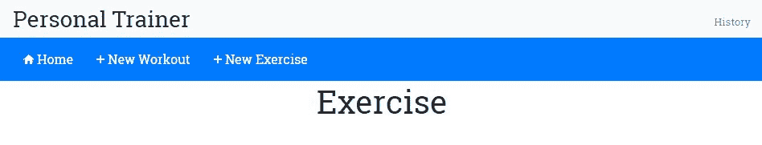

# 个人教练

*7 分钟训练*应用程序为我们了解 Angular 提供了一个极好的机会。在处理应用程序的过程中，我们已经覆盖了许多 Angular 结构。然而，像 Angular 表单支持和客户端-服务器通信这样的领域仍然未被探索。这部分原因是，从功能角度来看，7 分钟训练与最终用户的接触点有限。交互仅限于开始、停止和暂停训练。此外，应用程序既不消耗也不产生任何数据（除了训练历史）。

在本章中，我们计划深入探讨上述两个领域之一，即 Angular 表单支持。保持健康和健身主题（无意中打趣），我们计划构建一个*个人教练*应用程序。新应用程序将是*7 分钟训练*的扩展，允许我们构建自己的定制训练计划，这些计划不仅限于我们已有的*7 分钟训练*计划。

本章致力于理解 Angular 表单以及如何在构建*个人教练*应用程序时使用它们。

本章我们将涵盖以下主题：

+   **定义个人教练需求**：由于我们在本章中构建了一个新应用程序，因此我们首先定义应用程序需求。

+   **定义个人教练模型**：任何应用程序设计都始于定义其模型。我们为*个人教练*定义了模型，这与之前构建的*7 分钟训练*应用程序类似。

+   **定义个人教练布局和导航**：我们定义了新应用程序的布局、导航模式和视图。我们还设置了一个与 Angular 路由和主视图集成的导航系统。

+   **添加支持页面**：在我们专注于表单功能并构建训练组件之前，我们构建了一些用于训练和运动列表的支持组件。

+   **定义训练构建器组件结构**：我们规划出我们将使用的训练构建器组件来管理训练计划。

+   **构建表单**：我们广泛使用 HTML 表单和输入元素来创建自定义训练计划。在这个过程中，我们将学习更多关于 Angular 表单的知识。我们涵盖的概念包括：

    +   **表单类型**：可以使用 Angular 构建两种类型的表单：模板驱动和响应式。在本章中，我们正在使用模板驱动和响应式表单。

    +   **ngModel**：这为模板驱动的表单提供了双向数据绑定，并允许我们跟踪更改和验证表单输入。

    +   **响应式表单控件**：这些包括表单构建器、表单控件、表单组和表单数组。这些用于以编程方式构建表单。

    +   **数据格式化**：这些是允许我们为用户反馈添加样式的 CSS 类。

    +   **输入验证**：我们将了解 Angular 表单的验证功能。

# 个人教练应用程序 - 问题范围

*7 分钟锻炼*应用程序很好，但如果我们能创建一个允许我们构建更多此类锻炼程序的应用程序，这些程序根据我们的健身水平和强度需求定制，会怎样呢？有了这种灵活性，我们可以构建任何类型的锻炼，无论是 7 分钟、8 分钟、15 分钟还是其他任何变化。机会是无限的。

在这个前提下，让我们开始构建自己的*个人教练*应用程序的旅程，这个应用程序可以帮助我们根据我们的具体需求创建和管理训练/锻炼计划。让我们从定义应用程序的需求开始。

新的*个人教练*应用程序将包括现有的*7 分钟锻炼*应用程序。支持锻炼创建的组件将被称为锻炼构建器。*7 分钟锻炼*应用程序本身也将被称为锻炼运行器。在接下来的章节中，我们将修复*锻炼运行器*，使其能够运行使用*锻炼构建器*创建的任何锻炼。

# 个人教练需求

基于管理和锻炼的概念，以下是我们*个人教练*应用程序应该满足的一些需求：

+   列出所有可用锻炼的能力

+   创建和编辑锻炼的能力。在创建和编辑锻炼时，它应该具备：

    +   添加锻炼属性的能力，包括名称、标题、描述和休息时长

    +   为锻炼添加/删除多个锻炼的能力

    +   在锻炼中排列锻炼的能力

    +   保存锻炼数据的能力

+   列出所有可用锻炼的能力

+   创建和编辑锻炼的能力。在创建和编辑锻炼时，它应该具备：

    +   添加锻炼属性的能力，如名称、标题、描述和程序

    +   为锻炼添加图片的能力

    +   为锻炼添加相关视频的能力

    +   为锻炼添加音频提示的能力

所有要求似乎都很直观，所以让我们从应用程序的设计开始。按照惯例，我们首先需要考虑可以支持这些需求的模型。

# 个人教练模型

没有惊喜！个人教练模型本身是在创建*7 分钟锻炼*应用程序时定义的。锻炼和锻炼的两个核心概念对*个人教练*同样适用。

现有的锻炼模型唯一的问题是它位于`workout-runner`目录中。这意味着为了使用它，我们必须从该目录导入它。将模型移动到`core`文件夹中更有意义，这样就可以清楚地知道它可以跨功能使用。我们将在本章中这样做。

# 开始编写个人教练的代码

首先，从 GitHub 仓库中书的`checkpoint4.1`下载新的*个人教练*应用程序的基础版本。

代码可在 GitHub [`github.com/chandermani/angular6byexample`](https://github.com/chandermani/angular6byexample) 上供大家下载。检查点作为 GitHub 上的分支实现。要下载的分支如下：`GitHub Branch: checkpoint4.1`。如果你不使用 Git，可以从以下 GitHub 位置下载 Checkpoint 4.1 的快照（ZIP 文件）：[`github.com/chandermani/angular6byexample/archive/checkpoint4.1.zip`](https://github.com/chandermani/angular6byexample/archive/checkpoint4.1.zip)。在首次设置快照时，请参考 `trainer` 文件夹中的 `README.md` 文件。

这段代码包含了完整的 *7 分钟健身 (Workout Runner)* 应用。我们添加了一些更多内容来支持新的 *个人教练* 应用。一些相关的更新包括：

+   添加新的 `WorkoutBuilder` 功能。这个功能包含与 *个人教练* 相关的实现。

+   更新应用布局和样式。

+   在 `trainer/src/app` 目录下的 `workout-builder` 文件夹中添加一些组件和带有占位符内容的 HTML 模板，用于 *个人教练*。

+   定义一个新的路由到 `WorkoutBuilder` 功能。我们将在下一节中介绍如何在应用中设置此路由。

+   正如我们刚才提到的，将现有的 `model.ts` 文件移动到 `core` 文件夹。

让我们讨论我们将如何使用模型。

# 在 `trainer/src/app` 目录下的 `workout-builder` 文件夹中使用个人教练模型。

在最后一章，我们专门用一节来介绍学习 Angular 服务，我们发现服务对于在控制器和其他 Angular 构造之间共享数据很有用。打开位于 `app` 目录下 `core` 文件夹中的 `model.ts` 文件。在这个类中，我们实际上没有任何数据，而是一个描述数据形状的蓝图。计划使用服务来公开这个模型结构。我们已经在 Workout Runner 中做到了这一点。现在，我们将在 Workout Builder 中做同样的事情。

`model.ts` 文件已被移动到 `core` 文件夹，因为它在 *Workout Builder* 和 *Workout Runner* 应用之间是共享的。注意：在 `checkpoint4.1` 中，我们已经更新了 `workout-runner.component.ts`、`workout-audio.component.ts` 和 `workout-history-tracker-service.ts` 中的导入语句，以反映这一变化。

在第二章，“构建我们的第一个应用 - 7 分钟健身”，我们回顾了模型文件中的类定义：`Exercise`、`ExercisePlan` 和 `WorkoutPlan`**。** 正如我们当时提到的，这三个类构成了我们的基础模型。我们现在将开始在新的应用中使用这个基础模型。

在模型设计方面就这些了。接下来我们要做的是为新应用定义结构。

# 个人教练布局

*个人教练* 的骨架结构如下所示：


这包含以下组件：

+   顶部导航：这包含应用品牌标题和历史链接。

+   子导航：这包含根据活动组件变化的导航元素。

+   左侧导航：这包含依赖于活动组件的元素。

+   内容区域：这是我们的组件主视图将显示的地方。这是大多数动作发生的地方。我们将创建/编辑练习和锻炼，并在这里显示练习和锻炼的列表。

查看源代码文件；在 `trainer/src/app` 下有一个新的文件夹 `workout-builder`。它为之前描述的每个组件都有文件，其中包含一些占位符内容。我们将随着本章的进行构建这些组件。

然而，我们首先需要在应用程序中链接这些组件。这需要我们定义锻炼构建器应用程序的导航模式，并相应地定义应用程序路由。

# 带有路由的个人教练导航

我们计划为应用程序使用的导航模式是列表-详情模式。我们将为应用程序中可用的练习和锻炼创建列表页面。点击任何列表项将带我们到项目的详细视图，在那里我们可以执行所有 CRUD 操作（创建/读取/更新/删除）。以下路由遵循此模式：

| **路由** | **描述** |
| --- | --- |
| `/builder` | 这只是重定向到 `builder/workouts` |
| `/builder/workouts` | 这列出了所有可用的锻炼。这是 *锻炼构建器* 的着陆页 |
| `/builder/workout/new` | 这创建一个新的锻炼 |
| `/builder/workout/:id` | 这编辑具有特定 ID 的现有锻炼 |
| `/builder/exercises` | 这列出了所有可用的练习 |
| `/builder/exercise/new` | 这创建一个新的练习 |
| `/builder/exercise/:id` | 这编辑具有特定 ID 的现有练习 |

# 开始使用个人教练导航

在这一点上，如果您查看 `src/app` 文件夹中的 `app-routing.module.ts` 中的路由配置，您将找到一个新路由定义，`builder`：

```js
const routes: Routes = [
    ...
    { path: 'builder', component: WorkoutBuilderComponent },
    ...
];
```

如果您运行应用程序，您将看到启动屏幕显示了另一个链接，创建一个锻炼：


在幕后，我们已将另一个路由链接添加到 `start.component.html`：

```js
<a routerLink="/builder" class="btn btn-primary btn-lg btn-block" role="button" aria-pressed="true">
   <span>Create a Workout</span>
   <span class="ion-md-add"></span>
</a>
```

如果您点击此链接，您将被带到以下视图：


再次，在幕后，我们已将 `workout-builder.component.ts` 添加到 `trainer/src/app/workout-builder` 文件夹中，并具有以下内联模板：

```js
  template: `
    <div class="row">
      <div class="col-sm-3"></div>
      <div class="col-sm-6">
          <h1 class="text-center">Workout Builder</h1>
      </div>
      <div class="col-sm-3"></div>
    </div>
  `
```

并且这个视图在标题下通过我们的 `app.component.html` 模板中的路由出口显示：

```js
<div class="container body-content app-container"> 
    <router-outlet></router-outlet> 
</div>` 
```

我们将此组件（以及我们为此功能伪造的其他文件）包裹在一个名为 `workout-builder.module.ts` 的新模块中：

```js
import { NgModule } from '@angular/core';
import { CommonModule } from '@angular/common';

import { WorkoutBuilderComponent } from './workout-builder.component';
import { ExerciseComponent } from './exercise/exercise.component';
import { ExercisesComponent } from './exercises/exercises.component';
import { WorkoutComponent } from './workout/workout.component';
import { WorkoutsComponent } from './workouts/workouts.component';

@NgModule({
  imports: [
    CommonModule
  ],
  declarations: [WorkoutBuilderComponent, ExerciseComponent, ExercisesComponent, WorkoutComponent, WorkoutsComponent]
})
export class WorkoutBuilderModule { }
```

在这里，与其他我们创建的模块相比，唯一可能看起来不同的地方是，我们导入的是 `CommonModule` 而不是 `BrowserModule`。这避免了第二次导入整个 `BrowserModule`，这在我们实现此模块的懒加载时会产生错误。

最后，我们在 `app.module.ts` 中添加了对该模块的导入：

```js
  ... 
@NgModule({ 
  imports: [ 
  ... 
 WorkoutBuilderModule], 
  ... 
```

所以，这里没有什么令人惊讶的。这些都是我们在前几章中介绍的基本组件构建和路由模式。遵循这些模式，我们现在应该开始考虑为我们的新功能添加之前概述的附加导航。然而，在我们着手做这件事之前，还有一些事情我们需要考虑。

首先，如果我们开始将我们的路由添加到 `app.routing-module.ts` 文件中，那么存储在那里的路由数量将会增加。这些新的 *Workout Builder* 路由也将与 *Workout Runner* 的路由混合在一起**。虽然我们现在添加的路由数量可能看起来微不足道，但长期来看，这可能会成为一个维护问题。

其次，我们需要考虑的是，我们的应用程序现在由两个功能组成——*Workout Runner* 和 *Workout Builder*。我们应该思考如何在我们的应用程序中分离这些功能，以便它们可以独立于彼此开发。

换句话说，我们希望我们构建的功能之间有**松散耦合**。使用这种模式允许我们在不影响其他功能的情况下，在我们的应用程序中替换掉一个功能。例如，在某个时候，我们可能希望将 *Workout Runner* 转换为移动应用，但保留 *Workout Builder* 作为基于网络的程序。

回到第一章，我们强调了这种将我们的组件彼此分离的能力是使用 Angular 实现的 **组件设计模式** 的关键优势之一。幸运的是，Angular 的路由器为我们提供了将我们的路由分离成逻辑上组织良好的 **路由配置** 的能力，这些配置与应用程序中的功能紧密匹配。

为了实现这种分离，Angular 允许我们使用 **子路由**，这样我们就可以隔离我们每个功能的路由。在本章中，我们将使用 **子路由** 来分离 *Workout Builder* 的路由。

# 向 *Workout Builder* 引入子路由

Angular 通过提供在应用程序中创建路由组件层次结构的能力来支持我们隔离新 *Workout Builder* 路由的目标。我们目前只有一个路由组件，它位于我们应用程序的根组件中。但 Angular 允许我们在根组件下添加所谓的 **子路由组件**。这意味着一个功能可以无视另一个功能使用的路由，每个功能都可以自由地根据该功能内部的变化调整其路由。

回到我们的应用程序，我们可以使用 Angular 的 **子路由** 来匹配我们应用程序两个功能的路由与将使用它们的代码。因此，在我们的应用程序中，我们可以将路由结构化为以下路由层次结构，用于我们的 *Workout Builder*（在这个阶段，我们将 *Workout Runner* 保持原样，以展示前后对比）：


采用这种方法，我们可以通过功能对路由进行逻辑分离，使它们更容易管理和维护。

因此，让我们开始通过向我们的应用程序添加子路由来启动。

从本节此点开始，我们将添加本章之前下载的代码。如果您想查看下一节的完整代码，可以从 GitHub 仓库中的`checkpoint 4.2`下载。如果您想在我们构建本节代码时一起工作，请确保添加`trainer/src`文件夹中包含此检查点的`styles.css`中的更改，因为我们在这里不会讨论它们。同时，请确保添加来自仓库中`trainer/src/app/workout-builder`文件夹的练习（exercise）、锻炼（workout）和导航文件。在这个阶段，这些只是占位符文件，我们将在本章的后面实现它们。然而，您需要这些占位符文件来实现*锻炼构建器*模块的导航。代码可在 GitHub 上供所有人下载，网址为[`github.com/chandermani/angular6byexample`](https://github.com/chandermani/angular6byexample)。检查点作为 GitHub 上的分支实现。要下载的分支如下：`GitHub Branch: checkpoint4.2`。如果您不使用 Git，可以从以下 GitHub 位置下载`Checkpoint 4.2`的快照（ZIP 文件）：[`github.com/chandermani/angular6byexample/archive/checkpoint4.2.zip`](https://github.com/chandermani/angular6byexample/archive/checkpoint4.2.zip)。在首次设置快照时，请参阅`trainer`文件夹中的`README.md`文件。

# 添加子路由组件

在`workout-builder`目录下，添加一个名为`workout-builder.routing.module.ts`的新 TypeScript 文件，并包含以下导入：

```js
import { NgModule } from '@angular/core';
import { Routes, RouterModule } from '@angular/router';
import { WorkoutBuilderComponent } from './workout-builder.component';
import { WorkoutsComponent } from './workouts/workouts.component';
import { WorkoutComponent } from './workout/workout.component';
import { ExercisesComponent } from './exercises/exercises.component';
import { ExerciseComponent } from './exercise/exercise.component';
```

如您所见，我们正在导入刚才提到的组件；它们将成为我们*锻炼构建器*（exercise、exercises、workout 和 workouts）的一部分。与这些导入一起，我们还从 Angular 核心模块中导入`NgModule`，从 Angular 路由模块中导入`Routes`和`RouterModule`。这些导入将使我们能够添加和导出子路由。

我们在这里没有使用 Angular CLI，因为它没有创建路由模块的独立蓝图。然而，您可以在创建模块时使用`--routing`选项让 CLI 创建路由模块。在这种情况下，我们已经有了一个现有的模块创建，所以不能使用该标志。有关如何操作的更多详细信息，请参阅[`github.com/angular/angular-cli/blob/master/docs/documentation/stories/routing.md`](https://github.com/angular/angular-cli/blob/master/docs/documentation/stories/routing.md)。

然后，将以下路由配置添加到文件中：

```js
const routes: Routes = [
  {
    path: 'builder',
    component: WorkoutBuilderComponent,
    children: [
         {path: '', pathMatch: 'full', redirectTo: 'workouts'},
         {path: 'workouts', component: WorkoutsComponent },
         {path: 'workout/new', component: WorkoutComponent },
         {path: 'workout/:id', component: WorkoutComponent },
         {path: 'exercises', component: ExercisesComponent},
         {path: 'exercise/new', component: ExerciseComponent },
         {path: 'exercise/:id', component: ExerciseComponent }
    ]
  },
];
```

第一个配置，`path: 'builder'`，设置了子路由的基本 URL，以便每个子路由都将其作为前缀。下一个配置将`WorkoutBuilder`组件标识为该文件中子组件的特征区域根组件。这意味着它将是使用`router-outlet`显示每个子组件的组件。最后的配置是一个或多个子组件的列表，它定义了子组件的路由。

这里需要注意的一点是，我们已经使用以下配置将`Workouts`设置为子路由的默认值：

```js
{path:'', pathMatch: 'full', redirectTo: 'workouts'}, 

```

此配置表示，如果有人导航到`builder`，他们将被重定向到`builder/workouts`路由。`pathMatch: 'full'`设置意味着只有当 workout/builder 之后的路径是一个空字符串时，才会进行匹配。这防止了如果路由是其他内容（如`workout/builder/exercises`或我们在该文件中配置的其他任何路由）时发生重定向。

最后，添加以下类声明，前面加上`@NgModule`装饰器，该装饰器定义了模块的导入和导出：

```js
@NgModule({
  imports: [RouterModule.forChild(routes)],
  exports: [RouterModule]
})
export class WorkoutBuilderRoutingModule { }
```

这个导入与`app.routing-module.ts`中的导入非常相似，只有一个区别：我们使用的是`RouterModule.forChild`而不是`RouterModule.forRoot`。这种差异的原因可能看起来很明显：我们正在创建子路由，而不是应用程序根目录中的路由，这就是我们表示的方式。然而，在底层，有一个显著的区别。这是因为我们的应用程序中不能有多个活动的路由服务。`forRoot`创建路由服务，但`forChild`不创建。

# 更新 WorkoutBuilder 组件

接下来，我们需要更新`WorkoutBuilder`组件以支持我们新的子路由。为此，将`Workout Builder`的`@Component`装饰器更改为：

1.  移除`selector`

1.  在模板中添加一个`<abe-sub-nav-main>`自定义元素

1.  在模板中添加一个`<router-outlet>`标签

装饰器现在应该看起来像以下这样：

```js
@Component({
  template: `<div class="container-fluid fixed-top mt-5">
                <div class="row mt-5">
                  <abe-sub-nav-main></abe-sub-nav-main>
                </div>
                <div class="row mt-2">
                  <div class="col-sm-12">
                    <router-outlet></router-outlet>
                  </div>
                </div>
            <div>`
})
```

我们正在移除选择器，因为`WorkoutBuilderComponent`将不会嵌入到应用程序根目录`app.component.ts`中。相反，它将通过路由从`app.routing-module.ts`访问。虽然它将处理来自`app.routes.ts`的传入路由请求，但它将反过来将它们路由到 Workout Builder 功能中包含的其他组件。

这些组件将使用我们刚刚添加到`WorkoutBuilder`模板中的`<router-outlet>`标签来显示它们的视图。鉴于`Workout BuilderComponent`的模板将是简单的，我们使用内联`template`而不是`templateUrl`。

通常，对于组件的视图，我们建议使用指向单独 HTML 模板文件的`templateUrl`。当你预计视图将涉及超过几行 HTML 时，这一点尤其正确。在这种情况下，在它自己的 HTML 文件中处理视图要容易得多。

我们还添加了一个`<abe-sub-nav-main>`元素，它将被用来创建一个用于在*Workout Builder*功能中导航的二级顶级菜单。我们将在本章稍后讨论这一点。

# 更新 Workout Builder 模块

现在，让我们更新`WorkoutBuilderModule`。首先，将以下导入添加到文件中：

```js
import { WorkoutBuilderRoutingModule } from './workout-builder-routing.module';
```

它导入了我们刚刚设置的子路由。

接下来，更新`@NgModule`装饰器以添加`workoutBuilderRoutingModule`：

```js
...
@NgModule({
  imports: [
    CommonModule,
    WorkoutBuilderRoutingModule
  ],
...
}) 
```

最后，添加可在`checkpoint4.2`中找到的新导航组件的导入和声明：

```js
import { LeftNavExercisesComponent } from './navigation/left-nav-exercises.component';
import { LeftNavMainComponent } from './navigation/left-nav-main.component';
import { SubNavMainComponent } from './navigation/sub-nav-main.component';
...
  declarations: [
    ...
    LeftNavExercisesComponent,
    LeftNavMainComponent,
    SubNavMainComponent]
```

# 更新 App 路由模块

最后一步：回到`app.routing-module.ts`，移除对`WorkoutBuilderComponent`的导入以及指向构建器的路由定义：`{ path: 'builder', component: WorkoutBuilderComponent },`。

请确保在`app.module.ts`中保持对`WorkoutBuilderModule`的导入不变。我们将在下一节讨论懒加载时讨论移除它。

# 整合所有内容

从上一章，我们已经知道如何设置应用程序的根路由。但现在，我们有的不是根路由，而是包含子路由的区域或功能路由。我们已经能够实现之前讨论的关注点分离，因此现在所有与*Workout Builder*相关的路由都分别包含在其自己的路由配置中。这意味着我们可以在`WorkoutBuilderRoutes`组件中管理所有与*Workout Builder*相关的路由，而不会影响应用程序的其他部分。

如果我们现在从起始页面导航到 Workout Builder，我们可以看到路由器是如何将`app.routes.ts`中的路由与`workout-builder.routes.ts`中的默认路由组合起来的。


如果我们在浏览器中查看 URL，它是`/builder/workouts`。你可能还记得，起始页面上的路由链接是`['/builder']`。那么路由器是如何带我们到这个位置的？

它这样做：当点击链接时，Angular 路由器首先在`app-routing.module.ts`中查找`builder`路径，因为该文件包含我们应用程序根路由的配置。路由器找不到该路径，因为我们已经从该文件的路由中移除了它。

然而，`WorkoutBuilderModule`已被导入到我们的`AppModule`中，而该模块又导入`workoutBuilderRoutingModule`。后一个文件包含我们刚刚配置的子路由。路由器发现该文件中的`builder`是父路由，因此它使用该路由。它还发现默认设置，在`builder`路径以空字符串结束的情况下（在本例中就是这样），将重定向到子路径`workouts`。

如果您查看屏幕，您会看到它正在显示`Workouts`视图（而不是之前的*Workout Builder*）。这意味着路由器已成功将请求路由到`WorkoutsComponent`，这是我们在`workoutBuilderRoutingModule`中设置的子路由配置中的默认路由组件。

这里展示了路由解析的过程：


最后关于子路由的一点思考。当您查看我们的子路由组件`workout-builder.component.ts`时，您会看到它没有对其父组件`app.component.ts`的引用（正如我们之前提到的，`<selector>`标签已被移除，因此`WorkoutBuilderComponent`没有被嵌入到根组件中）。这意味着我们已经成功地将`WorkoutBuilderComponent`（以及所有在`WorkoutBuilderModule`中导入的相关组件）封装起来，这样我们就可以将其移动到应用程序的任何其他位置，甚至可以移动到一个新的应用程序中。

现在，是我们将 Workout Builder 的路由转换为使用懒加载并构建其导航菜单的时候了。如果您想查看下一节完成的代码，可以从`checkpoint 4.3`的配套代码库中下载。再次提醒，如果您在我们构建应用程序的同时工作，请确保更新`styles.css`文件，这里我们未对其进行讨论。

代码也已在 GitHub 上供所有人下载，链接为[`github.com/chandermani/angular6byexample`](https://github.com/chandermani/angular6byexample)。检查点作为 GitHub 上的分支实现。要下载的分支如下：`GitHub Branch: checkpoint4.3`（文件夹 - `trainer`）。如果您不使用 Git，可以从以下 GitHub 位置下载`Checkpoint 4.3`的快照（ZIP 文件）：[`github.com/chandermani/angular6byexample/archive/checkpoint4.3.zip`](https://github.com/chandermani/angular6byexample/archive/checkpoint4.3.zip)。在首次设置快照时，请参考`trainer`文件夹中的`README.md`文件。

# 路由的懒加载

当我们推出我们的应用程序时，我们预计我们的用户将每天访问*Workout Runner*（我们知道这对你来说也是这样！）。但是，我们预计他们只会偶尔使用*Workout Builder*来构建他们的锻炼和训练计划。因此，如果我们能在用户只在*Workout Runner*中做锻炼时避免加载*Workout Builder*的开销，那就太好了。相反，我们更希望用户在想要添加或更新他们的锻炼和训练计划时才按需加载 Workout Builder。这种方法被称为懒加载。懒加载允许我们在加载模块时采用异步方法。这意味着我们可以只加载启动应用程序所需的资源，然后根据需要加载其他模块。

在幕后，当我们使用 Angular CLI 构建和提供我们的应用程序时，它使用 WebPack 的打包和分块功能来实现懒加载。我们将随着在应用程序中实现懒加载的过程来讨论这些功能。

因此，在我们的*个人教练*应用程序中，我们希望改变应用程序，使其仅在需要时才加载**Workout Builder**。Angular 路由器允许我们通过懒加载来实现这一点。

在我们开始实现懒加载之前，让我们先看看我们的当前应用程序以及它是如何加载我们的模块的。在“源”标签页中打开开发者工具，启动应用程序；当启动页面出现在你的浏览器中时，如果你在源树中的 webpack 节点下查看，你会看到应用程序中的所有文件都已加载，包括*Workout Runner*和*Workout Builder*文件：


因此，即使我们可能只想使用*Workout Runner*，我们也必须加载*Workout Builder*。从某种意义上说，如果你将我们的应用程序视为**单页应用程序**（SPA），这就有道理了。为了避免往返服务器，SPA 通常会在用户首次启动应用程序时加载所有将需要的资源。但在我们的情况下，重要的点是我们在应用程序首次加载时不需要*Workout Builder*。相反，我们希望在用户决定添加或更改锻炼或练习时才加载这些资源。

那么，让我们开始实现这一目标。

首先，修改`app.routing-module.ts`以添加以下路由配置`WorkoutBuilderModule`：

```js
const routes: Routes = [
    ...
    { path: 'builder', loadChildren: './workout-builder/workout-builder.module#WorkoutBuilderModule'},
    { path: '**', redirectTo: '/start' }
];
```

注意到`loadChildren`属性是：

```js
module file path + # + module name 
```

此配置提供了加载和实例化`WorkoutBuilderModule`所需的信息。

接下来回到`workout-builder-routing.module.ts`，将`path`属性更改为空字符串：

```js
export const Routes: Routes = [ 
    { 
 path: '', 
. . . 
    } 
]; 
```

我们进行此更改是因为我们现在将路径（`builder`）设置为`WorkoutBuilderRoutes`，这是我们在`app.routing-module.ts`中添加的新配置。

最后，回到`app-module.ts`文件，并从该文件的`@NgModule`配置中移除`WorkoutBuilderModule`导入。这意味着，我们不是在应用程序首次启动时加载**锻炼构建者**功能，而是在用户访问*锻炼构建者*路由时才加载它。

让我们再次使用`ng serve`构建和运行应用程序。在终端窗口中，你应该会看到以下类似的输出：


这里有趣的是最后一行，它显示了名为`workout.builder.module`的单独文件，即`workout-builder.module.chunk.js`。**WebPack**使用了所谓的代码拆分，将我们的锻炼构建者模块分割成单独的块。这个块将在需要时（即，当路由导航到`WorkoutBuilderModule`时）才被加载到我们的应用程序中。

现在，在 Chrome 开发者工具中保持“源”标签页打开，再次在浏览器中打开应用程序。当起始页面加载时，只有与*锻炼运行者*相关的文件出现，而没有与*锻炼构建者*相关的文件，如图所示：


然后，如果我们清除“网络”标签页并点击“创建锻炼”链接，我们将看到`workout-builder.module`块被加载：


这意味着我们已经实现了新功能的封装，并且通过异步路由，我们能够使用懒加载仅在需要时加载所有组件。

儿童和异步路由使得实现既能拥有蛋糕又能吃掉蛋糕的应用程序变得简单。一方面，我们可以构建具有强大客户端导航的单页应用（SPAs），另一方面，我们还可以将功能封装在独立的子路由组件中，并在需要时才加载它们。

这种 Angular 路由的强大和灵活性使我们能够通过将应用程序的行为和响应性紧密映射到用户使用应用程序的方式，来满足用户期望。在这种情况下，我们利用了这些能力来实现我们的目标：立即加载*锻炼运行者*，以便我们的用户可以立即开始锻炼，同时避免加载*锻炼构建者*的开销，并且只在用户想要构建锻炼时才提供它。

现在，我们已经将路由配置设置在*锻炼构建者*中，我们将把注意力转向构建子级和左侧导航；这将使我们能够使用这种路由。接下来的几节将介绍如何实现这种导航。

# 集成子级和侧级导航

将子级和侧级导航集成到应用程序中的基本思想是提供上下文感知的子视图，这些视图根据活动视图而变化。例如，当我们处于列表页面而不是编辑项目时，我们可能希望在导航中显示不同的元素。电子商务网站是这种情况的一个很好的例子。想象一下亚马逊的搜索结果页面和产品详情页面。当上下文从产品列表变为特定产品时，加载的导航元素也会发生变化。

# 子级导航

我们首先将在 *Workout Builder* 中添加子级导航。我们已将 `SubNavMainComponent` 导入到 *Workout Builder* 中。但，目前它只是显示占位符内容：


我们现在将替换该内容为三个路由链接：主页、新建锻炼和新建练习。

打开 `sub-nav-main.component.html` 文件，将其中的 HTML 更改为以下内容：

```js
<nav class="navbar fixed-top navbar-dark bg-primary mt-5">
    <div>
        <a [routerLink]="['/builder/workouts']" class="btn btn-primary">
        <span class="ion-md-home"></span> Home
        </a>
        <a [routerLink]="['/builder/workout/new']" class="btn btn-primary">
        <span class="ion-md-add"></span> New Workout
        </a>
        <a [routerLink]="['/builder/exercise/new']" class="btn btn-primary">
        <span class="ion-md-add"></span> New Exercise
        </a>
    </div>
</nav>
```

现在，重新运行应用程序，您将看到三个导航链接。如果我们点击“新建练习”链接按钮，我们将被路由到 `ExerciseComponent`，其视图将在 *Workout Builder* 视图的 Router Outlet 中显示：



新建锻炼链接按钮将以类似的方式工作；当点击时，它将用户带到 `WorkoutComponent` 并在路由出口中显示其视图。点击主页链接按钮将用户返回到 `WorkoutsComponent` 并查看。

# 侧边导航

在 *Workout Builder* 中的侧级导航将根据我们导航到的子组件而有所不同。例如，当我们第一次导航到 *Workout Builder* 时，我们将被带到 Workouts 屏幕，因为 `WorkoutsComponent` 路由是 *Workout Builder* 的默认路由。该组件将需要侧边导航；它将允许我们选择查看锻炼列表或练习列表。

Angular 的组件化特性为我们提供了一个简单的方法来实现这些上下文敏感的菜单。我们可以为每个菜单定义新的组件，然后将它们导入到需要它们的组件中。在这种情况下，我们有三个组件需要侧边菜单：**Workouts**、**Exercises** 和 **Workout**。其中前两个组件实际上可以使用相同的菜单，所以我们实际上只需要两个侧边菜单组件：`LeftNavMainComponent`，它将类似于前面的菜单，将被 `Exercises` 和 `Workouts` 组件使用，以及 `LeftNavExercisesComponent`，它将包含现有练习的列表，并将被 `Workouts` 组件使用。

我们已经有了两个菜单组件的文件，包括模板文件，并将它们导入到 `WorkoutBuilderModule` 中。我们现在将它们集成到需要它们的组件中。

首先，修改 `workouts.component.html` 模板以添加菜单的选择器：

```js
<div class="row">
    <div>
        <abe-left-nav-main></abe-left-nav-main>
    </div>
    <div class="col-sm-10 builder-content">
        <h1 class="text-center">Workouts</h1>
    </div>
  </div>
```

然后，将`left-nav-main.component.html`中的占位文本替换为指向`WorkoutsComponent`和`ExercisesComponent`的导航链接：

```js
<div class="left-nav-bar">
    <div class="list-group">
        <a [routerLink]="['/builder/workouts']" class="list-group-item list-group-item-action">Workouts</a>
        <a [routerLink]="['/builder/exercises']" class="list-group-item list-group-item-action">Exercises</a>
    </div>
</div>
```

运行应用程序，你应该会看到以下内容：


按照完全相同的步骤完成`Exercises`组件的侧菜单。

我们在这里不会展示这个菜单的代码，但你可以在 GitHub 仓库的`checkpoint 4.3`中的`trainer/src/app`目录下的`workout-builder/exercises`文件夹中找到它。

对于锻炼屏幕的菜单，步骤相同，但你应该将`left-nav-exercises.component.html`更改为以下内容：

```js
<div class="left-nav-bar">
  <h3>Exercises</h3>
</div> 
```

我们将使用此模板作为构建屏幕左侧将出现并可以选择包含在锻炼中的锻炼列表的起点。

# 实现锻炼和锻炼列表

在我们开始实现锻炼和锻炼列表页面之前，我们需要一个用于锻炼和锻炼数据的存储库。当前的计划是使用内存中的存储库并通过 Angular 服务公开它。在第五章*支持服务器数据持久性*中，我们将讨论服务器交互，我们将把此数据移动到服务器存储库以实现长期持久性。目前，内存存储库就足够了。让我们添加存储库实现。

# 将 WorkoutService 作为锻炼和锻炼仓库

此处的计划是创建一个`WorkoutService`实例，该实例负责在两个应用程序之间公开锻炼和锻炼数据。该服务的主要职责包括：

+   **与锻炼相关的 CRUD 操作**：获取所有锻炼，根据名称获取特定锻炼，创建锻炼，更新锻炼，以及删除它

+   **与锻炼相关的 CRUD 操作**：这些操作与与锻炼相关的操作类似，但针对的是锻炼实体

代码可在 GitHub 上下载，网址为[`github.com/chandermani/angular6byexample`](https://github.com/chandermani/angular6byexample)。要下载的分支如下：**GitHub 分支：checkpoint4.4**（文件夹—`trainer`）。如果你不使用 Git，可以从以下 GitHub 位置下载`Checkpoint 4.4`的快照（ZIP 文件）：[`github.com/chandermani/angular6byexample/archive/checkpoint4.4.zip`](https://github.com/chandermani/angular6byexample/archive/checkpoint4.4.zip)。在首次设置快照时，请参考`trainer`文件夹中的`README.md`文件。再次提醒，如果你在我们构建应用程序的同时工作，请确保更新`styles.css`文件，这里我们不做讨论。因为本节中的一些文件相当长，我们有时会建议你直接将文件复制到你的解决方案中。

在`trainer/src/core`文件夹中定位`workout-service.ts`。该文件中的代码应该如下所示，除了省略了长度较长的两个方法`setupInitialExercises`和`setupInitialWorkouts`：

```js
import {Injectable} from '@angular/core'; 
import {ExercisePlan} from './model'; 
import {WorkoutPlan} from './model'; 
import {Exercise} from "./model";
import { CoreModule } from './core.module'; 

@Injectable({
  providedIn: CoreModule
})
export class WorkoutService { 
    workouts: Array<WorkoutPlan> = []; 
    exercises: Array<Exercise> = []; 

    constructor() { 
        this.setupInitialExercises(); 
        this.setupInitialWorkouts(); 
    } 

    getExercises(){ 
        return this.exercises; 
    } 

    getWorkouts(){ 
        return this.workouts; 
    } 
    setupInitialExercises(){ 
     // implementation of in-memory store. 
    } 

    setupInitialWorkouts(){ 
     // implementation of in-memory store. 
    } 
}} 
```

正如我们之前提到的，Angular 服务的实现很简单。在这里，我们声明了一个名为`WorkoutService`的类，并用`@Injectable`装饰它。在`@Injectable`装饰器中，我们将`provided-in`属性设置为`CoreModule`。这会将`WorkoutService`注册为 Angular 依赖注入框架的一个提供者，并使其在整个应用程序中可用。

在类定义中，我们首先创建两个数组：一个用于`Workouts`，一个用于`Exercises`。这两个数组分别是`WorkoutPlan`和`Exercise`类型，因此我们需要从`model.ts`导入`WorkoutPlan`和`Exercise`以获取它们的类型定义。

构造函数调用两个方法来设置训练和服务的列表。目前，我们只是使用一个内存存储，用数据填充这些列表。

如其名称所示，两个方法`getExercises`和`getWorkouts`分别返回一个锻炼和训练列表。由于我们计划使用内存存储来存储训练和锻炼数据，`Workouts`和`Exercises`数组存储这些数据。随着我们的进行，我们将在服务中添加更多功能。

是时候构建训练和锻炼列表的组件了！

# 训练和锻炼列表组件

首先，在`trainer/src/app/workout-builder/workouts`文件夹中打开`workouts.component.ts`文件，并按如下方式更新导入：

```js
import { Component, OnInit } from '@angular/core';
import { Router } from '@angular/router';

import { WorkoutPlan } from '../../core/model';
import { WorkoutService } from '../../core/workout.service';; 
```

这段新代码导入了 Angular 的`Router`、`WorkoutService`以及`WorkoutPlan`类型。

接下来，用以下代码替换类定义：

```js
export class WorkoutsComponent implements OnInit { 
    workoutList:Array<WorkoutPlan> = []; 

    constructor( 
        public router:Router, 
        public workoutService:WorkoutService) {} 

    ngOnInit() { 
        this.workoutList = this.workoutService.getWorkouts(); 
    } 

    onSelect(workout: WorkoutPlan) { 
        this.router.navigate( ['./builder/workout', workout.name] ); 
    } 
} 
```

这段代码在构造函数中添加了`Router`和`WorkoutService`的注入。然后`ngOnInit`方法调用`WorkoutService`的`getWorkouts`方法，并用从该方法调用返回的`WorkoutPlans`列表填充`workoutList`数组。我们将使用这个`workoutList`数组来填充将在`Workouts`组件视图中显示的训练计划列表。

你会注意到我们将调用`WorkoutService`的代码放入了`ngOnInit`方法中。我们不想在构造函数中放置这段代码。最终，我们将用对外部数据存储的调用替换掉这个服务使用的内存存储，我们不希望组件的实例化受到这个调用的影响。将这些方法调用添加到构造函数中也会使组件的测试变得复杂。

为了避免这种意外的副作用，我们将其代码放置在`ngOnInit`方法中。该方法实现了 Angular 的生命周期钩子之一`OnInit`，Angular 在创建服务实例后调用此方法。这样，我们依赖 Angular 以可预测的方式调用此方法，而不会影响组件的实例化。

接下来，我们将对`Exercises`组件进行几乎相同的更改。与`Workouts`组件一样，这段代码将锻炼服务注入到我们的组件中。这次，我们使用锻炼服务来检索锻炼内容。

由于它与我们在`Workouts`组件中刚刚展示的内容非常相似，所以我们在这里不会展示那段代码。只需从`checkpoint 4.4`中的`workout-builder/exercises`文件夹添加即可。

# 锻炼和锻炼列表视图

现在，我们需要实现迄今为止一直为空的列表视图！

在本节中，我们将更新`checkpoint 4.3`中的代码，以包含`checkpoint 4.4`中的内容。所以如果你正在与我们一起编码，只需遵循本节中概述的步骤。如果你想查看完成的代码，只需将`checkpoint 4.4`中的文件复制到你的解决方案中即可。

# 锻炼列表视图

为了使视图工作，打开`workouts.component.html`并添加以下标记：

```js
<div class="row">
    <div>
        <abe-left-nav-main></abe-left-nav-main>
    </div>
    <div class="col-sm-10 builder-content">
        <h1 class="text-center">Workouts</h1>
        <div *ngFor="let workout of workoutList|orderBy:'title'" class="workout tile" (click)="onSelect(workout)">
          <div class="title">{{workout.title}}</div>
          <div class="stats">
              <span class="duration" title="Duration"><span class="ion-md-time"></span> - {{(workout.totalWorkoutDuration? workout.totalWorkoutDuration(): 0)|secondsToTime}}</span>
              <span class="float-right" title="Exercise Count"><span class="ion-md-list"></span> - {{workout.exercises.length}}</span>
          </div>
      </div>
    </div>
  </div>
```

我们正在使用 Angular 核心指令之一`ngFor`来遍历锻炼列表并在页面上显示它们。我们在`ngFor`前面添加`*`符号来标识它为 Angular 指令。使用`let`语句，我们将`workout`分配为本地变量，我们使用它来遍历锻炼列表并识别每个锻炼要显示的值（例如，`workout.title`）。然后，我们使用我们的自定义管道之一`orderBy`来按标题字母顺序显示锻炼列表。我们还使用另一个自定义管道`secondsToTime`来格式化显示的总锻炼时长。

如果你正在与我们一起编码，你需要将`secondsToTime`管道移动到共享文件夹中，并将其包含在`SharedModule`中。然后，将`SharedModule`添加到`WorkoutBuilderModule`中作为额外的导入。这个更改已经在 GitHub 仓库中的`checkpoint 4.4`中完成。

最后，我们将点击事件绑定到我们添加到组件中的以下`onSelect`方法：

```js
 onSelect(workout: WorkoutPlan) { 
     this.router.navigate( ['/builder/workout', workout.name] ); 
 }  
```

这设置了导航到锻炼详情页。当我们在锻炼列表中点击一个项目时发生此导航。选定的锻炼名称作为路由`/URL`的一部分传递到锻炼详情页。

好吧，刷新一下构建页面（`/builder/workouts`）；有一个锻炼列表，7 分钟锻炼。点击该锻炼的磁贴。你将被带到锻炼屏幕，并且锻炼名称`7MinWorkout`将出现在 URL 的末尾：


锻炼屏幕

# 锻炼列表视图

我们将遵循与`Workouts`列表视图相同的方法来处理`Exercises`列表视图，只是在这种情况下，我们将实际实现两个视图：一个用于`Exercises`组件（当用户导航到该组件时将在主要内容区域显示）和一个用于`LeftNavExercisesComponent`练习上下文菜单（当用户导航到`Workouts`组件以创建或编辑锻炼时将显示）。

对于`Exercises`组件，我们将遵循与我们在`Workouts`组件中显示锻炼列表几乎相同的方法。所以我们不会在这里展示那段代码。只需从`checkpoint 4.4`添加`exercises.component.ts`和`exercises.component.html`文件即可。

当你完成文件复制后，点击左侧导航中的“练习”链接来加载你在`WorkoutService`中已经配置的 12 个练习。

与`Workouts`列表一样，这设置了导航到锻炼详情页的设置。点击练习列表中的项目将带我们到锻炼详情页。选定的练习名称作为路由`/URL`的一部分传递到锻炼详情页。

在最终列表视图中，我们将添加一个将在*Workout Builder*屏幕的左侧上下文菜单中显示的练习列表。当我们创建或编辑锻炼时，此视图将在左侧导航中加载。使用 Angular 的基于组件的方法，我们将更新`leftNavExercisesComponent`及其相关视图以提供此功能。我们在这里不会展示那段代码。只需从`trainer/src/app/navigation`文件夹中的`checkpoint 4.4`添加`left-nav-exercises.component.ts`和`left-nav-exercises.component.html`文件即可。

完成那些文件的复制后，点击*Workout Builder*中的子导航菜单上的“新建锻炼”按钮，你现在将看到在左侧导航菜单中显示的练习列表——这些是我们已经在`WorkoutService`中配置好的练习。

是时候添加加载、保存和更新锻炼/锻炼数据的能力了！

# 建立锻炼

*Personal Trainer*的核心功能围绕着锻炼和锻炼构建。所有这些都是为了支持这两个功能。在本节中，我们专注于使用 Angular 构建和编辑锻炼。

`WorkoutPlan`模型已经定义，因此我们了解构成锻炼的元素。*Workout Builder*页面简化了用户输入，并允许我们构建/持久化锻炼数据。

完成后，*Workout Builder*页面将看起来像这样：


页面有一个左侧导航，列出了可以添加到锻炼中的所有练习。点击右侧的箭头图标将练习添加到锻炼的末尾。

中心区域被指定为健身建筑区域。它由从上到下排列的锻炼瓷砖和一个允许用户提供有关锻炼的其他详细信息（如名称、标题、描述和休息时长）的表单组成。

此页面以两种模式运行：

+   创建/新建：此模式用于创建新的锻炼。URL 是`#/builder/workout/new`。

+   编辑：此模式用于编辑现有的锻炼。URL 是`#/builder/workout/:id`，其中`:id`映射到锻炼的名称。

在理解了页面元素和布局之后，现在是时候构建这些元素中的每一个了。我们将从左侧导航（导航）开始。

# 完成左侧导航

在上一节结束时，我们更新了`Workout`组件的左侧导航视图，以显示锻炼列表。我们的意图是让用户点击一个练习旁边的箭头将其添加到锻炼中。当时，我们推迟了在`LeftNavExercisesComponent`中实现与该点击事件绑定的`addExercise`方法。现在，我们将继续这样做。

我们有几个选择。`LeftNavExercisesComponent`是`WorkoutComponent`的子组件，因此我们可以实现子/父组件间通信来完成这个任务。我们在上一章中讨论了这项技术，当时我们在处理*7 分钟锻炼*。

然而，将练习添加到锻炼是构建锻炼的更大过程的一部分，使用子/父组件间通信会使`AddExercise`方法的实现与其他我们将要添加的功能有所不同。

因此，遵循另一种数据共享方法更有意义，这种方法我们可以一致地用于构建锻炼的整个过程中。这种方法涉及使用服务。当我们开始添加创建实际锻炼的其他功能，例如保存/更新逻辑和实现其他相关组件时，走服务路线的好处将越来越明显。

因此，我们引入了一个新的服务：`WorkoutBuilderService`。`WorkoutBuilderService`服务的最终目标是协调在构建锻炼过程中`WorkoutService`（检索和持久化锻炼）和组件（如`LeftNavExercisesComponent`以及我们稍后将要添加的其他组件）之间的关系，从而将`WorkoutComponent`中的代码量减少到最低。

# 添加`WorkoutBuilderService`

`WorkoutBuilderService`监控应用程序用户正在构建的锻炼状态。它：

+   跟踪当前锻炼

+   创建新的锻炼

+   加载现有锻炼

+   保存锻炼

从`trainer/src/app`下的`workout-builder/builder-services`文件夹中的`checkpoint 4.5`复制`workout-builder-service.ts`

代码也可在 GitHub 上供所有人下载，链接为[`github.com/chandermani/angular6byexample`](https://github.com/chandermani/angular6byexample)。检查点作为 GitHub 上的分支实现。要下载的分支如下：`GitHub Branch: checkpoint4.5`（文件夹—`trainer`）。如果您不使用 Git，可以从以下 GitHub 位置下载`Checkpoint 4.5`的快照（ZIP 文件）：[`github.com/chandermani/angular6byexample/archive/checkpoint4.5.zip`](https://github.com/chandermani/angular6byexample/archive/checkpoint4.5.zip)。在首次设置快照时，请参考`trainer`文件夹中的`README.md`文件。再次提醒，如果您在我们构建应用程序的同时工作，请确保更新`styles.css`文件，这里我们不做讨论。

虽然我们通常使服务在应用程序范围内可用，但`WorkoutBuilderService`将仅用于`Workout Builder`功能。因此，我们不是在`AppModule`的提供者中注册它，而是在`WorkoutBuilderModule`的提供者数组中注册它，如下所示（在文件顶部添加导入之后）：

```js
@NgModule({
....
  providers: [WorkoutBuilderService]
})
```

将其作为提供者在这里意味着它仅在访问`Workout Builder`功能时加载，并且不能从该模块外部访问。这意味着它可以独立于应用程序中的其他模块进行发展，并且可以修改而不会影响应用程序的其他部分。

让我们看看服务的一些相关部分。

`WorkoutBuilderService`需要`WorkoutPlan`、`ExercisePlan`和`WorkoutService`的类型定义，因此我们将这些导入到组件中：

```js
import { WorkoutPlan, ExercisePlan } from '../../core/model';
import { WorkoutService } from '../../core/workout.service';
```

`WorkoutBuilderService`依赖于`WorkoutService`以提供持久性和查询功能。我们通过将`WorkoutService`注入到`WorkoutBuilderService`的构造函数中解决这个依赖关系**：

```js
 constructor(public workoutService: WorkoutService) {}
```

`WorkoutBuilderService`还需要跟踪正在构建的锻炼。我们使用`buildingWorkout`属性来完成这项工作。跟踪从我们在服务上调用`startBuilding`方法时开始：

```js
startBuilding(name: string){ 
    if(name){ 
        this.buildingWorkout = this.workoutService.getWorkout(name) 
        this.newWorkout = false; 
    }else{ 
        this.buildingWorkout = new WorkoutPlan("", "", 30, []); 
        this.newWorkout = true; 
    } 
    return this.buildingWorkout; 
} 
```

此跟踪功能背后的基本思想是设置一个`WorkoutPlan`对象（`buildingWorkout`），该对象将被提供给组件以操作锻炼细节。`startBuilding`方法接受锻炼名称作为参数。如果没有提供名称，则表示我们正在创建一个新的锻炼，因此创建一个新的`WorkoutPlan`对象并分配给它；如果没有，我们通过调用`WorkoutService.getWorkout(name)`来加载锻炼细节。在任何情况下，`buildingWorkout`对象都包含正在进行的锻炼。

`newWorkout`对象表示锻炼是新的还是现有的。它用于在调用此服务上的`save`方法时区分保存和更新情况。

其余的方法，`removeExercise`、`addExercise` 和 `moveExerciseTo`，都是一目了然的，并且会影响锻炼计划中的一部分锻炼列表（`buildingWorkout`）。

`WorkoutBuilderService` 在 `WorkoutService` 上调用一个新的方法 `getWorkout`，我们还没有添加。请从 `trainer/src/services` 文件夹下的 `workout-service.ts` 文件中复制 `getWorkout` 的实现。由于实现相当简单，我们不会过多关注新的服务代码。

让我们回到左侧导航并实现剩余的功能。

# 使用锻炼导航添加锻炼

要将锻炼添加到我们正在构建的锻炼计划中，我们只需导入 `WorkoutBuilderService` 和 `ExercisePlan`，将 `WorkoutBuilderService` 注入到 `LeftNavExercisesComponent` 中，并调用其 `addExercise` 方法，传递所选的锻炼作为参数：

```js
constructor( 
    public workoutService:WorkoutService, 
 public workoutBuilderService:WorkoutBuilderService) {} 
. . . 
addExercise(exercise:Exercise) { 
 this.workoutBuilderService.addExercise(new ExercisePlan(exercise, 30)); 
} 
```

在内部，`WorkoutBuilderService.addExercise` 通过新的锻炼更新 `buildingWorkout` 模型数据。

上述实现是独立组件之间共享数据的一个典型例子。共享服务以受控的方式向请求它的任何组件公开数据。在共享数据时，始终是一个好习惯使用方法而不是直接公开数据对象来公开状态/数据。我们可以在我们的组件和服务实现中看到这一点。`LeftNavExercisesComponent` 并不是直接更新锻炼数据；实际上，它没有直接访问正在构建的锻炼。相反，它依赖于服务方法 `addExercise` 来更改当前锻炼的锻炼列表。

由于服务是共享的，需要注意一些陷阱。由于服务可以通过系统注入，我们无法阻止任何组件依赖任何服务并以不一致的方式调用其函数，从而导致不期望的结果或错误。例如，在调用 `addExercise` 之前，`WorkoutBuilderService` 需要通过调用 `startBuilding` 来初始化。如果在初始化之前组件调用了 `addExercise` 会发生什么？

# 实现 Workout 组件

`WorkoutComponent` 负责管理锻炼。这包括创建、编辑和查看锻炼。由于引入了 `WorkoutBuilderService`，该组件的整体复杂性将降低。除了与模板视图集成、暴露和交互的主要责任外，我们将大部分其他工作委托给 `WorkoutBuilderService`。

`WorkoutComponent` 与两个 `routes/views` 相关联，即 `/builder/workout/new` 和 `/builder/workout/:id`。这些路由处理创建和编辑锻炼计划的情况。组件的第一项任务是加载或创建它需要操作的锻炼计划。

# 路由参数

在我们构建 `WorkoutComponent` 及其相关视图之前，我们需要简要介绍将用户带到该组件屏幕的导航。此组件处理创建和编辑锻炼场景。组件的第一个任务是加载或创建它需要操作的锻炼。我们计划使用 Angular 的路由框架将必要的数据传递给组件，以便它知道它是在编辑现有的锻炼还是创建一个新的锻炼，在现有锻炼的情况下，它应该编辑哪个组件。

这是如何完成的？`WorkoutComponent` 与两个路由相关联，即 `/builder/workout/new` 和 `/builder/workout/:id`。这两个路由之间的区别在于这些路由的末尾是什么；在一种情况下，它是 `/new`，在另一种情况下，是 `/:id`。这些被称为 **路由参数**。第二个路由中的 `:id` 是一个路由参数的占位符。路由器将占位符转换为锻炼组件的 ID。正如我们之前所看到的，这意味着在 *7 分钟锻炼* 的情况下，将传递给组件的 URL 将是 `/builder/workout/7MinuteWorkout`。

我们如何知道这个锻炼名称是正确的 ID 参数？如您所回忆的，当我们设置处理锻炼屏幕上锻炼瓷砖点击事件的程序时，该事件会将我们带到锻炼屏幕，我们指定锻炼名称作为 ID 的参数，如下所示：

```js
 onSelect(workout: WorkoutPlan) { 
     this.router.navigate( ['./builder/workout', workout.name] ); 
 }  
```

在这里，我们正在使用路由器的程序化接口构建路由（我们已经在上一章详细介绍了路由，所以这里不再重复）。`router.navigate` 方法接受一个数组。这被称为 **链接参数数组**。数组中的第一个元素是路由的路径，第二个是一个指定锻炼 ID 的路由参数。在这种情况下，我们将 `id` 参数设置为锻炼名称。根据我们在上一章对路由的讨论，我们知道我们也可以将相同类型的 URL 作为路由链接的一部分构建，或者简单地将其输入浏览器以到达锻炼屏幕并编辑特定的锻炼。

两条路径中的另一条以 `/new` 结尾。由于此路径没有 `token` 参数，路由器将直接将未修改的 URL 传递给 `WorkoutComponent`。然后 `WorkoutComponent` 需要解析传入的 URL 以识别它应该创建一个新的组件。

# 路由守卫

但在链接将用户带到 `WorkoutComponent` 之前，还有另一个步骤需要我们考虑。始终存在一种可能性，即用于编辑锻炼的 URL 中传递的 ID 可能是错误的或缺失的。在这些情况下，我们不希望组件加载，而是希望将用户重定向到另一个页面或返回他们来的地方。

Angular 提供了一种使用 **路由守卫** 来实现此结果的方法。正如其名所示，路由守卫 **提供了一种防止导航到路由** 的方式。路由守卫可以用来注入自定义逻辑，可以执行诸如检查授权、加载数据和进行其他验证以确定是否需要取消导航到组件等操作。而且所有这些都是在组件加载之前完成的，所以如果路由被取消，它永远不会被看到。

Angular 提供了多个路由守卫，包括 `CanActivate`、`CanActivateChild`、`CanDeActivate`、`Resolve` 和 `CanLoad`**.** 在这一点上，我们感兴趣的是 `Resolve` 路由守卫**. **`Resolve` 守卫将允许我们不仅检查是否存在一个锻炼项目，而且在加载 `WorkoutComponent` 之前加载与该锻炼项目相关的数据。这样做的好处是，我们避免了在 `WorkoutComponent` 中检查数据是否已加载的必要性，并且消除了在其组件模板中添加条件逻辑以确保数据在渲染时存在的需求。  这在下一章我们将开始使用 `observables` 时将特别有用，我们必须等待可观察对象完成，才能确保获得它将提供的数据。`Resolve` 守卫将处理等待可观察对象完成，这意味着 `WorkoutComponent` 在加载之前将确保拥有所需的数据。

# 实现 resolve 路由守卫

`Resolve` 守卫允许我们预取一个锻炼项目的数据。在我们的情况下，我们想要做的是使用 `Resolve` 来检查传递给现有锻炼项目的任何 ID 的有效性。具体来说，我们将通过调用 `WorkoutBuilderService` 来运行对该 ID 的检查，以检索锻炼计划并查看它是否存在。如果存在，我们将加载与锻炼计划相关的数据，以便它对 `WorkoutComponent` 可用；如果不存在，我们将重定向回锻炼项目屏幕。

将 `workout.resolver.ts` 从 `trainer/src/app/workout` 下的 `workout-builder/workout` 文件夹复制到 `checkpoint 4.5`，你将看到以下代码：

```js
import 'rxjs/add/operator/map';
import 'rxjs/add/operator/take';
import { Injectable } from '@angular/core';
import { Observable } from 'rxjs/Observable';
import { Router, Resolve, RouterStateSnapshot,
         ActivatedRouteSnapshot } from '@angular/router';
import { WorkoutPlan } from '../../core/model';
import { WorkoutBuilderService } from '../builder-services/workout-builder.service';

@Injectable()
export class WorkoutResolver implements Resolve<WorkoutPlan> {
  public workout: WorkoutPlan;

  constructor(
    public workoutBuilderService: WorkoutBuilderService,
    public router: Router) {}

  resolve(
    route: ActivatedRouteSnapshot,
    state: RouterStateSnapshot): WorkoutPlan {
    let workoutName = route.paramMap.get('id');

    if (!workoutName) {
        workoutName = '';
    }

    this.workout = this.workoutBuilderService.startBuilding(workoutName);

    if (this.workout) {
        return this.workout;
    } else { // workoutName not found
        this.router.navigate(['/builder/workouts']);
        return null;
    }
  }
}
```

如您所见，`WorkoutResolver` 是一个可注入的类，它实现了 `Resolve` 接口。  代码将 `WorkoutBuilderService` 和 `Router` 注入到类中，并通过 `resolve` 方法实现接口。`resolve` 方法接受两个参数；`ActivatedRouteSnapshot` 和 `RouterStateSnapshot`。在这种情况下，我们只对这两个参数中的第一个感兴趣，即 `ActivatedRouteSnapshot`。它包含一个 `paramMap`，从中我们提取出路由的 ID 参数。

然后，`resolve`方法使用路由中提供的参数调用`WorkoutBuildingService`的`startBuilding`方法。如果工作存在，则`resolve`返回数据并继续导航；如果不存在，它将用户重定向到工作页面并返回 false。如果传递`new`作为 ID，`WorkoutBuilderService`将加载一个新的工作，并且`Resolve`守卫将允许导航继续到`WorkoutComponent`。

`resolve`方法可以返回一个`Promise`、一个`Observable`或同步值。如果我们返回一个`Observable`，我们需要确保在导航之前`Observable`已经完成。然而，在这种情况下，我们正在对本地内存数据存储进行同步调用，所以我们只是返回一个值。

要完成`WorkoutResolver`的实现，首先确保将其导入并作为提供者添加到`WorkoutBuilderModule`中：

```js
....
import { WorkoutResolver } from './workout/workout.resolver';

@NgModule({
....
  providers: [WorkoutBuilderService, WorkoutResolver]
})
....
```

然后，通过更新`workout-builder-routing.module.ts`将其添加到`WorkoutComponent`的路由配置中，如下所示：

```js
....
import { WorkoutResolver } from './workout/workout.resolver';
....
const routes: Routes = [
  {
    path: '',
    component: WorkoutBuilderComponent,
    children: [
         {path: '', pathMatch: 'full', redirectTo: 'workouts'},
         {path: 'workouts', component: WorkoutsComponent },
 {path: 'workout/new', component: WorkoutComponent, resolve: { workout: WorkoutResolver} },
 {path: 'workout/:id', component: WorkoutComponent, resolve: { workout: WorkoutResolver} },
         {path: 'exercises', component: ExercisesComponent},
         {path: 'exercise/new', component: ExerciseComponent },
         {path: 'exercise/:id', component: ExerciseComponent }
    ]
  },
];
```

如你所见，我们将`WorkoutResolver`添加到路由模块的导入中。然后，我们将`resolve { workout: WorkoutResolver }`添加到`workout/new`和`workout/:id`路由配置的末尾。这指示路由器使用`WorkoutResolver`的解析方法，并将返回值分配给路由数据中的`workout`。这种配置意味着在路由器导航到`WorkoutComponent`之前，`WorkoutResolver`将被调用，并且当`WorkoutComponent`加载时，工作数据将可用。我们将在下一节中看到如何在`WorkoutComponent`中提取这些数据。

# 实现 Workout 组件继续...

现在我们已经建立了通往`Workout`组件的路由，让我们转向完成其实现。因此，从`trainer/src/app`下的`workout-builder/workout`文件夹中的`checkpoint 4.5`复制`workout.component.ts`文件。（同时，从`workout-builder`文件夹复制`workout-builder.module.ts`。我们将在讨论 Angular 表单时稍后讨论该文件中的更改。）

打开`workout.component.ts`，你会看到我们添加了一个构造函数，该构造函数注入了`ActivatedRoute`和`WorkoutBuilderService`：

```js
    constructor( 
    public route: ActivatedRoute, 
    public workoutBuilderService:WorkoutBuilderService){ } 
```

此外，我们还添加了以下`ngOnInit`方法：

```js
  ngOnInit() {
      this.sub = this.route.data
          .subscribe(
            (data: { workout: WorkoutPlan }) => {
              this.workout = data.workout;
            }
          );
  }
```

该方法订阅了`route`并从`route.data`中提取了`workout`。没有必要检查工作是否存在，因为我们已经在`WorkoutResolver`中做了这个检查。

我们订阅了`route.data`，因为作为一个`ActivatedRoute`，`route`将其`data`暴露为一个`Observable`，它可以在组件的生命周期内发生变化。这使我们能够使用相同的组件实例以不同的参数重用，尽管该组件的`OnInit`生命周期事件只被调用一次。我们将在下一章中详细介绍`Observables`。

除了这段代码，我们还向`Workout 组件`添加了一系列方法，用于添加、删除和移动锻炼。这些方法都调用了`WorkoutBuilderService`上的相应方法，我们在这里不会详细审查它们。我们还添加了一个`durations`数组，用于填充持续时间下拉列表。

目前，这已经足够用于**组件**类的实现了。让我们更新相关的`Workout`模板。

# 实现 Workout 模板

现在，从`trainer/src/app`下的`workout-builder/workout`文件夹中的`checkpoint 4.5`复制`workout.component.html`文件。运行应用程序，导航到`/builder/workouts`，然后双击*7 分钟锻炼*磁贴。这应该会加载*7 分钟锻炼*的详细信息，视图类似于*构建锻炼*部分开始时所示。

如果有任何问题，您可以参考`GitHub 仓库`中的`checkpoint4.5`代码：分支：`checkpoint4.5`（文件夹 - `trainer`）。

我们将在这个视图中投入大量时间，所以让我们了解一些具体细节。

练习列表 div（`id="exercise-list"`）按顺序列出构成锻炼的练习。我们在内容区域的左侧以自上而下的磁贴形式显示它们。从功能上讲，这个模板具有：

+   删除按钮用于删除练习

+   重排按钮用于将练习在列表中上下移动，以及移动到顶部和底部

我们使用`ngFor`遍历练习列表并显示它们：

```js
<div *ngFor="let exercisePlan of workout.exercises; let i=index" class="exercise-item"> 
```

您会注意到我们在`ngFor`前面使用了`*`星号，它是`<template>`标签的简写。我们还使用`let`设置两个局部变量：`exerisePlan`用于识别练习列表中的一个条目，`i`用于设置一个索引值，我们将使用这个索引值来显示屏幕上显示的练习编号。我们还将使用索引值来管理列表中的重排和删除练习。

第二个 div 元素用于锻炼数据（`id="workout-data"`），其中包含 HTML 输入元素，用于详细说明名称、标题和休息持续时间，以及一个保存锻炼更改的按钮。

完整的列表被包裹在 HTML 表单元素中，这样我们就可以利用 Angular 提供的表单相关功能。那么，这些功能是什么呢？

# Angular 表单

表单是 HTML 开发的一个基本组成部分，任何针对客户端开发的框架都无法忽视它们。Angular 提供了一组小型但定义良好的结构，使得标准表单操作更加容易。

如果我们仔细思考，任何形式的交互都可以归结为：

+   允许用户输入

+   验证这些输入是否符合业务规则

+   将数据提交到后端服务器

Angular 为所有上述用例都提供了解决方案。

对于用户输入，它允许我们在表单输入元素和底层模型之间创建双向绑定，从而避免编写任何可能需要的模型输入同步的样板代码。

它还提供了在提交之前验证输入的结构。

最后，Angular 提供了客户端-服务器交互和将数据持久化到服务器的 HTTP 服务。我们将在第五章“支持服务器数据持久性”中介绍这些服务。

由于前两个用例是本章的主要关注点，让我们更多地了解 Angular 用户输入和数据验证支持。

# 模板驱动和响应式表单

Angular 提供了两种表单类型：**模板驱动**和**响应式**。在本章中，我们将讨论这两种表单类型。因为 Angular 团队指出，我们中的许多人将主要使用**模板驱动表单**，所以我们将从本章开始介绍这种类型。

# 模板驱动表单

正如名称所示，**模板驱动表单**强调在 HTML 模板中开发表单，并在该模板内处理表单输入、数据验证、保存和更新的大部分逻辑。结果是，与表单模板关联的组件类中几乎不需要任何与表单相关的代码。

**模板驱动表单**大量使用`ngModel`表单指令。我们将在下一节中讨论它。它为表单控件提供双向数据绑定，这确实是一个很好的功能。它允许我们编写更少的样板代码来实现表单。它还帮助我们管理表单的状态（例如，表单控件是否已更改以及这些更改是否已保存）。此外，它还使我们能够轻松构建显示在表单控件验证要求未满足时的消息（例如，必填字段未提供，电子邮件格式不正确等）。

# 入门

为了在我们的`Workout`组件中使用 Angular 表单，我们必须首先添加一些额外的配置。打开`workout-buider.module.ts`文件，该文件位于`trainer/src/app`下的`workout-builder`文件夹中，在`checkpoint 4.5`中。你会看到它导入了`FormsModule`：

```js
....
import { FormsModule } from '@angular/forms';
....
@NgModule({ 
    imports: [ 
        CommonModule, 
 FormsModule, 
        SharedModule, 
        workoutBuilderRouting 
    ], 
```

这将包括我们实现表单所需的所有内容，包括：

+   `NgForm`

+   `ngModel`

让我们开始使用这些来构建我们的表单。

# 使用 NgForm

在我们的模板（`workout.component.html`）中，我们添加了以下`form`标签：

```js
<form #f="ngForm" class="row" name="formWorkout" (ngSubmit)="save(f.form)">. . . 
</form> 
```

让我们来看看这里有什么。一个有趣的事情是我们仍在使用标准的 `<form>` 标签，而不是特殊的 Angular 标签。我们还使用了 `#` 来定义一个局部变量 `f`，并将其分配给 `ngForm`。创建这个局部变量为我们提供了便利，可以在表单的其他地方使用它来进行与表单相关的活动。例如，你可以看到我们在打开 `form` 标签的末尾使用它，作为一个参数 `f.form`，它被传递到绑定到 `(ngSubmit)` 事件的 `onSubmit` 事件中。

最后绑定到 `(ngSubmit)` 应该告诉我们这里正在发生一些不同的事情。尽管我们没有明确添加 `NgForm` 指令，但我们的 `<form>` 现在有了额外的 `ngSubmit` 等事件，我们可以绑定操作。这是怎么发生的呢？嗯，这并不是因为我们将 `ngForm` 分配给一个局部变量而触发的。相反，它是因为我们自动地将表单模块导入到 `workout-builder.module.ts` 中。

在设置好这个导入之后，Angular 检查了我们的模板中的 `<form>` 标签，并将其包裹在 `NgForm` 指令中。Angular 文档指出，组件中的 `<form>` 元素将被升级以使用 Angular 表单系统。这很重要，因为它意味着 `NgForm` 的各种功能现在都可以与表单一起使用。这包括 `ngSubmit` 事件，它表示用户已触发表单提交，并提供在提交之前验证整个表单的能力。

# ngModel

模板驱动的表单的一个基本构建块是 `ngModel`，你会在我们的整个表单中找到它的使用。`ngModel` 的一个主要作用是支持用户输入和底层模型之间的双向绑定。在这种设置下，模型的变化会在视图中反映出来，视图的更新也会反映回模型。我们之前提到的其他大多数指令只支持从模型到视图的单向绑定。`ngModel` 是双向的。但是，请注意，它仅在 `NgForm` 内部可用，用于允许用户输入的元素。

如你所知，我们已经有了一个用于 Workout 页面的模型，`WorkoutPlan`。以下是来自 `model.ts` 的 `WorkoutPlan` 模型：

```js
export class WorkoutPlan { 
  constructor( 
    public name: string, 
    public title: string, 
    public restBetweenExercise: number, 
    public exercises: ExercisePlan[], 
    public description?: string) { 
  } 
totalWorkoutDuration(): number{ 
 . . . [code calculating the total duration of the workout]. . . 
} 
```

注意在 `description` 后面使用的 `?`。这意味着它是我们模型中的一个可选属性，并且不是创建 `WorkoutPlan` 所必需的。在我们的表单中，这意味着我们不需要输入描述，并且即使没有它，一切也会正常工作。

在 `WorkoutPlan` 模型中，我们还有一个指向由另一种类型模型的实例组成的数组的引用：`ExercisePlan`。`ExercisePlan` 又由一个数字（`duration`）和另一个模型（`Exercise`）组成，看起来像这样：

```js
export class Exercise {
    constructor(
        public name: string,
        public title: string,
        public description: string,
        public image: string,
        public nameSound?: string,
        public procedure?: string,
        public videos?: Array<string>) { }
}
```

这些嵌套类的使用表明，我们可以创建复杂的模型层次结构，所有这些都可以在我们的表单中使用`NgModel`进行数据绑定。因此，在整个表单中，每当我们需要更新`WorkoutPlan`或`ExercisePlan`中的任何一个值时，我们都可以使用`NgModel`来完成（在以下示例中，`WorkoutPlan`模型将由名为`workout`的局部变量表示）。

# 使用 ngModel 与 input 和 textarea 绑定

打开`workout-component.html`并查找`ngModel.`。它已经应用于允许用户数据输入的表单元素。这些包括输入、文本区域和选择。锻炼名称输入的设置如下：

```js
<input type="text" name="workoutName" class="form-control" id="workout-name" placeholder="Enter workout name. Must be unique." [(ngModel)]="workout.name">
```

前面的`[(ngModel)]`指令在输入控件和`workout.name`模型属性之间建立了一个双向绑定。方括号和圆括号都应该看起来很熟悉。之前，我们分别使用它们：方括号`[]`用于属性绑定，圆括号`()`用于事件绑定。在后一种情况下，我们通常将事件绑定到与模板关联的组件中的方法调用。您可以在用户点击以删除练习的按钮表单中看到这个例子：

```js
<span class="btn float-right trashcan" (click)="removeExercise(exercisePlan)"><span class="ion-ios-trash-outline"></span></span>

```

在这里，点击事件被明确地绑定到我们`Workout`组件类中名为`removeExercise`的方法。但对于`workout.name`输入，我们没有将方法显式绑定到组件上。那么这里发生了什么，我们为什么不需要在组件上调用方法就能更新模型呢？这个问题的答案是，组合`[( )]`既是将模型属性绑定到输入元素，也是连接一个更新模型的事件的简写。

换句话说，如果我们在我们的表单中引用一个模型元素，`ngModel`足够智能，知道我们想要在用户输入或更改绑定到输入字段的数据时更新该元素（在这里是`workout.name`）。在底层，Angular 创建了一个类似于我们通常必须自己编写的更新方法。太棒了！这种方法让我们不必编写重复的代码来更新我们的模型。

Angular 支持大多数 HTML5 输入类型，包括文本、数字、选择、单选和复选框。这意味着模型与这些输入类型之间的绑定是直接工作的。

`textarea`元素的工作方式与输入相同：

```js
<textarea name="description" . . . [(ngModel)]="workout.description"></textarea> 
```

在这里，我们将`textarea`绑定到`workout.description`。在底层，`ngModel`会随着我们在文本区域中输入的每个更改更新我们的模型中的锻炼描述。

为了测试这个功能是如何工作的，我们为什么不验证这个绑定呢？在任何一个链接输入的末尾添加一个模型插值表达式，例如这个：

```js
<input type="text". . . [(ngModel)]="workout.name">{{workout.name}} 
```

打开“Workout”页面，在输入框中输入一些内容，看看插值是如何即时更新的。双向绑定的魔法！


# 使用 ngModel 与 select 绑定

让我们看看`select`是如何设置的：

```js
<select . . . name="duration" [(ngModel)]="exercisePlan.duration"> 
    <option *ngFor="let duration of durations" [value]="duration.value">{{duration.title}}</option> 
</select> 
```

我们在这里使用 `ngFor` 来绑定到一个数组，`durations`，它位于 `Workout` 组件类中。数组看起来是这样的：

```js
 [{ title: "15 seconds", value: 15 }, 
  { title: "30 seconds", value: 30 }, ...] 
```

`ngFor` 组件将遍历数组，并将数组中的对应值填充到下拉菜单中，每个项目的标题使用插值 `{{duration.title}}` 显示。然后 `[(ngModel)]` 将下拉选择绑定到模型中的 `exercisePlan.duration`。

注意这里，我们正在绑定到嵌套的模型：`ExercisePlan`。并且，我们可能有多项练习需要应用此绑定。在这种情况下，我们必须使用另一个 Angular 表单指令——`ngModelGroup`——来处理这些绑定。`ngModelGroup` 将允许我们在模型中创建一个嵌套组，该组将包含锻炼中包含的练习列表，然后依次遍历每个练习，将其持续时间绑定到模型上。

首先，我们将 `ngModelGroup` 添加到我们在表单中创建的 div 标签中，以保存我们的练习列表：

```js
<div id="exercises-list" class="col-sm-2 exercise-list" ngModelGroup="exercises">
```

这样我们就完成了创建嵌套的练习列表。现在，我们必须处理列表中的单个练习，我们可以通过为包含每个练习的单独 div 添加另一个 `ngModelGroup` 来实现这一点：

```js
<div class="exercise tile" [ngModelGroup]="i">
```

在这里，我们使用循环中的索引来动态为我们的每个练习创建一个单独的模型组。这些模型组将嵌套在我们最初创建的第一个模型组内部。暂时在表单底部添加标签 `<pre>{{ f.value | json }}</pre>`，你将能够看到这个嵌套模型的结构：

```js
{
  "exercises": {
    "0": {
      "duration": 15
    },
    "1": {
      "duration": 60
    },
    "2": {
      "duration": 45
    },
    "exerciseCount": 3
  },
  "workoutName": "1minworkout",
  "title": "1 Minute Workout",
  "description": "desc",
  "restBetweenExercise": 30
}
```

这是一种强大的功能，使我们能够创建具有嵌套模型的复杂表单，所有这些都可以使用 `ngModel` 进行数据绑定**。**

你可能已经注意到了我们刚刚引入的两个 `ngModelGroup` 指令标签之间的细微差别。第二个标签被括号 `<[]>` 包围，而第一个则不是。这是因为，在第一个标签中，我们只是命名我们的模型组，而在第二个标签中，我们使用循环的索引动态地将它绑定到每个练习的 div 标签上。

与输入类似，选择也支持双向绑定。我们看到了如何通过更改选择来更新模型，但模型到模板的绑定可能并不明显。为了验证模型到模板的绑定是否工作，请打开 *7 分钟健身* 应用并验证持续时间下拉菜单。每个下拉菜单都有一个与模型值（30 秒）一致的值。

Angular 使用 `ngModel` 做得非常好，能够保持模型和视图同步。更改模型，查看视图是否更新；更改视图，并观察模型是否立即更新。

现在，让我们给我们的表单添加验证。

下一个部分的代码也可以在 GitHub 上供每个人下载，网址为[`github.com/chandermani/angular6byexample`](https://github.com/chandermani/angular6byexample)。检查点作为 GitHub 上的分支实现。要下载的分支如下：`GitHub Branch: checkpoint4.6`（文件夹—`trainer`）。或者如果您不使用 Git，可以从以下 GitHub 位置下载检查点 4.6 的快照（ZIP 文件）：[`github.com/chandermani/angular6byexample/archive/checkpoint4.6.zip`](https://github.com/chandermani/angular6byexample/archive/checkpoint4.6.zip)。在首次设置快照时，请参考`trainer`文件夹中的`README.md`文件。再次提醒，如果您在我们构建应用程序的同时工作，请确保更新`styles.css`文件，这里我们不做讨论。

# Angular 验证

正如俗话所说，*永远不要相信用户输入*。Angular 支持验证，包括标准的必填、最小值、最大值和模式，以及自定义验证器。

# ngModel

`ngModel`是我们将用于实现验证的基本构建块。它为我们做两件事：维护模型状态并提供识别验证错误和显示验证消息的机制。

要开始，我们需要将`ngModel`分配给所有我们将要验证的表单控件中的局部变量。在每种情况下，我们需要为这个局部变量使用一个唯一名称。例如，对于锻炼名称，我们在该控件的`input`标签内添加`#name="ngModel"`，同时添加 HTML 5 的`required`属性。现在，锻炼名称的`input`标签应该看起来像这样：

```js
<input type="text" name="workoutName" #name="ngModel" class="form-control" id="workout-name" placeholder="Enter workout name. Must be unique." [(ngModel)]="workout.name" required> 
```

继续遍历表单，将`ngModel`分配给每个输入的局部变量。同时，为所有必填字段添加所需的属性。

# Angular 模型状态

每当我们使用`NgForm`时，我们表单中的每个元素，包括输入、文本区域和选择，都在关联的模型上定义了一些状态。`ngModel`为我们跟踪这些状态。跟踪的状态包括：

+   `pristine`: 只要用户没有与输入交互，此值就为`true`。任何对`input`字段和`ng-pristine`的更新都将`ng-pristine`设置为`false`。

+   `dirty`: 这是`ng-pristine`的反面。当输入数据被更新时，此值为`true`。

+   `touched`: 如果控件曾经获得过焦点，则此值为`true`。

+   `untouched`: 如果控件从未失去焦点，则此值为`true`。这是`ng-touched`的反面。

+   `valid`: 如果在`input`元素上定义了验证，并且没有失败的验证，则此值为`true`。

+   `invalid`: 如果在元素上定义的任何验证失败，则此值为`true`。

`pristine`、`dirty`或`touched`、`untouched`是有用的属性，可以帮助我们决定何时显示错误标签。

# Angular CSS 类

根据模型状态，Angular 向输入元素添加一些 CSS 类。以下是一些包括的内容：

+   `ng-valid`: 如果模型有效时使用。

+   `ng-invalid`: 如果模型无效时使用。

+   `ng-pristine`：如果模型是原始的，则使用

+   `ng-dirty`：如果模型是脏的，则使用

+   `ng-untouched`：当输入从未被访问时使用

+   `ng-touched`：当输入有焦点时使用

为了验证这一点，请返回到`workoutName`输入标签，并在`input`标签内添加一个名为`spy`的模板引用变量：

```js
<input type="text" name="workoutName" #name="ngModel" class="form-control" id="workout-name" placeholder="Enter workout name. Must be unique." [(ngModel)]="workout.name" required #spy> 
```

然后，在标签下方添加以下标签：

```js
<label>{{spy.className}}</label> 
```

重新加载应用程序并点击*锻炼构建器*中的“新建锻炼”链接。在触摸屏幕上的任何内容之前，您将看到以下内容显示：


在名称输入框中添加一些内容，然后从它那里切换标签。标签变为如下：


我们看到的是 Angular 根据用户与该控件交互更改应用于此控件的 CSS 类。您也可以通过在开发者控制台中检查`input`元素来看到这些更改。

如果我们想根据元素的状态应用视觉提示，这些 CSS 类转换非常有用。例如，看看这个片段：

```js
input.ng-invalid {  border:2px solid red; } 
```

这会在任何具有无效数据的输入控件周围绘制红色边框。

随着您向锻炼页面添加更多验证，您可以在开发者控制台观察到，随着用户与`input`元素交互，这些类是如何被添加和删除的。

现在我们已经了解了模型状态及其使用方法，让我们回到对验证的讨论（在继续之前，请移除您刚刚添加的变量名和标签）。

# 锻炼验证

锻炼数据需要验证多个条件。

在为`ngModel`和必需属性添加本地变量引用之后，我们已经能够看到`ngModel`如何跟踪这些控件的状态变化以及如何切换 CSS 样式。

# 显示适当的验证消息

现在，输入需要有一个值；否则，验证将失败。但我们如何知道验证是否失败呢？`ngModel`在这里帮了我们大忙。它可以提供特定输入的验证状态。这为我们提供了显示适当验证消息所需的内容。

让我们回到锻炼名称的输入控件。为了显示验证消息，我们必须首先将输入标签修改如下：

```js
<input type="text" name="workoutName" #name="ngModel" class="form-control" id="workout-name" placeholder="Enter workout name. Must be unique." [(ngModel)]="workout.name" required> 
```

我们添加了一个名为`#name`的本地变量，并将其分配给`ngModel`。这被称为模板引用变量，我们可以使用以下标签与它一起显示输入的验证消息：

```js
<label *ngIf="name.control.hasError('required') && (name.touched)" class="alert alert-danger validation-message">Name is required</label>  
```

当未提供名称且控件已被触摸时，我们将显示验证消息。为了检查第一个条件，我们检索控件的`hasError`属性，并查看错误类型是否为`required`。我们检查名称输入是否已被`touched`，因为我们不希望在表单首次加载新锻炼时显示消息。

你会注意到，我们使用了一种相对冗长的风格来识别验证错误，这比这种情况所需的更为冗长。我们本可以使用`name.control.hasError('required')`，但这同样可以完美工作。然而，使用更冗长的方法可以让我们更具体地识别验证错误，这在开始向表单控件添加多个验证器时将变得至关重要。我们将在本章稍后探讨使用多个验证器。为了保持一致性，我们将坚持使用更冗长的方法。

现在加载新的锻炼页面（`/builder/workouts/new`）。在名称输入框中输入一个值，然后删除它。错误标签将如以下截图所示出现：


# 添加更多验证

Angular 提供了几个内置验证器，包括：

+   `required`

+   `minLength`

+   `maxLength`

+   `email`

+   `pattern`

要查看所有内置验证器的完整列表，请参阅`Validators`类的文档，链接为[`angular.io/api/forms/Validators.`](https://angular.io/api/forms/Validators)

我们已经看到了`required`验证器的工作方式。现在，让我们看看另外两个内置验证器：`minLength`和`maxLength`。除了使其成为必填项外，我们还想让锻炼的标题长度在 5 到 20 个字符之间（我们将在本章稍后探讨`pattern`验证器）。

因此，除了之前添加到标题输入框的`required`属性外，我们还将添加`minLength`属性并将其设置为`5`，并添加`maxLength`属性并将其设置为`20`，如下所示：

```js
<input type="text" . . . minlength="5" maxlength="20" required> 
```

然后，我们添加另一个标签，其中包含一个消息，当此验证未满足时将显示：

```js
<label *ngIf="(title.control.hasError('minlength') || title.control.hasError('maxlength')) && workout.title.length > 0" class="alert alert-danger validation-message">Title should be between 5 and 20 characters long.</label>  
```

# 管理多个验证消息

你会看到现在显示消息的条件是测试长度不为零。这可以防止在控件被触摸但留空的情况下显示消息。在这种情况下，应该显示标题必填消息。此消息仅在字段中未输入任何内容时显示，我们通过显式检查控件`hasError`类型是否为`required`来实现这一点：

```js
<label *ngIf="title.control.hasError('required')" class="alert alert-danger validation-message">Title is required.</label>
```

由于我们将两个验证器附加到这个输入字段，我们可以通过将两个验证器包裹在一个检查该条件是否满足的 div 标签中来合并检查输入是否被触摸：

```js
<div *ngIf="title.touched"> 
  . . . [the two validators] . . . 
</div> 
```

我们刚才所做的是展示了如何将多个验证附加到单个输入控件上，并在验证条件之一未满足的情况下显示适当的消息。然而，很明显，这种方法在更复杂的情况下不会扩展。一些输入包含很多验证，控制验证消息何时显示可能会变得复杂。随着处理各种显示的表达式变得更加复杂，我们可能想要重构并将它们移动到自定义指令中。创建自定义指令将在第六章“深入探讨 Angular 2 指令”中详细讲解。

# 对运动项目的自定义验证消息

没有任何运动项目的锻炼是没有用的。锻炼中至少应该包含一个运动项目，我们应该验证这个限制。

运动项目数量验证的问题在于，这不是用户直接输入并由框架验证的内容。尽管如此，我们仍然希望有一个机制以类似于本表单上其他验证的方式验证运动项目数量。

我们将要做的就是在表单中添加一个包含运动项目数量的隐藏输入框。然后我们将它绑定到`ngModel`，并添加一个模式验证器，以确保有超过一个运动项目。我们将输入框的值设置为运动项目的数量：

```js
<input type="hidden" name="exerciseCount" #exerciseCount="ngModel" ngControl="exerciseCount" class="form-control" id="exercise-count" [(ngModel)]="workout.exercises.length" pattern="[1-9][0-9]*"> 
```

然后，我们将像我们刚刚对其他验证器所做的那样，给它附加一个验证消息：

```js
<label *ngIf="exerciseCount.control.hasError('pattern')" class="alert alert-danger extended-validation-message">The workout should have at least one exercise!</label>  
```

在这里，我们并没有真正使用`ngModel`。这里没有双向绑定。我们只对用它来进行自定义验证感兴趣。

打开新的锻炼页面，添加一个运动项目，然后删除它；我们应该看到这个错误：


我们在这里所做的事情可以很容易地完成，而不涉及任何模型验证基础设施。但是，通过将我们的验证钩入该基础设施，我们确实获得了一些好处。现在我们可以以一致和熟悉的方式确定特定模型和整个表单的错误。最重要的是，如果这里的验证失败，整个表单将被无效化。

正如我们刚才所做的那样实施自定义验证并不是你经常想做的事情。相反，通常在自定义指令内部实现这种复杂的逻辑会更有意义。我们将在第六章“深入探讨 Angular 2 指令”中详细讲解创建自定义指令。

我们新实施的`Exercise Count`验证的一个麻烦是，它会在新`Workout`屏幕首次出现时显示。有了这个消息，我们就无法使用`ng-touched`来隐藏显示。这是因为运动项目是通过程序添加的，而我们用来跟踪它们数量的隐藏输入在添加或删除运动项目时永远不会改变，始终处于未触摸状态。

为了解决这个问题，我们需要一个额外的值来检查当锻炼列表的状态减少到零时的情况，除非表单是首次加载。这种情况唯一可能发生的方式是，如果用户添加并从锻炼中移除项目，直到没有更多的锻炼为止。因此，我们将向我们的组件添加另一个属性，我们可以用它来跟踪是否调用了移除方法。我们称这个值为`removeTouched`并将其初始值设置为`false`：

```js
removeTouched: boolean = false; 
```

然后，在移除方法中，我们将该值设置为`true`：

```js
removeExercise(exercisePlan: ExercisePlan) { 
    this.removeTouched = true; 
    this.workoutBuilderService.removeExercise(exercisePlan); 
} 
```

接下来，我们将向我们的验证消息条件中添加`removeTouched`，如下所示：

```js
<label *ngIf="exerciseCount.control.hasError('pattern') && (removeTouched)" 
```

现在，当我们打开一个新的锻炼屏幕时，验证消息将不会显示。但是，如果用户添加并移除所有锻炼，那么它将显示。

为了理解模型验证如何汇总到表单验证中，我们需要了解表单级验证能提供什么。然而，在这一点之前，我们需要实现保存锻炼，并从锻炼表单中调用它。

# 保存锻炼

我们正在构建的锻炼需要被持久化（仅限于内存）。我们需要做的第一件事是扩展`WorkoutService`和`WorkoutBuilderService`。

`WorkoutService`需要两个新方法，`addWorkout`和`updateWorkout`：

```js
addWorkout(workout: WorkoutPlan){ 
    if (workout.name){ 
        this.workouts.push(workout); 
        return workout; 
    } 
} 

updateWorkout(workout: WorkoutPlan){ 
    for (var i = 0; i < this.workouts.length; i++) { 
        if (this.workouts[i].name === workout.name) { 
            this.workouts[i] = workout; 
            break; 
        } 
    } 
} 
```

`addWorkout`方法对锻炼名称进行基本检查，然后将锻炼推入锻炼数组。由于没有涉及后端存储，如果我们刷新页面，数据就会丢失。我们将在下一章中修复这个问题，我们将数据持久化到服务器。

`updateWorkout`方法在现有的锻炼数组中查找具有相同名称的锻炼，如果找到，则更新并替换它。

由于我们已经在跟踪锻炼构建的上下文，所以我们只向`WorkoutBuilderService`添加一个保存方法：

```js
save(){ 
    let workout = this.newWorkout ? 
        this._workoutService.addWorkout(this.buildingWorkout) : 
        this._workoutService.updateWorkout(this.buildingWorkout); 
    this.newWorkout = false; 
    return workout; 
} 
```

`save`方法根据是否正在创建新的锻炼或编辑现有的锻炼，在`Workout`服务中调用`addWorkout`或`updateWorkout`：

从服务角度来说，这应该足够了。现在是时候将保存锻炼的能力集成到`Workout`组件中，并了解更多关于表单指令的信息！

在我们更详细地查看`NgForm`之前，让我们将保存方法添加到`Workout`中，以便在点击`保存`按钮时保存锻炼。将此代码添加到`Workout`组件中：

```js
save(formWorkout:any){ 
    if (!formWorkout.valid) return; 
    this.workoutBuilderService.save(); 
    this.router.navigate(['/builder/workouts']); 
}  
```

我们使用表单的 invalid 属性检查验证状态，然后如果表单状态有效，就调用`WorkoutBuilderService.save`方法。

# 更多关于 NgForm 的内容

与将数据发送到服务器的传统表单相比，Angular 中的表单扮演着不同的角色。如果我们回顾一下表单标签，我们会看到它缺少标准的 action 属性。使用像 Angular 这样的 SPA 框架，使用完整页面的 post-back 来发送数据到服务器没有意义。在 Angular 中，所有服务器请求都是通过来自指令或服务的异步调用发起的。

在底层，Angular 也在关闭浏览器的内置验证。正如你在本章中看到的，我们仍在使用类似于原生 HTML 验证属性的验证属性，如`required`。然而，正如 Angular 文档所解释的，在 Angular 表单中，“Angular 使用指令将属性与框架中的验证函数相匹配。”请参阅[`angular.io/guide/form-validation#template-driven-validation`](https://angular.io/guide/form-validation#template-driven-validation)。

此处的表单扮演着不同的角色。当表单封装了一组输入元素（如输入、文本区域和选择）时，它提供了一个 API 用于：

+   根据表单上的输入控件确定表单的状态，例如根据输入控件确定表单是否为脏或纯净

+   在表单或控件级别检查验证错误

如果你仍然想要标准表单行为，你可以向`form`元素添加`ngNoForm`属性，但这将肯定导致整个页面刷新。你还可以通过添加`ngNativeValidate`属性来开启浏览器的内置验证。我们将在本章稍后探讨`NgForm` API 的细节，当我们查看保存表单和实现验证时。

`NgForm`正在监控表单内`FormControl`对象的状态。如果其中任何一个无效，那么`NgForm`将整个表单设置为无效。在这种情况下，我们已经能够使用`NgForm`来确定一个或多个`FormControl`对象无效，因此整个表单的状态也是无效的。

在我们完成本章之前，让我们再看看一个问题。

# 修复表单的保存和验证消息

打开一个新的锻炼页面并直接点击保存按钮。由于表单无效，所以没有任何内容被保存，但单个表单输入的验证并不会显示出来。现在很难知道哪些元素导致了验证失败。这种行为背后的原因相当明显。如果我们查看名称输入元素的错误信息绑定，它看起来像这样：

```js
*ngIf="name.control?.hasError('required') && name.touched"
```

记住，在本章的早期，我们明确禁用了显示验证消息，直到用户触摸输入控件。同样的问题又回来了，我们现在需要修复它。

我们没有方法可以显式地改变我们控件的被触摸状态为未触摸。相反，我们将求助于一些小技巧来完成这项工作。我们将引入一个新的属性，称为`submitted`。在`Workout`类定义的顶部添加它，并将其初始值设置为`false`，如下所示：

```js
submitted: boolean = false;
```

变量将在点击保存按钮时设置为`true`。通过添加高亮代码来更新保存实现：

```js
save(formWorkout){ 
 this.submitted = true; 
    if (!formWorkout.valid) return; 
    this._workoutBuilderService.save(); 
    this.router.navigate(['/builder/workouts']); 
} 
```

然而，这有什么帮助呢？好吧，这个修复还有一个部分需要我们更改我们正在验证的每个控件的错误信息。现在表达式变为：

```js
*ngIf="name.control.hasError('required') && (name.touched || submitted)"   
```

通过这个修复，当控件被触摸或表单提交按钮被按下时（`submitted`为`true`），将显示错误消息。现在必须将这个表达式修复应用到每个出现检查的验证消息。

如果我们现在打开新的锻炼页面并点击保存按钮，我们应该在输入控件上看到所有验证消息：


# 响应式表单

Angular 支持的其他类型的表单称为**响应式表单**。**响应式表单**从一个在组件类中构建的模型开始。使用这种方法，我们使用**表单构建器 API**在代码中创建一个表单并将其与模型关联。

考虑到我们编写的最小代码就能让模板驱动表单工作，为什么和什么时候我们应该考虑使用响应式表单？在几种情况下，我们可能希望使用它们。这包括我们想要以编程方式控制创建表单的情况。正如我们将看到的，当我们试图根据从服务器检索的数据动态创建表单控件时，这特别有益。

如果我们的验证变得复杂，通常在代码中处理它更容易。使用响应式表单，我们可以将这种复杂的逻辑从 HTML 模板中移除，使模板语法更简单。

响应式表单的另一个显著优点是，它们使得对表单进行单元测试成为可能，这在模板驱动表单中是不可能的。我们可以在测试中简单地实例化我们的表单控件，然后在页面的标记外测试它们。

**响应式表单**使用了三个之前未曾讨论过的新表单指令：`FormGroup`、`FormControl`和`FormArray`。这些指令允许在代码中构建的表单对象直接与模板中的 HTML 标记绑定。在组件类中创建的表单控件随后可以直接在表单中使用。从技术上讲，这意味着我们不需要在响应式表单中使用`ngModel`（它是模板驱动表单的核心），尽管它可以被使用。整体方法是一个更干净、更简洁的模板，更专注于驱动表单的代码。让我们开始构建一个响应式表单。

# 开始使用响应式表单

我们将使用响应式表单来构建添加和编辑练习的表单。这个表单将允许用户添加 YouTube 上的练习视频链接。由于他们可以添加任意数量的视频链接，因此我们需要能够动态地添加这些视频链接的控件。这个挑战将很好地检验响应式表单在开发更复杂表单中的有效性。以下是表单的外观：


要开始，打开`workout-builder.module.ts`并添加以下`import`：

```js
import { FormsModule, ReactiveFormsModule }   from '@angular/forms'; 
 ... 
@NgModule({ 
    imports: [ 
        CommonModule, 
        FormsModule, 
 ReactiveFormsModule, 
        SharedModule, 
        workoutBuilderRouting 
    ],
```

`ReactiveFormsModule`包含了我们构建响应式表单所需的所有内容。

接下来，从 `trainer/src/app` 下的 `workout-builder/builder-services` 文件夹中的 `checkpoint 4.6` 复制 `exercise-builder-service.ts` 并将其导入到 `workout-builder.module.ts`：

```js
import { ExerciseBuilderService } from "./builder-services/exercise-builder-service"; 
```

然后，将其作为额外的提供者添加到该文件的提供者数组中：

```js
@NgModule({ 
   . . . 
  providers: [
    WorkoutBuilderService,
    WorkoutResolver,
    ExerciseBuilderService,
    ExerciseResolver
   ]
}) 
```

你会注意到这里我们还添加了 `ExerciseResolver` 作为提供者。我们在这里不会详细讲解，但你应该从 `exercise` 文件夹中复制它，并且也要复制更新后的 `workout-builder-routing.module.ts`，它将 `ExerciseComponent` 的导航添加为路由守卫。

现在，打开 `exercise.component.ts` 并添加以下导入语句：

```js
import { Validators, FormArray, FormGroup, FormControl, FormBuilder } from '@angular/forms';
```

这引入了以下内容，我们将使用它来构建我们的表单：

+   `FormBuilder`

+   `FormGroup`

+   `FormControl`

+   `FormArray`

最后，我们将 `FormBuilder`（以及 `Router`、`ActivatedRoute` 和 `ExerciseBuilderService`）注入到我们类的构造函数中：

```js
  constructor(
      public route: ActivatedRoute,
      public router: Router,
      public exerciseBuilderService: ExerciseBuilderService,
      public formBuilder: FormBuilder
  ) {}
```

在完成这些初步步骤后，我们现在可以开始构建我们的表单。

# 使用 FormBuilder API

`FormBuilder` API 是响应式表单的基础。你可以将其视为我们代码中构建的表单的工厂。请继续在你的类中添加 `ngOnInit` 生命周期钩子，如下所示：

```js
  ngOnInit() {
    this.sub = this.route.data
        .subscribe(
          (data: { exercise: Exercise }) => {
            this.exercise = data.exercise;
          }
        );

      this.buildExerciseForm();
  } 
```

当 `ngOnInit` 触发时，它将从 `ExerciseResolver` 检索并返回的路由数据中提取现有或新的 `exercise` 数据。这与我们初始化 `Workout` 组件时遵循的模式相同。

现在，让我们通过添加以下代码来实现 `buildExerciseForm` 方法：

```js
buildExerciseForm(){ 
    this.exerciseForm = this.formBuilder.group({ 
        'name': [this.exercise.name, [Validators.required, AlphaNumericValidator.invalidAlphaNumeric]], 
        'title': [this.exercise.title, Validators.required], 
        'description': [this.exercise.description, Validators.required], 
        'image': [this.exercise.image, Validators.required], 
        'nameSound': [this.exercise.nameSound], 
        'procedure': [this.exercise.procedure], 
        'videos': this.addVideoArray() 
    }) 
}  
```

让我们检查这段代码。首先，我们使用注入的 `FormBuilder` 实例来构建表单，并将其分配给一个局部变量 `exerciseForm`。使用 `formBuilder.group`，我们向表单中添加了几个表单控件。我们通过简单的键/值映射添加每个控件：

```js
'name': [this.exercise.name, Validators.required], 
```

映射的左侧是 `FormControl` 的名称，右侧是一个包含控制值（在我们的情况下，是练习模型上的相应元素）的数组，第二个是一个验证器（在这种情况下，是现成的必填验证器）。整洁且清晰！通过在模板外设置它们，我们确实更容易看到和推理我们的表单控件。

我们不仅可以通过这种方式在我们的表单中构建 `FormControls`，还可以添加 `FormControlGroups` 和 `FormControlArray`，它们包含内部的 `FormControls`。这意味着我们可以创建包含嵌套输入控件的复杂表单。正如我们提到的，在我们的情况下，我们需要为用户添加多个视频到练习的可能性做好准备。我们可以通过添加以下代码来实现这一点：

```js
'videos': this.addVideoArray() 
```

我们在这里所做的是将 `FormArray` 分配给视频，这意味着我们可以在这种映射中分配多个控件。为了构建这个新的 `FormArray`，我们向我们的类中添加以下 `addVideoArray` 方法：

```js
addVideoArray(){ 
    if(this.exercise.videos){ 
        this.exercise.videos.forEach((video : any) => { 
            this.videoArray.push(new FormControl(video, Validators.required)); 
        }); 
    } 
    return this.videoArray; 
} 
```

此方法为每个视频构建一个`FormControl`；然后每个都添加到分配给我们的表单中视频控件的`FormArray`中。

# 将表单模型添加到我们的 HTML 视图中

到目前为止，我们一直在我们的类中幕后工作，构建我们的表单。下一步是将我们的表单连接到视图。为此，我们使用与我们在代码中构建表单相同的控件：`formGroup`、`formControl`和`formArray`。

打开`exercise.component.html`，并按照以下方式添加一个`form`标签：

```js
<form class="row" [formGroup]="exerciseForm" (ngSubmit)="onSubmit(exerciseForm)">  
```

在标签内，我们首先将代码中刚刚构建的`exerciseForm`分配给`formGroup`。这建立了我们的编码模型与视图中的表单之间的连接。我们还把`ngSubmit`事件连接到我们代码中的`onSubmit`方法（我们稍后会讨论这个方法）。

# 将表单控件添加到我们的表单输入项中

接下来，我们开始构建我们表单的输入项。我们将从练习名称的输入项开始：

```js
<input name="name" formControlName="name" class="form-control" id="name" placeholder="Enter exercise name. Must be unique.">  
```

我们将编码表单控件的名称指定为`formControlName`。这建立了我们代码中的控件与标记中的`input`字段之间的链接。这里另一个值得注意的点是，我们并没有使用`required`属性。

# 添加验证

接下来，我们为将要在验证错误事件中显示的控件添加一个验证消息：

```js
<label *ngIf="exerciseForm.controls['name'].hasError('required') && (exerciseForm.controls['name'].touched || submitted)" class="alert alert-danger validation-message">Name is required</label>
```

注意，这个标记与我们用于模板驱动的表单验证中使用的标记非常相似，只是用于识别控件的语法稍微有些冗长。再次强调，它检查控件的`hasError`属性的状态，以确保其有效性。

但是等等！我们是如何验证这个输入的？我们没有从我们的标签中移除`required`属性吗？这正是我们在代码中添加的控制映射发挥作用的地方。如果你回顾一下表单模型的代码，你可以看到`name`控件的以下映射：

```js
'name': [this.exercise.name, Validators.required], 
```

映射数组中的第二个元素将必需验证器分配给名称表单控件。这意味着我们不需要在我们的模板中添加任何内容；相反，表单控件本身通过必需验证器附加到模板。在我们的代码中添加验证器的功能使我们能够方便地在模板外添加验证器。这在编写具有复杂逻辑的自定义验证器时尤其有用。

# 添加动态表单控件

如我们之前提到的，我们正在构建的练习表单要求我们允许用户为练习添加一个或多个视频。由于我们不知道用户可能想要添加多少个视频，我们必须在用户点击添加视频按钮时动态构建这些视频的`input`字段。下面是它的样子：


我们已经看到了我们组件类中用于执行此操作的代码。现在，让我们看看它在模板中的实现方式。

我们首先使用`ngFor`遍历我们的视频列表。然后，我们将视频中的索引分配给一个局部变量，`i`。到目前为止，没有惊喜：

```js
<div *ngFor="let video of videoArray.controls; let i=index" class="form-row align-items-center">
```

在循环内部，我们做三件事。首先，我们为当前在练习中的每个视频动态添加一个视频`input`字段：

```js
<div class="col-sm-10">
    <input type="text" class="form-control" [formControlName]="i" placeholder="Add a related youtube video identified."/>
</div>
```

接下来，我们添加一个按钮，允许用户删除一个视频：

```js
<span class="btn alert-danger" title="Delete this video." (click)="deleteVideo(i)">
    <span class="ion-ios-trash-outline"></span>
</span> 
```

我们将组件类中的`deleteVideo`方法绑定到按钮的`click`事件，并将被删除视频的索引传递给它。

我们然后为每个视频`input`字段添加一个验证消息：

```js
<label *ngIf="exerciseForm.controls['videos'].controls[i].hasError('required') && (exerciseForm.controls['videos'].controls[i].touched || submitted)" class="alert alert-danger validation-message">Video identifier is required</label>
```

验证消息遵循我们在本章其他地方使用的相同模式来显示消息。我们深入到`exerciseFormControls`组中，通过索引找到特定的控件。再次强调，语法可能有些冗长，但足够容易理解。

# 保存表单

构建我们的响应式表单的最终步骤是处理表单的保存。当我们之前构建表单标签时，我们将`ngSubmit`事件绑定到我们代码中的以下`onSubmit`方法：

```js
  onSubmit(formExercise: FormGroup) {
      this.submitted = true;
      if (!formExercise.valid) { return; }
      this.mapFormValues(formExercise);
      this.exerciseBuilderService.save();
      this.router.navigate(['/builder/exercises']);
  }
```

此方法将`submitted`设置为`true`，这将触发显示任何可能因为表单未被触摸而之前隐藏的验证消息。如果表单上有任何验证错误，它将返回而不保存。如果没有，它将调用以下`mapFormValues`方法，该方法将表单的值分配给将要保存的`exercise`：

```js
  mapFormValues(form: FormGroup) {
      this.exercise.name = form.controls['name'].value;
      this.exercise.title = form.controls['title'].value;
      this.exercise.description = form.controls['description'].value;
      this.exercise.image = form.controls['image'].value;
      this.exercise.nameSound = form.controls['nameSound'].value;
      this.exercise.procedure = form.controls['procedure'].value;
      this.exercise.videos = form.controls['videos'].value;
  }
```

然后，它调用`ExerciseBuilderService`中的保存方法，并将用户路由回练习列表屏幕（记住，任何新的练习都不会显示在该列表中，因为我们尚未在我们的应用程序中实现数据持久性）。

我们希望这使它变得清晰；当我们试图构建更复杂的表单时，响应式表单提供了许多优势。它们允许将编程逻辑从模板中移除。它们允许以编程方式向表单添加验证器。而且，它们支持在运行时动态构建表单。

# 自定义验证器

现在，在我们结束这一章之前，我们再来看一件事情。正如任何参与构建网页表单（无论是 Angular 还是任何其他网络技术）的人所知，我们经常被要求创建适用于我们正在构建的应用的独特验证。Angular 为我们提供了灵活性，通过构建自定义验证器来增强我们的响应式表单验证。

在构建我们的练习表单时，我们需要确保输入的内容，因为名称只包含字母数字字符，没有空格。这是因为当我们到达将练习存储在远程数据存储时，我们将使用练习的名称作为其键。因此，除了标准的必填字段验证器之外，让我们构建另一个验证器，以确保输入的名称仅是字母数字形式。

创建自定义控件相当简单。在其最简单的形式中，Angular 自定义验证器是一个函数，它接受一个控件作为输入参数，运行验证检查，并返回 true 或 false。因此，让我们首先添加一个名为`alphanumeric-validator.ts`的 TypeScript 文件。在该文件中，首先从`@angular/forms`导入`FormControl`，然后向该文件添加以下类：

```js
export class AlphaNumericValidator {
    static invalidAlphaNumeric(control: FormControl): { [key: string]: boolean } {
        if ( control.value.length && !control.value.match(/^[a-z0-9]+$/i) ) {
            return {invalidAlphaNumeric: true };
        }
        return null;
    }
}
```

代码遵循我们刚才提到的创建验证器的模式。唯一可能让人有点惊讶的是，当验证失败时它返回 true！只要你对这个特点有清晰的认识，你应该没有问题编写自己的自定义验证器。

# 将自定义验证器集成到我们的表单中

那么，我们如何将我们的自定义验证器集成到我们的表单中呢？如果我们使用响应式表单，答案相当简单。我们在代码中构建表单时，就像添加内置验证器一样添加它。让我们这样做。打开`exercise.component.ts`，首先添加对我们自定义验证器的导入：

```js
import { AlphaNumericValidator } from '../alphanumeric-validator'; 
```

然后，修改表单构建器代码，将验证器添加到`name`控件：

```js
buildExerciseForm(){ 
    this.exerciseForm = this._formBuilder.group({ 
'name': [this.exercise.name, [Validators.required, AlphaNumericValidator.invalidAlphaNumeric]], 
  . . . [other form controls] . . . 
    }); 
} 

```

由于名称控件已经有一个必需的验证器，我们通过使用包含两个验证器的数组将`AlphaNumericValidator`作为第二个验证器添加。数组可以用来向控件添加任何数量的验证器。

最后一步是将适当的验证消息集成到我们的模板中。打开`workout.component.html`，并在显示必需验证器消息的标签下方添加以下标签：

```js
<label *ngIf="exerciseForm.controls['name'].hasError('invalidAlphaNumeric') && (exerciseForm.controls['name'].touched || submitted)" class="alert alert-danger validation-message">Name must be alphanumeric</label> 
```

当在名称输入框中输入非字母数字值时，现在将显示验证消息：


如我们所希望看到的，响应式表单使我们能够以简单的方式将自定义验证器添加到我们的表单中，这允许我们在代码中维护验证逻辑，并轻松将其集成到我们的模板中。

您可能已经注意到，在本章中，我们没有介绍如何在模板驱动的表单中使用自定义验证器。这是因为实现它们需要额外的步骤来构建自定义指令。我们将在第六章“深入 Angular 2 指令”中介绍这一点。

# 运行验证的配置选项

在我们继续讨论验证之前，还有一个话题需要介绍，那就是运行验证的配置选项。到目前为止，我们一直在使用默认选项，该选项在每次输入事件上运行验证检查。然而，您可以选择将它们配置为在“blur”（即用户离开输入控件时）或表单提交时运行。您可以在表单级别或按控件逐个设置此配置。

例如，我们可能会决定为了避免在锻炼表单中处理缺失练习的复杂性，我们将该表单设置为仅在提交时进行验证。我们可以通过向表单标签添加以下高亮的`NgFormOptions`赋值来实现这一点：

```js
<form #f="ngForm" name="formWorkout" (ngSubmit)="save(f.form)" [ngFormOptions]="{updateOn: 'submit'}" class="row">
```

这指示 Angular 仅在`submit`时运行我们的验证。尝试一下，你会发现当你输入表单时不会出现任何验证。留空表单并按下保存按钮，你将看到验证消息出现。当然，采取这种方法意味着在用户按下保存按钮之前，没有关于验证的视觉提示。

此外，使用这种方法在我们的表单中还有一些其他意想不到的副作用。第一个是，当我们输入标题到标题输入框时，标题不再在屏幕顶部更新。该值只有在按下保存按钮时才会更新。其次，如果你添加了一个或多个锻炼并删除了所有这些，你将看到验证消息出现。这是因为我们为这个控件设置了特殊条件，导致它在正常的验证流程之外触发。

因此，我们可能应该采取不同的方法。Angular 提供了通过允许我们在控件级别使用`ngModelOptions`来实施更精细的验证流程控制的选项。例如，让我们从表单标签中移除`ngFormOptions`赋值，并修改标题输入控件以添加`ngModelOptions`，如下所示：

```js
<input type="text" name="title" class="form-control" #title="ngModel" id="workout-title" placeholder="What would be the workout title?" [(ngModel)]="workout.title" [ngModelOptions]="{updateOn: 'blur'}" minlength="5" maxlength="20" required>
```

你会注意到，当你将标题输入到输入框中时，它不会在屏幕上更新标题，直到你离开它（这会触发`updateOn`事件）：


如你所记，默认选项会在每次按键时更新标题。这是一个假设的例子，但它说明了这些配置之间的差异是如何工作的。

你可能在这里看不到使用 on blur 设置的必要性。但是，如果你可能通过调用外部数据存储来进行验证，这种方法可以帮助限制所进行的调用次数。而进行这样的远程调用正是我们在第六章，“深入理解 Angular 指令”中将要做的，当我们实现一个自定义指令时。该指令将检查远程数据存储中是否已存在重复的名称。因此，让我们从标题输入控件中移除此配置，并将其放置在名称输入控件上，如下所示：

```js
<input type="text" name="workoutName" #name="ngModel" class="form-control" id="workout-name" placeholder="Enter workout name. Must be unique." [(ngModel)]="workout.name" [ngModelOptions]="{updateOn: 'blur'}" required>
```

我们还可以在响应式表单中设置验证时间选项。根据我们已学到的关于响应式表单的知识，你不会对我们在代码中而不是模板中应用这些设置感到惊讶。例如，为了设置表单组的语法如下：

```js
new FormGroup(value, {updateOn: 'blur'}));
```

我们还可以将它们应用于单个表单控件，这正是我们在练习表单中的做法。就像锻炼表单一样，我们希望能够通过远程调用验证名称的唯一性。因此，我们希望以类似的方式限制验证检查。我们将通过向创建名称表单控件的代码中添加以下内容来实现这一点：

```js
  buildExerciseForm() {
      this.exerciseForm = this.formBuilder.group({
          'name': [
            this.exercise.name,
 {
 updateOn: 'blur',
 validators: [Validators.required, AlphaNumericValidator.invalidAlphaNumeric]
 }
          ],
        ....
      });
  }
```

注意，我们将设置以及`validators`数组放在一个花括号内的`options`对象中。

# 摘要

现在我们有一个*个人教练*应用程序。将特定的*7 分钟锻炼*应用程序转换为通用的*个人教练*应用程序的过程帮助我们学习了许多新概念。

我们以定义新的应用程序需求开始本章。然后，我们将模型设计为一个共享服务。

我们为*个人教练*应用程序定义了一些新的视图和相应的路由。我们还使用了子路由和异步路由来将*锻炼构建器*从应用程序的其他部分分离出来。

然后，我们将注意力转向锻炼构建。本章的一个主要技术重点是 Angular 表单。*锻炼构建器*使用了多个表单输入元素，我们使用模板驱动和响应式表单实现了许多常见的表单场景。我们还深入探讨了 Angular 验证，并实现了一个自定义验证器。我们还介绍了配置运行验证的时间选项。

下一章全部关于客户端-服务器交互。我们创建的锻炼和练习需要持久化。在下一章中，我们将构建一个持久化层，这将允许我们在服务器上保存锻炼和练习数据。

在我们结束本章之前，这里有一个友好的提醒。如果您还没有完成*个人教练*的练习构建流程，请继续进行。您始终可以将您的实现与配套代码库中提供的内容进行比较。您还可以向原始实现添加一些内容，例如上传练习图片的文件，以及一旦您更熟悉客户端-服务器交互，可以进行远程检查以确定 YouTube 视频实际上是否存在。
