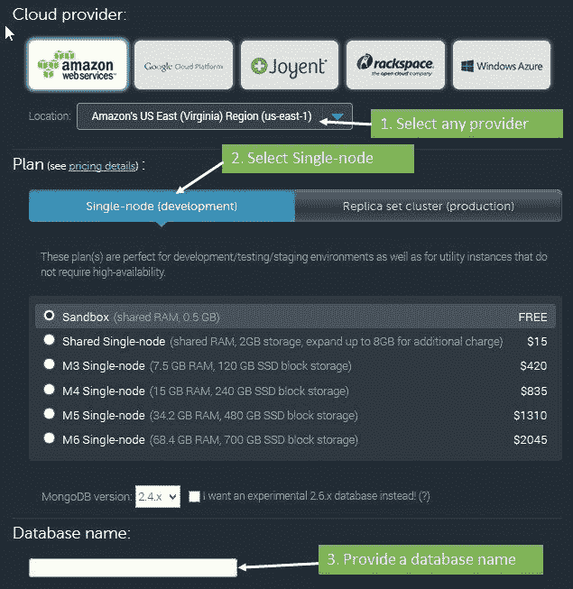
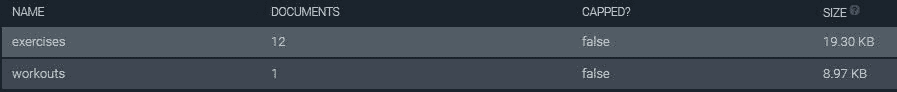
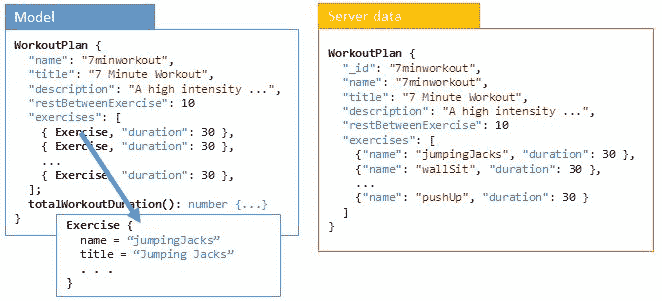
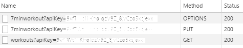
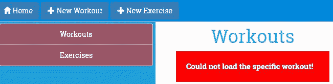

# 支持服务器数据持久性

现在是时候与服务器通信了！创建锻炼、添加练习并将其保存，然后意识到所有努力都白费，因为数据没有在任何地方持久化，这毫无乐趣。我们需要解决这个问题。

应用程序很少是自包含的。任何消费者应用程序，无论其大小如何，都有与边界之外的元素交互的部分。对于基于 Web 的应用程序，交互主要是与服务器。应用程序通过服务器进行身份验证、授权、存储/检索数据、验证数据以及执行其他此类操作。

本章探讨了 Angular 提供的客户端-服务器交互的构造。在这个过程中，我们在*个人教练*中添加了一个持久层，用于从后端服务器加载数据和保存数据。

本章涵盖的主题包括以下内容：

+   **提供后端以持久化锻炼数据**：我们设置了一个 MongoLab 账户，并使用其数据 API 访问和存储锻炼数据。

+   **理解 Angular HttpClient**：`HttpClient`允许我们通过 HTTP 与服务器交互。你将学习如何使用`HttpClient`进行所有类型的`GET`、`POST`、`PUT`和`DELETE`请求。

+   **实现锻炼数据的加载和保存**：我们使用`HTTPClient`从 MongoLab 数据库中加载数据和存储锻炼数据。

+   **我们可以使用 HttpClient 的 XMLHttpRequest 的两种方式**：要么是可观察对象，要么是承诺。

+   **使用 RxJS 和可观察对象**：用于订阅和查询数据流。

+   **使用承诺**：在本章中，我们将了解如何将承诺作为 HTTP 调用和响应的一部分来使用。

+   **处理跨域访问**：由于我们正在与不同域的 MongoLab 服务器交互，你将了解浏览器对跨域访问的限制。你还将了解 JSONP 和 CORS 如何帮助我们轻松实现跨域访问，以及 Angular 对 JSONP 的支持。

让我们开始吧。

# Angular 和服务器交互

任何客户端-服务器交互通常都归结为向服务器发送 HTTP 请求并从服务器接收响应。对于重型 JavaScript 应用程序，我们依赖于 AJAX 请求/响应机制与服务器通信。为了支持基于 AJAX 的通信，Angular 提供了 Angular `HttpClient`模块。在我们深入研究`HttpClient`模块之前，我们需要设置我们的服务器平台，该平台存储数据并允许我们管理它。

# 设置持久存储

对于数据持久性，我们使用一个名为 MongoDB 的文档数据库（[`www.mongodb.com/`](https://www.mongodb.com/)），它托管在 MongoLab（[`www.mlab.com/`](https://www.mlab.com/)）上，作为我们的数据存储。我们之所以选择 MongoLab，是因为它提供了一个直接与数据库交互的接口。这节省了我们设置支持 MongoDB 交互的服务器中间件的精力。

直接将数据存储/数据库暴露给客户端从来不是一个好主意。但在这种情况下，由于我们的主要目标是学习 Angular 和客户端-服务器交互，我们采取了这个自由，并直接访问 MongoLab 上托管的 MongoDB 实例。还有一种新的应用类型，它们是基于**无后端**解决方案构建的。在这种配置中，前端开发者构建应用时不需要了解确切的后端。服务器交互仅限于向后端发出 API 调用。如果您想了解更多关于这些无后端解决方案的信息，请查看[`nobackend.org/`](http://nobackend.org/)。

我们的首要任务是配置 MongoLab 上的账户并创建一个数据库：

1.  前往[`mlab.com`](https://mlab.com)，按照网站上的说明注册一个 mLab 账户

1.  一旦账户配置完成，登录并点击主页上的“创建新数据库”按钮来创建一个新的 Mongo 数据库

1.  在数据库创建屏幕上，您需要做一些选择以配置数据库。请参阅以下截图以选择免费数据库层和其他选项：



1.  创建数据库并记下您创建的数据库名称

1.  数据库配置完成后，打开数据库，并从“集合”标签页添加两个集合：

    +   `exercises`：这个存储所有**个人训练师**的锻炼内容

    +   `workouts`：这个存储所有**个人训练师**的锻炼内容

在 MongoDB 世界中，集合等同于数据库表。

MongoDB 属于一种称为**文档数据库**的数据库类型。这里的核心概念是文档、属性及其链接。与传统数据库不同，模式不是刚性的。我们不会在本书中介绍文档数据库是什么以及如何为基于文档的存储执行数据建模。**个人训练师**有有限的存储需求，我们使用前面提到的两个文档集合来管理它。我们甚至可能没有真正使用文档数据库。

集合添加后，从“用户”标签页将您自己添加到数据库中。

下一步是确定 MongoLab 账户的 API 密钥。配置的 API 密钥必须附加到对 MongoLab 发出的每个请求中。要获取 API 密钥，请执行以下步骤：

1.  点击右上角的用户名（而不是账户名称）以打开用户资料。

1.  在标题为“API 密钥”的部分，显示了当前的 API 密钥；复制它。同时，点击 API 密钥下方的按钮以启用数据 API 访问。默认情况下，这是禁用的。

数据存储模式已完整。我们现在需要为这些集合进行初始化。

# 数据库初始化

**个人训练师**应用已经预定义了一个锻炼计划和 12 个锻炼的列表。我们需要用这些数据初始化集合。

打开 `seed.js` 文件，位于 `trainer/db` 文件夹中，这是从配套代码库中 5.1 检查点的文件。它包含种子 JSON 脚本以及如何将数据种子到 MongoLab 数据库实例的详细说明。

一旦初始化，数据库将在 workouts 集合中有一个锻炼项目，在 exercises 集合中有 12 个练习项目。请在 MongoLab 网站上验证这一点；集合应显示以下内容：



现在一切都已经设置好了，让我们开始讨论 `HttpClient` 模块，并为 *Personal Trainer* 应用程序实现锻炼/练习的持久化。

# HTTPClient 模块的基础知识

`HTTPClient` 模块的核心是 `HttpClient`。它使用 `XMLHttpRequest` 作为默认的后端（JSONP 也可用，我们将在本章后面看到）。它支持 `GET`、`POST`、`PUT` 和 `DELETE` 等请求。在本章中，我们将使用 `HttpClient` 来执行所有这些类型的请求。正如我们将看到的，`HttpClient` 使得以最小的设置和复杂性进行这些调用变得容易。对于之前使用过 Angular 或构建与后端数据存储通信的 JavaScript 应用程序的人来说，这些术语都不会感到惊讶。

然而，Angular 处理 HTTP 请求的方式发生了重大变化。现在调用请求会返回一个 HTTP 响应的 Observable。它是通过使用 RxJS 库来实现的，RxJS 是一个众所周知的异步 Observable 模式的开源实现。

您可以在 GitHub 上找到 RxJS 项目，网址为 [`github.com/Reactive-Extensions/RxJS`](https://github.com/Reactive-Extensions/RxJS)。网站表明，该项目正在由微软与一群开源开发者合作积极开发。我们在此不会详细介绍异步 Observable 模式，并鼓励您访问该网站以了解更多关于该模式以及 RxJS 如何实现它的信息。Angular 使用的 RxJS 版本是 beta 5。

简而言之，使用 Observables 允许开发者将应用程序中流动的数据视为信息流，应用程序可以随时从中抽取和使用。这些流随时间变化，这使得应用程序能够对这些变化做出反应。Observables 的这种特性为 **函数式响应式编程**（**FRP**）提供了基础，这从根本上改变了构建 Web 应用程序的模式，从命令式转变为响应式。

`RxJS` 库提供了允许您订阅和查询这些数据流的操作符。此外，您可以轻松混合和组合它们，正如我们将在本章中看到的。Observables 的另一个优点是取消或取消订阅它们很容易，这使得可以无缝地在线处理错误。

虽然在 Angular 中仍然可以使用 Promise，但默认的方法是使用 Observables。我们也将在本章中介绍 Promise。

# 个人训练师和服务器集成

如前一章所述，客户端-服务器交互完全是关于异步的。当我们修改我们的*个人训练师*应用程序以从服务器加载数据时，这种模式变得显而易见。

在前一章中，初始的锻炼和练习集合被硬编码在`WorkoutService`实现中。让我们看看如何首先从服务器加载数据。

# 加载锻炼和训练数据

在本章早期，我们使用数据表单，即`seed.js`文件，对数据库进行了初始化。我们现在需要在我们的视图中呈现这些数据。MongoLab 数据 API 将帮助我们在这里。

MongoLab 数据 API 使用 API 密钥来验证访问请求。对 MongoLab 端点发出的每个请求都需要有一个查询字符串参数，`apikey=<key>`，其中`key`是我们在本章早期提供的 API 密钥。请记住，密钥始终提供给用户并与他们的账户相关联。避免与他人共享您的 API 密钥。

该 API 遵循可预测的模式来查询和更新数据。对于任何 MongoDB 集合，典型的端点访问模式如下（以下给出的是基本 URL：[`api.mongolab.com/api/1/databases`](https://api.mongolab.com/api/1/databases)）：

+   `/<dbname>/collections/<name>?apiKey=<key>`：以下请求如下：

    +   `GET`：此操作获取给定集合名称中的所有对象。

    +   `POST`：此操作向集合名称添加一个新的对象。MongoLab 有一个`_id`属性，该属性唯一标识文档（对象）。如果未在提交的数据中提供，则自动生成。

+   `/<dbname>/collections/<name>/<id>?apiKey=<key>`：以下请求如下：

    +   `GET`：此操作从集合中获取具有特定 ID（在`_id`属性上执行匹配）的特定文档/集合项。

    +   `PUT`：此操作更新集合名称中的特定项（`id`）。

    +   `DELETE`：此操作从集合名称中删除具有特定 ID 的项目。

关于数据 API 接口的更多详细信息，请访问 MongoLab 数据 API 文档，网址为[`docs.mlab.com/data-api`](http://docs.mlab.com/data-api)。

现在我们已经准备好开始实现锻炼/训练列表页面。

我们在本章开始时使用的代码是 GitHub 上本书的`checkpoint 4.6`（文件夹：`trainer`）。它在 GitHub 上可用（[`github.com/chandermani/angular6byexample`](https://github.com/chandermani/angular6byexample)）。检查点作为 GitHub 上的分支实现。如果您不使用 Git，请从以下 GitHub 位置下载`checkpoint 4.6`的快照（ZIP 文件）：[`github.com/chandermani/angular6byexample/tree/checkpoint4.6`](https://github.com/chandermani/angular6byexample/tree/checkpoint4.6)。在第一次设置快照时，请参考`trainer`文件夹中的`README.md`文件。

# 从服务器加载锻炼和训练列表

要从 MongoLab 数据库中拉取锻炼和训练列表，我们必须重写我们的`WorkoutService`服务方法：`getExercises`和`getWorkouts`。但在我们能够这样做之前，我们必须设置我们的服务以使用 Angular 的 HTTPClient 模块。

# 将 HTTPClient 模块和 RxJS 添加到我们的项目中

Angular HTTPClient 模块包含在你已经安装的 Angular 包中。为了使用它，我们需要将其导入到`app.module.ts`中，如下所示（确保导入遵循`BrowserModule`）：

```js
import { HttpClientModule } from '@angular/common/http';
. . . 
@NgModule({ 
  imports: [ 
    BrowserModule,
    HttpClientModule, 
. . . 
})
```

我们还需要一个外部第三方库：**JavaScript 的响应式扩展（RxJS**）。RxJS 实现了可观察模式，并且与 HTTPClient 模块一起由 Angular 使用。它包含在我们项目中的 Angular 包中。

# 更新 workout-service 以使用 HTTPClient 模块和 RxJS

从`trainer/src/app/core`打开`workout.service.ts`。为了在`WorkoutService`中使用 HTTPClient 和 RxJS，我们需要将该文件中添加以下导入：

```js
import { HttpClient } from '@angular/common/http';
import { Observable } from 'rxjs/Observable';
import { catchError } from 'rxjs/operators';
```

我们正在导入`HTTPClient`模块以及来自 RxJS 的`Observable`和一个额外的 RxJS 操作符：`catchError`。我们将看到这个操作符是如何在本节中使用的。

在类定义中，添加以下属性，包括一个锻炼属性以及设置我们 Mongo 数据库中集合的 URL 和数据库的键的属性，以及另一个属性：`params`，它设置 API 密钥作为 API 访问的查询字符串：

```js
workout: WorkoutPlan; 
collectionsUrl = "https://api.mongolab.com/api/1/ databases/<dbname>/collections"; 
apiKey = <key> 
params = '?apiKey=' + this._apiKey; 
```

将`<dbname>`和`<key>`令牌替换为我们在本章前面配置的数据库的名称和 API 密钥。

接下来，使用以下代码行将 HTTPClient 模块注入到`WorkoutService`构造函数中：

```js
constructor(public http: HttpClient) {
}
```

然后将`getExercises()`方法更改为以下内容：

```js
getExercises() {
    return this.http.get<ExercisePlan>(this.collectionsUrl + '/exercises' + this.params)
        .pipe(catchError(WorkoutService.handleError));
}
```

如果你习惯于使用承诺（promises）进行异步数据操作，这里看到的内容将看起来不同。这里发生的情况不是将一个调用`then()`的承诺链在一起，而是`http.get`方法返回一个来自 RxJS 库的可观察对象。注意，我们还在将响应设置为`<ExercisePlan>`类型，以便明确告诉我们的上游调用者从我们的 HTTP GET 调用返回的是哪种类型的可观察对象。

使用`HTTPClient`模块的`get`方法时，返回一个可观察对象（Observable）是默认响应。然而，可观察对象可以被转换为一个承诺（promise）。而且，正如我们将在本章后面看到的那样，返回 JSONP 的选项也存在。

在我们继续之前，还有一件事情需要提及。注意，我们正在使用一个管道方法来添加一个`catchError`操作符。这个操作符接受一个方法`handleError`来处理失败的响应。`handleError`方法接受失败的响应作为参数。我们将错误记录到控制台，并使用`Observable.throw`将错误返回给消费者：

```js
static handleError (error: Response) { 
    console.error(error); 
    return Observable.throw(error || 'Server error');
}
```

明确一点，这并不是生产代码，但它将给我们机会展示如何在上游编写代码来处理数据访问过程中生成的错误。

需要理解的是，在这个阶段，如果没有对 Observable 进行订阅，那么 Observable 中不会有数据流动。如果你没有仔细添加订阅到你的 Observables，这可能会导致添加和更新等操作出现意外情况。

# 将 `getWorkouts()` 方法修改为使用 HTTPClient 模块

获取锻炼数据的代码更改几乎与获取练习数据的代码相同：

```js
getWorkouts() {
    return this.http.get<WorkoutPlan[]>(this.collectionsUrl + '/workouts' + this.params)
        .pipe(catchError(WorkoutService.handleError));
}
```

再次明确，我们指定了 Observable 的类型——在这个例子中是 `<WorkoutPlan[]>`——它将由我们的 HTTP GET 调用返回，并使用 `pipe` 添加一个 `catchError` 操作符。

现在，`getExercises` 和 `getWorkouts` 方法已经更新，我们需要确保它们与上游调用者兼容。

# 更新锻炼/练习列表页面

练习和锻炼列表页面（以及 `LeftNavExercises`）在 `model.ts` 中调用 `getExercises` 或 `getWorkouts` 方法。为了使这些调用与现在使用 `HTTPClient` 模块进行的远程调用兼容，我们需要修改这些调用以订阅由 `HTTPClient` 模块返回的 Observable。因此，将 `exercises.component.ts` 中的 `ngOnInit` 方法代码更新如下：

```js
  ngOnInit() {
    this.workoutService.getExercises()
    .subscribe(
        exercises => this.exerciseList = exercises,
        (err: any) => console.error
    );
```

我们的方法现在订阅了由 `getExercises` 方法返回的 Observable；当响应到达时，它将结果分配给 `exerciseList`。如果有错误，它将错误分配给一个 `console.error` 调用，在控制台中显示错误。所有这些现在都是使用 `HTTPClient` 模块和 RxJS 异步处理的。

接下来，对 `workouts.component.ts` 和 `left-nav-exercises.component.ts` 中的 `ngOnInit` 方法进行类似的修改。

刷新锻炼/练习列表页面，锻炼和练习数据将从数据库服务器加载。

如果你在 GitHub 仓库中难以检索/显示数据，请查看第 5.1 个检查点的完整实现。注意，在这个检查点中，我们已禁用导航链接到锻炼和练习屏幕，因为我们还需要向它们添加 Observable 实现。我们将在下一节中完成这项工作。此外，记得在运行 `Checkpoint 5.1` 中的代码之前替换数据库名称和 API 密钥。如果你不使用 Git，可以从以下 GitHub 位置下载 `Checkpoint 5.1` 的快照（ZIP 文件）：[`github.com/chandermani/angular6byexample/tree/checkpoint5.1`](https://github.com/chandermani/angular6byexample/tree/checkpoint5.1)。在设置快照时，请参考 `trainer` 文件夹中的 `README.md` 文件。

这看起来不错，列表加载也正常。嗯，几乎是这样！在锻炼列表页面上有一个小故障。如果我们仔细查看任何列表项（实际上只有一个项），就可以轻松地发现它：


锻炼时长计算不再起作用了！可能的原因是什么？我们需要回顾一下这些计算是如何实现的。`WorkoutPlan`服务（在`model.ts`中）定义了一个`totalWorkoutDuration`方法来完成这个计算。

差异在于绑定到视图的锻炼数组。在前一章中，我们使用`WorkoutPlan`服务创建了一个包含模型对象的数组。但现在，由于我们从服务器检索数据，我们绑定了一个简单的 JavaScript 对象数组到视图，这显然没有计算逻辑。

我们可以通过将服务器响应映射到我们的模型类对象并将它们返回给任何上游调用者来解决这个问题。

# 将服务器数据映射到应用程序模型

如果模型和服务器存储定义匹配，则将服务器数据映射到我们的模型以及反之亦然可能是不必要的。如果我们查看`Exercise`模型类和我们在 MongoLab 中为锻炼添加的种子数据，我们会看到它们是匹配的，因此映射变得不必要。

将服务器响应映射到模型数据变得至关重要，如果：

+   我们模型定义了任何方法

+   存储的模型与其代码表示不同

+   使用相同的模型类来表示来自不同来源的数据（这可能在混合应用中发生，我们从不同的来源获取数据）

`WorkoutPlan`服务是一个模型表示与其存储之间阻抗不匹配的典型例子。查看以下截图以了解这些差异：



模型和服务器数据之间的两个主要差异如下：

+   模型定义了`totalWorkoutDuration`方法。

+   `exercises`数组表示也各不相同。模型的`exercises`数组包含完整的`Exercise`对象，而服务器数据只存储锻炼标识符或名称。

这显然意味着加载和保存锻炼需要模型映射。

我们将通过添加另一个操作符来转换 Observable 响应对象来实现这一点。到目前为止，我们只返回了一个普通的 JavaScript 对象作为响应。好事是，我们用来添加错误处理的 pipe 方法还允许我们添加额外的操作符，我们可以使用这些操作符将 JavaScript 对象转换为我们模型中的`WorkoutPlan`类型。

让我们在`workout-service.ts`文件中重写`getWorkouts`方法如下：

```js
    getWorkouts(): Observable<WorkoutPlan[]> {
        return this.http.get<WorkoutPlan[]>(this.collectionsUrl + '/workouts' + this.params)
            .pipe(
                map((workouts: Array<any>) => {
                  const result: Array<WorkoutPlan> = [];
                  if (workouts) {
                      workouts.forEach((workout) => {
                          result.push(
                              new WorkoutPlan(
                                  workout.name,
                                  workout.title,
                                  workout.restBetweenExercise,
                                  workout.exercises,
                                  workout.description
                              ));
                      });
                  }
                  return result;
                }),
                catchError(this.handleError<WorkoutPlan[]>('getWorkouts', []))
            );
    }
```

我们添加了一个`map`操作符，将这个 Observable 转换成一个由`WorkoutPlan`对象组成的 Observable。然后，每个`WorkoutPlan`对象（目前我们只有一个）都将拥有我们需要的`totalWorkoutDuration`方法。

查看代码，你可以看到我们操作的是 HTTPClient 响应的 JSON 结果，这就是为什么我们使用`<any>`类型。然后我们创建一个`WorkoutPlans`的类型化数组，并使用箭头函数`forEach`遍历第一个数组，将每个 JavaScript 对象分配给一个`WorkoutPlan`对象。

我们将这些映射的结果返回给订阅它们的调用者，在这种情况下是`workouts.component.ts`。我们还更新了`catchError`操作符，使用了一个新的`handleError`方法，你可以在`Checkpoint 5.2`中找到它。调用者不需要对其用于订阅我们的锻炼 Observable 的代码进行任何更改。相反，模型映射可以在应用程序的一个位置进行，然后在整个应用程序中使用。

如果你重新运行应用程序，你会看到现在总秒数显示正确：


GitHub 仓库中的 Checkpoint 5.2 包含了我们到目前为止所涵盖的完整实现。GitHub 分支是`checkpoint5.2`（文件夹：`trainer`）。

# 从服务器加载锻炼和锻炼数据

正如我们在之前的`WorkoutService`中修复了`getWorkouts`实现一样，我们可以为与锻炼和锻炼相关的其他 get 操作实现。从`checkpoint 5.2`中的`trainer/src/app/core`文件夹中的`workout.service.ts`复制`getExercise`和`getWorkout`方法的实现。

`getWorkout`和`getExercise`方法使用锻炼/锻炼的名称来检索结果。每个 MongoLab 集合项都有一个`_id`属性，该属性唯一标识了项/实体。在我们的`Exercise`和`WorkoutPlan`对象的情况下，我们使用锻炼的名称进行唯一标识。因此，每个对象的`name`和`_id`属性总是匹配的。

在这一点上，我们需要在`workout.service.ts`中添加一个额外的导入：

```js
import { forkJoin } from 'rxjs/observable/forkJoin';
```

这个导入引入了`forkJoin`操作符，我们将在稍后讨论。

请特别注意`getWorkout`方法的实现，因为由于模型和数据存储格式不匹配，这里会发生相当数量的数据转换。这就是`getWorkout`方法现在的样子：

```js
    getWorkout(workoutName: string): Observable<WorkoutPlan> {
      return forkJoin (
          this.http.get(this.collectionsUrl + '/exercises' + this.params),
          this.http.get(this.collectionsUrl + '/workouts/' + workoutName + this.params))
          .pipe(
               map(
                  (data: any) => {
                      const allExercises = data[0];
                      const workout = new WorkoutPlan(
                          data[1].name,
                          data[1].title,
                          data[1].restBetweenExercise,
                          data[1].exercises,
                          data[1].description
                      );
                      workout.exercises.forEach(
                          (exercisePlan: any) => exercisePlan.exercise = allExercises.find(
                              (x: any) => x.name === exercisePlan.name
                          )
                      );
                      return workout;
                  }
              ),
              catchError(this.handleError<WorkoutPlan>(`getWorkout id=${workoutName}`))
        );
      }
```

`getWorkout`方法内部发生了很多事情，我们需要理解。

`getWorkout`方法使用 Observable 及其`forkJoin`操作符来返回两个 Observable 对象：一个用于检索`Workout`，另一个用于检索所有`Exercises`的列表。`forkJoin`操作符有趣的地方在于，它不仅允许我们返回多个 Observable 流，而且在进一步处理结果之前，它还会等待两个 Observable 流都检索到它们的数据。换句话说，它使我们能够从多个并发 HTTP 请求中流式传输响应，然后对组合结果进行操作。

一旦我们有了 `Workout` 详细信息和完整的锻炼列表，我们就将结果通过 `pipe` 传输到 `map` 操作符（我们之前在 `Workouts` 列表代码中看到过），我们使用它来将锻炼的 `exercises` 数组转换为正确的 `Exercise` 类对象。我们通过在 `allExercises` Observable 中搜索从服务器返回的 `workout.exercises` 数组中的锻炼名称来实现这一点，然后将匹配的锻炼分配给锻炼服务数组。最终结果是，我们有一个完整的 `WorkoutPlan` 对象，其 `exercises` 数组已正确设置。

这些对 `WorkoutService` 的更改也要求上游调用者进行修复。我们已经修复了 `LeftNavExercises` 和 `Exercises` 组件中的锻炼列表以及 `Workouts` 组件中的锻炼。现在让我们按照类似的方式修复 `Workout` 和 `Exercise` 组件。锻炼服务中的 `getWorkout` 和 `getExercise` 方法不是直接由这些组件调用，而是由构建服务调用。因此，我们将不得不与 `Workout` 和 `Exercise` 组件以及两个解析器——`WorkoutResolver` 和 `ExerciseResolver`——一起修复，我们将这些解析器添加到这些组件的路由中。

# 修复构建服务

现在我们已经设置了 `WorkoutService` 来从我们的远程数据存储中检索锻炼，我们必须修改 `WorkoutBuilderService` 以能够将那个锻炼作为一个 Observable 检索。提取 `Workout` 详细信息的方法是 `startBuilding`。为了做到这一点，我们将当前的 `startBuilding` 方法拆分为两个方法，一个用于新的锻炼，另一个用于我们从服务器检索到的现有锻炼。以下是新锻炼的代码：

```js
    startBuildingNew() {
      const exerciseArray: ExercisePlan[] = [];
      this.buildingWorkout = new WorkoutPlan('', '', 30, exerciseArray);
      this.newWorkout = true;
      return this.buildingWorkout;
    }
```

对于现有锻炼，我们添加以下代码：

```js
    startBuildingExisting(name: string) {
      this.newWorkout = false;
      return this.workoutService.getWorkout(name);
    }
```

我们将让您在 `ExerciseBuilderService` 中进行相同的修复。

# 更新解析器

当我们开始使用 Observable 类型与我们的数据访问一起使用时，我们将不得不对我们为通往锻炼和锻炼屏幕的路由创建的解析器进行一些调整。我们从 `workout-resolver.ts` 中的 `WorkoutResolver` 开始，该文件位于 `workout` 文件夹中。

首先添加以下来自 RxJs 的导入：

```js
import { Observable } from 'rxjs/Observable';
import { of } from 'rxjs/observable/of';
import { map, catchError } from 'rxjs/operators';
```

接下来更新 `resolve` 方法如下：

```js
  resolve(
    route: ActivatedRouteSnapshot,
    state: RouterStateSnapshot): Observable<WorkoutPlan> {
    const workoutName = route.paramMap.get('id');

    if (!workoutName) {
        return this.workoutBuilderService.startBuildingNew();
    } else {
        return this.workoutBuilderService.startBuildingExisting(workoutName)
        .pipe(
          map(workout => {
            if (workout) {
              this.workoutBuilderService.buildingWorkout = workout;
              return workout;
            } else {
              this.router.navigate(['/builder/workouts']);
              return null;
            }
          }),
          catchError(error => {
            console.log('An error occurred!');
            this.router.navigate(['/builder/workouts']);
            return of(null);
          })
        );
    }
```

如您所见，我们已经将新锻炼的行为（在 URL 参数中没有传递锻炼名称的情况）和现有锻炼的行为分开。在前一种情况下，我们调用 `workoutBuilderService.startBuildingExisting`，这将返回一个新的 `WorkoutPlan`。在后一种情况下，我们调用 `workoutBuilderService.startBuildingExisting` 并将结果通过管道传输，然后映射以返回 `workout`，除非找不到，在这种情况下，我们将用户路由回 `Workouts` 屏幕。

# 修复 `Workout` 和 `Exercise` 组件

一旦我们修复了`WorkoutBuilderService`和`WorkoutResolver`，实际上在`WorkoutComponent`中就不再需要进一步的修复。处理 Observables 的所有工作已经在更下游完成，我们现在需要做的只是订阅路由数据并检索锻炼项目，就像我们之前所做的那样：

```js
  ngOnInit() {
      this.sub = this.route.data
          .subscribe(
            (data: { workout: WorkoutPlan }) => {
              this.workout = data.workout;
            }
          );
  }
```

为了测试实现，取消注释以下在`workouts.component.ts`中的`onSelect`方法内高亮的代码：

```js
  onSelect(workout: WorkoutPlan) {
      this.router.navigate( ['./builder/workout', workout.name] );
  }
```

然后点击列表中显示在`/builder/workouts/`的任何现有锻炼项目，例如*7 分钟锻炼*。锻炼数据应该能够成功加载。

`ExerciseBuilderService`和`ExerciseResolver`也需要修复。`Checkpoint 5.2`包含了这些修复。你可以复制这些文件或自己进行修复，并比较实现。别忘了取消注释`exercises.component.ts`中的`onSelect`方法中的代码。

GitHub 仓库中的`Checkpoint 5.2`包含了到目前为止我们所涵盖的完整实现。如果你不使用 Git，可以从以下 GitHub 位置下载 Checkpoint 5.2 的快照（ZIP 文件）：[`github.com/chandermani/angular6byexample/tree/checkpoint5.2`](https://github.com/chandermani/angular6byexample/tree/checkpoint5.2)。在首次设置快照时，请参考`trainer`文件夹中的`README.md`文件。

现在是时候修复、创建和更新锻炼项目的场景了。

# 对锻炼/项目执行 CRUD 操作

当涉及到创建、读取、更新和删除（CRUD）操作时，所有保存、更新和删除方法都需要转换为 Observable 模式。

在本章的早期部分，我们详细介绍了在 MongoLab 集合中 CRUD 操作的端点访问模式。回到*加载锻炼和锻炼数据*部分，重新审视访问模式。我们现在需要这些信息，因为我们计划创建/更新锻炼项目。

在开始实现之前，了解 MongoLab 如何识别集合项以及我们的 ID 生成策略非常重要。在 MongoDB 中，每个集合项都通过`_id`属性在集合中唯一标识。在创建新项时，我们提供 ID 或服务器自动生成一个。一旦`_id`被设置，就不能更改。对于我们的模型，我们将使用锻炼/项目的`name`属性作为唯一 ID，并将名称复制到`_id`字段（因此，没有自动生成`_id`）。还要记住，我们的模型类不包含这个`_id`字段；它必须在第一次保存记录之前创建。

让我们先修复锻炼创建场景。

# 创建新的锻炼项目

采用自下而上的方法，首先需要修复的是`WorkoutService`。按照以下代码更新`addWorkout`方法：

```js
    addWorkout(workout: WorkoutPlan) {
      const workoutExercises: any = [];
      workout.exercises.forEach(
          (exercisePlan: any) => {
              workoutExercises.push({name: exercisePlan.exercise.name, duration: exercisePlan.duration});
          }
      );

      const body = {
          '_id': workout.name,
          'exercises': workoutExercises,
          'name': workout.name,
          'title': workout.title,
          'description': workout.description,
          'restBetweenExercise': workout.restBetweenExercise
      };

      return this.http.post(this.collectionsUrl + '/workouts' + this.params, body)
        .pipe(
          catchError(this.handleError<WorkoutPlan>())
        );
    }
```

在 `getWorkout` 中，我们必须将服务器模型中的数据映射到我们的客户端模型中；这里需要做的是反向操作。首先，我们为锻炼创建一个新的数组 `workoutExercises`，然后向该数组添加一个更紧凑的版本，以便在服务器上存储。我们只想在服务器上的锻炼数组中存储锻炼名称和持续时间（此数组为 `any` 类型，因为在其紧凑格式中它不符合 `ExercisePlan` 类型）。

接下来，我们将这些更改映射到一个 JSON 对象中，以此设置我们帖子的主体。请注意，在构建此对象的过程中，我们将 `_id` 属性设置为锻炼的名称，以便在锻炼集合的数据库中唯一标识它。

使用锻炼/练习的 *名称* 作为记录标识符（或 `id`）在 MongoDB 中的简单方法对于任何中等规模的应用程序都会失效。请记住，我们正在创建一个可以由许多用户同时访问的基于 Web 的应用程序。由于总有可能有两个用户为锻炼/练习想出相同的名称，我们需要一个强大的机制来确保名称不会重复。MongoLab REST API 的另一个问题是，如果有重复的 `POST` 请求具有相同的 `id` 字段，第一个将创建一个新的文档，第二个将更新它，而不是第二个失败。这意味着在客户端对 `id` 字段的任何重复检查都无法防止数据丢失。在这种情况下，分配自动生成 `id` 值是更好的选择。在标准情况下，当我们创建实体时，唯一 ID 的生成是在服务器上完成的（通常由数据库完成）。当实体创建时，响应将包含生成的 ID。在这种情况下，在将数据返回给调用代码之前，我们需要更新模型对象。

最后，我们调用 `HTTPClient` 模块的 `post` 方法，传递要连接的 URL、额外的查询字符串参数（`apiKey`）以及我们正在发送的数据。

最后一个返回语句应该看起来很熟悉，因为我们使用 Observables 将锻炼对象作为 Observable 解析的一部分返回。您需要确保在 Observable 链中添加 `.subscribe` 以使其工作。我们将通过向 `WorkoutComponent` 的 `save` 方法添加订阅来实现这一点。我们将在稍后这样做。

# 更新锻炼

为什么不尝试实现更新操作呢？`updateWorkout` 方法可以以相同的方式修复，唯一的区别是需要 `HTTPClient` 模块的 `put` 方法：

```js
    updateWorkout(workout: WorkoutPlan) {
      const workoutExercises: any = [];
      workout.exercises.forEach(
          (exercisePlan: any) => {
              workoutExercises.push({name: exercisePlan.exercise.name, duration: exercisePlan.duration});
          }
      );

      const body = {
          '_id': workout.name,
          'exercises': workoutExercises,
          'name': workout.name,
          'title': workout.title,
          'description': workout.description,
          'restBetweenExercise': workout.restBetweenExercise
      };

      return this.http.put(this.collectionsUrl + '/workouts/' + workout.name + this.params, body)
        .pipe(
          catchError(this.handleError<WorkoutPlan>())
        );
    }
```

前面的请求 URL 现在包含一个额外的片段（`workout.name`），表示需要更新的集合项的标识符。

MongoLab 的`PUT` API 请求在集合中找不到文档时，会创建作为请求体传递的文档。在执行`PUT`请求时，请确保原始记录存在。我们可以通过首先对该文档执行`GET`请求并确认在更新之前我们得到了一个文档来实现这一点。我们将把这个留给你来实现。

# 删除锻炼

需要修复的最后一个操作是删除锻炼。这里有一个简单的实现，我们调用`HTTPClient`模块的`delete`方法来删除由特定 URL 引用的锻炼：

```js
    deleteWorkout(workoutName: string) {
        return this.http.delete(this.collectionsUrl + '/workouts/' + workoutName + this.params)
          .pipe(
            catchError(this.handleError<WorkoutPlan>())
          );
    }
```

# 修复上游代码

现在是时候修复`WorkoutBuilderService`和`Workout`组件了。`WorkoutBuilderService`的`save`方法现在看起来如下：

```js
    save() {
      const workout = this.newWorkout ?
          this.workoutService.addWorkout(this.buildingWorkout) :
          this.workoutService.updateWorkout(this.buildingWorkout);
      this.newWorkout = false;
      return workout;
   }
```

大部分看起来和之前一样，因为它们确实是相同的！我们不需要更新这段代码，因为我们有效地在`WorkoutService`组件中隔离了与外部服务器的交互。

最后，这里展示了`Workout`组件的保存代码：

```js
  save(formWorkout: any) {
    this.submitted = true;
    if (!formWorkout.valid) { return; }
    this.workoutBuilderService.save().subscribe(
      success => this.router.navigate(['/builder/workouts']),
      err => console.error(err)
    );
  }
```

我们已经做出了一些更改，现在我们订阅了保存。如您从我们之前的讨论中回忆起来，`subscribe`使 Observable 变得活跃，这样我们就可以完成保存。

就这样！我们现在可以创建新的锻炼并更新现有的锻炼（我们将删除锻炼的完成留给你）。这并不太难！

让我们试试看。打开新的`Workout Builder`页面，创建一个锻炼并保存它。也尝试编辑一个现有的锻炼。这两种情况都应该无缝工作。

如果你在运行本地副本时遇到问题，请查看`checkpoint 5.3`的最新实现。如果你不使用 Git，请从以下 GitHub 位置下载 Checkpoint 5.3 的快照（ZIP 文件）：[`github.com/chandermani/angular6byexample/tree/checkpoint5.3`](https://github.com/chandermani/angular2byexample/tree/checkpoint5.3)。在首次设置快照时，请参考`trainer`文件夹中的`README.md`文件。

当我们进行`POST`或`PUT`请求保存数据时，网络端会发生一些有趣的事情。打开浏览器的网络日志控制台（*F12*）查看正在进行的请求。日志看起来可能如下所示：



网络日志

在实际执行`POST`或`PUT`之前，会向同一端点发出一个`OPTIONS`请求。我们在这里观察到的行为被称为**预战斗请求**。这是因为我们正在向`api.mongolab.com`发起跨域请求。

# 使用承诺进行 HTTP 请求

本章的大部分内容都集中在 Angular `HTTPClient` 如何使用观察者（Observables）作为 `XMLHttpRequests` 的默认值。这代表了一个重大的变化，与过去的工作方式相比。许多开发者熟悉使用承诺进行异步 HTTP 请求。在这种情况下，Angular 继续支持承诺，但不是作为默认选择。开发者必须选择在 `XMLHttpRequest` 中使用承诺才能使用它们。

例如，如果我们想在 `WorkoutService` 中的 `getExercises` 方法中使用承诺，我们必须将命令重构如下：

```js
    getExercises(): Promise<Exercise[]> {
        return this.http.get<Exercise[]>(this.collectionsUrl + '/exercises' + this.params)
        .toPromise()
        .then(res => res)
        .catch(err => {
            return Promise.reject(this.handleError('getExercises', []));
        });
    }
```

为了将此方法转换为使用承诺（promises），我们只需在方法链中添加 `.toPromise()`，为承诺添加一个成功参数 `then`，以及一个使用指向现有 `handleError` 方法的 `Promise.reject` 的 `catch`。

对于上游组件，我们只需将处理返回值从观察者（Observable）更改为承诺。因此，在这种情况下使用承诺，我们需要在 `Exercises.component.ts` 和 `LeftNavExercises.component.ts` 中的代码中首先添加一个新的错误消息属性（我们将如何显示屏幕上的错误消息留给你）：

```js
errorMessage: any;
```

然后将调用 `WorkoutService` 的 `ngOnInit` 方法更改为以下内容：

```js
  ngOnInit() {
    this.workoutService.getExercises()
 .then(exerciseList => this.exerciseList = exerciseList,
 error => this.errorMessage = <any>error
    );
  }  
```

当然，我们在这个简单示例中用承诺替换观察者（Observables）的便捷性并不意味着它们本质上相同。一个 `then` 承诺返回另一个承诺，这意味着你可以创建连续链式的承诺。而在观察者（Observable）的情况下，订阅基本上是终点，并且在该点之后不能映射或订阅。

如果你熟悉承诺（promises），在这个阶段可能会倾向于继续使用它们而不尝试观察者（Observables）。毕竟，我们在本章中使用观察者（Observables）所做的许多事情也可以用承诺来完成。例如，我们使用 `Observable` 的 `forkJoin` 操作符通过 `getWorkouts` 实现的两个观察者流映射也可以使用承诺的 `q,all` 函数来完成。

然而，如果你采取那种方法，你就是在贬低自己。观察者（Observables）为使用所谓的函数式响应式编程（functional reactive programming）进行网页开发开辟了令人兴奋的新途径。它们涉及一种基本思维方式的转变，将应用程序的数据视为一个持续的信息流，应用程序对其做出反应和响应。这种转变允许以不同的架构构建应用程序，使它们更快、更健壮。观察者（Observables）是 Angular 的核心，例如事件发射器和 `NgModel` 的新版本。

虽然承诺是工具箱中的一个有用工具，但我们鼓励你在使用 Angular 进行开发时调查观察者（Observables）。它们是 Angular 向前看哲学的一部分，并将有助于确保你的应用程序和技能集在未来具有前瞻性。

查看 `checkpoint 5.3` 文件以获取包含我们之前涵盖的与承诺相关的代码的最新实现。如果您不使用 Git，请从以下 GitHub 位置下载 Checkpoint 5.3 的快照（ZIP 文件）：[`github.com/chandermani/angular6byexample/tree/checkpoint5.3`](https://github.com/chandermani/angular6byexample/tree/checkpoint5.3)。在首次设置快照时，请参考 `trainer` 文件夹中的 `README.md` 文件。请注意，在下一节中，我们将恢复使用 Observables 来处理此代码。此代码可在 `checkpoint 5.4` 文件中找到。

# async pipe

正如我们在本章中涵盖的许多数据操作中看到的那样，有一个相当常见的模式被反复重复。当一个 Observable 从 HTTP 请求返回时，我们将响应转换为 JSON 并订阅它。然后订阅将 Observable 输出绑定到 UI 元素。如果我们能够消除这种重复的编码并替换为一种更简单的方式来完成我们想要做的事情，那岂不是很好？

毫不奇怪，Angular 为我们提供了正确的方式来做到这一点。它被称为 **async pipe**，它可以像任何其他管道一样用于绑定到屏幕上的元素。然而，async pipe 是比其他管道更强大的机制。它接受一个 Observable 或承诺作为输入并自动订阅它。它还处理 Observable 订阅的拆卸，而无需任何额外的代码行。

让我们看看我们应用中的一个例子。让我们回到上一节中与承诺相关的 `LeftNavExercises` 组件。请注意，我们已经将此组件和 `Exercises` 组件从承诺转换回使用 Observables。

查看 `checkpoint 5.4` 文件以获取最新的实现，该实现包括将此代码转换为使用 Observables。如果您不使用 Git，请从以下 GitHub 位置下载 Checkpoint 5.4 的快照（ZIP 文件）：[`github.com/chandermani/angular6byexample/tree/checkpoint5.4`](https://github.com/chandermani/angular6byexample/tree/checkpoint5.4)。在首次设置快照时，请参考 `trainer` 文件夹中的 `README.md` 文件。

然后在 `LeftNavExercises` 中进行以下更改。首先，从 RxJs 导入 Observable：

```js
import { Observable } from 'rxjs/Observable';
```

然后将 `exerciseList` 从练习数组更改为相同类型的 Observable：

```js
public exerciseList:Observable<Exercise[]>;
```

接下来修改调用 `WorkoutService` 获取练习的代码，以消除订阅：

```js
this.exerciseList = this.workoutService.getExercises();
```

最后，打开 `left-nav-exercises.component.html` 并将 `async` 管道添加到 `*ngFor` 循环中，如下所示：

```js
<div *ngFor="let exercise of exerciseList|async|orderBy:'title'">
```

刷新页面后，你仍然会看到显示的练习列表。但这次，我们使用了 `async` 管道来消除设置对 Observable 订阅的需要。非常酷！这是 Angular 添加的一个很好的便利功能，因为我们已经在这个章节中花费时间理解 Observables 与订阅的工作方式，所以我们现在对 `async` 管道在幕后为我们处理什么有了清晰的认识。

我们将把这个相同的更改在 `Exercises` 组件中的实现留给你。

理解 HTTP 请求的跨域行为以及 Angular 提供用于进行跨域请求的结构非常重要。

# 跨域访问和 Angular

跨域请求是对不同域中资源的请求。当从 JavaScript 发起时，这些请求会受到浏览器的一些限制；这些限制被称为 *同源策略* 限制。这种限制阻止浏览器向与脚本原始源不同的域发送 AJAX 请求。源匹配是严格基于协议、主机和端口的组合进行的。

对于我们自己的应用，对 `https://api.mongolab.com` 的调用是跨域调用，因为我们的源代码托管在不同的域中（最可能是类似 `http://localhost/....` 的东西）。

有一些解决方案和一些标准有助于放宽/控制跨域访问。我们将探讨这两种技术，因为它们是最常用的。它们如下：

+   **填充 JSON**（**JSONP**）

+   **跨源资源共享**（**CORS**）

一种绕过相同源策略的常见方法是使用 JSONP 技术。

# 使用 JSONP 进行跨域请求

远程调用的 JSONP 机制依赖于浏览器可以从任何域执行 JavaScript 文件的事实，无论其来源如何，只要脚本是通过 `<script>` 标签包含的。

在 JSONP 中，不是直接向服务器发送请求，而是生成一个动态的 `<script>` 标签，其 `src` 属性设置为需要调用的服务器端点。当这个 `<script>` 标签附加到浏览器的 DOM 上时，会导致向目标服务器发送请求。

服务器随后需要以特定格式发送响应，将响应内容包裹在函数调用代码中（这额外的填充围绕响应数据使得这项技术被称为 JSONP）。

Angular JSONP 服务隐藏了这种复杂性，并提供了一个简单的 API 来进行 JSONP 请求。StackBlitz 链接 [`stackblitz.com/edit/angular-nxeuxo`](https://stackblitz.com/edit/angular-nxeuxo) 突出了如何进行 JSONP 请求。它使用 *IEX Free Stock API*（[`iextrading.com/developer/`](https://iextrading.com/developer/））来获取任何股票代码的报价。

Angular JSONP 服务仅支持 HTTP `GET` 请求。使用任何其他 HTTP 请求，例如 `POST` 或 `PUT`，将生成错误。

如果你查看 StackBlitz 项目，你会看到我们在这本书中一直遵循的组件创建的熟悉模式。我们不会再次介绍这个模式，但会突出一些与使用 Angular JSONP 服务相关的细节。

首先，除了导入 `FormsModule` 和 `HttpClientModule`，你还需要将 `HttpClientJsonpModule` 导入到 `app.module.ts` 中，如下所示：

```js
. . . 
import { HttpClientModule, HttpClientJsonpModule } from '@angular/common/http';
import { FormsModule } from '@angular/forms';
. . . 
@NgModule({
. . . 
  imports: [
    BrowserModule,
    FormsModule,
    HttpClientModule,
 HttpClientJsonpModule
  ],
. . . 
}) 
```

接下来，我们需要将以下导入添加到 `get-quote.component.ts`：

```js
import { Component }from '@angular/core';
import { HttpClient } from '@angular/common/http';
import { Observable } from 'rxjs/Observable';
import { map } from 'rxjs/operators';
```

我们正在导入 `HttpClient`，它包含我们将要使用的 `JSONP` 方法，以及 RxJS 的 `Observable` 和 `map` 操作符。这些导入对你来说应该很熟悉，因为我们已经在本章中构建过。

当你使用 Angular JSONP 时，重要的是要理解默认情况下，它使用 RxJS 返回 Observables。这意味着我们将必须遵循订阅这些 Observables 的模式，并使用 RxJS 操作符来操作结果。我们还可以使用异步管道来简化这些操作。

然后将 `HttpClient` 注入到构造函数中：

```js
constructor(public http: HttpClient) {}
```

接下来，我们添加几个将在我们的 JSONP 调用中使用的变量：

```js
   symbol: string;
   quote: Observable<string>;
   url: string = 'https://api.iextrading.com/1.0/stock/';
```

`symbol` 变量将保存用户提供的搜索字符串。`quote` 变量将用于在我们的模板中显示从 JSONP 调用返回的值。而 `url` 变量是我们将要调用服务的基准 URL。

现在我们已经为我们的 `getQuote` 方法准备好了所有东西。让我们来看看它：

```js
   getQuote (){ 
      let searchUrl = `${this.url}${this.symbol}/quote`;
      this.quote = this.http.jsonp(searchUrl, 'callback')
          .pipe(
          map( (res: string) => res)
        ); 
    }; 
```

我们首先通过连接 `url` 和 `symbol` 并添加 `/quote` 来构造我们的 `searchUrl`。最后一部分 `quote` 是我们需要传递给报价服务以返回股票报价的内容。

然后，我们使用 HTTPClient 的 `jsonp` 方法执行对报价服务的远程调用。我们将 `searchUrl` 作为该方法的第一个参数传递，并将字符串 `'callback'` 作为我们的第二个参数。后一个参数由 Angular 用于在 `searchUrl` 中添加一个额外的查询字符串参数 `callback`。内部，Angular JSONP 服务生成一个动态的 `script` 标签和一个回调函数，并执行远程请求。

打开 StackBlitz 并输入符号，如 `GOOG`、`MSFT` 或 `FB`，以查看股票报价服务的作用。浏览器网络日志中的请求看起来如下：

```js
https://api.iextrading.com/1.0/stock/MSFT/quote?callback=ng_jsonp_callback_0
```

在这里，`ng_jsonp_callback_0` 是动态生成的函数。响应看起来如下：

```js
typeof ng_jsonp_callback_0 === 'function' && ng_jsonp_callback_0({"quote"::{"symbol":"MSFT"..});
```

响应被包裹在回调函数中。Angular 解析并评估这个响应，这导致调用 `__ng_jsonp__.__req1` 回调函数。然后，这个函数内部将数据路由到我们的函数回调。

我们希望这解释了 JSONP 的工作原理以及 JSONP 请求的底层机制。然而，JSONP 有其局限性：

+   首先，我们只能进行 `GET` 请求（这是显而易见的，因为这些请求是由于脚本标签而发起的）

+   其次，服务器还需要实现解决方案中涉及将响应包装在函数回调中的部分

+   第三，始终存在安全风险，因为 JSONP 依赖于动态脚本生成和注入

+   第四，错误处理也不可靠，因为很难确定脚本加载失败的原因

最终，我们必须认识到 JSONP 更像是一种权宜之计，而不是一种解决方案。随着我们迈向 Web 2.0，其中混搭变得司空见惯，越来越多的服务提供商决定通过 Web 公开他们的 API，一种更好的解决方案/标准已经出现：CORS。

# 跨域资源共享

**跨域资源共享**（**CORS**）为 Web 服务器提供了一种支持跨站访问控制的方法，允许浏览器从脚本中发起跨域请求。根据这一标准，消费者应用程序（如*私人教练*）被允许进行某些类型的请求，称为**简单请求**，而无需任何特殊设置要求。这些简单请求限于`GET`、`POST`（具有特定的 MIME 类型）和`HEAD`。所有其他类型的请求都称为**复杂请求**。

对于复杂请求，CORS 强制要求请求之前必须有一个 HTTP `OPTIONS`请求（也称为预检请求），该请求查询服务器以确定允许跨域请求的 HTTP 方法。只有在成功探测后，才会发出实际请求。

你可以从 MDN 文档中了解更多关于 CORS 的信息，该文档可在[`developer.mozilla.org/en-US/docs/Web/HTTP/Access_control_CORS`](https://developer.mozilla.org/en-US/docs/Web/HTTP/Access_control_CORS)找到。

CORS 最好的部分是客户端不需要像 JSONP 那样进行调整。完整的握手机制对调用代码是透明的，我们的 Angular `HTTPClient`调用工作得非常顺利。

CORS 需要在服务器上配置，MongoLab 服务器已经配置为允许跨域请求。因此，我们之前向 MongoLab 发送的添加和更新`Exercise`和`Workout`文档的`POST`和`PUT`请求都导致了预检`OPTIONS`请求。

# 处理找不到的锻炼项目

你可能还记得，在第四章“私人教练”中，我们创建了`WorkoutResolver`，不仅用于在导航到`WorkoutComponent`之前检索锻炼项目，而且还防止导航到该组件，如果路由参数中存在不存在的锻炼项目。现在我们希望通过在锻炼屏幕上显示错误消息来增强这一功能，指出找不到锻炼项目。

为了实现这一点，我们需要修改`WorkoutResolver`，使其在找不到锻炼项目时重定向到锻炼屏幕。首先，将以下子路由添加到`WorkoutBuilderRoutingModule`中（确保它位于现有的锻炼路由之前）：

```js
children: [ 
  {path: '', pathMatch: 'full', redirectTo: 'workouts'}, 
 {path: 'workouts/workout-not-found', component: WorkoutsComponent'}, 
  {path: 'workouts', component: 'WorkoutsComponent'}, 
   *** other child routes *** 
  }, 
]
```

接下来，修改 `WorkoutResolver` 中的 `resolve` 方法，在找不到锻炼的情况下重定向到该路由。

```js
resolve(
    route: ActivatedRouteSnapshot,
    state: RouterStateSnapshot): Observable<WorkoutPlan> {
    const workoutName = route.paramMap.get('id');

    if (!workoutName) {
        return this.workoutBuilderService.startBuildingNew();
    } else {
        this.isExistingWorkout = true;
        return this.workoutBuilderService.startBuildingExisting(workoutName)
        .pipe(
          map(workout => {
            if (workout) {
              this.workoutBuilderService.buildingWorkout = workout;
              return workout;
            } else {
              this.router.navigate(['/builder/workouts/workout-not-found']);
              return null;
            }
          }),
          catchError(error => {
            console.log('An error occurred!');
            this.router.navigate(['/builder/workouts']);
            return of(null);
          })
        );
    }
```

然后在 `Workouts` 组件的变量中添加一个设置为 `false` 的 `notFound` 布尔值：

```js
  workoutList: Array<WorkoutPlan> = [];
  public notFound = false;
```

在该组件的 `ngOnInit` 方法中，添加以下代码以检查 `workout-not-found` 路径并将 `notFound` 值设置为 `true`：

```js
ngOnInit() {
  if(this.route.snapshot.url[1] && this.route.snapshot.url[1].path === 
  'workout-not-found') this.notFound = true; 
  this.subscription = this.workoutService.getWorkouts() 
  .subscribe( 
    workoutList => this.workoutList = workoutList, 
    (err:any) => console.error(err) 
  ); 
}
```

最后，在 `Workouts.component.html` 模板中，在显示 `notFound` 设置为 `true` 的锻炼列表上方添加以下 `div` 标签：

```js
<div *ngIf="notFound" class="not-found-msgbox">Could not load the specific workout!</div>
```

如果当用户返回到 `Workouts` 页面时，在路径中找到 `workout-not-found`，那么屏幕上会显示以下信息：



我们已经修复了 Workout Builder 页面的路由失败，但练习构建器页面仍然待定。我们再次将修复工作留给你自己。

另一个主要（且待定）的实现是修复 *7 分钟健身*，因为它目前只针对一个锻炼方案。

# 修复 7 分钟健身应用

目前，*7 分钟健身*（或*锻炼跑步者*）应用只能播放一个特定的锻炼。它需要修复以支持使用 *个人教练* 构建的任何锻炼计划的执行。显然，需要整合这两个解决方案。我们已经完成了这项整合的基础工作。我们有了共享模型服务和 `WorkoutService` 来加载数据，这足以让我们开始。

修复 *7 分钟健身* 并将其转换为通用的 *锻炼跑步者* 大致涉及以下步骤：

+   移除在 *7 分钟健身* 中使用的硬编码的锻炼和练习。

+   修复起始页面以显示所有可用的锻炼，并允许用户选择要运行的锻炼。

+   修复锻炼路由配置以将选定的锻炼名称作为路由参数传递到锻炼页面。

+   使用 `WorkoutService` 加载选定的锻炼数据并开始锻炼。

+   当然，我们需要重命名应用中的“*7 分钟健身*”部分；现在的名字已经不准确了。我认为整个应用可以命名为“*个人教练*”。我们还可以从视图中移除所有关于“*7 分钟健身*”的引用。

这是一个值得你亲自尝试的优秀练习！这就是为什么我们不会带你通过解决方案。相反，你可以继续实现解决方案。将你的实现与 `checkpoint 5.4` 中可用的解决方案进行比较。

是时候结束这一章节并总结你的学习了。

# 摘要

我们现在有一个可以进行很多操作的应用。它可以运行锻炼、加载锻炼、保存和更新它们，并跟踪历史记录。如果我们回顾一下，我们用最少的代码实现了这一点。我们打赌，如果我们尝试在标准的 jQuery 或其他框架中做这件事，与 Angular 相比，它将需要更多的努力。

我们在章节开始时在 *MongoLab* 服务器上提供了一个 *MongoDB* 数据库。由于 MongoLab 提供了 RESTful API 来访问数据库，我们没有设置自己的服务器基础设施，从而节省了一些时间。

我们首先接触到的 Angular 结构是`HTTPClient`，这是连接到任何 HTTP 后端的主要服务。

你还学习了`HTTPClient`模块如何使用 Observables。在本章中，我们第一次创建了自己的 Observable，并解释了如何为这些 Observable 创建订阅。

我们修复了我们的*个人训练师*应用程序，使其使用`HTTPClient`模块来加载和保存锻炼数据（请注意，锻炼数据持久化留给你来完成）。在这个过程中，你也了解了关于跨域资源访问的问题。你学习了 JSONP，这是一种绕过浏览器*同源*限制的解决方案，以及如何使用 Angular 发起 JSONP 请求。我们还提到了 CORS，当涉及到跨域通信时，它已成为一种标准。

我们现在已经涵盖了 Angular 的大部分构建块，除了最大的一个：Angular 指令。我们在各个地方都使用了指令，但还没有创建一个。下一章将专门介绍 Angular 指令。我们将创建一些小的指令，例如远程验证器、AJAX 按钮以及为*锻炼构建器*应用程序的验证提示指令。
