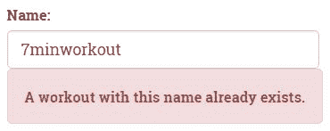
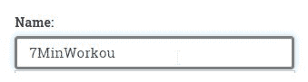
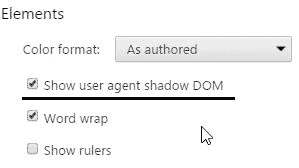
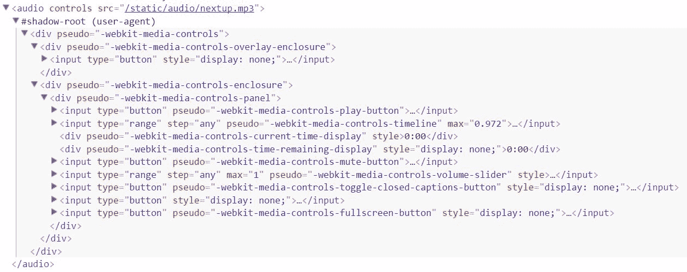
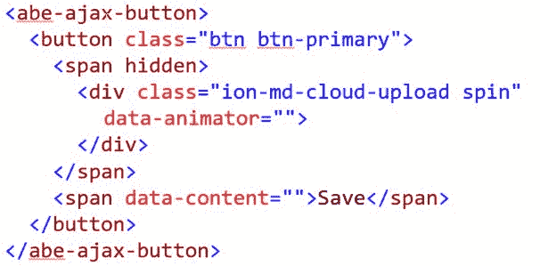
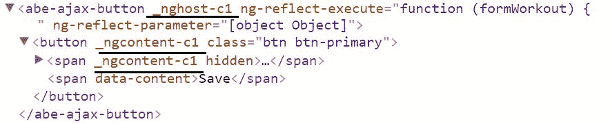
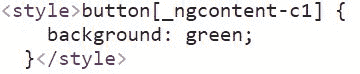

# 第六章：深入了解 Angular 指令

**指令**无处不在。它们是 Angular 的基本构建块。每个应用扩展都导致我们创建了新的**组件指令**。这些组件指令进一步消耗了**属性指令**（如`NgClass`和`NgStyle`）和**结构指令**（如`NgIf`和`NgFor`）来扩展它们的行为。

虽然我们已经构建了许多组件指令和一个单独的属性指令，但仍有一些指令构建的概念值得探索。这对于属性和结构指令尤其如此，我们尚未详细涵盖。

本章将涵盖以下主题：

+   **构建指令**：我们构建多个指令，并学习指令在哪里有用，它们与组件有何不同，以及指令如何相互通信以及/或与宿主组件通信。我们探讨了所有指令类型，包括*组件指令*、*属性指令*和*结构指令*。

+   **异步验证**：Angular 使得验证需要服务器交互且本质上是异步的规则变得容易。我们将在本章构建我们的第一个异步验证器。

+   **使用渲染器进行视图操作**：渲染器允许以平台无关的方式操作视图。我们将利用渲染器为忙碌指示器指令，并了解其 API。

+   **宿主绑定**：宿主绑定允许指令与其**宿主元素**进行通信。本章将介绍如何利用此类绑定来处理指令。

+   **指令注入**：Angular DI 框架允许根据指令在 HTML 层次结构中的声明位置进行指令注入。我们将涵盖与这种注入相关的多个场景。

+   **处理视图子元素和内容子元素**：组件具有将外部视图模板包含到其自身视图中的能力。如何处理注入的内容是我们将在此处涵盖的内容。

+   **理解 NgIf 平台指令**：我们将深入了解`NgIf`平台指令，并尝试理解*结构指令*（如`NgIf`）的工作原理。

+   **Angular 组件的视图封装**：我们将学习 Angular 如何使用来自*Web 组件*的概念来支持视图和样式的封装。

让我们通过重申指令的基本分类来开始本章。

# 指令分类

Angular 指令将 HTML 视图与应用程序状态集成。指令帮助我们随着应用程序状态的变化来操作视图，并以最少或没有与实际 DOM 的交互来响应视图更新。

根据它们对视图的影响，这些指令进一步分为三种类型。

# 组件

**组件指令**或**组件**是具有封装视图的指令。在 Angular 中，当我们构建 UI 小部件时，我们实际上是在构建组件。我们已经构建了很多，例如`WorkoutRunnerComponent`、`WorkoutAudioComponent`、`VideoPlayerComponent`以及更多！

在这里要认识到的一个重要观点是，视图绑定到组件实现，并且它只能与在支持组件上定义的属性和事件一起工作。

# 属性指令

**属性指令**，另一方面，扩展现有的组件或 HTML 元素。将它们视为对这些组件/元素的行为扩展。

由于指令是预定义元素的扩展行为，因此每个构建指令的练习都涉及操作应用这些指令的组件/元素的状态。第三章，*更多 Angular 2 – 深入 SPA、路由和数据流*中构建的`MyAudioDirective`也是如此。该指令包装了 HTML5 的*audio*元素（`HTMLAudioElement`），以便于使用。`ngStyle`和`ngClass`等平台指令也以类似的方式工作。

# 结构指令

**结构指令**，例如属性指令，不定义自己的视图。相反，它们在其使用过程中作为其一部分工作的视图模板（HTML 片段）。通常，结构指令的目的是显示/隐藏或克隆提供给它的模板视图。`NgFor`、`NgIf`和`NgSwitch`等平台指令是这个类别的典型例子。

我希望这个关于指令的快速复习足以让我们开始。我们将通过扩展锻炼构建验证来开始我们的追求，并构建一个异步验证指令。

我们将从第五章，*支持服务器数据持久性*中我们离开的地方开始。Git 分支`checkpoint5.4`可以作为本章的基础。代码也已在 GitHub 上提供（[`github.com/chandermani/angular6byexample`](https://github.com/chandermani/angular6byexample)）供每个人下载。检查点作为 GitHub 上的分支实现。如果您不使用 Git，可以从 GitHub 位置[`bit.ly/ng6be-checkpoint-5-4`](http://bit.ly/ng6be-checkpoint-5-4)下载`checkpoint5.4`（ZIP 文件）。在首次设置快照时，请参阅`trainer`文件夹中的`README.md`文件。此外，请记住将`services/workout-service.ts`中的 API 密钥更新为您自己的 API 密钥。

# 构建远程验证指令

我们在第五章，*支持服务器数据持久性*中结束了，其中*锻炼运行器*能够管理 MongoDB 存储中的锻炼。由于每个锻炼都应该有一个独特的名称，我们需要强制实施唯一性约束。因此，在创建/编辑锻炼时，每次用户更改锻炼名称，我们都可以查询 MongoDB 以验证该名称是否已存在。

就像任何远程调用一样，这个检查也是异步的，因此需要一个*远程验证器*。我们将使用 Angular 的*异步验证支持*来构建这个远程验证器。

**异步验证器**与标准自定义验证器类似，除了验证检查的返回值是一个**promise**，而不是键值对象映射或 null。这个 promise 最终会解析为设置验证状态（如果有错误），或者 null（在验证成功的情况下）。

我们将创建一个执行锻炼名称检查的验证指令。对于这样的指令，有两种可能的实现方法：

+   我们可以创建一个专门用于唯一名称验证的指令。

+   我们可以创建一个通用的指令，可以执行任何远程验证。

验证指令

当我们在构建验证指令时，我们本可以构建一个标准的自定义验证器类。创建指令的优势在于，它允许我们将指令集成到模板驱动的表单方法中，其中指令可以嵌入到视图 HTML 中。或者，如果表单是使用模型（响应式方法）生成的，我们可以在创建`Control`对象时直接使用验证器类。

起初，检查数据源（*mLab*数据库）中重复名称的要求似乎过于具体，无法由通用验证器处理。但通过一些合理的假设和设计选择，我们仍然可以实施一个可以处理所有类型远程验证的验证器，包括锻炼名称验证。

计划创建一个外部化实际验证逻辑的验证器。该指令将验证函数作为输入。这意味着实际验证逻辑不是验证器的一部分，而是需要验证输入数据的组件的一部分。指令的职责仅仅是调用函数，并根据函数的返回值返回适当的错误键。

让我们将这个理论付诸实践，并构建我们的远程验证指令，命名为`RemoteValidatorDirective`。

下一个部分的配套代码库是 Git 分支`checkpoint6.1`。您可以与我们同步工作，或者检查上述文件夹中可用的实现。或者如果您不使用 Git，可以从 GitHub 位置[`bit.ly/ng2be-checkpoint6-1`](http://bit.ly/ng2be-checkpoint6-1)下载`checkpoint6.1`（ZIP 文件）。在首次设置快照时，请参考`trainer`文件夹中的`README.md`文件。

# 使用异步验证器验证锻炼名称

与自定义验证器类似，异步验证器也继承自相同的`Validator`类；但这次，异步验证器返回的是一个`Promise`，而不是对象映射。

让我们看看验证器的定义。从 GitHub ([`bit.ly/ng6be-6-1-remote-validator-directive-ts`](http://bit.ly/ng6be-6-1-remote-validator-directive-ts)) 文件夹中复制验证器的定义，并将其添加到 `shared` 模块文件夹中。验证器的定义如下：

```js
import { Directive, Input } from '@angular/core';
import { NG_ASYNC_VALIDATORS, FormControl } from '@angular/forms';

@Directive({
  selector: '[abeRemoteValidator][ngModel]',
  providers: [{ provide: NG_ASYNC_VALIDATORS, useExisting: RemoteValidatorDirective, multi: true }]
})
export class RemoteValidatorDirective {

  @Input() abeRemoteValidator: string;
  @Input() validateFunction: (value: string) => Promise<boolean>;

  validate(control: FormControl): { [key: string]: any } {
    const value: string = control.value;
    return this.validateFunction(value).then((result: boolean) => {
      if (result) {
        return null;
      }
      else {
        const error: any = {};
        error[this.abeRemoteValidator] = true;
        return error;
      }
    });
  }
} 
```

请务必从共享模块中导出此指令，以便我们可以在锻炼构建模块中使用它。

由于我们将验证器注册为指令而不是使用 `FormControl` 实例（通常在构建使用 *响应式方法* 的表单时使用），我们需要额外的提供者配置设置（在先前的 `@Directive` 元数据中添加），使用此语法：

```js
 providers:[{ provide: NG_ASYNC_VALIDATORS, useExisting: RemoteValidatorDirective,  multi: true }] 
```

这条语句将验证器注册到现有的异步验证器中。

在前面的代码中使用的奇怪指令选择器 `` selector: `[abeRemoteValidator][ngModel]` `` 将在下一节中介绍，我们将构建一个忙碌指示器指令。

在我们深入研究验证器实现之前，让我们将其添加到锻炼名称输入中。这将帮助我们关联验证器的行为与其使用。

使用验证器声明更新锻炼名称输入 (`workout.component.html`)：

```js
<input type="text" name="workoutName" ... 
 abeRemoteValidator="workoutname"[validateFunction]="validateWorkoutName"> 
```

前缀指令选择器

总是在你的指令前加上一个标识符（如你刚才看到的 `abe`），以区分它们与框架指令和其他第三方指令。

**注意**：如果 `ngModelOptions` 的 `updateOn` 设置为 `submit`，则将其更改为 `blur`。

指令实现接受两个输入：通过指令属性 `abeRemoveValidator` 传递的 *验证键*，用于设置 *错误键*，以及 *验证函数* (`validateFunction`)，用于验证控件值。这两个输入都带有 `@Input` 装饰器。

输入参数 `@Input("validateFunction") validateFunction: (value: string) => Promise<boolean>;` 绑定到一个函数，而不是一个标准组件属性。由于底层语言 TypeScript（以及 JavaScript）的特性，我们可以将函数视为属性。

当异步验证触发（在 `input` 的变化上）时，Angular 会调用该函数，传入底层的 `control`。作为第一步，我们拉取当前的输入值，然后使用这个输入调用 `validateFunction` 函数。`validateFunction` 返回一个承诺，该承诺最终应该解析为 `true` 或 `false`：

+   如果承诺解析为 `true`，则验证成功，承诺回调函数返回 `null`。

+   如果它是 `false`，则验证失败，并返回一个错误键值映射。这里的 *键* 是我们在使用验证器时设置的字符串字面量（`a2beRemoteValidator="workoutname"`）。

当输入中声明了多个验证器时，这个 *键* 非常有用，它允许我们识别出失败的验证。

接下来，向锻炼组件添加一个针对此失败的验证消息。在现有的 *锻炼名称* 验证 `label` 之后添加此标签声明：

```js
<label *ngIf="name.control.hasError('workoutname')" class="alert alert-danger validation-message">A workout with this name already exists.</label> 
```

然后将这两个标签包裹在一个 `div` 中，就像我们对 *锻炼标题* 错误标签所做的那样。

`hasError` 函数检查 `'workoutname'` 验证键是否存在。

此实现中缺失的最后一块是我们在应用指令时分配的实际验证函数（`[validateFunction]="**validateWorkoutName**"`），但我们从未实现它。

将 `validateWorkoutName` 函数添加到 `workout.component.ts`：

```js
validateWorkoutName = (name: string): Promise<boolean> => {
    if (this.workoutName === name) { return Promise.resolve(true); }
    return this.workoutService.getWorkout(name).toPromise()
      .then((workout: WorkoutPlan) => {
        return !workout;
      }, error => {
        return true;
      });
  }  
```

在我们探索前面的函数之前，我们需要对 `WorkoutComponent` 类做一些更多的修复。`validateWorkoutName` 函数依赖于 `WorkoutService` 来获取具有特定名称的锻炼。让我们在构造函数中注入该服务，并在导入部分添加必要的导入：

```js
import { WorkoutService }  from "../../core/workout.service"; 
... 
constructor(... , private workoutService: WorkoutService) { 
```

然后声明变量 `workoutName` 和 `queryParamsSub`：

```js
private workoutName: string;
queryParamsSub: Subscription
```

将此语句添加到 `ngOnInit`：

```js
this.queryParamsSub = this.route.params.subscribe(params => this.workoutName = params['id']); 
```

前面的语句通过监视（订阅）`route.params` 服务来设置当前锻炼名称。如果使用原始锻炼名称，则使用 `workoutName` 来跳过现有锻炼的名称验证。

之前创建的订阅需要清除以避免内存泄漏，因此将此行添加到 `ngDestroy` 函数中：

```js
this.queryParamsSub.unsubscribe();
```

将 `validateWorkoutName` 函数定义为 *实例函数*（使用 *箭头操作符*）而不是定义为标准函数（在 *原型* 上声明函数）的原因是 `'this'` 作用域问题。

查看 `RemoteValidatorDirective` 内部的验证函数调用（使用 `@Input("validateFunction") validateFunction;` 声明）：

```js
return this.validationFunction(value).then((result: boolean) => { ... }); 
```

当调用（名为 `validateFunction`）函数时，`this` 引用绑定到 `RemoteValidatorDirective` 而不是 `WorkoutComponent`。由于 `execute` 在前面的设置中引用了 `validateWorkoutName` 函数，因此 `validateWorkoutName` 内部的任何对 `this` 的访问都是问题性的。

这导致 `validateWorkoutName` 函数内部的 `if (this.workoutName === name)` 语句失败，因为 `RemoteValiatorDirective` 没有名为 `workoutName` 的实例成员。通过将 `validateWorkoutName` 定义为一个实例函数，*TypeScript* 编译器在函数定义时会在 `this` 的值周围创建一个闭包。

使用新的声明，`validateWorkoutName` 函数内部的 `this` 无论函数如何调用，始终指向 `WorkoutComponent`。

我们还可以查看 `WorkoutComponent` 的编译后的 JavaScript 来了解闭包是如何与 `validateWorkoutName` 一起工作的。我们感兴趣的生成代码的部分如下：

```js
function WorkoutComponent(...) { 
 var _this = this; 
  ... 
  this.validateWorkoutName = function (name) { 
 if (_this.workoutName === name) 
      return Promise.resolve(true); 
```

如果我们查看验证函数的实现，我们会看到它涉及到查询*mLab*以获取特定的锻炼名称。当没有找到具有相同名称的锻炼时，`validateWorkoutName`函数返回`true`，当找到具有相同名称的锻炼时（实际上返回的是一个*promise*）返回`false`。

`WorkoutService`上的`getWorkout`函数返回一个*observable*，但我们通过在可观察对象上调用`toPromise`函数将其转换为*promise*。

现在可以测试验证指令了。创建一个新的锻炼并输入一个现有的锻炼名称，例如`7minworkout`。看看验证错误消息最终是如何显示出来的：



太棒了！看起来很棒，但仍然有些不足。用户没有得到我们正在验证锻炼名称的通知。我们可以改善这种体验。

# 构建忙碌指示器指令

当远程验证锻炼名称时，我们希望用户意识到后台的活动。在远程验证发生时，输入框周围的视觉线索应该起到这个作用。

仔细思考；有一个带有异步验证器（执行远程验证）的输入框，我们希望在验证过程中用视觉线索装饰输入框。这似乎是一个常见的模式来解决？确实如此，所以让我们创建另一个指令！

但在我们开始实现之前，我们必须理解我们并不孤单。忙碌指示器指令需要另一个指令`NgModel`的帮助。我们已经在第四章*构建个人教练*中使用了`NgModel`指令在`input`元素上。`NgModel`帮助我们跟踪输入元素的状态。以下示例取自第四章*构建个人教练*，并突出了`NgModel`如何帮助我们验证输入：

```js
<input type="text" name="workoutName" #name="ngModel"  class="form-control" id="workout-name" ... [(ngModel)]="workout.name" required> 
... 
<label *ngIf="name.control.hasError('required') && (name.touched || submitted)" class="alert alert-danger">Name is required</label>  
```

即使在上一节中完成的唯一锻炼名称验证也采用了相同的技巧，即使用`NgModel`来检查验证状态。

让我们从定义指令的大纲开始。在`src/app/shared`文件夹中使用 CLI 生成器创建一个`busy-indicator.directive.ts`文件：

```js
ng generate directive busy-indicator
```

此外，通过在共享模块文件`shared.module.ts`中的`exports`数组中添加指令来导出它。

接下来，更新指令的构造函数以进行`NgModel`注入，并从`@angular/forms`导入`NgModel`引用：

```js
constructor(private model: NgModel) { }
```

这指示 Angular 向声明的元素注入`NgModel`实例。记住，`NgModel`指令已经在`input`（`workoutname`）上存在：

```js
<input... name="workoutName" #name="ngModel" [(ngModel)]="workout.name" ...>
```

这就足够将我们的新指令集成到锻炼视图中了，所以让我们快速完成它。

从`workout-builder`打开`workout.component.html`，并将忙碌指示器指令添加到锻炼名称`input`：

```js
<input type="text" name="workoutName" ... abeBusyIndicator> 
```

创建一个新的锻炼或打开一个现有的锻炼，以查看`BusyIndicatorDirective`是否已加载，以及`NgModel`注入是否正常工作。这可以通过在`BusyIndicatorDirective`构造函数中设置断点来轻松验证。

当 Angular 在输入 HTML 中遇到 `ngModel` 时，它将相同的 `NgModel` 实例注入到 `BusyIndicatorDirective` 中。

你可能会想知道，如果我们将此指令应用于没有 `ngModel` 属性的输入元素，或者实际上应用于任何 HTML 元素/组件，例如以下这样：

```js
<div abeBusyIndicator></div> 
<input type="text" abeBusyIndicator> 
```

注入会起作用吗？

当然不是！我们可以在创建锻炼视图时尝试它。打开 `workout.component.html` 并在锻炼名称 `input` 上方添加以下 `input`。刷新应用：

```js
<input type="text" name="workoutName1" a2beBusyIndicator> 
```

Angular 抛出异常，如下：

```js
 EXCEPTION: No provider for NgModel! (BusyIndicatorDirective -> NgModel)
```

如何避免这种情况？嗯，Angular 的依赖注入（DI）可以在这里帮助我们，因为它允许我们声明一个可选依赖。

在进一步操作之前，请移除之前添加的 `input` 控制器。

# 使用 @Optional 装饰器注入可选依赖项

Angular 有一个 `@Optional` 装饰器，当应用于构造函数参数时，指示 Angular 注入器如果找不到依赖项则注入 `null`。

因此，忙碌指示器构造函数可以写成如下：

```js
constructor(@Optional() private model: NgModel) { } 
```

问题解决了吗？实际上并没有；如前所述，我们需要 `NgModel` 指令才能使 `BusyIndicatorDirective` 工作。所以，虽然我们学到了一些新东西，但在当前场景中并不十分有用。

在进一步操作之前，请记住将 `workoutname` `input` 恢复到原始状态，并应用 `abeBusyIndicator`。

只有在元素上已经存在 `NgModel` 指令时，才应该应用 `BusyIndicatorDirective`。

`selector` 指令这次将拯救我们的日子。将 `BusyIndicatorDirective` 的选择器更新如下：

```js
selector: `[abeBusyIndicator][ngModel]` 
```

这个选择器仅在元素上存在 `a2beBusyIndicator` 与 `ngModel` 属性的组合时创建 `BusyIndicatorDirective`。问题解决了！

现在是时候添加实际实现了。

# 实现一 - 使用渲染器

为了使 `BusyIndicatorDirective` 能够工作，它需要知道异步验证在 `input` 上何时触发以及何时结束。这个信息只有通过 `NgModel` 指令才能获得。`NgModel` 有一个属性 `control`，它是 `Control` 类的一个实例。正是这个 `Control` 类跟踪输入的当前状态，包括以下内容：

+   目前分配的验证器（同步和异步）

+   当前值

+   输入元素的状态，例如 `pristine`、`dirty` 和 `touched`

+   输入验证状态，可能是 `valid`、`invalid` 或 `pending` 中的任何一个，具体取决于是否正在执行异步验证

+   跟踪值变化或验证状态变化的操作

`Control` 看起来是一个有用的类，而我们感兴趣的是它的 `pending` 状态！

让我们为 `BusyIndicatorDirective` 类添加第一个实现。用以下代码更新类：

```js
private subscriptions: Array<any> = []; 
ngAfterViewInit(): void {
    this.subscriptions.push(
      this.model.control.statusChanges.subscribe((status: any) => {
        if (this.model.control.pending) {
          this.renderer.setElementStyle(this.element.nativeElement, 'border-width', '3px');
          this.renderer.setElementStyle(this.element.nativeElement, 'border-color', 'gray');
        }
        else {
          this.renderer.setElementStyle(this.element.nativeElement, 'border-width', null);
          this.renderer.setElementStyle(this.element.nativeElement, 'border-color', null);
        }
      }));
  }  
```

需要在构造函数中添加两个新的依赖项，因为我们将在 `ngAfterViewInit` 函数中使用它们。将 `BusyIndicatorDirective` 的构造函数更新如下：

```js
constructor(private model: NgModel,  
 private element: ElementRef, private renderer: Renderer) { }
```

还需要在`'@angular/core'`中添加对`ElementRef`和`Renderer`的导入。

`ElementRef`是对底层 HTML 元素（在这种情况下是`input`）的包装对象。在第三章*更深入的 Angular 2 - 单页应用、路由和数据流*中构建的`MyAudioDirective`指令使用了`ElementRef`来获取底层的`Audio`元素。

`Renderer`注入值得注意。调用`setElementStyle`是一个明显的迹象表明`Renderer`负责管理 DOM。但在我们深入探讨`Renderer`的角色之前，让我们先尝试理解前面的代码在做什么。

在前面的代码中，模型（`NgModel`实例）上的`control`属性定义了一个事件（一个`Observable`），`statusChanges`，我们可以订阅它以了解控制验证状态何时改变。可用的验证状态有`valid`、`invalid`和`pending`。

订阅检查控制状态是否为`pending`，并相应地使用`Renderer` API 函数`setElementStyle`装饰底层元素。我们设置了输入的`border-width`和`border-color`。

前面的实现被添加到`ngAfterViewInit`指令生命周期钩子中，该钩子在视图初始化后调用。

让我们试试。打开创建锻炼页面或现有的*7 分钟锻炼*。当我们离开锻炼名称输入时，`input`样式会改变，并在远程验证锻炼名称完成后恢复。不错！



在继续前进之前，还要在`BusyIndicatorDirective`中添加取消订阅的代码以避免内存泄漏。将此函数（生命周期钩子）添加到`BusyIndicatorDirective`：

```js
ngOnDestroy() { 
    this.subscriptions.forEach((s) => s.unsubscribe()); 
} 
```

总是取消订阅观察者

总是要记得在代码中取消任何`Observable`/`EventEmitter`订阅，以避免内存泄漏。

实现看起来不错。`Renderer`正在做它的工作。但还有一些未解决的问题。

为什么不直接获取底层 DOM 对象并使用标准的 DOM API 来操作输入样式呢？为什么我们需要`renderer`？

# Angular 渲染器，翻译层

Angular 2 的主要设计目标之一是使其能够在各种环境中、框架和设备上运行。Angular 通过将核心框架实现分为**应用层**和**渲染层**来实现这一点。应用层拥有我们与之交互的 API，而渲染层提供了一个抽象层，应用层可以使用它而无需担心实际视图是如何和在哪里被渲染的。

通过分离渲染层，Angular 理论上可以在各种设置中运行。这包括但不限于：

+   浏览器

+   浏览器主线程和 Web Worker 线程，出于明显的性能原因

+   服务器端渲染

+   原生应用框架；目前正在努力将 Angular 与`NativeScript`和`ReactNative`集成

+   测试，允许我们在浏览器外测试应用 UI

Angular 在我们浏览器内部使用的`Renderer`实现是`DOMRenderer`。它负责将我们的 API 调用转换为浏览器 DOM 更新。实际上，我们可以在`BusyIndicatorDirective`的构造函数中添加一个断点，查看`renderer`的值来验证渲染器类型。

正是因为这个原因，我们避免在`BusyIndicatorDirective`内部直接操作 DOM 元素。你永远不知道代码会运行到哪里。我们本可以轻松做到这一点：

```js
this.element.nativeElement.style.borderWidth="3px"; 
```

相反，我们使用了`Renderer`以平台无关的方式完成同样的操作。

看一下`Renderer` API 函数，`setElementStyle`：

```js
this.renderer.setElementStyle( 
             this.element.nativeElement, "border-width", "3px"); 
```

设置样式需要元素、要更新的样式属性以及要设置的值。`element`引用的是注入到`BusyIndicatorDirective`中的`input`元素。

重置样式

通过调用`setElementStyle`设置的样式可以通过在第三个参数中传递`null`值来重置。查看前面代码中的`else`条件。

`Renderer` API 有其他一些方法可以用来设置属性、设置属性、监听事件，甚至创建新视图。每次你构建一个新的指令时，记得评估`Renderer` API 以进行 DOM 操作。

关于`Renderer`及其应用的更详细解释可以作为 Angular 设计文档的一部分在此处找到：[`bit.ly/ng2-render`](http://bit.ly/ng2-render)

我们还没有完成！借助 Angular 的强大功能，我们可以改进实现。Angular 允许我们在指令实现中进行*宿主绑定*，帮助我们避免大量的样板代码。

# 指令中的宿主绑定

在 Angular 领域，指令附加到的组件/元素被称为**宿主元素**：一个承载我们的指令/组件的容器。对于`BusyIndicatorDirective`，`input`元素是*宿主*。

虽然我们可以使用`Renderer`来操作宿主（我们也确实这样做了），但 Angular 的数据绑定基础设施可以进一步减少代码。它提供了一种声明式的方式来管理指令-宿主交互。使用宿主绑定概念，我们可以操作元素的性质*属性*和*事件*。

让我们了解每个宿主绑定能力，最后我们将修复我们的`BusyIndicatorDirective`实现。

# 使用@HostBinding 进行属性绑定

使用**宿主属性绑定**将*指令属性*绑定到*宿主元素属性*。任何对指令属性的更改都会在变更检测阶段与链接的宿主属性同步。

我们只需要在想要同步的指令属性上使用`@HostBinding`装饰器。例如，考虑以下绑定：

```js
@HostBinding("readOnly") get busy() {return this.isbusy}; 
```

当应用于`input`时，它将`input`的`readOnly`属性设置为`true`，当`isbusy`指令属性为`true`时。

注意，`readonly`也是`input`上的一个*属性*。这里我们指的是输入*属性* `readOnly`。

# 属性绑定

**属性绑定**将指令属性绑定到宿主组件属性。例如，考虑以下绑定方式的指令：

```js
@HostBinding("attr.disabled") get canEdit(): string  
  { return !this.isAdmin ? "disabled" : null }; 
```

如果应用于输入，当`isAdmin`标志为`false`时，它将在`input`上添加`disabled`属性，否则清除它。在这里，我们也遵循了 HTML 模板中使用的相同的属性绑定符号。属性名以字符串字面量`attr`为前缀。

我们也可以用*类*和*样式绑定*做类似的事情。考虑以下行：

```js
@HostBinding('class.valid')  
   get valid { return this.control.valid; } 
```

这行代码设置了一个类绑定，下一行创建了一个样式绑定：

```js
@HostBinding("style.borderWidth")  
   get focus(): string { return this.focus?"3px": "1px"}; 
```

# 事件绑定

最后，**事件绑定**用于订阅宿主组件/元素引发的事件。考虑以下示例：

```js
@Directive({ selector: 'button, div, span, input' }) 
class ClickTracker { 
  @HostListener('click', ['$event.target']) 
  onClick(element: any) { 
    console.log("button", element, "was clicked"); 
  } 
} 
```

这将在宿主事件`click`上设置一个监听器。Angular 将为视图中的每个*button*、*div*、*span*和*input*实例化前面的指令，并使用`onClick`函数设置宿主绑定。`$event`变量包含引发事件的的事件数据，而`target`指的是被点击的元素/组件。

事件绑定也适用于组件。考虑以下示例：

```js
@Directive({ selector: 'workout-runner' }) 
class WorkoutTracker { 
  @HostListener('workoutStarted', ['$event']) 
  onWorkoutStarted(workout: any) { 
    console.log("Workout has started!"); 
  } 
} 
```

使用这个指令，我们跟踪在`WorkoutRunner`组件上定义的`workoutStarted`事件。当锻炼开始时，会调用`onWorkoutStarted`函数，并带有开始锻炼的详细信息。

现在我们已经了解了这些绑定的工作原理，我们可以改进我们的`BusyIndicatorDirective`实现。

# 实现二 - 带有宿主绑定的 BusyIndicatorDirective

你可能已经猜到了！我们将使用*宿主属性绑定*而不是`Renderer`来设置样式。想要试试吗？请继续！清除现有的实现，并尝试为`borderWidth`和`borderColor`样式属性设置宿主绑定，而不查看以下实现。

这就是宿主绑定实现后指令的外观：

```js
import {Directive, HostBinding} from '@angular/core'; 
import {NgModel} from '@angular/forms'; 

@Directive({ selector: `[abeBusyIndicator][ngModel]`}) 
export class BusyIndicatorDirective {
  private get validating(): boolean {
    return this.model.control != null && this.model.control.pending;
  }
  @HostBinding('style.borderWidth') get controlBorderWidth():
        string { return this.validating ? '3px' : null; }
  @HostBinding('style.borderColor') get controlBorderColor():
        string { return this.validating ? 'gray' : null; }

  constructor(private model: NgModel) { }
}

```

我们将`pending`状态检查移动到了一个名为`validating`的指令属性中，然后使用了`controlBorderWidth`和`controlBorderColor`属性进行样式绑定。这绝对比我们之前的方法更简洁！去测试一下吧。

如果我们告诉你这可以不使用自定义指令就能完成，请不要感到惊讶！我们就是这样做的，只需在锻炼名称`input`上使用样式绑定即可：

```js
<input type="text" name="workoutName" ... 
[style.borderColor]="name.control.pending ? 'gray' : null" [style.borderWidth]="name.control.pending ? '3px' : null">
```

我们得到了相同的效果！

不，我们的努力并没有白费。我们确实学到了**渲染器**和**宿主绑定**的概念。在构建提供复杂行为扩展而不是仅设置元素样式的指令时，这些概念将非常有用。

如果你在运行代码时遇到问题，请查看 Git 分支`checkpoint6.1`以获取我们迄今为止所做的工作的版本。或者如果你不使用 Git，可以从[`bit.ly/ng6be-checkpoint-6-1`](http://bit.ly/ng6be-checkpoint-6-1)下载`checkpoint6.1`的快照（ZIP 文件）。在首次设置快照时，请参考`trainer`文件夹中的`README.md`文件。

我们接下来要讨论的主题是，*指令注入*。

# 指令注入

回到几页前的`BusyIndicatorDirective`实现，它使用了*渲染器*，特别是构造函数：

```js
constructor(private model: NgModel ...) { } 
```

Angular 自动定位为指令元素创建的`NgModel`指令，并将其注入到`BusyIndicatorDirective`中。这是因为这两个指令都是在同一个*宿主元素*上声明的。

好消息是我们可以影响这种行为。在父 HTML 树或子树上创建的指令也可以注入。接下来的几节将讨论如何在组件树中注入指令，这是一个非常实用的功能，允许具有*共同血统*（在视图中）的指令进行跨指令通信。

我们将使用 StackBlitz ([`stackblitz.com/edit/angular-pzljm3`](https://stackblitz.com/edit/angular-pzljm3)) 来演示这些概念。StackBlitz 是一个在线 IDE，可以运行 Angular 应用程序！

首先，查看文件`app.component.ts`。它有三个指令：`Relation`、`Acquaintance`和`Consumer`，这个视图层次结构定义如下：

```js
<div relation="grand-parent" acquaintance="jack"> 
    <div relation="parent"> 
 <div relation="me" consumer> 
        <div relation="child-1"> 
          <div relation="grandchild-1"></div> 
        </div> 
        <div relation="child-2"></div> 
      </div> 
    </div> 
</div> 
```

在接下来的几节中，我们将描述我们可以将不同的`relation`和`Acquaintance`指令注入到`consumer`指令中的各种方法。检查浏览器控制台，查看在`ngAfterViewInit`生命周期钩子中记录的注入依赖项。

# 注入同一元素上定义的指令

默认情况下，构造函数注入支持注入同一元素上定义的指令。构造函数只需要声明我们想要注入的指令类型变量：

```js
variable:DirectiveType 
```

在`BusyIndicatorDirective`中我们进行的`NgModel`注入属于这一类别。如果指令在当前元素上找不到，Angular DI 将抛出错误，除非我们将依赖项标记为`@Optional`。

可选依赖项

`@Optional`装饰器不仅限于指令注入。它存在于标记任何类型的依赖项为可选。

从 plunk 示例中，第一次注入（在`Consumer`指令实现中）将带有`me`属性的`Relation`指令（`relation="me"`）注入到消费者指令中：

```js
constructor(private me:Relation ... 
```

# 从父元素注入指令依赖项

在构造函数参数前加上`@Host`装饰器指示 Angular 在*当前元素*、*其父元素*或其*父元素*上搜索依赖项，直到达到组件边界（一个在其视图层次结构中某处有指令的组件）。检查第二个`consumer`注入：

```js
constructor(..., @Host() private myAcquaintance:Acquaintance  
```

此语句注入了在层次结构上方两级声明的`Acquaintance`指令实例。

就像之前描述的`@Option`装饰器一样，`@Host()`的使用不仅限于指令。Angular 服务注入也遵循相同的模式。如果一个服务被标记为`@Host`，搜索将停止在宿主组件上。它不会继续向上到组件树。

`@Skipself`装饰器可以用来跳过当前元素以进行指令搜索。

从 StackBlitz 示例中，这次注入将具有`relation`属性值`parent`（`relation="parent"`）的`Relation`指令注入到`consumer`中：

```js
@SkipSelf() private myParent:Relation 
```

# 注入子指令（或指令集）

如果需要将嵌套 HTML 中定义的指令（或指令集）注入到父指令/组件中，有四个装饰器可以帮助我们：

+   `@ViewChild`/`@ViewChildren`

+   `@ContentChild`/`@ContentChildren`

如这些命名约定所暗示的，有装饰器可以注入单个子指令或多个子指令：

要理解`@ViewChild/@ViewChildren`与`@ContentChild/@ContentChildren`的重要性，我们需要看看视图和内容子代是什么，这是一个我们将很快讨论的话题。但就现在而言，理解视图子代是组件自身视图的一部分，而内容子代是注入到组件视图的外部 HTML 就足够了。

看看在 StackBlitz 示例中，`ContentChildren`装饰器是如何用来将子`Relation`指令注入到`Consumer`中的：

```js
@ContentChildren(Relation) private children:QueryList<Relation>; 
```

令人惊讶的是，变量`children`的数据类型不是一个数组，而是一个自定义类-`QueryList`。`QueryList`类不是一个典型的数组，而是一个 Angular 在添加或删除依赖项时保持更新的集合。这可能会在使用结构指令如`NgIf`或`NgFor`创建/销毁 DOM 树时发生。我们将在接下来的章节中更多地讨论`QueryList`。

你可能已经注意到前面的注入不是像前两个示例那样的构造函数注入。这是有原因的。注入的指令将在底层组件/元素的内容初始化之前不可用。正因为如此，我们在`ngAfterViewInit`生命周期钩子内部有`console.log`语句。我们应在生命周期钩子执行后仅访问内容子代。

前面的示例代码将所有三个子`relation`对象注入到`consumer`指令中。

# 注入后代指令（或指令集）

标准的`@ContentChildren`装饰器（或者实际上`@ViewChildren`也是如此）仅注入指令/组件的直接子代，而不是其后代。要包括所有后代，我们需要向`Query`提供一个参数：

```js
@ContentChildren(Relation, {descendants: true}) private 
allDescendents:QueryList<Relation>; 
```

传递`descendants: true`参数将指示 Angular 搜索所有后代。

如果你查看控制台日志，前面的语句注入了所有四个后代。

Angular DI（依赖注入）虽然看起来使用简单，但包含了大量的功能。它管理我们的服务、组件和指令，并在正确的时间、正确的位置为我们提供所需的内容。组件和其他指令中的指令注入提供了一种机制，使指令能够相互通信。这种注入允许一个指令访问另一个指令的公共 API（公共函数/属性）。

现在是时候探索一些新内容了。我们将构建一个 Ajax 按钮组件，允许我们将外部视图注入到组件中，这个过程也被称为**内容****转译**。

# 构建 Ajax 按钮组件

当我们保存/更新一个练习或锻炼时，总是存在重复提交（或重复`POST`请求）的可能性。当前的实现没有提供有关保存/更新操作何时开始和何时完成的任何反馈。由于缺乏视觉提示，应用程序的用户可能会有意或无意地多次点击保存按钮。

让我们尝试通过创建一个专门的按钮——一个*Ajax 按钮*来解决这个问题，当点击时提供一些视觉提示，并阻止重复的 Ajax 提交。

按钮组件将按照以下方式工作。它接受一个函数作为输入。这个输入函数（输入参数）应该返回一个与远程请求相关的 promise。点击按钮时，按钮内部会调用远程函数（使用输入函数），跟踪底层的 promise，等待其完成，并在这一过程中显示一些忙碌的提示。此外，按钮在远程调用完成之前保持禁用状态，以避免重复提交。

下一个部分的配套代码库是 Git 分支`checkpoint6.2`。您可以与我们一同工作，或者检查分支中可用的实现。如果您不使用 Git，可以从 GitHub 位置[`bit.ly/ng6be-checkpoint-6-2`](http://bit.ly/ng6be-checkpoint-6-2)下载`checkpoint6.2`（ZIP 文件）。在首次设置快照时，请参考`trainer`文件夹中的`README.md`文件。

让我们创建组件轮廓以使事情更清晰。使用以下命令在应用程序的共享模块（`src/app/shared`）下创建一个`ajax-button`组件，然后从`SharedModule`**导出**组件：

```js
ng generate component ajax-button -is
```

更新组件定义，并从`@angular/core`导入它们：

```js
export class AjaxButtonComponent implements OnInit { 
  busy: boolean = null; 
  @Input() execute: any; 
  @Input() parameter: any; 
} 
```

并将以下 HTML 模板添加到`ajax-button.component.html`：

```js
<button [attr.disabled]="busy" class="btn btn-primary"> 
    <span [hidden]="!busy">
        <div class="ion-md-cloud-upload spin"></div>
    </span>
    <span>Save</span> 
</button> 
```

组件（`AjaxButtonComponent`）接受两个属性绑定，`execute`和`parameter`。`execute`属性指向在 Ajax 按钮点击时调用的函数。`parameter`是可以传递给此函数的数据。

看看视图中 `busy` 标志的使用。当 `busy` 标志被设置时，我们禁用按钮并显示旋转器。让我们添加使一切工作的实现。将以下代码添加到 `AjaxButtonComponent` 类中：

```js
@HostListener('click', ['$event'])
onClick(event: any) {
    const result: any = this.execute(this.parameter);
    if (result instanceof Promise) {
      this.busy = true;
      result.then(
        () => { this.busy = null; },
        (error: any) => { this.busy = null; });
    }
}
```

我们将 *主机事件绑定* 设置到 `AjaxButtonComponent` 的点击事件上。每当点击 `AjaxButtonComponent` 组件时，都会调用 `onClick` 函数。

需要将 `HostListener` 导入添加到 `'@angular/core'` 模块中。

`onClick` 实现调用输入函数，以单个参数作为 `parameter`。调用结果存储在 `result` 变量中。

`if` 条件检查 `result` 是否是 `Promise` 对象。如果是，则将 `busy` 指示器设置为 `true`。然后按钮等待使用 `then` 函数解决的承诺。无论承诺是以 *成功* 还是 *错误* 解决，`busy` 标志都会设置为 `null`。

将 `busy` 标志设置为 `null` 而不是 `false` 的原因是这个属性绑定 `[attr.disabled]="busy"`。除非 `busy` 是 `null`，否则 `disabled` 属性不会被移除。记住，在 HTML 中，`disabled="false"` 不会启用按钮。在按钮再次可点击之前，需要移除该属性。

如果我们对这一行感到困惑：

```js
    const result: any = this.execute(this.parameter); 
```

然后你需要看看组件是如何使用的。打开 `workout.component.html` 并将 `Save` 按钮的 HTML 替换为以下内容：

```js
<abe-ajax-button [execute]="save" [parameter]="f"></abe-ajax-button> 
```

`Workout.save` 函数绑定到 `execute`，而 `parameter` 接收 `FormControl` 对象 `f`。

我们需要将 `Workout` 类中的 `save` 函数更改为返回一个承诺，以便 `AjaxButtonComponent` 可以工作。将 `save` 函数实现更改为以下内容：

```js
save = (formWorkout: any): Promise<Object | WorkoutPlan> => {
    this.submitted = true;
    if (!formWorkout.valid) { return; }
    const savePromise = this.workoutBuilderService.save().toPromise();

    savePromise.then(
      result => this.router.navigate(['/builder/workouts']),
      err => console.error(err)
    );
    return savePromise;
  } 
```

`save` 函数现在返回一个 *promise*，我们通过在 `workoutBuilderService.save()` 调用返回的 *observable* 上调用 `toPromise` 函数来构建它。

注意我们如何将 `save` 函数定义为 *实例函数*（使用箭头操作符）来创建对 *this* 的闭包。这是我们之前在构建 *远程验证指令* 时所做的一件事。

是时候测试我们的实现了！刷新应用程序并打开创建/编辑锻炼视图。点击保存按钮，看看 Ajax 按钮如何工作：


在保存后返回锻炼列表页面时，前面的动画可能不会持续很久。我们可以暂时禁用导航来查看新的更改。

我们开始本节的目标是突出外部元素/组件如何被包含到组件中。现在就让我们来做吧！

# 将外部组件/元素包含到组件中

从一开始，我们就需要理解 **transclusion** 是什么意思。而理解这个概念最好的方法就是看看一个例子。

我们迄今为止构建的任何组件都没有从外部借用内容。不确定这是什么意思？

考虑 `workout.component.html` 中的先前 `AjaxButtonComponent` 示例：

```js
<ajax-button [execute]="save" [parameter]="f"></ajax-button> 
```

如果我们将`ajax-button`的使用方式改为以下内容？

```js
<ajax-button [execute]="save" [parameter]="f">Save Me!</ajax-button> 
```

`Save Me!`文本会显示在按钮上吗？不会尝试它！

`AjaxButtonComponent`组件已经有了模板，并且它拒绝了我们之前提供的内容。如果我们能以某种方式让内容（前例中的`Save Me!`）加载到`AjaxButtonComponent`中会怎样？将外部视图片段注入到组件视图中的这一行为就是我们所说的**转译**，框架提供了必要的结构来启用转译。

是时候介绍两个新概念了，*内容子元素*和*视图子元素*。

# 内容子元素和视图子元素

简单来说，组件内部定义的 HTML 结构（使用`template`或`templateUrl`）是组件的**视图子元素**。然而，作为组件使用的一部分提供的 HTML 视图（例如`<ajax-button>**Save Me!**</ajax-button>`），定义了组件的**内容子元素**。

默认情况下，Angular 不允许像之前看到的那样将**内容子元素**嵌入。`Save Me!`文本从未被发出。我们需要明确告诉 Angular 在组件视图模板中何处发出**内容子元素**。为了理解这个概念，让我们修复`AjaxButtonComponent`视图。打开`ajax-button.component.ts`并更新视图模板定义如下：

```js
<button [attr.disabled]="busy" class="btn btn-primary"> 
    <span [hidden]="!busy"> 
        <ng-content select="[data-animator]"></ng-content> 
   </span> 
 <ng-content select="[data-content]"></ng-content> 
</button>
```

前一个视图中的两个`ng-content`元素定义了**内容注入位置**，内容子元素可以注入/转译。`selector`属性定义了在注入到主宿主时应该使用的**CSS 选择器**。

一旦我们在`workout.component.html`中修复了`AjaxButtonComponent`的使用方式，将其改为以下内容，它就会开始变得更有意义：

```js
<ajax-button [execute]="save" [parameter]="f">
    <div class="ion-md-cloud-upload spin" data-animator></div>
 <span data-content>Save</span>
</ajax-button> 
```

带有`data-animator`属性的`span`被注入到带有`select=[data-animator]`属性的`ng-content`中，另一个带有`data-content`属性的`span`被注入到第二个`ng-content`声明中。

再次刷新应用程序并尝试保存一个锻炼。虽然最终结果相同，但生成的视图是多个视图片段的组合：一部分是组件定义（**视图子元素**），另一部分是组件使用（**内容子元素**）。

下面的图示突出了渲染的`AjaxButtonComponent`之间的这一差异：


`ng-content`可以声明而不带`selector`属性。在这种情况下，组件标签内部定义的全部内容将被注入。

将**内容注入**到现有组件视图中是一个非常强大的概念。它允许组件开发者提供扩展点，组件消费者可以轻松消费并自定义组件的行为，而且是在受控的方式下。

我们为`AjaxButtonComponent`定义的内容注入允许消费者更改忙碌指示器动画和按钮内容，同时保持按钮的行为不变。

Angular 的优势不仅于此。它具有将*内容子项*和*视图子项*注入到*组件代码/实现*的能力。这允许组件与其内容/视图子项交互并控制它们的行为。

# 使用@ViewChild 和@ViewChildren 注入视图子项

在第三章，“更深入的了解 Angular 2 - 单页应用、路由和数据流”，我们使用了类似的方法，*视图子注入*。为了回忆我们做了什么，让我们看看`WorkoutAudioComponent`实现的相关部分。

视图定义看起来如下：

```js
<audio #ticks="MyAudio" loop src="img/tick10s.mp3"></audio>
<audio #nextUp="MyAudio" src="img/nextup.mp3"></audio>
<audio #nextUpExercise="MyAudio" [src]="'/assets/audio/' + nextupSound"></audio>
// Some other audio elements 
```

注入看起来如下：

```js
@ViewChild('ticks') private _ticks: MyAudioDirective; 
@ViewChild('nextUp') private _nextUp: MyAudioDirective; 
@ViewChild('nextUpExercise') private _nextUpExercise: MyAudioDirective; 
```

与`audio`标签关联的指令（`MyAudioDirective`）是通过`@ViewChild`装饰器注入到`WorkoutAudio`实现的。传递给`@ViewChild`的参数是用于在视图定义中定位元素的*模板变量*名称（例如`tick`）。然后`WorkoutAudio`组件使用这些音频指令来控制*7 分钟锻炼*的音频播放。

虽然前面的实现注入了`MyAudioDirective`，甚至子组件也可以被注入。例如，如果我们构建一个`MyAudioComponent`，它可能如下所示：

```js
@Component({ 
  selector: 'my-audio', 
  template: '<audio ...></audio>', 
}) 
export class MyAudioComponent { 
  ... 
} 
```

我们可以使用它而不是`audio`标签：

```js
<my-audio #ticks loop  
  src="img/tick10s.mp3"></my-audio> 
```

注入仍然会起作用。

如果在组件视图中定义了多个同类型的指令/组件会发生什么？使用`@ViewChildren`装饰器。它允许你查询一种类型的注入。使用`@ViewChildren`的语法如下：

```js
@ViewChildren(directiveType) children: QueryList<directiveType>; 
```

这将注入类型为`directiveType`的所有视图子项。对于前面提到的`WorkoutAudio`组件示例，我们可以使用以下语句来获取所有`MyAudioDirective`：

```js
@ViewChildren(MyAudioDirectives) private all: QueryList<MyAudioDirectives>; 
```

`ViewChildren`装饰器也可以接受一个由逗号分隔的选择器列表（*模板变量名称*）而不是类型。例如，为了在`WorkoutAudio`组件中选择多个`MyAudioDirective`实例，我们可以使用以下方法：

```js
 @ViewChildren('ticks, nextUp, nextUpExercise, halfway, aboutToComplete') private all: QueryList<MyAudioDirective>; 
```

`QueryList`类是 Angular 提供的一个特殊类。我们在本章前面的*注入子指令*部分介绍了`QueryList`。让我们进一步探索`QueryList`。

# 使用 QueryList 跟踪注入的依赖项

对于需要注入多个组件/指令（使用`@ViewChildren`或`@ContentChildren`）的组件，注入的是`QueryList`对象。

`QueryList`类是一个只读的**组件/指令集合**。Angular 根据用户界面的当前状态保持此集合的同步。

例如，考虑`WorkoutAudio`指令视图。它有五个`MyAudioDirective`实例。因此，对于以下集合，我们将有五个元素：

```js
@ViewChildren(MyAudioDirective) private all: QueryList<MyAudioDirective>; 
```

虽然前面的例子没有突出同步部分，但 Angular 可以跟踪组件/指令被添加或从视图中移除。这发生在我们使用内容生成指令，如`ngFor`时。

以这个假设的模板为例：

```js
<div *ngFor="let audioData of allAudios"> 
  <audio [src]="audioData.url"></audio> 
</div> 
```

这里注入的`MyAudioDirective`指令的数量等于`allAudios`数组的大小。在程序执行期间，如果向`allAudios`数组添加或从中删除元素，框架也会保持指令集合的同步。

虽然`QueryList`类不是一个数组，但它可以通过`for (var item in queryListObject)`语法进行迭代（因为它实现了**ES6 可迭代接口**）。它还有一些其他有用的属性，如`length`、`first`和`last`，这些属性可能会很有用。有关更多详细信息，请查看框架文档([`bit.ly/ng2-querylist-class`](http://bit.ly/ng2-querylist-class))。

从前面的讨论中，我们可以得出结论，`QueryList`为组件开发者节省了大量手动跟踪所需的样板代码。

视图子元素访问时机

当组件/指令初始化时，视图子元素注入不可用。Angular 确保视图子元素注入在`ngAfterViewInit`生命周期事件之前对组件可用。确保您只在（或之后）`ngAfterViewInit`事件触发时访问注入的组件/指令。

现在我们来看内容子元素注入，它与之前几乎相同，只是有一些细微的差别。

# 使用`@ContentChild`和`@ContentChildren`注入内容子元素

Angular 允许我们使用一组并行的属性注入*内容子元素*：`@ContentChild`用于注入特定的内容子元素，`@ContentChildren`用于注入特定类型的内容子元素。

如果我们回顾`AjaxButtonComponent`的使用，其内容子元素 span 可以通过以下方式注入到`AjaxButtonComponent`实现中：

```js
@ContentChild('spinner') spinner:ElementRef; 
@ContentChild('text') text:ElementRef; 
```

在`workout.component.html`中添加模板变量到相应的 span 标签：

```js
<div class="ion-md-cloud-upload spin" data-animator #spinner></div>
<span data-content #text>Save</span>
```

虽然前面的注入是`ElementRef`，但它也可以是一个组件。如果我们为旋转器定义了一个组件，例如：

```js
<ajax-button> 
    <busy-spinner></busy-spinner> 
    ... 
</ajax-button> 
```

我们也可以使用以下方式注入它：

```js
@ContentChild(BusySpinner) spinner: BusySpinner; 
```

对于指令也是如此。在`AjaxButtonComponent`上声明的任何指令都可以注入到`AjaxButtonComponent`实现中。对于前面的情况，由于转义元素是标准 HTML 元素，我们注入了`ElementRef`，这是 Angular 为任何 HTML 元素创建的包装器。

就像*视图子元素*一样，Angular 确保内容子元素引用绑定到在`ngAfterContentInit`生命周期事件之前注入的变量。

在讨论注入依赖项时，让我们谈谈关于*将服务注入到组件中*的一些变体。

# 使用 viewProvider 进行依赖注入

我们已经熟悉 Angular 中 DI 注册的机制，其中通过将依赖项添加到任何模块声明中，在全局级别注册依赖项。

或者我们可以在组件级别使用 `@Component` 装饰器上的 `providers` 属性来完成：

```js
providers:[WorkoutHistoryTracker, LocalStorage] 
```

为了避免混淆，我们现在正在讨论注入除了指令/组件对象之外的依赖项。指令/组件在模块的 `declarations` 数组中注册，在可以使用装饰器提示（如 `@Query`、`@ViewChild`、`@ViewChildren` 以及其他几个）注入之前。

在组件级别注册的依赖项对其 *视图子组件*、*内容子组件* 及其后代都是可用的。

在我们继续之前，我们希望每个人都对 *视图* 和 *内容子组件* 之间的区别有清晰的认识。如果有疑问，请再次参考 *内容子组件和视图子组件* 部分。

让我们从第四章，*构建个人教练* 中举一个例子。`WorkoutBuilderService` 服务在 `WorkoutBuilderModule`（锻炼构建模块）中在应用级别进行了注册：

```js
providers: [ExerciseBuilderService, ...  
 WorkoutBuilderService]);
```

这允许我们在整个应用中注入 `WorkoutBuilderService` 以构建锻炼并在锻炼运行时使用。相反，我们可以在 `WorkoutBuilderComponent` 级别注册该服务，因为它是一切锻炼/锻炼创建组件的父组件，如下所示：

```js
@Component({ 
    template: `...` 
 providers:[ WorkoutBuilderService ] 
}) 
export class WorkoutBuilderComponent { 
```

此更改将不允许在 `WorkoutRunner` 或任何与锻炼执行相关的组件中注入 `WorkoutBuilderService`。

如果 `WorkoutBuilderService` 服务同时在应用级别和组件级别注册（如前例所示），注入将如何发生？根据我们的经验，我们知道 Angular 将将 `WorkoutBuilderService` 服务的不同实例注入到 `WorkoutBuilderComponent`（及其后代），而应用的其他部分（*锻炼运行器*）将获得全局依赖项。记住 **分层注入器**！

Angular 并不止步于此。它还通过 `viewProviders` 属性提供进一步的范围依赖。`viewProviders` 属性在 `@Component` 装饰器上可用，允许注册只能在视图子组件中注入的依赖项。

让我们再次考虑 `AjaxButtonComponent` 示例，以及一个简单的指令实现 `MyDirective`，以进一步阐述我们的讨论：

```js
@Directive({ 
  selector: '[myDirective]', 
}) 
export class MyDirective { 
  constructor(service:MyService) { } 
  ... 
} 
```

`MyDirective` 类依赖于一个服务，`MyService`。

要将此指令应用于 `AjaxButtonComponent` 模板中的 `*button 元素*`，我们还需要注册 `MyService` 依赖项（假设 `MyService` 没有在全局范围内注册）：

```js
@Component({ 
  selector: 'ajax-button', 
  template:` <button [attr.disabled]="busy" ... 
 myDirective> 
                ... 
             <button>` 
 providers:[MyService], 
... 
```

由于 `MyService` 与 `AjaxButtonComponent` 注册，因此也可以将其添加到其内容子组件中。因此，在 *spinner HTML* 上的 `myDirective` 应用也将生效（`workout.component.html` 中的代码）：

```js
<div class="ion-md-cloud-upload spin" data-animator myDirective></div>
```

但将 `providers` 属性更改为 `viewProviders`：

```js
viewProviders:[MyService]
```

将导致`AjaxButtonComponent`的内容子组件（前述代码中的`div`）的`MyService`注入失败，并在控制台出现 DI 错误。

使用`viewProviders`注册的依赖项对其内容子组件是不可见的。

这种对视图和内容子组件的依赖作用域可能一开始看起来并不实用，但它确实有其好处。想象一下，我们正在构建一个可重用的组件，我们希望将其打包并交付给开发者使用。如果该组件有一个预先打包的服务依赖项，我们需要格外小心。如果这样的组件允许*内容注入*（内容子组件），当在组件上使用基于提供者的注册时，依赖的服务会被广泛暴露。任何内容子组件都可以获取服务依赖项并使用它，从而导致不希望的结果。通过使用`viewProvider`注册依赖项，只有组件实现及其子视图可以访问依赖项，提供了必要的封装层。

再次，我们被 DI 框架提供的灵活性和定制化水平所折服。虽然对于初学者来说可能有些令人畏惧，但一旦我们开始用 Angular 构建越来越多的组件/指令，我们总会发现这些概念使我们的实现变得更加简单。

让我们把注意力转移到指令的第三类：*结构指令*。

# 理解结构指令

虽然我们经常会使用结构指令，如`NgIf`和`NgFor`，但很少需要创建结构指令。仔细思考一下。如果我们需要一个新视图，我们创建一个*组件*。如果我们需要扩展现有的元素/组件，我们使用一个*指令*。而结构指令最常见的使用是克隆视图的一部分（也称为*模板视图*），然后根据某些条件：

+   要么注入/销毁这些模板（`NgIf`和`NgSwitch`）

+   或者复制这些模板（`NgFor`）

使用结构指令实现的任何行为都会无意中落入这两个类别之一。

基于这个事实，我们不如看看`NgIf`实现的源代码，而不是构建我们自己的结构指令。

以下是从`NgIf`指令中摘录的，对我们感兴趣的部分。我们故意忽略了`ngIfElse`部分：

```js
@Directive({selector: '[ngIf]'})
export class NgIf {
 constructor(private _viewContainer: ViewContainerRef, templateRef: TemplateRef<NgIfContext>) {
    this._thenTemplateRef = templateRef;
 }

 @Input()
  set ngIf(condition: any) {
    this._context.$implicit = this._context.ngIf = condition;
    this._updateView();
 }
 private _updateView() {
    if (this._context.$implicit) {
      if (!this._thenViewRef) {
        this._viewContainer.clear();
        this._elseViewRef = null;
        if (this._thenTemplateRef) {
          this._thenViewRef =
              this._viewContainer.createEmbeddedView(this._thenTemplateRef, this._context);
        }
      }
    }
    ...
}
```

没有魔法，只是一个简单的结构指令，它检查一个布尔条件（`this._context.$implicit`）来创建/销毁视图！

上面的第一个 if 条件检查，如果条件 `this._context.$implicit` 是 `true`。下一个条件确保视图尚未渲染，通过检查变量 `_thenViewRef`。我们只想在 `this._context.$implicit` 从 `false` 转换为 `true` 时切换视图。如果两个 if 条件都为真，则清除现有视图（`this._viewContainer.clear()`），并清除对 else 视图的引用。最内层的 if 条件确保 if 的模板引用可用。最后，代码调用 `_viewContainer.createEmbeddedView` 来渲染（或重新渲染）视图。

理解这个指令的工作方式并不困难。需要详细说明的是两个新的注入，`ViewContainerRef (_viewContainer)` 和 `TemplateRef (_templateRef)`。

# TemplateRef

`TemplateRef` 类（`_templateRef`）存储结构化指令所引用的模板的引用。记得第二章中关于结构化指令的讨论，*构建我们的第一个应用 - 7 分钟锻炼*？所有结构化指令都接受一个它们工作的模板 HTML。当我们使用像 `NgIf` 这样的指令时：

```js
<h3 *ngIf="currentExercise.exercise.name=='rest'"> 
  ... 
</h3> 
```

Angular 内部将这个声明转换为以下形式：

```js
<ng-template [ngIf]="currentExercise.exercise.name=='rest'"> 
  <h3> ... </h3> 
</ng-template> 
```

这是结构化指令工作的模板，`_templateRef` 指向这个模板。

另一个注入是 `ViewContainerRef`。

# ViewContainerRef

`ViewContainerRef` 类指向模板渲染的容器。这个类提供了一些方便的方法来管理视图。`NgIf` 实现使用的两个函数，`createEmbeddedView` 和 `clear`，用于添加和移除模板 HTML。

`createEmbeddedView` 函数接受模板引用（再次注入到指令中）并渲染视图。

`clear` 函数销毁已注入的元素/组件，并清除视图容器。由于模板（`TemplateRef`）内部引用的每个组件及其子组件都被销毁，所有相关的绑定也停止存在。

结构化指令有一个非常特定的应用领域。尽管如此，我们可以使用 `TemplateRef` 和 `ViewContainerRef` 类做很多巧妙的事情。

我们可以实现一个结构化指令，根据用户角色显示/隐藏视图模板。

考虑以下假设的结构化指令示例，`forRoles`：

```js
<button *forRoles="admin">Admin Save</button> 
```

如果用户不属于 *admin* 角色，`forRoles` 指令将不会渲染按钮。核心逻辑可能如下所示：

```js
if(this.loggedInUser.roles.indexOf(this.forRole) >=0){ 
      this.viewContainer.createEmbeddedView(this.templateRef); 
} 
else { 
      this.viewContainer.clear(); 
}  
```

指令实现需要某种服务，该服务返回已登录用户的详细信息。我们将把这个指令的实现留给读者。

`forRoles` 指令所做的事情也可以使用 `NgIf` 来完成：

```js
<button *ngIf="loggedInUser.roles.indexOf('admin')>=0">Admin Save</button> 
```

但 `forRoles` 指令只是通过清晰的意图增加了模板的可读性。

结构指令的一个有趣的应用可能涉及创建一个仅仅复制传递给它的模板的指令。这相当容易构建；我们只需要调用`createEmbeddedView`两次：

```js
ngOnInit() {       
 this.viewContainer.createEmbeddedView(this._templateRef);        
 this.viewContainer.createEmbeddedView(this._templateRef); 
}  
```

另一个有趣的练习！

`ViewContainerRef`类还有一些其他功能，允许我们注入*组件*、获取嵌入视图的数量、重新排序视图等等。查看框架文档中的`ViewContainerRef`（[`bit.ly/view-container-ref`](http://bit.ly/view-container-ref)）以获取更多详细信息。

这就完成了我们对结构指令的讨论，现在是时候开始新的内容了！

我们迄今为止构建的组件从共同的*bootstrap 样式表*和一些在`app.css`中定义的自定义样式那里获取它们的样式（CSS）。Angular 在这个领域提供了更多。一个真正可重用的组件在行为和用户界面方面都应该是完全自包含的。

# 组件样式和视图封装

Web 应用开发的一个长期问题是 DOM 元素行为和样式的封装不足。我们无法通过任何机制将应用程序的一部分 HTML 与另一部分隔离开来。

实际上，我们手中的权力过大。有了像 jQuery 这样的库和强大的*CSS 选择器*，我们可以获取任何 DOM 元素并改变其行为。在它可以访问的内容方面，我们的代码和任何外部库代码之间没有区别。每一块代码都可以操作渲染 DOM 的任何部分。因此，封装层被破坏了。一个编写不良的库可能会引起一些难以调试的糟糕问题。

CSS 样式也是如此。任何 UI 库实现都可以覆盖全局样式，如果库实现想要这样做的话。

这些是任何库开发者在构建可重用库时面临的真正挑战。一些新兴的 Web 标准试图通过提出诸如**Web 组件**等概念来解决此问题。

**Web 组件**，简单来说，是封装了它们的*状态*、*样式*、*用户界面*和*行为*的可重用用户界面小部件。功能通过定义良好的 API 公开，用户界面部分也被封装。

*Web 组件* 概念由四个标准启用：

+   HTML 模板

+   阴影 DOM

+   自定义元素

+   HTML 导入

对于这次讨论，我们感兴趣的技术标准是**阴影 DOM**。

# 阴影 DOM 概述

**阴影 DOM**就像一个在组件内部（一个 HTML 元素，**不要与 Angular 组件混淆**）托管并隐藏在主 DOM 树之外的并行 DOM 树。除了组件本身之外，应用程序的任何部分都无法访问这个阴影 DOM。

阴影 DOM 的实现允许视图、样式和行为封装。理解阴影 DOM 的最好方式是看看 HTML5 的`video`和`audio`标签。

你是否曾经想过这个`audio`声明：

```js
<audio src="img/nextup.mp3" controls></audio> 
```

产生以下结果？


是浏览器生成底层的 Shadow DOM 来渲染音频播放器。令人惊讶的是，我们甚至可以查看生成的 DOM！以下是我们的操作方法：

+   将前面的 HTML 创建一个虚拟 HTML 页面，并在 Chrome 中打开它。

+   然后打开开发者工具窗口（*F12*）。点击左上角的设置图标。

+   在常规设置中，点击以下截图中突出显示的复选框，以启用 Shadow DOM 的检查：



刷新页面，如果我们现在检查生成的`audio` HTML，Shadow DOM 就会出现：



在`shadow-root`下，有一个其他页面部分和脚本都无法访问的全新世界。

在 Shadow DOM 领域，**shadow-root**（前述代码中的`#shadow-root`）是生成 DOM 的根节点，位于**shadow host**（在这种情况下是`audio`标签）内部。当浏览器渲染这个元素/组件时，渲染的是来自*shadow root*的内容，而不是*shadow host*。

从这次讨论中，我们可以得出结论，Shadow DOM 是由浏览器创建的并行 DOM，它封装了 HTML 元素的*标记*、*样式*和*行为*（DOM 操作）。

这是对 Shadow DOM 的温和介绍。要了解更多关于 Shadow DOM 如何工作的信息，我们推荐 Rob Dodson 的这篇系列文章：[`bit.ly/shadow-dom-intro`](http://bit.ly/shadow-dom-intro)

但这一切与 Angular 有什么关系呢？实际上，Angular 组件也支持某种视图封装！这使我们也能为 Angular 组件隔离样式。

# Shadow DOM 和 Angular 组件

要理解 Angular 如何使用 Shadow DOM 的概念，我们首先需要了解如何为 Angular 组件进行样式设计。

当涉及到为本书中构建的应用程序进行样式设计时，我们采取了保守的方法。无论是*Workout Builder*还是*Workout Runner*（7 分钟健身）应用程序，我们构建的所有组件都从*bootstrap CSS*和`app.css`中定义的定制样式获取样式。没有组件定义了自己的样式。

虽然这遵循了网络应用程序开发的常规做法，但有时我们确实需要偏离。当我们构建自包含、打包和可重用组件时，这一点尤其正确。

Angular 允许我们通过在`@Component`装饰器上使用`style`（用于内联样式）和`styleUrl`（外部样式表）属性来定义特定于组件的样式。让我们玩一下`style`属性，看看 Angular 会做什么。

我们将使用`AjaxButtonComponent`实现作为下一个练习的游乐场。但在做之前，让我们看看现在的`AjaxButtonComponent` HTML。`AjaxButtonComponent`的 HTML 树如下所示：



让我们使用`styles`属性覆盖一些样式：

```js
@Component({ 
  ... 
  styles:[` 
    button { 
      background: green; 
    }`] 
}) 
```

上述*CSS 选择器*将所有 HTML 按钮的`background`属性设置为`green`。保存上述样式并刷新工作构建页面。按钮样式已更新。这里没有惊喜吗？不，事实并非如此，还有一些惊喜！看看生成的 HTML：



已向多个 HTML 元素添加了一些新属性。最近定义的样式又落在哪里呢？就在`head`标签的顶部：



在`head`部分定义的样式具有额外的范围，带有`_ngcontent-c1`属性（在您的案例中属性名可能不同）。这种范围定义允许我们独立地样式化`AjaxButtonComponent`，并且它不能覆盖任何全局样式。

即使使用`styleUrls`属性，Angular 也会做同样的事情。假设我们已经在外部 CSS 文件中嵌入相同的 CSS，并使用以下方式：`styleUrls:['static/css/ajax-button.css']`，Angular 仍然会将样式内联到`head`部分，通过获取 CSS，解析它，然后注入。

按照定义，应该影响应用程序中所有按钮外观的样式，却没有产生任何效果。Angular 对这些样式进行了范围定义。

这种范围定义确保组件样式不会与已定义的样式混淆，但反之则不然。全局样式仍然会影响组件，除非在组件本身中覆盖。

这种范围定义的样式是 Angular 尝试模拟 Shadow DOM 范式的结果。组件上定义的样式永远不会泄漏到全局样式。这一切的奇妙之处都不需要任何努力！

如果您正在构建定义自己样式的组件并希望有一定程度的隔离，请使用组件的`style`/`styleUrl`属性，而不是使用传统的所有样式共享一个 CSS 文件的方法。

我们可以通过使用名为`@Component`的装饰器属性**encapsulation**进一步控制这种行为。该属性的 API 文档提到：

**encapsulation:** `ViewEncapsulation` 指定模板和样式应该如何封装。如果视图有样式，默认值为`ViewEncapsulation.Emulated`，否则为`ViewEncapsulation.None`。

如我们所见，一旦我们在组件上设置样式，封装效果就是`Emulated`。否则，它是`None`。

如果我们明确地将`encapsulation`设置为`ViewEncapsulation.None`，则移除范围属性，并将样式嵌入到`head`部分作为正常样式。

然后还有一个第三种选项，`ViewEncapsulation.Native`，其中 Angular 实际上为组件视图创建了 Shadow DOM。将`AjaxButtonComponent`实现上的`encapsulation`属性设置为`ViewEncapsulation.Native`，现在看看渲染的 DOM：


`AjaxButtonComponent`现在有了阴影 DOM！这也意味着按钮的完整样式已经丢失（从 bootstrap CSS 派生的样式），按钮现在需要定义自己的样式。

Angular 不遗余力地确保我们开发的组件可以独立工作并且可重用。每个组件都有自己的模板和行为。除此之外，我们还可以封装组件样式，使我们能够创建健壮的、独立的组件。

这就带我们结束了本章，现在是时候总结本章所学的内容了。

# 摘要

随着本章的结束，我们现在对指令的工作原理以及如何有效地使用它们有了更好的理解。

我们本章开始时构建了一个`RemoteValidatorDirective`，并了解了 Angular 对*异步验证*的支持。

接下来是`BusyIndicatorDirective`，同样是一个极好的学习场所。我们探索了**渲染器**服务，它允许以平台无关的方式操作组件视图。我们还学习了**宿主绑定**，它让我们能够绑定到宿主元素的*事件*、*属性*和*属性*。

Angular 允许跨视图层次声明的指令注入到层次结构中。我们专门用几个部分来理解这种行为。

我们创建的第三个指令（组件）是`AjaxButtonComponent`。它帮助我们理解了组件中*内容子元素*和*视图子元素*之间的关键区别。

我们还简要提到了结构指令，其中我们探讨了`NgIf`平台指令。

最后，我们探讨了 Angular 在视图封装方面的能力。我们研究了 Shadow DOM 的基础，并学习了框架如何采用 Shadow DOM 范式来提供视图加样式封装。

下一章全部关于测试 Angular 应用，这是完整框架提供中的关键部分。Angular 框架是考虑到可测试性而构建的。框架构造和工具支持使得在 Angular 中进行自动化测试变得容易。更多内容将在下一章中介绍……
