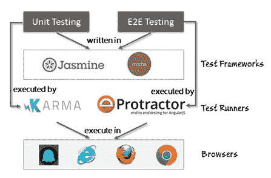
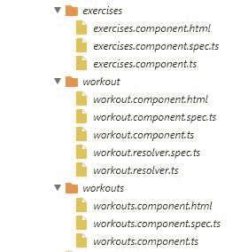
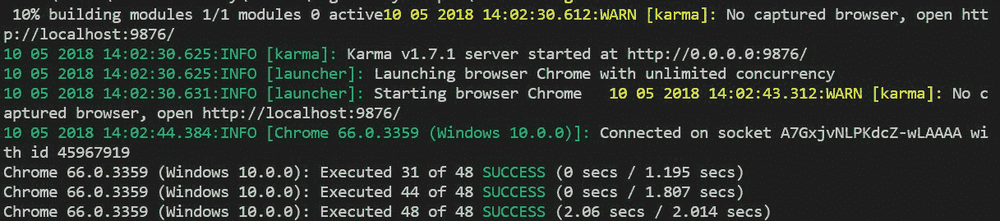
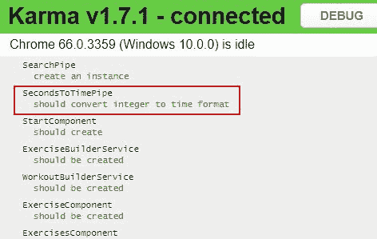
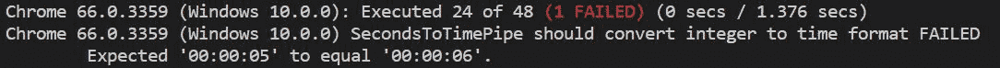
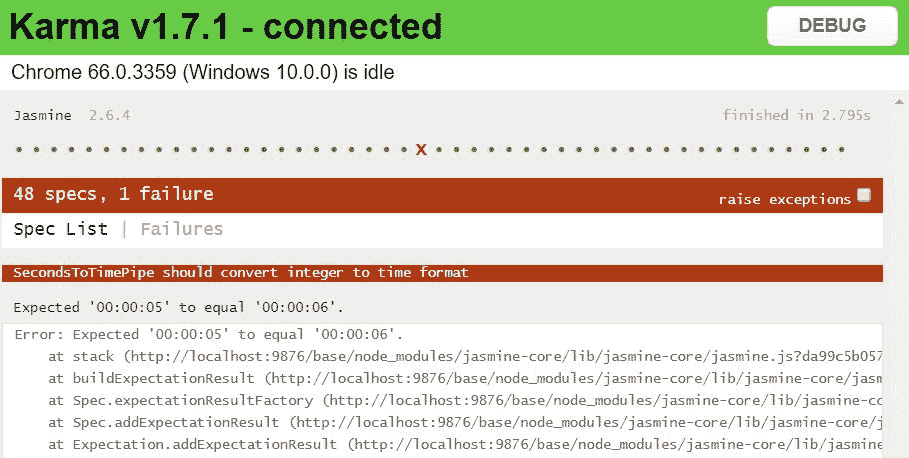
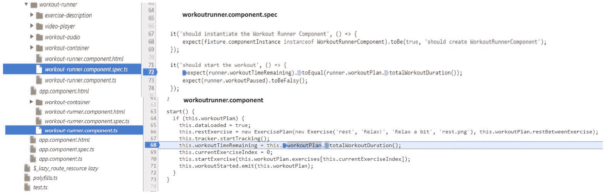

# 测试个人教练

除非您是一位编写代码完美的超级英雄，否则您需要测试您所构建的内容。此外，除非您有大量空闲时间不断测试您的应用程序，否则您需要一些测试自动化。

当我们说 Angular 是以可测试性为设计理念时，我们确实是认真的。它有一个强大的 **依赖注入**（**DI**）框架，一些良好的模拟构造，以及使在 Angular 应用中进行测试变得富有成效的出色工具。

本章全部关于测试，致力于测试本书过程中我们所构建的内容。我们从组件到管道、服务以及我们的应用指令，测试了所有内容。

本章涵盖的主题包括：

+   **理解大局**：我们将尝试理解测试如何融入 Angular 应用开发的整体背景。我们还将讨论 Angular 支持的测试类型，包括单元测试和 **端到端**（**E2E**）测试。

+   **工具和框架概述**：我们将介绍帮助使用 Angular 进行单元测试和端到端测试的工具和框架。这些包括 **Karma** 和 **Protractor**。

+   **编写单元测试**：您将学习如何在浏览器中使用 **Jasmine** 和 **Karma** 进行 Angular 的单元测试。我们将对上一章构建的内容进行单元测试。本节还将教会我们如何对各种 Angular 构造进行单元测试，包括管道、组件、服务和指令。

+   **创建端到端测试**：自动化的端到端测试通过模拟实际用户的行为并通过浏览器自动化来实现。您将学习如何使用 Protractor 结合 WebDriver 进行端到端测试。

让测试开始吧！

当您开始阅读本章时，我们建议您下载 `checkpoint 7.1` 的代码。它可以在 GitHub 上供所有人下载（[`github.com/chandermani/angular6byexample`](https://github.com/chandermani/angular6byexample)）。检查点作为 GitHub 上的分支实现。如果您不使用 Git，可以从此 GitHub 位置下载 `checkpoint7.1` 的快照（ZIP 文件）：[`github.com/chandermani/angular2byexample/archive/checkpoint7.1.zip`](https://github.com/chandermani/angular2byexample/archive/checkpoint7.1.zip)。在首次设置快照时，请参考 `trainer` 文件夹中的 `README.md` 文件。

此检查点包含在前面章节创建组件、服务、管道和指令时由 Angular CLI 生成的测试。我们对这些测试进行了细微的修改，以确保它们都能通过。大部分这些测试都是基本的“Hello World”测试，用于确认组件或其他 Angular 构造的创建。我们将在本章中不涉及这些测试，但鼓励您进行回顾。

# 自动化的需求

随着时间的推移，为网络构建的应用的大小和复杂性都在增长。我们现在构建网络应用的可选方案繁多，令人眼花缭乱。再加上产品/应用的发布周期已经从几个月缩短到几天，甚至每天有多个版本发布！这给软件测试带来了很大的负担。有太多东西需要测试。多个浏览器、多个客户端和屏幕尺寸（桌面和移动）、多个分辨率等等。

在这样一个多样化的环境中要有效，自动化是关键。“*自动化一切可以自动化的内容*”应该是我们的座右铭。

# Angular 中的测试

Angular 团队意识到了可测试性的重要性，因此创建了一个框架，使得基于该框架构建的应用可以轻松进行测试（自动化）。使用 DI 构造来注入依赖的设计选择有助于这一点。随着章节的推进，我们将为我们的应用构建多个测试，这一点将会变得清晰。然而，在那之前，让我们了解在构建该平台上的应用时，我们针对哪些类型的测试。

# 测试类型

对于典型的 Angular 应用，我们主要进行两种形式的测试：

+   **单元测试**：单元测试完全是针对组件进行隔离测试，以验证其行为的正确性。被测试组件的大多数依赖项需要用模拟实现来替换，以确保单元测试不会因为依赖组件的失败而失败。

+   **端到端测试**：这种测试类型完全模拟真实用户的操作，并验证应用的行为。与单元测试不同，组件不是单独测试的。测试是在真实浏览器中针对运行中的系统进行的，断言是基于用户界面状态和显示的内容进行的。

单元测试是防止错误的第一个防线，我们应该能够在单元测试期间用代码解决大多数问题。但除非进行了端到端测试，否则我们无法确认软件是否正确运行。只有当系统中的所有组件以期望的方式交互时，我们才能确认软件是正常工作的；因此，端到端测试成为了一种必需。

你可以将这两种测试类型看作是一个金字塔，端到端测试位于顶部，单元测试位于底部。金字塔表明，你编写的单元测试数量应该远多于端到端测试的数量。原因是，通过单元测试，你将应用分解成小的可测试单元，而通过集成测试，你跨越了从 UI 到后端的多个组件。此外，设置端到端测试通常比单元测试更复杂。

谁编写单元测试和端到端测试，以及何时编写，都是需要回答的重要问题。

# 测试 – 谁来做，何时做？

传统上，端到端测试（E2E testing）是由**质量保证**（**QA**）团队执行的，而开发人员则负责在提交代码前进行单元测试。开发人员也会进行一定程度的端到端测试，但总体来说，端到端测试过程是手动的。

随着形势的变化，现代测试工具，尤其是在网络前端，已经允许开发人员自己编写自动化的端到端测试，并针对任何部署设置（如开发/测试/生产）执行它们。例如，Selenium 与 WebDriver 一起使用，可以轻松实现浏览器自动化，从而使得编写和执行针对真实网络浏览器的端到端测试变得容易。

在开发完成并准备部署时是编写端到端场景测试的好时机。

当涉及到单元测试时，关于何时编写测试存在不同的观点。*测试驱动开发者*在功能实现之前编写测试。其他人则在实现完成后编写测试以确认行为。有些人则在开发组件的同时编写测试。选择一种适合你的风格，同时记住，你编写测试的时间越早，效果越好。

我们不会给出任何建议，也不会就哪种方法更好而争论。任何数量的单元测试都比没有好。我们个人的偏好是采用*中间方法*。在使用测试驱动开发（TDD）时，我们有时觉得测试创建的努力因为规格/需求的变化而白费。一开始编写的测试容易因为需求变化而需要不断修正。在最后编写单元测试的问题在于，我们的目标是创建符合当前实现的测试。编写的测试是为了测试实现，而不是测试规格。在中间某个地方添加测试对我们来说效果最好。

现在我们来了解一下可用于 Angular 测试的工具和技术环境。

# Angular 测试生态系统

看一下以下图表，了解支持 Angular 测试的工具和框架：



支持 Angular 测试的工具和框架

如我们所见，我们使用单元测试库，如**Jasmine**或**Mocha**来编写测试。

目前，Angular 测试库默认与*Jasmine*一起工作。然而，Angular 团队已经表明，他们已经使框架更加通用，这样你就可以使用其他测试库，如 Mocha。Angular 文档尚未更新以包含如何做到这一点。有关使用 Mocha 与 Angular CLI 测试命令的讨论，请参阅[`github.com/angular/angular-cli/issues/4071`](https://github.com/angular/angular-cli/issues/4071)。

这些测试根据我们是否编写单元测试或集成测试，由 Karma 或 Protractor 执行。这些测试运行器反过来在浏览器（如 Chrome、Firefox、IE）或无头浏览器（如 PhantomJS）中运行我们的测试。重要的是要强调，不仅端到端测试，单元测试也是在真实浏览器中执行的。

本章中的所有测试都是使用 Jasmine 编写的（包括单元测试和集成测试）。Karma 将作为单元测试的测试运行器，而 Protractor 将用于端到端测试。

# 开始使用单元测试

单元测试的最终目的是在隔离状态下测试特定的代码/组件，以确保组件按照规范工作。这减少了组件与其他软件部分集成时出现失败/错误的机会。在我们开始编写测试之前，有一些指导原则可以帮助我们编写良好且可维护的测试：

+   一个单元应该测试一个行为。出于明显的原因，每个单元测试测试一个行为是有意义的。失败的单元测试应清楚地突出问题区域。如果一起测试多个行为，失败的测试需要更多的调查来确定违反了哪个行为。

+   单元测试中的依赖项应使用测试替身（如模拟、模拟或 st）来模拟。正如其名所示，单元测试应该测试单元，而不是其依赖项。

+   单元测试不应该永久改变被测试组件的状态。如果发生了这种情况，其他测试可能会受到影响。

+   单元测试的执行顺序应该是无关紧要的。一个单元测试不应该依赖于另一个单元测试在它之前执行。这是脆弱单元测试的迹象。这也可能意味着依赖项没有被模拟。

+   单元测试应该快速。如果它们不够快，开发者就不会运行它们。这是一个在单元测试中模拟所有依赖项（如数据库访问、远程 Web 服务调用等）的好理由。

+   单元测试应尝试覆盖所有代码路径。代码覆盖率是一个可以帮助我们评估单元测试有效性的指标。如果在测试期间覆盖了所有正面和负面场景，覆盖率确实会更高。在此提醒一点：高代码覆盖率并不意味着代码没有错误，但低覆盖率明显表明单元测试中未覆盖的区域。

+   单元测试应测试正面和负面场景。只是不要只关注正面测试用例；所有软件都可能失败，因此单元测试失败场景与成功场景一样重要。

这些指导原则不是框架特定的，但为我们编写良好测试提供了足够的弹药。让我们通过设置单元测试所需的组件来开始单元测试的过程。

# 为单元测试设置 Karma 和 Jasmine

当我们使用 Angular CLI 创建项目时，CLI 会配置使用 Karma 和 Jasmine 对我们的代码进行单元测试的设置。它是通过向我们的项目中添加几个 Karma 和 Jasmine 模块来实现的。它还在应用程序的根目录 `trainer/` 中添加了一个名为 `karma.config.js` 的 Karma 配置文件，并在 `trainer/src` 目录中添加了一个名为 `tests.ts` 的文件。CLI 在运行时使用这些文件来创建执行我们的测试的配置。这意味着我们可以通过简单地使用以下命令来运行我们的测试：

```js
ng test
```

CLI 还会监视我们的测试以检测更改，并自动重新运行它们。

我们在这里不会详细讲解配置文件。默认设置对我们的目的来说已经足够了。有关各种 Karma 配置选项的更多信息，请参阅 Karma 文档（[`karma-runner.github.io/1.0/config/configuration-file.html`](http://karma-runner.github.io/1.0/config/configuration-file.html)）。

# 我们测试文件的组织和命名

要对应用程序进行单元测试，我们应该为项目中计划测试的每个 TypeScript 文件有一个测试文件（例如 `workout-runner.spec.ts`）。这正是 Angular CLI 为我们做的事情。当我们使用 CLI 创建组件、服务、管道或指令时，CLI 将生成相应的测试并将其放置在相同的文件目录中。

使用被测试文件名称加上 `.spec` 来命名测试文件是使用 Jasmine 进行测试的开发者所采用的一种约定。它也用于便于我们在之前概述的配置步骤中映射文件到测试。

此测试文件包含对应组件的单元测试规范，如下面的截图所示（在运行单元测试时在 Karma 调试器中捕获）：



# 单元测试 Angular 应用程序

在本书的整个过程中，我们构建了涵盖 Angular 中每个构造的组件。我们构建了组件、管道、一些服务，最后还有一些指令。所有这些都可以在单元测试中进行测试。

本章剩余的代码可以在 `checkpoint 7.2` 中找到。它可以在 GitHub 上供每个人下载（[`github.com/chandermani/angular6byexample`](https://github.com/chandermani/angular6byexample)）。检查点作为 GitHub 上的分支实现。如果您不使用 Git，可以从以下 GitHub 位置下载 `checkpoint7.2` 的快照（ZIP 文件）：[`github.com/chandermani/angular2byexample/archive/checkpoint7.1.zip`](https://github.com/chandermani/angular2byexample/archive/checkpoint7.1.zip)。在首次设置快照时，请参考 `trainer` 文件夹中的 `README.md` 文件。

为了熟悉使用 Jasmine 进行单元测试，让我们首先测试最小且最简单的组件：管道。

# 单元测试管道

管道是最容易测试的，因为它们对其他构造的依赖最小或为零。我们为*Workout Runner*（*7 分钟锻炼*应用程序）创建的`SecondsToTimePipe`没有依赖关系，可以轻松地进行单元测试。

查看 Jasmine 框架文档，了解如何使用 Jasmine 编写单元测试。CLI 正在使用 Jasmine 2.6 进行我们的单元测试（[`jasmine.github.io/2.6/introduction.html`](http://jasmine.github.io/2.0/introduction.html)）。Jasmine 拥有一些最好的文档，并且整个框架非常直观易用。我们强烈建议您访问 Jasmine 网站，在继续之前熟悉这个框架。

在`trainer/src/app/shared`文件夹中打开`seconds-to-time.pipe.spec.ts`文件，并按照以下方式更新那里的单元测试：

```js
import { SecondsToTimePipe } from './seconds-to-time.pipe';
describe('SecondsToTimePipe', () => {
  const pipe = new SecondsToTimePipe();
  it('should convert integer to time format', () => {
      expect(pipe.transform(5)).toEqual('00:00:05');
      expect(pipe.transform(65)).toEqual('00:01:05');
      expect(pipe.transform(3610)).toEqual('01:00:10');
  });
});
```

让我们看看在我们的测试文件中我们正在做什么。

毫不奇怪，我们导入了`SecondsToTimePipe`，这是我们将要测试的。这就像我们在 TypeScript 类中其他地方使用的导入一样。请注意，我们使用了一个相对路径来指向该文件的位置 `'./seconds-to-time.pipe'`。在 Angular 中，这意味着在测试本身所在的目录中查找要测试的组件。如您所回忆的，这是我们设置文件结构的方式：将我们的测试放在与被测试文件相同的目录中。

在下一行，我们开始使用 Jasmine 语法。首先，我们用`describe`函数包裹测试以标识测试。这个函数的第一个参数是对测试的用户友好描述；在这种情况下，它是`SecondsToTimePipe`。对于第二个参数，我们传递一个 lambda（胖箭头）函数，它将包含我们的测试。在设置一个本地变量来保存管道后，我们调用 Jasmine 的`beforeEach`函数，并使用它来注入我们的管道实例。

由于`beforeEach`函数在`describe`函数中的每个测试之前运行，我们可以用它来运行每个测试中都会运行的公共代码。在这种情况下，它不是严格必要的，因为我们的`describe`函数中只有一个测试。但养成使用它的习惯是一个好主意，正如我们将看到的那样。

接下来，我们调用 Jasmine 的`it`函数，并传递一个标题，以及三个对 Jasmine 的`expect`函数（Jasmine 对断言的称呼）的调用。这些都是不言自明的。

在我们的测试中不需要显式导入这些 Jasmine 函数。

# 运行我们的测试文件

现在是时候使用以下命令运行我们的测试了：

```js
ng test
```

Angular CLI 将把我们的 TypeScript 文件转换为 JavaScript，并监视这些文件的变化。

我们应该在终端窗口中看到这个输出（对于您来说，测试的总数可能不同）：



最后一行显示我们的测试成功通过（以及我们所有的其他测试）。

您还可以在 Karma 运行我们的测试时它启动的浏览器窗口中查看测试结果：



你会注意到这里，Karma 显示了用于我们管道测试的 `describe` 语句（SecondsToTimePipe），并且在其下嵌套了 `it` 语句（应将整数转换为时间格式），以展示我们创建的测试的预期结果。以显示的格式读取结果使得理解测试结果变得非常容易。

为了确保它报告正确的通过/失败结果，让我们在测试中做一个更改，导致其中一个期望失败。将第一个期望中的时间从五秒更改为六秒，如下所示：

```js
expect(pipe.transform(5, [])).toEqual('00:00:06'); 
```

我们得到以下错误消息：



这个错误消息的优点是它将 `describe` 和 `it` 描述合并成一个完整的句子，提供了对错误的清晰总结。这显示了 Jasmine 如何允许我们编写可读的测试，以便新接触我们代码的人可以快速理解其中可能出现的任何问题。下一行显示了哪个期望未满足，期望的是什么，以及实际结果是什么，这些结果没有满足这个期望。

在此消息下方，我们还得到一个堆栈跟踪和一个显示我们测试总体结果的最后一条线：


在浏览器中，我们看到以下内容：



你会注意到，当我们更改测试时，我们不必重新运行 Karma。相反，它监视我们文件和相关测试的任何更改，并在我们做出更改时立即报告成功或失败。

非常酷！让我们撤销我们做的最后一个更改，将测试恢复到通过状态。

# 单元测试组件

测试 Angular 组件比测试简单的管道或服务更复杂。这是因为 Angular 组件与视图相关联，并且通常比服务、过滤器或指令有更多的依赖项。

# Angular 测试实用工具

由于它们的复杂性，Angular 引入了使我们可以更容易地测试组件的实用工具。这些测试实用工具包括 `TestBed` 类（我们之前用来初始化测试的）和 `@angular/core/testing` 中的几个辅助函数。

`TestBed` 有一个 `createComponent` 方法，它返回一个包含多个成员和方法的 `ComponentFixture`，包括：

+   `debugElement`：用于调试组件

+   `componentInstance`：用于访问组件属性和方法

+   `nativeElement`：用于访问视图的标记和其它 DOM 元素

+   `detectChanges`：用于触发组件的变更检测周期

`ComnponentFixture` 还包含用于覆盖组件视图、指令、绑定和提供者的方法。从现在开始，我们将在剩余的测试中使用 `TestBed`。

`TestBed` 有一个名为 `configureTestingModule` 的方法，我们可以使用它来设置我们的测试作为一个单独的模块。这意味着我们可以绕过初始引导过程，并在我们的测试文件中编译要测试的组件。我们还可以使用 `TestBed` 来指定额外的依赖项并识别我们需要的提供者。

根据 Angular 文档（https://angular.io/guide/testing#testbed-class-summary），在 `beforeEach` 中调用 `TestBed` 方法对于确保每个单独测试前的全新开始非常重要。

# 在我们的测试中管理依赖项

Angular 中的组件将视图与所有其他内容集成。因此，与任何服务、过滤器或指令相比，组件通常有更多的依赖项。

尽管我们的单元测试专注于组件内部的代码，但我们仍然需要在测试中考虑这些依赖项，否则测试将失败（我们跳过了管道测试的依赖项设置，因为它没有外部依赖）。

处理这些依赖项有两种方法：将它们注入到我们的组件中或为它们创建一个模拟或伪造，我们可以在测试中使用它。如果一个依赖项足够简单，我们只需将其实例注入到测试类中即可。然而，如果一个依赖项非常复杂，特别是如果它有自己的依赖项并且/或者进行远程服务器调用，那么我们应该模拟它。Angular 测试库为我们提供了进行此操作的工具。

我们在本节计划测试的组件是 `WorkoutRunner` 组件。位于 `trainer/src/components/workout-runner/` 中，这是运行特定锻炼的组件。

# 单元测试 WorkoutRunnerComponent

在这个背景下，让我们开始对 `WorkoutRunnerComponent` 进行单元测试。

首先，打开 `workout-runner-component.spec.ts` 并更新导入如下：

```js
import { inject, fakeAsync, async, tick, TestBed, discardPeriodicTasks } from '@angular/core/testing';
import { NO_ERRORS_SCHEMA } from '@angular/core';
import { Router } from '@angular/router';
import { of } from 'rxjs/observable/of';

import { WorkoutPlan, ExercisePlan, Exercise } from '../core/model';
import { WorkoutRunnerComponent } from './workout-runner.component';
import { SecondsToTimePipe } from '../shared/seconds-to-time.pipe';
import { WorkoutService } from '../core/workout.service';
import { WorkoutHistoryTrackerService } from '../core/workout-history-tracker.service';
```

这些导入标识了我们在测试中将使用的测试工具（以及来自 `RxJS` 的 `Router` 和 `of` 等东西），以及我们的组件所需的类型和依赖项。我们稍后会讨论这些依赖项。其中一个与其他导入不同的导入是导入 `@angular/core` 中的 `NO_ERRORS_SCHEMA`。我们将使用这个导入来忽略我们不会测试的组件中的元素。同样，我们稍后会进一步讨论这一点。

关于导入还有一点需要注意，即 `@angular/core/testing` 是核心模块的一部分，而不是单独的测试模块。这是 Angular 测试导入的常见模式。例如，当我们到达 HTTP 测试时，你会看到我们是从 `@angular/http/testing` 导入的。

# 设置组件依赖项

接下来，我们需要确定我们的组件依赖项，并确定我们是否需要注入或模拟它们。如果我们查看 `WorkoutRunner` 组件的代码，我们会看到有三个依赖项被注入到我们的组件中：

+   `WorkoutHistoryTracker`：这是一个附加了一些行为的组件。因此，我们肯定想要模拟它。

+   `Router`：我们也必须模拟这个，以便将`WorkoutRunner`与应用程序的其余部分隔离开来，并防止我们的测试尝试从`WorkoutRunner`视图中导航离开。

+   `WorkoutService`：这是一个我们将用它来发起 HTTP 调用以检索我们的锻炼的服务。我们也将模拟这个服务，因为我们不希望在测试中向外部系统发起调用。

# 模拟依赖 - 锻炼历史跟踪器

Angular 允许我们使用简单的类以直接的方式模拟我们的依赖。让我们从模拟`WorkoutHistoryTracker`开始。为此，在导入之后添加以下类：

```js
class MockWorkoutHistoryTracker { 
    startTracking() {} 
    endTracking() {} 
    exerciseComplete() {} 
} 
```

我们不需要模拟整个`WorkoutHistoryTracker`类，而只需要模拟`WorkoutRunner`将要调用的方法。在这种情况下，这些方法包括`startTracking()`、`endTracking()`和`exerciseComplete()`。我们已经将这些方法设置为空，因为我们不需要从它们那里返回任何内容来测试`WorkoutRunner`。现在我们可以将这个虚拟实现注入到`WorkoutRunner`中，无论它在何处寻找`WorkoutHistoryTracker`。

# 模拟依赖 - 锻炼服务

在第五章“支持服务器数据持久性”中，我们扩展了锻炼服务以进行远程调用以检索填充锻炼的数据。为了对锻炼运行器进行单元测试，我们希望用返回一些静态数据的模拟实现来替换这个调用，这样我们就可以使用这些数据来运行测试。因此，我们将添加第三个模拟类，如下所示：

```js
class MockWorkoutService {

    sampleWorkout = new WorkoutPlan(
         'testworkout',
         'Test Workout',
          40,
          [
              new ExercisePlan(new Exercise( 'exercise1', 'Exercise 1', 'Exercise 1 description', 
                                               '/image1/path', 'audio1/path'), 50),
              new ExercisePlan(new Exercise( 'exercise1', 'Exercise 2', 'Exercise 2 description', 
                                               '/image2/path', 'audio2/path'), 30),
              new ExercisePlan(new Exercise( 'exercise1', 'Exercise 3', 'Exercise 3 description', 
                                               '/image3/path', 'audio3/path'), 20)
          ],
          'This is a test workout'
    );

    getWorkout(name: string) {
        return of(this.sampleWorkout);
    }
    totalWorkoutDuration() {
        return 180;
    }
} 
```

注意，`getWorkout`方法返回了一个`Observable`，正如使用`of`操作符所示。否则，这个类是自解释的。

# 模拟依赖 - 路由

就像`WorkoutHistoryTracker`和`WorkoutService`一样，我们也将使用模拟来处理我们对 Angular 路由的依赖。但在这里，我们将采取一种稍微不同的方法。我们将把一个 Jasmine spy 分配给我们的模拟上的`navigate`方法：

```js
export class MockRouter {
    navigate = jasmine.createSpy('navigate');
}
```

这对于我们的目的来说已经足够了，因为我们只想确保路由器的`navigate`方法是以适当的路由（`finished`）作为参数被调用的。Jasmine 的 spy 将允许我们做到这一点，就像我们稍后将要看到的那样。

# 使用 TestBed 配置我们的测试

现在我们已经处理好了导入和依赖，让我们开始进行测试本身。我们首先添加一个 Jasmine `describe`函数来包装我们的测试，然后使用`let`设置两个局部变量：一个用于`fixture`，另一个用于`runner`：

```js
describe('Workout Runner', () =>{ 
    let fixture:any; 
    let runner:any; 
```

接下来，我们将添加一个`beforeEach`函数来设置我们的测试配置：

```js
beforeEach( async(() =>{ 
    TestBed 
        .configureTestingModule({ 
            declarations: [ WorkoutRunnerComponent, SecondsToTimePipe ], 
            providers: [ 
                {provide: Router, useClass: MockRouter}, 
                {provide: WorkoutHistoryTracker ,useClass: 
                MockWorkoutHistoryTracker}, 
                {provide: WorkoutService ,useClass: MockWorkoutService} 
            ], 
            schemas: [ NO_ERRORS_SCHEMA ] 
        }) 
        .compileComponents() 
        .then(() => { 
            fixture = TestBed.createComponent(WorkoutRunnerComponent); 
            runner = fixture.componentInstance; 
        }); 
}));  
```

`beforeEach`方法在每个测试之前执行，这意味着我们只需要在我们的测试文件中设置一次。在`beforeEach`内部，我们添加一个`async`调用。这是必需的，因为我们正在调用异步的`compileComponents`方法。

Angular 文档表明，`async`函数安排测试者的代码在一个特殊的`async`测试区域内运行，这个区域隐藏了异步执行的机制，就像它传递给`it`测试时一样。有关更多信息，请参阅`https://angular.io/docs/ts/latest/guide/testing.html#!#async-in-before-each`。我们将在稍后详细讨论这一点。

让我们按照它们执行的顺序逐一查看每个方法调用。第一个方法是`configureTestingModule`，它允许我们在测试模块的基本配置上构建，并添加诸如导入、声明（我们将在测试中使用的组件、指令和管道）和提供者等。在我们的测试中，我们首先添加了关于锻炼运行者、我们正在测试的组件以及`SecondsToTimePipe`的声明：

```js
declarations: [ WorkoutRunnerComponent, SecondsToTimePipe ], 
```

然后我们为我们的`Router`、`WorkoutHistoryTracker`和`WorkoutService`添加了三个提供者：

```js
providers: [ 
    {provide: Router, useClass: MockRouter}, 
    {provide: WorkoutHistoryTracker ,useClass: MockWorkoutHistoryTracker}, 
    {provide: WorkoutService ,useClass: MockWorkoutService} 
], 
```

对于这些提供者中的每一个，我们将`useClass`属性设置为我们的模拟而不是实际组件。现在，在我们的测试中，当`WorkoutRunner`需要这些组件中的任何一个时，将使用模拟。

下一个配置可能看起来有点神秘：

```js
schemas: [ NO_ERRORS_SCHEMA ] 
```

这个设置允许我们绕过与我们在组件模板中使用的两个组件（`ExerciseDescriptionComponent`和`VideoPlayerComponent`）相关的自定义元素可能产生的错误。在这个阶段，我们不想在`WorkoutRunnerComponent`的测试中测试这些组件。相反，我们应该单独测试它们。然而，需要注意的是，当你使用这个设置时，它将抑制与测试组件模板中的元素和属性相关的所有模式错误；因此，它可能会隐藏你希望看到的其他错误。

当你使用`NO_ERRORS_SCHEMA`设置测试时，你正在创建一个所谓的浅测试，它不会深入到你正在测试的组件。浅测试允许你减少你正在测试的组件模板中的复杂性，并减少对模拟依赖的需求。

我们测试配置的最后一步是编译和实例化我们的组件：

```js
.compileComponents() 
.then(() => { 
    fixture = TestBed.createComponent(WorkoutRunnerComponent); 
    runner = fixture.componentInstance; 
}); 
```

如前所述，我们在`beforeEach`方法中使用了一个`async`函数，因为当我们调用`compileComponents`方法时这是必需的。这个方法调用是异步的，我们需要在这里使用它，因为我们的组件有一个外部模板，该模板在`templateUrl`中指定。此方法编译该外部模板，然后将其内联，以便它可以由`createComponent`方法（它是同步的）使用来创建我们的组件固定装置。这个组件固定装置反过来包含一个`componentInstance`-`WorkoutRunner`。然后我们将`fixture`和`componentInstance`都分配给局部变量。

如前所述，我们正在使用的`async`函数创建了一个特殊的`async`测试区域，我们的测试将在其中运行。你会注意到这个函数是从正常的`async`编程中简化的，并允许我们做一些事情，比如使用`.then`运算符而不返回一个承诺。

你也可以在单个测试方法内编译和实例化测试组件。但`beforeEach`方法允许我们为所有测试执行一次操作。

现在我们已经配置了测试，让我们继续对`WorkoutRunner`进行单元测试。

# 开始单元测试

从加载数据到过渡到练习、暂停锻炼和运行练习视频，`WorkoutRunner`有许多方面我们可以进行测试。`workout.spec.ts`文件（位于`trainer/src/components/workout-runner`文件夹下）包含了一系列单元测试，覆盖了上述场景。我们将选择其中一些测试并逐一进行。

首先，让我们添加一个测试用例来验证一旦组件加载，锻炼就开始运行：

```js
it('should start the workout', () => { 
    expect(runner.workoutTimeRemaining).toEqual(runner.workoutPlan.totalWorkoutDuration()); 
    expect(runner.workoutPaused).toBeFalsy(); 
});  
```

此测试断言锻炼的总时长正确，锻炼处于运行状态（即，没有暂停）。

因此，让我们执行测试。它失败了（检查 Karma 控制台）。奇怪！所有依赖项都已正确设置，但第二个`expect`函数在`it`块中仍然失败，因为它未定义。

我们需要调试这个测试。

# 在 Karma 中调试单元测试

在 Karma 中调试单元测试很容易，因为测试是在浏览器中运行的。我们像调试标准 JavaScript 代码一样调试测试。由于我们的 Karma 配置已将我们的 TypeScript 文件映射到我们的 JavaScript 文件，我们可以直接在 TypeScript 中进行调试。

当 Karma 启动时，它会打开一个特定的浏览器窗口来运行测试。要调试 Karma 中的任何测试，我们只需点击浏览器窗口顶部的调试按钮。

Karma 打开了一个窗口，当我们点击调试时又打开了一个窗口；我们也可以使用原始窗口进行测试，但原始窗口连接到 Karma 并执行实时刷新。此外，原始窗口中的脚本文件带有时间戳，每次更新测试时都会改变，因此我们需要再次设置断点来测试。

一旦我们点击调试，就会打开一个新的标签页/窗口，其中加载了所有测试和其他应用程序脚本以供测试。这些是在`karma.conf.js`文件配置设置期间定义的脚本。

为了调试前面的失败，我们需要在两个位置添加断点。一个应该添加在测试本身内部，另一个应该添加在`WorkoutComponent`内部，在那里它加载锻炼并将数据分配给适当的局部变量。

执行以下步骤在 Google Chrome 中添加断点：

1.  通过点击 Karma 启动时加载的窗口上的调试按钮，打开 Karma 调试窗口/标签页。

1.  按下 F12 键打开开发者控制台。

1.  前往“源”标签页，你的应用程序的 TypeScript 文件将位于`source`文件夹中。

1.  我们现在可以通过单击行号来在所需位置设置断点。这是调试任何脚本的常规机制。在以下突出显示的位置添加断点：



1.  我们刷新调试页面（我们在点击调试按钮时打开的页面）。`workout-runner.ts`中的断点从未被触发，导致测试失败。

我们忽略的是，我们试图访问的代码位于`workout-runner`的`start`方法中，而`start`方法并没有在构造函数中被调用。相反，它在通过在`ngOnInit`中调用`getWorkout`方法加载锻炼数据之后，在`ngDoCheck`中被调用。在你的测试中添加对`ngOnInit`和`ngDoCheck`的调用，如下所示：

```js
        it('should start the workout', () => { 
 runner.ngOnInit(); runner.ngDoCheck(); 
            expect(runner.workoutTimeRemaining).toEqual(
                   runner.workoutPlan.totalWorkoutDuration()); 
            expect(runner.workoutPaused).toBeFalsy(); 
        }); 
```

1.  保存更改后，Karma 将再次运行测试。这次它将通过。

随着测试数量的增加，单元测试可能需要我们专注于特定的测试或特定的测试套件。Karma 允许我们通过在现有的`it`块前添加`f`来定位一个或多个测试；也就是说，`it`变成了`fit`。如果 Karma 发现带有`fit`的测试，它只会执行这些测试。同样，可以通过在现有的`describe`块前添加`f`来定位特定的测试套件：`fdescribe`。此外，如果你在`it`块前添加`x`，使其变为`xit`，那么该块将被跳过。

让我们继续对组件进行单元测试！

# 单元测试 WorkoutRunner 继续...

我们还能测试哪些有趣的事情呢？我们可以测试是否开始了第一个练习。我们在刚刚添加的测试之后，将这个测试添加到`workout.spec.ts`中：

```js
it('should start the first exercise', () => { 
    spyOn(runner, 'startExercise').and.callThrough(); 
    runner.ngOnInit(); 
    runner.ngDoCheck(); 
    expect(runner.currentExerciseIndex).toEqual(0); 
    expect(runner.startExercise).toHaveBeenCalledWith(
    runner.workoutPlan.exercises[runner.currentExerciseIndex]); 
    expect(runner.currentExercise).toEqual(
    runner.workoutPlan.exercises[0]); 
}); 
```

这个测试中的第二个`expect`函数很有趣。它使用了 Jasmine 的一个特性：间谍。间谍可以用来验证方法调用和依赖关系。

# 使用 Jasmine 间谍来验证方法调用

间谍是一个拦截它所监视的函数每个调用的对象。一旦调用被拦截，它可以选择返回固定数据或将调用传递给实际被调用的函数。它还记录了调用调用详情，这些详情可以在之后的`expect`中使用，就像我们在前面的测试中所做的那样。

间谍非常强大，可以在单元测试期间以多种方式使用。查看有关间谍的文档[`jasmine.github.io/2.0/introduction.html#section-Spies`](http://jasmine.github.io/2.0/introduction.html#section-Spies)，了解更多信息。

第二个`expect`函数验证了当锻炼开始时调用了`startExercise`方法（`toHaveBeenCalledWith`）。它还断言了传递给函数的参数的正确性。第二个`expect`语句使用间谍断言行为，但我们需要首先设置间谍以使这个断言生效。

在这种情况下，我们使用间谍来模拟对`startExercise`方法的调用。我们可以使用间谍来确定方法是否被调用以及调用时使用了什么参数，使用 Jasmine 的`toHaveBeenCalledWith`函数。

查看 Jasmine 文档中的`toHaveBeenCalled`和`toHaveBeenCalledWith`函数，了解更多关于这些断言函数的信息。

在这里，方法是以当前`Exercise`作为参数被调用的。由于之前的`expect`确认这是第一个练习，这个`expect`确认启动第一个练习的调用已经执行。

在这里有几个需要注意的事项。首先，你必须小心地将`spyOn`的设置放在调用`ngOnInit`之前。否则，当调用`startExercise`方法时，间谍将不会进行*监视*，并且方法调用不会被捕获。

第二，由于间谍是一个模拟，我们通常无法在`startExercise`方法内部进行验证。这是因为该方法本身正在被模拟。这意味着我们实际上无法验证`currentExercise`属性是否已经设置，因为这是在模拟的方法内部完成的。然而，Jasmine 允许我们使用`and.callThrough`将间谍链式调用，这意味着除了跟踪方法的调用外，它还会委托到实际实现。这样我们就可以测试`currentExercise`是否在`startExercise`方法内部也正确设置了。

# 使用 Jasmine 间谍验证依赖项

虽然我们只是使用间谍来验证我们类内部的方法调用，但 Jasmine 间谍在模拟外部依赖的调用时也非常有用。但为什么要测试对我们外部依赖的调用呢？毕竟，我们试图将测试限制在组件本身上！

答案是我们模拟一个依赖项以确保依赖项不会对测试中的组件产生不利影响。从单元测试的角度来看，我们仍然需要确保这些依赖项在正确的时间以正确的输入被测试组件调用。在 Jasmine 的世界里，间谍帮助我们断言依赖项是否被正确调用。

如果我们查看`WorkoutRunner`的实现，每当锻炼开始时，我们都会发出一个包含锻炼详情的消息。外部依赖项`WorkoutHistoryTracker`订阅了这个消息/事件。所以让我们创建一个间谍并确认当锻炼开始时`WorkoutHistoryTracker`也开始了。

在前一个`it`块之后添加这个`it`块：

```js
it("should start history tracking", inject([WorkoutHistoryTracker], (tracker: WorkoutHistoryTracker) => { 
     spyOn(tracker, 'startTracking'); 
     runner.ngOnInit(); 
     runner.ngDoCheck(); 
     expect(tracker.startTracking).toHaveBeenCalled(); 
 })); 
```

在`it`块内部，我们添加了对`tracker`的监视，它是`WorkoutHistoryTracker`的一个本地实例。然后我们使用这个间谍来验证那个依赖项的`startTracking`方法已经被调用。简单且表达清晰！

你可能记得我们在这里使用的是`MockHistoryWorkoutTracker`；它包含一个模拟，一个空的`startTracking`方法，它不返回任何内容。这是可以的，因为我们不是在测试`WorkoutHistoryTracker`本身，而是在测试`WorkoutRunner`对其的调用方法。这个测试展示了能够将模拟与间谍结合使用来完全测试`WorkoutRunner`的内部工作方式，独立于其依赖项是多么有用。

# 测试事件发射器

检查`WorkoutRunner`的代码，我们发现它设置了几个事件发射器，其中一个是用于`workoutStarted`的如下所示：

```js
@Output() workoutStarted: EventEmitter<WorkoutPlan> = new EventEmitter<WorkoutPlan>(); 
```

Angular 文档将事件发射器描述为一个输出属性，它触发我们可以通过事件绑定来订阅的事件。在第二章*构建我们的第一个应用 - 7 分钟锻炼*中，我们详细描述了在 Workout Runner 中使用事件发射器的方式。因此，我们对它们的作用有很好的理解。但我们如何对事件发射器进行单元测试，并确定它们是否以我们期望的方式触发事件呢？

实际上做起来相当简单。如果我们记得事件发射器是一个我们可以订阅的 Observable Subject，我们就会意识到我们可以在单元测试中简单地订阅它。让我们回顾一下验证锻炼开始的那个测试，并向其中添加高亮代码：

```js
it('should start the workout', () => { 
 runner.workoutStarted.subscribe((w: any) => { expect(w).toEqual(runner.workoutPlan); }); 
    runner.ngOnInit(); 
    runner.ngDoCheck(); 
    expect(runner.workoutTimeRemaining).toEqual(
    runner.workoutPlan.totalWorkoutDuration()); 
    expect(runner.workoutPaused).toBeFalsy(); 
}); 
```

我们注入了`WorkoutService`，并添加了对`WorkoutStarted`事件发射器的订阅和一个期望检查，以查看当事件被触发时属性是否正在发射`WorkoutPlan`。订阅被放置在`ngOnInit`之前，因为这个方法会导致`workoutStarted`事件被触发，我们需要在它发生之前设置我们的订阅。

# 测试间隔和超时实现

我们面临的一个有趣的挑战是验证锻炼随着时间的流逝而进展。`Workout`组件使用`setInterval`来随着时间推进。我们如何在不实际等待的情况下模拟时间呢？

答案是 Angular 测试库的`fakeAsync`函数，它允许我们以同步的方式运行本应异步执行的代码。它是通过将待执行的函数包裹在`fakeAsync`区域中实现的。然后它支持在该区域内使用同步计时器，并允许我们使用`tick()`函数模拟异步时间的流逝。

更多关于`fakeAsync`的信息，请参阅 Angular 文档中的[`angular.io/guide/testing#async-test-with-fakeasync.`](https://angular.io/guide/testing#async-test-with-fakeasync)

让我们看看如何使用`fakeAsync`函数来测试我们代码中的超时和间隔实现。将以下测试添加到`workout-runner.spec.ts`中：

```js
    it('should increase current exercise duration with time', fakeAsync(() => {
        runner.ngOnInit();
        runner.ngDoCheck();
        expect(runner.exerciseRunningDuration).toBe(0);
        tick(1000);
        expect(runner.exerciseRunningDuration).toBe(1);
        tick(1000);
        expect(runner.exerciseRunningDuration).toBe(2);
        tick(8000);
        expect(runner.exerciseRunningDuration).toBe(10);
        discardPeriodicTasks();
    })); 
```

除了注入`WorkoutRunner`之外，我们首先使用`fakeAsync`包装测试。然后我们调用`WorkoutRunner`的`ngOnInit`方法。这将在`WorkoutRunner`内部启动练习的计时器。然后在测试中，我们使用设置在不同时间段的`tick()`函数来测试练习计时器的操作，并确保它以我们期望的持续时间继续运行。使用`tick()`允许我们快速前进通过代码，避免异步运行代码时需要等待几秒钟才能完成练习。

最后，我们调用`discardPeriodicTasks()`。这是 Angular 测试实用工具之一，它可以与`fakeAsync`一起使用来清除任务队列中可能存在的任何挂起的计时器。

更多关于这些和其他 Angular 测试实用工具的信息可以在[`angular.io/guide/testing#testing-utility-apis`](https://angular.io/guide/testing#testing-utility-apis)找到。

让我们尝试另一个类似的测试。我们想要确保`WorkoutRunner`能够正确地从一项练习过渡到下一项练习。请将以下测试添加到`workout-runner.ts`中：

```js
it("should transition to next exercise on one exercise complete", fakeAsync(() => { 
    runner.ngOnInit(); 
    runner.ngDoCheck(); 
    let exerciseDuration = runner.workoutPlan.exercises[0].duration; 
    TestHelper.advanceWorkout(exerciseDuration); 
    expect(runner.currentExercise.exercise.name).toBe('rest'); 
    expect(runner.currentExercise.duration).toBe(
    runner.workoutPlan.restBetweenExercise); 
    discardPeriodicTasks();
})); 
```

我们再次使用`fakeAsync`包装测试并调用`runner.ngOnInit`来启动计时器。然后我们获取第一项练习的持续时间，并在随后的`TestHelper`方法中使用`tick()`函数将计时器推进超过该练习持续时间的一秒。

```js
class TestHelper {
    static advanceWorkout(duration: number) {
        for (let i = 0; i <= duration; i++) {tick(1000);
    }
}
```

接下来，我们测试期望我们现在处于`rest`练习中，因此已经从第一项练习过渡过来。

# 测试锻炼暂停和恢复

当我们暂停锻炼时，它应该停止，时间计数器不应中断。为了检查这一点，请添加以下时间测试：

```js
it("should not update workoutTimeRemaining for paused workout on 
    interval lapse", fakeAsync(() => { 
    runner.ngOnInit(); 
    runner.ngDoCheck(); 
    expect(runner.workoutPaused).toBeFalsy(); 
    tick(1000); 
    expect(runner.workoutTimeRemaining).toBe(
    runner.workoutPlan.totalWorkoutDuration() - 1); 
    runner.pause(); 
    expect(runner.workoutPaused).toBe(true); 
    tick(1000); 
    expect(runner.workoutTimeRemaining).toBe(
    runner.workoutPlan.totalWorkoutDuration() - 1); 
    discardPeriodicTasks();
})); 
```

测试从验证锻炼状态未暂停开始，将时间推进一秒，暂停它，然后验证在暂停后`workoutTimeRemaining`的时间没有变化。

# 单元测试服务

单元测试服务与单元测试组件没有太大区别。一旦我们掌握了如何设置组件及其依赖项（主要使用模拟），将这种学习应用到测试服务上就变成了一件例行公事。通常情况下，挑战在于设置服务的依赖项，以便能够有效地进行测试。

对于进行远程请求（使用`http`或`jsonp`）的服务来说，情况略有不同。在我们可以单独测试此类服务之前，需要进行一些设置。

我们将针对`WorkoutService`编写一些单元测试。由于此服务会向远程请求加载锻炼数据，我们将探讨如何使用模拟 HTTP 后端测试此类服务。Angular 为我们提供了`HttpTestingController`来执行此操作。

# 使用 HttpTestingController 模拟 HTTP 请求/响应

当测试进行远程请求的服务（或者实际上，任何其他 Angular 构造）时，我们显然不希望实际向后端发送请求来检查行为。这甚至都不符合单元测试的标准。后端交互只需要被模拟。Angular 正好提供了这样的功能。使用 `HttpTestingController`，我们拦截 HTTP 请求，模拟来自服务器的实际响应，并断言端点调用。

打开 `workout-service.spec.ts` 并在文件顶部添加以下导入语句：

```js
import { TestBed, inject, async, fakeAsync } from '@angular/core/testing';
import { HttpClientTestingModule, HttpTestingController } from '@angular/common/http/testing';
import { HttpClient, HttpResponse } from '@angular/common/http';

import { WorkoutService } from './workout.service';
import { WorkoutPlan, Exercise } from './model';
```

除了从 `core/testing` 模块导入之外，我们还从 `http/testing` 模块导入了 `HttpClientTestingModule` 和 `HttpTestingController`。我们还导入了我们将要测试的 `WorkoutService` 和 `WorkoutPlan`。

一旦我们设置了导入，我们将开始使用 Jasmine 的 `describe` 语句创建测试，该语句封装了我们的测试，并设置了一些局部变量：

```js
describe('Workout Service', () => { 
  const collectionUrl = '...[mongo connnection url]...';
  const apiKey = '...[mongo key]...';
  const params = '?apiKey=' + apiKey;
  let httpClient: HttpClient;
  let httpTestingController: HttpTestingController;
  let workoutService: WorkoutService;
```

除了为 `HttpClient`、`HttpTestingController` 和 `WorkoutService` 创建局部变量之外，你还会注意到我们为我们的 MongoDB 连接设置了局部变量。为了明确，我们不是设置这些变量以向 MongoDB 发送远程调用，而是为了测试连接属性是否被正确设置。

下一步是设置测试的提供者和依赖注入。为了处理提供者，将以下内容添加到测试文件中：

```js
  beforeEach(() => {
    TestBed.configureTestingModule({
      imports: [HttpClientTestingModule],
      providers: [ WorkoutService ],
    });
    httpClient = TestBed.get(HttpClient);
    httpTestingController = TestBed.get(HttpTestingController);
    workoutService = TestBed.get(WorkoutService);
  });
```

首先，我们调用 `TestBed.configureTestingModule` 来导入 `HttpClientTestingModule` 并添加 `WorkoutService`。根据 Angular 文档（[`angular.io/api/common/http/testing/HttpClientTestingModule`](https://angular.io/api/common/http/testing/HttpClientTestingModule)），`HttpClientTestingModule` 将 `HttpClient` 设置为使用 `HttpClientTestingBackend` 作为 `HttpBackend`。这里的好处是，这种设置完全隐藏在我们的测试设置中，所以我们不需要编写代码来连接它。

接下来，我们使用 `TestBed.get` 方法填充我们的局部变量—`httpClient`、`httpTestingController` 和 `workoutService`。我们还将添加以下 `afterEach` 方法以确保在每个测试完成后没有更多挂起的请求：

```js
 afterEach(() => {
   httpTestingController.verify();
 });
```

在设置好这一切之后，我们现在可以创建针对 `WorkoutService` 的测试，以避免我们进行远程调用。我们将从一个简单的测试开始，确保 `workoutService` 被加载：

```js
it('should be created', inject([WorkoutService], (service: WorkoutService) => {
   expect(service).toBeTruthy();
 }));
```

虽然这个测试可能看起来微不足道，但将其放在这里很重要，因为它作为一个检查，确保我们已经正确设置了配置。

接下来，我们将添加以下测试以确保我们能够在实例化 `WorkoutService` 时注入 `HttpClient`：

```js
it('can instantiate service with "new"', inject([HttpClient], (http: HttpClient) => {
    expect(http).not.toBeNull('http should be provided');
    const service = new WorkoutService(http);
    expect(service instanceof WorkoutService).toBe(true, 'new service should be ok');
}));
```

现在，我们将转向测试 workout-service 中的几个方法。首先，我们将确保当调用 `getWorkouts` 方法时，它返回所有锻炼项目。为此，添加以下测试：

```js
  it('should should return all workout plans', () => {
    let expectedWorkouts: WorkoutPlan[];
    let actualWorkouts: WorkoutPlan[];

    expectedWorkouts = [
      { name: 'Workout1', title: 'workout1' },
      { name: 'Workout2', title: 'workout2' },
      { name: 'Workout3', title: 'workout3' },
      { name: 'Workout4', title: 'workout4' }
    ] as WorkoutPlan[];

     workoutService.getWorkouts().subscribe(
      workouts => actualWorkouts = workouts,
      fail
    );
    const req = httpTestingController.expectOne(workoutService.collectionsUrl + '/workouts' + params );
    expect(req.request.method).toEqual('GET');
    req.flush(expectedWorkouts);
    expect(actualWorkouts === expectedWorkouts);
  });
```

我们将首先声明两个`WorkoutPlans`数组——`expectedWorkouts`和`actualWorkouts`。然后我们将`expectedWorkouts`填充为四个`WorkoutPlans`。因为我们正在测试`WorkoutPlans`的检索而不是其内容，所以我们创建了这些最小的工作计划。

由于`Http`模块返回`RxJS` Observables，我们接下来使用订阅这些 Observables 的模式。你应该已经习惯了从第五章*支持服务器数据持久性*中我们关于 Observables 的介绍中看到这个模式。注意，我们使用`fail`作为第二个参数，如果订阅 Observable 存在问题，这将导致测试失败。

接下来，我们在`HttpTestingController`上调用一个名为`expectOne`的方法，并传递我们的请求 URL。根据 Angular 文档([`angular.io/api/common/http/testing/HttpTestingController#expectone`](https://angular.io/api/common/http/testing/HttpTestingController#expectone))，此方法执行两个操作：它期望一个请求已被发出，该请求与方法调用中提供的 URL 匹配，并返回一个模拟请求。在下一行中，我们确保模拟请求是一个 HTTP GET。最后，我们使用`expectedWorkouts`刷新请求，并确认`actualWorkouts`等于`expectedWorkouts`。

我们将遵循相同的模式来构建额外的测试，以确认我们能够做到以下事情：

+   返回一个具有特定名称的`workout`计划

+   在`getWorkout`方法中正确映射`exercises`

你可以在`checkpoint 7.2`的代码中查看这些测试。但要注意的一点是，在这两个测试中，我们都在测试两个 HTTP 调用。例如，以下是这两个测试中的第二个测试的代码：

```js
const req1 = httpTestingController.expectOne(workoutService.collectionsUrl + '/exercises' + params);
expect(req1.request.method).toEqual('GET');
req1.flush(allExercises);

const req2 = httpTestingController.expectOne(workoutService.collectionsUrl + '/workouts/Workout1' + params);
expect(req2.request.method).toEqual('GET');
req2.flush(expectedWorkout);
```

这可能一开始看起来有些令人困惑，直到我们意识到，实际上，使用`getWorkout`方法，我们实际上进行了两个`Http`调用：一个用于检索`workout`，另一个用于检索所有`exercises`。如您从第五章*支持服务器数据持久性*中回忆的那样，我们这样做是为了创建每个包含在`workout`中的`exercise`的更完整描述。

有了这些，我们就完成了对服务的测试。

接下来，我们需要学习如何测试指令。下一节将专门介绍指令测试的挑战以及如何克服它们。

# 单元测试指令

到目前为止，我们测试过的所有其他 Angular 构建项都不涉及任何 UI 交互。但正如我们所知，指令是另一回事。指令全部关于增强组件的视图和扩展 HTML 元素的行为。在测试指令时，我们不能忽视 UI 连接，因此指令测试可能并不严格符合单元测试的定义。

指令测试的好处是它的设置过程不像服务或组件那么复杂。在单元测试指令时应该遵循以下模式：

1.  取一个包含指令标记的 HTML 片段

1.  编译并将其链接到一个模拟组件

1.  验证生成的 HTML 是否具有所需的属性

1.  验证指令创建的更改是否改变了状态

# TestBed 类

如前所述，Angular 提供了 `TestBed` 类来简化此类 UI 测试。我们可以使用它来深入查看组件视图中的标记，并检查由事件触发的 DOM 变化。有了这个工具，让我们开始对指令进行测试。在本节中，我们将测试 `remoteValidator`。

这将是回顾我们在上一章中构建的指令的好时机。同时，保留我们将要在以下部分创建的测试的代码。

# 测试远程验证器

让我们从单元测试 `remoteValidatorDirective` 开始。为了刷新我们的记忆，`remoteValidatorDirective` 通过调用返回一个 promise 的组件方法来验证输入与远程规则。如果 promise 成功解析，则验证通过；否则，验证失败。`[validateFunction]` 属性提供了 DOM 和组件中检查重复的方法之间的链接。

与我们的其他测试文件类似，我们在共享文件夹中有一个 `remote-validator.directive.spec.ts` 文件。请参考 `checkpoint 7.2` 中的文件以获取导入，我们在此处不会涉及。

在导入语句下方，添加以下组件定义：

```js
@Component({
    template: `
      <form>
      <input type="text" name="workoutName"
      id="workout-name" [(ngModel)]="workoutName"
      abeRemoteValidator="workoutname" [validateFunction]="validateWorkoutName">
      </form>
    `
}) 
export class TestComponent { 
    workoutName: string; 

    constructor() { 
        this.workoutName = '7MinWorkout'; 
    } 
    validateWorkoutName = (name: string): Promise<boolean> => { 
        return Promise.resolve(false); 
    } 
} 
```

这个组件看起来很像我们在其他测试中设置的组件，用于模拟依赖项。然而，在这里，它起着略微不同的作用；它充当我们将要测试的指令的主容器。使用这个最小组件，我们可以避免加载此指令的实际宿主组件，即 `Workout` 组件。

这里需要注意的一点是，我们为 `validateWorkoutName` 方法设置了一个方法，它将由我们的指令调用。它本质上是一个返回已解析的 `Promise` 为 `false` 的存根。记住，我们并不关心这个方法如何处理其验证，而是要验证指令调用了它，并返回了正确的结果，即 `true` 或 `false`。

接下来，我们通过添加以下代码来设置测试套件的 `describe` 语句，该代码将 `RemoteValidatorDirective` 注入到我们的测试中：

```js
describe('RemoteValidator', () => { 
    let fixture: any; 
    let comp: any; 
    let debug: any; 
    let input: any; 

    beforeEach(async(() => { 
        TestBed.configureTestingModule({ 
            imports: [ FormsModule ], 
            declarations: [ TestComponent, RemoteValidatorDirective ] 
        }); 
        fixture = TestBed.createComponent(TestComponent); 
        comp = fixture.componentInstance; 
        debug = fixture.debugElement; 
        input = debug.query(By.css('[name=workoutName]')); 
    }));  
```

如您所见，我们正在为 `fixture`、其 `componentInstance` 和 `debugElement` 设置局部变量。我们还在 `debugElement` 上使用 `by.css`（我们将在端到端测试中了解更多）以及查询方法来从我们的组件中提取 `workoutName` 输入。我们将使用这些来深入查看指令中渲染的 HTML。

现在，我们已经准备好编写我们的单个测试。首先，我们将编写一个测试来确认我们已经能够加载 `RemoteValidatorDirective`。因此，添加以下代码：

```js
it("should load the directive without error", fakeAsync(() => {
    expect(input.attributes.a2beRemoteValidator).toBe('workoutname',  'remote validator directive should be loaded.')
}));
```

这个测试有趣的地方在于，使用`debugElement`，我们已经能够深入挖掘我们宿主组件中输入标签的属性，并找到我们的验证器，确认它确实已经被加载。同时注意`fakeAsync`的使用，我们在单元测试中讨论过。使用它使得我们能够以同步的方式编写测试，并避免在尝试管理宿主组件的异步渲染时可能出现的复杂性。接下来，我们将编写两个测试来确认我们的验证器是否正常工作。第一个测试将确保如果远程验证失败（即找到与我们所使用的相同名称的锻炼），将创建一个错误。为此测试添加以下代码：

```js
    it('should create error if remote validation fails', fakeAsync(() => {
        spyOn(comp, 'validateWorkoutName').and.callThrough();
        fixture.detectChanges();
        input.nativeElement.value = '6MinWorkout';
        tick();

        const form: NgForm = debug.children[0].injector.get(NgForm);
        const control = form.control.get('workoutName');

        expect(comp.validateWorkoutName).toHaveBeenCalled();
        expect(control.hasError('workoutname')).toBe(true);
        expect(control.valid).toBe(false);
        expect(form.valid).toEqual(false);
        expect(form.control.valid).toEqual(false);
        expect(form.control.hasError('workoutname', ['workoutName'])).toEqual(true);
    }));
```

再次，我们使用`fakeAsync`来消除我们可能面临的与我们的`remoteValidatorDirective`渲染和执行相关的异步行为带来的挑战。接下来，我们添加一个间谍来跟踪`validateWorkoutName`方法的调用。我们还设置间谍调用我们的方法，因为在这种情况下，我们期望它返回`false`。间谍被用来验证我们的方法确实被调用。接下来，我们设置`fixture.detectChanges`，这会触发一个变更检测周期。然后我们设置输入的值并调用 tick，这将，我们希望，触发我们期望从远程验证器那里得到的响应。然后我们使用从调试元素的子元素数组中可用的注入器获取包含我们的输入标签的表单。从那里，我们提取我们的输入框的表单控件。然后我们运行几个期望，确认错误已经添加到我们的控件和表单中，并且它们现在都处于无效状态。下一个测试是这个测试的镜像相反，并检查一个积极的：

```js
    it('should not create error if remote validation succeeds', fakeAsync(() => {
        spyOn(comp, 'validateWorkoutName').and.returnValue(Promise.resolve(true));
        fixture.detectChanges();
        input.nativeElement.value = '6MinWorkout';
        tick();

        const form: NgForm = debug.children[0].injector.get(NgForm);
        const control = form.control.get('workoutName');

        expect(comp.validateWorkoutName).toHaveBeenCalled();
        expect(control.hasError('workoutname')).toBe(false);
        expect(control.valid).toBe(true);
        expect(form.control.valid).toEqual(true);
        expect(form.valid).toEqual(true);
        expect(form.control.hasError('workoutname', ['workoutName'])).toEqual(false);
    }));
```

除了改变期望之外，我们从上一个测试中做出的唯一改变是设置我们的间谍返回`true`的值。对`remoteValidatorDirective`进行单元测试展示了`TestBed`工具在测试我们的 UI 及其相关元素和行为时的强大功能。

# 开始进行端到端测试

如果底层框架支持，自动化的**端到端（E2E）**测试是一项无价的资产。随着应用程序规模的扩大，自动化的端到端测试可以节省大量的手动工作。

没有自动化，确保应用程序功能正常只是一场永无止境的战斗。然而，记住在一个端到端（E2E）的设置中，并非所有事情都可以自动化；自动化可能需要大量的努力。经过尽职调查，我们可以减少大量的手动工作，但并非所有。

基于用户界面状态对基于 Web 的应用程序进行端到端测试的过程是在真实浏览器中运行应用程序，并根据用户界面状态断言应用程序的行为。这就是实际用户进行测试的方式。

浏览器自动化是这里的关键，现代浏览器在支持自动化方面已经变得更加智能和强大。Selenium 浏览器自动化工具是当前最受欢迎的选项。Selenium 拥有 WebDriver API（[`www.w3.org/TR/webdriver/`](https://www.w3.org/TR/webdriver/)），它允许我们通过现代浏览器原生支持的自动化 API 来控制浏览器。

提出 Selenium WebDriver 的原因在于，Angular 端到端测试框架/运行器**Protractor**也使用了**WebDriverJS**，这是 WebDriver 在 Node 上的 JavaScript 绑定。这些语言绑定（如前面的 JavaScript 绑定）允许我们使用我们选择的语言的自动化 API。

在我们开始为我们的应用程序编写一些集成测试之前，让我们先讨论一下 Protractor。

# 介绍 Protractor

**Protractor**是 Angular 端到端测试的默认测试运行器。Protractor 使用 Selenium WebDriver 来控制浏览器并模拟用户操作。

一个典型的 Protractor 设置包含以下组件：

+   测试运行器（Protractor）

+   Selenium 服务器

+   浏览器

我们使用 Jasmine 编写测试，并使用 Protractor（它是 WebDriverJS 的包装器）公开的一些对象来控制浏览器。

当这些测试运行时，Protractor 会向 Selenium 服务器发送命令。这种交互主要发生在 HTTP 上。

Selenium 服务器反过来，使用*WebDriver Wire Protocol*与浏览器通信，并且内部浏览器使用浏览器驱动程序（例如 Chrome 中的*ChromeDriver*）来解释操作命令。

理解这种通信的技术细节并不那么重要，但我们应该了解端到端测试的设置。查看 Protractor 文档中的文章[`angular.github.io/protractor/#/infrastructure`](http://angular.github.io/protractor/#/infrastructure)，了解更多关于这个流程的信息。

在使用 Protractor 时，还有一个重要的事情需要意识到，那就是与浏览器或浏览器控制流的整体交互本质上是异步的，基于 Promise 的。任何 HTML 元素操作，无论是`sendKeys`、`getText`、`click`、`submit`还是其他任何操作，都不会在调用时执行；相反，该操作会被排队到控制流队列中。正因为如此，每个操作语句的返回值都是一个 Promise，当操作完成时得到解决。

为了处理 Jasmine 测试中的这种异步性，Protractor 对 Jasmine 进行了修补，因此像这样的断言是有效的：

```js
expect(element(by.id("start")).getText()).toBe("Select Workout"); 
```

尽管`getText`函数返回一个 Promise 而不是元素内容，它们仍然可以正常工作。

在我们对 Protractor 的工作原理有了基本的了解之后，让我们设置 Protractor 进行端到端测试。

# 设置 Protractor 进行端到端测试

Angular CLI 已经为我们设置了项目，以便我们可以使用 Protractor。该设置的配置可以在 `trainer` 文件夹中的 `protractor.config.js` 文件中找到。在大多数情况下，你应该能够使用这些配置而不做任何更改来运行你的端到端测试。然而，我们在该配置文件中做了一项更改。我们将 `defaultTimeoutInterval` 在该文件中扩展到 60000 毫秒，以便给运行锻炼的测试更多的时间来完成：

```js
const { SpecReporter } = require('jasmine-spec-reporter');

exports.config = {
    . . .
  jasmineNodeOpts: {
    showColors: true,
    defaultTimeoutInterval: 60000,
    print: function() {}
  },
    . . .
};
```

Protractor 网站上的配置文件文档（[`github.com/angular/protractor/blob/master/lib/config.ts`](https://github.com/angular/protractor/blob/master/lib/config.ts)）包含有关其他支持的配置的详细信息。

这就足够开始使用 Protractor 进行测试了。为了运行我们的测试，我们只需在 `trainer` 文件夹中执行以下命令：

```js
ng e2e
```

现在，让我们开始编写一些端到端测试。

# 为应用编写端到端测试

让我们从简单的方式开始，测试我们的应用启动页面（`#/start`）。这个页面包含一些静态内容，一个带有搜索功能的锻炼列表部分，以及通过点击任何锻炼文件来开始锻炼的能力。

我们所有的端到端测试都将添加到 `trainer` 文件夹下的 `e2e` 文件夹中。

打开位于 `trainer` 文件夹下的 `e2e` 文件夹中的 `app.e2e-spec.ts` 文件，其中包含以下代码：

```js
import { AppPage } from './app.po';

describe('Personal Trainer App', () => {
  let page: AppPage;

  beforeEach(() => {
    page = new AppPage();
  });

  it('should display welcome message', () => {
    page.navigateTo();
    expect(page.getParagraphText()).toEqual('Ready for a Workout?');
  });
})
```

让我们一步步走过这个简单的测试。

最有趣的部分是页面顶部的导入——`import { AppPage } from './app.po';`。这指的是同一目录下包含所谓的页面对象的文件。这个页面对象包含以下内容：

```js
import { browser, by, element } from 'protractor';

export class AppPage {
  navigateTo() {
    return browser.get('/');
  }

  getParagraphText() {
    return element(by.css('abe-root h1')).getText();
  }
}
```

页面对象的使用允许我们简化测试中的代码，使其更易于阅读。因此，我们不是直接在我们的测试中调用 `browser.get ('/')`，而是从我们的页面对象中调用 `navigateTo()` 方法。

在我们的页面对象中提到的浏览器对象是 Protractor 提供的全球对象，它用于控制浏览器级别的操作。在底层，它只是 WebDriver 的包装器。`browser.get("")` 方法在测试开始之前每次都会导航到浏览器以启动应用页面。

对于 `getParagraphText()` 方法也是如此——它允许我们在测试中调用该方法，并在屏幕上查找一些文本，而无需确定该文本将在页面上出现的确切位置。随着我们进入更复杂的端到端测试，我们将更详细地讨论页面对象。在我们的页面对象中，`getParagraphText()` 也使用了两个新的全局变量，`element` 和 `by`，这些变量由 Protractor 提供：

+   `element`：这个函数返回一个 `ElementFinder` 对象。`ElementFinder` 的主要任务是交互所选元素。我们将使用 `element` 函数在我们的测试中广泛选择 `ElementFinder`。

请参考`http://www.protractortest.org/#/locators#actions`文档了解有关元素操作 API 支持的更多信息。例如，`getText()`函数实际上是在`WebElement`上定义的，但总是通过`ElementFinder`来访问。正如文档所建议的，在大多数情况下可以将`ElementFinder`视为`WebElement`。更多详细信息，您可以参考`http://www.protractortest.org/#/locators#behind-the-scenes-elementfinders-versus-webelements`。

+   `by`：此对象用于定位元素。它具有创建`locators`的函数。在先前的测试中，创建了一个定位器来搜索具有等于`abe-root h1`的 CSS 标签的元素。如果您熟悉 CSS 选择器，您将知道这标识了我们正在寻找的`h1`标签，它位于自定义元素`abe-root`内部。有几种定位器可以用来搜索特定元素，包括按类、按 ID 和按 CSS。有关支持的定位器的详细信息，请参阅 Protractor 文档中的定位器部分[`angular.github.io/protractor/#/locators`](http://angular.github.io/protractor/#/locators)。

只是为了重申我们之前讨论的内容，页面对象中的`getText()`并不返回实际的文本，而是一个 Promise；我们仍然可以对文本值进行断言。

回到实际的测试，它使用页面对象中的方法来验证某些内容（“Ready for a Workout?”）是否出现在页面上。

这个简单的测试突出了 Protractor 的另一个显著特点。它自动检测 Angular 应用何时加载以及数据何时可用于测试。在标准 E2E 测试场景中，不需要使用`timeouts`等丑陋的技巧来延迟测试。

记住，这是一个*SPA*；页面不会进行全页刷新，因此确定页面何时加载以及为 AJAX 调用渲染的数据何时可用并不简单。Protractor 使这一切成为可能。

在尝试评估页面是否可用于测试时，Protractor 可能会超时。如果您在使用 Protractor 时遇到超时错误，这篇来自 Protractor 文档的文章可能会对调试此类问题非常有帮助（[`www.protractortest.org/#/timeouts`](http://www.protractortest.org/#/timeouts)）。

# 设置 E2E 测试的后端数据

不论我们使用哪个 E2E 框架进行测试，设置 E2E 测试的后端数据都是一个挑战。最终目标是针对某些数据断言应用程序的行为，除非数据是固定的，否则我们无法验证涉及获取或设置数据的行为。

设置 E2E 测试数据的一个方法是为 E2E 测试创建一个专门的数据存储库，并包含一些种子数据。一旦 E2E 测试完成，数据存储库可以重置到原始状态，以便未来的测试。对于*Personal Trainer*，我们可以在 MongoLab 中创建一个专门用于 E2E 测试的新数据库。

这可能看起来需要很多努力，但这是必要的。谁说端到端测试容易！实际上，即使我们进行手动测试，这个挑战也存在。对于一个真正的应用程序，我们总是必须为每个环境设置数据存储/数据库，无论是*dev*、*test*还是*production*。

在这种情况下，我们将继续使用现有的后端，但添加另一个我们将用于测试的锻炼。将此锻炼命名为`1minworkout`，并给它一个标题`1 Minute Workout`。添加两个练习到锻炼中：跳绳和墙坐。将每个练习的持续时间设置为 15 秒，休息时间为 1 秒。

我们故意将新的锻炼保持简短，这样我们就可以在 Protractor 提供的正常超时时间内完成此锻炼的端到端测试。

# 更多端到端测试

让我们回到测试首页上的锻炼搜索功能。随着*1 Minute Workout*的添加，我们现在有两个锻炼，我们可以对这些进行断言。

如果你已经在后端添加了其他锻炼，只需相应地调整此测试中的数字。

在`workout-runner.spec.ts`中现有测试之后添加此测试：

```js
it('should search workout with specific name.', () => {
    const filteredWorkouts = element.all(by.css('.workout.tile'));
    expect(filteredWorkouts.count()).toEqual(5);

    const searchInput = element(by.css('.form-control'));
    searchInput.sendKeys('1 Minute Workout');

    expect(filteredWorkouts.count()).toEqual(1);
    expect(filteredWorkouts.first().element(by.css('.title')).getText()).toBe('1 Minute Workout');
});
```

测试使用`ElementFinder`和`Locator API`在页面上查找元素。检查测试的第二行。我们正在使用`element.all`函数和`by.css`定位器对屏幕上使用`.workout.tile`CSS 类的所有元素进行多元素匹配。这给我们一个锻炼列表，针对这个列表，下一行断言元素个数为 3。

测试随后使用`element`函数和`by.css`定位器获取搜索输入，以对使用`.form-contol`CSS 类的元素进行单元素匹配。然后我们使用`sendKeys`函数来模拟搜索输入中的数据输入。

最后两个期望操作检查列表中的元素数量，搜索后应为 1。它们还检查是否根据`div`标签使用`title`CSS 类正确过滤了正确的锻炼，该标签是包含我们的锻炼的元素的子元素。这个最后的期望语句突出了我们可以如何链式过滤元素并获取 HTML 中的子元素。

我们应该添加与首页相关的一个附加测试。它测试从首页导航到锻炼运行器屏幕。为此测试添加以下代码：

```js
it('should navigate to workout runner.', () => {
    const filteredWorkouts = element.all(by.css('.workout.tile'));
    filteredWorkouts.first().click();
    expect(browser.getCurrentUrl()).toContain('/workout/1minworkout');
}) 
```

此测试使用`click`函数来模拟点击锻炼瓷砖，然后我们使用`browser.getCurrentUrl`函数来确认导航是否正确。

再次运行测试（`protractor tests/protractor.conf.js`），再次观察浏览器自动化的魔力，因为测试一个接一个地运行。

我们能否自动化*Workout Runner*的端到端测试？嗯，我们可以试试。

# 测试 Workout Runner

测试 Workout Runner 的主要挑战之一是所有内容都是时间依赖的。在单元测试中，我们至少能够模拟间隔，但现在不行了。测试锻炼转换和工作完成确实很困难。

然而，在我们解决这个问题或尝试找到一个可接受的解决方案之前，让我们暂时偏离一下，来了解一下管理端到端测试的一个重要技术：页面对象！

# 使用页面对象来管理端到端测试

我们之前提到了页面对象的概念。页面对象的简单概念是将页面元素的表示封装到一个对象中，这样我们就不需要在端到端测试代码中充斥着`ElementFinder`和`locators`。如果任何页面元素移动，我们只需要修复页面对象。

这里是我们如何表示我们的 Workout Runner 页面：

```js
import { browser, by, element } from 'protractor';

export class WorkoutRunnerPage {
  pauseResume: any;
  playButton: any;
  pauseButton: any;
  exerciseTitle: any;
  exerciseDescription: any;
  exerciseTimeRemaining; any;

  constructor() {
      this.pauseResume = element(by.id('pause-overlay'));
      this.playButton = element.all(by.css('.ion-md-play'));
      this.pauseButton = element.all(by.css('.ion-md-pause'));
      this.exerciseTitle = element(by.id('exercise-pane')).element(by.tagName('h1')).getText();
      this.exerciseDescription = element.all(by.className('card-text')).first().getText();
      this.exerciseTimeRemaining = element(by.id('exercise-pane')).all(by.tagName('h4')).first().getText();
  }
}
```

这个页面对象现在封装了我们想要测试的许多元素。通过在一个地方组织元素选择代码，我们提高了端到端测试的可读性和可维护性。

现在将 Workout Runner 页面对象添加到测试文件顶部。我们将在针对锻炼运行者的测试中使用它。添加以下新的 describe 块，包含我们的第一个锻炼运行者测试：

```js
describe('Workout Runner page', () => {
    beforeEach(() => {
        browser.get('/workout/1minworkout');
    });

    it('should load workout data', () => {
        browser.waitForAngularEnabled(false);
        const page = new WorkoutRunnerPage();
        page.pauseResume.click();
        expect(page.exerciseTitle).toBe('Jumping Jacks');
        expect(page.exerciseDescription)
          .toBe('A jumping jack or star jump, also called side-straddle hop is a physical jumping exercise.');
    });
```

测试验证了锻炼已加载并且显示了正确的数据。我们充分利用了我们之前定义的页面对象。运行测试并验证它是否通过。

让我们回到基于`interval`或`timeout`测试代码的挑战。让我们添加一个测试来确认当按下暂停按钮时屏幕上的点击事件：

```js
it('should pause workout when paused button clicked', () => {
    const page = new WorkoutRunnerPage();
    let timeRemaining;
    browser.waitForAngularEnabled(false);

    page.pauseResume.click();
    expect(page.playButton.count()).toBe(1);
    expect(page.pauseButton.count()).toBe(0);

    page.exerciseTimeRemaining.then((time) => {
        timeRemaining = time;
        browser.sleep(3000);
    });
    page.exerciseTimeRemaining.then((time) => {
        expect(page.exerciseTimeRemaining).toBe(timeRemaining);
    });
});
```

这里有趣的是，我们在承诺中使用`browser.sleep`函数来验证在按钮点击前后剩余的练习时间是否相同。我们再次使用我们的`WorkoutRunner`页面对象来使测试更加可读和易懂。

现在是时候总结本章内容并总结我们的学习了。

# 摘要

我们不需要重复说明单元测试和端到端测试对任何应用程序的重要性。Angular 框架的设计方式使得测试 Angular 应用程序变得容易。在本章中，我们介绍了如何使用针对 Angular 的库和框架编写单元测试和端到端测试。

对于单元测试，我们使用 Jasmine 编写测试，并使用 Karma 执行它们。我们测试了来自*Personal Trainer*的管道、组件、服务和指令。在这个过程中，我们了解了测试这些类型的挑战和所使用的技巧。

对于端到端测试，我们选择的是 Protractor 框架。我们仍然使用 Jasmine 编写测试，但这次测试运行者是 Protractor。我们学习了如何使用 Selenium WebDriver 自动化端到端测试，就像我们为*Start*和*Workout Runner*页面进行了一些场景测试一样。

如果你已经到达这个阶段，你正越来越接近成为一名熟练的 Angular 开发者。下一章通过更多使用 Angular 构建的实用场景和实现来加强这一点。我们将在本书的最后一章涉及一些重要概念；这些包括多语言支持、身份验证和授权、通信模式、性能优化以及一些其他内容。你当然不希望错过它们！
