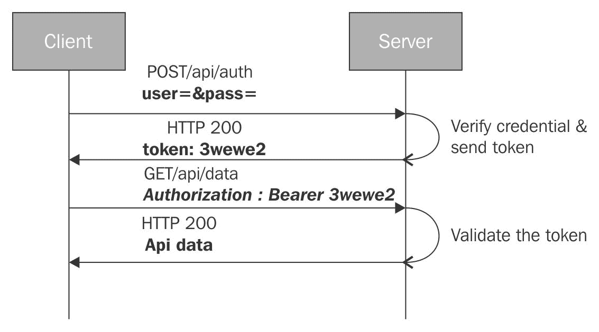

# 第八章：一些实际场景

在掌握七个章节之后，你应该感觉相当不错。到目前为止你所学的都是直接来源于我们在前几章中构建的应用。我们相信你现在应该对框架、其工作原理以及它支持的内容有了足够的了解。有了这些知识，当我们开始构建一些规模较大的应用时，一些常见的问题/模式不可避免地会出现，例如这些：

+   我们如何验证用户并控制其访问权限（授权）？

+   我们如何确保应用性能足够好？

+   我的应用需要本地化内容。我该怎么办？

+   我可以使用哪些工具来加速应用开发？

+   我有一个 AngularJS 应用。我该如何迁移它？

以及更多！

在本章中，我们将尝试解决这些常见场景，并提供一些可行的解决方案和/或指导性建议来处理这些用例。

本章我们将涵盖的主题包括：

+   **Angular 种子项目**：你将学习到一些 Angular 种子项目如何在开始新的项目时帮助我们。

+   **验证 Angular 应用**：这是一个常见需求。我们来看如何在 Angular 中支持基于 cookie 和 token 的认证。

+   **Angular 性能**：在尝试详细说明是什么使 Angular 性能良好以及你可以做些什么来使你的应用更快时，一个常规的性能部分是必须的。

+   **将 AngularJS 应用迁移到 Angular**：AngularJS 和 Angular 是完全不同的东西。在本章中，你将学习如何逐步将 AngularJS 应用迁移到 Angular。

让我们从一开始吧！

# 构建新的应用

想象一个场景：我们正在构建一个新的应用，鉴于 Angular 框架的超级强大，我们一致决定使用 Angular。太好了！接下来是什么？接下来是设置项目的平凡过程。

虽然这是一个平凡的活动，但它仍然是任何合作的关键部分。设置新项目通常涉及：

+   创建标准文件夹结构。有时这会受到服务器框架（如*ROR*、*ASP.Net*、*Node.js*等）的影响。

+   将标准资产添加到特定文件夹中。

+   设置构建，如果我们正在开发基于 Angular 的 Web 应用，这包括：

    +   如果使用 TypeScript，则编译/转换内容

    +   配置模块加载器

    +   在框架和第三方组件方面的依赖管理

    +   设置单元/E2E 测试

+   配置不同环境（如开发、测试和生产）的构建。这再次受到所涉及的服务器技术的影响。

+   代码打包和压缩。

有很多工作要做。

如果我们可以缩短整体设置过程会怎样？这确实可能；我们只需要一个**种子项目**或**启动站点**。

# 种子项目

Angular CLI 作为构建和脚手架工具非常棒！但是，它并不是唯一的选择。有许多*种子项目/入门网站*可以在短时间内帮助我们开始。一些种子项目将框架与特定的后端集成，而另一些则仅规定/提供 Angular 特定的内容。一些预先配置了供应商特定的库/框架（如*LESS*、*SASS*、*Bootstrap*等），而另一些则只提供纯 vanilla 设置。

一些值得探索的知名种子项目如下：

+   **Angular Starter** ([`bit.ly/ng-starter`](http://bit.ly/ng-starter))：这个种子仓库为那些希望快速开始使用 Angular 和 TypeScript 的人提供了一个 Angular 入门。它使用 Webpack（模块打包器）来构建我们的文件并帮助处理样板代码。它是一个完整的构建系统，具有大量的集成。

+   **Angular Seed** ([`bit.ly/ng-starter-seed`](http://bit.ly/ng-starter-seed))：与 Angular Starter 类似的另一个种子项目。这个种子项目使用 gulp 进行构建自动化，其模块打包系统不如 Webpack 先进。

这些项目以及 Angular CLI 为使用 Angular 进行构建提供了良好的起点。

如果应用程序与特定的后端堆栈相关联，我们有两种选择，如下所示：

+   使用这些种子项目之一，并手动将其与后端集成。

+   找到一个为我们完成这项工作的种子项目/实现。有很大机会你会找到这样的种子项目。

# Angular 性能

Angular 是以性能为设计理念的。框架的每个部分，从框架占用空间、初始加载时间、内存使用、变更检测加上数据绑定，到 DOM 渲染，都经过了调整或正在调整以实现更好的性能。

接下来的几节将致力于了解 Angular 的性能以及它用来实现一些令人印象深刻的性能提升的技巧。

# 字节大小

框架的*字节大小*是性能优化的良好起点。虽然世界正在向高速互联网发展，但我们中相当一部分人仍然在使用慢速连接，并通过手机连接到网络。我们可能不会太在意这里或那里的几 KB，但这确实很重要！

虽然 Angular 的默认字节大小比 AngularJS 大，但有一些技术可以大幅减少 Angular 打包的大小。

首先，标准的压缩和 gzip 压缩技术可以显著减少这个差距。并且，在 Angular 中，我们可以通过使用*模块打包器/加载器*来执行一些巧妙的技巧，进一步减少 Angular 打包的大小。

**摇树**可能是一个古怪的过程名称，但它确实做到了它所说的！当我们使用 TypeScript（或 ES2015）构建应用程序，包含 *模块* 和 *导出* 时，模块打包器（如 *Rollup* ([`rollupjs.org`](http://rollupjs.org)））可以对这样的代码进行静态代码分析，确定代码中哪些部分从未使用过，并在打包发布前将其删除。这样的模块打包器，当添加到应用程序的构建过程中时，可以分析框架代码、任何第三方库和应用程序代码，在创建包之前删除任何死代码。*摇树可以导致巨大的尺寸缩减，因为你不会打包你不使用的框架代码。*

可以从框架包中移除的最大框架组件之一是 *编译器*。是的，你没听错，就是编译器！

对于好奇的读者，编译器是最大的框架组件，大约占 Angular 包大小的 50%（在 Angular *v2.0.0* 中）。

结合使用摇树和 **提前编译**（**AoT**），我们可以完全去除浏览器中的 Angular 编译器。

使用 AoT 编译，视图模板（HTML）在服务器端预先编译。这次编译作为应用程序构建过程的一部分进行，其中服务器版本的 Angular 编译器（一个节点包）编译应用程序中的每个视图。

在所有模板编译完成后，就无需将 Angular 编译器代码发送到客户端。现在，摇树可以去除编译器，创建一个更精简的框架包。Angular CLI 支持 AoT 编译，可用于生产构建。

更多关于 AoT 的信息，请参阅框架文档，可在 [`bit.ly/ngx-aot`](http://bit.ly/ngx-aot) 找到。

# 初始加载时间和内存使用

任何具有完整 JavaScript 框架的 Web 应用程序的初始加载时间通常较慢。在移动设备上，这种影响更为明显，因为 JavaScript 引擎可能没有桌面客户端强大。为了提供更好的用户体验，优化框架的初始加载时间变得至关重要，尤其是在移动设备上。

默认情况下，**Angular 2 在初始加载时间和视图重渲染方面比 AngularJS 快五倍**。随着 Angular 团队对框架的改进，这些数字正在变得更好。

此外，AoT 编译也可以提高应用程序的初始加载时间，因为不需要进行耗时活动（视图编译）。

对于内存使用，这也同样适用。Angular 在这里表现也更好，未来的版本将使事情变得更好。

如果你计划切换到 Angular，这是你应该期待的事情：一个为未来构建的高性能框架。

我们接下来要讨论的下一个性能改进是由于一个单一架构决策而成为可能的：*创建一个单独的渲染层*。

# Angular 渲染引擎

AngularJS 最大的缺点是框架绑定到浏览器 DOM 上。指令、绑定和插值都是针对 DOM 工作的。

使用 Angular，最大的架构变化是引入了一个独立的渲染层。现在，一个 Angular 应用有两个层：

+   **应用层**：这是我们的代码所在的一层。它通过在渲染层之上构建的抽象来与它交互。我们在第六章“深入理解 Angular 指令”中看到的 Renderer 类是我们用来与渲染层交互的接口。

+   **渲染层**：这一层负责将应用层的请求转换为渲染组件，并对用户输入和视图更新做出反应。

默认的渲染器实现是`DomRenderer`，它在浏览器内部运行。但还有其他渲染抽象，我们将在下一节中讨论。

# 服务器端渲染

**服务器端预渲染**是提高 Angular 应用初始加载时间的另一种技术。这项技术在移动设备上特别有帮助，因为它显著提高了感知的加载时间。

服务器端渲染负责在客户端渲染启动之前处理初始页面加载（并从此处理视图渲染）。

在这种情况下，当用户请求一个视图/页面时，服务器上的一块软件生成一个完全实例化的 HTML 页面，其中数据预先绑定到视图，并将其与一小段脚本一起发送到客户端。因此，应用视图可以立即渲染，准备交互。当框架在后台加载时，第一次发送的小脚本捕获所有用户输入，并使它们对框架可用，允许它在加载后重放这些交互。

**Angular Universal**，正如其名，允许在服务器和客户端上渲染和共享视图。

服务器端渲染之所以成为可能，是因为之前描述的渲染层的分离。初始视图由服务器上的渲染器实现生成，名为`ServerDomRenderer`。有一个 Node.js 插件（[`bit.ly/ng-universal-node`](http://bit.ly/ng-universal-node)），可以在多个 Node.js Web 框架中使用，如*Express*、*Hapi*、*Sail*等。

查看 Angular Universal 的设计文档（[`bit.ly/ng-universal-design`](http://bit.ly/ng-universal-design)）和设计文档顶部的嵌入 YouTube 视频，以了解更多关于服务器端渲染的信息。

服务器端渲染不仅带来了性能上的好处。实际上，搜索引擎索引器也喜欢预渲染的 HTML 内容。服务器端渲染在搜索引擎优化（SEO）和深度链接等领域非常有用，这允许轻松的内容共享。

# 将工作卸载到 Web Worker

将工作委托给**web worker**是一个很好的想法，这再次得益于渲染层与应用层之间的分离。

*Web workers*提供了一种在后台线程中运行脚本的方法。这些线程可以执行不涉及浏览器 DOM 的工作。无论是 CPU 密集型任务还是远程 XHR 调用，都可以委托给 web workers。

在当今世界，多核 CPU 已成为常态，但 JavaScript 执行仍然是单线程的。我们需要一个标准/机制来利用这些空闲核心为我们的应用程序服务。Web workers 完美地满足了这一需求，并且由于大多数现代浏览器都支持它们，我们都应该编写利用 web workers 的代码。

可惜，这种情况并没有发生。Web workers 仍然不是主流，这有很好的原因。Web workers 对允许和不允许的内容施加了许多限制。这些限制包括：

+   **无法直接访问 DOM**：Web workers 不能直接操作 DOM。实际上，web workers 无法访问多个全局变量，如*window*和*document*，以及其他在 web worker 线程上不可用。这严重限制了 web worker 可以使用的用例数量。

+   **浏览器支持**：Web workers 仅适用于现代/持续更新的浏览器（IE 10+）。

+   **进程间通信**：Web workers 不与你的主浏览器进程共享内存，因此只能通过*消息传递*（序列化数据）与主线程（UI 线程）通信。此外，消息传递机制本质上是异步的，这给通信模型增加了另一层复杂性。

显然，web workers 难以使用。

Angular 试图通过将 web worker 的使用集成到框架本身中来减轻这些限制。它是通过在 web worker 线程中运行整个应用程序来实现的，除了渲染部分。

框架负责在 web worker 内部运行的应用代码与主 UI 线程内运行的渲染器之间的通信。从开发者的角度来看，没有明显的区别。

这同样得益于 Angular 中渲染层的分离。以下图表显示了在应用主线程上运行的层以及在内置 web worker 中运行的层：


通过观看 Jason Teplitz 的这次演讲([`bit.ly/yt-ng-web-worker`](http://bit.ly/yt-ng-web-worker))来了解 web workers 能提供什么。

# 高效的移动体验

Angular 的渲染抽象再次开辟了许多集成途径，尤其是在移动平台上。而不是在移动浏览器上运行应用程序，Angular 渲染器可以被创建出来，可以调用设备的原生 UI 功能。

在这个领域有两个值得注意的项目：平台渲染器：

+   **ReactNative** ([`bit.ly/rnative`](http://bit.ly/rnative))：一个 ReactNative 的渲染器([`bit.ly/ng-rnative`](http://bit.ly/ng-rnative))。它允许使用 ReactNative 的渲染能力编写 Angular 应用。

+   **NativeScript** ([`www.nativescript.org/`](https://www.nativescript.org/))：Angular 和 NativeScript 团队合作创建了一个 NativeScript 的渲染器([`bit.ly/ng-native-script`](http://bit.ly/ng-native-script))。

如*ReactNative*和*NativeScript*这样的应用平台已经出色地提供了针对原生移动平台（iOS 和 Android）的基于 JavaScript 的 API，使我们能够使用熟悉的语言利用单一代码库。Angular 渲染器更进一步。通过 Angular 集成，大量代码可以在浏览器和移动设备之间共享。可能只有视图模板和与视图相关的服务（如对话框、弹出窗口等）有所不同。

请查看相应渲染器的文档，以了解它们的工作原理和支持的功能。

接下来，我们将讨论框架在*变更检测*方面的改进。

# 变更检测改进

在 Angular 相对于 AngularJS 的几个主要性能改进中，Angular 中*变更检测*的工作方式是一个亮点。Angular 的变更检测默认情况下非常快，并且可以进一步调整以获得更好的结果。

接下来的几节将深入讨论 Angular 的变更检测。在构建任何大规模应用时，这是一个重要的理解主题。它还有助于我们调试那些看起来变更检测没有按预期工作的场景。

让我们从了解什么是变更检测以及为什么它很重要开始讨论。

# 变更检测

Angular 的*数据绑定引擎*在将视图与模型数据（组件数据）绑定方面做得很好。这些是实时绑定，Angular 会保持视图与模型变化同步。每当模型发生变化时，绑定引擎都会重新渲染依赖于模型的视图部分。为了管理这种视图-模型同步，Angular 需要知道模型何时发生变化以及具体发生了什么变化。这就是*变更检测*的全部内容。在应用执行期间，Angular 会频繁地进行我们所说的*变更检测运行*，以确定发生了什么变化。

如果你来自 AngularJS，一个*变更检测运行*大致相当于**消化周期**，只不过在 Angular 中**没有循环**。

虽然保持模型和视图同步的问题听起来很简单，但实际上是一个难题。与组件树不同，多个模型之间的相互连接可能很复杂。一个组件模型的变化可能会触发多个组件模型的变化。此外，这些相互连接可能存在循环。单个模型属性可能绑定到多个视图。所有这些复杂场景都需要使用强大的变更检测基础设施来管理。

在接下来的几节中，我们将探讨 Angular 变更检测基础设施的工作原理、变更检测何时触发，以及我们如何影响 Angular 中的变更检测行为。

# 变更检测设置

所有这一切都始于 Angular 为视图上渲染的每个组件设置变更检测器。由于每个 Angular 应用都是组件的层次结构，这些变更检测器也在相同的层次结构中设置。以下图表突出显示了在某个时间点*Workout Builder*应用的**变更检测器层次结构**：


附属于组件的*变更检测器*负责检测组件中的变更。它是通过解析组件模板 HTML 中的绑定并设置必要的变更检测监视来做到这一点的。

记住，检测器只为模板中使用的模型属性设置监视，而不是所有组件属性。

另一个值得强调的重要观点是，*变更检测是从模型到视图单向设置的*。Angular 没有双向数据绑定的概念，因此前面的图是一个没有环的有向树。这也使得变更检测更加可预测。不允许模型和视图更新交织。

# 变更检测何时启动？

Angular 是否始终检查模型数据中的变更？考虑到我们绑定的视图组件属性不继承任何特殊类，Angular 无法知道哪个属性发生了变化。Angular 的唯一出路是不断查询每个数据绑定属性以了解其当前值，并将其与旧值进行比较以检测变更。至少可以说，这是非常低效的！

Angular 的表现优于这一点，因为变更检测只在应用执行过程中的特定时间执行。仔细思考任何 Web 应用；是什么原因导致视图更新？

视图可以因为以下原因而更新：

+   **用户输入/浏览器事件**：我们点击按钮、输入一些文本或滚动内容。这些操作中的每一个都可以更新视图（以及底层的模型）。

+   **远程 XHR 请求**：这是视图更新的另一个常见原因。从远程服务器获取数据以显示在网格上，以及获取用户数据以渲染视图都是这种情况的例子。

+   **setTimeout 和 setInterval 计时器**：实际上，我们可以使用`setTimeout`和`setInterval`来异步执行某些代码并在特定间隔执行。这样的代码也可以更新模型。例如，一个`setInterval`计时器可能会定期检查股票报价，并在 UI 上更新股票价格。

由于显而易见的原因，Angular 的变更检测也只有在以下任何条件发生时才会启动。

这里有趣的部分不是 Angular 的变更检测何时启动，而是 Angular 如何能够拦截所有*浏览器事件*、*XHR 请求*以及`setTimeout`和`setInterval`函数。

在 Angular 中完成这一壮举的是一个名为`zone.js`的库。正如文档所描述的：

"区域是一个在异步任务中持续存在的执行上下文。"

这个库的一项基本能力是它可以钩入一段代码，并在代码执行开始和结束时触发回调。被监控的代码可能是一系列既同步又异步的调用。考虑以下示例，它突出了使用情况：

```js
let zone = new NgZone({ enableLongStackTrace: false });     
let doWork = function () { 
  console.log('Working'); 
}; 

zone.onMicrotaskEmpty.subscribe((data:any) => { 
  console.log("Done!"); 
}); 

zone.run(() => { 
  doWork(); 
    setTimeout(() => { 
        console.log('Hard'); 
        doWork(); 
    }, 200); 
    doWork(); 
}); 
```

我们将一段代码包裹在`zone.run`调用中。这段代码同步地调用`doWork`函数两次，并在两次调用之间插入一个`setTimeout`调用，该调用在 200 毫秒后再次调用相同的函数。

通过将这个序列包裹在`zone.run`中，我们可以知道调用执行何时完成。在区域术语中，这些是**轮次**。`zone.run`之前的代码设置了一个订阅者，当执行完成时会被调用，使用`zone.onMicrotaskEmpty`函数：

如果我们执行前面的代码，日志看起来如下：

```js
Working  // sync call 
Working  // sync call 
Done!   // main execution complete  
Hard     // timeout callback 
Working  // async call 
Done!   // async execution complete
```

`onMicrotaskEmpty`订阅执行了两次，一次是在顺序执行完成后（定义在`run`回调中），另一次是在异步`setTimeout`执行完成后。

Angular 的变更检测使用相同的技巧在区域中执行我们的代码。这段代码可能是一个*事件处理器*，它在完成之前内部进行更多的同步和异步调用，或者它可能是一个`setTimeout`/`setInterval`操作，可能还需要更新 UI。

Angular 变更检测框架订阅执行区域的`onMicrotaskEmpty`可观察对象，并在每次轮次完成后启动变更检测。以下图示突出了当运行类似前面描述的代码在按钮点击时发生的情况：


在代码块执行过程中，如果区域库确定该调用是异步的，它将产生一个新的微任务，该任务有自己的生命周期。这些微任务的完成也会触发`onMicrotaskEmpty`。

如果你想知道 Angular 内部变更检测触发器是如何工作的，以下是 Angular 源代码的摘录（进一步简化）：

```js
class ApplicationRef { 

  constructor(private zone: NgZone) { 
    this._zone.onMicrotaskEmpty.subscribe(
        {next: () => { this._zone.run(() => { this.tick(); }); }}); 
  } 

  tick() { 
    this._views.forEach((view) => view.detectChanges());
  } 
} 
```

`ApplicationRef`类跟踪整个应用程序中附加的所有变更检测器，并在应用程序级别的区域对象触发`onMicrotaskEmpty`事件时触发变更检测周期。我们很快就会涉及到这个变更检测期间发生的事情。

*Zone.js* 通过覆盖默认浏览器 API 获得了跟踪任何异步调用执行上下文的能力。这种覆盖，也称为**猴子补丁**，覆盖了*事件订阅*、*XHR 请求*以及`setTimeout`/`setInterval` API。在前面突出显示的例子中，我们调用的`setTimeout`是原始浏览器 API 的猴子补丁版本。

现在我们知道了变更检测器的设置方式和何时启动这项活动，我们可以看看它是如何工作的。

# 如何进行变更检测？

一旦变化检测器设置完成并且浏览器 API 被猴子补丁以触发变化检测，真正的变化检测就开始了。这是一个相当简单的过程。

一旦任何异步事件回调被触发（事件处理器的执行也是一种异步活动），Angular 首先执行我们附加到回调的应用程序代码。这段代码的执行可能会导致一些模型更新。在回调执行之后，Angular 需要通过触发一个 *变化检测运行* 来响应这些变化。

在变化检测运行中，从组件树的顶部开始，每个变化检测器都会评估其相应组件的模板绑定，以查看绑定表达式的值是否已更改。

关于这个执行，我们需要强调以下几点：

+   Angular 使用严格的相等性检查（使用 `===`）来检测变化。由于它不是深度比较，对于引用对象的绑定，Angular 只在对象引用发生变化时更新视图。

+   变化检测流程是单向的（从根开始），以自顶向下的方式从父到子。父组件上的检测器在子组件检测器之前运行。

默认情况下，变化检测算法遍历整个树，而不管变化是在树的哪个位置触发的。这意味着每次变化检测运行时都会评估所有的绑定：


每次运行都进行绑定评估可能看起来效率不高，但实际上并非如此。Angular 采用一些高级优化来使这个检查非常快。尽管如此，如果我们想调整这种行为，我们确实有一些开关可以减少执行的检查次数。我们很快就会涉及到这个话题。

+   变化检测器只跟踪模板绑定中的属性，而不是完整的对象/组件属性。

+   为了检测绑定值的更改，变化检测器需要跟踪在上次变化检测运行期间评估的表达式的上一个值。显然，对于每个我们使用的模板绑定，都需要进行一些记录。

显然，接下来的问题会是当检测到变化（由变化检测器检测）时会发生什么？

由于设置变化检测和识别更改的所有艰苦工作已经完成，这一步只是涉及更新组件状态和同步组件 DOM。

这里还有一些值得强调的观察结果：

+   首要的是，Angular 将模型更新步骤与 DOM 更新步骤分离。考虑以下代码片段，它在有人点击按钮时被调用：

```js
        doWork() { 
           this.firstName="David"; 
           this.lastName="Ruiz"; 
        } 
```

假设 `firstName` 和 `lastName` 都绑定到组件视图，对 `firstName` 的更改不会立即更新 DOM 绑定。相反，Angular 会等待 `doWork` 函数完成，然后触发变化检测运行和 DOM 更新。

+   其次，一个变更检测运行不会（也不应该）更新模型状态。这避免了任何循环和级联更新。变更检测运行只负责评估绑定和更新视图。这也意味着我们不应该在变更检测期间更新模型状态。如果我们更新模型，Angular 会抛出一个错误。

让我们看看这个行为的例子：

1.  打开 7 分钟健身应用中的 `start.component.html`，并将最后一个 `div` 更新为：

```js
            <div class="col-sm-3"> 
            Change detection done {{changeDetectionDone()}}
            </div> 
```

1.  然后，在组件实现（`start.component.ts`）中添加一个 `changeDetectionDone` 函数，其看起来如下：

```js
            times: number = 0; 
            changeDetectionDone(): number { 
                this.times++; 
                return this.times; 
            } 
```

1.  运行应用，加载起始页面，然后查看浏览器控制台。Angular 记录了许多看起来如下所示的错误：

```js
        EXCEPTION: Expression has changed after it was checked.
        Previous value: 'Change 
        detection done 1'. Current value: 'Change detection done 2' ... 
```

当调用 `changeDetectionDone` 函数（在一个插值内）时，我们正在改变组件的状态，Angular 会抛出一个错误，因为它没有预料到组件状态会更新。

这种变更检测行为仅在 Angular 的**生产模式**被禁用时启用。*生产模式*可以通过在启动应用之前调用 `enableProdMode()` 函数来启用（在 `bootstrap.ts` 中）。启用后，Angular 的行为会有所不同。它会关闭框架内的断言和其他检查。生产模式也会影响变更检测行为。在非生产模式下，Angular 会遍历组件树两次以检测变更。如果在第二次遍历中任何绑定表达式已更改，它会抛出一个错误。相比之下，在生产模式下，变更检测树遍历只执行一次。我们在控制台上看到的变更检测错误如果启用生产模式将不会显示。这可能导致模型和视图状态之间不一致。这是我们应意识到的事情！底线是，我们不能在变更检测进行时改变组件的状态。一个直接的推论是：如果我们在一个绑定表达式中使用函数，函数执行应该是无状态的，没有副作用。

+   最后，这个从根节点到叶节点的变更检测遍历在变更检测运行期间只执行一次。

对于有 AngularJS 背景的人来说，这是一个令人愉快的惊喜！*Angular 中的消化周期计数为 1*。Angular 开发者永远不会遇到“消化迭代超出异常”！一个性能更优的变更检测系统！

# 变更检测性能

让我们谈谈变更检测性能。如果你认为每次检查整个组件树以查找变更是不高效的，你将会惊讶地知道它是多么快。由于一些关于表达式评估和比较的优化，Angular 可以在几毫秒内执行数千次检查。

在底层，对于每个涉及视图绑定的表达式，Angular 都会生成一个专门针对特定绑定的变更检测函数。虽然一开始可能看起来有些反直觉，但 Angular 并没有用于确定表达式是否已更改的通用函数。相反，它就像为每个我们绑定的属性编写我们自己的变更检测函数。这允许 JavaScript VM 优化代码，从而提高性能。

想了解更多关于它的信息？查看维克多·萨金（Victor Savkin）的这段视频：[`youtu.be/jvKGQSFQf10`](https://youtu.be/jvKGQSFQf10)。

尽管进行了所有这些优化，但仍可能存在一些情况，遍历完整的组件树可能不足以高效。这尤其在我们需要在视图中渲染大量数据集并保持绑定完整时更为明显。好消息是，Angular 的变更检测机制可以进行微调。

Angular 需要遍历整个树的原因是，一个地方的模式变化可能会在其他地方触发模式变化。换句话说，模式变化可能产生级联效应，相互连接的模式对象也会被更新。由于 Angular 无法知道确切发生了什么变化，它检查完整的组件树和相关模式。

如果我们可以帮助 Angular 确定应用程序状态中哪些部分被更新，Angular 就可以非常智能地决定遍历组件树以检测更改的部分。我们通过将应用程序数据存储在某些特殊的数据结构中来实现这一点，这些数据结构帮助 Angular 决定哪些组件需要检查更改。

我们有三种方法可以使 Angular 的变更检测更智能。

# 使用不可变数据结构

**不可变对象/集合**是创建后不能更改的对象。任何属性更改都会导致创建一个新的对象。这是 `immutable.js`，一个流行的不可变数据结构库，对此所说的话：

不可变数据一旦创建就不能更改，这导致应用程序开发更加简单，无需进行防御性复制，并允许使用简单的逻辑实现高级记忆化和变更检测技术。

让我们通过一个例子来尝试理解不可变数据结构如何在 Angular 上下文中提供帮助。

假设我们正在构建一组组件来收集人力资源（**HR**）软件的员工信息。员工组件视图看起来可能像这样：

```js
<Employee> 
    <summary [model]="employee"></employee> 
    <personal [model]="employee.personal"></personal> 
    <professional [model]="employee.professional"></professional> 
    <address [model]="employee.home"></address> 
    <address [model]="employee.work"></address> 
</Employee> 
```

它有用于收集个人、专业和地址信息的部分。`summary` 组件提供了正在输入的员工数据的只读视图。每个组件都有一个名为 `model` 的属性，突出显示这些组件操作员工数据的哪些部分。这些组件的摘要、专业、个人和地址内部可能还有其他子组件。这就是组件树的外观：


当我们更新员工的个人信息时会发生什么？使用标准对象（可变）时，Angular 无法对数据的形状和变化做出任何假设；因此，它执行完整的树遍历。

不可变性在这里是如何帮助的？当使用不可变数据结构时，对对象属性任何的更改都会导致创建一个新的对象。例如，如果我们使用流行的库`Immutable.js`创建不可变对象：

```js
personalInfo = Immutable.Map({ name: 'David', 'age': '40' }); 
```

`personalInfo`的`name`或`age`属性的变化会创建一个新的对象：

```js
newPersonalInfo = personalInfo.set('name', 'Dan'); 
```

如果每个员工模型属性（`personal`、`professional`、`home`和`work`）都是不可变的，这种不可变性将非常有用。

以`PersonalInfo`组件定义为例，它绑定到个人信息数据：

```js
 @Component({ 
  selector:'personal', 
  template: ` 
    <h2>{{model.name}}</h2> 
    <span>{{model.age}}</span>`, 
 changeDetection: ChangeDetectionStrategy.OnPush 
}) 
class PersonalInfo { 
  @Input() model; 
} 
```

由于`PersonalInfo`仅依赖于`model`属性，且`model`属性绑定到一个不可变对象，因此 Angular 只有在`model`引用发生变化时才需要进行变更检查。否则，可以跳过完整的`PersonalInfo`组件子树。

通过将`PersonalInfo`组件的`changeDetection`属性设置为`ChangeDetectionStrategy.OnPush`，我们指示 Angular 仅在组件的输入属性发生变化时触发变更检测。

如果我们将 Employee 组件子代中的每个组件的变更检测策略更改为`OnPush`并更新员工的个人信息，则只有`PersonalInfo`组件子树会检查变更：


对于大型组件树，这种优化将大大提高应用/视图性能。

当设置为`OnPush`时，Angular 仅在组件的输入属性发生变化或组件内部或其子代中引发事件时触发变更检测。

使用不可变数据结构开发应用程序与完全可变的传统应用程序状态开发范式不同。本节中我们强调的是 Angular 如何利用不可变数据结构来优化变更检测过程。

**可观察对象**是另一种可以帮助我们优化 Angular 变更检测的数据结构。

# 使用可观察对象

**可观察对象**是当其内部状态发生变化时触发事件的 数据结构。Angular 广泛使用**可观察对象**来将组件的内部状态与外部世界进行通信。

尽管我们使用了可观察的输出属性（`EventEmitter`类）来触发事件，但输入**属性**也可以接受可观察对象。这种可观察的输入可以帮助 Angular 优化变更检测。

当使用可观察对象时，变更检测开关仍然保持为`ChangeDetectionStrategy.OnPush`。但这次，只有当组件输入触发事件（因为它们是可观察的）时，Angular 才会执行脏检查。当输入触发事件时，从受影响的组件到根组件的完整组件树路径将被标记为待验证。

在执行视图更新时，Angular 只会同步受影响的路径，并忽略树中的其余部分。

# 手动更改检测

实际上，我们可以完全禁用组件上的更改检测，并在需要时手动触发更改检测。要禁用更改检测，我们只需将特定于组件的更改检测器（`ChangeDetectorRef`类实例）注入到组件中，并调用`detach`函数：

```js
constructor(private ref: ChangeDetectorRef) { 
    ref.detach(); 
} 
```

现在，责任在我们身上，我们需要通知 Angular 何时应该检查组件的更改。

我们可以通过在`ChangeDetectorRef`上使用`reattach`函数将组件重新附加到更改检测树。

我们很少需要禁用标准更改检测设置，除非有情况使得标准更改检测变得代价高昂。

以一个公共聊天室应用程序为例，它正在接收来自连接到它的数千人的消息。如果我们不断拉取消息并刷新 DOM，应用程序可能会变得无响应。在这种情况下，我们可以禁用聊天应用程序组件树的部分更改检测，并手动在特定间隔触发更改检测以更新 UI。

虽然我们已经看到了三种调整更改检测行为的方法，但好事是这些方法并不是互斥的。组件树的部分可以使用不可变数据结构，部分可以使用 Observables，部分可以采用手动更改检测，其余部分仍然可以使用默认的更改检测。Angular 会欣然从命！

关于更改检测就先说这么多。除非我们正在构建一些具有嘈杂 UI 的大型视图，否则我们可能永远不需要它。这些场景要求我们从更改检测系统中挤出每一分性能，系统已经为此做好了准备。

接下来，我们将探讨大多数应用程序不可避免地具有的另一个常见要求：认证用户。

# 处理认证和授权

大多数，如果不是所有应用程序，都有对用户进行认证/授权的要求。我们可能会认为认证和授权更多地是服务器的问题，而不是客户端的问题，这是正确的。尽管如此，客户端仍需要适应并与服务器强加的认证和授权要求集成。

在典型的应用程序执行工作流程中，应用程序首先加载一些部分视图，然后调用服务器以获取数据，最后将数据绑定到其视图上。显然，*视图*和*远程数据 API*是两种需要被保护的资源。

为了保护这些资源，我们需要了解典型应用程序在服务器上的安全保护方式。主要有两种广泛的方法来保护任何 Web 应用程序：*基于 cookie 的认证*和*基于令牌的认证*。每种方法在客户端部分都需要不同的处理。接下来的两个部分将描述我们如何集成这两种方法之一。

# 基于 cookie 的认证

如果服务器堆栈支持它，这种身份验证机制是最容易实现的。它不会干扰应用，并且可能只需要对 Angular 应用进行最小程度的修改。**基于 Cookie 的身份验证**涉及设置浏览器 Cookie 以跟踪用户身份验证会话。以下序列图解释了一个典型的基于 Cookie 的身份验证工作流程：


下面是一个典型的身份验证工作流程是如何工作的：

+   当尝试从浏览器访问受保护资源时，如果用户未认证，服务器会发送 HTTP 401 未授权状态码。如果请求中没有附加 Cookie 或 Cookie 已过期/无效，则用户请求是一个未经授权的请求。

+   这种未经授权的响应被服务器拦截，有时甚至被客户端框架（在我们的案例中是 Angular）拦截，通常会导致 302 重定向（如果由服务器拦截）。重定向位置是登录页面的 URL（登录页面允许匿名访问）。

+   然后，用户在登录页面上输入用户名和密码，并对登录端点进行 POST 请求。

+   服务器验证凭据，设置浏览器 Cookie，并将用户重定向到最初请求的资源。

+   从此以后，身份验证 Cookie 成为每个请求的一部分（由浏览器自动添加），服务器使用此 Cookie 来确认其身份以及用户是否已认证。

如我们所见，使用这种方法，Angular 基础设施不参与，或者参与度很小。甚至登录页面也可以是一个标准的 HTML 页面，它只是将数据发送到登录端点进行身份验证。如果用户进入 Angular 应用，这隐含地意味着用户已经通过认证。

基于 Cookie 的身份验证流程可能因服务器框架而异，但设置 Cookie 并在随后的每个请求中附加 Cookie 的一般模式保持不变。

在基于 Cookie 的应用程序身份验证中，如果应用程序想要获取用户上下文，则会暴露一个服务器端点（例如 `/user/details`），该端点返回已登录用户的特定数据。然后客户端应用程序可以实现一个服务，如 `UserService`，用于加载和缓存用户配置文件数据。

这里描述的场景假设 API 服务器（返回数据的服务器）和应用程序托管网站位于单个域中。这并不总是情况。即使是 *Personal Trainer*，数据也驻留在 *MongoLab* 服务器上，而应用程序驻留在不同的服务器上（即使它是本地的）。我们已经知道这是一个跨域访问，并且它带来了一组自己的挑战。

在这种设置中，即使 API 服务器能够认证请求并将 Cookie 发送回客户端，客户端应用程序在随后的请求中仍然不会发送身份验证 Cookie。

为了解决这个问题，我们需要在每个 XHR 请求中将变量`withCredentials`设置为`true`。这可以通过覆盖`BaseRequestOptions`（`withCredentials`属性）在全局级别启用。框架使用`BaseRequestOptions`类为每个 HTTP 请求设置默认值。

这也可以通过在每个 HTTP 请求方法中将`withCredentials:true`标志作为最后一个参数传递到每个请求级别来启用：

```js
this.httpService.get(url,{withCredentials:true}); 
```

每个 HTTP 函数的最后一个参数，包括`get`、`post`和`put`，都是一个选项对象。这允许我们覆盖正在进行的请求的选项。

一旦启用此标志，客户端浏览器将开始为跨域请求附加认证 Cookie。

服务器也需要启用**跨源资源共享**（**CORS**），并且需要以特定的方式响应才能使请求成功。它应该将**access-control-allow-credentials**头部设置为 true，并将**access-control-allow-origin**头部设置为发出请求的主机站点。

查看 MDN 文档（[`bit.ly/http-cors`](http://bit.ly/http-cors)）以详细了解此场景。

基于 Cookie 的认证在客户端确实减少了工作量，但有时您不得不回退到基于令牌的访问。这可能是因为：

+   Cookie 和跨域请求在浏览器中表现不佳。特别是，IE8 和 IE9 不支持它们。

+   服务器可能不支持生成 Cookie，或者服务器只公开基于令牌的认证。

+   基于令牌的解决方案很容易与原生移动应用程序和桌面客户端集成。

+   令牌不易受到跨站请求伪造（CSRF）攻击。

要了解更多关于 CSRF 的信息，请查看[`bit.ly/csrf-cs`](http://bit.ly/csrf-cs)的 CRSF 预防 cheat sheet。

下一节将讨论支持基于令牌的认证。

# 基于令牌的认证

**基于令牌的访问**完全是关于在每个请求中发送一个令牌（通常在 HTTP 头部），而不是一个 Cookie。简化的基于令牌的工作流程看起来大致如下：



许多公共 API（如*Facebook*和*Twitter*）使用基于令牌的认证。令牌的格式、位置以及如何生成取决于所使用的协议和服务器实现。使用基于令牌的认证的流行服务实现了用于令牌生成和交换的**OAuth 2.0**协议。

在典型的基于令牌的认证设置中，视图是公开的，但 API 是受保护的。如果应用程序尝试通过不将适当的令牌附加到发出的请求的 API 调用来获取数据，服务器将返回一个*HTTP 401 未授权*状态码。

在 Angular 中启用 token 认证是一项相当多的工作。它包括设置登录页面/组件、守卫条件、认证服务和跨应用共享的认证上下文。如果你开始这段旅程，确保寻找使这种集成更简单的 Angular 库/模块。`ngx-auth`库（[`bit.ly/ngx-auth`](http://bit.ly/ngx-auth)）可以是一个好的起点。

这就是关于认证的所有内容，但关于授权呢？一旦建立了用户上下文，我们仍然需要确保用户只能访问他/她被允许访问的部分。*授权*仍然缺失。

# 处理授权

与认证一样，授权支持也需要在服务器和客户端上实现，尤其是在服务器端。记住，任何人都可以破解 JavaScript 代码并绕过完整的认证/授权设置。所以，无论客户端是否设置了必要的检查，都要始终加强你的服务器基础设施。

这并不意味着我们在客户端不做任何授权检查。对于标准用户来说，这是防止未经授权访问的第一道防线。

在为任何应用程序设置授权需求时，有三个基本元素是设置的一部分：

+   需要受到保护/授权的资源

+   属于这些角色的角色和用户列表

+   资源与定义谁可以访问什么的角色之间的映射

从 Angular 应用程序的角度来看，资源是需要限制到特定角色的页面和，有时，页面的部分。如果用户属于特定角色，根据角色-资源映射，他们可以访问某些页面；否则，他们将无法访问。

虽然在 Angular 应用程序中授权可以通过多种方式实现，但我们将概述一个通用的实现，该实现可以进一步定制以满足未来的需求。

# 添加授权支持

要启用授权，我们首先需要做的是在整个应用程序中公开登录用户数据，包括他的/她的角色。

# 共享用户认证上下文

可以使用 Angular 服务共享用户上下文，然后可以将该服务注入到需要授权上下文的组件中。看看这个服务接口：

```js
class SessionContext { 
  currentUser():User { ... }; 
  isUserInRole(roles:Array<string>):boolean { ...}; 
  isAuthenticated:boolean; 
} 
```

`SessionContext`服务跟踪用户登录会话并提供如下详细信息：

+   登录用户（`currentUser`）

+   用户是否已认证（`isAuthenticated`）

+   `isUserInRole`函数，根据用户是否是传递给`roles`参数的任何角色的成员，返回`true`或`false`

在这样的服务到位后，我们可以为路由添加授权，从而仅将某些路由的访问限制到特定角色。

# 限制路由

就像认证一样，`canActivate`守卫检查也可以用于授权。实现一个具有`CanActivate`接口的类，并在构造函数中注入`SessionContext`服务；然后，使用`SessionContext`服务在`canActivate`函数中检查用户是否属于特定角色。查看以下代码片段：

```js
export class AuthGuard implements CanActivate { 
  constructor(private session:SessionContext) { } 
  canActivate() { 
    return this.session.isAuthenticated &amp;&amp;  
      session.isUserInRole(['Contributor', 'Admin']); 
  } 
} 
```

现在，只有具有*贡献者*和*管理员*角色的用户才能访问具有此守卫条件的路由。

但当页面有基于用户角色的渲染视图元素时会发生什么？

# 根据角色条件渲染内容

条件渲染内容易于实现。我们只需根据用户角色显示/隐藏 HTML 元素。我们可以构建一个如`ng-if`这样的*结构指令*，在渲染内容之前验证用户是否属于该角色。指令的使用方式如下：

```js
<div id='header'> 
    <div> Welcome, {{userName}}</div> 
    <div><a href='#/setting/my'>Settings</a></div> 
    <div *a2beRolesAllowed='["admin"])'> 
        <a href='#/setting/site'>Site Settings</a> 
    </div> 
</div> 
```

上述代码在渲染网站设置超链接之前检查用户是否处于管理员角色。

指令实现模仿了`ng-if`的工作方式，但我们的显示/隐藏逻辑依赖于`SessionContext`服务。以下是`a2beRolesAllowed`指令的一个示例实现：

```js
@Directive({ selector: '[a2beRolesAllowed]' }) 
export class RolesAllowedDirective { 
  private _prevCondition: boolean = null; 
  constructor(private _viewContainer: ViewContainerRef, 
    private _templateRef: TemplateRef, private SessionContext _session) { } 

  @Input() set a2beRolesAllowed(roles: Array<string>) { 
    if (this._session.isUserInRole(roles)) { 
      this._viewContainer 
        .createEmbeddedView(this._templateRef); 
    } 
    else { 
      this._viewContainer.clear(); 
    } 
  } 
} 
```

这是一个使用`SessionContext`和作为输入传递的角色（`a2beRolesAllowed`）来显示/隐藏片段的简单实现。

这就带我们来到了认证和授权实现的终点。参考实现指南应该能帮助我们将认证和授权集成到我们的应用中。有了这个基本理解，任何设置都可以进行调整以处理其他自定义认证/授权场景。

现在是时候解决房间里的大象了：从*AngularJS*迁移到*Angular*。如果你是全新开始使用 Angular，你可以很好地跳过下一节。

从 Angular 的迁移指南中可以看出："Angular 是今天和明天的 Angular。AngularJS 是所有 v1.x 版本的 Angular 的名称。"

# 迁移 AngularJS 应用

如果你一直在大量使用 AngularJS，Angular 会提出一些相关的问题：

+   我应该将我的旧 AngularJS 应用迁移到最新的 Angular 版本吗？

+   迁移应该在什么时候进行？

+   迁移是一次性的还是可以分步骤进行？

+   需要付出的努力有哪些？

+   我今天能做些什么来帮助未来的迁移？

+   我今天开始一个新的 AngularJS 应用。为了将来迁移顺利，我应该做什么？

每个这样的查询都需要得到解决，以确保过渡尽可能平滑。没有人喜欢在游戏中出现意外！在接下来的章节中，我们将尝试回答许多此类问题。作为学习的一部分，我们还将向您展示如何将（为本书的第一版开发的）*Trainer*应用的 AngularJS 版本迁移到 Angular。这将帮助每个人在何时以及如何迁移到 Angular 方面做出一些明智的决定。

“我应该迁移还是不迁移”是我们首先需要解决的问题。

# 我应该迁移吗？

只因 Angular 存在并不意味着 AngularJS 已经消失。AngularJS 仍在开发中，尽管其速度不如 Angular。Google 仍然承诺在相当长的时间内支持 AngularJS。AngularJS 团队目前正在开发 1.7 版本，并计划在 2018 年 6 月之前发布。之后，1.7 将进入 **长期支持**（**LTS**）期，届时重点将仅限于修复错误。我们可以从他们的博客文章中了解更多信息，请参阅[`bit.ly/ng1-lte-support`](http://bit.ly/ng1-lte-support)。

显然，AngularJS 将继续得到支持，因此迁移不应成为主要担忧。迁移到 Angular 的决定可以根据 Angular 相比前辈所提供的优势来做出。

# Angular 的优势

Angular 是面向未来的，并克服了其前辈的许多缺点。在本节中，我们强调是什么让 Angular 比 AngularJS 成为一个更好的框架。

在决定迁移到 Angular 时，您应该注意的事项：

+   **更好的行为封装**：诚然，当我们刚开始学习 AngularJS 时，AngularJS 的 *scopes* 似乎是从天而降的神物，但我们现在已经意识到管理 scopes 层级性质是多么困难。基于组件的开发在 Angular 中提供了更好的应用状态封装。组件管理自己的状态，接收输入，并触发事件；这是一个责任划分清晰、易于推理的明确界限！

+   **应用代码中框架的减少**：您不需要像 *scope* 这样的特殊对象。依赖注入（DI）与注解（在 TypeScript 中）一起工作。您不需要设置观察者。总的来说，当阅读组件代码时，您不会在其中找到框架级别的结构。

+   **更小的框架 API 需要探索**：AngularJS 有许多指令需要了解。随着 Angular 模板语法的引入，与浏览器事件相关的指令已经消失。这减少了需要了解的指令数量。

+   **性能**：与前辈相比，Angular 的性能更快。本书的一个完整章节都致力于理解是什么让 Angular 成为一个高性能框架。

+   **移动友好**：Angular 通过利用服务器端渲染和 Web Workers 等技术来优化用户的移动体验。Angular 在移动设备上的应用程序性能优于其前辈。

+   **跨平台**：Angular 面向在大多数设备和平台上运行。您可以使用 Angular 来构建 Web 和移动应用程序。正如我们之前所学的，渲染层的分离为 Angular 可以被利用的地方开辟了大量的可能性。

在真正意义上，Angular 取代了其前辈，在理想的世界里，每个人都应该致力于更好的框架/技术。但迁移从来都不容易，尤其是在这种两个框架差异很大的情况下。

我们推荐的是，即使你今天不打算迁移到 Angular，也要以允许将来易于迁移到 Angular 的方式构建你的 AngularJS 应用。

下一节将讨论今天应遵循的原则和实践，以便将来易于迁移。

# 为了便于迁移而开发 AngularJS 应用

新的 Angular 是一个范式转变，我们在 Angular 中开发组件的方式与 AngularJS 大不相同。为了便于迁移，Angular 也应该采用基于组件的开发方式。如果我们遵循一些在构建 AngularJS 应用时的指南/原则，就可以实现这一点。接下来的几节将详细说明这些指南。

即使你计划不迁移到 Angular，这里列出的建议也非常推荐。这些推荐将使 AngularJS 代码更加模块化、组织化，并且易于测试。

# 每个文件一个组件

这可以是任何东西：AngularJS 的*控制器*、*指令*、*过滤器*或*服务*。每个文件一个组件允许更好的代码组织，并便于迁移，使我们能够清楚地识别已经取得了多少进展。

# 避免使用内联匿名函数

使用命名函数来声明控制器、指令、过滤器和服务。如下所示的一个声明：

```js
angular.module('7minWorkout') 
  .controller('WorkoutController',[...]) 

angular.module('app') 
.directive('remoteValidator', [...]) 

angular.module('7minWorkout') 
.filter('secondsToTime', function () { ... } 

angular.module('7minWorkout') 
.factory('workoutHistoryTracker', [...]) 
```

应该转换为以下形式：

```js
function WorkoutController($scope, ...) { ... } 
WorkoutController.$inject = ['$scope', ...]; 

function remoteValidator($parse) {...} 
remoteValidator.$inject=[$parse]; 

function secondsToTime() {...} 

function workoutHistoryTracker($rootScope, ...) { ...} 
workoutHistoryTracker.$inject = ['$rootScope',...]; 
```

使用命名函数的优点是易于调试和易于迁移到 TypeScript。使用命名函数还要求使用`$inject`函数属性注册依赖。

基于`$inject`的依赖声明可以防止压缩并增加函数的可读性。

为了避免使用这种方法暴露全局命名函数，建议将函数包裹在一个**立即调用的函数表达式**（**IIFE**）中：

```js
(function() { 
    function WorkoutController($scope, ...) { ... } 
    WorkoutController.$inject = ['$scope', ...]; 

    angular 
        .module('7minWorkout') 
        .controller('WorkoutController', WorkoutController); 

})(); 
```

# 避免使用`$scope`！

是的，你没看错；避免使用`$scope`/`$rootScope`对象或直接使用作用域！

AngularJS 作用域的最大问题是它们的层次结构。从子作用域访问父作用域为我们提供了巨大的灵活性，但这也带来了代价。这可能会无意中创建不必要的依赖，使得应用难以调试和迁移。相比之下，在 Angular 中，视图绑定到其组件实现，并且不能隐式地访问其边界之外的数据。因此，如果你计划迁移到 Angular，请务必*避免使用作用域*。

有许多技术可以用来移除对`$scope`对象的依赖。接下来的几小节将详细阐述一些可以帮助我们避免 AngularJS 作用域的技术。

# 在所有地方使用控制器作为（控制器别名）语法

AngularJS 1.3+提供了*控制器 as*语法，用于*控制器*、*指令*和*路由*。*控制器 as*语法允许 AngularJS 数据绑定表达式针对控制器实例属性而不是当前*作用域*的对象属性进行操作。在控制器 as 范式下，我们无需直接与作用域交互，因此未来的迁移变得容易。

虽然控制器别名消除了作用域访问，但在 AngularJS 中作用域仍然存在。完整的 AngularJS 数据绑定基础设施依赖于作用域。控制器别名只是在我们的代码和作用域访问之间添加了一个间接层。

考虑以下语法在视图中使用*控制器 as*：

```js
<div ng-controller="WorkoutListController as workoutList"> 
   <a ng-repeat="workout in workoutList.workouts"  href="#/workout/{{workout.name}}"> 
</div> 
```

以及相应的控制器实现：

```js
function WorkoutListController($scope, ...) { 
  this.workouts=[]; 
} 
```

`WorkoutListController`作为`workoutList`在当前作用域上为`WorkoutListController`创建了一个别名`workoutList`，因此允许我们绑定到控制器上定义的`workouts`属性。

路由定义同样允许使用*路由定义对象*中的`controllerAs`属性进行控制器别名设置：

```js
$routeProvider.when('/builder/workouts', { 
... 
   controller: 'WorkoutListController', 
 controllerAs: 'workoutList' 
 }); 
```

最后，指令也可以使用`controllerAs`，结合*指令定义对象*上的`bindToController`属性，我们可以消除任何直接的作用域访问。

查看 Angular 文档中的控制器、路由和指令部分，以获得对控制器 as 语法的初步理解。同时，查看以下帖子以获取更多关于此主题的详细示例：[`bit.ly/ng1-controller-as`](http://bit.ly/ng1-controller-as) 和 [`bit.ly/ng1-bind-to`](http://bit.ly/ng1-bind-to)。

# 避免使用 ng-controller

如果可以避免作用域，那么也可以避免控制器！

这可能看起来有些反直觉，但这种方法确实有实际的好处。我们理想的做法是在 AngularJS 中模拟组件行为。由于 AngularJS 中最接近组件的是*元素指令*（具有`restrict='E'`），我们应该在所有地方使用*元素指令*。

一个具有自己的模板和独立作用域的 AngularJS 元素指令可以很好地表现得像一个 Angular 组件，并且只依赖于其内部状态进行视图绑定。我们只需要`ng-controller`。

考虑在*个人教练*应用的 AngularJS 版本中使用`ng-controller`进行音频跟踪：

```js
<div id="exercise-pane" class="col-sm-7"> 
... 
  <span ng-controller="WorkoutAudioController"> 
    <audio media-player="ticksAudio" loop autoplay src="img/tick10s.mp3"></audio> 
    <audio media-player="nextUpAudio"  src="img/nextup.mp3"></audio> 
    ... 
  </span>
```

而不是使用`WorkoutAudioController`，一个元素指令可以封装锻炼音频的视图和行为。这样的指令可以替换完整的`ng-controller`声明及其视图：

```js
<div id="exercise-pane" class="col-sm-7"> 
... 
<workout-audio-component></workout-audio-component> 
```

当用元素指令替换`ng-controller`时，控制器所依赖的作用域变量应通过*指令定义对象*上的`bindToController`属性传递给指令——类似于以下这样：

```js
bindToController: { 
   name: '=', 
   title: '&amp;' 
} 
```

这个主题在 Tero 的以下两篇博客文章中得到了广泛讨论：[`bit.ly/ng2-no-controllers`](http://bit.ly/ng2-no-controllers) 和 [`bit.ly/ng2-refactor-to-component`](http://bit.ly/ng2-refactor-to-component)。必读的帖子，信息量丰富！

# 使用 AngularJS 1.5+ 组件 API 构建

AngularJS 1.5+ 有一个 **组件 API**，允许我们创建可以轻松迁移到 Angular 的指令。组件 API 预配置了合理的默认值，因此在构建真正隔离和可重用的指令时，它包含了最佳实践。

查看组件 API 在 [`bit.ly/ng1-dev-guide-components`](http://bit.ly/ng1-dev-guide-components)，以及 Tod Motto 在 [`bit.ly/1MahwNs`](http://bit.ly/1MahwNs) 发表的这篇信息丰富的帖子，以了解组件 API。

再次强调之前已经强调过的，这些步骤不仅针对简单的 Angular 迁移，而且也针对使 AngularJS 代码更加优秀。基于组件的 UI 开发比我们习惯的 AngularJS 更好的范式。

我们强烈建议您阅读 AngularJS 风格指南（[`bit.ly/ng1-style-guide`](http://bit.ly/ng1-style-guide)）。这份指南包含了许多技巧/模式，使我们能够构建更好的 AngularJS 应用程序，并且与之前提供的易于 Angular 迁移的指南保持一致。

最后，如果我们已经决定迁移，那么是时候决定要迁移什么了。

# 要迁移什么？

对于处于维护模式的应用程序，其中大部分开发活动都围绕着错误修复和一些增强，坚持使用 AngularJS 是明智的。记住那句老话：*如果它没有坏，就不要修理它*。

如果应用程序正在积极开发，并且有一个明确的长期路线图，那么考虑迁移到 Angular 是值得的。随着我们深入了解迁移的复杂性，我们将意识到这个过程所涉及的时间和精力。虽然 Angular 团队已经非常努力地使这次迁移变得顺利，但无论如何想象，这都不是一个简单的工作。实际的迁移将需要相当多的时间和精力。

这里的亮点是我们不需要一次性迁移所有内容。我们可以慢慢地将 AngularJS 代码库的部分迁移到 Angular。这两个框架可以共存，并且可以相互依赖。这也允许我们在 Angular 中开发应用程序的新部分。这有多酷？

但再次强调，这种灵活性是有代价的——字节代价。由于两个框架都会被下载，页面字节会增加，这是我们应当注意的。

此外，尽管这两个框架共存使我们能够在很大程度上避免中断进行迁移，但我们不能让它成为一种永久的活动。最终，AngularJS 必须退出，越早越好。

在迁移过程中，能做的事情最好的是，在现有应用程序中划分出新的单页应用（SPA）。例如，我们可以完全使用 Angular 构建应用程序的 Admin 区域，有一个独立的主页，但如果我们稍微重构代码，仍然可以共享样式表、图像甚至 AngularJS 服务的基础设施。正如我们稍后将学习的，将服务迁移到 Angular 是最简单的。

将应用程序分解成多个较小的应用程序会引入全页刷新，但在迁移方面这是一个更干净的方法。

考虑到所有这些，如果我们已经决定迁移并确定了迁移区域，你需要为迁移做准备工作。

# 准备迁移到 Angular

欢迎来到 Angular 迁移的广阔勇敢的世界！一个成功的迁移策略涉及确保我们在事先做好基础工作，避免任何意外的惊喜。

作为准备工作，第一步是从第三方库依赖的角度分析应用程序。

# 识别第三方依赖

任何 AngularJS 应用程序使用的第三方库都需要一个迁移策略。这些库可能是基于 jQuery 的库或者 AngularJS 库。

# jQuery 库

在 AngularJS 中，jQuery 库是通过在其上创建指令包装器来使用的。我们将不得不将这些指令迁移到 Angular。

# AngularJS 库

迁移 AngularJS 库是一件有点棘手的事情。AngularJS 有一个庞大的生态系统，Angular 也已经存在一段时间，现在有一个健康的社区。在迁移时，每个 AngularJS 库都需要用 Angular 的替代品来替换。

如果我们没有找到特定库的完美升级路径，我们可以选择以下之一：

+   定制现有的类似组件/库

+   采取更激进的从零开始构建自己的 Angular 库的方法

在时间和复杂性方面，每个选择都有其权衡。

另一个需要做出的选择是开发语言。我们应该使用 TypeScript、ES2015 还是传统的 JavaScript（ES5）？

# 语言选择

我们肯定会推荐 TypeScript。这是一种非常棒的语言，它与 Angular 集成得非常好，大大减少了 Angular 声明的冗长性。此外，由于它可以与 JavaScript 共存，这使我们的工作变得更简单。即使没有 Angular，TypeScript 也是我们应该拥抱的 Web 平台的一种语言。

在接下来的章节中，我们将把 AngularJS *个人教练*应用程序迁移到 Angular。该应用程序目前在*GitHub*上可用，地址为[`bit.ly/a1begit`](http://bit.ly/a1begit)。这个应用程序是本书第一版 *AngularJS by Example* 的一部分，并使用 JavaScript 构建。

我们将再次采用基于检查点的迁移方法。在迁移过程中，我们强调的检查点已经实现为 GitHub 分支。由于我们将与 v1 代码的 Git 仓库交互，并使用 Node.js 工具进行构建，请在继续之前在您的开发机器上设置 Git 和 Node.js。

# 迁移 AngularJS 的 Personal Trainer

在我们开始迁移过程之前，我们需要在本地设置 v1 *个人教练*。

已迁移应用程序的代码可以从 GitHub 网站下载，网址为 [`github.com/chandermani/angularjsbyexample`](https://github.com/chandermani/angularjsbyexample)。由于我们是分块迁移的，因此我们创建了多个检查点，这些检查点映射到专门用于迁移的 **GitHub 分支**。例如 `ng6-checkpoint8.1`、`ng6-checkpoint8.2` 等分支突出了这一进展。在叙述过程中，我们将突出显示这些分支以供参考。这些分支将包含到那时为止在应用程序上所做的所有工作。

*7 分钟锻炼* 代码位于名为 `trainer` 的仓库文件夹内。

那么，让我们开始吧！

# 在本地设置 AngularJS 的 Personal Trainer

按照以下步骤操作，您将很快就能启动并运行：

1.  从命令行，克隆 v1 GitHub 仓库：

```js
    git clone https://github.com/chandermani/angularjsbyexample.git
```

1.  导航到新的 Git 仓库并检出 `ng6-base` 分支以开始：

```js
    cd angularjsbyexample
    git checkout ng6-base
```

1.  由于应用程序从托管在 **mLab** ([`mlab.com/`](https://mlab.com/)) 上的 **MongoDB** 加载锻炼数据，因此您需要一个 mLab 账户来托管与锻炼相关的数据。通过注册他们来设置 mLab 账户。一旦您有了 mLab 账户，您需要从 mLab 的管理门户中检索您的 API 密钥。按照 API 文档中提供的说明 ([`bit.ly/mlab-docs`](http://bit.ly/mlab-docs)) 获取您的 API 密钥。

1.  一旦您有了 API 密钥，请更新 `app/js/config.js` 中的这一行，使用您的 API 密钥：

```js
   ApiKeyAppenderInterceptorProvider.setApiKey("<yourapikey>"); 
```

1.  将一些种子锻炼数据添加到您的 mLab 实例中。将种子数据添加到 mLab 的说明可在源代码文件 `app/js/seed.js` 中找到。

1.  接下来，安装 v1 *个人教练* 所需的必要 *npm 包*：

```js
    cd trainer/app
    npm install
```

1.  安装 `http-server`；它将作为我们的 v1 应用程序的开发服务器：

```js
npm i http-server -g
```

通过从 `app` 文件夹启动 `http-server` 来验证设置是否完成：

```js
    http-server -c-1
```

并打开浏览器位置 `http://localhost:8080`。

v1 *个人教练* 的起始页面应该会出现。玩一下这个应用程序以验证应用程序运行正常。现在，迁移可以开始了。

# 识别依赖项

在我们开始迁移 v1 *个人教练* 之前的第一步是确定我们在 AngularJS 版本的 Personal Trainer 中使用的外部库。

我们在 v1 中使用的库有：

+   `angular-media-player`

+   `angular-local-storage`

+   `angular-translate`

+   `angular-ui-bootstrap`

+   `owl. carousel`

像这样的库 `angular-media-player` 和 `angular-local-storage` 容易迁移/替换。我们已经在本书的早期章节中完成了这项工作。

`angular-translate` 库可以被 `ngx-translate` 替换，正如我们将在接下来的章节中看到的，这不是一个很有挑战性的任务。

我们在 *Personal Trainer v1* 中使用 `angular-ui-bootstrap` 进行 **模态对话框**。我们用 `ngx-modialog` ([`bit.ly/ngx-modialog`](http://bit.ly/ngx-modialog)) 替换它，因为我们只使用了 `angular-ui-bootstrap` 中的对话框控件。

现在我们已经整理好了外部依赖，让我们决定要使用的语言。

虽然现有的代码库是 JavaScript，但我们更喜欢 TypeScript。它的类型安全、简洁的语法以及与 Angular 的良好兼容性使其成为我们的首选语言。因此，我们将全程使用 TypeScript。

另一个使决策倾向于 TypeScript 的因素是，我们不需要将现有代码库迁移到 TypeScript。我们迁移/构建的任何新内容都将使用 TypeScript 构建。遗留代码仍然保持在 JavaScript 中。

让我们开始吧。作为一个迁移任务的第一步，我们需要为我们的 v1 个人教练设置一个模块加载器。

# 设置模块加载器

由于我们将创建许多新的 Angular 组件，分布在众多小文件中，直接添加脚本引用将会很繁琐且容易出错。Angular CLI 在这里也不是很有帮助，因为它无法管理用 JavaScript 实现的现有代码库。

我们需要一个 **模块加载器**。一个模块加载器（*ES6 模块*，而不是 Angular）可以帮助我们：

+   基于某些常见的模块格式创建隔离/可重用模块

+   根据依赖关系管理脚本加载顺序

+   允许模块的捆绑/打包以及开发/生产部署时的按需加载

我们使用 **SystemJS** 模块加载器进行这次迁移。

使用以下命令从命令行安装 SystemJS：

```js
npm i systemjs --save
```

所有命令都需要从 `trainer/app` 文件夹中执行。

我们打开 `index.html` 并移除我们应用脚本的全部脚本引用。所有以 `src='js/*.*'` 为源的脚本引用都应该被移除，除了 `angular-media-player.js` 和 `angular-local-storage.js`，因为它们是外部库。

注意：我们不会移除第三方库的脚本引用，但只会移除应用文件。

在所有第三方脚本引用之后添加 SystemJS 配置：

```js
<script src="img/angular-local-storage.js"</script> 
<script src="img/system.src.js">
</script>
<script>
 System.config({ packages: {'js': {defaultExtension: 'js'}}});
 System.import('js/app.js');
</script>
```

在 `body` 标签上移除 `ng-app` 属性，保持 `ng-controller` 声明不变：

```js
<body ng-controller="RootController">
```

当我们切换到 `angular.bootstrap` 函数进行手动引导时，`ng-app` 的引导方式必须放弃。手动引导在将 Angular 引入其中时非常有帮助。

前面的 `SystemJS.import` 调用通过加载 `js/app.js` 中定义的第一个应用模块（JavaScript）来加载应用程序。我们很快就会定义这个 JavaScript 模块。

在与 `app.js` 相同的文件夹中创建一个名为 `app.module.js` 的新文件，并将 `app.js` 的全部内容复制到 `app.module.js` 中。

记得移除 `use strict` 语句。TypeScript 编译器不喜欢它。

所有应用模块定义现在都在 `app.module.js` 中。

接下来，清空 `app.js` 并添加以下导入和引导代码：

```js
import  './app.module.js'; 
import  './config.js'; 
import  './root.js'; 
import './shared/directives.js'; 
import './shared/model.js'; 
import './shared/services.js'; 
import './7MinWorkout/services.js'; 
import './7MinWorkout/directives.js'; 
import './7MinWorkout/filters.js'; 
import './7MinWorkout/workout.js'; 
import './7MinWorkout/workoutvideos.js'; 
import './WorkoutBuilder/services.js'; 
import './WorkoutBuilder/directives.js'; 
import './WorkoutBuilder/exercise.js'; 
import './WorkoutBuilder/workout.js'; 

import * as angular from "angular";

angular.element(document).ready(function() { 
  angular.bootstrap(document.body, ['app'],  
{ strictDi: true }); 
});
```

我们已经在 `app.js` 中添加了 *ES6 导入语句*。这些脚本与之前在 `index.html` 中引用的脚本相同。SystemJS 现在在加载 `app.js` 时会加载这些脚本文件。

将所有的 AngularJS 模块声明移动到一个新的文件`app.module.js`中，并首先将其导入到`app.js`中，确保在执行任何`import`语句之前定义了 AngularJS 模块。

不要混淆使用`angular.module('name')`定义/访问的**ES6 模块**和**AngularJS 模块**。这两个概念完全不同。

最后几行使用`angular.bootstrap`函数引导 AngularJS 应用程序。

模块加载现在已启用；让我们也启用 TypeScript。

# 启用 TypeScript

要启用 TypeScript，使用*npm*安装 TypeScript 编译器：

```js
npm i typescript -g
```

接下来，打开`package.json`并在脚本配置中添加以下行：

```js
"scripts": { 
    "test": "echo "Error: no test specified" &amp;&amp; exit 1" 
 "tsc": "tsc -p . -w"
  } 
```

我们刚刚添加的新脚本属性为常用命令提供了快捷方式。

要启用 JavaScript 库的 IDE IntelliSense，我们需要安装它们的类型定义。**类型定义**或**typings**是定义 TypeScript/JavaScript 库公共接口的文件。这些类型定义帮助 IDE 为库函数提供 IntelliSense。大多数流行的 JavaScript 库和用 TypeScript 编写的框架/库都有类型定义。

让我们安装我们使用的库的类型定义。从命令行执行：

```js
npm install @types/angular @types/angular-route @types/angular-resource @types/angular-mocks  --save-dev
```

接下来，将`overrides.d.ts`从`checkpoint8.1`复制到本地的`app`文件夹。这有助于 TypeScript 编译器处理在`app.js`和其他地方使用的全局`angular`对象。

我们现在需要为 TypeScript 编译器设置一些配置。在`trainer/app`文件夹中创建一个名为`tsconfig.json`的文件，并从`ng6-checkpoint8.1`仓库分支复制配置（也远程可用于[`bit.ly/ng6be-8-1-tsconfig`](http://bit.ly/ng2be-8-1-tsconfig)）。使用以下命令运行编译器：

```js
npm run tsc
```

这应该会启动 TypeScript 编译器，并且不应该报告任何错误。

在开发期间，始终在单独的控制台窗口中运行此命令。编译器将连续监视 TypeScript 文件的变化，并在检测到变化时重新构建代码。

将`app.js`和`app.module.js`文件的扩展名更改为`app.ts`和`app.module.ts`。TypeScript 编译器会检测这些更改并编译 TypeScript 文件。编译后，编译器为每个 TypeScript 文件生成两个文件。一个是编译后的 JavaScript 文件（如`app.js`），另一个是用于调试的映射文件（`app.js.map`）。

我们没有为这个练习设置复杂的构建，因为我们的主要重点是迁移。对于您自己的应用程序，初始设置步骤可能因构建的设置方式而异。

在我们测试新的更改之前，`config.js`需要修复，因为我们已经通过以下方式在 AngularJS 中启用了严格的 DI 检查：

```js
  angular.bootstrap(document.body, ['app'],  { strictDi: true });
```

将 `config.js` 的内容替换为在 `ng6-checkpoint8.1` 或 [`bit.ly/ng6be-8-1-configjs`](http://bit.ly/ng2be-8-1-configjs) 中可用的更新内容（并记得再次设置 API 密钥）。这次更新修复了 `config` 函数，使其更适合压缩。是时候测试应用了！

确保 TypeScript 编译器在一个控制台中运行；在新控制台窗口中运行 `http-server -c-1`。

导航到 `http://localhost:8080` 应用启动页面应该加载。

提交/保存你的本地更改。

如果一切顺利，你甚至可以将你的本地更改提交到你的 git 仓库。这将帮助我们跟踪随着时间的推移应用迁移过程中发生了哪些变化。到这一点的实现可以在 `ng6-checkpoint8.1` GitHub 分支中找到。如果你遇到问题，比较 `ng6-base` 和 `ng6-checkpoint8.1` 分支以了解所做的更改。由于代码托管在 GitHub 上，我们可以使用 *GitHub compare* 接口来比较单个分支的提交。请参阅如何操作的文档：[`bit.ly/github-compare`](http://bit.ly/github-compare)。[`bit.ly/ng6be-compare-base-8-1`](http://bit.ly/ng6be-compare-base-8-1) 中的链接显示了 `ng6-base` 和 `ng6-checkpoint8.1` 之间的比较。你可以忽略作为 TypeScript 编译部分生成的 `app.js` 和 `app.module.js` 的 diff 视图。

是时候介绍 Angular 了！

# 添加 Angular

我们首先安装 Angular 和应用依赖的 *npm 模块*。首先，我们将更新 `package.json` 文件中的必要包。

从 [`bit.ly/ng6be-8-2-package-json`](http://bit.ly/ng6be-8-2-package-json) 复制更新的包文件到你的本地安装。

`package.json` 现在引用了一些与 Angular 相关的新包。通过调用以下命令安装引用的包：

```js
npm install
```

如果你使用 `npm install` 安装包时遇到问题，删除 `node_modules` 文件夹并再次运行 `npm install`。

然后，在 `index.html` 中 `system.src.js` 脚本引用之前添加一些 Angular 依赖的库引用（不使用 SystemJS 加载），总共两个：

```js
<script src="img/shim.min.js"></script> <script src="img/zone.js"></script><script src="img/system.src.js"></script> 
```

目前，SystemJS 配置已经在 `index.html` 文件中设置。由于 Angular 需要相当数量的配置，我们将创建一个单独的 *SystemJS 配置文件*，并在 `index.html` 中引用它。

在 `system.src.js` 引用之后添加此脚本引用：

```js
<script src="img/systemjs.config.js"></script> 
```

现在，清除包含调用 `System.config` 函数的 `script` 部分，并用以下内容替换：

```js
<script>System.import('app');</script> 
```

从 [`bit.ly/ng6be-8-2-system-js-config`](http://bit.ly/ng6be-8-2-system-js-config) 复制 `systemjs.config.js` 并将其放置在 `package.json` 相同的文件夹中。

此外，更新 `tsconfig.json` 并在 `compilerOptions` 中添加一个名为 `moduleResolution` 的新属性：

```js
  "removeComments": false, 
 "moduleResolution": "node"
```

这指示 TypeScript 在`node_modules`文件夹中查找类型定义。记住，Angular 类型定义捆绑在 Angular 库本身中，因此不需要单独的类型定义导入。

现在已经添加了 Angular 特定的引用，我们需要修改现有的引导过程，以便也加载 Angular。

# The ngUpgrade Library

为了支持从 AngularJS 到 Angular 的逐步迁移，Angular 团队发布了一个库，`ngUpgrade`。该库包含一组服务，允许 AngularJS 和 Angular 同时加载并良好协作。此库包含以下服务可以帮助：

+   引导同时加载 AngularJS 和 Angular 框架的应用程序。这是我们即将要做的事情。

+   在 AngularJS 视图中包含一个 Angular 组件。

+   在 Angular 视图中包含一个 AngularJS 组件，尽管有一些限制。

+   在框架之间共享依赖项。

*该库中的主要工具是* `UpgradeModule`。正如平台文档总结的那样：

"这是一个包含用于引导和管理支持 Angular 和 AngularJS 代码的混合应用程序的实用工具的模块。"

随着我们迁移工作的进展，`UpgradeModule`的作用变得更加清晰。

让我们学习如何使用`UpgradeModule`引导混合的 AngularJS 和 Angular 应用程序。

# 引导混合应用程序

要引导混合应用程序，我们必须引导应用程序的 Angular 和 AngularJS 部分。这个过程涉及以下步骤：

1.  引导 Angular 应用程序

1.  然后，使用`UpgradeModule`引导 AngularJS 应用程序

由于刚刚添加了 Angular，我们需要定义 Angular 的根应用程序模块。

创建一个新文件，`app-ng1.module.js`，并将`app.module.ts`的完整内容复制到新文件中。我们将使用`app.module.ts`文件来定义 Angular 模块，因此现有的 AngularJS 模块已被转移到新文件中。

还要记得根据更改更新`app.ts`中的`import`语句：

```js
import  './app-ng1.module.js'; 
```

现在我们将 Angular 根模块定义添加到`app.module.ts`中。

将`app.module.ts`的内容替换为 Angular 模块定义。从`ng6-checkpoint8.2`（GitHub 位置：[`bit.ly/ng6be-8-2-app-module-ts`](http://bit.ly/ng6be-8-2-app-module-ts)）复制新的定义。

`AppModule`实现定义了一个函数，`ngDoBootstrap`：

```js
constructor(private upgrade: UpgradeModule) { }
ngDoBootstrap() {
    this.upgrade.bootstrap(document.documentElement, ['app']);
}
```

Angular 框架在应用程序引导过程中调用此函数。此函数内部使用`UpgradeModule`的`bootstrap`函数来引导 AngularJS 应用程序。此函数接受与`angular.bootstrap`函数相同的参数。

虽然我们已经定义了 Angular 的根模块，但我们还没有定义 Angular 应用程序的入口点。在 app 文件夹中创建一个新的文件，名为`main.ts`，并添加以下代码：

```js
import { platformBrowserDynamic } from '@angular/platform-browser-dynamic';
import { AppModule } from './app.module';
import './app';
platformBrowserDynamic().bootstrapModule(AppModule);
```

当这段代码执行时，它指示 Angular 框架使用 `AppModule` 启动应用。语句 `import './app'` 有助于加载 `app.ts` 中的所有脚本引用。在继续之前，请记住从 `app.ts`（完整的 `angular.element` 块）中删除 AngularJS 应用启动代码。

刷新你的应用并确保它像以前一样工作。同时请注意 TypeScript 编译器控制台窗口或浏览器控制台日志中的错误。

恭喜！我们现在有一个混合应用正在运行。两个框架现在协同工作。

如果你在升级到 Angular 时遇到问题，请查看 `ng6-checkpoint8.2` 分支。再次提醒，你也可以比较 git 分支 `ng6-checkpoint8.1` 和 `ng6-checkpoint8.2` 来了解发生了哪些变化 ([`bit.ly/ng6be-compare-8-1-8-2`](http://bit.ly/ng6be-compare-8-1-8-2))。

迁移过程现在可以开始了。我们可以从将 AngularJS 视图/指令的一部分迁移到 Angular 开始。

# 将 Angular 组件注入到 AngularJS 视图中

最常见的迁移模式是将低级别的 AngularJS 指令/视图迁移到 Angular 组件。如果我们将 AngularJS HTML 视图结构可视化为指令树，我们则从叶子开始。我们将指令/视图的一部分迁移到 Angular 组件，然后将组件嵌入到 AngularJS 视图模板中。这个 Angular 组件作为 *元素指令* 注入到 AngularJS 视图中。

AngularJS 中最接近 *Angular 组件* 的是 **element directives**。在迁移过程中，我们要么迁移元素指令，要么迁移控制器-视图对。

这是一种自下而上的方法，将视图/指令迁移到 Angular 组件。以下图表突出了 AngularJS 视图层次结构如何逐渐转换为 Angular 组件树：


让我们迁移一些小东西，感受一下事情是如何工作的。`ExerciseNavController` 及其相应的视图符合要求。

# 将第一个视图迁移到 Angular 组件

`ExerciseNavController` 是 *Workout Builder* 的一部分，位于 `trainer/app/js/WorkoutBuilder/exercise.js` 内。相应的视图由 `trainer/app/partials/workoutbuilder/left-nav-exercises.html` 提供。

这对控制器-视图的主要目的是在构建锻炼时显示可用的练习列表（可用用户路径 `http://localhost:8080/#/builder/workouts/new`）：


点击任何这些练习名称都会将其添加到正在构建的锻炼中。

让我们从创建前一个视图的组件开始。

在开始新的组件之前，向应用中添加一个新的 *Workout Builder* 模块（`WorkoutBuilderModule`）。从 `WorkoutBuilder` 文件夹中的 `ng6-checkpoint8.3` 复制模块定义（GitHub 位置：[`bit.ly/ng6be-8-3-workout-builder-module-ts`](http://bit.ly/ng6be-8-3-workout-builder-module-ts)）。此外，在 `app.module.ts` 中导入新创建的模块。

我们建议不要在这里内联完整的代码，而是从 GitHub 分支 `ng6-checkpoint8.3`（[`bit.ly/ng6be-8-3-exercise-nav-component-ts`](http://bit.ly/ng6be-8-3-exercise-nav-component-ts)）复制 `exercise-nav.component.ts` 文件，并将其添加到本地的 `WorkoutBuilder` 文件夹中。该文件已在 `WorkoutBuilderModule` 中被引用。我们还把 `ExerciseNavComponent` 添加到 `entryComponents` 数组中，因为该组件将从 AngularJS 模块直接使用。

从实现的角度来看，让我们看看一些相关的部分。

对比模板语法 Angular 团队发布了一份优秀的参考文档（[`bit.ly/ng2-a1-a2-quickref`](http://bit.ly/ng2-a1-a2-quickref)），详细介绍了 AngularJS 中的常见视图语法及其在 Angular 中的等效语法。在迁移 AngularJS 应用时强烈推荐！

首先，如果你查看 `exercise-nav.component.ts` 文件，组件模板与 AngularJS 中使用的 `left-nav-exercises.html` 类似，只是没有 `ng-controller`，并且模板绑定是基于 Angular 的：

```js
template: `<div id="left-nav-exercises"> 
           <h4>Exercises</h4> 
           <div *ngFor="let exercise of exercises" class="row"> 
           ... 

           </div>` 
```

如果我们关注组件实现（`ExercisesNavComponent`），第一眼令人印象深刻的是组件的依赖项：

```js
constructor(  
@Inject('WorkoutService') private workoutService: any,  
@Inject('WorkoutBuilderService') private workoutBuilderService: any) 
```

`WorkoutService` 和 `WorkoutBuilderService` 是注入到 Angular 组件中的 AngularJS 服务。

太棒了！如果你有这样的初始反应，我们不会责怪你。我们能够轻松地将 AngularJS 服务注入到 Angular 中的便利性真的很酷！但故事还没有结束。这里并没有发生魔法。除非告诉 Angular 去哪里寻找，否则 Angular 无法访问 AngularJS 服务。为了帮助 Angular，我们需要为 AngularJS 服务创建 *工厂提供者* 包装器。

# 将 AngularJS 依赖注入到 Angular 中

当我们允许 AngularJS 服务在 Angular 中使用时，我们是在 *升级* 该服务。这样做的方式是通过在现有的 AngularJS 服务上创建一个 **工厂提供者包装器**，并将其注册到一个 Angular 模块或组件中。

让我们为上一节中使用的两个 AngularJS 服务，`WorkoutService` 和 `WorkoutBuilderService`，创建包装器。

可以使用 Angular 的依赖注入 API 创建 AngularJS 服务的工厂提供者。以下是一个 `WorkoutService` 的工厂提供者示例：

```js
export function workoutServiceFactory(injector: any) {
 return injector.get('WorkoutService');
}

export const workoutServiceProvider = {
 provide: 'WorkoutService',
 useFactory: workoutServiceFactory,
 deps: ['$injector']
};
```

在此代码中，`$injector` 是 AngularJS 的 *注入服务*，我们在 Angular 执行上下文中引用了这个注入器。在前一个工厂函数中对 `injector.get('WorkoutService');` 的调用从 AngularJS 领域检索了该服务。

创建的提供者可以随后注册到应用模块中：

```js
providers:[workoutServiceProvider]
```

这种方法的缺点是我们必须为每个服务定义工厂函数（`workoutServiceFactory`）和提供者（`workoutServiceProvider`）。这太多了！

相反，我们可以创建一个通用的工厂提供者和工厂函数实现，它可以接受任何 AngularJS 服务，并在 Angular 中以相同的名称（*字符串标记*）注册它。我们已经完成了艰苦的工作，并创建了一个新的类，`UpgradeHelperService`。从`ng6-checkpoint8.3`的代码库中下载它（[`bit.ly/ng6be-upgrade-helper-service-ts`](http://bit.ly/ng6be-upgrade-helper-service-ts)）。

实现提供了一个函数，`upgradeService`，它接受一个参数，即 AngularJS 服务的名称，并返回一个工厂提供者实例。工厂提供者实现内部使用一个*字符串标记*来注册依赖项。要为 AngularJS 服务创建一个工厂提供者，我们只需调用：

```js
UpgradeHelperService.upgradeService('WorkoutService')
```

服务依赖项有时还有其他依赖项，因此最好一次性将所有 AngularJS 服务依赖项引入。在`app.module.ts`中将所有现有的 AngularJS 依赖项注册为工厂提供者：

```js
providers: [
        UpgradeHelperService.upgradeService('ExercisePlan'),
        UpgradeHelperService.upgradeService('WorkoutPlan'),
        UpgradeHelperService.upgradeService('WorkoutService'),
        UpgradeHelperService.upgradeService('WorkoutBuilderService'),
        UpgradeHelperService.upgradeService('ExerciseBuilderService'),
        UpgradeHelperService.upgradeService('ApiKeyAppenderInterceptor'),
        UpgradeHelperService.upgradeService('appEvents'),
        UpgradeHelperService.upgradeService('workoutHistoryTracker'),
    ]
```

回到组件集成！由于新的`ExercisesNavComponent`是在 AngularJS 视图中渲染的，因此它需要注册为*AngularJS 指令*。

# 注册 Angular 组件为指令

使用`ngUpgrade`库函数`downgradeComponent`可以将`ExercisesNavComponent`转换为 AngularJS 指令。正如函数名所暗示的，我们正在将 Angular 组件降级为 AngularJS 元素指令。

打开`app.ts`并添加高亮行：

```js
import {ExercisesNavComponent} from './WorkoutBuilder/exercise-nav-component' 
import { downgradeComponent } from '@angular/upgrade/static';
...
angular.module('WorkoutBuilder')
    .directive('exerciseNav', downgradeComponent({ component: ExercisesNavComponent }) as angular.IDirectiveFactory);
```

`downgradeComponent`函数返回一个包含*指令定义对象*的*工厂函数*。我们将组件注册为 AngularJS 指令，`exerciseNav`。

每个 Angular 组件在 AngularJS 中使用时都会注册为*元素指令*。

组件实现已完成。我们现在需要清理旧代码并将新指令注入到视图中。

从`exercise.js`中删除`ExercisesNavController`的定义。

将`left-nav-exercises.html`（位于`partials`文件夹中）的内容替换为：

```js
<exercise-nav></exercise-nav>
```

然后，我们就可以开始了。

注意，我们没有删除`left-nav-exercises.html`，因为 AngularJS 仍然将`left-nav-exercises.html`作为路由转换的一部分加载，但其中的视图是一个 Angular 组件。

好吧，尝试一下新的实现。创建一个新的锻炼，并尝试从左侧导航中添加练习。功能应该和以前一样。

如果你在升级到 Angular 时遇到问题，请查看`ng6-checkpoint8.3`。你可以比较 git 分支`ng6-checkpoint8.2`和`ng6-checkpoint8.3`来了解发生了什么变化（[`bit.ly/ng6be-compare-8-2-8-3`](http://bit.ly/ng6be-compare-8-2-8-3)）。

尽管我们只迁移了一个微不足道的组件，但这个练习突出了将 Angular 组件转换为 AngularJS 指令并用于 AngularJS 视图是多么容易。Angular 组件的整体封装使得这项工作变得容易。

这个降级组件甚至可以使用熟悉的 Angular 属性绑定语法从父作用域获取输入：

```js
<exercise-nav [exercises]='vm.exercises'></exercise-nav> 
```

此外，组件引发的事件也可以由 AngularJS 容器作用域订阅：

```js
<exercise-nav (onExerciseClicked)='vm.add(exercise)'></exercise-nav> 
```

现在我们有一个 Angular 组件在 AngularJS 中运行，使用的是最初为 AngularJS 设计的服务。这是我们迁移之旅的一个有希望的起点！

在我们继续前进之前，是时候强调这种协作是如何工作的以及参与规则了。

# 参与规则

从 AngularJS 迁移到 Angular 的迁移故事之所以可能，仅仅是因为这些框架可以共存，并且可能共享数据。有一些接触点，边界可以跨越。为了更好地理解混合应用程序的工作原理以及在这种设置中可以实现什么，我们需要了解两个框架之间的协作区域。

有三个方面需要讨论：

+   DOM 中的模板交错

+   依赖注入

+   变更检测

由于 Angular 组件和 AngularJS 指令可以在 DOM 中共存，我们需要回答的问题是 DOM 的哪些部分属于谁？

# AngularJS 指令和 Angular 组件

当涉及到 DOM 元素的拥有权时，黄金规则是：

每个 DOM 元素恰好由 Angular 框架中的一个拥有/管理。

以我们之前的迁移示例为例。`ExercisesNavComponent`的一部分视图由 Angular 管理，而容器视图（`left-nav-exercises.html`）则由 AngularJS 管理。

在这些指令和组件的边界处，事情会变得有些棘手。考虑`left-nav-exercises.html`内部的声明：

```js
<exercise-nav></exercise-nav> 
```

这属于谁？简短的答案是 AngularJS。

虽然这是一个 Angular 组件，但宿主元素属于 AngularJS。这意味着所有 AngularJS 模板语法都适用：

```js
<exercise-nav ng-if='showNav'></exercise-nav> 
<exercise-nav ng-repeat='item in items'></exercise-nav> 
```

由于这些组件和指令在同一个视图中共存，它们通常需要通信。有两种方式来管理这种通信：

+   使用 AngularJS 和 Angular 的模板功能：

    +   一个嵌入在 AngularJS 视图中的 Angular 组件可以使用事件和属性绑定从父作用域获取输入

    +   以类似的方式，如果指令被注入到 Angular 组件视图中，它也可以从父组件获取输入并调用父组件函数（通过其隔离作用域）

+   使用共享服务；我们之前已经看到了一个例子，我们将`WorkoutService`和`WorkoutBuilderService` AngularJS 服务注入到`ExercisesNavComponent`

将 AngularJS 指令注入到 Angular 中有些棘手。为了能够将 AngularJS 指令注入到 Angular 模板中，该指令需要遵守一些规则。我们将在接下来的章节中讨论这些规则。

使用服务共享功能比通过视图模板共享要灵活得多。在框架边界之间注入服务需要我们在两个框架中注册该服务，并让 Angular 处理其余部分。让我们学习如何跨边界进行依赖注入。

# 资源共享和依赖注入

在混合应用中，依赖是如何注册的由这两个框架中的 DI（依赖注入）工作方式驱动。对于 AngularJS，只有一个全局注入器，而 Angular 有一个分层注入器的概念。在混合环境中，两个框架都支持的最低共同点是全局注入器。

# 共享 AngularJS 服务

就像我们在之前的工厂提供者示例中看到的那样，AngularJS 服务可以通过创建包装工厂提供者来注册到 Angular 中。

由于 AngularJS 中的依赖注入基于字符串标记，相应的提供者也使用字符串标记在 Angular 中定位依赖项。

回顾一下之前提到的依赖注册共享示例，依赖是通过一个辅助类来注册的：

```js
UpgradeHelperService.upgradeService('WorkoutService') 
```

它是通过`Inject`装饰器（带字符串标记）注入的：

```js
constructor(@Inject('WorkoutService') private workoutService: any...
```

# 共享 Angular 服务

来自 Angular 的服务也可以注入到 AngularJS 中。由于 AngularJS 只有一个全局注入器，依赖在全局级别注册。`ngUpgrade`库有一个`downgradeInjectable`函数用于此。`downgradeInjectable`函数创建一个可以被 AngularJS 模块的`factory` API 消费的工厂函数：

```js
angular.module('app').factory('MyService',  
  downgradeInjectable(MyService)) 
```

`MyService`现在可以像任何其他服务一样注入到 AngularJS 应用中。

看看下面的图表；它总结了我们所讨论的内容：


本讨论的最后一个主题是变更检测。

# 变更检测

在混合应用中，变更检测由 Angular 管理。如果我们习惯在代码中调用`$scope.$apply()`，那么在混合应用中我们就不需要这样做。

我们已经讨论了 Angular 的变更检测是如何工作的。Angular 框架通过在标准触发点上内部调用`$rootScope.$apply()`来处理 AngularJS 的变更检测。

现在我们已经了解了参与规则，理解事物是如何运作的、什么是可行的以及什么不可行就变得容易多了。

让我们设定一些更大/更有实质性的目标，并迁移 v1 应用的起始和结束页面。

# 迁移起始和结束页面

结束页面的迁移很容易做，我建议你自己来做。在`js`文件夹内创建一个名为`finish`的文件夹，并创建两个文件，`finish.component.ts`和`finish.component.html`。通过查看现有实现（或从`ng6-checkpoint8.4`复制）来实现组件。

将组件添加到`AppModule`（`app.module.ts`）的`declarations`和`entryComponents`数组中。然后，修复路由以加载结束组件。

记得使用`downgradeComponent`函数（检查`app.ts`）降级`FinishComponent`，并修复 AngularJS 的*finish 路由*以使用新的指令：

```js
$routeProvider.when('/finish', { template: '<finish></finish>' }); 
```

最后，记得从`partials/workout`文件夹中删除完成 HTML 模板。

如果你卡在迁移完成页面上，比较`ng6-checkpoint8.3`和`ng6-checkpoint8.4`的 git 分支，以了解`8.4`分支中发生了什么变化（[`bit.ly/ng6be-compare-8-3-8-4`](http://bit.ly/ng2be-compare-8-3-8-4)）。

完成页面很容易，起始页面则不然！虽然起始页面看起来是一个容易的目标，但有一些挑战需要一些思考。

查看起始页面模板（`partials/workout/start.html`）；起始页面的最大问题是它使用第三方库*angular-translate*来本地化页面内容。由于我们将整个页面/视图迁移到 Angular，我们需要一种机制来处理这些 AngularJS 库依赖。

*angular-translate*包含一个*过滤器*（在 Angular 世界中称为*pipe*）和一个指令，两者都命名为`translate`。它们的工作是将字符串标记转换为本地化的字符串字面量。

如果*start*页面成为 Angular 组件，我们需要将过滤器转换为 Angular 管道，并以某种方式使`translate`指令在 Angular 中工作。

我们至少有这两种选择来处理这种迁移场景：

+   创建一个新的过滤器，同时使用`UpgradeModule`升级 v1 版本的`translate`指令

+   在 Angular 世界中找到一个合适的*angular-translate*替代品

虽然第一个选择看起来似乎是最简单的，但它有一些严重的限制。Angular 对指令如何升级到 Angular 有一些严格的要求。

升级 AngularJS 指令并不意味着指令已经迁移。Angular 允许我们在 Angular 组件视图中直接使用 AngularJS 元素指令。

# AngularJS 指令升级

有时，应用程序的某些部分可能以自顶向下的方式迁移；一个高阶视图被转换成组件。在这种情况下，我们不需要迁移 AngularJS 视图中所有自定义指令，而是使用在`UpgradeModule`中定义的一些接口和函数将它们升级为 Angular 组件。以下图表展示了这个迁移路径：


Angular 框架对可以升级为 Angular 组件的内容有一些限制。以下是 Angular 迁移指南的摘录。

为了与 Angular 兼容，AngularJS 组件指令应该配置以下属性：

+   `restrict: 'E'`。组件通常用作元素。

+   `scope: {}` - 一个隔离作用域。在 Angular 中，组件总是与其周围环境隔离，你应在 AngularJS 中也这样做。

+   `bindToController: {}`。组件输入和输出应该绑定到控制器而不是使用`$scope`。

+   `controller and controllerAs`。组件有自己的控制器。

+   `template or templateUrl`。组件有自己的模板。

组件指令也可以使用以下属性：

+   `transclude: true/{}`，如果组件需要从其他地方转译内容

+   `require`，如果组件需要与某些父组件的控制器通信

组件指令不应使用以下属性：

+   `compile`。这将在 Angular 中不被支持。

+   `replace`：True。Angular 永远不会用组件模板替换组件元素。此属性在 AngularJS 中也已弃用。

+   `priority`和`terminal`。虽然 AngularJS 组件可能使用这些，但在 Angular 中并不使用，最好不要编写依赖于它们的代码。

在满足所有其他条件的情况下，只有 AngularJS 的元素指令可以被升级到 Angular。

在这个庞大的清单中，与 Angular 组件降级相比，将 AngularJS 指令升级到 Angular 是困难的。通常情况下，如果父视图已迁移到 Angular，我们必须对 AngularJS 指令进行实际的代码迁移。

查看`angular-translate`源代码，我们发现它使用了`$compile`服务；因此，升级选项被排除。我们需要找到一个替代库。

我们确实有一个针对 Angular 的国际化库，`ngx-translate`（[`www.ngx-translate.com/`](http://www.ngx-translate.com/)）。

# 用`ngx-translate`替换`angular-translate`

`*ngx-translate*`是一个针对 Angular 的国际化库，它可以替代 v1 的`*angular-translate*`。

安装`ngx-translate`和`ngx-translate/http-loader`的 npm 包：

```js
npm install @ngx-translate/core --save
npm install @ngx-translate/http-loader --save 
```

`*http-loader*`从服务器加载本地化文件。

更新`systemjs.config.js`以包含`*ngx-translate*`库。向`map`属性添加条目：

```js
var map = {... 
    '@ngx-translate/core':'npm:@ngx-translate/core/bundles/core.umd.js',
    '@ngx-translate/http-loader':'npm:@ngx-translate/http-loader/bundles/http-loader.umd.js'
}
```

如`ngx-translate`文档所述，我们需要配置翻译模块和 HTTP 加载器。打开`app.module.ts`并添加高亮代码：

```js
export function HttpLoaderFactory(http: HttpClient) {
 return new TranslateHttpLoader(http,'/i18n/');
}

@NgModule({
    imports: [...
        HttpClientModule,
 FormsModule,
 TranslateModule.forRoot({
 loader: {
 provide: TranslateLoader,
 useFactory: HttpLoaderFactory,
 deps: [HttpClient]
 }
 })
    ],...
```

前面的提供者声明设置了一个加载器，从`i18n`文件夹加载翻译文件（`.json`）。为了从服务器加载翻译，需要导入`HttpClientModule`。请记住从 git 分支`ng6-checkpoint8.4`（[`bit.ly/ng6be-8-4-i18n`](http://bit.ly/ng6be-8-4-i18n)）复制翻译文件（`*.json`）。

将以下导入语句添加到`app.module.ts`以使 TypeScript 编译器满意：

```js
import { HttpClient, HttpClientModule } from '@angular/common/http';
import { TranslateModule, TranslateLoader, TranslateService } from '@ngx-translate/core';
import { TranslateHttpLoader } from '@ngx-translate/http-loader';
```

`ngx-translate`库现在已准备好使用。我们将要做的第一件事是在应用程序启动时设置默认翻译语言。

# 使用`ngDoBootstrap`进行初始化

使用 Angular，幸运的是`AppModule`已经定义了一个函数，`ngDoBootstrap`，当框架启动 AngularJS 应用程序时会调用该函数——这是一个进行`ngx-translate`初始化的完美位置。在`app.module.ts`中更新`ngDoBootstrap`函数，如下代码片段所示：

```js
ngDoBootstrap() {
        this.upgrade.bootstrap(document.documentElement, ['app']);

 var translateService = this.upgrade.injector.get(TranslateService);
 // determine the current locale.
 var userLang = navigator.language.split('-')[0];
 userLang = /(fr|en)/gi.test(userLang) ? userLang : 'en';

 translateService.setDefaultLang('en');
 translateService.use(userLang);  }); 
```

代码尝试确定当前浏览器的语言，并根据此设置当前翻译语言。注意我们是如何获取`TranslateService`的。`UpgradeModule`对象持有 Angular 的*root injector*的引用，它反过来从`ngx-translate`加载`TranslateService`。

在完成起始组件的背景工作后，将`ng6-checkpoint8.4`分支中的起始页实现复制到新的文件夹`app/js/start`中。

然后，将起始组件声明添加到`app.module.ts`中。

如同之前注册为 AngularJS 指令的其他组件一样，将此语句添加到`app.ts`中：

```js
import {StartComponent} from './start/start-component'; 
angular.module('start').directive('start', upgradeAdapter.downgradeng6Component(StartComponent) as angular.IDirectiveFactory); 
```

起始模板文件现在使用`translate`管道（管道的名称与 AngularJS 过滤器`translate`的名称相同）。

起始页也有三个管道，`search`、`orderBy`和`secondsToTime`：

```js
<a *ngFor="let workout of workouts|search:'name':searchContent|orderBy:'name'" ...>
...
{{workout.totalWorkoutDuration()|secondsToTime}}
```

将这些管道的实现以及共享模块的定义（`shared.module.ts`）从`ng6-checkpoint8.4`（[`bit.ly/ng6be-8-4-shared`](http://bit.ly/ng6be-8-4-shared)）复制到本地`js/shared`文件夹中。同时，记得将共享模块（`shared.module.ts`）导入到应用模块（`app.module.ts`）。在这里，我们不会详细讨论管道的实现，因为我们已经在前面的章节中讨论过了。

起始和结束组件实现已完成。让我们将它们集成到应用中。

# 整合起始页和结束页

起始/结束视图作为路由更改的一部分加载，因此我们需要修复`config.js`中的路由定义。更新起始和结束路由定义如下：

```js
$routeProvider.when('/start',  { template: '<start></start>' }); 
$routeProvider.when('/finish',  { template: '<finish></finish>' });
```

路由模板 HTML 是 AngularJS 视图的一部分。由于我们已经将`StartComponent`和`FinishComponent`注册为 AngularJS 指令，所以路由会加载正确的组件。

如果你已经迁移了结束页，你不需要重新执行结束页的路由设置，如描述的那样。

在我们可以测试实现之前，还有一些修复工作要做。

记得将翻译文件`de.json`和`en.json`从`ng6-checkpoint8.4`文件夹的`i18n`（[`bit.ly/ng6-8-4-i18n`](http://bit.ly/ng6be-8-4-i18n)）复制过来。现在，我们准备好测试我们所开发的内容了。

如果尚未启动，启动 TypeScript 编译器和 HTTP 服务器，然后打开浏览器。起始页和结束页应该可以正常加载。但是翻译没有工作！点击顶部导航的语言翻译链接没有任何效果。内容始终以英语渲染。

我们现在处于`ng6-checkpoint8.4`检查点。如果你遇到了困难，比较 git 分支`ng6-checkpoint8.3`和`ng6-checkpoint8.4`来了解发生了什么变化（[`bit.ly/ng6be-compare-8-3-8-4`](http://bit.ly/ng6be-compare-8-3-8-4)）。

翻译仍然不起作用，因为启用翻译的顶部导航代码（`root.js`）仍在使用较旧的库。我们需要完全去除 angular-translate（v1 库）。有两个库做相同的工作不是我们想要的，但移除它也不是那么简单。

# 去除 angular-translate

要去除 angular-translate（v1）库，我们需要：

+   从所有 AngularJS 视图中移除 angular-translate 的指令/过滤器引用

+   去除任何使用此库的代码

完全去除 v1 指令/过滤器的任务很困难。我们也不能在 AngularJS 视图中使用 v2 `ngx-translate` 管道。此外，一次性将所有使用 v1 翻译指令/过滤器的视图迁移到 Angular 也是可行的。肯定有更好的解决方案！而且确实有！

为什么不编写一个新的 AngularJS 过滤器，该过滤器使用 ngx-translate 的翻译服务（`TranslateService`）进行翻译，然后在整个地方使用新的过滤器？问题解决了！

我们把这个过滤器称为 `ngxTranslate`。我们将 v1 视图中所有对 `translate` 过滤器的引用替换为 `ngxTranslate`。所有 v1 `translate` 指令的引用也替换为 `ngxTranslate` 过滤器。

过滤器的实现如下：

```js
import { TranslateService } from '@ngx-translate/core'; 

export function ngxTranslate(ngxTranslateService: TranslateService) { 
   function translate(input) { 
    if (input &amp;&amp; ngxTranslateService.currentLang) { 
      return ngxTranslateService.instant(input); 
    } 
  } 
  translate['$stateful'] = true; 
  return translate; 
} 

ngxTranslate.$inject = ['TranslateService']; 
angular.module('app').filter("ngxTranslate", ngxTranslate); 
```

在 `shared` 文件夹中创建一个名为 `ngx-translate.filter.ts` 的文件，并添加前面的实现。过滤器使用 `TranslateService` 来本地化内容。为了使服务在 AngularJS 中可发现，需要使用 `ngUpgrade` 模块的 `downgradeInjectable` 方法降级。打开 `app.ts` 并添加以下行：

```js
import './shared/ngx-translate.filter';
...
import { downgradeComponent, downgradeInjectable } from '@angular/upgrade/static';
...
import { TranslateService } from '@ngx-translate/core';
...
angular.module('app')
 .factory('TranslateService', downgradeInjectable(TranslateService)); 
```

这段代码使用 AngularJS 中的字符串标记 `'TranslateService'` 注册 `TranslateService`。第一个导入语句也在运行时加载了新的过滤器。

为了测试这个实现，还需要进行几个额外的步骤。

首先，将 AngularJS 视图中所有对 `translate`（指令和过滤器）的引用替换为 `ngxTranslate`。这些文件中有引用：`description-panel.html`、`video-panel.html`、`workout.html`（在 `partials/workout` 文件夹中），以及 `index.html`。在插值中替换过滤器是一个简单的练习。对于 `translate` 指令，用插值替换它。例如，在 `partials/workout/description-panel.html` 中，代码行如下：

```js
<h3 class="panel-title" translate>RUNNER.STEPS</h3> 
```

然后，它变成以下形式：

```js
<h3 class="panel-title">{{'RUNNER.STEPS'|ngxTranslate}}</h3> 
```

记得在插值中引用字符串标记（`'RUNNER.STEPS'`）时加上引号。

最后，从 [`bit.ly/ng6be-8-5-root-js`](http://bit.ly/ng6be-8-5-root-js) 复制更新的 `root.js`。我们已经将所有对 `$translate` 服务的引用替换为 `TranslateService`，并将代码重构为使用新的服务。`root.js` 包含 v1 `RootController` 的实现。

现在我们已经准备好了。尝试新的实现；应用应该会使用 *ngx-translate* 库加载翻译。

现在我们可以删除所有对 *angular-translate* 的引用。在 `index.html`、`app-ng1.module.ts` 和 `config.js` 中都有引用。

起始和结束页面的迁移已完成。

比较分支`ng6-checkpoint8.4`和`ng6-checkpoint8.5`，以了解`ng6-checkpoint8.5`中的新更改（[`bit.ly/ng6be-compare-8-4-8-5`](http://bit.ly/ng2be-compare-8-4-8-5)）。

我们在这里停止，并将您引导到其他与迁移相关的 GitHub 分支。所有以`ng6-checkpoint*`开头的分支都是迁移分支。尝试迁移挂起的视图，并将它们与 GitHub 分支的更改进行比较。记住，已经在 Angular 中开发了一个应用程序的工作版本，因此有一个很好的参考点。查看每个分支的`README.md`文件，以了解应用程序的哪个部分被迁移到了 Angular。

同时，让我们总结我们从迁移中学到的经验。

# 学习

我们希望这次迁移练习已经提供了足够的过程洞察。你现在可以评估从 AngularJS 迁移到 Angular 所需复杂性、时间和努力。让我们强调在这个过程中我们学到了什么：

+   **迁移耗时**：从想象中，迁移绝对不是一项微不足道的练习。每个页面/视图都提出了我们需要克服的挑战。一些元素容易迁移，而一些则不然。如果你正在开发 AngularJS，今天你能做的最好的事情就是遵循*今天开发 AngularJS 应用程序以方便迁移*部分的建议。

+   **首先迁移第三方库**：迁移第三方库可能相当具有挑战性。原因有很多：

    +   这样的库被跨页面使用

    +   它们可能无法升级到 Angular（使用`UpgradeAdapter`）

    +   当库被广泛使用时，迁移使用此类库的每个视图可能不可行

最好识别您应用程序中的所有第三方依赖项，并在 Angular 世界中找到它们的合适替代品。如果可能，使用新库开发一些**概念验证**（**POC**），以了解新库与现有实现的不同之处。

+   **存在重叠的库**：在迁移过程中，可能会出现 AngularJS 和 Angular 版本的库共存的情况。尽量缩短这个时间段，并尽快迁移到新版本。

+   **将 Angular 组件集成到 AngularJS 中比反过来更容易**：在迁移过程中，将完整视图迁移到 Angular。由于 Angular 的限制，拥有一个包含 AngularJS 元素指令的父 Angular 组件变得非常困难。在这种限制下，自下而上的迁移方法比自上而下的方法更有效。

+   **与 UI 无关的内容迁移起来很容易**：对于*Personal Trainer*，我们最后迁移服务，因为它们可以很容易地迁移。

+   **保持 AngularJS 和 Angular 的功能一致性**：Angular 可能没有 AngularJS 支持的所有功能。在这种情况下，我们需要找到解决方案来实现所需的行为。

这就完成了我们的迁移故事。有了这个，是时候结束这一章节并总结我们从中学到的经验教训。

# 摘要

在这一章中，我们对围绕 Angular 开发的一些实际问题获得了有用的见解。这些提示/指南在构建使用该框架的实际应用程序时非常有用。

我们从探索*种子项目*的概念开始这一章节，并了解了这些项目如何让我们迅速启动。我们查看了一些可以作为任何新 Angular 应用程序开发基础的流行种子项目。

尽管认证和授权是服务器端的问题，但它们确实会影响客户端实现。关于认证/授权的部分涵盖了如何在基于 cookie 和基于 token 的设置中处理认证。

我们探讨了至关重要的性能主题，你学习了优化 Angular 应用程序性能的方法。

最后，我们将 v1 版本的*个人教练*迁移到了 Angular。逐步迁移的过程教会了我们迁移的复杂性、面临的挑战以及采取的解决方案。

书籍即将结束，但对于每一位阅读它的人来说，旅程才刚刚开始。现在是时候将理论付诸实践，磨练我们新获得的技术，用 Angular 构建一些有用的东西，并与世界分享。你投入 Angular 越多，这个框架就越有回报。让我们开始吧！
