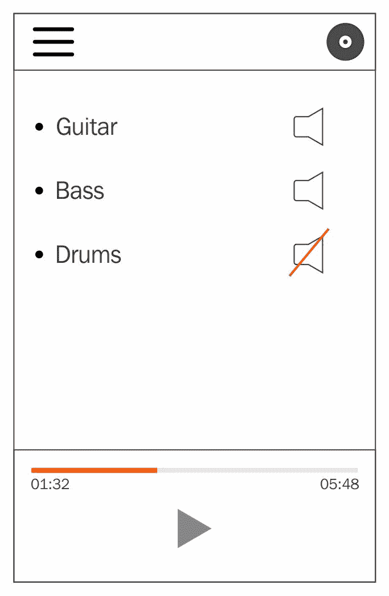

# 使用 @NgModule 进行塑形

在本章中，我们将从一些扎实的项目组织练习开始，为使用 NativeScript for Angular 构建一个惊人的应用程序做好准备。我们希望向您提供一些见解，让您在规划架构时考虑一些重要且强大的概念，以便在考虑可扩展性的同时，铺就一条顺畅的开发体验之路。

将 Angular 与 NativeScript 结合使用提供了大量有用的范例和工具，用于构建和规划您的应用程序。正如常说的那样，权力越大，责任越大，虽然这种技术组合在创建惊人的应用程序方面非常出色，但它们也可以用于创建过度工程化和难以调试的应用程序。让我们用几章的时间来探讨一些可以帮助您避免常见陷阱并真正发挥此堆栈全部潜力的练习。

我们将向您介绍 Angular 的 `@NgModule` 装饰器，我们将专门使用它来帮助将我们的应用程序代码组织成具有明确目的和可移植性的逻辑单元。我们还将介绍一些我们将在我们的架构中使用的一些 Angular 概念，例如可依赖注入的服务。在为构建一个坚实的基础而努力之后，我们将在第三章末快速接近运行我们的应用程序。

在本章中，我们将涵盖以下主题：

+   NativeScript for Angular 是什么？

+   设置您的原生移动应用程序

+   项目组织

+   架构规划

+   `@NgModule` 装饰器

+   `@Injectable` 装饰器

+   将您的应用程序拆分为模块

# 心理准备

在直接进入编码之前，您可以通过规划应用程序所需的各种服务和功能来极大地提高您项目的开发体验。这样做将有助于减少代码重复，构建您的数据流，并为未来的快速功能开发指明方向。

服务是一个通常处理处理和/或为您的应用程序提供数据的类。您对这些服务的使用不需要知道数据的具体来源，只需知道它可以请求服务以实现其目的，并且它就会发生。

# 绘图练习

这是一个很好的练习，可以勾勒出您应用程序视图的一个粗略想法。您可能还不知道它将是什么样子，这没关系；这是一个纯粹的练习，旨在考虑用户期望，作为引导您思考构建满足这些期望所需的各种部分或模块的第一步。它还将帮助您思考应用程序需要管理的各种状态。

以我们即将构建的应用程序为例，**TNSStudio**（**Telerik NativeScript**（**TNS**））*。* 我们将在第二章“功能模块”中深入了解我们的应用程序是什么以及它确切会做什么。



从上到下，我们可以看到一个带有菜单按钮、标志和录音按钮的标题。然后，我们有用户录制轨道的列表，每个轨道都有一个（重新）录音按钮和一个静音或取消静音按钮。

从这个草图出发，我们可以考虑应用可能需要提供的一些服务：

+   播放服务

+   录音服务

+   一个持久存储服务，用于记住用户为每个录制轨道设置的音量级别设置，以及用户是否已认证

我们还可以了解应用可能需要管理的各种状态：

+   用户录制/轨道列表

+   无论应用是否正在播放音频

+   无论应用是否处于录音模式

# 低级思考

提供一些低级服务，提供方便的 API 来访问事物，例如 HTTP 远程请求和/或日志记录，这也是有利的。这样做将允许您创建独特的特性，您或您的团队喜欢在与低级 API 交互时使用。例如，也许您的后端 API 需要在每个请求的特殊认证头之外设置一个唯一的头。创建一个 HTTP 服务的低级包装器将允许您隔离这些独特的特性，并为您的应用提供一个一致的 API 来与之交互，以确保所有 API 调用都在一个地方增强了它们所需的内容。

此外，您的团队可能希望有一种能力将所有日志代码汇总到第三方日志分析器（用于调试或其他性能相关指标）。通过创建围绕某些框架服务的轻量级包装器，将允许您的应用快速适应这些潜在需求。

# 使用@NgModule 模块化

然后，我们可以考虑将这些服务拆分成组织单元或模块。

Angular 为我们提供了`@NgModule`装饰器，它将帮助我们定义这些模块的外观以及它们为我们的应用提供的内容。为了使我们的应用启动/启动时间尽可能快，我们可以以这种方式组织我们的模块，以便在应用启动后可以延迟加载一些服务/功能。通过使用应用启动所需的小部分代码启动一个模块，可以帮助将启动阶段保持最小。

# 我们应用模块分解

这是我们将通过模块分解应用组织的方式：

1.  `CoreModule`：提供低级服务、组件和实用工具，构成一个良好的基础层。例如，与日志记录、对话框、HTTP 和其他各种常用服务的交互。

1.  `AnalyticsModule`******：可能，您可以有一个模块提供各种服务来处理您应用的统计分析。

1.  `PlayerModule`*****：提供我们应用播放音频所需的一切。

1.  `RecorderModule`*****：提供我们应用记录音频所需的一切。

*(*)*这些被认为是**功能模块**。**(**)我们将从本书的示例中省略此模块，但在此处提及以提供上下文。

# 模块优势

使用类似的组织结构为您和您的团队提供了几个有利之处：

+   **高度易用性**：通过设计低级的`CoreModule`，您和您的团队有机会以独特的方式设计如何与常用服务协同工作，不仅限于您现在正在构建的应用程序，而且更多地关注未来。您可以轻松地将`CoreModule`移动到完全不同的应用程序中，并在处理底层服务时获得为该应用程序设计的所有相同独特 API。

+   **将您的应用程序代码视为“功能模块”**：这样做将帮助您专注于应用程序应提供的独特功能，而不仅仅是`CoreModule`提供的功能，同时减少代码的重复。

+   **鼓励并增强快速开发**：通过将常用功能限制在我们的`CoreModule`中，我们减轻了在功能模块中担心这些细节的负担。我们可以简单地注入`CoreModule`提供的服务，并使用这些 API，而无需重复。

+   **可维护性**：在未来，如果由于您的应用程序需要与底层服务协同工作，需要更改某些底层细节，则只需在`CoreModule`服务中更改一次（而不是在应用程序的不同部分中可能存在的冗余代码中），从而减少代码的重复。

+   **性能**：将应用程序拆分为模块将允许您在启动时仅加载所需的模块，然后在以后按需懒加载其他功能。最终，这将导致更快的应用程序启动时间。

# 考虑因素？

您可能会想，为什么不将播放器/录制器模块合并成一个模块呢？

**回答**：我们的应用程序只允许在注册用户认证时进行录制。因此，考虑认证上下文的可能性以及哪些功能仅对认证用户（如果有的话）可访问是有益的。这将使我们能够进一步微调应用程序的加载性能，使其在需要时才进行。

# 开始使用

我们将假设您已经在计算机上正确安装了 NativeScript。如果没有，请按照[`nativescript.org`](https://nativescript.org)上的安装说明进行操作。安装完成后，我们需要使用 shell 提示符创建我们的应用程序框架：

```js
tns create TNSStudio --ng
```

`tns`代表 Telerik NativeScript**。**它是您将用于创建、构建、部署和测试任何 NativeScript 应用程序的主要**命令行用户界面**（CLI）工具。

此命令将创建一个名为`TNSStudio`的新文件夹。其中包含您的主要项目文件夹，包括构建应用程序所需的一切。它将包含与该项目相关的所有内容。在创建项目文件夹后，您还需要做一件事才能拥有一个完全可运行的应用程序。那就是，添加 Android 和/或 iOS 的运行时：

```js
cd TNSStudio
tns platform add ios
tns platform add android
```

如果你使用的是 Macintosh，你可以为 iOS 和 Android 构建。如果你在 Linux 或 Windows 设备上运行，你可以在本地机器上编译的仅限 Android 平台。

# 创建我们的模块外壳

在还没有编写我们服务的实现之前，我们可以通过开始定义它应该提供的内容来使用`NgModule`定义我们的`CoreModule`大致看起来会是什么样子：

让我们创建`app/modules/core/core.module.ts`：

```js
// angular
import { NgModule } from '@angular/core';
@NgModule({})
export class CoreModule { }
```

# 可注入服务

现在，让我们创建我们服务所需的样板代码。注意，这里的 injectable 装饰器是从 Angular 导入的，用于声明我们的服务将通过 Angular 的**依赖注入**（**DI**）系统提供，该系统允许将这些服务注入到可能需要它们的任何类构造函数中。DI 系统提供了一种很好的方式来保证这些服务将被实例化为单例并在我们的应用中共享。还值得注意的是，如果我们不想它们是单例，而是为组件树中的某些分支创建唯一的实例，我们可以将这些服务提供在组件级别上。在这种情况下，尽管如此，我们希望它们被创建为单例。我们将向我们的`CoreModule`添加以下内容：

+   `LogService`：服务用于将所有我们的控制台日志引导通过。

+   `DatabaseService`：用于处理我们应用需要的任何持久数据的服务。对于我们的应用，我们将实现原生移动设备的存储选项，例如应用程序设置，作为一个简单的键/值存储。然而，你在这里可以实现更高级的存储选项，例如通过 Firebase 等远程存储。

创建`app/modules/core/services/log.service.ts`：

```js
// angular
import { Injectable } from '@angular/core';
@Injectable()
export class LogService {
}
```

此外，创建`app/modules/core/services/database.service.ts`：

```js
// angular
import { Injectable } from '@angular/core';
@Injectable()
export class DatabaseService {
}
```

# 一致性和标准

为了保持一致性、减少我们导入的长度以及为更好的可扩展性做准备，让我们也在`app/modules/core/services`中创建一个`index.ts`文件，该文件将导出我们的服务集合以及导出这些服务（按字母顺序排列以保持整洁）：

```js
import { DatabaseService } from './database.service';
import { LogService } from './log.service';

export const PROVIDERS: any[] = [
  DatabaseService,
  LogService
];

export * from './database.service';
export * from './log.service';
```

我们将在整本书中遵循类似的组织模式。

# 完成 CoreModule

我们现在可以修改我们的`CoreModule`以使用我们已创建的内容。我们将借此机会也导入我们的应用将需要用于与其他 NativeScript for Angular 功能协同工作的`NativeScriptModule`，我们希望这些功能对应用来说是全局可访问的。既然我们知道我们希望这些功能是全局的，我们也可以指定它们是导出的，这样当我们导入和使用我们的`CoreModule`时，我们就不必担心在其他地方导入`NativeScriptModule`。以下是我们的`CoreModule`修改应该看起来像什么：

```js
// nativescript
import { NativeScriptModule } from 'nativescript-angular/nativescript.module';
// angular
import { NgModule } from '@angular/core';
// app
import { PROVIDERS } from './services';
@NgModule({
  imports: [
    NativeScriptModule
  ],
  providers: [
    ...PROVIDERS
  ],
  exports: [
    NativeScriptModule
  ]
})
export class CoreModule { }
```

现在我们已经为我们的`CoreModule`建立了一个良好的起点，其详细内容将在接下来的章节中实现。

# 摘要

在本章中，我们为我们的应用程序打下了坚实的基础。你学习了如何从模块的角度思考你的应用程序架构。你还学习了如何利用 Angular 的`@NgModule`装饰器来构建这些模块。最后，我们现在有一个很好的基础架构，可以在此基础上构建我们的应用程序。

既然你已经掌握了一些关键概念，我们现在可以进入我们应用程序的核心部分，即功能模块。让我们深入了解我们应用程序的主要功能，以继续在第二章，“功能模块”中构建我们的服务层。我们将在第三章，“通过组件构建我们的第一个视图”中为我们的应用程序创建一些视图，并在 iOS 和 Android 上运行应用程序。
