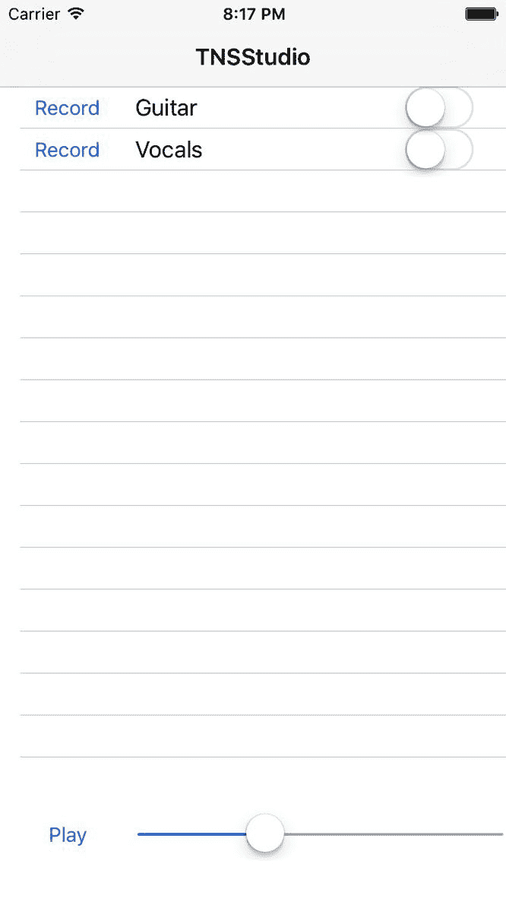
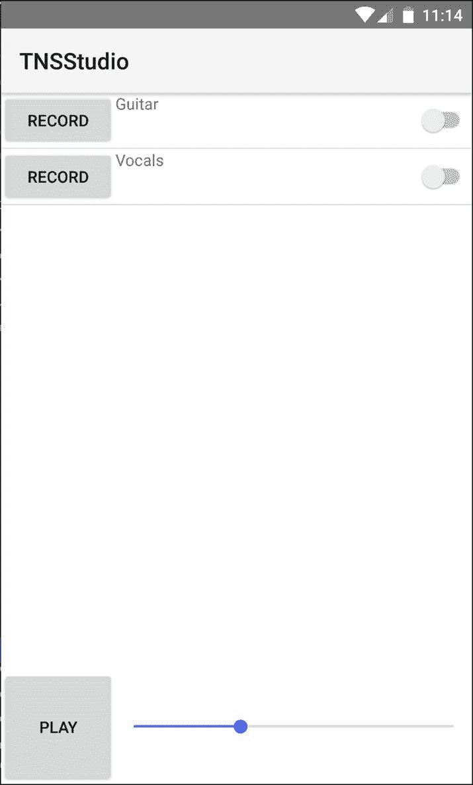

# 通过组件构建我们的第一个视图

我们一直在努力构建第二章中“功能模块”的基础，现在终于可以一窥我们所工作的内容。这全部关于将我们的草图中的第一个视图移动到移动设备屏幕上。

使用 NativeScript 为 Angular 构建视图与网页视图构建没有太大区别。我们将使用 Angular 的组件装饰器来构建我们 UI 需要的各种组件，以实现我们追求的可用性。我们将使用 NativeScript XML 而不是 HTML 标记，因为 NativeScript XML 是一个非常强大、简单且简洁的抽象，它代表了 iOS 和 Android 上的所有原生视图组件。

我们不会涵盖所有可用的组件的好处和类型；但若想了解更多，我们推荐以下任何一本书籍：

+   [`www.packtpub.com/web-development/getting-started-nativescript`](https://www.packtpub.com/web-development/getting-started-nativescript)

+   [`www.manning.com/books/nativescript-in-action`](https://www.manning.com/books/nativescript-in-action)

本章我们将涵盖以下主题：

+   使用组件装饰器来组合我们的视图

+   创建可重用组件

+   使用管道创建自定义视图过滤器

+   在 iOS 和 Android 模拟器上运行应用

# 通过组件构建我们的第一个视图

如果我们查看第一章中的草图，“使用 @NgModule 进入形状”，我们可以看到应用顶部的标题栏，其中将包含我们的应用标题和右侧的记录按钮。我们还可以看到底部的曲目列表和一些播放器控制。我们可以将这些 UI 设计的关键元素分解为基本上三个主要组件。一个组件是由 NativeScript 框架提供的，即 ActionBar，我们将用它来表示顶部标题栏。

NativeScript 提供了许多丰富的视图组件来构建我们的 UI。标记不是 HTML，而是具有 `.html` 扩展名的 XML，这可能会显得有些不寻常。使用 NativeScript for Angular 的 `.html` 扩展名用于 XML 视图模板的原因是自定义渲染器（[`github.com/NativeScript/nativescript-angular`](https://github.com/NativeScript/nativescript-angular)）使用 DOM 适配器来解析视图模板。每个 NativeScript XML 组件代表各自平台上的真实原生视图小部件。

对于其他两个主要组件，我们将使用 Angular 的组件装饰器。在应用开发周期的这个阶段，考虑封装的 UI 功能块非常重要。我们将把我们的曲目列表封装为一个组件，并将播放器控制封装为另一个组件。在这个练习中，我们将从抽象的观点开始，逐步到每个组件的实现细节，采用自外向内的方法来构建我们的 UI。

首先，让我们关注我们的 Angular 应用程序中的根组件，因为它将定义我们第一个视图的基本布局。打开 `app/app.component.html`，清除其内容，并用以下内容替换，以从我们的草图草拟初始 UI 概念：

```js
<ActionBar title="TNSStudio">
</ActionBar>
<GridLayout rows="*, 100" columns="*">
  <track-list row="0" col="0"></track-list>
  <player-controls row="1" col="0"></player-controls>
</GridLayout>
```

我们使用 `ActionBar` 和主要视图的主要布局容器 `GridLayout` 来表达我们的视图。在 NativeScript 中，每个视图以一个布局容器作为根节点（在 `ActionBar` 或 `ScrollView` 之外）开始是很重要的，就像在 HTML 标记中使用 `div` 标签一样。在撰写本文时，NativeScript 提供了六个布局容器：`StackLayout`、`GridLayout`、`FlexboxLayout`、`AbsoluteLayout`、`DockLayout` 和 `WrapLayout`。对于我们的布局，`GridLayout` 会工作得很好。

# 关于 GridLayout 的所有内容

GridLayout 是你在 NativeScript 应用程序中会用到的三种最常用的布局之一（其他的是 FlexboxLayout 和 StackLayout）。这是允许你轻松构建复杂布局的布局。使用 GridLayout 非常类似于 HTML 中的增强表格。你基本上会想要将屏幕区域划分为你需要的部分。它将允许你告诉列（或行）占屏幕剩余宽度（和高度）的百分比。网格支持三种类型的值；**绝对大小**、**剩余空间**的百分比和**已用空间**。

对于**绝对大小**，你只需输入数字。例如，`100`表示它将使用 100 dp 的空间。

**dp** 的另一个名称是 **dip**。它们是相同的。设备无关像素（也称为密度无关像素，DIP 或 DP）是基于计算机坐标系统的物理单位，代表了一个用于应用程序的像素抽象，底层系统将其转换为物理像素。

如果你选择支持的最小 iOS 设备，它的屏幕宽度为 320dp。对于其他设备，例如平板电脑，一些设备的宽度为 1024 dp。因此，100 dp 几乎是 iOS 手机的一个三分之一，而在平板电脑上则是屏幕的十分之一。所以，在使用固定绝对值时，你需要考虑这一点。通常，使用已用空间比使用固定值更好，除非你需要将列限制为特定大小。

要使用基于**剩余空间**的值，即 `***`，`***` 告诉它使用剩余的空间。如果列（或行）设置为 `*`，则空间将分为两个相等的剩余空间。同样，`rows="*,*,*,*,*"` 将指定五个等大小的行。你还可以指定一些事情，例如 `columns="2*,3*,*",`，你将得到三个列；第一个列将是屏幕的六分之二，第二个列将是屏幕的六分之三，最后一个列将是屏幕的六分之一（即 2+3+1=6）。这允许你在使用剩余空间方面有极大的灵活性。

第三种尺寸是**空间使用**。所以，当网格内部的内容被测量后，列将被分配一个大小，这个大小是该列（或行）中使用的最大值。这在您有一个包含数据但不确定大小或您并不真的在乎的网格时非常有用；您只是希望它看起来不错。所以，这是 auto 关键字。我可能有`columns="auto,auto,*,auto"`。这意味着第 1、2 和 4 列将根据这些列中的内容自动调整大小；而第 3 列将使用剩余的空间。这对于布局整个屏幕或屏幕的某些部分非常有用，您希望达到某种特定的外观。

GridLayout 之所以是最佳布局之一，最后一个原因是当您将项目分配给 GridLayout 时，您实际上可以将多个项目分配给相同的行和/或列，并且您可以使用行或列跨度来允许项目使用多个行和/或列。

要分配一个对象，您只需通过`row="0"`和/或`col="0"`进行分配（请注意，这些是基于索引的位置）。您还可以使用`rowSpan`和`colSpan`来使一个元素跨越多个行和/或列。总的来说，GridLayout 是最灵活的布局，允许您轻松创建您在应用程序中需要的几乎任何布局。

# 回到我们的布局

在网格内部，我们声明了一个`track-list`组件来表示我们的轨道列表，该组件将垂直伸缩，占据所有垂直空间，并为`player-controls`留下 100 像素的高度。我们将`track-list`标记为`row="0" col="0"`，因为行和列是基于索引的。网格的灵活（剩余）垂直高度是通过 GridLayout 的`*`在行属性中定义的。网格的底部部分（第 1 行）将代表播放器控制，允许用户播放/暂停混合并移动播放位置。

现在我们已经以相当抽象的方式定义了应用程序的主要视图，让我们深入了解我们需要构建的两个自定义组件，`track-list`和`player-controls`。

# 构建 TrackList 组件

轨道列表应该是所有已记录轨道的列表。列表中的每一行应提供一个单独的记录按钮以重新录制，以及一个名称标签来显示用户提供的标题。它还应提供一个开关，允许用户仅独奏该特定轨道。

我们可以注入`PlayerService`并将其声明为`public`，以便我们可以直接绑定到服务中的轨道集合。

我们也可以模拟一些我们的绑定来启动一些操作，比如`record`动作。目前，我们只允许传入一个轨道，并通过`LogService`打印出该轨道的检查信息。

让我们从创建`app/modules/player/components/track-list/ track-list.component.ts`（与匹配的`.html`模板）开始：

```js
// angular
import { Component, Input } from '@angular/core';

// app
import { ITrack } from '../../../core/models';
import { LogService } from '../../../core/services';
import { PlayerService } from '../../services/player.service';

@Component({
 moduleId: module.id,
 selector: 'track-list',
 templateUrl: 'track-list.component.html'
})
export class TrackListComponent {

 constructor(
   private logService: LogService,
   public playerService: PlayerService
 ) { }

 public record(track: ITrack) {
   this.logService.inspect(track);
 }
}
```

对于视图模板 `track-list.component.html`，我们将使用强大的 `ListView` 组件。此小部件代表 iOS 上的原生 UITableView ([`developer.apple.com/reference/uikit/uitableview`](https://developer.apple.com/reference/uikit/uitableview)) 和 Android 上的原生 ListView ([`developer.android.com/guide/topics/ui/layout/listview.html`](https://developer.android.com/guide/topics/ui/layout/listview.html))，提供具有复用行的 60 fps 虚拟滚动。在移动设备上的性能无与伦比：

```js
<ListView [items]="playerService.tracks">
  <ng-template let-track="item">
    <GridLayout rows="auto" columns="75,*,100">
      <Button text="Record" (tap)="record(track)" 
          row="0" col="0"></Button>
      <Label [text]="track.name" row="0" col="1"></Label>
      <Switch [checked]="track.solo" row="0" col="2">
      </Switch>
    </GridLayout>
  </ng-template>
</ListView>
```

这个视图模板中有很多内容，让我们稍微检查一下。

由于我们在组件构造函数中注入 `playerService` 时将其设置为 `public`，我们可以通过 `ListView` 项的属性直接绑定到其轨道，使用标准的 Angular 绑定语法表示为 `[items]`。这将是我们列表迭代的集合。

`template` 节点内部允许我们封装列表每一行布局的方式。它还允许我们声明一个变量名（`let-track`），用作我们的迭代器引用。

我们从 GridLayout 开始，因为每一行将包含一个记录按钮（允许重新录制轨道），我们将为其分配宽度 75。此按钮将绑定到 `tap` 事件，如果用户已认证，则将激活一个录制会话。

然后，我们将有一个标签来显示用户提供的轨道名称，我们将将其分配为 `*` 以确保它扩展以填充我们左侧和右侧列之间的水平空间。我们使用文本属性将其绑定到 `track.name`。

最后，我们将使用 `switch` 允许用户切换混音中的轨道独奏。这提供了 `checked` 属性，使我们能够将 `track.solo` 属性绑定到它。

# 构建一个对话框包装服务以提示用户

如果您还记得 第一章 中 *使用 @NgModule 进入形状*，录制是一个仅应提供给认证用户的功能。因此，当用户在每条轨道上点击记录按钮时，我们将想要提示用户登录对话框。如果他们已经登录，我们将想要提示他们确认是否想要重新录制轨道，以确保良好的用户体验。

我们可以直接在组件中处理这个对话框，通过导入提供跨平台一致 API 的 NativeScript 对话框服务。NativeScript 框架的 `ui/dialogs` 模块（[`docs.nativescript.org/ui/dialogs`](https://docs.nativescript.org/ui/dialogs)）是一个非常方便的服务，允许你创建原生警报、确认、提示、操作和基本的登录对话框。然而，我们可能希望在将来为 iOS 和 Android 提供定制的原生对话框实现，以获得更好的 UX 体验。有几个插件提供了非常优雅的原生对话框，例如，[`github.com/NathanWalker/nativescript-fancyalert`](https://github.com/NathanWalker/nativescript-fancyalert)。

为了准备这个丰富的用户体验，让我们构建一个快速的 Angular 服务，我们可以注入并在任何地方使用，这将允许我们轻松地实现这些细微之处。

由于这应该被视为我们应用的 `核心` 服务，让我们创建 `app/modules/core/services/dialog.service.ts`：

```js
// angular
import { Injectable } from '@angular/core';

// nativescript
import * as dialogs from 'ui/dialogs';

@Injectable()
export class DialogService {

  public alert(msg: string) {
    return dialogs.alert(msg);
  }

  public confirm(msg: string) {
    return dialogs.confirm(msg);
  }

  public prompt(msg: string, defaultText?: string) {
    return dialogs.prompt(msg, defaultText);
  }

  public login(msg: string, userName?: string, password?: string) {
    return dialogs.login(msg, userName, password);
  }

  public action(msg: string, cancelButtonText?: string, 
    actions?: string[]) {
    return dialogs.action(msg, cancelButtonText, actions);
  }
}
```

初看之下，这可能会显得非常浪费！为什么创建一个提供与 NativeScript 框架中已存在的服务完全相同 API 的包装器？

是的，确实如此，在这个阶段看起来是这样的。然而，我们正在为未来的灵活性及处理这些对话框的能力做准备，以实现卓越。请继续关注，可能会有关于这个有趣且独特的整合润色的额外章节。

在我们继续使用此服务之前，我们需要确保它被添加到我们的核心服务 `PROVIDERS` 集合中。这将确保 Angular 的 DI 系统知道我们的新服务是一个有效的令牌，可用于注入。

打开 `app/modules/core/services/index.ts` 并按照以下方式修改：

```js
import { AuthService } from './auth.service';
import { DatabaseService } from './database.service';
import { DialogService } from './dialog.service';
import { LogService } from './log.service';

export const PROVIDERS: any[] = [
 AuthService,
 DatabaseService,
 DialogService,
 LogService
];

export * from './auth.service';
export * from './database.service';
export * from './dialog.service';
export * from './log.service';
```

我们现在已准备好注入和使用我们的新服务。

# 将 DialogService 集成到我们的组件中

让我们打开 `track-list.component.ts` 并注入 `DialogService` 以在我们的记录方法中使用。我们还需要确定用户是否已登录，以便有条件地显示登录对话框或确认提示，所以让我们也注入 `AuthService`：

```js
// angular
import { Component, Input } from '@angular/core';

// app
import { ITrack } from '../../../core/models';
import { AuthService, LogService, DialogService } from '../../../core/services';
import { PlayerService } from '../../services/player.service';

@Component({
  moduleId: module.id,
  selector: 'track-list',
  templateUrl: 'track-list.component.html'
})
export class TrackListComponent {

 constructor(
   private authService: AuthService,
   private logService: LogService,
   private dialogService: DialogService,
   public playerService: PlayerService
 ) { }

 public record(track: ITrack, usernameAttempt?: string) {
   if (AuthService.CURRENT_USER) {
     this.dialogService.confirm(
       'Are you sure you want to re-record this track?'
     ).then((ok) => {
       if (ok) this._navToRecord(track);
     });
   } else {
     this.authService.promptLogin(
       'Provide an email and password to record.',
       usernameAttempt
     ).then(
       this._navToRecord.bind(this, track), 
       (usernameAttempt) => {
         // initiate sequence again
         this.record(track, usernameAttempt);
       }
     ); 
    }
  }

  private _navToRecord(track: ITrack) {
    // TODO: navigate to record screen
    this.logService.debug('yes, re-record', track);
  }
}
```

记录方法现在首先检查用户是否通过静态 `AuthService.CURRENT_USER` 引用进行认证，该引用是在 `AuthService` 首次通过 Angular 的依赖注入在应用启动时设置的（参见第二章，*功能模块*）。

如果用户已认证，我们将展示一个确认对话框以确保操作是故意的。

如果用户未认证，我们希望提示用户登录。为了减少本书的负担，我们假设用户已经通过后端 API 注册，因此我们不会要求用户注册。

我们需要在`AuthService`中实现`promptLogin`方法以持久化用户的登录凭据，这样每次他们返回应用时，它将自动登录。记录方法现在提供了一个额外的可选参数`usernameAttempt`，这在用户在输入验证错误后重新初始化登录序列时重新填充登录提示的用户名字段时将非常有用。我们在这里不会进行彻底的用户输入验证，但我们可以至少进行轻量级的有效电子邮件检查。

在你自己的应用中，你可能需要进行更多的用户输入验证。

为了保持关注点的清晰分离，打开`app/modules/core/services/auth.service.ts`以实现`promptLogin`。以下是整个服务及其修改内容：

```js
// angular
import { Injectable } from '@angular/core';

// lib
import { BehaviorSubject } from 'rxjs/BehaviorSubject';

// app
import { DatabaseService } from './database.service';
import { DialogService } from './dialog.service';
import { LogService } from './log.service';

@Injectable()
export class AuthService {

 // access our current user from anywhere
 public static CURRENT_USER: any;

 // subscribe to authenticated state changes
 public authenticated$: BehaviorSubject<boolean> = 
   new BehaviorSubject(false);

 constructor(
 private databaseService: DatabaseService,
 private dialogService: DialogService,
 private logService: LogService
 ) {
   this._init();
 } 

 public promptLogin(msg: string, username: string = '')
   : Promise<any> {
   return new Promise((resolve, reject) => {
     this.dialogService.login(msg, username, '')
       .then((input) => {
         if (input.result) { // result = false when canceled
           if (input.userName && 
               input.userName.indexOf('@') > -1) {
               if (input.password) {
                 // persist user credentials
                 this._saveUser(
                   input.userName, input.password
                 );
                 resolve();
               } else {
                 this.dialogService.alert(
                   'You must provide a password.'
                 ).then(reject.bind(this, input.userName));
               }
           } else {
             // reject, passing userName back
             this.dialogService.alert(
               'You must provide a valid email address.'
             ).then(reject.bind(this, input.userName));
           }
         }
       });
     });
 }

 private _saveUser(username: string, password: string) {
   AuthService.CURRENT_USER = { username, password };
   this.databaseService.setItem(
     DatabaseService.KEYS.currentUser,
     AuthService.CURRENT_USER
   );
   this._notifyState(true);
 }

  private _init() {
    AuthService.CURRENT_USER =
      this.databaseService
      .getItem(DatabaseService.KEYS.currentUser);
    this.logService.debug(
      `Current user: `, AuthService.CURRENT_USER
    );
    this._notifyState(!!AuthService.CURRENT_USER);
  }

  private _notifyState(auth: boolean) {
    this.authenticated$.next(auth);
  }
}
```

我们使用`dialogService.login`方法打开一个原生登录对话框，允许用户输入用户名和密码。一旦他们选择确定，我们将对输入进行最小验证，如果成功，则通过`DatabaseService`持久化用户名和密码。否则，我们简单地提醒用户错误，并拒绝我们的承诺，传递他们输入的用户名。这允许我们通过重新显示带有失败用户名的登录对话框来帮助用户，使他们更容易进行更正。

在完成这些服务级别的细节后，`track-list`组件看起来相当不错。然而，在我们处理这个组件的时候，我们应该采取一个额外的步骤。如果你还记得，我们的 TrackModel 包含一个顺序属性，这将帮助用户以任何他们希望的方式方便地对轨道进行排序。

# 创建 Angular 管道 - OrderBy

Angular 提供了 Pipe 装饰器，以便轻松创建视图过滤器。让我们首先展示我们如何在视图中使用它。你可以看到它看起来非常类似于 Unix shell 脚本中使用的命令行管道；因此，它被命名为：`Pipe`：

```js
<ListView [items]="playerService.tracks | orderBy: 'order'">
```

这将获取`playerService.tracks`集合，并确保它通过每个`TrackModel`的`order`属性进行排序，以便在视图显示中使用。

由于我们可能希望在我们的应用视图中任何地方使用这个管道，让我们将其作为`CoreModule`的一部分添加。创建`app/modules/core/pipes/order-by.pipe.ts`，以下是我们将如何实现`OrderByPipe`：

```js
import { Pipe } from '@angular/core';

@Pipe({
 name: 'orderBy'
})
export class OrderByPipe {

 // Comparator method
 static comparator(a: any, b: any): number {
   if (a === null || typeof a === 'undefined') a = 0;
   if (b === null || typeof b === 'undefined') b = 0;

   if ((isNaN(parseFloat(a)) || !isFinite(a)) || 
       (isNaN(parseFloat(b)) || !isFinite(b))) {
      // lowercase strings
      if (a.toLowerCase() < b.toLowerCase()) return -1;
      if (a.toLowerCase() > b.toLowerCase()) return 1;
   } else {
     // ensure number values
     if (parseFloat(a) < parseFloat(b)) return -1;
     if (parseFloat(a) > parseFloat(b)) return 1;
   }

   return 0; // values are equal
 }

 // Actual value transformation
 transform(value: Array<any>, property: string): any {
   return value.sort(function (a: any, b: any) {
     let aValue = a[property];
     let bValue = b[property];
     let comparison = OrderByPipe
                      .comparator(aValue, bValue);
     return comparison;
   });
 } 
}
```

我们不会过多地详细介绍这里发生的事情，因为这在大 JavaScript 中排序集合是很典型的。为了完成这个任务，确保`app/modules/core/pipes/index.ts`遵循我们的标准约定：

```js
import { OrderByPipe } from './order-by.pipe';

export const PIPES: any[] = [
 OrderByPipe
];
```

最后，导入前面的集合以与`app/modules/core/core.module.ts`一起使用。以下是包含所有修改的完整文件：

```js
// nativescript
import { NativeScriptModule } from 'nativescript-angular/nativescript.module'; 

// angular
import { NgModule } from '@angular/core';

// app
import { PIPES } from './pipes';
import { PROVIDERS } from './services';

@NgModule({
 imports: [
   NativeScriptModule
 ],
 declarations: [
   ...PIPES
 ],
 providers: [
   ...PROVIDERS
 ],
 exports: [
   NativeScriptModule,
   ...PIPES
 ]
})
export class CoreModule { }
```

由于管道是视图级别的实现，我们确保它们作为`exports`集合的一部分添加，以便其他模块可以使用它们。

现在，如果我们在这个时候运行我们的应用，你会注意到我们用于`track-list.component.html`视图模板的`OrderBy`管道将**不会**工作！

Angular 模块在彼此隔离的情况下编译。

这是一个需要理解的关键点：Angular 将`PlayerModule`编译为声明`TrackListComponent`的自定义模块。由于我们已将`OrderByPipe`作为`CoreModule`的一部分进行声明，而`PlayerModule`目前没有对`CoreModule`的依赖，因此`TrackListComponent`在编译时对`OrderByPipe`没有任何认识！你最终会在控制台看到以下错误生成：

```js
CONSOLE ERROR file:///app/tns_modules/tns-core-modules/trace/trace.js:160:30: ns-renderer: ERROR BOOTSTRAPPING ANGULAR
CONSOLE ERROR file:///app/tns_modules/tns-core-modules/trace/trace.js:160:30: ns-renderer: Template parse errors:
 The pipe 'orderBy' could not be found ("
 </ListView>-->

 <ListView [ERROR ->][items]="playerService.tracks | orderBy: 'order'">
   <ng-template let-track="item">
     <GridLayout rows"): TrackListComponent@10:10
```

为了解决这个问题，我们想要确保`PlayerModule`了解来自`CoreModule`的视图相关声明（如管道或其他组件），通过确保`CoreModule`被添加到`PlayerModule`的`imports`集合中。这也为我们提供了一项额外的便利。如果你注意到，`CoreModule`指定了`NativeScriptModule`作为导出，这意味着任何导入`CoreModule`的模块都会自动获得`NativeScriptModule`。以下是允许一切协同工作的`PlayerModule`的最终修改：

```js
// angular
import { NgModule } from '@angular/core';

// app
import { CoreModule } from '../core/core.module';
import { COMPONENTS } from './components';
import { PROVIDERS } from './services';

@NgModule({
 imports: [
   CoreModule 
 ],
 providers: [...PROVIDERS],
 declarations: [...COMPONENTS],
 exports: [...COMPONENTS]
})
export class PlayerModule { }
```

我们现在可以继续到`player-controls`组件。

# 构建`PlayerControls`组件

我们的控制器应该包含一个用于整个混音的播放/暂停切换按钮。它还应提供一个滑动控制，以便我们可以跳过播放和倒带。

让我们创建`app/modules/player/components/player-controls/player-controls.component.html`（与匹配的`.ts`文件）：

```js
<GridLayout rows="100" columns="75,*" row="1" col="0">
  <Button [text]="playStatus" (tap)="togglePlay()" row="0" col="0"></Button>
  <Slider minValue="0" [maxValue]="duration" 
          [value]="currentTime" row="0" col="1"></Slider>
</GridLayout>
```

我们从一个具有显式 100 高度的单一行`GridLayout`开始。然后，第一列将被限制为 75 宽，以容纳我们的播放/暂停切换按钮。然后，第二列将占据剩余的水平空间，用`*`表示，与`Slider`组件一起。这个组件由 NativeScript 框架提供，允许我们将`maxValue`属性绑定到混音的总时长，以及播放的`currentTime`。

然后，对于`player-controls.component.ts`：

```js
// angular
import { Component, Input } from '@angular/core';

// app
import { ITrack } from '../../../core/models';
import { LogService } from '../../../core/services';
import { PlayerService } from '../../services';

@Component({
 moduleId: module.id,
 selector: 'player-controls',
 templateUrl: 'player-controls.component.html'
})
export class PlayerControlsComponent {

 public currentTime: number = 0; 
 public duration: number = 0; 
 public playStatus: string = 'Play';

 constructor(
   private logService: LogService,
   private playerService: PlayerService
 ) { }

 public togglePlay() {
   let playing = !this.playerService.playing;
   this.playerService.playing = playing;
   this.playStatus = playing ? 'Stop' : 'Play';
 }

}
```

目前，我们将`currentTime`和`duration`直接放置在组件上，然而，我们将在稍后将其重构到`PlayerService`中。最终，当我们实现后续章节中的插件来处理我们的音频时，与播放器相关的所有状态都将来自`PlayerService`。`togglePlay`方法也只是一个通用行为的占位符，切换按钮的文本为播放或停止。

# 快速预览

在这一点上，我们将快速查看我们迄今为止所构建的内容。目前，我们的播放器服务返回一个空的曲目列表。为了看到结果，我们应该向其中添加一些占位符数据。例如，在`PlayerService`中，我们可以添加：

```js
constructor() {
  this.tracks = [
    {name: "Guitar"},
    {name: "Vocals"},
  ];
}
```

如果它看起来不漂亮，请不要感到惊讶；我们将在下一章中介绍这一点。我们也不会介绍所有可用的运行时命令；我们将在第六章“在 iOS 和 Android 上运行应用”中详细介绍。

# iOS 上的预览

你必须在一台安装了 XCode 的 Mac 上预览 iOS 应用：

```js
tns run ios --emulator
```

这应该启动 iOS 模拟器，你应该看到以下截图：



# 安卓预览

你需要在安卓 SDK 和工具安装完毕后，才能在安卓模拟器上预览：

```js
tns run android --emulator
```

这应该会启动一个安卓模拟器，你应该会看到以下截图：



恭喜！我们有了第一个视图。嘿，没人说过它现在就会很漂亮！

# 摘要

我们已经开始构建第二部分，其中我们布置了根组件`app.component.html`以容纳我们的主要视图，在那里你学习了`GridLayout`，一个非常有用的布局容器。

Angular 的组件装饰器使我们能够轻松构建`TrackListComponent`和`PlayerControlsComponent`。我们还学会了如何构建一个 Angular `Pipe`来帮助我们的视图保持跟踪列表的顺序。Angular 的`NgModule`教导我们，我们需要确保任何组件所需的任何与视图相关的声明都正确导入。这种 Angular 设计模式有助于保持模块隔离，作为可以相互导入模块的独立代码单元。

我们还增强了一部分服务，以支持我们希望与组件一起使用的某些可用性。

最后，我们终于能够快速瞥一眼我们所构建的内容。尽管目前看起来并不美观，但我们已经能看到事物正在逐渐融合。

在第四章《使用 CSS 美化视图》中，你将学习如何使用 CSS 来从我们的视图中提取美观。
