# 第四章：使用 CSS 更美观的视图

NativeScript 带来的众多关键优势之一是能够使用标准 CSS 来样式化原生视图组件。你会发现对许多常见和高级属性都有很好的支持；然而，有些属性没有直接的关联，而有些则是完全独特的，仅适用于原生视图布局。

让我们看看如何使用几个 CSS 类将我们的第一个视图转变为非常棒的东西。你还将学习如何利用 NativeScript 的核心主题提供一致的样式框架来构建。

在本章中，我们将涵盖以下主题：

+   使用 CSS 来样式化视图

+   理解典型网页样式和原生样式之间的一些差异

+   通过平台特定文件解锁 NativeScript 的功能

+   学习如何使用 nativescript-theme-core 样式框架插件

+   调整 iOS 和 Android 上的状态栏背景色和文字颜色

# 是时候变得优雅了

让我们从查看`App`目录中的`app.css`文件开始，这是我们的应用程序的主要文件：

```js
/*
In NativeScript, the app.css file is where you place CSS rules that
you would like to apply to your 

entire application. Check out
http://docs.nativescript.org/ui/styling for a full list of the CSS
selectors and 

properties you can use to style UI components.

/*
For example, the following CSS rule changes the font size 

of all UI
components that have the btn class name.
*/
.btn {
  font-size: 18;
}

/*
In many cases you may want to use the NativeScript core theme instead
of writing your own CSS rules. For a full list 

of class names in the theme
refer to http://docs.nativescript.org/ui/theme.
*/
@import 'nativescript-

theme-core/css/core.light.css';
```

默认情况下，`--ng`模板暗示了你可以选择两种选项来构建你的 CSS：

+   编写你自己的自定义类

+   使用 nativescript-theme-core 样式框架插件作为基础

让我们暂时探索第一个选项。在`.btn`类之后添加以下内容：

```js
.btn {
  font-size: 18;
}

.row {
 padding: 15 5;
 background-color: yellow;
}

.row .title {
 font-size: 25;
 color: #444;
 font-weight: bold;
}

Button {
 background-color: red;
 color: white;
}
```

从这个简单的例子中，你可以立即发现许多有趣的事情：

+   填充不使用你熟悉的网页样式的`px`后缀。

    +   别担心，使用`px`后缀不会伤害你。

    +   从 NativeScript 3.0 版本开始，支持发布单位，因此你可以使用 dp（设备无关像素）或`px`（设备像素）。

        如果没有指定单位，将使用 dp。对于宽度/高度和边距，你还可以在 CSS 中使用百分比作为单位类型。

+   支持各种常见属性（如`padding`、`font size`、`font weight`、`color`、`background color`等）。此外，缩写边距/填充也适用，即`padding: 15 5`。

+   你可以使用标准的十六进制颜色名称，如黄色，或缩写代码，如#444。

+   CSS 作用域的工作方式正如你所期望的那样，即`.row .title { ...}`。

+   元素/标签/组件名称可以全局样式化。

尽管你可以通过标签/组件名称进行样式化，但这样做并不建议。我们将向您展示一些您需要了解的针对原生设备的有趣考虑因素。

现在，让我们打开`app/modules/player/components/track-list/track-list.component.html`，并将`row`和`title`类添加到我们的模板中：

```js
<ListView [items]="playerService.tracks | orderBy: 'order'">
  <template let-track="item">

<GridLayout rows="auto" columns="100,*,100" class="row">
      <Button text="Record" (tap)

="record(track)" row="0" col="0"></Button>
      <Label [text]="track.name" row="0" col="1" 

class="title"></Label>
      <Switch row="0" col="2"></Switch>

</GridLayout>
  </template>
</ListView>
```

让我们快速预览一下使用`tns run ios --emulator`会发生什么，你应该会看到以下内容：

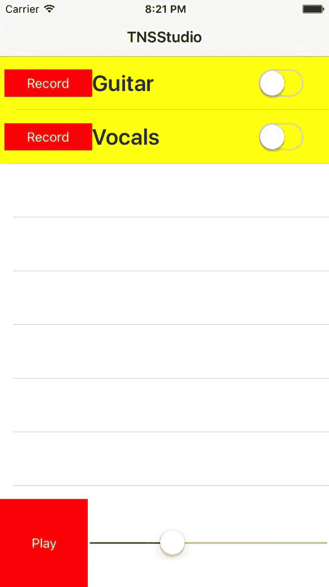

如果你使用`tns run android --emulator`在 Android 上查看，你应该会看到以下内容：

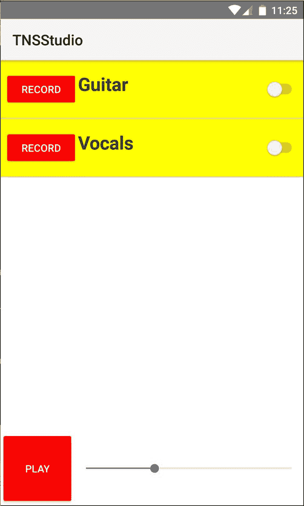

我们可以看到，在两个平台上，这些样式都得到了一致的应用，同时仍然保持了每个平台独特的特性。例如，iOS 在按钮上保持了扁平化设计美学，开关提供了熟悉的 iOS 感觉。相比之下，在 Android 上，按钮保留了微妙的默认阴影和全大写文本，以及熟悉的 Android 开关。

然而，有一些微妙（可能是不理想的）差异，这些差异需要理解和解决。从这个例子中，我们可能注意到以下几点：

1.  Android 的按钮左右边距比 iOS 宽。

1.  行标题的对齐不一致。在 iOS 上，标签默认垂直居中；然而，在 Android 上它对齐到顶部。

1.  如果你点击记录按钮来查看登录对话框，你也会注意到一些相当不理想的地方：

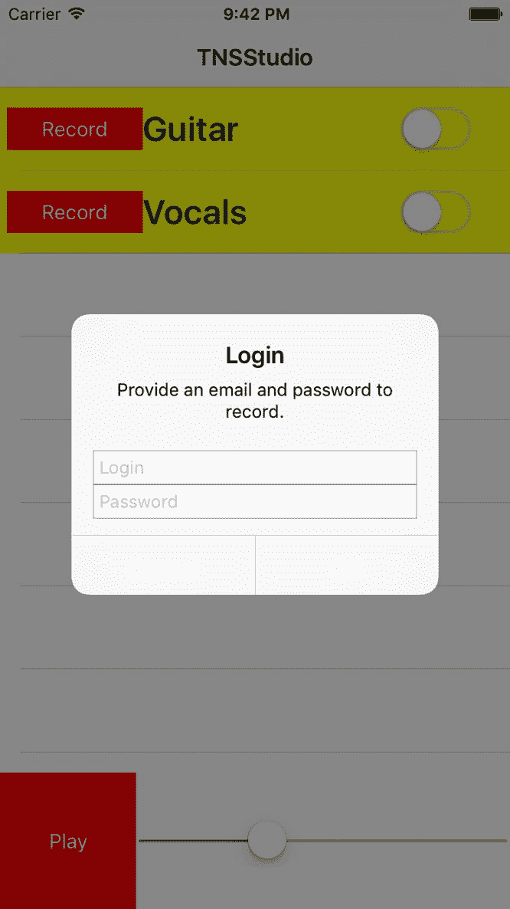

项目#3 可能是最令人惊讶和意外的。它体现了一个主要的原因，即不建议全局样式化 Element/Tag/Component 名称。由于原生对话框默认使用`Buttons`，我们添加的一些全局`Button`样式正在渗入对话框（特别是`color: white`）。为了解决这个问题，我们可以确保我们正确地限制了所有组件名称的作用域：

```js
.row Button {
 background-color: red;
 color: white;
} 
```

或者更好的是，只需在你的按钮上使用类名：

```js
.row .btn {
 background-color: red;
 color: white;
} <Button text="Record" (tap)="record(track)" row="0" col="0" 

class="btn"></Button>
```

要修复项目#2（行标题对齐），我们可以引入 NativeScript 的一个特殊功能：能够根据你运行的平台构建特定平台的文件。让我们创建一个新文件，`app/common.css`，并将`app/app.css`中的所有内容重构到这个新文件中。然后，让我们创建另外两个新文件，`app/app.ios.css`和`app/app.android.css`（然后删除`app.css`，因为它将不再需要），它们的内容如下：

```js
@import './common.css';
```

这将确保我们的共享样式被导入 iOS 和 Android CSS 中。现在，我们有了应用特定平台样式修复的方法！

让我们通过修改`app/app.android.css`来解决这个问题垂直对齐问题：

```js
@import './common.css';

.row .title {
  vertical-align: center;
}
```

这只为 Android 添加了额外的样式调整，现在我们有了这样的效果：

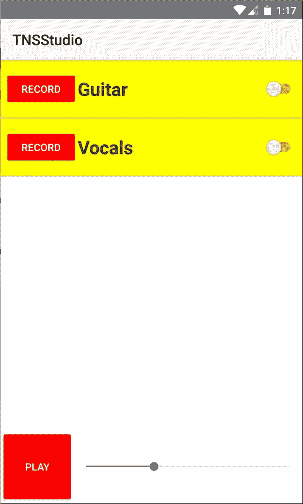

太好了，好多了。

要修复#1，如果我们想让两个平台上的按钮具有相同的边距，我们需要应用更多针对特定平台的调整。

到目前为止，你可能想知道你需要自己调整多少来处理一些这些特定平台的问题。你应该很高兴地知道这不是一个详尽的列表，但充满活力的 NativeScript 社区共同努力创造了一些更好的东西，一个类似于 bootstrap 的核心主题，它提供了许多这些微妙的调整，例如标签的垂直对齐以及许多其他微妙的调整。

# 欢迎使用 NativeScript 核心主题

所有新的 NativeScript 项目都自带核心主题安装，并且可以直接使用。如前所述，你提供了两种你可以用来设计应用程序的选项。前面的部分概述了在从头开始设计应用程序时可能会遇到的一些事情。

让我们来看看选项#2：使用`nativescript-theme-core`插件。这个主题是现成的，旨在扩展和构建在它之上。它提供了一系列的实用类，用于间距、着色、布局、着色皮肤等等。由于其坚实的基础和惊人的灵活性，我们将在这个主题之上构建我们的应用程序样式。

值得注意的是，`nativescript-theme-`前缀是有意为之，作为标准，它有助于在`npm`上提供一个共同的搜索前缀，以找到所有 NativeScript 主题。如果你设计和发布自己的自定义 NativeScript 主题，建议使用相同的前缀。

让我们移除我们的自定义样式，只保留导入的核心主题。然而，我们不会使用默认的浅色皮肤，而是会使用深色皮肤。这就是我们的`app/common.css`文件现在应该看起来像这样：

```js
@import 'nativescript-theme-core/css/core.dark.css';
```

现在，我们想要开始用核心主题提供的某些类来分类我们的组件。你可以在这里学习类列表的完整列表：[`docs.nativescript.org/ui/theme`](https://docs.nativescript.org/ui/theme)。

从`app/app.component.html`开始，让我们添加以下类：

```js
<ActionBar title="TNSStudio" class="action-bar">
</ActionBar>
<GridLayout 

rows="*, 100" columns="*" class="page">
  <track-list row="0" col="0"></track-list>
  <player-controls row="1" col="0"></player-controls>
</GridLayout>
```

`action-bar`类确保我们的皮肤适当地应用到应用程序的标题上，同时为 iOS 和 Android 上的`ActionBar`提供细微的一致性调整。

`page`类确保我们的皮肤应用到整个页面上。在任何一个组件视图中，这个类都应应用到根布局容器上。

经过这两个调整，我们现在应该在 iOS 上看到以下内容：

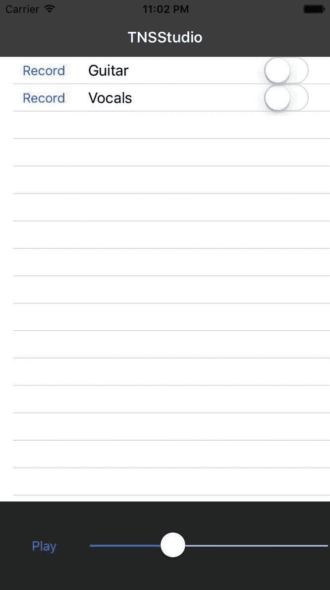

这是 Android 上的样子：

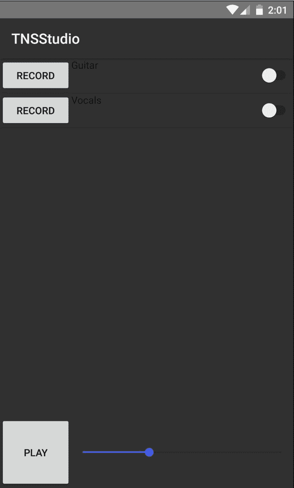

你会注意到在`ListView`上 iOS 和 Android 之间还有一个差异。iOS 默认有一个白色背景，而 Android 看起来有一个透明的背景，允许皮肤页面的颜色显示出来。让我们继续用核心主题的更多类来分类我们的组件，这些类有助于解决这些细微差别。打开`app/modules/player/components/track-list/track-list.component.html`并添加以下类：

```js
<ListView [items]="playerService.tracks | orderBy: 'order'" class="list-group">
  <ng-

template let-track="item">
    <GridLayout rows="auto" columns="100,*,100" class="list-group-

item">
      <Button text="Record" (tap)="record(track)" row="0" col="0" class="c-

ruby"></Button>
      <Label [text]="track.name" row="0" col="1" 

class="h2"></Label>
      <Switch row="0" col="2" 

class="switch"></Switch>
    </GridLayout>
  </ng-template>
</ListView>
```

父级`list-group`类有助于将所有内容正确地缩小到`list-group-item`。然后，我们添加`c-ruby`来在我们的记录按钮上洒一些红色。有几个着色颜色提供了姓氏：`c-sky`、`c-aqua`、`c-charcoal`、`c-purple`等等。在这里查看所有这些：[`docs.nativescript.org/ui/theme#color-schemes`](https://docs.nativescript.org/ui/theme#color-schemes)。

然后，我们将`h2`添加到标签中，以稍微增加其字体大小。最后，`switch`类有助于标准化音轨独奏开关。

现在我们已经在 iOS 上有了这个：

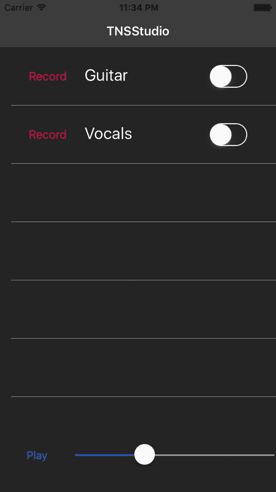

这是 Android 上的样子：

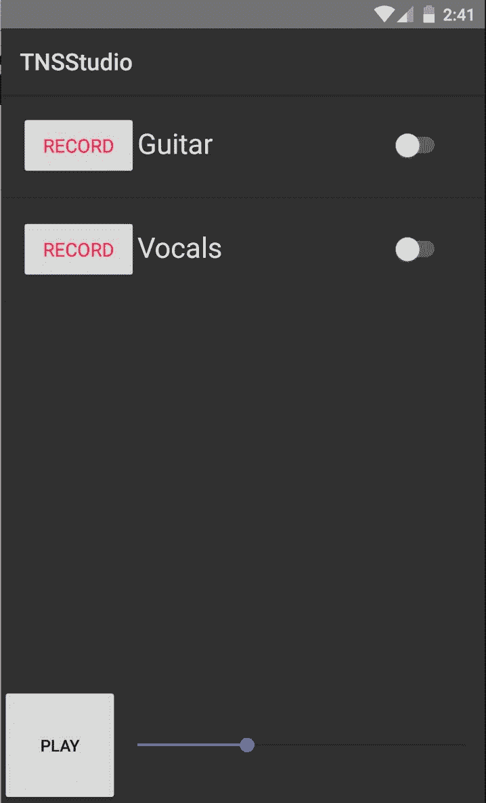

让我们继续前进到最后一个组件（目前是这样），`player-controls`。打开`app/modules/player/components/player-controls/player-controls.component.html`并添加以下内容：

```js
<GridLayout rows="100" columns="100,*" row="1" col="0" class="p-x-10">
  <Button 

[text]="playStatus" (tap)="togglePlay()" row="0" col="0" class="btn btn-primary w-

100"></Button>
  <Slider minValue="0" [maxValue]="duration" [value]="currentTime" row="0" col="1" 

class="slider"></Slider>
</GridLayout>
```

首先，我们给左/右容器（`GridLayout`）添加`p-x-10`类以添加`10`的内边距。然后，我们将`btn btn-primary w-100`添加到播放/暂停按钮上。`w-100`类将按钮的宽度设置为固定值`100`。然后，我们将`slider`类添加到滑块上。

现在，iOS 上的事情开始有形了：

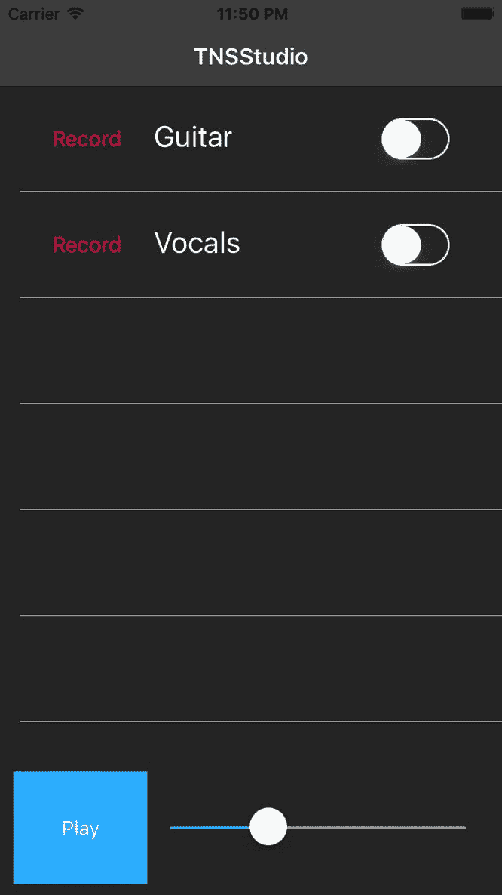

它在 Android 上的外观如下：

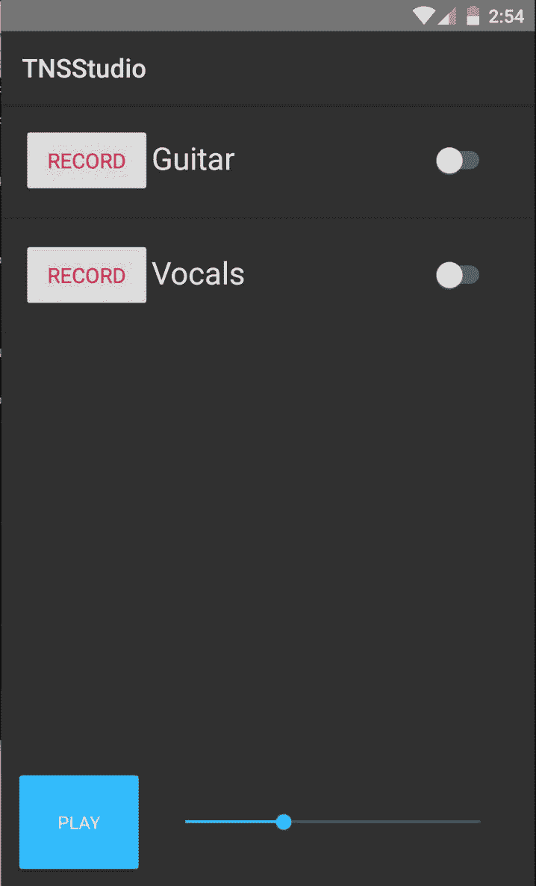

哇，好吧，现在，一切开始成形。我们将继续在前进的过程中进一步完善细节，但这个练习已经展示了你如何快速通过使用大量内置类来调整核心主题的风格。

# 调整 iOS 和 Android 的状态栏背景色和文本色

你可能之前已经注意到，在 iOS 上，状态栏文本是黑色，与我们的深色皮肤不太搭配。此外，我们可能还想改变 Android 的状态栏色调颜色。NativeScript 提供了对原生 API 的直接访问，因此我们可以轻松地将这些更改为我们想要的任何颜色。这两个平台处理方式不同，因此我们可以有条件地更改每个平台的状态栏。

打开`app/app.component.ts`并添加以下内容：

```js
// angular
import { Component } from '@angular/core';

// nativescript
import { isIOS } from 'platform';
import { topmost } from 'ui/frame';
import * as app from 'application';

// app
import { AuthService } from 

'./modules/core/services';

declare var android;

@Component({
  moduleId: 

module.id,
  selector: 'my-app',
  templateUrl: 'app.component.html',
})
export class AppComponent {

  constructor(
    private authService: AuthService
  ) { 
    if (isIOS) {
 /**
 * 0 = black text
 * 1 = white text
 */
 topmost().ios.controller.navigationBar.barStyle = 1;
 } else {
 // adjust text to darker color
 let decorView = 

app.android.startActivity.getWindow()
 .getDecorView();
 decorView.setSystemUiVisibility(android.view.View.SYSTEM_UI_FLAG_LIGHT_STATUS_BAR);
 }
  }
}
```

这将使 iOS 状态栏文本变为白色：

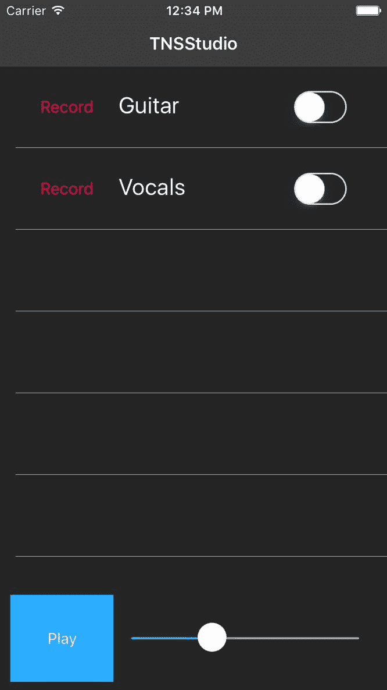

条件语句的第二部分调整 Android 以在状态栏中使用深色文本：

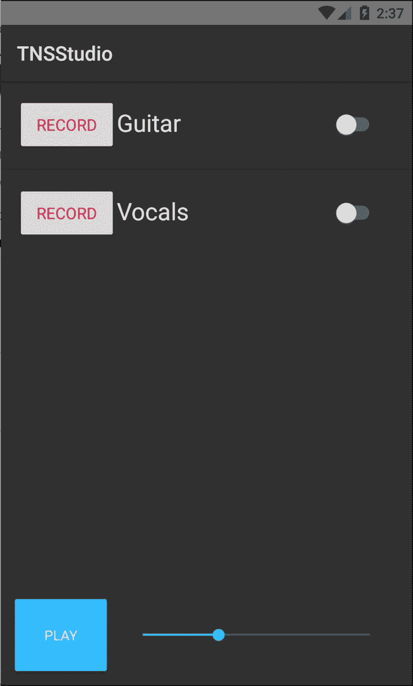

让我们趁热打铁，也调整一下`ActionBar`的背景色，以增添一些美感。在 iOS 上，状态栏背景色采用`ActionBar`的背景色，而在 Android 上，状态栏的背景色必须通过`App_Resources`中的 Android `colors.xml`进行调整。从 iOS 开始，让我们打开`app/common.css`并添加以下内容：

```js
.action-bar {
  background-color:#101B2E;
}
```

这为 iOS 的`ActionBar`设置了以下颜色：

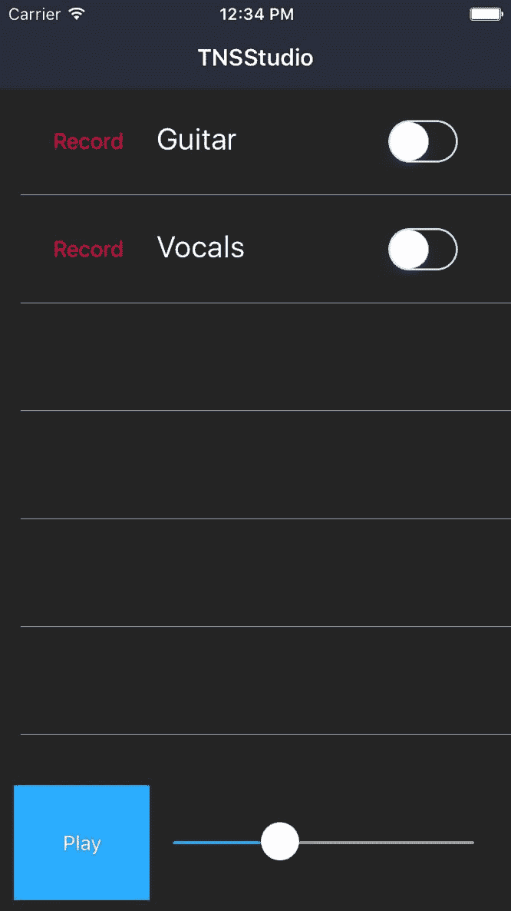

对于 Android，我们希望状态栏背景色与`ActionBar`背景色形成互补色。要做到这一点，我们需要打开`app/App_Resources/Android/values/colors.xml`并做出以下调整：

```js
<?xml version="1.0" encoding="utf-8"?>
<resources>
  <color 

name="ns_primary">#F5F5F5</color>
  <color 

name="ns_primaryDark">#284472</color>
  <color name="ns_accent">#33B5E5</color>

<color name="ns_blue">#272734</color>
</resources>
```

这是 Android 上的最终结果：

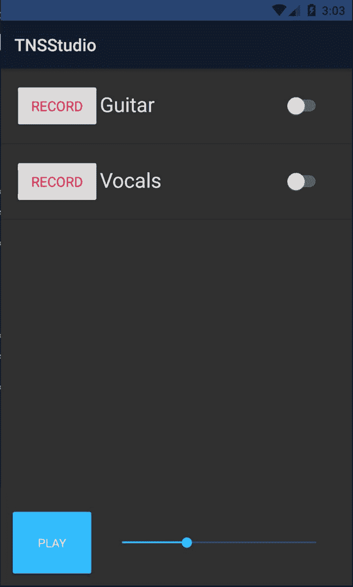

# 摘要

最后，给我们的应用添加一个面孔让人耳目一新且有趣；然而，我们当然还没有完成样式设计。我们将继续通过 CSS 润色视图，并在接下来的章节中引入 SASS 以进一步细化。然而，这一章已经向你介绍了你在通过 CSS 设计应用时需要了解的各种考虑因素。

你已经了解到常见的 CSS 属性都得到了支持，我们还探讨了 iOS 和 Android 在处理某些默认特性方面的差异。能够针对特定平台使用 CSS 覆盖是一个很好的好处和特殊能力，你将在你的跨平台 NativeScript 应用中想要充分利用这一点。了解如何控制两个平台上的状态栏外观对于实现你应用所需的外观和感觉至关重要。

在下一章中，我们将从样式设计暂时休息，通过懒加载深入探讨路由和导航，为完善我们应用的整体可用性流程做好准备。准备好深入探索我们应用中一些更有趣的 Angular 特性。
