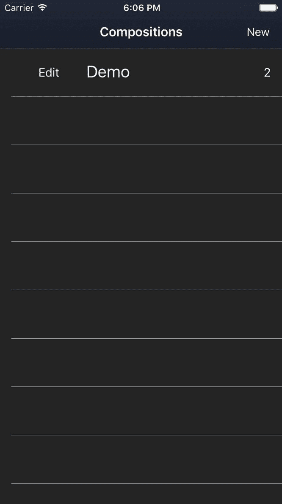
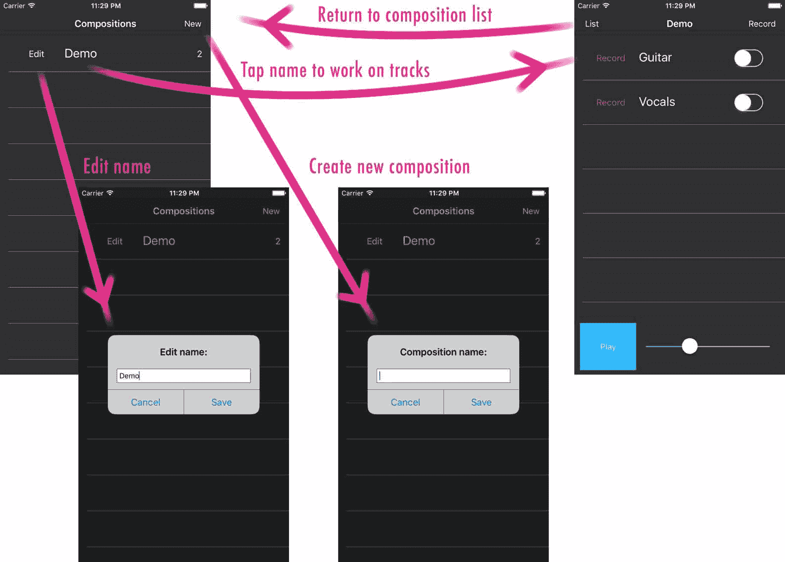
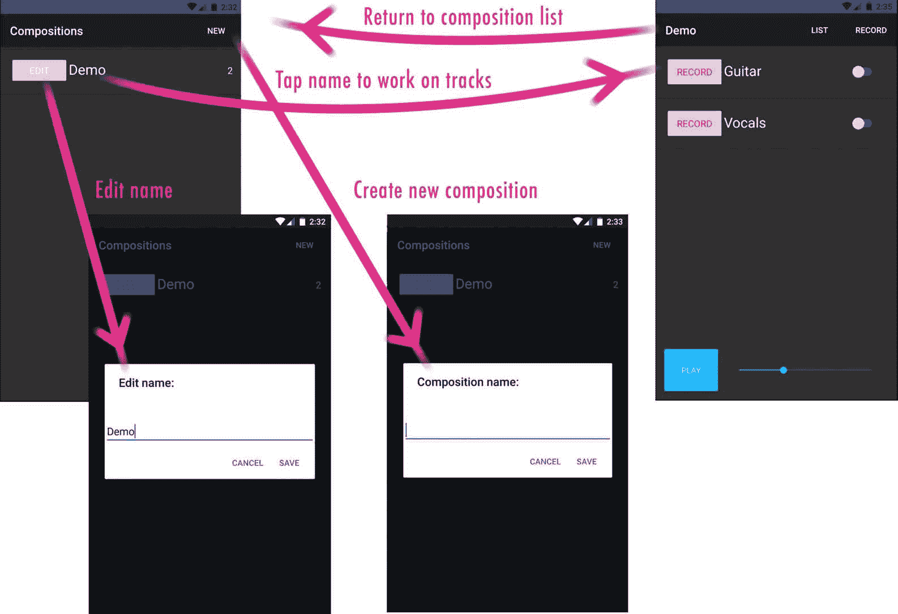
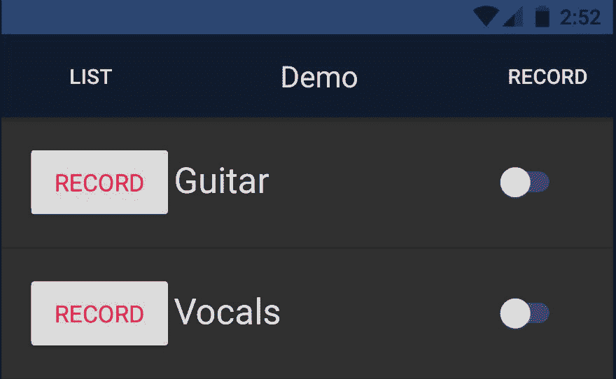

# 路由和懒加载

路由对于任何应用程序的稳定可用性流程至关重要。让我们了解一个利用 Angular 路由器所有灵活性的移动应用程序的路由配置的关键元素。

在本章中，我们将涵盖以下主题：

+   在 NativeScript 应用程序中配置 Angular Router

+   通过路由懒加载模块

+   为 Angular 的`NgModuleFactoryLoader`提供`NSModuleFactoryLoader`

+   理解如何结合使用`router-outlet`和`page-router-outlet`

+   了解如何在多个懒加载的模块之间共享单例服务

+   使用身份验证守卫来保护需要有效身份验证的视图

+   了解如何自定义返回移动导航的`NavigationButton`

+   通过引入后期功能需求来利用我们灵活的路由设置

# 在 Route 66 上享受乐趣

当我们开始在这条充满冒险的道路上旅行时，让我们先在我们的当地服务店停下来，确保我们的车辆处于最佳状态。转到`app`的根目录，为我们的车辆引擎构建一个新的附加组件：路由模块。

创建一个新的路由模块，`app/app.routing.ts`，包含以下内容：

```js
import { NgModule } from '@angular/core';
import { NativeScriptRouterModule } 
  from 'nativescript-angular/router';
import { Routes } from '@angular/router';

const routes: Routes = [
  {
    path: '',
    redirectTo: '/mixer/home',
    pathMatch: 'full'
  },
  {
    path: 'mixer',
    loadChildren: () => require('./modules/mixer/mixer.module')['MixerModule']
  },
  {
    path: 'record',
    loadChildren: () => require('./modules/recorder/recorder.module')['RecorderModule']
  }
];

@NgModule({
  imports: [
    NativeScriptRouterModule.forRoot(routes)
  ],
  exports: [
    NativeScriptRouterModule
  ]
})
export class AppRoutingModule { }
```

定义根`''`路径以重定向到懒加载的模块提供了非常灵活的路由配置，正如您在本章中将会看到的。您将看到一个新模块，`MixerModule`，我们将立即创建它。实际上，它最终将变成现在的`AppComponent`。以下是一些使用类似此配置的路由配置所获得的优势列表：

+   通过仅预先加载最基本的最小根模块配置，然后快速懒加载第一个路由的模块，保持应用程序启动时间快速

+   提供了使用`page-router-outlet`与`router-outlet`结合的能力，以实现主/详细导航以及`clearHistory`页面导航的组合

+   将路由配置责任隔离到相关的模块中，这样随着时间的推移可以很好地扩展

+   如果我们决定更改用户最初看到的初始页面，我们可以轻松地针对不同的**起始页面**进行目标定位

这使用`NativeScriptRoutingModule.forRoot(routes)`，因为这将被认为是我们的应用程序路由配置的根。

我们还导出`NativeScriptRoutingModule`，因为我们将在稍后导入这个`AppRoutingModule`到我们的根`AppModule`中。这使得路由指令对根模块的根组件可用。

# 为`NgModuleFactoryLoader`提供 NSModuleFactoryLoader

默认情况下，Angular 的内置模块加载器使用 SystemJS；然而，NativeScript 提供了一个增强的模块加载器，称为`NSModuleFactoryLoader`。让我们在我们的主路由模块中提供这个加载器，以确保所有模块都使用它而不是 Angular 的默认模块加载器。

对`app/app.routing.ts`进行以下修改：

```js
import { NgModule, NgModuleFactoryLoader } from '@angular/core';
import { NativeScriptRouterModule, NSModuleFactoryLoader } from 'nativescript-angular/router';

const routes: Routes = [
  {
    path: '',
    redirectTo: '/mixer/home',
    pathMatch: 'full'
  },
  {
    path: 'mixer',
    loadChildren: './modules/mixer/mixer.module#MixerModule'
  },
  {
    path: 'record',
    loadChildren: './modules/recorder/recorder.module#RecorderModule',
    canLoad: [AuthGuard]
  }
];

@NgModule({
  imports: [
    NativeScriptRouterModule.forRoot(routes)
  ],
  providers: [
    AuthGuard,
    {
 provide: NgModuleFactoryLoader,
 useClass: NSModuleFactoryLoader
 }
  ],
  exports: [
    NativeScriptRouterModule
  ]
})
export class AppRoutingModule { }
```

现在，我们可以通过 `loadChildren` 使用标准的 Angular 懒加载语法，通过指定默认的 `NgModuleFactoryLoader`，但应该使用 NativeScript 的增强型 `NSModuleFactoryLoader`。我们不会详细介绍 `NSModuleFactoryLoader` 提供的内容，因为它在这里解释得很好：[`www.nativescript.org/blog/optimizing-app-loading-time-with-angular-2-lazy-loading`](https://www.nativescript.org/blog/optimizing-app-loading-time-with-angular-2-lazy-loading)，而且我们在这本书中还有更多内容要介绍。

极好。有了这些升级，我们可以离开服务店，继续沿着高速公路前行。让我们继续实施我们的新路由设置。

打开 `app/app.component.html`；将其内容剪切到剪贴板，并用以下内容替换：

```js
<page-router-outlet></page-router-outlet>
```

这将是视图级别实现的基础。`page-router-outlet` 允许任何组件插入其位置，无论是单个扁平路由还是具有自己子视图的路由。它还允许其他组件视图推送到移动导航堆栈，从而实现带有后退历史记录的主/详细移动导航。

为了使这个 `page-router-outlet` 指令正常工作，我们需要我们的根 `AppModule` 导入新的 `AppRoutingModule`。我们还将利用这个机会移除之前在这里导入的 `PlayerModule`。打开 `app/app.module.ts` 并进行以下修改：

```js
// angular
import { NgModule } from '@angular/core';

// app
import { CoreModule } from './modules/core/core.module';
import { AppRoutingModule } from './app.routing';
import { AppComponent } from './app.component';

@NgModule({
 imports: [
   CoreModule,
   AppRoutingModule
 ],
 declarations: [AppComponent],
 bootstrap: [AppComponent]
})
export class AppModule { }
```

# 创建 MixerModule

这个模块实际上不会有什么新内容，因为它将作为之前根组件视图的重新定位。然而，它将引入一个额外的优点：能够定义自己的内部路由。

创建 `app/modules/mixer/components/mixer.component.html`，并将从 `app.component.html` 中剪切的内容粘贴进去：

```js
<ActionBar title="TNSStudio" class="action-bar"></ActionBar><GridLayout rows="*, 100" columns="*" class="page">  
  <track-list row="0" col="0"></track-list>  
  <player-controls row="1" col="0"></player-controls></GridLayout>
```

然后创建一个匹配的 `app/modules/mixer/components/mixer.component.ts`:

```js
import { Component } from '@angular/core';

@Component({ 
  moduleId: module.id, 
  selector: 'mixer', 
  templateUrl: 'mixer.component.html'
})
export class MixerComponent {}
```

现在，我们将创建 `BaseComponent`，它将作为前面 `MixerComponent` 的占位符，以及我们可能希望在它的位置展示的任何其他子视图组件。例如，我们的混音器可能希望允许用户将单个轨道从混音器弹出，进入一个隔离的视图来处理音频效果。

创建 `app/modules/mixer/components/base.component.ts`，内容如下：

```js
// angular
import { Component } from '@angular/core';

@Component({
 moduleId: module.id,
 selector: 'mixer-base',
 template: `<router-outlet></router-outlet>`
})
export class BaseComponent { }
```

这提供了一个插槽，可以插入我们的混音器配置的任何子路由，其中之一就是 `MixerComponent` 本身。由于视图只是一个简单的 `router-outlet`，实际上没有必要创建一个单独的 `templateUrl`，所以我们在这里直接内联了它。

现在，我们准备实现 `MixerModule`；创建 `app/modules/mixer/mixer.module.ts`，内容如下：

```js
import { NgModule, NO_ERRORS_SCHEMA } from '@angular/core';
import { NativeScriptRouterModule } from 
  'nativescript-angular/router';
import { Routes } from '@angular/router';

import { PlayerModule } from '../player/player.module';
import { BaseComponent } from './components/base.component';
import { MixerComponent } from 
  './components/mixer.component';

const COMPONENTS: any[] = [
  BaseComponent,
  MixerComponent
]

const routes: Routes = [
  {
    path: '',
    component: BaseComponent,
    children: [
      {
        path: 'home',
        component: MixerComponent
      }
    ]
  }
];

@NgModule({
  imports: [
    PlayerModule,
    NativeScriptRouterModule.forChild(routes)
  ],
  declarations: [
    ...COMPONENTS
  ],
  schemas: [
    NO_ERRORS_SCHEMA
  ]
})
export class MixerModule { }
```

我们已经导入了 `PlayerModule`，因为混合器使用了那里定义的组件/小部件（即 `track-list` 和 `player-controls`）。我们还在使用 `NativeScriptRouterModule.forChild(routes)` 方法来指示这些是特定的子路由。我们的路由配置在根 `' '` 路径上设置了 `BaseComponent`，它将 `'home'` 定义为 `MixerComponent`。如果您还记得，我们的应用 `AppRoutingModule` 如下配置了应用的根路径：

```js
...
{
  path: '',
  redirectTo: '/mixer/home',
  pathMatch: 'full'
},
...
```

这将直接路由到这里定义的 `MixerComponent`，即 `'home'`。如果我们想，我们可以轻松地将启动页面指向不同的视图，只需将 `redirectTo` 指向我们的混合器中不同的子视图。由于 `BaseComponent` 仅仅是 `router-outlet`，任何定义在混合器路由根 `' '` 下的子组件（在我们的整体应用路由中看起来是 `'/mixer'`）将直接插入该视图槽。如果您现在运行它，您应该看到我们之前相同的启动页面。

恭喜！您应用的启动时间现在很快，您已经懒加载了第一个模块！

然而，有几个令人惊讶的事情需要注意：

+   您可能会在启动页面出现之前注意到一个快速的白色闪烁（至少在 iOS 上是这样）

+   您可能会注意到控制台日志打印了两次 `` `当前用户:` ``。

我们将分别解决这些问题。

1.  在启动页面显示之前，移除启动屏幕后的白色闪烁。

这是正常的，这是默认页面背景颜色为白色造成的。为了提供无缝的启动体验，打开 `app/common.css` 文件，将全局 `Page` 类定义改为与我们的 `ActionBar` 背景颜色相同：

```js
Page {
  background-color:#101B2E;
}
```

现在，将不再有白色闪烁，应用的启动将看起来无缝。

1.  控制台日志打印了两次 `` `当前用户:` ``。

由于懒加载，Angular 的依赖注入器导致了这个问题。

这来自 `app/modules/core/services/auth.service.ts`，在那里我们有一个私有的 `init` 方法，它从服务的构造函数中被调用：

```js
...
@Injectable()
export class AuthService {
   ...
   constructor(
     private databaseService: DatabaseService,
     private logService: LogService
   ) {
     this._init();
   } 
  ...
  private _init() {
    AuthService.CURRENT_USER = this.databaseService.getItem(
      DatabaseService.KEYS.currentUser);
    this.logService.debug(`Current user: `,
 AuthService.CURRENT_USER);
    this._notifyState(!!AuthService.CURRENT_USER);
  }
  ...
}
```

等等！这是什么意思？`AuthService` 被构建了两次吗？！

是的。它确实如此。 :(

我能听到汽车轮胎的尖叫，你现在正偏离这条高速公路冒险进入沟渠。 ;)

这肯定是一个大问题，因为我们绝对希望 `AuthService` 是一个全局共享的单例，可以在任何地方注入并共享，以提供我们应用的当前认证状态。

我们必须立即解决这个问题，但在寻找一个可靠的解决方案之前，让我们先简要了解一下为什么会发生这种情况。

# 在懒加载模块时理解 Angular 的依赖注入器

我们不会重复细节，而是直接从 Angular 的官方文档（《https://angular.io/guide/ngmodule-faq#!#q-why-child-injector》）中转述，它完美地解释了这一点：

对于非懒加载的模块，Angular 会将`@NgModule.providers`添加到应用程序根注入器中。对于懒加载的模块，Angular 创建一个子注入器并将模块的提供者添加到子注入器中。

这意味着模块的行为取决于它是与应用程序启动时一起加载还是稍后懒加载。忽视这种差异可能会导致不良后果。

为什么 Angular 不将懒加载的提供者添加到应用程序根注入器，就像它对急切加载的模块所做的那样？

这个答案基于 Angular 依赖注入系统的基本特性。注入器可以添加提供者，直到它首次使用。一旦注入器开始创建和提供服务，其提供者列表就冻结了；不允许添加新的提供者。

当应用程序启动时，Angular 首先使用所有急切加载模块的提供者配置根注入器，然后创建其第一个组件并注入任何提供的服务。一旦应用程序开始，应用程序根注入器对新提供者已关闭。

时间流逝，应用程序逻辑触发模块的懒加载。Angular 必须在某个地方将懒加载模块的提供者添加到注入器中。它不能将它们添加到应用程序根注入器，因为该注入器对新提供者已关闭。因此，Angular 为懒加载模块的上下文创建了一个新的子注入器。

如果我们查看我们的根`AppModule`，我们可以看到它导入了`CoreModule`，该模块提供了`AuthService`：

```js
...
@NgModule({
  imports: [
    CoreModule,
    AppRoutingModule
  ],
  declarations: [AppComponent],
  bootstrap: [AppComponent],
  schemas: [NO_ERRORS_SCHEMA]
})
export class AppModule { }
```

如果我们查看`PlayerModule`，我们可以看到它也导入了`CoreModule`，因为`PlayerModule`的组件使用了它声明的`OrderByPipe`以及它提供的几个服务（即`AuthService`、`LogService`和`DialogService`）：

```js
...
@NgModule({
  imports: [
    CoreModule
  ],
  providers: [...PROVIDERS],
  declarations: [...COMPONENTS],
  exports: [...COMPONENTS],
  schemas: [ NO_ERRORS_SCHEMA ]
})
export class PlayerModule { }
```

由于我们新奇的路线配置，`PlayerModule`现在与`MixerModule`一起懒加载。这导致 Angular 的依赖注入器为我们的懒加载`MixerModule`注册了一个新的子注入器，它带来了`PlayerModule`，它也带来了其导入的`CoreModule`，该模块定义了那些提供者，包括`AuthService`、`LogService`等。当 Angular 注册`MixerModule`时，它将注册新模块中定义的所有提供者，包括其导入的模块，以及新的子注入器，从而产生了那些服务的新实例。

Angular 的文档还提供了一种推荐的模块设置来解决这个问题，因此让我们再次从`https://angular.io/guide/ngmodule-faq#!#q-module-recommendations`中转述：

SharedModule

创建一个`SharedModule`，其中包含你在应用程序的每个地方都使用的组件、指令和管道。此模块应完全由声明组成，其中大多数都导出。`SharedModule`可以重新导出其他小部件模块，例如`CommonModule`、`FormsModule`以及包含你广泛使用的 UI 控制的模块。《SharedModule》不应有提供者，如前所述。也不应该有任何导入或重新导出的模块有提供者。如果你偏离了这个指南，要知道你在做什么以及为什么。在你的功能模块中导入`SharedModule`，包括在应用程序启动时加载的模块以及稍后懒加载的模块。

创建一个`CoreModule`，其中包含在应用程序启动时加载的单例服务的提供者。

仅在根`AppModule`中导入`CoreModule`。永远不要在其他任何模块中导入`CoreModule`。

考虑将`CoreModule`制作成一个没有声明的纯服务模块。

哇！这是一个极好的建议。特别值得注意的是最后一行：

考虑将`CoreModule`制作成一个没有声明的纯服务模块。

因此，我们已经有了一个`CoreModule`，这是一个好消息，但我们将希望将其制作成一个*没有声明的纯服务模块*。我们还将*仅在根`AppModule`中导入`CoreModule`。永远不要在其他任何模块中导入`CoreModule`。*然后，我们可以创建一个新的`SharedModule`，只为*...**我们在应用程序的每个地方都使用的组件、指令和管道*提供。

让我们创建`app/modules/shared/shared.module.ts`，如下所示：

```js
// nativescript
import { NativeScriptModule } from 'nativescript-angular/nativescript.module'; 

// angular
import { NgModule, NO_ERRORS_SCHEMA } from '@angular/core';

// app
import { PIPES } from './pipes';

@NgModule({
  imports: [
    NativeScriptModule
  ],
  declarations: [
    ...PIPES
  ],
  exports: [
    NativeScriptModule,
    ...PIPES
  ],
  schemas: [ NO_ERRORS_SCHEMA ]
})
export class SharedModule {}
```

对于`PIPES`，我们只是将管道目录从`app/modules/core`移动到`app/modules/shared`文件夹。现在，`SharedModule`是我们可以在需要任何管道或未来共享组件/指令的多个不同模块中自由导入的模块。它将不会定义任何服务提供者，正如这个建议所提到的：

`SharedModule`不应有提供者，如前所述，也不应有任何导入或重新导出的模块有提供者。

然后，我们可以按照以下方式调整`CoreModule`（位于`app/modules/core/core.module.ts`）以成为一个没有声明的纯服务模块：

```js
// nativescript
import { NativeScriptModule } from 'nativescript-angular/nativescript.module'; 
import { NativeScriptFormsModule } from 'nativescript-angular/forms'; 
import {NativeScriptHttpModule } from 'nativescript-angular/http';
// angular
import { NgModule, Optional, SkipSelf } from '@angular/core';

// app
import { PROVIDERS } from './services';

const MODULES: any[] = [
  NativeScriptModule,
  NativeScriptFormsModule,
  NativeScriptHttpModule
];

@NgModule({
  imports: [
    ...MODULES
  ],
  providers: [
    ...PROVIDERS
  ],
  exports: [
    ...MODULES
  ]
})
export class CoreModule {
  constructor (
    @Optional() @SkipSelf() parentModule: CoreModule) {
    if (parentModule) {
      throw new Error(
        'CoreModule is already loaded. Import it in the AppModule only');
    }
  }
}
```

此模块现在仅定义提供者，即包含`AuthService`、`DatabaseService`、`DialogService`和`LogService`的集合，我们都在本书中较早创建过，我们想确保它们是跨我们的应用程序使用的真正的单例，无论它们是否在懒加载的模块中使用。

为什么我们使用`...PROVIDERS`展开符号而不是直接分配集合？

由于可扩展性的原因。将来，如果我们需要添加一个额外的提供者或覆盖一个提供者，我们只需在模块中直接添加到集合中即可。对于导入和导出也是如此。

我们还利用这个机会导入了一些我们想要确保在整个应用程序中全局使用的附加模块。`NativeScriptModule`、`NativeScriptFormsModule` 和 `NativeScriptHttpModule` 都是基本模块，它们会覆盖 Angular 各个提供者中的某些 Web API，以增强我们的应用程序的本地 API。例如，应用程序将使用在 iOS 和 Android 上可用的本地 HTTP API（而不是 Web API `XMLHttpRequest`），以实现最佳的网络性能。我们确保也导出这些模块，这样我们的根模块就不再需要导入它们，而是可以直接导入这个 `CoreModule`。

最后，我们定义了一个构造函数，这将帮助我们未来避免意外地将此 `CoreModule` 导入其他懒加载模块。

我们还不知道 `PlayerModule` 提供的 `PlayerService` 是否会被 `RecorderModule` 需要，后者也将是懒加载的。如果将来出现这种情况，我们还可以将 `PlayerService` 重构到 `CoreModule` 中，以确保它是我们在整个应用程序中共享的真正单例。目前，我们将其保留在 `PlayerModule` 中作为一部分。

现在，让我们根据我们所做的一切调整其他模块的最终设置。

`app/modules/player/player.module.ts` 文件现在应该看起来像这样：

```js
// angular
import { NgModule, NO_ERRORS_SCHEMA } from '@angular/core';

// app
import { SharedModule } from '../shared/shared.module';
import { COMPONENTS } from './components';
import { PROVIDERS } from './services';

@NgModule({
  imports: [ SharedModule ],
  providers: [ ...PROVIDERS ],
  declarations: [ ...COMPONENTS ],
  exports: [
    SharedModule,
    ...COMPONENTS
  ],
  schemas: [ NO_ERRORS_SCHEMA ]
})
export class PlayerModule { }
```

`app/modules/recorder/recorder.module.ts` 文件现在应该看起来像这样：

```js
// angular
import { NgModule, NO_ERRORS_SCHEMA } from '@angular/core';

// app
import { SharedModule } from '../shared/shared.module';
import { PROVIDERS } from './services';

@NgModule({
 imports: [ SharedModule ],
 providers: [ ...PROVIDERS ],
 schemas: [ NO_ERRORS_SCHEMA ]
})
export class RecorderModule { }
```

注意我们现在导入的是 `SharedModule` 而不是 `CoreModule`。这使我们能够通过导入那个 `SharedModule` 在整个应用程序中共享指令、组件和管道（本质上就是模块声明部分中的任何内容）。

我们在 `app/app.module.ts` 中的根 `AppModule` 保持不变：

```js
// angular
import { NgModule } from '@angular/core';

// app
import { CoreModule } from './modules/core/core.module';
import { AppRoutingModule } from './app.routing';
import { AppComponent } from './app.component';

@NgModule({
  imports: [
    CoreModule,
    AppRoutingModule
  ],
  declarations: [ AppComponent ],
  bootstrap: [ AppComponent ]
})
export class AppModule { }
```

任何模块（无论是懒加载还是非懒加载）都可以注入 `CoreModule` 提供的任何服务，因为根 `AppModule` 现在导入了那个 `CoreModule`。这允许 Angular 的根注入器正好一次构建 `CoreModule` 提供的服务。然后，每当这些服务在任何地方注入（无论是懒加载模块还是其他地方），Angular 首先会询问父注入器（在懒加载模块的情况下，将是子注入器）该服务，如果在那里找不到，它将询问下一个父注入器，最终到达根注入器，在那里提供这些单例。

嗯，我们在这个沙漠小镇度过了一段美好的时光。让我们沿着高速公路驶向超安全的 51 区，在那里模块可以被锁定数年，除非出示适当的授权。

# 为 RecorderModule 创建 AuthGuard

我们应用程序的一个要求是，录制功能应该在用户认证之前被锁定并不可访问。这使我们能够拥有一个用户基础，并且如果将来我们希望的话，可以引入付费功能。

Angular 提供了在路由上插入守卫的能力，这只有在特定条件下才会激活。这正是我们实现这个功能需求所需要的，因为我们已经将 `'/record'` 路由隔离出来，以懒加载 `RecorderModule`，它将包含所有录音功能。我们只想允许认证用户访问那个 `'/record'` 路由。

让我们在新文件夹中创建 `app/guards/auth-guard.service.ts`，以便于扩展，因为我们可能需要在这里创建其他必要的守卫：

```js
import { Injectable } from '@angular/core';
import { Route, CanActivate, CanLoad } from '@angular/router';
import { AuthService } from '../modules/core/services/auth.service';

@Injectable()
export class AuthGuard implements CanActivate, CanLoad {

  constructor(private authService: AuthService) { }

  canActivate(): Promise<boolean> {
    return new Promise((resolve, reject) => {
      if (this._isAuth()) {
        resolve(true);
      } else {
        // login sequence to continue prompting
        let promptSequence = (usernameAttempt?: string) => {
          this.authService.promptLogin(
            'Authenticate to record.',
            usernameAttempt
          ).then(() => {
            resolve(true); 
          }, (usernameAttempt) => {
            if (usernameAttempt === false) {
              // user canceled prompt
              resolve(false);
            } else {
              // initiate sequence again
              promptSequence(usernameAttempt);
            }
          });
        };
        // start login prompt sequence
        // require auth before activating
        promptSequence();
      }
    });
  }

  canLoad(route: Route): Promise<boolean> {
    // reuse same logic to activate
    return this.canActivate();
  }

  private _isAuth(): boolean {
    // just get the latest value from our BehaviorSubject
    return this.authService.authenticated$.getValue();
  }
}
```

我们可以利用 `AuthService` 的 `BehaviorSubject` 来获取最新值，使用 `this.authService.authenticated$.getValue()` 来确定认证状态。我们使用这个值通过 `canActivate` 钩子（或通过 `canLoad` 钩子加载模块）立即激活路由，如果用户已认证。否则，我们通过服务的方法显示登录提示，但这次我们将其包裹在一个重新提示序列中，这样在失败尝试的情况下会继续提示，直到成功认证，或者如果用户取消提示则忽略。

对于这本书，我们不会连接到任何后端服务来进行任何真实的认证。我们将这部分留给你在自己的应用程序中完成。我们将在对输入进行非常简单的验证后，将你输入到登录提示中的电子邮件和密码持久化，作为有效用户。

注意，`AuthGuard` 是一个像其他服务一样的可注入服务，因此我们想要确保它被添加到 `AppRoutingModule` 的提供者元数据中。现在我们可以通过以下突出显示的修改来保护我们的路由 `app/app.routing.ts` 以使用它：

```js
...
import { AuthGuard } from './guards/auth-guard.service';

const routes: Routes = [
  ...
  {
    path: 'record',
    loadChildren: 
      './modules/recorder/recorder.module#RecorderModule',
    canLoad: [AuthGuard]
  }
];

@NgModule({
  ...
  providers: [
    AuthGuard,
    ...
  ],
  ...
})
export class AppRoutingModule { }
```

要尝试这个功能，我们需要向我们的 `RecorderModule` 添加子路由，因为我们还没有这样做。打开 `app/modules/recorder/recorder.module.ts` 并添加以下突出显示的部分：

```js
// nativescript
import { NativeScriptModule } from 'nativescript-angular/nativescript.module';
import { NativeScriptRouterModule } from 'nativescript-angular/router';

// angular
import { NgModule, NO_ERRORS_SCHEMA } from '@angular/core';
import { Routes } from '@angular/router';

// app
import { SharedModule } from '../shared/shared.module';
import { PROVIDERS } from './services';
import { RecordComponent } from './components/record.component';

const COMPONENTS: any[] = [
 RecordComponent
]

const routes: Routes = [
 {
 path: '',
 component: RecordComponent
 }
];

@NgModule({
  imports: [
    SharedModule,
    NativeScriptRouterModule.forChild(routes)
  ],
  declarations: [ ...COMPONENTS ],
  providers: [ ...PROVIDERS ],
  schemas: [ NO_ERRORS_SCHEMA ]
})
export class RecorderModule { }
```

现在我们有了适当的子路由配置，当用户导航到 `'/record'` 路径时，将显示单个 `RecordComponent`。我们不会显示 `RecordComponent` 的详细信息，你可以参考书籍的 第五章，*路由和懒加载* 分支上的代码库。然而，目前它只是 `app/modules/recorder/components/record.component.html` 中的一个占位符组件，只显示一个简单的标签，因此我们可以尝试这个功能。

最后，我们需要一个按钮来路由到我们的 `'/record'` 路径。如果我们回顾我们的原始草图，我们想在 `ActionBar` 的右上角显示一个记录按钮，所以现在让我们实现它。

打开 `app/modules/mixer/components/mixer.component.html` 并添加以下内容：

```js
<ActionBar title="TNSStudio" class="action-bar">
  <ActionItem nsRouterLink="/record" ios.position="right">
 <Button text="Record" class="action-item"></Button>
 </ActionItem>
</ActionBar>
<GridLayout rows="*, 100" columns="*" class="page">
  <track-list row="0" col="0"></track-list>
  <player-controls row="1" col="0"></player-controls>
</GridLayout>
```

现在，如果我们要在 iOS 模拟器中运行这个程序，我们会注意到 `ActionBar` 中的记录按钮没有任何反应！这是因为 `MixerModule` 只导入了以下内容：

```js
@NgModule({
  imports: [
    PlayerModule,
    NativeScriptRouterModule.forChild(routes)
  ],
  ...
})
export class MixerModule { }
```

`NativeScriptRouterModule.forChild(routes)` 方法仅配置路由，但不会使各种路由指令，如 `nsRouterLink`，对我们的组件可用。

由于你之前已经了解到应该使用 `SharedModule` 来声明你想要在模块中（无论是懒加载还是非懒加载）共享的各种指令、组件和管道，这是一个利用它的完美机会。

打开 `app/modules/shared/shared.module.ts` 并进行以下突出显示的修改：

```js
...
import { NativeScriptRouterModule } from 'nativescript-angular/router'; 
...

@NgModule({
  imports: [
    NativeScriptModule, 
    NativeScriptRouterModule
  ],
  declarations: [
    ...PIPES
  ],
  exports: [
    NativeScriptModule,
    NativeScriptRouterModule,
    ...PIPES
  ],
  schemas: [NO_ERRORS_SCHEMA]
})
export class SharedModule { }
```

现在，回到 `MixerModule`，我们可以调整导入以使用 `SharedModule`：

```js
...
import { SharedModule } from '../shared/shared.module'; 
@NgModule({
  imports: [
    PlayerModule,
    SharedModule,
    NativeScriptRouterModule.forChild(routes)
  ],
  ...
})
export class MixerModule { }
```

这确保了通过 `NativeScriptRouterModule` 暴露的所有指令现在都包含在内，并且可以通过我们的全局 `SharedModule` 在 `MixerModule` 中使用。

再次运行我们的应用，当我们点击 `ActionBar` 中的 Record 按钮时，现在会看到登录提示。如果我们输入格式正确的电子邮件地址和任何密码，它将持久保存详细信息，登录，并在 iOS 上显示 `RecordComponent` 如下：


你可能会注意到一些相当有趣的事情。`ActionBar` 从我们通过 CSS 分配的背景颜色和按钮颜色现在显示默认的蓝色。这是因为 `RecordComponent` 没有定义 `ActionBar`；因此，它正在回退到具有默认样式的 `ActionBar`，带有默认的返回按钮，该按钮承担了它刚刚导航离开的页面的标题。`'/record'` 路由也正在使用 `page-router-outlet` 将组件推送到移动导航堆栈。`RecordComponent` 正在动画进入视图，同时允许用户选择左上角的按钮进行导航回退（弹出导航历史记录）。

为了修复 `ActionBar`，我们只需将 `ActionBar` 添加到 `RecordComponent` 视图中，并使用自定义的 `NavigationButton`（一个模拟移动设备默认返回导航按钮的 `NativeScript` 视图组件）。我们可以在 `app/modules/record/components/record.component.html` 中进行调整：

```js
<ActionBar title="Record" class="action-bar">
  <NavigationButton text="Back"
    android.systemIcon="ic_menu_back">
  </NavigationButton>
</ActionBar>
<StackLayout class="p-20">
  <Label text="TODO: Record" class="h1 text-center"></Label>
</StackLayout>
```

现在，这看起来好多了：


如果我们在 Android 上运行此应用并使用任何电子邮件/密码组合登录以持久保存用户，它将显示相同的 `RecordComponent` 视图；然而，你会注意到另一个有趣的细节。我们已经将 Android 设置为显示标准的返回箭头系统图标作为 `NavigationButton`，但是当你点击那个箭头时，它不会做任何事情。Android 的默认行为依赖于位于主页按钮旁边的设备的物理硬件返回按钮。然而，我们可以通过仅为 `NavigationButton` 添加点击事件来提供一致的用户体验，这样 iOS 和 Android 对返回按钮的点击反应相同。对模板进行以下修改：

```js
<ActionBar title="Record" icon="" class="action-bar">
  <NavigationButton (tap)="back()" text="Back" 
    android.systemIcon="ic_menu_back">
  </NavigationButton>
</ActionBar>
<StackLayout class="p-20">
  <Label text="TODO: Record" class="h1 text-center"></Label>
</StackLayout>
```

然后，我们可以在 `app/modules/recorder/components/record.component.ts` 中实现 `back()` 方法，使用 Angular 的 `RouterExtensions` 服务：

```js
// angular
import { Component } from '@angular/core';
import { RouterExtensions } from 'nativescript-angular/router';

@Component({
 moduleId: module.id,
 selector: 'record',
 templateUrl: 'record.component.html'
})
export class RecordComponent { 

  constructor(private router: RouterExtensions) { }

  public back() {
    this.router.back();
  }
}
```

现在，Android 的返回按钮可以点击以返回，除了硬件返回按钮之外。iOS 简单地忽略了点击事件处理程序，因为它使用 `NavigationButton` 的默认原生行为。相当不错。以下是 Android 上的 `RecordComponent` 的样子：


我们将在接下来的章节中实现一个不错的录音视图。

我们现在肯定是在 66 号公路上飞驰了！

我们已经实现了懒加载的路由，提供了 `AuthGuard` 来保护我们应用程序录音功能的未授权使用，并在过程中学到了很多。然而，我们刚刚意识到我们错过了一个非常重要的功能。我们需要一种方法来随着时间的推移处理多个不同的混音。默认情况下，我们的应用程序可能会启动最后打开的混音，但我们会想创建新的混音（让我们考虑它们为**作品**）并记录完全新的单独音轨的混音作为单独的作品。我们需要一个新的路由来显示这些作品，我们可以适当地命名它们，这样我们就可以来回跳转并处理不同的材料。

# 处理晚期功能需求 - 管理作品

是时候处理 66 号公路上的意外交通了。我们遇到了一个晚期的功能需求，意识到我们需要一种方法来管理任意数量的不同混音，这样我们就可以随着时间的推移处理不同的材料。我们可以将每个混音称为音频音轨的组合。

好消息是我们已经花费了相当多的时间来设计一个可扩展的架构，我们即将收获我们的劳动成果。现在应对晚期的功能需求变得像在邻里间的一次愉快的周日散步。让我们通过花点时间来开发这个新功能，来展示我们应用程序架构的优势。

让我们从定义我们将要创建的新 `MixListComponent` 的新路由开始。打开 `app/modules/mixer/mixer.module.ts` 并进行以下突出显示的修改：

```js
...
import { MixListComponent } from './components/mix-list.component';
import { PROVIDERS } from './services';

const COMPONENTS: any[] = [
  BaseComponent,
  MixerComponent,
  MixListComponent
]

const routes: Routes = [
  {
    path: '',
    component: BaseComponent,
    children: [
      {
 path: 'home',
 component: MixListComponent
 },
 {
 path: ':id',
 component: MixerComponent
 }
    ]
  }
];

@NgModule({
   ...
   providers: [
 ...PROVIDERS
 ]
})
export class MixerModule { }
```

我们正在改变最初将 `MixerComponent` 作为主页的策略，相反，我们将在稍后创建一个新的 `MixListComponent` 来表示 `'home'` 主页，这将是我们正在工作的所有作品的列表。我们仍然可以在应用程序启动时自动选择最后选择的组合，以便以后方便使用。我们已经将 `MixerComponent` 定义为一个参数化路由，因为它将始终代表我们通过 `':id'` 参数路由标识的一个工作组合，例如解析为 `'/mixer/1'` 这样的路由。我们还导入了 `PROVIDERS`，我们将在稍后创建它。

让我们修改由 `CoreModule` 提供的 `DatabaseService`，以帮助我们为我们的新数据需求提供一个恒定的持久键。我们希望通过这个恒定键名持久化用户创建的作品。打开 `app/modules/core/services/database.service.ts` 并进行以下突出显示的修改：

```js
...
interface IKeys {
  currentUser: string;
  compositions: string;
}

@Injectable()
export class DatabaseService {

  public static KEYS: IKeys = {
    currentUser: 'current-user',
    compositions: 'compositions'
  };
...
```

让我们再创建一个新的数据模型来表示我们的组合。创建 `app/modules/shared/models/composition.model.ts`：

```js
import { ITrack } from './track.model';

export interface IComposition {
  id: number;
  name: string;
  created: number;
  tracks: Array<ITrack>;
  order: number;
}
export class CompositionModel implements IComposition {
  public id: number;
  public name: string;
  public created: number;
  public tracks: Array<ITrack> = [];
  public order: number;

  constructor(model?: any) {
    if (model) {
      for (let key in model) {
        this[key] = model[key];
      }
    }
    if (!this.created) this.created = Date.now();
    // if not assigned, just assign a random id
    if (!this.id)
      this.id = Math.floor(Math.random() * 100000);
  }
}
```

然后，坚持我们的约定，打开 `app/modules/shared/models/index.ts` 并重新导出这个新模型：

```js
export * from './composition.model';
export * from './track.model';
```

我们现在可以使用这个新模型和数据库键在一个新的数据服务上构建这个新功能。创建 `app/modules/mixer/services/mixer.service.ts`：

```js
// angular
import { Injectable } from '@angular/core';

// app
import { ITrack, IComposition, CompositionModel } from '../../shared/models';
import { DatabaseService } from '../../core/services/database.service';
import { DialogService } from '../../core/services/dialog.service';

@Injectable()
export class MixerService {

  public list: Array<IComposition>;

  constructor(
    private databaseService: DatabaseService,
    private dialogService: DialogService
  ) {
    // restore with saved compositions or demo list
    this.list = this._savedCompositions() || 
      this._demoComposition();
  } 

  public add() {
    this.dialogService.prompt('Composition name:')
      .then((value) => {
        if (value.result) {
          let composition = new CompositionModel({
            id: this.list.length + 1,
            name: value.text,
            order: this.list.length // next one in line
          });
          this.list.push(composition);
          // persist changes
          this._saveList();
        }
      });
  }

  public edit(composition: IComposition) {
    this.dialogService.prompt('Edit name:', composition.name)
      .then((value) => {
        if (value.result) {
          for (let comp of this.list) {
            if (comp.id === composition.id) {
              comp.name = value.text;
              break;
            }
          }
          // re-assignment triggers view binding change
          // only needed with default change detection
          // when object prop changes in collection
          // NOTE: we will use Observables in ngrx chapter
          this.list = [...this.list];
          // persist changes
          this._saveList();
        }
      });
  }

  private _savedCompositions(): any {
    return this.databaseService
      .getItem(DatabaseService.KEYS.compositions);
  }

  private _saveList() {
    this.databaseService
      .setItem(DatabaseService.KEYS.compositions, this.list);
  }

  private _demoComposition(): Array<IComposition> {
    // Starter composition to demo on first launch
    return [
      {
        id: 1,
        name: 'Demo',
        created: Date.now(),
        order: 0,
        tracks: [
          {
            id: 1,
            name: 'Guitar',
            order: 0
          },
          {
            id: 2,
            name: 'Vocals',
            order: 1
          }
        ]
      }
    ]
  }
}
```

现在我们有一个服务，它将提供一个列表来绑定我们的视图以显示用户的保存组合。它还提供了一种添加和编辑组合以及为首次启动应用提供演示组合的方法，以获得良好的首次用户体验（稍后我们将添加实际的轨道到演示中）。

按照我们的约定，我们还可以添加 `app/modules/mixer/services/index.ts`，如下所示，这是我们之前在 `MixerModule` 中导入的：

```js
import { MixerService } from './mixer.service';

export const PROVIDERS: any[] = [
  MixerService
];

export * from './mixer.service';
```

现在让我们创建 `app/modules/mixer/components/mix-list.component.ts` 来消费和投影我们的新数据服务：

```js
// angular
import { Component } from '@angular/core';

// app
import { MixerService } from '../services/mixer.service';

@Component({
  moduleId: module.id,
  selector: 'mix-list',
  templateUrl: 'mix-list.component.html'
})
export class MixListComponent {

  constructor(public mixerService: MixerService) { } 
}
```

对于视图模板，`app/modules/mixer/components/mix-list.component.html`：

```js
<ActionBar title="Compositions" class="action-bar">
  <ActionItem (tap)="mixerService.add()" 
    ios.position="right">
    <Button text="New" class="action-item"></Button>
  </ActionItem>
</ActionBar>
<ListView [items]="mixerService.list | orderBy: 'order'" 
  class="list-group">
  <ng-template let-composition="item">
    <GridLayout rows="auto" columns="100,*,auto" 
      class="list-group-item">
      <Button text="Edit" row="0" col="0" 
        (tap)="mixerService.edit(composition)"></Button>
      <Label [text]="composition.name"
        [nsRouterLink]="['/mixer', composition.id]"
        class="h2" row="0" col="1"></Label>
      <Label [text]="composition.tracks.length" 
        class="text-right" row="0" col="2"></Label>
    </GridLayout>
  </ng-template>
</ListView>
```

这将在视图中渲染 `MixerService` 用户保存的组合列表，并且当我们首次启动应用时，它将预加载一个包含两个录音的示例 **Demo** 组合，以便用户可以尝试。以下是首次启动后在 iOS 上的样子：



我们可以创建新的组合并编辑现有组合的名称。我们还可以点击组合的名称来查看 `MixerComponent`；然而，我们需要调整组件以获取路由 `':id'` 参数并将其视图连接到选定的组合。打开 `app/modules/mixer/components/mixer.component.ts` 并添加突出显示的部分：

```js
// angular
import { Component, OnInit, OnDestroy } from '@angular/core';
import { ActivatedRoute } from '@angular/router';
import { Subscription } from 'rxjs/Subscription';

// app
import { MixerService } from '../services/mixer.service';
import { CompositionModel } from '../../shared/models';

@Component({
 moduleId: module.id,
 selector: 'mixer',
 templateUrl: 'mixer.component.html'
})
export class MixerComponent implements OnInit, OnDestroy {

  public composition: CompositionModel; 
 private _sub: Subscription;

 constructor(
 private route: ActivatedRoute,
 private mixerService: MixerService
 ) { } 

 ngOnInit() {
 this._sub = this.route.params.subscribe(params => {
 for (let comp of this.mixerService.list) {
 if (comp.id === +params['id']) {
 this.composition = comp;
 break;
 }
 }
 });
 } 

 ngOnDestroy() {
 this._sub.unsubscribe();
 }
}
```

我们可以将 Angular 的 `ActivatedRoute` 注入以订阅路由的参数，这使我们能够访问 `id`。由于它默认为字符串，我们在服务列表中定位组合时使用 `+params['id']` 将其转换为数字。我们为选定的 `composition` 分配一个本地引用，这现在允许我们在视图中绑定到它。在此期间，我们还将向 `ActionBar` 添加一个标签为 `List` 的按钮，以便导航回我们的组合（稍后，我们将实现字体图标来替换它们）。打开 `app/modules/mixer/components/mixer.component.html` 并进行以下突出显示的修改：

```js
<ActionBar [title]="composition.name" class="action-bar">
  <ActionItem nsRouterLink="/mixer/home">
 <Button text="List" class="action-item"></Button>
 </ActionItem>
  <ActionItem nsRouterLink="/record" ios.position="right">
    <Button text="Record" class="action-item"></Button>
  </ActionItem>
</ActionBar>
<GridLayout rows="*, 100" columns="*" class="page">
  <track-list [tracks]="composition.tracks" row="0" col="0"></track-list>
  <player-controls row="1" col="0"></player-controls>
</GridLayout>
```

这允许我们在 `ActionBar` 的标题中显示所选组合的名字，并将其轨道传递给 `track-list`。我们需要向 `track-list` 添加 `Input`，以便它渲染组合的轨道，而不是现在绑定到的虚拟数据。让我们打开 `app/modules/player/components/track-list/track-list.component.ts` 并添加一个 `Input`：

```js
...
export class TrackListComponent {

 @Input() tracks: Array<ITrack>;

 ...
}
```

以前，`TrackListComponent`视图绑定到`playerService.tracks`，所以让我们调整`app/modules/player/components/track-list/track-list.component.html`中的组件视图模板，以绑定到我们新的`Input`，它现在将代表用户实际选择的组合中的曲目**：

```js
<ListView [items]="tracks | orderBy: 'order'" class="list-group">
  <template let-track="item">
    <GridLayout rows="auto" columns="100,*,100" class="list-group-item">
      <Button text="Record" (tap)="record(track)" row="0" col="0" class="c-ruby"></Button>
      <Label [text]="track.name" row="0" col="1" class="h2"></Label>
      <Switch [checked]="track.solo" row="0" col="2" class="switch"></Switch>
    </GridLayout>
  </template>
</ListView>
```

我们现在在我们的应用程序中有了以下序列来满足这个后期功能需求，我们只在这里的几页材料中就完成了它：



在 Android 上，它的工作方式完全相同，同时保留了其独特的本地特性。



然而，您可能会注意到，在 Android 上，`ActionBar`默认将所有`ActionItem`放置在右侧。我们想快速向您展示的一个最后的技巧是平台特定视图模板的能力。哦，而且不用担心那些丑陋的 Android 按钮；我们稍后会集成字体图标。

在你认为合适的地方创建特定平台的视图模板。这样做将帮助你在必要时为每个平台调整视图，并使它们易于维护。

让我们创建`app/modules/mixer/components/action-bar/action-bar.component.ts`：

```js
// angular
import { Component, Input } from '@angular/core';

@Component({
  moduleId: module.id,
  selector: 'action-bar',
  templateUrl: 'action-bar.component.html'
})
export class ActionBarComponent {

  @Input() title: string;
}
```

然后，您可以创建一个特定于 iOS 的视图模板：`app/modules/mixer/components/action-bar/action-bar.component.ios.html`：

```js
<ActionBar [title]="title" class="action-bar">
  <ActionItem nsRouterLink="/mixer/home">
    <Button text="List" class="action-item"></Button>
  </ActionItem>
  <ActionItem nsRouterLink="/record" ios.position="right">
    <Button text="Record" class="action-item"></Button>
  </ActionItem>
</ActionBar>
```

以及一个特定于 Android 的视图模板：`app/modules/mixer/components/action-bar/action-bar.component.android.html`：

```js
<ActionBar class="action-bar">
  <GridLayout rows="auto" columns="auto,*,auto" class="action-bar">
    <Button text="List" nsRouterLink="/mixer/home" class="action-item" row="0" col="0"></Button>
    <Label [text]="title" class="action-bar-title text-center" row="0" col="1"></Label>
    <Button text="Record" nsRouterLink="/record" class="action-item" row="0" col="2"></Button>
  </GridLayout>
</ActionBar>
```

然后，我们可以在`app/modules/mixer/components/mixer.component.html`中使用它：

```js
<action-bar [title]="composition.name"></action-bar>
<GridLayout rows="*, 100" columns="*" class="page">
  <track-list [tracks]="composition.tracks" row="0" col="0"></track-list>
  <player-controls row="1" col="0"></player-controls>
</GridLayout>
```

只确保您将其添加到`MixerModule`的`COMPONENTS`中，在`app/modules/mixer/mixer.module.ts`：

```js
...
import { ActionBarComponent } from './components/action-bar/action-bar.component';
...

const COMPONENTS: any[] = [
  ActionBarComponent,
  BaseComponent,
  MixerComponent,
  MixListComponent
];
...
```

哇！



# 摘要

我们已经到达了这条 66 号公路上的奇妙旅程的终点，希望您感到和我们一样兴奋。本章介绍了一些有趣的 Angular 概念，包括使用懒加载模块配置路由以保持应用程序启动时间快；使用本地文件处理 API 构建自定义模块加载器；将`router-outlet`的灵活性与 NativeScript 的`page-router-outlet`相结合；通过懒加载模块获得对单例服务的控制和理解；保护依赖于授权访问的路由；以及处理后期功能需求以展示我们出色的可扩展应用程序设计。

本章总结了我们的应用程序的一般可用性流程，到目前为止，我们已经准备好进入我们应用程序的核心竞争力：**通过 iOS 和 Android 丰富的本地 API 进行音频处理**。

在深入探讨细节之前，在下一章中，我们将简要检查 NativeScript 的各种`tns`命令行参数，以运行我们的应用程序，并确保我们对现在可以带到工作中的工具带有一个全面的教育。
