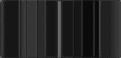
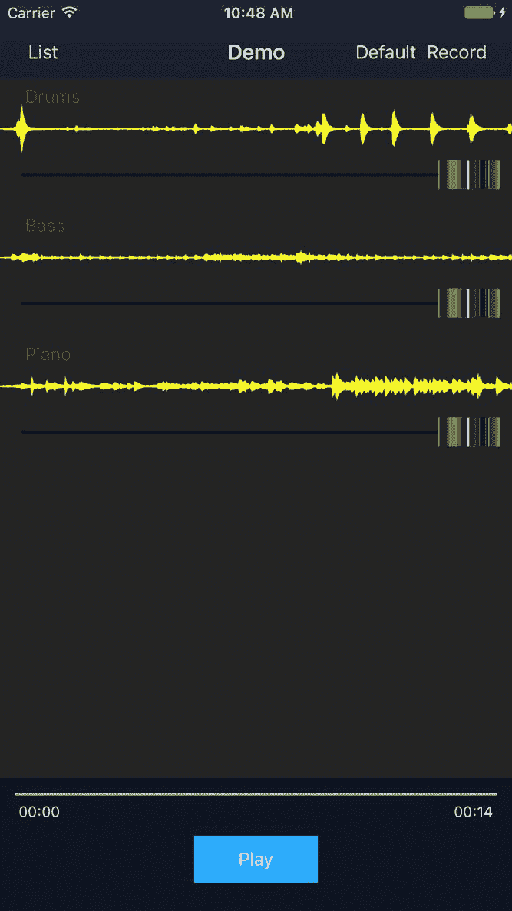
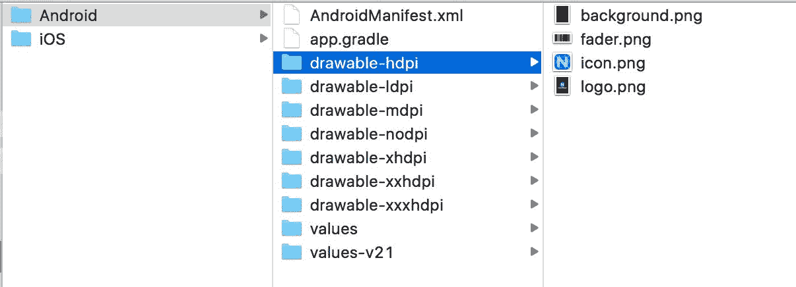
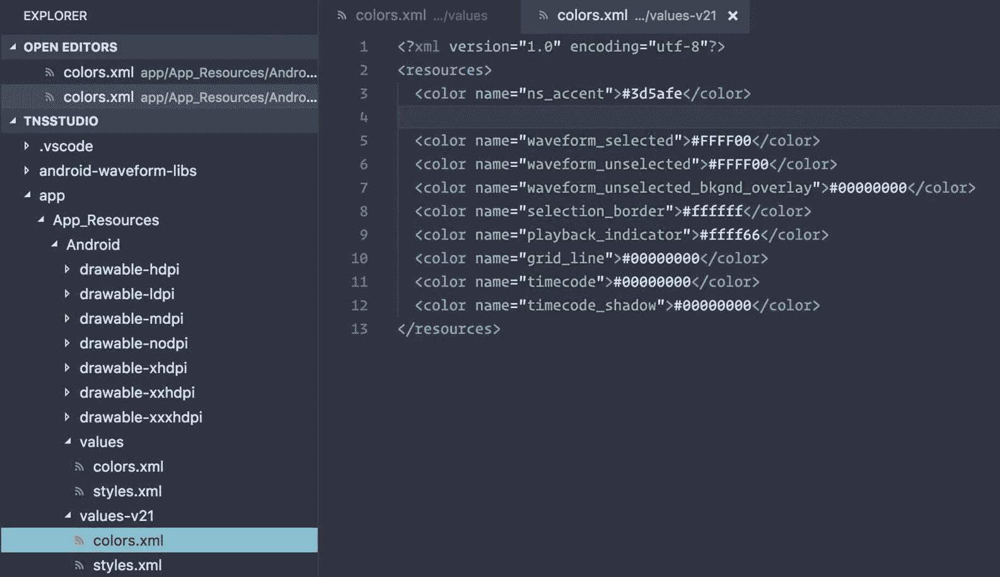
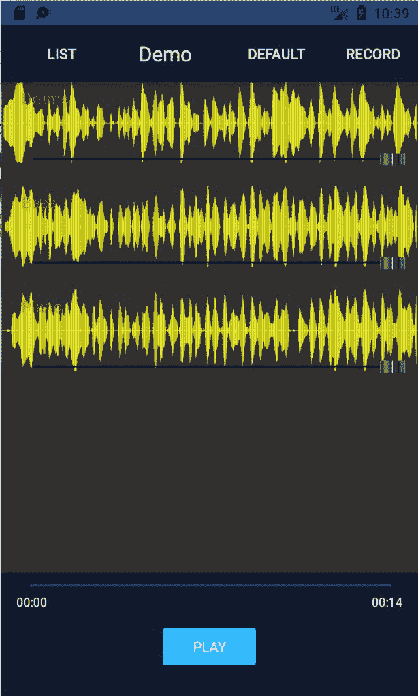

# 赋能你的视图

Angular 和 NativeScript 的结合在开发中非常有趣，对于移动开发来说功能强大得无法估量。无论你需要提供服务来与移动设备的硬件功能交互，例如音频录制，还是通过引人入胜的视图来丰富你的应用可用性，NativeScript for Angular 都提供了令人兴奋的机会。

让我们继续使用在前一章中开发的一些概念，以提供我们轨道的另一种丰富视图，同时重用我们迄今为止所涵盖的一切，以及一些新的技巧/技巧。

在本章中，我们将涵盖以下主题：

+   使用`ListView`和`templateSelector`的多个项行模板

+   使用`ListView`处理行模板更改以及何时如何刷新它们

+   通过`NativeScriptFormsModule`使用`ngModel`数据绑定

+   利用共享的单例服务在多个模块之间共享状态

+   在存储前序列化数据，并在从持久状态检索后进行恢复

+   利用和重用 Angular 指令来丰富 NativeScript Slider，使其具有更多独特的特性

# 使用 NativeScript 的 ListView 的多个项模板

在第八章“构建音频录制器”中，我们设计了一个双用途的定制 NativeScript Waveform 视图，它利用 iOS 和 Android 的各种本地库，专门用于丰富我们的作品列表视图。让我们通过重用我们的多才多艺的 Waveform 视图来处理我们的作品列表视图。这将为我们提供一种方法来显示混音滑动控制（通常在音频制作和声音工程中称为 Fader），与我们的轨道一起显示，使用户能够在整体作品中调整每个轨道的音量级别。让我们设置我们的`TrackListComponent`的`ListView`，使其能够为用户提供两种不同的方式来查看和处理他们的轨道，每种方式都有其独特的效用。在此同时，我们还将利用这个机会最终连接我们轨道上的`静音`开关。

让我们对`app/modules/player/components/track-list/track-list.component.html`进行以下修改：

```js
<ListView #listview [items]="tracks | orderBy: 'order'" class="list-group" 
  [itemTemplateSelector]="templateSelector">
  <ng-template let-track="item" nsTemplateKey="default">
    <GridLayout rows="auto" columns="100,*,100" class="list-group-item" 
      [class.muted]="track.mute">
      <Button text="Record" (tap)="record(track)" row="0" col="0" class="c-ruby"></Button>
      <Label [text]="track.name" row="0" col="1" class="h2"></Label>
      <Switch row="0" col="2" class="switch" [(ngModel)]="track.mute"></Switch>
    </GridLayout>
  </ng-template>

  <ng-template let-track="item" nsTemplateKey="waveform">
    <AbsoluteLayout [class.muted]="track.mute">
      <Waveform class="waveform w-full" top="0" left="0" height="80"
        [model]="track.model"
        type="file"
        plotColor="#888703"
        fill="true"
        mirror="true"
        plotType="buffer"></Waveform>

      <Label [text]="track.name" row="0" col="1" class="h3 track-name-float"
        top="5" left="20"></Label>
      <Slider slim-slider="fader.png" minValue="0" maxValue="1" 
        width="94%" top="50" left="0"
        [(ngModel)]="track.volume" class="slider fader"></Slider>
    </AbsoluteLayout>
  </ng-template>
</ListView>
```

这里发生了很多有趣的事情。首先，`[itemTemplateSelector]="templateSelector"`提供了在飞行中更改我们的`ListView`项行的能力。`templateSelector`函数的结果应该是一个字符串，它与任何 ng-template 的`ngTemplateKey`属性提供的值相匹配。为了使所有这些工作，我们需要准备一些事情，首先是具有通过`#listview`和`ViewChild`访问`ListView`的`Component`：

```js
// angular
import { Component, Input, ViewChild, ElementRef } from '@angular/core';
import { Router } from '@angular/router';

// nativescript
import { ListView } from 'ui/list-view';

// app
import { ITrack } from '../../../shared/models';
import { AuthService, DialogService } from '../../../core/services';
import { PlayerService } from '../../services/player.service';

@Component({
 moduleId: module.id,
 selector: 'track-list',
 templateUrl: 'track-list.component.html',
})
export class TrackListComponent {

  public templateSelector: Function;
  @Input() tracks: Array<ITrack>;
  @ViewChild('listview') _listviewRef: ElementRef;
 private _listview: ListView;
 private _sub: any;

  constructor(
    private authService: AuthService,
    private dialogService: DialogService,
    private router: Router,
    private playerService: PlayerService
  ) { 
    this.templateSelector = this._templateSelector.bind(this);
  }

  ngOnInit() {
 this._sub = this.playerService.trackListViewChange$.subscribe(() => {      // since this involves our templateSelector, ensure ListView knows about it
      // refresh list
 this._listview.refresh();
 });
 }

 ngAfterViewInit() {
 this._listview = <ListView>this._listviewRef.nativeElement;
 }

 private _templateSelector(item: ITrack, index: number, items: ITrack[]) {
 return this.playerService.trackListViewType;
 }
  ...
```

我们设置了一个`ViewChild`来保留对`ListView`的引用，稍后我们将使用它来调用`this._listview.refresh()`。在 Angular 中，当我们需要`ListView`在更改后更新显示时，这是必需的。第一个惊喜很可能是`PlayerService`的注入，第二个可能是`this.templateSelector = this._templateSelector.bind(this)`。`templateSelector`绑定不是作用域绑定的，并且由于我们需要它从`Component`上的`this.playerService`返回属性引用，我们通过绑定一个`Function`引用来确保它正确地绑定到`Component`的作用域。我们将在这个点上使用`PlayerService`作为沟通的渠道，以帮助从位于`MixerModule`中的`ActionBarComponent`传递状态。

这个例子展示了服务如何帮助在整个应用中传递状态。然而，通过利用 ngrx 来减少交织的依赖关系并解锁具有 Redux 风格架构的纯响应式设置，这种做法可以得到极大的改进。ngrx 增强功能将在第十章中介绍，即`@ngrx/store + @ngrx/effects for State Management`。

我们的视图切换按钮将位于`ActionBar`（在`MixerModule`中），并且我们希望在那里点击以切换我们位于`PlayerModule`内部的`ListView`。`PlayerService`目前是一个单例（由`CoreModule`提供），并在整个应用中共享，因此它是一个完美的候选者来协助这里。让我们首先查看`app/modules/mixer/components/action-bar/action-bar.component.ios.html`中的`ActionBarComponent`更改：

```js
<ActionBar [title]="title" class="action-bar">
  <ActionItem nsRouterLink="/mixer/home">
    <Button text="List" class="action-item"></Button>
  </ActionItem>
  <ActionItem (tap)="toggleList()" ios.position="right">
 <Button [text]="toggleListText" class="action-item"></Button>
 </ActionItem>
  <ActionItem (tap)="record()" ios.position="right">
    <Button text="Record" class="action-item"></Button>
  </ActionItem>
</ActionBar>
```

然后，我们将查看`app/modules/mixer/components/action-bar/action-bar.component.android.html`中的更改：

```js
<ActionBar class="action-bar">
  <GridLayout rows="auto" columns="auto,*,auto,auto" class="action-bar">
    <Button text="List" nsRouterLink="/mixer/home" 
      class="action-item" row="0" col="0"></Button>
    <Label [text]="title" class="action-bar-title text-center" row="0" col="1"></Label>
    <Button [text]="toggleListText" (tap)="toggleList()" 
 class="action-item" row="0" col="2"></Button>
    <Button text="Record" (tap)="record()" 
      class="action-item" row="0" col="3"></Button>
  </GridLayout>
</ActionBar>
```

我们还将查看`Component`中的更改：

```js
...
import { PlayerService } from '../../../player/services/player.service';

@Component({
  moduleId: module.id,
  selector: 'action-bar',
  templateUrl: 'action-bar.component.html'
})
export class ActionBarComponent {
  ...
  public toggleListText: string = 'Waveform';

  constructor(
    private router: RouterExtensions,
    private playerService: PlayerService
  ) { }
  ...
  public toggleList() {
    // later we can use icons, using labels for now let type = this.playerService.trackListViewType === 'default' ? 'waveform' : 'default';
    this.playerService.trackListViewType = type;
    this.toggleListText = type === 'default' ? 'Waveform' : 'Default';
 }
}
```

如您所见，我们在`ActionBar`中添加了一个按钮，它将使用`Waveform`或`Default`标签，具体取决于其状态。然后，我们使用`PlayerService`修改了一个新的设置器`**this.playerService.trackListViewType** **=** **type**`。现在让我们查看`app/modules/player/services/player.service.ts`：

```js
...
@Injectable()
export class PlayerService {
  ...
  // communicate state changes from ActionBar to anything else
  public trackListViewChange$: Subject<string> = new Subject(); ... public get trackListViewType() {
    return this._trackListViewType;
  }

  public set trackListViewType(value: string) {
    this._trackListViewType = value;
    this.trackListViewChange$.next(value);
  } ...
```

这就完成了这项工作**。**

如前所述，我们将在下一章中使用 ngrx 改进这个设置，ngrx 全部关于润色和简化我们处理应用状态的方式。

为了确保所有我们的新功能都能正常工作，我们还需要做一些其他事情。首先，没有`NativeScriptFormsModule`，`[(ngModel)]`绑定将完全不起作用。

如果你在你的组件视图中使用`ngModel`绑定，你必须确保声明你的`Component`的模块导入了`NativeScriptFormsModule`。如果它使用`SharedModule`，确保`SharedModule`导入了并导出了`NativeScriptFormsModule`。

让我们将前一条提示中提到的模块添加到我们的`SharedModule`中，这样我们的所有模块都可以在需要的地方使用`ngModel`：

```js
...
import { NativeScriptFormsModule } from 'nativescript-angular/forms'; 
...
@NgModule({
  imports: [
    NativeScriptModule, 
    NativeScriptRouterModule,
    NativeScriptFormsModule
  ],
  ...
  exports: [
    NativeScriptModule,
    NativeScriptRouterModule,
    NativeScriptFormsModule,
    ...PIPES
  ]
})
export class SharedModule {}
```

现在，我们需要每个轨道的静音和音量属性更改来通知我们的音频播放器。这涉及到稍微修改我们的 `TrackModel` 以适应这个新功能；为此，打开 `app/modules/shared/models/track.model.ts`：

```js
import { BehaviorSubject } from 'rxjs/BehaviorSubject';
...
export class TrackModel implements ITrack {
  public id: number;
  public filepath: string;
  public name: string;
  public order: number;
  public model: any;

  public volume$: BehaviorSubject<number>;

  private _volume: number = 1; // default full volume
  private _mute: boolean;
  private _origVolume: number; // return to after unmute

  constructor(model?: ITrack) {
    this.volume$ = new BehaviorSubject(this._volume);
    ...
  }

  public set mute(value: boolean) {
 this._mute = value;
 if (this._mute) {
 this._origVolume = this._volume;
 this.volume = 0;
 } else {
 this.volume = this._origVolume;
 }
 }

 public get mute() {
 return this._mute;
 }

 public set volume(value: number) {
 this._volume = value;
 this.volume$.next(this._volume);
 if (this._volume > 0 && this._mute) {
      // if just increasing volume from a muted state
      // ensure it's unmuted
 this._origVolume = this._volume;
 this._mute = false;
 }
 }

 public get volume() {
 return this._volume;
 }
}
```

我们现在想要修改我们的 `TrackPlayerModel` 以与这些新功能协同工作。之前，我们只保留 `trackId`；然而，随着这个新功能的加入，保留整个 `TrackModel` 对象的引用将很有帮助，所以打开 `app/modules/shared/models/track-player.model.ts` 并进行以下修改：

```js
...
import { Subscription } from 'rxjs/Subscription';
...
interface ITrackPlayer {
  track: TrackModel; // was trackId only
  duration: number;
  readonly player: TNSPlayer;
}
...
export class TrackPlayerModel implements ITrackPlayer {
  public track: TrackModel;
  ...
  private _sub: Subscription;
  ...
  public load(track: TrackModel, complete: Function, error: Function): Promise<number> {
    return new Promise((resolve, reject) => {
      this.track = track;

      this._player.initFromFile({
        ...
      }).then(() => {
        ...
        // if reloading track, clear subscription before subscribing again
        if (this._sub) this._sub.unsubscribe();
 this._sub = this.track.volume$.subscribe((value) => {
 if (this._player) {
 // react to track model property changes
 this._player.volume = value;
 }
 });
      }, reject);
    });
  }
  ...
  public cleanup() {
    // cleanup and dispose player
    if (this.player) this.player.dispose();
    if (this._sub) this._sub.unsubscribe(); 
  }
  ...
```

我们的音乐播放器现在可以通过观察每个轨道通过数据绑定进行的音量更改来响应音量变化。由于静音本质上只需要修改播放器的音量，我们确保相应地更新音量，并在切换静音/取消静音时保持原始音量，这样任何自定义的音量设置都将被保留。

我们对轨道的新丰富视图包括可重用的波形视图，但这次是 `type="file"`，因为这将激活音频文件静态波形以渲染，这样我们就可以 *看到* 我们的音乐。我们还提供了调整每个轨道音量（混音控制）并将标签浮到左上角的能力，这样用户仍然知道是什么。所有这些操作都是通过利用 `AbsoluteLayout` 容器来完成的，它允许我们重叠组件并手动将它们放置在彼此之上。

# 序列化数据以持久化并在检索时恢复

所有这些都工作得非常好，然而，我们引入了一个问题。我们的 `MixerService` 提供了保存这些包含所有轨道的合成的功能。然而，现在的轨道包含复杂对象，如可观察对象，甚至带有获取器和设置器的私有引用。

在持久化数据时，你通常会想使用 `JSON.stringify` 序列化对象以便在存储时可以稍后检索并如果需要的话将其注入到更复杂的模型中。

事实上，如果你现在尝试使用 `JSON.stringify` 处理我们的 `TrackModel`，它将会失败，因为你不能将某些结构序列化为字符串。因此，我们现在需要在存储之前将我们的数据序列化，以及当检索数据时恢复我们的更复杂的模型。让我们对我们的 `MixerService` 进行一些修改以解决这个问题。打开 `app/modules/mixer/services/mixer.service.ts` 并进行以下修改：

```js
// nativescript
import { knownFolders, path } from 'file-system';
...
@Injectable()
export class MixerService {

  public list: Array<IComposition>;

  constructor(
    private databaseService: DatabaseService,
    private dialogService: DialogService
  ) {
    // restore with saved compositions or demo list
    this.list = this._hydrateList(this._savedCompositions() || this._demoComposition());
  }
  ...
  private _saveList() {
    this.databaseService.setItem(DatabaseService.KEYS.compositions, this._serializeList());
  }

  private _serializeList() {
 let serialized = [];
 for (let comp of this.list) {
 let composition: any = Object.assign({}, comp);
 composition.tracks = [];
 for (let track of comp.tracks) {
 let serializedTrack = {};
 for (let key in track) {
          // ignore observable, private properties and waveform model (redundant)
          // properties are restored upon hydration
 if (!key.includes('_') && !key.includes('$') && key != 'model') {
 serializedTrack[key] = track[key];
 }
 }
 composition.tracks.push(serializedTrack);
 }
      // serialized composition
 serialized.push(composition);
 }
 return serialized;
 }

 private _hydrateList(list: Array<IComposition>) {
 for (let c = 0; c < list.length; c++) {
 let comp = new CompositionModel(list[c]);
 for (let i = 0; i < comp.tracks.length; i++) {
 comp.tracks[i] = new TrackModel(comp.tracks[i]);
        // for waveform
 (<any>comp.tracks[i]).model = {
          // fix is only for demo tracks since they use files from app folder
 target: fixAppLocal(comp.tracks[i].filepath)
 };
 }
 // ensure list ref is updated to use hydrated model
 list[c] = comp;
 }
 return list;
 }
  ...
}

const fixAppLocal = function (filepath: string) {
 if (filepath.indexOf('~/') === 0) {    // needs to be absolute path and not ~/ app local shorthand
 return path.join(knownFolders.currentApp().path, filepath.replace('~/', ''));
 }
 return filepath;
}
```

现在，我们将确保每次保存我们的合成时，它都正确地序列化为一个更安全、更简化的形式，这样就可以通过 `JSON.stringify` 处理。然后，当从我们的持久存储（在这种情况下，通过在 `DatabaseService` 的底层使用 NativeScript 的应用程序设置模块；这将在 第二章，*功能模块*中介绍）检索数据时，我们将数据重新注入到我们的模型中，这将使用我们的可观察属性丰富数据。

# 利用 Angular 指令丰富 NativeScript 滑块的独特特性

对于每个轨道滑块（也称为我们的混音/音量控制），实际上渲染一个看起来像滑块的控件会很好，这样就可以清楚地知道这些滑块是混音旋钮，不会被误认为是该轨道的快进播放。我们可以创建一个用于这些滑块的图形，它看起来会是这样：


对于 iOS，我们还需要一个按下/高亮状态，以便用户按下滑块时用户体验良好：



我们现在可以为这些文件创建两个版本，并将它们放入`app/App_Resources/iOS`；原始版本将是 100x48 像素用于标准分辨率，而对于 iPhone Plus 及以上型号，我们将有一个@3x 版本，大小为 150x72 像素（基本上是 24 像素加上标准的 48 像素高度）：

+   `fader-down.png`

+   `fader-down@3x.png`

+   `fader.png`

+   `fader@3x.png`

我们现在可以重用我们的`SlimSliderDirective`（目前用于自定义快进滑块的样式）并提供一个输入，以便我们可以提供从我们的应用程序资源中使用的文件名：

打开`app/modules/player/directives/slider.directive.ios.ts`并做出以下修改：

```js
import { Directive, ElementRef, Input } from '@angular/core';

@Directive({
  selector: '[slim-slider]'
})
export class SlimSliderDirective {
  @Input('slim-slider') imageName: string;

  constructor(private el: ElementRef) { } 

  ngAfterViewInit() {
    let uiSlider = <UISlider>this.el.nativeElement.ios;
    if (this.imageName) {
 uiSlider.setThumbImageForState(
 UIImage.imageNamed(this.imageName), UIControlState.Normal);
      // assume highlighted state always suffixed with '-down'
      let imgParts = this.imageName.split('.');
 let downImg = `${imgParts[0]}-down.${imgParts[1]}`;
 uiSlider.setThumbImageForState(
 UIImage.imageNamed(downImg), UIControlState.Highlighted);
    } else {
      // used for shuttle control
      uiSlider.userInteractionEnabled = false;
      uiSlider.setThumbImageForState(UIImage.new(), UIControlState.Normal);
    }
  }
}

```

这允许我们指定要作为组件本身上的`Slider`滑块的文件名：

```js
<Slider slim-slider="fader.png" minValue="0" maxValue="1" 
  width="94%" top="50" left="0"
  [(ngModel)]="track.volume" class="slider fader"></Slider>
```

在此基础上，我们现在在轨道混音视图切换激活时拥有了这些整洁的滑块控件：



# 图形和资源处理（针对 Android）

现在，让我们也处理 Android 版本。我们首先将标准的 48 像素高度的滑块图形复制到 app/App_Resources/Android/drawable-hdpi 文件夹中。然后我们可以创建这个图形的适当分辨率版本，并将它们复制到各个分辨率相关的文件夹中。在处理 Android 时，需要注意的一点是它**不**像 iOS 那样使用"@3x"后缀标识符，所以我们只是将这些文件命名为"fader.png"。以下是我们的图形在分辨率相关文件夹中的一个视图（在这种情况下是**hdpi**，它处理“高密度”屏幕分辨率）：



我们现在可以自定义我们的 Android 滑块指令，包括滑块图像处理，打开`app/modules/player/directives/slider.directive.android.ts`：

```js
import { Directive, ElementRef, Input } from '@angular/core';
import { fromResource } from 'image-source';
import { getNativeApplication } from 'application';

let application: android.app.Application;
let resources: android.content.res.Resources;

const getApplication = function () {
 if (!application) {
 application = (<android.app.Application>getNativeApplication());
 }
 return application;
}

const getResources = function () {
 if (!resources) {
 resources = getApplication().getResources();
 }
 return resources;
}

@Directive({
 selector: '[slim-slider]'
})
export class SlimSliderDirective {
  @Input('slim-slider') imageName: string;
 private _thumb: android.graphics.drawable.BitmapDrawable;

  constructor(private el: ElementRef) { 
    el.nativeElement[(<any>slider).colorProperty.setNative] = function (v) {
// ignore the NativeScript default color setter of this slider
 };
  }

  ngAfterViewInit() {
    let seekBar = <android.widget.SeekBar>this.el.nativeElement.android;
    if (this.imageName) {
 if (!seekBar) {
        // part of view toggle - grab on next tick
        // this helps ensure the seekBar instance can be accessed properly
        // since this may fire amidst the view toggle switching on our tracks
        setTimeout(() => {
 seekBar = <android.widget.SeekBar>this.el.nativeElement.android;
 this._addThumbImg(seekBar);
 });
 } else {
 this._addThumbImg(seekBar);
 }
    } else {
      // seekBar.setEnabled(false);
      seekBar.setOnTouchListener(new android.view.View.OnTouchListener({
        onTouch(view, event) {
          return true;
        }
      }));
      seekBar.getThumb().mutate().setAlpha(0);
    }
  }

  private _addThumbImg(seekBar: android.widget.SeekBar) {
 if (!this._thumb) {
 let imgParts = this.imageName.split('.');
 let name = imgParts[0];
 const res = getResources();
 if (res) {
 const identifier: number = res.getIdentifier(
 name, 'drawable',  getApplication().getPackageName());
 if (0 < identifier) {
          // Load BitmapDrawable with getDrawable to make use of Android internal caching
 this._thumb = <android.graphics.drawable.BitmapDrawable>res.getDrawable(identifier);
 }
 }
 }
    if (this._thumb) {
 seekBar.setThumb(this._thumb);
 seekBar.getThumb().clearColorFilter();
 if (android.os.Build.VERSION.SDK_INT >= 21) {
 (<any>seekBar).setSplitTrack(false);
 }
 }
 }
}
```

上述 Android 实现中最不寻常且可能令人惊讶的方面之一是这一点：

```js
constructor(private el: ElementRef) { 
  el.nativeElement[(<any>slider).colorProperty.setNative] = function (v) {
    // ignore the NativeScript color setter of the slider
  };
}
```

通常情况下，在 NativeScript 中重用和扩展控件相当容易。然而，这是一个例外情况，其中默认的 NativeScript 滑块控件设置器实际上会在**Android**上给我们带来问题。默认设置器将尝试将滑块的拇指颜色设置为蓝色，并附带一个混合方法。当它将此标志设置为滑块时，我们设置的任何图形形状都会被设置为全蓝色。因此，为了使我们的滑块类能够处理自定义图形，我们必须消除控件上的默认滑块拇指颜色设置器。我们通过附加一个新的“color”设置器来控制这一点，该设置器实际上什么也不做。这样，当 NativeScript 框架在初始化或重置控件时尝试设置默认颜色时，什么也不会发生，这样我们就可以完全控制发生的事情。作为预防措施，在`_addThumbImg`方法结束时，我们还调用`seekBar.getThumb().clearColorFilter();`以确保在能够使默认颜色设置器沉默之前，任何潜在的颜色过滤器设置都被取消。

最后，当我们的曲目列表视图切换到混音模式时，我们可以自定义显示在每个轨道上的音频波形所使用的颜色。由于 Android 的波形插件使用应用程序的颜色资源，我们可以在 app/App_Resources/Android/values/colors.xml 中添加插件文档中找到的正确命名的属性，并且相同的颜色也应该复制到 app/App_Resources/Android/values-v21/colors.xml 中：



这现在为我们提供了在混音模式下 Android 文件波形显示的自定义样式：



# 摘要

我们希望提供一些额外的宝贝，与你在第三部分中学到的所有丰富内容一起使用；我们希望你喜欢！使用`ListView`的多个项目行模板在许多情况下都很有用，但希望这会给你提供工具，让你知道如何让它为你和你的应用程序工作。

对于数据持久性，特殊考虑是任何引人入胜的应用程序的重要因素，因此我们研究了在存储之前序列化数据，并在从持久状态恢复数据时注水数据。

最后，我们研究了进一步丰富我们的视图组件，添加更多的 Angular 指令优点。随着第三部分的完成，我们现在已经完成了为本书提供的应用程序的核心能力和功能集。然而，我们离完成应用程序还远着呢。本书中介绍的开发工作流程和过程是我们为任何我们构建的应用程序带来的典型开发周期。我们将在第十四章部署准备与 webpack 捆绑中介绍改进我们的架构和进一步打磨我们的应用程序，以准备通过 Google Play 和 App Store 进行公开发布。

现在让我们继续前进，通过在第十章中使用`ngrx`集成来改进我们应用的状态处理，即使用`@ngrx/store + @ngrx/effects`进行状态管理。值得一提的是，使用类似 Redux 的架构是一个更好的决定，最好在构建应用之前就做出，正如我们在这里所做的那样。然而，这并不是必需的，也不是强制性的，因此，我们希望在不包含它的前提下构建应用，以展示该应用在本质上运行得很好。现在，我们将继续将其整合进来，以展示您可以通过它获得的各项优势。
