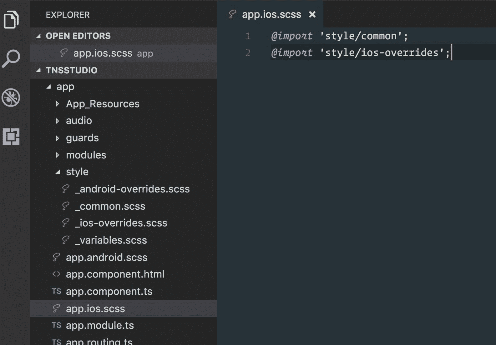
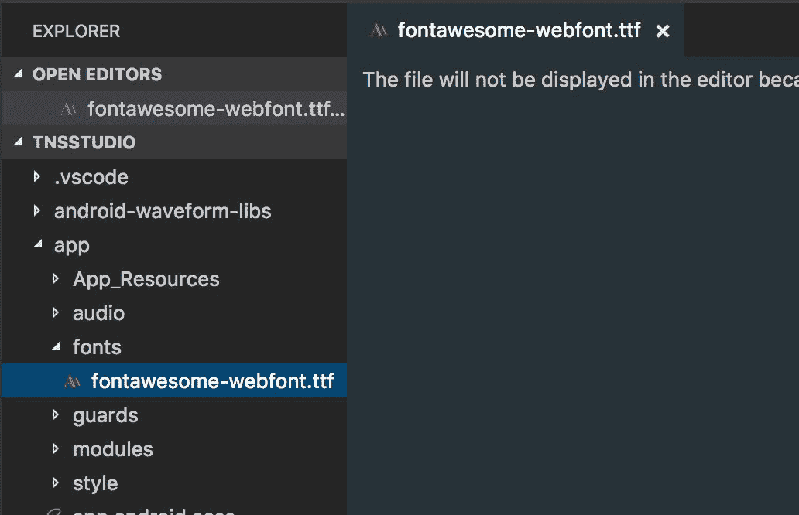
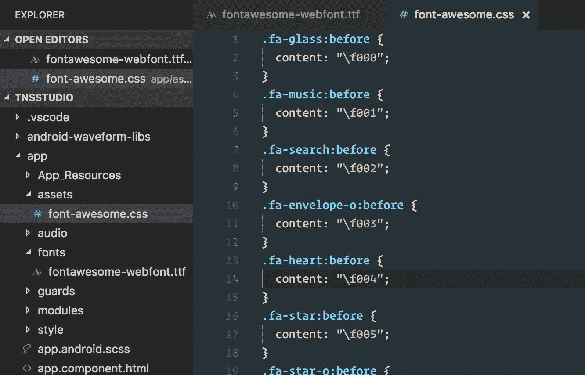
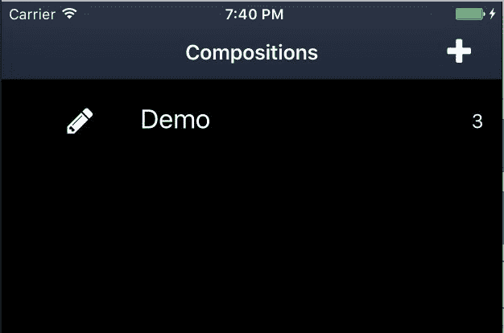
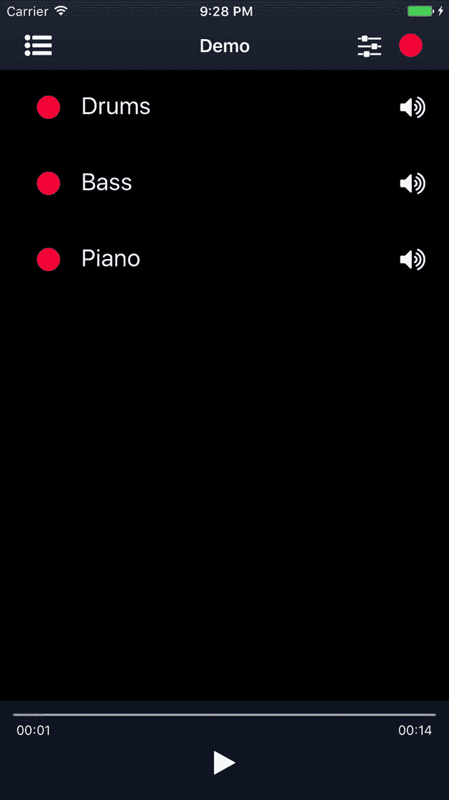
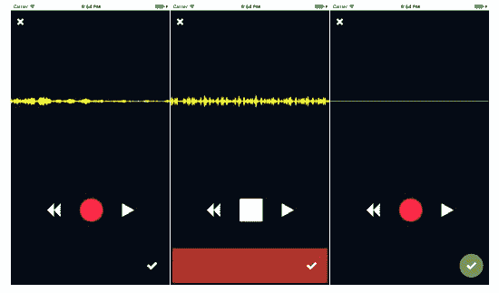
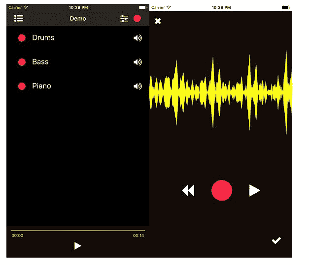

# 第十一章：使用 SASS 进行抛光

在上一章中介绍了一些底层管道改进和 ngrx 状态管理之后，现在终于到了抛光此应用以改善其整体外观和感觉的时候了。样式的时机完全取决于您的发展流程，而且我们通常喜欢边走边抛光。在这本书中，我们选择避免将 CSS 抛光与功能开发混合，以保持概念更加集中。然而，现在我们已经到了这里，我们无法更兴奋地看到我们的应用获得那个漂亮的外观。

由于标准 CSS 随着样式的增长而变得难以维护，我们将集成 SASS 以提供帮助。实际上，我们将利用由帮助提出 NativeScript 品牌名称的那个人，Todd Anglin，开发的社区插件。

在本章中，我们将涵盖以下主题：

+   将 SASS 集成到您的应用中

+   构建核心主题 SASS 设置的最佳实践

+   构建可扩展的样式设置，以最大化 iOS 和 Android 之间的样式重用

+   使用字体图标，例如 *Font Awesome*，使用 nativescript-ngx-fonticon 插件

# 使用 SASS 进行抛光

SASS 是世界上最成熟、最稳定、功能最强大的专业级 CSS 扩展语言... Sass 是 CSS 的扩展，它为基本语言增添了力量和优雅。它允许您使用变量、嵌套规则、混入、内联导入等，所有这些都具有完全兼容 CSS 的语法。SASS 有助于保持大型样式表的良好组织，并使小型样式表快速运行。

+   [`sass-lang.com/documentation/file.SASS_REFERENCE.html`](http://sass-lang.com/documentation/file.SASS_REFERENCE.html)

听起来不错？当然。

我们首先想要安装由 Todd Anglin 发布的社区插件：

```js
npm install nativescript-dev-sass --save-dev
```

此插件将设置一个钩子，在构建您的应用之前自动将 SASS 编译为 CSS，因此您无需担心安装任何其他构建工具。

现在，我们希望以特定的方式组织我们的 SASS 源文件，这样不仅有助于维护 iOS 和 Android 之间的共享样式，而且还可以轻松地进行平台特定的调整/覆盖。默认安装的核心主题（`nativescript-theme-core`）附带了一套完整的 SASS 源文件，这些文件已经组织得很好，可以帮助您轻松地在它之上构建自定义 SASS。

让我们从重命名以下内容开始：

+   `app.ios.css` 改为 `app.ios.**scss**`

+   `app.android.css` 改为 `app.android.**scss**`

然后对于 `app.ios.scss` 的内容：

```js
@import 'style/common';
@import 'style/ios-overrides';
```

对于 `app.android.scss`：

```js
@import 'style/common';
@import 'style/android-overrides';
```

好的，现在，让我们创建那个 `style` 文件夹，包含各种部分 SASS 导入文件，以帮助我们设置，从变量开始：

+   `style/_variables.scss`：

```js
// baseline theme colors
@import '~nativescript-theme-core/scss/dark';
// define our own variables or simply override those from the light set here...
```

实际上，您可以根据许多不同的皮肤/颜色来构建您应用的样式表。查看以下文档部分以了解可用内容：[`docs.nativescript.org/ui/theme#color-schemes`](http://docs.nativescript.org/ui/theme#color-schemes)。对于我们的应用，我们将基于 *dark* 皮肤来设置我们的颜色。

现在，创建一个公共共享的 SASS 文件，这是共享样式的大部分内容将放置的地方。实际上，我们将把在 `common.css` 文件中定义的所有内容都放在这里（之后，删除我们之前拥有的 `common.css` 文件）：

+   `style/_common.scss`：

```js
// customized variables
@import 'variables';
// theme standard rulesets
@import '~nativescript-theme-core/scss/index';
// all the styles we had created previously in common.css migrated into here:

.action-bar {
  background-color:#101B2E; // we can now convert this to a SASS variable
}

Page {
  background-color:#101B2E; // we can now convert this to a SASS variable
}

ListView { 
  separator-color: transparent; 
}

.track-name-float {
  color: RGBA(136, 135, 3, .5); // we can now convert this to a SASS variable
}

.slider.fader {
  background-color: #000; // we could actually use $black from core theme now
}

.list-group .muted {
  opacity:.2;
}

```

这使用了我们刚刚创建的变量文件，它使我们能够提供从核心主题中提供的自己的基线变量以及我们对颜色的自定义调整。

现在，创建 Android 覆盖文件以备不时之需：

+   `styles/_android-overrides.scss`：

```js
@import '~nativescript-theme-core/scss/platforms/index.android';
// our custom Android overrides can go here if needed...
```

这将导入核心主题的 Android 覆盖，同时仍然允许我们在需要时应用我们自己的自定义覆盖。

我们现在可以为 iOS 做同样的事情：

+   `styles/_ios-overrides.scss`：

```js
@import '~nativescript-theme-core/scss/platforms/index.ios';
// our custom iOS overrides can go here if needed...
```

最后，我们现在可以将任何特定组件的 `.css` 文件转换为 `**.scss**`。我们有一个组件使用它自己的定义样式，`record.component.css`。只需将其重命名为 `**.scss**`。NativeScript SASS 插件会自动编译它找到的任何嵌套 `.scss` 文件。

你可能还想做两件事：

除了在您的 IDE 中隐藏 `.css` 和 `.js` 文件外，还要忽略所有 `*.css` 文件从 git 中。

你不希望在未来与其他开发人员发生合并冲突，因为你的 `.css` 文件将在每次构建应用时通过 SASS 编译新生成。

将以下内容添加到您的 `.gitignore` 文件中：

```js
*.js
*.map
*.css
hooks
lib
node_modules
/platforms
```

然后，为了在 VS Code 中隐藏 `.js` 和 `.css` 文件，我们可以这样做：

```js
{
  "files.exclude": {
    "**/app/**/*.css": {
 "when": "$(basename).scss"
 },
 "**/app/**/*.js": {
 "when": "$(basename).ts"
 },
    "**/hooks": true,
    "**/node_modules": true,
    "platforms": true
  }
}
```

下面是现在结构应该看起来像的截图：



# 使用 nativescript-ngx-fonticon 插件使用字体图标

真的很好，我们可以用漂亮的清晰图标替换所有那些无聊的标签按钮，让我们来做这件事。NativeScript 提供了使用按钮、标签和更多文本属性上的 Unicode 值来支持自定义字体图标的功能。然而，使用 Angular，我们可以利用另一个巧妙的插件，它将提供一个很好的 Pipe，允许我们使用字体名称以提高使用便利性和清晰度。

安装以下插件：

```js
npm install nativescript-ngx-fonticon --save
```

对于这个应用，我们将使用多功能的 font-awesome 图标，所以让我们从这里从官方网站下载这个包：[`fontawesome.io/`](http://fontawesome.io/)。

在其中，我们将找到所需的字体文件和 css。我们首先将 `fontawesome-webfont.ttf` 文件复制到我们在 `app` 文件夹中创建的 `new fonts` 文件夹中。NativeScript 在构建应用时会查找该文件夹中的任何自定义字体文件：



现在，我们想要将 `css/font-awesome.css` 文件也复制到我们的应用文件夹中。我们可以将其放置在文件夹的根目录或子文件夹中。我们将创建一个 `assets` 文件夹来存放这个文件以及未来可能的其他类似项目。

然而，我们需要稍微修改这个 `.css` 文件。`nativescript-ngx-fonticon` 插件只与字体类名一起工作，不需要字体 Awesome 提供的任何实用类。因此，我们需要修改它，移除顶部的大量内容，使其看起来像这样：



你可以在以下视频中了解更多信息：[`www.youtube.com/watch?v=qb2sk0XXQDw`](https://www.youtube.com/watch?v=qb2sk0XXQDw)。

我们还设置了 git 忽略所有 `*.css` 文件；然而，我们不想忽略以下文件：

```js
*.js
*.map
*.css
!app/assets/font-awesome.css
hooks
lib
node_modules
/platforms
```

现在，我们准备设置插件。由于这应该是我们应用核心设置的一部分，我们将使用我们的插件配置修改 `app/modules/core/core.module`：

```js
...
import { TNSFontIconModule } from 'nativescript-ngx-fonticon';
...
@NgModule({
  imports: [
    ...MODULES,
    // font icons
    TNSFontIconModule.forRoot({
 'fa': './assets/font-awesome.css'
 }),
    ...
  ],
  ...
})
export class CoreModule {
```

由于该模块依赖于 `TNSFontIconService`，让我们修改我们的根组件以注入它，确保 Angular 的 DI 为我们实例化单例以供应用全局使用。

`app/app.component.ts`：

```js
...
// libs
import { TNSFontIconService } from 'nativescript-ngx-fonticon';

@Component({
  moduleId: module.id,
  selector: 'my-app',
  templateUrl: 'app.component.html'
})
export class AppComponent {

  constructor(private fontIconService: TNSFontIconService) {
    ...
```

接下来，我们想要确保 `fonticon` 管道对任何我们的视图组件都是可访问的，所以让我们从我们的 `SharedModule` 在 `app/modules/shared/shared.module.ts` 中导入和导出模块：

```js
...
// libs
import { TNSFontIconModule } from 'nativescript-ngx-fonticon';
...
@NgModule({
  imports: [
    NativeScriptModule, 
    NativeScriptRouterModule, 
    NativeScriptFormsModule, 
    TNSFontIconModule
  ],
  ...
  exports: [
    ...
    TNSFontIconModule, ...PIPES  ]
})
export class SharedModule {}
```

最后，我们需要一个类来指定哪些组件应该使用字体 Awesome 来渲染自己。由于这个类将在 iOS/Android 之间共享，修改 `app/style/_common.scss` 如下：

```js
// customized variables
@import 'variables';
// theme standard rulesets
@import '~nativescript-theme-core/scss/index';

.fa {
 font-family: 'FontAwesome', fontawesome-webfont;
 font-size: 25;
}
```

我们定义两个字体家族的原因是 iOS 和 Android 之间的差异。Android 使用文件的名称作为字体家族的名称（在本例中为 `fontawesome-webfont.ttf`）。而 iOS 使用实际的字体名称；示例可以在 [`github.com/FortAwesome/Font-Awesome/blob/master/css/font-awesome.css#L8`](https://github.com/FortAwesome/Font-Awesome/blob/master/css/font-awesome.css#L8) 找到。如果你想要，你可以将字体文件名重命名为 `FontAwesome.ttf` 以使用 `font-family: FontAwesome`。你可以在 [`fluentreports.com/blog/?p=176`](http://fluentreports.com/blog/?p=176) 了解更多。

现在，让我们尝试在我们的应用中渲染图标的新功能。打开 `app/modules/mixer/components/mix-list.component.html`：

```js
<ActionBar title="Compositions" class="action-bar">
  <ActionItem (tap)="add()" ios.position="right">
    <Button [text]="'fa-plus' | fonticon" class="fa action-item"></Button>
  </ActionItem>
</ActionBar>
<ListView [items]="(mixer$ | async)?.compositions | orderBy: 'order'" class="list-group">
  <ng-template let-composition="item">
    <GridLayout rows="auto" columns="100,*,auto" class="list-group-item">
      <Button [text]="'fa-pencil' | fonticon" (tap)="edit(composition)" 
        row="0" col="0" class="fa"></Button>
      <Label [text]="composition.name" (tap)="select(composition)" 
        row="0" col="1" class="h2"></Label>
      <Label [text]="composition.tracks.length" 
        row="0" col="2" class="text-right"> </Label>
    </GridLayout>
  </ng-template>
</ListView>
```

让我们还将调整 `ListView` 的背景颜色为黑色。现在我们甚至可以使用核心主题中的预定义变量，使用 SASS 在 `app/style/_common.scss` 中：

```js
.list-group {
  background-color: $black;

  .muted {
    opacity:.2;
  }
}
```



我们的内容列表视图现在开始看起来相当不错。

让我们继续并添加一些图标到我们的曲目列表视图 `app/modules/player/components/track-list/track-list.component.html`：

```js
<ListView #listview [items]="tracks | orderBy: 'order'" 
  class="list-group" [itemTemplateSelector]="templateSelector">
  <ng-template let-track="item" nsTemplateKey="default">
    <GridLayout rows="auto" columns="60,*,30" 
      class="list-group-item" [class.muted]="track.mute">
      <Button [text]="'fa-circle' | fonticon" 
        (tap)="record(track)" row="0" col="0" class="fa c-ruby"></Button>
      <Label [text]="track.name" row="0" col="1" class="h2"></Label>
      <Label [text]="(track.mute ? 'fa-volume-off' : 'fa-volume-up') | fonticon"
        row="0" col="2" class="fa" (tap)="track.mute=!track.mute"></Label>
    </GridLayout>
  </ng-template>
  ...
```

我们正在用设计用来切换两个不同图标的标签替换我们之前的开关。我们还利用了核心主题的便捷颜色类，如 c-ruby。

我们还可以通过添加一些图标来改进我们的自定义 `ActionBar` 模板：

```js
<ActionBar [title]="title" class="action-bar">
  <ActionItem nsRouterLink="/mixer/home">
    <Button [text]="'fa-list-ul' | fonticon" class="fa action-item"></Button>
  </ActionItem>
  <ActionItem (tap)="toggleList()" ios.position="right">
    <Button [text]="((uiState$ | async)?.trackListViewType == 'default' ? 'fa-sliders' : 'fa-list') | fonticon" class="fa action-item"></Button>
  </ActionItem>
  <ActionItem (tap)="recordAction.next()" ios.position="right">
    <Button [text]="'fa-circle' | fonticon" class="fa c-ruby action-item"></Button>
  </ActionItem>
</ActionBar>
```

我们现在可以美化 `app/modules/player/components/player-controls/player-controls.component.html` 中的播放器控件：

```js
<StackLayout row="1" col="0" class="controls">
  <shuttle-slider></shuttle-slider>
  <Button [text]="((playerState$ | async)?.player?.playing ? 'fa-pause' : 'fa-play') | fonticon" (tap)="togglePlay()" class="fa c-white t-30"></Button>
</StackLayout>
```

我们将利用核心主题中的更多辅助类。`c-white`类将我们的图标变为白色，而`t-30`设置`font-size: 30`。后者是`text-30`的简称，其他还有`color-white`。

让我们来看看：



真是令人惊叹，一些简单的样式润色就能真正展现你应用的个性。让我们再次拿起画笔，在我们的`app/modules/recorder/components/record.component.html`记录视图中进行润色：

```js
<ActionBar title="Record" icon="" class="action-bar">
  <NavigationButton visibility="collapsed"></NavigationButton>
  <ActionItem text="Cancel" ios.systemIcon="1" (tap)="cancel()"></ActionItem>
</ActionBar>
<FlexboxLayout class="record">
  <GridLayout rows="auto" columns="auto,*,auto" class="p-10" [visibility]="isModal ? 'visible' : 'collapsed'">
    <Button [text]="'fa-times' | fonticon" (tap)="cancel()" row="0" col="0" class="fa c-white"></Button>
  </GridLayout>
  <Waveform class="waveform"
    [model]="recorderService.model" 
    type="mic" 
    plotColor="yellow" 
    fill="false" 
    mirror="true" 
    plotType="buffer">
  </Waveform>
  <StackLayout class="p-5">
    <FlexboxLayout class="controls">
      <Button [text]="'fa-backward' | fonticon" class="fa text-center" (tap)="recorderService.rewind()" [isEnabled]="state == recordState.readyToPlay || state == recordState.playing"></Button>
      <Button [text]="recordBtn | fonticon" class="fa record-btn text-center" (tap)="recorderService.toggleRecord()" [isEnabled]="state != recordState.playing" [class.is-recording]="state == recordState.recording"></Button>
      <Button [text]="playBtn | fonticon" class="fa text-center" (tap)="recorderService.togglePlay()" [isEnabled]="state == recordState.readyToPlay || state == recordState.playing"></Button>
    </FlexboxLayout>
    <FlexboxLayout class="controls bottom" [class.recording]="state == recordState.recording">
      <Button [text]="'fa-check' | fonticon" class="fa" [class.save-ready]="state == recordState.readyToPlay" [isEnabled]="state == recordState.readyToPlay" (tap)="recorderService.save()"></Button>
    </FlexboxLayout>
  </StackLayout>
</FlexboxLayout>
```

我们现在可以调整我们的组件类来处理`recordBtn`和`playBtn`了：

```js
...
export class RecordComponent implements OnInit, OnDestroy { 
  ...
  public recordBtn: string = 'fa-circle';
 public playBtn: string = 'fa-play';
```

然后，为了将一切画到位，我们可以在`app/modules/recorder/components/record.component.scss`中添加以下内容：

```js
@import '../../../style/variables';

.record {
  background-color: $slate;
  flex-direction: column;
  justify-content: space-around;
  align-items: stretch;
  align-content: center;
}

.record .waveform {
  background-color: transparent;
  order: 1;
  flex-grow: 1;
}

.controls {
  width: 100%;
  height: 200;
  flex-direction: row;
  flex-wrap: nowrap;
  justify-content: center;
  align-items: center;
  align-content: center;

  .fa {
    font-size: 40;
    color: $white;

    &.record-btn {
      font-size: 70;
      color: $ruby;
      margin: 0 50 0 50;

      &.is-recording {
        color: $white;
      }
    }
  }
}

.controls.bottom {
  height: 90;
  justify-content: flex-end;
}

.controls.bottom.recording {
  background-color: #B0342D;
}

.controls.bottom .fa {
  border-radius: 60;
  font-size: 30;
  height: 62;
  width: 62;
  padding: 2;
  margin: 0 10 0 0;
}

.controls.bottom .fa.save-ready {
  background-color: #42B03D;
}

.controls .btn {
  color: #fff;
}

.controls .btn[isEnabled=false] {
  background-color: transparent;
  color: #777;
}
```

经过这次润色，我们现在有了以下截图：



# 收尾工作

让我们用颜色来最终确定我们的初始应用样式。是时候改变`ActionBar`中使用的基色，以提供我们想要的整个应用的感觉了。让我们首先在`app/style/_variables.scss`中定义几个变量：

```js
// baseline theme colors
@import '~nativescript-theme-core/scss/dark';

$slate: #150e0c;

// page
$background: $black;
// action-bar
$ab-background: $black;
```

通过这些小小的改动，我们给我们的应用带来了不同的（从客观上来说更流畅）感觉：



# 摘要

在本章中，我们终于能够给应用的外观和感觉添加一些漂亮的润色。我们能够安装`nativescript-dev-sass`插件，它添加了一个编译步骤来构建我们的 CSS，同时保持对样式的整洁方法。了解如何通过适当的文件组织来最佳地利用核心主题的 SASS 是获得灵活基础的关键。请将本章中提出的概念告诉我们，看看它们是如何帮助您实现所追求的样式目标的；我们非常乐意听到您的反馈！

我们还查看了一下如何使用`nativescript-ngx-fonticon`插件在我们的应用中利用字体图标。这有助于清理那些笨重的文本标签，并用简洁的图标视觉来替代。

在下一章中，我们将探讨如何对几个关键特性进行单元测试，以保护我们的应用代码库免受新功能集成的影响，这些集成可能会引入回归。测试来拯救！
