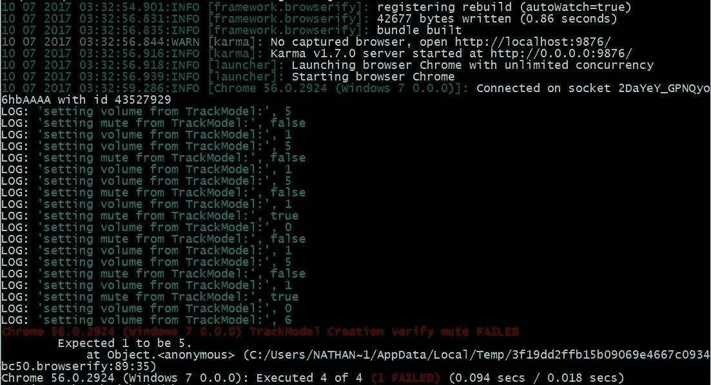
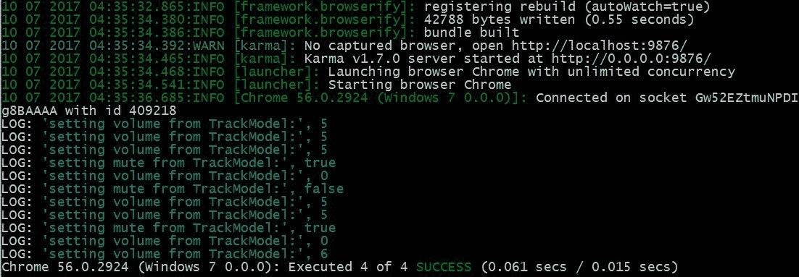
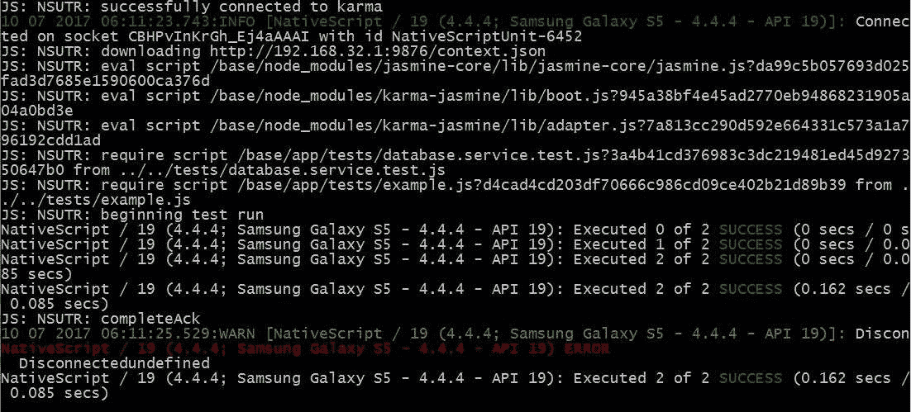

# 第十二章：单元测试

让我们从测试开始这一章；大多数人认为测试很无聊。猜猜看，他们大多数是对的！测试可以很有趣，因为你有机会尝试破坏你的代码，但有时也可能是一项繁琐的工作。然而，它可以帮助你在客户之前捕捉到错误，并且作为额外的好处，它可以防止你多次犯同样的错误。你的声誉对你的客户或顾客有多重要？一点繁琐的工作可能意味着 Triple-A 级应用和普通应用之间的区别。

在本章中，我们将涵盖以下主题：

+   Angular 测试框架

+   NativeScript 测试框架

+   如何使用 Jasmine 编写测试

+   如何运行 Karma 测试

# 单元测试

单元测试用于测试应用程序代码功能的小部分，以验证其正确性。这也允许我们在重构代码和/或添加新功能时，验证功能是否仍然按预期工作。NativeScript 和 Angular 都提供了单元测试框架。我们将探讨这两种类型的单元测试，因为它们都有优点和缺点。

在任何时间开发测试都是好的。然而，最好是在开发项目代码的同时开发它们。你的思维将保持清醒，对新的功能、修改以及你刚刚添加的所有新代码有清晰的认识。在我们的案例中，因为我们在这本书中介绍了许多新的概念，所以我们没有遵循最佳实践，因为这会使书籍更加复杂。所以，尽管后来添加测试是好的，但在添加新代码之前或同时添加测试被认为是最佳实践。

# Angular 测试

我们将要介绍的第一种单元测试是 Angular 单元测试。它基于**Karma** ([`karma-runner.github.io/`](https://karma-runner.github.io/)) 和 **Jasmine** ([`github.com/pivotal/jasmine`](http://github.com/pivotal/jasmine))。Karma 是一个功能齐全的测试运行器，由 Angular 团队开发。当团队在实施 Angular 时，遇到了一些问题，例如如何测试 Angular，所以他们开发了 Karma。Karma 最终成为了一个行业标准的多用途测试运行器。Jasmine 是一个开源的测试框架，实现了一系列测试结构，帮助你轻松完成所有测试。它存在的时间比 Karma 长得多。由于在 Karma 之前就有很多人在使用它，因此它成为了 Angular 社区中的默认测试库。你可以自由使用其他框架，如 Mocha、Chia，甚至你自己的定制测试框架。然而，由于 Angular 社区中几乎所有的内容都是基于 Jasmine 的，所以我们将使用它。

让我们安装 NativeScript 测试所需的 Angular 测试组件：

```js
npm install jasmine-core karma karma-jasmine karma-chrome-launcher --save-dev
npm install @types/jasmine karma-browserify browserify watchify --save-dev
```

你可能还需要全局安装 Karma，尤其是在 Windows 上。然而，在其他平台上这样做也是有帮助的，这样你就可以直接输入`karma`并运行它。为了做到这一点，请输入以下命令：

```js
npm -g install karma
```

如果您没有全局安装 TypeScript，您可以直接输入`tsc`并构建，那么您应该全局安装它。在运行任何测试之前，您必须将 TypeScript 转换为 JavaScript。要全局安装 TypeScript，请输入以下命令：

```js
npm -g install typescript
```

Karma 被设计为在浏览器中运行测试；然而，NativeScript 代码根本不在浏览器中运行。因此，我们必须做一些不同的事情，以便标准的 Karma 测试系统能够与一些 NativeScript 应用程序代码一起运行。在大多数情况下，正常的 Angular 特定 Karma 配置将不起作用。如果您打算进行任何与 Web 方面的 Angular 工作，您应该查看标准的 Angular 测试 QuickStart 项目（[`github.com/angular/quickstart/`](https://github.com/angular/quickstart/)）。该项目将为在浏览器中运行的传统的 Angular 应用程序设置一切。

然而，在我们的情况下，因为我们使用的是 NativeScript Angular，我们需要一个完全定制的`Karma.conf.js`文件。我们已经在 git 仓库中的自定义配置文件中包含了它，或者您可以从这里输入。将此文件保存为`Karma.ang.conf.js`**。**我们给出不同的配置名称，因为稍后讨论的 NativeScript 测试将使用默认的`Karma.conf.js`名称：

```js
module.exports = function(config) {
   config.set({
     // Enable Jasmine (Testing)
     frameworks: ['jasmine', 'browserify'],

     plugins: [
       require('karma-jasmine'),
       require('karma-chrome-launcher'),
       require('karma-browserify')
    ], 

    files: [ 'app/**/*.spec.js' ],

    preprocessors: {
       'app/**/*.js': ['browserify']
    },

    reporters: ['progress'],

    browsers: ['Chrome'], 
 });
};
```

此配置设置 Karma 使用 Jasmine、Browserify 和 Chrome 来运行所有测试。由于 Karma 和 Angular 最初是为浏览器设计的，因此所有测试仍然必须在浏览器内运行。这是在执行 NativeScript 代码时 Angular 测试系统的重大缺点。它不会支持任何 NativeScript 特定的代码。因此，这种测试最好在数据模型文件上执行，或者在任何不包含 NativeScript 特定代码的代码上执行，遗憾的是，在您的某些应用程序中可能代码并不多。然而，如果您正在使用相同的代码库同时进行 NativeScript 和 Web 应用程序的开发，那么您应该有很多可以通过标准 Angular 测试框架运行的代码。

对于 Angular 测试，您将创建 Jasmine 规范文件，并且它们都以`.spec.ts`结尾。我们必须在您正在测试的代码所在的同一目录中创建这些文件。所以，让我们尝试创建一个新的规范文件来测试。由于这种单元测试不允许您使用任何 NativeScript 代码，我选择了一个随机的模型文件来展示这种类型的单元测试是多么简单。让我们在`app/modules/shared/models`文件夹中创建一个名为`track.model.spec.ts`的文件；这个文件将用于测试同一文件夹中的`track.model.ts`文件。以下是我们的测试代码：

```js
// This disables a issue in TypeScript 2.2+ that affects testing
// So this line is highly recommend to be added to all .spec.ts files
export = 0;

// Import our model file (This is what we are going to test)
// You can import ANY files you need
import {TrackModel} from './track.model';

// We use describe to describe what this test set is going to be
// You can have multiple describes in a testing file.
describe('app/modules/shared/models/TrackModel', () => {
  // Define whatever variables you need
  let trackModel: TrackModel;

  // This runs before each "it" function runs, so we can 
  // configure anything we need to for the actual test
  // There is an afterEach for running code after each test
  // If you need tear down code
  beforeEach( () => {
    // Create a new TrackModel class
    trackModel = new TrackModel({id: 1,
       filepath: 'Somewhere',
       name: 'in Cyberspace',
       order: 10,
       volume: 5,
       mute: false,
       model: 'My Model'});
  });

  // Lets run the first test. It makes sure our model is allocated
  // the beforeEach ran before this test, meaning it is defined.
  // This is a good test to make sure everything is working properly.
  it( "Model is defined", () => {
    expect(trackModel).toBeDefined();
  });

  // Make sure that the values we get OUT of the model actually
  // match what default values we put in to the model
  it ("Model to be configured correctly", () => {
    expect(trackModel.id).toBe(1);
    expect(trackModel.filepath).toBe('Somewhere' );
    expect(trackModel.name).toBe('in Cyberspace');
    expect(trackModel.order).toBe(10);
    expect(trackModel.model).toBe('My Model');
  });

  // Verify that the mute functionality actually works
  it ('Verify mute', () => {
    trackModel.mute = true;
    expect(trackModel.mute).toBe(true);
    expect(trackModel.volume).toBe(0);
    trackModel.mute = false;
    expect(trackModel.volume).toBe(5);
  });

  // Verify the volume functionality actually works
  it ('Verify Volume', () => {
    trackModel.mute = true;
    expect(trackModel.volume).toBe(0);
    trackModel.volume = 6;
    expect(trackModel.volume).toBe(6);
    expect(trackModel.mute).toBe(false);
  });
}); 
```

那么，让我们来分析一下。第一行解决了在浏览器中使用 TypeScript 构建的模块化文件进行测试时的问题。正如我在注释中提到的，这应该添加到您所有的`spec.ts`文件中。下一行是我们将要测试的模型加载的地方；您可以在这里导入任何需要的文件，包括 Angular 库。

记住，`.spec.js`文件只是一个普通的 TypeScript 文件；唯一区别的是它能够访问 Jasmine 的全局化函数，并在浏览器中运行。所以，你所有的正常 TypeScript 代码都将正常工作。

以下行是我们开始实际测试框架的地方。这是一个用于创建测试的 Jasmine 函数。Jasmine 使用`describe`函数开始一组测试。`describe`有两个参数：要打印的文本描述，然后是实际要运行的函数。所以，我们基本上输入我们正在测试的模型名称，然后创建函数。在每个`describe`函数内部，我们添加我们需要的`it`函数。每个`it`用于测试的一个子集。如果需要，你也可以有多个`describes`。

因此，在我们的测试中，我们有四个独立的测试组；第一个实际上只是验证一切是否正确。它只是确保我们的模型被正确定义。所以，我们只是使用 Jasmine 的`expect`命令来测试使用`.toBeDefined()`函数创建的有效对象。简单，不是吗？

下一个测试集试图确保`beforeEach`函数正确设置了默认值。正如你所见，我们再次使用`expect`命令与`.toBe(value)`函数。这实际上是高度推荐的；看起来很明显设置的值应该与读取的值匹配，但你想将你的模块视为一个黑盒。验证所有输入和输出以确保它们确实以你设置的方式设置。所以，尽管我们知道我们设置了 ID 为 1，但我们正在验证当我们获取 ID 时，它仍然等于 1。

第三个测试函数开始测试静音功能，最后一个测试函数测试音量功能。请注意，静音和音量都有几个状态和/或影响多个变量。任何超出简单赋值的内容都应该通过你所知的每个状态进行测试，无论是有效还是无效，如果可能的话。在我们的案例中，我们注意到静音会影响音量，反之亦然。因此，我们验证当一个变量改变时，另一个变量也会随之改变。这被用作一个合约，以确保将来如果这个类发生变化，它在外部保持不变，或者我们的测试将会失败。在这种情况下，这更像是一个灰盒测试；我们知道静音的一个副作用，并且我们在应用程序中依赖于这个副作用，因此我们将测试这个副作用以确保它永远不会改变。

# 运行测试

现在，让我们通过输入`tsc`来运行测试，创建转译后的 JS 文件，然后运行以下命令：

```js
 karma start karma.ang.conf.js 
```

Karma 将会找到所有的`.spec.js`文件，然后在你的 Chrome 浏览器上运行所有这些文件，测试你在每个`.spec.js`文件中定义的所有功能。

# 测试失败异常



现在不是很有趣吗？我们中的一个测试实际上失败了；`TrackModel Creation Verify mute FAILED`和**`Expected 1 to be 5.`**。这个失败并不是为这本书预先计划的；实际上，这是一个我们刚刚发现的真实边缘情况，因为我们开始使用单元测试。如果你想快速查看代码，这里是将`TrackModel.ts`代码简化到只显示相关例程的代码：

```js
export class TrackModel implements ITrack { 
 private _volume: number = 1;
 private _mute: boolean;
 private _origVolume: number;
 constructor(model?: ITrack) {
   if (model) {
    for (let key in model) {
      this[key] = model[key];
    }
   }
 }

 public set mute(value: boolean) {
   value = typeof value === 'undefined' ? false : value;
   this._mute = value;
   if (this._mute) {
     this._origVolume = this._volume;
     this.volume = 0;
   } else {
     this.volume = this._origVolume;
   }
 }

 public set volume(value: number) {
   value = typeof value === 'undefined' ? 1 : value;
   this._volume = value;
   if (this._volume > 0 && this._mute) {
     this._origVolume = this._volume;
     this._mute = false;
   }
 }
}
```

现在，我会给你几分钟时间看看前面的测试代码和这段代码，检查你是否能找出测试失败的原因。

好的，我看到，你回来了；你看到边缘情况在哪里了吗？如果你不能很快找到它，不要难过；它花了我几分钟才弄清楚为什么它会失败。

好吧，首先，看看错误信息；它说`Verify Mute FAILED`，这意味着是我们的 mute 测试失败了。然后，我们在测试 mute 功能的`it`函数中放入了`Verify mute`。第二个线索是错误，`Expected 1 to be 5`。所以，我们期望某物是 5，但实际上它是 1。因此，这个特定的测试和这一行代码在测试中失败了：

```js
 it ('Verify mute', () => {
     expect(trackModel.volume).toBe(5);
 });
```

# 为什么它会失败？

让我们从测试初始化，`beforeEach`，开始看起，你会看到`mute: false`。嗯，接下来，让我们看看构造函数；它基本上做了`this.mute = false`，然后 mute 设置器运行其`else`分支，即`this.volume = this._origVolume`。猜猜看？`this._origVolume`还没有被设置，所以它将`this.volume`设置为`undefined`。现在看看音量例程；新的音量传入`undefined`，它被设置为`1`，这覆盖了我们原来的设置 5。所以，测试`Expected 1 to be 5.`失败了。

有趣的边缘情况；如果我们没有在测试属性初始化时将`mute`设置为`false`，这种情况就不会发生。然而，这是我们应该测试的事情，因为也许在应用程序的一个修订版本中，我们将存储 mute 值并在启动时恢复它。

为了修复这个问题，我们应该稍微修改一下类。我们将让你做出你认为必要的更改来修复这个问题。如果你卡住了，你可以根据`track.model.ts`文件重命名`track.model.fixed.ts`；它包含正确的代码。

修复后，运行相同的`tsc`，然后是`karma start karma.ang.conf.js`命令；你应该看到一切都很成功。

# 测试通过



正如这个例子所指出的，你的代码在某些情况下可能运行正确，但在其他情况下可能会失败。单元测试可以指出你可能不会立即看到的逻辑错误。在添加新功能或修复错误时，这尤其重要。强烈建议你为这两者都创建新的测试，然后你至少可以确保在做出任何代码更改后，你的新或修改后的代码表现正常。

让我们稍微转换一下思路，看看 NativeScript 测试框架；Angular 框架相当酷，但它有一个讨厌的限制，就是没有 NativeScript 框架调用可用，这限制了它的很多用途。

# NativeScript 测试框架

好的，准备好玩 NativeScript 测试框架吧。安装它相当简单，你只需输入以下命令：

```js
tns test init
```

没有必要切换测试框架，所以在询问你使用 NativeScript 测试框架时选择 `jasmine`。这将安装 NativeScript 测试系统所需的所有资源。NativeScript 的测试系统也使用 Karma，并支持几个不同的测试框架，但为了保持一致性，我们希望继续使用 Jasmine。

记得我之前说过 Karma 使用浏览器来执行所有测试，我也说过 NativeScript 代码不会在浏览器中运行吗？那么，为什么 NativeScript 会使用 Karma？Karma 是如何运行 NativeScript 代码的？这是很好的问题！实际上，Karma 被欺骗成认为你的 NativeScript 应用程序是一个浏览器。Karma 将测试上传到浏览器（即 NativeScript 应用程序），然后运行它们。所以，实际上，你的应用程序对 Karma 来说就像是一个浏览器；这是 NativeScript 团队的一个相当巧妙的解决方案。

现在，NativeScript 测试系统的最大优点是它实际上可以测试你所有的 NativeScript 代码。它将自动在你的模拟器（或真实设备）上运行一个特殊的构建版本的应用程序，这样它就可以运行所有的 NativeScript 代码并正确访问设备。NativeScript 测试系统的最大缺点是它需要更多的资源，因为它必须使用模拟器（或真实设备）来运行测试。所以，运行测试可能比我们在本章 earlier 讨论的标准单元测试要花费更多的时间。

好的，现在你已经安装好了所有内容。让我们继续前进。所有的 NativeScript 测试文件都将位于 `app/tests` 文件夹中。这个文件夹是在你运行 `tns test init` 命令时创建的。如果你打开这个文件夹，你会看到 `example.js` 文件。你可以随意删除或保留这个文件。它只是一个示例测试，用来展示如何使用 Jasmine 格式化你的测试。

所以，对于我们的 NativeScript 测试，我选择了一个使用 NativeScript 代码的简单服务。让我们在 `app/test` 文件夹中创建我们的 `database.service.test.ts` 文件。你在这个文件夹中的文件可以命名为任何名字，但为了更容易找到，我们将以 `.test.ts` 结尾。你还可以创建子目录来组织你所有的测试。在这种情况下，我们将测试 `app/modules/core/services/database.service.ts` 文件。

这个特定的服务，如果你查看代码，实际上使用了 NativeScript 的 `AppSettings` 模块来存储和检索来自 Android 和 iOS 系统级存储系统的数据。所以，这是一个很好的测试文件。让我们创建我们的测试文件：

```js
// Import the reflect-metadata because angular needs it, even if we don't.
// We could import the entire angular library; but for unit-testing; 
// smaller is better and faster.
import 'reflect-metadata';

// Import our DatabaseService, we need at least something to test... ;-)
import { DatabaseService } from "../modules/core/services/database.service";

// We do the exact same thing as we discussed earlier; 
// we describe what test group we are testing.
describe("database.service.test", function() {

  // So that we can easily change the Testing key in case we find out later in our app
  // we need "TestingKey" for some obscure reason.
  const TestingKey = "TestingKey";

  // As before, we define a "it" function to define a test group
  it("Test Database service class", function() {

    // We are just going to create the DatabaseService class here, 
    // no need for a beforeEach.
    const dbService = new DatabaseService();

    // Lets attempt to write some data.
    dbService.setItem(TestingKey, {key: "alpha", beta: "cygnus", delta: true});

    // Lets get that data back out...
    let valueOut = dbService.getItem(TestingKey);

    // Does it match?
    expect(valueOut).toBeDefined();
    expect(valueOut.key).toBe("alpha");
    expect(valueOut.beta).toBe("cygnus");
    expect(valueOut.delta).toBe(true);

    // Lets write some new data over the same key
    dbService.setItem(TestingKey, {key: "beta", beta: true});

    // Lets get the new data
    valueOut = dbService.getItem(TestingKey);

    // Does it match?
    expect(valueOut).toBeDefined();
    expect(valueOut.key).toBe("beta");
    expect(valueOut.beta).toBe(true);
    expect(Object.keys(valueOut).length).toBe(2);

    // Lets remove the key
    dbService.removeItem(TestingKey);

    // Lets make sure the key is gone
    valueOut = dbService.getItem(TestingKey);
    expect(valueOut).toBeFalsy();
  });
});
```

您可能已经能够很容易地阅读这个测试文件。基本上，它调用数据库服务几次以设置具有不同值的相同键。然后，它要求数据库服务返回存储的值并验证结果是否与我们存储的相匹配。然后，我们告诉数据库服务删除我们的存储键并验证该键已消失，所有这些都非常直接。这个文件中唯一不同的是 `include 'reflect-metadata'`。这是因为数据库服务使用了元数据，所以我们必须确保在加载数据库服务类之前加载元数据类。

# 运行测试

让我们尝试测试应用程序；要运行您的测试，请输入以下命令：

```js
tns test android
```

或者，您也可以运行以下命令：

```js
tns test ios
```

这将启动测试，您应该会看到类似以下内容：



注意，这个屏幕上有一个 `ERROR`；这是一个错误。基本上，当应用程序完成其测试运行后，它会退出。Karma 看到应用程序意外退出并记录为 `"ERROR" Disconnected`。导入信息是错误下面的那一行，其中说 `Executed 2 of 2 SUCCESS`。这意味着它运行了两个不同的 `described` 测试（即我们的 `test.ts` 文件和额外的 `example.js` 文件）。

您可能也已经注意到，我们的测试文件与 Angular 测试文件完全相同。这是因为它们都使用 Jasmine 和 Karma。因此，测试文件可以几乎以相同的方式设置。在这个特定的情况下，因为测试实际上是在您的应用程序内部运行的，所以任何插件、代码和模块，包括任何原生代码都可以用于测试。这就是 NativeScript 测试工具包更加强大和有用的原因。然而，它的最大优势也是它的弱点。由于它必须在一个运行的 NativeScript 应用程序内部运行，因此构建、启动和运行所有测试需要更多的时间。这就是标准 Angular 测试框架可以证明比 NativeScript 测试框架更有益的地方。任何不使用任何 NativeScript 特定代码的内容都可以从您的命令行几乎瞬间运行，几乎没有开销。您的测试运行得越快，您就越有可能频繁地运行它们。

# 摘要

在本章中，我们讨论了如何进行单元测试以及两种单元测试方法的优缺点。简而言之，Angular 测试适用于不调用任何 NativeScript 特定代码的通用 TypeScript 代码，并且它运行测试非常快。NativeScript 测试工具包在您的 NativeScript 应用程序内部运行，并可以完全访问您所写的内容以及正常 NativeScript 应用程序所能做到的一切。然而，它需要在 NativeScript 应用程序运行时才能运行其测试，因此可能需要在运行测试之前进行完整的构建步骤。

现在我们已经讨论了两种单元测试类型，请继续戴上你的测试帽。在下一章中，我们将介绍如何进行端到端测试或全屏及应用程序测试你的出色应用。
