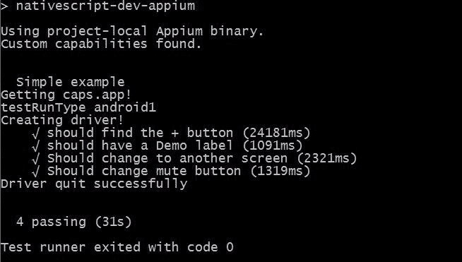

# 使用 Appium 进行集成测试

在上一章中，我们探讨了如何进行单元测试，但单元测试不允许你测试应用程序中使用的按钮是否仍然实际运行一个函数，或者当用户向左滑动时会发生什么。为此，我们需要应用程序测试或端到端测试。好吧，让我们开始学习端到端测试；这是测试变得复杂和有趣的地方。

在本章中，我们将涵盖以下主题：

+   Appium 测试框架

+   编写 MochaJS、ChaiJS 和 ShouldJS 测试

+   如何在屏幕上查找和与元素交互

+   如何运行测试

+   Travis 和 GitHub 集成

# 集成测试

现在有几个完整的应用程序框架，但我们将向您展示如何使用 Appium（[`appium.io`](http://appium.io)）。Appium 是一个出色的开源应用程序测试框架。Appium 支持 iOS 和 Android，这使得它非常适合进行所有我们的设备测试。您想要开始创建测试来测试您通过应用程序的基本流程，甚至创建更复杂的测试来测试通过应用程序的替代流程。

让我们先安装它；运行以下命令：

```js
npm install appium wd nativescript-dev-appium --save-dev
```

前一个命令安装了 Appium，Appium 通信驱动**WD**（[`admc.io/wd/`](http://admc.io/wd/))，以及**NativeScript 驱动程序**（[`github.com/NativeScript/nativescript-dev-appium`](https://github.com/NativeScript/nativescript-dev-appium)）。WD 驱动程序是与 Appium 通信以及 NativeScript 驱动程序的通信。`nativescript-dev-appium`是与 WD 交互以及与你的测试代码交互的驱动程序。实际上，NativeScript 驱动程序是 WD 驱动程序的一个非常薄的包装，仅便于一些配置，然后将 WD 驱动程序暴露给应用程序。因此，交互命令可以在 WD 文档中找到。

应用程序/集成测试需要更多的工作，因为你必须以普通用户交互的方式程序化地运行它。因此，你必须做一些事情，比如找到按钮元素，然后执行`button.tap()`。所以，你的测试可能会有些冗长，但这允许你测试任何，以及所有的功能。缺点是这需要更多的时间来运行，并且在更改屏幕时需要更多的维护工作。然而，回报是当你添加代码时，它会自动验证你的应用程序在每个屏幕上仍然可以正常运行，并且你可以自动在多个设备和分辨率上测试它。

安装完成后，你将在应用程序的根目录下有一个全新的`e2e-tests`文件夹。这个文件夹将存放你所有的端到端测试文件。现在，你需要知道的是，Appium NativeScript 驱动程序使用 MochaJS 测试框架（[`mochajs.org/`](https://mochajs.org/)）。Mocha 测试框架类似于我们在上一章中讨论的 Jasmine 框架。它使用相同的`describe`和`it`函数来开始测试，就像 Jasmine 一样。此外，它还使用 Chai ([`chaijs.com/`](http://chaijs.com/))和 ShouldJS ([`github.com/shouldjs/should.js`](https://github.com/shouldjs/should.js))测试框架，这些框架与 Mocha 测试框架和 WD 驱动程序协同工作。

另一点需要注意的是，所有这些都是在纯 JavaScript 的基础上设计的。你可以为 Mocha、Should 和 Chai 获取类型定义，但对于 NativeScript Appium 驱动程序或 WD 驱动程序，类型定义不存在。你可以使用 TypeScript，但这会很尴尬，因为命令不仅仅是基于 WD 的命令，而是通过 mocha 链式执行的。TypeScript 很容易混淆你当前所处的上下文。因此，Appium 测试主要是在纯 JavaScript 而不是 TypeScript 中创建的。然而，如果你想使用 TypeScript，请确保在运行测试之前运行`tsc`来构建`JS`文件。

# 配置

你还需要进行的一个设置步骤是在项目的根目录下创建一个`appium.capabilities.json`文件。这是一个基本的配置文件，你可以用它来配置你需要在上面运行任何测试的模拟器。该文件在 Appium 网站上有所说明，但为了让你快速启动，你可以使用我们使用的简化版文件，如下所示：

```js
{
 "android44": {
   "browserName": "",
   "appium-version": "1.6.5",
   "platformName": "Android",
   "platformVersion": "4.4",
   "deviceName": "Android 44 Emulator",
   "noReset": false,
   "app": ""
 },

 "ios10phone": {
   "browserName": "",
   "appium-version": "1.6.5",
   "platformName": "iOS",
   "platformVersion": "10.0",
   "deviceName": "iPhone 6 Simulator",
   "app": ""
 }
}
```

我们简化了它，并删除了所有其他模拟器条目以节省空间。然而，你需要为每个模拟器条目提供一个键——你告诉 Appium 使用该键来指定你将要运行的模拟器配置。这个示例文件显示了两个配置。第一个是一个 Android 4.4 设备，第二个是一个 iOS 模拟器（iPhone 6 运行 iOS 10）。你可以在该文件中设置任意多的配置。当你运行 Appium 时，你可以使用`--runType=KEY`参数来告诉它你将针对哪个设备。

# 创建一个测试

让我们开始我们的旅程，创建一个新的测试文件：`list.test.js`。这个文件将测试我们的混合列表屏幕。屏幕的 HTML（`/app/modules/mixer/components/mix-list.component.html`）看起来如下：

```js
<ActionBar title="Compositions" class="action-bar">
   <ActionItem (tap)="add()" ios.position="right">
     <Button [text]="'fa-plus' | fonticon" class="fa action-item"></Button>
   </ActionItem>
</ActionBar>
<ListView [items]="(mixer$ | async)?.compositions | orderBy: 'order'" class="list-group">
 <ng-template let-composition="item">
   <GridLayout rows="auto" columns="100,*,auto" class="list-group-item">
     <Button [text]="'fa-pencil' | fonticon" (tap)="edit(composition)" row="0" col="0" class="fa"></Button>
     <Label [text]="composition.name" (tap)="select(composition)" row="0" col="1" class="h2"></Label>
     <Label [text]="composition.tracks.length" row="0" col="2" class="text-right"></Label>
   </GridLayout>
 </ng-template>
</ListView> 
```

我们在这里包含了代码，这样你可以很容易地看到我们如何根据屏幕上提供的详细信息制作测试。

```js
// In JavaScript code, "use strict"; is highly recommended, 
// it enables JavaScript engine optimizations.
"use strict";

// Load the Appium driver, this driver sets up our connection to Appium 
// and the emulator or device.
const nsAppium = require("nativescript-dev-appium");
```

我们需要在 JavaScript 测试代码中包含 NativeScript Appium 驱动程序；这是用来实际通信和设置 Mocha、ShouldJS、WD、Appium 和 Chai 以使其能够正常工作的。以下行对于你的使用是必需的：

```js
// Just like Jasmine, Mocha uses describe to start a testing group.
describe("Simple example", function () {

 // This is fairly important, you need to give the driver time to wait
 // so that your app has time to start up on the emulator/device.
 // This number might still be too small if you have a slow machine.
 this.timeout(100000);
```

如源代码中的注释所述，确保你有足够的时间启动 Appium 和你的模拟器中的应用程序至关重要。因此，我们个人的默认值是`100,000`；你可以调整这个数字，但这将是它等待宣布测试失败的最大时间量。较大的值意味着你给你的模拟器和 Appium 更多的时间来实际启动。Appium 会快速给出其启动输出，但当它开始初始化测试和驱动器时，这个过程需要花费很多时间。一旦测试开始运行，它就会非常快地运行：

```js
 // This holds the driver; that will be used to communicate with Appium & Device.
 let driver;

 // This is ran once before any tests are ran. (There is also a beforeEach)
 before(function () {
    // VERY, VERY important line here; you NEED a driver to communicate to your device.
    // No driver, no tests will work.
    driver = nsAppium.createDriver();
 });
```

在你的测试运行之前初始化和创建驱动器也非常重要。在整个测试过程中，这个驱动器是全局的。因此，我们将在`describe`函数中全局声明它，然后使用在所有测试运行之前运行的 Mocha `before`函数来初始化它：

```js
// This is ran once at the end of all the tests. (There is also a afterEach)
after(function () {

  // Also important, the Appium system works off of promises
  // so you return the promise from the after function
  // NOTICE no ";", we are chaining to the next command.
  return driver    

    // This tells the driver to quit....
    .quit()
    // And finally after it has quit we print it finished....
    .finally(function () {
       console.log("Driver quit successfully");
    });
 });
```

我们还添加了一个 Mocha 后置函数，在我们全部完成时关闭驱动器。确保每次你在使用驱动器时都正确地返回它非常重要。实际上，几乎每一个测试片段下面都隐藏着一个承诺。如果你忘记返回承诺，测试工具将变得混乱不堪，可能会以错误的顺序运行测试，甚至在测试完成之前关闭驱动器。所以，总是要返回承诺：

```js
// Just like jasmine, we define a test here.
it("should find the + button", function () {

  // Again, VERY important, you need to return the promise
  return driver

  // This searches for an element by the Dom path; so you can find sub items.
 .elementByXPath("//" + nsAppium.getXPathElement('Button'))
```

`it`函数的使用方式就像我们在 Jasmine 中做的那样——你正在描述你计划运行的测试，这样你就可以在测试失败时找到它。再次强调，我们返回承诺链；你绝对不要忘记做这件事。驱动器变量是我们在处理模拟器时获得不同功能的原因。所以，该功能的文档在 WD 仓库中，但我将给你一个快速概述，帮助你开始。

`.elementByXPath`和`.elementById`是真正能很好地用于在 NativeScript 中正确查找元素的唯一两个函数。然而，也存在`.waitForElementByXPath`和`.waitForElementById`，这两个函数都会等待元素出现。如果你查看文档，你会观察到很多`elementByXXX`命令，但 Appium 是为浏览器设计的，而 NativeScript 不是浏览器。这就是为什么，只有一些在 nativescript-dev-appium 驱动器中模拟的命令才能在 NativeScript DOM 中查找元素。

因此，我们的测试是使用 XPath 查找元素。XPath 允许你深入 DOM 并找到任何深度的组件，以及其他组件的子组件。所以，如果你做类似`/GridLayout/StackLayout/Label`的事情，它将找到一个`Label`，它是`StackLayout`的子组件，而`StackLayout`又是`GridLayout`的子组件。使用`*//*`意味着你可以在 DOM 的任何级别找到该元素。最后，`nsAppium.getXPathElement`是一个由 Nathanael Anderson 添加到官方 NativeScript 驱动程序的方法，允许我们进行跨平台的 XPath 测试。实际上，你传递给 XPath 函数的是对象的真正原生名称。例如，在 Android 上，按钮是`android.widget.Button`，或者它可能是 iOS 上的`UIAButton`或`XCUIElementTypeButton`。所以因为你不想硬编码`getByElementXPath("android.widget.Button")`，这个辅助函数将 NativeScript 的`Button`转换为 NativeScript 在创建按钮时实际使用的正确底层 OS 元素。如果将来你添加了一个使用`getXPathElement`不知道的元素的插件，你仍然可以使用元素的真正名称进行这些测试：

```js
     // This element should eventually exist
     .text().should.eventually.exist.equal('\uf067');
 });
```

`.text()`是一个 Appium 驱动程序公开的函数，用于获取它找到的元素的文本值。`.should.eventually.exist.equal`是 Mocha 和 Should 代码。我们基本上确保一旦找到这个项目，它实际上匹配 F067 的 Unicode 值，在 Font-Awesome 中是加号字符（fa-plus）。一旦它存在，我们就满意了——测试要么成功，要么失败，这取决于我们是否打破了屏幕，或者屏幕是否继续以我们期望的方式存在。此外，在`**.equal**`之后，我们还可以链式调用更多命令，例如`.tap()`，如果我们想触发按钮的话。

好的，让我们看看下一个运行的测试：

```js
it("should have a Demo label", function () {

  // Again, VERY important, you need to return the promise
  return driver

    // Find all Label elements, that has text of "Demo"
   .elementByXPath("//" + nsAppium.getXPathElement("Label") + "[@text='Demo']")

   // This item should eventually exist
   .should.eventually.exist

   // Tap it
   .tap();
});
```

这个测试在屏幕上搜索以显示`Demo` ListView 项。我们正在寻找 NativeScript Label（即`nsAppium.getXPathElement`），它在 NativeScript DOM（即`*//*`）中的任何地方都包含文本值 Demo。（即`[@text='Demo']`）。这个元素最终应该存在，一旦它存在，它就调用`tap()`函数。现在，如果你查看源代码，你会看到以下内容：

```js
<Label [text]="composition.name" (tap)="select(composition)" row="0" col="1" class="h2"></Label>
```

因此，当`tap`事件触发时，它将运行选择函数。`select`函数最终会加载`/app/modules/player/components/track-list/track-list.component.html`文件，该文件用于在屏幕上显示该混音项的组成。

所有测试都是顺序执行的，并且应用的状态从一个测试保留到另一个测试。这意味着测试并不是像我们编写单元测试时那样相互独立的。

我们将要验证的下一个测试是，在点击它之后，`Demo` 标签实际上会在下一个测试中切换屏幕：

```js
it("Should change to another screen", function () {

   // As usual return the promise chain...
   return driver

   // Find all Label elements, that has text of "Demo"
   .waitForElementByXPath("//" + nsAppium.getXPathElement("Label") + "[@text='Drums']")

   // This item should eventually exist
   .should.eventually.exist.text();
 });
```

现在，我们已经进入了一个新的屏幕，我们将验证`ListView`是否包含一个名为`Drums`的标签。这个测试只是验证在我们点击前一个测试中的`Demo`标签时，屏幕实际上是否发生了变化。我们本可以验证文本值，但如果我们确认它存在，我们就没问题了。所以，让我们看看下一个测试：

```js
it("Should change mute button", function () {

  // Again, returning the promise
  return driver

  // Find all Label elements that contains the FA-Volume
  .waitForElementByXPath("//" + nsAppium.getXPathElement("Label") + "[@text='\uf028']")

  // This item should eventually exist
  .should.eventually.exist

  // It exists, so tap it...
  .tap()

  // Make sure the text then becomes the muted volume symbol
  .text().should.eventually.become("\uf026");
});

// This closes the describe we opened at the top of this test set.
});
```

我们最后的示例测试展示了链式调用。我们搜索具有音量控制符号的标签。一旦它存在，我们就点击它。然后，我们验证文本实际上变成了音量关闭符号。`f028`是`fa-volume-up`的 Font Awesome Unicode 值，而`f026`是`fa-volume-off`的 Font Awesome Unicode 值。

所以现在你有了这个非常酷的测试，你想要启动你的模拟器。模拟器应该已经运行了。你还应该确保设备上有应用程序的最新版本。然后，要运行测试，只需输入以下命令：

```js
npm run appium --runType=android44
```

确保你输入你将要使用的运行类型配置，几分钟后你应该能看到类似以下内容：



记住，Appium 端到端测试启动需要一段时间，所以如果它看起来冻结了一段时间，不要慌张并退出它。第一次测试可能需要 24 秒，每个额外的测试可能需要几秒钟。第一次测试包含了所有时间。Appium 在模拟器上启动驱动程序和应用程序需要很长时间是正常的。这种延迟通常发生在你看到前几行文本打印出来之后，如前述屏幕所示，所以，请有点耐心。

# 更多 Appium 测试

我想包括一个额外的测试（在这个应用程序中没有使用），这是我过去为不同的项目编写的，因为这会给你一个关于 Appium 有多强大的概念：

```js
it("should type in an element", function (done) {
  driver
  .elementByXPath('//' + nsAppium.getXPathElement("EditText") + "[@text='Enter your name']") 
  .sendKeys('Testing')
  .text()
  .then(function (v) {
     if ('Testing' !== v) {
        done(new Error("Value in name field does not match"));
     } else {
        done();
     }
   }, done);
 });
});
```

你可能会注意到的第一件事是，我没有返回 promise 链。这是因为这个例子展示了如何使用`it`的异步支持。对于异步支持，你可以使用一个 promise 或者让传入`it`的函数有一个`done`回调函数。当 Mocha 检测到`it`中的回调函数时，它将以异步模式运行你的`it`测试，并且不需要 promise 来让它知道它可以继续下一个测试。有时，你可能只是想保持完全控制，或者你可能正在调用需要异步回调的代码。

这个测试寻找一个包含`Enter your name`的`EditText`元素。然后，它实际上使用`sendKeys`将*Testing*输入其中。接下来，它请求字段的`text`并使用 promise 的`then`部分来检查值与硬编码的测试值是否匹配。当一切完成后，它调用`done`函数。如果你向`done`函数传递一个`Error`对象，那么它就知道测试失败了。所以，你可以在`if`语句中看到我们传递了一个`new Error`，并且我们将`done`函数放在了`then`语句的`catch`部分。

我们几乎只是触及了使用 Appium、Should、Mocha 和 Chia 所能做到的一小部分。你可以控制应用几乎所有的方面，就像你在手动进行每一步一样。最初，在你的开发过程中，手动测试要快得多。然而，当你开始构建端到端测试时，每次你进行更改，你都可以检查应用是否仍然正常工作，而且你不必长时间坐在多个设备前——你只需启动测试，稍后查看结果即可。

# 自动化测试

还有一点需要注意，你使测试自动化程度越高，你越有可能使用它并从中获益。如果你必须不断手动运行测试，你可能会感到厌烦并停止运行它们。所以，我们认为自动化这一点至关重要。由于关于这个主题有许多书籍，我们只是给你提供一些你可以研究并继续前进的提示。

大多数源代码控制系统允许你创建钩子。通过这些钩子，你可以创建一个提交钩子，以便在检查任何新代码时运行你的测试框架。这些钩子通常很简单创建，因为它们只是每次提交时运行的简单脚本。

此外，如果你使用 GitHub，你可以轻松地将 Travis 等网站集成进来，而无需进行任何钩子更改。

# GitHub 和 Travis 集成

这里是如何与 GitHub 和 Travis 进行一些集成的示例；这将允许你的 NativeScript 测试框架，我们在上一章中讨论过，在每次更改或 pull request 时自动运行你的测试。在你的 GitHub 仓库的根目录中创建一个新的`.travis.yml`文件。这个文件应该看起来像这样：

```js
language: android

jdk: oraclejdk8

android:
 components:
 - tools
 - platform-tools
 - build-tools-25.0.2
 - android-25
 - extra-android-m2repository
 - sys-img-armeabi-v7a-android-21

before_cache:
 - rm -f $HOME/.gradle/caches/modules-2/modules-2.lock

cache:
 directories:
 - .nvm
 - $HOME/.gradle/caches/
 - $HOME/.gradle/wrapper/

install:
 - nvm install node
 - npm install -g nativescript
 - tns usage-reporting disable
 - tns error-reporting disable

before_script:
 - echo no | android create avd --force -n test -t android-21 -b armeabi-v7a
 - emulator -avd test -no-audio -no-window &
 - android-wait-for-emulator

script:
 - npm run travissetup
 - npm run travistest
```

这基本上配置了 Travis 启动一个 Android 模拟器；它等待模拟器启动，然后运行`npm`命令。你可以从你的`package.json`中了解这些`npm`命令的作用。

因此，在你的根应用中，即你的应用的`package.json`文件，你想要添加以下键：

```js
"scripts": {
   "travissetup": "npm i && tns platform add android && tns build android",
   "travistest": "tns test android"
}
```

这两个更改之后，Travis 将自动测试你仓库中的每一个 pull request，这意味着你可以编码，而 Travis 将不断进行所有单元测试。

此外，你可以通过以下方式更改先前的 Travis 配置文件，以便添加 Appium 进行安装和运行：

+   将 Appium 依赖项添加到你的主`package.json`依赖项中。

+   在你的项目根目录中添加一个具有`travisAndroid`键的`appium.capabilities.json`。

+   在`package.json`文件中将`&& npm run appium --runType=travisAndroid`添加到`travistest`键中。

GitHub 已经内置了与 Travis 的集成，因此记录文档并启动它非常简单。如果你使用 Gitlabs，你可以使用 Gitlabs CI 系统进行测试。此外，你还可以使用仓库钩子来使用大量可用的其他持续集成服务。最后，你也可以开发自己的服务。

# 摘要

在本章中，我们介绍了如何安装和运行 Appium，如何构建完整的端到端测试，以及如何使用测试框架全面测试你的屏幕。此外，我们还讨论了自动化单元测试和 Appium 运行的重要性，以及你可以使用 Travis 和 GitHub 来实现这一目标的一种方法。

现在请系好安全带——我们将快速转向，开始讨论如何部署和使用 Webpack 来优化你的构建以供发布。
