# 部署到 Apple 应用商店

在本章中，我们将重点介绍如何将我们的应用部署到 Apple 应用商店。我们将遵循几个重要的步骤，所以请密切关注这里展示的所有细节。

无论你需要与签名证书一起构建我们的应用发布目标，生成应用图标和启动画面，还是在 XCode 中归档我们的应用以上传到应用商店，我们将在本章中涵盖所有这些主题。

Progress 的 NativeScript 专家和开发者倡导者 TJ VanToll 撰写了一篇优秀的文章，详细介绍了部署步骤，题为《发布您的 NativeScript 应用到应用商店的 8 个步骤》([`www.nativescript.org/blog/steps-to-publish-your-nativescript-app-to-the-app-stores`](https://www.nativescript.org/blog/steps-to-publish-your-nativescript-app-to-the-app-stores))。我们将从那篇文章中摘录内容，并在本章和下一章尽可能扩展相关部分。

没有必要向你撒谎——将 iOS 应用发布到 iOS 应用商店是你软件开发生涯中会经历的最痛苦的过程之一。所以，如果你在这些步骤中遇到困难或感到困惑，请记住，这不仅仅是你——每个人在第一次发布 iOS 应用时都会感到沮丧。

本章涵盖了以下主题：

+   如何创建 App ID 和生产证书以签名你的应用发布目标

+   如何配置 NativeScript 应用，使其具有发布所需的适当元数据

+   如何处理应用图标和启动画面

+   使用 NativeScript CLI 上传你的构建到 iTunes Connect

# 准备 App Store 分发

要将 iOS 应用部署到 iOS 应用商店，你绝对需要一个活跃的 Apple 开发者账户。成为该项目的成员每年需要支付 99 美元 USD，你可以在[developer.apple.com/register](https://developer.apple.com/register)注册。

# App ID、证书和配置文件

一旦你创建了 Apple 开发者账户，你需要在 Apple 开发者门户上创建 App ID、生产证书和分发配置文件。这是整个过程中最繁琐的部分，因为它需要一些时间来学习这些各种文件的作用以及如何使用它们：

1.  对于我们的应用，我们将从以下步骤开始创建 App ID：

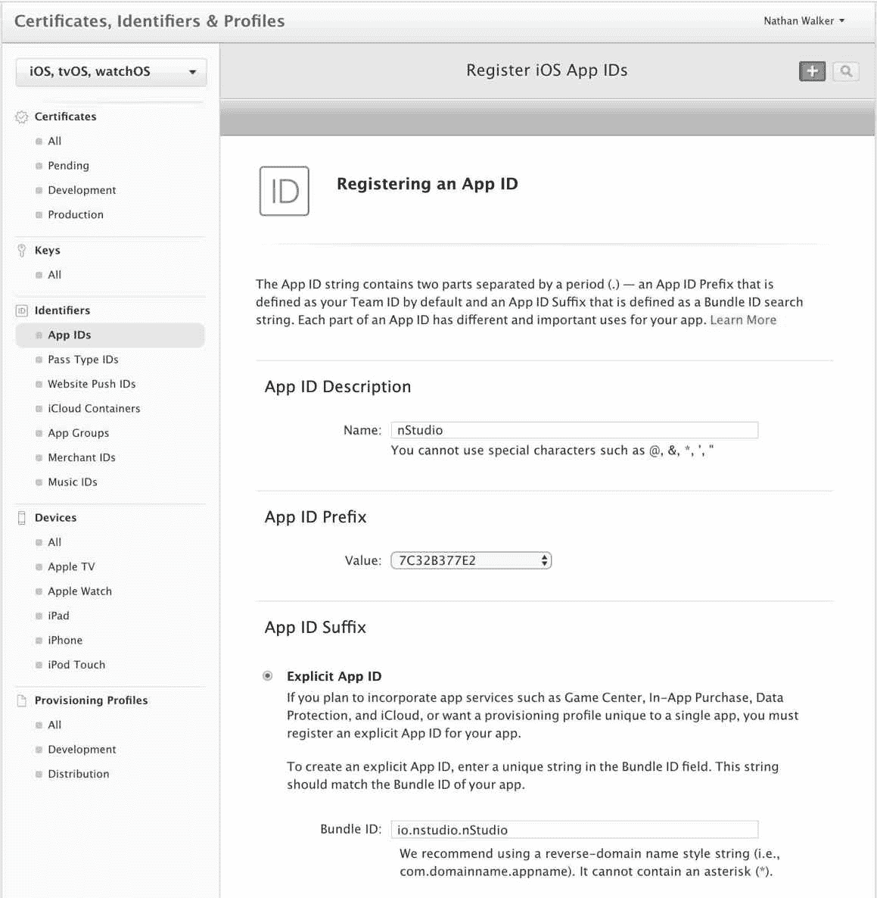

1.  一旦我们创建了此 App ID，我们现在可以创建一个生产证书：

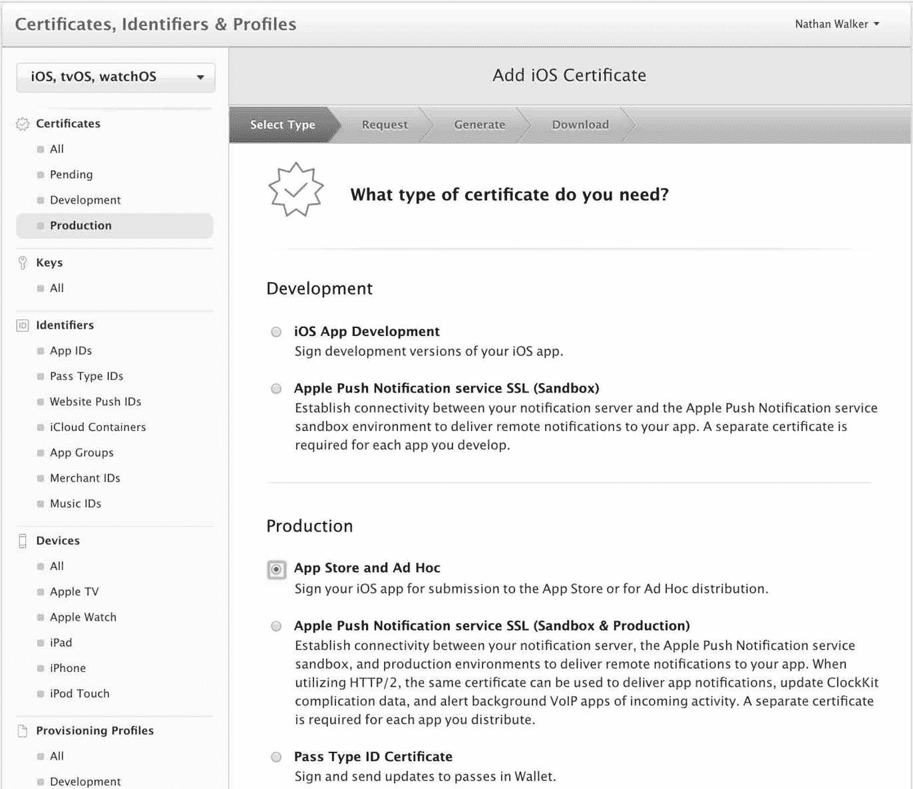

1.  选择继续。然后，下一屏幕将提供如何签名生产证书的说明，我们将在下一步进行讲解。首先，打开`/Applications/Utilities/Keychain Access.app`，然后转到左上角的菜单并选择 证书助手 | 使用如下设置从证书颁发机构请求证书：

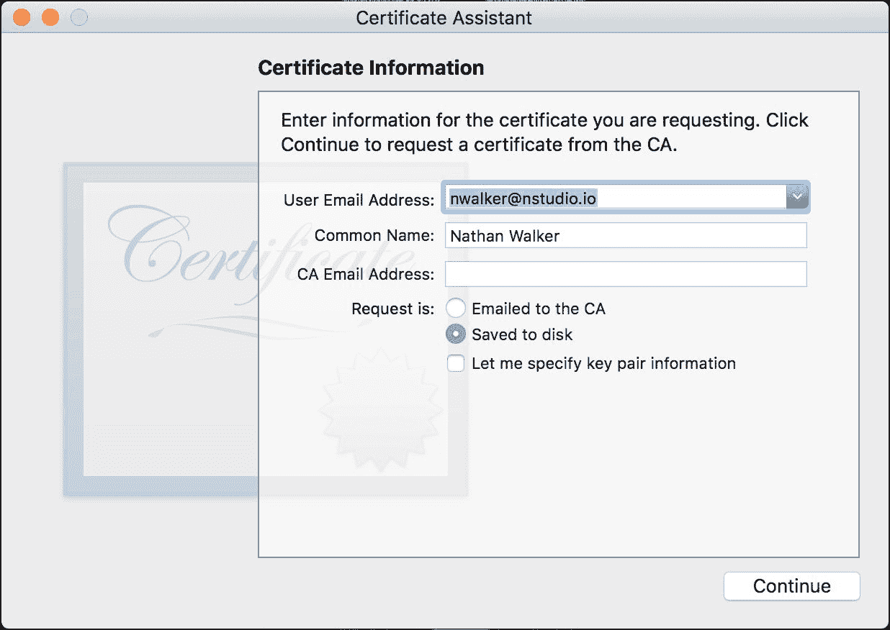

这将在你选择的任何位置保存一个签名请求文件，你将在下一步需要它。

1.  现在，在门户的这个步骤中选择那个签名请求文件：

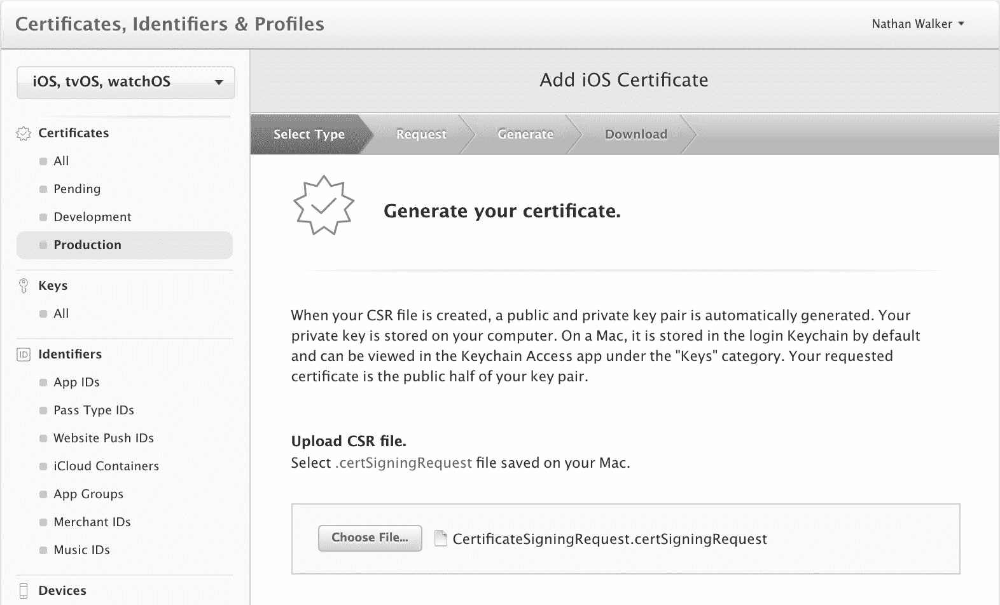

1.  在下一屏，非常重要的一点是下载并双击您需要安装到钥匙链中的文件，因为它指定了：

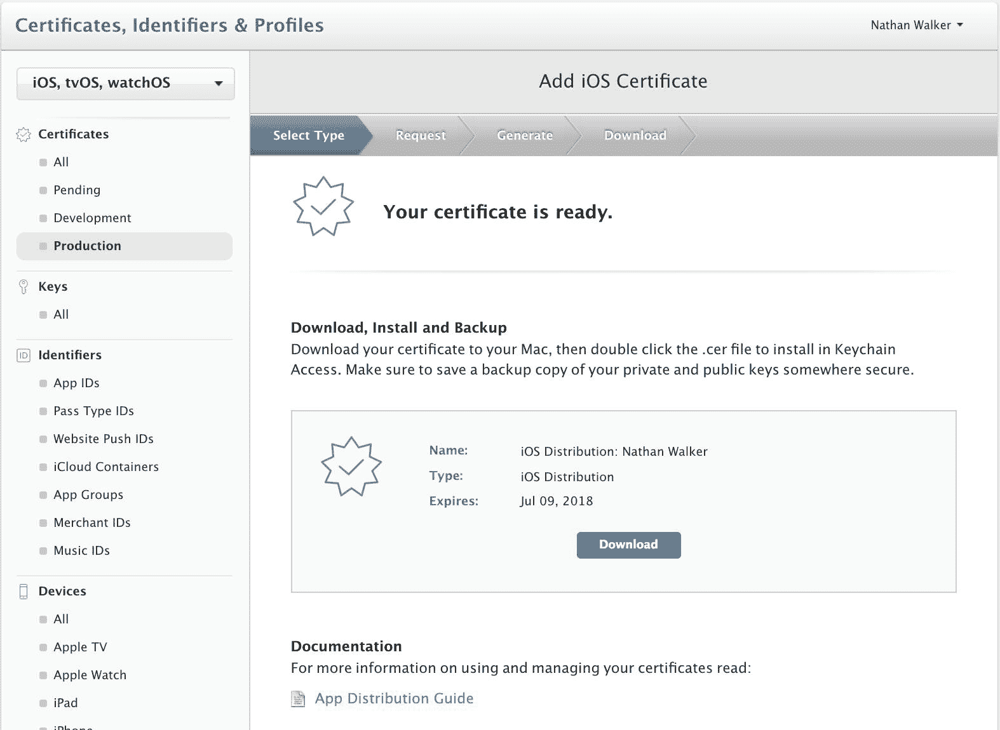

1.  当双击文件以将其安装到钥匙链时，可能会提示您提供钥匙链以安装文件；使用*登录*钥匙链将正常工作：

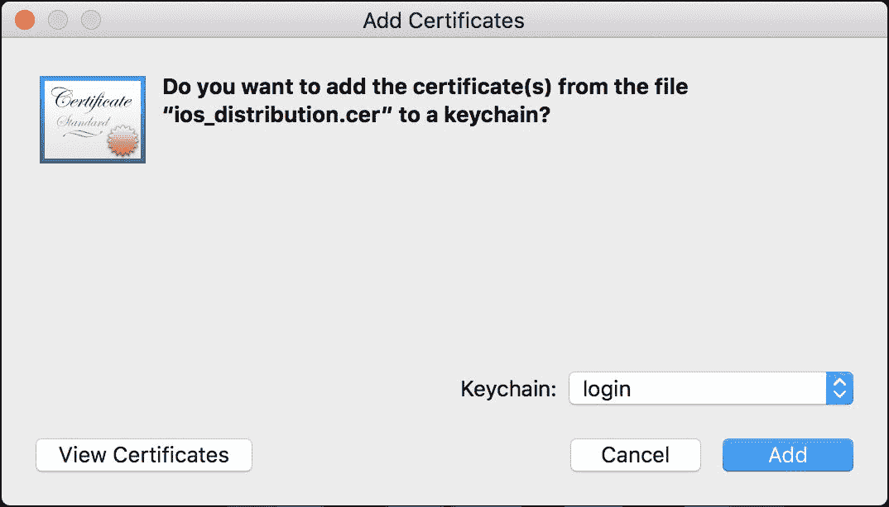

您现在应该在钥匙链访问应用程序中看到以下类似截图：

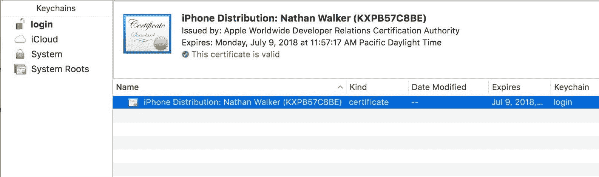

1.  您现在可以退出钥匙链访问。

1.  接下来，我们想要创建一个发行配置文件：

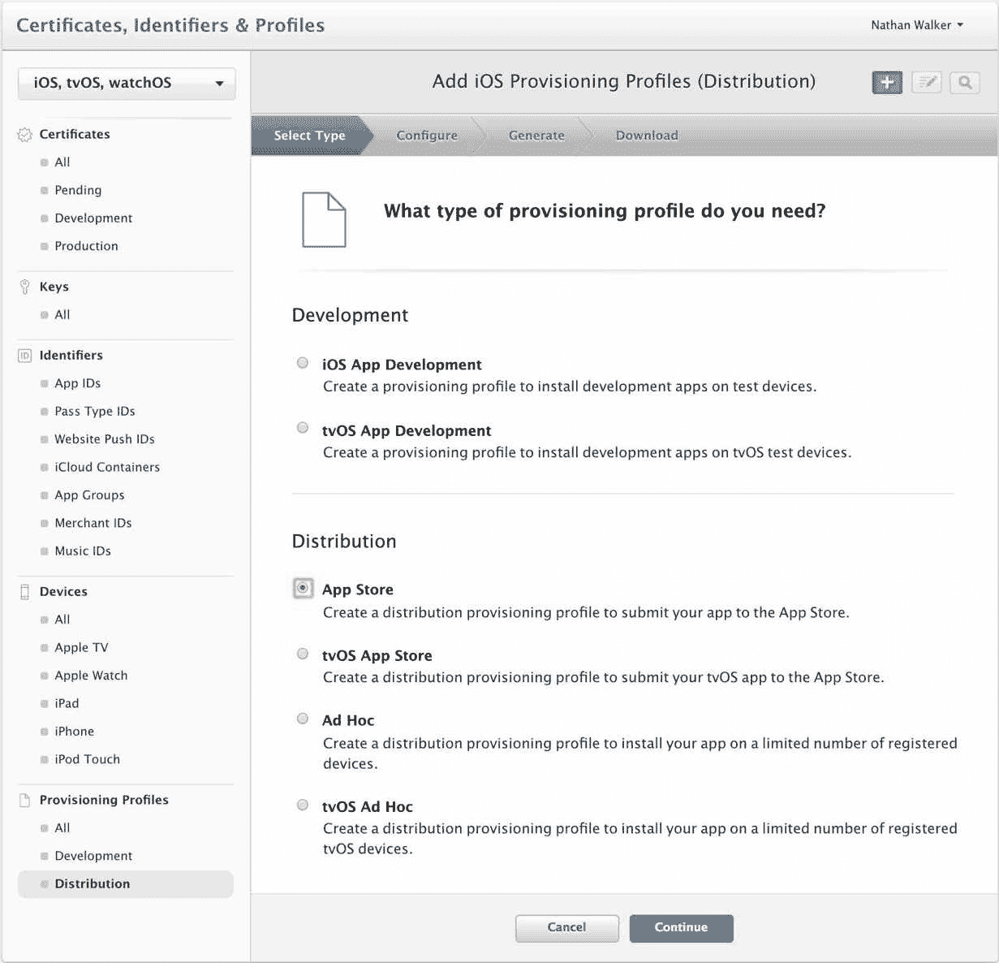

1.  在下一屏，只需确保您选择了您创建的应用程序 ID：

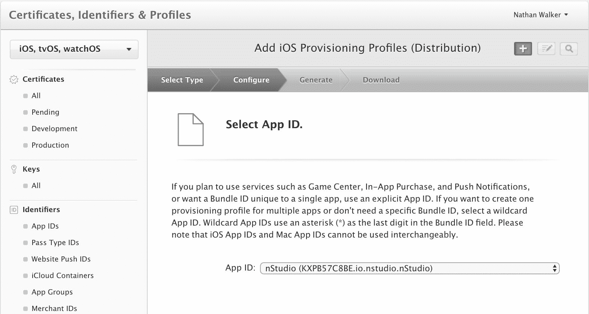

1.  然后，在下一屏，您应该能够选择您创建的发行证书：

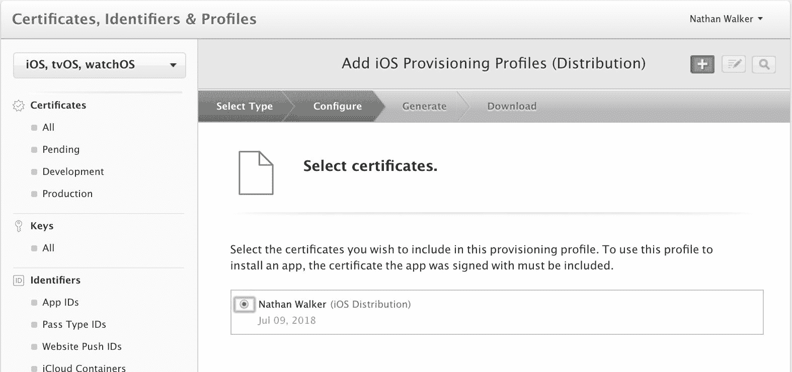

1.  然后，您将能够为配置文件命名：

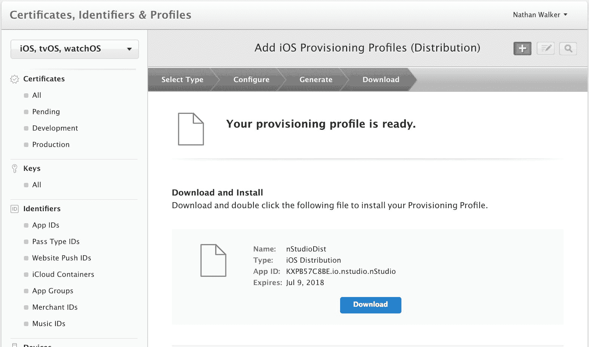

1.  您可以下载配置文件并将其放置在您的`ios_distribution.cer`文件旁边；然而，没有必要打开该配置文件，因为 XCode 将处理其他所有事情。

# 配置应用程序元数据，如应用程序 ID 和显示名称

在将应用程序部署到其相应商店之前，iOS 和 Android 应用程序有很多信息需要您配置。NativeScript 为许多这些值提供了智能默认值，但在部署之前，您可能需要审查其中的一些。

# 应用程序 ID

刚才在苹果开发者门户中配置的应用程序 ID 是您的应用程序的唯一标识符，它使用一种称为反向域名表示法的东西。我们的 NativeScript 应用程序的元数据必须匹配。我们这个应用程序的应用程序 ID 是`io.nstudio.nStudio`。NativeScript CLI 在应用程序创建期间设置应用程序 ID 有一个约定：

```js
 tns create YourApp --appid com.mycompany.myappname
```

我们在创建我们的应用程序时没有使用此选项；然而，更改我们的应用程序 ID 很容易。

打开应用程序根目录下的`package.json`文件，找到`nativescript`键。确保`id`属性包含您想要使用的值：

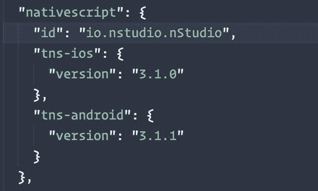

# 显示名称

您应用程序的显示名称是用户在屏幕上看到您图标旁边的名称。默认情况下，NativeScript 会根据您传递给`tns create`的值设置您的应用程序显示名称，这通常不是您希望用户看到的。例如，运行`tns create my-app`会导致应用程序的显示名称为`myapp`。

要在 iOS 上更改此值，首先打开您的应用程序的`app/App_Resources/iOS/Info.plist`文件。`Info.plist`文件是 iOS 的主要配置文件，在这里您将找到许多您在发布应用程序之前可能想要调整的值。对于显示名称，您将想要更改`CFBundleDisplayName`值。

这是`nStudio`的此值的外观：

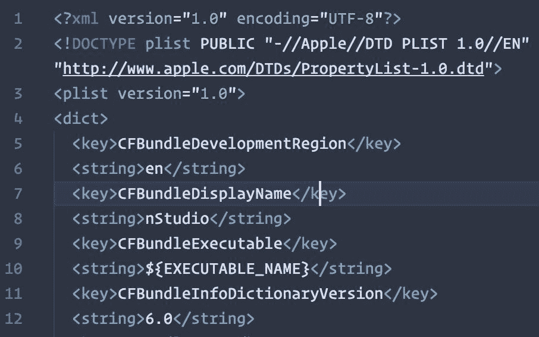

尽管显示名称没有实际的字符限制，但 iOS 和 Android 都会在约 10-12 个字符后截断您的显示名称。

# 创建您的应用程序图标和启动画面

你的应用图标是用户首先注意到你的应用的地方。当你开始一个新的 NativeScript 应用时，你会得到一个占位符图标，这对于开发来说是可以的；然而，对于生产版本，你需要用你想要提交到商店的图片替换占位符图标。

为了将你的生产就绪应用图标文件放置到位，你首先需要创建一个代表你应用的 1024 x 1024 像素的`.png`图像资产。

为了让你更难，iOS 和 Android 都要求你提供一系列不同尺寸的图标图片。不过别担心；一旦你有一个 1024 x 1024 的图片，有几个网站可以生成 Android 和 iOS 所需的各种尺寸的图片。对于 NativeScript 开发，我推荐使用 Nathanael Anderson 的 NativeScript Image Builder，它可以在`images.nativescript.rocks`找到。

我们将在 Photoshop 中创建我们的图标：

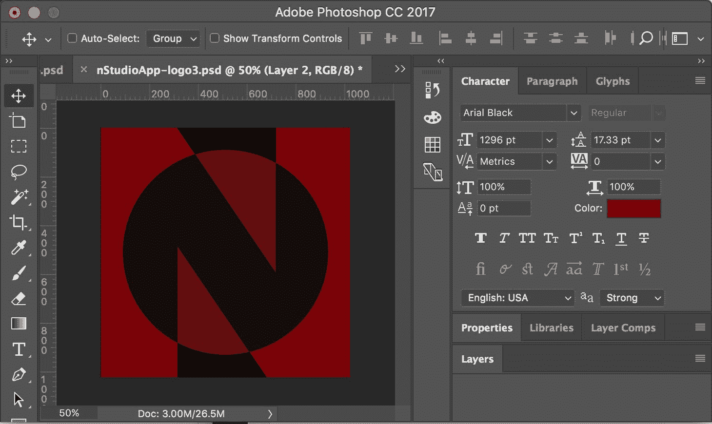

我们可以将其导出为`.png`格式并上传到`images.nativescript.rocks`：

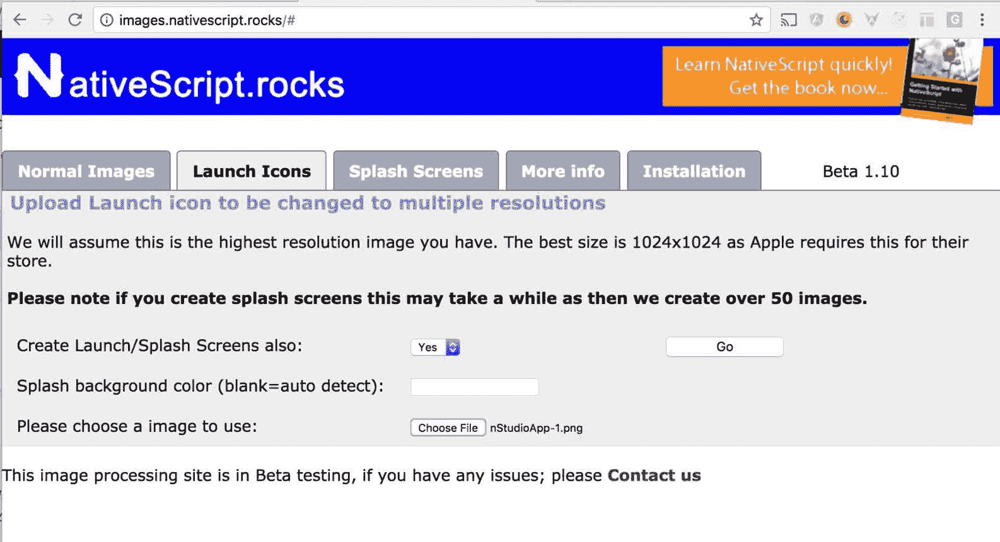

当你点击“Go”时，将下载一个 zip 文件，其中包含你的应用图标和启动画面。你可以将这些图片分别复制到`app/App_Resources`文件夹中，用于 iOS（我们将在下一章介绍 Android）。

我们现在已经准备好了应用图标和启动画面。

# 构建发布版的应用

由于我们已经在上一章中介绍了 webpack 打包问题，我们现在可以使用以下命令构建最终的发布包：

```js
npm run build-ios-bundle -- --release --forDevice --teamId KXPB57C8BE
```

注意，`--teamId`对于你来说将是不同的。它是上一条命令中提供的 App ID 的前缀。

在此命令完成后，你将在`platforms/ios/build/device`文件夹中获得所需的`.ipa`文件。请记下该文件的位置，因为在指南的最终步骤中你需要用到它。

呼吁！希望你已经完好无损地到达了这个阶段。你现在可以进入最终步骤，iTunes Connect。

# 上传到 iTunes Connect

你首先需要做的是注册你的应用。为此，请访问[`itunesconnect.apple.com/`](https://itunesconnect.apple.com/)，点击“我的应用”，然后点击屏幕左上角的+按钮（目前位于屏幕顶部左侧），接着选择“新建应用”。在接下来的屏幕上，确保你选择了正确的 Bundle ID，SKU 可以是任何你想要用来识别应用的数字；我们喜欢使用当前日期：

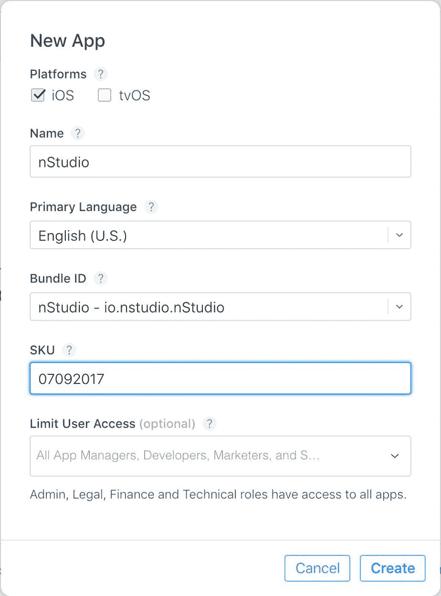

在提供这些信息后，你将被带到应用仪表板，在那里我们需要提供更多关于我们应用的数据。大部分信息都很直接，比如描述和定价，但也有一些*有趣*的部分我们需要处理，比如截图。

iTunes Connect 现在要求你上传两组截图，一组用于最大的 iPhone 设备（5.5 英寸显示屏），另一组用于最大的 iPad 设备（12.9 英寸设备）。苹果仍然允许你为每个 iOS 设备尺寸提供优化的截图，但如果你只提供 5.5 英寸和 12.9 英寸的截图，苹果将自动将你提供的截图缩放到较小的显示设备。

要获取这些截图，我们可以在物理 iPhone Plus 和 iPad Pro 设备上运行应用，但我们发现从 iOS 模拟器中获取这些截图要容易得多。

在正确的模拟设备运行时，我们可以使用模拟器的*Cmd* + *S*键盘快捷键来截取应用屏幕截图，这将把适当的图像保存到我们的桌面上。

到目前为止，我们已经准备就绪。我们将使用 DaVinci（[`www.davinciapps.com`](https://www.davinciapps.com/)）等服务来润色我们的图像文件，但当我们准备好时，我们会将图像拖入 iTunes Connect 的应用预览和截图区域。

# 上传你的.ipa 文件

我们即将完成！一旦所有信息都已输入到 iTunes Connect，最后一步是将构建的`.ipa`文件与我们所输入的所有信息关联起来。

我们将使用 NativeScript CLI 来完成这项工作。

记住你的.ipa 文件位于应用的`platforms/ios/build/device`文件夹中。

运行以下命令将你的应用发布到 iTunes Connect：

```js
tns publish ios --ipa <path to your ipa file>
```

就这样。不过，有一个重要的注意事项，尽管原因不明，但当你上传 iOS 应用和你的应用出现在 iTunes Connect 之间有一个非微不足道的延迟。我们观察到延迟可能短至 30 秒，长达一小时。一旦构建出现在那里，我们就可以继续点击大型的“提交审核”按钮，并交叉手指。

苹果公司在审核你提交的 iOS 应用时，以众所周知的间歇性延迟著称。在撰写本书时，iOS 应用商店的平均审核时间为大约 2 天。

# 摘要

在本章中，我们强调了发布应用到 Apple App Store 必须采取的关键步骤，包括签名证书、应用 ID、应用图标和启动屏幕。这个过程一开始可能看起来非常复杂，但一旦你更好地理解了各个步骤，它就会变得更加清晰。

现在，我们的应用已经在商店中等待审核，我们正朝着让我们的应用在全球范围内对用户可用迈进。

在下一章中，让我们通过将应用部署到 Google Play Store 来扩展我们的受众来完成这项工作。
