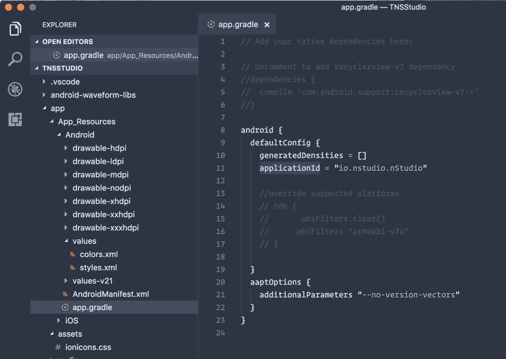
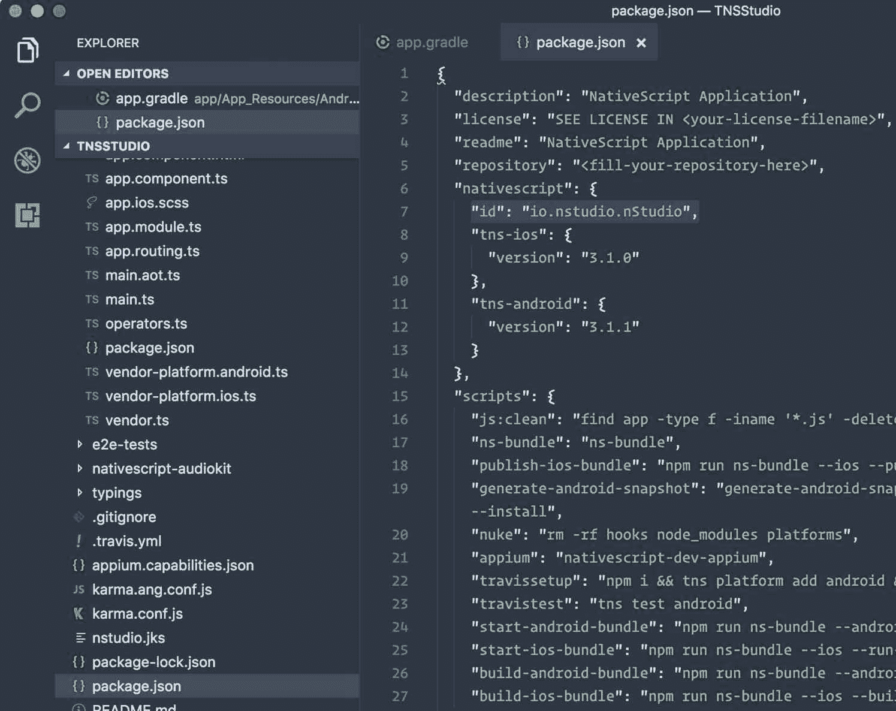
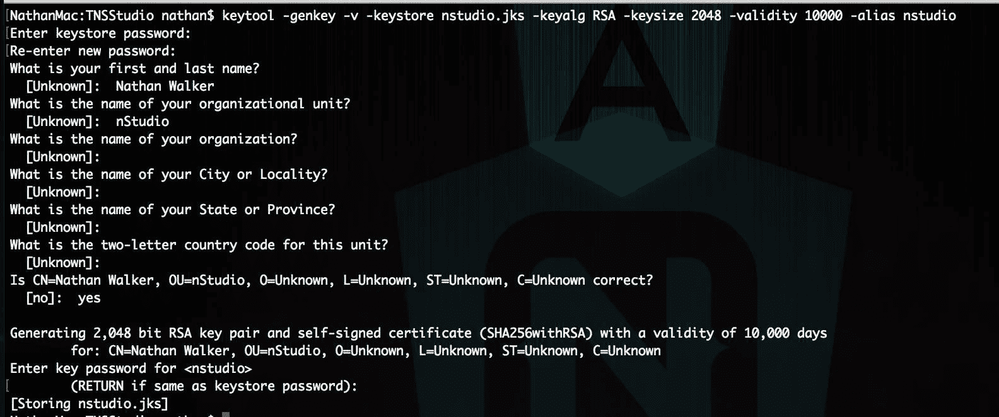
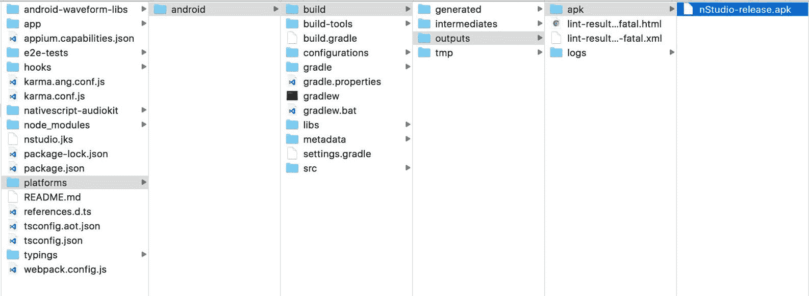
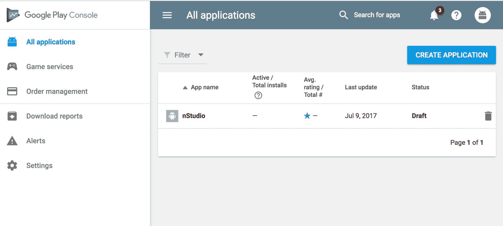
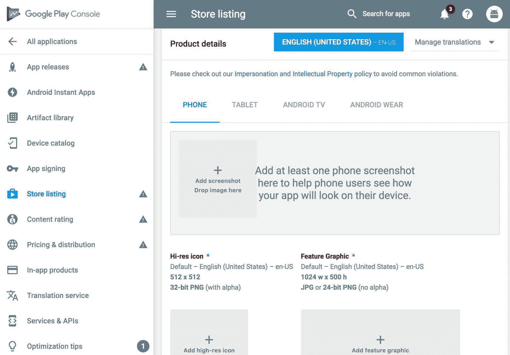
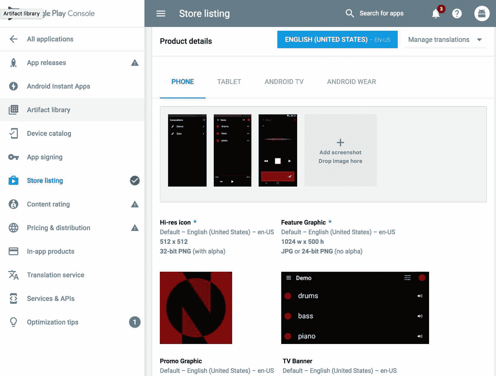
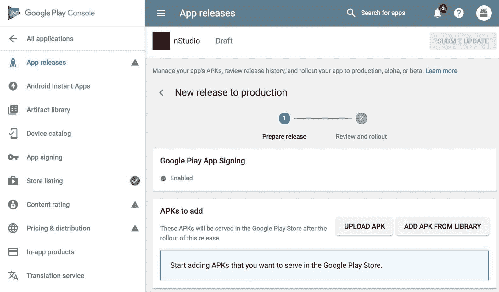
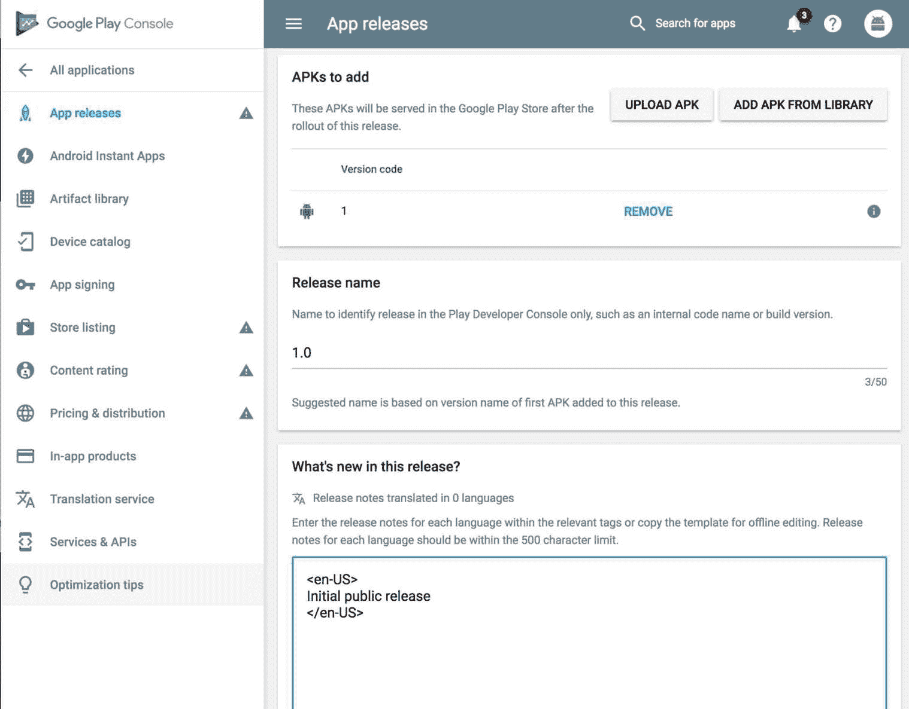

# 第十六章：部署到 Google Play

与苹果 App Store 相比，将应用部署到 Google Play 可能稍微简单一些，但仍有一些关键步骤需要我们注意。我们在第十四章（`part0154.html#4IRMK0-289fe2426d594f99a90e4363b2c9c34d`）*使用 webpack 捆绑的部署准备*和第十五章（`part0163.html#4REBM0-289fe2426d594f99a90e4363b2c9c34d`）*部署到苹果 App Store*中介绍了一些准备工作，例如使用 webpack 捆绑应用和准备应用图标和启动画面，因此我们将直接进入构建可发布的 APK。

我们对 TJ VanToll 表示感激，他撰写了一篇优秀的八步文章，介绍了如何部署 NativeScript 应用（[`www.nativescript.org/blog/steps-to-publish-your-nativescript-app-to-the-app-stores`](https://www.nativescript.org/blog/steps-to-publish-your-nativescript-app-to-the-app-stores)），我们将从中摘录并尽可能进行扩展。

本章涵盖了以下主题：

+   使用生成密钥库来构建你的 APK

+   使用 NativeScript CLI 构建可发布的 APK

+   将 APK 上传到 Google Play 进行发布

# 为 Google Play 构建 APK

在你打开 Google Play 进行注册和发布此应用（这是下一步）之前，让我们再次检查一些事情，以确保我们的元数据是正确的。

打开`app/App_Resources/Android/app.gradle`并确保`applicationId`对于你的包名是正确的：



此外，在项目根目录打开`package.json`，也仔细检查那里的`nativescript.id`：



现在，你需要为你的应用程序生成一个可执行的 Android 文件。在 Android 上，此文件具有`.apk`扩展名，你可以使用 NativeScript CLI 生成此文件。

你在 NativeScript 开发期间使用的`tns run`命令实际上为你生成了一个`.apk`文件，并将其安装到 Android 模拟器或设备上。然而，对于 Google Play 的发布，你创建的构建也必须进行代码签名。如果你想深入了解代码签名的加密细节，可以参考 Android 的文档（[`developer.android.com/studio/publish/app-signing.html`](https://developer.android.com/studio/publish/app-signing.html)），但总的来说，你需要完成以下两个步骤来创建 Android 应用的发布版本：

+   创建一个`.keystore`或`.jks`（Java 密钥库）文件

+   使用那个`.keystore`或`.jks`文件在构建过程中对你的应用进行签名

Android 文档为你提供了一些创建密钥库文件的方法（[`developer.android.com/studio/publish/app-signing.html#release-mode`](https://developer.android.com/studio/publish/app-signing.html#release-mode)）。我们首选的方法是`keytool`命令行工具，它包含在 NativeScript 为你安装的 Java JDK 中，因此它应该已经存在于你的开发机器的命令行中。

要使用 `keytool` 生成用于代码签名的密钥库，我们将使用以下命令：

```js
keytool -genkey -v -keystore nstudio.jks -keyalg RSA -keysize 2048 -validity 10000 -alias nstudio
```

`keytool` 工具会问你一些问题，其中一些是可选的（组织名称以及你所在的城市、州和国家名称），但最重要的一个是密钥库和别名（稍后详细说明）的密码。以下是当我们生成密钥库时 `keytool` 处理过程的样子：



在我们继续介绍如何使用这个 `.jks` 文件之前，有一件重要的事情你需要知道。将这个 `.jks` 文件放在一个安全的地方，并且不要忘记密钥库或别名的密码。（我个人喜欢为我的密钥库和别名使用相同的密码，以简化我的生活。）Android 要求你必须使用这个确切的 `.jks` 文件来为任何和所有应用的更新签名。这意味着如果你丢失了这个 `.jks` 文件或其密码，你将无法更新你的 Android 应用。你将不得不在 Google Play 中创建一个新的条目，并且你的现有用户将无法升级——所以请务必不要丢失它！

哦，还有一点需要注意，在大多数情况下，你希望使用单个密钥库文件来为所有个人或公司的 Android 应用程序签名。还记得你不得不向 `keytool` 工具传递 `-alias` 标志，以及那个别名有自己的密码吗？实际上，一个密钥库可以有多个别名，你将为每个构建的 Android 应用程序创建一个。 

好的，现在你有了这个 `.jks` 文件，并且将它存储在一个安全的地方，接下来的过程就相当简单了。

使用 webpack 构建我们的 Android 应用，并传递你刚刚用来创建 `.jks` 文件的信息。例如，以下命令用于创建 `nStudio` 的发布版本：

```js
npm run build-android-bundle -- --release --keyStorePath ~/path/to/nstudio.jks --keyStorePassword our-pass --keyStoreAlias nstudio --keyStoreAliasPassword our-alias-pass
```

一旦命令运行完成，你将在应用的 `platforms/android/build/outputs/apk` 文件夹中有一个可发布的 `.apk` 文件；注意该文件的位置，因为你将在下一步——在 Google Play 上部署你的应用时需要它。



# 上传到 Google Play

Google Play 是 Android 用户寻找和安装应用的地方，Google Play 开发者控制台（[`play.google.com/apps/publish/`](https://play.google.com/apps/publish/））是开发者注册和上传应用给用户的地方。

你首先将根据名称创建一个新的应用程序，然后你会看到它被列出：



Android 关于上传应用和设置商店列表的文档相当不错，所以我们不会在这里重新创建所有这些信息。相反，我们将提供一些你可能在上传自己的 NativeScript 应用到 Google Play 时觉得有用的提示。

在 Google Play 开发者控制台的“商店列表”标签页，你必须至少提供两张你的应用运行时的截图，如下所示：



使用 `tns run android --emulator` 命令在 Android **Android 虚拟设备**（**AVD**）中启动您的应用。Android AVD 内置了使用模拟器侧边栏中的小相机图标来截图的方式。

使用此按钮来获取您应用中最重要屏幕的几张截图，图像文件将出现在您的桌面上。从那里，您可以取出这些文件并直接上传到谷歌应用开发者控制台。还需要一个 1024 x 500 的特色图形图像文件，它将出现在您的商店列表顶部，如下面的截图所示：



尽管前一个截图中没有显示，但我们建议您使用像 DaVinci ([`www.davinciapps.com`](https://www.davinciapps.com)) 这样的服务来为您的截图增添一些风采，并将它们变成展示您的应用功能的简短教程。

# APK

在本章前面的步骤中，Google Play 开发者控制台的“应用发布”部分是您上传生成的 `.apk` 文件的地方。

当您查看“应用发布”部分时，可能会提到选择加入谷歌应用签名。最好是现在就加入，而不是以后。一旦您加入，它将显示为“已启用”：



然后，您可以继续上传位于您的应用 `platforms/android/build/outputs/apk` 文件夹中的 apk 文件。

一旦您上传了 APK，您应该会在同一页面上看到它列出，您可以在该页面上用您选择的多种语言编写上传版本的发布说明：



在该页面上点击“保存”后，您可能想返回商店列表部分，以完成填写您应用的所有信息。一旦一切就绪，您就可以提交您的应用了。Android 应用审核通常需要几个小时，除非谷歌标记出任何问题，否则您的应用应在半天左右的时间内出现在谷歌应用商店中。

# 摘要

哇哦！我们在苹果应用商店和谷歌应用商店都从**零**开始发布了应用，这是一次充满曲折和转折的冒险。我们真诚地希望这能让您对 NativeScript for Angular 应用程序开发有更深的了解，同时也为那些对此技术栈好奇的人解开了神秘的面纱。

NativeScript 和 Angular 都拥有蓬勃发展的全球社区，我们鼓励您参与其中，分享您的经验，并与其他人分享您和您的团队可能正在进行的所有激动人心的项目中的兴奋。永远不要犹豫去寻求帮助，因为我们都对这两种技术充满热爱和钦佩。

这里还有一些额外的有用资源您可以查看：

+   [`forum.nativescript.org`](http://forum.nativescript.org)

+   [`nativescript.rocks`](http://nativescript.rocks)

当然，了解文档也是非常重要的！

[`docs.nativescript.org/angular/start/introduction.html`](http://docs.nativescript.org/angular/start/introduction.html)

干杯！
