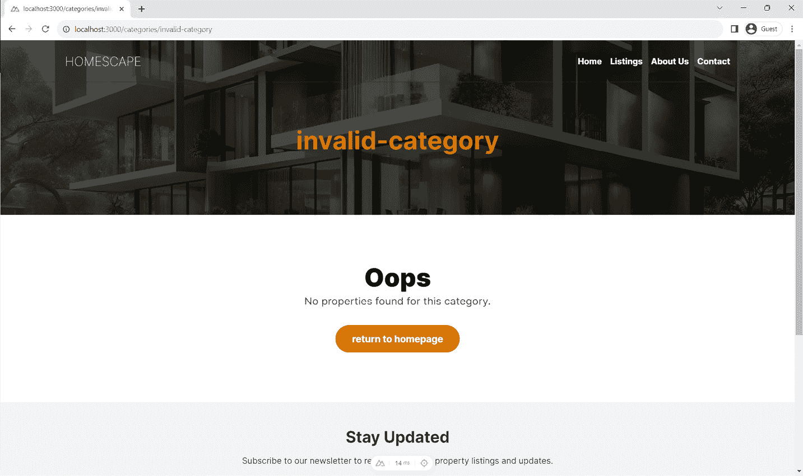
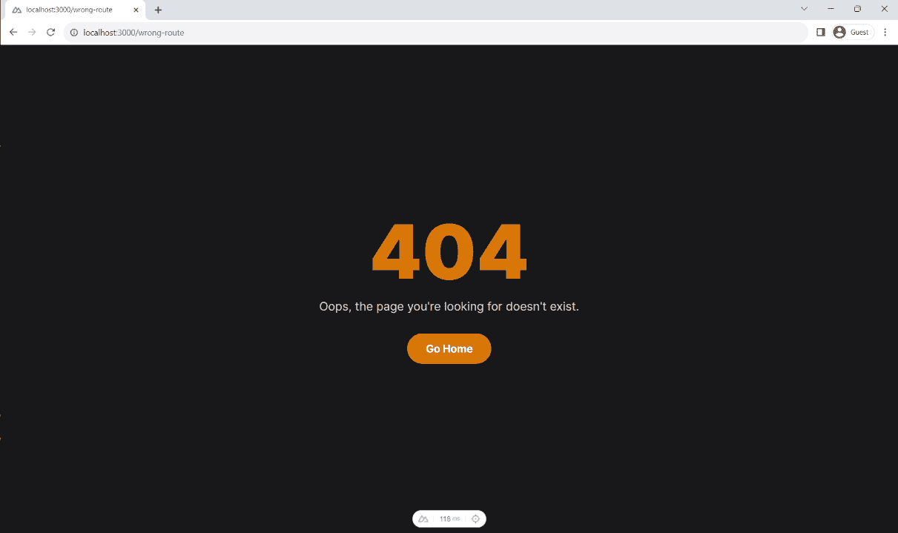

# 3

# 构建房地产列表项目以掌握路由、视图、布局和插件

欢迎回来，开发者！当你步入 *第三章* 时，你并没有进入未知领域；你正进入 Nuxt 3 旅程的更高级阶段。如果你从开始就与我们在一起，你已经熟悉了设置 Nuxt 3 项目和集成 Tailwind CSS 等其他事情。本章将把你的现有知识提升到下一个层次，因为我们将深入房地产列表项目。

我们将像往常一样开始——创建一个新的 Nuxt 3 项目，使用 Tailwind CSS 进行样式设计，以及 Google Fonts 进行字体设计。虽然这是熟悉的地盘，但我们所涉及的主题将带来新的复杂层次，为等待您的新的概念奠定基础。

本章承诺将是一次启发性的体验，因为它专注于您尚未探索的 Nuxt 3 的关键方面。您将有机会深入研究布局、路由和插件等高级主题。在这个过程中，您将学习如何定义默认布局，深入了解 Nuxt 3 的路由机制，并通过添加 `Dayjs` 用于日期格式化来探索插件。

在本章中，我们将涵盖以下主要主题：

+   定义网站的默认布局并用 404 页面覆盖它

+   创建主页并探索 TypeScript 支持

+   创建一个动态列表页面

+   创建和验证属性详情页面

+   创建一个插件以使用 `Dayjs` 进行日期格式化

# 技术要求

本章的代码文件可在 [`github.com/PacktPublishing/Nuxt-3-Projects/tree/main/chapter03`](https://github.com/PacktPublishing/Nuxt-3-Projects/tree/main/chapter03) 找到。

本章的 CiA 视频可在 [`packt.link/2oM0A`](https://packt.link/2oM0A) 找到

# 必要的背景知识 - 理解 Nuxt 3 路由、布局和插件

在深入代码之前，掌握一些关键概念对于本章的房地产列表项目至关重要：

+   `pages` 目录。这消除了手动定义路由的繁琐工作，同时通过 `nuxt.config.js` 文件仍能适应复杂的路由场景。

+   使用 `<slot />` 组件来展示页面内容。默认情况下，使用 `layouts/default.vue` 文件，但创建自定义布局并在页面元数据中分配它们是简单直接的。

+   `/plugins` 目录在创建 Nuxt 应用程序时会自动加载。可以通过在文件名后附加 `.client` 或 `.server` 后缀来定制插件，使其仅在客户端或服务器端运行。

这些核心概念为熟练地导航本章的项目提供了必要的背景。当你遍历示例时，你会注意到这些元素如何共同贡献于一个结构良好、功能强大且适应性强的应用程序。

# 在 Nuxt 3 中设置你的房地产列表项目

在上一章中，我们探讨了将`TailwindCSS`和`@nuxtjs/google-fonts`集成到 Nuxt 3 项目中的方法。在我们开始创建新项目（让我们称它为“Homescape”）时，我们将采用类似的技术。

首先，让我们创建一个新的项目：

```js
pnpm dlx nuxi@latest init homescape
```

初始化成功后，导航到项目目录，并用 VS Code 打开它：

```js
cd homescape
code .
```

接下来，我们将引入`TailwindCSS`进行样式设计，以及`@nuxtjs/google-font`来自动导入任何 Google 字体。

要安装它们，请运行以下命令：

```js
pnpm i -D @nuxtjs/tailwindcss @nuxtjs/google-fonts
```

安装后，更新`nuxt.config.ts`文件以添加模块并设置 Google Fonts 配置：

```js
// nuxt.config.ts
export default defineNuxtConfig({
    devtools: { enabled: true },
    modules: ['@nuxtjs/tailwindcss',
        '@nuxtjs/google-fonts'],
    googleFonts: {
        families: {
            Inter: [100, 300, 400, 700, 900]
        }
    }
})
```

然后，让我们在项目的根目录下生成`tailwind.config.js`文件，并设置一些默认变量：

```js
import colors from 'tailwindcss/colors'
/** @type {import('tailwindcss').Config} */
export default {
  content: [],
  theme: {
    extend: {
      colors: {
        primary: colors.amber[600],
        secondary: colors.slate[100],
        red: colors.red[600],
        yellow: colors.yellow[500]
      },
      // use Roboto Font
      fontFamily: {
        sans: ['Inter', 'sans-serif']
      },
      container: {
        center: true,
        padding: {
          DEFAULT: '1.5rem',
          lg: '4rem',
          xl: '4rem',
          '2xl': '4rem'
        },
        screens: {
          sm: '576px',
          md: '768px',
          lg: '992px',
          xl: '1200px',
          '2xl': '1400px'
        }
      }
    }
  },
  plugins: []
}
```

`tailwind.config.js`文件将作为我们自定义样式、组件定义和主题调整的载体，确保我们的实用类优化，并在整个项目中保持一致的设计语言。

从我们的通用设置导航到具体性，这是我在 Tailwind CSS 中首选的启动配置：

```js
export default {
  content: [],
  theme: {
    extend: {
      colors: {
        primary: '#42B883',
        secondary: '#35495E',
        neutral: '#F7F9FA'
      },
      container: {
        center: true,
        padding: {
          DEFAULT: '1.5rem',
          lg: '4rem',
          xl: '4rem',
          '2xl': '4rem'
        },
        screens: {
          sm: '576px',
          md: '768px',
          lg: '992px',
          xl: '1200px',
          '2xl': '1400px'
        }
      }
    }
  },
  plugins: []
}
```

在这里，我们选择了一个包括琥珀色、板岩色、红色和黄色的调色板。这些颜色将为我们的房地产列表网站增添独特的特色。对于那些对其他配置细节感兴趣，例如字体和容器设置，请参阅*第二章*，在那里我们全面地介绍了这些主题。

完成配置设置后，让我们通过制作一个简单的布局来测试我们的调整。导航到你的`app.vue`文件，并在模板中添加以下内容：

```js
<template>
  <div class="text-8xl text-primary text-center">Homescape
    </div>
</template>
```

这是预期的输出：


图 3.1：Homescape – 初始页面

在创建初始项目后，我们已经准备好深入到我们项目的新的方面。让我们从定义带有默认布局的首页开始，并为 404 页面进行定制。

# 定义网站的默认布局并覆盖 404 页面

一个结构良好的布局就像房子的坚固框架，为不同的页面提供了一个稳固的基础，使得页面可以无缝地存在。在这里，你只需定义一次常见的元素，如页眉和页脚，它们就会在你的网站上保持一致地渲染，带来统一的视觉效果，并使用户的导航更加容易。

当我们过渡到本节的下半部分时，我们的重点转向处理用户意外访问不存在页面的不可预见情况。我们将探讨如何在 Nuxt 中制作一个用户友好的 404 页面，告知用户错误并引导他们回到正确的路径。所以，让我们开始吧！

## 定义默认布局

让我们在项目的根目录下创建一个名为`layouts`的新文件夹，然后在其中创建一个名为`default.vue`的新文件。这个文件将包含所有页面共享的结构：

```js
<!-- File: ~/layouts/default.vue -->
<template>
  <div>
    <header>the header</header>
    <slot />
  </div>
</template>
```

在布局文件中，`<slot />`元素是注入单个页面内容的地方。

在`app.vue`文件中，我们应该用`<NuxtLayout>`组件包裹我们的模板，以定义我们的布局。所有页面内容都将在这个组件内显示：

```js
<!-- File: ~/app.vue -->
<template>
  <NuxtLayout>
    <div class="text-8xl text-primary text-center">
      Homescape
    </div>
  </NuxtLayout>
</template>
```

现在你应该能够在网站上看到演示头部。


图 3.2：Homescape – 默认布局

我们将实现`default.vue`布局文件，包括三个主要部分：头部、主要内容区域和页脚，以及新闻通讯部分。这个布局封装了所有应用页面将继承的通用结构。

让我们创建我们的头部组件，它将作为我们网站的导航栏。

## 创建 BaseHeader 组件

初始时，我们将通过在`components`目录内创建一个名为`base`的新目录来组织我们的项目。这个`base`目录将存放与任何特定业务部分无关的全局组件。

在`base`目录内，我们创建一个名为`Header.vue`的新文件。这个文件将包含所有与我们的头部组件相关的代码：

```js
components/
|-- base/
    |-- Header.vue // Accessible as <base-header />
```

Nuxt 提供了一个强大的自动组件发现机制。在我们的设置中，我们将`Header.vue`组件放置在`components`目录内的一个名为`base`的文件夹中。由于 Nuxt 的命名约定，这个组件现在可以通过`<base-header />`在我们的布局和页面中访问。

命名约定非常直观——目录名称作为前缀添加到组件名称前，由连字符分隔。这不仅使组件名称唯一，而且以清晰和有序的方式将相关组件分组在一起。此外，它提供了一个简单的方法，仅通过组件名称就可以识别组件的来源和分组，这在协作开发环境或大型项目中可能是一个重要的辅助。

这个`Header.vue`文件将包含所有与我们的头部组件相关的代码：

```js
<template>
  <!-- Header -->
  <header
    class="absolute top-0 left-0 w-full border-b
           border-b-gray-800 z-20 p-6">
    <div class="container flex justify-between
    items-center">
      <h1 class="text-white font-extralight
        uppercase text-2xl">Homescape
      </h1>
      <nav>
        <ul class="flex space-x-4">
          <li v-for="link in navLinks" :key="link.text">
            <a
              :href="link.href"
              class="text-white transition-colors
              font-semibold hover:text-primary">
              {{ link.text }}
            </a>
          </li>
        </ul>
      </nav>
    </div>
  </header>
</template>
<script setup lang="ts">
const navLinks = ref([
  { text: 'Home', href: '/' },
  { text: 'Listings', href: '#' },
  { text: 'About Us', href: '#' },
  { text: 'Contact', href: '#' }
])
</script>
<style scoped></style>
```

我们已经将头部样式设置为固定在顶部，底部有边框，并使用 Tailwind CSS 类进行样式设计。`navLinks`数据属性包含一个链接对象数组，这些对象在模板中被渲染为导航链接。

随着我们继续构建我们的网站，我们将制作一个新闻通讯部分和页脚组件，以增强我们网页的结构和用户参与度。

这两个组件都将创建在`components/base`文件夹中，名称分别为`NewslettersSection.vue`和`Footer.vue`：

```js
<!-- ~/components/base/ NewslettersSection.vue -->
<template>
  <section class="bg-gray-100 py-12">
    <div class="container text-center">
      <h2 class="text-3xl font-bold text-gray-800 mb-4">
        Stay Updated
      </h2>
      <p class="text-gray-700 mb-6">
        Subscribe to our newsletter to receive the latest
        property listings and updates.
      </p>
      <form class="flex justify-center">
        <input
          type="email"
          placeholder="Enter your email"
          required
          class="px-4 py-2 rounded-l-lg border
                 border-gray-300 focus:outline-none
                 focus:border-primary"/>
        <button
          type="submit"
          class="px-4 py-2 rounded-r-lg bg-primary
          text-white font-bold">Subscribe
        </button>
      </form>
    </div>
  </section>
</template>
```

基础页脚组件由三个部分组成：公司名称和地址、按类别列出，以及包含如常见问题解答、隐私政策和服务条款等有用链接的附加信息。按类别列出的部分将稍后用静态获取的数据填充。页脚还包括版权声明，标志着网站内容的所有权：

```js
<template>
  <footer class="bg-zinc-900 text-gray-300">
    <div class="container text-center lg:text-left py-12">
      <div class="grid grid-cols-1 lg:grid-cols-3 gap-6">
        <!-- Company Name -->
        <div class="mb-4 lg:mb-0">
          <h3 class="text-3xl text-gray-200 uppercase
            font-extralight mb-8">Homsecape
          </h3>
          <p class="text-gray-"00">
            123 Elm Street<br />
            Suite 456<br />
            Springfield, IL 62704
          </p>
        </div>
        <!-- Listing by Category -->
        <div>
          <h4 class="text-lg font-bold text-gray-200 mb-2">
            Listing by Category
          </h4>
        </div>
        <!-- Additional Info -->
        <div>
          <h4 class="text-lg font-bold text-gray-200 mb-2">
            Additional Info
          </h4>
          <ul>
            <li class="mb-1">
              <a
                href="#"
                class="text-gray-400 transition-colors
                hover:text-primary">FAQ
              </a>
            </li>
            <li class="mb-1">
              <a
                href="#"
                class="text-gray-400 transition-colors
                hover:text-primary">Privacy Policy
              </a>
            </li>
            <li class="mb-1">
              <a
                href="#"
                class="text-gray-400 transition-colors
                hover:text-primary">Terms of Service
              </a>
            </li>
          </ul>
        </div>
      </div>
    </div>
    <div class="bg-zinc-950 text-center py-4 text-gray-400
      text-sm">&copy; 2023 HOMESCAPE. All rights reserved.
    </div>
  </footer>
</template>
```

在创建了单个组件之后，是时候在我们 `default.vue` 布局文件中将它们组合在一起了。这个布局充当了我们页面的结构蓝图，确保了网站设计的一致性。

这就是我们的 `default.vue` 布局的结构：

```js
<template>
  <base-header />
  <slot></slot>
  <base-newsletters-section />
  <base-footer />
</template>
```

输出结果应如下所示：


图 3.3：Homescape – 最终默认布局

你会注意到，目前页眉文本是不可见的，标题与页眉重叠。然而，一旦我们引入一个带有深色背景的英雄部分并将其扩展到全高度，页面的美学将显著提升。

在我们的布局和基本组件建立了坚实的基础之后，让我们继续创建主页、列表页和错误页。

# 创建主页和探索 TypeScript 支持

构建主页和列表页是我们项目中的一个关键步骤。在这里，用户将开始他们的旅程，浏览各种物业列表。为了开始制作这些页面，我们需要设置一个 `pages` 目录。这个目录对于存放我们所有的页面组件至关重要。

## 页面目录简介

要创建主页或“索引”页面，我们需要在 `pages` 目录中创建一个新的组件，名为 `index.vue`，然后按照以下方式覆盖 `app.vue` 组件：

```js
<!-- app.vue -->
<template>
  <NuxtLayout>
    <NuxtPage />
  </NuxtLayout>
</template>
```

注意，我们在 `NuxtLayout` 中使用了 `<NuxtPage />` 组件来渲染当前页面组件。这样，`app.vue` 中定义的结构充当了一个通用布局，而来自单个页面的内容则被注入到 `<NuxtPage />` 放置的位置。

`pages` 目录非常强大。该目录内的文件结构对应于我们应用程序的路由结构，每个 `.vue` 文件都成为我们应用程序中的一个路由。例如，一个 `pages/about.vue` 文件会自动在我们的应用程序中生成一个 `/about` 路由。

现在，随着 `pages` 目录的设置和 `app.vue` 的定制以适应单个页面，我们正朝着定义主页和列表页的布局迈进。

## 探索 TypeScript 支持

在我们着手创建具有各种物业列表的页面时，对我们将要处理的数据有清晰的理解和结构至关重要。在现实世界的场景中，这些数据将从 API 中获取。然而，在本章的范围内，我们将使用静态文件来表示我们的数据，以便在接下来的章节中平滑且直接地将数据从 API 中获取。

我们应用程序中的数据主要围绕物业和类别。我们有三个不同的数据集代表物业：`properties.ts`、`featuredProperties.ts` 和 `recentlyListedProperties.ts`。此外，还有一个 `categories.ts` 文件代表不同的物业类别。所有这些数据集都是按照模拟真实世界数据的方式构建的。

现在，为了确保在整个应用程序中一致且无错误地处理这些数据，采用 TypeScript 是一个明智的选择。TypeScript 提供了一种定义数据严格类型的方法，这显著减少了潜在的错误，并使代码更易于阅读和管理。

Nuxt 3 自带内置的 TypeScript 支持，这对于热衷于类型安全的开发者来说是一个福音。我们的第一步是定义一个`Property`类型。让我们在项目的根级别创建一个`types`文件夹，并在其中创建一个`index.ts`文件。在这个文件中，我们将定义我们的`Property`类型以及`Category`类型：

```js
export {}
declare global {
  type Property = {
    id: string
    title: string
    description: string
    image: string
    category: string // Reference to the category title
    bedrooms: number
    bathrooms: number
    squareFeet: number
    price: number
    listedDate: string
  }
  type Category = {
    id: string
    name: string
    description: string
    image: string
  }
}
```

通过导出一个空对象并声明一个包含`Property`和`Category`的全局对象，我们使这些类型在我们的应用程序中全局可用。这种方法消除了在每个组件中导入类型的需要。现在让我们来谈谈在 Nuxt 项目中创建组件的最佳实践。

## 关于组件路径的说明

在组织 Nuxt 3 项目中的组件时，我们有灵活性，可以根据我们的开发风格和项目需求以最佳方式组织我们的文件。例如，考虑以下组件路径：

```js
<!-- /components/property/card.vue -->
```

这将在`components`根目录下的嵌套目录`property`中创建组件，使我们能够将所有与属性功能相关的组件分组在同一个文件夹中。或者，我们也可以将组件直接放置在`components`根目录下，以更扁平的结构：

```js
<!-- /components/PropertyCard.vue -->
```

这两种方法都使我们能够在模板中使用相同的标签调用组件：

```js
<property-card />
```

然而，我更喜欢第一种方法，因为它有助于将相关的组件组织在同一文件夹中，使项目结构更易于管理，尤其是在项目增长时。

现在我们有了项目类型和组件路径的蓝图，让我们开始创建我们的组件！

## 创建属性和类别卡片组件

首先创建一个名为`property`的文件夹。在其内部，创建一个接收`property`作为 prop 的`Card.vue`组件：

```js
<!-- /components/property/Card.vue -->
<template>
  <nuxt-link
    :to="`/properties/${property.id}`"
    class="max-w-sm mx-auto bg-white shadow-lg rounded-lg
    overflow-hidden"
  >
    
    <div class="p-6">
      <h2 class="text-lg font-bold text-gray-800 mb-2">
        {{ property.title }}
      </h2>
      <p class="text-gray-600 text-sm mb-4">
        {{ property.description }}
      </p>
      <div class="flex justify-between items-center">
        <span class="font-bold text-primary text-lg">
          ${{ property.price }}
        </span>
        <span class="text-gray-600 text-sm">
          {{ property.bedrooms }} BR |
          {{ property.bathrooms }} BA |
          {{ property.squareFeet }} sq ft
        </span>
      </div>
    </div>
  </nuxt-link>
</template>
<script setup lang="ts">
import { Property } from '~/types'
defineProps<{
  property: Property
}>()
</script>
```

在提供的代码片段中，我们使用了`Property`类型，因为我们已经全局定义了它。随后，`defineProps`是 Vue.js 中的一个实用工具，用于在 Composition API 设置中定义组件的 prop 类型。在这个例子中，它指定了`property` prop 应遵循`Property`类型中概述的结构。

同样地，我们将创建`/components/category/Card.vue`组件：

```js
<!-- /components/category/Card.vue -->
<template>
  <nuxt-link
    :to="`/categories/${category.name}`"
    class="relative group overflow-hidden rounded-lg"
  >
    
    <div
      class="absolute inset-0 bg-black bg-opacity-40
      group-hover:bg-opacity-70 transition-all duration-700
      flex items-center justify-center"
    >
      <div class="text-center">
        <h3
          class="text-xl group-hover:text-2xl
          transition-all duration-700 font-bold text-white"
        >
          {{ category.name }}
        </h3>
      </div>
    </div>
  </nuxt-link>
</template>
<script setup lang="ts">
defineProps<{
  category: Category
}>()
</script>
```

现在让我们开始实现主页，看看我们如何在其中使用`Property`和`Category`组件。

## 创建主页

我们将从在`base`文件夹内创建一个简单的覆盖背景组件开始：

```js
<!-- components\base\OverlayBg.vue -->
<template>
  <div class="absolute inset-0">
    
    <div class="absolute inset-0 bg-black bg-opacity-70" />
  </div>
</template>
```

此组件将被用作英雄部分中的绝对背景，以及错误页面。

然后，让我们制作 `HeroSection` 组件，它将为我们的访客提供一个欢迎的视觉元素。这个组件将存放在一个专门的主页文件夹中，展示我们应用程序的有序和模块化结构：

```js
<template>
  <!-- Hero Section -->
  <section
    class="relative h-screen flex items-center
    justify-center rounded-lg p-6"
  >
    <base-overlay-bg />
    <div class="relative text-center z-10">
      <h2 class="text-primary font-bold text-5xl mb-4">
        Find Your Dream Home with
        <span class="uppercase font-extralight">Homescape
        </span>
      </h2>
      <p
        class="text-gray-300 text-3xl leading-snug
        text-center font-extralight mb-12">
        Explore listings, compare properties, and discover
        a place you'll love to live.
      </p>
      <base-btn> Browse Listings </base-btn>
    </div>
  </section>
</template>
```

在 `HeroSection` 之后，我们将进一步完善主页的其他部分，特别是 `FeaturedProperties` 和 `RecentlyListedProperties` 部分。这些部分将从各自的静态文件中获取数据，渲染属性卡片以展示一系列的属性。

这是 `FeaturedProperties` 组件：

```js
<template>
  <section class="container py-12">
    <h2 class="text-3xl text-center font-bold text-gray-800
      mb-6">
      Top Featured Properties
    </h2>
    <div class="grid grid-cols-1 md:grid-cols-2
    lg:grid-cols-4 gap-6">
      <property-card
        v-for="property in featuredProperties"
        :key="property.id"
        :property="property"
      />
    </div>
  </section>
</template>
<script setup lang="ts">
import featuredProperties from '~/data/featuredProperties'
</script>
```

对于 `RecentlyListedProperties` 也将采用类似的方法。

此外，我们还将为每个属性类别创建一个组件，并将它们封装在 `ExploreCategories` 组件中，这个组件也将放置在主页上：

```js
components
│
├── base
│   ├── Btn.vue
│   ├── Footer.vue
│   ├── Header.vue
│   └── NewslettersSection.vue
│   └── OverlayBg.vue
│
├── category
│   └── Card.vue
│
├── homepage
│   ├── HeroSection.vue
│   ├── ExploreCategories.vue
│   ├── FeaturedProperties.vue
│   └── RecentlyListedProperties.vue
│
└── property
    └── Card.vue
```

`components` 目录下的每个文件夹都是系统性地组织起来的，用于存放相关组件，有助于实现一个干净、结构良好且易于管理的代码库。

注意

本章中使用的所有资源、整个代码库和资产都可在相关仓库中随时查阅和探索。

按照概述的步骤完成之后，此时你的应用程序应该看起来像这样：


图 3.4：最终的主页

我们已经出色地构建了我们的主页。接下来，我们将着手创建列表页面，以进一步增强我们应用程序的功能。

# 创建一个动态列表页面

动态路由是 Nuxt 的一个基本概念，它允许开发者构建灵活且数据驱动的路由。与静态路由不同，静态路由中的每个路由都是预先定义且固定的，而动态路由会根据提供的数据进行适应，从而实现更可扩展和可维护的路由结构。

在 Nuxt 中，创建动态路由就像在 `pages` 目录中添加一个特殊的 Vue 文件一样简单。文件名应包含一个用方括号 `[]` 包围的参数，该参数作为传递给路由的实际数据的占位符。然后可以在页面组件中访问此参数，提供一种根据路由加载和显示数据的方法。

例如，如果你在 `pages` 目录中有一个名为 `[slug].vue` 的文件，Nuxt 将将其转换为具有动态段的路由，如 `/something`，其中 something 是 `slug` 参数的值。这个 `slug` 参数可以在页面组件中访问，从而根据其值加载和显示数据。

现在，在我们的具体示例中，我们将探讨如何利用这个功能通过在 `pages` 目录下的 `categories` 目录中定义一个 `[name].vue` 文件来创建基于类别的列表页面。这种设置将使我们能够拥有如 `/categories/houses` 或 `/categories/apartments` 这样的路由，动态渲染与每个类别相关的属性。

现在，让我们讨论一下我们的 `[``name].vue` 文件的 `script` 部分：

```js
<script setup lang="ts">
import properties from '~/data/properties'
const route = useRoute()
const categoryName = route.params.name
const filteredProperties = computed(() =>
  properties.filter(item => item.category === categoryName)
)
</script>
```

下面是脚本的逐步分解：

1.  我们从我们的静态数据文件中导入`properties`数据。

1.  我们使用 Nuxt 的`useRoute`组合式来访问路由参数。

1.  `categoryName`常量捕获了路由的动态部分（在本例中是类别名称）。

1.  我们创建一个计算属性`filteredProperties`，用于根据类别名称过滤`properties`数组。

进入模板部分，它被设计用来展示按类别过滤后的属性。如果存在匹配的属性，它们将以网格布局显示。如果没有找到匹配的属性，则会显示一条消息，并附带一个返回主页的按钮：

```js
<div
  v-if="filteredProperties.length"
  class="grid grid-cols-1 md:grid-cols-2 lg:grid-cols-4
  gap-6"
>
  <property-card
    v-for="property in filteredProperties"
    :key="property.id"
    :property="property" />
</div>
<div v-else class="text-center py-12">
  <div class="text-5xl font-black mb-2">Oops</div>
  <p class="text-gray-700 text-xl mb-8">
    No properties found for this category.
  </p>
  <nuxt-link to="/">
    <base-btn>return to homepage</base-btn>
  </nuxt-link>
</div>
```

这里的逻辑很简单：

+   我们使用`v-if`指令检查是否有选择类别的属性。如果有，我们渲染一个`property-card`组件的网格，每个组件接收一个`property`对象作为属性。


图 3.5：列出类别/阁楼

+   在没有属性匹配类别的情况下（`v-else`），我们显示一条消息和一个按钮，用于导航回主页，当找不到所需内容时，提供良好的用户体验和清晰的行动路径。



图 3.6：列出无效类别

然而，这个页面没有验证路由参数是否存在。在下一节中，我们将实现和验证属性详情页面，并学习如何验证路由参数。

# 创建和验证属性详情页面

在上一节中，没有实现数据验证；我们只是检查是否有与特定类别关联的属性，如果没有找到，则显示一条消息。然而，在属性详情页面上，我们添加了一个额外的验证层，以确保数据完整性和用户体验得到维护。

让我们创建属性详情动态页面。该页面应位于`/pages/properties/[id].vue`，允许根据属性 ID 动态访问单个属性页面。

现在，让我们讨论`script`部分：

```js
<script setup lang="ts">
import properties from '~/data/properties'
definePageMeta({
  validate: async route => {
    // check if property exists
    return !!properties.find(
      item => item.id === route.params.id)
  }
})
const route = useRoute()
const property = properties.find(
  item => item.id === route.params.id)
</script>
```

下面是脚本分解：

`definePageMeta`函数在 Nuxt 设置中使用，用于定义页面的元数据。这是一个实用工具，允许你设置与页面生命周期和行为相关的各种选项和钩子。`definePageMeta`提供的强大功能之一是使用`validate`方法验证路由参数。

`validate`方法用于在渲染页面之前验证路由参数。这是一种确保传入的路由参数在允许页面渲染之前满足某些标准的方法。如果`validate`方法返回 false（当 ID 不匹配任何属性时），Nuxt 将自动将用户重定向到 404 错误页面。

验证后，脚本使用`useRoute`函数获取当前路由对象。然后，它在属性数据中定位与路由参数中的 ID 匹配的特定属性对象。此属性对象将在模板中用于显示所选属性的详细信息。

显示属性详情的模板很简单，因为它只是展示了属性的属性。您可以从相关仓库中查看它。

实现脚本和模板后，您可以通过访问[`localhost:3000/properties/6`](http://localhost:3000/properties/6)页面来测试设置。此 URL 应将您带到显示有效属性详细信息的页面。


图 3.7：属性详情页面

然而，如果您尝试访问一个不存在的属性，例如通过[`localhost:3000/properties/6666`](http://localhost:3000/properties/6666)，应用程序应将您重定向到 404 错误页面。这种行为确保了当用户尝试访问不存在的内容时，他们会被适当引导，从而增强用户体验并保持应用程序数据展示的完整性。现在让我们继续创建自定义错误页面。

## 创建自定义错误页面

优雅地处理错误对于良好的用户体验至关重要。Nuxt 提供了一个默认错误页面，当发生错误时（例如，当用户导航到不存在的路由时）会显示该页面。最初，如果您尝试访问错误的 URL，就像我们之前做的那样，您将看到 Nuxt 的默认错误页面，它相当通用。


图 3.8：默认错误页面

我们的目的是用一个更个性化的页面来覆盖它，该页面保持网站的主题。在项目的根目录中创建一个名为`error.vue`的新文件，除了`app.vue`组件。此`error.vue`文件将覆盖 Nuxt 提供的默认错误页面。

这里有一个文件结构的示例：

```js
<template>
  <div
    class="min-h-screen bg-zinc-900 flex flex-col
    justify-center items-center">
    <div class="relative text-center">
      <div class="text-9xl font-black
        text-amber-600">404</div>
      <p class="text-gray-300 text-xl mt-4 mb-8">
        Oops, the page you're looking for doesn't exist.
      </p>
      <router-link to="/">
        <base-btn> Go Home </base-btn>
      </router-link>
    </div>
  </div>
</template>
```

您可能会注意到我创建了一个简单的`BaseBtn.vue`组件，其中包含自定义 CSS 样式。您可以从相关章节的仓库中查看该组件。

默认情况下，此自定义错误页面将捕获 404 错误，当用户尝试访问不存在的路由时显示您个性化的消息。然而，值得注意的是，目前这个页面即使发生其他类型的错误也会显示 404 错误。我们可以在以后调整此行为，以相应地处理不同类型的错误。

现在让我们通过尝试访问一个不存在的路由来测试它：



图 3.9：自定义 error.vue

在下一节中，我们将创建一个插件，该插件使用`Dayjs`库来处理应用程序中的日期格式化。

# 创建一个插件以使用 Dasyjs 格式化日期

任何应用程序中常常被忽视但至关重要的一个部分是我们管理和显示时间与日期的方式。通常，JavaScript 的本地`Date`对象在高级格式化时可能会很麻烦。这就是`Dayjs`发挥作用的地方。`Dayjs`是一个简约的 JavaScript 库，它提供了一种简单的方式来格式化、解析和操作日期。从现在开始，我们将用`Dayjs`显示的相对日期格式替换项目中静态的日期渲染。

## 安装 Dayjs

要开始，请在项目目录中运行以下命令来安装`Dayjs`：

```js
pnpm i dayjs
```

## 设置插件目录和文件

Nuxt 的插件系统允许你在根 Vue.js 应用实例化之前运行你的代码。它们在应用的启动阶段运行，可以根据你的配置在客户端、服务器端或两者同时执行。

当你创建一个新的插件时，就像为你的团队增加了一个具有特定技能的新成员。这个团队成员（插件）可以执行项目中每个人都可以使用的任务。例如，将`Dayjs`设置为插件允许你在项目的任何需要的地方调用日期格式化功能。

通过将`dayjs.ts`文件放在`plugins`目录中，你实际上是在告诉 Nuxt，“嘿，在你启动之前，确保你知道如何使用`Dayjs`来格式化日期，因为我们将要用到它。”如果你还没有设置`plugins`目录，请在项目的根目录下创建一个。在这个目录内，创建一个名为`dayjs.ts`的新文件。

## 使用配置初始化 Dayjs

在你新创建的`dayjs.ts`文件中，你需要导入`Dayjs`并使用必要的配置初始化它。一旦初始化，我们将使用 Vue 的`provide`方法使`FromNow`函数在应用中可用。这种能力将使我们能够以更用户友好的相对格式表示日期，例如“1 天前”或“2 周前”。

这里是插件的代码：

```js
import dayjs from 'dayjs'
import relativeTime from 'dayjs/plugin/relativeTime'
export default defineNuxtPlugin(nuxtApp => {
  dayjs.extend(relativeTime)
  const fromNow = (date: string) => {
    return dayjs(date).fromNow()
  }
  return {
    provide: { fromNow }
  }
})
```

下面是代码的分解：

1.  插件首先导入`Dayjs`库及其`relativeTime`插件。

1.  我们使用 Nuxt 的`defineNuxtPlugin`方法来创建插件。

1.  在插件内部，定义了一个名为`fromNow`的函数。它接受一个日期字符串，并使用`Dayjs`的`.fromNow()`方法以人类可读的格式返回相对时间差。

1.  最后，使用`provide`方法使这个函数在 Nuxt 应用的全局范围内可用。

## 在属性详情页使用全局 FromNow 函数

一旦你成功创建并整合了`Dayjs`插件到你的 Nuxt 应用中，下一步就是将其用于你的组件或页面。在这里，我们将将其整合到我们的属性详情页中。

定位到页面：`pages\properties\[id].vue`。在属性描述下方插入以下代码：

```js
<p class="text-gray-700 text-center text-lg">
  {{ property.description }}
</p>
<div class="text-gray-700 text-center mb-8">
  Listed {{ $fromNow(property.listedDate) }}
</div>
```

由于我们之前创建的插件，`$fromNow` 函数现在全局可用。它接受 `property.listedDate` 作为参数，并以可读的格式显示。

我们在 VS Code 中安装的先决条件扩展之一的优势是，你的 IDE 将会识别 `plugins` 目录中提供的辅助工具。这意味着当你输入 `$fromNow` 时，你将受益于 Intellisense 支持，包括自动完成建议甚至参数提示，使你的开发过程更加高效。


图 3.10：插件提供 Intellisense

总结来说，我们回顾了创建 Nuxt 插件以集成 `Dayjs` 进行日期格式化的过程。然后，我们使用这个全局可用的 `fromNow` 函数在属性详情页面中显示日期的可读格式。

# 摘要

在本章中，我们通过制作一个房地产列表项目深入探讨了高级 Nuxt 3 功能。我们首先设置了一个 Nuxt 3 项目，结合了 Tailwind CSS 和 Google Fonts——这是我们之前接触过的基本知识。我们很快转向定义默认的网站布局，并学习如何为特殊案例（如 404 页面）覆盖它。TypeScript 支持在我们的主页开发中也占有一席之地。接下来，我们创建了一个动态列表页面来显示属性，然后构建了单个属性详情页面。我们通过集成 `Dayjs`（通过自定义插件进行日期格式化）来结束。在这个过程中，关键 Nuxt 3 概念如路由、布局和插件作为指南针，帮助我们构建了一个全面的应用程序。本章旨在提升你的 Nuxt 3 知识水平，让你为复杂项目做好准备。

在即将到来的*第四章*中，我们将把重点转移到新的挑战：构建天气仪表板。这一章将是你了解使用 Pinia 在 Nuxt 应用程序中状态管理的实践指南。这不仅仅是理论；你将构建一个实用的、现实世界的应用程序，其中你将管理多个城市及其天气数据的状态。

# 练习问题

+   你如何在 Nuxt 3 项目中设置默认布局？

+   你如何创建一个错误页面？

+   Nuxt 是否支持组件或 props 中的 TypeScript？

+   你如何创建动态页面？

+   你如何验证动态页面，并在它们无效时重定向到 404 页面？

+   什么是 Nuxt 插件？它们的主要好处是什么？

+   你如何在 Nuxt 3 中实现日期格式化的插件，例如 Dayjs？

# 进一步阅读

+   Nuxt 路由：[`nuxt.com/docs/getting-started/routing`](https://nuxt.com/docs/getting-started/routing)

+   Vue 插件：[`vuejs.org/guide/reusability/plugins`](https://vuejs.org/guide/reusability/plugins)

+   Nuxt 页面目录：[`nuxt.com/docs/guide/directory-structure/pages`](https://nuxt.com/docs/guide/directory-structure/pages)

+   Nuxt 布局目录：[`nuxt.com/docs/guide/directory-structure/layouts`](https://nuxt.com/docs/guide/directory-structure/layouts)

+   Nuxt 插件目录：[`nuxt.com/docs/guide/directory-structure/plugins`](https://nuxt.com/docs/guide/directory-structure/plugins)

+   Dayjs 文档：[`day.js.org/docs/en/installation/installation`](https://day.js.org/docs/en/installation/installation)
