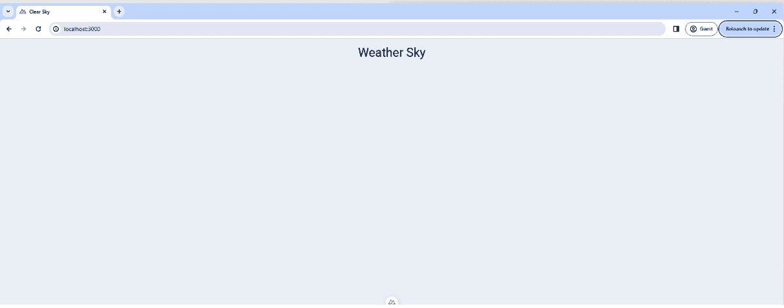
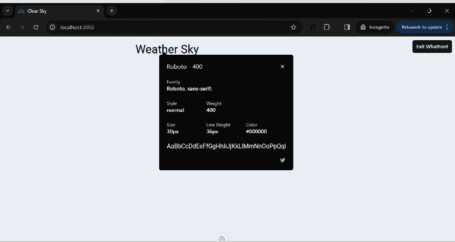
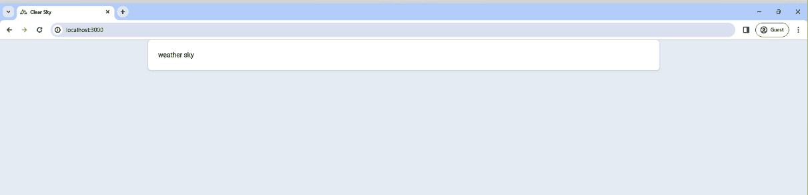
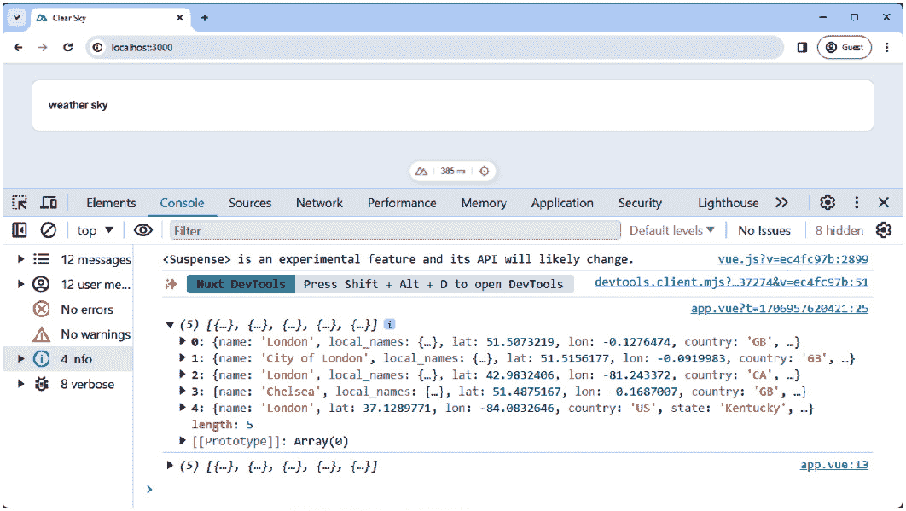
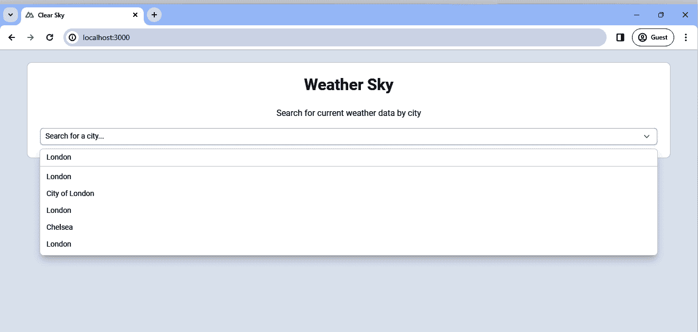
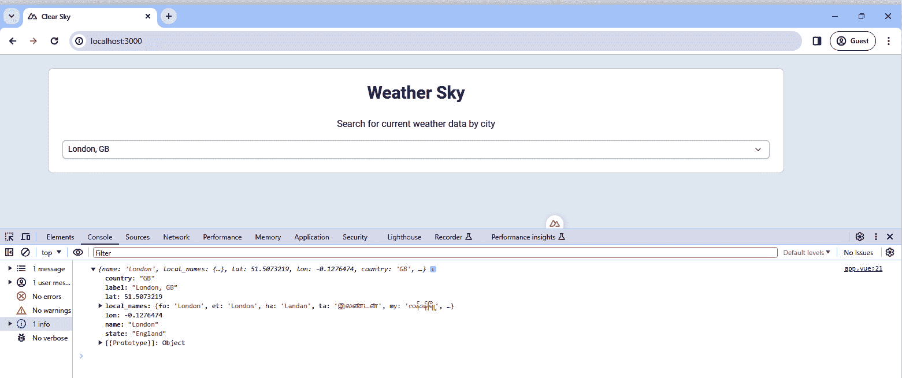
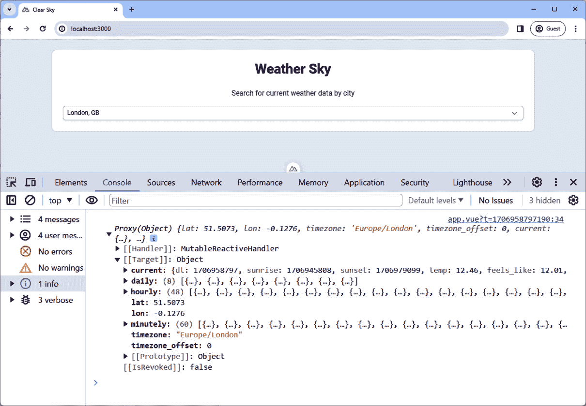
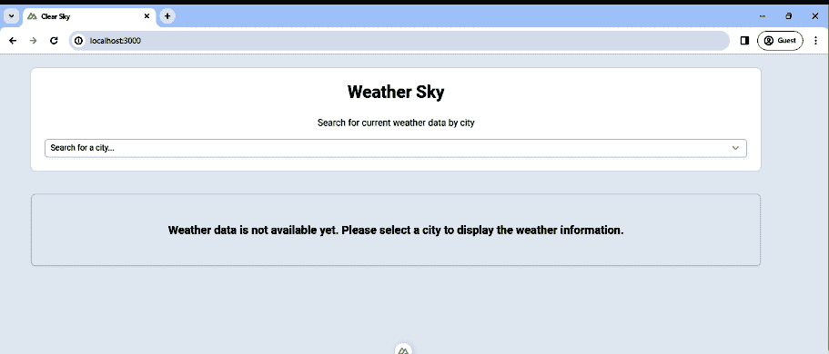
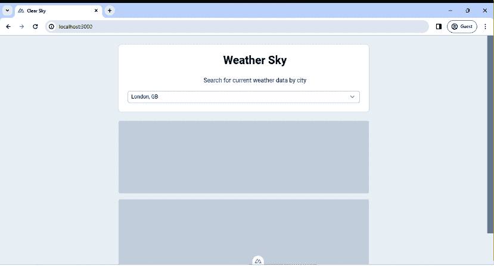
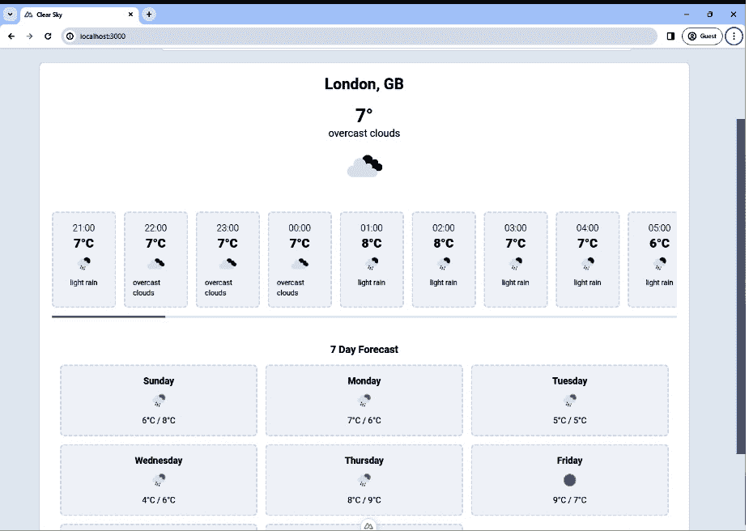

# 第四章：构建天气仪表板——数据获取和状态管理

随着我们进入 Nuxt 3 探索的 **第四章**，我们将目光投向构建一个实用的天气仪表板。我们的旅程从 **Nuxt UI** 开始，这是 Nuxt 的官方 UI 库，它简化了令人惊叹且响应式网络应用程序的创建。Nuxt UI 提供了一个全面的、完全样式化和可定制的 UI 组件集合，专门为 Nuxt 设计。我们将探讨如何将 Nuxt UI 导入我们的项目并使用其组件。

接下来，我们将讨论一般的数据获取。这将为我们理解如何在 Nuxt 应用程序中动态检索和处理数据打下基础。具体来说，我们将在项目中使用 **OpenWeatherMap** API，为我们的数据获取实践提供一个现实世界的背景。

在此之后，我们将掌握 `$fetch` 以实现高效的数据获取。通过从 OpenWeatherMap API 获取真实天气数据，您将学习如何有效地和响应式地显示这些信息。

最后，我们将指导您使用 **Pinia** 进行状态管理。这种方法集中管理应用程序数据的状态，便于在不同组件之间轻松访问和操作天气数据，避免了属性钻取的复杂性。

在本章中，我们将涵盖以下主要主题：

+   设置天气仪表板应用程序。

+   在天气仪表板中集成 Nuxt UI

+   探索 Nuxt 3 中使用 `$fetch` 进行数据获取

+   将 Pinia 存储与城市和天气数据集成

# 技术要求

本章的代码文件可以在 [`github.com/PacktPublishing/Nuxt-3-Projects/tree/main/chapter04`](https://github.com/PacktPublishing/Nuxt-3-Projects/tree/main/chapter04) 找到。

本章的 CiA 视频可以在 [`packt.link/1uNS1`](https://packt.link/1uNS1) 找到

# 必要的背景知识——理解 Nuxt 3 数据获取和状态管理

在深入实际应用之前，让我们在两个关键领域打下坚实的基础——使用 Nuxt UI 进行数据获取和利用 Pinia 进行状态管理：

+   `$fetch`，它简化了获取和显示数据的过程。

+   **使用 Pinia 进行状态管理**：Pinia 是一个为 Vue 应用程序设计的状态管理库，它比其前身 Vuex 提供了更直观和直接的方法。使用 Pinia，您可以集中管理应用程序的状态，促进组件之间的数据共享，而无需进行属性钻取。Pinia 还提供了 API 风格的组合。更多详细信息可以在 Pinia 的官方网站 [`pinia.vuejs.org/`](https://pinia.vuejs.org/) 上找到。

现在我们已经覆盖了这两个领域，让我们开始设置我们的天气仪表板应用程序。

首先，让我们启动我们的新项目，命名为 weather-sky：

```js
pnpm dlx nuxi@latest init weather-sky
```

初始化后，导航到项目目录：

```js
cd weather-sky
code .
```

接下来，我们将为我们的字体需求引入 `@nuxtjs/google-fonts`。然而，偏离我们通常的路径添加 Tailwind CSS，我们将 Nuxt UI 引入我们的工具箱。

让我们安装这些包：

```js
pnpm i @nuxtjs/google-fonts
pnpm i @nuxt/ui
```

安装完成后，打开 `nuxt.config.ts` 并将 `@nuxtjs/google-fonts` 和 `@nuxt/ui` 都添加到 `modules` 数组中，将它们集成到我们的项目设置中。

在实现 Nuxt UI 主题之前，我们将创建一个 `tailwind.config.ts` 文件并包含我们的标准配置。然而，这次，我们不会在 Tailwind 配置中定义颜色。相反，我们将利用 Nuxt UI 主题功能来设置这个颜色。我们将在下一节中学习如何做到这一点。

下面是 `tailwind.config.ts` 可能看起来没有添加颜色选项的情况：

```js
import type { Config } from 'tailwindcss'
export default <Partial<Config>>{
  theme: {
    extend: {
      fontFamily: {
        sans: ['Roboto', 'sans-serif']
      },
      container: {
        center: true,
        padding: {
          DEFAULT: '1.5rem',
          lg: '4rem',
          xl: '4rem',
          '2xl': '4rem'
        },
        screens: {
          sm: '576px',
          md: '768px',
          lg: '992px',
          xl: '1200px',
          '2xl': '1400px'
        }
      }
    }
  }
}
```

最后，让我们将 Roboto 字体集成到我们的项目中。我们通过更新 `nuxt.config.ts` 文件来完成此操作，如下所示：

```js
export default defineNuxtConfig({
  modules: ['@nuxt/ui', '@nuxtjs/google-fonts'],
  googleFonts: {
    families: {
      Roboto: [100, 300, 400, 700, 900]
    }
  },
})
```

现在，让我们在 `app.vue` 中添加一个标题，看看效果如何：

```js
<template>
  <div class="bg-slate-100 dark:bg-slate-800 min-h-screen
             py-4">
    <div class="text-3xl text-center">Weather Sky</div>
  </div>
</template>
```

输出应该类似于这个：



图 4.1：天气天空初始页面

注意

Nuxt UI 使用系统的默认颜色方案。因此，如果你没有指定自定义颜色，你可能会注意到你的应用程序颜色是暗的而不是亮的。这种行为确保了你的应用程序自动与用户的偏好主题保持一致。

要验证字体，可以使用一个方便的 Chrome 扩展程序，称为 **WhatFont**。WhatFont 是一个用于快速识别网页上使用的字体的有效工具。它是设计师和开发者确认字体选择和样式的绝佳助手。

当在网站上使用 WhatFont 时，如果你点击扩展图标并选择标题，它将显示字体详情。在我们的情况下，它应该确认使用 **Roboto** 字体，粗细为 **400**：



图 4.2：WhatFont 扩展

现在我们已经设置了项目，我们的下一步是集成 Nuxt UI 并利用其功能和组件。

# 在天气仪表板中集成 Nuxt UI

Nuxt UI 是 Nuxt 的官方 UI 库，旨在增强 Nuxt 应用程序的用户界面体验。它提供了一系列功能，包括完全样式化和可定制的组件、支持暗黑模式、键盘快捷键以及支持从左到右和从右到左的语言。Nuxt UI 使用 Headless UI 和 Tailwind CSS 构建，为在 Nuxt 应用程序中创建直观且视觉上吸引人的用户界面提供了一个强大的框架。你可以在官方网站上了解更多信息：[`ui.nuxt.com/`](https://ui.nuxt.com/)。

现在，让我们回到我们的项目，开始学习 Nuxt UI 主题。我们将利用 `app.config.ts` 来定义主色，将我们的设计偏好整合到 Nuxt 生态系统内。以下是我们的设置方法：

```js
export default defineAppConfig({
  ui: {
    primary: 'sky'
  }
})
```

`app.config.ts`文件是一个中央 UI 配置文件，提供了动态主题功能。这种灵活性使我们能够动态调整应用程序的主题和组件样式。通过设置主题颜色并与 Tailwind CSS 集成，我们获得了更广泛的颜色调色板，增强了我们的设计选项。此外，`ui`属性提供了特定的组件定制，允许我们创建个性化的用户界面。随着我们的进展，我们将详细探讨如何使用此文件来定制组件的设计。

让我们将 Nuxt UI 集成进行测试，并在我们的`app.vue`文件中开始使用其组件。以下代码片段显示了如何创建带有天气卡的简单布局：

```js
<template>
  <div class="bg-slate-100 min-h-screen">
    <u-container>
      <u-card> weather sky </u-card>
    </u-container>
  </div>
</template>
```

在此模板中，我们使用了 Nuxt UI 的`<u-container>`组件，它为我们的内容提供了一个容器化空间。其中的`<u-card>`组件是我们展示天气数据的地方。

这是我们在`app.vue`文件中更新后的 Nuxt UI 集成的输出：



图 4.3：Nuxt UI 集成

现在，让我们进一步增强我们的布局。假设我们想要为容器添加垂直间距。通常，我们可以通过直接在我们的模板中添加`py-6`类来完成此操作。但如果我们希望采取更简洁的方法，使这种间距成为我们应用程序中所有容器的默认样式，那么 Nuxt UI 组件定制的力量就真正显现出来了。

Nuxt UI 允许我们通过`app.config.ts`文件全局覆盖和定制组件样式。通过这样做，我们确保了应用程序中的一致样式，而无需在多个组件中重复添加相同的类。以下是如何为我们`container`组件实现这一点的示例：

```js
export default defineAppConfig({
  ui: {
    primary: 'sky',
    container: {
      padding: 'py-6'
    }
  }
})
```

在此配置中，我们根据`u-container`组件可用的配置选项，在`ui`属性内的`container`配置中添加了一个`padding`属性。这些详细信息可以在以下链接中找到：https://ui.nuxt.com/layout/container#config。

注意

修改配置后，可能需要重新启动开发服务器以应用并查看应用程序中的更改。

现在，每次我们在应用程序中使用`<u-container>`组件时，它将自动包含这个垂直填充，在整个应用程序中创建一致的外观和感觉。

现在，让我们定制`u-card`组件并移除阴影。这是通过`app.config.ts`文件完成的：

```js
export default defineAppConfig({
  ui: {
    // ...other configurations...
    card: {
      base: 'overflow-visible mb-6',
      shadow: 'shadow-none'
    }
  }
})
```

在此配置中，我们将`base`属性设置为`'overflow-visible mb-6'`。这调整了卡片默认的布局，允许可见溢出并在底部添加边距。此外，我们还应用了`'shadow-none'`到`shadow`属性，从而有效地从所有卡片中移除了默认阴影。

接下来，我们将探索 Nuxt 3 中的数据获取`$fetch`，深入了解如何在我们的应用程序中高效地获取和管理数据。

# 在 Nuxt 3 中使用$fetch 探索数据获取

在 Nuxt 3 中，数据获取是一个关键方面，它使用在浏览器和服务器环境中工作的 composables 进行管理。Nuxt 为此目的提供了三个主要工具：

+   `useFetch`：这是在组件的 setup 函数中进行数据获取的最直接方法，通常用于检索组件初始状态所需的基本数据。但在我们的项目中，我们将使用更复杂的方法：`useAsyncData`和$fetch。

+   `useAsyncData`：这类似于`useFetch`，但包括更复杂数据获取场景的附加逻辑。

+   `$fetch`：这是`ofetch`库的一部分，是一个跨 Node.js、浏览器和 workers 工作的通用 fetch API。它具有智能 JSON 解析、自动 JSON 体字符串化、用户友好的错误处理、自动重试功能和可配置的超时。这使得$fetch 成为在各种环境中进行高效、可靠网络请求的强大工具。您可以在 https://github.com/unjs/ofetch 上了解更多信息。

现在，让我们继续进行 Nuxt 3 项目的下一步。

## 在 OpenWeatherMap 上创建账户

**OpenWeatherMap**提供了一套全面的天气 API，为我们提供天气仪表板的实时数据。

在我们能够获取天气数据之前，获取 OpenWeatherMap 的 API 访问权限是至关重要的。首先，在 OpenWeatherMap 上创建一个账户。访问他们的注册页面：[`openweathermap.org/register`](https://openweathermap.org/register)，提供所需详细信息，并创建您的账户。一旦您的账户设置完成，转到用户名下的下拉菜单，导航到**我的 API 密钥**页面，然后生成一个新的密钥。请记住复制此密钥，因为它对于访问 API 至关重要。

我们将关注 OpenWeatherMap 的两个 API：

+   **地理编码 API**：此 API 允许位置搜索，使用户能够找到特定的城市或地区。您可以在[`openweathermap.org/api/geocoding-api`](https://openweathermap.org/api/geocoding-api)找到完整的文档。

+   **一次性调用 API**：它为搜索位置提供详细的天气信息，包括当前天气信息、数据预报等。更多信息请访问[`openweathermap.org/api/one-call-3`](https://openweathermap.org/api/one-call-3)。

## 测试 API

要利用 OpenWeatherMap 的地理编码 API，我们将在 Nuxt 应用程序中实现一个使用$fetch 的测试场景。

在`app.vue`中创建一个脚本，然后定义一个函数，该函数将使用$fetch 调用地理编码 API：

```js
<script setup lang="ts">
async function citiesLookup(query : string) {
  const apiKey = 'YOUR_API_KEY'; // Replace with your
                                    actual API key
  const response = await $fetch(
    `http://api.openweathermap.org/geo/1.0/direct?q=
    ${query}&limit=5&appid=${apiKey}`
  );
  return response;
}
</script>
```

下面是函数的分解：

+   此函数使用 OpenWeatherMap 地理编码 API 进行城市查找

+   `query`参数用于搜索城市名称或其部分

+   URL 中的`limit=5`参数将结果数量限制为五个

不要忘记将`apiKey`替换为您的实际密钥。

然后，使用一个示例位置查询调用此函数以测试 API：

```js
const data = await citiesLookup('London');
console.log(data); // Outputs the response from the
                      Geocoding API
```

你应该看到类似以下的输出：



图 4.4：地理编码 API 响应

在成功测试了 API 之后，让我们定义来自 OpenWeatherMap 的响应类型。

## 定义全局类型

在之前讨论了 TypeScript 类型之后，我们现在将专注于为来自 OpenWeatherMap API 的响应定义它们。预测我们将从 API 收到的数据结构对于类型安全开发至关重要。

检查控制台输出可以发现，`city` 对象包含特定的字段。为了有效地处理这些数据，我们在 `types` 文件夹中创建了一个 `index.ts` 文件，并定义了以下类型：

```js
export {}
declare global {
  type CityData = {
    name: string
    lat: number
    lon: number
    country: string
    state: string
  }
}
```

正如我们在上一章中学到的，通过导出一个空对象并声明一个包含 `CityData` 类型的全局对象，我们已经使这些类型在我们的应用程序中全局可用。

现在，让我们增强我们的应用程序配置策略，并找到一种保存我们的 API 密钥的方法。

## 利用 useRuntimeConfig 在应用程序中公开配置

`useRuntimeConfig` 是 Nuxt 3 中的一个可组合函数，用于访问运行时配置。这个特性使得配置值，如 API 密钥，可以在整个应用程序中进行全局和集中管理。

运行时配置存储在 `nuxt.config.ts` 中，使用 `runtimeConfig` 属性。你可以定义一个密钥，它只能在服务器上访问，或者公开密钥。在我们的例子中，我们将 API 密钥定义为公开密钥，以便在客户端也能访问。

通过添加以下内容来更新 `nuxt.config.ts`：

```js
export default defineNuxtConfig({
  // …other configs
  runtimeConfig: {
    public: {
      weatherApiKey: "ENTER_YOUR_KEY_HERE"
    }
  },
})
```

然后，我们将更新 `citiesLookup` 方法，通过 `useRuntimeConfig` 来检索 API 密钥：

```js
async function citiesLookup(query) {
  const config = useRuntimeConfig()
  const apiKey = config.public.weatherApiKey
  const response = await $fetch(
    `http://api.openweathermap.org/geo/1.0/direct?q=
    ${query}&limit=5&appid=${apiKey}`
  );
  return response;
}
```

更新后，我们将重新测试以确保新配置设置下的函数仍然有效。它应该产生相同的结果。如果你遇到 `401` 错误，这表明 API 密钥不正确或无效。在这种情况下，调试运行时配置以验证密钥是否正确显示。

接下来，我们将使用 Nuxt UI 的 `SelectMenu` 组件增强我们的仪表板，添加动态城市搜索功能。

## 创建 CitiesLookup 组件

我们将构建 `CitiesLookup` 组件，这是我们的天气仪表板的一个关键特性。利用 Nuxt UI 的 `SelectMenu` 组件将使用户能够动态搜索城市。异步搜索功能的集成将创造一个无缝且直观的用户体验。首先，让我们在 `components` 文件夹内创建 `CitiesLookup` 组件。然后，添加以下模板：

```js
<template>
  <USelectMenu
    v-model="activeCity"
    :searchable="citiesLookup"
    placeholder="Search for a city..."
  />
</template>
```

这部分设置了城市搜索的 UI。`USelectMenu` 绑定到 `activeCity` 以捕获用户的选择。`:searchable` 属性链接到 `citiesLookup` 函数，我们将在 `script` 部分看到：

```js
<script setup lang="ts">
const config = useRuntimeConfig()
const apiKey = config.public.weatherApiKey
const activeCity = ref()
const citiesLookup = async (query: string) => {
  if (!query) return
  const response: Array<CityData> = await $fetch(
    `http://api.openweathermap.org/geo/1.0/direct?q=
    ${query}&limit=5&appid=${apiKey}`
  )
  return response.map(city => ({
    ...city,
    label: `${city.name}, ${city.country}`
  }))
}
</script>
```

下面是分解过程：

+   我们首先使用 `useRuntimeConfig` 来访问 API 密钥。

+   我们还定义了 `activeCity` 来存储和响应用户从下拉菜单中的选择。

+   我们在上一节中最初测试的`citiesLookup`函数现在被调整为获取城市数据并将其格式化为`USelectMenu`组件。首先，如果查询为空，则跳过获取。Geocoding API 的响应被映射以包含每个城市的标签，结合城市名称和国家。这种标签对于`USelectMenu`组件正确显示选项至关重要。

+   `USelectMenu`上的`:searchable`属性接受我们的`citiesLookup`函数。这种设置创建了一个动态的、异步的搜索功能，其中下拉菜单选项根据用户的输入实时更新。

+   `CityData`类型可以直接识别，无需导入，这得益于我们的全局声明方法。

现在我们已经准备好了`CitiesLookup`组件，让我们将其集成到主应用视图中。以下是我们在`app.vue`中如何将其整合的方法：

```js
<template>
  <div class="bg-slate-100 min-h-screen">
    <u-container>
      <u-card>
        <h1 class="text-3xl font-bold text-center
                  text-gray-700 mb-6">
          Weather Sky
        </h1>
        <p class="text-center text-gray-500 mb-4">
          Search for current weather data by city
        </p>
        <cities-lookup />
      </u-card>
    </u-container>
  </div>
</template>
```

在`CitiesLookup`组件到位后，用户现在可以搜索像`伦敦`这样的城市。以下截图展示了执行此类搜索的过程：



图 4.5：CityLookup 组件

接下来，我们将专注于显示所选城市的天气数据。这将涉及从 OpenWeatherMap API 获取天气数据，并以用户友好的格式在我们的仪表板上展示。

为了保持我们的应用程序响应式，我们需要一种机制来检测用户选择不同的城市。这可以通过添加事件监听器来实现。`@update:modelValue`在`activeCity`值更新时发出`change`事件。在`CitiesLookup`中更新模板：

```js
<USelectMenu
  v-model="activeCity"
  :searchable="citiesLookup"
  placeholder="Search for a city..."
  @update:modelValue="emit('change', $event)"
/>
```

这个发出的事件会将新选定的城市（包含在`$event`参数中）派发到父组件。在`<script>`部分，我们声明事件发射器如下：

```js
const emit = defineEmits(['change'])
```

在`app.vue`中，我们准备捕获城市选择更新。我们监听由我们的`CitiesLookup`组件发出的`change`事件：

```js
<template>
  <div class="bg-slate-100 dark:bg-slate-800 min-h-screen">
    <div class="container py-6">
      <u-card>
        <h1 class="text-3xl font-bold text-center
          mb-6">Weather Sky</h1>
        <p class="text-center text-gray-500 mb-4">
          Search for current weather data by city
        </p>
        <cities-lookup @change="onCityChanged" />
      </u-card>
    </div>
  </div>
</template>
```

在`<script>`部分，我们定义了`onCityChanged`函数，该函数将处理事件：

```js
<script setup lang="ts">
const onCityChanged = async (newCity : CityData) => {
  console.log(newCity); // This will log the selected city
                           data to the console.
}
</script>
```

从搜索结果中选择**伦敦**现在会将城市详细信息记录到控制台，如下面的截图所示：



图 4.6：监听 CitiesLookup 变化

在此基础上，我们准备使用 OpenWeatherMap 的 One Call API 获取并显示所选城市的天气数据。

## 获取天气数据

在选择城市后，下一步是检索天气详情。使用所选城市数据的纬度和经度，我们将从 OpenWeatherMap 调用 One Call API。更多信息，请访问 One Call API 文档链接：[`openweathermap.org/api/one-call-3`](https://openweathermap.org/api/one-call-3)。

在实现`onCityChanged`函数后，这是`app.vue`的代码：

```js
<script setup lang="ts">
const weatherData = ref()
const loading = ref(false)
const onCityChanged = async (activeCity: CityData) => {
  const config = useRuntimeConfig()
  const apiKey = config.public.weatherApiKey
  loading.value = true
  try {
    weatherData.value = await $fetch(
      `https://api.openweathermap.org/data/2.5/onecall?lat=
      ${activeCity?.lat}&lon=${activeCity?.lon}&appid=
      ${apiKey}&units=metric`
    )
    console.log(weatherData.value);
  } catch (error) {
    console.error('Error fetching weather data:', error)
  }
  loading.value = false
}
</script>
```

让我们分解一下代码：

+   `weatherData`是一个响应式的`ref`，它将保存获取的天气信息

+   `loading`是一个标志，表示数据获取是否正在进行

+   `onCityChanged`是一个异步函数，当选择一个新的城市时被触发

+   API 请求使用所选城市的纬度和经度进行

+   成功时，`weatherData`会被填充上天气响应；如果有错误，它会被记录到控制台

+   我们将其打印到控制台以检查它

现在，在应用程序中，通过搜索`London`并选择第一个结果，我们在控制台中观察到以下输出：



图 4.7：One Call API 响应

响应将包含三种类型的天气数据：

+   **当前天气**：即时天气状况

+   **小时预报**：按小时分解的天气预测

+   **每日预报**：未来 7 天的全面天气展望

你可以在 API 文档中找到关于响应的完整详情。在检查了 OpenWeatherMap 的 One Call API 响应后，我已创建了特定的类型来表示天气数据结构——`WeatherDataResponse`、`HourlyWeather`、`DailyWeather`和`Weather`——并将它们添加到`types/index.ts`文件中。它们可以在项目仓库中找到。

每个类型都反映了天气数据的各个方面，如当前状况、小时预报和每日预测。

尽管这些数据可以在父组件和子组件中访问，但随着我们应用程序的增长，这暗示着复杂性的增加。为了简化状态管理和数据流，我们转向 Pinia。这个状态管理库为我们应用程序的响应式状态提供了一个集中的存储库，允许更组织化和可维护的数据处理。在下一节中，我们将深入了解 Pinia 如何增强我们的应用程序架构，然后我们将创建组件来显示天气数据。

# 将 Pinia 存储库集成以监控城市和天气数据

正如我们所见，跨组件管理数据可能会变得复杂。为了简化这一点，我们引入了 Pinia：Vue 的状态管理解决方案，它允许集中和响应式状态。要深入了解 Pinia 及其功能，请访问官方 Pinia 文档：[`pinia.vuejs.org/`](https://pinia.vuejs.org/)。

现在，让我们应用我们的知识，并使用 Pinia 创建我们的第一个存储库来高效地管理城市和天气数据。这种做法将提高我们应用程序的数据处理效率，使其更加高效和可维护。

## 安装 Pinia 并创建第一个存储库

首先，通过运行以下命令安装 Pinia：

```js
pnpm i @pinia/nuxt
```

然后，更新`nuxt.config.ts`并在`modules`数组中包含 Pinia 以确保它被加载到你的 Nuxt 应用程序中：

```js
// https://nuxt.com/docs/api/configuration/nuxt-config
export default defineNuxtConfig({
  // ...other config
  modules: ['@nuxt/ui', '@nuxtjs/google-fonts',
  '@pinia/nuxt'],
})
```

现在，在项目的根目录中创建一个新的目录，命名为`stores`，并在其中添加一个`weather.ts`文件，我们将在此文件中定义存储库。在文件中，添加以下代码：

```js
import { defineStore } from 'pinia'
export const useWeatherStore = defineStore('weather', () => {
  return {  }
})
```

Pinia 提供了两种定义存储库的方式：

+   **选项存储**：基于对象的声明，为熟悉 Vue 的选项 API 的用户提供了一个熟悉的 API

+   **设置存储**：利用 Vue 的组合 API，允许更可组合和反应的方法

对于我们的天气应用程序，我们选择了设置存储方法，利用组合 API 的全部潜力，以获得更灵活的状态管理体验。

## 在 Pinia 存储中集成反应状态和函数

在我们的 `weather.ts` 存储中，我们首先建立反应引用——`activeCity` 和 `weatherData`——类似于我们在组合 API 中所做的那样。这些引用将分别持有当前选定的城市和天气信息：

```js
import { defineStore } from 'pinia'
export const useWeatherStore = defineStore('weather', () => {
  const activeCity = ref<CityData>()
  const weatherData = ref<WeatherDataResponse>()
  return {  }
})
```

接下来，我们将 `citiesLookup` 函数从 `CitiesLookup` 组件迁移到我们的存储中，确保它从运行时配置中检索 API 密钥。此函数获取并格式化城市数据以供 `SelectMenu` 使用：

```js
const config = useRuntimeConfig()
const apiKey = config.public.weatherApiKey
const citiesLookup = async (query: string):
Promise<CityData[]> => {
    if (!query) return []
    const response: Array<CityData> = await
    $fetch(`http://api.openweathermap.org/geo/1.0/direct?q=
    ${query}&limit=5&appid=${apiKey}`)
    return response.map(city => ({
        ...city,
        label: `${city.name}, ${city.country}`
    }))
}
```

同样，我们引入了 `getWeatherData` 函数，该函数根据选定的城市获取天气详情（正如我们在 `app.vue` 文件中所做的那样）：

```js
const getWeatherData = async () => {
    try {
        weatherData.value = await $fetch(
            `https://api.openweathermap.org/data/2.5/
            onecall?lat=${activeCity.value?.lat}&lon=
            ${activeCity.value?.lon}&appid=${apiKey}&units=
            metric`
        )
    } catch (error) {
        console.error('Error fetching weather data:',
                       error)
    }
}
```

在最后一步，我们确保从存储中返回所有这些引用和函数，使它们在整个应用程序中可访问：

```js
return { activeCity, weatherData, citiesLookup,
getWeatherData }
```

这是我们的 `weather.ts` 存储的完整设置：

```js
import { defineStore } from 'pinia'
export const useWeatherStore = defineStore('weather', () => {
  const activeCity = ref<CityData>()
  const weatherData = ref<WeatherDataResponse>()
  const config = useRuntimeConfig()
  const apiKey = config.public.weatherApiKey
  const citiesLookup = async (query: string):
  Promise<CityData[]> => {
    const response: Array<CityData> = await $fetch(
      `http://api.openweathermap.org/geo/1.0/direct?q=
      ${query}&limit=5&appid=${apiKey}`
    )
    return response.map(city => ({
      ...city,
      label: `${city.name}, ${city.country}`
    }))
  }
  const getWeatherData = async () => {
    try {
      weatherData.value = await $fetch(
        `https://api.openweathermap.org/data/2.5/
        onecall?lat=${activeCity.value?.lat}&lon=
        ${activeCity.value?.lon}&appid=${apiKey}&units=
        metric`
      )
    } catch (error) {
      console.error('Error fetching weather data:', error)
    }
  }
  return { activeCity, weatherData, citiesLookup,
           getWeatherData }
})
```

## 为 Pinia 存储集成重构组件

在我们的 `CitiesLookup` 组件中，多亏了 `@nuxt/pinia`，所有位于 `/stores` 目录中的存储在应用程序中都是自动导入的。这消除了手动导入的需求。通过调用 `useWeatherStore`，我们可以直接访问 Pinia 存储中定义的存储：

```js
<script setup lang="ts">
const weatherStore = useWeatherStore()
// weatherStore now contains the all refs and functions
</script>
```

然后我们用存储中的函数替换本地的 `citiesLookup` 函数：

```js
<template>
  <USelectMenu
    v-model="activeCity"
    :searchable="weatherStore.citiesLookup"
    placeholder="Search for a city..."
    @update:modelValue="emit('change', $event)"
  />
</template>
```

当将我们的组件与 Pinia 存储集成时，一个关键考虑因素是使用存储属性时保持反应性。直接从存储中解构属性，如以下代码所示，可能导致反应性丢失：

```js
const { activeCity } = weatherStore
```

这就是 Pinia 的 `storeToRefs` 变得至关重要的地方。`storeToRefs` 是一种确保当我们从存储中提取属性时，反应性得以保留的方法。通过使用以下代码，我们可以解构如 `activeCity` 这样的属性，同时保持它们的反应性，正如在更新的 `CitiesLookup` 组件中所展示的：

```js
storeToRefs(weatherStore)
```

注意

当你使用 `@pinia/nuxt` 版本 `0.5.1` 或更高版本时，`storeToRefs` 会自动导入。无需手动将其导入到你的组件中。

这是 `CitiesLookup.vue` 的最终版本：

```js
<template>
  <USelectMenu
    v-model="activeCity"
    :searchable="weatherStore.citiesLookup"
    placeholder="Search for a city..."
    @update:modelValue="emit('change', $event)"
  />
</template>
<script setup lang="ts">
const weatherStore = useWeatherStore()
const { activeCity } = storeToRefs(weatherStore)
const emit = defineEmits(['change'])
</script>
```

将 `app.vue` 代码重构以利用我们的 Pinia 存储，需要更新 `onCityChanged` 函数。以下是脚本现在的样子：

```js
<script setup lang="ts">
const weatherStore = useWeatherStore()
const { activeCity, weatherData } =
storeToRefs(weatherStore)
const loading = ref(false)
const onCityChanged = async () => {
  loading.value = true
  await weatherStore.getWeatherData()
  loading.value = false
}
</script>
```

在这个重构版本中，`activeCity` 不再需要作为参数传递。相反，我们使用 `storeToRefs` 从天气存储中获取对 `activeCity` 的响应式引用。此外，天气数据获取现在由天气存储中的 `getWeatherData` 方法直接处理，简化了组件并将逻辑集中在存储中。这种方法简化了 `app.vue`，使其保持清洁并专注于 UI 逻辑。

现在我们已经将组件重构为使用 Pinia 存储，是时候测试应用程序并确保一切运行顺畅了。一旦我们确认这些更新的运行顺利，我们将继续面对下一个挑战。

## 实现天气数据小部件组件

在确保我们的应用程序与集成的 Pinia 存储运行顺畅后，我们现在将注意力转向开发天气数据显示。作为此过程的一部分，我们将使用 `dayjs`，就像我们在上一章中做的那样，来处理组件内的日期和时间格式。

我们首先安装 `dayjs`：

```js
$ pnpm i dayjs
```

接下来，让我们创建 `EmptyPlaceholder.vue`，这是一个在无天气数据时提供友好信息的组件。如果没有选择活动城市或天气数据正在加载时，将显示此占位符。

这是组件的模板：

```js
<!—components/emptyPlaceholder.vue -->
<template>
  <div class="w-full mx-auto mt-10">
    <div class="text-center p-12 border border-gray-300
    rounded-lg shadow-sm">
      <p class="font-semibold text-xl">
        Weather data is not available yet. Please select a
        city to display the weather information.
      </p>
    </div>
  </div>
</template>
```

然后将该组件集成到 `app.vue` 中，特别是在 `u-card` 部分，确保仅在无天气数据或正在加载时可见：

```js
<template>
  <!-- city selection card  -->
  <empty-placeholder v-if="!weatherData && !loading" />
</template>
```

为了在数据加载期间增强用户体验，我们将实现一个 `loading` 骨架卡片。此功能提供了一个视觉提示，表明内容正在加载。以下是更新后的 `app.vue` 模板：

```js
<template>
  <!-- city selection card  -->
  <empty-placeholder v-if="!weatherData && !loading" />
  <div v-else-if="loading" class="animate-pulse w-full
  space-y-4">
    <div class="h-96 bg-slate-300 dark:bg-slate-900
      rounded" />
    <div class="h-96 bg-slate-300 dark:bg-slate-900
      rounded" />
  </div>
</template>
```

添加的代码在两个 `div` 元素上创建了一个脉冲效果，模拟数据加载后天气数据卡片将出现的位置。`v-if="loading"` 确保此骨架仅在加载阶段可见。

接下来，我们将在 `app.vue` 中开发一个全面的天气数据显示。这包括以下内容：

+   **当前天气**：包括温度、天气描述和相关图标当前天气状况。

+   **每小时预报**：一个可滚动的每小时天气预报视图。本节中的每一张卡片都将详细说明特定小时的天气状况。

+   **7 天预报**：一个网格布局，展示 7 天的天气预报。

让我们从 `CurrentWeatherData.vue` 组件开始：

```js
<template>
  <div class="text-center">
    <h2 class="text-4xl font-bold">
      {{ weatherData?.current.temp.toFixed(0) }}°
    </h2>
    <p class="text-xl">
      {{ weatherData?.current.weather[0].description }}
    </p>
    
  </div>
</template>
<script setup lang="ts">
const weatherStore = useWeatherStore()
const { weatherData } = storeToRefs(weatherStore)
</script>
```

下面是分解：

+   `template` 部分以大号粗体字体显示当前温度。它还显示了当前天气的描述，以及来自 OpenWeatherMap 的天气图标图片，对应于当前的天气状况。

+   `script` 部分使用 `storeToRefs` 从天气存储中访问 `weatherData` 的响应式版本。

现在，让我们继续到 `HourlyWeatherCard.vue`：

```js
<template>
  <div
    class="flex flex-col items-center min-w-[125px]
    max-w-[125px] p-4 border-dashed border-2 bg-slate-50
    dark:bg-slate-800 text-slate-700 dark:text-slate-300
    rounded-lg"
  >
    <p class="font-light text-lg">
      {{ dayjs(hour.dt * 1000).format('HH:mm') }}
    </p>
    <p class="text-2xl font-black">
      {{ hour.temp.toFixed(0) }}°C</p>
    
    <p class="text-sm mt-1">
      {{ hour.weather[0].description }}
    </p>
  </div>
</template>
<script setup lang="ts">
import dayjs from 'dayjs'
defineProps<{ hour: HourlyWeather }>()
</script>
```

此组件的结构如下：

+   它在一个 `flex` 容器中显示每小时预报

+   它使用 `dayjs` 将 Unix 时间戳 `(hour.dt)` 转换和格式化为可读的时间格式 `(HH:mm)`

+   它包括天气信息，如特定小时的图片和描述

+   它使用 `defineProps` 来确保组件接收正确的 `HourlyWeather` 数据类型

这意味着我们需要在 `app.vue` 中遍历小时数据数组，并为每个数据项调用此组件。

接下来，让我们看看 `ForecastCard.vue`：

```js
<template>
  <div
    class="flex flex-col items-center p-4 border-dashed
    border-2 bg-slate-50 dark:bg-slate-800 text-slate-700
    dark:text-slate-300 rounded-lg"
  >
    <p class="text-lg font-semibold">
      {{ dayjs(day.dt * 1000).format('dddd') }}
    </p>
    
    <p class="mt-1">
      {{ day.temp.day.toFixed(0) }}°C /
      {{ day.temp.night.toFixed(0) }}°C
    </p>
  </div>
</template>
<script setup lang="ts">
import dayjs from 'dayjs'
defineProps<{
  day: DailyWeather
}>()
</script>
```

与 `HourlyWeatherCard` 类似，此组件将在 `app.vue` 中使用，遍历每日天气数据数组中的每个项，以动态展示每天的预报。

在创建所有组件后，让我们将它们添加到 `app.vue`：

```js
<template>
    <!-- ... card for city lookup -->
    <empty-placeholder v-if="!weatherData && !loading" />
    <div v-if="loading" class="animate-pulse w-full
    space-y-4">
      <div class="h-96 bg-slate-300 dark:bg-slate-900
      rounded" />
      <div class="h-96 bg-slate-300 dark:bg-slate-900
      rounded" />
    </div>
    <u-card v-else-if="weatherData">
      <h1 class="text-3xl font-bold text-center mb-6">
        {{ activeCity?.name }}, {{ activeCity?.country }}
      </h1>
        <div class="space-y-6 mb-8">
          <!-- Current Weather -->
          <current-weather-data />
            <!-- Hourly Weather Slider -->
            <div class="flex overflow-x-auto py-4
            space-x-4">
              <hourly-weather-card
                v-for="(hour, index) in weatherData.hourly"
                :key="index"
                :hour="hour" />
            </div>
        </div>
        <!-- 7 Day Forecast -->
        <div class="p-4 rounded-lg">
          <h3 class="font-semibold text-center mb-4">
            7 Day Forecast
          </h3>
          <div class="grid grid-cols-1 md:grid-cols-2
          lg:grid-cols-3 gap-4">
            <forecast-card
              v-for="(day, index) in weatherData.daily"
              :key="index"
              :day="day"
            />
          </div>
        </div>
    </u-card>
</template>
```

这里是分解：

+   `u-card` 显示所选城市的名称和国家

+   `current-weather-data` 组件显示了当前的天气状况

+   一个包含 `hourly-weather-card` 组件的水平滑块展示了小时预报

+   7 天预报以网格形式排列，每个 `forecast-card` 组件代表一天的天气

现在，是时候测试应用程序以确保所有组件按预期工作。检查以下场景：

+   **无活动城市**：验证未选择城市时的显示：



图 4.8：无活动城市

+   **加载状态**：观察数据获取时的加载骨架：



图 4.9：加载状态

+   **数据显示**：确保选择城市时所有天气数据都正确显示：



图 4.10：数据显示

现在所有部件都已就位，我们 `app.vue` 中的天气仪表板就是对我们共同努力和技术实力的证明。恭喜您达到这个重要的里程碑！

# 摘要

在本章中，我们探讨了使用 Nuxt 3 构建天气仪表板的过程，从简洁且用户友好的 Nuxt UI 开始。我们的旅程包括使用 OpenWeatherMap API 进行实际的数据获取和利用 `$fetch` 进行动态数据展示的高效使用。本章以集成 Pinia 进行集中式状态管理结束，这使得跨组件处理天气数据变得更加简单和高效。本章旨在提高您使用 Nuxt 3 构建高级、真实世界应用的能力。

当我们进入 *第五章* 时，我们将注意力转向新的挑战：使用 Nuxt 3 构建一个社区论坛网站。本章将指导你了解用户注册、登录和发帖创建的复杂性。我们将深入实施强大的身份验证来保护网站，确保发帖等特性仅限于注册用户。你将学习到实际技能，如表单验证、探索身份验证策略以及使用 cookies 管理访问令牌。此外，我们还将深入了解配置受保护路由的中介件，巩固你对 Nuxt 3 中 Web 应用程序安全和用户管理的理解。

# 练习题

+   如何将 Nuxt UI 集成到 Nuxt 3 项目中？

+   如何自定义 Nuxt UI 的主色调？

+   什么是 `$fetch`？

+   如何定义一个全局类型，而无需每次都导入它？

+   Nuxt 3 中 `useRuntimeConfig` 组合式的作用是什么？

+   使用 Pinia 进行 Nuxt 状态管理的优势是什么？

+   解释在 Nuxt 3 应用程序中 `storeToRefs` 的用法。

+   如何确保使用 Pinia 存储的全局状态具有响应性？

# 进一步阅读

+   Nuxt UI：[`ui.nuxt.com/`](https://ui.nuxt.com/)

+   Nuxt 数据获取：[`nuxt.com/docs/getting-started/data-fetching`](https://nuxt.com/docs/getting-started/data-fetching)

+   Pinia：[`pinia.vuejs.org`](https://pinia.vuejs.org)

+   OpenWeatherMap API: [`openweathermap.org/api`](https://openweathermap.org/api)

+   JavaScript 异步编程和承诺：[`developer.mozilla.org/en-US/docs/Learn/JavaScript/Asynchronous`](https://developer.mozilla.org/en-US/docs/Learn/JavaScript/Asynchronous)

+   Day.js 文档：[`day.js.org/`](https://day.js.org/)
