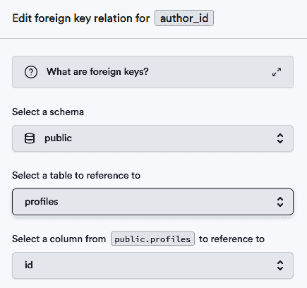

# 第五章：构建个人帖子空间并实现身份验证

在我们的 Nuxt 3 指南的本章中，我们专注于一个实战项目：为用户构建一个可以发布内容的个人空间，并集成安全的身份验证。本章架起了使用 Vue 和 Nuxt 进行前端开发与由 **Supabase** 提供的后端功能之间的桥梁。

我们首先设置 **Supabase**，这是一个简化用户身份验证的后端服务。这个基础对我们应用程序的安全性至关重要。接下来，我们将此服务与 Nuxt 3 集成，确保我们的前端和后端能够顺畅通信。

接下来，我们的旅程转向用户界面。我们将设计易于使用的登录和注册表单。本节是关于制作既美观又实用的表单，使用 Nuxt UI 和 TailwindCSS。

下一个部分是关于创建一个安全的登录系统。我们将涵盖重要的安全主题，如基于令牌的身份验证，以确保用户数据安全。

本章通过教授用户如何创建和管理自己的帖子来结束。这将使用户在应用程序中拥有一个个人区域来分享他们的想法。

本章是结合前端设计和后端技术的实用指南，打造一个安全、用户友好的网络应用程序。让我们深入探讨！

在本章中，我们将涵盖以下主要主题：

+   为用户身份验证设置初始 Supabase 项目

+   将 Nuxt 3 与 Supabase 集成

+   设计身份验证 UI 和验证输入

+   使用 Supabase 设置用户身份验证

+   创建和管理个人用户帖子

# 技术要求

本章的代码文件可以在[`github.com/PacktPublishing/Nuxt-3-Projects/tree/main/chapter05`](https://github.com/PacktPublishing/Nuxt-3-Projects/tree/main/chapter05)找到

本章的 CiA 视频可以在[`packt.link/AYK8X`](https://packt.link/AYK8X)找到

# 必要背景：什么是 Supabase？

在我们着手开发我们的项目之前，熟悉 Supabase 及其功能非常重要，这为我们即将构建的内容打下坚实的基础。

+   *Supabase 概述:* Supabase 是一个开源的 Firebase 替代品，提供了一套处理后端需求（如数据库、身份验证和实时订阅）的工具。它默认使用 PostgreSQL。

+   *数据库管理:* 在其核心，Supabase 提供数据库服务，允许您高效地创建、读取、更新和删除数据。我们将使用此功能来处理创建用户帖子、更新它们以及删除它们。

+   *用户身份验证:* 它简化了用户管理的过程，从注册到登录，以及保护用户数据。Supabase 支持多种身份验证方法，包括电子邮件/密码和第三方登录，如 Google 或 GitHub。

*重要链接:*

在我们开始之前，这里有一些来自 Supabase 的基本资源，我们将广泛使用。这些链接提供了直接访问 Supabase 平台内各种工具的途径。每个链接都对应于我们将与之交互的 Supabase 仪表板的一个特定页面：

+   **SQL** **编辑器**：[`supabase.com/dashboard/project/_/sql`](https://supabase.com/dashboard/project/_/sql)

+   **表格** **编辑器**：[`supabase.com/dashboard/project/_/editor`](https://supabase.com/dashboard/project/_/editor%0D)

+   **API** **设置**：[`supabase.com/dashboard/project/_/settings/api`](https://supabase.com/dashboard/project/_/settings/api)

+   **认证** **提供者**：[`supabase.com/dashboard/project/_/auth/providers`](https://supabase.com/dashboard/project/_/auth/providers)

这些链接是您通往我们将在本章中使用的工具的直接途径。现在让我们继续到基础步骤：设置一个新的 Supabase 项目。

# 为用户身份验证设置初始 Supabase 项目

要开始构建我们的 Nuxt 3 应用程序，我们首先需要初始化一个新的 Supabase 项目，以设置我们的数据库和 API。

在创建新的 Supabase 账户后，导航到：[`supabase.com/dashboard/projects`](https://supabase.com/dashboard/projects) 并点击 `我的空间`。在输入项目名称和安全的数据库密码后，Supabase 将开始设置您的新数据库。

## 设置数据库模式

让我们准备数据库模式。在 Supabase 仪表板中，转到与用户身份验证连接的 `profiles` 表，并包括一个触发器，当新用户注册时自动生成资料条目。


图 5.1：Supabase 用户管理入门

您会找到一个预先编写的查询。点击 **运行** 执行它并建立我们的初始表。或者，您也可以编写一个自定义查询来构建数据库，但由于我们的重点是集成 Nuxt，我们将跳过这一步。

现在，转到通过“用户管理入门”创建的 `profile`。让我们继续创建一个 `posts` 表，这次我们将使用 Supabase UI 来创建它。点击“创建新表”按钮，将其命名为 `posts`，并按以下配置列：


图 5.2：posts 表格列模式

+   这里是概述：

+   系统自动添加 `id`、`created_at` 列。

+   我们添加了一个必需的 `title` 列。

+   还有一个可选的 `content` 列。您可以通过在配置菜单中切换选项使其为可空。

+   `author_id` 作为外键链接到用户资料。点击链接将显示其当前设置，包括引用表和列。



图 5.3：author_id 外键

在你的数据库表准备就绪后，下一步是获取 API 密钥。这些密钥让您的应用程序能够与 Supabase API 通信。从该页面找到“项目 URL”和`anon`密钥。

最后，Supabase 默认启用电子邮件确认功能，因此用户在首次登录前需要确认他们的电子邮件地址。为了测试目的，我们将通过导航到 **认证提供者** 页面，找到电子邮件提供者设置，然后关闭“确认电子邮件”开关来禁用此功能。


图 5.4：禁用确认电子邮件选项

在完成 Supabase 设置后，我们现在转向将其与 Nuxt 3 集成。在下一节中，我们将创建一个新的 Nuxt 应用程序，并使用名为 “`@nuxtjs/supabase`” 的模块将其与 Supabase 集成。

# 将 Nuxt 3 与 Supabase 集成

现在我们已经设置了 Supabase，是时候关注如何无缝地将这个后端与我们的 Nuxt 3 应用程序集成。

## 使用 Supabase 集成创建新的 Nuxt 3 项目

首先，创建一个新的 Nuxt 3 项目。打开你的终端并运行：

```js
pnpm dlx nuxi init my-space
cd my-space
pnpm i -D @nuxtjs/supabase
```

接下来，在项目根目录中创建一个 `.env` 文件，并添加您的 Supabase URL 和 anon 密钥：

```js
SUPABASE_URL="YOUR_SUPABASE_URL"
SUPABASE_KEY="YOUR_SUPABASE_ANON_KEY"
```

将 `"YOUR_SUPABASE_URL"` 和 `"YOUR_SUPABASE_ANON_KEY"` 替换为您从 Supabase 项目中复制的实际值。

## 覆盖认证路由

在默认配置中，Supabase 使用 `/login` 路由进行用户登录，并自动将未认证（或匿名）用户重定向到该路由。然而，为了定制我们应用程序的导航流程和 URL 结构，我们可以在 Nuxt 3 中配置这些认证路由。

要自定义认证路由的行为，我们需要在 `nuxt.config.ts` 文件中进行调整。具体来说，通过添加配置如下所示的 `supabase` 对象：

```js
supabase: {
  redirectOptions: {
    login: 'auth/login',
    callback: '',
    exclude: ['/auth/*']
  }
}
```

让我们讨论每一个更改：

+   我们已将默认登录路由从 `/login` 更改为 `/auth/login`

+   `callback` 选项留空。这是因为回调处理通常与第三方提供者相关联，而我们目前不涉及这一阶段。

+   `exclude` 选项设置为 `['/auth/*']`。这个模式意味着 `/auth/` 路径下的所有路由，如 `/auth/login` 和 `/auth/signup`，都对匿名用户可访问。这种设置特别有利，尤其是在计划将来扩展我们的认证页面（例如，添加密码重置或恢复页面）时，无需每次都更新排除选项。

通过配置这些设置，我们确保我们的应用程序认证流程既用户友好又可扩展，准备好随着项目的增长而容纳更多功能。

现在我们已经自定义了认证路由，接下来让我们设计认证的用户界面并实现输入验证。

# 认证 UI 和验证输入

为了增强我们认证过程的用户体验，我们首先将为我们的 Nuxt 3 项目安装和配置一些必要的模块。

## 安装所需模块

打开你的终端，像往常一样安装 `@nuxtjs/google-fonts`，以及我们在上一章中学到的 `@nuxt/ui`：

```js
pnpm i @nuxtjs/google-fonts -D
pnpm i @nuxt/ui
```

这些命令将添加 Google Fonts 和 Nuxt UI 到我们的项目中。接下来，我们需要更新我们的 `nuxt.config.ts` 以包括这些模块并设置一些额外的配置：

```js
modules: ['@nuxtjs/supabase', '@nuxtjs/google-fonts',
  '@nuxt/ui'],
googleFonts: {
  families: {
    Poppins: [400, 500, 700]
  }
},
app: {
  head: {
    title: 'My Space'
  }
}
```

在这里，`app` 配置将我们应用程序的标题设置为“我的空间。”

为了进一步定制我们的 UI，创建一个 `app.config.ts` 文件来更新 Nuxt UI 的主颜色并设置 Nuxt UI 组件的默认属性：

```js
export default defineAppConfig({
  ui: {
    primary: 'teal',
    container: {
      padding: 'py-6'
    }
  }
});
```

与前几章一样，别忘了在你的项目中包含 `tailwind.config.ts`。此文件对于定制 TailwindCSS 以满足我们应用程序的样式需求至关重要。

我们下一个任务是创建登录和注册页面的有效布局。

## 设置认证页面

在 `/layouts` 目录中创建一个空的布局 `default.vue`。这个布局将在项目中的后续部分被使用。

```js
<template>
  <slot></slot>
</template>
```

在相同的目录中创建 `auth.vue` 布局。这个布局将专门用于与登录和注册等认证相关的页面：

```js
<template>
  <div class="grid md:grid-cols-2 min-h-screen
  bg-gray-100">
    <!-- Image Column -->
    <div class="hidden md:flex md:col-span-1 items-center
    justify-center bg-white">
      
    </div>
    <!-- Form Column -->
    <div class="col-span-1 flex justify-center
    items-center">
      <slot></slot>
    </div>
  </div>
</template>
```

此布局在中等和更大屏幕上将屏幕分为两列，一列用于图像（由存储库提供），另一列用于表单。

接下来，覆盖 `app.vue` 以指定我们将使用布局和页面：

```js
<template>
  <NuxtLayout>
    <NuxtPage />
  </NuxtLayout>
</template>
```

然后，在 `/pages/auth/` 目录中创建一个 `login.vue` 页面。

```js
<u-card class="md:min-w-96">
  <!-- Form Content -->
  <div class="text-2xl text-center font-bold mb-1">
    Login
  </div>
  <div class="text-slate-500 text-sm text-center mb-4">
    Don't have an account?
    <UButton variant="link" to="/auth/signup">
    Create one!</UButton>
  </div>
  <!-- the form -->
</u-card>
```

页面以一个简单的卡片布局开始，包括标题和导航链接到注册页面。然后我们将使用 Nuxt UI 组件如 `UForm`、`UFormGroup` 和 `UInput` 为表单元素，这些组件预先样式化并有助于输入验证：

```js
<!-- the form -->
<UForm>
  <UFormGroup label="Email" name="email" class="mb-4">
    <UInput v-model="user.email" icon="i-heroicons-at-
    symbol" />
  </UFormGroup>
  <UFormGroup label="Password" name="password"
  class="mb-4">
    <UInput
      v-model="user.password"
      type="password"
      icon="i-heroicons-lock-closed"
    />
  </UFormGroup>
  <!-- Submit Button -->
  <UButton type="submit" block class="mt-8">
    Login
  </UButton>
</UForm>
```

Nuxt UI 中的 `icon="i-heroicons-at-symbol"` 代表 Heroicons 收集中的图标。按照 `i-{collection_name}-{icon_name}` 的模式，它很容易将任何图标集合从 [`icones.js.org/`](https://icones.js.org/%20) 连接到 Nuxt UI。

最后，定义布局并为用户数据设置响应式状态：

```js
<script setup>
definePageMeta({ layout: 'auth' })
const user = ref({
  email: '',
  password: ''
})
</script>
```

你现在应该看到一个像这样的登录页面布局：


0 图 5.5：登录页面布局

以类似的方式，创建包含额外字段（密码确认）的 `signup.vue` 页面：

```js
<UFormGroup
  label="Password Confirmation"
  name="passwordConfirm"
  class="mb-4"
>
<UInput
  v-model="user.passwordConfirm"
  type="password"
  icon="i-heroicons-lock-closed"
/>
</UFormGroup>
```

并且别忘了将其添加到 `user` 引用：

```js
const user = ref({
  email: '',
  password: '',
  passwordConfirm: ''
})
```

现在我们已经设置了认证 UI，让我们使用 **Joi** 来增强输入验证：

## 使用 Joi 进行输入验证

Nuxt UI 中的 `UForm` 组件通过其 `schema` 属性提供强大的功能。此属性允许您从像 **Joi** 或 **Yup** 这样的库中集成验证模式，为您的表单状态提供强制特定验证规则的方式。在我们的示例中，我们将使用 **Joi** 创建我们的验证模式。您可以从官方网站了解更多关于 Joi 的信息：[`joi.dev/api/`](https://joi.dev/api/%0D)

首先向你的项目中添加 Joi：

```js
pnpm i joi
```

然后在 `login.vue` 脚本中，定义登录表单的 Joi 验证模式：

```js
const schema = Joi.object({
  email: Joi.string().email({ tlds: false }).required(),
  password: Joi.string().min(6).required()
});
```

此模式确保电子邮件是有效的电子邮件并已填写。我们还确保密码至少有 6 个字符长。我们使用了 `{ tlds: false }` 来禁用 Joi 内置的 TLD 验证。为了在表单组件中实现该模式，我们必须将其调整如下：

```js
<UForm :schema="schema" :state="user">
  <!-- Form content -->
</UForm>
```

`schema` 属性根据定义的 Joi 模式验证 `user` 状态。通过将电子邮件输入字段留空并移开焦点来测试验证。应该在输入字段下方出现错误消息：


图 5.6：使用 Joi 和 Nuxt UI 进行输入验证

注册页面将对电子邮件和密码进行类似的验证。此外，我们还将添加一个复杂的密码确认验证：

```js
const schema = Joi.object({
  email: Joi.string().required(),
  password: Joi.string().min(6).required().label(
    'Password'),
  passwordConfirm: Joi.valid(Joi.ref('password'))
    .label('Confirm Password')
    .messages({
      'any.only': `passwords don't match`
    })
});
```

在这里，`passwordConfirm` 字段使用 `Joi.ref('password')` 确保它与密码字段匹配。` .messages({ 'any.only': 'passwords don't match' })` 部分自定义了错误消息，使其清晰且用户友好。当密码不匹配时。

在我们的输入验证设置完成后，下一步是集成 Supabase 的登录和注册功能。

# 设置 Supabase 用户认证

现在，让我们专注于集成 Supabase 的认证功能，使用他们直接的登录和注册功能来管理我们应用程序的用户访问。

Nuxt 3 中的 `useSupabaseClient` 组合式是访问 Supabase API 的网关，它促进了您的 Vue 应用程序与 Supabase 服务之间的无缝通信。由 `supabase-js` 驱动，它提供了对 Supabase 客户端的访问，该客户端使用 `.env` 文件中的 `SUPABASE_KEY` 初始化。此客户端连接到数据库。

## 创建注册函数

在 `signup.vue` 脚本内部，使用以下方式获取 Supabase 实例：

```js
const supabase = useSupabaseClient()
```

此实例将用于向 Supabase 发送请求，特别是用于用户认证功能，如 `signup` 和 `signInWithPassword`。

接下来创建一个 `onSubmit` 函数来处理注册过程：

```js
const loading = ref(false)
const onSubmit = async () => {
  loading.value = true
  try {
    const { error } = await supabase.auth.signUp({
      email: user.value.email,
      password: user.value.password
    })
    if (error) throw error
  } catch (error) {
    const message = error.message
    console.log(message);
  }
  loading.value = false
}
```

下面是代码分解：

+   将 `loading` 设置为 `true`，表示异步操作的开始。

+   从 Supabase 认证 API 调用 `signUp` 方法。这是我们与 Supabase 交互以注册新用户的地方，从 `user` 引用中提取电子邮件和密码。

+   检查 Supabase 注册过程中是否有错误，将其抛出到 `catch` 块中。

+   记录注册过程中发生的任何错误（用于测试）。

+   将加载状态重置为 false

此函数有效地管理注册过程，与 Supabase 的认证 API 交互以注册用户。它处理从发送请求到处理响应和错误的整个流程。

为了测试错误处理，暂时从 `UForm` 中移除 `schema` 属性，并尝试提交一个空表单。应该在开发工具控制台中打印出错误响应：


图 5.7：Supabase 注册错误

从我们离开的注册过程继续，让我们通过引入 Nuxt UI 通知来增强错误处理。这些通知以更用户友好的方式显示消息，如错误，以提示通知格式。

在你的 `app.vue` 中包含 `UNotifications` 组件。这是一个全局设置，允许你在应用的任何位置显示通知：

`<template>`

```js
  <NuxtLayout>
    <NuxtPage />
    <UNotifications />
  </NuxtLayout>
</template>
```

Nuxt UI 的 `useToast` 组合式允许你轻松地将提示通知添加到你的应用程序中。我们可以在 `signup.vue` 脚本中添加以下行来获取吐司实例：

```js
const toast = useToast()
```

现在，让我们修改注册函数的 `catch` 块以使用此组合式来显示错误消息：

```js
catch (error) {
  toast.add({ title: error.message, color: 'red' });
}
```

在这里，使用 `toast.add` 显示提示通知。我们将颜色设置为‘红色’，表示这是一个错误消息。尝试提交一个空表单以触发验证错误。你应该会看到一个显示错误消息的红色提示通知：


图 5.8：Nuxt UNotification 组件

这种视觉反馈是即时且清晰的，使用户更容易理解和反应错误。

继续我们的注册功能，让我们添加一个成功提示通知，并在成功注册后设置导航到主页。在 `onSubmit` 函数中，更新 try 块以在成功注册后使用 Supabase 登录用户：

```js
const onSubmit = async () => {
  loading.value = true
  try {
    const { error } = await supabase.auth.signUp({
      email: user.value.email,
      password: user.value.password
    })
    if (error) throw error
    toast.add({ title: 'Welcome!' })
    navigateTo('/')
  } catch (error) {
    toast.add({ title: error.message, color: 'red' })
  }
  loading.value = false
}
```

不要忘记将 `UForm` 中的 `schema` 属性重置以再次启用验证。

是时候进行测试了！首先，创建一个简单的 `index.vue` 页面，包含以下内容：

```js
<template>
  <div class="bg-gray-100 min-h-screen">
    <UContainer>
      <h1 class="text-3xl font-semibold text-center
      text-gray-800 mb-6">
        My Posts
      </h1>
    </UContainer>
  </div>
</template>
```

在填写正确信息并成功注册后，应显示欢迎提示，并将你重定向到主页：


图 5.9：首页

为了确保身份验证流程正常工作，在私密窗口中打开 `http://localhost:3000/`。由于 Nuxt Supabase 内置的中间件检查用户身份验证状态，你应该会自动重定向到 `'auth/login/'`。

现在我们已经设置了注册功能，让我们专注于实现登录过程。登录的方法与注册类似，但我们将使用 Supabase 的 `signInWithPassword` 方法。在你的 `login.vue` 页面中，定义一个专门用于登录过程的 `onSubmit` 函数：

```js
const onSubmit = async () => {
  loading.value = true;
  try {
    const { error } =
    await supabase.auth.signInWithPassword({
      email: user.value.email,
      password: user.value.password
    });
    if (error) throw error;
    toast.add({ title: 'Logged in successfully!' });
    navigateTo('/');
  } catch (error) {
    toast.add({ title: error.message, color: 'red' });
  } finally {
    loading.value = false;
  }
};
```

此函数尝试使用用户的电子邮件和密码登录用户。在成功登录后，用户会看到一个成功提示并重定向到主页。

将 `onSubmit` 函数链接到你的登录页面中的 `UForm`：

```js
<UForm :schema="schema" :state="user" @submit="onSubmit">
  <!-- Form fields -->
</UForm>
```

通过实现此登录功能，我们确保用户可以安全方便地访问他们的账户。整个过程简单明了，使登录体验流畅高效。接下来，我们将深入了解用户如何在我们的应用程序中创建、查看和管理他们自己的帖子，使其成为一个真正互动和个性化的空间。

# 创建和管理个人用户帖子

在本节中，我们将注意力转向启用用户创建和管理他们的帖子。为了确保这可以顺利运行，我们需要在我们的数据库表 `posts` 中使用 Supabase 的行级安全（RLS）策略设置特定的规则。

Supabase 中的 RLS 策略就像是数据库的规则。它们有助于控制谁可以查看或更改数据库中的数据。对于我们的应用程序，我们将使用这些策略来确保用户只能访问他们自己的帖子。

## 为“帖子”表添加 RLS 策略

打开 Supabase 策略页面：。这是您可以控制谁访问数据库中的什么内容的页面。选择 `posts` 表并开始创建一个新的策略：

+   命名一个清晰明了的名称，例如“个人帖子管理”。

+   对于操作选择“全部”，以便用户可以读取、添加、更新和删除他们的帖子。

+   对于“目标角色”，选择“已认证”以便只有登录用户可以使用此策略。

+   将 `(auth.uid() = author_id)` 表达式添加到 **using** 和 **with check** 表达式中。这确保用户只能查看和交互他们创建的帖子，保持对查看和修改内容的严格用户特定访问。

策略详情应如下所示：


图 5.10：帖子表 RLS 策略

在 `posts` 表上设置了我们的 RLS 策略后，现在让我们深入了解如何使用 Supabase 的 API 来管理应用程序中的这些帖子。

## 使用 Supabase API 进行帖子管理

在 Nuxt 3 中使用 `useSupabaseClient` 可以直接与我们的数据库交互。它是我们在 `posts` 表上执行操作的首选。

您的项目在 Supabase 上的特定 API 文档提供了可能的查询的详细见解。为了实际查看，请访问：

使用简单的命令：

```js
supabase.from('posts').select()
```

我们可以获取一个用户特定的帖子数组，多亏了 RLS 策略确保每个用户只能看到他们的内容。要创建或更新帖子，我们可以使用 `upsert`：

```js
supabase.from('posts').upsert(/* your post data */)
```

此函数优雅地处理了新帖子插入和现有帖子更新的操作，通过检查唯一标识符来决定适当的操作。

最后，对于删除帖子，`delete` 方法与 `eq` 过滤器的组合确保我们精确地定位并删除预期的帖子：

```js
supabase.from('posts').delete().eq('id', postId)
```

这种有针对性的方法加强了用户对其帖子的控制，与我们实施的安全措施相一致。

让我们继续开发用于创建和更新帖子信息的用户界面。

## 构建帖子信息页面

首先，在您的 Nuxt 应用程序中设置一个动态路由。在 `/pages/posts/` 目录中创建一个名为 `[id].vue` 的文件。这个由 `[id]` 表示的动态路由将允许页面根据 URL 处理不同的场景：

+   当路由中的 `[id]` 设置为 `create` 时，我们知道用户正在尝试创建一个新的帖子。

+   如果 `[id]` 是实际的帖子 ID，则表示用户打算查看或编辑现有的帖子。在这种情况下，我们将使用此 ID 来获取相关的帖子数据。

这种方法为我们提供了一种灵活且高效的方式来处理新帖子的创建和现有帖子的编辑，所有这些都在一个动态界面上完成。

在模板内部：创建一个简单的布局：

```js
<div class="min-h-screen bg-gray-100">
  <UContainer>
    <h2 class="mt-6 text-center text-3xl font-extrabold
    text-gray-900 mb-8">
      Post Information
    </h2>
    <UCard class="max-w-md mx-auto">
  <!-- the form -->
    </UCard>
  </UContainer>
</div>
```

表单将如下所示：

```js
<UForm
  class="space-y-6"
  :schema="schema"
  :state="post"
  @submit="onSubmit"
>
  <UFormGroup label="Title" name="title">
    <UInput type="text" v-model="post.title" />
  </UFormGroup>
  <UFormGroup label="Content" name="content">
    <UTextarea type="text" v-model="post.content" :rows="8"
    />
  </UFormGroup>
  <UButton type="submit" block primary :loading="pending">
    Save Changes
  </UButton>
</UForm>
```

在表单下添加一个用于帖子删除的小错误按钮：

```js
<div class="flex justify-center mt-12">
  <UButton
    color="red"
    variant="outline"
    :loading="deleteLoading"
    @click="deletePost"
  >
    Delete
  </UButton>
</div>
```

在我们页面的脚本部分，我们设置了帖子状态和验证模式：

```js
<script setup>
import Joi from 'joi'
const user = useSupabaseUser()
const post = ref({
  title: '',
  content: undefined,
  author_id: user.value.id
})
const schema = Joi.object({
  author_id: Joi.string().required(),
  title: Joi.string().required(),
  content: Joi.string().allow('', null)
}).unknown(true) // to allow additional fields like id, created_at
</script>
```

下面是分解：

+   `useSupabaseUser()` 提供了已登录用户的信息。

+   `post` 包含 `title`、`content` 和 `author_id` 的数据。

+   `schema` 定义了必要的字段及其验证规则。

+   `.unknown(true)` 部分允许表单处理额外的字段，如 `id` 和 `created_at` 而不产生验证错误。

在我们逐步构建脚本块的同时，让我们添加：

```js
const route = useRoute()
const postId = computed(() => route.params.id)
const editMode = computed(() => route.params.id !== 'create')
const toast = useToast()
```

我们捕获了当前路由详情，这对于确定帖子 ID 和模式（创建或编辑）至关重要。然后我们从路由参数中提取帖子 ID。最后，我们使用 `editMode` 来确定用户是否处于编辑模式（编辑现有帖子）或创建模式（创建新帖子）。

现在，让我们使用 `useLazyAsyncData` 处理数据获取。Nuxt 提供了一个很好的可组合函数，用于在浏览器或服务器环境中执行数据获取，称为 `useAsyncData`。它在渲染页面之前获取数据，对于服务器端渲染（数据最初必须存在）来说很理想。相比之下，`useLazyAsyncData` 立即开始页面渲染并在后台加载数据，通过减少等待时间来增强用户体验，这对于加载我们应用程序中的非关键数据（如帖子）特别有用。

```js
So to fetch the data we'll add:
const { pending } = useLazyAsyncData(async () => {
  if (!editMode.value) return;
  const { data } = await supabase
    .from('posts')
    .select()
    .eq('id', postId.value)
    .single();
  if (data) post.value = data;
});
```

在这种情况下，如果用户处于编辑模式，脚本将从 Supabase 获取特定的帖子数据并填充编辑表单。它将帖子 ID 与数据库进行比对并检索相应的帖子详情。否则，`post` 引用将保持为空。

让我们检查 `onSubmit` 函数，它处理创建和更新帖子：

```js
const toast = useToast()
const onSubmit = async () => {
  pending.value = true
  try {
    const { error } =
      await supabase.from('posts').upsert(post.value)
    if (error) throw error
    if (!editMode.value) toast.add({ title: 'Post Created
      Successfully' })
    else toast.add({ title: 'Post Updated Successfully' })
    navigateTo('/')
  } catch (error) {
    toast.add({ title: error.message, color: 'red' })
  }
  pending.value = false
}
```

下面是分解：

+   函数执行 `upsert` 操作，根据帖子的 ID 更新现有帖子或创建新帖子。（如果 ID 未定义则创建，否则更新）

+   错误处理已实现，以捕获和显示在 `upsert` 过程中出现的任何问题。

+   成功反馈通过 toast 通知提供，区分帖子创建和更新。

+   最后，函数将用户导航回主页。

现在，让我们看看 `deletePost` 函数。与 `onSubmit` 类似，这个函数包括错误处理和通过 toast 通知的用户反馈，但 Supabase 方法将是：

```js
const { error } = await supabase
  .from('posts')
  .delete()
  .eq('id', postId.value)
```

如果你导航到：，你应该看到这个页面：


图 5.11：项目信息页面

在我们的应用程序中增强用户导航，我们将在 `default` 布局中引入导航组件：

```js
<nav class="bg-gray-800 text-white py-4">
  <div class="container flex justify-between items-center">
    <div class="text-xl font-bold uppercase">
      <nuxt-link to="/">My space</nuxt-link>
    </div>
    <div class="flex gap-x-4">
      <UButton to="/posts/create">New Post</UButton>
    </div>
  </div>
</nav>
```

这个导航栏有两个部分：左侧用于品牌标志或名称链接到主页，右侧有一个创建新帖子的按钮。

接下来，让我们构建帖子列表页面！

## 显示用户帖子

当我们进入应用程序开发的最后阶段时，我们将更新主页以列出用户创建的所有帖子。按照以下方式更新`index.vue`中的脚本部分：

```js
<script setup lang="ts">
const supabase = useSupabaseClient()
const { data: posts } = await useLazyAsyncData(async () => {
  let { data } =
    await supabase.from('posts').select().returns<Post[]>()
  return data
})
</script>
```

该脚本使用`useSupabaseClient`来访问 Supabase API 并获取帖子。`useLazyAsyncData`被用来异步加载帖子。它确保页面导航立即发生，而帖子数据在后台加载。

更新页面模板：

```js
<template>
  <div class="bg-gray-100 min-h-screen">
    <UContainer>
      <h1 class="text-3xl font-semibold text-center
      text-gray-800 mb-6">
        My Posts
      </h1>
      <post-card v-for="post in posts" :post="post" />
    </UContainer>
  </div>
</template>
```

模板包含一个容器，标题为“我的帖子”，并使用`post-card`组件渲染每个帖子。因此，让我们在`components`文件夹内创建`PostCard.vue`组件：

```js
<template>
  <UCard class="mb-4 max-w-lg mx-auto">
    <nuxt-link :to="`/posts/${post.id}/`">
      <div class="uppercase text-primary font-semibold">
        {{ post.title }}
      </div>
      <p class="mt-2 text-gray-500">
        {{ post.content || 'no content' }}
      </p>
      <div class="mt-4 text-gray-400 text-xs
      font-semibold">
        Created at: {{ dayjs(post.created_at).format(
          'MMMM D, YYYY') }}
      </div>
    </nuxt-link>
  </UCard>
</template>
<script setup lang="ts">
import dayjs from 'dayjs'
defineProps<{ post: Post }>()
</script>
```

每个`post-card`组件展示帖子的标题、内容和创建日期。使用`dayjs`格式化日期为人类友好的格式，增加了日期的亲和力。一个`nuxt-link`包裹了卡片，使得轻松导航到每个帖子的详细视图或编辑页面。

在我们的帖子列表和单个帖子卡片组件就绪后，用户现在应该能看到他们创建的所有帖子。点击帖子将导航到其详细页面，在那里内容可以无缝查看、更新或删除。

# 摘要

Voilà！我们已经成功地在我们的应用程序中创建了一个动态且用户友好的个人帖子管理系统。我们首先建立了一个安全用户认证系统。然后，我们的重点转向了使用户能够创建、编辑和删除帖子，每个步骤都使用 Joi 进行验证以确保数据完整性。这些功能由 Supabase 的行级安全策略和 API 支持，保证了安全和用户特定的交互。

在接下来的章节中，我们将使用 Nuxt 3 增强一个食谱分享网站，重点关注 SEO 优化。我们将深入研究技术，如元数据配置、结构化数据实施、图像优化、SEO 友好 URL 创建和网站地图生成。这些步骤旨在提升网站的搜索引擎存在感，吸引更多有机流量。

# 实践问题

+   解释为 Nuxt 3 应用程序创建新 Supabase 项目的流程。

+   描述 Supabase 中行级安全（RLS）的目的及其实现方式。

+   `useSupabaseClient`组合式函数的好处是什么？

+   `useAsyncData`和`useLazyAsyncData`在 Nuxt 中的区别是什么？何时使用哪一个？

+   如何使用 Joi 和 NuxtUI 在表单中验证用户输入？

+   如何处理 Supabase 错误？

+   如何使用 Supabase 通过密码登录？

+   如何使用 Supabase 在表中删除记录？

+   解释如何在 Supabase 中使用`upsert`方法进行帖子管理。

# 进一步阅读

+   Supabase: [`supabase.com/`](https://supabase.com/%0D)

+   Nuxt UI 表单：[`ui.nuxt.com/forms/form`](https://ui.nuxt.com/forms/form%0D)

+   Supabase 中的 RLS（行级安全）：[`supabase.com/docs/guides/auth/row-level-security`](https://supabase.com/docs/guides/auth/row-level-security)

+   Joi 验证：[`joi.dev/`](https://joi.dev/)

+   使用 Nuxt 3 和 Supabase 构建用户管理网站：[`supabase.com/docs/guides/getting-started/tutorials/with-nuxt-3`](https://supabase.com/docs/guides/getting-started/tutorials/with-nuxt-3)

+   Nuxt Supabase 模块：[`supabase.nuxtjs.org/`](https://supabase.nuxtjs.org/)
