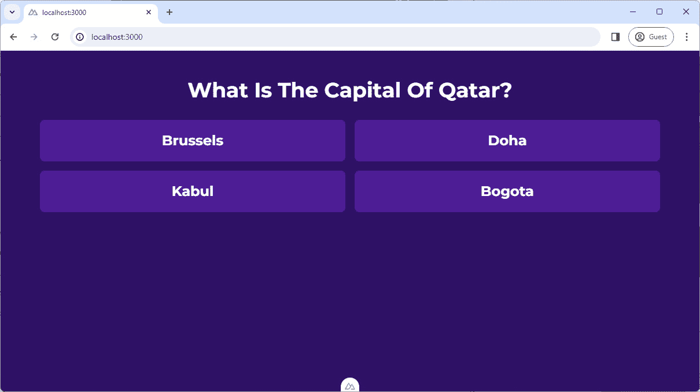
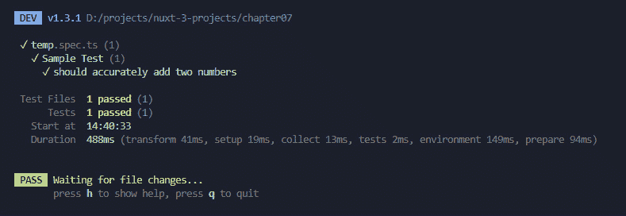
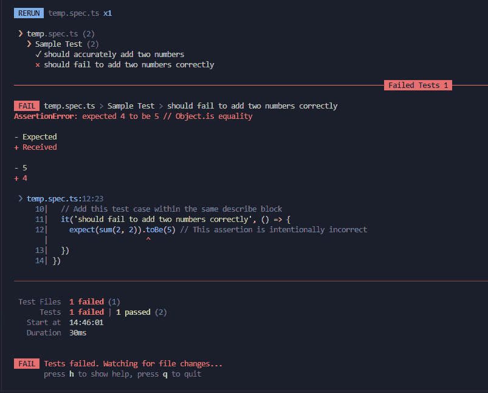
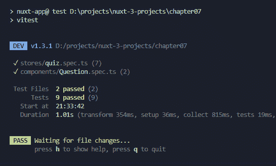
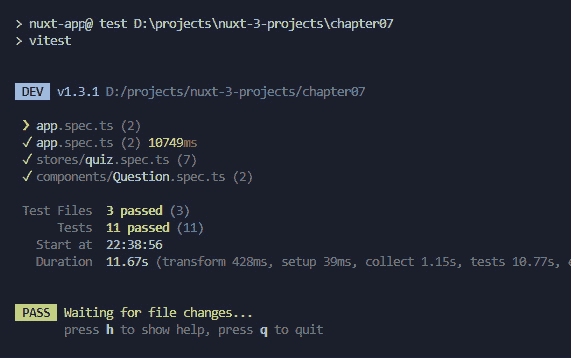
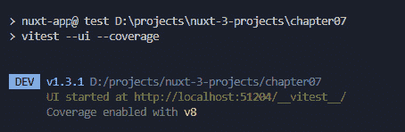
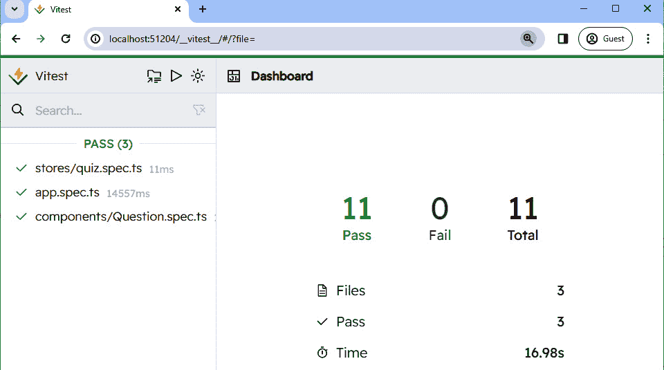
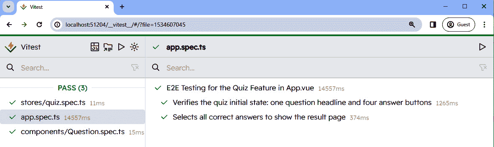
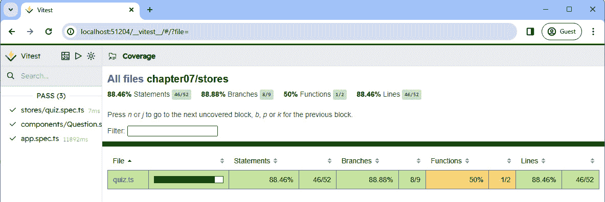
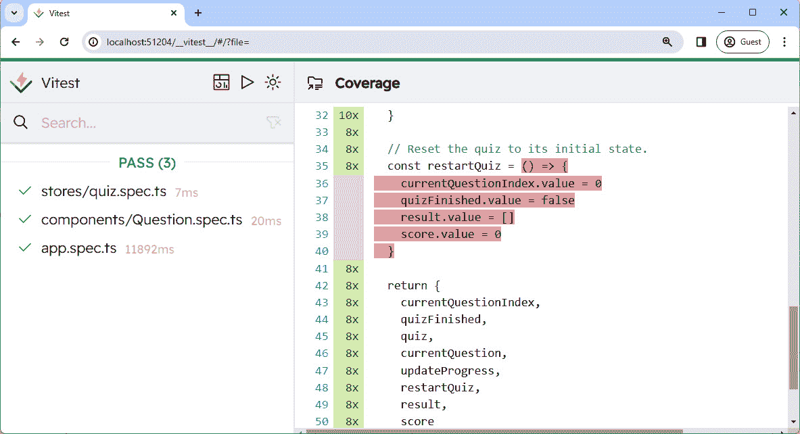

# 7

# 通过构建问答游戏应用程序来学习测试

在本章中，我们将继续我们的旅程，使用 Nuxt 3 构建一个问答游戏应用程序，并深入关注提高我们的测试技能。本章是为那些希望提高单元测试和**端到端**（**E2E**）测试技能的开发者量身定制的。

首先，我们将讨论在软件开发中测试的重要性，说明它如何作为任何应用程序的支柱。我们将从单元测试开始，在这里你将学习如何为 Pinia 存储和 Vue 组件构建单元测试，确保每一块逻辑和每一个 UI 元素都按预期工作。

接下来，我们将继续我们的测试策略，了解端到端测试（E2E 测试），模拟真实用户交互以确认问答游戏的整体功能。我们还将提供测试结果和覆盖率的视觉洞察。

在本章中，我们将涵盖以下主要内容：

+   实现问答游戏应用程序

+   为 Pinia 存储编写单元测试

+   为组件编写单元测试

+   为问答游戏编写端到端测试

+   探索 Vitest UI 和测试覆盖率工具

# 技术要求

本章的代码文件可以在[`github.com/PacktPublishing/Nuxt-3-Projects/tree/main/chapter07`](https://github.com/PacktPublishing/Nuxt-3-Projects/tree/main/chapter07)找到。

本章的 CiA 视频可以在[`packt.link/tAMjs`](https://packt.link/tAMjs)找到。

## 探索仓库

正如我们在上一章中所做的那样，让我们快速回顾一下我们仓库中的`starter`文件夹。这个文件夹预先填充了必要的组件、问答存储和 TypeScript 接口，准备好复制到你的新项目中。它作为基础，使我们能够专注于本章的关键任务：在 Nuxt 3 中实现和学习测试策略。

# 必要的背景知识——测试基础

当我们将重点转向第*7 章*中的测试时，理解测试的基础知识变得至关重要。测试是软件开发中的一个关键过程，旨在确保你的应用程序在各种情况下都能正确运行。

传统上，开发者习惯于手动测试应用程序，这需要手动努力来查找错误。然而，测试实践的演变通过采用自动化测试显著减少了对手动测试的依赖。自动化测试通过自动化重复性任务引入了效率和一致性。它包括三个主要级别：

+   **单元测试**：专注于测试单个组件或函数的独立情况，这使得定位错误变得更加容易。

+   **集成测试**：测试集成单元或组件之间的交互，以确保它们按预期协同工作。虽然本章不会重点介绍集成测试，但它仍然是测试金字塔的一个重要组成部分。

+   **端到端测试**：从开始到结束模拟真实用户与应用程序的行为和交互，确保整个系统按预期运行。

通过实现自动化测试，我们可以显著减少手动测试的需求，允许以更频繁、更全面的测试运行，且更省力。接下来，让我们看看如何实现测验游戏应用。

# 实现测验游戏应用

我们将通过设置一个新的 Nuxt 3 项目来启动我们的测验游戏应用。就像我们之前的努力一样，我们将利用`starter`文件夹来加速我们的开发过程。一旦您创建了新的项目，请将`starter`文件夹的内容复制到其中。如果提示，请同意替换现有文件。

接下来，我们需要安装几个基本的 Nuxt 模块，例如 Pinia、Tailwind CSS 和 Google Fonts。我们已经在之前的章节中讨论了每个模块。请在您的终端中运行以下命令，将这些包添加到您的项目中：

```js
$ pnpm i -D @nuxtjs/google-fonts @nuxtjs/tailwindcss sass
$ pnpm i @pinia/nuxt
```

在设置好依赖项后，是时候启动我们的项目并看到初始设置的实际效果了。像往常一样执行项目：

```js
$ pnpm dev
```

运行项目后，您应该会看到测验游戏应用的初始布局：



图 7.1：测验游戏应用

在深入到我们的测验游戏应用测试方面之前，让我们花一点时间来了解构成我们项目骨架的结构和组件。

## 问题是数据

题目数据位于`data/questions.ts`中。它存储了测验问题，每个问题都有多个答案，使得每次用户与应用程序互动时都能动态生成测验。

## 类型定义

应用程序中使用的结构和数据类型在`types/index.ts`中进行了细致的定义：

```js
export default {}
declare global {
  type Question = {
    id: number
    body: string
    answers: Answer[]
    rightAnswerId: number
  }
  type Answer = {
    id: number
    body: string
  }
  type Result = Question & {
    userAnswer: Answer
    answerIsRight: boolean
  }
}
```

这里是对类型的概述：

+   `rightAnswerId`)

+   **答案**：定义了每个问题答案选项的结构，包括其自己的 ID 和答案正文

+   通过包含用户的所选答案（`userAnswer`）和一个标志（`answerIsRight`），指示所选答案是否正确来定义`Question`类型

接下来，让我们看看测验存储的内容。

## 测验 Pinia 存储

这个存储库旨在使用 Pinia 管理游戏状态，从跟踪当前问题到计算玩家的分数。以下是其关键功能的概述。

这个初始部分设置了测验存储并初始化了状态，包括当前问题索引、测验完成状态、结果数组和分数：

```js
const currentQuestionIndex = ref<number>(0)
const quizFinished = ref<boolean>(false)
const result = ref<Result[]>([])
const score = ref<number>(0)
```

接下来，`quiz`是一个计算属性，它从提供的题目数据集中选择五个随机问题，确保每次测验体验的多样性：

```js
const quiz = computed(() =>
selectRandomQuestions(questions, 5))
```

注意，`selectRandomQuestions`是一个存储在`utils`文件夹中的实用函数。因此，由于 Nuxt 自动导入功能的强大，它会被自动导入。

为了根据`currentQuestionIndex`获取当前问题的实例，我们将创建另一个计算方法：

```js
const currentQuestion = computed(() =>
quiz.value[currentQuestionIndex.value])
```

现在，为了更新进度，有一个名为`updateProgress`的函数：

```js
const updateProgress = (answerId: number) => {
  const question = currentQuestion.value
  const answerIsRight = question.rightAnswerId === answerId
  if (answerIsRight) score.value++
  result.value.push({
    ...question,
    userAnswer:
      question.answers.find(({ id }) => id === answerId) ??
      ({ body: 'no answer' } as Answer),
    answerIsRight
  })
  if (currentQuestionIndex.value < quiz.value.length - 1)
    currentQuestionIndex.value++
  else quizFinished.value = true
}
```

`updateProgress`是一个关键函数，它评估用户的答案是否正确，为正确答案更新分数，并将问题以及用户的答案和正确答案附加到结果数组中。它还确定是否移动到下一个问题或结束测验。

最后，为了在完成测验后重新开始，我们可以使用`restartQuiz`函数，该函数允许用户将测验重置到初始状态，清除所有进度和分数，并使用相同的问题集再次尝试：

```js
const restartQuiz = () => {
  currentQuestionIndex.value = 0
  quizFinished.value = false
  result.value = []
  score.value = 0
}
```

确保在 store 文件末尾返回所有引用和函数：

```js
return {
    currentQuestionIndex,
    quizFinished,
    quiz,
    currentQuestion,
    updateProgress,
    restartQuiz,
    result,
    score
  }
```

现在，让我们继续查看`app.vue`的概述。

## `app.vue`文件

这是`app.vue`文件的框架：

```js
<!-- app.vue -->
<template>
  <div class="bg-violet-950 min-h-screen text-white">
    <div class="container py-12 text-center">
      <template v-if="quizStore.quizFinished">
        <!-- RESULT HERE -->
      </template>
      <Question v-else />
    </div>
  </div>
</template>
<script setup>
const quizStore = useQuizStore()
</script>
```

此文件包含我们测验游戏的主体布局和流程。我们在`script`部分初始化测验存储，以便在组件内访问。`template`使用条件渲染方法，通过`v-if="quizFinished"`。这个条件检查测验是否结束，基于`quizFinished`标志，该标志来自我们的`quizStore`。

完成后，它将显示用户在五分中的得分，并列出问题以及用户的答案，以及正确答案，应用不同的背景颜色来指示答案是否正确。还有一个重新开始测验的按钮，允许用户重置测验并再次尝试。

否则，应用将渲染`Question.vue`，该组件将负责渲染带答案的问题，捕获用户响应，并更新测验的进度。这很简单。您可以从启动文件中查看其内容。

在探索了我们的测验游戏项目的基石组件之后，我们现在准备好深入单元测试和端到端测试的基础。这些知识使我们具备确保我们的应用程序达到现代 Web 开发所期望的高标准和可靠性的必要技能。

# 为 Pinia 存储编写单元测试

随着我们继续前进，当前的任务涉及为 Pinia 存储编写单元测试。这一步对于验证应用程序的状态管理逻辑至关重要，并使我们接触到 Pinia 存储中的单元测试原则。

## 探索 Vitest

Vitest，考虑到 Vite 而设计，提供了一个下一代测试框架，通过集成 Vite 生态系统来增强测试体验，从而实现更快、更高效的测试。它提供了一个与 Jest 兼容的 API，使得迁移和并行测试执行变得容易，从而提高了性能。

与 Jest 相比，Vitest 因其无缝集成、快速设置和执行而突出，使其成为现代 Web 开发的优选选择。更多详情，请访问官方网站：[`vitest.dev`](https://vitest.dev)。

为了确保 Vitest 与 Nuxt 无缝工作，我们将`@nuxt/test-utils`集成到我们的设置中。此工具包旨在与各种测试框架和环境协同工作，为我们提供灵活性和强大的测试策略。让我们明确我们设置的关键组件：

+   `@nuxt/test-utils`：对于 Nuxt 应用程序至关重要，提供专门的工具和功能，以及与现有测试框架的集成，以在 Nuxt 环境中提供流畅的测试体验。

+   `Vitest`：我们选择的测试框架。

+   `happy-dom`：一个轻量级的 DOM 模拟库，`happy-dom`为测试提供了更准确和更快的浏览器环境模拟。它因其运行涉及 DOM 操作或浏览器 API 交互的测试的高效性而被选中，它能够复制组件在真实浏览器中的行为，而无需实际浏览器。

现在，使用以下命令安装这些工具：

```js
$ pnpm add -D @nuxt/test-utils vitest happy-dom
```

然后，我们在项目的根目录下创建一个`vitest.config.ts`文件。此配置文件对于指定我们的测试环境偏好至关重要：

```js
// vitest.config.ts
import { defineVitestConfig } from
'@nuxt/test-utils/config'
export default defineVitestConfig({
  test: {
    environment: 'happy-dom'
  }
})
```

通过将环境设置为`'happy-dom'`，我们指示 Vitest 使用`happy-dom`模拟浏览器环境进行我们的测试。

接下来，我们在项目的根目录下创建一个名为`temp.spec.ts`的测试文件。文件名中的`.spec`后缀是一个约定，代表“规范”。它表示该文件包含一系列规范（测试），描述了应用程序或特定组件应该如何行为。这种命名约定有助于 Vitest 在运行`vitest`命令时自动定位和执行测试，扫描以`.spec.ts`或`.test.ts`结尾的文件。

现在，让我们用 Vitest 的语法和能力的一个简单测试来填充`temp.spec.ts`，以便熟悉 Vitest：

```js
// temp.spec.ts
import { describe, it, expect } from 'vitest'
const sum = (a: number, b: number): number => a + b
describe('Sample Test', () => {
  it('should accurately add two numbers', () => {
    expect(sum(2, 3)).toBe(5)
  })
})
```

在此示例中，`describe`用于将我们的测试分组到公共套件中，`it`概述单个测试用例，而`expect`则对代码的行为提出断言。在这里，我们创建了一个简单的测试用例，以确保`sum`函数正常工作。我们期望`sum(2, 3)`的结果等于`5`。

要运行我们新创建的测试，我们首先需要对我们项目的`package.json`文件进行一些小的调整。通过添加一个新的脚本条目`"test"`，我们配置它执行`vitest`，然后它运行我们的测试套件：

```js
// package.json
"scripts": {
  // other scripts
  "test": "vitest"
}
```

在此脚本到位后，通过运行以下命令执行测试套件：

```js
$ pnpm test
```

在执行过程中，Vitest 迅速启动，自动扫描项目中的任何测试文件。对于我们的简单测试`temp.spec.ts`，Vitest 应该将其识别为唯一的测试文件，识别包含的单个`describe`块和其中包含的一个测试用例。如果一切设置正确，你将看到表示测试用例按预期通过的输出：



图 7.2：Vitest 输出

接下来，让我们在 `temp.spec.ts` 文件中引入一个额外的测试用例，我们预计它会失败，以观察 Vitest 在处理失败测试时的行为：

```js
// temp.spec.ts
import { describe, it, expect } from 'vitest'
const sum = (a: number, b: number): number => a + b
describe('Sample Test', () => {
  // previous test
  // Add this test case within the same describe block
  it('should fail to add two numbers correctly', () => {
    expect(sum(2, 2)).toBe(5) // incorrect
  })
})
```

Vitest 会持续监控你的测试文件中的任何更改。因此，当你保存包含故意失败的测试的 `temp.spec.ts` 文件时，Vitest 会自动重新运行测试。这次，你会在终端输出中注意到，尽管第一个测试用例像以前一样通过，但新的测试用例失败了。这种即时反馈突出了失败的断言，直接在你的终端中提供了出错和出错位置的信息：



图 7.3：带有错误测试的 Vitest 输出

现在，随着 Vitest 主动监控我们的项目以查找更改，让我们继续测试测验存储，以确保其在各种条件下逻辑正确执行。

## 测试测验存储

我们现在将重点转向测验存储。通过对这个存储进行单元测试，我们旨在确认我们的游戏逻辑和状态管理按预期工作，为提供良好的用户体验奠定坚实的基础。

首先，让我们通过删除 `temp.spec.ts` 临时测试文件并在 `/stores` 文件夹中创建 `quiz.spec.ts` 来清理舞台，该文件夹位于我们的测验存储旁边。为了有效地对 Pinia 存储进行单元测试，我们必须为每个测试建立一个新的 Pinia 实例：

```js
// stores/quiz.spec.ts
import { describe, it, expect, beforeEach } from 'vitest'
import { setActivePinia, createPinia } from 'pinia'
describe('Quiz Store', () => {
  beforeEach(() => {
    setActivePinia(createPinia())
  })
})
```

`beforeEach` 函数对于保持测试完整性非常重要。这是 Vitest 提供的一个函数，在 `describe` 块中的每个测试用例之前运行。通过在 `beforeEach` 中调用 `setActivePinia(createPinia())`，我们确保每个测试都与 Pinia 的新实例交互，从而使我们能够独立评估每个测试中测验存储的功能。

在我们的测试设置准备就绪后，是时候编写我们的第一个测试了：

```js
// stores/quiz.spec.ts
import { describe, it, expect, beforeEach } from 'vitest'
import { setActivePinia, createPinia } from 'pinia'
describe('Quiz Store', () => {
  // before each
  it('initializes with a set of 5 quiz questions', () => {
    const quizStore = useQuizStore()
    expect(quizStore.quiz.length).toBe(5)
  })
})
```

这个测试验证了测验存储正确地初始化了包含五个问题的集合，确保我们的游戏以玩家预期的挑战数量开始。在运行测试后，终端应指示测试用例通过。

为了确保我们的测验存储按预期行为，我们需要全面测试每个函数。一个关键方面是验证存储是否正确处理了错误答案。这里的想法是模拟一个玩家选择错误答案的场景，并确认这种操作不会导致他们的分数增加。

这是我们如何实现这个测试的：

```js
// inside the quiz.spec.ts file
it(`doesn't increment the score when a wrong answer is
selected`, () => {
  const quizStore = useQuizStore()
  const firstQuestion = quizStore.quiz[0]
  // get a wrong answer
  const wrongAnswerId = firstQuestion.answers.find(
    answer => answer.id !== firstQuestion.rightAnswerId
  )?.id
  // Simulate the action of choosing a wrong answer
  if (wrongAnswerId !== undefined) {
    quizStore.updateProgress(wrongAnswerId)
    expect(quizStore.score).toBe(0)
  }
})
```

为了达到 100% 的覆盖率，我们应该继续使用这种测试方法对测验存储中的每个函数进行测试，确保我们游戏逻辑的每个方面都得到严格的验证。

在不增加错误答案分数的方法之后，我们还将测试积极场景。我们实现了一个类似的测试用例，以确保在选择了正确答案时分数增加 1：

```js
it('increment the score only when the correct answer is
selected', () => {
  const quizStore = useQuizStore()
  const firstQuestion = quizStore.quiz[0]
  const rightAnswerId = firstQuestion.rightAnswerId
  // Now try with the correct answer
  quizStore.updateProgress(rightAnswerId)
  expect(quizStore.score).toBe(1) // Score should increment
                                     by 1
})
```

接下来，让我们通过一个测试来验证测验的流程，确保在选择了答案后，测验能够移动到下一个问题。这个测试首先检查初始问题索引为 0，模拟回答第一个问题，然后确认测验存储正确更新，以指示下一个问题已准备好：

```js
it('transitions to the next question upon answering', () => {
  const quizStore = useQuizStore()
  expect(quizStore.currentQuestionIndex).toBe(0)
  const firstQuestion = quizStore.quiz[0]
  // Select any answer ID from the first question
  const anyAnswerId = firstQuestion.answers[0].id
  quizStore.updateProgress(anyAnswerId)
  // Verify the store has moved to the next question
  expect(quizStore.currentQuestionIndex).toBe(1)
})
```

为了完成对测验流程的测试，我们实现了一个测试来确认在回答最后一个问题后，测验被标记为完成。这个测试遍历所有问题，模拟每个问题的正确答案，并检查测验存储将测验标记为完成。它进一步验证了所有问题都已计入结果，确保游戏按预期结束：

```js
it('marks the quiz as finished when the last question is
answered', () => {
  const quizStore = useQuizStore()
  // Answer each question
  for (let i = 0; i < quizStore.quiz.length; i++) {
    const question = quizStore.quiz[i]
    quizStore.updateProgress(question.rightAnswerId)
  }
  // After answering all questions,
  // the quiz should be marked as finished
  expect(quizStore.quizFinished).toBe(true)
  expect(quizStore.result.length).toBe(5)
})
```

在这些主要测试用例得到覆盖后，我们已经为确保测验存储正确运行奠定了坚实的基础。要查看所有测试用例的完整视图，请参阅项目存储库中可用的完整测试套件。

接下来，让我们将重点转向编写 `Question` 组件的单元测试，我们将应用类似的严谨性来确保我们的测验游戏应用在各种场景下表现如预期。

# 为组件编写单元测试

当从测试存储过渡到测试 Vue 组件时，我们的重点转向验证组件在接收属性、与 Pinia 存储交互以及正确渲染时的行为。组件测试可以包括检查组件是否正确显示通过属性传递的数据，对用户输入做出反应，以及与存储无缝集成以进行状态管理。

## 设置组件测试环境

为了有效地测试 Vue 组件，我们引入了两个关键工具：`@vue/test-utils` 和 `@pinia/testing`：

+   `@vue/test-utils`：这个库提供了一组在测试环境中挂载和与 Vue 组件交互的实用工具。`mount` 函数尤为重要，因为它允许我们独立渲染一个组件，并返回一个包装器对象，我们可以用它来检查渲染输出并模拟用户交互。

+   `@pinia/testing`：这为在 Vue 组件中测试 Pinia 存储提供了工具。`createTestingPinia` 函数用于创建一个模拟的 Pinia 实例，可以在测试中使用。

因此，让我们安装这些库：

```js
$ pnpm add -D @vue/test-utils @pinia/testing
```

接下来，让我们继续创建组件测试文件。

## 创建 Question.spec.ts 测试文件

在 `/components` 文件夹内，创建一个名为 `Question.spec.ts` 的文件，并将以下代码添加到其中：

```js
// /components/Question.spec.ts
import { describe, it, expect, vi } from 'vitest'
import { mount } from '@vue/test-utils'
import { createTestingPinia } from '@pinia/testing'
import QuestionComponent from '@/components/Question.vue'
const wrapper = mount(QuestionComponent, {
  global: {
    plugins: [
      createTestingPinia({
        createSpy: vi.fn
      })
    ]
  }
})
```

下面是代码的分解：

+   由 `mount` 返回的 `wrapper` 对象封装了挂载的组件，提供了一系列方法和属性来查询和与之交互。这个包装器允许你测试组件的渲染输出，检查其状态，并模拟用户交互，例如点击和输入更改。

+   `createSpy` 选项与 `createTestingPinia` 结合使用，允许我们传递一个间谍函数（来自 Vitest 的 `vi.fn`），该函数可以用来监控和验证与存储的交互。间谍可以跟踪对存储引用和方法的调用，提供有关组件如何与存储交互的见解。

在配置好我们的测试环境后，让我们开始编写该组件的第一个单元测试。

## 编写组件单元测试

首先，让我们看看我们已从 `starter` 文件中复制的 `Question.vue` 组件：

```js
<!-- components/Question.vue -->
<template>
  <div class="text-center">
    <h1 class="text-4xl text-center capitalize font-bold
    mb-8">
      {{ currentQuestion.body }}
    </h1>
    <div class="grid grid-cols-2 gap-4">
      <button
        class="text-2xl font-bold bg-violet-900
          hover:bg-violet-800 transition rounded-lg py-5"
        v-for="answer of currentQuestion.answers"
        @click="answered(answer.id)"
      >
        {{ answer.body }}
      </button>
    </div>
  </div>
</template>
<script setup lang="ts">
const quizStore = useQuizStore()
const { currentQuestion } = storeToRefs(quizStore)
const answered = (answerId: number) => {
  quizStore.updateProgress(answerId)
}
</script>
```

`Question` 组件是我们问答游戏应用的关键部分，旨在向用户展示一个问题和其多项选择题的答案。在渲染时，它动态显示从 Pinia 存储中检索到的当前问题的内容，包括问题文本和每个答案选项的一组按钮。用户可以通过点击这些按钮之一来选择答案，触发调用 Pinia 存储中的 `updateProgress` 函数的 `answered` 函数，根据所选答案的 ID 更新测验的进度并进入下一个问题。

在测试 `Question` 组件时，我们的目标是确保它按预期工作：正确显示当前问题和其答案，并适当地响应用户交互。

第一个测试用例侧重于验证 `Question` 组件是否正确显示了当前问题及其四个相应的答案。在 `Question.spec.ts` 文件中，添加以下内容：

```js
// components/Question.spec.ts
// …previous code
describe('Question Component', () => {
  it('renders current question and answers', () => {
    const quizStore = useQuizStore()
    const question = quizStore.currentQuestion
    expect(wrapper.text()).toContain(question.body)
    expect(wrapper.findAll('button')).toHaveLength(4)
    // Dynamically assert each answer is rendered
    question.answers.forEach(answer => {
      expect(wrapper.html()).toContain(answer.body)
    })
  })
})
```

以下代码中的关键点：

+   `wrapper.text()`: 检查已挂载组件的文本内容，以确保它包含当前问题的正文

+   `wrapper.findAll('button')`: 验证恰好渲染了四个按钮（答案）

+   `wrapper.html()`: 用于检查组件的 HTML 输出，确保每个答案的正文都存在

第二个测试用例验证当用户点击一个答案时，组件的 `answered` 方法是否被正确地调用，并带有适当的 `answerId`。这个测试模拟用户交互并检查组件处理答案的逻辑：

```js
// components/Question.spec.ts
// …previous code
describe('Question Component', () => {
  // previous test
  it('calls answered method with correct answerId when an
  answer is clicked', async () => {
    const quizStore = useQuizStore()
    // clicking on the first button
    await wrapper.findAll('button')[0].trigger('click')
    //  verify "updateProgress" was called correctly
    expect(quizStore.updateProgress).toHaveBeenCalledWith(1)
  })
})
```

代码中的关键点如下：

+   `wrapper.findAll('button')[0].trigger('click')`: 模拟用户点击第一个答案按钮。触发函数用于派发 DOM 事件，模仿用户操作。如果你检查问题数据，你会注意到第一个答案的 ID 总是 1。我们将使用这些信息来检查传递给 `updateProgress` 方法的属性。

+   `toHaveBeenCalledWith(1)`: 断言在测验存储中的 `updateProgress` 方法被正确的参数调用，即用户的所选答案 ID（在这种情况下，它是 1）。这确保了组件正确地将用户的选择传达给存储。

在运行我们的问答游戏组件和测验存储的单元测试后，你应该在你的终端看到类似以下的结果：



图 7.4：测试组件后的 Vitest 输出

现在，让我们过渡到编写端到端测试，以确保游戏从开始到结束都能无缝运行，就像最终用户所体验的那样。

# 编写测验游戏的端到端测试

端到端测试是一种从开始到结束测试整个应用程序的技术，模拟真实用户的场景和交互。它确保应用程序在类似生产环境中的行为符合预期，涵盖 UI、数据库、API 和其他服务。端到端测试对于验证所有应用程序组件的集成操作和检测单元或集成测试可能遗漏的问题至关重要。

## 设置端到端测试环境

要在我们的项目中执行端到端测试，我们必须安装 `playwright-core`，这是一个强大的自动化浏览器交互的工具，它能够模拟真实用户行为的测试。它还支持跨多个浏览器进行测试。运行以下命令来安装它：

```js
$ pnpm add -D playwright-core
```

`@nuxt/test-utils` 包包含如 `setup` 和 `createPage` 等实用工具，以方便使用 Playwright 或其他测试运行器进行端到端测试。在开始您的端到端测试之前，使用 `setup` 初始化测试上下文是必要的。此函数通过配置必要的 `beforeAll`、`beforeEach`、`afterEach` 和 `afterAll` 钩子来准备 Nuxt 测试环境，确保您的测试在正确设置的 Nuxt 上下文中运行。另一方面，`createPage` 允许您创建一个配置好的 Playwright 浏览器实例，并可选地导航到运行服务器上的特定路径。我们将使用它从测验页面创建一个实例，以便能够模拟用户操作。

让我们从在项目根目录下创建我们的端到端测试文件 `app.spec.ts` 开始，然后添加以下代码：

```js
import { describe, expect, it } from 'vitest'
import questions from '~/data/questions'
import { setup, createPage } from '@nuxt/test-utils/e2e'
describe('E2E Testing for the Quiz Feature in app.vue',
async () => {
  await setup()
})
```

初始设置完成后，我们现在可以编写具体的测试用例，这些测试用例将遍历测验游戏。

## 编写端到端测试

在我们的端到端测试序列中，我们首先验证测验游戏的初始状态，以确保它正确加载供用户使用。这包括检查是否存在问题标题和四个相应的答案按钮，这些是测验功能的基本要素。以下是测试用例：

```js
// app.spec.ts
// ...inside the describe function, under setup
it('Verifies the quiz initial state: one question headline
and four answer buttons', async () => {
  const page = await createPage('/')
  const h1Count = await page.locator('h1').count()
  expect(h1Count).toBe(1)
  const buttonCount =
    await page.locator('button').count()
  expect(buttonCount).toBe(4)
})
```

下面是代码的分解：

+   `createPage('/')`: 此函数初始化一个新的浏览器页面实例，并导航到我们应用程序的根目录，假设测验从这里开始。

+   `page.locator('h1').count()`: 这使用 Playwright 的定位器 API 在页面上查找所有 `<h1>` 元素，然后计数它们。我们期望恰好有一个 `<h1>` 元素，通常包含测验问题。

+   `page.locator('button').count()`: 同样，这一行查找并计数所有 `<button>` 元素，这些元素应该对应于测验答案选项。预期有恰好四个按钮，每个代表一个可能的答案。

现在让我们继续到下一个测试用例。在这个测试用例中，我们的目标是模拟用户准确回答所有测验问题，以验证应用程序是否正确过渡到结果页面并显示最终分数。这个过程涉及以下步骤：

1.  导航到测验

1.  遍历问题：对于显示的每个问题，测试根据我们预定义的问题数据找到正确答案，然后模拟点击相应的答案按钮。

1.  验证结果页面：在回答所有问题正确后，测验应过渡到结果页面。此页面显示一条消息，表明测验已完成，并显示用户的分数。

1.  检查分数：最后一部分验证显示的分数与回答所有问题正确后的预期结果相匹配。

这里是测试用例：

```js
test(––, async () => {
  const page = await createPage('/')
  for (let i = 0; i < 5; i++) {
    const questionText =
      await page.locator('h1').textContent()
    const question = questions.find(q => q.body ===
      questionText)
    const answerText = question?.answers.find(a => a.id ===
      question.rightAnswerId).
    await page.locator(`button:has-text("${answerText}")`)
      .click()
  }
  const finishedText =
    await page.locator('h1').textContent()
  expect(finishedText).toBe('Finished')
  const score = await page.locator('h2').textContent()
  expect(score).toContain('5 / 5')
})
```

以下是一些语法高亮示例：

+   `page.locator(button:has-text("${answerText}")).click()`：定位到文本匹配正确答案的按钮，并模拟点击事件

+   `expect(finishedText).toBe('Finished')`：检查是否显示了“Finished”文本，这表明测验已完成

+   `expect(score).toContain('5 / 5')`：验证最终分数，显示在`<h2>`元素中，正确地表明所有问题都已正确回答

注意

在这个测试用例中，我们由于对页面结构的了解，选择了更通用的搜索方法，直接使用元素标签（`h1`和`h2`）。因为页面上只有一个`h1`元素显示测验问题，以及一个单独的`h2`元素显示结果。然而，对于更复杂的 UI 或页面上存在多个相同类型的元素时，建议进行更具体的搜索，例如针对具有唯一标识符（如类或 ID）的元素进行搜索。这将提高测试的精确性，确保即使在密集结构的页面上，我们也在与正确的元素进行交互。

一旦我们启动端到端测试，请准备好它可能需要比单元测试更长的时间来完成。这种延迟是因为测试涉及模拟真实浏览器环境，需要在任何交互（如点击答案按钮）发生之前，页面必须完全加载。您的终端输出应如下所示：



图 7.5：端到端测试输出

注意

如果这是您第一次在机器上使用 Playwright 库，您可能会遇到错误：

```js
Looks like Playwright Test or Playwright was just installed or updated ║
║ Please run the following command to download new browsers:
pnpm exec playwright install
```

在这种情况下，只需在终端中运行显示的命令，然后重试测试。一些开发者报告说，为了使 Playwright 正常工作，还需要运行以下命令：

```js
pnpm exec playwright-core install
```

现在我们已经完成了端到端测试，让我们将注意力转向探索 Vitest 的交互式 UI 和理解测试覆盖率。这将帮助我们可视化我们的测试努力，并确保我们的应用程序覆盖全面。

# 探索 Vitest UI 和测试覆盖率工具

在我们掌握 Vitest 测试的旅程中，有两个强大的工具因其增强我们开发工作流程的能力而脱颖而出：Vitest UI 和测试覆盖率工具。Vitest UI 提供了一个交互式界面，用于实时运行测试和可视化结果，这使得管理和调试测试更加容易。同时，测试覆盖率工具提供了关于我们代码哪些部分被彻底测试以及哪些区域可能需要更多关注的见解。

要将这些工具集成到我们的项目中，我们首先需要安装它们：

```js
$ pnpm i -D @vitest/coverage-v8 @vitest/ui
```

安装好这些包后，我们将调整测试脚本以启用 UI 和覆盖率报告：

```js
// package.json script
"test": "vitest --ui --coverage"
```

在进行此调整后，停止任何当前正在运行的测试进程并重新启动它们以激活更改。重新启动测试后，您将观察到 Vitest 启动一个 UI 项目，终端中的消息类似于以下内容：



图 7.6：Vitest UI 仪表板 URL

通过在您的网络浏览器中访问此 URL，您将看到 Vitest UI 仪表板。让我们探索 UI 和覆盖率报告，以深入了解我们的测试环境并识别改进的机会。

**仪表板**界面总结了关键指标，包括运行的总测试数、通过和失败的测试细分、涉及的总测试文件数以及所有测试的执行时间。这个概览提供了项目测试健康状况的清晰快照。



图 7.7：Vitest UI 仪表板

当您探索侧边栏时，您会看到一个包含您项目测试文件列表。点击其中一个，例如`app.spec.ts`，将打开该特定测试文件的详细视图。在这个详细视图中，您将看到每个测试用例及其执行状态——通过、失败或跳过。此外，您还可以重新运行此文件中的测试用例。这允许轻松识别哪些测试已成功，哪些可能需要进一步的关注或调试。



图 7.8：Vitest 测试文件

要了解我们代码的测试覆盖率，只需点击左上角（在播放按钮旁边）的覆盖率图标，即可揭示我们项目健康状况的新维度。覆盖率概览在顶部呈现了已测试文件、测试语句、分支、函数和行的摘要。在摘要下方，一个表格列出了每个文件及其覆盖率百分比。

让我们搜索`stores`文件夹并点击它。它显示 88.46%的代码和 50%的函数已经过测试。



图 7.9：Vitest 覆盖率 UI

仔细查看此文件夹中的单个文件，可以突出显示未测试的代码段，例如`restartQuiz`函数——确认了我们测试覆盖率可以改进的区域。



图 7.10：Vitest 文件覆盖率

这么详细的级别精确地指出了我们需要增强测试的地方。这种识别未测试代码的方法非常有价值，引导我们实现更全面的测试覆盖率，并由此扩展到更可靠的应用程序。

我们对 Vitest UI 和测试覆盖率的探索到此结束，为总结我们在增强测验游戏应用程序的强大测试实践中的旅程奠定了基础。

# 摘要

*第七章* 引导我们了解在 Nuxt 3 开发测验游戏应用程序中测试的关键作用。我们首先通过单元测试打下基础，利用 Vitest 测试 Pinia 商店和组件的逻辑，确保它们的可靠性。通过模拟用户交互和断言预期结果，我们验证了应用程序关键部分的功能。

转向端到端（E2E）测试，我们使用了 Playwright 来模拟真实用户场景，从浏览测验问题到完成游戏。这一阶段加强了我们的应用程序的用户体验和功能，突出了测试在识别和纠正潜在问题以避免影响用户方面的重要性。

旅程以探索 Vitest UI 和覆盖率工具结束，这些工具揭示了未测试的代码段，并提供了可视化和交互式的方法来管理我们的测试套件。这不仅提高了我们的测试效率，也加深了我们对于测试覆盖率对应用程序质量影响的了解。

展望未来，*第八章* 通过在 Nuxt 3 中创建自定义翻译模块来提升我们的技能。下一章将引导我们了解 i18n（国际化）的复杂性，从构建自定义模块到注入必要的组件和功能以实现无缝语言切换和本地化。

# 实践问题

+   单元测试在 Vue.js 应用程序中的目的是什么？

+   描述在 Nuxt 3 项目中设置 Vitest 的过程。

+   解释如何在 Vitest 中使用 `describe` 和 `it` 块来构建你的测试。

+   在测试用例中，`expect` 扮演什么角色？

+   你如何在单元测试中模拟用户交互，例如点击按钮？

+   你如何测试与 Pinia 商店交互的 Vue 组件？

+   你如何在端到端测试中模拟浏览器交互？

+   Nuxt 的测试工具中的 `createPage` 函数的目的是什么？

+   Vitest 的 UI 和覆盖率工具如何帮助提高测试质量？

# 进一步阅读

+   Vitest 官方网站：[`vitest.dev/`](https://vitest.dev/)

+   为什么选择 Vitest：[`vitest.dev/guide/why.html#why-vitest`](https://vitest.dev/guide/why.html#why-vitest)

+   Vue 测试：[`vuejs.org/guide/scaling-up/testing`](https://vuejs.org/guide/scaling-up/testing)

+   Pinia 测试：[`pinia.vuejs.org/cookbook/testing.html`](https://pinia.vuejs.org/cookbook/testing.html)

+   Nuxt 测试: [`nuxt.com/docs/getting-started/testing`](https://nuxt.com/docs/getting-started/testing)

+   Vitest UI: [`vitest.dev/guide/ui`](https://vitest.dev/guide/ui)

+   Vitest 覆盖率: [`vitest.dev/guide/coverage`](https://vitest.dev/guide/coverage)
