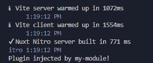
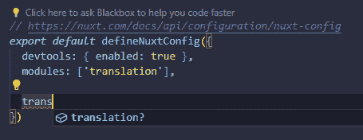
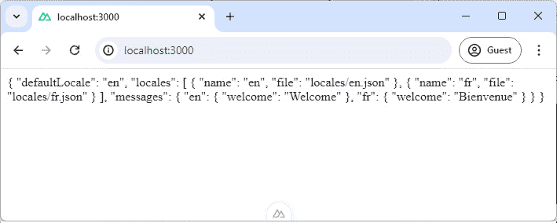
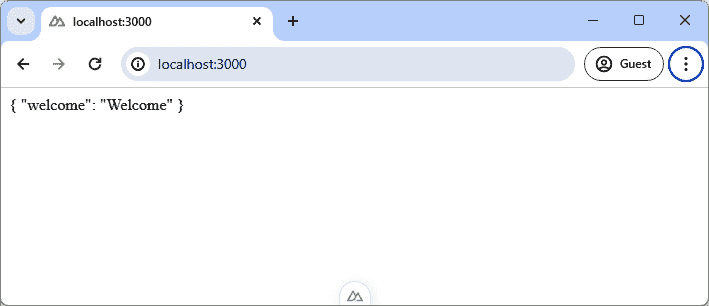
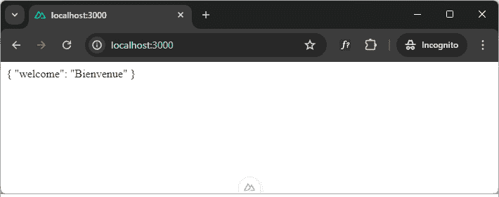
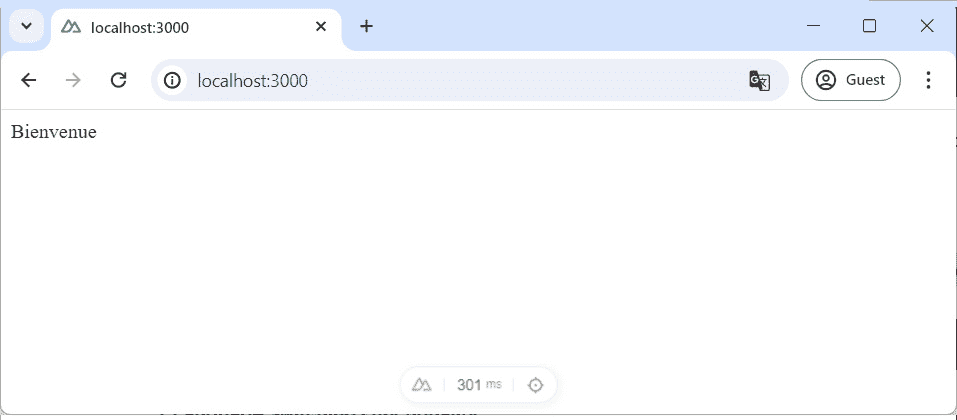
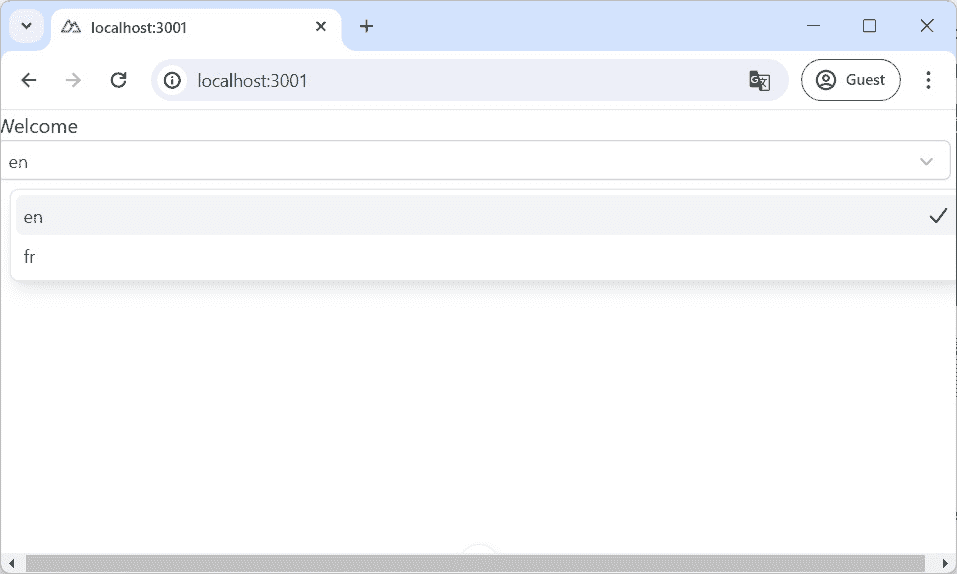

# 第八章：在 Nuxt 3 单一代码库中创建自定义翻译模块

在 *第八章* 中，我们将学习如何在 Nuxt 3 单一代码库中构建自定义的 `translation` 模块。本章旨在指导你通过单一代码库设置和模块化开发的复杂性，为高效管理大型项目提供一个完整的基石。

我们将首先使用 `pnpm` 工作空间设置单一代码库，强调集中管理多个相互关联项目的优势。你还将学习如何通过详细说明创建、配置和通过组件和插件扩展此模块以添加额外功能的方式，将自定义 `translation` 模块无缝嵌入到 Nuxt 应用程序中。

本章展示了单一代码库如何促进模块化和可重用性。每个部分的目标是帮助你掌握增强 Nuxt 应用程序的可扩展性和可维护性模块的技能，为未来需要高级架构解决方案的项目做好准备。

本章将涵盖以下主要主题：

+   设置 Nuxt 单一代码库

+   开发自定义 `translation` 模块

+   配置 `translation` 模块选项

+   通过插件、组件和可组合函数扩展模块

+   未来方向

# 技术要求

本章的代码文件可以在 。

本章的 CiA 视频可以在 [`packt.link/kdT64`](https://packt.link/kdT64) 找到

# 重要的背景知识 – 测试基础

在本章中，我们将深入探讨如何为创建自定义的 `translation` 模块设置 Nuxt 3 单一代码库。单一代码库是一种策略，其中你将所有项目的部分管理在一个单一的仓库中。这就像把所有开发鸡蛋放在一个篮子里，这简化了开发中的许多方面，尤其是对于大型项目。在我们的设置中，单一代码库将不仅包括一个 Nuxt 应用程序，还包括一系列的包和应用程序，每个都为整个系统贡献不同的功能。

单一代码库有以下价值：

**统一版本控制**：从代码到文档的所有内容都存储在一个地方，这使得跟踪更改和维护版本更加容易。

+   **简化依赖管理**：项目的所有部分使用相同的依赖项，这意味着它们都会同时更新，从而减少了兼容性问题。

+   **增强代码重用性**：单一代码库允许团队轻松地在同一仓库内的多个项目中共享通用代码和资源。这促进了包的重用，减少了冗余，并增强了不同应用程序之间的一致性。

现在我们已经了解了单一代码库在高效处理复杂项目中的作用，我们已经为探索它们如何促进广泛应用程序的开发做好了准备。

# 设置 Nuxt 单一代码库

在本章中，我们首先为我们的 Nuxt 单一代码库建立基础结构。我们不会从典型的 Nuxt 项目创建命令开始，而是首先构建一个支持多包架构的专用环境。

让我们首先为本章的项目创建一个新目录，以保持我们的工作空间组织有序，并与其他项目分开：

```js
$ mkdir chapter08
$ cd chapter08
```

然后，使用`pnpm`初始化一个新的项目。此步骤涉及创建一个`package.json`文件，该文件将定义我们的工作空间并管理项目依赖项：

```js
$ pnpm init
```

现在，您可以在 Visual Studio Code 或您首选的 IDE 中打开新创建的项目目录。

为了将我们的目录指定为单一代码库，我们引入一个`pnpm-workspace.yaml`文件。此配置文件在高效管理单个存储库中的多个包方面发挥着至关重要的作用。在此，我们指定了单一代码库中包的位置。我们选择的架构将工作空间分为两个主要目录：

+   `packages/*`：此目录保留用于可以在单一代码库中的多个应用程序之间重用的共享库或模块。在我们的情况下，这是`翻译`模块将驻留的地方。

+   `apps/*`：专门用于容纳可能依赖于任何共享模块的应用程序。我们将放置使用`translation`模块的 Nuxt 应用程序。

这里是文件的代码：

```js
# pnpm-workspace.yaml
packages:
  - 'packages/*'
  - 'apps/*'
```

现在，我们已经准备好设置我们将用于在其中包含自定义 Nuxt 模块的网站应用程序。

## 创建网站应用程序

要在单一代码库中正确设置我们的项目目录，首先创建一个`apps`目录：

```js
$ mkdir apps
$ cd apps
```

在`apps`目录中，我们将使用 Nuxt 3 的最新版本创建一个新的 Nuxt 应用程序：

```js
$ pnpm dlx nuxi@latest init demo-website
```

在初始化 Nuxt 应用程序后，您通常可以通过导航到`demo-website`目录并运行`pnpm dev`来启动应用程序。然而，利用由`pnpm`工作空间提供的单一代码库设置的完整功能，我们可以简化此过程。首先，请确保`apps/demo-website/package.json`文件中的项目名称设置适当，以反映我们的特定设置：

```js
// apps/demo-website/package.json
{
  "name": "demo-website"
  // ...rest of the file
}
```

在更新项目名称后，你现在可以从单一代码库的根目录执行命令。这是通过使用`pnpm`的`--filter`选项来完成的，该选项针对特定的子项目。要从单一代码库根目录运行我们的 Nuxt 应用程序，请使用以下命令：

```js
$ pnpm --filter demo-website dev
```

此命令告诉`pnpm`将`dev`脚本专门应用于`demo-website`项目，从而允许您从中央位置无缝地管理和运行单一代码库中的多个项目。

进一步来说，您可以在根`package.json`文件中创建一个自定义脚本，该脚本在幕后调用此命令：

```js
// package.json
{
  "scripts": {
    "website:dev": "pnpm --filter demo-website dev"
  },
}
```

然后，在根目录中运行以下命令：

```js
$ pnpm website:dev
```

应用程序应该启动，你应该看到通常的欢迎页面。在我们的应用程序设置完成后，让我们继续创建一个`翻译`模块。

# 开发自定义翻译模块

在我们继续创建自定义`translation`模块的过程中，此过程的第一步是为我们的共享包设置一个专门的目录。导航到您的单仓库根目录，创建一个名为`packages`的目录。此目录将托管所有我们的共享逻辑，包括新的`translation`模块：

```js
$ mkdir packages
$ cd packages
```

一旦进入`packages`目录，我们将使用 Nuxt 的模块模板来启动我们的`translation`模块：

```js
$ pnpm dlx nuxi init -t module translation
```

此命令设置了一个新的模块，它包含 Nuxt 提供的启动模板，包括几个必要的目录和文件：

+   `module.ts`：这是我们模块定义的核心文件。它作为入口点，定义了模块的配置和设置。

+   `runtime/plugin.ts`：此文件作为示例插件。它是扩展模块以添加额外功能（如 Vue 插件和辅助函数）的地方。

+   `playground/`：包含已安装我们的模块的 Nuxt 应用程序。此环境对于测试和演示模块的功能非常有用。

+   `test/`：为模块编写测试的目录，以确保其功能性和稳定性。

让我们探索`module.ts`文件，了解其结构和组件：

```js
import { defineNuxtModule, addPlugin, createResolver } from '@nuxt/kit'
export interface ModuleOptions {}
export default defineNuxtModule<ModuleOptions>({
  meta: {
    name: 'my-module',
    configKey: 'myModule',
  },
  defaults: {},
  setup(_options, _nuxt) {
    const resolver = createResolver(import.meta.url)
    addPlugin(resolver.resolve('./runtime/plugin'))
  },
})
```

此脚本概述了使用`defineNuxtModule`的 Nuxt `pnpm`模块的基本结构。`meta`属性定义了模块的名称和配置键。`setup`函数是添加模块特定逻辑的地方，例如注册插件、使用 Nuxt 钩子、添加自动导入目录，甚至扩展路由。

`createResolver`函数有助于正确解析路径，确保添加任何 URL 时不会出现与路径解析相关的问题。

接下来，让我们在我们的应用程序中使用此模块。

## 在我们的应用程序中安装模块

首先，将新创建的模块目录从`my-module`重命名为`translation`，以更好地反映其用途。这涉及到在模块中更新名称：

```js
// packages/translation/src/module.ts
export default defineNuxtModule<ModuleOptions>({  meta: {
    name: 'translation',
    configKey: 'translation'
  }
  // … rest of code
})
```

还需更新包配置中的名称：

```js
// packages/translation/package.json
{
  "name": "translation",
  // Rest of configuration
}
```

然后，确保生成模块的构建文件。为此，请在`translation`目录中运行以下命令：

模块根目录：

```js
Packages/translation> $ pnpm dev:prepare
```

这为开发准备本地文件。

配置好模块后，您现在可以将它添加到我们的演示网站中。从您的单仓库根目录运行以下命令，将模块本地链接到您的应用程序：

```js
$ pnpm --filter demo-website add --workspace translation
```

`--workspace`标志告诉`pnpm`从本地工作区解析翻译包，而不是从外部注册表获取。这种设置确保 Web 应用程序识别我们的包，并且模块的任何更改在开发期间都能立即提供给应用程序。

为了确保模块已成功添加，请检查您的演示网站中的`package.json`文件：

```js
// apps/demo-website/package.json
{
  "dependencies": {
    "nuxt": "³.11.2",
    "translation": "workspace:^",
    "vue": "³.4.21",
    "vue-router": "⁴.3.0"
  }
}
```

`translation`依赖项现在应列出并指向您的本地工作区。

最后，将模块添加到您的 Nuxt 配置中，以在项目中激活它：

```js
// apps/demo-website/nuxt.config.ts
export default defineNuxtConfig({
  devtools: { enabled: true },
  modules: ['translation'],
})
```

然后，启动您的应用程序以查看模块的实际效果：

```js
$ pnpm website:dev
```

查找模块默认设置的控制台输出或其他指示，以确认其正在运行：



图 8.1：翻译插件注入

如果此消息可见，则确认`translation`模块的示例插件正在积极地向您的 Nuxt 应用程序注入功能。

完成这些步骤后，您的演示网站现在已成功整合了`translation`模块。我们现在可以进一步自定义模块，并定义针对项目需求指定的特定选项。

# 配置翻译模块选项

在我们开始为我们的`translation`模块添加选项之前，了解 Nuxt 模块通常如何提供配置灵活性是至关重要的。类似于官方 Nuxt `i18n`模块通过 Nuxt 配置允许配置`defaultLocale`和`locales`，我们旨在在我们的自定义模块中提供类似的可配置性。这种设置将使用户能够通过模块的选项动态定义和管理区域设置。

在我们的`translation`模块中，我们首先定义配置的预期选项。这涉及到在`types.ts`中设置一个接口，概述配置选项的结构：

```js
// packages/translation/src/types.ts
export type ModuleOptions = {
  defaultLocale: string;
  locales?: LocaleOption[];
};
export type LocaleOption = {
  name: string;
  file: string;
};
```

在这里，`ModuleOptions`允许指定一个`defaultLocale`实例和一个`locales`实例数组，每个实例都有一个名称和一个指向翻译的文件路径。我们将在稍后讨论如何导入这些文件。

下一步是将这些类型集成到主模块文件中。将定义的类型导入到`module.ts`中，并使用它们为模块的配置提供强类型。请确保删除空定义接口：

```js
// module.ts
import type { ModuleOptions } from './types';
export default defineNuxtModule<ModuleOptions>({
  meta: {
    name: 'translation',
    configKey: 'translation',
  },
  defaults: {
    defaultLocale: 'en',
    locales: [],
  },
  setup(options, nuxt) {
    // Module setup logic here
  },
});
```

`defaults`对象被更新，为`defaultLocale`提供后备，并为区域设置提供一个空数组，确保即使没有提供特定配置，模块也可以初始化。

要充分利用模块的功能，将其添加到您的 Nuxt 应用程序的`nuxt.config.ts`文件中，并指定如下选项：

```js
// nuxt.config.ts
export default defineNuxtConfig({
  devtools: { enabled: true },
  modules: ['translation'],
  translation: {},
})
```

在指定这些选项后，Nuxt 的智能配置处理应该为`translation`选项提供自动完成建议，反映我们的模块选项与 Nuxt 生态系统的集成：



图 8.2：IntelliSense 翻译选项

当调整 Nuxt 配置文件中的设置时，您应该能够看到 IntelliSense 建议，以验证我们的模块选项的正确集成，确认 Nuxt 已识别设置。

在我们的模块中设置基本配置处理之后，接下来的任务是在模块内部实现逻辑，以根据提供的配置选项动态加载和应用指定的区域设置。

## 在模块内部读取本地文件

让我们将本地文件读取功能集成到我们的 Nuxt 模块中，以有效地处理翻译。此功能将使我们的模块能够动态加载模块配置中指定的翻译文件。

首先定义翻译文件的预期结构。假设每个文件都包含表示本地化字符串的扁平键值对。例如，在演示网站中设置英语和法语本地化文件：

+   英语本地化文件：

    ```js
    // apps/demo-website/locales/en.json
    {
      "welcome": "Welcome"
    }
    ```

+   法语本地化文件：

    ```js
    // apps/demo-website/locales/fr.json
    {
      "welcome": "Bienvenue"
    }
    ```

然后，修改你的 Nuxt 配置文件并将这些文件添加到`locales`数组中：

```js
// nuxt.config.ts
export default defineNuxtConfig({
  // other options
  translation: {
    locales: [
      { name: 'en', file: 'locales/en.json' },
      { name: 'fr', file: 'locales/fr.json' },
    ],
  },
})
```

现在，让我们回到模块来处理这些文件。首先定义消息的类型：

```js
// packages/translation/types.ts
// other types
export type Messages = {
  [key: string]: string;
};
```

记住，我们假设`locales`翻译文件将是一个扁平的键值对。你可以处理嵌套对象，但为了简化过程，我们只会使用一个级别的键。

最后，更新你的模块的`setup`函数以遍历区域设置，解析它们的路径，读取它们的内 容，然后将它们解析成可用的格式。以下是你可以这样做的方式：

```js
// packages/translation/module.ts
import { readFileSync } from 'node:fs'
import { defineNuxtModule, createResolver } from '@nuxt/kit'
import type { Messages, ModuleOptions } from './types'
export default defineNuxtModule<ModuleOptions>({
  meta: {
    name: 'translation',
    configKey: 'translation',
  },
  defaults: {
    defaultLocale: 'en',
  },
  async setup(options, nuxt) {
    const localesResolver =
      createResolver(nuxt.options.srcDir)
    const messages: Messages = {}
    for (const locale of options.locales ?? []) {
      const filePath = localesResolver.resolve(locale.file)
      const fileContents = await readFileSync(filePath,
        'utf-8')
      const _messages = JSON.parse(fileContents)
      messages[locale.name] = _messages
    }
    nuxt.options.runtimeConfig.public.translation = {
      ...options,
      messages,
    }
  }
});
```

这里是一个代码分解：

+   `localesResolver`：解析相对于项目源目录的路径，该路径存储在`nuxt.options.srcDir`

+   `readFileSync`：同步读取解析路径的文件内容

+   `JSON.parse`：将文件中的 JSON 字符串转换为 JavaScript 对象

+   `nuxt.options.runtimeConfig.public.translation`：在 Nuxt 运行时配置中存储消息，通过`useRuntimeConfig()`可组合的组件在整个应用程序中访问

为了验证集成，修改主应用程序组件以显示加载的消息：

```js
<!-- apps/demo-website/app.vue -->
<template>
  <div>{{ translation }}</div>
</template>
<script setup lang="ts">
const config = useRuntimeConfig();
const translation = config.public.translation;
</script>
```

重新启动你的 Nuxt 应用程序并导航到主页。你现在应该看到显示的翻译选项以及本地化消息：



图 8.3：显示翻译数组输出

现在我们模块可以加载翻译消息，我们将通过添加一个插件来增强其功能，创建一个全局辅助函数。这个函数将允许我们轻松地在 Nuxt 应用程序中检索和显示翻译字符串。

# 通过插件、可组合的组件和组件扩展模块

我们将首先开发一个可组合的组件来管理用户的偏好语言。这个可组合的组件将帮助从 cookie 中检索正确的区域设置，或者默认为模块选项中配置的区域设置。

在模块内部，为可组合的组件创建一个新文件：`runtime/composables/useTranslation.ts`。

按照以下方式开发可组合函数：

```js
import { computed, useCookie, useRuntimeConfig } from '#imports'
export default () => {
  const config = useRuntimeConfig()
  const translation = config.public.translation
  const locale = useCookie('defaultLocale')
  const locales = translation.locales
  if (!locale.value) locale.value =
    translation.defaultLocale
  const messages = computed(() => {
    const key = locale.value || translation.defaultLocale
    return translation.messages[key]
  })
  return { locale, locales, messages }
}
```

这里是一个代码分解：

+   `useRuntimeConfig`：访问运行时配置，包括翻译设置

+   `useCookie`：一个管理 cookie 值的`ref`：`get` – `set`，特别是用于存储用户的区域偏好

+   `computed`：根据当前区域设置反应性地计算要使用正确的消息

注意

在开发 Nuxt 模块时，显式地从`#imports`导入任何默认在 Nuxt 应用中自动导入的函数或组合式是至关重要的。这种方法确保了模块可以利用 Nuxt 的自动导入功能，而该功能在模块的作用域中并不固有，就像在 Nuxt 应用中那样。

为了确保我们的组合式在 Nuxt 应用中易于访问，我们将自动化其导入。更新`module.ts`文件以自动导入`composables`目录：

```js
import { defineNuxtModule, createResolver, addImportsDir } from '@nuxt/kit';
export default defineNuxtModule({
  meta: {
    name: 'translation',
    configKey: 'translation',
  },
  setup(options, nuxt) {
    // Existing setup code...
    const resolver = createResolver(import.meta.url);
    addImportsDir(resolver.resolve('runtime/composables'));
  }
});
```

`addImportsDir`自动从指定的目录导入文件，使得组合式可以轻松地供 Nuxt 应用使用，无需手动`import`语句。因此，这个文件夹将完全像 Nuxt 应用内部的`composables`文件夹一样工作！

组合式准备就绪后，让我们测试其功能。按照以下方式更新`app.vue`：

```js
<template>
  {{ messages.welcome }}
</template>
<script setup lang="ts">
const { messages } = useTranslation();
</script>
```

这种设置应该根据默认或用户定义的区域显示欢迎消息。因为我们没有更新默认区域，所以模块将使用`'en'`作为默认值，因为它在模块文件中已配置：



图 8.4：基于默认区域的消息数组

现在，让我们确保我们的模块可以尊重 Nuxt 配置中指定的区域设置覆盖：

```js
// nuxt.config.ts
export default defineNuxtConfig({
  translation: {
    defaultLocale: 'fr',
    locales: [
      { name: 'en', file: 'locales/en.json' },
      { name: 'fr', file: 'locales/fr.json' }
    ]
  }
});
```

通过将`defaultLocale`设置为`'fr'`并在私有窗口中访问应用（以清除之前的 cookie），应该出现法语翻译，这证明了我们的`translation`模块的灵活性和动态能力：



图 8.5：基于默认区域的消息数组

现在，让我们继续前进，通过一个插件增强模块，该插件提供了一个全局的$t 函数，用于直接获取翻译消息。这将简化在整个应用中使用翻译。

## 创建一个$t 辅助函数

首先，我们在模块的`runtime/plugins`目录内创建一个新的`translate.ts`文件。这个文件将包含我们翻译函数的逻辑。以下是编写用于获取翻译的插件的步骤：

```js
import useTranslation from '../composables/useTranslation'
import { defineNuxtPlugin } from '#imports'
export default defineNuxtPlugin(async () => {
  const { messages } = useTranslation()
  // Translator function
  const t = (key: string) => {
    return messages.value[key] || key  // Return the
                                          translated string
                                          or key if not
                                          found
  }
  return {
    provide: { t }
  }
})
```

下面是代码分解：

+   我们正在导入`useTranslation`，它管理翻译状态并根据当前区域提供翻译。

+   我们正在使用`defineNuxtPlugin`定义插件。这里的`#imports`别名用于自动解析到 Nuxt 提供的正确工具版本。

+   我们正在实现一个`t`翻译函数，它接受一个键作为参数。它尝试从`useTranslation`获取的`messages`对象中检索该键的翻译。如果该键不存在翻译，则默认回退到该键本身。

+   我们通过在插件定义函数的末尾添加 `return { provide: { t } }` 来提供 `Translator` 作为全局辅助函数。通过提供 `t`，应用程序中的任何组件都可以使用此函数来使用 `$t` 渲染翻译文本。Nuxt 自动将 `$` 添加到由 nuxt 模块提供的任何函数中，以便全局访问。

接下来，通过更新 `module.ts` 文件将此插件集成到我们的 Nuxt 模块中：

```js
import {
  defineNuxtModule,
  addPlugin,
  createResolver,
  addImportsDir,
} from '@nuxt/kit'
export default defineNuxtModule({
  setup(_options, nuxt) {
   // …previous setup
    addPlugin(resolver.resolve('./runtime/plugins/translate'))
  },
})
```

最后，更新您的应用程序的主要组件 `app.vue`，以使用 `$t` 函数：

```js
<template>
  <div>{{ $t('welcome') }}</div>
</template>
```

一旦实现，通过运行应用程序并导航来测试。您应该看到基于活动区域设置的翻译字符串的渲染：



图 8.6：$t 函数输出

对于最终的扩展，我们将创建一个允许用户直接从他们的网络界面切换语言的组件。

## 设置语言切换组件

我们将使用来自 `@nuxt/ui` 包的菜单组件创建一个语言切换组件。首先，在我们的模块范围内安装 `@nuxt/ui` 包。从项目的根目录运行以下命令：

```js
$ pnpm --filter translation add @nuxt/ui
```

在 `module.ts` 文件中，验证并安装 `@nuxt/ui`（如果它尚未存在于宿主应用程序中），并确保自动导入新的 `components` 目录。Nuxt Kit 提供了各种辅助函数来实现这一点：

+   `hasNuxtModule`：检查 `@nuxt/ui` 是否已安装在宿主应用程序中

+   `installModule`：如果未找到，则动态安装 `@nuxt/ui`

+   `addComponentsDir`：将包含我们的自定义组件的目录添加到 Nuxt 的自动导入功能中，允许这些组件无需手动导入

这是 `module.ts` 设置函数的更新版本：

```js
export default defineNuxtModule({
  async setup(_options, nuxt) {
  // other configuration
    if (!hasNuxtModule('@nuxt/ui')) {
      await installModule('@nuxt/ui')
    }
    const resolver = createResolver(import.meta.url)
    addComponentsDir({
      path: resolver.resolve('runtime/components')
    })
  }
})
```

现在，在 `runtime/components` 目录中创建一个新的 `LanguageSwitcher.vue` 组件。此组件将利用来自 `@nuxt/ui` 的 `USelectMenu` UI 组件来渲染语言选择的下拉菜单：

```js
<template>
  <USelectMenu
    v-model="locale"
    :options="locales"
    value-attribute="name"
    option-attribute="name"
  />
</template>
<script setup lang="ts">
import useTranslation from '../composables/useTranslation'
const { locale, locales } = useTranslation()
</script>
```

下面是对组件的解释：

+   `USelectMenu`：来自 `@nuxt/ui` 的 UI 组件，用于渲染下拉菜单。它绑定到 `locale` 响应变量，并根据用户选择更新它。

+   `locales`：一个包含可用语言的数组，用于填充下拉选项。

为了确保 `LanguageSwitcher` 组件正常工作，运行以下命令：

```js
$ pnpm --filter translation dev:prepare
```

这将使用新组件准备模块。然后，更新您的 Nuxt 应用程序中的 `app.vue` 文件以使用 `LanguageSwitcher` 组件：

```js
<!-- apps/demo-website/app.vue -->
<template>
  <div>{{ $t('welcome') }}</div>
  <LanguageSwitcher />
</template>
```

刷新您的浏览器以测试功能。您应该看到一个欢迎消息以及包含两个区域设置（`en` 和 `fr`）的选择菜单。使用下拉菜单更改语言应该会动态更新欢迎消息，从而演示应用程序中的响应式翻译更新：



图 8.7：LanguageSelector 组件

注意，我们设法在模块中使用了 `@nuxt/ui` 包，而无需在宿主应用程序中直接安装，这展示了 Nuxt 模块的灵活性。我们仍然可以在宿主应用程序中安装此包，并且由于 `hasNuxtModule` 检查函数，这不会导致任何错误。

现在我们已经完成了在 Nuxt 3 中实现自定义模块，让我们展望一下如何在现实世界的应用中进一步精炼和扩展这些概念。

# 未来方向

在我们结束这一章时，重要的是反思指导我们通过在单仓库结构中构建自定义 `i18n` 模块之旅的潜在原则。重点不在于应用程序的美学，而在于架构——特别是模块系统的创建。这种方法对于需要高效管理复杂性的大型项目尤其有益。

## POS 系统示例

在现实世界的场景中，尤其是在企业环境中，应用程序很少简单。它们通常由许多相互连接的部分组成，例如**销售点**（**POS**）系统，这可能包括处理订单、促销、客户管理和更多模块。每个模块都可以设计为独立运行，包含自己的页面、逻辑、组件和状态管理。

在这样的系统中，不同的模块可以独立开发和维护。例如，一个促销模块可能处理所有促销活动和折扣逻辑。如果企业决定彻底改革其促销策略，只需更新或替换促销模块，从而最小化对系统其他部分的风险和干扰。

## 电子商务平台示例

模块化系统在复杂的电子商务平台上特别有益，在这些平台上，如产品目录管理、订单处理、支付集成和用户资料等不同功能是基本且独立的组件。每个模块都可以单独开发、测试和部署，从而实现灵活的更新和可扩展性。

例如，支付集成模块可能支持各种支付网关并处理所有交易复杂性。如果需要添加新的支付方式或由于监管变化需要对现有支付方式进行更新，开发者可以仅关注此模块。这种模块化方法加快了开发和部署速度，并确保一个区域的更新，如支付处理，不会无意中影响产品目录或用户管理系统等无关部分。

## 最后的想法

本章的目标是强调模块化架构对大型应用程序开发和可扩展性的变革性影响。通过采用模块化方法，开发者可以有效地管理复杂系统，促进更轻松的更新、测试和扩展。向前看，将这里探索的策略应用于有效地构建项目。

此外，这次旅程突出了 Nuxt 提供的优秀开发者体验，它简化了自定义模块的创建。Nuxt 的框架支持广泛的定制，允许无缝集成选项、组件、插件和组合式组件。这种灵活性确保我们的应用程序满足当前需求，同时也为未来的进步和集成做好了充分准备。

# 摘要

在本章中，我们重点介绍了在 Nuxt 3 单体仓库中创建自定义`translation`模块的过程，该模块旨在简化大规模项目的管理。我们首先使用`pnpm`建立单体仓库设置，这使得我们可以将项目结构化为相互关联但独立的多个工作空间。这个基础支持了我们`translation`模块的开发，从基本的 Nuxt 模块模板开始。通过配置模块选项，我们定制了模块以处理多种语言。

在进一步增强模块的过程中，我们集成了插件、组件和组合式组件，提供了一种动态且用户友好的方式来切换语言和管理翻译。

这种实际应用展示了模块化架构如何增强代码重用，同时简化增强和可扩展性。关于未来方向的结论性讨论探讨了在其他领域（如电子商务或企业系统）中我们可以如何使用这种模块化方法，展示了所学技术的广泛适用性和灵活性。

本章为希望在其项目中充分利用 Nuxt 模块化能力的开发者提供了一个蓝图。

# 实践问题

+   描述为 Nuxt 3 项目设置`pnpm`单体仓库的过程。

+   使用单体仓库结构在大型 Nuxt 3 项目中有哪些关键好处？

+   如何在单体仓库中初始化一个新的 Nuxt 3 模块？

+   你如何在同一单体仓库中向 Nuxt 应用程序添加 Nuxt 模块？

+   `addPlugin`函数在 Nuxt 模块中做什么？

+   `runtimeConfig`在 Nuxt 模块中扮演什么角色？

+   描述在 Nuxt 模块中使用`createResolver`的目的。

+   解释`hasNuxtModule`和`installModule`函数在模块设置中的使用方式。

+   如何在 Nuxt 模块中添加和使用组合式组件？

+   你如何配置 Nuxt 模块，以便在模块在项目中使用时自动从指定目录导入组件？

# 进一步阅读

+   Nuxt 模块：[`nuxt.com/docs/guide/concepts/modules`](https://nuxt.com/docs/guide/concepts/modules)

+   模块作者指南：[`nuxt.com/docs/guide/going-further/modules/`](https://nuxt.com/docs/guide/going-further/modules/)

+   `pnpm`工作空间：[`pnpm.io/workspaces`](https://pnpm.io/workspaces)

+   Nuxt 生命周期钩子：[`nuxt.com/docs/guide/going-further/hooks`](https://nuxt.com/docs/guide/going-further/hooks)

+   Nuxt 自动导入概念：[`nuxt.com/docs/guide/concepts/auto-imports`](https://nuxt.com/docs/guide/concepts/auto-imports)
