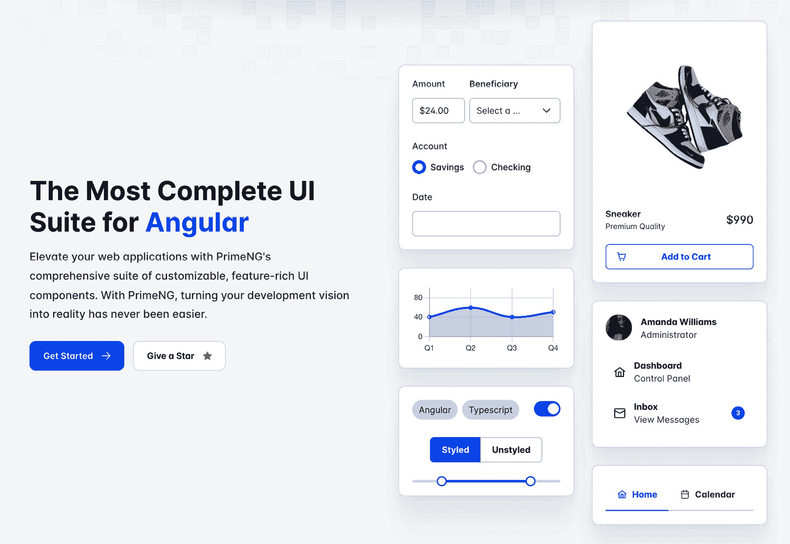
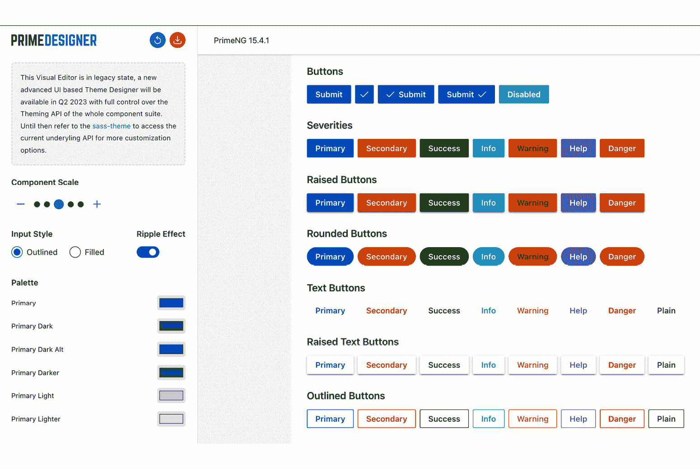

# 第一章：介绍 Angular 和 PrimeNG：强大的组合

欢迎来到你网络开发之旅的第一步，一个广阔且充满活力的领域！

本章是你进入两个已经彻底改变了网络应用程序开发的强大工具的大门：Angular 和 PrimeNG。

由技术巨头 Google 开发的 Angular 是一个强大的框架，它彻底改变了网络应用程序的开发。它提供了一个构建复杂和高效网络应用程序的结构化路径。凭借双向数据绑定、依赖注入和模块化架构等强大功能，Angular 使开发者能够轻松构建复杂的网络应用程序。

与 Angular 结合，PrimeNG 提供了一系列专为 Angular 设计的预制 UI 组件。这种组合形成了一对强大的搭档，因为 PrimeNG 通过提供一套现成的 UI 组件来补充 Angular 的功能，在构建各种类型的网络应用程序时，这些组件帮助开发者打造美观且用户友好的界面，简化开发过程，并确保一致且引人入胜的用户体验。

在本章中，我们将探讨 Angular 和 PrimeNG 的基础知识，展示它们的集成，并解释联合使用它们的益处。无论你是网络开发领域的初学者还是经验丰富的专业人士，本章都承诺为你提供宝贵的见解，为你在 UI 开发领域的未来冒险铺平道路。

总结来说，我们将涵盖以下主要主题：

+   介绍 Angular

+   介绍 PrimeNG

+   探索 PrimeNG 的关键特性

+   使用 Angular 和 PrimeNG 一起

# 技术要求

我们将在下一章中设置开发环境；然而，目前你可以在这里找到本书的代码：[`github.com/PacktPublishing/Next-Level-UI-Development-with-PrimeNG`](https://github.com/PacktPublishing/Next-Level-UI-Development-with-PrimeNG)。请注意，你可以在 `apps` 文件夹中找到每个章节的代码。

# 介绍 Angular

**Angular** ([`angular.io/`](https://angular.io/)) 是由 Google 开发和维护的一个网络应用程序框架，是一个用于构建动态网络应用程序的全面框架。作为前端开发领域的一根支柱，Angular 通过其强大的功能和面向性能的特性确立了其主导地位。

当我们深入研究 Angular 时，我们可以看到它是由 TypeScript 构建的，TypeScript 是 JavaScript 的静态类型超集。TypeScript 带来了诸如类型安全性和增强的工具支持等特性，这些特性有助于提高 Angular 应用程序的稳健性。TypeScript 强大的类型和 Angular 的架构相结合，使得该框架具有高度的可扩展性，这在构建复杂和大规模应用程序时至关重要。

Angular 的架构是基于组件的。**组件**控制网站屏幕上的一个部分。组件是模块化和可重用的，这促进了干净且**DRY**（**不要重复自己**）的代码库。随着应用程序规模和复杂性的增长，它们也使得管理和推理应用程序变得更加容易。

您可以在下面的代码块中看到一个简单的 Angular 组件示例：

```js
// app.component.ts
import { Component } from '@angular/core'
import { CommonModule } from '@angular/common'
import { bootstrapApplication } from '@angular/platform-browser'
@Component({
   selector: 'my-app',
   standalone: true,
   imports: [CommonModule],
   template: `
      <h1>Hello from {{name}}!</h1>
      <a target="_blank" href="https://angular.io/start">
         Learn more about Angular
      </a>
   `,
})
// main.ts
export class AppComponent {
   name = 'Angular'
}
bootstrapApplication(AppComponent)
```

这段代码演示了一个简单的 Angular 应用程序，它使用`bootstrapApplication()`函数来初始化应用程序。

让我们分解代码并解释每一部分。首先，我们导入依赖项：

```js
import { Component } from '@angular/core'
import { CommonModule } from '@angular/common'
import { bootstrapApplication } from '@angular/platform-browser'
```

让我们解释每一部分：

+   第一行从`@angular/core`导入`Component`装饰器，该装饰器用于定义 Angular 组件

+   第二行从`@angular/common`导入`CommonModule`，它为 Angular 应用程序提供常用的指令、管道和服务

+   第三行从`@angular/platform-browser`导入`bootstrapApplication`函数，该函数用于启动 Angular 应用程序

下一个部分是定义一个`Angular` `Component`的方式：

```js
@Component({
   selector: 'my-app',
   standalone: true,
   imports: [CommonModule],
   template: `
      <h1>Hello from {{name}}!</h1>
      <a target="_blank" href="https://angular.io/start">
         Learn more about Angular
      </a>
   `,
})
export class AppComponent {
   name = 'Angular'
}
```

让我们分解这段代码：

+   这段代码使用`@Component`装饰器定义了一个名为`AppComponent`的组件

+   `selector`属性设置组件的选择器为`'my-app'`，这意味着它可以用`<my-app />`标签在 HTML 中使用

+   `standalone`属性设置为`true`，表示它可以在不声明在`NgModule`中的情况下使用

+   `imports`数组包括`CommonModule`，它为组件提供了所需的常用指令和服务

`template`属性定义了组件的模板，该模板由一个显示`name`属性值的`<h1>`标题组成，值为`'Angular'`，以及一个链接到 Angular 网站的锚标签

最后，我们启动应用程序：

```js
bootstrapApplication(AppComponent)
```

`bootstrapApplication()`函数以`AppComponent`组件作为参数被调用，启动一个 Angular 应用程序实例，并将一个独立组件作为应用程序的根组件进行渲染。

注意

独立组件方法（在 Angular v14 中引入）和 NgModule 方法在启动方式上有所不同。使用 NgModule 时，启动是通过从`@angular/platform-browser-dynamic`包导出的`bootstrapModule()`函数完成的。

Angular 的一个优势在于其强大的工具和功能套件，包括以下内容：

+   Angular 的**命令行界面**（**CLI**）([`angular.io/cli`](https://angular.io/cli)）通过自动化各种开发任务简化了 Angular 项目的创建

+   诸如依赖注入和装饰器等特性使开发者能够编写模块化和易于测试的代码

+   Angular 的指令允许开发者向 DOM 元素添加行为

+   双向数据绑定使模型和视图保持同步，减少了样板代码的数量

+   一套用于处理复杂状态管理和路由的综合工具

+   一个用于与 RESTful 服务交互的 HTTP 客户端

+   更多内容！

总结来说，Angular 是一个全面性的框架，它结合了性能、可扩展性和丰富的工具和功能。这些因素使得它成为许多开发者的首选，无论是构建简单的网站还是复杂的单页应用程序。

注意

Angular 是一个不断发展的框架，新功能不断被添加。如果您想了解更多关于 Angular 的信息，网上有许多资源可供参考（例如，https://angular.io）。

在下一节中，我们将进入 PrimeNG 的世界。

# 介绍 PrimeNG

**PrimeNG** ([`primeng.org/`](https://primeng.org/)) 是一个功能丰富的开源 UI 组件库，专门为 Angular 应用程序设计。如图所示，PrimeNG 当前的状态提供了一个令人印象深刻的组件套件，包括 90 多个组件、200 多个图标和 400 多个现成的 UI 块，从简单的按钮和输入等小部件到更复杂和强大的组件，如数据表、图表和树。



图 1.1 – PrimeNG 概览

PrimeNG 中的每个组件都是精心制作的。它们不仅功能强大，而且设计精美，符合现代 UI 原则，具有吸引力的外观。组件自带丰富的功能，可以根据您应用程序的具体需求进一步定制。

这是一个按钮片段的示例：

```js
<section class="call-to-action">
   <h2>5 Things Your Spreadsheets Can't Do</h2>
   <button
      routerLink="/spreadsheets/demo"
      pButton
      pRipple
      label="Show Me Now"
      class="p-button-raised p-button-primary"
   ></button>
</section>
```

这段代码代表了一个具有多个属性和类的 `<button>` 元素。让我们逐一分析：

+   `pButton`: 此属性是一个指令，它为按钮添加 PrimeNG 样式和行为。它通过额外的功能和视觉增强来增强按钮。

+   `pRipple`: 此属性在按钮点击时启用涟漪效果，提供视觉反馈。

+   `label="Show Me Now"`: 此属性设置按钮的标签或文本内容为**Show** **Me Now**。

+   `class="p-button-raised p-button-primary"`: 此 `class` 属性将两个 CSS 类应用于按钮——即 `p-button-raised` 和 `p-button-primary`。这些类定义了按钮的外观和样式，使其呈现凸起效果并使用主色调方案。

您可以在以下图中查看结果：


图 1.2 – PrimeNG 按钮

除了庞大的组件库之外，PrimeNG 还拥有强大的社区和活跃的开发团队。定期的更新使库保持新鲜和竞争力，而广泛的文档和示例使您能够轻松开始并找到问题的答案。

总之，PrimeNG 是一个强大的工具，它显著减少了在 Angular 应用程序中构建高质量、交互式用户界面所需的时间和精力。其丰富的预用组件、灵活的主题功能和对无障碍性的承诺，使其成为任何 Angular 开发者的绝佳选择。在下一节中，我们将深入了解 PrimeNG 的关键特性。

注意

虽然 PrimeNG 提供了丰富的功能，但了解 Angular 基础知识对于充分利用其潜力是必不可少的。您可以访问官方的 Angular 网站，或查看 Aristeidis Bampakos 和 Pablo Deeleman 所著的 Packt 的*学习 Angular*书籍。

# 探索 PrimeNG 的关键特性

PrimeNG 凭借其丰富的功能集和对细节的关注，在众多 UI 库中脱颖而出。这一套专为 Angular 应用程序设计的综合功能，使其成为寻求强大、易用 UI 库的开发者的首选选择。

让我们来看看 PrimeNG 的一些流行特性：

+   PrimeNG 最引人注目的特性之一是其广泛的 UI 组件。从基本的元素，如按钮和下拉菜单，到更复杂的组件，如数据表、日历和图表，PrimeNG 都能满足您的需求。每个组件都是完全可定制的，让您可以根据自己的需求调整外观和行为。

+   PrimeNG 的另一个关键特性是其主题系统。PrimeNG 附带多种预构建的主题，每个主题都为所有组件提供了独特的样式，但主题系统并不止于此——借助主题设计器，您可以轻松创建与您的品牌形象一致的自定义主题。主题设计器提供了一个用户友好的界面，用于自定义主题的颜色、字体和其他样式方面，正如您在这里所看到的：



图 1.3 – PrimeNG 设计器

+   PrimeNG 也优先考虑无障碍性。其许多组件都内置了对**可访问的富互联网应用程序**（**ARIAs**）和键盘导航的支持，使您的应用程序对有障碍的用户更加易于访问。对无障碍性的这一承诺证明了 PrimeNG 致力于为有障碍人士创建包容性网络应用的承诺。使用具有无障碍支持的预构建组件，通过利用无障碍专家的专长，确保符合标准，并从持续维护和更新中受益。

+   **PrimeIcons** 是 PrimeNG 的默认图标库，由 PrimeTek 开发了超过 250 个开源图标。这些图标不仅视觉上吸引人，而且在利用预期的功能通用视觉语言和支持 **用户界面体验**（**UIX**）方面高度相关。然而，值得一提的是，PrimeNG 组件在图标使用上提供了灵活性，允许使用其他流行的图标库进行模板化，例如 Material Icons ([`fonts.google.com/icons`](https://fonts.google.com/icons)) 或 Font Awesome ([`fontawesome.com`](https://fontawesome.com))，这为开发者提供了选择与他们的设计需求和期望的用户体验最佳匹配的图标集的自由。

+   最后，PrimeNG 是以响应性为设计理念的。组件被构建以适应不同的屏幕尺寸和分辨率，确保你的应用程序在所有设备上看起来都很棒。无论用户是在桌面、平板电脑还是移动设备上，PrimeNG 组件都将提供一致、高质量的用户体验。

总结来说，PrimeNG 提供了一套强大的功能，使其成为任何 Angular 开发者的绝佳选择。从其广泛的组件库和灵活的主题系统，到其对可访问性和响应性的承诺，PrimeNG 拥有创建高质量的交互式用户界面所需的所有工具，适用于你的 Angular 应用程序。

# 使用 Angular 和 PrimeNG 一起

Angular 和 PrimeNG 的结合为现代网络开发提供了一套强大的工具。它们共同创造了一个高度生产力的环境，显著简化了构建复杂、交互式网络应用程序的过程。以下是一些亮点：

+   首先要强调的是，PrimeNG 是专门为 Angular 设计的。这意味着所有组件都是为与 Angular 的架构无缝工作而构建的。PrimeNG 组件本质上就是 Angular 组件，因此它们可以像任何其他 Angular 组件一样使用。这种与 Angular 的兼容性导致开发流程简化，你可以在 Angular 应用程序中使用 PrimeNG 组件，而无需任何额外的开销或集成工作。

+   此外，Angular 和 PrimeNG 在功能上相互补充。Angular 提供了构建具有复杂交互和状态管理的单页应用框架，而 PrimeNG 提供了一系列预构建的 UI 组件来增强用户界面。这意味着你可以利用 Angular 的强大框架来处理应用的逻辑和结构，并使用 PrimeNG 的组件来创建引人入胜、响应式的用户界面。

+   Angular 和 PrimeNG 的集成还提高了代码质量。由于 PrimeNG 提供了现成的、可重用的组件，您可以避免重复代码，专注于实现独特功能和业务逻辑。这可以导致更干净、更易于维护的代码库，这在大型应用中尤其有益。

+   最后，Angular 和 PrimeNG 都有活跃的社区和广泛的文档。这意味着当您需要帮助或想了解更多关于特定主题的信息时，您有丰富的资源可以利用。Angular 和 PrimeNG 的持续更新和改进也确保了您使用的是最新的工具，这些工具遵循 Web 开发的最新最佳实践。

本质上，Angular 强大的框架与 PrimeNG 丰富的 UI 组件组合提供了一套完整的解决方案，用于构建动态、美观的 Web 应用程序。这种结合不仅提高了生产力，还促进了高效、可扩展和可维护的应用程序的开发。

注意

Angular 和 PrimeNG 都是开源的，这意味着它们不仅免费使用，还可以根据独特需求进行定制，例如自定义组件或主题。

# 摘要

本章，我们开始了 Angular 和 PrimeNG 这两个强大工具的探索之旅，它们结合在一起，释放了创建现代和复杂 Web 应用程序的潜力。在本章中，您对这些工具有了初步的了解，并探讨了利用它们的优点。Angular 提供了底层结构，而 PrimeNG 则通过现成的 UI 组件对其进行增强。这种结合使开发者能够加速工作流程，从而缩短开发周期并编写更易于维护的代码。

本章中获得的知识对于寻求提升 Web 开发技能的专业开发者来说是无价的。随着我们深入后续章节，我们将探讨如何充分利用 Angular 和 PrimeNG，创建各种应用。无论您是初出茅庐的开发者还是经验丰富的专业人士，这次旅程都承诺将富有洞察力和丰富性。所以，系好安全带，我们准备一起探索 Angular 和 PrimeNG 在 Web 开发领域的迷人世界。

在下一章中，我们将深入探讨设置开发环境的过程。我们将探讨技术要求，包括 Node.js、Yarn/NPM、GitHub 和 VS Code，并指导您完成安装过程。此外，我们还将介绍 Angular CLI，这是一个强大的 CLI，可以简化 Angular 开发。

随着我们共同踏上这个启发性的旅程，准备好将您的开发技能提升到新的水平吧！
