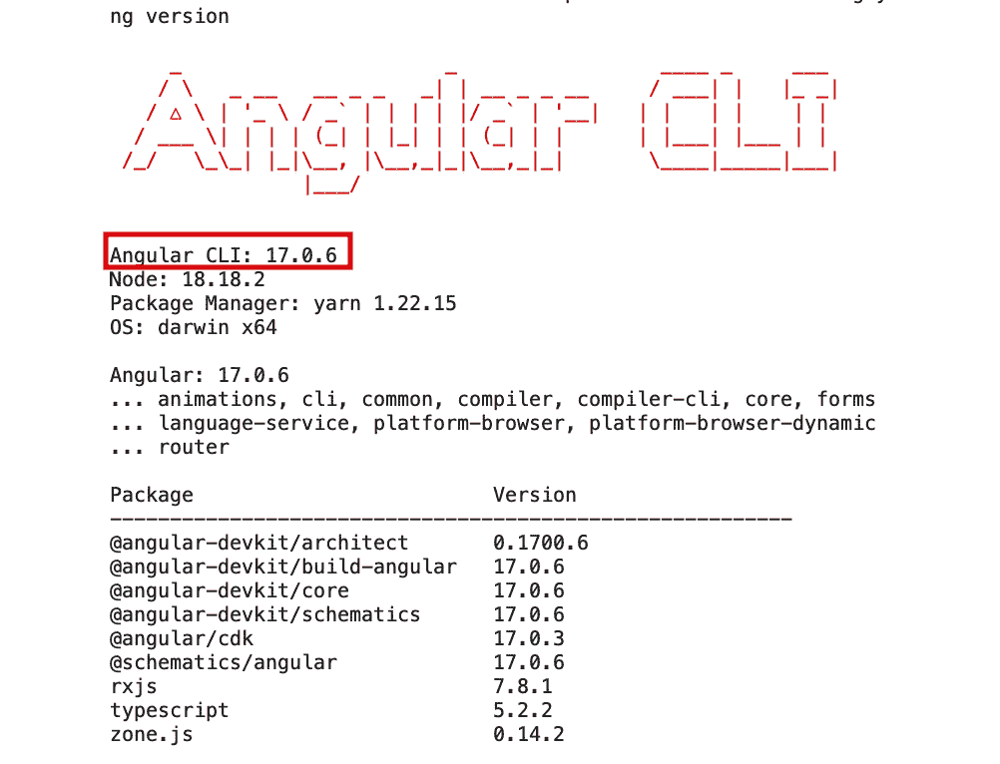
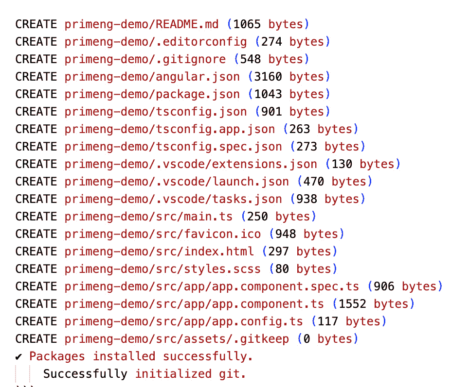
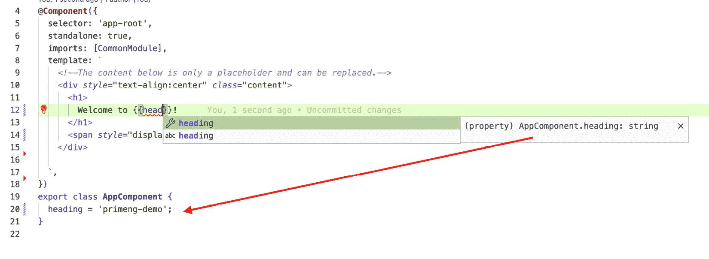
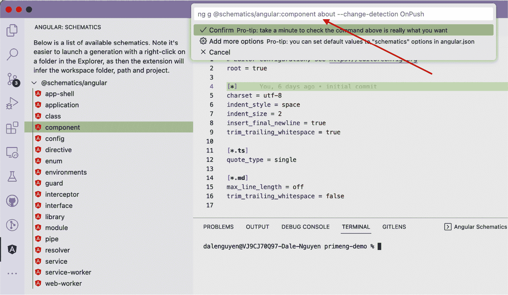

# 2

# 设置你的开发环境

在本章中，我们将深入探讨设置你的开发环境以使用 PrimeNG 组件构建 Angular 应用程序的关键任务。本章将为你提供创建无缝且高效开发环境所需的知识和工具。从安装所需的软件到理解项目结构，我们将指导你完成每个步骤，以确保设置过程顺利。

到本章结束时，你将拥有一个配置良好的开发环境，并配备开始使用 PrimeNG 构建 Angular 应用程序所需的工具。了解技术要求、设置 Angular CLI 以及熟悉项目结构将为你的 Web 开发之旅打下坚实的基础。此外，利用 VS Code 等 IDE 以及使用有用的扩展将提高你的工作效率，使开发过程更加高效。

那么，让我们深入探讨并设置你的开发环境，以获得最佳的 Angular 开发体验。在本章中，我们将涵盖以下主题：

+   设置 Angular CLI

+   创建新的 Angular 项目

+   理解项目结构

+   发现有用的 VS Code 扩展

# 技术要求

本章包含来自新 Angular 项目的各种代码示例。你可以在以下 GitHub 仓库的`chapter-02`文件夹中找到相关源代码：[`github.com/PacktPublishing/Next-Level-UI-Development-with-PrimeNG`](https://github.com/PacktPublishing/Next-Level-UI-Development-with-PrimeNG)。

在深入设置过程之前，确保你的系统满足开发所需的技术要求非常重要。让我们看看你需要准备的关键组件：

+   **Node.js (NVM)**：使用**Node 版本管理器**（**NVM**）安装 Node.js，这是一个 JavaScript 运行时，以在你的系统上管理多个 Node.js 版本。你可以从官方网站下载并安装 NVM：[`github.com/nvm-sh/nvm`](https://github.com/nvm-sh/nvm)。如果你的公司对 NVM 的使用有限制，请参考官方 Node.js 网站（[`nodejs.org`](https://nodejs.org)）的安装说明，并遵循提供的指南。

+   **npm**：选择 npm 来管理 Angular 项目中的依赖项。它捆绑了 Node.js，所以如果你已经安装了 Node.js，你将能够使用 npm。如果你希望使用 npm 的替代品，你可以查看 Yarn（[`yarnpkg.com`](https://yarnpkg.com)）或 pnpm（[`pnpm.io`](https://pnpm.io)）。

+   **GitHub**：注册一个 GitHub 账户以利用这个基于网络的托管服务进行版本控制和协作。GitHub 允许你跟踪变更、与团队成员协作以及托管你的 Angular 仓库。在[`github.com`](https://github.com)注册一个账户。

+   **VS Code（Visual Studio Code）**：安装 VS Code，这是由微软开发的一个免费且可扩展的源代码编辑器。VS Code 提供了对 Angular 的内置支持，并与 Angular CLI 无缝集成，提供代码补全和调试等功能。从官方网站下载 VS Code：[`code.visualstudio.com`](https://code.visualstudio.com)。

通过确保您已安装 Node.js（NVM）、包管理器（npm、Yarn 或 pnpm）、GitHub 和 VS Code，您将为设置 Angular 开发环境打下坚实的基础。这些工具将使您能够高效地构建、管理和协作 PrimeNG 组件的 Angular 项目。

# 设置 Angular CLI

**Angular CLI**（**命令行界面**）是一个强大的工具，它简化了创建、开发和维护 Angular 应用程序的过程。它提供了一套命令，可以自动化常见的开发任务，让你能够专注于构建应用程序，而不是手动设置项目结构。在本节中，我们将指导你完成 Angular CLI 的安装过程，并提供其核心命令的概述。

注意

在安装过程中，请确保您有一个稳定的互联网连接。根据您的网速，下载和安装所需的包可能需要一些时间。

## 使用 NVM 安装 Node.js v18

要安装 NVM 并将 Node.js v18 设置为默认版本，请按照以下步骤操作：

1.  访问 GitHub 上的官方 NVM 仓库：[`github.com/nvm-sh/nvm`](https://github.com/nvm-sh/nvm)。

1.  根据您的操作系统遵循特定的安装说明。这通常涉及运行一个脚本来下载和安装 NVM。以下脚本将帮助下载和安装 NVM v0.39.3：

    ```js
    curl -o- https://raw.githubusercontent.com/nvm-sh/nvm/v0.39.3/install.sh | bash
    ```

注意

NVM 的版本可能会更改，请访问官方网站获取最新版本和说明。

1.  打开一个新的终端窗口或重启终端以加载 NVM。

1.  运行以下命令以验证 NVM 是否已安装：

    ```js
    nvm --version
    // result
    0.39.3
    ```

    你应该在终端中看到 NVM 的版本号。在这个例子中，当前版本是 `0.39.3`。

1.  之后，运行以下命令使用 NVM 安装 Node.js v18：

    ```js
    nvm install 18
    ```

1.  为了在新的终端会话中使用 Node.js v18，我们需要将其设置为默认版本。为此，请运行以下命令：

    ```js
    nvm alias default 18
    ```

1.  最后，运行以下命令以验证 Node.js v18 是否已安装并设置为默认：

    ```js
    node --version
    npm --version
    ```

这些命令应显示 Node.js 和 npm 的版本号，并且它们应与已安装的 Node.js v18 相对应。

在安装了 Node.js v18 之后，让我们继续安装 Angular CLI。

## 安装 Angular CLI

根据您的操作系统完成以下安装 Angular CLI 的说明。

对于 Windows 计算机，请执行以下操作：

1.  打开命令提示符或 PowerShell。

1.  运行以下命令以全局安装 Angular CLI：

    ```js
    npm install -g @angular/cli
    ```

对于 Linux/macOS 计算机，请执行以下操作：

1.  打开终端。

1.  运行以下命令以全局安装 Angular CLI：

    ```js
    npm install -g @angular/cli
    ```

注意

如果在安装 Node.js 或 Angular CLI 时使用 npm 软件包管理器遇到权限错误，您可能需要在命令前使用 `sudo` 以管理员权限运行它们。

对于 macOS（使用 Homebrew），请执行以下操作：

1.  打开终端。

1.  通过运行以下命令安装 Homebrew：

    ```js
    /bin/bash -c "$(curl -fsSL https://raw.githubusercontent.com/Homebrew/install/HEAD/install.sh)
    ```

1.  一旦安装了 Homebrew，请运行以下命令来安装 Node.js：

    ```js
    brew install angular-cli
    ```

在遵循您系统的适当安装过程之后，使用以下命令确认 Angular CLI 的版本：

```js
ng version
```

您将看到如图 2.1 所示的输出。如您所见，在撰写本书时，Angular CLI 的版本为 `17.0.6`。



图 2.1 – Angular CLI 版本

Angular CLI 提供了一系列命令以简化开发过程。以下是一些最常用的命令及其说明：

+   `ng new [project-name]`: 使用指定的名称创建新的 Angular 项目。它设置项目结构，安装依赖项，并生成初始样板代码。

+   `ng serve`: 启动开发服务器并编译您的 Angular 应用程序。它监视文件中的更改，并在浏览器中自动重新加载应用程序。

+   `ng generate [schematic] [name]`: 生成您的 Angular 应用程序的不同元素，如组件、服务、模块等。它构建必要的文件并更新所需的配置。

+   `ng build`: 为生产构建 Angular 应用程序。它编译代码并生成可部署到 Web 服务器的优化文件。

+   `ng test`: 执行 Angular 应用程序的单元测试。它使用配置的测试运行器运行测试，并提供有关测试结果的详细信息。

+   `ng lint`: 分析代码以查找潜在错误和代码风格违规。它有助于强制执行编码标准和维护代码质量。

+   `ng deploy`: 将您的 Angular 应用程序部署到托管平台，例如 GitHub Pages 或 Firebase Hosting。它自动化部署过程，使您的应用程序对公众可访问。

注意

您可以运行 `ng help` 来查看命令列表及其用法。您还可以查看官方文档，以了解所有命令的概述，请参阅 [`angular.io/cli#command-overview`](https://angular.io/cli#command-overview)。

通过利用 Angular CLI，您可以简化开发工作流程，自动化重复性任务，并专注于构建高质量的 Angular 应用程序。在 Windows、Linux 和 macOS 上的安装过程，包括使用 Homebrew 的 macOS 的替代选项，确保您拥有利用 Angular CLI 力量的必要工具。

现在你已经设置了 Angular CLI，探索它提供的各种命令来创建、构建、测试和部署你的 Angular 应用程序。使用 Angular CLI，你将提高作为专业开发者的生产力，并解锁构建强大和可扩展的 Web 应用程序的全部潜力。在下一节中，我们将开始创建一个新的 Angular 项目。

# 创建一个新的 Angular 项目

创建一个新的 Angular 项目是一个简单的过程。在本节中，我们将指导你完成创建新 Angular 项目的步骤。我们还将探索新 Angular 项目中每个文件的结构和目的。

要创建一个新的 Angular 项目，请按照以下步骤操作：

1.  打开你的命令提示符或终端。

1.  导航到你想要创建项目的目录。

1.  运行以下命令以生成一个新的 Angular 项目，将 `my-app` 替换为你项目期望的名称：

    ```js
    ng new my-app
    ```

    `ng new` 命令使用默认配置和项目结构创建一个新的 Angular 项目。它安装必要的依赖项并设置应用程序的初始文件。

当运行此命令以创建新的 Angular 项目时，你可以使用几个参数（标志）来自定义项目设置。以下是一些常用参数：

+   `--dry-run`：在不实际创建文件的情况下执行项目生成的预览。这允许你在提交项目创建之前查看将要生成的文件。

+   `--standalone`：基于独立 API 创建应用程序，不使用 NgModules。

+   `--inline-style` 或 `--inline-template`：指定是否使用内联样式或模板。默认情况下，Angular 生成单独的样式和模板文件。使用这些标志，你可以选择在组件文件中具有内联样式或模板。

+   `--prefix`：设置生成的组件选择器的前缀。前缀被添加到项目中生成的每个组件的选择器中。

+   `--style`：指定项目要使用的样式格式，例如 CSS、SCSS、Sass、Less 或 Stylus。例如，`--style=scss` 将配置项目使用 SCSS 作为默认样式格式。

+   `--routing`：为初始项目生成路由配置。

+   `--skip-git`：跳过在项目目录中初始化新的 Git 仓库。如果你更喜欢手动管理版本控制，这很有用。

+   `--skip-tests`：在创建新组件时防止生成规范文件用于单元测试。如果你不希望默认生成测试文件，请使用此标志。

+   `--skip-install`：在项目创建后跳过安装 npm 包。如果你更喜欢稍后手动运行 `npm install` 或 `yarn` 来安装依赖项，请使用此选项。

+   `--directory`：指定创建项目的目录名称。默认情况下，项目将创建在与项目同名的文件夹中。

+   `--minimal`：创建一个没有任何测试框架的工作区（仅用于学习目的）。

以下是用这些选项生成新 Angular 项目的命令：

```js
ng new primeng-demo --standalone --style=scss --inline-style --inline-template
```

注意

使用 `--standalone` 选项强烈推荐，因为它减少了样板代码，并且在 Angular 17 中成为默认行为。

这些只是运行 `ng new` 时可用的参数中的一部分。您可以通过运行 `ng new --help` 或参考您所使用的特定版本的官方 Angular 文档来找到更多选项和详细说明。

运行脚本后，Angular CLI 将询问是否启用服务器端渲染 (SSR) 和静态站点生成 (SSG/预渲染)。选择 `NO` 作为答案，因为目前这不相关：

```js
? Do you want to enable Server-Side Rendering (SSR) and Static Site Generation
(SSG/Prerendering)? (y/N)N
```

*图 2**.2* 显示了创建新 Angular 项目的最终结果：



图 2.2 – Angular CLI 结果

之后，您可以运行 `ng serve` 来检查新创建的项目，如下所示：

```js
 > ng serve
Initial Chunk Files | Names           | Raw Size
polyfills.js        | polyfills       | 82.71 kB |
main.js             | main            |  1.57 kB |
styles.css          | styles          | 96 bytes |
                    | Initial Total | 84.38 kB
Application bundle generation complete. [2.899 seconds]
Watch mode enabled. Watching for file changes...
      Local:    http://localhost:4200/
```

然后，您可以访问 [`localhost:4200/`](http://localhost:4200/) 来检查您的 Web 应用程序 – 见 *图 2**.3*：


图 2.3 – Angular 示例应用程序

现在我们已经创建了第一个 Angular 应用程序，让我们来了解一下其结构。

# 理解项目结构

理解您 Angular 项目中每个文件的目的对于有效地导航和开发应用程序至关重要。每个文件在 Angular 项目的整体结构和功能中都扮演着特定的角色。

以下是对 Angular 新结构的简要概述：

+   `README.md`: 包含 Angular 应用程序的描述。

+   `.editorconfig`: 包含代码编辑器的配置。

+   `.gitignore`: 指定 Git 应该忽略的有意未跟踪的文件。

+   `angular.json`: 包含 CLI 对工作区中所有项目的配置默认值，包括 CLI 使用的构建、服务和测试工具的配置选项。

+   `package.json`: 指定了应用程序的依赖项、开发依赖项、脚本、许可协议等内容。

+   `tsconfig.json`: 指定了 Angular 应用程序的 TypeScript 编译器配置。

+   `tsconfig.app.json`: 指定应用程序主模块的 TypeScript 编译器配置。

+   `tsconfig.spec.json`: 指定应用程序单元测试的 TypeScript 编译器配置。

+   `src` 目录包含 Angular 应用程序的源代码。它分为以下子目录：

    +   `main.ts`: Angular 应用程序的入口点。

    +   `favicon.ico`: 应用程序的小图标。

    +   `index.html`: 应用程序的主要 HTML 文件。

    +   `styles.scss`: 应用程序的主要 CSS 文件。

    +   `app`: 包含应用程序的组件、服务、指令、管道等。

    +   `app.component.spec.ts`: 应用程序主组件的单元测试。

    +   `app.component.ts`: 应用程序主组件的定义。

    +   `app.config.ts`: 应用程序主入口点的配置文件。

    +   `assets`：包含应用程序的资产，如图片和字体。

Angular 的新结构相对于之前的结构（在 Angular 14 之前）是一个重大改进。它使开发 Angular 应用程序和维护变得更加容易，并且与其他 Web 框架的结构更加一致。

注意

Angular 发布了一个新网站，提供了更多关于最新 Angular 功能的教程和课程。你可以在 [`angular.dev`](https://angular.dev) 上了解更多信息。

现在你已经创建了你的 Angular 项目并探索了项目结构，你就可以利用 Angular 和 PrimeNG 组件的力量开始构建你的应用程序了。在开始之前，让我们了解一下一些有用的 VS Code 扩展，它们将在开发过程中帮助我们。

# 发现有用的 VS Code 扩展

当谈到开发 Angular 应用程序时，拥有合适的工具可以大大提高你的生产力和效率。开发者中最受欢迎的代码编辑器之一是 **Visual Studio Code**（**VS Code**）。VS Code 拥有一系列扩展，可以帮助简化你的 Angular 开发工作流程。在本节中，我们将介绍一些专门针对 Angular 开发的有用 VS Code 扩展。

## Angular 语言服务

**Angular 语言服务** 扩展是 Angular 开发者的一个无价工具。此扩展为 Angular 模板（包括内联和外部）提供了丰富的编辑体验，包括以下内容：

+   **完成列表**：为 Angular 模板语法提供建议和自动完成，帮助开发者更高效、更准确地编写代码。

+   **AOT 诊断消息**：显示与 Angular 模板中 **Ahead-of-Time**（**AOT**）编译相关的编译时诊断消息，帮助开发者捕获错误并提高代码质量。

+   **快速信息**：当在模板中悬停时，提供有关 Angular 指令和组件的上下文信息和文档，帮助开发者有效地理解和使用 API。

+   **转到定义**：允许开发者导航到模板中符号的定义，使理解组件和指令的实现更加容易，并促进代码探索和调试。

*图 2.4* 展示了扩展的自动完成功能的一个示例——在这里我们在模板中输入 `heading`，扩展会给出来自组件属性的自动完成选项：



图 2.4 – Angular 语言服务自动完成示例

注意

模板自动完成仅适用于组件的公共属性。

## 编辑器配置

你的项目中的`.editorconfig`文件应用了定义的规则到你的代码中。使用 Editor Config，你可以强制执行缩进样式、行结束、编码和其他格式化偏好。这个扩展在与其他开发者协作进行 Angular 项目时特别有用，因为它有助于保持统一的代码风格并最小化与风格相关的冲突。

下面是一个新创建的 Angular 项目中`.editorconfig`文件的示例：

```js
# Editor configuration, see https://editorconfig.org
root = true
[*]
charset = utf-8
indent_style = space
indent_size = 2
insert_final_newline = true
trim_trailing_whitespace = true
[*.ts]
quote_type = single
[*.md]
max_line_length = off
trim_trailing_whitespace = false
```

如你所见，规则是描述性的——例如，设置文件的字符编码为 UTF-8 或为所有 TypeScript 文件使用单引号。

## Angular Schematics

**Angular Schematics**是一个强大的扩展，它与 Angular CLI 集成，并提供了一种生成和修改代码的脚手架机制。它允许你轻松地生成组件、模块、服务和其他 Angular 工件。使用 Angular Schematics，你可以快速创建样板代码，并在 Angular 项目中遵循一致的模式和实践。它通过自动化重复性任务来节省时间，并帮助在整个代码库中保持标准化的结构。

你可以在*图 2.5*中看到有一系列选项，我们可以生成一个名为`about`的组件，而无需记住命令详情：



图 2.5 – Angular Schematics

## 自动重命名标签

**自动重命名标签**扩展是一个节省时间的工具，它会在你编辑 HTML 标签时自动重命名它们。当你修改元素的打开或关闭标签时，这个扩展会更新代码库中的相应标签，确保一致性并防止标签不匹配。它消除了手动重命名标签的需要，这在大型 Angular 项目中，尤其是具有复杂 HTML 结构的项目中，可能会出错且耗时。

## Nx Console

这是一个附加部分。如果你更喜欢使用**Nx Workspace** ([`nx.dev`](https://nx.dev))进行 Angular 开发，这个扩展就是为你准备的。VS Code 的**Nx Console**扩展简化了 Angular 开发，直接在 IDE 内提供代码生成、依赖图可视化以及提高生产力的功能。它提高了效率，增强了代码质量，并加速了开发工作流程。

# 摘要

本章致力于设置开发环境以使用 PrimeNG 组件构建 Angular 应用程序的关键任务。我们首先讨论了技术要求，包括 Node.js、Yarn/npm、GitHub 和 VS Code。为这些工具提供了详细的安装说明，确保你有无缝开发体验的必要先决条件。

本章接着聚焦于 Angular CLI，这是一个用于 Angular 开发的强大命令行界面。我们向您介绍了在 Windows、Linux 和 macOS 上的安装过程，使您能够利用 Angular CLI 的广泛功能，包括脚手架、构建和测试 Angular 应用程序。此外，我们还涵盖了创建新的 Angular 项目、探索最新的独立组件选项和 Angular 项目模板。现在，您应该已经拥有了一个配置良好的开发环境，并配备了 Angular CLI，准备好开始使用 Angular 和 PrimeNG 构建现代网络应用的激动人心的旅程。

此外，我们还向您介绍了几个专为 Angular 开发量身定制的不可或缺的 VS Code 扩展。这些扩展，如 Angular 语言服务、编辑器配置、Angular 模式和自动重命名标签，显著提升了您的编码体验并提高了生产力。这些扩展具有智能代码补全、格式化辅助和工作区管理等功能，确保您保持一致的编码风格，并在 VS Code 环境中简化开发工作流程。通过利用这些扩展的力量，您将充分准备去应对 Angular 开发的挑战，并在整个开发过程中最大限度地提高效率。

在您的开发环境完全设置和优化后，您现在可以深入下一章，探索 Angular 和 PrimeNG 在创建卓越网络应用中的全部潜力。具体来说，在下一章中，我们将介绍 Angular 在最新版本中发布的核心功能和改进。
