# 6

# 与表、列表和卡片组件一起工作

随着我们继续使用 PrimeNG 和 Angular 的旅程，我们发现自己处于数据展示组件的领域。在本章中，我们将重点关注三个关键组件：数据表、列表和卡片组件。这些组件是任何应用程序的功臣，负责以清晰、简洁和用户友好的方式向用户展示数据。它们是我们应用程序中的原始数据与用户交互的精致、交互式界面之间的桥梁。

本章的目标是向您提供必要的知识和技能，以便您能够有效地利用数据表、列表和卡片组件，以最用户友好的方式呈现数据。通过掌握这些组件，您可以确保用户能够轻松理解并交互数据，最终提高用户参与度和满意度。

在本章中，我们将涵盖以下主题：

+   使用 PrimeFlex 创建响应式布局

+   介绍数据展示组件

+   与数据表组件一起工作

+   与列表组件一起工作

+   与卡片组件一起工作

# 技术要求

本章包含 PrimeNG 展示组件的各种代码示例。您可以在以下 GitHub 仓库的`chapter-06`文件夹中找到相关源代码：[`github.com/PacktPublishing/Next-Level-UI-Development-with-PrimeNG/tree/main/apps/chapter-06`](https://github.com/PacktPublishing/Next-Level-UI-Development-with-PrimeNG/tree/main/apps/chapter-06)。

# 使用 PrimeFlex 创建响应式布局

`Flexbox`和`Grid`等。

## 将 PrimeFlex 与 PrimeNG 集成

PrimeFlex 可以通过`npm`安装轻松集成到 PrimeNG 中：

```js
npm install primeflex
```

在安装过程之后，我们将 PrimeFlex 库包含到我们的`styles.scss`文件中：

```js
// styles.scss
@import 'primeflex/primeflex.scss';
```

一旦我们导入`primeflex.scss`，我们就能创建一个 Angular 应用程序，确保适当的间距、排版、布局以及所有其他基本元素。

让我们比较一下使用和未使用 PrimeFlex 构建布局的方式。

在没有实用库如 PrimeFlex 的情况下构建布局可能会很繁琐。您可能会发现自己正在编写重复且冗长的 CSS 代码，如下面的代码示例所示：

```js
<h1 [routerLink]="['/']">Welcome to chapter-06</h1>
<div class="layout-wrapper">
   <aside>
      <nav>
         <p-menu [model]="items" />
      </nav>
   </aside>
   <main>
      <router-outlet />
   </main>
</div>
....
styles: [
   `
      .layout-wrapper {
         display: flex;
         gap: 4rem;
         flex-wrap: wrap;
}
   `,
],
```

我们通过创建`.layout-wrapper`类并向其中添加 CSS 语法来应用样式。这是一个由网络浏览器支持的标准化 CSS 实现。使用常规 CSS，您需要从头开始编写自己的样式。

另一方面，PrimeFlex 通过提供封装常见 CSS 属性的实用类来简化这一过程。让我们看看带有 PrimeFlex 实用类的模板：

```js
<h1 [routerLink]="['/']">Welcome to chapter-06</h1>
<div class="flex flex-wrap gap-7">
       ...
</div>
```

通过使用常见的 CSS 实用类，我们可以简化我们的模板，例如将`.layout-wrapper`类转换为`flex flex-wrap gap-7`，从而消除编写自定义 CSS 代码的需求。

PrimeFlex 实用类的使用为你的整个 Angular 应用提供了易用性和一致性，尽管正常的 CSS 提供了更大的灵活性和定制选项，但需要更多的努力和专业知识来实现所需的样式。让我们在浏览器中查看：

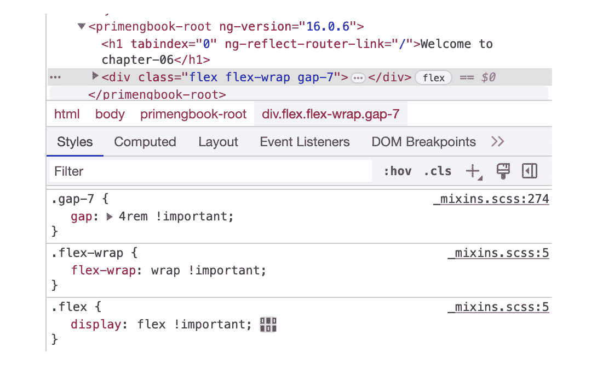

图 6.1 – PrimeFlex 类示例

你可以观察到实用类映射到它们各自的 CSS 样式，例如，从 `flex` 到 `display:` `flex !important;`。

这里有一些与布局（`Flexbox` 和 `Grid`）和文本相关的实用类示例：

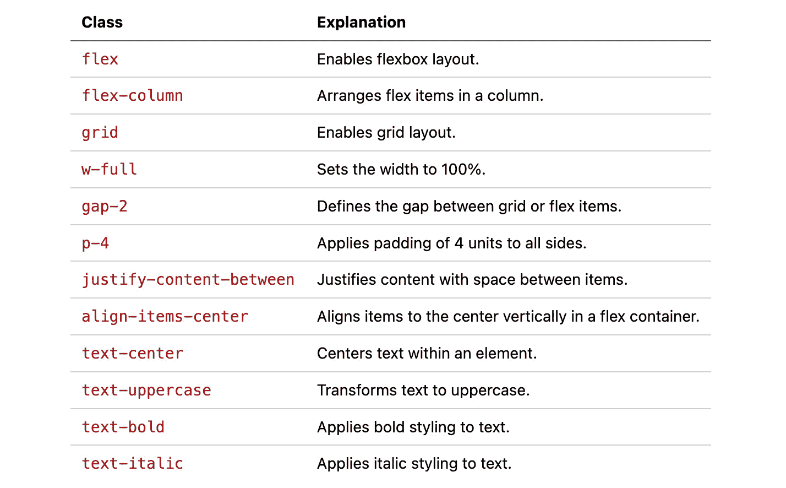

图 6.2 – 常见 PrimeFlex 实用类

这些类是 PrimeFlex 对 CSS 的实用优先方法的一部分，为你提供了一组可重用的类，这些类封装了常见的布局和文本样式模式。通过使用这些类，你可以快速构建复杂的布局并应用文本样式，而无需编写自定义 CSS 代码，从而实现更高效和可维护的开发过程。有关完整实用类集，请查阅 [`primeflex.org`](https://primeflex.org) 的文档。

## 在 PrimeFlex 中使用 Flexbox

PrimeFlex 提供了一个强大且多功能的 **Flexbox** 实用系统，允许你创建灵活和响应式的布局。使用 Flexbox，你可以轻松地在容器内分配和排列元素，使其成为构建现代和动态用户界面的优秀工具。

### 创建弹性容器

要创建 Flexbox 布局，你需要指定一个容器元素作为弹性容器。通过将 `flex` 类应用于容器，你可以启用 Flexbox 行为，允许子元素成为弹性项：

```js
<div class="flex">
   <div class="text-center p-3 bg-primary">Flex Item 1</div>
   <div class="text-center p-3 bg-primary">Flex Item 2</div>
   <div class="text-center p-3 bg-primary">Flex Item 3</div>
</div>
```

在前面的代码示例中，`flex` 类被应用于容器元素，这使得它成为一个弹性容器。容器内的子元素自动成为弹性项。

这是 *图 6**.3* 的基本代码，你将在后面看到。

### 应用弹性方向

Flexbox 还提供了四种主要方向来在弹性容器内排列弹性项：`row`、`row-reverse`、`column` 和 `column-reverse`。方向是通过将以下类之一应用于弹性容器来确定的：

+   `flex-row`: 项目从左到右以行形式排列

+   `flex-row-reverse`: 项目从右到左以行形式排列

+   `flex-column`: 项目从上到下以列的形式排列

+   `flex-column-reverse`: 项目从下到上以列的形式排列

这是一个我们如何创建具有不同布局的弹性容器的示例：

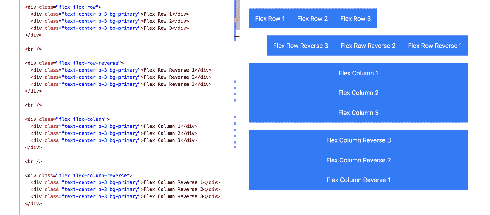

图 6.3 – PrimeFlex Flexbox 示例

在这个示例中，我们通过轻松地应用不同的类，在行或列中创建多样化的布局，从而利用 Flexbox 的力量。

注意

要了解更多关于 Flexbox 及如何调试的信息，您可以访问 [`developer.chrome.com/docs/devtools/css/flexbox/`](https://developer.chrome.com/docs/devtools/css/flexbox/)。这是一个有用的资源，它提供了关于理解 Flexbox 和解决您可能遇到的问题的见解和指导。

### 使用 flex wrap

默认情况下，弹性项目会尝试适应单行。然而，如果空间不足，弹性项目会缩小以适应。要控制弹性项目的换行行为，可以使用以下类：

+   `flex-wrap`: 如果需要，项目将换行到多行

+   `flex-wrap-reverse`: 如果需要，项目将按相反顺序换行到多行

+   `flex-nowrap`: 项目保持在单行上

让我们将换行功能应用到我们的弹性容器中：

```js
<div class="flex flex-wrap">
   ...
</div>
```

在此示例中，弹性容器应用了 `flex-wrap` 类，允许弹性项目在需要时换行。

### 使用 justify content

Flexbox 提供了强大的对齐选项，用于在主轴和交叉轴上定位弹性项目。PrimeFlex 提供了各种类来控制对齐：

+   `justify-content-end`: 这会将弹性项目沿主轴对齐到弹性容器的末尾

+   `justify-content-center`: 这会将弹性项目沿弹性容器的主轴居中

+   `justify-content-between`: 这将在主轴上均匀分布弹性项目，并在它们之间留有相等的空间

+   `justify-content-around`: 这将在主轴上均匀分布弹性项目，并在它们周围留有相等的空间

+   `justify-content-evenly`: 这将在主轴上均匀分布弹性项目，并在它们之间留有相等的空间，包括第一个项目之前和最后一个项目之后

这些对齐类可以应用于弹性容器或单个弹性项目：

```js
<div class="flex flex-wrap justify-content-evenly">
   ...
</div>
```

在此先前的示例中，弹性容器应用了 `justify-content-evenly` 类，它将弹性项目均匀分布，并在它们周围留有相等的空间。`flex-wrap` 类允许项目在需要时换行。

考虑到所有的 Flexbox 代码，让我们看看结果：

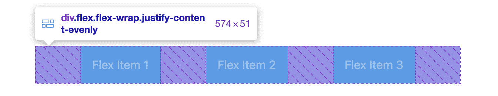

图 6.4 – Flexbox 示例

您可以看到元素是一个弹性容器，如果需要，弹性项目会换行。弹性项目沿主轴均匀分布，它们之间以及容器的开始和结束处都有相等的空间。

### 使用 PrimeFlex 中的网格系统

PrimeFlex 中的网格系统是构建复杂布局的另一个强大功能，它提供了简单直观的语法来构建网格和排列页面上的元素。

PrimeFlex 网格遵循 12 列结构。每一行由一个容器组成，该容器包含一个或多个列。行内的列会根据可用空间自动调整其宽度。

要创建一个网格布局，您需要将内容包裹在一个带有 `grid` 类的容器元素中。在容器内部，您可以使用 `col` 类来定义列。列是通过添加 `col-{size}` 类来指定的，其中 `{size}` 代表元素应跨越的列数。

这里是一个具有两列的基本网格结构的示例：

```js
<div class="grid">
   <div class="col-6">
         <div class="text-center p-3 bg-primary">6</div>
   </div>
   <div class="col-6">
         <div class="text-center p-3 bg-primary">6</div>
   </div>
   <div class="col-6">
         <div class="text-center p-3 bg-primary">6</div>
   </div>
   <div class="col-6">
         <div class="text-center p-3 bg-primary">6</div>
   </div>
</div>
```

在这个示例中，我们有一个包含两列的网格容器。每个列跨越六列，从而形成两个等宽的列。以下是结果：

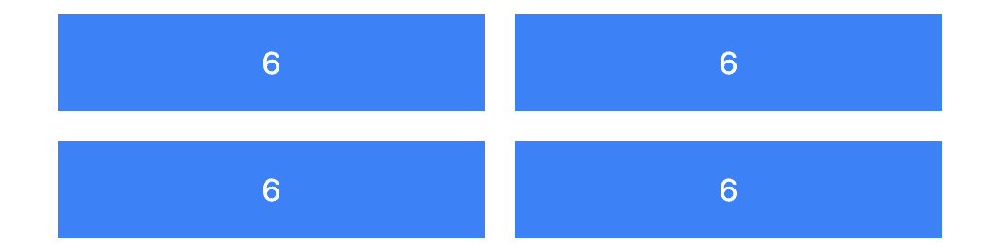

图 6.5 – PrimeFlex 网格示例

PrimeFlex 网格还提供了响应式类，允许您为不同的屏幕尺寸创建不同的布局。您可以使用以下语法根据屏幕断点指定不同的列大小：

+   `sm`：小屏幕（576px 及以上）

+   `md`：中等屏幕（768px 及以上）

+   `lg`：大屏幕（992px 及以上）

+   `xl`：超大屏幕（1200px 及以上）

让我们使用断点来创建响应式布局：

```js
<div class="grid">
   <div class="col-12 md:col-6 lg:col-3">
      <div class="text-center p-3 bg-primary">6</div>
   </div>
   ...
</div>
```

在这个示例中，我们有一个包含两列的网格容器。默认情况下，在小型屏幕上（12 列），每个列宽度为全宽，在中等屏幕上（六列）宽度为半宽，在大屏幕上（四列）宽度为三分之一。

PrimeFlex 是一个对网页开发者非常有价值的工具，它提供了一种简化的 CSS 样式方法。它与 PrimeNG 的集成增强了开发体验，提供了一致且灵活的设计系统。在下一节中，我们将介绍 PrimeNG 数据显示组件。

# 介绍数据显示组件

正如我们所知，数据是任何应用程序的生命线，但原始数据本身并不很有用。真正重要的是我们如何向用户展示这些数据。这正是数据显示组件发挥作用的地方。它们是将原始数据转换为有意义信息的工具，为用户提供洞察力，并使他们能够与数据互动。

PrimeNG 提供了各种数据显示组件。这些组件旨在以清晰、简洁和用户友好的方式展示数据。它们包括数据表、列表、卡片等等。每个组件都有其优势和用例，共同提供了一个全面的数据显示工具包。没有这些组件，用户将面临难以解释和分析的原始数据。这可能导致错误、误解和不良决策。

让我们看看以下 PrimeNG 数据显示组件及其使用场景：

+   **数据表**，例如，非常适合以结构化格式显示大量数据。它们支持排序、过滤和分页等功能，使用户能够轻松导航和与数据互动。

+   另一方面，**列表**非常适合以简单直接的方式显示一系列项目。它们非常灵活，可以用于各种用例，从简单的文本项列表到具有自定义布局的复杂列表。

+   **卡片**是数据展示的另一个强大工具。它们以灵活和可扩展的格式展示相关信息的集合，是一种很好的展示方式。卡片可以包含任何类型的内容，从文本和图像到按钮和链接，并且可以以各种方式排列，以创建视觉上吸引人的布局。

在接下来的章节中，我们将更深入地探讨这些组件，探讨如何在您的 Angular 应用程序中使用它们。我们将提供代码示例来说明它们的用法，并讨论每个组件可用的各种选项和配置。

注意

记住，有效数据展示的关键不仅在于选择正确的组件，还在于正确地使用它们。这关乎理解数据，知道哪些信息对用户来说很重要，并以易于理解和交互的方式呈现。

# 与数据表格组件一起工作

深入数据展示的世界，我们发现周围环绕着众多组件，每个组件都有其独特的特性和功能。在这些组件中，PrimeNG 表格因其多功能性和强大的功能而脱颖而出，可以将原始数据转换为有意义的、交互式的和视觉上吸引人的信息。

要在您的 Angular 项目中使用 PrimeNG 表格，您首先需要从 PrimeNG 中导入 `TableModule`。您可以通过将以下 `import` 语句添加到您的模块文件中来实现这一点：

```js
import { TableModule } from 'primeng/table'
```

本节将探讨 PrimeNG 表格的各种功能和特性，为您提供实际示例和见解，帮助您在应用程序中充分利用其全部潜力。在以下示例中，我们将使用示例产品数据。以下是 `Product` 的界面：

```js
interface Product {
   id: number
   name: string
   price: number
   description: string
   quantity: number
   rating: number
   category: string
}
```

那么，让我们开始学习表格。

## 创建基本表格

PrimeNG 表格需要一组数据来显示，以及定义如何表示这些数据的列组件。以下是一个简单的示例：

```js
<p-table
   [value]="products"
   [tableStyle]="{ 'min-width': '50rem' }"
>
      <ng-template pTemplate="header">
            <tr>
                  <th>ID</th>
                  <th>Name</th>
                  <th>Category</th>
                  <th>Quantity</th>
            </tr>
      </ng-template>
      <ng-template pTemplate="body" let-product>
            <tr>
                  <td>{{ product.id }}</td>
                  <td>{{ product.name }}</td>
                  <td>{{ product.category }}</td>
                  <td>{{ product.quantity }}</td>
            </tr>
      </ng-template>
</p-table>
```

让我们分解代码片段：

+   `<p-table>`: 这是 PrimeNG 表格组件，用于显示表格数据。

+   `[value]="products"`: 这个属性绑定将 `products` 属性绑定到 `p-table` 组件的 `value` 属性。这意味着组件代码中的 `products` 变量是表格的数据源。

+   `[tableStyle]="{ 'min-width': '50rem' }"`: 这个属性绑定将内联 CSS 样式对象绑定到 `p-table` 组件的 `tableStyle` 属性。提供的样式对象将表格的最小宽度设置为 `50rem`。

+   `<ng-template pTemplate="header">`: 这是一个表格表头行的模板。它定义了列标题。在这种情况下，表格有四列：`ID`、`Name`、`Category` 和 `Quantity`。

+   `<ng-template pTemplate="body" let-product>`：这是一个表格主体的模板。它定义了数据每一行应该如何显示。`let-product` 语法用于创建一个局部模板变量 product，它保存了每一行的当前产品对象。

+   在身体模板内部，我们为每一行有一个 `<tr>` 元素，并为每一行中的每个单元格有一个 `<td>` 元素。`{{ product.id }}`、`{{ product.name }}`、`{{ product.category }}` 和 `{{ product.quantity }}` 表达式用于将当前产品对象的属性绑定到单元格中。

之后，我们将有一个基本的表格，如下所示：

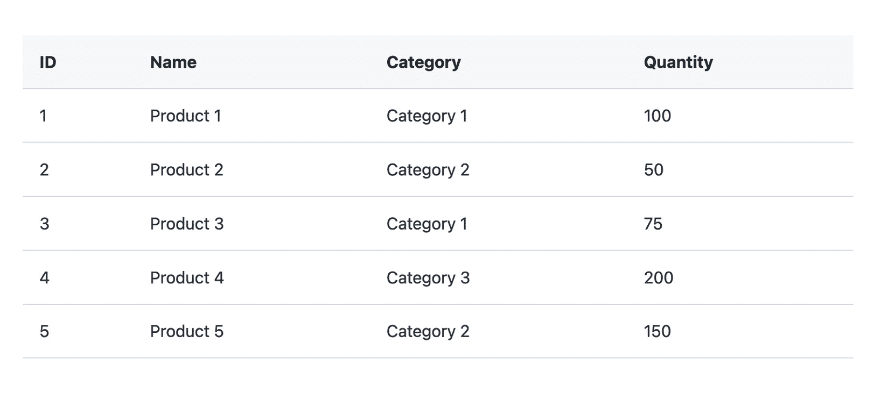

图 6.6 – 基本表格

## 带动态列的表格

可以使用 `*ngFor` 指令动态定义列。这在您的数据结构事先未知或可以动态变化时特别有用。下面是如何做到这一点的方法：

```js
cols = [
   { field: 'id', header: 'ID' },
   { field: 'name', header: 'Name' },
   { field: 'category', header: 'Category' },
   { field: 'quantity', header: 'Quantity' },
]
...
<p-table
    [columns]="cols"
    [value]="products"
    [tableStyle]="{ 'min-width': '50rem' }"
>
      <ng-template pTemplate="header" let-columns>
            <tr>
                  <th *ngFor="let col of columns">
                        {{ col.header }}
                  </th>
            </tr>
      </ng-template>
      <ng-template pTemplate="body" let-rowData let-columns="columns">
            <tr>
                  <td *ngFor="let col of columns">
                        {{ rowData[col.field] }}
                  </td>
            </tr>
      </ng-template>
</p-table>
```

在这个例子中，`columns` 属性绑定到 `cols` 数组，该数组包含列的定义。每一列都是一个对象，具有 `header` 属性（列标题）和 `field` 属性（绑定到数据对象的属性）。由于表格数据是在组件中定义的，因此可以为用户提供选择要显示的列、重新排序列或动态向表格中添加或删除列的选项。

## 带排序的表格

排序是数据展示的基本方面，允许用户以对特定任务有意义的方式对数据进行排序。PrimeNG 为表格中的数据排序提供了内置功能。

下面是如何在 PrimeNG 表格组件中启用排序的示例：

```js
<p-table [value]="products">
      <ng-template pTemplate="header">
            <tr>
                  <th pSortableColumn="name">Name
                        <p-sortIcon field="name"></p-sortIcon>
                  </th>
                  <th pSortableColumn="price">Price
                        <p-sortIcon field="price"></p-sortIcon>
                  </th>
            </tr>
      </ng-template>
      <ng-template pTemplate="body" let-product>
            <tr>
                  <td>{{ product.name }}</td>
                  <td>{{ product.price }}</td>
            </tr>
      </ng-template>
</p-table>
```

在这个例子中，使用 `pSortableColumn` 指令指定当点击列标题时应按哪个字段排序数据。使用 `p-sortIcon` 组件显示表示排序顺序的图标。

默认情况下，点击列标题一次将按升序排序数据。再次点击它将按降序排序数据。让我们看看结果：

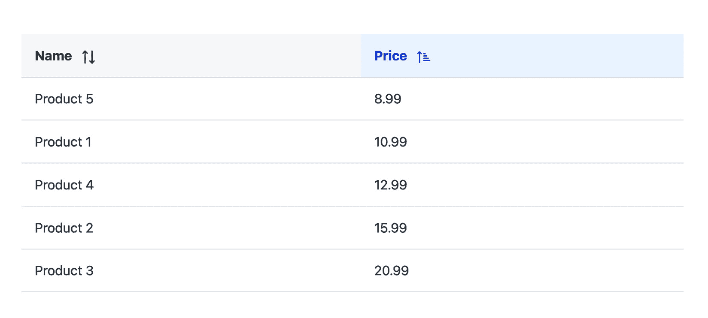

图 6.7 – 带排序的表格

您可以看到，在截图上，点击 **价格** 标题后，表格按价格升序排序。

## 带过滤的表格

过滤是另一个强大的功能，允许用户根据特定标准缩小表格中显示的数据。同样，PrimeNG 为此提供了内置功能。

要为列启用过滤，您需要向表格中的列定义添加一些自定义模板。以下是如何做到这一点的示例：

```js
<p-table
    [value]="products"
    [globalFilterFields]="['name', 'price']"
    #dt
>
   <ng-template pTemplate="caption">
      <div class="flex">
         <button pButton label="Clear" class="p-button-outlined"
            icon="pi pi-filter-slash" (click)="dt.clear()"
         ></button>
         <span class="p-input-icon-left ml-auto">
            <i class="pi pi-search"></i>
            <input pInputText type="text" placeholder="Search keyword"
               (input)="dt.filterGlobal($event.target.value, 'contains')"            />
         </span>
      </div>
   </ng-template>
   <ng-template pTemplate="header">
      <tr>
         <th>
            <input pInputText type="text" placeholder="Search by name"
               (input)="dt.filter($event.target.value, 'name', 'contains')"
          />
         </th>
         <th>
            <input pInputText type="text" placeholder="Search by price"
               (input)="dt.filter($event.target.value, 'price', 'equals')"
            />
         </th>
      </tr>
   </ng-template>
   <ng-template pTemplate="body" let-product>
      <tr>
         <td>{{ product.name }}</td>
         <td>{{ product.price }}</td>
      </tr>
   </ng-template>
   <ng-template pTemplate="emptymessage">
      <tr>
         <td colspan="7">No products found.</td>
      </tr>
   </ng-template>
</p-table>
```

之前的代码是一个具有列和全局过滤功能的 PrimeNG 表格的示例。让我们分解一下：

+   `<p-table>` 是一个 PrimeNG 表格组件，用于显示表格数据。

+   `[value]="products"` 是一个属性绑定，将 `products` 属性绑定到 `<p-table>` 组件的 `value` 属性上。这意味着组件代码中的 `products` 变量是表格的数据源。

+   `[globalFilterFields]="['name', 'price']"` 属性绑定将字段名数组（`name` 和 `price`）绑定到 `<p-table>` 组件的 `globalFilterFields` 属性上。`globalFilterFields` 属性允许你指定要应用全局过滤器的字段/列。在这种情况下，全局过滤器将应用于表格的 `name` 和 `price` 字段。

+   `#dt` 是一个名为 `dt` 的模板引用变量，它被分配给 `<p-table>` 组件。模板引用变量允许你在模板代码中引用组件，并在需要时访问其属性和方法。

+   `<ng-template pTemplate="caption">` 模板包含一个清除所有过滤器的按钮和一个用于全局搜索的输入字段。当按钮被点击时，会调用 `dt.clear()` 方法来清除所有过滤器。当用户在全局搜索输入字段中输入时，会调用 `dt.filterGlobal()` 方法来根据输入值过滤所有行。

+   `<ng-template pTemplate="header">` 模板包含每个列的输入字段。当用户在这些输入字段中输入时，会调用 `dt.filter()` 方法来根据对应列的输入值过滤行。

+   `<ng-template pTemplate="body" let-product>` 模板定义了如何显示每一行数据。`let-product` 语法用于创建一个局部模板变量 `product`，它为每一行持有当前的产品对象。

+   当没有行可供显示时，会显示 `<ng-template pTemplate="emptymessage">` 模板，这可能是因为 `products` 数组为空，或者没有行匹配当前的过滤器。

让我们看看最终的结果：

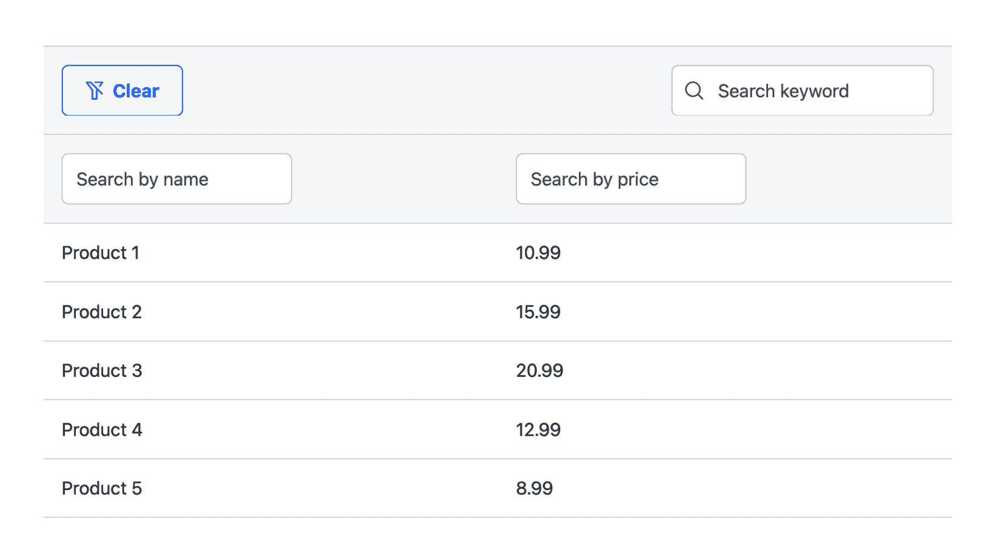

图 6.8 – 带过滤的表格

例如，用户可以通过在列标题或全局搜索输入字段中的输入字段中输入来过滤行。用户还可以通过点击 **清除** 按钮来清除所有过滤器。

## 带有分页器的表格

当处理大量数据集时，一次性显示所有数据可能会让人感到不知所措且不切实际。**分页**是解决这个问题的常见方法，它允许用户一次查看数据的一个子集。PrimeNG 的表格组件内置了分页器，这使得实现此功能变得非常简单。

要在 PrimeNG 表格中启用分页，你只需将 `paginator` 属性设置为 `true` 并定义 `rows` 属性来指定每页的行数：

```js
<p-table
   [value]="products"
   [paginator]="true"
   [rowsPerPageOptions]="[5,10,20]"
   [rows]="10"
   >
   <!-- Table content -->
</p-table>
```

让我们逐一查看每个属性及其用途：

+   `[value]="products"`：这会将表格的值绑定到一个名为 `products` 的变量上。

+   `[paginator]="true"`：这启用了表格的分页功能。

+   `[rowsPerPageOptions]="[5,10,20]"`: 这定义了每页显示行数的选项。在这种情况下，选项设置为`5`、`10`和`20`。用户可以选择这些选项之一来控制表格中显示的行数。

+   `[rows]="10"`: 这设置了每页显示的行数。在这种情况下，它设置为`10`。这意味着表格的每一页将显示最多 10 行。

让我们看看启用了分页器功能的表格：

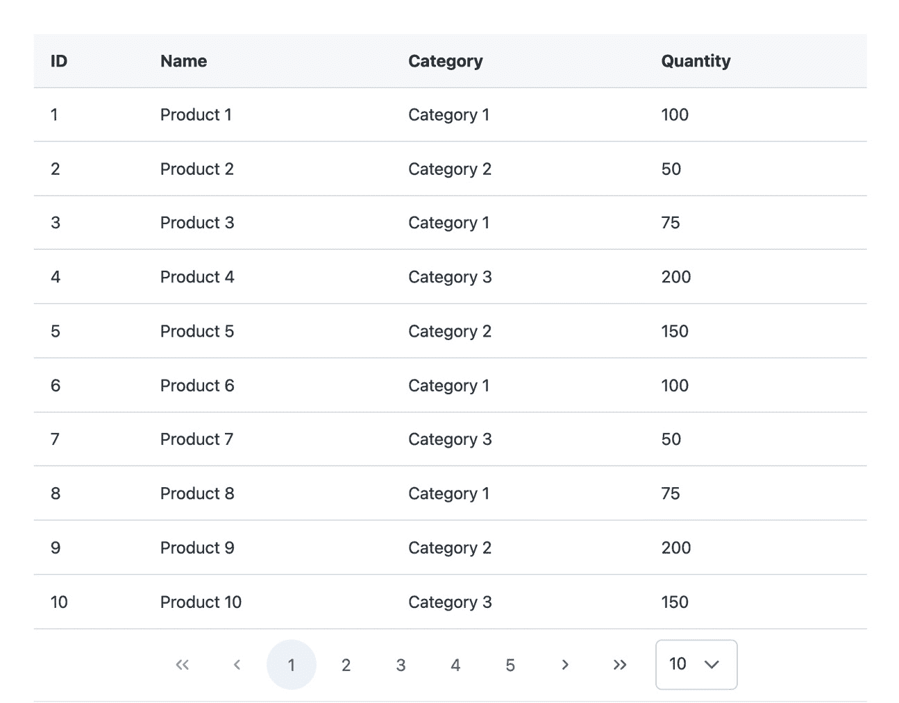

图 6.9 – 带有分页器的表格

此截图展示了选择要显示的行数的选项，默认值设置为`10`。此外，分页器功能允许在不同页面之间无缝导航。

总结来说，PrimeNG 的表格组件提供了一个强大且灵活的解决方案，用于显示表格数据。具有排序、过滤和分页等功能，为开发者提供了以有组织和交互方式展示数据的工具。

注意

要了解更多关于表格组件以及探索其他功能，例如可伸缩的列、冻结列和可滚动的表格，您可以访问 PrimeNG 文档网站 [`primeng.org/table`](https://primeng.org/table)。

接下来，我们将探讨网络应用程序中数据展示的另一个重要方面：PrimeNG 的列表组件，它提供了一套多样化的工具，用于显示和与数据列表互动。

# 与列表组件一起工作

PrimeNG 提供各种列表组件，以满足不同的需求和用例。这些组件旨在将原始数据转换为有意义的列表，为用户提供直观的方式与信息互动。

PrimeNG 的列表组件包括几个关键元素，可用于创建多样化的列表展示：

+   `DataView`: 此元素提供网格和列表视图来显示数据，并具有排序和过滤选项

+   `OrderList`: 此元素允许用户在列表中对项目进行重新排序

+   `PickList`: 此元素允许用户从列表中选择项目并将它们移动到另一个列表

这些组件不仅关乎数据的显示；它们还提供排序、过滤和选择等功能，增强了用户与数据互动的能力。让我们更详细地看看每一个。

## DataView

`DataView`是一个多功能的组件，特别适用于您需要以结构化方式展示大量数据时。它提供了各种功能，如分页、排序和可定制的模板，使其成为构建数据驱动应用程序的绝佳选择。

在以下场景中，您可能需要考虑使用 PrimeNG 的`DataView`组件：

+   `DataView`组件可以帮助您高效地实现这一点

+   `DataView`组件可以用于以网格或列表格式显示结果，并提供分页和排序选项

+   `DataView`可用于在各个小部件中一致地展示数据，提供连贯的用户体验

在以下子节中，让我们考虑一个示例，其中我们有一个产品集合，我们希望使用`DataView`组件来显示。每个产品都有名称、类别和价格等属性。我们将以列表布局展示产品，使用户能够浏览它们并将项目添加到购物车中。

### 创建基本数据视图

在使用`DataView`组件之前，确保在您的应用程序中安装了 PrimeFlex 非常重要。这是必要的，因为`DataView`依赖于 PrimeFlex 提供的`Grid`功能来有效地组织和展示数据。有关安装 PrimeFlex 的详细说明，请参阅本章前面的部分。

要开始，我们需要从 PrimeNG 库中导入必要的模块：

```js
import { DataViewModule } from 'primeng/dataview'
```

一旦我们安装并导入了依赖项，我们就可以在我们的 Angular 模板中使用`DataView`组件。以下是我们如何以列表布局显示产品的示例：

```js
<p-dataView [value]="products">
   <ng-template pTemplate="list" let-products>
      <div class="col-12" *ngFor="let product of products">
         <div class="flex flex-column xl:flex-row xl:align-items-start p-4 gap-4">
            <div class="flex flex-column sm:flex-row justify-content-between align-items-center xl:align-items-start flex-1 gap-4">
                  <div class="flex flex-column align-items-center sm:align-items-start gap-3">
                        <div class="text-2xl font-bold text-900">{{ product.name }}</div>
                        <div class="flex align-items-center gap-3">
                              <span class="flex align-items-center gap-2">
                                    <i class="pi pi-tag"></i>
                                    <span class="font-semibold">{{ product.category }}</span>
                              </span>
                        </div>
                  </div>
                  <div class="flex sm:flex-column align-items-center sm:align-items-end gap-3 sm:gap-2">
                        <span class="text-2xl font-semibold">{{'$'+ product.price }}</span>
                        <button pButton icon="pi pi-shopping-cart" class="md:align-self-end mb-2 p-button-rounded" ></button>
                  </div>
            </div>
            </div>
         </div>
   </ng-template>
</p-dataView>
```

以下是代码分解：

+   `<p-dataView>`：这是 PrimeNG 库中的 Angular 组件，用于在视图中显示数据。

+   `[value]="products"`：此属性绑定将组件代码中的`products`属性绑定到`<p-dataView>`组件的`value`属性。这意味着组件代码中的`products`变量是数据视图的数据源。

+   `<ng-template pTemplate="list" let-products>`：此模板渲染数据视图中的每个项目。`pTemplate`属性值为`"list"`表示此模板用于列表项。`let-products`属性声明了一个名为`products`的局部变量，它代表数据视图中的`products`数组。

因此，我们创建了一个包含三个项目的产品列表：

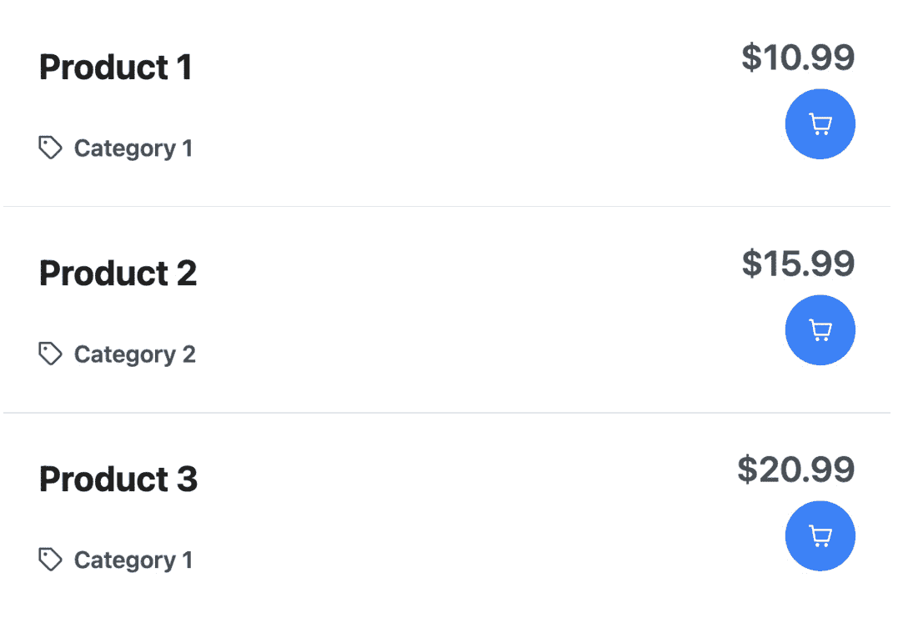

图 6.10 – 基本数据视图

### 带分页的 DataView

如果您有大量产品并希望将它们显示在多个页面上，您可以在`DataView`组件中启用分页。以下是如何启用具有特定每页行数的分页的示例：

```js
<p-dataView
    [value]="products"
    [rows]="4"
    [paginator]="true"
>
      <!-- DataView template -->
</p-dataView>
```

在这里，我们将`rows`属性设置为`4`，表示我们希望每页显示四个产品。通过将`paginator`属性设置为`true`，`DataView`组件自动添加分页控件，使用户能够浏览页面。

### 带排序的 DataView

`DataView`组件还提供了内置的排序功能，允许用户根据特定标准对数据进行排序。以下是如何启用排序并添加下拉菜单以选择排序选项的示例：

```js
<p-dataView
   [value]="products"
   [rows]="4"
   [paginator]="true"
   [sortField]="sortField"
   [sortOrder]="sortOrder"
   >
   <ng-template pTemplate="header">
      <div class="flex flex-column md:flex-row md:justify-content-between">
         <p-dropdown
            [options]="sortOptions"
            [(ngModel)]="sortKey"
placeholder="Sort By Price"
            (onChange)="onSortChange($event)"
            styleClass="mb-2 md:mb-0"
         />
      </div>
   </ng-template>
   <!-- DataView template -->
</p-dataView>
...
sortOptions = [
   { label: 'Price High to Low', value: '!price' },
   { label: 'Price Low to High', value: 'price' }
];
sortOrder!: number;
sortField!: string;
onSortChange(event: HTMLInputElement) {
   const value = event.value;
   if (value.indexOf('!') === 0) {
      this.sortOrder = -1;
      this.sortField = value.substring(1, value.length);
   } else {
      this.sortOrder = 1;
      this.sortField = value;
   }
}
```

让我们分解代码以了解其功能：

+   `[value]="products"`：此绑定将父组件中的`products`数组绑定到`DataView`组件，该组件将成为显示项的数据源。

+   `[rows]="4"`: 如果启用了分页，这将设置每页显示的行数。

+   `[paginator]="true"`: 这启用了 `DataView` 组件的分页功能。

+   `[sortField]="sortField"` 和 `[sortOrder]="sortOrder"`: 这些属性用于控制数据的排序；`sortField` 指定按哪个字段排序数据，而 `sortOrder` 指定顺序（升序或降序）。

+   `<p-dropdown ... />`: 这行代码创建了一个下拉列表，其选项由 `sortOptions` 数组定义。当用户选择一个选项时，会调用 `onSortChange` 方法。

+   `sortOptions`: 这个数组定义了下拉列表中可用的排序选项。`value` 字段包含一个表示排序标准的字符串。如果值以 `!` 开头，表示降序。

+   `onSortChange(event: HTMLInputElement)`: 当用户从下拉列表中选择排序选项时，会调用此方法。它解析所选值并相应地设置 `sortOrder` 和 `sortField` 属性。

通过使用这些属性和模板，您可以在 `DataView` 组件中启用排序，并为用户提供无缝的排序体验。在下面的屏幕截图中，您可以看到我们构建了一个每次显示四个项目的产品列表，并按 **价格从低到高** 排序：

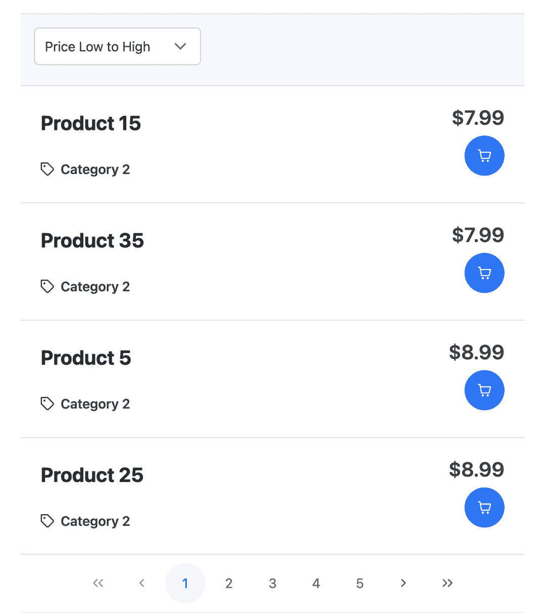

图 6.11 – 带排序和分页的数据视图

到目前为止，我们已经见证了 PrimeNG 的 `DataView` 在提供可适应数据展示方面的出色能力。现在，让我们探索 PrimeNG 的 `OrderList`，这是一个专门组件，为列表管理带来了独特的触感。

## 排序列表

在与项目集合交互时，有时这些项目的顺序很重要。这就是 PrimeNG 的 `OrderList` 发挥作用的地方。`OrderList` 组件是一个强大的工具，它允许您在 Angular 应用程序中管理和排序项目集合。它就像有一个个人助理来帮助您组织数据。

`OrderList` 在您需要为用户提供手动排序项目列表的方式时特别有用，例如在待办事项列表中优先排序任务、重新排列书籍章节、管理播放列表、分类产品或按相册排序照片。

### 创建基本排序列表

让我们通过一个示例来深入了解 `OrderList` 组件如何在应用程序中使用。我们将创建一个用户可以重新排序的产品列表。

`OrderList` 组件利用 Angular CDK 的 `DragDropModule` 来处理拖放操作。确保安装了 `@angular/cdk` 包非常重要。如果没有，我们需要通过以下命令将其添加到我们的 `package.json` 文件中：

```js
npm install @angular/cdk
```

注意

`@angular/cdk`（组件开发工具包或 CDK）库由 Angular 团队提供，提供了一组可重用的组件、指令和实用函数，以简化 Angular 应用程序的开发。CDK 提供了一套工具和构建块，有助于创建一致、可访问和响应式的用户界面。你可以在 [`material.angular.io/cdk`](https://material.angular.io/cdk) 上了解更多关于 CDK 的信息。

然后，我们还需要从 PrimeNG 中导入 `OrderListModule` 到我们的组件：

```js
import { OrderListModule } from 'primeng/orderlist'
```

一旦我们安装并导入了依赖项，我们就可以在我们的 Angular 模板中使用 `OrderList` 组件。以下是我们如何显示顺序列表中的产品的示例：

```js
<p-orderList
         [value]="products"
         [listStyle]="{ 'max-height': '30rem' }"
         header="Products"
>
   <ng-template let-product pTemplate="item">
      <div class="flex flex-column xl:flex-row xl:align-items-start gap-4">
         <div
            class="flex flex-column sm:flex-row justify-content-between align-items-center xl:align-items-start flex-1 gap-4"
         >
            <div
               class="flex flex-column align-items-center sm:align-items-start gap-3"
            >
               <div class="text-xl font-bold text-700">{{ product.name }}</div>
               <div class="flex align-items-center gap-3">
                  <span class="flex align-items-center gap-2">
                     <i class="pi pi-tag"></i>
                     <span class="font-semibold">{{ product.category }}</span>
                  </span>
               </div>
            </div>
            <div
               class="flex sm:flex-column align-items-center sm:align-items-end gap-3 sm:gap-2"
            >
               <span class="text-xl font-semibold">{{
                  '$' + product.price
               }}</span>
               <button
                  pButton
                  icon="pi pi-shopping-cart"
                  class="md:align-self-end mb-2 p-button-rounded"
               ></button>
            </div>
         </div>
      </div>
   </ng-template>
</p-orderList>
```

下面是示例代码的分解：

+   `[value]="products"`：这将我们的产品列表绑定到 `OrderList` 的 `value` 属性。

+   `header="Products"`：这用于设置列表的标题。

+   `[listStyle]="{ 'max-height': '30rem' }"`：这设置了列表的最大高度。

+   `<ng-template let-product pTemplate="item">`：这自定义了列表中每个项目的显示方式。我们可以使用 `let-product` 语法访问当前产品。

现在，在下面的屏幕截图中，你会注意到产品列表被标记为**Products**。此外，你还有能力通过位于左侧面板中的箭头按钮选择产品并在列表中重新定位它：

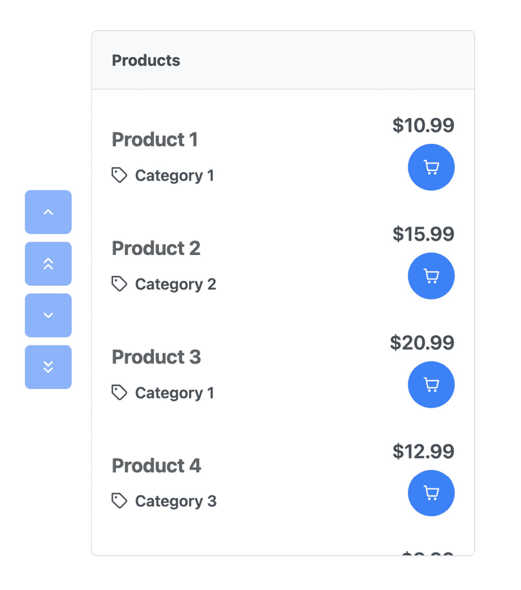

图 6.12 – 基本顺序列表

### 带有过滤的 OrderList

`OrderList` 组件也支持过滤和搜索功能，使用户能够快速在源列表中找到特定的项目。要启用过滤，我们可以使用 `filterBy` 和 `filterPlaceholder` 属性：

```js
<p-orderList
   [value]="products"
   [listStyle]="{ 'max-height': '30rem' }"
   header="Products"
   filterBy="name"
   filterPlaceholder="Filter by name"
>
   <!-- Item template here... -->
</p-orderList>
```

在此示例中，我们将 `filterBy` 属性设置为 `name` 以根据产品名称过滤产品，而 `filterPlaceholder` 属性指定了搜索输入字段的占位符文本。以下是最终结果：

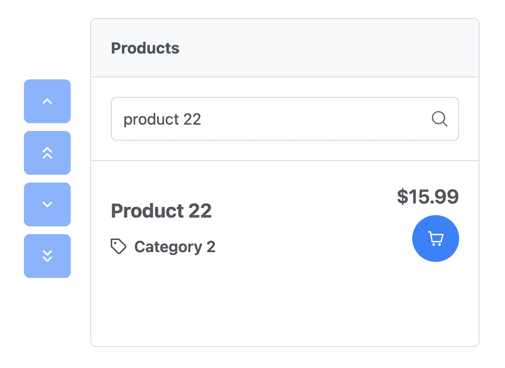

图 6.13 – 带有过滤的顺序列表

如屏幕截图所示，我们可以在搜索框中输入产品名称或产品名称来过滤和搜索**产品 22**。

### 带有拖放的 OrderList

`OrderList` 组件允许用户使用拖放手势重新排序项目。默认情况下，拖放功能是禁用的。要启用它，我们可以使用 `[``dragdrop]` 属性：

```js
<p-orderList
   [value]="products"
   [listStyle]="{ 'max-height': '30rem' }"
   header="Products"
   [dragdrop]="true"
>
<!-- Item template here... -->
</p-orderList>
```

启用拖放允许用户点击并保持对项目的选择，将其拖动到目标列表中的新位置，然后放下以重新排序项目。此功能为用户提供了一种直观的交互方式，根据他们的偏好重新排列项目。

我们发现了 PrimeNG 的 `OrderList` 的动态功能，增强了我们应用程序中的列表交互。现在，让我们将注意力转向 PrimeNG 的 `PickList`，这是一个双列表界面，承诺提供更多的交互性和多功能性。

## PickList

PrimeNG 的`PickList`组件是一个强大的工具，它允许开发者在不同的列表之间重新排序项目时创建交互式和可定制的列表。它提供了一个用户友好的界面，用于以拖放的方式管理和操作数据。无论您需要实现多选功能、构建任务管理系统还是创建自定义表单构建器，`PickList`组件都提供了灵活性和功能性，以满足您的需求。

在以下场景中这可能是有益的：

+   `PickList`组件可用于在源列表中显示可用任务列表，并在目标列表中显示分配的任务列表。用户可以根据其分配状态轻松地在列表之间移动任务。

+   `PickList` 组件可以帮助组织表单元素。您可以在源列表中显示所有可用字段，并将选定的字段移动到目标列表中，以定义表单结构。这提供了一种方便的方式，根据用户偏好动态生成表单。

+   `PickList` 组件可以通过允许用户将选定的产品移动到目标列表（代表他们的定制目录）来简化此过程。

通过利用`PickList`组件，您可以增强用户体验，改进数据组织，并在您的应用程序中实现高效的数据操作。

让我们考虑一个例子，其中我们有一个产品列表，并希望允许用户使用 PrimeNG 的`PickList`组件将选定的产品添加到他们的购物车中。要开始，我们需要从 PrimeNG 库中导入必要的模块：

```js
import { PickListModule } from 'primeng/picklist'
```

一旦我们安装并导入了依赖项，我们就可以在我们的 Angular 模板中使用`PickList`组件。以下是我们如何以选择列表布局显示产品的示例：

```js
<p-pickList
   [source]="products"
   [target]="selectedProducts"
   sourceHeader="Available Products"
   targetHeader="Selected Products"
   [dragdrop]="true"
   [responsive]="true"
   [sourceStyle]="{ height: '30rem' }"
   [targetStyle]="{ height: '30rem' }"
   breakpoint="1400px"
>
   <ng-template let-product pTemplate="item">
       <!-- Item template here... -->
   </ng-template>
</p-pickList>
```

在此示例中，我们将`products`和`selectedProducts`数组分别传递给`PickList`组件的`source`和`target`属性。我们还使用`sourceHeader`和`targetHeader`属性为源列表和目标列表提供标签。

让我们看看最终结果：

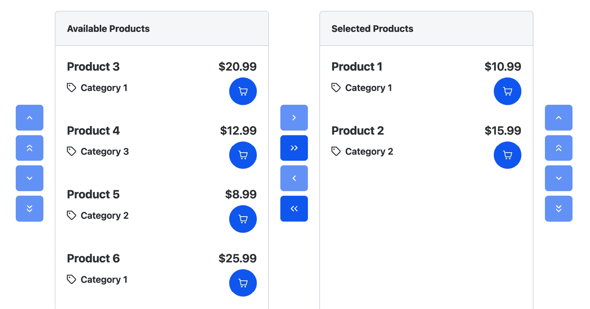

图 6.14 – 示例选择列表

当您运行应用程序时，您应该看到两个列表并排渲染。左侧列表表示可用产品，右侧列表表示选定的产品。用户可以通过使用`PickList`组件提供的拖放功能从源列表中选择产品并将它们移动到目标列表。

总结来说，PrimeNG 的列表组件是一套强大的工具，用于在 Angular 应用程序中显示和交互数据列表。凭借其灵活性、定制选项以及与 Angular 的集成，它们为开发者提供了创建引人入胜且功能齐全的列表展示所需的一切。无论是需要简单的列表还是更复杂的交互，如重新排序和选择，PrimeNG 的列表组件都提供了一种强大的解决方案，可以增强任何应用程序的用户界面。

在下一节中，我们将介绍本章的最后一个组件：PrimeNG 卡片组件。

# 与卡片组件一起工作

PrimeNG 卡片是一个容器组件，它提供了一个灵活且可扩展的内容容器，具有多种变体和选项。它本质上是一个包含内容和关于单一主题的操作的矩形框。将其视为一个将特定信息组合在一起的小型容器。

卡片极其灵活，可以在各种场景中使用：

+   **产品列表**：卡片可以用于在线商店中显示产品，其中每个卡片代表一个带有图片、标题、价格和描述的产品

+   **用户资料**：在社交媒体平台上，卡片可以代表用户资料，展示图片、姓名和其他个人详情

+   **博客文章**：对于博客列表，每个卡片可能显示一篇文章的特色图片、标题和简短摘要

使用卡片可以将内容变得更加易于消化，将信息分解成易于一眼看懂的小块。

让我们深入一个实际例子。假设你正在构建一个在线商店，并希望使用 PrimeNG 的 `Card` 组件来显示产品列表。要开始，我们需要从 PrimeNG 库中导入必要的模块：

```js
import { CardModule } from 'primeng/card'
```

之后，我们添加 PrimeNG 的 `Card` 组件来创建产品列表：

```js
<p-card
     ngFor="let product of products"
   [header]="product.name"
   [style]="{ width: '300px' }"
>
   
   <div class="flex flex-column">
      <p>{{ product.description }}</p>
      <h3>\${{ product.price }}</h3>
      <button pButton type="button" label="Add to Cart"></button>
   </div>
</p-card>
```

这段代码展示了在 Angular 模板中使用 PrimeNG `Card` 组件的用法。让我们分析代码并解释每个部分：

+   `<p-card>`：这是 PrimeNG `Card` 组件的开始，它代表一个单独的卡片元素

+   `*ngFor="let product of products"`：这是一个名为 `ngFor` 的 Angular 结构性指令，用于遍历产品数组并为每个产品生成一张卡片

+   `[header]="product.name"`：这会将 `product.name` 属性绑定到 `Card` 组件的标题输入，从而设置卡片的标题文本

+   `[style]="{ width: '300px' }"`：这会将内联 CSS 样式绑定到 `Card` 组件的样式输入，将卡片的宽度设置为 300 像素

让我们看看最终结果：

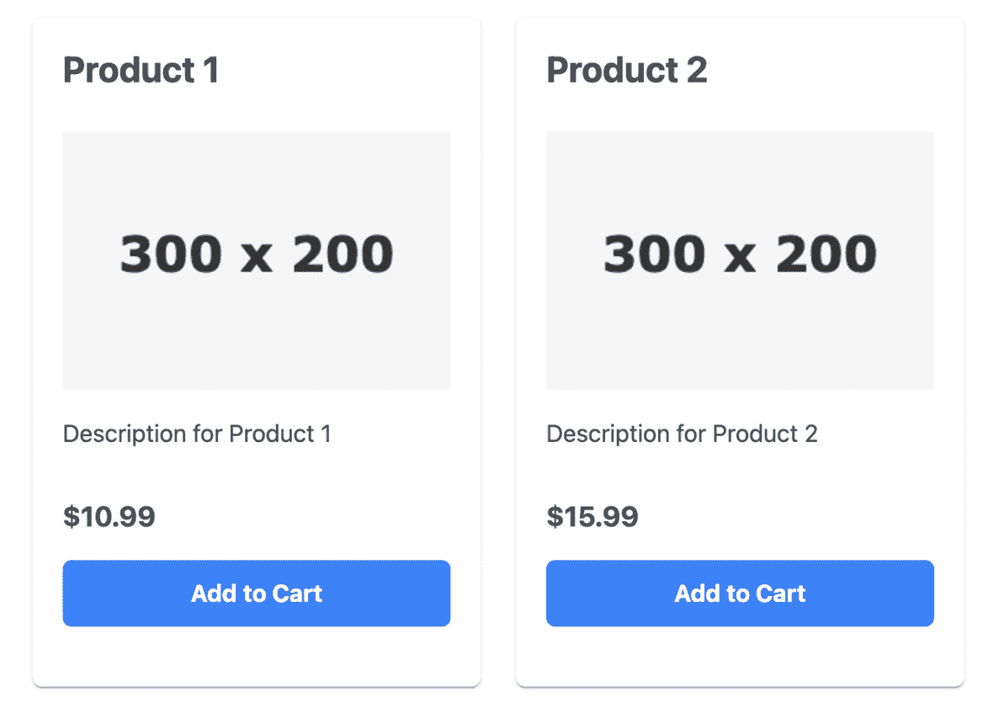

图 6.15 – 卡片示例

在这个例子中，我们正在遍历产品列表并为每个产品创建一张卡片。每个卡片显示产品的图片、描述、价格以及一个“**添加到** **购物车**”按钮。

我们最近学习了 PrimeNG 卡片组件的灵活性和设计特性，这大大提高了我们创建视觉上吸引人的用户界面的能力。现在，对我们来说，回顾和巩固我们的理解非常重要。

# 摘要

在本章中，我们深入探讨了 PrimeNG 的数据显示组件。我们首先理解了这些组件在将原始数据转换为有意义的、用户友好的信息中的作用，并看到了 PrimeNG 丰富的数据显示组件，如表格、列表和卡片，如何被用来在 Angular 应用程序中有效地展示数据。

本章获得的知识至关重要，因为有效的数据展示是构建用户友好应用的关键方面。通过使用 PrimeNG 的数据显示组件，我们可以创建不仅外观美观，而且提供无缝用户体验的应用程序。

但我们的旅程并未结束。展望下一章，我们将深入了解其他 PrimeNG 数据显示组件。我们将学习如何使用`Tree`、`Scroller`、`Timeline`和`VirtualScroller`等组件在我们的 Angular 应用程序中展示数据。

因此，让我们保持势头。我们在理解和使用 PrimeNG 的数据显示组件方面取得了巨大进步。现在，是时候迈出下一步，探索数据操作组件了。让我们继续进入下一章！
