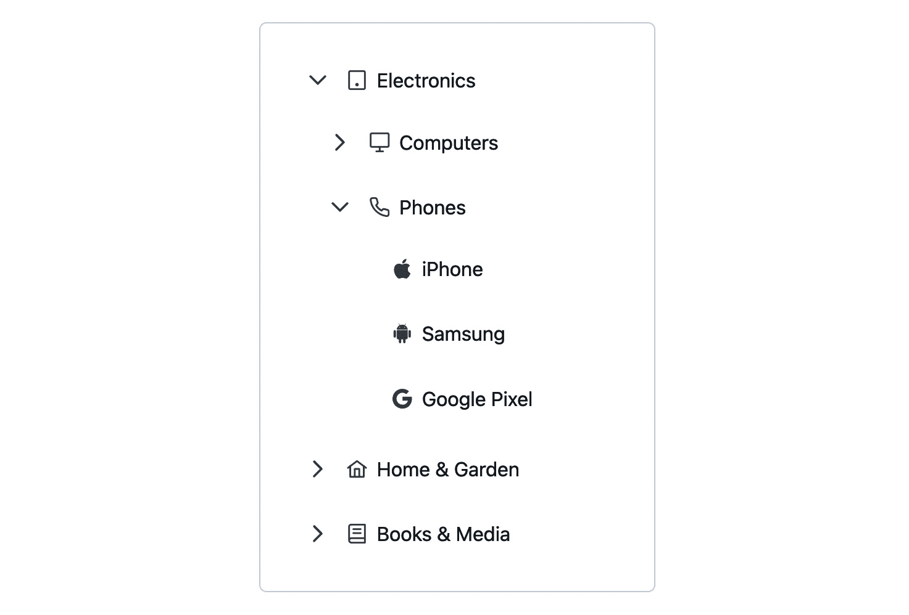
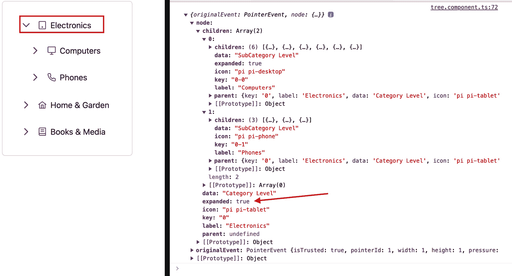
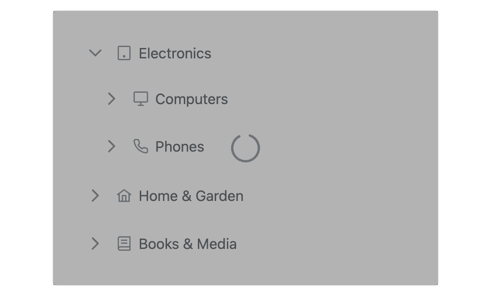
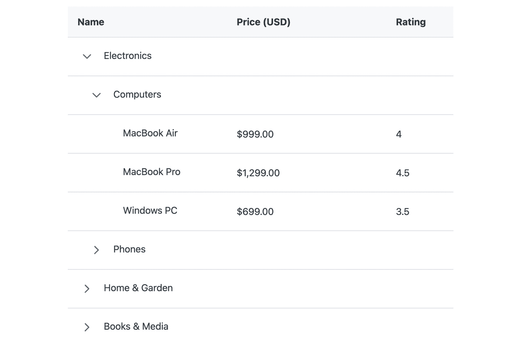
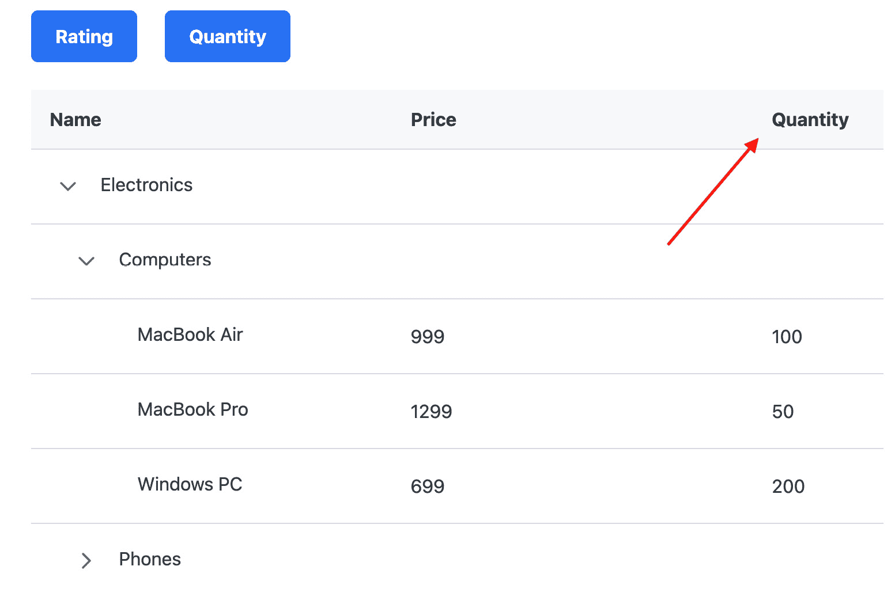
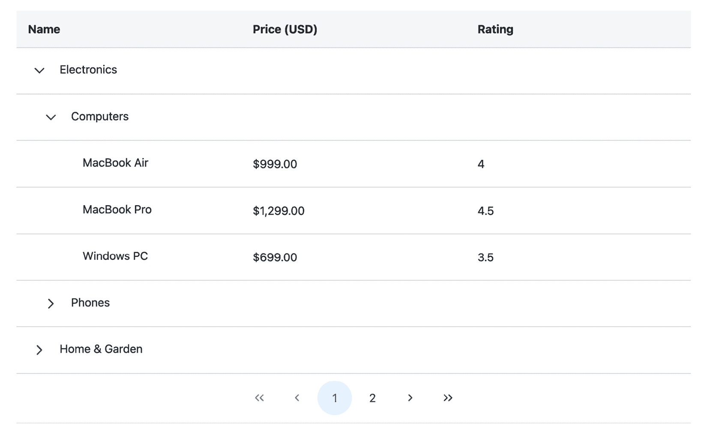
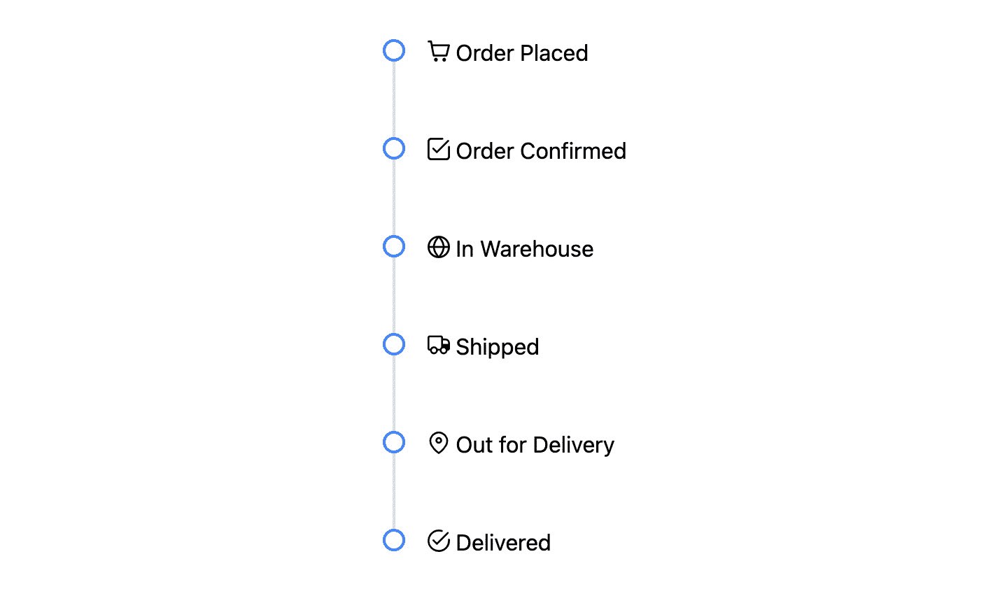
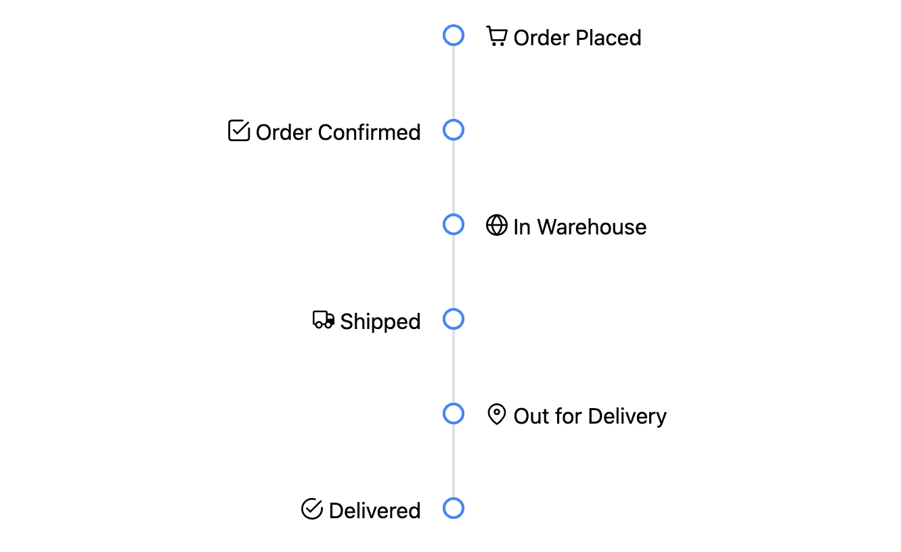
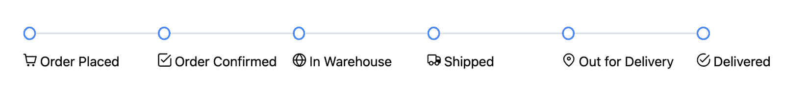

# 7

# 使用 Tree、TreeTable 和 Timeline 组件

应用程序中的数据展示不仅仅是表格、列表和卡片。有时，数据的本质需要更分层或按时间顺序的结构。这就是 `Tree`、`TreeTable` 和 `Timeline` 等组件发挥作用的地方。在本章中，我们将深入探讨这些专用组件，每个组件都提供独特的显示和交互方式，以使用 PrimeNG 在 Angular 应用程序中处理数据。

主要目标是熟悉专门针对特定数据展示需求的 PrimeNG 组件。随着我们进入本章，我们将掌握处理各种数据展示挑战的知识，以及如何在 Angular 应用程序中有效地实现它们。掌握这些组件意味着准备好提供增强用户体验和数据清晰度的解决方案。

在本章中，我们将涵盖以下主题：

+   使用 Tree 组件

+   使用 TreeTable 组件

+   使用 Timeline 组件

# 技术要求

本章包含各种 PrimeNG 显示组件的代码示例。您可以在以下 GitHub 仓库的 `chapter-07` 文件夹中找到相关源代码：[`github.com/PacktPublishing/Next-Level-UI-Development-with-PrimeNG/tree/main/apps/chapter-07`](https://github.com/PacktPublishing/Next-Level-UI-Development-with-PrimeNG/tree/main/apps/chapter-07)。

# 使用 Tree 组件

PrimeNG **Tree** 组件是一个强大的工具，用于以有组织和视觉吸引力的方式显示分层数据，提供一种树状结构，其中数据可以呈现为节点，并且可以展开或折叠以显示或隐藏子节点。

在本节中，我们将探讨使用 PrimeNG `Tree` 组件的各个方面，包括其目的、用法和关键特性。该组件还提供了一系列功能，包括节点展开和折叠、选择模式、数据的懒加载、拖放功能以及上下文菜单支持，我们也将对其进行探讨。

## 何时使用 PrimeNG Tree 组件

PrimeNG 的 `Tree` 组件在需要以分层方式组织和展示数据的情况下特别有用。它通常用于处理类别、文件目录、组织结构以及其他表现出父子关系的任何数据。

例如，让我们考虑一个产品目录应用程序。目录可能包含类别、子类别和按层次结构组织的产品。在这种情况下，PrimeNG `Tree` 组件可以用来直观地表示产品目录，使用户能够浏览类别和子类别，并选择特定的产品。

## 创建基本的 Tree 组件

为了更好地理解如何使用 PrimeNG `Tree` 组件，让我们看一下前一个部分提到的产品目录示例。假设我们为我们的产品有以下层次结构：

```js
- Electronics
   - Computers
      - MacBook Air
      - Smartphone
   - Phones
      - iPhone
      - Samsung
      - Google Pixel
- Home & Garden
   - Outdoor
   - Furniture
   - Office
- Books & Media
   - Books
   - Movies & TV
```

使用 PrimeNG `Tree` 组件，我们可以表示这种层次结构。

要开始使用，我们需要从 PrimeNG 库中导入必要的模块：

```js
import { TreeModule } from 'primeng/tree'
```

一旦安装并导入了依赖项，我们就可以在 Angular 模板中使用 `Tree` 组件。以下是如何以树布局显示产品的示例：

```js
// tree.component.ts
import { TreeNode } from 'primeng/api'
// Html / template
<p-tree [value]="products" />
// TypeScript
products: TreeNode[] = [
   {
      "key": "0",
      "label": "Electronics",
      "data": "Category Level",
      "icon": "pi pi-tablet",
      "children": [
         {
            "key": "0-0",
            "label": "Computers",
            "data": "SubCategory Level",
            "icon": "pi pi-desktop",
            "children": [
               {
                  "key": "0-0-0",
                  "label": "MacBook Air",
                  "data": "Product Level",
                  "icon": "pi pi-apple"
               },
               ...
            ]
         },
         ...
      ]
   }
   ...
]
```

让我们分解一下代码：

+   `<p-tree [value]="products" />`：这表示了 PrimeNG `Tree` 组件的使用。它将 `Tree` 组件的 `value` 属性绑定到 `products` 变量。

+   `Products: TreeNode[]`：这定义了 `products` 变量为 `TreeNode` 对象的数组。`TreeNode` 是 PrimeNG 定义的一种类型，用于在树组件中表示节点。每个 `TreeNode` 对象具有以下属性：

    +   `key`：节点的唯一标识符。

    +   `label`：将显示在节点上的文本。

    +   `data`：与节点相关联的附加数据。在这个例子中，它表示节点的级别（类别级别、子类别级别或产品级别）。

    +   `icon`：与节点相关联的可选图标。

    +   `children`：子节点的数组。此属性允许树具有嵌套结构。

这是一个表示商店的简化树结构的示例。以下是结果：



图 7.1 – 基本树

## 展开和折叠节点

PrimeNG `Tree` 组件的一个基本特性是能够展开和折叠节点。这使用户能够根据兴趣在树中导航，显示或隐藏子节点。

默认情况下，PrimeNG `Tree` 组件以所有节点折叠的状态开始。用户可以通过点击其展开图标来展开一个节点，也可以通过点击其折叠图标来折叠一个节点。

除了用户交互之外，您还可以通过操作节点的状态来以编程方式控制节点的展开和折叠。例如，您可以使用 `expandAll()` 和 `collapseAll()` 方法分别以编程方式展开所有节点或折叠所有节点。

下面是一个演示展开和折叠功能的示例：

```js
// tree.component.ts
<div class="grid gap-2 p-2 mb-2">
   <button
      pButton
      type="button"
      label="Expand all"
      (click)="expandAll()"
   ></button>
   <button
      pButton
      type="button"
      label="Collapse all"
      (click)="collapseAll()"
   ></button>
</div>
<p-tree [value]="products" />
...
expandAll() {
   this.products.forEach((node) => {
      this.expandRecursive(node, true)
   })
}
collapseAll() {
   this.products.forEach((node) => {
      this.expandRecursive(node, false)
   })
}
private expandRecursive(node: TreeNode, isExpand: boolean) {
   node.expanded = isExpand
   if (node.children) {
      node.children.forEach((childNode) => {
         this.expandRecursive(childNode, isExpand)
      })
   }
}
```

在这里，我们向 UI 中添加了两个按钮用于展开和折叠节点。`expandAll()` 和 `collapseAll()` 方法分别绑定到相应按钮的点击事件。当用户点击**展开全部**按钮时，树中的所有节点都将展开，而当点击**折叠全部**按钮时，所有节点都将折叠。

`expandRecursive(...)` 方法是一个私有方法，它递归地展开或折叠树中的节点。它接受一个 `TreeNode` 对象（`node`）和一个布尔值（`isExpand`）作为参数，并将 `node` 的 `expanded` 属性设置为 `isExpand` 的值，从而展开或折叠节点。

点击 **展开** **全部** 按钮的结果如下：


图 7.2 – 带展开和折叠能力的树

## 使用节点选择事件

PrimeNG `Tree` 组件提供了一系列事件和方法，允许你与组件交互并响应用户操作。这些事件和方法使你能够执行诸如处理节点选择、捕获节点展开和折叠事件以及动态加载数据等任务。

在启用节点选择事件之前，我们需要向组件添加 `selectionMode`。有四种选择类型：

+   `<p-tree [value]="products"` `selectionMode="single" />`。

+   `<p-tree [value]="products"` `selectionMode="single"` `[metaKeySelection]="true"/>`。

+   `<p-tree [value]="products"` `selectionMode="multiple" />`。

+   `<p-tree [value]="products"` `selectionMode="checkbox" />`。

在添加节点选择类型后，PrimeNG `Tree` 组件在节点被选择或取消选择时发出事件。你可以使用这些事件根据用户的节点选择执行操作。

要捕获节点选择事件，你可以使用 `(onNodeSelect)` 和 `(onNodeUnselect)` 事件绑定。以下是一个 `single` 选择示例：

```js
// tree.component.ts
<p-tree
      [value]="products"
selectionMode="single"
      (onNodeSelect)="onNodeSelected($event)"
      (onNodeUnselect)="onNodeUnselected($event)"
/>
...
onNodeSelected(event: TreeNodeSelectEvent) {
   console.log(event)
}
onNodeUnselected(event: TreeNodeSelectEvent) {
   console.log(event)
}
```

在代码中，`(onNodeSelect)` 事件绑定到 `onNodeSelected()` 方法，而 `(onNodeUnselect)` 事件绑定到 `onNodeUnselected()` 方法。当节点被选择或取消选择时，这些方法将被调用。

让我们看看选择 **Electronics** 节点时的一个示例事件：



图 7.3 – 带选择事件的树

因此，我们可以看到在选择具有以下详细信息的 `node` 数据后：

+   `expanded: true`：这表示当前节点处于展开状态

+   `parent: undefined`：这表明当前节点没有父节点

+   `data, icon, key, label, children`：这显示了当前节点的现有值

## 使用节点展开和折叠事件

当节点展开或折叠时，PrimeNG `Tree` 组件会发出事件。你可以利用这些事件在用户展开或折叠节点时执行操作。

要捕获节点展开或折叠事件，你可以使用 `(onNodeExpand)` 和 `(onNodeCollapse)` 事件绑定。以下是一个示例：

```js
// tree.component.ts
<p-tree
   [value]="productsWithEvents"
(onNodeExpand)="onNodeExpanded($event)"
   (onNodeCollapse)="onNodeCollapsed($event)"
/>
...
onNodeExpanded(event: TreeNodeSelectEvent) {
   console.log(event)
}
onNodeCollapsed(event: TreeNodeSelectEvent) {
   console.log(event)
}
```

在这里，`(onNodeExpand)` 事件绑定到 `onNodeExpanded()` 方法，而 `(onNodeCollapse)` 事件绑定到 `onNodeCollapsed()` 方法。这些方法将在节点展开或折叠时分别被触发。展开或折叠后的事件值与选择或取消选择节点时的值相同。

## 懒加载的工作方式

PrimeNG 的 `Tree` 组件支持数据的懒加载，这在处理大数据集时非常有用。您不必一次性加载所有节点，而可以在用户展开节点时动态加载节点。

要启用懒加载，您需要使用 `[loading]` 属性和 `(onNodeExpand)` 事件。`[loading]` 属性允许您指示树是否正在加载数据，而 `(onNodeExpand)` 事件在节点展开时触发，允许您动态加载子节点。

这里有一个演示懒加载的例子：

```js
<p-tree
   [loading]="loading"
   [value]="products"
   (onNodeExpand)="loadChildNodes($event)"
/>
...
loading = false
loadChildNodes(event: TreeNodeSelectEvent) {
   if (event.node) {
      this.loading = true
      // example of retrieving child nodes data
      event.node.children = this.nodeService.getChildNodes(event.node)
      this.loading = false
   }
}
```

在前面的代码中，`[loading]` 属性绑定到 Angular 组件中的 `loading` 变量，该变量指示树是否正在加载数据。`(onNodeExpand)` 事件绑定到 `loadChildNodes()` 方法，该方法负责加载展开节点的子节点。以下是结果：



图 7.4 – 带加载的树

注意

应在 Angular 组件中实现 `loadChildNodes()` 方法，以便根据展开的节点动态获取子节点。

在本节中，我们讨论了何时使用 PrimeNG `Tree` 组件，例如在需要按层次组织数据的情况下，如产品目录或文件系统，以及它的各种功能。在下一节中，我们将深入了解 `TreeTable` 组件。

# 与 TreeTable 组件一起工作

当涉及到以表格格式展示层次数据结构时，PrimeNG 的 **TreeTable** 成为了一个强大的工具，它结合了两个世界的最佳之处：树的嵌套结构和表格的有序列。让我们开始一段旅程，更好地理解这个组件，并看看它如何提升我们的数据展示水平。

## 何时使用 PrimeNG TreeTable 组件

PrimeNG 的 `TreeTable` 组件在需要表示具有层次结构的数据的场景中特别有用。它提供了一种直观且用户友好的方式来导航和交互层次数据，使其非常适合处理组织结构、文件系统、产品类别以及其他表现出父子关系的任何数据的应用程序。

`TreeTable` 组件更适合以表格格式展示具有高级交互选项（如排序、过滤和分页）的层次数据，而 `Tree` 组件最适合以紧凑且可折叠的树形结构显示和导航层次数据。

通过利用 `TreeTable` 组件，你可以以结构化和组织的方式展示复杂层次数据，使用户能够展开和折叠节点，执行排序和过滤操作，并以无缝的方式与数据交互。

## 创建一个基本的 TreeTable 组件

假设你有一个产品列表，这些产品被归类在不同的产品系列下。每个产品都有价格、可用性和评分等详细信息。`TreeTable` 组件可以是一个很好的选择来表示这些数据。

要开始，我们需要从 PrimeNG 库中导入必要的模块：

```js
import { TreeTableModule } from 'primeng/treetable'
```

一旦安装并导入了依赖项，我们就可以在我们的 Angular 模板中使用 `TreeTable` 组件。以下是如何在 `TreeTable` 布局中显示产品的示例：

```js
<p-treeTable
   [value]="products"
   [scrollable]="true"
   [tableStyle]="{ 'min-width': '50rem' }"
>
   <ng-template pTemplate="header">
      <tr>
         <th>Name</th>
         <th>Price (USD)</th>
         <th>Rating</th>
      </tr>
   </ng-template>
<ng-template pTemplate="body" let-rowNode let-product="rowData">
      <tr [ttRow]="rowNode">
         <td>
            <p-treeTableToggler [rowNode]="rowNode" />
            {{ product.name }}
         </td>
         <td>{{ product?.price | currency }}</td>
         <td>{{ product?.rating }}</td>
      </tr>
   </ng-template>
</p-treeTable>
...
products: TreeTableNode[] = [
   {
      "key": "0",
      "data": {
         "name": "Electronics"
      },
      "children": [
         {
            "key": "0-0",
            "data": {
               "name": "Computers"
            },
            "children": [
               {
                  "key": "0-0-0",
                  "data": {
                     "id": 1,
                     "name": "MacBook Air",
                     "price": 999,
                     "description": "Light and portable MacBook",
                     "quantity": 100,
                     "rating": 4,
                     "category": "Computers"
                  }
               },
               ...
            ]
         }
      ]
   }
   ...
]
```

让我们分解一下代码：

+   `<p-treeTable>`: 这是 PrimeNG 库中的 Angular 组件，用于以树状结构显示层次表格数据。

+   `[value]="products"`: 此属性绑定将 `products` 属性设置为 `TreeTable` 组件的数据源。组件代码中的 `products` 变量包含一个 `TreeTableNode` 对象数组，代表层次数据结构。

+   `[scrollable]="true"`: 此属性绑定启用 `TreeTable` 组件内的滚动，如果内容超出可用空间。

+   `[tableStyle]="{ 'min-width': '50rem' }"`: 此属性绑定将内联 CSS 样式对象应用于 `<p-treeTable>` 组件的 `tableStyle` 属性。在这种情况下，它将 `TreeTable` 组件的最小宽度设置为 `50rem`。

+   `<ng-template pTemplate="header">`: 此元素定义了一个用于渲染 `TreeTable` 组件的标题行的模板。

+   `<ng-template pTemplate="body" let-rowNode let-product="rowData">`: 此元素定义了一个用于渲染 `TreeTable` 组件的体（行）的模板。此模板还具有两个其他属性：

    +   `let-rowNode`: 这声明了一个名为 `rowNode` 的局部变量，它代表正在渲染的当前行节点

    +   `let-product="rowData"`: 这声明了一个名为 `product` 的局部变量，它代表与当前行关联的数据

+   `<p-treeTableToggler [rowNode]="rowNode" />`: 此组件用于在 `TreeTable` 组件中显示用于展开和折叠子节点的切换按钮。

+   `products: TreeTableNode[]`: 这定义了 `products` 数组作为 `TreeTable` 组件的数据源。`products` 数组由 `TreeTableNode` 对象组成，代表层次数据结构。每个节点都有一个包含产品信息的数据属性，例如 `name`、`price`、`rating` 和 `category`。示例显示了一个嵌套结构，其中包含一个父节点 `Electronics` 和一个子节点 `Computers`，它进一步包含一个具有相应属性的 `MacBook Air` 子节点。

这是一个表示商店的简化 `TreeTable` 结构的示例。以下是结果：



图 7.5 – 基本的 TreeTable 结构

## 使用动态列

`TreeTable` 组件允许我们根据提供的数据或配置动态创建列。而不是在模板中手动定义每个列，我们可以绑定来自组件的列集合，并让`TreeTable`组件动态生成必要的列。这种方法不仅高效，而且提供了高度的灵活性。

让我们考虑一个电子商务应用的例子，该应用以`TreeTable`格式显示产品。该应用需要处理不同的产品类别，每个类别都有自己的属性集。目标是根据所选的产品类别动态渲染列。以下是代码：

```js
<div class="grid gap-4 ml-0 mb-4">
   <button
      (click)="updateColumns('RATING')"
      pButton
      label="Rating"
   ></button>
   <button
      (click)="updateColumns('QUANTITY')"
      pButton
      label="Quantity"
   ></button>
</div>
<p-treeTable
   [value]="products"
   [columns]="cols"
   [scrollable]="true"
   [tableStyle]="{ 'min-width': '50rem' }"
>
   <ng-template pTemplate="header" let-columns>
      <tr>
         <th *ngFor="let col of columns">
            {{ col.header }}
         </th>
      </tr>
   </ng-template>
   <ng-template
      pTemplate="body"
      let-rowNode
      let-product="rowData"
      let-columns="columns"
   >
      <tr>
         <td *ngFor="let col of columns; let i = index">
            <p-treeTableToggler [rowNode]="rowNode" *ngIf="i === 0" />
            {{ product[col.field] }}
         </td>
      </tr>
   </ng-template>
</p-treeTable>
...
cols = [
   { field: 'name', header: 'Name' },
   { field: 'price', header: 'Price' },
   { field: 'rating', header: 'Rating' },
]
updateColumns(option: string) {
   switch (option) {
      case 'RATING':
         this.cols = [
            { field: 'name', header: 'Name' },
            { field: 'price', header: 'Price' },
            { field: 'rating', header: 'Rating' },
         ]
         break
      case 'QUANTITY':
         this.cols = [
            { field: 'name', header: 'Name' },
            { field: 'price', header: 'Price' },
            { field: 'quantity', header: 'Quantity' },
         ]
         break
      default:
         break
   }
}
```

让我们分解一下代码：

+   `<button (click)="updateColumns(...)" >`：这是一个按钮元素，当点击时触发`updateColumns()`方法。

+   `<th *ngFor="let col of columns">{{ col.header }}</th>`：这一行使用`*ngFor`指令遍历`columns`数组并为每个列生成一个`<th>`元素。列的`header`属性作为`header`单元格的内容显示。

+   `<td *ngFor="let col of columns; let i = index">`：这一行使用`*ngFor`指令遍历`columns`数组并为每个列生成一个`<td>`元素。

+   `<p-treeTableToggler [rowNode]="rowNode" *ngIf="i === 0" />`：这个`<p-treeTableToggler>`组件用于在`TreeTable`组件中显示一个切换按钮，用于展开和折叠子节点。

使用这种实现，`TreeTable`将根据所选类型显示适当的产品数据列。让我们看看结果：



图 7.6 – 带有动态列的 TreeTable

如果用户从**评分**类型切换到**数量**类型，表格将自动更新以显示**数量**列而不是**评分**，如图 7.5 所示。

## 启用 TreeTable 分页器

`TreeTable` 组件允许我们将大量数据分解成更小、更易于管理的块或页面。而不是一次性显示数百或数千行，分页器允许用户逐页浏览数据。它提供了移动到下一页或上一页、跳转到开始或结束以及选择页面大小的控件。

我们可以通过添加`paginator`和`rows`属性轻松地在`TreeTable`组件中启用分页器，如下面的代码所示：

```js
<p-treeTable [value]="products" [paginator]="true" [rows]="2">
      <!-- Column templates and other TreeTable configurations go here -->
</p-treeTable>
```

在这个例子中，我们通过设置`[paginator]="true"`并指定每页显示两行来启用分页，`[rows]="2"`。

现在，`TreeTable` 组件将显示分页控件，用户可以逐页浏览产品数据：



图 7.7 – 带分页器的树表

## 相关事件和方法

`TreeTable` 组件提供了各种事件和方法，您可以利用这些来增强您应用程序的功能性和交互性。以下是一些常用的事件和方法：

+   `onNodeExpand`: 当节点被展开时触发此事件

+   `onNodeCollapse`: 当节点折叠时触发此事件

+   `onNodeSelect`: 当选择一个节点时触发此事件

+   `onNodeUnselect`: 当节点被取消选择时触发此事件

您可以使用这些事件和方法根据您应用程序的需求自定义`TreeTable`组件的行为。例如，您可以通过监听`onNodeCollapse`事件在节点折叠时执行某些操作，例如删除详细信息或触发附加操作：

```js
<p-treeTable
[value]="files"
(onNodeCollapse)="handleNodeCollapse($event)"
>
      <!-- Column templates and other TreeTable configurations -->
</p-treeTable>
...
handleNodeCollapse(event: TreeTableNodeCollapseEvent) {
   const collapsedNodeData = event.node.data
   // Handle actions when a node is collapsed
}
```

让我们分解一下代码：

+   `(onNodeCollapse)="handleNodeCollapse($event)"`: 这将 `handleNodeCollapse` 方法绑定到 `TreeTable` 组件中节点折叠时发生的事件。该方法将使用 `event` 对象作为参数被调用。

+   `handleNodeCollapse(event: TreeTableNodeCollapseEvent) { ... }`: 这接受一个 `TreeTableNodeCollapseEvent` 类型的 `event` 对象作为参数。这个 `event` 对象包含了有关折叠节点的信息，您可以使用这些信息来处理事件。

在我们探索 PrimeNG 的 `TreeTable` 组件过程中，我们已经看到了它在以结构化和用户友好的方式呈现层次化数据方面的强大功能。从动态列到高效的分页，`TreeTable` 组件为各种数据表示挑战提供了一个强大的解决方案。现在，让我们将焦点转移到 PrimeNG 的 `Timeline` 组件上，这是一个能够以时间顺序美妙的可视化数据的工具。

# 使用时间线组件

PrimeNG 的 `Timeline` 组件是 Angular 应用程序中由 PrimeNG 库提供的强大组件，它允许您按时间顺序可视化一系列连锁事件。时间轴提供了一种用户友好且交互式的显示事件的方式，使用户更容易理解活动或随时间变化的顺序。

PrimeNG 的 `Timeline` 组件旨在以线性方式呈现事件，使用户能够浏览不同的阶段或里程碑。时间线中的每个事件都由一个标记表示，该标记可以自定义以显示相关信息，例如状态、日期或任何其他有意义的资料。

时序图提供了各种功能来增强用户体验——它支持垂直和水平布局，提供了时序图方向的灵活性，以及对齐选项来定位时序图条相对于内容的位置。

## 当使用 PrimeNG 时序图组件时

PrimeNG 的 `Timeline` 组件可以在各种应用程序和场景中使用。以下是一些 `Timeline` 组件可能有益的示例：

+   **项目管理**：使用时序图来展示项目里程碑，例如项目启动、需求收集、开发阶段和项目完成。这有助于利益相关者和团队成员可视化项目的进度并理解关键事件的顺序。

+   **订单跟踪**：如果您有一个电子商务应用程序，可以利用时序图来显示订单处理的各个阶段，如订单提交、支付验证、订单履行和交付。这为顾客提供了一个清晰的订单进度概览。

+   **历史事件**：时序图也适合展示历史事件或重大成就。例如，您可以使用它来展示科学发现的时序、重大历史事件或特定行业的演变。

+   **产品更新**：如果您维护产品路线图或想展示软件产品的发布历史，时序图可以是一种有效的方式来展示随时间推移的不同版本、更新和新功能。

每当需要按事件发生的顺序表示一系列事件时，PrimeNG 的 `Timeline` 组件是一个极佳的选择。

## 创建基本时序图

要开始，我们需要从 PrimeNG 库中导入必要的模块：

```js
import { TimelineModule } from 'primeng/timeline'
```

一旦我们安装并导入了依赖项，我们就可以在 Angular 模板中使用 `Timeline` 组件。以下是一个如何在时序图布局中显示订单状态的示例：

```js
<p-timeline [value]="orderStatuses">
   <ng-template pTemplate="content" let-order>
      <span [class]="order.icon"></span>
      {{ order.title }}
   </ng-template>
</p-timeline>
...
orderStatuses = [
   {
      title: 'Order Placed',
      content: 'Your order has been received and is being processed.',
      icon: 'pi pi-shopping-cart',
   },
   {
      title: 'Order Confirmed',
      content:
         'Your payment has been confirmed and the order is now being prepared.',
      icon: 'pi pi-check-square',
   },
   {
      title: 'In Warehouse',
      content: 'Your product is in the warehouse, awaiting dispatch.',
      icon: 'pi pi-globe',
   },
   {
      title: 'Shipped',
      content:
         'Your order has been shipped and is on its way to the delivery address.',
      icon: 'pi pi-truck',
   },
   {
      title: 'Out for Delivery',
      content: 'The product is out for delivery and will reach you soon.',
      icon: 'pi pi-map-marker',
   },
   {
      title: 'Delivered',
      content: 'Your product has been successfully delivered. Enjoy!',
      icon: 'pi pi-check-circle',
   },
]
```

让我们分解代码并理解其功能：

+   `<p-timeline [value]="orderStatuses">`：这代表了 PrimeNG 的 `Timeline` 组件的使用。它将 `Timeline` 组件的 `value` 属性绑定到 `orderStatuses` 变量。

+   `<ng-template pTemplate="content" let-order>`：这定义了在时序图中渲染每个状态内容的模板。

+   `orderStatuses`：这代表订单的不同阶段或状态。数组中的每个元素对应将在时序图中显示的特定事件。

总体而言，代码展示了如何使用 PrimeNG 的 `Timeline` 组件来显示订单状态的时序图。时序图通过 `orderStatuses` 数组中的状态数据填充，每个状态都使用包含图标和标题的模板进行渲染。这允许以直观且信息丰富的方式按时间顺序展示事件。

下面是代码的结果：



图 7.8 – 基本时间线

## 时间线对齐

PrimeNG 的**时间线对齐**功能允许您控制内容相对于时间线的位置。您可以将内容对齐到时间线的左侧、右侧、顶部、底部或交替侧。这种灵活性允许您根据您的设计偏好或应用需求自定义时间线的外观和布局。

让我们想象我们正在构建一个时间线来展示产品的订单状态。您可以通过选择`align`属性的不同的值来自定义对齐方式，例如`left`、`right`或`alternate`，具体取决于您的特定设计要求。让我们更新我们现有的订单状态时间线的对齐方式：

```js
<p-timeline [value]="orderStatuses" align="alternate">
   // timeline content
</p-timeline>
```

在代码片段中，我们使用了`align`属性并设置为`alternate`值，以使每个活动的内容在时间线线的交替两侧对齐。这种布局创建了一个有趣的视觉模式，活动出现在时间线的左右两侧：



图 7.9 – 时间线对齐

## 时间线水平布局

除了对齐选项之外，PrimeNG 的`Timeline`组件还提供了一个水平布局选项。水平布局旨在从左到右线性地展示事件或里程碑，这在您想要展示跨越广阔区域的时间线时尤其有用，例如项目时间线或历史事件序列。

要使用具有水平布局的`Timeline`，您可以在`Timeline`组件中将`layout`属性设置为`horizontal`。让我们看看一个例子：

```js
<p-timeline [value]="orderStatuses" layout="horizontal">
   // timeline content
</p-timeline>
```

在代码片段中，我们将`layout`属性设置为`horizontal`，表示我们希望以水平方式显示时间线事件。以下是结果：



图 7.10 – 水平时间线

通过我们对 PrimeNG 的`Timeline`组件的探索，我们看到了它如何提供一种动态的方式来视觉表示事件、里程碑或过程。它的灵活性，从基本事件表示到对齐或布局等特性，确保我们可以根据我们的需求定制叙述。在我们结束这一节的时候，让我们花点时间回顾我们的旅程并总结关键要点。

# 摘要

在本章中，我们探讨了使用 PrimeNG 的`Tree`、`TreeTable`和`Timeline`组件表示层次和时序数据的复杂性。这些强大的工具在以视觉吸引力和用户友好的方式展示结构化数据方面发挥着关键作用，无论是显示项目的层次结构还是可视化随时间推移的事件序列。

我们从揭示`Tree`组件的能力和了解其在有效表示父子关系数据中的重要性开始。`TreeTable`组件在此基础上扩展了这一概念，通过提供表格和层次数据展示的无缝集成。此外，`Timeline`组件展示了其在按时间顺序可视化序列、里程碑或事件方面的能力，为我们提供了清晰和连贯地呈现叙事或流程的灵活性。

通过掌握这些组件，我们为自己配备了有效以直观方式呈现复杂数据结构的必要工具。这不仅提升了用户体验，还确保了我们的应用既实用又美观。

随着我们为下一次旅程做好准备，我们将深入探讨另一组 PrimeNG 组件，这些组件将进一步提升我们应用的用户交互性和功能性。准备好在下一章探索导航和布局组件。
