# 第八章：与导航和布局组件一起工作

在 Web 应用程序中导航应该是一个无缝的体验。我们如何构建内容、引导用户以及响应他们的交互可以显著影响他们的整体体验。本章深入探讨了 PrimeNG 的导航和布局组件，旨在帮助我们为 Angular 应用程序构建直观且用户友好的界面。

在这次探索中，我们将揭示 PrimeNG 导航组件的潜力，了解它们如何被用来引导用户通过我们的应用程序。从菜单到面包屑，从标签页到手风琴，我们将学习如何构建内容结构，创建导航路径，并设计适应不同屏幕尺寸的响应式布局。

本章的整体目标是赋予你利用 PrimeNG 的导航和布局组件的有效知识和技术。到本章结束时，你将能够创建无缝的导航体验，以结构化的方式组织内容，并确保适应各种设备的响应式布局。你还将深入了解如何处理导航事件并将它们集成到应用程序的功能中。

在本章中，我们将涵盖以下主题：

+   介绍导航和布局组件

+   与菜单一起工作

+   介绍 PrimeNG 面板

# 技术要求

本章包含 PrimeNG 显示组件的各种代码示例。你可以在以下 GitHub 仓库的`chapter-08`文件夹中找到相关源代码：[`github.com/PacktPublishing/Next-Level-UI-Development-with-PrimeNG/tree/main/apps/chapter-08`](https://github.com/PacktPublishing/Next-Level-UI-Development-with-PrimeNG/tree/main/apps/chapter-08)

# 介绍导航和布局组件

在 Web 开发领域，创建直观且用户友好的界面对于为用户提供无缝体验至关重要。导航和布局组件在实现这一目标中发挥着关键作用。这些组件作为组织内容、引导用户通过应用程序的不同部分以及确保响应式设计的构建块。

## 导航和布局组件是什么？

**导航组件**为用户提供了一种在应用程序的各个功能、部分和内容之间导航的方式。它们提供了直观且易于访问的方法来访问不同的功能，从而提高了应用程序的整体可用性。导航组件的例子包括菜单、面包屑、标签页和工具栏。

另一方面，**布局组件**负责在应用程序中构建和组织内容的展示。它们确保信息以清晰和视觉上吸引人的方式显示。布局组件为创建能够适应不同屏幕尺寸和设备的响应式和自适应设计提供了基础。

## 打造直观的导航和布局体验

创建直观的导航系统就像设计一个城市的道路网络。它应该是逻辑的，易于遵循，并满足用户的需求。以下是一些可以帮助您实现这一目标的要点：

+   *以用户为中心的设计*：始终以用户为中心进行设计。了解他们的需求、习惯和期望。与用户直觉产生共鸣的导航系统总是更有效。

+   *一致性是关键*：无论是导航按钮的位置还是下拉菜单的样式，在整个应用程序中保持一致性有助于用户建立熟悉感。

+   *反馈*：当用户与导航元素互动时提供反馈。无论是按钮在悬停时改变颜色，还是菜单打开时的微妙动画，这些小交互都可以增强用户体验。

+   *适应性*：确保您的导航和布局组件是响应式的，适应不同的屏幕尺寸和设备，无论在桌面、平板电脑还是手机上查看，都能提供无缝的体验。

## 创建导航和布局组件的最佳实践

在创建导航和布局组件时，以下是一些需要记住的额外最佳实践：

+   *简洁性*：过度复杂的导航会使用户困惑；追求清晰和易用性。

+   *模块化*：将复杂的导航和布局结构分解成更小、可重用的组件。这促进了代码的可重用性、可维护性和可扩展性。

+   *可访问性*：确保您的导航组件对所有人都是可访问的，包括有残疾的人。使用语义 HTML，为图像提供 alt 文本，并确保组件是键盘可导航的。

+   *测试*：测试您的导航组件。这可以通过可用性测试来完成，其中真实用户与您的应用程序互动。他们的反馈可以提供宝贵的见解，以改进您的组件。

请记住，这些最佳实践作为指南，根据您应用程序的具体需求和需求进行调整至关重要。现在，让我们继续探讨构建 Angular 应用程序中直观 UI 的另一个重要方面：PrimeNG 菜单。

# 与菜单一起工作

**菜单**是 UI 的一个基本元素，它提供了导航结构，并允许用户访问应用程序的各种功能和功能。在 PrimeNG 中，您可以找到各种菜单组件，可以轻松集成到您的项目中。在本节中，我们将探讨菜单是什么，讨论何时使用 PrimeNG 菜单，并提供在电子商务应用程序中使用 PrimeNG 菜单的示例。

## PrimeNG 菜单是什么？

菜单的复杂性和设计各不相同，从简单的基于文本的菜单到更复杂的具有子菜单和图标的分层菜单。PrimeNG 提供了一系列菜单组件，以满足不同的用例和设计需求。PrimeNG 提供的以下是一些流行的菜单组件：

+   `Menu`：`p-menu` 组件是一个多功能的菜单，支持多种模式，如弹出、滑动和覆盖。它可以作为一个独立的菜单或作为其他组件中的下拉菜单使用。

+   `Menubar`：`p-menubar` 组件代表一个水平菜单栏，通常用于顶级导航场景。它允许您创建一个干净且简洁的导航界面，特别适用于具有多个部分或模块的应用程序。

+   `MegaMenu`：`p-megaMenu` 组件是为更复杂的导航场景设计的，允许您创建带有图片、图标和子菜单的多列菜单。

+   `ContextMenu`：`p-contextMenu` 组件允许显示上下文特定的菜单，当用户在元素上右键点击或长按时出现。它对于提供上下文相关的操作或选项非常有用。

+   `TieredMenu`：`p-tieredMenu` 组件是一个支持多级嵌套菜单的层次菜单。它适合以结构化的方式组织选项。

+   `Breadcrumb`：`p-breadcrumb` 组件用于显示表示用户在应用程序层次结构中当前位置的面包屑导航路径。它通常放置在页面顶部附近，并提供链接到高级别部分或页面。

这些只是 PrimeNG 中可用的菜单组件的几个示例。根据您应用程序的需求，您可以选择最合适的菜单组件来创建无缝且直观的导航体验。

## 创建基本菜单

假设您想在电子商务应用程序主页的顶部添加一个水平菜单。此菜单包括电子产品、服装、家居和厨房以及运动和健身等类别，每个类别代表一个当用户悬停或点击时展开的下拉菜单。

要开始，我们需要从 PrimeNG 库中导入必要的模块：

```js
import {MenuModule} from 'primeng/menu'
```

一旦安装并导入了依赖项，让我们看看如何设置 PrimeNG 菜单：

```js
import { MenuItem } from 'primeng/api'
<p-menu [model]="menuItems" />
...
menuItems: MenuItem[] = [
   {
      label: 'Electronics',
      items: [
         { label: 'Computers', routerLink: '/products/computers' },
         { label: 'Smartphones', routerLink: '/products/smartphones' },
         { label: 'Televisions', routerLink: '/products/televisions' },
      ],
   },
   ...
]
```

让我们分解一下代码：

+   `<p-menu [model]="menuItems" />`：这表示 PrimeNG `Menu` 组件的使用。它将 `Menu` 组件的 `model` 属性绑定到 `menuItems` 变量。

+   `menuItems: MenuItem[]`：这是一个来自 PrimeNG API 的 `MenuItem` 对象数组。每个 `MenuItem` 对象可以具有各种属性，例如 `label`、`items`、`routerLink`、`routerLinkActiveOptions` 等。

注意

菜单项中的`routerLink`属性是 Angular 的一个特性，它简化了应用程序中不同路由之间的导航。`routerLinkActiveOptions`属性提供了一种通过针对`p-menuitem-link-active`类来验证和样式化活动菜单的方法。默认情况下，活动类应用于与`MenuItem`对象中定义的`routerLink`值匹配的路由。如果您需要不同的配置，请参阅[`angular.io/api/router/IsActiveMatchOptions`](https://angular.io/api/router/IsActiveMatchOptions)上的文档。

在本例中，每个菜单项都由一个`label`属性表示，该属性指定要显示的文本。`items`属性表示每个类别的子菜单项。然后使用`routerLink`属性在点击项时导航到相应的产品列表页面。以下是结果：

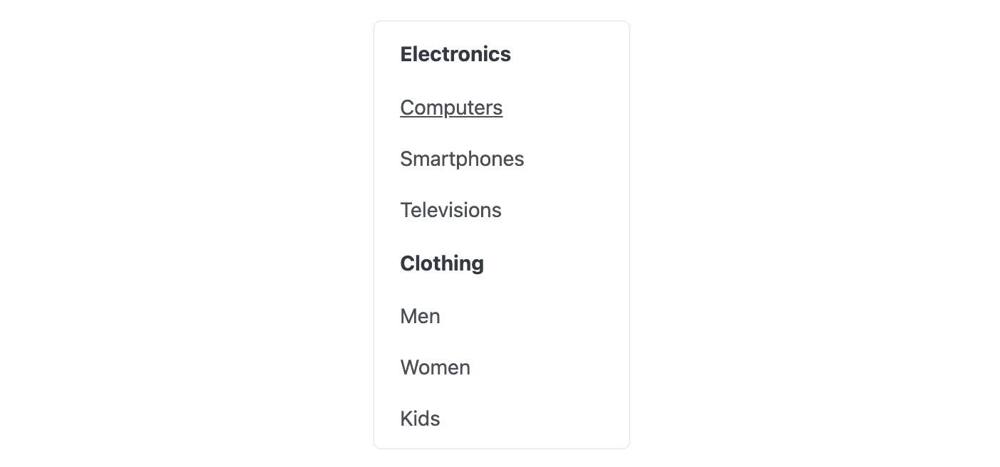

图 8.1 – 基本菜单

## 使用 Menubar

PrimeNG `Menubar`是一个为水平布局设计的动态导航组件。它不仅是一个链接列表，还提供了定制选项以满足不同的应用程序需求。您可以在`Menubar`中包含链接、按钮和其他 UI 组件，使其变得灵活且适应性强。

要开始，我们需要从 PrimeNG 库中导入必要的模块：

```js
import { MenubarModule } from 'primeng/menubar'
```

之后，我们可以通过使用 PrimeNG 的`p-menubar`组件来创建菜单栏：

```js
<p-menubar [model]="menuItems" />
```

让我们看看结果：

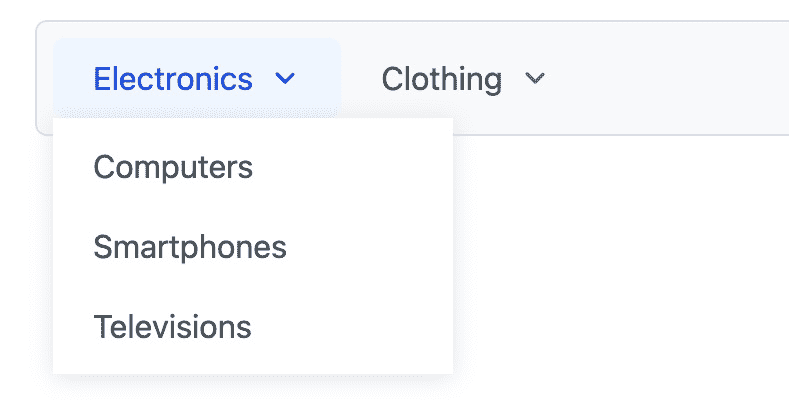

图 8.2 – Menubar

在本例中，`Menubar`包含两个主要部分：**电子产品**和**服装**。**电子产品**部分进一步细分为**电脑**、**智能手机**和**电视**等子类别。这种结构确保用户可以迅速导航到他们想要的产品类别或轻松访问他们的账户设置，而无需任何麻烦。

## 使用 MegaMenu

PrimeNG `MegaMenu`是一个下拉导航组件，在二维面板中显示子菜单，非常适合具有大量导航选项的情况，消除了滚动长列表的需求。它对于具有多个功能或类别的网站或应用程序特别有用，提供了有组织和易于访问的导航选项。

要开始，我们需要从 PrimeNG 库中导入必要的模块：

```js
import { MegaMenuModule } from 'primeng/megamenu'
```

之后，我们可以通过使用 PrimeNG 的`p-megaMenu`组件来创建菜单栏：

```js
<p-megaMenu [model]="megaMenuItems" />
...
megaMenuItems: MegaMenuItem[] = [
   {
      label: 'Categories',
      items: [
         [
            {
               label: 'Electronics',
               items: [
                  { label: 'Laptops', routerLink: '/electronics/laptops' },
                  { label: 'Cameras', routerLink: '/electronics/cameras' },
               ],
            },
            ...
         ],
      ],
   },
   ...
]
```

在本例中，我们定义了一个`MegaMenuItem`对象的数组来表示菜单结构。每个`MenuItem`对象都有一个`label`属性来指定菜单项显示的文本。此外，`items`属性用于在菜单项内嵌套子菜单。生成的`MegaMenu`组件将有一个顶级名为**类别**：

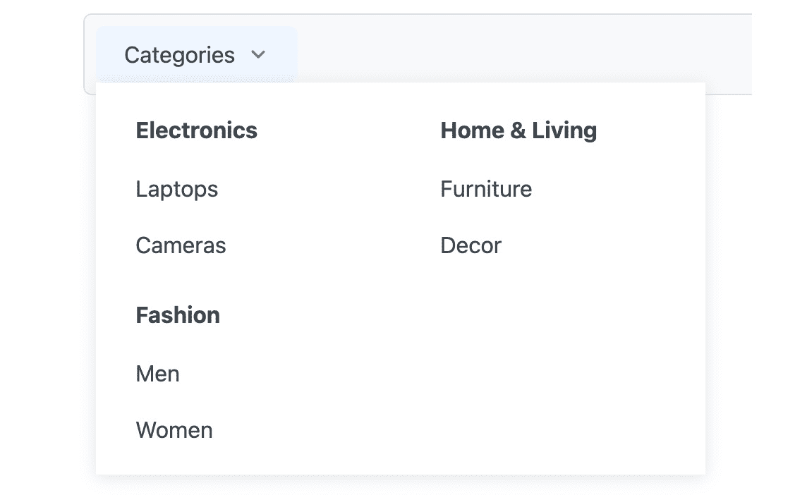

图 8.3 – MegaMenu

当用户将鼠标悬停在**类别**上时，将出现一个下拉子菜单，包含额外的子类别和产品。在这个例子中，在悬停之后，你可以看到**电子产品**、**时尚**和**家居与生活**子类别。在**电子产品**子类别中，还有进一步的选择：**笔记本电脑**和**相机**。

## 与 ContextMenu 一起工作

PrimeNG `ContextMenu`是一个上下文菜单组件，在用户执行特定操作（通常是右键点击）时在 UI 中弹出。它提供了一系列用户可以执行的操作，这些操作与用户交互的区域或元素上下文相关。与导航到顶级菜单或搜索选项不同，上下文菜单将操作直接带到用户面前。

当你想为用户提供快速操作而不使 UI 杂乱无章时，会使用上下文菜单。在以下情况下特别有益：

+   屏幕空间有限

+   你希望提供与特定元素或区域相关的选项

+   你的目标是减少用户需要点击的次数

例如，在文本编辑器中，右键点击可能会弹出剪切、复制或粘贴的选项。在图片查看器中，它可能提供缩放、保存或分享的选项。

让我们设想一个电子商务平台，用户可以在其中浏览产品。上下文菜单可以为这些产品提供快速操作。要开始，我们需要从 PrimeNG 库中导入必要的模块：

```js
import { MegaMenuModule } from 'primeng/megamenu'
```

之后，让我们为产品图片创建一个上下文菜单：

```js

<p-contextMenu [target]="img" [model]="contextMenuItems" />
...
contextMenuItems: MenuItem[] = [
   {
      label: 'View Details',
      icon: 'pi pi-search',
      command: (event) => this.viewProduct(event.item),
   },
   {
      label: 'Add to Cart',
      icon: 'pi pi-shopping-cart',
      command: (event) => this.addToCart(event.item),
   },
   {
      label: 'Add to Wishlist',
      icon: 'pi pi-heart',
      id: 'wishlist',
      command: (event) => this.addToWishlist(event.item),
   },
]
viewProduct(item: MenuItem) {
   // Logic to view product details
}
addToCart(item: MenuItem) {
   // Logic to add product to cart
}
addToWishlist(item: MenuItem) {
   // Logic to add product to wishlist
}
```

让我们分解一下代码：

+   ``：这是一个模板引用变量，用于在 Angular 组件中引用``元素

+   `<p-contextMenu [target]="img" [model]="contextMenuItems" />`：这部分代码定义了 PrimeNG 的`ContextMenu`组件并配置了其属性：

    +   `[target]="img"`：这会将`ContextMenu`组件的目标属性绑定到`img`模板引用变量。这意味着当用户右键点击引用的``元素时，`ContextMenu`组件将被触发。

    +   `[model]="contextMenuItems"`：这会将`ContextMenu`的`model`属性绑定到`contextMenuItems`数组。

    +   `contextMenuItems: MenuItem[]`：这是一个`MenuItem`对象的数组。每个对象代表上下文菜单中的一个菜单项。它具有如`label`（显示在菜单项上的文本）、`icon`（与菜单项关联的图标）和`command`（当选择菜单项时要执行的功能）等属性。在这种情况下，`command`属性被设置为调用 Angular 组件中的特定方法（`viewProduct()`、`addToCart()`和`addToWishlist()`）。

让我们看看结果：

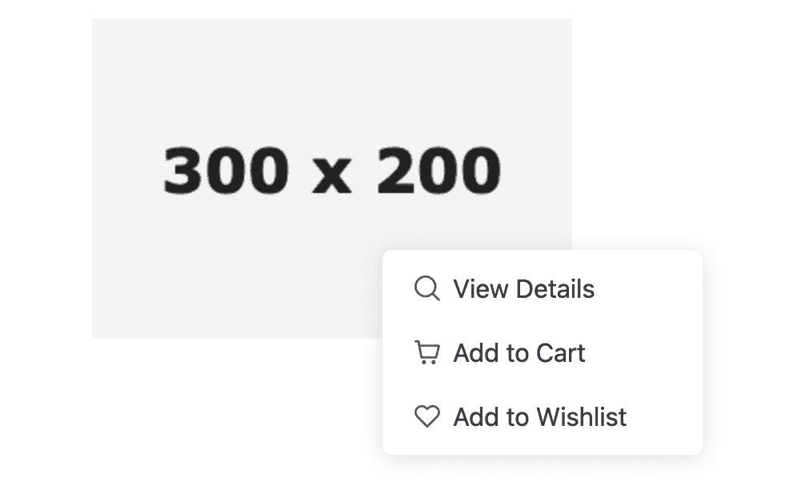

图 8.4 – ContextMenu 示例

在这个设置中，当用户在产品上右键点击时，他们会看到查看详情、添加到购物车或添加到愿望单的选项。这增强了购物体验，使操作迅速而直接。

## 与`TieredMenu`一起工作

PrimeNG 的`TieredMenu`是一个多级菜单系统，允许选项以分层结构组织。与扁平列表不同，您会得到一个级联菜单，其中选项可以有子选项，这些子选项还可以有自己的子选项，依此类推。这种分层结构在视觉上直观，使用户能够轻松地浏览类别和子类别。

PrimeNG 的`TieredMenu`在各种需要分层导航菜单的场景中都是一个很好的选择。以下是一些您可以利用`TieredMenu`功能的情况：

+   *复杂的应用程序菜单*：当您有一个包含大量菜单项和子菜单的应用程序时，`TieredMenu`简化了菜单结构和管理的组织。它允许您创建一个逻辑上的菜单层次结构，使用户能够更容易地浏览应用程序。

+   *电子商务网站*：`TieredMenu`在电子商务网站上特别有用，因为它们通常有广泛的产品类别和子类别。通过使用`TieredMenu`，您可以创建一个用户友好的导航系统，使购物者能够轻松浏览不同的产品类别和子类别。

+   *管理仪表板*：管理仪表板通常有多个部分和子部分，每个部分都需要自己的菜单集。`TieredMenu`提供了一个干净且组织良好的方式来表示这些菜单，使管理员能够轻松访问各种功能和设置。

+   *多级下拉菜单*：如果您需要实现多级下拉菜单，`TieredMenu`简化了这一过程。它处理了管理嵌套菜单的复杂性，并确保在不同层次之间的平滑过渡。

为了说明 PrimeNG `TieredMenu`在电子商务环境中的应用，让我们考虑一个场景，其中我们有一个在线商店销售电子产品。我们希望创建一个导航菜单，允许用户浏览不同的产品类别和子类别。

要开始使用，我们需要从 PrimeNG 库中导入必要的模块：

```js
import { TieredMenuModule } from 'primeng/tieredmenu'
```

之后，我们可以通过添加以下代码来启用 PrimeNG 的`TieredMenu`：

```js
<p-tieredMenu [model]="tieredMenus" />
...
tieredMenus: MenuItem[] = [
   {
      label: 'Electronics',
      icon: 'pi pi-tablet',
      items: [
         {
            label: 'Computers',
            icon: 'pi pi-desktop',
            items: [
               { label: 'MacBook Air', icon: 'pi pi-apple' },
               { label: 'Ultrabooks', icon: 'pi pi-desktop' },
               { label: 'Mobile Workstations', icon: 'pi pi-mobile' },
            ],
         },
         ...
      ],
   },
]
```

让我们分解一下代码：

+   `<p-tieredMenu [model]="tieredMenus" />`：这代表 PrimeNG 的`TieredMenu`组件。`model`属性将组件类中的`tieredMenus`属性绑定到`TieredMenu`组件。

+   `tieredMenus: MenuItem[]`：这是一个来自 PrimeNG API 的`MenuItem`对象数组。每个`MenuItem`对象可以具有各种属性，例如`label`、`icon`、`items`、`routerLink`等。

让我们看看结果：

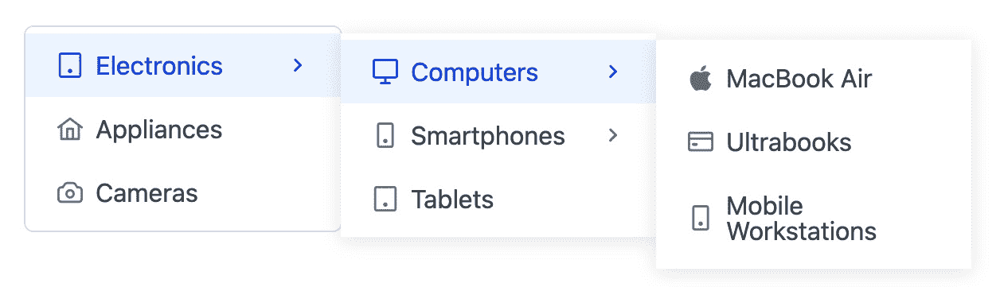

图 8.5 – 分层菜单

在这个例子中，我们有一个顶级菜单项 **Electronics**，它有几个子菜单：**Computers**、**Smartphones** 和 **Tablets**。每个子菜单都可以有自己的子菜单，从而创建一个层次结构。用户可以通过悬停在相应项上在菜单项和子菜单之间导航。

## 使用面包屑

PrimeNG `Breadcrumb` 是一个导航组件，它指示应用程序层次结构中的当前位置。它提供了一系列链接，每个链接代表层次结构中的一个级别，可以返回主页或主仪表板。

注意

应将面包屑用作辅助导航工具 – 它补充了主要导航，但不应该取代它。因此，请确保你的应用程序还有一个主要导航系统，例如菜单或侧边栏。

要开始，我们需要从 PrimeNG 库中导入必要的模块：

```js
import { BreadcrumbModule } from 'primeng/breadcrumb'
```

之后，我们可以通过添加以下代码来启用 PrimeNG `Breadcrumb`：

```js
<p-breadcrumb [model]="breadcrumbItems" />
...
breadcrumbItems: MenuItem[] = [
   { icon: 'pi pi-home', routerLink: '/' },
   { label: 'Electronics', routerLink: '/electronics' },
   {
      label: 'Computers',
      routerLink: '/electronics/computers',
   },
   { label: 'MacBook Air', routerLink: '/electronics/computers/macbook-air' },
]
```

让我们分解代码并解释每个部分：

+   `<p-breadcrumb [model]="breadcrumbItems" />`：这代表了 PrimeNG `Breadcrumb` 组件的实际用法。`[model]` 属性用于将 `breadcrumbItems` 数组绑定到组件的模型属性。

+   `breadcrumbItems: MenuItem[]`：这是一个包含 PrimeNG API 中的 `MenuItem` 对象的数组。每个 `MenuItem` 对象可以具有各种属性，如 `label`、`icon`、`items`、`routerLink` 等。

让我们看看结果：

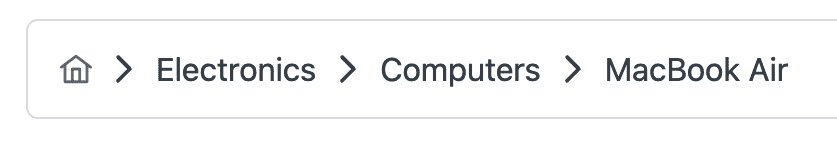

图 8.6 – 面包屑

在这个例子中，面包屑从 `Home` 链接开始，该链接将用户带回到网站的首页。随后的链接代表分类层次结构：**Electronics**、**Computers**，最后是当前页面，**MacBook Air**。

在深入研究了 PrimeNG 菜单的多种功能后，我们看到了它们如何简化导航并增强应用程序的用户体验。现在，让我们转向探索 PrimeNG 面板，这些是提供灵活方式在应用程序中组织和展示内容的必要组件。

# 介绍 PrimeNG 面板

`Panel`、`ScrollPanel`、`Accordion`、`Splitter`、`Fieldset` 和 `TabView`。

PrimeNG 面板可以在各种场景中使用，在这些场景中，内容组织和展示至关重要。以下是一些你可以从使用 PrimeNG 面板中受益的情况：

+   `Accordion` 在你有多个内容部分并且想要通过只允许用户展开他们感兴趣的部分来节省空间时非常有用。

+   `ScrollPanel` 组件使用户能够滚动内容，确保所有信息都保持可访问。

+   `Splitter` 组件在你需要创建可调整大小和可折叠的面板时非常有价值，使用户能够根据他们的偏好自定义布局。

+   `Fieldset`组件在您有一个包含相关字段且需要视觉上分组在一起以改善用户体验和理解表单时特别有用。

+   `TabView`组件在您有多个相关信息或功能集可以组织到标签中时非常有用，允许用户轻松切换。

要开始，让我们创建一个基本的 PrimeNG 面板。

## 创建基本面板

PrimeNG 面板本质上是一个围绕内容包装的容器，为内容提供结构化的外观。它包含一个可选的标题栏，可以用来为内部内容提供标题或上下文。面板的美丽之处在于其简洁性。它不对内容施加任何特定的样式或行为；相反，它提供了一个整洁的边界，使内容更加突出。

无论您是在设计仪表板、表单还是内容页面，面板都可以成为您为内容提供结构的首选组件。当您想要将相关的信息片段组合在一起时，它尤其有用，这使用户更容易处理和理解。

注意

虽然 PrimeNG `Panel`功能多样，但使用它时必须谨慎。过度使用可能会使页面显得杂乱。始终追求设计功能和平衡。

让我们深入电子商务领域，看看 PrimeNG `Panel`的实际应用。在电子商务网站上，`Panel`组件可以用来显示关于产品的详细信息。例如，当用户点击产品缩略图或名称时，面板可以滑动或展开以显示产品详情，包括图片、描述、规格和客户评价。这使用户能够在不离开当前页面的情况下探索产品信息。

要开始，我们需要从 PrimeNG 库中导入必要的模块：

```js
import { PanelModule } from 'primeng/panel'
```

一旦安装并导入依赖项，让我们看看如何设置 PrimeNG 面板：

```js
<p-panel header="Product Details" [toggleable]="true">
   <p>
      Experience the power of Laptop XYZ, featuring the latest processor and a
      sleek design.
   </p>
   <!-- other information -->
</p-panel>
```

让我们分解代码并解释每个部分：

+   `<p-panel>`：这是在 PrimeNG 中创建面板的主要组件标签。

+   `header="Product Details"`：此属性将面板的标题或头部设置为`"Product Details"`。

+   `-toggleable]="true"`：此属性使面板的内容可折叠。当设置为`true`时，允许用户点击面板标题来切换（显示/隐藏）面板内的内容。

让我们看看结果：

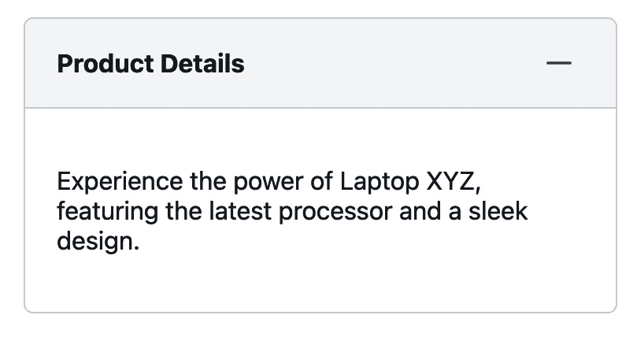

图 8.7 – 基本面板

在这个例子中，您可以通过点击减号或加号图标来展开或折叠产品详情。

## 与 ScrollPanel 一起工作

PrimeNG `ScrollPanel` 允许你在应用程序内创建可滚动的区域，使用户能够查看超出可用空间的内容。`ScrollPanel` 组件提供类似原生的滚动体验，这意味着当用户在应用程序中导航时，滚动感觉平滑自然，就像在设备内置的应用程序中一样，该组件还支持水平和垂直滚动。

与在不同平台上可能不一致的默认浏览器滚动条不同，`ScrollPanel` 提供了一致的视觉和感觉。这不仅仅是关于美观；这是为了为用户提供更平滑、更直观的滚动体验。

让我们通过添加 `ScrollPanel` 来改进 *图 8.7* 中显示的基本面板。首先，从 PrimeNG 库中导入必要的模块：

```js
 import { ScrollPanelModule } from 'primeng/scrollpanel'
```

现在，让我们看看如何设置 PrimeNG `ScrollPanel`：

```js
<p-panel header="Product Details" [toggleable]="true">
   <p-scrollPanel [style]="{ width: '100%', height: '200px' }">
      <p>
         Lorem ipsum dolor sit amet, consectetur adipiscing elit. Quisque ut...
      </p>
      <!-- Other content -->
   </p-scrollPanel>
</p-panel>
```

让我们分解代码并解释其功能：

+   `<p-panel ...>`：这代表 PrimeNG `Panel` 组件。

+   `<p-scrollPanel [style]="{ width: '100%', height: '200px' }">`：这将在面板内创建一个可滚动的视口来处理溢出的内容。它允许用户垂直滚动内容。`[style]` 属性用于定义可滚动区域的尺寸。在这种情况下，宽度设置为 `100%`，高度设置为 `200px`。

让我们看看结果：

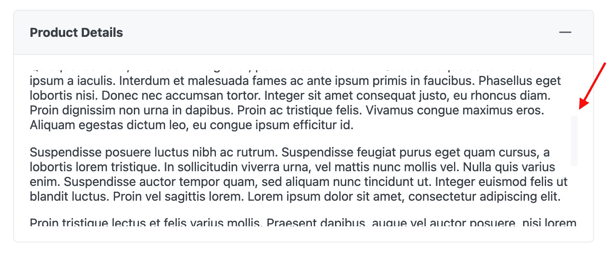

图 8.8 – 带滚动条的 ScrollPanel

在这个例子中，我们在一个具有固定宽度和高度的基面板内定义了 `ScrollPanel`。由于 **产品详情** 面板的内容相当大，滚动功能允许用户轻松查看内容，而不会失去整个页面的上下文。

## 与 Accordion 一起工作

PrimeNG `Accordion` 是一个 UI 组件，允许你以堆叠的方式显示内容。可以将其视为可展开/折叠的面板垂直堆栈。每个面板都有一个标题栏，当你点击它时，面板内的内容展开，显示更多详细信息。这种机制确保用户不会一次性被过多信息淹没。相反，他们可以选择深入哪些部分，使他们的浏览体验更加专注和整洁。

在空间有限且需要展示与相关详细内容关联的项目列表的情况下，Accordions 非常有用。它们特别适用于以下情况：

+   **组织相关内容**：将相关部分或主题分组，使用户能够快速导航到他们感兴趣的区域

+   **多步骤表单**：将长表单分解成可管理的部分，逐步引导用户

+   **常见问题解答**：展示一系列问题，并展开以显示答案

+   **产品规格**：在电子商务中，使用手风琴式布局显示产品的详细规格或特性，而不会让用户感到信息过载

想象一下，您正在开发一个销售电子小工具的电子商务平台。对于每个产品，都有大量信息需要传达规格、用户评价、保修详情等。使用 PrimeNG 手风琴，您可以整洁地组织这些信息。

要开始使用，请从 PrimeNG 库中导入必要的模块：

```js
import { AccordionModule } from 'primeng/accordion'
```

现在，我们可以看到如何设置 PrimeNG 手风琴：

```js
<p-accordion>
   <p-accordionTab header="Specifications">
      <ul>
         <li>Processor: XYZ</li>
         <li>Memory: 8GB RAM</li>
         <!-- ... other specs ... -->
      </ul>
   </p-accordionTab>
   <p-accordionTab header="User Reviews">
      <p>"This product is fantastic! Highly recommend." - Alex G</p>
      <!-- ... other reviews ... -->
   </p-accordionTab>
   <p-accordionTab header="Warranty">
      <p>This product comes with a 2-year warranty covering...</p>
   </p-accordionTab>
   <!-- ... other tabs ... -->
</p-accordion>
```

提供的代码演示了如何使用 PrimeNG `Accordion` 组件创建一组具有不同内容部分的标签。让我们分解它：

+   `<p-accordion>...</p-accordion>`：此代码片段将 `Accordion` 组件包裹在其子元素周围，表示手风琴部分的开始和结束。

+   `<p-accordionTab header="...">`：此元素代表手风琴的一个部分。header 属性定义了该部分的标题。

让我们看看结果：

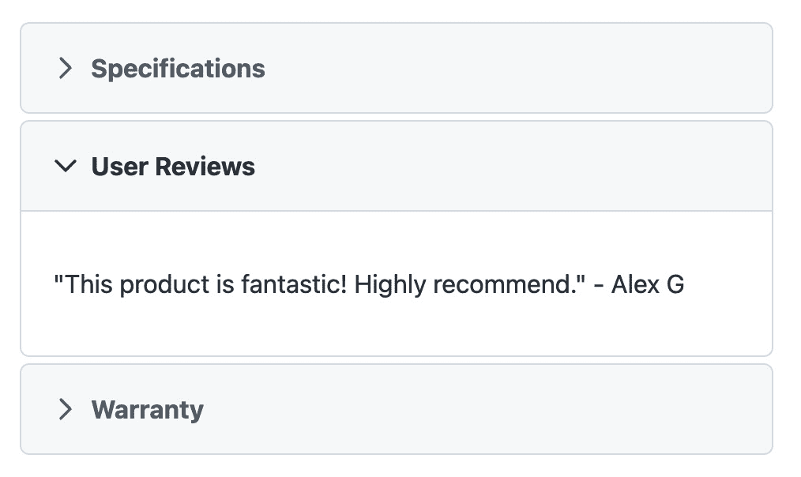

图 8.9 – 手风琴

我们创建了三个手风琴标签，因此当用户点击标题时，标签内的相关内容会展开。

## 与 Fieldset 一起工作

PrimeNG `Fieldset` 是一个容器组件，旨在将相关内容分组在一个视觉上独特的边界内。它与经典的 HTML `<fieldset>` 元素类似，但增加了额外的功能和样式。最显著的功能是其可选的可切换属性，允许用户展开或折叠内容，使其非常适合需要隐藏/显示功能的章节。

`Fieldset` 是您在以下情况下首选的组件：

+   **分组相关元素**：这在表单中尤其如此，您可能希望将相关的输入字段分组

+   **提高可读性**：通过分割内容，您使用户更容易处理信息

+   **交互式内容展示**：利用其可切换功能，您可以在不压倒主要内容的情况下展示可选或补充信息

在上一节中，我们使用 PrimeNG `Accordion`（如图 *图 8.9* 所示）显示了产品信息，如规格、保修详情和用户评价。除了使用 `Accordion`，我们还可以使用 `Fieldset` 来整洁地包装每个部分。

要开始使用，请从 PrimeNG 库中导入必要的模块：

```js
import { FieldsetModule } from 'primeng/fieldset'
```

然后，让我们设置 PrimeNG `Fieldset`：

```js
<p-fieldset legend="Specifications" [toggleable]="true" class="block mb-4">
   <ul>
      <li>Screen Size: 15.6 inches</li>
      <li>Processor: Intel i7</li>
      <li>RAM: 16GB</li>
      <!-- ... other specifications ... -->
   </ul>
</p-fieldset>
<p-fieldset legend="User Reviews" [toggleable]="true" class="block mb-4">
   <p>"Fantastic product with great performance!" - Yen N</p>
   <!-- ... other reviews ... -->
</p-fieldset>
<p-fieldset
legend="Warranty Details"
   [toggleable]="true"
   class="block mb-4"
>
   <p>
      This product comes with a 2-year warranty covering manufacturing
      defects.
      <!-- ... more warranty details ... -->
   </p>
</p-fieldset>
```

提供的代码演示了如何使用 PrimeNG `Fieldset` 组件及其特定属性。让我们分解代码并解释每个部分：

+   `<p-fieldset>`：代表 PrimeNG `Fieldset` 组件的 HTML 标签。

+   `legend="规格"`：`legend` 属性设置 `Fieldset` 组件的标题或描述。在这种情况下，`legend` 设置为 `规格`，表示 `Fieldset` 组件内的内容与产品的规格相关。

+   `[toggleable]="true"`：`[toggleable]`属性是一个属性绑定，它启用了`Fieldset`组件的可切换功能。当设置为`true`时，字段集中的内容可以被用户展开或折叠。这使用户能够根据需要隐藏或显示规格部分。

让我们看看结果：

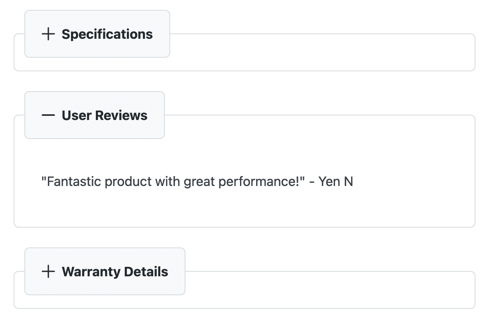

图 8.10 – 字段集

在这个例子中，每个字段集都作为特定类型信息的容器。用户可以快速浏览图例（如**规格**或**用户评论**）并决定他们想要深入了解哪些部分，并根据需要展开它们。

## 使用 TabView

PrimeNG 的`TabView`是一个导航组件，允许您将内容分解成多个标签显示。每个标签都作为其独特内容的容器，确保信息是有组织的且易于访问。使用`TabView`，用户可以快速在不同部分之间切换，而不会感到不知所措。

`TabView`功能丰富，在各种场景中都有其位置：

+   **设置或配置页面**：这样可以将不同类别的设置分组到单独的标签下

+   **个人资料页面**：这可能是在您想要将用户信息、活动历史和设置分别放入不同的标签时

+   **电子商务中的产品描述**：这是当您想要将产品详情、客户评论和规格分开时

+   **文档**：这是当您想要将指南、API 参考和示例分开时

在前面的章节中，我们使用 PrimeNG 的`Accordion`（*图 8.9*）和`Fieldset`（*图 8.10*）显示了产品信息。现在，让我们尝试使用`TabView`。要开始，请从 PrimeNG 库中导入必要的模块：

```js
import { TabViewModule } from 'primeng/tabview'
```

现在让我们看看如何设置 PrimeNG 的`TabView`：

```js
<p-tabView>
   <p-tabPanel header="Warranty">
      <p>
         This product comes with a 2-year warranty covering manufacturing
         defects.
         <!-- ... more warranty details ... -->
      </p>
   </p-tabPanel>
   <p-tabPanel header="Specifications">
      <ul>
         <li>Screen Size: 15.6 inches</li>
         <li>Processor: Intel i7</li>
         <li>RAM: 16GB</li>
         <!-- ... other specifications ... -->
      </ul>
   </p-tabPanel>
   <p-tabPanel header="Reviews">
      <p>"Spectacular product! Highly recommended" - Aaron D</p>
      <!-- ... other reviews ... -->
   </p-tabPanel>
</p-tabView>
```

让我们分解代码并解释每个部分：

+   `<p-tabView>`：这个 PrimeNG 组件作为我们标签的容器。

+   `<p-tabPanel header="Warranty">`：这些组件代表`tabView`容器内产品信息的不同部分。`header`属性包含标签的值。

让我们看看结果：

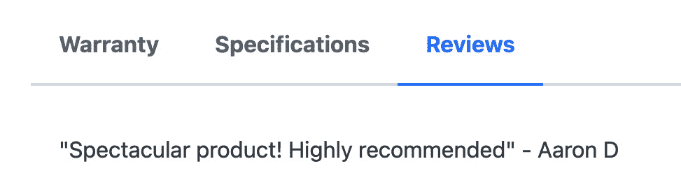

图 8.11 – TabView

通过使用 PrimeNG 的`TabView`，我们可以创建内容的不同部分，这些部分以标签的形式显示。用户可以通过点击标签标题（**保修**、**规格**或**评论**）在相应的部分之间切换，并访问相关信息。

## 使用 Splitter

PrimeNG 的`Splitter`是一个布局组件，允许用户通过拖动分隔线来调整其子元素的大小。将其想象为用户可以根据他们的查看偏好调整大小的可调整分区。它在需要提供两个或更多内容部分之间可调整比例的场景中特别有用，无论是水平还是垂直。

`Splitter`组件在各种场景中都非常出色：

+   当你有多个小部件或面板，并希望给用户提供调整它们大小的灵活性时，使用`Splitter`

+   当你可能在一侧有一个代码部分而在另一侧有一个预览时，可以使用`Splitter`组件

+   `Splitter`组件允许用户调整视图以并排比较两个图像

+   `Splitter`组件可用于需要提供可调整的多面板视图的应用程序

让我们考虑一个例子，其中 PrimeNG 的`Splitter`组件将两个图像并排比较。首先，从 PrimeNG 库中导入必要的模块：

```js
import { SplitterModule } from 'primeng/splitter'
```

然后让我们看看如何设置 PrimeNG 的`Splitter`组件：

```js
<p-splitter [style]="{ height: '300px' }" layout="horizontal">
   <ng-template pTemplate>
      <div class="col flex align-items-center justify-content-center">
         
      </div>
   </ng-template>
   <ng-template pTemplate>
      <div class="col flex align-items-center justify-content-center">
         
      </div>
   </ng-template>
</p-splitter>
```

让我们分解代码并解释每个部分：

+   `<p-splitter>`：这代表 PrimeNG 的`Splitter`组件。

+   `[style]="{ height: '300px' }"`：这用于将内联 CSS 样式应用到`Splitter`组件上。在这种情况下，`Splitter`组件的高度通过`height`属性设置为 300 px。

+   `layout="horizontal"`：`layout`属性定义了`Splitter`组件内面板的排列方向。在这个例子中，它被设置为`horizontal`，表示面板将以水平方式并排显示。

+   `<ng-template pTemplate>`：`pTemplate`指令是 PrimeNG 特有的，用于标记 Angular 模板为 PrimeNG 模板。

让我们看看结果：

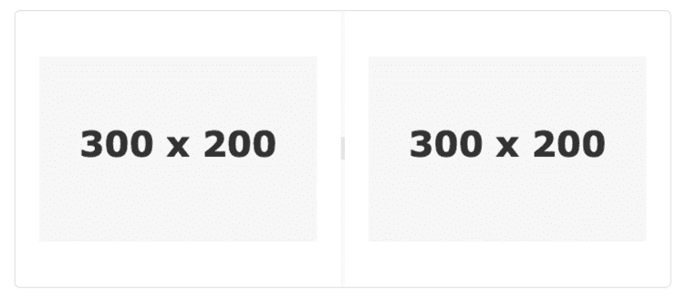

图 8.12 – Splitter

在这里，我们在`Splitter`组件内部创建了两个面板，每个面板包含一个用于比较目的的图像。

在探索了 PrimeNG 面板的各种功能和能力之后，我们获得了宝贵的见解，了解了这个强大的组件如何增强 Angular 应用程序中内容的布局和展示。

# 摘要

在本章中，我们穿越了 PrimeNG 组件的广阔世界。它带我们经历了一次导航和布局组件的复杂旅程。这些元素是任何应用程序的骨架，决定了用户如何与内容互动，并确保无缝体验。

我们深入研究了从菜单和面板的各种组件。每个组件都服务于独特的目的，从组织内容到增强导航。到目前为止，你应该已经牢固地掌握了在应用程序中何时以及如何使用这些组件。这些组件将使我们能够以有意义的方式构建和展示内容，从而提高整体用户体验。此外，通过各种示例，我们看到了这些组件如何集成到实际应用中。这些实用见解旨在弥合理论知识与实际实施之间的差距。

随着我们过渡到下一章，我们将深入探讨使用主题定制 PrimeNG 组件的艺术。主题化是一个强大的工具，它允许你根据品牌指南或特定的设计偏好定制组件的外观和感觉。我们将探讨如何利用主题化的力量，使 PrimeNG 组件真正成为你自己的。所以，准备好开始一段丰富多彩的定制和设计之旅吧！

# 第三部分：高级技术和最佳实践

在本部分，你将深入了解与 PrimeNG 一起工作的高级技术和最佳实践。你将探索定制、优化、重用、国际化以及测试策略，以增强你的 PrimeNG 驱动的 Angular 应用程序。

在本部分的结尾，你将深入理解这些高级主题，并具备构建稳健、高效和用户友好的应用程序的宝贵技能。

本部分包含以下章节：

+   *第九章*, *使用主题定制 PrimeNG 组件*

+   *第十章*, *探索 Angular 应用程序的优化技术*

+   *第十一章*, *创建可重用和可扩展的组件*

+   *第十二章*, *处理国际化和本地化*

+   *第十三章*, *测试 PrimeNG 组件*
