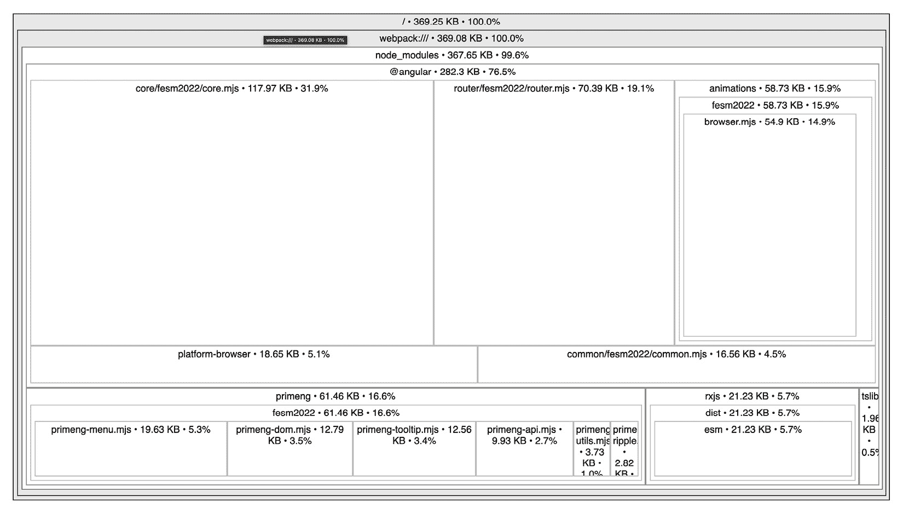

# 10

# 探索 Angular 应用程序的优化技术

在当今的数字时代，用户期望应用程序快速且响应灵敏。轻微的延迟可能会导致用户满意度下降，甚至影响业务指标。通过理解和实施性能优化技术，你确保你的应用程序满足用户期望，从而提高用户参与度、提高留存率和积极的用户反馈。因此，当我们深入 Angular 和 PrimeNG 的世界时，确保我们的应用程序不仅功能齐全且美观，而且性能达到顶峰是至关重要的。本章致力于为你提供工具和技术，以优化使用 PrimeNG 组件的 Angular 应用程序的性能。

在本章中，你将深入了解性能优化的核心概念。我们将揭示一些流行的技术，例如懒加载、通过`*ngFor`的`trackBy`、纯管道、包优化等。随着我们的进展，你将了解变更检测策略的微妙之处，从而全面理解它们对性能的深远影响。最后，我们将通过 Angular 内置的性能工具进行实战演练。这些工具是真正的变革者，擅长定位和纠正性能瓶颈。

本章将涵盖以下主题：

+   介绍 Angular 性能优化

+   使用性能分析和分析

+   实现懒加载和延迟加载

+   使用变更检测

+   优化数据绑定

+   使用代码和包优化

# 技术要求

本章包含各种关于 Angular 优化的工作代码示例。你可以在本书 GitHub 仓库的`chapter-10`文件夹中找到相关源代码：[`github.com/PacktPublishing/Next-Level-UI-Development-with-PrimeNG/tree/main/apps/chapter-10`](https://github.com/PacktPublishing/Next-Level-UI-Development-with-PrimeNG/tree/main/apps/chapter-10)。

# 介绍 Angular 性能优化

每个开发者都梦想着构建功能丰富且速度极快的应用程序。但随着我们在 Angular 应用程序中添加更多功能和复杂性，我们可能会无意中引入性能瓶颈。这就是**Angular 性能优化**发挥作用的地方。让我们深入了解 Angular 开发的这一关键方面。

## 什么是 Angular 性能优化？

**Angular 性能优化**是指通过应用各种技术、策略和最佳实践来提高 Angular 应用程序的性能和响应性。它涉及识别和解决性能瓶颈、减少不必要的计算、优化渲染过程和最小化加载时间。通过优化 Angular 应用的性能，我们可以提高用户满意度，减少用户退出，并提高整体应用程序的成功率。

## Angular 应用程序中的主要性能问题

Angular 是一个强大的框架，但像任何工具一样，它并非对性能问题免疫。一些常见的原因如下：

+   **缓慢的初始加载时间**：当一个 Angular 应用程序拥有庞大的代码库时，加载所有必需的资源可能会很耗时。缓慢的初始加载时间会显著影响用户的感知和参与度。

+   **过度变化检测**：Angular 的默认变化检测机制可能计算成本高昂，尤其是在大型应用程序中，频繁更新时。低效的变化检测可能导致不必要的渲染和性能下降。

+   **内存泄漏**：当组件或服务没有被正确销毁时，可能会发生这种情况，尤其是在你忽略取消订阅可观察对象的情况下，这会导致随着时间的推移内存使用量增加。

+   **复杂的计算**：运行复杂的算法或计算，尤其是在实时场景如动画中，可能会减慢应用程序。

+   **不足的懒加载**：即使组件不是立即需要的，也预先加载所有组件和模块，这可能会导致初始加载时间增加。缺乏适当的懒加载技术可能会对应用程序的性能产生负面影响。

## 流行的优化技术

为了解决这些性能问题并优化 Angular 应用的性能，开发者采用各种技术和策略。以下是一些流行的优化选项：

+   **性能分析和分析**：Angular 提供了内置的性能工具和技术，允许我们分析和分析我们应用程序的性能。例如，Angular DevTools 工具可以帮助识别性能瓶颈并提供优化的见解。

+   **懒加载和延迟加载**：它们是按需加载模块或组件的技术，而不是预先加载。通过在我们的 Angular 应用程序中实现懒加载和延迟加载，我们可以减少初始加载时间并提高整体性能。

+   `默认` 策略和 `OnPush` 策略。根据应用程序的需求选择适当的变化检测策略，我们可以最小化不必要的检测并提高性能。

+   `trackBy` 函数的使用，有助于最小化不必要的更新并提高渲染性能。优化的数据绑定确保在发生变化时，只有必要的组件被更新。

+   **代码和包优化**：最小化、打包 JavaScript 和 CSS 文件、摇树优化和代码拆分是用于优化 Angular 应用程序大小和加载速度的技术。这些优化减少了网络请求并提高了整体性能。

现在我们已经了解了 Angular 性能优化及其重要性，在接下来的章节中，我们将详细探讨这些技术。我们将从性能分析和分析开始。

# 引入性能分析和分析

**性能分析**类似于您应用程序的健康检查。它涉及监控应用程序的操作，了解它大部分时间花在哪里，并识别潜在的瓶颈。另一方面，**分析**是后续步骤，其中这些数据被解释，问题被定位，并制定性能提升策略。

## 性能分析和分析何时使用？

在以下情况下需要性能分析和分析：

+   应用程序的部分似乎比预期慢

+   有确保新实现不会降低性能的愿望

+   大型应用程序需要优化资源密集型操作

+   目标是向用户提供无缝体验，特点是快速加载时间和流畅的交互

## Angular 中性能分析和分析是如何工作的？

性能分析捕获了应用程序在运行时行为的数据。对于 Angular 开发者来说，这个领域的变革者就是 **Angular DevTools** 扩展程序 ([`angular.io/guide/devtools`](https://angular.io/guide/devtools))。这个针对 Angular 应用程序定制的浏览器扩展程序，提供了对组件树结构和变更检测周期的洞察，甚至提供了专门的性能分析功能。它是浏览器原生开发者工具的补充，不可或缺的工具。

要使用 Angular DevTools 扩展程序进行性能分析，请按照以下步骤操作：

1.  在您首选的网页浏览器中安装 Angular DevTools 扩展程序。扩展程序适用于 Chrome 和 Firefox，可以从相应浏览器的扩展程序市场安装。在本节中，我将使用 Chrome 浏览器。

1.  通过右键单击您的 Angular 应用程序中的元素并选择 **Inspect**（或使用 *Ctrl* + *Shift* + *I* 键盘快捷键）来打开 Chrome DevTools。

1.  在 Chrome DevTools 中，点击 **Angular** 选项卡以切换到 Angular DevTools 视图。


图 10.1 – Angular DevTools 选项卡

1.  在 Angular DevTools 中，您可以通过点击红色圆圈来启用性能分析功能，以收集与渲染、变更检测和其他 Angular 特定活动相关的性能数据：


图 10.2 – Angular DevTools 性能分析

1.  在启用性能分析的情况下，与你的 Angular 应用程序交互并执行典型的用户操作。Angular DevTools 扩展将实时收集性能数据。

1.  使用 Angular DevTools 检查各种性能指标并确定关注区域。例如，你可以分析渲染单个组件所花费的时间、变更检测周期的数量或网络请求的持续时间。

1.  根据收集到的性能数据，确定对性能瓶颈有贡献的组件、指令或服务。寻找渲染或变更检测花费大量时间或发生不必要的数据获取的区域。

1.  一旦确定了性能瓶颈，就对代码、组件结构或数据获取机制进行有针对性的优化。这可能涉及优化变更检测策略、实现记忆化技术或引入分页或缓存以进行数据获取。

1.  在应用优化后，使用 Angular DevTools 重新分析你的 Angular 应用程序的性能。验证优化是否改善了已识别的性能瓶颈，并且没有引入新的问题。如果需要进一步改进，请迭代优化过程。

通过遵循这些步骤并利用 Angular DevTools 扩展，你可以深入了解 Angular 应用程序的性能特征。这使你能够进行有针对性的优化并提高应用程序的整体性能。

注意

容易陷入过度优化的陷阱。始终权衡优化的好处与引入的努力和复杂性。例如，如果所讨论的组件相对简单，并且实施高级优化技术带来的性能提升微不足道或难以衡量，那么坚持使用 Angular 提供的默认变更检测策略可能更为实际。这确保了优化和开发努力之间的平衡，避免了不必要的复杂性以及代码可维护性和可读性方面的潜在权衡。

性能分析和分析就像放大镜，揭示了我们的应用程序行为和效率的复杂细节。在下一节中，我们将深入探讨懒加载这一技术，它承诺将进一步增强我们应用程序的响应性和速度。

# 实现懒加载和延迟加载

**懒加载**和**延迟加载**是设计模式，其中内容仅在需要或请求时加载，而不是一次性加载所有内容。这种方法优化了资源分配并提高了性能。以下是这些概念的详细解释：

+   **懒加载**：懒加载是一种设计模式，其中内容，如 Angular 路由、组件或服务，是动态和按需加载的，而不是一开始就上传所有内容。通过实现懒加载，初始时不会加载不必要的资源，从而减小初始包的大小并提高应用程序的启动时间。这种方法在大型应用程序中特别有用，因为一开始就加载所有资源可能会导致性能下降。

+   **延迟加载**：延迟加载是一种设计模式，涉及延迟加载或执行某些资源，如脚本或资产，直到它们被需要。在 Web 开发中，延迟通常指的是延迟加载对网页初始渲染和功能非必要的 JavaScript 文件或其他资源。通过延迟加载非关键资源，网页可以更快地渲染和显示，提高感知性能和整体用户体验。这种技术通常用于优先和优化关键资源的加载，允许页面尽快可用，同时非必要资源在后台加载。

## 懒加载和延迟加载何时使用？

懒加载和延迟加载在以下场景中特别有益：

+   **大型应用程序**：对于具有众多功能和组件的应用程序，一次性加载所有内容可能会消耗大量资源。懒加载确保只加载必要的组件，从而提高初始加载时间。

+   **用户角色和权限**：在具有不同用户角色和权限的应用程序中，可以使用懒加载根据用户角色加载组件，确保用户只下载他们可以访问的功能。

+   **网络效率**：对于网络连接较慢的用户，下载大型应用程序可能耗时。懒加载可以通过减少初始下载大小来帮助。

+   **功能丰富的平台**：在某些功能使用频率低于其他功能的平台上，将那些较少使用的功能延迟加载以提高平台的初始加载时间是有意义的，从而实现更快的渲染。

## 懒加载示例

想象一个使用 Angular 构建的电子商务平台。该平台有各种路由，如**首页**、**产品列表**、**产品详情**、**购物车**和**用户资料**。在传统的加载方法中，当用户访问网站时，他们会预先下载所有这些路由/组件，即使他们只是浏览**首页**。例如，如果没有使用懒加载，路由将看起来像这样：

```js
export const appRoutes: Route[] = [
  {
    path: 'home',
    component: HomeComponent,
  },
  {
    path: 'cart',
    component: CartComponent,
  },
  {
    path: 'user-profile',
    component: UserProfileComponent,
  },
]
```

在此代码中，路由名称与组件相关联。当用户导航到`home`页面时，将显示`HomeComponent`：


图 10.3 – 未使用懒加载的页面

您会注意到，当应用程序加载时，它从开始就加载所有必要的脚本。如您所见，主包大小为 **820 kB**，加载时间为 **1.40 s**。当您导航到其他路由时，它们的脚本已经预先加载。这可能导致不必要的数据消耗和页面渲染延迟，尤其是如果用户在会话期间从未访问过某些部分，如 **购物车** 或 **用户资料**。让我们看看懒加载如何改进当前实现。

使用懒加载，应用程序可以被构建为更智能地加载路由：

+   初始情况下，当用户访问网站时，只加载 **主页**。

+   如果用户决定查看产品，**产品** 页面将即时加载。

+   当用户想要检查他们的购物车时，**购物车** 页面将及时加载。

+   如果他们决定查看或编辑他们的资料，那么随后将加载 **用户资料** 页面。

这是一个懒加载如何实现的基本示例：

```js
export const appRoutes: Route[] = [
  {
    path: '',
    pathMatch: 'full',
    redirectTo: 'home',
  },
  {
    path: 'home',
    loadComponent: () => import('./components/home.component'),
  },
  {
    path: 'cart',
    loadComponent: () => import('./components/cart.component'),
  },
  {
    path: 'user-profile',
    loadComponent: () => import('./components/user-profile.component'),
  },
]
```

在前面的代码片段中，使用 `loadComponent` 属性定义了将在路由激活时加载相应组件的函数。这确保了用户只下载他们正在积极交互的应用程序部分，从而加快加载时间并更有效地使用资源。

这是结果：


图 10.4 – 带有懒加载的页面

如您所见，网站仅在第一次导航时加载 `main.js` 和 `HomeComponent`。如果您导航到购物车路由，您将观察到主要包大小从 `CartComponent` 显著减少，该路由是从 `app.routes.ts` 启动的。

## PrimeNG 延迟渲染示例

PrimeNG 的 **Defer** 指令是一个旨在延迟内容加载直到它进入视口的工具。本质上，它是一种懒加载的形式，但适用于各种类型的内容。通过将内容的初始化推迟到需要时，我们可以显著提高页面的初始加载时间。

以电子商务网站为例。该网站在其 `Defer` 中列出了数百个产品，我们可以进行优化。

要这样做，首先，请确保您已从 PrimeNG 导入 `DeferModule`：

```js
import { DeferModule } from 'primeng/defer'
```

现在，让我们看看如何设置 PrimeNG 的 `Defer` 来显示产品列表：

```js
<div class="grid gap-4" pDefer>
  <ng-template>
    <p-card
      *ngFor="let product of products"
      [header]="product.name"
      [style]="{ width: '300px' }"
    >
     <!-- product content -->
    </p-card>
  </ng-template>
</div>
```

让我们分解一下：

+   `<div pDefer>`: `pDefer` 指令的目的是将内容的渲染推迟到渲染周期中的较晚阶段。此指令之后必须跟一个 `ng-template` 元素。

+   `<p-card *ngFor="let product of products">`: 此元素使用 `*ngFor` 指令遍历 `products` 数组，为数组中的每个产品渲染一个 `<p-card>`。

在实施后，产品列表的内容将不会显示，直到它在滚动中变得可见。

PrimeNG 的 `Defer` 组件在你希望在产品列表已进入视口后从 API 获取产品数据时也非常有益，这将大大提高你应用程序的性能。以下是一个示例：

```js
// products.components.ts
<div pDefer (onLoad)="loadAnotherProducts()">
  <ng-template>
    <primengbook-product-list [products]="anotherProducts" />
  </ng-template>
</div>
...
loadAnotherProducts() {
  this.anotherProducts = this.productService.loadProducts()
}
```

让我们分解代码：

+   `<div pDefer (onLoad)="loadAnotherProducts()">`：此 `<div>` 元素使用 `pDefer` 指令，该指令将产品的加载和内容渲染延迟到元素进入视口。

+   `loadAnotherProducts() { ... }`：当 `(onLoad)` 事件被触发时执行此方法。在方法内部，它调用 `this.productService.loadProducts()` 来加载产品并将结果分配给组件中的 `anotherProducts` 属性。

注意

如果你正在处理 `Table`、`Tree` 或长列表项，你可以实现 `Virtual Scroller` 或 `Pagination` 来帮助提高性能并增强用户体验。

利用懒加载和延迟加载的强大功能可以显著提高我们应用程序的性能，确保用户在需要时才加载他们所需的内容。在下一节中，我们将深入探讨 Angular 性能的另一个关键方面：理解和管理变更检测。

# 与变更检测一起工作

**变更检测**是 Angular 确定组件是否需要根据数据更改进行更新的过程。每当组件的数据绑定属性更改时，Angular 会检查视图是否需要更新以反映这些更改。此过程是自动的，但了解其工作原理对于优化性能至关重要。

## 变更检测是如何工作的？

Angular 中的变更检测过程遵循单向流。它从根组件开始，遍历组件树，检查每个组件中的更改。以下是 Angular 中变更检测工作原理的简要概述：

1.  **初始化**：在组件初始化期间，Angular 设置组件的变更检测器并初始化组件的属性和绑定。

1.  `Default` 策略在组件的任何输入属性更改或事件绑定被触发时触发变更检测。以下是一个组件树的示例：


图 10.5 – 变更检测 – 默认策略

当 `ProductList` 组件发生事件时，变更检测过程开始，从根级别（`AppComponent`）开始，通过所有其子组件进行传播。

+   另一方面，`OnPush` 策略仅在输入属性更改或组件从其模板或视图层次结构中的组件接收事件时触发变更检测。在之前图 10.5 中展示的相同场景中，向 `ProductListDefer` 组件引入 `OnPush` 变更检测策略会改变变更检测过程的行为：


图 10.6 – 变更检测 – OnPush 策略

现在，当 `ProductList` 组件上发生事件时，变更检测仅限于从 `AppComponent` 到 `Products` 以及到 `ProductList` 的层次结构。值得注意的是，在 `ProductListDefer` 组件上没有变更检测，因为没有将新的引用传递给 `ProductListDefer` 组件。

1.  **变更检测周期**: Angular 的变更检测系统遵循循环过程。在每个周期中，变更检测过程会对组件树中的所有组件执行。它包括以下步骤：

    1.  **变更检测检查**: Angular 检查组件的属性、绑定和其他输入以检测变更。它将当前值与上一次变更检测周期中存储的值进行比较。

    1.  **更新视图**: 如果检测到变更，Angular 通过更新与变更属性或绑定相关的 DOM 元素来更新组件的视图。

    1.  **传播**: 如果组件的视图被更新，Angular 将更改传播到组件树中的子组件，触发它们的变更检测过程递归执行。

1.  `ChangeDetectorRef` 类提供了一套与变更检测机制交互的函数：

    +   `markForCheck()`: 此函数将组件及其祖先标记为在下一个变更检测周期中需要检查。即使组件没有直接参与变更，标记为检查也确保其视图将被更新。

    +   `detach()`: 此函数将组件的变更检测器从变更检测树中分离出来。这意味着在重新附加之前，组件将在变更检测过程中被跳过。

    +   `detectChanges()`: 调用 `detectChanges()` 触发组件及其后代的变更检测周期。这在您希望针对特定事件手动检查变更时特别有用。

    +   `reattach()`: 此函数抵消了 `detach()` 的效果。它将组件的变更检测器重新附加到变更检测树中，使其能够参与后续的变更检测周期。

Angular 变更检测机制中的一个关键元素是 `zone.js`。这个库通过“猴子补丁”浏览器中的大多数异步操作（如用户交互、HTTP 请求和定时器）发挥关键作用。

注意

**猴子补丁**是一种技术，允许修改、扩展甚至抑制代码段默认行为，而无需对其源代码进行任何直接更改。

当这些操作完成后，`zone.js` 通知 Angular 运行变更检测。本质上，它充当看门狗，监视所有异步任务。一旦这些任务中的任何一个完成，`zone.js` 就会通知 Angular 检查组件并在必要时更新视图。

例如，当用户点击按钮时，`zone.js` 检测到这种交互并告诉 Angular 可能发生了变化。然后 Angular 运行变更检测过程，检查是否有任何实际更改需要更新到视图中。

注意

对于第三方脚本，可以帮助提高应用程序性能的技术之一是在 Angular NgZone 之外加载脚本并运行逻辑（[`angular.io/api/core/NgZone#runoutsideangular`](https://angular.io/api/core/NgZone#runoutsideangular)）。

## 变更检测策略如何影响性能

默认变更检测策略非常彻底，但对于大型应用程序或复杂的组件树可能不够高效。每次数据发生微小变化时，都会触发对所有组件的检查，这可能导致延迟或卡顿的动画，尤其是在较慢的设备上。

提高性能的一种方法是通过使用 `OnPush` 策略，其中我们告诉 Angular 更谨慎地选择何时检查更改。这可能导致明显的性能提升，因为 Angular 将跳过检查那些我们知道没有发生变化的组件。然而，这也意味着我们需要更加注意何时以及如何更改数据，以确保我们的视图保持最新。

假设我们有两个列表，使用 PrimeNG 组件显示产品列表。默认情况下，Angular 会在应用程序中发生任何事件时检查此组件及其所有子组件的更改。然而，如果我们的产品列表不经常更改，这可能过于冗余，并导致性能问题。

让我们深入了解默认变更检测策略的细节。以下是**产品**页面的示例代码：

```js
@Component({
  standalone: true,
  imports: [CommonModule, ProductListComponent, FormsModule, InputTextModule],
  template: `
    <h2>Products</h2>
    <div class="p-input-icon-left mb-8">
      <i class="pi pi-search"></i>
      <input
        type="text"
        pInputText
        [(ngModel)]="productName"
        (keyup)="filterProduct()"
      />
    </div>
    <primengbook-product-list [products]="filteredProducts" />
    <primengbook-product-list [products]="anotherProducts" />
  `,
})
export default class ProductsComponent {
  ...
  filterProduct() {...}
}
```

上述代码片段是一个名为 `ProductsComponent` 的 Angular 组件示例。让我们分析代码并解释其功能：

+   `<input type="text" pInputText (keyup)="filterProduct()" ... />`: 这定义了一个 PrimeNG 输入字段，每当在输入字段中释放按键时，都会执行 `filterProduct()` 方法

+   `<primengbook-product-list [products]="..." />`: 这代表一个名为 `primengbook-product-list` 的自定义组件，并将组件的 `filteredProducts` 或 `anotherProducts` 属性绑定到 `products` 输入属性

这是一个使用默认变更检测策略的独立组件示例，默认情况下设置为 `Default`。让我们观察在这个场景下应用程序的行为：


图 10.7 – 使用默认变更检测策略的页面

如您所见，在输入过滤产品关键字后，它重新渲染了两个产品列表，整个应用程序的总耗时为 4.4 毫秒，尽管我们只在一个产品列表上进行了搜索。

理想的情况是，当你搜索时，它只会触及一个产品列表。为了优化代码以遵循这一点，我们可以在`ProductListComponent`中将变更检测策略设置为`OnPush`：

```js
@Component({
  selector: 'primengbook-product-list',
  standalone: true,
  imports: [CommonModule, CardModule, ButtonModule],
  changeDetection: ChangeDetectionStrategy.OnPush,
  ...
})
export class ProductListComponent {
  @Input() products: Product[] = []
  ...
}
```

在这种设置下，当输入属性更改时，Angular 只会检查一个`ProductListComponent`以查找更改。这意味着 Angular 不会浪费周期检查无关组件。让我们看看这次应用程序的表现：


图 10.8 – 使用默认变更检测策略的页面

你会注意到，当我们搜索时，我们的应用程序只会重新渲染一个产品列表，这使总耗时从 4.4 毫秒减少到 1.1 毫秒。如果你的应用程序很复杂，这将是一个显著的改进。

## OnPush 的潜在陷阱

虽然`OnPush`功能强大，但它并非没有问题。你可能遇到的一个常见问题是，在组件内部（如用户交互）所做的更改不会触发变更检测。这可能导致即使数据已更改，UI 也不会更新的情况。

另一个挑战是在处理对象和数组时。如果你修改了一个作为输入属性的数组或对象，但引用保持不变，Angular 将无法检测到变更。这就是像`immutable.js`或 Angular Signals 这样的库发挥作用的地方：

+   `List`、`Map`和`Set`在创建后不能被修改。这种不可变性确保了任何对数据的更改都会导致新的对象引用，这使得 Angular 检测差异更加高效。此外，`Immutable.js`鼓励在修改数据时使用纯函数，在保留原始数据的同时创建新的数据结构实例。然后，Angular 可以通过比较对象引用来有效地识别更改。

+   `update`还强制执行不可变方法，这在与`OnPush`变更检测一起工作时是一种常见做法。

我强烈建议在生产准备就绪时使用 Signals 来优化渲染更新，因为它是一个来自 Angular 的内置解决方案，而不是第三方库。

在 Angular 领域，理解变更检测策略对于确保我们的应用程序高效运行至关重要。接下来，让我们深入了解 Angular 性能的另一个关键方面：优化数据绑定，以进一步增强我们应用程序的响应性和速度。

# 优化数据绑定

在 Angular 中，**数据绑定**的核心是保持视图和组件数据的一致性。这是允许组件数据的变化立即反映在视图上，反之亦然的魔法。然而，并非所有数据更改都是平等的。有些是频繁且微小的，而有些则是罕见但重要的。优化的数据绑定是关于选择性的，只在真正必要时更新视图，并以最有效的方式进行。

## 何时使用优化的数据绑定？

优化的数据绑定技术通常在以下场景中应用：

+   **大数据集**：当处理大数据集时，每次数据的一小部分更改时更新整个视图可能效率低下。优化的数据绑定技术有助于识别和更新视图的相关部分，最小化不必要的更新并提高性能。

+   **频繁更新**：在数据频繁更改的应用程序中，传统的数据绑定方法可能导致过度重绘和不必要的 DOM 操作。优化的数据绑定技术有助于优化数据更改检测和更新过程，以减少开销并提高响应性。

+   **复杂计算**：在某些情况下，数据绑定涉及计算密集型操作，如对大数组进行排序或过滤。优化的数据绑定技术可以通过仅更新视图受影响的部分来优化这些操作，而不是重新渲染整个数据集。

## 一些优化的数据绑定技术

优化 Angular 中的数据绑定围绕几个关键策略：

+   `*ngFor` 用于遍历项目，默认情况下，Angular 会检查列表中的每个项目以检测更改。通过使用 `trackBy` 函数，您可以指示 Angular 根据其唯一 ID 跟踪项目，从而减少不必要的检查。

+   **纯管道**：管道在您的模板中转换数据。纯管道仅在输入更改时重新评估，这使得它比其不纯的对应物更高效。务必记住，在管道中执行外部请求可能会引起性能问题，应避免这样做。

+   `OnPush` 更改检测策略，Angular 仅在组件的输入属性更改或组件内部引发事件时触发更改检测。

+   **不可变数据结构**：使用不可变数据结构可以提高数据绑定的性能。不可变对象在更改发生时不会直接修改；相反，它们在更改发生时创建新的实例。这允许 Angular 更高效地检测更改并优化渲染。

在接下来的章节中，我们将探讨 `trackBy` 函数和纯管道的示例。

## 优化数据绑定示例 - `trackBy` 函数

想象一个电子商务平台显示产品列表。每个产品都有一个名称、价格和评分。随着产品数量的增加，任何产品列表中的更改，如价格更新，都可能触发大量的视图更新。

使用 `trackBy` 函数，我们可以确保只有受影响的产品在视图中得到更新：

```js
<div *ngFor="let product of products; trackBy: trackByProductId">
  {{ product.name }} - {{ product.price | currency }}
</div>
...
trackByProductId(_: number, product: Product): number {
  return product.id
}
```

在此示例中，`trackBy` 函数确保 Angular 只根据产品 ID 值的实际更改更新产品的视图。

PrimeNG 也无缝支持 `trackBy` 函数。自 16.x 版本以来，PrimeNG 提供了 `trackBy` 属性，您可以将 `trackBy` 函数传递到 `DataView`、`OrderList`、`PickList` 和 `Tree` 组件的数据绑定中。以下是如何使用它的示例：

```js
 <p-dataView
  ...
  [trackBy]="trackByProductId"
>
  <!-- DataView content -->
</p-dataView>
```

如`DataView`组件所示，你可以将`trackByProductId`函数分配给`trackBy`属性。这种配置确保只有当产品 ID 值发生变化时，视图才会更新。

## 优化数据绑定示例 – 纯管道

假设你有一个 Angular 应用程序，它显示产品列表。每个产品都有名称、价格和数量等属性。该应用程序还允许用户使用基于现有产品数量的计算来计算产品的定价。

不使用纯管道时，你的组件模板可能看起来像这样：

```js
<span class="text-2xl font-semibold">
{{
  '$' + calculateTotal(product.quantity)
}}
</span>
```

在这个例子中，`calculateTotal`函数为每个产品调用，根据现有产品数量计算总价。考虑以下场景，`calculateTotal`函数是一个执行复杂计算的定制函数。让我们看看结果：


图 10.9 – 从模板计算总价

如你所见，在没有任何优化的情况下，每次对产品或页面进行更改时，`calculateTotal`函数都会为所有产品调用，即使只有单个产品的数量发生变化。这会导致不必要的执行，即使只有单个产品的数量发生变化，也会导致 20 次执行，如控制台日志中所示。这可能导致冗余的重新计算并损害性能，尤其是在处理大量数据集时。

为了使用纯管道优化性能，你可以创建一个自定义纯`pipe`，称为`TotalPipe`，它计算给定产品的总价：

```js
import { Pipe, PipeTransform } from '@angular/core'
@Pipe({
  name: 'total',
  standalone: true,
  pure: true,
})
export class TotalPipe implements PipeTransform {
  transform(quantity: number): number {
    return calculateTotal(quantity)
  }
}
```

在这个例子中，`TotalPipe`通过在`@Pipe`装饰器中将`pure`属性设置为`true`被声明为一个纯管道。这确保了管道只有在数量值发生变化时才会重新计算其输出。

现在，你可以在你的组件模板中使用`TotalPipe`：

```js
<span class="text-2xl font-semibold">
  $ {{ product.quantity | total }}
</span>
```

通过使用`TotalPipe`，现在将总价的计算委托给了管道。如果更改了产品的数量，只有受影响产品的总价将被重新计算；其他产品将保持不变：


图 10.10 – 从管道计算总价

如我们所见，当产品质量或产品发生变化时，它只会影响一个产品，而不是像之前的方法那样有 20 个变化（**图 10.9**），这显著提高了性能，尤其是在处理大量数据集或复杂计算时。

总之，优化 Web 应用程序中的数据绑定对于提高性能和减少不必要的重新渲染至关重要。通过遵循最佳实践，你可以最小化数据绑定对应用程序性能的影响。现在，让我们过渡到下一个主题：代码和捆绑优化。

# 与代码和捆绑优化一起工作

**代码和包优化**是指优化 Web 应用程序中的代码库和生成的包的过程，以提高其性能和效率。它涉及分析、重构和最小化代码，以消除冗余、减少文件大小并提高执行速度。

优化代码和包大小对于提供快速加载的 Web 应用程序、减少带宽使用和提升整体用户体验至关重要。它有助于确保应用程序快速加载，对用户交互做出及时响应，并在各种设备和网络条件下高效运行。

## 何时使用代码和包优化？

优化不仅仅是一项一次性任务；它是一个持续的过程。一旦我们的应用程序开始增长，或者当我们注意到性能问题时，就是考虑优化的时间了。对于以下方面来说，它尤其重要：

+   拥有广泛代码库的大型应用程序

+   依赖于多个第三方库或框架的应用程序

+   针对网络连接较慢地区的应用程序

+   旨在实现更快的加载时间和改进用户体验的项目

## 利用 Source Map Explorer 进行包优化

理解您应用程序包组成的最高效工具之一是 **Source Map Explorer**。它提供了您包不同部分的视觉表示，使得识别可能影响应用程序性能的大量代码块或不必要的库变得更容易。

在深入了解其用法之前，让我们设置 Source Map Explorer：

1.  您可以通过使用 `npm` 或 `yarn` 将 Source Map Explorer 添加到您的项目中。在您的项目目录中运行以下命令：

    ```js
    npm install source-map-explorer --save-dev
    OR
    yarn add -D source-map-explorer
    ```

1.  在构建过程中生成源映射，您需要调整 Angular 的构建配置。在您的 `angular.json` 文件中，找到您应用程序的构建配置中的 `sourceMap` 选项，并将其设置为 `true`：

    ```js
    // angular.json or project.json
    "build": {
      "executor": "@angular-devkit/build-angular:browser",
      "outputs": [
        "{options.outputPath}"
      ],
      "options": {
        ...
        "sourceMap": true
      },
      ...
    }
    ```

在安装了工具并调整了配置后，您就可以准备分析您的包了：

1.  首先，您需要创建一个带有源映射的生产构建版本的 Angular 应用程序。使用以下命令来完成此操作：

    ```js
    ng build --prod
    ```

1.  构建（build）完成后，导航到 `dist` 文件夹（或您的构建工件所在的任何位置）。您将找到几个 `.js` 和 `.js.map` 文件。要分析特定的包，请使用 Source Map Explorer，如下所示：

    ```js
    // for single file
    npx source-map-explorer dist/{your-project-path}/main.2e8930c4811df7ab.js
    // for all files
    npx source-map-explorer dist/{your-project-path}/**/*.js
    ```

1.  Source Map Explorer 将展示您包的视觉树状图。每个部分代表您代码的一部分或一个导入的库。每个部分的大小和位置与其在包中的大小相对应。将鼠标悬停在一个部分上会显示更详细的信息。以下是一个示例：



图 10.11 – 包的视觉映射

树状图的视觉表示使得更容易发现大型库或代码块。如果你看到你不认识的库或看起来不成比例地大，可能值得进一步调查。你可以研究这个不熟悉的库，分析其依赖关系，审查它在你的代码库中的使用情况，并寻求社区反馈以了解其目的和性能影响。

注意

虽然源映射对于开发和分析来说非常有价值，但它们可能会暴露你的应用程序的代码结构。始终确保在生产环境中不提供源映射，除非你希望在生产环境中进行调试。

在网络开发世界中，优化你的代码和包对于实现最佳应用程序性能至关重要。通过使用源映射探索器等工具和技术，我们学会了如何剖析和精炼我们的应用程序包以实现峰值效率。在我们结束本章之前，让我们花点时间反思关键要点。

# 摘要

在本章中，我们深入探讨了性能和优化的世界。我们踏上了一段旅程，以了解 Angular 性能的复杂性，从懒加载的基础概念到代码和包优化的高级技术。

到目前为止，你已经掌握了如何优化 Angular 应用程序的知识，特别是那些使用 PrimeNG 组件的应用程序。我们亲眼见证了高效变更检测策略的变革力量，优化数据绑定的微妙之处，以及分析和精炼我们的应用程序包的重要性。这些技术不仅仅是理论上的；它们具有实际意义，可以极大地改善你应用程序的用户体验。

为什么这如此关键？在快节奏的数字时代，每一毫秒都很重要。用户期望无缝、闪电般快速的应用程序，即使是微小的延迟也可能影响用户保留率和满意度。通过实施我们讨论过的策略，你不仅提高了应用程序的性能；你还确保了用户获得最佳体验。

当我们过渡到下一章时，我们将把重点转向构建可重用组件，这些组件可以轻松集成和适应我们应用程序的各个部分。这将使你能够编写既高效又模块化、易于维护的代码。因此，准备好开始另一段激动人心的旅程，我们将深入探讨构建多才多艺的 Angular 组件的最佳实践和技术。
