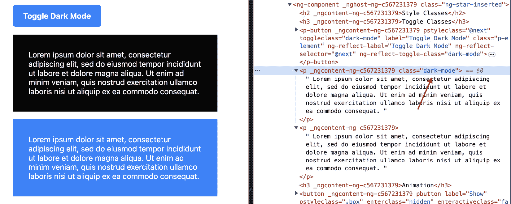
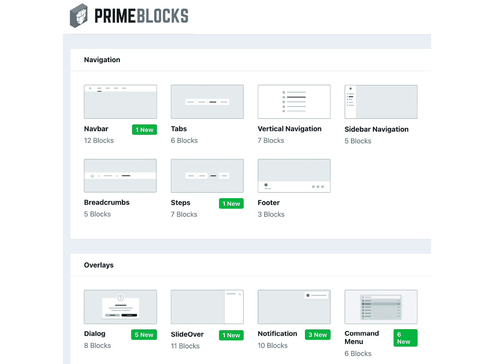
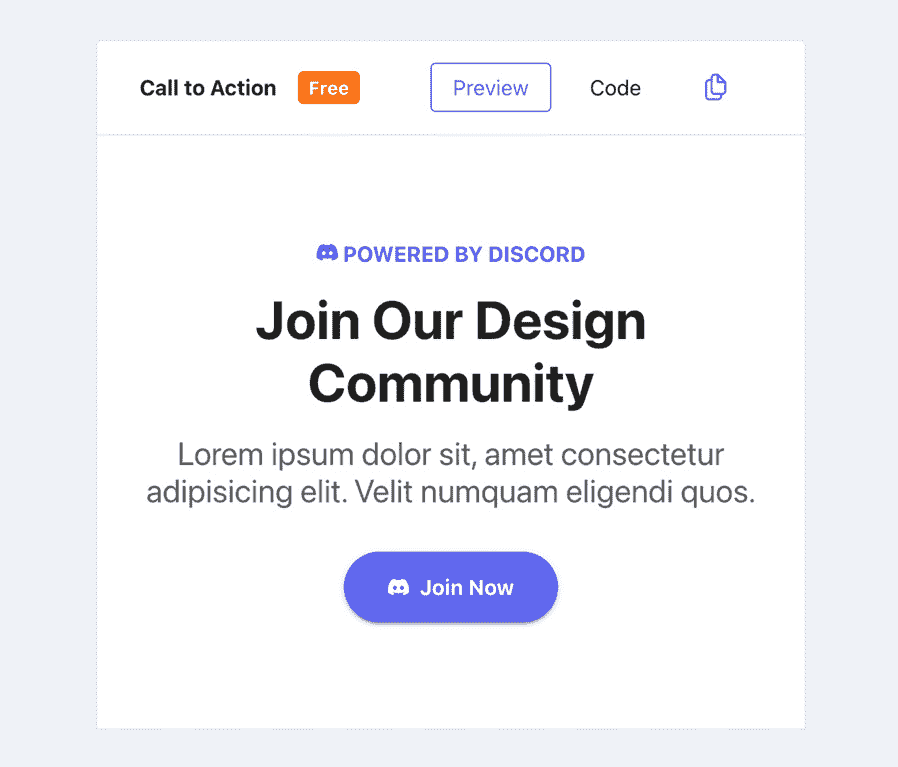
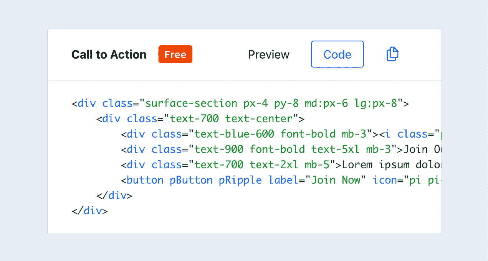
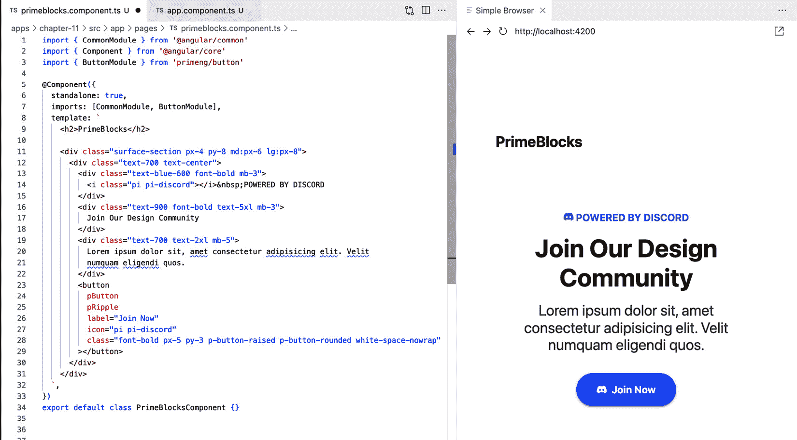
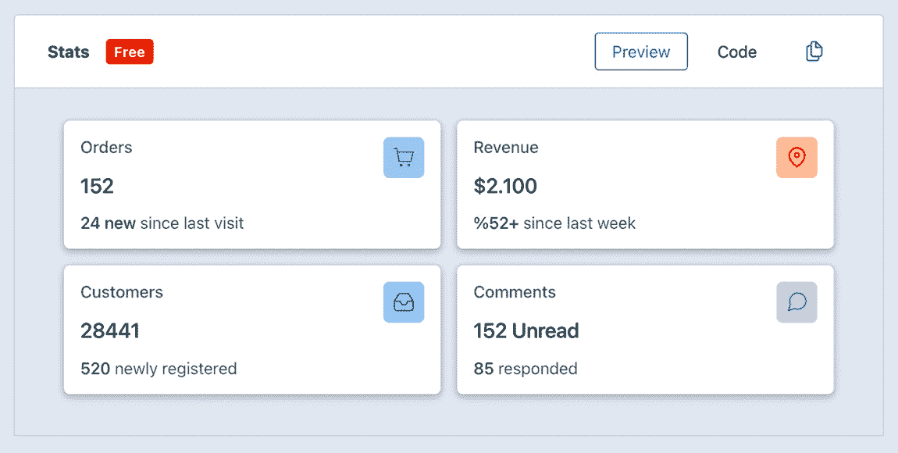
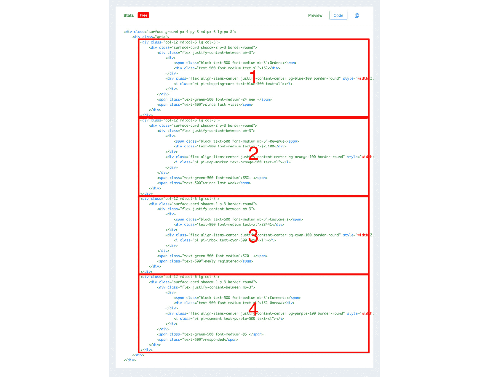
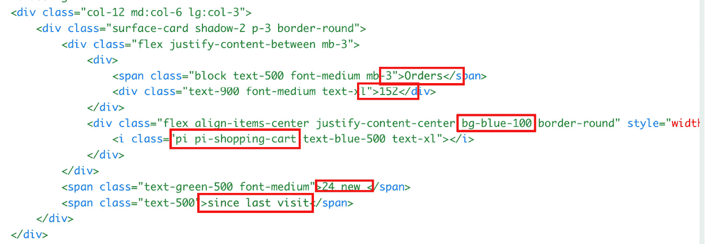
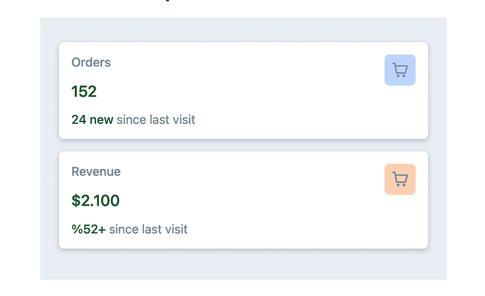

# 第十一章：创建可重用和可扩展组件

在现代网络开发中，可维护性和效率的本质在于能够制作出可以轻松重用和扩展的组件。这不仅简化了开发过程，还确保了应用程序的一致性和可维护性。因此，在本章中，我们将探讨利用 PrimeNG 构建块在 Angular 应用程序中创建可重用和可扩展组件的概念。

虽然 PrimeNG 提供了大量的预构建可重用组件，但在某些情况下，创建自定义 Angular 组件变得必要。自定义组件提供定制功能，允许您实现特定的应用程序需求并与现有代码集成。它们还支持 UI 定制，确保独特的视觉设计和用户界面。此外，自定义组件允许进行性能优化，并满足可能未由预构建组件覆盖的特定领域需求。通过权衡定制与开发工作之间的权衡，您可以利用 PrimeNG 的提供和自定义组件来构建高度适应性和高效的 Angular 应用程序。

在本章中，我们的目标是让您掌握设计能够轻松集成到各种项目、根据需求进行适应并扩展新功能的组件所需的技能。这种知识至关重要，因为它允许快速开发而不牺牲代码质量。

本章将涵盖以下主题：

+   介绍可重用和可扩展组件

+   了解 StyleClass

+   利用 PrimeBlocks 创建 UI 块

+   创建可重用和可扩展组件

+   设计您自己的组件

# 技术要求

本章包含各种工作代码示例，说明如何创建可重用和可扩展的组件。您可以在以下 GitHub 仓库的 `chapter-11` 文件夹中找到相关源代码：[`github.com/PacktPublishing/Next-Level-UI-Development-with-PrimeNG/tree/main/apps/chapter-11`](https://github.com/PacktPublishing/Next-Level-UI-Development-with-PrimeNG/tree/main/apps/chapter-11)。

# 介绍可重用和可扩展组件

在 Angular 中，可重用和可扩展组件的核心是建立在 Angular 组件本身的基础之上。唯一的区别是我们以允许我们在应用程序的不同部分轻松重用和扩展功能的方式构建它们。通过结合可重用性和可扩展性，我们可以创建促进代码重用、可维护性和灵活性的组件。

在本节中，我们将探讨它们的重要性以及构建 Angular 组件的最佳实践。

## 为什么可重用和可扩展组件很重要？

可重用和可扩展组件在开发过程中提供了几个好处：

+   首先，它们通过将复杂功能分解成更小、更可重用的单元来促进代码组织和模块化。这提高了代码的可维护性，并使得调试和测试单个组件更容易。

+   其次，可重用和可扩展的组件通过允许开发者基于现有解决方案进行构建而不是从头开始，从而提高开发效率。这在需要在大规模应用程序中在多个地方实现类似功能时，可以节省时间和精力。

+   最后，可重用和可扩展的组件通过确保在整个应用程序中一致地使用常见的 UI 元素和功能，从而有助于提供一致的用户体验。这促进了用户与系统不同部分交互时的熟悉度和可用性。

注意

优化重用性可能是一种反模式——有时维护两个在不同上下文中使用的视觉上完全相同的组件更容易。随着需求的持续演变，组件可能会增加复杂性以覆盖每个上下文的各个情况。

## 创建可重用和可扩展组件的步骤

在 Angular 中创建可重用和可扩展的组件涉及几个步骤。以下是这个过程的一般概述：

1.  **识别常见模式**：在深入代码之前，彻底分析您的应用程序以识别在多个组件或页面中出现的重复 UI 模式和功能。

1.  **设计时考虑输入和输出**：计划和实现您的组件以使其灵活和适应性强，定义允许数据从父组件传递到组件的输入属性，并指定当组件内部发生某些操作或变化时，向父组件发出事件的输出属性。

1.  **保持样式一致但可定制**：利用 Angular 的封装样式确保组件样式不影响应用程序的其他部分。然而，还应考虑提供定制选项，例如 CSS 自定义属性，以便组件的用户在需要时可以轻松覆盖或修改其样式。

1.  **编写全面的测试**：开发一套全面的测试套件以验证组件的功能和行为。包括单元测试来评估组件逻辑的各个部分，集成测试来验证其与其他组件或服务正确工作的能力，以及端到端测试来模拟真实用户交互。

1.  **彻底文档化**：为您的组件创建清晰和全面的文档。解释其目的，提供如何使用的分步说明，并在必要时提供有关扩展或定制组件的指导。包括示例、代码片段和任何相关的 API 引用，以帮助用户在项目中有效地使用组件。

## Angular 组件最佳实践

在 Angular 中构建组件时，遵循最佳实践以最大化其有效性非常重要。以下是一些需要考虑的关键实践：

+   **智能组件和展示组件**：Angular 通过使用智能组件和展示组件来促进关注点的分离。智能组件处理逻辑和数据管理，而展示组件则专注于渲染用户界面并接收输入。这种分离使得代码组织更加合理，并促进了展示组件在不同智能组件之间的重用。

+   **组件组合**：组件组合涉及通过组合较小的、可重用的组件来创建组件。这种方法鼓励构建具有单一职责的组件，使其更容易理解、测试和重用。通过组合组件，您可以利用每个组件的优势，并通过组合它们来创建更复杂的功能。

+   **输入和输出**：在组件中使用输入和输出允许父组件和子组件之间进行轻松通信。输入使数据从父组件传递到子组件成为可能，而输出则便于子组件向父组件发射事件。这种交互使得组件更加灵活和适应不同的环境和需求。

+   **模板和样式封装**：Angular 提供了封装组件模板和样式的机制，以防止意外的样式冲突并保持组件的隔离。在组件内封装模板和样式确保它们是自包含的，并且可以轻松重用，而不会影响应用的其他部分。

通过创建封装特定功能且可轻松在不同应用部分复用的组件，我们促进了代码的可重用性和可维护性。

现在，让我们转向探索`StyleClass`功能，它允许我们以灵活和动态的方式进一步自定义和样式化我们的组件。

# 了解 StyleClass

PrimeNG **StyleClass**是 PrimeNG 库为 Angular 应用提供的一个强大功能。它允许您声明式地管理 CSS 类，这使得应用动态样式、处理动画和切换元素上的类变得更容易。此功能增强了 Angular 组件的灵活性和可定制性，使您能够创建视觉上吸引人且交互性强的用户界面。

## 为什么使用 PrimeNG StyleClass？

PrimeNG StyleClass 在处理 Angular 中的自定义组件时特别有用。它提供了一种简单高效的方法来根据各种条件或事件应用样式和操作类。使用 PrimeNG StyleClass，您可以动态更改组件的外观和行为，从而提升用户体验并增加应用的交互性。

PrimeNG StyleClass 的一个关键优点是它能够在组件转换期间处理动画。通过定义进入和离开类，您可以在组件显示或隐藏时创建平滑且视觉上令人愉悦的动画。这可以极大地提升整体用户体验，并使应用程序感觉更加精致和专业。

PrimeNG StyleClass 的另一个优点是其简单性和易用性。您可以使用选择器属性定义目标元素，这使得切换类或添加动画而无需创建自己的自定义函数变得更容易。

为了进一步参考，您可以在 [`primeng.org/styleclass`](https://primeng.org/styleclass) 上探索 StyleClass 属性和关键词的完整列表。现在，让我们深入研究一些实际示例，展示如何有效地在项目中使用 StyleClass。

## 示例：切换类

让我们考虑一个示例，其中我们想要创建一个基于用户交互切换暗黑模式的自定义 Angular 组件。我们可以使用 PrimeNG StyleClass 以干净和可维护的方式实现此功能。让我们看看代码：

```js
<p-button
    pStyleClass="@next"
    toggleClass="dark-mode"
    label="Toggle Dark Mode"
/>
<p>
    <!-- CONTENT --->
</p>
```

让我们分解每个元素及其用途：

+   `pStyleClass="@next"`：具有值 `@next` 的 `pStyleClass` 指令表示应将样式类应用于下一个兄弟元素。

+   `toggleClass="dark-mode"`：此属性指定当按钮被点击时应该切换的类。在这种情况下，类名为 `dark-mode`。

总体而言，代码片段展示了 PrimeNG 的 `<p-button>` 组件使用 `pStyleClass`、`toggleClass` 和 `label` 属性的用法。它表明按钮用于通过应用或移除 `dark-mode` 类到下一个元素来切换暗黑模式。

下面是结果：



图 11.1 – 使用 StyleClass 切换暗黑模式

点击添加 `dark-mode` 类后，元素将以暗黑模式渲染。

## 示例：动画

除了应用类和样式外，PrimeNG StyleClass 还支持在组件转换期间进行动画。这可以通过指定 `enter` 和 `leave` 类及其对应的 `active` 和 `completion` 类来实现。

让我们考虑一个示例，其中我们想要为自定义 Angular 组件创建淡入和淡出动画：

```js
<button
    pButton
    label="Show"
    pStyleClass=".box"
    enterClass="hidden"
    enterActiveClass="fadein"
></button>
<button
    pButton
    label="Hide"
    pStyleClass=".box"
    leaveActiveClass="fadeout"
    leaveToClass="hidden"
></button>
<div class="hidden animation-duration-500 box">
    <p>
     <!-- CONTENT --->
    </p>
</div>
```

让我们分解代码：

+   `<button pButton ...>`：这是 PrimeNG 按钮组件，在点击后会触发动画动作。

+   `pStyleClass=".box"`：此指令针对具有 `box` 在类名中的元素。

+   `enterClass="hidden"`：这定义了当按钮被点击且框内容开始在屏幕上出现时，应针对的类 `hidden`。

+   `enterActiveClass="fadein"`：这指定了在相关元素的 `enter` 动画期间应添加的类 `fadein`。

+   `leaveActiveClass="fadeout"`：这定义了在按钮点击时添加到`leave`动画期间的`fadeout`类；之后，相关元素开始变得隐藏。

+   `leaveToClass="hidden"`：这指定了在盒内容`leave`动画消失时添加的`hidden`类。

深入理解`StyleClass`后，我们解锁了在应用中创建视觉上统一且吸引人的组件的潜力。现在，让我们过渡到使用 PrimeBlocks 来创建 UI 块，我们将利用预先设计的块来进一步加速我们的 UI 开发过程。

# 利用 PrimeBlocks 创建 UI 时钟

由 PrimeNG 开发的`PrimeFlex`。这些块旨在通过提供在 Web 应用中常用的一套预定义 UI 元素来简化开发过程。PrimeBlocks 提供各种 UI 块，包括**导航栏**、**面包屑**、**标签页**、**页脚**、**通知**、**对话框**等。这些 UI 块高度可定制，并且可以轻松集成到您的 Angular 项目中：



图 11.2 – PrimeBlocks 选项

PrimeBlocks 提供免费版和付费版，具有不同的功能。免费版提供有限的选项供选择，而付费版则提供超过 400 个预定义 UI 块的广泛选择。除了 UI 块的代码外，付费版还包括如 Figma 文件、终身支持和无限更新等有价值的额外功能。

注意

重要的是要记住，付费版有许可限制，禁止在代码公开可访问的开源项目中使用这些块。

在下一节中，我们将探讨利用 PrimeBlocks 的优缺点，以提供一个全面的概述，包括其优势和考虑因素。

## 使用 PrimeBlocks 的优缺点

与自定义 Angular 组件相比，PrimeBlocks 提供了几个优点：

+   **快速原型设计**：PrimeBlocks 是原型设计或创建概念验证应用的绝佳选择。该库提供多种组件，可以轻松组合以创建功能性的 UI。通过利用 PrimeBlocks，您可以快速创建交互式原型，以收集利益相关者的反馈或验证设计概念。这允许更快地迭代和改进应用的用户界面。

+   **一致的用户体验**：PrimeBlocks 在整个应用中提供一致且专业的用户体验。组件遵循 PrimeNG 设计语言，确保在不同屏幕和应用的各个部分中保持统一的视觉和感觉。这种一致性通过减少认知负荷和提高可用性来增强用户体验。通过使用 PrimeBlocks，您可以创建一个视觉上吸引人且直观的界面，符合行业最佳实践。

+   **定制和可扩展性**：尽管是预构建的 UI 块，但 PrimeBlocks 提供了高水平的定制和可扩展性。每个块都附带一组可配置选项和样式类，允许你根据特定要求调整组件。你可以轻松地自定义颜色、大小、布局和行为，以匹配你的应用程序的品牌和设计指南。

虽然 PrimeBlocks 提供了许多好处，但还有一些潜在的缺点需要考虑。这包括有限的定制选项，因为 UI 块是预先设计的，并且依赖于外部库或框架，许可限制禁止在开源项目中使用，以及实施块可能存在的学习曲线。将考虑这些因素与你的项目需求相对比，将有助于确定 PrimeBlocks 是否适合你的需求。

## 如何使用 PrimeBlocks

由于 PrimeBlocks 提供包含 HTML 元素的 UI 块，你只需将它们复制并粘贴到你的 Angular 组件中。在本节中，我将展示使用 PrimeBlocks 免费版本的示例。以下是一些可用的块：

+   **英雄块**：英雄块是网页顶部的突出区域，通常包含引人注目的图像或视频，以及简洁的标题和行动号召。它旨在吸引访客的注意力，并为内容创造一个视觉上有影响力的介绍。

+   **功能块**：功能块突出显示产品、服务或网站的关键功能或功能。它通常以视觉吸引人的方式展示这些功能，使用户更容易理解和评估所提供的方案。

+   **定价块**：定价块通常用于提供不同定价层级或计划的网站。它显示了各种定价选项，包括与每个计划相关的功能和好处，使用户能够比较和选择最合适的选项。

+   **行动号召块**：**行动号召**（**CTA**）块旨在提示用户采取特定行动，例如注册、购买或订阅通讯。它通常包括一个有说服力的信息，以及一个突出的按钮或链接来鼓励用户参与。

+   **横幅块**：横幅块通常放置在网页的顶部或底部，是一个水平的区域。它通常包含重要的公告或促销内容，以吸引用户的注意力并传达关键信息。

让我们看看如何使用它们。

### 开始使用

在开始之前，请确保你已经安装了正确的 PrimeNG 版本（v11.4.4+）和 PrimeFlex 版本（v3.2.0+）。如果你还没有安装 PrimeFlex，你可以输入以下命令来安装它：

```js
npm install primeflex --save
```

然后，你可以将 `primeflex.scss` 添加到 `styles.scss` 文件中：

```js
@import 'primeflex/primeflex.scss';
```

### 选择你的块

准备工作完成后，你可以实现块：

1.  在 PrimeBlocks 网站上，导航到**免费块**部分（[`blocks.primeng.org/#/free`](https://blocks.primeng.org/#/free)）并选择你想要实现的块。在这个例子中，我将选择**行动号召**块，你可以在这里看到：



图 11.3 – PrimeBlocks 行动号召

1.  点击**代码**按钮，你将看到准备使用的代码：



图 11.4 – PrimeBlocks 行动号召代码

1.  我们需要做的只是将代码复制粘贴到我们的应用程序中，它就会像魔法一样工作：



图 11.5 – 实现行动号召代码

在深入研究 PrimeBlocks 的功能后，我们看到了这些构建块如何简化我们的 UI 开发，确保一致性并节省时间。它们为快速创建视觉吸引力和功能性的用户界面提供了一个坚实的基础。然而，有时我们的项目需要更定制化的方法。在下一节中，我们将探讨如何创建符合我们独特需求的组件，同时保持可重用性和可扩展性。

# 创建可重用和可扩展的组件

作为一名开发者，我们的一个关键目标是编写干净、可维护和可重用的代码。在本节中，我们将探讨创建可重用和可扩展组件的概念。我们将以 PrimeBlocks 中的一个块为例，讨论我们如何使其更加灵活和适应不同的用例。

这里是 PrimeBlocks 中的**统计数据**块，包含四个不同的统计数据：



图 11.6 – PrimeBlocks 统计数据

在点击**代码**按钮后，我们可以看到四个不同的元素对应四个统计数据，这些可以减少并重用：



图 11.7 – PrimeBlocks 统计数据代码

提供的图像展示了 UI 中的四个统计数据（从*1*到*4*进行标记），每个都是使用几乎相同的 HTML 块创建的。这种方法导致了重复，使得维护变得具有挑战性。例如，如果你需要做出样式更改，你将不得不在四个不同的地方修改代码。这种冗余可能导致更新或改进 UI 时增加工作量并可能产生不一致性。

在检查标记为*1*的设计和代码时，我们可以查看元素之间的相似性并确定所有标签的模式：



图 11.8 – PrimeBlocks 统计数据模式

在这里，我们将模板提取为可重用和可定制的属性，允许轻松修改和灵活性：

+   `Orders`: `title`

+   `152`: `count`

+   `pi` `pi-shopping-cart`: `icon`

+   `bg-blue-100`: `iconBackground`

+   `24` `new`: `newCount`

+   `since last` `visit`: `newCountMessage`

一旦收集到这些信息，就会提取模式。然后我们可以创建一个如以下示例所示的可重用展示组件：

```js
@Component({
  selector: 'primengbook-stat',
  standalone: true,
  imports: [CommonModule],
  changeDetection: ChangeDetectionStrategy.OnPush,
  template: `
    <div class="surface-card shadow-2 p-3 border-round">
      <div class="flex justify-content-between mb-3">
        <div>
          <span class="block text-500 font-medium mb-3">{{ title }}</span>
          <div class="text-900 font-medium text-xl">{{ count }}</div>
        </div>
        <div
          class="flex align-items-center justify-content-center
{{ iconBackground }} border-round"
          style="width:2.5rem;height:2.5rem"
        >
          <i class="{{ icon }} text-blue-500 text-xl"></i>
        </div>
      </div>
      <span class="text-green-500 font-medium">{{ newCount }} </span>
      <span class="text-500">{{ newCountMessage }}</span>
    </div>
  `
})
export class StatComponent {
  @Input() title: string
  @Input() count: string
  @Input() icon: string
  @Input() iconBackground: string
  @Input() newCount: string
  @Input() newCountMessage: string
}
```

提供的代码是一个名为 `StatComponent` 的 Angular 独立组件。让我们分解其不同部分并了解它们的作用：

+   `selector: 'primengbook-stat'`: 这个属性指定了将用于在模板中表示此组件的 HTML 选择器。在这种情况下，选择器是 `primengbook-stat`，这意味着此组件可以在模板中作为 `<primengbook-stat />` 使用。

+   `changeDetection: ChangeDetectionStrategy.OnPush`: 这种变更检测策略告诉 Angular 只检查组件输入属性的变化，除非外部触发，否则不执行完整的变更检测周期。

+   `@Input()...`: 这个装饰器用于标记某些属性作为组件的输入。这些输入可以从组件的父组件或使用组件的模板中接收值。在这种情况下，组件有几个输入属性：`title`、`count`、`icon`、`iconBackground`、`newCount` 和 `newCountMessage`。

在我们的可重用组件准备就绪后，我们可以通过将其放入 `imports` 数组中在任何地方使用它：

```js
@Component({
  standalone: true,
  imports: [CommonModule, StatComponent],
  template: `
    <h2>Reusable Components</h2>
    <div class="surface-ground px-4 py-5 md:px-6 lg:px-8">
      <div class="grid">
        <primengbook-stat
          *ngFor="let stat of stats"
          [title]="stat.title"
          [count]="stat.count"
          [icon]="stat.icon"
          [iconBackground]="stat.iconBackground"
          [newCount]="stat.newCount"
          [newCountMessage]="stat.newCountMessage"
          class="col-12 md:col-6 lg:col-3"
        />
      </div>
    </div>
  `,
})
export default class ReusableComponent {
  stats = [
    {
      title: 'Orders',
      count: '152',
      icon: 'pi pi-shopping-cart',
      iconBackground: 'bg-blue-100',
      newCount: '24 new',
      newCountMessage: 'since last visit',
    },
    {
      title: 'Revenue',
      count: '$2.100',
      icon: 'pi pi-shopping-cart',
      iconBackground: 'bg-orange-100',
      newCount: '%52+',
      newCountMessage: 'since last visit',
    },
  ]
}
```

提供的代码是一个名为 `ReusableComponent` 的 Angular 独立组件。让我们分解其不同部分并了解它们的作用：

+   `imports: [CommonModule, StatComponent]`: `imports` 属性是一个数组，指定了此组件所需的模块。在这种情况下，`CommonModule` 被导入以提供常见的 Angular 指令和管道，而 `StatComponent` 被导入作为依赖项。

+   `stats = [...]`: `stats` 属性是一个包含 `title`、`count`、`icon`、`iconBackground`、`newCount` 和 `newCountMessage` 属性的对象数组。这些属性持有将传递给 `StatComponent` 以进行渲染的值。

+   `<primengbook-stat *ngFor="let stat of stats" ... />`: 这段代码将允许你遍历 `stats` 数组，并渲染 `primengbook-stat` 元素及其属性绑定。例如，`[title]="stat.title"` 将 `primengbook-stat` 组件的 `title` 属性绑定到当前 `stat` 对象的 `title` 属性。

这里是结果：



图 11.9 – 可重用 StatComponent

而不是使用重复的代码块（如*图 11.7*所示），使用可重用的组件，例如`primengbook-stat`，可以带来几个好处，包括代码可重用性、一致的外观和行为，以及增强的可维护性。通过封装功能和外观，组件可以轻松地在整个应用程序中重用，减少代码重复，并促进模块化代码库。它确保了应用程序不同部分的一致样式和交互，并通过允许在一个地方进行更新来简化维护。总的来说，它提高了开发效率，并提供了更好的用户体验。

在我们探索创建可重用和可扩展组件的过程中，我们发现了根据我们的特定需求定制组件的细微差别，同时不牺牲其适应性。这种知识使我们能够构建更高效、更易于维护的 Angular 应用程序。随着我们过渡到下一部分，我们将深入了解如何从头创建组件，确保它们与项目独特的需求完美匹配。

# 使用 PrimeNG 制作自己的组件

创建自己的组件是现代网络开发的基本方面。虽然预构建组件可能很方便，但在某些情况下，构建自定义组件是满足特定要求所必需的。在本部分中，我们将探讨创建自定义组件的原因，并学习如何利用 PrimeNG 来制作您的自定义组件。

注意

总是确保您的自定义组件是可访问的、响应式的和用户友好的。在不同的设备和浏览器上测试它们，以确保一致的用户体验。

## 为什么创建自定义组件？

预构建组件，如 PrimeNG、Bootstrap 或 Material 提供的，非常出色。它们节省时间，确保一致性，并且通常带有内置的访问性功能。然而，在某些情况下，它们可能不是完美的选择：

+   **独特的设计要求**：您的应用程序可能有一个与预构建组件的样式不一致的设计。在这种情况下，自己制作确保 UI 与您的设计指南保持一致。

+   **特定的功能需求**：预构建组件提供了一般功能。如果您的应用程序需要具有非常特定行为的组件，通常从头开始构建比修改预构建组件更容易。

+   **性能**：自定义组件可以根据您的应用程序特定需求进行优化，在某些情况下可能提供更好的性能。

+   **代码可维护性和可重用性**：通过在定义良好的组件中封装特定的功能，您可以模块化您的代码库。这种模块化方法使得管理和维护应用程序的代码变得更加容易，因为每个组件都可以独立地进行开发、测试和更新。

## 示例：利用 PrimeNG 创建登录组件

PrimeNG 提供了大量的 UI 组件和实用工具，可以帮助您创建自定义组件。在继续创建组件之前，考虑以下因素是至关重要的：

+   **准备好设计**：假设组件的设计已经使用设计工具（如 Figma 或 Sketch）准备就绪。这确保了有一个清晰的视觉参考来指导实现过程。

+   **表单和提交逻辑**：在此示例中，重点将放在组件结构和功能上，而不是实际的表单提交。实现将省略与表单提交相关的特定逻辑。

+   **使用 PrimeFlex 进行样式设计**：组件的样式将通过 PrimeFlex 实用类来实现。这些实用类提供了一种方便且一致的方式来应用样式和布局选项，确保设计的一致性和响应性。

+   **账户创建和密码重置链接**：本示例将不包括创建新账户或重置忘记的密码的链接实现。重点将放在组件本身的核心功能上。

考虑这些点有助于设定上下文并明确组件创建过程的范围。这确保了关注点始终集中在组件的结构、功能以及集成上，同时承认将不包括此特定示例的设计、样式和特定功能。

现在，让我们使用 PrimeNG 创建一个登录组件。首先，使用 Angular CLI 生成一个新的组件：

```js
ng g c sign-in 
```

然后，在 `sign-in.component.ts` 文件中，构建用户界面：

```js
@Component({
  selector: 'primengbook-sign-in',
  standalone: true,
  imports: [CommonModule, ButtonModule, InputTextModule, CheckboxModule],
  template: `
    <div class="surface-card p-4 shadow-2 border-round w-full lg:w-6">
      ...
      <div>
        <div class="p-inputgroup mb-3">
          <span class="p-inputgroup-addon">
            <i class="pi pi-user"></i>
          </span>
          <input id="username" type="text" pInputText placeholder="Username" />
        </div>
        <div class="p-inputgroup mb-3">
          <span class="p-inputgroup-addon">
            <i class="pi pi-lock"></i>
          </span>
          <input
            id="password"
            type="password"
            pInputText
            placeholder="Password"
          />
        </div>
        <div class="flex align-items-center justify-content-between mb-5">
          <div class="flex align-items-center">
            <p-checkbox
              id="rememberme"
              [binary]="true"
              class="mr-2"
            ></p-checkbox>
            <label for="rememberme" class="text-900">Remember me</label>
          </div>
          <a
            href="/forgot-password"
            class="font-medium no-underline ml-2 text-blue-500 text-right cursor-pointer"
            >Forgot password?</a
          >
        </div>
        <button pButton type="button" label="Sign In" class="w-full"></button>
      </div>
    </div>
  `,
})
export class SignInComponent {}
```

让我们分解代码并解释其功能：

+   `imports: [..., ButtonModule, InputTextModule, CheckboxModule]`：这一行指定了组件正确运行所需的模块。在这种情况下，组件需要从 PrimeNG 导入 `ButtonModule`、`InputTextModule` 和 `CheckboxModule` 模块。

+   `template: '...'`：这是一个 HTML 模板，由各种元素和类组成，这些元素和类定义了登录表单的视觉结构和行为，例如用户名字段、密码字段、记住我功能、密码重置以及提交按钮。

现在，要在您的应用程序中使用登录组件，打开目录中的任何组件/模板，并使用以下代码更新其内容：

```js
<primengbook-sign-in />
```

下面是结果：


图 11.10 – 登录组件

我们已成功使用 PrimeNG 组件渲染了登录组件。

总结来说，自己动手制作组件赋予你构建定制解决方案的能力，这些解决方案能够完美满足你应用的需求。通过利用 Angular 的组件架构和 PrimeNG 丰富的组件和功能集，你可以创建模块化、可扩展和可定制的元素，从而提升用户体验。现在，让我们继续到章节总结部分，我们将回顾本章涵盖的关键点，并强调本章的重要收获。

# 摘要

在我们的旅程中，我们深入研究了创建可重用和可扩展组件的领域。本章的核心是赋予你知识和技巧，以便你可以制作出可以在应用的多个部分或甚至在不同项目中重用的组件，同时保持根据需要扩展和定制的灵活性。

在本章中，我们探讨了尽管有大量的预构建组件可用，但为何我们仍然需要自己动手制作组件。无论是为了满足独特的设计要求、满足特定的功能需求，还是优化性能，自定义组件在我们的开发者工具箱中都有其位置。

此外，使用 PrimeNG，我们看到了如何增强我们的自定义组件。从创建自定义组件到理解 PrimeBlocks 和 StyleClass 的强大功能，PrimeNG 证明是一个无价的资产。

随着我们转向下一个主题，我们将深入探讨国际化与本地化。这将是一次激动人心的探索，旨在使我们的应用成为全球友好的，确保它们能够满足各种语言和区域偏好。这关乎提供无缝的用户体验，无论我们的用户来自何方或他们使用什么语言。所以，随着我们踏上新的旅程，让我们使我们的应用真正成为全球性的。
