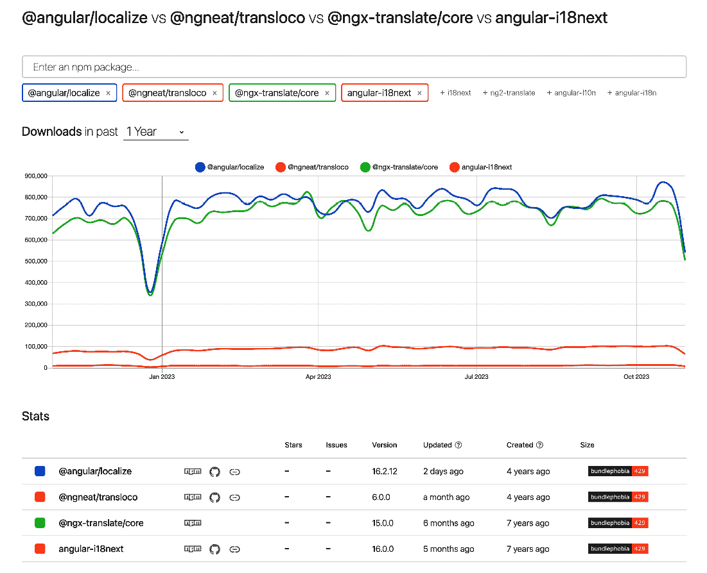
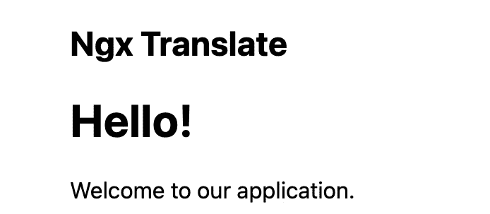
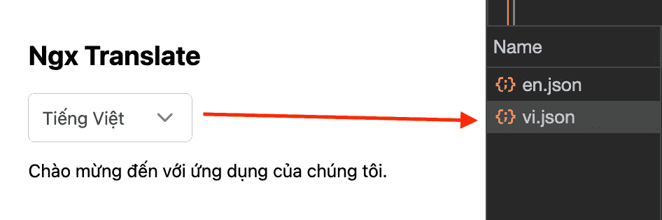
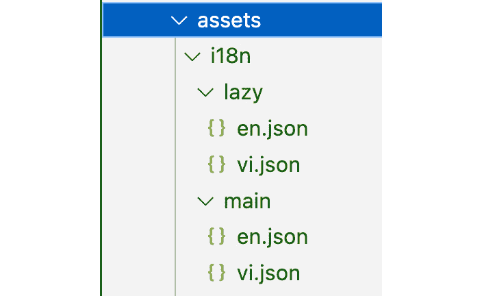
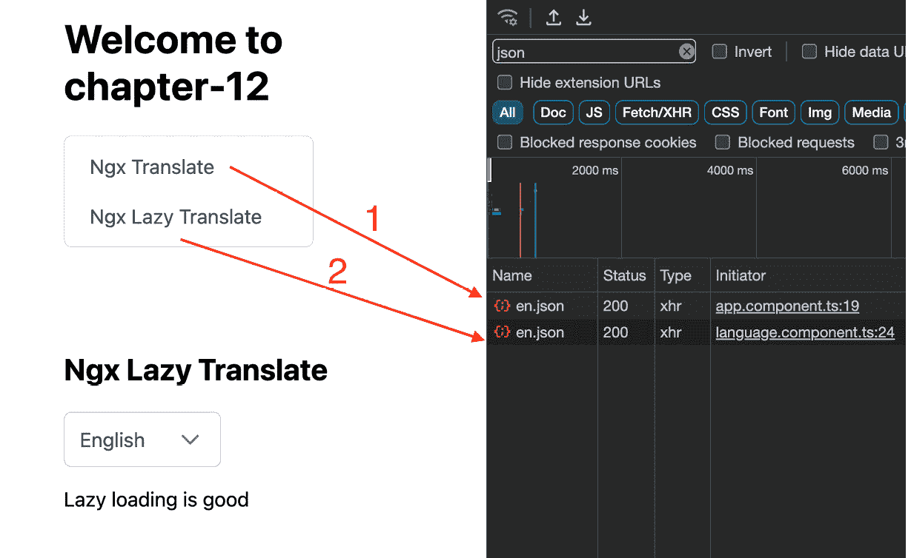
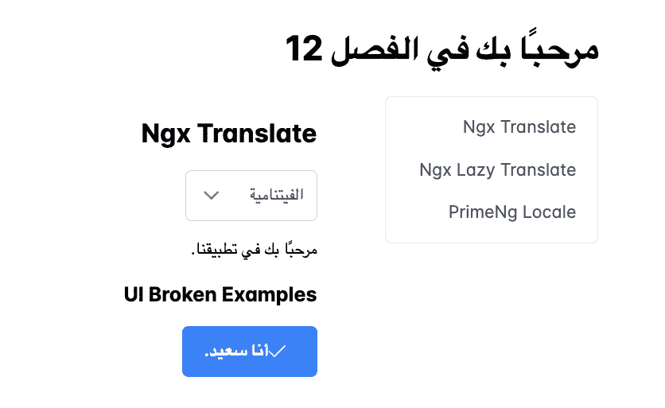
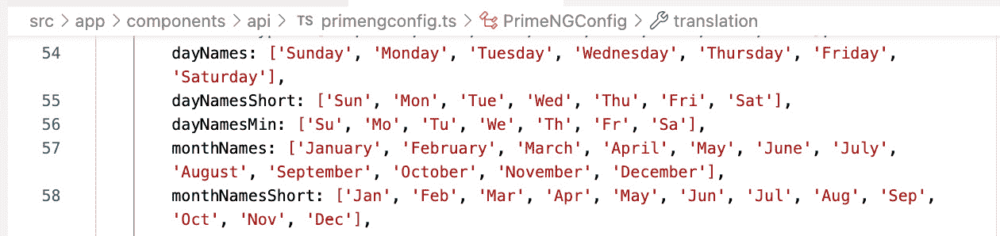
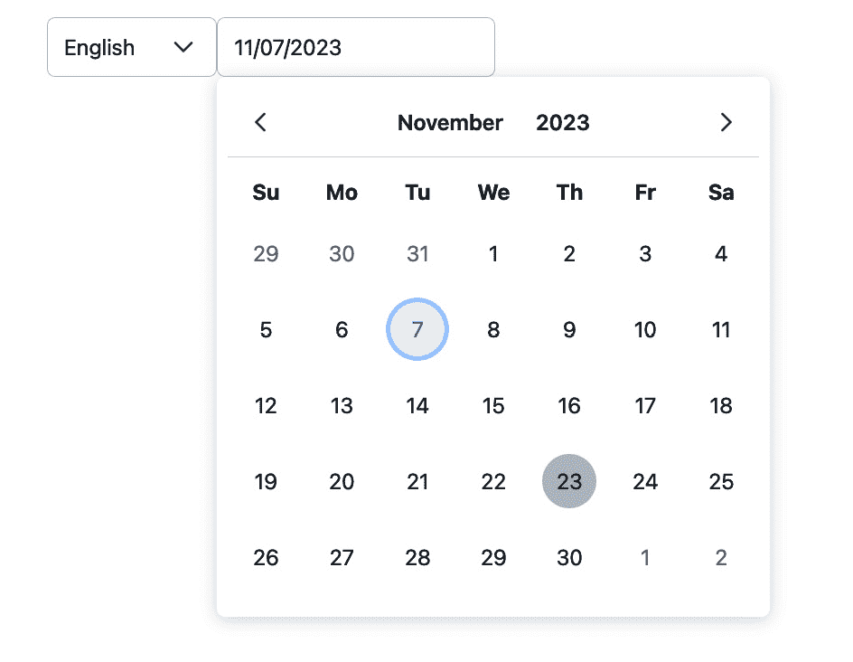
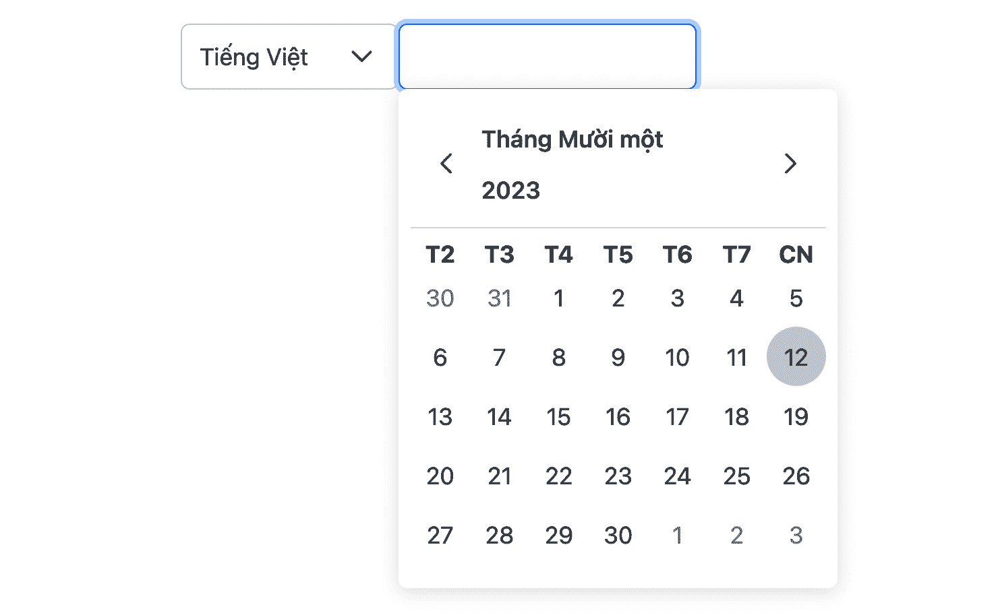

# 12

# 使用国际化与本地化进行操作

在数字时代，应用程序被来自世界各地的用户访问。为了满足全球受众的需求，不仅仅是翻译内容；它还涉及到提供无缝的用户体验，尊重文化细微差别和用户偏好。确保您的应用程序在字面意义上和比喻意义上都能使用户的语言，可以显著提高用户满意度和参与度。

因此，在本章中，我们的主要目标是为您提供必要的知识和工具，使您的应用程序具有普遍的可用性和用户友好性。我们将通过深入探讨国际化与本地化的领域，指导您使用 PrimeNG 组件使您的 Angular 应用程序成为全球友好的。到本章结束时，您将能够熟练配置语言支持，确保您的应用程序无论用户的地理或文化背景如何，都能引起用户的共鸣。

本章将涵盖以下主题：

+   介绍国际化与本地化

+   探索 Angular 的流行国际化库

+   使用 ngx-translate 进行国际化

+   使用 PrimeNG Locale 进行操作

# 技术要求

本章包含各种关于国际化和本地化的工作代码示例。您可以在以下 GitHub 仓库的 `chapter-12` 文件夹中找到相关源代码：[`github.com/PacktPublishing/Next-Level-UI-Development-with-PrimeNG/tree/main/apps/chapter-12`](https://github.com/PacktPublishing/Next-Level-UI-Development-with-PrimeNG/tree/main/apps/chapter-12)。

# 介绍国际化与本地化

在全球网络开发领域，确保应用程序满足全球受众的需求至关重要。这就是**国际化**（**i18n**）和**本地化**（**l10n**）发挥作用的地方，尤其是在**Angular**应用程序的背景下。

## 在 Angular 应用程序中介绍国际化（i18n）

国际化，通常缩写为 i18n（因为“i”和“n”之间有 18 个字母），是将您的应用程序设计并准备为在不同语言中使用的过程。例如，i18n 需要在产品设计时考虑语言和文化差异，包括使用**Unicode**字符编码、避免硬编码文本，并允许足够的文本扩展空间。

注意

Unicode 提供了通用的字符编码，这意味着每个字符都被分配了一个唯一的代码点，无论平台、语言还是应用程序。它确保软件可以处理和显示不同语言和脚本中的文本，使应用程序在多样化的语言和文化环境中可访问和可用。您可以在[`unicode.org`](https://unicode.org)了解更多信息。

有许多 Angular 库可以支持这一点，允许你定义内容翻译并在它们之间无缝切换。我们很快就会看看这些库。

## 理解本地化（l10n）在创建多语言体验中的作用

本地化，简称为 l10n（因为“l”和“n”之间有 10 个字母），是 i18n 的后续步骤。它涉及通过添加特定区域或语言的本地化翻译和调整格式来适应国际化的应用程序。本质上，虽然 i18n 是关于使应用程序可翻译的，但 l10n 是关于实际翻译和适应的。

在 Angular 中，一旦提供了翻译，就可以使用这些翻译来编译应用程序，以生成特定语言或地区的应用程序版本。

## 设计国际化友好应用程序的挑战和考虑因素

创建一个能够引起全球受众共鸣的应用程序并非没有挑战：

+   **文本扩展**：某些语言可能对相同内容的翻译更长。例如，在英语中，“I’m happy”可以翻译成越南语的“*Tôi đang cảm thấy hạnh phúc*”；如果不妥善处理，这可能会影响 UI 布局。

+   **从右到左的语言**：如阿拉伯语或希伯来语这样的语言是从右到左书写的，这可能需要重大的布局调整。例如，原本在左侧的菜单项需要移动到右侧在阿拉伯语中。

+   **文化细微差别**：颜色、符号和图像在不同地区可能有不同的文化含义。例如，竖起大拇指的手势在西方文化中通常用来表示赞同，但在一些其他国家可能会被视为冒犯或不恰当。

+   **日期、时间和数字格式**：不同地区显示日期、时间和数字的格式不同。例如，在美国，日期格式通常是“mm/dd/yyyy”，而在许多欧洲国家，则是“dd/mm/yyyy”。

+   **翻译管理**：有效地管理翻译可能具有挑战性，尤其是在具有大量文本字符串的大规模应用程序中。例如，使用翻译管理系统可以提供诸如翻译记忆等特性，其中以前翻译的短语被存储和重复使用，从而减少翻译重复内容所需的时间和精力。

重要提示

总是注意文化细微差别；在一个文化中可以接受或中性的东西，在另一个文化中可能就是冒犯的。

当使用 Angular 时，一开始就了解这些挑战是有益的。通过这样做，你可以设计你的应用程序，以最小化在添加对新语言或地区支持时可能出现的潜在问题。

# 探索 Angular 的流行国际化库

i18n 是构建面向全球受众的 Angular 应用程序的关键方面。幸运的是，有几个可靠的 i18n 库可供 Angular 使用，它们简化了翻译和本地化的过程。在本节中，我们将探讨一些流行的 Angular i18n 库，包括 `@angular/localize`、`ngx-translate`、`@ngneat/transloco` 和 `angular-i18next`。

下面是这些库在 NPM 趋势中的当前统计信息：



图 12.1 - 来自 NPM 趋势的 Angular i18n 库统计信息

从趋势来看，`@angular/localize` 和 `ngx-translate` 是主要玩家，每天大约有 50 万次下载，而 `@ngneat/transloco` 大约有 10 万次下载，`angular-i18next` 大约有 1.3 万次下载。最新的更新也已经对 `@angular/localize` 和 `@ngneat/transloco` 进行了。

重要提示

考虑与第三方库相关的安全漏洞和更新是选择第三方库时的关键方面。您可以通过参考 [`snyk.io/advisor`](https://snyk.io/advisor) 来评估这些因素。

让我们比较它们的特性，讨论它们的优缺点，并提供不同场景下的推荐。

## @angular/localize

`@angular/localize` 利用 Angular 的编译器从模板中提取和替换可翻译文本。以下是其主要特性：

+   `@angular/localize` 通过静态分析模板在构建过程中执行翻译。这种方法允许高效翻译并消除了对运行时翻译库的需求。

+   `ng extract-i18n`) 从应用程序的模板中提取可翻译文本并生成翻译文件。这些文件随后可以被语言专家进行翻译。

+   `@angular/localize` 通过在模板表达式中提供特殊语法支持复数和性别一致。这允许在不同语言环境中进行准确的翻译。

尽管有一些缺点：

+   在构建过程中需要编译步骤，这可能会增加大型应用程序的构建时间

+   对动态内容翻译和运行时语言切换的支持有限

通常，`@angular/localize` 适用于在构建过程中优先考虑高效翻译且不需要动态翻译或运行时语言切换的项目。

## ngx-translate

**ngx-translate** ([`github.com/ngx-translate/core`](https://github.com/ngx-translate/core)) 是一个流行的 Angular 第三方 i18n 库，为 Angular 应用提供灵活且功能丰富的翻译解决方案。以下是其一些显著特性：

+   `ngx-translate` 在运行时执行翻译，允许动态语言切换和即时翻译更新。

+   **翻译加载**：翻译可以从各种来源加载，包括 JSON 文件、API 甚至内联定义。这种灵活性使得与不同的翻译管理系统集成变得容易。

+   `ngx-translate` 支持翻译中的复数形式和变量替换，提供了丰富的语言特定功能。

这里有一些缺点：

+   分割翻译效果不佳，设置复杂

+   在运行时加载翻译可能会导致**内容闪烁**（**FOC**）效果，即翻译被加载并应用，可能会造成瞬间的视觉闪烁

通常，`ngx-translate`适用于需要动态翻译更新、运行时语言切换和灵活翻译加载的工程。

## @ngneat/transloco

**@ngneat/transloco** ([`ngneat.github.io/transloco`](https://ngneat.github.io/transloco)) 是一个相对较新的 Angular 国际化库，旨在提供灵活且可扩展的翻译方法。它提供了独特的功能和现代的 i18n 方法。以下是它的主要特性：

+   `@ngneat/transloco` 支持翻译文件的懒加载，允许优化翻译的加载。这对于具有大量可翻译文本的大型应用程序尤其有益。

+   `@ngneat/transloco` 允许将翻译范围限定到特定的组件或模块。当应用程序的不同部分需要不同的翻译集时，这个特性非常有用。

+   `@ngneat/transloco` 提供了对内联翻译的支持，允许开发者直接在模板中定义翻译。这个特性简化了翻译过程，减少了单独翻译文件的需求。

只有一个主要缺点：

+   与其他成熟的 i18n 库相比，它是一个不太受欢迎的库，社区规模较小。由于社区规模较小，可能可用的资源、教程和示例较少，这可能会帮助开发者入门和解决问题。

通常，`@ngneat/transloco`适用于需要懒加载翻译、范围翻译和现代国际化（i18n）方法的工程。

## angular-i18next

`angular-i18next` ([`github.com/Romanchuk/angular-i18next`](https://github.com/Romanchuk/angular-i18next)) 是一个集成库，它将强大的 `i18next` 库与 Angular 结合。`i18next` 是 JavaScript 生态系统中广泛使用的 i18n 库。以下是 `angular-i18next` 的一些显著特性：

+   `angular-i18next` 利用 `i18next` 的广泛功能集，包括对插值、复数形式、上下文等的支持。

+   **灵活的翻译来源**：翻译可以从各种来源加载，如 JSON、XHR 甚至后端 API。这种灵活性使得与不同的翻译管理系统集成变得容易。

+   `angular-i18next`提供了额外的 l10n 功能，例如日期和数字格式化，这在某些场景中可能很有益。

这里有一些缺点：

+   需要熟悉 Angular 和`i18next`

+   它很复杂，与其它相比，捆绑包大小很大

通常，`angular-i18next`适用于需要广泛 i18n 功能、翻译加载灵活性和额外 l10n 功能的工程项目。

重要提示

重要的是要注意，这些比较和建议并不全面，一个库的适用性可能因具体项目需求和限制而异。在做出决定之前，您应该仔细评估每个库的功能、权衡和社区支持。

在下一节中，我们将使用`ngx-translate`库探索 i18n，该库也在官方 PrimeNG 网站上突出展示。

# 使用 ngx-translate 进行国际化工作

在上一节的基础上，`ngx-translate`提供了一个简单且可适应的方法来翻译 Angular 应用程序。在本节中，我们将深入了解将 ngx-translate 集成到 Angular 应用程序中的步骤，并提供有关如何最大化使用 ngx-translate 生产力的宝贵见解和策略。

## 将 ngx-translate 集成到 Angular 应用程序中

要开始使用`ngx-translate`，请按照以下步骤将其集成到您的 Angular 应用程序中：

1.  首先，安装`ngx-translate`库。打开终端并导航到您的 Angular 项目的根目录。然后，运行以下命令来安装`ngx-translate`：

    ```js
    npm install @ngx-translate/core @ngx-translate/http-loader --save
    ```

    此命令将安装`core`和`http-loader`包，用于使用`HttpClient`初始化和加载翻译文件。

1.  在您的 Angular 应用程序中，打开`app.config.ts`文件，并从`ngx-translate`导入必要的模块和配置：

    ```js
    // translation.provider.ts
    import { HttpClient } from '@angular/common/http'
    import { importProvidersFrom, makeEnvironmentProviders } from '@angular/core'
    import { TranslateLoader, TranslateModule } from '@ngx-translate/core'
    import { TranslateHttpLoader } from '@ngx-translate/http-loader'
    export function HttpLoaderFactory(http: HttpClient) {
      return new TranslateHttpLoader(http)
    }
    export const provideTranslation = () =>
      makeEnvironmentProviders([
        importProvidersFrom(
          TranslateModule.forRoot({
            defaultLanguage: 'en',
            loader: {
              provide: TranslateLoader,
              useFactory: HttpLoaderFactory,
              deps: [HttpClient],
            },
          })
        ),
      ])
    // app.config.ts
    export const appConfig: ApplicationConfig = {
      providers: [
        ...
        provideHttpClient(),
        provideTranslation()
      ],
    }
    ```

    提供的代码负责在 Angular 应用程序中使用`ngx-translate`配置和提供翻译功能。让我们分解它以了解其目的：

    +   `export function HttpLoaderFactory() {...}`：此代码导出一个名为`HttpLoaderFactory`的工厂函数。此函数用于创建`TranslateHttpLoader`类的实例，该类负责使用 HTTP 协议从`/assets/i18n/[lang].json`文件（在这种情况下，lang 是`en`）加载翻译文件。它接受`HttpClient`类的实例作为参数，并返回一个新的`TranslateHttpLoader`实例。

    +   `export const provideTranslation =` `()...`：此函数返回调用`makeEnvironmentProviders`的结果，这是一个由 Angular 提供的实用函数，用于生成提供者。此函数从`TranslateModule.forRoot({...})`方法导入提供者，该方法负责在应用级别配置`ngx-translate`模块，以下为配置：

        +   `defaultLanguage:` `'en'`：此选项表示英语是默认语言。对于较大的项目，建议采用`<language>-<REGION>`模式，例如`en-US`（美国英语）或`en-CA`（加拿大英语）。随着公司的扩张，可能需要满足不同地区相似语言的变体。

        +   `loader:` `{...}`：此属性将提供属性设置为`TranslateLoader`，表示使用`TranslateLoader`类进行翻译加载。`useFactory`属性设置为`HttpLoaderFactory`，这是之前定义的工厂函数。`deps`属性指定了工厂函数所需的依赖项，在这种情况下是`HttpClient`。

    +   `export const appConfig...`：将`provideHttpClient()`和`provideTranslation()`提供者添加到应用程序的依赖注入系统中，使`HttpClient`和翻译功能在整个应用程序中可用。

1.  为每种支持的语言创建翻译文件。例如，为英文翻译创建一个`en.json`文件，为越南文翻译创建一个`vi.json`文件。将这些文件放置在适当的目录中，例如`src/assets/i18n/`。

    翻译文件应遵循键值结构，其中键代表翻译键，值代表翻译文本。以下是一个示例：

    ```js
    // en.json
    {
      "greeting": "Hello!",
      "welcome": "Welcome to our application."
    }
    // vi.json
    {
      "greeting": "Xin chào!",
      "welcome": "Chào mùng đên vói úng dung cúa chúng tôi."
    }
    ```

1.  现在，您可以使用`translate`管道将文本翻译到您的 Angular 模板中。只需将`translate`管道添加到您想要翻译的文本中，并将翻译键作为参数传递。以下是一个示例：

    ```js
    @Component({
      standalone: true,
      template: `
        <h2>Ngx Translate</h2>
        <h1>{{ 'greeting' | translate }}</h1>
        <p>{{ 'welcome' | translate }}</p>
      `,
      imports: [CommonModule, TranslateModule],
    })
    export default class NgxTranslateComponent {}
    ```

    通过导入`TranslateModule`，您将能够访问`translate`管道，该管道将替换翻译键为相应的翻译文本。

让我们看看结果：



图 12.2 – 使用 ngx-translate 的英文翻译示例

从图像中，我们可以看到`translate`管道正在正确工作。`greeting`键现在从`en.json`文件变为`Hello!`。

## 使用 ngx-translate 的技巧和窍门

要有效地使用`ngx-translate`，请考虑以下技巧和窍门：

### 语言切换

`ngx-translate`提供了一个方便的方法在运行时切换不同的语言。您可以通过使用`TranslateService`的“use”方法来实现这一点。

以以下`LanguageComponent`为例：

```js
import { TranslateService } from '@ngx-translate/core'
import { DropdownChangeEvent, DropdownModule } from 'primeng/dropdown'
@Component({
  standalone: true,
  selector: 'primengbook-language',
  template: `
    <p-dropdown
      [options]="languages"
      optionLabel="label"
      optionValue="value"
      (onChange)="switchLanguage($event)"
    />
  `,
  imports: [CommonModule, DropdownModule],
})
export class LanguageComponent {
  private translationService = inject(TranslateService)
  languages = [
    {
      label: 'English',
      value: 'en',
    },
    {
      label: 'Tiếng Việt',
      value: 'vi',
    },
  ]
  switchLanguage(event: DropdownChangeEvent) {
    this.translationService.use(event.value)
  }
}
```

提供的代码是一个共享组件，它使用 PrimeNG 的`DropdownModule`和 ngx-translate 的`TranslateService`来表示语言选择下拉菜单。让我们更详细地分析一下：

+   `<p-dropdown ... />`：此代码使用 PrimeNG 的 `p-dropdown` 组件来渲染下拉列表。选项属性绑定到 `languages` 数组，该数组包含语言对象数组。`optionLabel` 属性指定用于每个选项的 `label` 属性，而 `optionValue` 属性指定用于每个选项的 `value` 属性。`(onChange)` 事件绑定在更改下拉选择时调用 `switchLanguage()` 方法，并传递 `event` 对象。

+   `switchLanguage(event) {...}`：当下拉选择更改时调用此方法。它接收类型为 `DropdownChangeEvent` 的 `event` 对象，并使用 `translationService` 将活动语言切换到下拉菜单中选择的值。

这是结果：



图 12.3 – 切换语言为越南语

从图像中，您可以看到当我们从英语切换到越南语时，应用程序动态加载包含翻译的越南语版本的 `vi.json` 文件。因此，更改在运行时得到及时反映。

### 懒加载

`ngx-translate` 提供了一个有用的功能，称为懒加载，允许在需要时按需加载翻译。此功能对于具有多种语言的大型应用程序特别有益，因为它通过仅在需要时加载翻译来帮助优化初始加载时间。

要在 `ngx-translate` 中启用懒加载，您需要修改翻译加载器配置。而不是预先加载所有翻译文件，您可以设置加载器动态加载请求的翻译。以下是一个翻译文件的示例：



图 12.4 – 重新组织翻译文件

根据图像，我们将位于根级别的所有翻译内容转移到 `assets/i18n/main` 目录。至于懒加载组件的翻译文件，我们可以将它们存储在单独的路径中，例如 `assets/i18n/lazy`，这将按需加载。

以下是我们的主要翻译加载器的更新代码：

```js
// translation.provider.ts
export function HttpLoaderFactory(http: HttpClient) {
  return new TranslateHttpLoader(http, './assets/i18n/main/', '.json')
}
```

您可以看到，加载翻译文件的路径已从 `./assets/i18n` 更改为 `./assets/i18n/main`。

之后，我们为懒加载组件创建翻译配置：

```js
// lazy-translation.provider.ts
function HttpLoaderFactory(http: HttpClient) {
  return new TranslateHttpLoader(http, './assets/i18n/lazy/', '.json')
}
export const provideLazyTranslation = () =>
  makeEnvironmentProviders([
    importProvidersFrom(
      TranslateModule.forChild({
        defaultLanguage: 'en',
        isolate: true,
        loader: {
          provide: TranslateLoader,
          useFactory: HttpLoaderFactory,
          deps: [HttpClient],
        },
      })
    ),
  ])
// app.routes.ts
export const appRoutes: Route[] = [
  ...
  {
    path: 'ngx-lazy-translate',
    loadComponent: () => import('./pages/ngx-lazy-translate.component'),
    providers: [provideLazyTranslation()],
  },
]
```

在代码片段中，懒加载翻译的配置与主配置（`translation.provider.ts`）相同。但是，有一些区别：

+   `function HttpLoaderFactory(http: HttpClient) { ... }`：该函数返回一个配置为从 `'./assets/i18n/lazy/'` 目录加载具有 `.json` 文件扩展名的翻译文件的 `TranslateHttpLoader` 的新实例。

+   `TranslateModule.forChild({..})`：此函数用于懒加载模块/路由。它接受一个包含各种配置属性的 `options` 对象：

    +   `isolate: true`: 这表示翻译应该为懒加载的模块隔离，这意味着它们不会与其他模块共享

    +   `useFactory: HttpLoaderFactory`: 这指定了将加载翻译文件的翻译加载器，这些文件来自`HttpLoaderFactory`配置

+   `providers: [provideLazyTranslation()]`: 这指定了此路由的提供者数组。在这种情况下，它包括调用`provideLazyTranslation()`函数的结果，这将触发懒加载翻译过程，如前一个代码解释中所述。

让我们看看结果：



图 12.5 – 懒加载翻译

现在，在图片中，你会观察到应用程序的加载行为。在初始加载时，翻译文件（标记为`ngx-lazy-translate`路由），应用程序将动态加载特定于该路由的翻译文件（标记为**2**）并正确显示翻译的值。

### 从右到左的语言

在**从右到左**（**RTL**）语言中，用户界面的布局与**从左到右**（**LTR**）语言相比是镜像的。这包括元素顺序的颠倒，如文本、按钮和导航。主要目标是使内容对齐到屏幕的右侧，为 RTL 读者创造自然的流动。

当使用 i18n 库时，一个常见的做法是在切换语言后设置文本的方向。以下是一个示例代码：

```js
private updateHtmlTag(lang: string) {
  let direction = 'ltr'
  if (['ar'].includes(lang)) {
    direction = 'rtl'
  }
  this.document.getElementsByTagName('html')[0].setAttribute('lang', lang)
  this.document.getElementsByTagName('body')[0].setAttribute('dir', direction)
}
```

提供的代码代表一个方法，该方法根据指定的语言参数更新文档的 HTML 标签属性。默认情况下，文本方向是左到右（`ltr`）。然而，如果语言更改为阿拉伯语（`ar`），代码将更新 body 元素的文本方向为从右到左（`rtl`），并且`html`元素的`lang`属性也将更改为`ar`。

让我们看看结果：



图 12.6 – 从右到左的语言

从图片中，你可以看到当我们把语言切换到阿拉伯语（`ar`）后，布局从左到右变为从右到左。

总之，通过使用 ngx-translate，你可以轻松处理多语言支持并在不同语言版本之间动态切换。现在，让我们过渡到探索**PrimeNG Locale**，这是配置和自定义 PrimeNG 组件 l10n 设置的另一个重要工具。

# 与 PrimeNG Locale 一起工作

PrimeNG Locale 是 PrimeNG 提供的一个功能，它允许你配置和自定义其组件的 l10n 设置。它允许你定义特定于区域的配置，如语言、日期格式、时间格式和数字格式。通过使用 PrimeNG Locale，你可以确保你的应用程序满足来自不同地区和文化的用户的需求。

要使用 PrimeNG Locale，有必要理解在 Angular 项目中配置和应用的过程。默认情况下，PrimeNG 仅包含英文翻译的区域设置。要本地化 PrimeNG 组件，需要手动更新翻译。

例如，以下是与 PrimeNG `Calendar`组件对应的区域设置选项及其翻译：



图 12.7 – 日历组件翻译示例

根据代码，很明显 PrimeNG 在`Calendar`组件中包含了这些英文翻译的措辞。这意味着在打开`Calendar`组件时，你会看到相关的文本显示：



图 12.8 – 英文中的日历组件

在打开日期选择器后，你可以观察到月份和日期来自`monthNames`和`dayNamesMin`选项。

重要提示

PrimeNG 还提供了一个社区支持的`PrimeLocale`仓库（[`github.com/primefaces/primelocale`](https://github.com/primefaces/primelocale)），你可以使用或为其翻译内容做出贡献。

现在，让我们通过一个例子来看看如何将翻译添加到 PrimeNG 的`Calendar`组件中：

1.  要整合 PrimeNG 的区域设置选项的翻译版本，你有两种选择：要么雇佣翻译人员提供翻译，要么从`PrimeLocale`仓库中检索。以下是从`PrimeLocale`获得的越南文翻译版本（*图 12**.7*）的区域设置选项：

    ```js
    {
        "vi": {
            "dayNames": ["Chủ nhật", "Thứ hai", "Thứ ba", "Thứ tư", "Thứ năm", "Thứ sáu", "Thứ bảy"],
            "dayNamesShort": ["CN", "T2", "T3", "T4", "T5", "T6", "T7"],
            "dayNamesMin": ["CN", "T2", "T3", "T4", "T5", "T6", "T7"],
            "monthNames": ["Tháng Giêng", "Tháng Hai", "Tháng Ba", "Tháng Tư", "Tháng Năm", "Tháng Sáu", "Tháng Bảy", "Tháng Tám", "Tháng Chín", "Tháng Mười", "Tháng Mười một", "Tháng Mười hai"],
            "monthNamesShort": ["Giêng", "Hai", "Ba", "Tư", "Năm", "Sáu", "Bảy", "Tám", "Chín", "Mười", "Mười một", "Mười hai"],
             }
       }
    ```

1.  然后，我们将它放入我们的翻译文件中：

    ```js
    // assets/i18n/main/vi.json
    {
      "greeting": "Chào mừng đến chương 12",
      "welcome": "Chào mừng đến với ứng dụng của chúng tôi.",
      "primeng": {
        "accept": "Có",
        "reject": "Không",
        "choose": "Chọn",
        "cancel": "Hủy",
        "dayNames": [
          "Chủ nhật",
          "Thứ hai",
          "Thứ ba",
          "Thứ tư",
          "Thứ năm",
          "Thứ sáu",
          "Thứ bảy"
        ],
        …
      }
    }
    ```

    确保这些翻译位于翻译文件中的`primeng`键下。

1.  最后，在切换语言时，我们需要通过`PrimeNGConfig`提取翻译内容并设置全局翻译。以下是一个示例代码：

    ```js
    // language.component.ts
    private primeNgConfig = inject(PrimeNGConfig)
    switchLanguage(event: DropdownChangeEvent) {
    ...
      this.translateService.get('primeng').subscribe((res) => {
        this.primeNgConfig.setTranslation(res)
      })
    }
    primeng key using the translateService.get() method. Once the translation value is obtained, it is passed to the primeNgConfig.setTranslation() method to set the translation for the primeng library. This ensures that PrimeNG components and features display their text and messages in the appropriate language.
    ```

让我们看看结果：



图 12.9 – 越南文中的日历示例

从图片中，你可以看到在将语言选项从英文切换到越南文后，PrimeNG 的`Calendar`组件也会更新其翻译。

总结来说，使用 PrimeNG Locale 使你能够在 Angular 应用程序中无缝处理本地化。通过利用 PrimeNG 的功能，开发者可以轻松配置语言设置，自定义日期和时间格式，并根据区域特定约定格式化数字。使应用程序适应不同地区和文化的能力确保了更包容和用户友好的体验。在我们总结这一章时，暂停并回顾总结部分中的主要观点是非常有价值的。

# 摘要

在本章中，我们踏上了 Angular 框架中 i18n 和 l10n 领域的旅程，重点关注如何利用 PrimeNG 组件创建与全球受众产生共鸣的应用程序。我们深入研究了适应各种地区的应用细节，确保每位用户都能以对他们来说感觉自然的方式体验应用程序。

我们揭示了 i18n 和 l10n 的重要性，理解到虽然它们密切相关，但它们服务于不同的目的。i18n 是设计软件应用程序的过程，以便它可以适应各种语言和地区，而无需进行工程更改。另一方面，l10n 是通过添加特定地区的组件和翻译文本，将国际化软件适应特定地区或语言的过程。

我们讨论了 Angular 中 i18n 的不同选项，并展示了 ngx-translate 库作为管理 Angular 应用程序翻译的强大工具。此外，我们还探讨了 PrimeNG Locale 及其配置过程，以实现有效的 l10n。

在接下来的章节中，我们将把重点转向测试和调试 PrimeNG 组件。测试是应用程序开发的关键方面，因为它确保了代码库的可靠性和稳定性。我们将探讨各种测试技术，并学习如何有效地调试 PrimeNG 组件以识别和解决问题。
