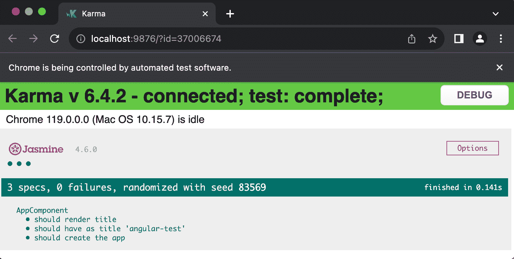
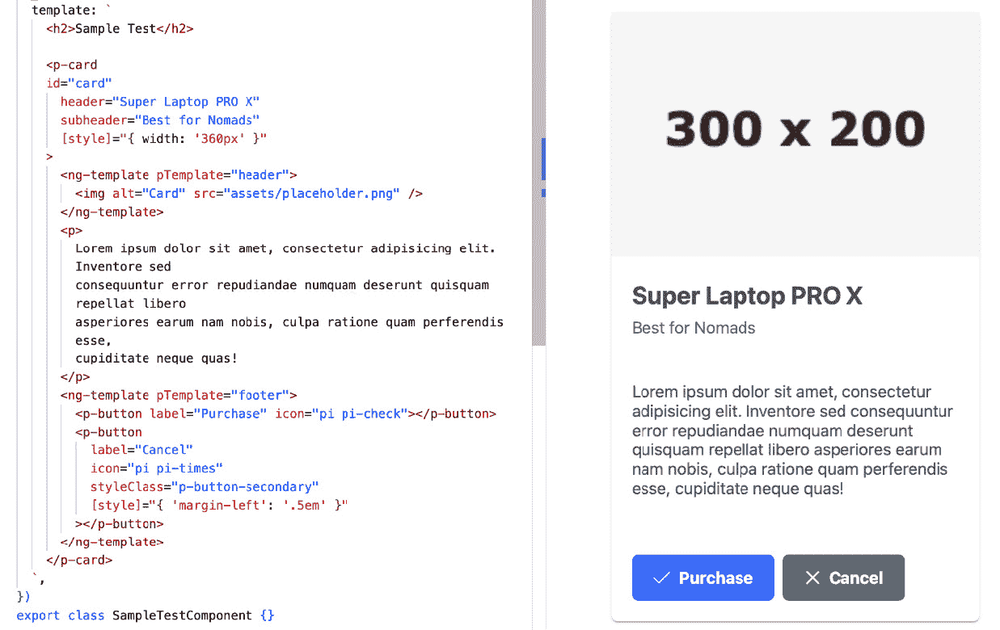
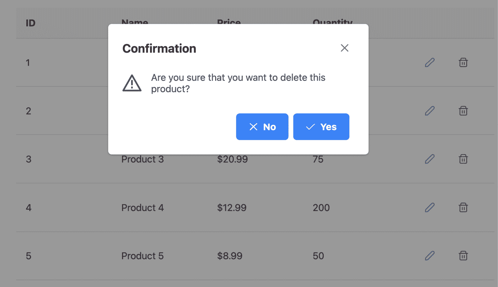

# 13

# 测试 PrimeNG 组件

在本章中，我们将深入探讨由 PrimeNG 组件驱动的 Angular 应用程序测试的关键方面。在整个过程中，你将学习如何有效地测试你的 PrimeNG 组件，确保它们的可靠性和功能性。

通过理解测试的原则、技术和工具，你可以提高 Angular 应用程序的质量、稳定性和可维护性。在本章中，你将通过各种示例获得设置测试和高效测试 Angular 组件的基本知识。此外，你还将熟悉可以增强和支持你的测试工作的最佳实践和库。

在本章中，我们将涵盖以下主题：

+   开始基本的 Angular 测试

+   编写 PrimeNG 组件的测试用例

+   利用测试技巧和窍门

# 技术要求

本章包含各种测试代码示例。你可以在以下 GitHub 仓库的 `chapter-13` 文件夹中找到相关源代码：[`github.com/PacktPublishing/Next-Level-UI-Development-with-PrimeNG/tree/main/apps/chapter-13`](https://github.com/PacktPublishing/Next-Level-UI-Development-with-PrimeNG/tree/main/apps/chapter-13)

# 开始基本的 Angular 测试

在本节中，我们将向您介绍 Angular 应用程序测试的基础知识。测试是开发过程中的一个重要部分，它允许早期发现错误、加快反馈周期并提高代码稳定性。此外，随着时间的推移，当你持续对代码进行更改时，遵循测试最佳实践可以有效地减轻潜在问题，保留现有功能，并确保向用户交付高质量的软件。

## Angular 测试基础介绍

Angular 提供了一个强大的测试框架，允许你为你的组件、服务和应用程序的其他部分编写测试。Angular 中的测试基于单元测试的原则，其中单个代码单元在隔离状态下进行测试。这种方法有助于确保每个单元正确运行并满足预期要求。

在 Angular 中进行测试涉及编写模拟用户交互、验证组件行为和断言预期结果的测试用例。这些测试可以帮助你识别和修复错误、验证业务逻辑，并确保你的应用程序按预期工作。

当你首次安装 Angular 项目时，它包含以下代码块中的 `package.json` 和 `angular.json`：

```js
// package.json
"devDependencies": {
  ...
  "@types/jasmine": "~4.3.0",
  "jasmine-core": "~4.6.0",
  "karma": "~6.4.0",
  "karma-chrome-launcher": "~3.2.0",
  "karma-coverage": "~2.2.0",
  "karma-jasmine": "~5.1.0",
  "karma-jasmine-html-reporter": "~2.1.0",
}
// angular.json
"test": {
  "builder": "@angular-devkit/build-angular:karma",
  "options": {
    "polyfills": [
      "zone.js",
      "zone.js/testing"
    ],
    "tsConfig": "tsconfig.spec.json",
    ...
  }
}
```

此代码片段是设置 Angular 应用程序测试的配置文件的一部分。让我们分析这个代码块：

+   `devDependencies: {...}`: 这包含在 Angular 中运行测试的包。例如，`karma-jasmine-html-reporter` 在测试运行后生成详细的 HTML 报告。

+   `karma`：这是一个流行的 JavaScript 应用程序测试运行器。它允许你在多个浏览器中执行测试，捕获结果并报告。当你运行`ng test`时，Karma 启动开发服务器，打开指定的浏览器，并在这些浏览器中执行 Jasmine 测试。

+   `jasmine`：这是一个**行为驱动开发**（**BDD**）的 JavaScript 测试框架。在 Angular 的上下文中，Jasmine 通常用作编写和运行单元测试的测试框架。

+   `"builder": "@angular-devkit/build-angular:karma"`：这是一个由 Angular DevKit 提供的构建器，用作运行 Karma 测试的目标。

为了在 Angular 中运行测试，你可以运行`npm run test`命令，这将生成以下结果：

```js
npm run test
> primeng-book@0.0.0 test
> ng test
 Browser application bundle generation complete.
15 11 2023 09:42:30.460:WARN [karma]: No captured browser, open http://localhost:9876/
15 11 2023 09:42:30.500:INFO [karma-server]: Karma v6.4.2 server started at http://localhost:9876/
15 11 2023 09:42:30.500:INFO [launcher]: Launching browsers Chrome with concurrency unlimited
15 11 2023 09:42:30.503:INFO [launcher]: Starting browser Chrome
15 11 2023 09:42:33.251:INFO [Chrome 119.0.0.0 (Mac OS 10.15.7)]: Connected on socket 3D7e73rrBAAAB with id 37006674
Chrome 119.0.0.0 (Mac OS 10.15.7): Executed 0 of 3 SUCCESS (
Chrome 119.0.0.0 (Mac OS 10.15.7): Executed 1 of 3 SUCCESS (
Chrome 119.0.0.0 (Mac OS 10.15.7): Executed 2 of 3 SUCCESS (
Chrome 119.0.0.0 (Mac OS 10.15.7): Executed 3 of 3 SUCCESS (
Chrome 119.0.0.0 (Mac OS 10.15.7): Executed 3 of 3 SUCCESS (0.139 secs / 0.12 secs)
TOTAL: 3 SUCCESS
```

测试结果也将出现在终端和浏览器中：



图 13.1 – Karma 测试结果

因此，当你运行测试命令时，Karma 将打开浏览器并成功执行来自`AppComponent`的测试。此外，你还将能够观察执行测试及其结果。

## 使用 Jest 进行 Angular 测试

在 Angular 中，Karma 和 Jasmine 一直是默认的测试框架选择，但随着 Angular v16 的推出，**Jest**已被包含作为一个实验性的替代方案用于编写单元测试。采用 Jest 的决定源于 Karma 虽然有效，但依赖于真实浏览器，导致测试速度较慢且较重。此外，使用真实浏览器在**持续集成**（**CI**）中引入了复杂性。另一个需要考虑的因素是 Karma 已被弃用([`github.com/karma-runner/karma`](https://github.com/karma-runner/karma))。

注意

持续集成是一种开发实践，涉及将多个贡献者的代码更改自动集成到一个共享仓库中。它包括构建和测试等自动化流程，以在开发周期的早期检测集成问题。持续集成促进协作，加速开发，并通过提供对代码库健康状况的即时反馈来确保代码质量。流行的 CI 工具有 Jenkins、Travis CI、CircleCI 和 GitHub Actions。

在运行 Jest 时，还有一些其他好处：

+   **快照测试**：这简化了视觉检查 UI 变化的过程，并有助于防止意外的回归。

+   **快速并行测试执行**：Jest 以其速度和高效的测试执行而闻名。它可以在并行中运行测试，在开发过程中提供更快的反馈。

+   **易于集成**：Jest 可以轻松地与 Angular 项目集成，无需复杂的配置。

+   **内置代码覆盖率报告**：Jest 包括生成代码覆盖率报告的内置支持。这允许开发者评估他们的代码有多少被测试覆盖，有助于识别可能需要额外测试的区域。

+   **简化模拟和监视**：Jest 提供了一个方便的 API 来创建模拟和监视器，这使得在测试期间隔离组件或服务变得更加容易。

+   **智能测试重跑的监视模式**：Jest 的监视模式智能地只重新运行受代码更改影响的测试，显著加快了开发期间的反馈循环。

+   **生态系统和社区**：Jest 拥有一个充满活力和活跃的社区，以及不断增长的插件和扩展生态系统。当在更广泛的 JavaScript 和测试生态系统中寻找解决方案、支持或集成时，这可能是有利的。

因此，让我们将我们的测试框架更改为 Jest。首先，你需要通过运行以下命令来安装 Jest 包：

```js
npm install jest jest-environment-jsdom --save-dev
```

此命令将安装 `jest` 和 `jest-environment-jsdom`，这是一个使用 JSDOM 模拟浏览器环境的 Jest 环境。

`jest-environment-jsdom`，Jest 测试可以在模拟的浏览器环境中运行，允许你编写和运行与 DOM 交互、处理事件和执行其他浏览器相关操作的测试。

之后，让我们更新我们的测试目标：

```js
// angular.json
"test": {
  "builder": "@angular-devkit/build-angular:jest",
  "options": {
    "polyfills": ["zone.js", "zone.js/testing"],
    "tsConfig": "tsconfig.spec.json"
  }
}
```

通过将构建器从 `@angular-devkit/build-angular:karma` 更改为 `@angular-devkit/build-angular:jest`，我们现在可以利用 Jest 来运行我们的单元测试。

通过运行 `npm run test` 来查看测试结果：

```js
> primeng-book@0.0.0 test
> ng test
NOTE: The Jest builder is currently EXPERIMENTAL and not ready for production use.
Application bundle generation complete. [1.619 seconds]
(node:22351) ExperimentalWarning: VM Modules is an experimental feature and might change at any time
(Use `node --trace-warnings ...` to show where the warning was created)
PASS  dist/test-out/app.component.spec.mjs
  AppComponent
     should create the app (123 ms)
     should have as title 'Welcome to chapter-13' (27 ms)
     should render title (25 ms)
Test Suites: 1 passed, 1 total
Tests:       3 passed, 3 total
Snapshots:   0 total
Time:        1.398 s
Ran all test suites.
```

你会注意到编写单元测试的过程和测试的执行速度没有差异。

## 编写你的初始 Angular 测试的逐步指南

既然我们已经涵盖了准备部分，让我们深入编写你的第一套测试。在单元测试中，你可以利用 **安排、行动和断言**（**AAA**）模式，这是一种常见的结构化和组织单元测试的方法。AAA 的每个部分都服务于一个独特的目的：

1.  **安排**：在这个步骤中，你设置测试环境。这包括创建你想要测试的组件或服务的实例，提供任何必要的依赖项，并配置测试的初始状态。

1.  **行动**：这是你执行动作或触发你想要测试的行为的地方。这可能涉及调用方法、与组件交互或模拟事件。

1.  **断言**：在最后一步，你检查动作的结果以确保它与预期的结果相匹配。这是你根据动作执行后的应用程序状态进行断言的地方。

使用 AAA 模式有助于保持测试的有序性、可读性和专注于特定的行为。它为编写和理解测试提供了一个清晰的架构，使得随着代码库的发展，维护和调试它们变得更加容易。

在下一节中，让我们看看一个真实的 Angular 测试。

## 简化简单的单元测试

当我们首次创建一个 Angular 应用程序时，CLI 帮助生成一个用于您的 `AppComponent` 的测试文件。让我们看看这个示例测试文件：

```js
// app.component.spec.ts
describe('AppComponent', () => {
  // Arrange
  beforeEach(async () => {
    await TestBed.configureTestingModule({
      imports: [AppComponent]
    }).compileComponents()
  })
  it('should render title', () => {
    // Arrange
    const fixture = TestBed.createComponent(AppComponent)
    const compiled = fixture.nativeElement as HTMLElement
    // Act
    fixture.detectChanges()
    // Assert
    expect(compiled.querySelector('h1')?.textContent).toContain(
      'Welcome to chapter-13'
    )
  })
})
```

提供的代码片段是`AppComponent`组件的 Angular 测试脚本。让我们以下面的列表形式分解这段代码，以便我们更好地理解它：

+   `describe('AppComponent', ()...`: 这是一个测试套件，用于分组相关的测试。在这种情况下，它将`AppComponent`的测试分组在一起。

+   `beforeEach(async () => ...)`: 这个函数是一个设置函数，在每次单独的测试用例之前运行。它是一个异步函数，使用`TestBed.configureTestingModule`配置测试模块，这是由`TestBed`实用程序提供的 Angular 测试基础设施的关键部分。它允许你通过指定测试组件所需的依赖项、提供者和导入来配置测试模块。在这种情况下，它导入了`AppComponent`。这也是 AAA 模式中的安排步骤。

+   `it('should render title'...`: 这个函数是一个测试用例，定义了要测试的特定行为。在这种情况下，测试用例被命名为`should render title`。让我们根据 AAA 模式来分解这个函数：

    +   使用`TestBed.createComponent`创建`AppComponent`，并使用`fixture.nativeElement`检索编译后的 HTML 元素

    +   `fixture.detectChanges()`

    +   `<h1>`元素包含字符串`Welcome` `to chapter-13`

总体而言，这个测试验证了`AppComponent`能够正确渲染带有预期文本内容的标题。它设置了组件，触发变更检测，并断言预期的结果。

简而言之，通过使用基本的测试技术，我们可以为我们的 Angular 应用程序的质量和可靠性打下坚实的基础。现在我们已经掌握了基本的测试概念，让我们深入一个具体用例：编写 PrimeNG 组件的测试。我们还将利用 Jest 作为我们的单元测试框架来编写单元测试。

# 为 PrimeNG 组件编写测试

测试 PrimeNG 组件遵循与测试常规 Angular 组件相同的原理。这种相似性源于 PrimeNG 组件本质上是在 Angular 组件的底层。在接下来的章节中，我们将探讨这些测试中的几个，以获得对这个领域的洞察和知识。

## PrimeNG 如何测试其组件

首先，让我们看看 PrimeNG 是如何测试它自己的组件的。由于本书篇幅限制，无法展示整个测试文件，因为它相当长。然而，我们可以关注一个特定部分，该部分展示了 PrimeNG 如何在源代码中测试其组件。以下是 PrimeNG `Button`组件的示例代码：

```js
describe('Button', () => {
    let button: Button;
    let fixture: ComponentFixture<Button>;
    beforeEach(() => {
        TestBed.configureTestingModule({
            imports: [NoopAnimationsModule],
            declarations: [Button]
        });
        fixture = TestBed.createComponent(Button);
        button = fixture.componentInstance;
    });
    it('should disabled when disabled is true', () => {
        button.disabled = true;
        fixture.detectChanges();
        const buttonEl = fixture.debugElement.query(By.css('.p-button'));
        expect(buttonEl.nativeElement.disabled).toBeTruthy();
    });
    it('should display the label and have a text only class', () => {
        button.label = 'PrimeNG';
        fixture.detectChanges();
        const buttonEl = fixture.debugElement.query(By.css('.p-button'));
        expect(buttonEl.nativeElement.textContent).toContain('PrimeNG');
        expect(buttonEl.nativeElement.children.length).toEqual(1);
    });
    ...
})
```

让我们以下面的列表形式分解代码，以便我们理解其不同部分：

+   `beforeEach(...)`: 此函数用于在每个测试用例之前设置测试环境。在这种情况下，它通过调用 `TestBed.configureTestingModule` 配置测试模块。`imports` 属性指定任何所需的模块，而 `declarations` 属性指定正在测试的组件。在这种情况下，它导入 `NoopAnimationsModule` 并将 `Button` 添加到声明数组中。

+   `当 disabled 为 true 时应禁用`: 此测试用例将 `Button` 组件的 `disabled` 属性设置为 `true`，使用 `fixture.detectChanges()` 触发变更检测，然后使用 `fixture.debugElement.query` 查询 DOM 中的按钮元素。它断言按钮元素的 `disabled` 属性为 `true`，使用 `expect(...).toBeTruthy()`。

+   `应显示标签并具有纯文本类`: 此测试用例将 `Button` 组件的 `label` 属性设置为 `PrimeNG`，触发变更检测，并查询 DOM 中的 `button` 元素。它断言 `button` 元素的文本内容包含 `PrimeNG`，使用 `expect(...).toContain(...)`，并验证 `button` 元素只有一个子元素，使用 `expect(...).toEqual(1)`。

这些测试的目的是验证 `Button` 组件的预期行为。通过更改其属性并触发变更检测，测试确保组件正确渲染并按预期行为。

注意

在 PrimeNG 源代码 ([`github.com/primefaces/primeng/tree/master/src/app/components`](https://github.com/primefaces/primeng/tree/master/src/app/components)) 中，存在你可以学习和用作参考的现有测试，以增强你的理解。

## 创建和测试我们自己的组件

将前面的示例和知识付诸实践，让我们为以下卡片组件创建一个测试：



图 13.2 – 示例卡片组件

通过检查截图，你可以观察到我们创建的卡片组件的视觉表示。为了确保此组件的正常运行，编写验证其标题、副标题和按钮正确渲染的测试是至关重要的。以下代码块是测试代码的示例：

```js
// sample-test.component.spec.ts
describe('SampleTestComponent', () => {
  let component: SampleTestComponent
  let fixture: ComponentFixture<SampleTestComponent>
  beforeEach(async () => {
    await TestBed.configureTestingModule({
      imports: [SampleTestComponent],
    }).compileComponents()
    fixture = TestBed.createComponent(SampleTestComponent)
    component = fixture.componentInstance
    fixture.detectChanges()
  })
  it('should create', () => {
    expect(component).toBeTruthy()
  })
  it('should display the product title and subtitle', () => {
    fixture.detectChanges()
    const card = fixture.debugElement.query(By.css('p-card'))
    expect(card.nativeElement.textContent).toContain('Super Laptop PRO X')
    expect(card.nativeElement.textContent).toContain('Best for Nomads')
  })
  it('should have a footer', () => {
    fixture.detectChanges()
    const footerCard = fixture.debugElement.query(By.css('.p-card-footer'))
    const ctaButtons = fixture.debugElement.queryAll(By.css('.p-button'))
    expect(footerCard).toBeTruthy()
    expect(ctaButtons).toBeTruthy()
    expect(ctaButtons.length).toEqual(2)
  })
})
```

让我们将以下列表中的代码分解，以便我们可以理解其不同的部分：

+   `应创建`: 测试用例检查 `component` 实例是否为 `Truthy`，这意味着它已被成功创建。

+   `应显示产品标题和副标题`: 此测试用例触发变更检测，然后使用 `fixture.debugElement.query` 查询 DOM 中的 `p-card` 元素。它断言 `p-card` 元素的内容包含预期的产品 `title` 值和 `subtitle` 值，使用 `expect(...).toContain(...)`。

+   `应该有一个页脚`：这个测试用例触发变更检测，然后查询 DOM 中具有`.p-card-footer`类的页脚元素以及所有具有`.p-button`类的按钮。它使用`expect(...).toBeTruthy()`断言页脚元素和按钮都是`Truthy`，并且还通过检查`ctaButtons`数组的长度来验证有两个按钮存在，使用`expect(...).toEqual(2)`。

运行测试后，你可以看到它成功通过：

```js
PASS   chapter-13  apps/chapter-13/src/app/pages/sample-test/sample-test.component.spec.ts
SampleTestComponent
   should create (95 ms)
   should display the product title and subtitle (23 ms)
   should have a footer (17 ms)
Test Suites: 1 passed, 1 total
Tests:       3 passed, 3 total
Snapshots:   0 total
Time:        6.411 s
```

总之，为 PrimeNG 组件编写测试使你能够在 Angular 应用程序中确保这些组件的功能性和可靠性。现在我们已经探讨了为 PrimeNG 组件编写测试的过程，让我们通过利用有用的技巧和窍门来进一步改进我们的测试实践，以提高测试的有效性和效率。

# 利用测试技巧和窍门

尽管测试使我们能够确保代码的正确性和稳定性，但编写有效的测试有时可能具有挑战性。在本节中，我们将探讨各种可以帮助你改进测试实践的技巧和窍门，以下是一个可编辑表格的示例：



图 13.3 – 样本可编辑表格

表格列出了可编辑和可删除的产品列表。点击删除图标时，会出现一个确认对话框以验证删除操作。

因此，现在让我们看看一些测试技巧。

## 隔离单元测试

在编写单元测试时，将正在测试的组件或服务与其依赖项隔离至关重要。Angular 的**TestBed**提供了一套强大的工具，用于创建和配置测试模块。通过利用 TestBed，我们可以模拟依赖项并提供模拟实现，使我们能够专注于我们想要测试的单元。

考虑以下示例：

```js
// tips.component.spec.ts
const productsStub = [
  ...
]
describe('TipsComponent', () => {
  beforeEach(async () => {
    await TestBed.configureTestingModule({
      imports: [TipsComponent],
      providers: [
        ...
        {
          provide: ShopService,
          useValue: {
            getProducts: jest.fn().mockReturnValue(productsStub),
          },
        },
      ],
    }).compileComponents()
  })
  ..
})
```

在本例中，我们使用`TestBed.configureTestingModule`来设置测试模块。通过指定`imports`和`providers`，我们可以模拟依赖项并确保它们被正确注入到正在测试的组件或服务中。在这种情况下，我们不是从`ShopService`调用`getProducts()`函数，而是用`productsStub`值替换结果，这使得测试更加独立且易于进行。

## 使用 NO_ERRORS_SCHEMA

在测试 Angular 组件时，我们经常遇到不需要断言子组件（如 Angular Material 组件）的行为或渲染的情况。在这种情况下，`NO_ERRORS_SCHEMA`可以是一个方便的工具，用于简化我们的测试设置。

`NO_ERRORS_SCHEMA`告诉 Angular 的编译器忽略组件模板中未识别的元素和属性。这使我们能够专注于测试组件的逻辑，而无需提供子组件的详细模拟实现。

这里有一个例子：

```js
import { NO_ERRORS_SCHEMA } from '@angular/core';
describe('AppComponent', () => {
  let component: AppComponent;
  let fixture: ComponentFixture<AppComponent>;
  beforeEach(async () => {
    await TestBed.configureTestingModule({
      declarations: [AppComponent],
      schemas: [NO_ERRORS_SCHEMA]
    }).compileComponents();
  });
  // Additional tests go here
});
```

在本例中，我们在测试模块配置中指定了 `schemas: [NO_ERRORS_SCHEMA]`。这允许我们在测试 `AppComponent` 时无需担心任何子组件的存在或行为。

注意

如果你在编写集成测试，请避免使用 `NO_ERRORS_SCHEMA`。这是因为 `NO_ERRORS_SCHEMA` 选项会忽略未知元素和属性的错误模板。它允许 Angular 即使子组件模板存在问题也能运行测试。你可以在[`angular.io/guide/testing-components-scenarios#no_errors_schema`](https://angular.io/guide/testing-components-scenarios#no_errors_schema)了解更多信息。

## 利用 `spyOn` 方法

使用 `spyOn` 函数以及间谍对象来促进方法监视。

通过使用 `spyOn`，我们可以用一个记录所有调用的间谍函数替换一个方法，并提供额外的功能，例如返回特定值或抛出异常。这使得我们能够验证方法是否被调用，调用了多少次，以及使用了哪些参数。

考虑以下示例：

```js
// tips.component.spec.ts
beforeEach(async () => {
  await TestBed.configureTestingModule({
    imports: [TipsComponent],
    ...
  }).compileComponents()
  fixture = TestBed.createComponent(TipsComponent)
  confirmDialog = fixture.debugElement.query(
    By.css('p-confirmdialog')
  ).componentInstance
})
it('should show accept message on delete', () => {
  const messageSpy = jest.spyOn(messageService, 'add')
  component.onRowDelete(1)
  fixture.detectChanges()
  confirmDialog.accept()
  expect(messageSpy).toHaveBeenCalledWith({
    severity: 'info',
    summary: 'Confirmed',
    detail: 'Your product is deleted',
  })
})
```

让我们分解以下列表中的代码，并了解它的作用：

+   `('should show accept message on delete', () => { ... })`：这是一个测试用例描述。在这种情况下，它是在检查删除行后是否显示了特定消息。

+   `const messageSpy = jest.spyOn(messageService, 'add')`：这一行使用 Jest 的 `spyOn` 函数创建了一个间谍。它监视 `messageService` 对象的 `add` 方法。这使我们能够在测试期间跟踪此方法是否以及如何被调用。

+   `component.onRowDelete(1)`：这一行调用正在测试的组件的 `onRowDelete` 方法，并将 `1` 作为参数传递。这模拟了删除索引为 `1` 的行。

+   `fixture.detectChanges()`：这一行触发了测试组件的变化检测。它确保组件模板中的任何更改都得到应用，并在测试环境中反映更新。

+   `confirmDialog.accept()`：这一行模拟用户接受确认对话框。它假设组件有一个具有 `accept` 方法的 `confirmDialog` 对象，该方法是用来确认删除的。

+   `expect(messageSpy).toHaveBeenCalledWith({ ... })`：这一行使用了 `expect` 函数来进行断言。它检查 `messageService` 对象的 `add` 方法是否以预期的参数被调用。在这种情况下，它期望该方法以包含特定属性（如 `severity`、`summary` 和 `detail`）的对象被调用。

总之，间谍方法是在测试期间跟踪和控制函数调用的强大工具，它为你的应用程序的行为提供了洞察力。随着我们过渡到下一节，让我们探讨如何在 Angular 测试中处理异步代码和管理与时间相关的操作。

## 与 `fakeAsync` 一起工作

`fakeAsync` 是 Angular 测试中的一个实用工具，它使得异步代码的同步测试成为可能。它在一个特殊的“模拟”区域内运行测试，在这个区域内可以使用 `tick()` 来控制异步操作。以下是一个 `fakeAsync` 和 `tick` 的简单演示：

```js
import { fakeAsync, flush, tick } from '@angular/core/testing'
describe('FakeAsync Example', () => {
  it('should test asynchronous code using fakeAsync', fakeAsync(() => {
    let value: string | undefined
    // Simulate an asynchronous operation
    setTimeout(() => {
      value = 'completed'
    }, 1000)
    // Use tick to simulate the passage of time
    tick(500) // Simulate 500 milliseconds passed
    expect(value).toBeUndefined() // Value should still be undefined
    tick(500) // Simulate another 500 milliseconds passed
    expect(value).toBe('completed')
    flush()
  }))
})
```

在这个例子中，`fakeAsync` 用于包装 `test` 函数。`setTimeout` 用于模拟异步操作，而 `tick` 用于模拟时间的流逝。通过调用 `tick(500)`，你模拟了 500 毫秒的流逝，然后你可以对应用程序的状态进行断言。这对于以同步方式测试异步行为非常有用。

现在，让我们看看一些测试 PrimeNG `MessageService` 在 `TipsComponent` 中行为的更多示例代码：

```js
// tips.component.spec.ts
import {
  fakeAsync, flush, tick
} from '@angular/core/testing'
it('should show close message on delete', fakeAsync(() => {
  const messageSpy = jest.spyOn(messageService, 'add')
  component.onRowDelete(1)
  fixture.detectChanges()
  tick(300)
  // Send Escape event
  const escapeEvent: any = document.createEvent('CustomEvent')
  escapeEvent.which = 27
  escapeEvent.initEvent('keydown', true, true)
  document.dispatchEvent(escapeEvent as KeyboardEvent)
  expect(messageSpy).toHaveBeenCalledWith({
    severity: 'warn',
    summary: 'Cancelled',
    detail: 'You have cancelled',
  })
  flush()
}))
```

这个测试验证了在按下 *Esc* 按钮时消息是否显示正确的值。以下要点概述了测试的流程：

+   首先，我们通过 `component.onRowDelete(1)` 函数触发删除操作，因此确认对话框出现。

+   之后，我们使用 `tick` 来根据指定的时间量推进虚拟时钟。在这个例子中，我们使用 `tick(300)` 来模拟 300 毫秒的延迟。

+   在使用 `tick` 函数之后，我们通过创建一个 `KeyboardEvent` 对象并在文档上分发它来模拟 `Escape` 键盘按键事件。

+   在 `Escape` 事件被分发之后，我们可以通过 `expect(messageSpy).toHaveBeenCalledWith({...})` 来断言消息服务。

+   最后，我们使用 `flush` 来清除任何挂起的异步任务，确保在 `test` 函数退出之前所有异步操作都已经完成。

在本节中，我们了解了如何在 Angular 测试中管理异步操作。在下一节中，我们将深入探讨一个强大的测试实用工具，它可以简化并增强我们的测试能力：Spectator。

## 利用第三方库 – Spectator

**Spectator** ([`ngneat.github.io/spectator`](https://ngneat.github.io/spectator)) 提供了一套实用工具和技术，这些工具和技术有助于编写简洁且表达力强的 Angular 组件测试。它允许你创建组件实例，模拟依赖项，访问组件的 DOM，以及用最少的样板代码断言组件的行为。它还提供了一个干净且直观的语法，使得测试用例更加可读和维护。

要使用它，首先，我们需要通过运行以下命令来安装 `spectator` 包：

```js
npm install @ngneat/spectator --save-dev
```

之后，让我们创建一个示例测试，在这个测试中我们使用 `Spectator` 来测试一个 Angular 组件：

```js
// spectator.component.spec.ts
import {
  Spectator,
  createComponentFactory,
  mockProvider,
} from '@ngneat/spectator/jest'
describe('TipsComponent', () => {
  let spectator: Spectator<TipsComponent>
  const createComponent = createComponentFactory({
    component: TipsComponent,
    providers: [
      mockProvider(ShopService, {
        getProducts: () => productsStub,
      }),
    ],
  })
  beforeEach(() => (spectator = createComponent()))
  it('should show table content', () => {
    const table = spectator.query('p-table')
    expect(table?.textContent).toContain('Product 1')
    expect(table?.textContent).toContain('Product 2')
  })
})
```

给定的代码利用 Spectator 来测试 `TipsComponent` 实例的行为。让我们以下面的列表形式分解代码块，以便我们理解每一部分：

+   `const createComponent = createComponentFactory({ ... })`: 这定义了一个使用 `createComponentFactory` 从 `Spectator` 中创建的 `createComponent` 函数。此函数用于创建 `TipsComponent` 的实例以进行测试。它还通过 `providers` 数组提供了一个 `ShopService` 的模拟实例。

+   `beforeEach(() => (spectator = createComponent()))`: 这是一个在每次测试用例之前运行的设置步骤。它使用 `createComponent` 函数创建一个新的 `TipsComponent` 实例，并将其分配给 `spectator` 变量。

+   `it('should show table content', () => { ... })`: 这行代码定义了一个带有描述 `should show table content` 的测试用例。此测试用例验证 `TipsComponent` 中的表格是否包含预期的内容。以下是对其更详细的分解：

    +   `const table = spectator.query('p-table')`: 这使用 `spectator` 对象中的 `query` 方法在组件的模板中查找 `<p-table>` 元素。

    +   `expect(table?.textContent).toContain(...)`: 这条语句断言，如果存在，`table` 元素的 `textContent` 包含字符串 `Product 1` 或 `Product 2`。

在我们结束对 `Spectator` 的探索后，我们发现它在简化并改进我们的 Angular 组件测试工作流程方面非常有效。现在，让我们看看另一个有助于增强我们的测试实践的库：`ng-mocks`。

## 利用第三方库 – ng-mocks

另一个用于测试 Angular 应用程序的有力第三方库是 `ng-mocks`，它通过提供灵活的模拟和存根功能简化了测试过程，使得在测试期间隔离组件和服务变得更加容易。

使用 ng-mocks，我们可以创建 Angular 组件和服务的模拟实现，为方法定义自定义行为，并验证交互。这使我们能够专注于测试特定的单元，而无需担心真实实现的复杂性。

要使用它，首先，我们需要通过运行以下命令来安装 `ng-mocks` 包：

```js
npm install ng-mocks --save-dev
```

现在，让我们看看如何在 Angular 测试中使用 ng-mocks：

```js
// ng-mocks.component.spec.ts
import { MockInstance, MockProvider } from 'ng-mocks'
describe('TipsComponent', () => {
  beforeAll(() =>
    MockInstance(ShopService, () => ({
      getProducts: () => productsStub,
    }))
  )
  beforeEach(async () => {
    await TestBed.configureTestingModule({
      imports: [TipsComponent],
      providers: [
provideNoopAnimations(),
MockProvider(ShopService)
],
    }).compileComponents()
    fixture = TestBed.createComponent(TipsComponent)
    component = fixture.componentInstance
    fixture.detectChanges()
  })
})
```

让我们逐行分析以下列表中的代码块，以便我们了解它所执行的操作：

+   `providers: [MockProvider(ShopService)]`: 这用于创建 `ShopService` 的模拟版本，并将其配置为测试环境中的提供者。这确保测试使用 `ShopService` 的模拟版本而不是实际实现。

+   `beforeAll(() => MockInstance(ShopService, () => ({ ... })))`: 这个 `beforeAll` 钩子在套件中的所有测试用例之前执行一次。它通过使用 `ng-mocks` 中的 `MockInstance` 函数来模拟 `ShopService` 依赖项。它用返回 `productsStub` 的模拟实现替换了原始的 `getProducts` 方法。

注意

`ng-mocks` 也可以与 `spectator` 一起很好地工作。您可以在 [`ng-mocks.sudo.eu/extra/with-3rd-party`](https://ng-mocks.sudo.eu/extra/with-3rd-party) 上了解更多信息。

由此，我们深入探讨了 Angular 测试的复杂性，揭示了实用的技巧和窍门，这些技巧和窍门能让你增强测试套件的效率和弹性。

# 摘要

在本章中，你学习了如何在 Angular 应用程序中有效地测试 PrimeNG 组件。通过利用 Jest 这个强大的测试框架，你获得了确保这些组件功能性和可靠性的能力。

在本章中，你探索了与测试 PrimeNG 组件相关的各种概念和技术。你首先了解了测试的重要性以及它为你的开发工作流程带来的好处。然后，你深入了解了编写 PrimeNG 组件单元测试的具体步骤，包括组件设置、测试组件行为以及验证组件外观和交互。

此外，你还遇到了实际示例、代码片段和最佳实践，展示了如何有效地测试 PrimeNG 组件。通过跟随并实施这些测试策略，你在验证 PrimeNG 组件的正确性、可靠性和性能方面获得了实践经验。

随着我们过渡到下一章，我们将把重点转向利用 PrimeNG 组件构建响应式 Web 应用程序的世界。

# 第四部分：真实世界应用

在本最终部分，你将应用在前几章中学到的所有知识和技能来构建一个真实的响应式 Web 应用程序。本部分将为你提供实践经验，让你能够将 PrimeNG 和 Angular 的专业知识付诸实践。

到本部分结束时，你将完成一个使用 PrimeNG 和 Angular 的完全功能性的响应式 Web 应用程序。

本部分包括以下章节：

+   *第十四章*, *构建响应式 Web 应用程序*
