# 14

# 构建响应式 Web 应用程序

在本章中，您将通过使用 Angular 和 PrimeNG 组件构建响应式 Web 应用程序来应用您现有的知识。重点将放在创建能够无缝适应不同屏幕尺寸和设备的应用程序上。在本章结束时，您将深入了解如何使用 Angular 和 PrimeNG 设计和开发响应式 Web 应用程序。

本章的目标是为您提供构建响应式 Web 应用程序所需的知识和技能。您将了解如何创建一个项目结构，该结构实现响应式布局，能够适应不同的屏幕尺寸，并利用 PrimeNG 和 PrimeFlex 来提升用户体验。此外，您还将深入了解如何部署应用程序，确保它能够触及广泛的受众。

在本章中，我们将涵盖以下主题：

+   响应式 Web 应用程序构建简介

+   介绍我们的响应式 Web 应用程序项目

+   创建网站的布局

+   开始开发网站

+   部署响应式 Web 应用程序

# 技术要求

本章包含 Angular 应用程序的代码示例。您可以在以下 GitHub 仓库的`chapter-14`文件夹中找到相关源代码：[`github.com/PacktPublishing/Next-Level-UI-Development-with-PrimeNG/tree/main/apps/chapter-14`](https://github.com/PacktPublishing/Next-Level-UI-Development-with-PrimeNG/tree/main/apps/chapter-14)。

# 响应式 Web 应用程序构建简介

响应式 Web 应用程序已成为当今数字景观的必需品。随着用户在多种设备上访问网站和应用，您创建能够无缝适应不同屏幕尺寸和方向的体验至关重要。在本节中，我们将概述响应式 Web 应用程序，并探讨为什么它们对于提供满意的用户体验至关重要。

## 为什么响应式 Web 应用程序很重要

在过去，网站主要是为具有固定屏幕尺寸的台式电脑设计的。然而，随着智能手机、平板电脑和其他移动设备的快速普及，网络浏览的格局发生了巨大变化。用户现在期望网站和应用能够在各种设备上访问，从大桌面显示器到小智能手机屏幕。以下是一个在移动设备上布局损坏的网站示例：

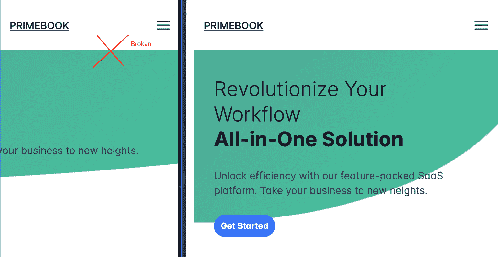

图 14.1 – 移动设备上布局损坏的示例

根据图示，很明显，尽管该网站在较大屏幕上运行正常，但在较小设备上布局损坏，导致**开始**按钮无响应，阻碍了用户交互。

响应式网页应用通过根据用户的设备和屏幕尺寸动态调整布局和内容来解决这个问题。采用响应式设计，你可以确保应用在不同设备上都具有可用性和视觉吸引力，从而提高用户参与度和满意度。

## 响应式网页应用的优势

从提升用户体验到提高 SEO 排名，响应式网页应用提供了许多优势，这些优势可以极大地增强你的开发工作。让我们回顾这些好处并了解它们的影响：

+   **提升用户体验**：响应式网页应用的主要好处之一是提供跨设备的一致和优化的用户体验。通过调整布局、内容和功能以适应不同的屏幕尺寸，用户可以轻松导航并与应用程序进行交互，无论他们使用的是哪种设备。这种无缝体验增强了用户满意度，并鼓励他们更长时间地与应用程序互动。

+   **扩大覆盖范围和可访问性**：响应式网页应用具有更广泛的覆盖范围，因为它们服务于多个设备上的用户。通过在不同平台上提供一致的经验，你可以确保应用对更广泛的受众是可访问的。这种可访问性对于面向移动用户的业务尤为重要，因为移动设备已成为全球许多人访问互联网的主要手段。

+   **搜索引擎优化（SEO）优势**：搜索引擎，如谷歌，在搜索结果中优先考虑移动友好型网站。提供跨设备无缝用户体验的响应式网页应用更有可能排在**搜索引擎结果页面（SERPs）**中更高的位置。通过采用响应式设计原则，你可以提高应用的可见性并吸引更多有机流量。

## 响应式网页设计的核心原则

响应式网页设计遵循几个关键原则以确保对不同屏幕尺寸和设备的有效适应。让我们看看这些原则：

+   *流体网格*：流体网格是响应式网页设计的基础。而不是使用基于像素的固定布局，你可以使用比例单位，如百分比，来定义元素的宽度和高度。这允许内容灵活调整并填充可用的屏幕空间，创建一个流畅且可适应的布局。

+   *灵活的图片和媒体*：图片和媒体在网页应用中扮演着至关重要的角色。为了确保它们适应不同的屏幕尺寸，你可以利用 CSS 技术，如`max-width: 100%`，使图片和媒体元素在容器内按比例缩放。这防止了图片在较小屏幕上溢出或太小。

+   *媒体查询*：媒体查询允许您根据用户设备的特征应用特定的 CSS 规则，例如屏幕大小、分辨率和方向。通过在特定的屏幕宽度上定义断点，您可以修改布局、字体排印和其他元素，以优化应用程序在不同设备上的外观。

+   *移动优先方法*：移动优先方法是一种设计理念，它优先考虑为移动设备设计，然后逐步增强应用程序以适应更大的屏幕。通过为较小的屏幕开始一个简约和专注的设计，您可以确保核心功能和内容对所有用户都是可访问的。随着屏幕尺寸的增加，可以引入额外的功能和布局改进。

现在您已经了解了构建响应式 Web 应用程序的要点，让我们深入了解我们的项目具体细节。理解基础为创建高效的项目结构和制作一个视觉吸引人且用户友好的网站奠定了基础。

# 介绍我们的响应式 Web 应用程序项目

我们的项目专注于创建一个响应式着陆页，有效地展示**软件即服务**（**SAAS**）产品。着陆页包括几个关键部分，包括页眉、英雄、功能、客户评价、定价和页脚。每个部分都是战略性地设计的，旨在吸引访客并推动转化，无论是将他们转变为客户还是将他们作为有价值的潜在客户。

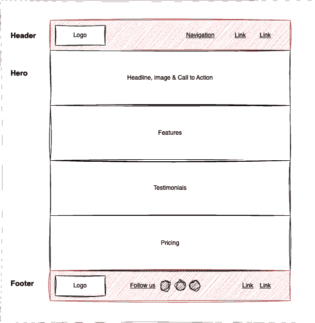

图 14.2 – 项目初始草图

根据草图，让我们检查每个部分的目的：

+   **页眉**：我们的应用程序的入口，页眉将展示一个干净直观的导航菜单，确保用户可以轻松探索着陆页的各个部分。

+   **英雄部分**：我们的英雄部分将是一个视觉盛宴，通过引人入胜的图像和简洁的信息立即吸引注意力，传达我们产品或服务的精髓。此外，通过放置战略性的、有说服力的行动号召按钮，我们将鼓励访客采取下一步行动，例如注册、请求演示或进一步探索我们的产品。

+   **功能**：在这里，用户将深入了解使我们的产品脱颖而出的核心功能。每个功能都将优雅地呈现，配有吸引人的视觉元素和简洁的描述。

+   **客户评价**：建立信任至关重要，客户评价部分将作为我们用户积极体验的见证。真实的引言甚至可能还有图片，将增添个人化的触感。

+   **定价**：对于准备迈出下一步的用户，定价部分将提供关于我们产品或服务的透明细节。我们将努力追求清晰和简洁，使用户能够轻松选择适合他们的计划。

+   **页脚**：在故事的结尾，页脚将包含必要的链接、联系方式，也许还有一个行动按钮，确保用户可以无缝地导航到我们网站的其它部分。

这是我们最终产品的预览：

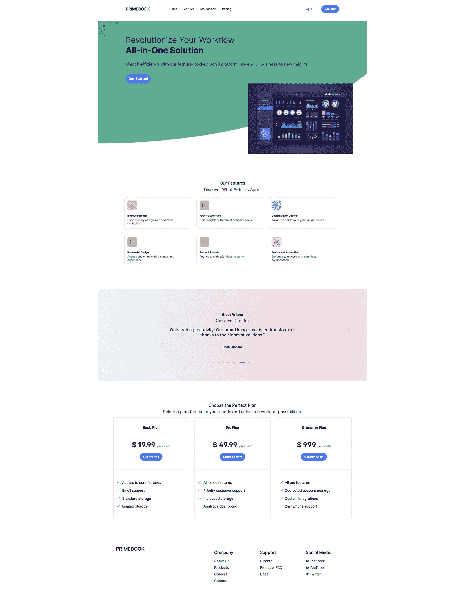

图 14.3 – 最终项目

这是本章将要构建的最终产品。为了更好地理解代码，请查看我们 GitHub 仓库中的本章内容。请注意，我们将主要关注 UI，这意味着像`登录`、`注册`或`购买`这样的功能将不会实现。

在心中有了清晰的项目概述后，我们准备好过渡到创建我们网站基础布局的激动人心阶段。

# 创建网站的布局

一旦我们有了我们网站的初步想法，将这些部分转换为 Angular 组件就相对简单了。让我们看看以下转换：

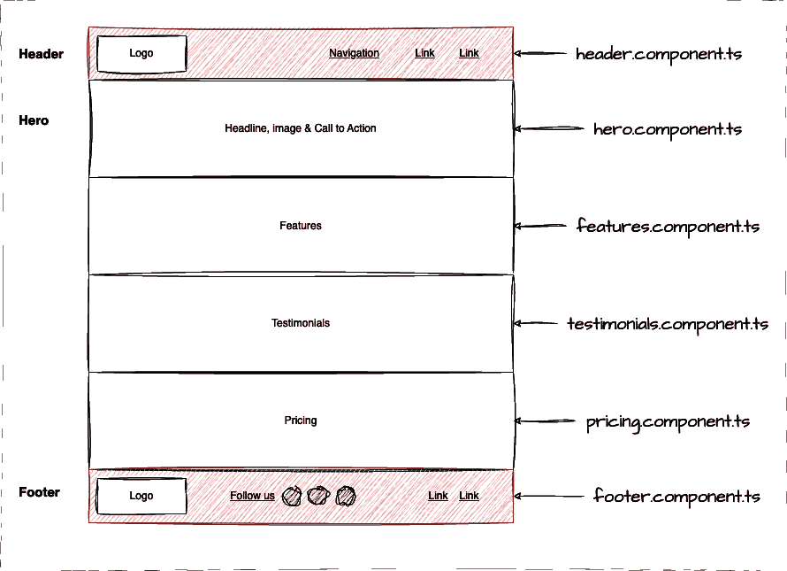

图 14.4 – 将部分拆分为 Angular 组件

如图中所示，每个部分都是独特的，可以轻松地映射到一个 Angular 组件。例如，`header`部分可以分配给`header.component.ts`。通过遵循这种方法，我们可以建立以下代码结构作为示例：

```js
// app.component.ts
<primebook-header />
<primebook-hero />
<primebook-features />
<primebook-testimonials />
<primebook-footer />
```

每个选择器代表我们在草图或设计中的相应部分。

通过运行以下命令开始创建这些组件非常简单：

```js
primengbook$ ng g c header --inline-template --inline-style
CREATE src/app/header/header.component.spec.ts (596 bytes)
CREATE src/app/header/header.component.ts (295 bytes)
```

该命令将生成一个具有内联样式和内联模板的独立`Header`组件。如果您希望为`header.component.html`和`header.component.scss`生成单独的文件，可以省略`--inline-template`和`--inline-style`选项。一旦生成了`Header`组件，您就可以继续生成其他组件，如`Hero`、`Features`等。

现在我们已经建立了我们网站的必要布局，是时候深入实际开发过程了。我们将把设计转化为代码，为每个部分注入生命。

# 开始开发网站

到目前为止，我们已经为我们的响应式 Web 应用程序制定了蓝图。现在，让我们深入了解每个部分的实现细节。记住，我们的目标是使用 Angular、PrimeFlex、PrimeIcons 和 PrimeNG 组件创建一个无缝且视觉上吸引人的体验。

## 前置条件

在开始之前，请确保您已经在项目中配置了一切，例如`primeng`、`primeflex`和`primeicons`。如果没有，您可以运行以下命令：

```js
npm i primeng primeflex primeicons
```

之后，检查您的样式和主题是否已更新。以下是一个`styles.scss`文件的示例：

```js
// src/styles.scss
@import 'primeflex/primeflex.scss';
@import 'primeng/resources/themes/lara-light-blue/theme.css';
@import 'primeng/resources/primeng.css';
@import 'primeicons/primeicons.css';
```

提供的代码从不同的库中导入样式文件。通过导入这些文件，您将 `primeflex`、`primeng` 和 `primeicons` 提供的样式、类工具、主题和图标纳入您的应用程序中，使您能够利用它们的功能和视觉样式。

## 带有导航的页眉

页眉部分在为用户提供便捷的导航和无缝的用户体验方面发挥着至关重要的作用。为了实现页眉，我们将首先创建 HTML 结构并应用 CSS 类工具。以下是如何构建页眉的示例：

```js
// src/app/components/header/header.component.ts
imports: [CommonModule, ButtonModule, RippleModule, StyleClassModule],
...
<header id="header">
  <a class="flex align-items-center" href="#">
    PRIMEBOOK
  </a>
  <a
    class="cursor-pointer block lg:hidden"
    pStyleClass="@next"
    enterFromClass="hidden"
    leaveToClass="hidden"
  >
    <i class="pi pi-bars text-4xl"></i>
  </a>
  <nav
    class="hidden lg:flex absolute lg:static w-full"
    style="top:120px"
  >
    <ul ...>
      <li>
        <a ...>
          <span>Home</span>
        </a>
      </li>
      ...
    </ul>
  ...
  </nav>
</header>
```

让我们分解代码：

+   `<ul ...>...</ul>`：我们使用 `<ul>` 元素创建了一个导航项的无序列表。每个项由一个 `<li>` 元素表示，相应的链接被 `<a>` 标签包裹。以下是桌面上的导航结果：


图 14.5 – 桌面上的导航布局

+   `<a class="... lg:hidden" pStyleClass="@next" ...>`：这是使导航在小设备上响应式的代码行。让我们进一步分解它：

    +   `lg:hidden`：这利用了 `primeflex` 工具，将在大屏幕上隐藏汉堡菜单。

    +   `pStyleClass="@next"`：这个 `StyleClass` 功能针对下一个元素，即 `nav` 元素。在这种情况下，当在移动设备上点击汉堡菜单时，它将显示或隐藏导航菜单。

+   `<nav class="hidden lg:flex ...>`：这代表一个在小型屏幕上隐藏（`hidden`）并在大屏幕上可见（`lg:flex`）的导航菜单。

这是移动设备上的导航：

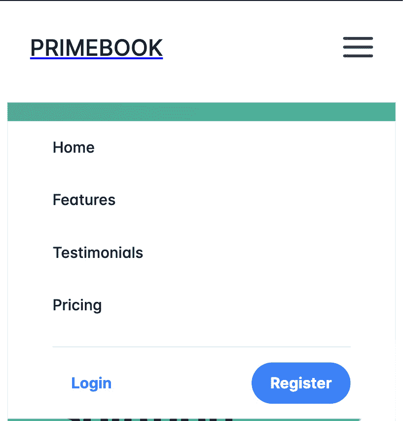

图 14.6 – 移动设备上的导航

在图中，可以明显看出，不是显示完整的导航菜单，而是只显示一个汉堡图标来切换导航菜单的可见性，这样可以节省空间并提供一个干净的用户界面。

## 英雄部分

英雄部分是一个视觉上突出的部分，可以立即吸引访客的注意力，通常包括一个引人注目的标题、一个简洁的副标题，以及一个视觉上吸引人的图像或视频。英雄部分旨在创造一个强烈的第一个印象，并有效地传达产品或服务的价值主张。以下是我们的英雄部分的简化代码：

```js
// src/app/components/hero/hero.component.ts
<section id="hero">
  <div>
    <h1>
      <span class="font-light block">Revolutionize Your Workflow</span
      >All-in-One Solution
    </h1>
    <p>
      Unlock efficiency with our feature-packed SaaS platform. Take your
      business to new heights.
    </p>
    <button
      pButton pRipple
      type="button" label="Get Started"
    ></button>
  </div>
  <div class="hidden md:flex">
    
  </div>
</section>
```

总体而言，这段代码片段代表了一个带有标题、描述和 PrimeNG 调用到行动按钮的英雄部分。它还包括一个在中等尺寸（`md:flex`）和大屏幕上显示的图像，而在小型屏幕上隐藏（`hidden`）。

注意

PrimeFlex 中使用了以下屏幕尺寸断点：

- `sm`：小型屏幕（576 像素及以上）

- `md`：中等屏幕（768 像素及以上）

- `lg`：大型屏幕（992 像素及以上）

- `xl`：超大屏幕（1,200 像素及以上）

让我们看看结果：

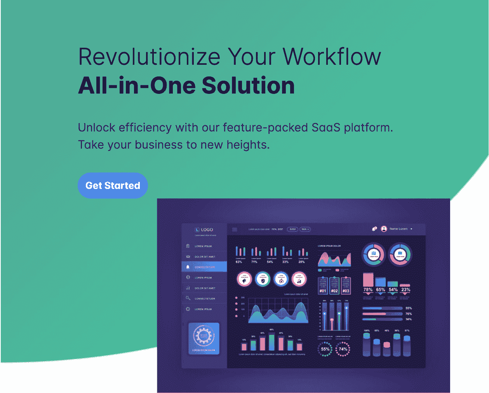

图 14.7 – 英雄部分（版权所有 Adobe Stock）

## 特性部分

特性部分突出了推广的产品或服务的核心特性或好处，旨在展示产品或服务的独特卖点并说服访客其价值。它通常包括一组视觉上吸引人的图标或图像，并附有每个特性的简要描述。让我们看看我们特性部分的简化代码：

```js
// features.component.ts
<section id="features">
  <div class="grid justify-content-center">
    <div class="col-12">
      <h2>Our Features</h2>
      <span class="text-600 text-2xl">Discover What Sets Us Apart</span>
    </div>
    <div
      class="col-12 md:col-12 lg:col-4"
      *ngFor="let feature of features"
    >
    <div class="{{ feature.bg }}">
      <i class="{{ feature.icon }}"></i>
    </div>
    <h5>{{ feature.heading }}</h5>
    <span>{{ feature.content }}</span>
    </div>
  </div>
</section>
...
features = [
  {
    heading: 'Intuitive Interface',
    content: 'User-friendly design with seamless navigation.',
    icon: 'pi pi-cog',
    bg: 'bg-yellow-200',
  },
  ...
]
```

提供的代码代表了一个展示一组特性的 HTML 结构。它还包括一个 Angular 指令（`*ngFor`），用于根据`feature`对象数组动态生成特性元素。让我们将其分解：

+   `<section id="features">`: 这行代码定义了一个具有`id`属性且设置为`"features"`的`<section>`元素。

+   `<div class="grid justify-content-center">`: 这段代码创建了一个类似网格的布局，并在网格内水平居中内容。

+   `<div class="col-12 md:col-12 lg:col-4" *ngFor="let feature of features">`: 这些类定义了不同屏幕尺寸的列布局，在大屏幕上显示三列（`lg:col-4`），在中等和小屏幕上显示一列（`col-12`）。`*ngFor`指令用于遍历`features`数组，渲染多个`feature`实例。

+   `features = [...]`: 这个`features`数组包含多个`feature`对象。每个`feature`对象代表一个单独的特征，并包括如`heading`、`content`、`icon`和`bg`等属性，这些属性将在模板中显示。

注意

12 网格系统是网页设计和布局中广泛使用的框架。它将屏幕划分为 12 个相等的列，提供了一个灵活且响应式的网格结构。这个系统允许设计师和开发者通过在网格中分配和排列元素来轻松创建响应式设计。我们讨论了这一点，以及 PrimeFlex，在*第六章*。

这里是结果：

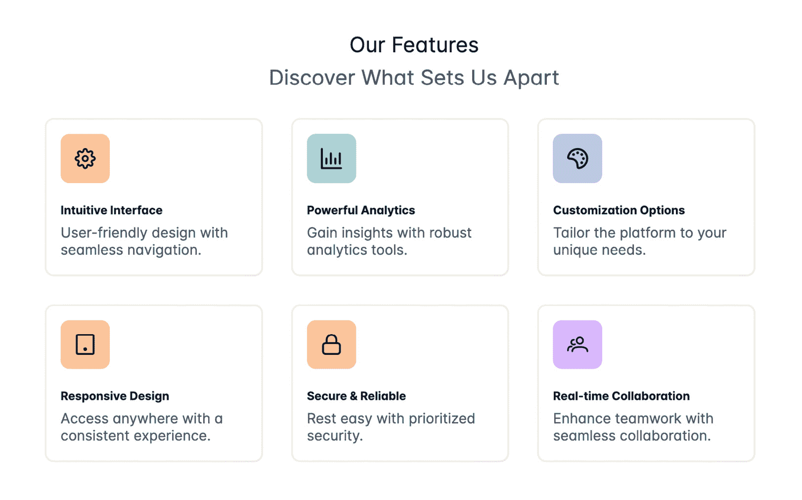

图 14.8 – 特性部分

## 推荐部分

推荐部分通过展示满意的客户的积极反馈或评论来提供社会证据。它包括以引言、客户姓名和可能还有他们的个人照片形式的推荐。本部分旨在建立信任和信誉，向潜在客户保证他们做出了正确的选择。以下是我们的推荐部分的简化代码：

```js
// testimonials.component.ts
<section id="testimonials">
  <p-carousel
    [value]="testimonials"
    [numVisible]="1"
    [numScroll]="1"
    [circular]="true"
    [autoplayInterval]="3000"
  >
    <ng-template let-testimonial pTemplate="item">
      <h3>{{ testimonial.name }}</h3>
      <span>{{ testimonial.title }}</span>
      <p>
        {{ testimonial.content }}"
      </p>
      <h4>Cool Company</h4>
    </ng-template>
  </p-carousel>
</section>
...
testimonials = [
  {
    name: 'Alice Johnson',
    title: 'CEO',
    content:
      'Exceptional service! The team went above and beyond to meet our requirements. Highly recommended.',
    company: 'Tech Innovators Inc.',
  },
  ...
]
```

提供的代码代表了一个利用 PrimeNG `Carousel`组件的推荐部分结构。让我们将其分解：

+   `<p-carousel ...>`: 这段代码将创建一个轮播图，并接受多个输入属性：

    +   `[value]`设置为`testimonials`数组，它提供了在轮播图中显示的推荐内容的数据。

    +   `[numVisible]`设置为`1`，表示每次只应显示一个推荐项目。

    +   `[numScroll]`设置为`1`，表示轮播图应每次滚动一个简介项目。

    +   `[circular]`设置为`true`，表示轮播图应循环并从开始处重新开始，当达到末尾时。

    +   `[autoplayInterval]`设置为`3000`，表示轮播图应每 3 秒自动过渡到下一个简介。

+   `<ng-template let-testimonial pTemplate="item">`：这段代码将每个`testimonial`对象的值设置为`testimonial`变量，并将用于在项目模板内渲染简介详情。

+   `testimonials = [...]`：这个数组包含多个简介对象。每个简介对象代表一个单独的简介，并包括如`name`、`title`、`content`和`company`等属性。

这里是结果：

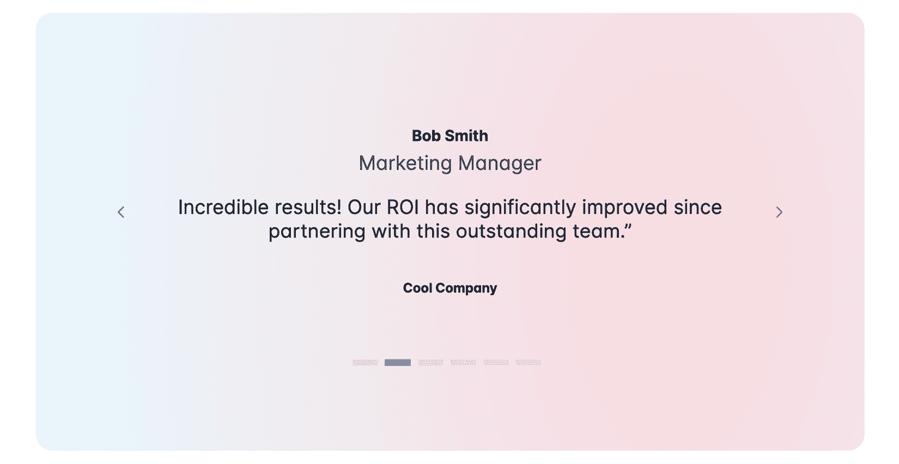

图 14.9 – 简介部分

## 价格部分

价格部分展示了产品或服务可用的不同定价选项或套餐。它通常包括一个比较表格，概述了每个套餐的功能和定价细节。价格部分的目的是帮助潜在客户做出明智的决定，并选择最适合他们需求的套餐。以下是我们的简化版定价表格代码：

```js
// pricing.component.ts
<section id="pricing">
  <div class="text-center">
    <h2>Choose the Perfect Plan</h2>
    <span>
      Select a plan that suits your needs and unlocks a world of
      possibilities.
    </span>
  </div>
  <div class="grid">
    <div class="col-12 lg:col-4" *ngFor="let plan of plans">
      <div>
        <h3>{{ plan.name }}</h3>
        <div>
          <span>$ {{ plan.price }}</span>
          <span>per month</span>
          <button pButton pRipple [label]="plan.cta"></button>
        </div>
        <p-divider class="w-full bg-surface-200" />
        <ul>
          <li *ngFor="let feature of plan.features">
            <i class="pi pi-fw pi-check"></i>
            <span>{{ feature }}</span>
          </li>
        </ul>
      </div>
    </div>
  </div>
</section>
...
plans = [
  {
    name: 'Basic Plan',
    price: 19.99,
    features: [
      'Access to core features',
      'Email support',
      'Standard storage',
      'Limited bandwidth',
    ],
    cta: 'Get Started',
  },
  ...
]
```

提供的代码代表一个使用网格布局显示不同套餐的价格部分。让我们来分解它：

+   `<div class="grid">`：这将为我们创建一个类似网格的布局。

+   `<div class="col-12 lg:col-4" *ngFor="let plan of plans">`：这些类定义了不同屏幕尺寸的列布局，在小屏幕和中屏幕上显示一个套餐，在大屏幕上显示三个定价套餐。`*ngFor`指令用于遍历`plans`数组，将我们的定价表格渲染到 DOM 中。

+   `<li ... *ngFor="let feature of plan.features">`：这将遍历套餐中的功能，并将每个功能渲染到无序列表下。

+   `plans = [...]`：这段代码代表包含多个`plan`对象的`plans`数组。每个`plan`对象代表一个单独的套餐，并包括如`name`、`price`、`features`和行动号召按钮等属性。

让我们来看看我们的价格部分：

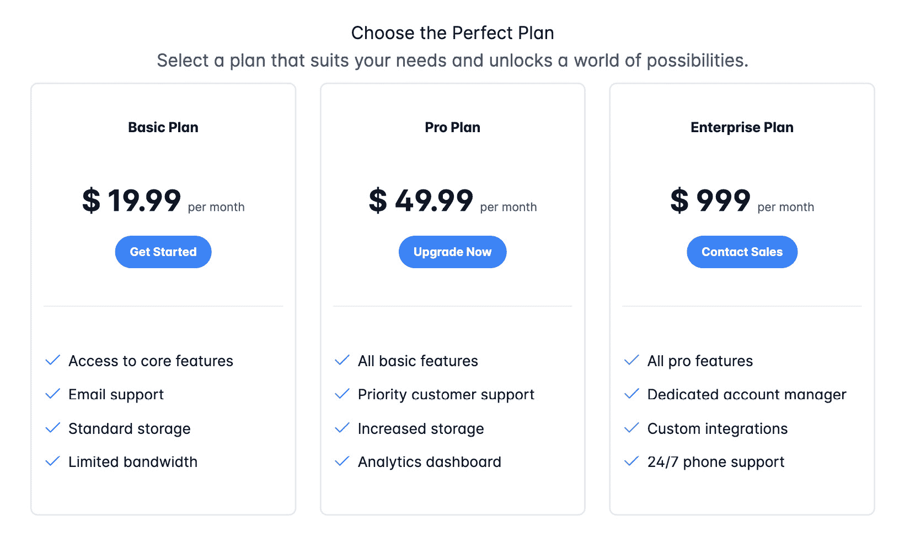

图 14.10 – 价格部分

## 页脚部分

页脚部分是着陆页的最低部分，通常包含额外的导航链接、联系信息和版权声明。它作为导航辅助工具，使用户能够访问重要链接或联系公司进行进一步咨询。以下是我们的页脚部分的简化代码：

```js
// footer.component.ts
<footer>
  <div class="grid justify-content-between">
    <div class="col-12 md:col-2">
      <a>
        <h4>PRIMEBOOK</h4>
      </a>
    </div>
    <div class="col-12 md:col-10 lg:col-7">
      <div class="grid text-center md:text-left">
        <div class="col-12 md:col-4">
          <h4> Company </h4>
          <a>About Us</a>
          ...
        </div>
        <div class="col-12 md:col-4">
          <h4> Support </h4>
          <a>Discord</a>
          ...
        </div>
        <div class="col-12 md:col-4">
          <h4> Social Media </h4>
          <a>
            <i class="pi pi-facebook"></i> Facebook
          </a>
          ...
        </div>
      </div>
    </div>
  </div>
</footer>
```

提供的代码代表页脚部分。让我们来分解它：

+   `<div class="grid justify-content-between">`：这一行创建了一个具有项目在容器起始和结束之间对齐的类似网格的布局。

+   `<div class="col-12 md:col-2">`: 这行代码定义了不同屏幕尺寸下标志的列布局。在这种情况下，它指定列应占据小屏幕的全宽（`col-12`），以及中等屏幕的 12 列中的 2 列（`md:col-2`）。

+   `<div class="col-12 md:col-10 lg:col-7">`: 这行代码定义了不同屏幕尺寸下导航的列布局。在这种情况下，它指定列应占据小屏幕的全宽（`col-12`），中等屏幕的 12 列中的 10 列（`md:col-10`），以及大屏幕的 12 列中的 7 列（`lg:col-7`）。让我们也看看页脚的导航细节：

    +   `<div class="grid text-center md:text-left">`: 这段代码创建了一个具有文本居中对齐的网格布局，适用于小屏幕（`text-center`），而对于中等屏幕则左对齐（`md:text-left`）。

    +   `<div class="col-12 md:col-4">`: 这行代码定义了每个导航部分的布局。在小屏幕（`col-12`）上，导航将占据全宽；然而，在中等或大屏幕上，导航将分为三个部分（`md:col-4`）。

让我们看看结果：

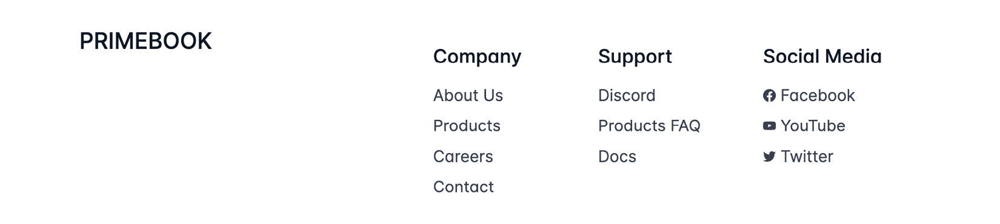

图 14.11 – 页脚部分

随着开发阶段的结束，我们的响应式 Web 应用程序现在已准备好进行实时部署。让我们开始我们旅程的最后一步：生产部署过程。

# 部署响应式 Web 应用程序

恭喜！您已成功使用 Angular、PrimeFlex、PrimeIcons 和 PrimeNG 组件构建了一个响应式 Web 应用程序。现在，是时候将您的作品与世界分享了。部署 Web 应用程序涉及几个关键步骤，从为生产准备项目到选择正确的部署平台。让我们探讨这些方面，以确保部署过程顺利。

## 准备项目以投入生产

在部署您的 Web 应用程序之前，确保一切已优化并准备好投入生产至关重要。以下是需要遵循的几个关键步骤：

+   *优化资源*：确保优化您的图片以减小其文件大小并提高加载时间。您可以使用图像压缩工具来实现这一点。以下是如何在不同屏幕尺寸下提供不同图片的示例：

    ```js
    <picture>
      <source srcset="image-small.jpg" media="(max-width: 576px)">
      <source srcset="image-medium.jpg" media="(max-width: 992px)">
      <source srcset="image-large.jpg" media="(min-width: 993px)">
      
    </picture>
    ```

    在代码中，使用`<picture>`元素来定义多个图像源的容器。在`<picture>`元素内部，使用`<source>`元素根据媒体查询条件指定不同的图像源。例如，当屏幕宽度最大为 576 像素时，将提供`image-small.jpg`图像源。

+   *配置环境变量*：如果您的应用程序依赖于环境变量，请确保它们已为生产环境正确配置。这可能包括 API 密钥、数据库连接字符串或其他敏感信息。

+   *设置错误日志*: 实现错误日志来捕获和跟踪生产环境中可能发生的任何运行时错误。Sentry 或 Rollbar 等工具可以帮助你有效地跟踪和诊断问题。

通过遵循这些步骤，你可以确保你的 Web 应用程序已优化并准备好部署。

之后，你可以运行以下命令来构建你的应用程序：

```js
> ng build
Initial Chunk Files   | Names         |  Raw Size | Estimated Transfer Size
styles-QKTSICQI.css   | styles        | 497.28 kB |                33.26 kB
main-A7MWZFB4.js      | main          | 343.22 kB |                88.63 kB
polyfills-LZBJRJJE.js | polyfills     |  32.69 kB |                10.59 kB
                      | Initial Total | 873.20 kB |               132.48 kB
Application bundle generation complete. [11.871 seconds]
```

你可以看到，在运行构建后，我们创建了 3 个块文件，总耗时为 11.871 秒。

如果你使用的是 Angular 17，你的编译文件可能位于 `dist/chapter-14/browser`，如下所示：

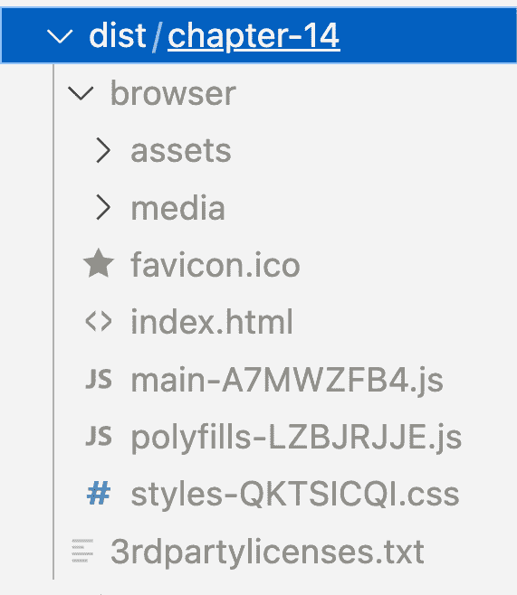

图 14.12 – 编译后的项目文件夹

对于小于 17 版本的 Angular，它将位于 `dist/chapter-14`。

## 部署的不同选项

一旦你的项目准备就绪，下一步就是选择一个部署平台。几个平台为 Angular 应用程序提供无缝部署。让我们探索一些流行的选项：

+   *Firebase Hosting*: Firebase Hosting ([`firebase.google.com/docs/hosting`](https://firebase.google.com/docs/hosting)) 提供了一种快速且安全的方式来托管你的 Web 应用程序。它支持持续部署、SSL 和自定义域名。以下是初始化和部署项目到 Firebase 的示例：

    ```js
       # Install Firebase CLI
       npm install -g firebase-tools
       # Set up a project directory
       firebase init
       # Deploy to Firebase
       firebase deploy
    ```

+   *Vercel*: Vercel ([`vercel.com`](https://vercel.com)) 提供了一个零配置的平台，用于部署前端应用程序。它与你的版本控制系统集成，实现自动部署。以下是使用 Vercel CLI 部署项目的示例：

    ```js
       # Install Vercel CLI
       npm install -g vercel
       # Deploy to Vercel
       vercel
    ```

+   *Netlify*: Netlify ([`www.netlify.com`](https://www.netlify.com)) 是一个强大的平台，它可以自动化你的构建和部署流程。它支持持续集成，并可直接从你的 Git 仓库进行部署。以下是从本地机器部署到 Netlify 的一个示例：

    ```js
       # Netlify CLI (if needed)
       npm install -g netlify-cli
       # Deploy to Netlify
       netlify deploy --prod
    ```

+   *GitHub Pages*: 如果你的代码托管在 GitHub 上，GitHub Pages 是一个简单直接的选择。当你向 `gh-pages` 分支推送更改时，它会自动部署你的应用程序。你可以在 [`docs.github.com/en/pages/getting-started-with-github-pages`](https://docs.github.com/en/pages/getting-started-with-github-pages) 上了解更多信息。

这些是建议的托管站点，你可以在这里部署你的 Angular 应用程序，但你也可以自由选择其他任何你喜欢的位置。如果你有自己的托管提供商，只需将编译文件的 内容上传到你的托管提供商，它将无缝地为你提供服务。

## 部署后的注意事项

恭喜，你的 Web 应用程序已上线！在庆祝之前，请考虑以下注意事项：

+   *监控性能*: 定期使用 Google Lighthouse 或 WebPageTest 等工具监控你的应用程序性能。解决可能影响用户体验的任何问题。

+   *安全考虑*：确保您的部署应用程序遵循 Web 安全的最佳实践。使用 HTTPS，保持依赖项更新，并在适用的情况下实施安全的身份验证机制。

+   *用户反馈*：鼓励用户对您的应用程序提供反馈。监控用户评价、评论和错误报告，以持续改进用户体验。

+   *文档更新*：更新您项目的文档以反映部署期间所做的任何更改。包括有关他人如何贡献或报告问题的信息。

+   *保持更新*：关注 Angular、PrimeNG 以及您使用的任何第三方库的更新。定期更新您的依赖项，以从新功能和安全补丁中受益。

总之，部署 Web 应用程序涉及仔细的准备和选择合适的平台。通过遵循最佳实践和选择可靠的部署选项，您可以确保您的响应式 Web 应用程序无缝地达到其受众。

# 摘要

恭喜您使用 Angular 和 PrimeNG 组件完成响应式 Web 应用程序的构建之旅！在本章的最后一部分，您已经获得了创建高效项目结构、实现响应式布局、集成各种 PrimeNG 元素以及将应用程序部署到与全世界分享的必要见解。

在本章中，我们了解到在当今的数字景观中，构建响应式 Web 应用程序至关重要。用户从各种设备访问应用程序，响应性确保了桌面、平板电脑和移动设备上的一致且愉悦的用户体验。本章中获得的知识使您能够创建适应不同屏幕尺寸的应用程序，为更广泛的受众提供可访问性。

随着您继续前进，这段旅程提供了成长和探索的机会。持续提升您的应用程序，关注 Angular 和 PrimeNG 的发布，并探索高级主题，如 PWA 和服务器端渲染。考虑为开源社区做出贡献，并将您的技能扩展到相关技术。拥抱在 Web 开发中持续学习和创新的路径。

总之，构建响应式 Web 应用程序是一项有益的尝试，它打开了众多可能性的大门。无论您是为客户、用户还是为了个人满足感创建项目，本书中获得的知识都为您提供了提供卓越用户体验的工具。随着您继续前进，拥抱在动态的 Web 开发领域中持续学习和创新的旅程。祝您编码愉快！
