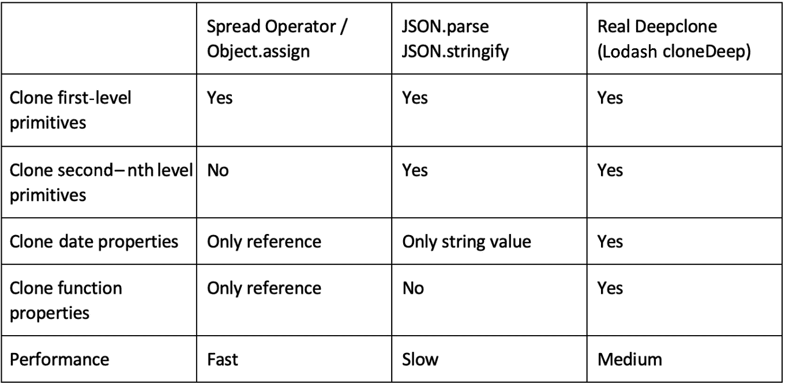

# 第二章：理解 JavaScript 和 TypeScript 的基本知识

由于 React Native 应用程序是用 JavaScript 编写的，因此对这种语言有非常深入的理解对于构建高质量的应用程序至关重要。JavaScript 非常容易学习，但很难掌握，因为它允许你几乎可以做任何事情而不会给你带来太多麻烦。然而，仅仅因为你能够做任何事情并不意味着你应该这样做。

本章的整体目标是展示避免最常见的错误、不良模式和非常昂贵的“不要”的重要基础概念。你将获得有用的提示，学习最佳实践，并重复使用 JavaScript 在应用程序中最重要的一些基本知识。

在本章中，我们将涵盖以下主题：

+   探索现代 JavaScript

+   React Native 开发的 JavaScript 知识

+   与异步 JavaScript 一起工作

+   使用类型化 JavaScript

# 技术要求

除了需要一个浏览器来运行本章的示例之外，没有其他技术要求。只需访问[`jsfiddle.com/`](https://jsfiddle.com/)或[`codesandbox.io/`](https://codesandbox.io/)，输入并运行你的代码即可。

要访问本章的代码，请通过以下链接访问本书的 GitHub 仓库：

本章不是一个完整的教程。如果你不熟悉 JavaScript 基础知识，请查看[`javascript.info`](https://javascript.info)，这是我推荐开始学习的 JavaScript 教程。

# 探索现代 JavaScript

当我们谈论现代**JavaScript**时，这指的是 ECMAScript 2015（也称为 ES6）或更新的版本。它包含了许多有用的功能，这些功能不包括在较旧的 JavaScript 版本中。自 2015 年以来，每年都会发布一次更新规范。

你可以在 TC39 GitHub 仓库([`bit.ly/prn-js-proposals`](https://bit.ly/prn-js-proposals))中查看之前版本中实现的功能。你还可以在那里找到有关即将推出的功能和发布计划的大量信息。

让我们通过查看内部结构来开始我们的旅程，以理解 JavaScript 最重要的部分。为了真正理解现代 JavaScript 及其周围的工具，我们必须稍微了解一下语言的基础和历史。JavaScript 是一种脚本语言，几乎可以在任何地方运行。

最常见的用例显然是构建用于网页浏览器的动态前端，但它也可以作为其他软件的一部分在服务器（Node.js）上运行，在微控制器上运行，或者（对我们来说最重要的是）在应用程序中运行。

JavaScript 运行的地方都必须有一个 JavaScript 引擎，它负责执行 JavaScript 代码。在旧浏览器中，引擎只是简单的解释器，在运行时将代码转换为可执行的字节码，而不进行任何优化。

今天，不同的 JS 引擎内部正在进行大量的优化，这取决于对引擎用例重要的哪些指标。例如，Chromium V8 引擎引入了即时编译，这在执行 JavaScript 时带来了巨大的性能提升。

为了能够在所有这些平台和所有这些引擎之间对 JavaScript 有一个共同的理解，JavaScript 有一个称为 ES 的标准化规范。随着越来越多的功能（如改进的异步或更简洁的语法）被引入 JavaScript，这个规范不断演变。

这个不断发展的功能集对于开发者来说很棒，但也引入了一个大问题。为了能够使用 ES 语言规范的新功能，相关的 JavaScript 引擎必须实现这些新功能，然后必须将引擎的新版本推出给所有用户。

尤其是当涉及到浏览器时，这是一个大问题，因为许多公司依赖于非常旧的浏览器作为其基础设施。这将使得开发者多年内无法使用新功能。

这就是像 Babel ([`babeljs.io`](https://babeljs.io)) 这样的转译编译器发挥作用的地方。这些转译编译器将现代 JavaScript 转换为向后兼容的版本，这样较旧的 JavaScript 引擎就可以执行。这种转编译是现代网络应用程序以及 React Native 应用程序构建过程中的一个重要步骤。

当编写现代 JavaScript 应用程序时，它的工作方式是这样的：

1.  你使用现代 JavaScript 编写代码。

1.  转译编译器将你的代码转换为预 ES6 的 JavaScript。

1.  JavaScript 引擎解释你的代码并将其转换为字节码，然后在该机器上执行。

1.  现代 JavaScript 引擎通过诸如即时编译等特性优化执行。

当涉及到 React Native 时，你可以选择具有不同优势和劣势的不同 JavaScript 引擎。你可以在*第八章*中了解更多信息，*JavaScript 引擎和 Hermes*。

在本节中，你学习了现代 JavaScript 是什么以及它在底层是如何工作的。让我们继续学习在开发 React Native 时所需的 JavaScript 的具体部分。

# 探索 JavaScript 以进行 React Native 开发

在本节中，你将学习一些基本的 JavaScript 概念，所有这些概念对于真正理解如何使用 React Native 都非常重要。再次强调，这并不是一个完整的教程；它只包括如果你不想遇到难以调试的错误，你必须牢记的最重要的事情。

小贴士

当你不确定 JavaScript 在特定场景中的行为时，只需创建一个隔离的示例并在 [`jsfiddle.com/`](https://jsfiddle.com/) 或 [`codesandbox.io/`](https://codesandbox.io/) 上尝试它。

## 理解对象的分配和传递

在任何编程语言中，分配或传递数据是最基本的操作之一。你在每个项目中都会做很多次。当使用 JavaScript 时，处理原始类型（布尔值、数字、字符串等）和处理对象（或数组，它们基本上是对象）之间存在差异。

原始类型是通过值分配和传递的，而对象是通过引用分配和传递的。这意味着对于原始类型，会创建并存储值的真正副本，而对于对象，只会创建并存储对同一对象的引用。

这一点非常重要，因为当您编辑分配或传递的对象时，您也在编辑初始对象。

以下代码示例将使这一点更加清晰：

```js
function paintRed(vehicle){
     vehicle.color = 'red›;
}
const bus = {
     color: 'blue'
}
paintRed(bus);
console.log(bus.color); // red
```

`paintRed` 函数不返回任何内容，我们在初始化为蓝色公交车后不在 `bus` 中写入任何内容。那么会发生什么？`bus` 对象是通过引用传递的。这意味着 `paintRed` 函数中的 `vehicle` 变量和函数外部的 `bus` 变量引用存储中的相同对象。

当改变 `vehicle` 的颜色时，我们也改变了 `bus` 引用的对象的颜色。

这是预期的行为，但您应该尽量避免在大多数情况下使用它。在较大的项目中，当对象在许多函数中传递并更改时，代码可能会变得非常难以阅读（和调试）。正如罗伯特·C·马丁在《Clean Code》一书中已经写到的，函数应该没有副作用，这意味着它们不应该改变函数作用域之外的价值。

如果您想在函数中更改对象，我建议在大多数情况下使用返回值。这更容易理解和阅读。以下示例显示了上一个示例中的代码，但没有副作用：

```js
function paintRed(vehicle){
const _vehicle = { ...vehicle }
     _vehicle.color = 'red'
return _vehicle;
}
let bus = {
     color: 'blue'
}
bus = paintRed(bus); 
console.log(bus.color); // red
```

在这个代码示例中，`bus` 是一个新对象，这是由 `paintRed` 函数创建的这一点非常清楚。

在您的工作项目中请记住这一点。当您必须调试对象中的更改，但不知道它从何而来时，这真的可能花费您很多时间。

## 创建对象的真正副本

由前一点导致的一个非常常见的问题是您必须克隆一个对象。有多种方法可以做到这一点，每种方法都有不同的限制。以下代码示例中展示了三种选项：

```js
const car = {
color: 'red',
       extras: {
            radio: "premium",
            ac: false
       },
       sellingDate: new Date(),
         writeColor: function() {
           console.log('This car is ' + this.color);
}
};
const _car = {...car};
const _car2 = Object.assign({}, car);
const _car3 = JSON.parse(JSON.stringify(car));
car.extras.ac = true;
console.log(_car);
console.log(_car2); 
console.log(_car3);
```

我们创建了一个具有不同类型属性的对象。这很重要，因为克隆对象的不同方法并不适用于所有属性。我们使用字符串作为 `color`，对象作为 `extras`，日期作为 `sellingDate`，并在 `writeColor` 中使用函数来返回带有汽车颜色的字符串。

在接下来的几行中，我们使用三种不同的方法来克隆对象。在创建 `_car`、`_car2` 和 `_car3` 克隆对象后，我们更改初始 `car` 对象中的 `extras`。然后我们记录所有三个对象。

现在，我们将详细探讨有关如何在 JavaScript 中克隆对象的多种选项。这些选项包括以下内容：

+   扩展运算符和`Object.assign`

+   `JSON.stringify`和`JSON.parse`

+   真正的深克隆

我们将从扩展运算符和`Object.assign`开始，它们基本上以相同的方式工作。

### 扩展运算符和`Object.assign`

我们用来创建`_car`的三个点称为`car`。在第 14 行，我们做了非常类似的事情；我们使用`Object.assign`将`car`的所有属性赋值给一个新的空对象。

事实上，第 13 行和第 14 行的工作方式相同。它们创建了一个**浅克隆**，这意味着它们克隆了对象的所有属性值。

这对于值来说效果很好，但对于复杂的数据类型则不行，因为，再次强调，对象是通过引用分配的。因此，这些创建复杂对象副本的方法只克隆了对象属性数据的引用，而没有创建每个属性的真正副本。

在我们的例子中，我们不会创建`extras`、`sellingDate`和`writeColor`的实际副本，因为`car`对象中属性的值只是对对象的引用。这意味着当我们修改第 17 行的`_car.extras`时，也会修改`_car2.extras`，因为它们引用的是同一个对象。

因此，这些克隆对象的方法对于只有一层的对象来说效果很好。一旦有一个多层的对象，使用扩展运算符或`Object.assign`克隆可能会在你的应用程序中引起严重问题。

### 再次进行序列化和解析

一种非常常见的克隆对象模式是使用 JavaScript 内置的`JSON.stringify`和`JSON.parse`功能。这会将对象转换为原始类型（JSON 字符串），并通过再次解析字符串来创建一个新的对象。

这将强制进行**深克隆**，这意味着甚至子对象也会按值复制。这种方法的缺点是它只适用于在 JSON 中有等效值的值。

因此，你将丢失所有函数、未定义的属性以及 JSON 中不存在的值，如无穷大。其他事物，如日期对象，将被简化为字符串，导致时区丢失。因此，这个解决方案非常适合具有原始值的深对象。

### 真正的深克隆

当你想创建一个真正的深克隆对象时，你必须发挥创意并编写自己的函数。在网上搜索时，有很多不同的方法。我建议使用经过良好测试和维护的库，例如 Lodash ([`lodash.com/`](https://lodash.com/))。它提供了一个简单的`cloneDeep`函数，它会为你完成工作。

你可以使用所有解决方案，但你要记住每种方法的局限性。当使用它们时，你也应该查看不同解决方案的性能。在大多数情况下，所有克隆方法都足够快，可以用来使用，但当你应用程序中遇到性能问题时，你应该更仔细地查看你使用的方法。

请在以下表格中查找摘要：




图 2.1 – JavaScript 克隆解决方案的比较

在某些情况下知道如何克隆对象非常重要，因为使用错误的克隆技术可能会导致难以调试的错误。

在理解了如何克隆对象之后，让我们看看如何解构对象。

## 在 JavaScript 中使用解构

当你使用 React Native 时，你还需要经常做的一件事是解构对象和数组。解构基本上意味着*展开*对象属性或数组元素。尤其是在使用 Hooks 时，这是你必须非常清楚的事情。让我们从数组开始。

### 解构数组

看一下以下代码示例，它展示了数组是如何被解构的：

```js
let name = ["John", "Doe"];
let [firstName, lastName] = name;
console.log(firstName); // John
console.log(lastName); // Doe
```

你可以看到一个包含两个元素的数组。在第二行，我们通过将`name`数组赋值给包含两个变量的数组来*解构*`name`数组。第一个变量被分配数组的第一个值，第二个变量被分配第二个值。这也可以用于超过两个值的情况。

数组解构在每次你使用`useState`Hook 时都会用到（更多内容请参阅*第三章**，Hello React Native*)。

现在你已经知道了如何解构数组，让我们继续学习如何解构对象。

### 解构对象

以下代码示例展示了如何解构一个对象：

```js
let person = {
     firstName: "John", 
     lastName: "Doe",
     age: 33
}
let {firstName, age} = person;
console.log(firstName); // John
console.log(age); // 33
```

对象解构与解构数组的工作方式相同。但请注意代码示例的第 6 行中的花括号。在解构对象而不是数组时，这一点非常重要。你*可以*仅通过在解构中使用键来获取对象的所有属性，但你不必使用所有属性。在我们的例子中，我们只使用了`firstName`和`age`，而没有使用`lastName`。

在使用解构时，你还可以收集在解构期间未指定的所有元素。这通过以下章节中描述的扩展运算符来完成。

### 在解构时使用扩展运算符

以下代码示例展示了如何使用扩展运算符：

```js
const person = {
     firstName: 'n', 
     lastName: 'Doe',
     age: 33,
     height: 176
}
const {firstName, age, ...rest} = person;
console.log(firstName); // John
console.log(age); // 33
console.log(Object.keys(rest).length); // 2
```

当解构数组或对象时，你可以使用扩展运算符来收集在解构中未指定的所有元素。在代码示例中，我们在解构时使用了`firstName`和`age`。

在这个例子中，所有其他属性，例如`lastName`和`height`，都被收集到一个新的对象`rest`变量中。这在 React 和 React Native 中用得很多，例如在将属性（或 props）传递到组件并解构这些 props 时。

当你使用 React 或 React Native，尤其是与函数组件和 Hooks 一起工作时，解构是你在每个组件中都会用到的东西。基本上，它不过是*展开*对象属性或数组元素。

现在我们已经理解了解构，让我们继续学习另一个重要的话题——JavaScript 中的`this`关键字及其作用域。

## 理解 JavaScript 中的`this`

当涉及到`this`关键字时，JavaScript 有着相当独特的行为。它并不总是指向使用它的函数或作用域。默认情况下，`this`绑定到全局作用域。这可以通过隐式或显式绑定来改变。

### 隐式和显式绑定

`this`始终指向对象。`this`指向另一个上下文。这是 React 和 React Native 中经常使用的一种方法，用于在类组件的处理程序中绑定`this`。

请查看以下代码示例：

```js
class MyClass extends Component{
       constructor( props ){
              this.handlePress = 
                  this.handlePress.bind(this);
       }
handlePress(event){
              console.log(this);
       }
render(){
              return (
                <Pressable type="button" 
                     onPress={this.handlePress}>
                     <Text>Button</Text>
                </Pressable >
              );
       }
}
```

在前面的代码中，我们明确地将类的`this`值绑定到`handlePress`函数上。这是必要的，因为我们如果不这样做，`this`将隐式地绑定到调用它的对象上，在这种情况下，它将是`Pressable`组件中的任何地方。由于在大多数情况下，我们希望在`handlePress`函数中访问`MyClass`组件的数据，因此这种显式绑定是必要的。

你可以在很多应用中看到这种代码，因为长期以来，这是从函数内部访问类属性的唯一方法。这导致了构造函数中，特别是在较大的类组件中，有很多显式绑定语句。幸运的是，今天有一个更好的解决方案——箭头函数！

### 箭头函数拯救

在现代 JavaScript 中，还有一个解决方案使得隐式/显式绑定变得多余：`this`关键字被绑定。你不需要写`function myFunction(param1){}`，只需简单地写`const myFunction = (param1) => {}`。

这里重要的是箭头函数始终使用`this`的词法作用域，这意味着它们不会隐式地重新绑定`this`。

以下示例展示了如何使用箭头函数来使显式绑定语句变得多余：

```js
class MyClass extends Component{
handlePress = (event) => {
              console.log(this);
       }
render(){
              return (
                <Pressable type="button" 
                     onPress={this.handlePress}>
                     <Text>Button</Text>
                </Pressable >
              );
       }
}
```

正如你所见，我们使用箭头函数来定义`handlePress`。正因为如此，我们不需要像之前的代码示例那样进行显式绑定。我们只需在`handlePress`函数内部使用`this`来访问`MyClass`组件的其他属性的状态和 props。这使得代码更容易编写、阅读和维护。

重要提示

请记住，普通函数和箭头函数不仅在语法上不同，它们还改变了`this`的绑定方式。

理解`this`的作用域对于避免昂贵的错误，如未定义的对象引用至关重要。当涉及到应用开发时，这些未定义的对象引用可能会导致应用崩溃。因此，在使用`this`关键字时，请记住你引用的作用域。

这些是在使用 JavaScript 开发大型应用时你必须真正理解的最重要的事情。如果你不这样做，你将犯下昂贵的错误。

在使用 React Native 开发应用时，下一件非常重要的事情是异步编程。

# 使用异步 JavaScript

由于 React Native 的架构（更多内容请参阅*第三章*，*Hello React Native*)以及应用的典型用例，理解异步 JavaScript 至关重要。异步调用的典型例子是对 API 的调用。

在同步世界中，在发出调用后，应用程序将被阻塞，直到收到 API 的响应。这显然是不期望的行为。应用程序应该在等待响应的同时响应用户交互。这意味着 API 调用必须是异步的。

在 JavaScript 中处理异步调用有多种方式。第一种是回调。

## 探索回调

回调是处理 JavaScript 中异步操作的最基本方式。我建议尽可能少地使用它们，因为还有更好的替代方案。但是，由于许多库依赖于回调，你必须对它们有一个很好的理解。

回调是一个 JavaScript 函数 A，它作为参数传递给另一个函数 B。在函数 B 的某个点，函数 A 被调用。这种行为被称为**回调**。以下代码展示了简单的回调示例：

```js
const A = (callback) => {
     console.log("function A called");
     callback();
} 
const B = () => {
     console.log("function B called");
}
A(B);
// function A called
// function B called
```

当你查看代码时，函数 A 被调用。它记录了一些文本，然后调用回调。这个回调是在函数 A 被调用时作为属性传递给函数 A 的函数 – 在这个例子中，函数 B。

因此，函数 B 在函数 A 的末尾被调用。函数 B 随后记录了一些更多的文本。由于这段代码，你将看到两行文本：首先，函数 A 记录的文本，其次，函数 B 记录的文本。

虽然回调可能有点难以理解，但让我们看看底层发生了什么。

## 理解实现

要真正理解回调，我们不得不稍微深入到 JavaScript 引擎的实现中。JavaScript 是单线程的，所以在 JavaScript 代码执行过程中，异步是不可能的。以下图显示了 JavaScript 引擎的重要部分以及它们如何协同工作以实现异步：

![图 2.2 – JavaScript 引擎异步代码执行

![图 2.2 – JavaScript 引擎异步代码执行

图 2.2 – JavaScript 引擎异步代码执行

你的命令将被推送到**调用栈**，并按照后进先出的顺序进行处理。为了实现异步，JavaScript 引擎提供了一些 API，这些 API 可以从你的 JavaScript 代码中调用。这些 API 在另一个线程上执行代码。大多数这些 API 期望一个作为参数传递的回调。

当第二个线程上的代码执行完成后，此回调将被推送到**消息队列**。消息队列由**事件循环**监控。一旦调用栈为空且消息队列不为空，事件循环就会从消息队列中取出第一个项目并将其推入调用栈。现在我们回到了 JavaScript 上下文，JavaScript 代码执行继续进行，并使用给定的回调。

## 比回调更好的是什么？Promises！

在 ES 2015 中，引入了 promises。在底层，它们的工作方式与回调非常相似，只是还有一个名为作业或微任务队列的另一个队列。这个队列的工作方式类似于消息队列，但在事件循环处理时具有更高的优先级。

与回调相比，promises 具有更简洁的语法。虽然您可以将任意数量的回调传递给一个函数，但 promise 返回一个具有确切一个或两个参数的函数——`resolve`和（可选的）`reject`。当 promise 成功处理时，调用`resolve`，如果在处理 promise 时发生错误，则调用`reject`。

以下代码显示了 promise 的通用示例及其使用方法：

```js
const myPromise = () => new Promise((resolve) => {
     setTimeout(() => {
          resolve();
          }, 500);
});
console.log('start promise');
myPromise()
.then(() => {
     console.log('promise resolved');
});
// start promise
// -- 500ms delay
// promise resolved
```

promise 是通过`new Promise`创建的，然后被调用。在 promise 内部，在 promise 解决之前有一个 500 毫秒的延迟。当 promise 解决时，`.then`内部的函数被调用。

使用 promise 的这种异步行为的一个简单示例是从服务器获取数据。您可以使用 JavaScript 中的 Fetch API。此 API 会联系服务器并等待响应。

一旦收到响应，`resolve`或`reject`就会被推送到队列中，并由事件循环处理。以下示例显示了简单 fetch 的代码：

```js
fetch("https://fakerapi.it/api/v1/texts?_quantity=1")
     .then(response => response.json())
     .then(data => {
          console.log(data);
     })
     .catch(error => {
          console.log(error); // handle or report the error
     })
```

此代码示例甚至包含两个 promises：

+   `fetch`操作，它返回服务器响应

+   包含在响应中的 JSON 数据的解包

如果其中一个 promise 被拒绝，`catch`块会调用并带有一些错误信息。

小贴士

您应该始终捕获错误和 promise 拒绝，并处理它们——或者至少报告它们。虽然未处理的 promise 拒绝在大多数情况下不会使您的应用程序崩溃，但它表明出了问题。如果没有适当的错误报告，这个错误可能很难发现和调试。始终使用报告工具，如 Sentry 或 Bugsnag 是一个好主意。您可以在*第十四章*，*技巧、窍门和最佳实践*中了解更多相关信息。

Promises 还提供了一些有趣的功能，例如`Promises.all`和`Promises.first`，这使得处理多个 promises 成为可能。如果您想了解更多关于这方面的信息，可以查看[bit.ly/prn-promises](http://bit.ly/prn-promises)。

## 使用 async/await 改进的语法

在 ES 2017 中，引入了`async`和`await`关键字来处理 Promises。这是我在你的项目中推荐使用的语法，因为它使得代码易于阅读和理解。你不需要将`.then`与回调函数链接到 promise 调用上，你只需简单地`await`promise。

唯一的要求是，你编写的代码函数必须声明为异步函数。你也可以用`try/catch`块来包装调用。这类似于常规的 promise 语法中的`.catch`。以下示例展示了如何使用`async/await`属性：

```js
const fetchData = async () => {
try {     
const response = await fetch(
"https://fakerapi.it/api/v1/texts?_quantity=1");
const data = await response.json();
console.log(data);
} catch (error) {
     console.log(error);
     }
}
fetchData();
```

我们使用`async`关键字将`fetchData`指定为异步函数。在异步函数内部，我们使用`try`/`catch`进行适当的错误处理。在`try`块内部，我们使用`await`关键字等待`fetch`调用和 JSON 主体的解包。

基本上，每个 promise 都可以与 async/await 语法一起使用。此外，异步函数可以用`.then`和`.catch`作为 Promise 来处理。再次强调，这是我在大型项目中推荐使用的语法。由于它与 Promises 兼容，你可以直接使用很多库。但是，当你必须与依赖于其 API 中的 promises 的库一起工作时，你必须修补它。

## 补丁回调库

当使用 React Native 时，你会发现一些库在它们的 JavaScript 中使用回调函数。这是因为 JavaScript 和 React Native 上下文之间的传输在大多数情况下依赖于回调函数。我建议修补这些库并重新工作，以提供 promise API，然后你可以在你的项目中使用 async/await。这很简单，并且大大提高了代码质量。以下代码块展示了一个非常简单的示例：

```js
// libraryFunction(successCallback, errorCallback);
const libraryFunctionPromise = new Promise((resolve, reject) => {
     libraryFunction(resolve, reject);
}
```

在这个代码示例中，我们有一个提供函数的库，该函数期望一个`successCallback`和一个`errorCallback`。我们创建了一个 promise，它只是调用这个函数，并将`resolve`作为`successCallback`，将`reject`作为`errorCallback`。就是这样，现在我们可以使用 async/await 来调用我们的 promise，然后它为我们调用库函数。

小贴士

尽可能地使用 async/await 语法而不是 promise。这使得你的代码更容易阅读和理解。

在本节中，你学习了 JavaScript 中异步的实现方式，回调和 promise 是如何工作的，以及为什么你应该依赖 async/await，尤其是在大型项目中。

这导致了本章的最后一节，这在大型项目中工作也非常重要——JavaScript 中的静态类型检查。

# 使用类型化 JavaScript

JavaScript 是一种动态类型语言。这意味着你可以在变量初始化后更改其类型。虽然这对于小型脚本来说可能非常有用，但在大型项目中工作可能会导致难以解决的问题。在拥有大量用户的 app 中调试此类错误可能会变得非常混乱。

这就是 JavaScript 扩展发挥作用的地方。有多个解决方案可以将 JavaScript 扩展为强类型语言。这不仅防止了错误，还使代码重构和代码补全以及直接在编写代码时指出问题成为可能。

这大大加快了开发过程。我肯定会推荐使用强类型 JavaScript，并且我想在这里介绍两种最流行的解决方案。

## Flow

由 Facebook 创建并开源的 Flow 是一个与普通 JavaScript 一起工作的静态类型检查器。它最初是一个命令行工具，用于扫描您的文件以检查类型安全性并向控制台报告错误。如今，所有常见的 JavaScript IDE 都内置了 Flow 支持或通过优秀的插件提供支持。

要启用 Flow 的静态类型检查，您只需在文件顶部添加`// @flow`注释即可。这告诉 Flow 类型检查器将文件包含在检查中。然后您可以直接在变量和参数的声明后面添加类型（内联），或者您可以声明更复杂的类型，并使用这些类型在声明变量时指定变量的类型。

这在下面的代码块中显示：

```js
type Person = {
     name: string,
     height: number, 
     age: number
}
let john: Person = {
     name: "John",
     height: 180, 
     age: 35
}
```

我们创建了一个`Person`类型，然后使用它来创建一个人物，`john`。如果我们遗漏了某个属性或者分配了错误类型的值，Flow IDE 集成会给我们一个错误。

由于 Flow 不是一个独立的语言，而只是在 JavaScript 之上的一个工具，我们必须将我们的文件从 Flow 注释文件转换回*普通*JavaScript 文件。这基本上意味着，我们必须使用一个转换器来从我们的文件中移除所有的 Flow 注释。Flow 提供了一个 Babel 插件来完成这项工作，这个插件必须安装到您的项目中才能工作。

Flow 可以通过`.flowconfig`文件进行配置。在这里，您可以定义哪些文件和文件夹应该被检查，哪些不应该被检查，以及指定一些选项，例如如何处理导入，以及 Flow 可以并行启动多少个工作线程来检查您的代码或 Flow 允许使用多少内存。

如果您想深入了解 Flow，请访问[`flow.org/`](https://flow.org/)网站。

## TypeScript

对于强类型 JavaScript 的另一种选择是 TypeScript。它是由微软开发和维护的一个开源语言，它建立在 JavaScript 之上。它也为所有常见的 JavaScript IDE 提供了出色的集成，并且与 Flow 非常相似。

在您能够在生产环境中执行之前，TypeScript 代码将通过 TypeScript 编译器或 Babel 转换为纯 JavaScript。甚至注释的语法也几乎相同。在*Flow*部分的示例代码在 TypeScript 中也能完美运行。

如果您想深入了解 TypeScript，请访问[www.typescriptlang.org](http://www.typescriptlang.org)网站。

通常情况下，我更倾向于使用 TypeScript 而不是 Flow，因为 TypeScript 的使用范围更广，社区支持也更大。文档质量更好，IDE 集成和代码补全也更好。如果你开始一个新的项目，我建议选择 TypeScript。但 Flow 也是一个不错的解决方案。如果你在你的项目中已经有了工作的 Flow 集成，目前没有必要迁移到 TypeScript。 

重要提示

如果你参与一个大规模项目，我肯定会推荐使用 Flow 或 TypeScript。即使你一开始有一些开销，最终它能为你节省更多的时间和金钱。

# 摘要

在本章中，我们学习了现代 JavaScript 的工作原理，以及在与 React Native 一起工作时的一些特别重要的基础知识，还有 JavaScript 中的异步是如何工作的。你已经对底层技术有了基本的了解，以及误用可能导致昂贵的错误以及如何避免它们。

在下一章中，我们将学习关于 React 的内容，它内部是如何工作的，以及在与 React Native 一起工作时，哪些 React 的部分是重要的，需要深入了解。
