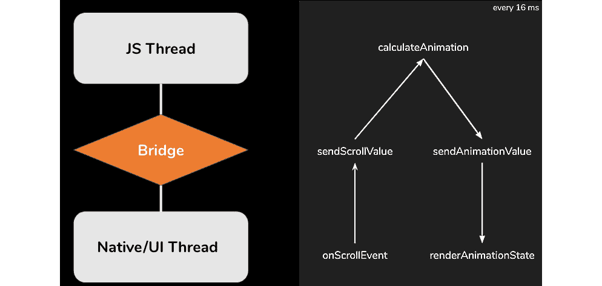
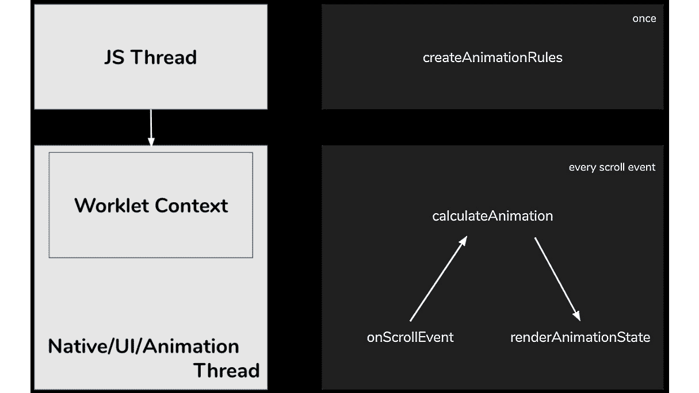
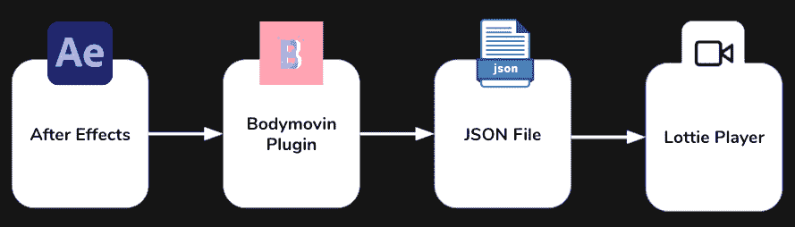

# 第六章：与动画一起工作

动画是每个移动应用的一部分。平滑的动画可以决定用户是否感到舒适地使用应用。实质上，动画只是屏幕反复渲染，从一个状态过渡到另一个状态。

这种渲染应该非常快，以至于用户不会意识到动画的单个状态，而是感知到它是一个平滑的动画。更进一步，动画不仅随时间从状态 A 变换到状态 B，而且还会对用户的交互做出反应，如滚动、按下或滑动。

大多数设备的屏幕帧率为 60 **帧/秒**（**fps**），而现代设备已经达到 120 fps（截至编写本文时，React Native 仅支持 60 fps，你可以在 GitHub 上了解相关信息：[bit.ly/prn-rn-fps](http://bit.ly/prn-rn-fps))。这意味着当运行动画时，屏幕必须以 60 fps 的速度重新渲染。

这相当具有挑战性，因为计算复杂的动画和重新渲染屏幕是一些计算密集型操作。特别是在低端设备上，动画的计算可能会变得太慢，屏幕刷新率低于 60/120 fps。这会使动画和应用程序感觉迟钝和缓慢。

实质上，你可以将动画分为两种不同类型：

+   **屏幕动画**：这类动画仅适用于屏幕的一部分。这种类型的动画有很多不同的用途，例如吸引用户注意、提供触摸反馈、显示进度或加载指示，或者改善滚动体验。

+   **全屏动画**：这类动画过渡整个屏幕。大多数情况下，这种类型的动画用于导航到另一个屏幕。

由于全屏动画由所有流行的导航库内部处理，因此本章将重点介绍屏幕动画。全屏动画已在 *第四章**，样式、存储和导航，导航部分* 中介绍。

在 React Native 中实现平滑动画有多种方法。根据项目类型和想要构建的动画类型，你可以从众多解决方案中选择，每种方案都有其自身的优缺点。在本章中，我们将讨论最佳和最广泛使用的解决方案。

在本章中，我们将涵盖以下主题：

+   理解 React Native 中动画的架构挑战

+   使用 React Native 内置的 Animated API

+   使用 `react-native-animatable` 创建简单动画

+   探索 Reanimated 2 – React Native 最完整的动画框架

+   在 React Native 中使用 Lottie 动画

信息

关于使用 Skia 渲染引擎（它为 Chrome、Firefox、Android 和 Flutter 提供动力）在 React Native 中渲染动画的一些有趣的发展，但在撰写本文时，这种方法尚未准备好投入生产。

# 技术要求

要运行本章中的代码，您必须设置以下内容：

+   一个可工作的 React Native 环境 ([bit.ly/prn-setup-rn](http://bit.ly/prn-setup-rn) – React Native CLI 快速入门)

+   一个 iOS/Android 模拟器或真实设备（真实设备更受欢迎）

# 理解 React Native 中动画的架构挑战

当涉及到动画时，React Native 的当前架构并不理想。想象一下，一个基于 `ScrollView` 垂直滚动值来缩放或移动标题图片的动画；这个动画必须基于 `ScrollView` 的滚动值进行计算，并立即重新渲染图片。以下图表显示了使用纯 React Native 架构时会发生什么：



图 6.1 – 基于滚动值进行动画时的 React Native 架构

在这里，您可以看到一般的 React Native 架构。JavaScript 线程是您编写代码的地方。每个命令都将序列化并通过桥接发送到原生线程。在这个线程中，命令被反序列化并执行。同样，用户输入也是如此，但方向相反。

对于我们的动画来说，这意味着滚动值必须序列化，通过桥接发送，反序列化，通过复杂的计算转换为动画值，序列化，通过桥接返回，反序列化，然后渲染。整个过程必须在每 16 毫秒（或每秒 60 次）内完成。

这种往返会导致多个问题：

+   序列化/反序列化过程消耗了不必要的计算能力

+   在大多数情况下，JavaScript 中的计算速度比原生代码慢

+   计算可能会阻塞 JavaScript 线程，使应用无响应

+   这种往返过程可能导致帧率下降，使动画看起来迟缓且缓慢

由于这些问题，不建议在您自己的纯 React Native 代码中编写动画（例如，通过在循环中设置状态）。幸运的是，有多个现成的解决方案可以避免这些问题，并实现高质量的动画。

在接下来的几节中，我们将探讨四种不同的解决方案。每个解决方案都有其优缺点，而应该选择哪种解决方案则取决于项目和用例。让我们从内置的 Animated API 开始。

# 使用 React Native 的内部动画 API

React Native 自带内置的 Animated API。这个 API 非常强大，你可以用它实现许多不同的动画目标。在本节中，我们将简要了解它是如何工作的，以及内部 Animated API 的优势和局限性。

要获取完整的教程，请查看官方文档，链接为[bit.ly/prn-animated-api](http://bit.ly/prn-animated-api)。

要了解 Animated API 的工作原理，让我们从一个简单的例子开始。

## 从一个简单的例子开始

以下代码实现了一个简单的淡入动画，使视图在 2 秒内出现：

```js
import React, { useRef } from "react";
import { Animated, View, Button } from "react-native";
const App = () => {
  const opacityValue = useRef(new Animated.Value(0)).
      current;
  const showView = () => {
    Animated.timing(opacityValue, {
        toValue: 1,
        duration: 2000
        }).start();
    };
  return (
    <>
      <Animated.View
        style={{
          backgroundColor: 'red',
              opacity: opacityValue
        }}
       />
      <Button title="Show View" onPress={showView} />
    </>
  );
}
export default App;
```

动画 API 基于动画值。这些值随时间变化，并作为应用程序样式的组成部分使用。在这个例子中，我们将`opacityValue`初始化为一个`Animated.Value`组件，其初始值为`0`。

如你所见，JSX 代码包含一个`Animated.View`组件，其样式使用`opacityValue`作为透明度属性。当运行此代码时，`Animated.View`组件最初是完全隐藏的；这是因为透明度被设置为`0`。当调用`showView`时，它启动一个`Animated.timing`函数。

这个`Animated.timing`函数期望一个`Animated.Value`组件作为第一个属性，一个配置对象作为第二个参数。`Animated.Value`组件是动画过程中应该改变的价值。通过配置对象，你可以定义动画的一般条件。

在这个例子中，我们想在 2 秒（2,000 毫秒）内将`Animated.Value`组件的值从 0 变为 1。然后，`Animated.timing`函数计算动画的不同状态，并负责渲染`Animated.View`组件。

值得了解

实际上，你可以对 UI 的任何部分进行动画处理。Animated API 直接导出了一些组件，例如`Animated.View`、`Animated.Image`、`Animated.ScrollView`、`Animated.Text`和`Animated.FlatList`。但你可以通过使用`Animated.createAnimatedComponent()`来对任何组件进行动画处理。

虽然 Animated API 并没有完全解决 React Native 架构的问题，但它比反复设置状态要好，因为它大大减少了从 JavaScript 线程传输到原生线程的负载，但这种传输必须每帧进行。为了防止每帧都进行这种传输，你必须使用原生驱动程序，如下面的子节所示。

## 使用原生驱动程序

当使用配置对象配置动画时，你可以设置一个名为`useNativeDriver`的属性。这非常重要，并且尽可能应该这样做。

当使用`useNativeDriver: true`的原生驱动程序时，React Native 在开始动画之前将所有内容发送到原生线程。这意味着动画完全在原生线程上运行，这保证了动画的流畅运行和没有帧丢失。

不幸的是，原生驱动程序目前仅限于非布局属性。因此，如变换和透明度等属性可以使用原生驱动程序进行动画处理，而所有 Flexbox 和位置属性，如 `height`、`width`、`top` 或 `left`，则不能使用。

## 插值动画值

在某些情况下，你不想直接使用 `Animated.Value` 组件。这就是插值发挥作用的地方。插值是输入和输出范围的简单映射。在下面的代码示例中，你可以看到一个插值，它向之前的简单示例添加了一个位置变化：

```js
style={{
    opacity: opacityValue,
    transform: [{
      translateY: opacityValue.interpolate({
        inputRange: [0, 1],
        outputRange: [50, 0]
      }),
    }],
  }}
```

在这个代码示例中，我们向 `style` 对象中添加了一个 `translateY` 变换属性。这个属性改变了一个对象的垂直位置。我们既没有设置一个固定值，也没有直接绑定 `opacityValue`。

我们使用一个具有定义的 `inputRange` 值 `[0,1]` 和定义的 `outputRange` 值 `[50,0]` 的插值函数。本质上，这意味着当 `opacityValue`（我们的 `AnimatedValue`）为 `0` 时，`translateY` 值将是 `50`，而当 `opacityValue` 为 `1` 时，`translateY` 值将是 `0`。这导致我们的 `AnimatedView` 在淡入的同时向上移动 `50px` 到其原始位置。

小贴士

尽量使用插值来减少你需要在应用程序中使用的动画值数量。大多数情况下，你可以使用一个动画值，并在其上进行插值，即使在复杂的动画中也是如此。

Animated API 的插值函数非常强大。你可以有多个值来定义范围，超出范围外推或夹紧，或指定动画的缓动函数。

## 了解 Animated API 的高级选项

Animated API 带来了很多不同的选项，这让你几乎可以创建你所能想象的任何动画：

+   你可以对动画值执行数学运算，如 `add()`、`subtract()`、`divide()`、`multiply()`、`modulo()` 等。

+   你可以使用 `Animated.sequence()` 顺序组合动画，或者使用 `Animated.parallel()` 同时组合它们（你甚至可以将这些选项结合起来）。

+   你还可以使用 `Animated.delay()` 进行延迟动画或使用 `Animated.loop()` 进行循环动画。

+   除了 `Animated.timing()` 之外，还有其他选项可以改变 `Animated.Value` 组件。其中之一是使用 `Animated.event()` 将 `ScrollView` 的滚动值绑定到 `AnimatedValue`。

以下示例与本章 *理解 React Native 中动画的架构挑战* 部分的示例非常相似。代码展示了如何使用滚动值作为动画的驱动程序：

```js
const App = () => {
  const scrolling = useRef(new Animated.Value(0)).current;
  const interpolatedScale = scrolling.interpolate({
    inputRange: [-300, 0],
    outputRange: [3, 1],
    extrapolate: 'clamp',
  });
  const interpolatedTranslate = scrolling.interpolate({
    inputRange: [0, 300],
    outputRange: [0, -300],
    extrapolate: 'clamp',
  });
  return (
    <>
      <Animated.Image 
        source={require('sometitleimage.jpg')}
        style={{
          ...styles.header,
          transform: [
            {translateY: interpolatedTranslate}, 
            {scaleY: interpolatedScale}, 
            {scaleX: interpolatedScale}
          ]
        }} 
      />
      <Animated.ScrollView
        onScroll={
          Animated.event([{nativeEvent: {contentOffset: {y: 
              scrolling,},},}],
              { useNativeDriver: true },
          )
        }
      >
        <View style={styles.headerPlaceholder} />
        <View style={styles.content}>
        </View> 
      </Animated.ScrollView>
    </>  
  );
}
```

在这个例子中，`ScrollView` 的原生滚动事件直接连接到 `Animated.Value` 组件。使用 `useNativeDriver: true` 属性，使用了原生驱动程序；这意味着动画，由滚动值驱动，完全在原生线程上运行。

前面的例子包含了两个滚动值的插值：第一个在`ScrollView`被过度滚动时（这意味着`ScrollView`返回负滚动值）缩放图像，而第二个在滚动时将图像向上移动。

再次强调，由于使用了原生驱动程序，所有这些插值都是在原生线程上完成的。这使得 Animated API 在这个用例中非常高效。你可以阅读更多关于基于用户手势运行动画的信息，请参阅*第七章**，React Native 中的手势处理*。

Animated API 还提供了不同的缓动方法和复杂的弹簧模型。更多详细信息，请参阅官方文档[bit.ly/prn-animated-api](http://bit.ly/prn-animated-api)。

如你所见，Animated API 确实非常强大，你可以用它实现几乎每一个动画目标。那么，为什么市场上还有其他解决方案，当这个非常好的动画库已经内置时？嗯，对于每一个用例，Animated API 都远非完美。

## 理解 Animated API 的优缺点

内部 React Native Animated API 是一个非常好的简单到中等复杂度动画的解决方案。以下是 Animated API 最重要的优点：

+   **强大的 API**: 你可以构建几乎所有的动画。

+   **无需外部库**: 使用 Animated API 时，你不需要向你的项目添加任何依赖。这意味着无需额外的维护工作或更大的包大小。

+   **使用原生驱动实现平滑动画**: 当使用原生驱动程序时，你可以确信你的动画以 60 fps 运行。

同时，Animated API 也有一些缺点，你在选择最适合你项目的动画解决方案时必须牢记：

+   **复杂的动画变得相当混乱**: 由于 Animated API 的结构，包含大量元素或非常复杂的动画可能会变得非常混乱，代码也可能变得难以阅读和理解。

+   **原生驱动程序不支持所有样式属性**: 当使用 Animated API 时，你绝对应该使用原生驱动程序。由于这个驱动程序不支持位置或 Flexbox 属性，因此本质上，Animated API 仅限于非布局属性。

+   必须使用`Animated.Value`组件。

总的来说，我会推荐 Animated API 用于小型到中型复杂度的动画，当你项目中还没有其他动画库时。然而，让我们看看另一个选项：`react-native-animatable`。

# 使用 react-native-animatable 创建简单的动画

有很多动画在几乎每个应用中都会被重复使用。这就是`react-native-animatable`的宗旨。这个库建立在内部 React Native Animated API 之上，并提供了一个非常简单且声明性和命令性的 API 来使用简单、预定义的动画。

## 从一个简单的例子开始

以下代码示例描述了使用声明式方法通过`react-native-animatable`实现的简单淡入动画，以及使用命令式方法通过`react-native-animatable`实现的简单淡出动画：

```js
import React from "react";
import { View, Text, Pressable } from "react-native";
import * as Animatable from 'react-native-animatable';
const App = () => {
  const handleRef = ref => this.view = ref;
  const hideView = () => {
    this.view.fadeOutDown(2000);
  }
  return (
    <>
      <Animatable.View
        style={{
          backgroundColor: 'red'
        }}
        ref={handleRef}
        animation="fadeInUp"
        duration=2000
      />
      <Pressable onPress={hideView}>
        <Text>Hide View</Text>
      </Pressable>
    </>
  );
}
export default App;
```

在这个示例中，`Animatable.View`被赋予了一个预定义的`Animatable`动画作为动画属性，以及一个定义动画运行多长时间的持续时间。这就是实现入场动画所需的所有操作。

如前所述，Animatable 还支持命令式使用，这意味着您可以在 Animatable 组件上调用 Animatable 函数。在这个示例中，`this.view`包含对`Animatable.View`的引用，这使得可以在其上调用 Animatable 函数。

这是在按下`Pressable`时完成的。在这里，调用`hideView`，然后调用预定义的`fadeOutDown` Animatable 函数，使视图在 2 秒（2,000 毫秒）内消失。

## 使用原生驱动

如我们在*使用 React Native 的内部动画 API*部分所学，使用原生驱动对于实现流畅的动画至关重要。由于`react-native-animatable`基于动画 API，因此您也应该配置动画以使用原生驱动。

使用`react-native-animatable`，这是通过在运行动画的组件上添加`useNativeDriver={true}`属性来完成的。

重要提示

在使用原生驱动之前，请检查您想要使用的预定义动画是否支持原生驱动。

`react-native-animatable`库不仅限于预定义的动画。它还支持使用非常简单的 API 定义自定义动画。让我们看看这是如何实现的。

## 使用自定义动画

以下示例展示了如何创建一个简单的淡入和上升动画，就像我们在上一节中所做的那样：

```js
const fadeInUpCustom = {
  0: {
    opacity: 0,
    translateY: 50,
  },
  1: {
    opacity: 1,
    translateY: 0,
  },
};
```

`react-native-animatable`的自定义动画将样式映射到关键帧。在这个示例中，我们从第一个关键帧（`0`）开始，将`opacity`值设置为`0`，将`translateY`值设置为`50`。在最后一个关键帧（`1`）中，`opacity`值应该是`1`，`translateY`值应该是`0`。现在这个动画可以作为任何 Animatable 组件的动画属性值使用，而不是预定义的字符串值。

## 理解 react-native-animatable 的优缺点

基于 React Native 动画 API 构建，动画 API 的所有优缺点也适用于`react-native-animatable`。除此之外，以下优点也值得提及：

+   到目前为止，`react-native-animatable`是创建和使用高质量动画最容易的库。

+   **声明式方法**：声明式方法创建的代码易于阅读和理解。

由于`react-native-animatable`是一个基于动画 API 构建的库，这个额外的层也带来了一些缺点：

+   将 `react-native-animatable` 作为项目的一个额外依赖项。这尤其重要，因为在编写本文时，该项目并没有得到非常积极的维护。这意味着，如果底层 Animated API 发生任何变化，它可能会阻止你升级你的 React Native 项目。

+   **受限的 API**：预定义的动画和创建自定义动画的可能性有限。如果你想创建复杂的动画，你应该使用其他选项。

实际上，`react-native-animatable` 是建立在 React Native Animated API 之上的一个简单库。它简化了动画的工作，并且与简单、预定义的动画配合得最好。如果你需要这些简单或标准的动画，而你又非常有限的时间来创建动画，`react-native-animatable` 是你的最佳选择。

如果你想要创建更复杂的动画，请参阅以下部分。

# 探索 Reanimated 2 – React Native 最完整的动画解决方案

Reanimated 是迄今为止 React Native 最完整、最成熟的动画解决方案。它最初是对 React Native Animated API 的改进重实现，但随着版本 2 的发布，API 发生了变化，库的功能得到了极大的增强。

本节涵盖了以下主题：

+   通过一个简单的示例了解 Reanimated API

+   理解 Reanimated 2 的架构

+   理解 Reanimated 的优缺点

让我们开始吧。

## 通过一个简单的示例了解 Reanimated API

实际上，Reanimated 2 的核心概念与 Animated API 一样简单。有可以更改的动画值，这些动画值驱动着动画。

以下代码展示了一个在 `View` 组件中缩放的动画：

```js
import React from "react";
import { Text, Pressable } from "react-native";
import Animated, { useSharedValue, useAnimatedStyle, 
    Easing, withTiming } from 'react-native-reanimated';
const App = () => {
    const size = useSharedValue(0);
    const showView = () => {
      size.value = withTiming(100, {
        duration: 2000,
        easing: Easing.out(Easing.exp),
      });
  }
    const animatedStyles = useAnimatedStyle(() => {
      return {
        width: size.value,
        height: size.value,
        backgroundColor: 'red'
      };
  });
  return (
    <>
      <Animated.View style={animatedStyles} />
      <Pressable onPress={showView}>
        <Text>Show View</Text>
      </Pressable>
    </>
  );
}
```

当查看这段代码时，我们意识到以下几点：

+   结构与 Animated API 非常相似。有一个 `sharedValue`，它是 `Animated` 中的 `Animated.Value`，还有一个 `withTiming` 函数，它是 `Animated.timing` 在 `Animated` 中的等效函数。`Animated.View` 组件的样式对象是通过 `useAnimatedStyle` 函数创建的，然后用作样式属性。

+   没有使用 `useNativeDriver` 属性。

+   我们在动画中更改宽度和高度值，因此布局属性会发生变化，这是使用 React Native 内部 Animated API 所不可能的。

Reanimated 的一个酷特点是，你不必关心原生驱动程序。使用 Reanimated 的每个动画都在 UI 线程上处理。另一个酷特点是，每个样式属性都可以使用。

如果你将此与 Animated API 的限制进行比较，你会立即看到 Reanimated 有多么强大。

要了解这是如何实现的，让我们看看 Reanimated 的架构。

## 理解 Reanimated 2 的架构

Reanimated 2 基于 animation worklet。在这种情况下，**worklet** 是在 UI 线程上运行的 JavaScript 函数。Reanimated 2 在 UI 线程上创建了一个第二、非常简约的 JavaScript 环境，用于处理这些动画 worklet。

这意味着它完全独立于 React Native JavaScript 线程和 React Native 桥接运行，这保证了即使是复杂的动画也能获得出色的性能。此 worklet 线程使用新的 React Native 架构。

让我们从了解如何使用 worklet 开始。

### 开始使用 worklet

让我们看看本章“理解 React Native 中动画的架构挑战”部分的示例。我们有一个根据 `ScrollView` 的 *Y* 滚动值调整标题图像大小或移动的动画。以下图显示了使用 Reanimated 2 实现此示例时发生的情况：



图 6.2 – 基于 Reanimated 2 中滚动值的动画

在 Reanimated 2 中，动画作为 JavaScript 线程上的 worklet 创建。但整个动画 worklet 都在 UI 线程上的 worklet 线程中执行。因此，每次接收到新的滚动事件时，它不必跨越桥梁；相反，它直接在工作线程中处理，并将新的动画状态传递回 UI 线程进行渲染。

为了实现这种架构，Reanimated 2 提供了自己的 Babel 插件。此 Babel 插件从 react-native 代码中提取所有标记为 `worklet` 的函数，并使其在 UI 线程上的单独 worklet 线程中可运行。以下代码示例显示了如何将函数标记为 worklet：

```js
function myWorklet() {
  'worklet';
  console.log("Hey I'm running on the UI thread");
}
```

这是一个简单的 JavaScript 函数，在第 2 行包含 `worklet` 注解。基于这个注解，Reanimated 2 Babel 插件知道它必须处理这个函数。

现在，这可以作为 JavaScript 线程上的标准函数运行，也可以根据调用方式作为 UI 线程上的 worklet 运行。如果函数像 JavaScript 代码中的正常函数一样被调用，它就在 JavaScript 线程上运行；如果使用 Reanimated 2 的 `runOnUI` 函数调用，它就在 UI 线程上异步运行。

当然，无论在哪里运行，都可以向这些 worklet 函数传递参数。

### 理解 JavaScript 线程和工作线程之间的联系

理解这种联系对于防止发生许多错误至关重要。本质上，JavaScript 线程和工作线程在完全不同的环境中运行。这意味着在 worklet 中，无法简单地从 JavaScript 线程访问所有内容。当涉及到 worklet 时，以下是一些可能的连接：

+   `worklet`并使用`runOnUI`调用。这将在 UI 线程上的 Worklet 上下文中运行函数。传递的每个参数都会复制到 UI 线程上的 Worklet 上下文中。

+   **Worklets 可以访问 JavaScript 线程上的常量**：Reanimated 2 处理 Worklet 代码，并将使用的常量和它们的值复制到 Worklet 上下文中。这意味着常量也可以在 Worklets 中使用，而无需担心性能下降。

+   **Worklets 可以同步调用其他 Worklet 函数**：Worklets 可以同步调用其他 Worklet，因为它们在相同的环境中运行。

+   **Worklets 可以异步调用非 Worklet 函数**：当从 Worklet 内部调用 JavaScript 线程上的函数时，这个调用必须是异步的，因为被调用的函数在另一个环境中运行。

想了解更多关于 Worklet 的信息，可以查看官方文档中的 Worklet 部分，链接为[`bit.ly/prn-reanimated-worklets`](https://bit.ly/prn-reanimated-worklets)。

#### 使用共享值

就像在 React Native 的内部 Animated API 中一样，Reanimated 2 使用动画值来驱动动画。在 Reanimated 2 中，这些动画值被称为**共享值**。它们被称为共享值，因为可以从 JavaScript 环境（JavaScript 线程和 UI 线程上的 Worklet 上下文）中访问。

由于这些共享值用于驱动动画，而这些动画在 UI 线程上的 Worklet 上下文中运行，因此它们被优化为从 Worklet 上下文中更新和读取。这意味着从 Worklet 中读取和写入共享值是同步的，而从 JavaScript 线程中读取和写入是异步的。

你可以在官方文档中更深入地了解共享值，链接为[`bit.ly/prn-reanimated-shared-values`](https://bit.ly/prn-reanimated-shared-values)。

### 使用 Reanimated 2 钩子和函数

当使用 Reanimated 2 时，大多数情况下不需要创建 Worklet。Reanimated 2 提供了一套优秀的钩子和函数，可以用来创建、运行、更改、中断和取消动画。这些钩子会自动处理将动画执行转移到 Worklet 上下文。

这就是本节开头示例中使用的方法。在那个场景中，我们使用`useSharedValue`钩子创建了一个共享值，将视图的样式与`useAnimatedStyle`钩子连接起来，并使用`withTiming`函数开始动画。

当然，你也可以使用 Reanimated 2 处理滚动值。以下代码示例展示了如何将`ScrollView`连接到共享值，通过用户滚动来缩放和移动图像的动画：

```js
function App() {
  const scrolling = useSharedValue(0);
  const scrollHandler = useAnimatedScrollHandler((event) => 
  {
    scrolling.value = event.contentOffset.y;
  });
  const imgStyle = useAnimatedStyle(() => {
    const interpolatedScale = interpolate(
      scrolling.value,[-300, 0],[3, 1],Extrapolate.CLAMP
    );
    const interpolatedTranslate = interpolate(
      scrolling.value,[0, 300],[0, -300],Extrapolate.CLAMP
    );
    return {
      transform: [
        {translateY: interpolatedTranslate}, 
        {scaleY: interpolatedScale}, 
        {scaleX: interpolatedScale}
      ]
    };
  });
  return (
    <>
      <Animated.Image 
        source={require('sometitleimage.jpg')}
        style={[styles.header,imgStyle]} 
      />
      <Animated.ScrollView
        onScroll={scrollHandler}      >
        <View style={styles.headerPlaceholder} />
        <View style={styles.content} /> 
      </Animated.ScrollView>
    </>  
  );
}
```

在这个例子中，`ScrollView` 使用 Reanimated 的 `useAnimatedScrollHandler` 钩子将 *Y* 滚动值（内容偏移量）绑定到动画值。然后，这个动画值通过 Reanimated 2 的插值函数进行插值。这是在 `useAnimatedStyle` 钩子内部完成的。

这种设置使得动画工作，无需将滚动值通过桥接发送到 JavaScript 线程。整个动画在 UI 线程的工作线程中运行。这使得动画性能极高。

当然，Reanimated 2 提供了广泛的其它选项。可以使用基于弹簧的动画、基于速度的动画、延迟或重复动画，以及按顺序运行动画，仅举几例。

由于完整的 Reanimated 2 指南超出了本书的范围，请参阅官方文档（[`bit.ly/prn-reanimated-docs`](https://bit.ly/prn-reanimated-docs)）和 API 参考（[`bit.ly/prn-reanimated-api-reference`](https://bit.ly/prn-reanimated-api-reference)）。

为了完成这一部分，我们将探讨 Reanimated 2 的优缺点。

## 理解 Reanimated 的优缺点

到目前为止，Reanimated 2 是 React Native 中动画最先进和最完整的解决方案。有很多理由使用 Reanimated 2。以下是最重要的几个原因：

+   **易于使用的 API**：带有 Hooks 和函数的 Reanimated 2 API 容易学习、阅读和理解。

+   **出色的性能**：Reanimated 2 的动画在所有设备上运行流畅且性能出色。

+   **布局属性的动画**：所有样式值都可以用于动画。没有像 Animated API 中的限制。

+   **中断、更改和取消动画**：在 Reanimated 2 中，动画在运行时可以被中断、更改或取消，而不会导致帧率下降或操作缓慢。

Reanimated 2 是一个非常好的库，但在使用它之前，您应该查看以下缺点：

+   **复杂的安装**：由于 Reanimated 2 深度干预 React Native 的架构，安装过程相当复杂。您需要对原生代码进行一些修改，并添加 Reanimated 2 Babel 插件。这并不是一个大问题，因为它只需要做一次，但会花费一些时间。当新的架构，包括新的 Fabric 渲染器推出时，这将会改变。

+   **Reanimated 2 使您的包更大**：虽然内部 Animated API 是 React Native 的一部分，但 Reanimated 2 是一个外部依赖项。这意味着您的包将会增大。

如果您的应用程序有很多动画、更复杂的动画以及/或动画布局属性，我肯定会推荐使用 Reanimated 2。如果您只使用基本的动画，这些动画可以通过内部 Animated API 实现，那么您不需要 Reanimated，可以继续使用 Animated API。

虽然 Reanimated 2、Animated API 以及 `react-native-animatable` 都有非常相似的方法，但接下来我们将了解的下一个库工作方式完全不同。让我们来看看 Lottie。

# 在 React Native 中使用 Lottie 动画

Lottie 是在应用和网页开发中处理动画的完全不同的方法。它允许你渲染和控制预构建的矢量动画。以下图示展示了 Lottie 动画创建和播放的过程：




图 6.3 – 使用 Lottie 动画时的流程

本质上，Lottie 包含一个播放器，在 React Native 的情况下是 `lottie-react-native` 库。这个库期望一个 Lottie 动画的 JSON 文件。这个文件是用 Adobe After Effects（一款专业的动画软件）创建的，并通过 Bodymovin 插件导出为 JSON 格式。

这个过程完全改变了我们在应用中处理动画的方式。开发者不再负责创建动画；他们只需要包含 JSON 文件。当处理非常复杂的动画时，这可以节省大量的时间。

所有这些内容在查看一个简单的 Lottie 动画时都会变得更加清晰。

## 从一个简单的例子开始

以下代码示例展示了如何使用 Lottie 实现一个加载动画：

```js
import React from 'react';
import { View, StyleSheet } from 'react-native';
import LottieView from 'lottie-react-native';
const App = () => {
    return (
        <View style={styles.center}>
            <LottieView
                source={require('loading-animation.json')}
                style={styles.animation}
                autoPlay/>
        </View>
    );
};
const styles = StyleSheet.create({
    center: {
        flex: 1,
          alignItems: 'center',
            justifyContent: 'center'
    },
    animation: {
        width: 150,
        height: 150
    }
});
export default App;
```

无论动画多么复杂，以下代码就是包含加载动画所需的所有代码。`LottieView` 从 `lottie-react-native` 库中导入，并放置在动画应该发生的位置。Lottie JSON 文件作为源传递给 `LottieView`，可以通过样式属性像常规 React Native 视图一样进行样式化。

然而，`lottie-react-native` 不仅仅是一个简单的播放器。它为你提供了对动画的编程控制。你可以开始和停止动画，在加载时自动播放，并在完成后循环播放。最后一个特性对于加载动画特别有用。

## 将 Lottie 动画与 React Native Animated API 结合使用

`lottie-react-native` 的最佳特性是它可以将动画的进度绑定到 React Native Animated API 的 `Animated.Value` 组件。这为许多不同的用例打开了大门，例如基于 Lottie 的动画运行时间或弹簧动画。你还可以使用缓动或根据用户交互创建 Lottie 动画。

以下代码示例展示了如何创建一个由 `Animated.Value` 组件驱动的 Lottie 动画，该组件绑定到了 React Native `ScrollView` 的 *Y* 滚动值：

```js
const App = () => {
  const scrolling = useRef(new Animated.Value(0)).current;
  let interpolatedProgress = scrolling.interpolate({
    inputRange: [-1000, 0, 1000],
    outputRange: [1, 0, 1],
    extrapolate: 'clamp',
  });
  return (
    <View style={styles.container}>
      <Animated.ScrollView
        onScroll={Animated.event(
          [{
            nativeEvent: {
              contentOffset: {
                y: scrolling,
              },
            },
          }],
          { useNativeDriver: true },
        )}
        scrollEventThrottle={16}>
          <LottieView 
            source={require('looper.json')}
            style={styles.animation}
            progress={interpolatedProgress}/>
      </Animated.ScrollView>
    </View>
  )
}
```

在这个例子中，`ScrollView` 的 *Y* 滚动值绑定到了 `onScroll` 函数中的 `Animated.Value` 组件。然后，`Animated.Value` 组件被插值以获取 `interpolatedProgress`，其值在 `0` 和 `1` 之间。这个 `interpolatedProgress` 作为进度属性传递给了 `LottieView`。

Lottie 还支持使用原生驱动程序的 React Native Animated API 动画。这对于性能来说非常重要。关于这方面的更多信息，请参阅本章的 *使用 React Native 内部 Animated API* 部分。

## 寻找或创建 Lottie 动画

虽然 Lottie 动画对开发者来说很容易包含，但有人必须创建包含动画的 Lottie JSON 文件。获取 Lottie 动画文件有三种方法：

+   **在互联网上寻找 Lottie 文件**：有很多有才华的动画艺术家在互联网上分享他们的作品。许多文件是免费的，但也可以购买高级动画内容。开始搜索 Lottie 动画的最佳地方是 [`lottiefiles.com/`](https://lottiefiles.com/)。

+   **学习使用 After Effects 创建动画**：有很多优秀的入门教程，即使一开始看起来令人望而却步，After Effects 仍然是一款出色的软件，用它来创建第一个动画相当简单。如果你对学习 After Effects 感兴趣，可以从 [bit.ly/prn-lottie-tutorial](http://bit.ly/prn-lottie-tutorial) 上的教程开始。 

+   **雇佣一位动画艺术家**：在我看来，这是最好的解决方案。一位经验丰富的动画艺术家只需几个小时就能为你的项目创建一系列单独的动画。与动画艺术家合作可以节省时间和金钱，并且当拥有与你的 UI 概念完全匹配的单独动画时，将大大提高你应用的质量。你可以在 [`lottiefiles.com/`](https://lottiefiles.com/) 上找到并联系动画艺术家。

现在我们已经很好地理解了 React Native 中的 Lottie 动画是如何工作的，让我们来看看其优缺点。

## 理解 Reanimated 的优缺点

由于 Lottie 方法完全不同，在考虑将 Lottie 作为项目动画解决方案时，你应该牢记其巨大的优缺点。

使用 Lottie 时，以下优点尤为突出：

+   `lottie-react-native`，无论动画多么复杂，只需几行代码即可集成动画。

+   **动画文件比 GIF 或 Sprites 小得多**：在处理动画文件时，另一种方法是 GIF 或 Sprites。Lottie 文件比这些解决方案小得多，消耗的内存也少得多。

+   **对动画进度的程序控制**：与处理 GIF 不同，你可以对动画进行程序控制。你甚至可以将动画进度绑定到 React Native Animated 的动画值。

然而，Lottie 也存在以下缺点：

+   **无法完全控制动画**：当使用 Lottie 动画时，你可以控制动画的进度，但仅限于进度。你不能像完全脚本化动画那样根据用户交互更改动画路径。

+   `lottie-react-native` 必须包含在应用程序中，同时也需要包含针对原生平台的 Lottie 模块。

+   `lottie-react-native` 将立即与每个新的 React Native 版本兼容。

Lottie 是在 React Native 项目中包含高质量动画的绝佳选择。特别是对于复杂的加载动画、微动画或任何不需要完整程序控制的动画，Lottie 是一个很好的解决方案。

# 摘要

在本章中，你了解了在 React Native 中进行动画时的总体架构挑战。你了解到有不同解决方案可以克服这一挑战，并创建高质量和性能良好的动画。我们探讨了 Animated、`react-native-animatable`、Reanimated 和 Lottie，这些都是 React Native 屏幕动画的最佳和最广泛使用的动画解决方案。

这很重要，因为你在应用程序中需要使用动画来创建高质量的产品，而这些动画库是唯一在 React Native 中创建高质量和性能良好的动画的方法。

在下一章中，你将学习如何处理用户手势，以及如何与更复杂的手势一起工作来完成不同的事情——例如，驱动动画。
