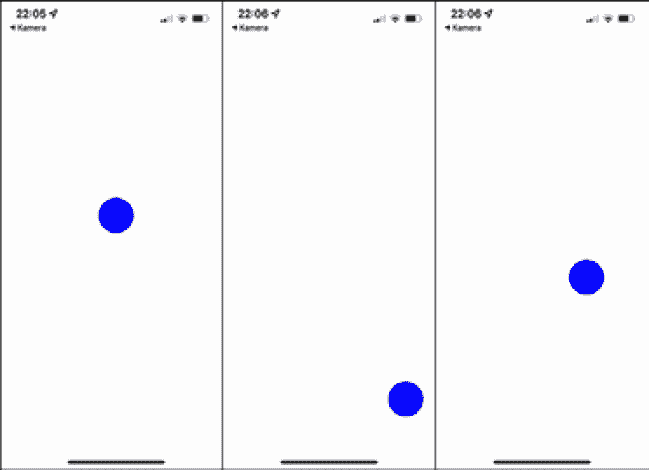

# 第七章：在 React Native 中处理手势

使好的应用在众多不良应用或移动网站中脱颖而出的最重要的事情之一就是良好的手势处理。虽然大多数情况下移动网站只监听简单的点击，但应用可以通过不同的手势来控制，例如短按、长按、滑动、捏合缩放或多指触摸。以非常直观的方式使用这些手势是开发应用时需要考虑的最重要的事情之一。

但不仅仅只是监听这些手势 – 你必须立即对用户做出响应，以便他们可以看到（并且可能取消）他们正在做的事情。一些手势需要触发或控制动画，因此必须与我们在*第六章*中学习到的动画解决方案配合得非常好，即*与动画一起工作*。

在 React Native 中，有多种处理手势的方法。从简单的内置组件到非常复杂的第三方手势处理解决方案，你有很多不同的选项可以选择。

在本章中，你将学习以下内容：

+   使用内置组件来响应用户手势

+   与 React Native 手势响应系统以及 React Native `PanResponder`一起工作

+   理解 React Native 手势处理器

# 技术要求

要运行本章中的代码，你必须设置以下事项：

+   一个可工作的 React Native 环境 ([bit.ly/prn-setup-rn](http://bit.ly/prn-setup-rn) – React Native CLI 快速入门)

+   用于测试手势和多点触控的真实的 iOS 或 Android 设备

要访问本章的代码，请点击以下链接进入本书的 GitHub 仓库：

# 使用内置组件来响应用户手势

React Native 附带多个具有内置手势响应支持的组件。基本上，这些组件是对手势响应系统的抽象使用，你将在下一节中学习。手势响应系统为处理 React Native 中的手势提供了支持，同时也支持协商哪个组件应该处理用户手势。

最简单的用户交互是用一个手指点击。通过不同的`Touchable`组件、一个`Pressable`组件和一个`Button`组件，React Native 提供了不同的选项来识别点击并响应用户交互。

## 使用组件来响应简单的点击

记录用户点击操作最简单的组件是 React Native 的`Touchable`组件。

### 与`Touchable`组件一起工作

React Native 在 iOS 上提供了三个不同的`Touchable`组件，以及一个仅适用于 Android 的额外第四个`Touchable`组件：

+   `TouchableOpacity`：通过减少被点击元素（及其所有子元素）的不透明度来自动提供用户反馈，让底层视图透过来。你可以通过设置`activeOpacity`来配置不透明度的减少。

+   `TouchableHighlight`: 通过减少不透明度和显示底层颜色来自动提供用户反馈，这会使被点击的元素变暗或变亮。你可以通过设置 `underlayColor` 来定义底层颜色，通过设置 `activeOpacity` 来定义不透明度的减少。

+   `TouchableWithoutFeedback`: 不提供用户反馈。只有在你有充分的理由时才应使用此功能，因为每个响应触摸的元素都应该显示视觉反馈。一个可能的原因是你已经在其他地方处理了视觉反馈。

+   `TouchableNativeFeedback`: 仅适用于 Android。通过触发原生 Android 触摸效果来自动提供用户反馈。在大多数设备上，这是众所周知的 Android 波纹效果，其中组件通过从触摸点扩展一个圆圈来改变颜色。你可以通过设置 `background` 属性来定义波纹效果。

所有四个 `Touchable` 组件都提供了四种方法来监听用户交互。这些方法的调用顺序如下图的顺序：

![Figure 7.1 – The onPress call order

![img/B16694_07_01.jpg]

图 7.1 – `onPress` 调用顺序

重要的是始终记住，`onPress` 在 `onPressOut` 之后被调用，而 `onLongPress` 在 `onPressOut` 之前被调用。让我们更详细地看看这些方法：

+   `onPressIn`: 当用户开始点击按钮时，立即调用此方法。

+   `onPressOut`: 当用户释放点击或当用户将手指移出组件外部时调用此方法。

+   `onPress`: 当用户在达到长按延迟（在 `delayLongPress` 中定义）之前完成点击时调用此方法。

+   `onLongPress`: 当达到长按延迟（在 `delayLongPress` 中定义）并且在此期间没有释放点击时调用此方法。

使用这些方法，你已可以处理许多不同的用例，并且——永远不要忘记——对用户的触摸提供即时视觉反馈。

虽然 `Touchable` 组件需要一些自定义样式，但 React Native 还提供了一个 `Button` 组件，它带有预定义的样式。

### 使用 Button 组件

在底层，`Button` 在 iOS 上使用 `TouchableOpacity`，在 Android 上使用 `TouchableNativeFeedback`。`Button` 带有一些预定义的样式，这样你就可以在不自己设置样式的情况下使用它。以下代码示例显示了使用 `Button` 的简单性：

```js
<Button
  onPress={() => Alert.alert("Button pressed!")}
      title="Press me!"
      color="#f7941e"
/>
```

你只需定义一个 `onPress` 方法、一个按钮 `标题` 和按钮的 `颜色`。`Button` 将处理其余部分，例如样式和视觉用户反馈。当然，你也可以使用 `Touchable` 组件的所有其他方法。

`Button` 和 `Touchable` 是 React Native 中相当老旧的组件。由于它们工作良好，你可以在大多数情况下使用它们。但还有一个新的实现来处理用户点击。

### 使用 Pressable 组件

除了`Touchable`和`Button`组件外，React Native 还提供了一个`Pressable`组件。这是最新的组件，由于其针对特定平台视觉反馈的高级支持，建议使用。

看一下以下代码示例，了解`Pressable`的优点：

```js
<Pressable
  onPress={() => Alert.alert("Button pressed!")}
  style={({ pressed }) => [
    {
      backgroundColor: pressed
        ? '#f7941e'
        : '#ffffff'
    },
    styles.button
  }>
>
  {
    ({ pressed }) => (
      <Text style={styles.buttonText}>
        {pressed ? 'Button pressed!' : 'Press  me!'}
      </Text>
    )
  }
</Pressable>
```

它提供了与`Touchable`组件相同的方法，但在 Android 上还有涟漪支持，并在 iOS 上与自定义样式一起工作。你可以提供`style`属性作为一个函数，并监听`pressed`状态。

你还可以将一个功能组件作为子组件传递给`Pressable`组件，并使用那里的`pressed`状态。这意味着你可以根据它是否被按下改变`Pressable`组件的样式和内容。

另一个优点是你可以为`Pressable`组件定义点击和偏移区域：

![图 7.2 – `Pressable`点击和按下区域

![img/B16694_07_02.jpg]

图 7.2 – `Pressable`点击和按下区域

在*图 7.2*中，你可以看到中心可见的`Pressable`组件。如果你想触摸区域大于可见元素，你可以通过设置`hitSlop`来实现。这对于重要的按钮或屏幕上重要的可触摸区域来说是一个非常常见的事情。

虽然`hitSlop`定义了点击开始的位置，但`pressRetentionOffset`定义了在`Pressable`组件外部，点击不会停止的额外距离。这意味着当你开始在点击区域内部开始点击并移动你的手指到点击区域外部时，通常`onPressOut`会被触发，点击手势完成。

但如果你已经定义了一个额外的按下区域，并且你的手势停留在该按下区域内，只要你的手指移动到该按下区域外，则点击手势被视为持续手势。`hitSlop`和`pressRetention`可以设置为`number`值或`Rect`值，这意味着作为一个具有`bottom`、`left`、`right`和`top`属性的`Object`。

点击区域和按下区域都是提高你应用用户体验的绝佳方法，例如，它们可以使用户更容易按下重要的按钮。

在查看简单的点击处理之后，让我们继续看滚动手势。

## 与`ScrollView`一起工作

处理滚动手势最简单的方法是 React Native 的`ScrollView`组件。如果内容比`ScrollView`本身大，这个组件可以使内容可滚动。`ScrollView`会自动检测和处理滚动手势。它有很多可配置的选项，所以让我们看看最重要的几个：

+   `horizontal`: 定义`ScrollView`应该是水平还是垂直。默认是垂直。

+   `decelerationRate`：定义用户在滚动时释放触摸时滚动减速的速度。

+   `snapToInterval`或`snapToOffsets`：使用这两个方法，你可以定义`ScrollView`应该停止的间隔或偏移量。这可以极大地改善用户体验，因为滚动视图可以始终停止，以便用户可以看到一个完整的列表元素。

+   `scrollEventThrottle`仅适用于 iOS：定义在滚动时滚动事件将被触发的频率。这对于性能和用户体验非常重要。对于用户体验来说，最佳值是 16，这意味着滚动事件每 16 毫秒触发一次（直到 RN 支持 120 Hz - 然后，它将变为 8 毫秒）。

根据你对滚动事件的操作，这可能会导致性能问题，因为每次滚动事件都会通过桥接发送（除非你直接通过动画 API 处理，如第六章中所述，*与动画一起工作*）。因此，考虑你需要在这里设置什么值，并可能将其增加以防止性能问题。

小贴士

还有更多配置选项，例如定义过度滚动效果、粘性头部或弹跳。如果你想有一个完整的概述，请查看文档([`bit.ly/prn-scrollview`](https://bit.ly/prn-scrollview))。由于这不是初学者指南，我们专注于优化应用程序的重要部分。

说到这一点，当然，你可以通过使用`ScrollView`组件来自行处理滚动事件。这为你提供了优化 UX 的多种选择。`ScrollView`提供了以下方法：

+   `onScroll`: 在滚动过程中持续触发。这是一个很好的工具，可以通过将自定义动画与滚动事件结合来添加令人惊叹的用户反馈，就像我们在第六章中做的那样，*与动画一起工作*。但是，在这样做的时候，你应该要么使用带有本地驱动程序的 Animated API 来防止滚动事件每 16 毫秒传输一次，要么使用`scrollEventThrottle`来限制事件数量。

+   `onScrollBeginDrag`: 当用户开始滚动手势时触发。

+   `onScrollEndDrag`: 当用户停止滚动手势时触发。

+   `onMomentumScrollBegin`: 当`ScrollView`开始移动时触发。

+   `onMomentumScrollEnd`: 当`ScrollView`停止移动时触发。

使用这五个方法，你可以为用户的滚动手势提供很多不同的反馈。从简单地通知用户他们正在滚动到使用`onScroll`构建高级动画，一切皆有可能。

注意

当`ScrollView`有非常长的子元素列表时，它可能会变得相当慢和占用大量内存。这是由于`ScrollView`一次性渲染所有子元素造成的。如果你需要一个具有元素懒加载的更高效版本，请查看 React Native 的`FlatList`或`SectionList`。

在使用内置的 React Native 组件之后，是时候看看如何完全自己处理触摸了。完成这一点的第一个选项是直接与 React Native 手势响应者系统一起工作。

# 与手势响应者系统和 PanResponder 一起工作

触摸响应者系统是处理 React Native 中手势的基础。所有`Touchable`组件都基于触摸响应者系统。使用此系统，您不仅可以监听手势，还可以指定哪个组件应该是触摸响应者。

这非常重要，因为在您的屏幕上有多个触摸响应者的情况下（例如，`ScrollView`中的`Slider`），存在几种场景。虽然大多数内置组件协商哪个组件应该成为触摸响应者并自行处理用户输入，但在直接与手势响应者系统一起工作时，您必须自己考虑这一点。

触摸响应者系统提供了一个简单的 API，并且可以在任何组件上使用。当与触摸响应者系统一起工作时，您必须做的第一件事是协商哪个组件应该成为处理手势的响应者。

## 成为响应者

要成为响应者，组件必须实现以下协商方法之一：

+   `onStartShouldSetResponder`: 如果此方法返回`true`，组件想要在触摸事件的开始时成为响应者。

+   `onMoveShouldSetResponder`: 如果此方法返回`true`，组件想要成为触摸事件的响应者。只要组件不是响应者，就会为每个触摸移动事件调用此方法。

重要提示

这两种方法首先在最深层的节点上调用。这意味着当多个组件实现这些方法并返回`true`时，最深层的组件将成为触摸事件的响应者。请在手动协商响应者时记住这一点。

您可以通过实现`onStartShouldSetResponderCapture`或`onMoveShouldSetResponderCapture`来防止子组件成为响应者。

对于这些响应者协商，如果另一个组件请求，组件释放控制权是很重要的。触摸响应者系统还为此提供了处理程序：

+   `onResponderTerminationRequest`: 如果此处理程序返回`true`，当另一个组件想要成为响应者时，组件会释放响应者。

+   `onResponseTerminate`: 当响应者被释放时，此处理程序会被调用。这可能是由于`onResponderTerminationRequest`返回`true`，或者由于操作系统行为。

当组件尝试成为响应者时，协商有两种可能的结果，都可以通过处理程序方法来处理：

+   `onResponderGrant`: 当它成功成为响应者并随后监听触摸事件时，此处理程序会被调用。最佳实践是使用此方法来突出显示组件，以便用户可以看到响应他们触摸的元素。

+   `onResponderReject`: 当另一个组件当前是响应者且不会释放控制权时，此处理程序会被调用。

当你的组件成功成为响应者时，你可以使用处理程序来监听触摸事件。

## 处理触摸

成为响应者后，你可以使用两个处理程序来捕获触摸事件：

+   `onResponderMove`: 当用户在屏幕上移动手指时，此处理程序会被调用。

+   `onResponderRelease`: 当用户从设备的屏幕上释放触摸时，此处理程序会被调用。

在处理手势时，你通常使用 `onResponderMove` 并处理它返回的事件的位置值。当连接位置值时，你可以重新创建用户在屏幕上绘制的路径。然后你可以按你想要的方式对此路径做出响应。

实际上是如何工作的，以下示例展示了：

```js
const CIRCLE_SIZE = 50;
export default (props) => {
  const dimensions = useWindowDimensions();
  const touch = useRef(
    new Animated.ValueXY({ 
      x: dimensions.width / 2 - CIRCLE_SIZE / 2, 
      y: dimensions.height / 2 - CIRCLE_SIZE / 2
      })).current;
  return (
    <View style={{ flex: 1 }}
        onStartShouldSetResponder={() => true}
        onResponderMove={(event) => {
          touch.setValue({
            x: event.nativeEvent.pageX, y: event.nativeEvent.pageY
          });
        }}
        onResponderRelease={() => {
          Animated.spring(touch, {
            toValue: {
              x: dimensions.width / 2 - CIRCLE_SIZE / 2,
              y: dimensions.height / 2 - CIRCLE_SIZE / 2
            },
            useNativeDriver: false
          }).start();
        }}
    >
      <Animated.View
        style={{
          position: 'absolute', backgroundColor: 'blue',
              left: touch.x, top: touch.y,
              height: CIRCLE_SIZE, width: CIRCLE_SIZE,
              borderRadius: CIRCLE_SIZE / 2,
        }}
        onStartShouldSetResponder={() => false}
      />
    </View>
  );
};
```

此示例包含两个 `View`。外部的 `View` 作为触摸响应者，而内部的 `View` 是一个小圆圈，其位置根据用户移动手指的位置而改变。外部 `View` 实现了手势响应系统处理程序，而内部 `View` 只是对于 `onStartShouldSetResponder` 返回 `false`，以避免成为响应者。

你还可以看到手势响应系统与 React Native Animated 一起是如何工作的。当 `onResponerMove` 被调用时，我们处理触摸事件并将事件的 `pageX` 和 `pageY` 值设置为 `Animated.ValueXY`。

这是我们用来计算内部 `View` 位置的值。当用户从设备上移除手指时，`onResponderRelease` 会被调用，我们使用 `Animated.spring` 函数将 `Animated.ValueXY` 值恢复到其起始值。这使内部 `View` 回到屏幕中间的位置。

以下图像显示了示例中的代码在屏幕上的样子：



图 7.3 – 在 iPhone 上运行的手势响应系统示例

在这里，你可以看到初始状态（左侧屏幕）。然后，用户触摸屏幕的右下角，蓝色圆圈跟随触摸移动（中间屏幕）。当用户释放触摸后，蓝色圆圈会在给定的时间段内从用户最后触摸屏幕的位置返回到屏幕中心（右侧屏幕显示了返回动画中的圆圈）。

即使在这个简单的例子中，你也可以看到手势响应器系统是一个非常强大的工具。你可以完全控制触摸事件，并且可以非常容易地将它们与动画结合。尽管如此，大多数时候你不会直接使用手势响应器系统。这是因为`PanResponder`，它是在手势响应器系统之上的一层轻量级层。

## 使用 PanResponder

`PanResponder`基本上与手势响应器系统的工作方式完全相同。它提供了一个相似的 API；然而，你只需要将`Responder`替换为`PanResponder`。例如，`onResponderMove`变为`onPanResponderMove`。区别在于你不仅得到原始的触摸事件。`PanResponder`还提供了一个状态对象，它代表了整个手势的状态。这包括以下属性：

+   `stateID`: 手势的唯一标识符

+   `dx`: 自触摸手势开始以来的水平距离

+   `dy`: 自触摸手势开始以来的垂直距离

+   `vx`: 触摸手势的当前水平速度

+   `vy`: 触摸手势的当前垂直速度

当涉及到解释和处理更复杂的手势时，这个状态对象非常有用。因此，大多数库和项目使用`PanResponder`而不是直接与手势响应器系统交互。

虽然手势响应器系统和`PanResponder`是响应用户触摸的非常好的选项，但它们也带来了一些缺点。首先，它们与没有原生驱动程序的 Animated API 具有相同的限制。由于触摸事件必须通过桥接传输到 JavaScript 线程，我们总是落后一帧。

这可能随着 JSI 的改进而变得更好，但这一点目前必须得到证明。另一个限制是没有任何 API 允许我们定义任何原生手势处理器的交互。这意味着总会有一些情况，无法通过手势响应器系统 API 解决。

由于这些限制，Software Mansion 团队在 Shopify 和 Expo 的支持下构建了一个新的解决方案——React Native 手势处理器。

# 理解 React Native 手势处理器

React Native 手势处理器是一个第三方库，它完全取代了内置的手势响应器系统，同时提供了更多的控制和更高的性能。

React Native 手势处理器与 Reanimated 2 结合使用效果最佳，因为它是由同一团队编写的，并依赖于 Reanimated 2 提供的工作 lets。

信息

本书参考的是 React Native 手势处理器 2.0 版本。版本 1 也被许多项目使用。

React Native 手势处理器 2 API 基于`GestureDetectors`和`Gestures`。虽然它也支持版本 1 的 API，但我建议使用新的 API，因为它更容易阅读和理解。

让我们创建上一节中的可拖动圆形示例，但这次我们使用 React Native 手势处理器和 Reanimated 2：

```js
const CIRCLE_SIZE = 50;
export default props => {
  const dimensions = useWindowDimensions();
  const touchX = useSharedValue(dimensions.width/
      2-CIRCLE_SIZE/2);
  const touchY = useSharedValue(dimensions.height/
      2-CIRCLE_SIZE/2);
  const animatedStyles = useAnimatedStyle(() => {
    return {
      left: touchX.value, top: touchY.value,
    };
  });
  const gesture = Gesture.Pan()
   .onUpdate(e => {
    touchX.value = e.translationX+dimensions.width/
        2-CIRCLE_SIZE/2;
    touchY.value = e.translationY+dimensions.height/
        2-CIRCLE_SIZE/2;
   })
   .onEnd(() => {
    touchX.value = withSpring(dimensions.width/
        2-CIRCLE_SIZE/2);
    touchY.value = withSpring(dimensions.height/
        2-CIRCLE_SIZE/2);
   });
  return (
    <GestureDetector gesture={gesture}>
      <Animated.View
        style={[
          { 
            position: 'absolute', backgroundColor: 'blue',
                width: CIRCLE_SIZE, height: CIRCLE_SIZE,
                borderRadius: CIRCLE_SIZE / 2 
          },
          animatedStyles,
        ]}
      />
    </GestureDetector>
  );
};
```

在这个例子中，你可以看到 React Native Gesture Handler 的工作原理。我们创建 `GestureDetector` 并将其包裹在代表触摸手势目标的元素周围。然后，我们创建一个 `Gesture` 并将其分配给 `GestureDetector`。在这个例子中，这是一个 `Pan` 手势，意味着它识别屏幕上的拖动。`Gesture.Pan` 提供了许多不同的处理程序。在这个例子中，我们使用了两个：

+   `onUpdate`：每次任何手势位置更新时，此处理程序都会被调用

+   `onEnd`：当手势释放时，此处理程序被调用

我们使用 `onUpdate` 来改变 Reanimated 的 `sharedValue` 值，并使用 `onEnd` 来将 `sharedValue` 重置到初始状态。

然后，我们使用 `sharedValue` 来创建 `animatedStyle`，并将其分配给我们的 `Animated.View`，即我们的圆形。

屏幕上的结果与上一节相同，但这里有两个重要的优势：

+   **更好的性能**：由于我们使用了 Reanimated 2 worklets，我们的值和计算不需要通过桥接。手势输入和动画完全在 UI 线程上计算。

+   `Race`）或者是否可以在同一时间激活多个手势（`Simultaneous`）。

除了这些，React Native Gesture Handler 包含了许多不同的手势，例如 `Tap`（点击）、`Rotation`（旋转）、`Pinch`（捏合）、`Fling`（抛掷）或 `ForceTouch`（强触），以及内置组件如 `Button`（按钮）、`Swipeable`（可滑动）、`Touchable`（可触摸）或 `DrawerLayout`（抽屉布局），这使得它成为内置手势响应系统的优秀替代品。

如果你想深入了解 React Native Gesture Handler 所提供的所有可能选项，请查看文档：[bit.ly/prn-gesture-handler](http://bit.ly/prn-gesture-handler)。

# 摘要

在本章中，我们学习了 React Native 的内置组件以及处理用户手势的解决方案。从简单的点击手势到更复杂的手势，React Native 提供了稳定的解决方案来处理手势。我们还了解了 React Native Gesture Handler，这是一个针对这些内置解决方案的优秀第三方替代品。

我建议在所有可以坚持使用标准组件的使用场景中，使用 React Native 的内置组件和解决方案。一旦你开始编写自己的手势处理，我建议使用 React Native Gesture Handler。

在动画和手势处理之后，我们将继续探讨另一个在性能方面非常重要的主题。

在下一章中，你将了解不同的 JavaScript 引擎是什么，React Native 中有哪些选项，以及不同的引擎对性能和其他重要关键指标的影响。
