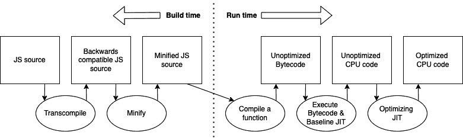
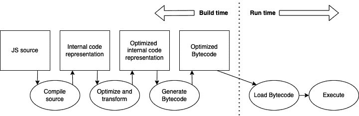

# 第八章：JavaScript 引擎和 Hermes

React Native 运行在 JavaScript 上，如*第二章*中所述，*理解 JavaScript 和 TypeScript 的基本知识*，JavaScript 需要一个 JavaScript 引擎来解释和/或将其转换为可执行的机器代码。对于 React Native 来说，这没有例外。

尽管市面上有相当多的不同 JavaScript 引擎，但在 React Native 项目中只有少数被使用。这是因为改变 JavaScript 引擎的过程相当复杂，以及新的 Hermes 引擎，这是一个为 React Native 开发的引擎，很快将成为默认引擎。尽管如此，了解不同可能的引擎及其优缺点仍然很重要和有帮助。

在本章的理论部分，我们将涵盖以下主题：

+   理解 JavaScript 引擎

+   了解 Hermes 引擎

+   比较关键指标

# 技术要求

由于这是一个理论章节，你不需要设置任何东西。

# 理解 JavaScript 引擎

如本章引言所述，JavaScript 引擎负责解释 JavaScript 并将其/转换为机器代码，以便设备可以执行它。

最初的 JavaScript 引擎是简单的解释器，它们只是处理语句并确保执行。代码就像它被编写的那样执行。这已经发生了很大变化。

现代 JS 引擎提供了许多优化功能。最被讨论的是**即时编译**（**JIT**），这是所有现代 JS 引擎都实现的。

编译型语言，如 C 语言，在代码执行前进行编译。在这个编译步骤中，不仅将代码转换为机器语言，还包括许多优化步骤。这产生了一个性能极优的输出。

*即时编译*意味着代码在运行时进行编译。这意味着即时编译器在编译时并不知道所有代码。这使得代码优化变得更加困难。即时编译器包含两个组件——**分析器**和**编译器**。当 JS 代码由解释器执行时，分析器会关注不同语句执行的频率。

一个语句执行得越频繁，它从分析器那里得到的优先级就越高。当达到某个阈值时，分析器将这些代码语句发送给编译器，编译器然后将这些语句编译为字节码。当该语句下次要执行时，它将通过一个高度优化的字节码解释器执行。这使得这些部分运行得更快。

在编译过程中还可以进行一些优化。这很大程度上取决于实现，每个现代 JS 引擎都有自己的即时编译器实现。

通常，即时编译对运行时间较长的代码效果更好，因为编译器有更多时间来学习如何优化。由于在运行 React Native 应用时执行了大量的 JS 代码，即时编译效果极佳。

目前最知名的 JS 引擎是 JavaScriptCore 和 V8。由于两者都可以用于 React Native，我们将更深入地探讨它们。

## 使用 JavaScriptCore

**JavaScriptCore** 是为 Safari 浏览器提供动力的 JS 引擎。它是随 React Native 一起提供的默认引擎。如果你创建一个新的空白项目，JavaScriptCore 将解释并执行你的 JS 代码。

## 使用 V8

**V8** 是一个开源的 JS 引擎，得到了谷歌的大力支持。当你使用 React Native 的远程调试功能时，默认使用 V8。在这种情况下，你的 JS 代码将在由 V8 驱动的 Chrome 浏览器中执行。

重要提示

请始终记住，当你在远程调试开启/关闭时，你正在使用不同的 JS 引擎。在没有远程调试的情况下，你的 JS 代码在设备或模拟器上运行；当远程调试激活时，你的 JS 代码在计算机上的 Chrome 中运行，并通过 WebSocket 与本地进行通信。即使这两个引擎的行为应该相当相似，也有一些不一致之处。因此，在发布你的应用之前，始终在没有远程调试的情况下进行测试。

还有一个项目为 React Native 提供了将 V8 作为主要 JS 引擎的支持。对于 Android 来说这并不是什么大问题，因为它只是用 V8 引擎替换了 Android JS 引擎的 JavaScriptCore。在 iOS 上则更为复杂，因为 JavaScriptCore 在 iOS 上可用，无需将其包含在应用包中。因此，你不仅需要使用可用的 JS 引擎，还必须在你的应用中捆绑 V8 引擎。这会使你的应用包大小增加高达 7 MB，具体取决于你使用的版本。你可以在 `react-native-v8` 项目中找到更多关于此的信息：[`bit.ly/prn-rn-v8`](https://bit.ly/prn-rn-v8)。

虽然这两个引擎都能正常工作，但 Facebook 开始了一个名为 **Hermes** 的项目，以开发他们自己的 React Native JS 引擎。由于 React Native 的用例与浏览器引擎有很大不同，因为代码在构建时是可用的，并且在发布后无法更改；因此，有更多的优化空间。

# 了解 Hermes 引擎

Hermes 是在 2019 年的 React Native EU 大会上引入 React Native 社区的。当时，它已经在 Facebook 的应用中投入生产超过一年。它是完全以移动为中心构建的，这完全改变了架构方法。以下图显示了现代 JS 引擎的工作方式。

在创建和构建 JavaScript 代码时，通常会有一些向后兼容的 JS 代码的转换编译和一些 JS 代码的压缩。然后，这个压缩后的 JS 包被发送到设备并执行。JavaScript 引擎如 JavaScriptCore 或 V8 会尝试使用即时编译来优化执行，正如之前所描述的，这是一个相当复杂的过程，可能会存储和优化错误的代码语句。Hermes 完全改变了这种方式。

以下图显示了 Hermes 中优化和编译的执行方式：

]

图 8.2 – Hermes 管道（灵感来源于 Tzvetan Mikov）

因为我们知道所有代码，我们希望在 React Native 应用中打包，所以可以在构建过程中进行编译和优化。这意味着所有优化都是在您的计算机（或您的 CI 环境中）进行的，而不是在用户的设备上。Hermes 使用一种所谓的内部代码表示，这种表示对代码优化进行了高度优化。

优化代码后，它被编译成优化的字节码。因此，当使用 Hermes 时，您不再发送 JavaScript，而是发送优化的字节码。这种字节码只需要在用户的设备上由 Hermes 引擎加载和执行。

这种方法带来了许多好处。其中最重要的如下：

+   **无需预热**：我们不需要花费时间在即时编译器预热上。

+   **即时编译器输出的内存使用量为零**：我们不需要为即时编译器的输出占用任何内存。这大大减少了内存占用。

+   **启动优化**：一些在启动时由 JS 引擎执行的运算可以预先计算。这使得应用程序的启动速度大大提高。

+   **更小的包大小**：优化后的包比压缩后的 JavaScript 代码更小。

由于这种方法的好处，Hermes 被推动尽快成为 React Native 的默认 JS 引擎。在撰写本文时，您仍然需要激活它，但操作非常简单：

+   在 `android/app/build.gradle` 文件中将 `enableHermes` 从 `false` 改为 `true`。之后，您必须清理并重新构建您的应用程序。

+   在 `ios/Podfile` 文件中将 `:hermes_enabled => false` 改为 `:hermes_enabled => true`。使用 `cd ios && pod install` 重新安装您的 pods。

请注意，当使用 Hermes 时，远程调试功能的工作方式与之前不同。由于方法完全不同，没有可以直接在您的 Chrome 浏览器中运行的包。尽管如此，Hermes 支持使用 Chrome 检查器协议和 Chrome 开发者工具进行调试。

要使用远程调试，您必须通过 Metro 将您的 Chrome 浏览器连接到正在运行的设备。这可以通过以下方式完成：

1.  在您的 Chrome 浏览器中转到 `chrome://inspect/#devices`。

1.  点击 `配置…` 按钮，并添加 Metro 服务器地址（通常是 `localhost:8081`）。

1.  现在，有一个 `Hermes React Native` 目标，您可以进行检查。

更多信息，请访问 React Native 的 Hermes 文档（[`bit.ly/prn-hermes`](https://bit.ly/prn-hermes)）或 Hermes 引擎本身的文档（[`bit.ly/prn-hermes-engine`](https://bit.ly/prn-hermes-engine)）。

如前所述，Hermes 方法给 React Native 带来了很多好处。这也在关键指标中得到了反映，我们将在下一节中查看这些指标。

# 比较关键指标

当涉及到移动应用时，在优化您的应用时，您应该查看以下几个指标。

## 理解重要指标

移动设备上最重要的关键指标如下：

+   **交互时间**（**TTI**）：这是用户点击您的应用图标到用户可以使用您的应用之间的时间。尽可能减少 TTI 非常重要，因为移动应用用户非常没有耐心。交互时间越长，用户就越有可能在不使用您应用的情况下离开。

+   **应用大小**：这是用户必须从商店下载以安装您的应用的大小。应用大小越大，用户就越不愿意下载您的应用。这可能有多种原因，例如某些国家的高传输成本或用户设备上剩余的磁盘空间。事实是，您的应用越小，用户就越有可能下载它。

+   **内存利用率**：这个指标描述了您的应用在执行过程中消耗了多少内存。如果您的应用非常耗内存，可能会导致问题，尤其是在旧设备或多任务处理期间。此外，它可能导致操作系统关闭您的应用。您的应用消耗的内存越少，越好。

在查看这些指标时，有一些基准结果公开可用。由于 JavaScriptCore 和 V8 提供的结果大多相似（V8 在大多数测试中略好），我们将重点关注 React Native 应用中使用的 JavaScriptCore 和 Hermes 的比较。

## 在 Android 上比较 JavaScriptCore 和 Hermes

以下测试比较了 Android 上 JSC 和 Hermes 的关键指标。这次测试是由 Facebook 的 Hermes 团队使用 Hermes 的一个非常早期版本进行的：

|  | JSC | Hermes |  |  |
| --- | --- | --- | --- | --- |
| 交互时间 | 4.30s | 2.01s | -2.29s | -53% |
| 应用大小 | 41MB | 22MB | -19MB | -46% |
| 内存利用率 | 185MB | 136MB | -49MB | -26% |

图 8.3 – Facebook JSC/Hermes 在 Android 上的测试（https://bit.ly/prn-hermes-test-fb）

另一次由备受尊敬的 React Native 社区成员 Kudo Chien 进行的测试运行也包含了 TTI。这次测试使用了不同的套件大小：

|  | JSC | Hermes | *毫秒 |  |
| --- | --- | --- | --- | --- |
| TTI 3MB 套件 | 400 | 240 | 160 | -40% |
| TTI 10MB 套件 | 584 | 305 | 279 | -48% |
| TTI 15MB 套件 | 694 | 342 | 352 | -51% |

图 8.4 – Kudo Chien 在 Android 上的 TTI 测试（https://bit.ly/prn-hermes-test-kudo）

如果你查看测试结果，它们在 Android 上非常显著。所有测试中的交互时间都减少了大约 50%。这是一个真正的变革。与真正的原生或 Flutter 应用程序相比，React Native 应用程序过去打开速度较慢。这是由于在渲染第一个屏幕之前需要初始化 JS 引擎。Hermes 在 React Native 这个领域是一个巨大的进步。

当查看 Facebook 的测试时，应用程序大小也减少了近 50%。这部分原因是因为我们不再需要将 JavaScriptCore 引擎打包到我们的应用程序中，因此这种效果将在大型应用程序中减少。但即使在大型应用程序中，你也可以期待大约 30%的包大小节省。

现在让我们看看内存使用情况。在 Facebook 的测试中，Hermes 实现了大约 25%的内存节省。这主要是因为不需要即时编译，这也是一个巨大的成就。

再次强调，这些测试是在 Hermes 的非常早期版本上运行的，因此你可以期待未来有更大的提升。

虽然在 Android 上的结果非常清晰，但让我们继续在 iOS 上进行测试。

## 在 iOS 上比较 JSC 和 Hermes

在 iOS 上，我们必须记住 JavaScriptCore 是由操作系统提供的。这意味着当我们使用 JSC 时，我们不需要将任何 JavaScript 引擎打包到我们的应用程序中。此外，JavaScriptCore 针对 iOS 和苹果产品进行了优化。iOS 上 Hermes 的实现是由**Callstack**公司完成的，这是一家为 React Native 做出了大量贡献的公司。完成实现后，Callstack 团队还进行了一些测试，以比较 JSC 和 Hermes。以下是结果：

|  | JSC | Hermes | *以毫秒为单位 |  |
| --- | --- | --- | --- | --- |
| 交互时间 | 920ms | 570ms | -350ms | -38% |
| 应用程序大小 | 10.6MB | 13MB | 2.4MB | 18% |
| 内存使用量 | 216MB | 178MB | -38MB | -18% |

图 8.5 – iOS 上 JSC/Hermes 调用栈测试（https://bit.ly/prn-hermes-test-ios）

与 Android 一样，交互时间和内存使用量都有很大提升。这些值略低于 Android，但这可以归因于 iOS 上 JSC 的更好优化。iOS 上的应用程序大小增加了，这似乎是合乎逻辑的，因此我们现在必须将 Hermes 添加到我们的包中，而 JSC 则由操作系统提供。

但是，当你的应用程序的 JavaScript 包增长时，由于 Hermes 的字节码比基于 JSC 的包中分发的压缩 JS 代码更小，这种效果将会减少。

# 摘要

在本章中，我们了解了 JavaScript 引擎的一般情况，学习了 React Native 对 JavaScript 引擎的特殊要求，我们可以在 React Native 中使用的不同引擎，以及如何更改我们的 React Native 项目的 JS 引擎。然后我们了解了 Hermes，这是一个考虑到移动设备和 React Native（尤其是 React Native）而开发的 JavaScript 引擎。

在理解了 Hermes 的方法和其优势之后，我们比较了在 JavaScriptCore、V8 和 Hermes 上运行的应用程序的关键指标。虽然使用 JSC 或 V8 没有太大差异，但 Hermes 在 TTI（触摸到文本显示时间）和内存利用率方面给 React Native 带来了巨大的提升。

在掌握 JavaScript 引擎之后，我们将在下一章中查看在处理 React Native 时有用的工具。
