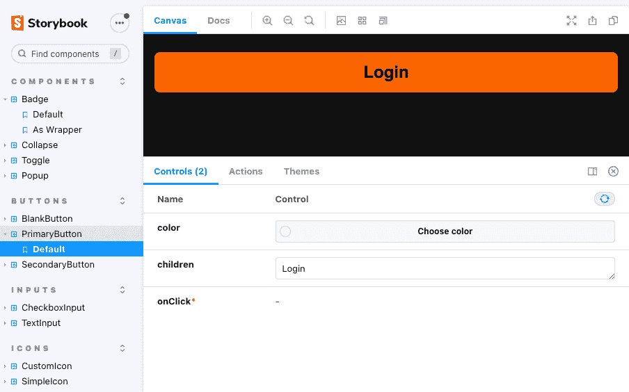

# 第九章：提高 React Native 开发的基本工具

**React Native**是一个拥有非常强大的开发者社区的框架。在过去的一年里，大量工具和库经历了进化式增长，使得 React Native 应用的开发变得更加容易和舒适。

除了专门为 React Native 开发的工具和库之外，你还可以在纯 React 生态系统中使用很多东西。这是因为这些大多数东西都与任何 React Native 应用的 JavaScript/React 部分兼容。

了解最佳工具和库以及如何使用它们非常有用，因为它可以节省你大量时间，并大大提高你的代码和产品的质量。

尤其是在你从事更大项目时，一些工具是绝对必需的，以确保在大团队中的良好协作。

在本章中，你将了解以下主题：

+   如何使用类型安全、代码检查器和代码格式化工具提高代码质量

+   为什么以及何时应该使用样板解决方案，以及如何利用它们

+   如何寻找和使用高质量的 UI 库

+   为什么以及何时应该使用 Storybook，以及如何使用它

# 技术要求

要运行本章中的代码，你必须设置以下内容：

+   一个有效的 React Native 环境（[`reactnative.dev/docs/environment-setup`](https://reactnative.dev/docs/environment-setup)） – React Native CLI 快速入门

# 使用类型安全、代码检查器和代码格式化工具提高代码质量

如同在*第二章*，*理解 JavaScript 和 TypeScript 的基本知识*中已提到的，在大项目中使用类型化的 JavaScript 并配合一些工具确保一定程度的代码质量是必要的。

在下一节中，你将学习如何做到这一点。让我们从使用 TypeScript 或 Flow 进行类型安全开始。

## 使用 TypeScript 或 Flow 确保类型安全

**类型安全**在大多数编程语言中是标准，例如 Java 或 C#，这有很好的理由。相比之下，JavaScript 是动态类型的。这是因为 JavaScript 的历史。记住，JavaScript 最初被创建为一种脚本语言，用于快速编写小块代码。在这种情况下，动态类型是可行的，但当项目增长时，具有所有优点的静态类型是必不可少的。

使用类型化的 JavaScript 在开始创建类型时会产生一些开销，但它最终会给你带来很多优势。此外，如今，大多数库都附带定义好的类型，你可以直接使用。

在*第二章*，*理解 JavaScript 和 TypeScript 的基本知识*，你已经学习了如何使用和编写 TypeScript。本小节重点介绍 TypeScript 的优势以及在使用它时可以预防的错误。

### 动态类型可能导致严重且难以发现的错误

让我们从现实世界的一个例子开始这个部分，这是我在一个项目中的经历。在处理一个 React Native 项目时，我们没有使用静态类型化的 JavaScript。我们从远程数据库（Google Firebase）中通过唯一 ID 获取问题，并将它们本地存储在设备上（`AsyncStorage`）。

根据问题的 ID，我们还存储了用户答案，并在应用中将问题标记为已回答。更新后，所有答案似乎都从用户的设备上消失了，没有人知道为什么。结果是更新将唯一的 ID 从`number`改为`string`，这使得存储的用户答案与问题之间的比较失败。

调试这个错误非常困难，因为它在用应用更新的版本创建答案时不会发生。只有在用应用的老版本回答问题时才会发生；随后，应用被更新，问题被同步。

此外，错误从未抛出错误消息。它只是默默地发生了。因此，找到并修复这个错误花了一些时间。这只是一个例子，说明了由于动态类型而发生的错误，以及为什么处理这些错误很困难。它们可能导致直接注意到的严重错误，但在很多情况下，它们不会。 

这在应用开发中尤其严重，因为你需要在用户的设备上存储大量数据。当你没有意识到你的数据类型有问题时，这可能导致数百万个不同设备上的数据损坏，这很难识别、调试和修复。

大多数这些错误可以通过使用 TypeScript 或 Flow 进行静态类型检查来预防。

重要提示

当使用 TypeScript 或 Flow 时，不要使用`any`或`Object`来使你的类型编写更容易。类型检查及其所有优势只有在整个项目中使用时才能真正发挥作用。因此，你应该明确地为所有属性添加类型。

带有类型检查的 JavaScript 不仅可以防止错误，还可以提高你的生产力。

### 通过代码补全增强你的 IDE

当你有静态定义的类型时，你的 IDE 很容易帮助你进行代码补全。大多数现代 IDE，如 Visual Studio Code 或 JetBrains WebStorm，对 TypeScript 和 Flow 都有出色的支持。

虽然 WebStorm 为 TypeScript 和 Flow 提供了大部分内置支持，但 VS Code 有很多有用的插件。特别是当使用 Flow 时，你必须安装一个扩展来确保代码补全和代码导航能正确工作。为此，请转到`Flow Language Support`。

此外，我建议在每次提交时通过你的 CI 管道运行类型检查。你可以在*第十一章* *创建和自动化工作流程* 中了解更多关于这个内容。

虽然类型化 JavaScript 阻止了许多错误并提高了生产力，但还有许多其他领域可以防止错误发生。其中大部分都由代码检查工具覆盖。在下一节中，你将了解它们是什么以及它们是如何工作的。

## 使用代码检查工具消除最常见的错误

Linters 是一种监控你的代码并强制执行某些规则的工具。当涉及到 JavaScript/TypeScript 时，ESLint 无疑是市场上最流行和最成熟的代码检查工具，因此本小节将重点关注 ESLint。它通过将你的代码与预定义的规则集进行对比来分析你的代码并找出问题。

这些问题可能是错误、非高效代码，甚至是代码风格错误。我建议使用 ESLint，因为它免费且可以确保一定程度的代码质量。

如果你使用 React Native CLI 来设置你的项目，你会发现 ESLint 已经预安装并带有工作规则集。如果你想将其添加到现有项目中，你可以使用以下命令进行安装：要么使用 `npm install --save-dev eslint`，要么使用 `yarn add --dev eslint`。在下一步中，你必须设置一个配置。这可以通过 `npm init @eslint/config` 或 `yarn create @eslint/config` 命令自动完成。

现在，你可以使用 `npx eslint file.js` 或 `yarn run eslint file.js` 来使用 ESLint 检查你的代码与你的规则集。ESLint 还提供了一个 `--fix` 选项，它自动尝试修复尽可能多的错误。

你还可以将 ESLint 集成到大多数现代 IDE 中，以突出显示并自动修复 ESLint 发现的问题。我建议这样做。

此外，我建议在 CI 流程中每次提交时都运行 ESLint 检查。你可以在*第十一章* *创建和自动化工作流程*中了解更多相关信息。

ESLint 是一个寻找常见错误的优秀工具，尽管它也支持代码风格规则，但在这个领域还有另一个工具做得更好。

## 使用 prettier 强制执行常见的代码风格

**Prettier** 是一个在 2016 年创建的代码格式化工具。本质上，它根据一组规则自动重写你的代码。这确保了它遵循标准，并为整个项目开发团队强制执行统一的代码风格。

要使用 prettier，你可以简单地使用以下命令将其作为开发依赖项安装。要么使用 `npm install --save-dev prettier`，要么使用 `yarn add --dev prettier`。

将 prettier 与 ESLint 等代码检查工具集成可能会有些挑战。这是因为——正如你在上一个子节中学到的——这些代码检查工具也有格式化代码的规则。当你同时使用它们并指定了冲突的规则时，这不会起作用。幸运的是，prettier 随附有 ESLint 的预配置，可以防止这种情况发生。你可以从 prettier 主页下载它们。

安装完成后，您可以从命令行运行 prettier。要检查您的代码格式是否符合 prettier 规则，您可以使用 `prettier` 命令，后跟您想要检查的文件或文件夹的路径。在实践中，您通常希望 prettier 自动格式化您的文件。这可以通过 `prettier --write` 后跟文件或文件夹的路径来实现。

重要提示

您可以使用 `.prettierignore` 文件来排除文件不被 prettier 重新编写。您应该使用此文件来防止非您编写的文件、配置文件或其他文件的重新编写。

Prettier 为您的项目带来了很多价值，您不会希望在没有它的前提下进行开发，尤其是在您不是单独工作的时侯。使用 prettier 的最重要的优势如下列所示：

+   **更易于代码审查**：在进行代码审查时，大多数编辑器会突出显示已做的更改。到目前为止，代码审查中最令人烦恼的事情是当开发者有另一个自动格式化设置时，导致所有代码都被标记为已更改以供审查。虽然这完全合理，因为所有代码都因自动格式化而更改，但它使得审查过程变得更加困难。这需要更多时间，并使审查更容易出错。Prettier 通过强制执行统一的代码风格来防止这种情况。

+   **更易于代码可读性**：当您向团队添加开发者时，代码可读性是一个重要因素。代码的可读性越容易，新开发者成为您团队的有生产力成员所需的时间就越少。Prettier 保证统一的代码风格，这使得代码更容易阅读和理解。

Prettier 作为命令行工具和所有常见 IDE 的 IDE 扩展/插件提供。为了确保它被使用，您应该在项目的以下部分包含它：

+   **IDE**：所有开发者都应该将 prettier 添加到他们的 IDE 中，并配置他们的自动格式化快捷键以使用 prettier。

+   **提交前**：提交前钩子应确保 prettier 不会抛出任何错误。

+   **CI/CD**：在创建拉取请求/合并请求时，应该运行 prettier 以确保手动审查可以高效进行。您可以在*第十一章*中了解更多信息，*创建和自动化工作流程*。

如果您使用 prettier 实施此过程，从长远来看，您将节省大量时间。

因此，您在处理 React Native 项目时了解了最重要的工具。现在您将了解一些工具来成功启动新的 React Native 项目。市场上有不同的开源 **样板解决方案**，它们都有各自的优势。样板解决方案意味着您可以使用它作为模板开始，或者是一个 CLI 工具来生成您的起始项目。

# 使用样板解决方案

模板化解决方案使得设置具有稳固架构的项目变得容易。这非常有帮助，但你应该意识到这些模板化解决方案带来的权衡。此外，你应该确切地知道你想要什么，因为外面有完全不同的解决方案。

首先，在这个上下文中，模板化解决方案是指所有为你生成代码以开始项目而无需自己配置一切的东西。这可以是任何东西，从具有内置 TypeScript 支持但无其他功能的简单模板到提供导航、状态管理、字体、动画、连接等解决方案的完整 CLI 解决方案，例如 Infinite Red 的 Ignite CLI。

因为模板化解决方案包含的内容范围很广，很难对它们做出一般性的假设。尽管如此，可以说的是，模板化解决方案包含的内容越多，其中任何东西出现问题的风险就越大。因此，在本节中，你将了解最常见的模板，每个解决方案的优点、权衡以及如何使用它们。

## 使用 React Native TypeScript 模板

React Native 集成了模板引擎。当你使用 React Native CLI 来设置你的项目时，你可以使用一个 `template` 标志。这就是你可以使用 React Native TypeScript 模板的方式：

```js
npx react-native init App 
    --template react-native-template-typescript
```

这个模板没有提供导航、状态管理或其他任何解决方案。它是普通的 React Native Starter 模板，但支持 TypeScript。我非常喜欢它，因为它非常简单，几乎没有依赖，并允许你决定你需要什么，同时为你完成所有 TypeScript 编译器配置。

**优点**包括以下内容：

+   TypeScript 支持

+   无不必要的依赖

+   易于维护

**权衡**包括以下内容：

+   无

虽然 React Native TypeScript 模板在开始新项目时使用起来不费吹灰之力，但以下模板化解决方案并不容易决定。这是因为它们附带更多的库。

## 使用 by thecodingmachine 的 React Native 模板

这个模板也使用了内置的 React Native 模板引擎来工作。但与 React Native TypeScript 模板相比，它已经为你做了很多决定。它包含了 Redux、Redux Persist 和用于状态管理的 redux toolkit、用于 API 调用的 Axios、React Navigation 和 Flipper 集成。此外，它为你的项目创建了一个良好的目录结构。你可以使用以下调用创建基于此模板的项目：

```js
npx react-native init MyApp 
    --template @thecodingmachine/react-native-boilerplate
```

因为这个模板包含了很多预定义的库，你应该查看它是否是积极维护的并且最近有更新。否则，你可能会开始使用所有库的非常旧版本，这可能会很快需要耗时的更新。

**优点**包括以下内容：

+   TypeScript 支持

+   良好的库

+   良好的项目结构

**权衡**包括以下内容：

+   它使用 Redux 进行状态管理，因此你可能不得不坚持使用它

+   在撰写本文时，它已经落后于最新的 React Native 发布版三个版本，因此你将错过最新的功能和错误修复。

关于此样板更详细的信息，请访问官方文档 [`thecodingmachine.github.io/react-native-boilerplate/`](https://thecodingmachine.github.io/react-native-boilerplate/)。

虽然这些都是好的解决方案，但你应该查看它们是否真的适合你的项目。下一个模板带有略微不同的配置。

## 使用 mcnamee 的 React Native Starter Kit

这个样板不使用任何模板引擎或 CLI。它只是一个你可以下载或克隆并开始的 GitHub 仓库。此外，它还附带了一个有用的结构，并引入了许多库。

它使用 Redux 和 Rematch 进行状态管理，React Native Router Flux 进行导航，并且还附带 Native Base 作为 UI 库和 Fastlane 进行部署。基本上，它为你提供了在数小时内将第一个结果交付所需的一切。

但再次提醒，请查看模板的维护情况。在撰写本文时，React Native Router Flux 的最后一个发布版本已经超过一年，这意味着模板的一个核心库基本上是不可用的。

**优点**包括以下内容：

+   良好的项目结构

+   添加了所有启动所需的内容

**权衡**包括以下内容：

+   它使用 Redux 进行状态管理，因此你可能不得不坚持使用它

+   它使用 Native Base 作为 UI 工具包，因此你可能不得不坚持使用它

+   它有一个过时的导航库，因此你将遇到与 React Native 最新版本的问题

你可以从官方 GitHub 页面 [`github.com/mcnamee/react-native-starter-kit`](https://github.com/mcnamee/react-native-starter-kit) 获取更多关于此模板的信息。

在查看两个样板模板后，我们将探讨两个真正广泛的 CLI 工具来设置你的项目。

## 使用 Ignite CLI 进行工作

Ignite 是由 Infinite Red 开发和维护的一个样板解决方案，Infinite Red 是一家出色的 React Native 公司，致力于出色的开源工作。它远不止是一个简单的模板。它是一个完整的 CLI，可以替换内置的 React Native `init` 命令。

使用以下命令，你可以创建一个新的应用程序：

```js
npx ignite-cli new YourAppName
```

这创建了一个具有良好文件夹结构的应用程序，使用 React Navigation 进行导航，使用 MobX-State-Tree 进行状态管理，使用 apisauce 进行 API 调用，当然，还有 TypeScript 支持。除此之外，你的项目还自动支持 Flipper 和 Reactotron 进行调试，Detox 进行端到端测试，以及 Expo，包括 Expo web。

在所有这些之上，Ignite CLI 还带有一个名为**生成器**的功能。使用这些生成器，你可以通过 Ignite CLI 生成你的模型、组件、屏幕和导航器。这意味着你可以根据需要自定义项目，而无需从头开始编写这些文件。如果你想创建一个新的组件，可以使用以下命令：

```js
npx ignite-cli generate component MyNewComponent
```

此命令基于存储在`ignite/templates`文件夹中的模板创建组件，该模板是用你的项目创建的。

小贴士

当使用 Ignite 生成器工作时，你可以编辑用于生成文件的模板。只需编辑`ignite/templates`中的模板，生成的文件将包含你的更改。这意味着你可以根据需要和标准调整模板，然后使用生成器确保每个人都遵守这些标准。

虽然这种设置非常适合专业项目，但它内置了许多库决策。特别是，对于状态管理，你可能想看看 MobX-State-Tree。这是一个很好的状态管理解决方案，但不像 Redux 或 React Context 那样受欢迎，这意味着社区支持相当有限。

**优点**包括以下内容：

+   良好的项目结构

+   良好的调试集成

+   Detox 端到端测试集成

+   本地化集成

+   生成器

**权衡**包括以下内容：

+   它使用 MobX-State-Tree 进行状态管理，这不像 Redux 或 React Context 那样受欢迎。

+   它自带 Expo 集成。这将增加你的应用包大小，并添加另一个依赖项。

+   它为小型项目增加了很多开销

想要了解更多关于 Ignite 的信息，请访问 GitHub 页面[`github.com/infinitered/ignite`](https://github.com/infinitered/ignite)。

现在，你了解了不同的样板解决方案及其优缺点。即使你不使用样板解决方案来创建你的项目，我也建议你看看它们创建的结构。这种结构是你可以在此基础上构建的。

在查看这些样板解决方案之后，接下来我们将关注 UI 部分。同时，也有很多有用的开源解决方案，这将使你的生活变得更加轻松。

# 寻找和使用高质量的 UI 库

**UI 库**为最常见的用例提供预定义的 UI。你可以为你的项目使用很多不同的 UI 库。但有些比其他的好。本节不仅列出了最受欢迎的库，还为你提供了在进行自己的研究时必须考虑的一些想法。

一个好的 UI 库应该满足以下标准：

+   **维护良好**：与所有库一样，它必须得到良好的维护。这意味着有多个贡献者，代码质量良好，并且有定期的发布。这对于确保 React Native 的未来版本升级得到支持非常重要。

+   **基于组件**：一个 React Native UI 库应该提供一组组件，你可以直接使用。

+   **主题**：库应该包含主题选项，并且易于适应你的颜色、字体、填充和边距。

+   **类型声明**：一个好的 UI 库应该为组件和主题提供类型声明。

市面上有很多不同的 UI 库。在接下来的子节中，我将向你介绍其中两个，但鉴于它们可能并不完全适合你的项目，请在使用它们之前，根据这里提到的标准进行自己的研究。

## 使用 React Native Paper

**React Native Paper** 是一个基于 **Material Design** 的 UI 库。它由 Callstack 创建和维护，Callstack 是一家专注于 React Native 核心的公司，因此这些人员非常了解他们的工作。这意味着该库在代码质量方面设定了非常高的标准。

React Native Paper 符合之前子节中定义的所有标准。以下是在 React Native Paper 中包含的功能：

+   **出色的主题支持**：Paper 内置了主题支持。你可以轻松地更改和扩展默认主题，并在你的应用中到处使用它们。

+   **类型声明**：所有组件和主题都附带类型声明。

+   `react-native-vector-icons` 和 `MaterialCommunityIcons` 为你提供图标。

+   **超过 30 个预构建组件**：所有组件都高度可定制且易于使用。

+   `Appbar` 作为 React Navigation 中的自定义导航栏。

虽然从技术角度来看，React Native Paper 可能是市面上最好的 UI 库，但你必须记住，它完全基于 Google 的 Material Design。这意味着你可能不希望在 iOS 上使用它，因为它会使你的应用看起来与 iOS 标准不同。

如需了解更多关于 React Native Paper、其安装和使用的详细信息，请访问官方文档：[`callstack.github.io/react-native-paper/`](https://callstack.github.io/react-native-paper/)。

另一个高质量的 UI 库是 NativeBase。在下一个子节中，你将了解这个库。

## 使用 NativeBase

**NativeBase** 是一个适用于 React Native 以及纯 React 的 UI 库。这意味着它不仅适用于你的 iOS 和 Android 应用，如果你有，它也适用于你的 Web 应用。对于需要 Android、iOS 和 Web 支持的产品，这非常有用，因为你可以主要使用相同的代码库为所有平台编写代码。

此外，NativeBase 符合本节第一子节中定义的所有标准。以下是在 NativeBase 中包含的功能：

+   **出色的主题支持**：NativeBase 也提供了非常好的主题支持。本质上，它的工作方式与 React Native Paper 非常相似。你可以轻松地更改和扩展默认主题，并在你的应用中到处使用它们。它还支持开箱即用的亮色和暗色模式。

+   **类型声明**：所有组件和主题都带有类型声明。你还有关于如何扩展这些类型以自定义主题或组件的优秀文档。

+   `react-native-vector-icons` 用于纯 React Native 项目或 `@expo/vector-icon` 用于 Expo 项目。

+   **超过 30 个预构建组件**：所有组件都高度可定制且易于使用。

+   **响应式支持**：NativeBase 具有出色的响应式设计支持。这意味着你只需在组件上添加几个额外的属性，就可以适应不同的屏幕尺寸。

+   **无障碍性**：基于 React Native ARIA，NativeBase 为所有组件提供了无障碍支持。这意味着你可以轻松地为屏幕阅读器提供支持，确保良好的对比度，并启用应用程序的键盘交互。

此外，NativeBase 还附带一个 Figma 文件，这使得它成为与设计专家一起创建自己的设计系统的理想起点。总的来说，它是一个在创纪录的时间内创建美观界面的非常好的解决方案。

如需了解更多关于 NativeBase 的信息，请访问官方文档[`docs.nativebase.io/`](https://docs.nativebase.io/)。

如前所述，还有许多开源 UI 库。请查看此列表以获取最受欢迎的库：

+   React Native UI Kitten

+   React Native Elements

+   Material Kit Pro React Native by creative-tim

+   Nachos UI Kit for React Native

这些 UI 库可以为你节省大量时间。但因为你希望为你的用户提供独特的应用程序体验，所以你应该只将它们作为起点。幸运的是，大多数库都足够灵活，你可以使用它们来创建自己的设计，同时使用经过实战考验的库结构。

随着你的项目增长，我建议扩展你选择的库，添加你自己的组件。如果你喜欢，并认为你有其他人对之感兴趣的东西，你甚至可以通过创建拉取请求和扩展官方库来为社区做出贡献。

在查看 UI 库之后，在下一个子节中，你将了解另一个有用的工具。这对于开发大型应用程序特别有用，在这些应用程序中，UI 组件在不同的存储库之间共享，并且一些开发者只负责 UI 组件。它被称为 **Storybook**。

# 使用 Storybook 进行 React Native 开发

Storybook 在纯 React 世界中非常受欢迎。这是一个渲染你所有组件在预定义状态下的工具，这样你就可以查看它们，而无需启动你的真实应用程序并导航到它们被使用的位置。

使用 Storybook，你可以编写故事，这些故事随后会被打包成故事书。每个故事都包含一个组件。它还定义了故事书中的位置。以下代码示例展示了故事可能的样子：

```js
import {PrimaryButton} from '@components/PrimaryButton;
export default {
  title: 'components/PrimaryButton,
      component: PrimaryButton,
};
export const Standard = args => (
  <PrimaryButton {...args} />
);
Standard.args = {
  text: 'Primary Button',
      size: 'large',
          color: 'orange',
};
export const Alert = args => (
  <PrimaryButton {...args} />
);
Alert.args = {
  text: 'Alert Button',
      size: 'large',
          color: 'red',
};
```

在第一行中，导入了 `PrimaryButton` 组件。接下来的默认导出定义了在 Storybook 中的位置以及与哪个组件相关联。`Standard` 常量和 `Alert` 常量是不同的状态，`PrimaryButton` 组件将在 Storybook 中渲染并显示。相应的 `args` 定义了这个状态：



图 9.1 – Storybook 在浏览器中运行

在 React Native 上的 Storybook 既可以运行在 iOS 或 Android 模拟器上，也可以在真实设备上运行，或者您可以使用 React Native Web 创建组件的网页版本并将它们渲染到任何浏览器中。这如图*图 9.1*所示，当与设计师合作时特别有用。

Storybook 使得您可以在与应用程序的其他部分隔离的情况下开发组件。它不仅展示了组件，还允许您在 Storybook 中更改属性。因此，您可以看到组件在不同情况下在您的实际应用程序中的表现。

我不会在小型项目中使用 Storybook，但当您的项目和团队成长时，Storybook 可以成为提高您 UI 开发速度的有用工具。这尤其适用于您在不同存储库之间共享 UI 组件的情况。如果您公司有多个应用程序，都应该具有相同的视觉和感觉，我建议您使用它。

在这种情况下，为您的组件创建一个中心存储库可能是一个不错的解决方案。使用 Storybook，这个存储库可以由开发者和设计师维护，而无需访问所有应用程序。您可以在*第十章*，“结构化大规模、多平台项目”部分的*编写自己的库*中了解更多信息。

有关 Storybook 的更多信息，请访问官方文档[`storybook.js.org/`](https://storybook.js.org/)。

# 摘要

在本章中，您学习了用于提高代码质量、自动捕获最常见错误以及加快项目设置和开发过程的有用工具。您了解了类型定义的重要性以及如何使用 ESLint 和 prettier 确保您的代码符合某些标准。

此外，您还了解了最流行的 React Native 模板解决方案以启动项目，并学习了每个解决方案的优势和权衡。在本章末尾，您学习了 React Native 的 Storybook，如何使用它，以及在哪些场景下它是一个有用的工具。

在了解了所有这些有用的工具之后，是时候深入探讨大规模项目了。在下一章中，您将学习如何设置和维护项目结构，这将适用于大规模项目。此外，您还将了解您有哪些选项可以在不同平台之间共享代码，以及这些解决方案在哪些场景下效果最佳。

# 第三部分：在大型项目和组织中使用 React Native

你将学习如何在大型组织或大型项目中使用 React Native。这包括结构化大型应用程序、建立良好的流程、尽可能使用自动化，以及开始编写自己的库。

本节包含以下章节：

+   *第十章*，*结构化大型、多平台项目*

+   *第十一章*，*创建和自动化工作流程*

+   *第十二章*，*React Native 应用的自动化测试*

+   *第十三章*，*技巧与展望*
