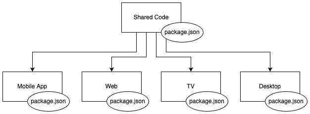
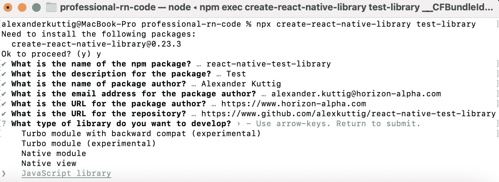
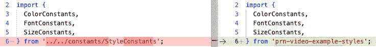

# 10

# 结构化大型、多平台项目

我坚信，软件项目的结构是决定成功或失败的关键因素之一。这包括应用程序架构、开发过程以及整个项目组织。

项目越大，参与项目的开发者越多，项目运行时间越长，良好的项目结构就越重要。但小型项目也可能因为结构不良而失败。因此，本章的大部分内容也适用于小型项目。

当使用 React Native 开发适用于多个平台的应用程序时，项目结构尤为重要，不仅限于 iOS 和 Android。不同的平台有不同的需求，并带来不同的用户期望。展示这一点的最佳例子是 iOS、Android 和网页之间的差异。

如已在*第四章*中提到的，*React Native 中的样式、存储和导航*，移动应用程序和网页中的导航概念完全不同。在规划项目结构时，您必须考虑这一点。

在投资良好的架构和良好的项目结构时的问题在于，它总是在一开始就产生一些额外开销。以下图显示了这种困境：


图 10.1 – 随着项目随时间增长，编码生产力降低

如果您在开始时不投资于架构，您将拥有更高的生产力。如果您投资于架构，您必须考虑应该实现什么，项目可能向哪个方向发展，以及当项目达到最大成功时，您将有什么用途、团队规模和要求。

这些考虑需要一些时间，实施和执行标准化流程可能需要更多时间。直接下载随机模板并开始编码总是更快。但如前所述，最终会得到回报，因为有了良好的应用程序架构和良好的项目结构，您最终会得到易于维护、测试和开发的软件。

因此，您将在本章中学习以下内容：

+   设置适用于大型企业项目的应用程序架构

+   使用 React Native 部署到不同的平台

+   使用您自己的库重用代码

# 技术要求

要运行本章中的代码，您必须设置以下内容：

+   一个有效的 React Native 环境 ([bit.ly/prn-setup-rn](https://bit.ly/prn-setup-rn) – React Native CLI 快速入门)。

+   您可以在本存储库中找到示例项目：[`bit.ly/prn-videoexample`](https://bit.ly/prn-videoexample)。

+   虽然本章的大部分内容也应该适用于 Windows，但我建议在 Mac 上进行操作。

+   本章包含一些原生代码。您应该对 Java 或 Kotlin 以及 Objective-C 或 Swift 有基本了解。

# 为大型企业项目设置一个适用的应用架构

当我们谈论大型项目以及如何设置一个合适的应用架构时，看看这些大型项目与小型团队或单个开发者项目相比有什么不同是有意义的。

以下是最重要的几点：

+   **项目团队非常大**：在大型项目中，你通常有一个由许多开发者组成的庞大团队。通常，这些开发者遍布世界各地，这意味着他们处于不同的时区，使用不同的第一语言，并且有着完全不同的文化背景。因此，拥有一个清晰的结构和明确的责任是非常重要的。否则，你的项目将会失败。

+   **多个开发者将在应用程序的同一部分工作**：在最后期限即将到来，一个特性必须完成的时候，多个开发者将共同工作在同一个特性和应用程序的同一部分。这意味着你应该考虑如何组织你的代码，以便在没有冲突的情况下实现这一点。

+   **每个错误都会被用户发现**：在只有少数用户的较小项目中，很多错误可能永远不会被发现。在拥有大量用户的规模较大的应用程序中，错误几乎不可能保持未被发现。这意味着在将应用程序发布给公众之前，你必须投入更多的努力来自己发现错误。

+   **代码必须通过程序进行测试**：项目越大，运行时间越长，程序化测试你的代码就变得越重要。在某个时候，手动处理所有测试是不可能的。这意味着你必须有一个非常支持这种自动化测试的应用架构。

+   **代码库将变得非常大**：正如“大型项目”这个术语所暗示的，项目和它的代码库将变得非常大。这意味着你必须提供一个结构，使得新开发者尽可能容易地理解项目中的情况。

在这些要点的基础上，我们将尝试找到一些支持所有这些的架构方法。

## 适应我们的示例项目结构

当项目增长时，最重要的就是分解。这意味着你应该尽可能地将你的组件拆分成小而意义明确的片段。

当我们查看示例项目的项目结构时，我们已经很好地分解了我们的应用程序，并且我们选择的架构对于我们的用例来说效果良好。它已经包含了一些即使在大型项目中我也推荐保留的东西。以下就是这些内容：

+   **使用服务**：每个 API、SDK 或第三方连接器都应该被封装在你的服务中。这样，你可以以最小的努力更改 SDK 或服务以及合作伙伴。

+   **组件和视图的分离**：可重用的组件和可导航的视图应保存在不同的文件夹中。这使得新开发者更容易找到他们正在工作的视图。

然而，这种方法也带来了一些问题，尤其是在代码库增长且多个开发者共同工作时：

+   组件和视图难以通过程序进行测试

+   组件目录将迅速增长并变得非常大

+   单个功能将难以找到，并且散布在整个代码库中

+   整个代码库将变得相当混乱

+   许多开发者将不得不同时触摸相同的文件

因此，我们将对我们的方法进行一些调整。首先，我们将关注组件级别。到目前为止，我们将在一个文件中编写组件的业务逻辑、UI、样式和类型。现在将发生变化。我们将把我们的组件拆分为以下：

+   `index.tsx`：`index` 文件包含组件的业务逻辑，如数据获取，以及与全局应用程序状态的连接。它只渲染以下 `.view` 组件。

+   `<component>.view.tsx`：`view` 文件包含 UI。它不保留自己的状态，也不直接连接到全局应用程序状态。它只渲染从 `index` 文件获得的属性。

+   `<component>.styles.tsx`：`styles` 文件包含 React Native StyleSheet 或 styled-components，具体取决于你选择的方法。

+   `<component>.types.tsx`：`types` 文件提供了 `index` 和 `view` 文件的属性和状态的数据类型。

通过这种分离，我们实现了两个目标。首先，一个开发者更容易处理业务逻辑，另一个处理 UI，而不会产生合并冲突或其他问题。其次，我们的组件现在对自动化测试的支持更好。

我们可以使用任何组件测试框架来渲染和测试视图，而无需模拟我们的全局状态或组件状态。此外，使用这种方法集成工具（如 Storybook）也容易得多。

要查看该方法的实际应用，你可以查看 GitHub 仓库，选择 `chapter-10-split-home-view` 标签，并查看 `views/home` 文件夹。

提示

为了确保每个人都遵循这种模式，并使创建新的视图和组件更简单，你可以使用文件生成器。这些是小脚本，使用模板和通常是一个组件名称来创建你想要的结构。你可以在 GitHub 仓库中看到一个示例。选择 `chapter-10-generator` 标签，查看 `util` 文件夹。你可以使用生成器通过 `npm run generate <name>` 来生成新的视图。

在组件级别进行此更改后，我们将退后一步，再次审视整个项目。当你项目增长时，我推荐的第二个更改是按功能对视图和组件进行分组。这使得理解整个项目结构并导航代码变得容易得多。

我必须承认，这取决于个人偏好，有些人甚至喜欢在大型项目中组件和视图之间清晰的分离，但我更喜欢功能方法。这种方法如图所示：

![图 10.2 – React Native 特征分组架构]

![图片/B16694_10_02.jpg]

图 10.2 – React Native 特征分组架构

这种方法按功能对应用程序进行分组。它还有一个组件文件夹，其中包含非常基本的通用组件，如按钮、列表和头像——基本上，这些是在你的应用程序的每个功能中使用的，以提供一致的用户体验。但每个功能也有自己的组件文件夹，你可以将只为这个功能创建的组件放入其中。还有对这个方法的修改，即将多个视图放在一个功能中。

从我的个人经验来看，我可以这样说，这种功能方法使代码库结构非常清晰，并且使查找你正在寻找的内容变得更容易。另一方面，你总会遇到一些组件，你不确定是否应该将它们放入通用组件中。

最后，你必须找到自己想如何构建应用程序结构的方法。但在本节中，你学习了为了创建即使在项目扩展时也能正常工作的结构，你必须注意的最重要的事情。

现在你已经学会了如何一般性地构建 React Native 项目，我们将更进一步，专注于多平台开发。

# 使用 React Native 部署到不同平台

在本节中，你将学习如何设置你的 React Native 项目以支持多个平台。由于这是最常见的情况，我们将在这里大量关注 Web，但本节中的提示和方法也适用于其他平台，如桌面和电视。

当为多个平台创建应用程序时，始终有两个目标。首先，你希望尽可能支持更多平台特定的功能，并希望为用户提供他们在该平台上习惯的外观和感觉。其次，你试图尽可能多地共享代码，因为这使维护和开发你的应用程序更容易。

初看，这些目标似乎相互矛盾，但有一些智能的方法可以同时获得两者的最佳效果。让我们从最简单的方法开始。

## 使用 react-native-web 创建 Web 克隆

当你使用 React Native 创建应用程序时，你可以使用一个名为`react-native-web`的库来在 Web 上运行你的 React Native 应用程序。

在我们开始之前，你必须理解 `react-native-web` 是做什么的。基本上，它将所有 React Native 组件映射到 HTML 组件。例如，一个 `<View/>` 组件将得到 `<div/>`。它还将 React Native 的原生 API 调用映射到浏览器 API，只要可用。这意味着你将得到一个普通的 React 网页应用程序。

虽然 `react-native-web` 是一个很棒的库，但要开始使用它并不容易，因为您必须设置一个单独的构建过程来使用它。这个构建过程将创建一个独立的 React 网页应用程序。像每个 React 网页应用程序一样，它需要一个打包器来创建优化的浏览器可读 JavaScript 代码。一个非常流行的解决方案是 Webpack，我们也将使用它来构建我们的网页应用程序。此外，每个网页应用程序都需要一个入口点。在大多数情况下，这是一个 `index.html` 文件，然后加载包含 React 应用的 JavaScript 包。因此，我们必须将其添加到我们的项目中。

在 `react-native-web` 文档中（您可以通过以下链接查看：https://bit.ly/prn-rn-web）以非常详细的方式描述了设置网页支持的全过程，但撰写本文时，该文档缺少 TypeScript 支持。

因此，当我们在示例应用程序中设置基本的网页支持时，我将描述最重要的内容。您可以在选择 `chapter-10-web` 标签时在 GitHub 仓库中找到完整的完整设置。

### 安装 react-native-web

我们将从添加 `react-native-web` 和 `react-dom` 到我们的项目开始。请使用正确的 `react-dom` 版本。由于我们在 React Native 应用中使用 React 17，因此我们必须使用 `react-dom@17`。这些库是创建 React 应用所必需的。安装可以通过 `npm` 完成：

```js
npm install react-dom@17 react-native-web
```

否则，可以通过 `yarn` 来完成：

```js
yarn add react-dom@17 react-native-web
```

现在我们已经安装了 `react-native-web`，我们需要处理网页的构建过程和开发环境。

### 安装 webpack

为了做到这一点，我们将添加 Webpack、相应的 CLI 以及一个名为 `webpack-dev-server` 的 Webpack 扩展。这个扩展提供了一个内置的开发服务器，在您开发应用程序时支持实时重新加载。

这些 `npm` 库的安装可以通过以下 `npm` 命令来完成：

```js
npm install –saveDev webpack webpack-cli webpack-dev-server
```

否则，你可以使用一个 `yarn` 命令：

```js
yarn add --dev webpack webpack-cli webpack-dev-server
```

除了这个基本的 Webpack 设置之外，我们还将安装两个加载器。加载器是 Webpack 的一个核心概念。它们使您能够预处理文件并决定它们应该如何在您的包中使用。我们将使用以下加载器：

+   `ts-loader`：这是一个预处理我们的 TypeScript 文件并将其转换为浏览器可读 JavaScript 的加载器

+   `file-loader`：这个加载器将我们的资产二进制文件（如图像）复制到我们的最终包中

我们需要为我们的网页构建过程工作的最后一件事是 `html-webpack-plugin`。这个插件创建我们的入口点。它通过加载 HTML 模板并添加创建的 JavaScript 包来写入 `index.html`。

这些添加可以通过以下`npm`命令安装：

```js
npm install –saveDev file-loader ts-loader html-webpack-plugin
```

否则，使用以下`yarn`命令安装：

```js
yarn add --dev file-loader ts-loader html-webpack-plugin
```

现在我们已经安装了所有工具，我们必须配置我们的项目。

### 配置 React Native 项目以支持 Web

首先，让我们为我们的应用程序创建一个 JavaScript 入口点。为此，我们将在应用程序的根目录中创建`index.web.js`。这包含以下代码。

```js
AppRegistry.registerComponent(appName, () => App);
AppRegistry.runApplication(appName, {
  initialProps: {},
  rootTag: document.getElementById('movie-root'),
});
```

我们使用 React Native 的`AppRegistry`通过`registerComponent`函数加载我们的`<App />`组件，然后通过`runApplication`运行我们的应用程序。

`runApplication`需要一个 HTML 节点作为`rootTag`来支持 Web。这个 HTML 节点将在`runApplication`期间被 React 应用程序替换。在我们的例子中，我们将从 HTML 文档中获取带有`movie-root` ID 的元素。

接下来，我们将在项目的`root`文件夹中创建一个`web/`文件夹。在这个文件夹中，我们将放置一个包含以下内容的`index.html`模板（请参考 GitHub 仓库以获取完整文件）：

```js
  <head>
    <title>
      Movie Application
    </title>
    <style>
        html, body { height: 100%; }
        body { overflow: hidden; }
        #movie-root { display:flex; height:100%; }
      </style>
  </head>
  <body>
    <div id="movie-root"></div>
  </body>
```

在文档的头部，我们定义了一个标题和一些样式。这些样式对于`react-native-web`应用程序的显示非常重要。主体部分只包含一个空的`<div />`元素，并带有`#movie-root` ID。这是我们用于 JavaScript 入口点的容器。

接下来，我们必须配置我们的 Webpack 构建器。为此，请在`web/`文件夹中创建`webpack.config.js`。以下代码片段显示了最重要的配置。对于完整文件，请查看 GitHub 仓库：

```js
const rootDir = path.join(__dirname, '..');
module.exports = {
  entry: {
    app: path.join(rootDir, './index.web.ts'),
  },
  output: {
    path: path.resolve(rootDir, 'dist'),
    filename: 'app-[hash].bundle.js',
  },
  module: {
    rules: [{
        test: /\.(tsx|ts|jsx|js)$/,
        exclude: /node_modules/,
        loader: 'ts-loader'
 }]
  },
  plugins: [
    new HtmlWebpackPlugin({
      template: path.join(__dirname, './index.html'),
    })
  ],
  resolve: {
    extensions: [
      '.web.tsx','.web.ts','.tsx','.ts','.js'
    ],
    alias: Object.assign({
      'react-native$': 'react-native-web',
    }),
  },
};
```

让我们从头到尾处理这个配置。首先，我们定义了我们的 JavaScript 入口点。在这里，我们放置了我们刚刚创建的`index.web.js`文件。然后，我们定义了我们的输出。在这种情况下，它是`dist/`目录和一个带有哈希值的 JS 包，以确保每次构建都有新的文件名，以防止浏览器缓存问题。

在`module`部分，我们可以定义规则来指定哪些加载器应该用于预处理哪些文件。我们使用正则表达式来测试文件名，并为所有匹配的文件定义加载器。在这个例子中，我们为包含`.tsx`、`.ts`、`.jsx`或`.js`的所有文件使用`ts-loader`，除了`node_modules`文件夹中的所有内容。

在文件的下一部分，我们定义了我们将使用哪些插件。在我们的例子中，只有`HTMLWebpackPlugin`用于从我们的模板 HTML 文件创建入口点`index.html`。`config`文件的最后一部分是`resolve`部分。在这里，React Native 到普通 React Web 应用程序的转换魔法正在发生。

通过为`react-native`创建`react-native-web`别名，我们替换了所有`react-native`的实例，现在它们都来自`react-native-web`。这意味着所有从`react-native`获取的导入现在都来自`react-native-web`。

现在我们 Web 应用程序的构建过程已经工作，我们将在我们的 TypeScript 设置中进行一些小的调整：

```js
"lib": ["es2017", "dom"],
"jsx": "react",
"noEmit": false,
```

我们在`lib`部分添加了`dom`，将`jsx`模式改为`react`，并将`noEmit`从`true`改为`false`。这是为了以 Webpack 可以处理的方式创建文件。这一步完成后，设置就完成了。

### 在浏览器中以 React 应用运行 React Native 代码

现在，我们可以从命令行以`dev`模式启动我们的 React Native 应用作为 React Web 应用。你可以使用以下命令来完成：

```js
cd web && webpack-dev-server
```

以下截图显示了我们的示例电影应用在浏览器中的运行情况：


图 10.3 – 在浏览器中运行的我们的示例电影应用

*图 10.3* 展示了在浏览器中运行的示例电影应用的 UI。它运行得非常完美，与原生应用使用相同的代码库。当你使用浏览器的检查工具检查 HTML 时，你会看到所有的 React Native 组件都被转换成了 HTML 组件。

作为本节的最后一步，为了使开发和创建生产构建更容易，我们在`package.json`的`scripts`部分添加了两个命令：

```js
"start:web": "cd web && webpack-dev-server",
"build:web": "cd web && webpack",
```

第一行是我们刚才用来以`dev`模式启动应用程序的命令。第二行是用来在生产模式下构建应用程序以进行部署的命令。这会将完整的包写入我们在`webpack.config.js`中定义的`dist`文件夹。

在本小节中，你学习了如何创建你的 React Native 应用在 Web 上的克隆。虽然这可能在某些情况下有效，但大多数时候这还不够。Web 和移动用户在大多数领域的期望是不同的，你也可能希望使用 Web 和移动不同的库，这些库不支持其他平台。区分不同平台的一个非常简单的解决方案是利用文件扩展名。

## 使用.native 和.web 文件扩展名

如前一小节所述，我们对 Web 和原生应用有两个完全不同的构建过程。虽然我们配置了 Webpack 打包器以支持`.web.ts`或`.web.tsx`文件，但原生 Metro 打包器默认支持`.native.ts`或`.native.tsx`文件。这意味着我们可以通过简单地创建文件的两个版本来编写特定平台的代码：

+   `App.tsx`和`App.native.tsx`会导致我们的 Web 应用使用`App.tsx`，而我们的原生应用使用`App.native.tsx`

+   `App.tsx`和`App.web.tsx`会导致我们的 Web 应用使用`App.web.tsx`，而我们的原生应用使用`App.tsx`

这种方法可以用来共享大部分代码，但为组件创建特定平台的版本。它也可以用来为不同的平台定义不同的导航堆栈，或者通过创建特定平台的`App.tsx`文件来使用不同的导航库。

总的来说，这种方法非常强大，但也存在一些限制。例如，你将不得不使用你在不同平台之间共享的库的相同版本，因为这两个平台共享一个`package.json`文件。如果你想更进一步，你可以要么在`monorepo`中处理多个包，要么从你想要共享的代码中创建自己的库，然后将这些库导入到不同的平台特定项目中。

让我们先看看`monorepo`方法。

## 在单一代码库中处理多个包

对于将你的多平台 React Native 应用程序作为`monorepo`进行结构化，我建议使用`yarn`工作空间。这是在单个存储库中设置多个 JavaScript 包的方法。`yarn`在版本和存储方面优化库。它还允许包之间相互链接，这也是我们在这里使用它的主要原因。

想了解更多关于`yarn`工作空间的信息，你可以查看官方文档([`bit.ly/prn-yarn-workspaces`](https://bit.ly/prn-yarn-workspaces))。以下图显示了具有`yarn`工作空间的多平台`monorepo`结构：



图 10.4 – 基于工作空间的多平台 React Native 单一代码库

你有一个**共享代码**包（通常也称为**App**），它可以包含应用程序的大部分内容，如视图、存储、服务和组件。这个包不是直接启动的，也没有本地或 Web 入口点。然后，你为每个平台有一个包。

这些包中的每一个都有自己的`package.json`文件，可以定义自己的库和版本。这种设置甚至允许你在不同的平台上使用同一库的不同版本，只要你的共享代码支持所有这些版本。

平台特定包包含入口点，我也建议在这里放置平台特定的东西，如导航和一般的应用程序结构（层堆栈或导航树）。这使得不仅能够为每个平台创建相同应用程序的副本，而且还可以使用非常不同的方法。

例如，你可以在 Web 和移动端有完全不同的层堆栈。这完全合理，因为大多数时候，不同平台的需求是完全不同的。有些你在 Web 上需要的东西甚至不想在移动应用中拥有，反之亦然。

这种包式方法还有另一个优点。基于 React 的框架有很多，它们执行了许多针对 Web 的特定优化，例如支持服务器端渲染、将浏览器历史支持添加到路由中，或者进行广泛的 Web 包优化。这类最受欢迎的框架是**Next.js**和**Gatsby**。使用这种设置，你可以为 Web 使用它们。

如果你想要从这种`monorepo`设置开始，我可以推荐一个优秀的模板，你可以在以下链接找到：[`bit.ly/prn-rn-universal-monorepo`](https://bit.ly/prn-rn-universal-monorepo)。这个模板不仅支持移动和网页，还支持一些其他框架和平台，如 Next.js、Electron、桌面应用程序，甚至浏览器扩展。还有一个很好的描述，可以指导你完成设置过程，你可以在以下链接找到：[`bit.ly/prn-rn-anywhere`](https://bit.ly/prn-rn-anywhere)。

采用这种方法，我们首次为不同的平台创建了不同的包。在这种情况下，我们只使用了一个仓库，因为这使开发变得相当简单。我们只需要克隆仓库，安装依赖项，就可以开始了。

我真的很喜欢这种方法，但当代码库和团队规模大幅增长时，进一步深入确实是有意义的。为了更清晰地分离应用程序的不同部分并明确其责任，你可以将应用程序拆分为不同的项目。这意味着你将创建自己的库。

# 使用自己的库重用代码

有很多理由要创建自己的库。在不同平台之间共享代码无疑是其中之一。但通过自己的库，你还可以实现以下事情：

+   **确保所有应用程序中的一致设计**：当你在提供多个应用程序的公司工作，并且需要确保这些应用程序的设计一致时，创建一个提供所有这些应用程序的 UI 组件的 UI 库是一个好主意。这确保了一个一致的设计系统。

+   **简化后端连接**：你可以将你的服务提取到一个库中，然后可以在所有项目中使用这个库。这确保了统一的后端连接层。

+   **定义责任**：每个库都可以由其维护者或团队维护。通过这种库方法，你可以明确定义责任。

+   **提供额外功能**：你也可以编写自己的库来提供原生功能，这些功能在社区模块中无法以你所需的方式获得。在这种情况下，我总是建议以自己的库的形式提供这种功能（如果可能的话，使其对社区可用）。

注意

大多数社区模块都是因为有人遇到了尚未解决的问题而开始的。如果你能够通过新的库或模块解决问题，我强烈建议与社区分享。即使你不是出于利他的原因，这也可以是一件非常好的事情。通常，你可以找到其他人面临相同的挑战，你们可以一起创造更好的解决方案。

创建我们自己的库可能相当具有挑战性。您可以在网上找到大量教程和博客文章，介绍如何为您的库创建完美的设置。其中一些不错，一些则不好。但与其使用其中之一，我推荐使用名为`react-native-builder-bob`的工具包。

## 使用 react-native-builder-bob 编写、维护和发布我们自己的库

此工具使编写、维护和发布您自己的库的过程变得非常简单。它由一家名为**Callstack**的公司创建和维护，该公司在 React Native 社区中非常活跃，甚至为 React Native 的核心做出了贡献。

他们使用`react-native-builder-bob`为自己的库编写代码，许多最受欢迎的库也是如此。

您可以使用以下简单命令开始使用预配置的`react-native-builder-bob`创建自己的库：

```js
npx create-react-native-library <your-library-name>
```

此命令将启动设置过程，并通过几个问题引导您完成。以下截图显示了此过程：



图 10.5 – 使用 create-react-native-library 创建自己的库

在回答有关作者和包的问题后，这些问题是创建`package.json`所必需的，`create-react-native-library`将询问您想要开发哪种类型的库。

您可以选择以下选项：

+   **本地模块/本地视图**：如果您模块包含本地代码，应选择此选项。这些选项使用当前的桥接架构在 JavaScript 和本地代码之间进行通信。

+   **JavaScript 库**：如果您模块不包含任何本地代码，应选择此选项。大多数用例，如简单的 UI 库、服务 SDK 和状态提供者，都属于此类。此外，当您使用包含本地代码的其他库，但您的库是仅包含 JavaScript 的库时，这也是正确的类型。

+   **Turbo 模块**：在撰写本文时，此类型处于实验阶段。它基于新的 React Native 架构创建本地模块（参见*第三章*，*介绍新的 React Native 架构*部分）。

我们将首先创建一个仅包含 JavaScript 的库。想象一下，我们创建的示例应用是某个大型公司众多应用中的一个。因为管理层喜欢我们的设计，所以他们希望所有未来的应用都能遵循我们的设计系统。因此，我们希望将我们的`StyleConstants`文件作为设置企业设计系统的第一步放入我们的库中。

### 创建仅包含 JavaScript 的库

要开始我们自己的仅 JavaScript 库，我们将选择 `create-react-native-library` 下拉菜单。`create-react-native-library` 使用一组预配置的工具、预定义的脚本、一个简单的乘法函数作为源代码，甚至还有一个示例应用程序来展示库。如果您想查看一个工作示例，可以查看以下 GitHub 仓库：[`bit.ly/prn-repo-styles-library`](https://bit.ly/prn-repo-styles-library)。

当我们检查我们新创建的库的 `root` 文件夹时，我们会发现许多我们已知的文件。这里有一个 `babel.config.js` 文件来定义 Babel 应如何转换我们的代码，一个包含有关包信息以及所有依赖和脚本的 `package.json` 文件，还有一个包含 TypeScript 编译器所有信息的 `tsconfig.json` 文件。

接下来，我们将更深入地查看 `package.json`。除了所有预定义的信息和配置之外，我想指出两个重要的事情。第一个是关于如何找到我们库各个部分的信息。以下代码片段显示了这些信息：

```js
  "main": "lib/commonjs/index",
  "types": "lib/typescript/index.d.ts",
  "source": "src/index",
```

当我们使用 TypeScript 创建我们的库时，它将由 `react-native-builder-bob` 编译为预 ES6 JavaScript，这样它就可以在所有 React Native 项目中使用，无论它使用的是哪种堆栈（TypeScript、Flow、纯 JS 或 Expo）。这意味着我们的库代码以不同的方式分发。以下属性中定义了这一点：

+   `main`：这是您库的主要入口点。当您从库中导入任何内容时，这是您的项目将查找导出路径的地方。

+   `types`：由于我们使用 TypeScript，`react-native-builder-bob` 为我们的代码创建类型，以便所有使用类型化 JavaScript 的人都可以使用我们创建的类型。

+   `source`：这是可以找到未编译源代码的地方。

当我们在 `source` 目录中工作时，使用我们库的项目将只与 `main` 和 `types` 一起工作。

我希望您首先查看的是 `scripts` 部分，尤其是以下脚本。

```js
  "scripts": {
    "prepare": "bob build",
    "release": "release-it",
  },
```

这些脚本是这个库设置中最基本的部分。使用 `prepare` 脚本，您可以运行 `react-native-builder-bob` 的 `build` 命令。它将编译您的库并提供您刚刚学到的入口点。

`release` 脚本将使用 `release-it` 库创建您库的新版本。这将启动一个引导过程，执行以下操作：

+   更新库版本

+   创建一个变更日志

+   将您的库发布到 `npm`

+   将库版本更新提交到 `git`

+   添加一个 `git` 标签

+   将更改推送到远程仓库

+   在 GitHub 上创建一个发布

这个脚本非常有用，因为它强制您在发布和标记库方面遵循最佳实践。

现在您已经了解了库项目的结构，让我们使用这个库来发布我们的样式。由于我们已经在 `StyleConstants` 文件中收集了所有的样式信息，所以这很简单。

前往库项目的 `src/index.tsx` 文件，并将 `StyleConstants.ts` 文件的内容粘贴进去。接下来，提交更改，并使用以下命令构建和发布库：

```js
npm run prepare && npm run release
```

注意

您需要在 [`www.npmjs.com/`](https://www.npmjs.com/) 上创建一个免费账户，并通过命令行使用 `npm login` 登录，以便能够发布您的库。

在您发布库包之后，您可以在项目中安装它。您可以使用常规的 `npm` 命令：

```js
npm install <your-library-name>
```

或者，您可以使用 `yarn` 命令：

```js
yarn add <your-library-name>
```

现在您能够通过库访问您的样式，您可以删除 `StyleConstants.ts` 文件，并将所有导入替换为您的库。以下图显示了 `Home.styles.tsx` 的更改：



图 10.6 – 从本地文件导入更改到库

如您所见，导入保持不变，只是 `from` 路径变更为库。您必须在所有使用 `StyleConstants` 的文件中这样做。

正如您在本小节中学到的，创建自己的库的过程相当复杂，但使用正确的工具工作时会容易得多。但鉴于我们的示例是一个仅使用 JavaScript 的库，这是 React Native 库中最简单的一种。当向库中添加本地代码时，它会变得更加复杂。

### 理解本地库之间的区别

如您所知，React Native 有一个 JavaScript 部分和一个本地部分。这意味着当我们需要时，我们可以利用本地平台特定的代码。这不仅适用于应用程序项目，也适用于库。本地代码是用平台特定的语言编写的，例如 Android 的 Kotlin 或 Java，iOS 的 Swift 或 Objective-C。

但并不仅仅是语言在不同平台之间有所不同。应用程序管理第三方包的过程以及如何构建和部署的过程也完全不同。

Android 使用 Gradle 来获取包并构建您的应用程序。对于 iOS，有多个包管理器，但 React Native 严重依赖于 CocoaPods。构建是通过 Xcode 完成的。

这意味着当您向库中添加本地代码时，您不仅要交付和导入您的 JavaScript 代码，还要提供本地代码并将其添加到包含在本地包中的本地构建过程中。

在这种设置下，您的本地代码也包含在库包中。要能够编写本地代码，您在用 `create-react-native-library` 创建库时必须选择 `Native Module`。这将创建两个额外的文件夹（`android` 和 `ios`），其中包含本地代码，以及本地构建过程的配置文件。

对于 Android，这是一个`build.gradle`文件，可以在`android`文件夹中找到。对于 iOS，这是一个`.podspec`文件，可以在库的`root`文件夹中找到。

所有这些文件都是为您创建的，因此您不需要修改它们。当使用原生代码安装您的库时，React Native 的自动链接功能会在 Android 上为您处理所有事情。在 iOS 上，您需要运行`npx pod-install`来将库的原生部分包含到原生项目中。

现在您能够创建纯 JavaScript 库和包含原生代码的库，我们将再次审视如何提供它们。我们使用公共的`npm`注册表来托管我们的库作为公共包。

虽然我真的很喜欢与社区共享一切的方法，但您可能需要将您的库保持为私有，尤其是在它们是公司应用程序的重要部分时。下一小节将向您展示如何仅向选定的人提供对您的库的访问权限。

## 对库设置访问限制

有一些方法可以将您的库仅与选定的人共享。以下两种是最常见的：

+   **使用付费 npmjs.com 计划**：当使用付费的[npmjs.com](https://npmjs.com)计划时，您可以在您的包上定义权限。这意味着只有您明确允许的人才能访问您的包。

+   `package.json`:

    ```js
    "prn-video-example-styles": "git+https://github.com/alexkuttig/video-example-styles"
    ```

+   您甚至可以通过添加一个`#`符号后跟标签名、分支名或提交哈希来指定您的包应该从哪里获取标签、分支或提交。

再次强调，我强烈建议尽可能地将您的模块发布出来，而不是将其保持为私有。这个拥有数千个维护良好的公共包的社区是 React Native 之所以成功的主要原因之一。因此，向社区回馈总是一个好主意。

# 摘要

在本章中，您学习了如何构建大规模或多平台产品。现在您能够创建适用于大规模和长期运行项目的项目结构。

您还在网络上创建了一个示例 React Native 移动应用的克隆版本，并理解了为什么这并不总是最佳选择。然后您学习了如何创建满足用户期望的多平台应用，同时保持高比例的共享代码。

在本章的最后部分，您学习了如何创建、发布和维护自己的库，了解了仅使用 JavaScript 的库和包含原生代码的库之间的区别，以及如何仅将这些库发布给选定的人。

在专注于为代码库本身创建良好的结构之后，在下一章中，我们将关注如何实施良好的工作流程以及如何使用**持续集成**（**CI**）工具来支持这些流程。
