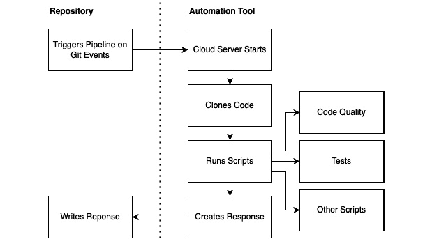
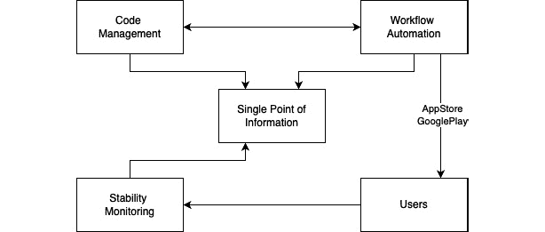
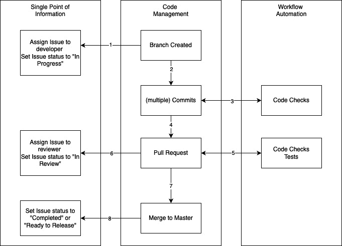
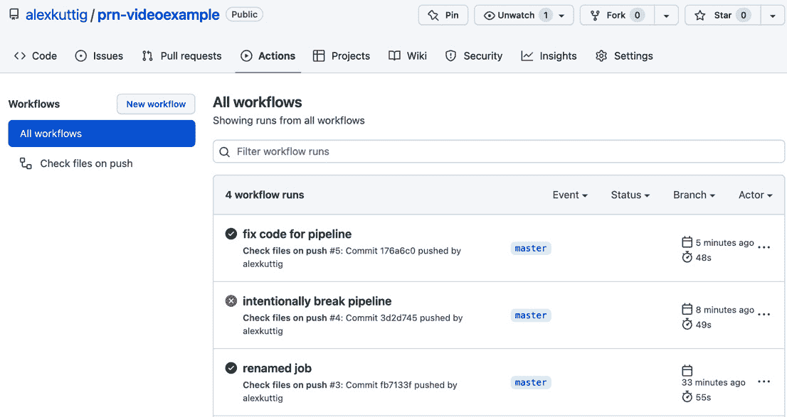
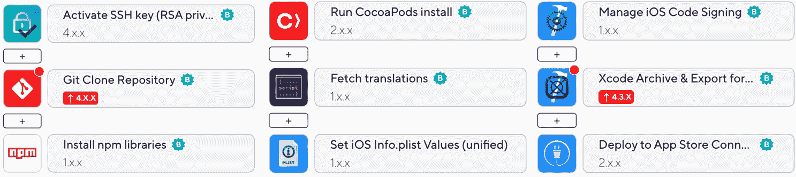
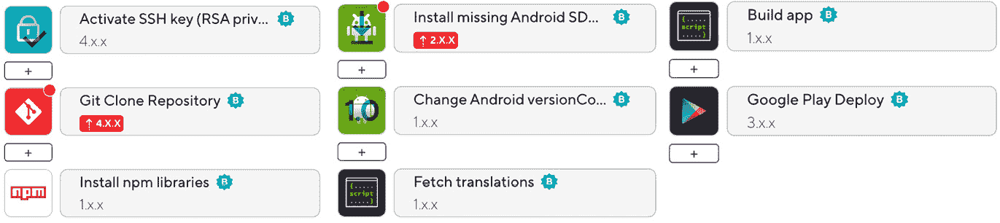

# 11

# 创建和自动化工作流程

使用现代工作流程自动化自动化工作流程在大规模项目中是绝对必要的。这将为您节省大量时间，但更重要的是，它将确保您不会错过任何东西，并且您的重复性流程，如检查代码样式和质量、构建应用程序或发布应用程序都能正常工作。

接下来，它让您有信心，您刚刚编写的代码不仅能在您的机器上运行，因为它是在一个干净的机器上克隆并启动的。最后，它确保项目不依赖于个人。

在特定情况下，例如构建和发布应用程序这样的步骤，在更大规模的项目中可能会变得相当复杂，因此并非项目中的每个成员都能完成这些任务。但有了正确的自动化设置，只需按一下按钮即可。

当谈到工作流程自动化时，您也会经常听到**持续集成**（**CI**）和**持续交付**（**CD**）这两个术语。这两个术语都描述了自动化工作流程。CI 指的是项目的开发阶段。这意味着每个开发者都会频繁地将他们创建的代码集成到一个共享的仓库中，通常每天多次。在每次集成中，代码都会自动检查（TypeScript/Flow、ESLint、Prettier 和测试），并且开发者会立即得到反馈。DS 指的是部署或交付步骤。它描述了构建和交付应用程序的自动化。

由于在构建应用程序时可以进行 CI，因此您应该使用它。CD 适用于测试构建，但对于公共生产构建，如移动应用程序，它效果不佳。每天多次向公众发布是不可能的，因为每个发布都必须由苹果和谷歌手动审查才能在相应的应用商店中可用。

即使可能（您可以通过在第十三章中学习的 CodePush 实现，*技巧与展望*），我也不建议过于频繁地推送更新，因为这会导致每个用户在每次启动时都必须更新应用程序版本。

正因如此，我们将专注于开发过程中的持续集成（CI）以及为构建和发布步骤构建自动化工作流程，这些工作流程可以手动触发以进行公开生产构建，或者自动触发以进行内部测试构建（CD）。

这使您能够自动将应用程序更新推送给测试用户，并通过一键推送将应用程序发布给公众，同时不会因为过于频繁的更新而打扰真实用户。

由于当自动化的工作流程不好时，最好的自动化工具也毫无价值，因此在本章中，我们也将关注创建一个有效的开发工作流程。

在本章中，我们将涵盖以下主题：

+   理解集成/交付工作流程自动化

+   创建协作开发工作流程

+   为开发过程创建有用的 CI 管道

+   理解工作流程自动化和 CD 的构建和发布

# 技术要求

要能够运行本章中的代码，您必须设置以下内容：

+   一个可工作的 React Native 环境 ([bit.ly/prn-setup-rn](http://bit.ly/prn-setup-rn) – React Native CLI 快速入门)

+   虽然本章的大部分内容也应该在 Windows 上工作，但我建议在 Mac 上进行操作

+   拥有 GitHub 账户以运行 CI 管道

+   拥有 Bitrise 账户以运行 Bitrise 交付工作流程

# 理解集成/交付工作流程自动化

集成和交付工作流程自动化的过程相当简单：您需要一个仓库和一个可以连接到您的仓库的自动化工具或构建服务器。然后，您必须定义规则，关于哪些 Git 事件应向服务器发送信息以触发某些脚本。以下图表说明了这个过程：



图 11.1 – 基本 CI 设置

Git 事件，如提交、拉取请求或合并，会触发自动化工具。自动化工具会启动一个配置在自动化工具设置中的干净服务器。然后，它从您的仓库克隆代码并开始在其上运行脚本。对于 React Native 应用程序，这些脚本通常从安装所有项目依赖项和运行静态类型检查器（Flow/TypeScript）开始。

接下来，您应该运行代码质量工具，如 ESLint 和 Prettier，并检查代码是否符合所有要求。大多数时候，您也会在这里运行一些测试（更多关于这一点在 *第十二章**，React Native 应用程序的自动化测试)。

您可以在这里运行其他任何脚本，以及集成其他云工具，如 SonarQube ([`bit.ly/prn-sonarcube`](https://bit.ly/prn-sonarcube)，一个高级代码质量工具) 或 Snyk ([`bit.ly/prn-snyk`](https://bit.ly/prn-snyk)，一个基于云的安全智能工具)。

在脚本执行完毕后，您的自动化工具会创建一个响应并将其发送回您的仓库。然后，这个响应会在您的仓库中显示，并可用于允许或拒绝进一步的操作。

现在，基本的自动化工具已集成到所有流行的基于 Git 的源代码仓库服务中，包括 GitHub（GitHub Actions）、Bitbucket（Bitbucket Pipelines）和 GitLab（GitLab CI/CD）。虽然这些工具对于 React Native CI 要求来说工作得很好，但构建和部署移动应用程序是一个非常复杂的过程，具有特殊的要求。

例如，iOS 应用程序仍然只能在 macOS 机器上构建。虽然从技术上讲，这些基本自动化工具中的大多数也可以完成这一步，但我不会推荐使用它们进行构建和部署。

对于这一步，有一个专门的工具包称为 fastlane，它可以集成到特殊的自动化工作流程工具中，如 Bitrise、CircleCI 和 Travis CI。我建议使用这个工具包，因为它可以为您节省很多时间。

现在您已经了解了流程自动化的理论，是时候考虑我们的开发过程应该是什么样子了。在我们可以自动化任何事情之前，我们需要建立一个良好的流程。

# 创建协作开发工作流

在大规模项目中，最重要的是信息更新。通常，在这些项目中，很多人需要协调，多个项目部分需要协同工作以构建复杂的产品。虽然信息很重要，但它不应限制开发速度。

因此，我们必须创建一个可以支持自动化的工作流程，以满足这两个要求。以下图表显示了此工作流程的重要部分：



图 11.2 – 工作流自动化设置

如您所见，工作流程需要四个技术部分。具体如下：

+   **信息单一来源**：所有信息都集中在这里。通常，这是一个问题跟踪器，其中每个任务、错误或功能请求都作为一个问题创建。例如，包括 Jira、ClickUp、GitLab 问题跟踪器和 GitHub 问题跟踪器。

+   **代码管理**：这是您的源代码存储的地方。它应能够与您的 *信息单一来源* 集成，以传输有关哪些问题已经完成或正在处理的信息。例如，包括 Bitbucket、GitHub 代码和 GitLab 仓库。

+   **工作流自动化**：这是您的应用程序进行测试和构建的地方。此工具还应能够与您的 *信息单一来源* 通信，以传输有关问题状态的信息。例如，包括 Bitbucket Pipelines、GitHub Actions、GitLab CI/CD、CircleCI 和 Bitrise。

+   **稳定性监控**：在您的应用程序部署给用户之后，您应该跟踪有关其稳定性的信息。崩溃或其他问题应自动报告给您的 *信息单一来源*。例如，包括 Bugsnag、Sentry、Rollbar 和 Crashlytics。您将在 *第十三章* “技巧与展望” 中了解更多关于这些工具的信息。

现在，我们可以开始创建我们的开发工作流程。以下图表显示了推荐的标准化功能分支工作流程：




图 11.3 – 功能分支工作流程

正如工作流名称所暗示的，对于每个功能（这也可以是一个错误或改进——在这里，每个单独的问题都被视为一个功能），都会创建一个新的分支。然后，以下工作流程开始：

1.  当创建分支时，信息单一来源必须更新，以便包含有关问题是否已经处理以及谁正在处理的信息。

1.  接下来，开发者会对问题进行一次或多次提交以解决问题。

1.  每个提交都会由工作流程自动化工具进行检查。

1.  如果有错误，开发者会立即收到通知。当开发者认为他们已经解决了问题并完成了他们的工作后，他们会创建一个拉取请求（有时也称为**合并请求**）。

1.  这个拉取请求也经过了工作流程自动化的检查，但这次，不仅进行了简单的检查，还进行了更广泛的检查（例如，端到端测试）。

1.  如果一切顺利，必须更新单一的信息点。问题被分配给另一位开发者进行审阅，状态也会相应地更改以反映审阅状态。

1.  如果需要更改，则过程将回退到**步骤 1**。如果审阅者对结果满意，他们可以将代码合并到 master 或 main 分支。

1.  再次，必须更新单一的信息点，以反映问题的正确状态。

我非常喜欢这个过程，因为它为你提供了你需要的大量东西。以下是一些例子：

+   你总是能知道项目的确切状态。

+   工作流程的大部分可以自动化以节省时间。通常，开发者和审阅者只需要在代码管理工具中工作；其他一切都是自动化的。

+   这确保了每段代码都由另一位开发者进行双重检查，从而提高了代码质量。

+   审阅者不需要对基本代码质量进行检查，因为这是自动完成的。

现在我们已经了解了我们的流程，让我们开始编写自动化管道。

# 为开发过程创建有用的持续集成（CI）管道

再次，我们将使用我们的示例项目。首先，我们将设置一个管道，它可以在开发过程中通过非常简单的检查来支持我们，针对的是图 11.3 的**步骤 3**。我们将使用 GitHub Actions 来执行这个 CI 管道，但它与 Bitbucket ([`bit.ly/prn-bitbucket-pipelines`](https://bit.ly/prn-bitbucket-pipelines)) 和 GitLab CI/CD ([`bit.ly/prn-gitlab-cicd`](https://bit.ly/prn-gitlab-cicd)) 非常相似。

首先，我们必须创建我们希望在管道中使用的脚本。在我们的例子中，我们想要使用 TypeScript 编译器进行类型检查，并使用 ESLint 和 Prettier 进行静态代码分析，以确保代码风格正确。

为了做到这一点，我们将在`package.json`文件的`scripts`部分提供以下脚本：

```js
"typecheck": "tsc --noEmit",
"lint": "eslint ./src",
"prettier": "prettier ./src --check",
```

接下来，我们必须创建一个可以被 GitHub Actions 解释的工作流程文件。由于这是一个完全集成的自动化工作流程，一旦我们将这个文件推送到我们的 GitHub 仓库，GitHub Actions 就会开始工作。

这就是我们的第一个工作流程自动化管道（或 CI 管道）的样子。你必须将它创建在 `.github/workflows/<the github actions workflow name>.yml` 下：

```js
name: Check files on push
on: push
jobs:
  run-checks:
    runs-on: ubuntu-latest
    steps:
      - uses: actions/checkout@v2
      - name: install modules
        run: npm install
      - name: run typecheck
        run: npm run typecheck
      - name: run prettier check for code styling
        run: npm run prettier
      - name: run eslint check for code errors
        run: npm run lint
```

让我们逐行查看代码。第一行定义了工作流程的名称。第二行定义了工作流程应该在何时运行。在这种情况下，我们希望在每次向仓库推送时运行它，无论推送来自哪个分支或作者。

提示

您可以在不同的触发事件上运行工作流。您可以在文档中找到完整的列表（[`bit.ly/prn-github-actions-events`](https://bit.ly/prn-github-actions-events)为 GitHub Actions 事件列表）。

在上一节描述的开发过程中，一些特别有用的触发事件是推送和拉取请求。您还可以将这些触发事件限制在特定的分支上。

接下来，您可以看到`jobs`部分。在这里，您定义实际的流程，它包含一个或多个可以顺序或并行运行的作业。在这种情况下，我们定义了一个包含多个步骤的作业。

对于我们的工作，我们首先要做的是定义它应该在哪个机器上运行。每个工作流自动化工具都有许多预定义的机器映像供您选择，但您始终可以提供自己的机器来运行自动化管道。在我们的例子中，我们将使用 GitHub Actions 提供的最新 Ubuntu 映像。

接下来，我们定义作业的步骤。这可以是使用`uses`命令与预定义操作一起使用的预定义操作，或者是我们自己创建的操作。在我们的例子中，我们使用了这两种选项。首先，我们使用预定义操作来检出我们的代码，然后我们使用四个自定义操作来安装模块和运行我们的检查。

提示

当使用工作流自动化工具时，您的工作流运行时间将是您需要支付的指标。因此，您应该始终考虑如何构建您的工作流，以便在自动化工具机器上花费尽可能少的时间。

一旦我们将此文件推送到我们的 GitHub 仓库，自动工作流的第一次运行就被触发了。在这种情况下，机器启动，克隆了仓库，安装了依赖模块，并运行了我们的检查。您可以在**GitHub Actions**标签页中查看自动化运行情况。

在前面的*提示*中，您了解到优化工作流以尽可能快地运行是很重要的。所以，这就是我们接下来要做的。以下图表显示了两种优化我们工作流的方法，以便我们可以更快地完成它：

![Figure 11.4 – Parallelize workflows]

![img/B16694_11_04.jpg]

图 11.4 – 并行化工作流

完成事情最快的方法是通过并行运行它们。GitHub Actions 不允许您并行运行步骤，但您可以并行运行多个作业。您必须详细调查您的工作流，以找出哪些部分可以并行化，哪些步骤更适合顺序运行。

在我们的例子中，仅仅为三个任务创建三个作业并没有太多意义。这是因为花费时间最长的步骤是安装依赖项，这对于所有三个作业都是必要的。幸运的是，我们可以使用缓存来工作，这样我们就不必在每次测试运行中重复缓存的任务。

在前面的图示左侧，您可以看到我们示例的管道设置，它首先安装依赖项，然后并行运行我们的三个作业。所有三个作业都从缓存中获取依赖项，这些依赖项是在安装步骤中填充的。在右侧，您可以看到另一种设置。在这个设置中，我们有三个并行作业，它们完全独立于彼此运行。

所有三个作业都试图从缓存中获取依赖项，并且只有在找不到它们时才安装它们。在某些场景下，这两种选项都更快。如果您必须安装依赖项，第二种设置会稍微长一点，因为安装步骤将被触发三次（因为步骤是并行开始的，而在它们开始的时候，依赖项要么被缓存，要么不是所有三个作业都有）。

第一种设置只触发一次依赖项安装，并确保它为其他作业缓存。在大多数场景中，这种第一种设置会花费更多时间，因为它需要您按顺序运行两个作业（*安装* + *类型检查/Prettier/ESLint*）。

正因如此，我建议采用以下代码中所示的第二种设置：

```js
name: Check files on push alternative
on: push
jobs:
  typecheck:
    runs-on: ubuntu-latest
    steps:
      - uses: actions/checkout@v2
      - uses: actions/setup-node@v2
        with:
          node-version: '14'
      - uses: actions/cache@v2
        id: npm-cache
        with:
          path: '**/node_modules'
          key: ${{ runner.os }}-node-${{
               hashFiles('**/package-lock.json') }}
      - name: Install dependencies if not cached
        if: steps.npm-cache.outputs.cache-hit != 'true'
        run: npm install
      - name: run typecheck
        run: npm run typecheck
  prettier:
    runs-on: ubuntu-latest
    steps:
      - uses: actions/checkout@v2
      - uses: actions/setup-node@v2
        with:
          node-version: '14'
      - uses: actions/cache@v2
        id: npm-cache
        with:
          path: '**/node_modules'
          key: ${{ runner.os }}-node-${{
               hashFiles('**/package-lock.json') }}
      - name: Install dependencies if not cached
        if: steps.npm-cache.outputs.cache-hit != 'true'
        run: npm install
      - name: run prettier check for code styling
        run: npm run prettier
  lint:
    runs-on: ubuntu-latest
    steps:
      - uses: actions/checkout@v2
      - uses: actions/setup-node@v2
        with:
          node-version: '14'
      - uses: actions/cache@v2
        id: npm-cache
        with:
          path: '**/node_modules'
          key: ${{ runner.os }}-node-${{
               hashFiles('**/package-lock.json') }}
      - name: Install dependencies if not cached
        if: steps.npm-cache.outputs.cache-hit != 'true'
        run: npm install
      - name: run eslint check for code errors
        run: npm run lint
```

如您所见，三个作业非常相似。我们检出项目，使用指定的节点版本设置节点环境，并检查缓存。缓存的键包含运行时的操作系统版本和`package-lock.json`文件的哈希值，当依赖项（版本更新、新库等）发生变化时，这个哈希值会改变。

接下来，我们有一个条件安装步骤，它只在未命中缓存时安装依赖项。这发生在我们的缓存名称更改时，如前所述，或者如果缓存过期（这发生在至少一周未使用后）。

最后，我们执行我们的类型检查/Prettier/ESLint 步骤。虽然这种并行化看起来相当复杂，但在大规模使用时可以节省您大量时间。因此，您应该花些时间设置您的工作流程自动化，以确保它符合您的需求。

所有现代代码管理解决方案，如 GitHub、Bitbucket 和 GitLab，都深度集成了工作流程自动化工具。这意味着一旦您配置了工作流程自动化，您不仅会在工作流程自动化工具或部分中看到结果，还会在您的仓库中看到结果。例如，它将直接在提交列表中显示每个已测试提交的结果。

对于更多详细信息，您必须访问工作流程自动化工具或部分 – 在我们的案例中，GitHub Actions – 以查看 CI 管道的结果。如果一切按预期进行，您将看到一个绿色的勾选标记。如果工作流程检测到我们的任何检查中抛出了错误，我们将看到一个红色的点，这会通知我们我们的工作流程执行失败。

以下截图显示了一个包含多个工作流程运行的列表：



图 11.5 – GitHub Actions 中的工作流程运行

在这个例子中，我们的工作流程运行了两次成功，而其中一次失败了。失败的流程运行总是最有趣的，因为它提供了大量关于出错原因的信息。

点击它，你会看到有关日志和执行时间的详细信息，这样你就可以找到并修复错误。这是它在**GitHub Actions**中的样子：

![Figure 11.6 – GitHub Actions 中的失败工作流程运行

![img/B16694_11_06.jpg]

图 11.6 – GitHub Actions 中的失败工作流程运行

如你所见，我们不仅可以看到哪些检查失败，还可以看到详细的日志。在这种情况下，我们在`Genre.tsx`文件中使用了错误类型，这导致了一系列错误。通过这个工作流程，我们不仅找到了错误，还知道了我们必须修复错误的精确文件和行号。

注意

与 CI 管道一起工作，关键在于尽快提供反馈。你应该使用 Husky ([`bit.ly/prn-husky`](https://bit.ly/prn-husky))等工具在将它们提交到本地机器之前运行你的管道。这不仅取代了你的工作流程自动化工具，还可以进一步缩短反馈周期。

现在你已经知道了如何创建 CI 管道来支持和改进开发过程，让我们来看看构建和发布应用。

# 理解工作流程自动化和 CD 对于构建和发布的重要性

在我们开始创建我们的管道之前，让我们先看看构建和发布应用的一般情况。Android 使用 Gradle 作为其构建工具，并使用 KeyStore 文件来验证应用的所有权。如果你不熟悉发布 Android 应用，请先阅读此指南：[`bit.ly/prn-android-release`](https://bit.ly/prn-android-release)。

在 iOS 上，你必须使用 Xcode 来构建、签名和发布你的应用。如果你不熟悉这个过程，请先阅读此指南：[`bit.ly/prn-ios-release`](https://bit.ly/prn-ios-release)。

幸运的是，对于两个平台（Android 和 iOS），构建和部署过程可以通过命令行工具执行。Gradle 本身就是一个命令行工具，Xcode 提供了 Xcode 命令行工具。这意味着我们可以为整个过程编写脚本，然后我们可以使用我们的工作流程自动化工具调用这些脚本。

不幸的是，这些过程相当复杂，所以我们不想自己编写脚本。这就是一个名为**Fastlane**的工具集发挥作用的地方。Fastlane 是 iOS 和 Android 应用的专用自动化工具。它提供了用于签名、构建和将代码部署到 Apple App Store 和 Google Play 的脚本。你可以在这里找到有关 Fastlane 的更多信息：[`bit.ly/prn-fastlane`](https://bit.ly/prn-fastlane)。

我不推荐直接使用 Fastlane 的原因是它与 Bitrise 和 CircleCI 等高级工作流程自动化工具具有出色的集成。我们将以 Bitrise 为例进行深入了解，但其他工具如 CircleCI 和 Travis CI 的工作方式非常相似。

Bitrise 以与 GitHub Actions 相同的方式集成到您的代码管理解决方案中。您可以使用某些事件来触发工作流程。它提供了一个出色的 UI 来创建这些工作流程。我喜欢使用它，因为它相当简单，并且节省了大量时间。

您可以从大量预定义的操作中选择，这些操作主要关注 iOS 和 Android 应用程序。Bitrise 甚至为 React Native 应用程序提供自己的自动设置。以下图表显示了典型的 iOS 构建和部署工作流程：




图 11.7 – Bitrise iOS 构建和部署工作流程

步骤是按列执行的。因此，我们首先激活一个 SSH 密钥，以便能够连接到仓库。接下来，仓库被克隆。之后，安装`npm`依赖模块，以及通过 CocoaPods 安装的原生模块。

例如，对于可以在此集成的每个其他脚本，我们将获取我们应用 UI 的最近翻译文件，以便在下一步与应用程序包集成。然后，我们将更新`Info.plist`文件中的版本号。接下来，工作流程处理代码签名，构建应用程序，并将其部署到 App Store Connect。

Android 构建的工作流程看起来非常相似：





再次，操作是按列执行的。第一列与 iOS 工作流程中的相同。激活 SSH 密钥，克隆仓库，并安装`npm`依赖模块。接下来，我们必须安装所有缺失的 Android SDK 工具。

然后，我们必须更改 Android 版本代码，就像我们在 iOS 中做的那样，获取与应用程序捆绑的翻译。然后，我们必须构建应用程序并将其部署到 Google Play。

在幕后，Bitrise 和其他具有图形工作流程编辑器的 CI 工具使用您在设置开发 CI 管道时了解到的相同逻辑。以下代码是为 iOS 工作流程的`.yml`文件：

```js
  ios-release-build:
    steps:
    - activate-ssh-key@4:
        run_if: '{{getenv "SSH_RSA_PRIVATE_KEY" | ne ""}}'
    - git-clone@4: {}
    - npm@1:
        inputs:
        - command: install
    - cocoapods-install@2: {}
    - script@1:
        inputs:
        - content: |-
            cd scripts
            bash getTranslationsCrowdin.sh
    - set-ios-info-plist-unified@1:
        inputs:
        - bundle_version: „$VERSION_NUMBER_IOS"
        - info_plist_file: "$BITRISE_SOURCE_DIR_PLIST"
    - manage-ios-code-signing@1:
    - xcode-archive@4.3:
        inputs:
        - project_path: "$BITRISE_PROJECT_PATH"
        - distribution_method: app-store
        - export_method: app-store
    - deploy-to-itunesconnect-deliver@2:
```

如您所见，它具有相同的结构。它包含多个步骤，这些步骤可以作为配置获取额外的输入。像任何其他工作流程自动化工具一样，Bitrise 使用环境变量。这些变量存储在平台上，并在工作流程执行期间替换占位符（在这里，它们以`$`开头）。

注意

你永远不应该将私钥或签名信息添加到你的仓库中。如果发生了这种情况，任何可以访问仓库的人都可以获取这些私有数据，并能够为你的应用程序签名发布。将此信息存储在你的自动化工作流程工具中会更好，因为在那里，没有人可以获取密钥和签名证书，但所有有访问权限的开发者仍然可以创建新的发布。

此工作流程可以是手动触发的，我建议用于公共生产构建，或者自动触发的，我建议用于内部或公共测试构建。

# 摘要

现在，是时候总结本章内容了。首先，你学习了工作流程自动化、持续集成和持续交付这些术语的含义，以及它们在应用开发中的应用。然后，你考虑了一个适用于大规模项目的开发流程。

接着，你学习了如何通过简单的自动化工作流程工具，如 GitHub Actions，来支持这个流程。最后，你了解了专门的自动化工作流程工具，如 Bitrise，这样你就可以构建、签名和部署你的 iOS 和 Android 应用。

在本章中，有一个特别重要的主题——**测试**——在关于工作流程自动化的讨论中被遗漏了。自动化测试在开发阶段以及发布前都很重要。因此，我们将在下一章详细探讨自动化测试。
