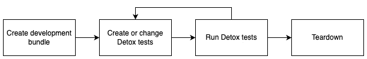
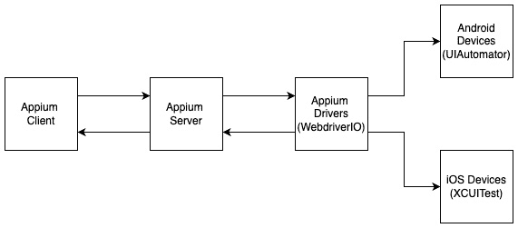
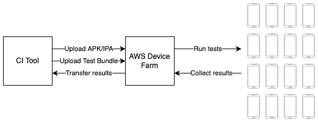
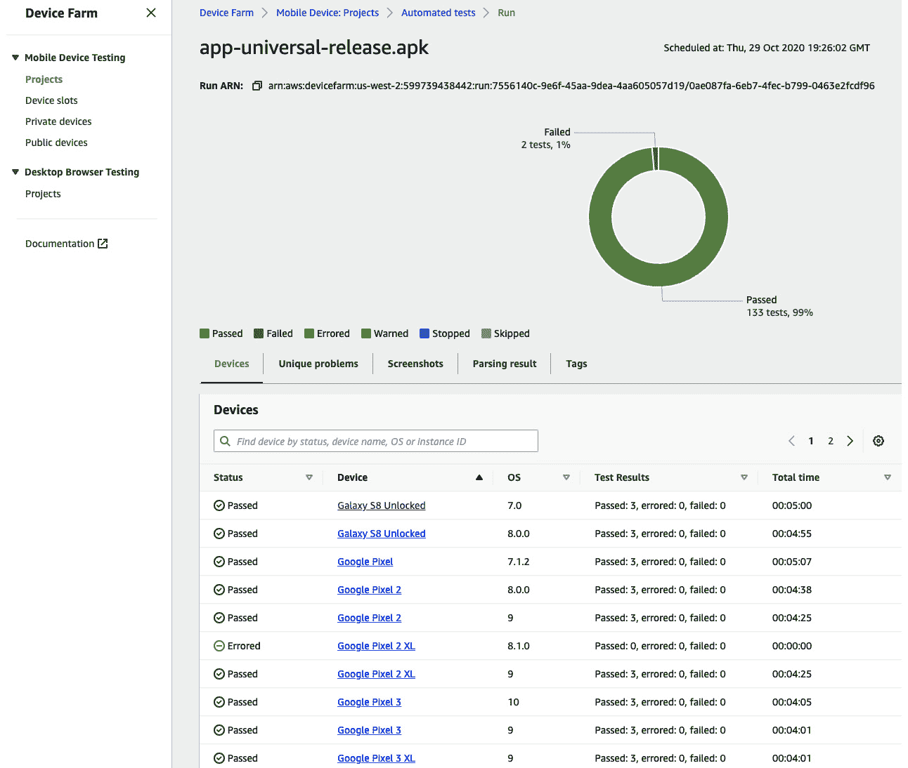

# 第十二章：React Native 应用程序的自动化测试

自动化测试是当您的项目增长时必须做的最重要的事情之一。它可以帮助确保您应用程序的某个质量水平，并允许您在不引入每个版本中的错误的情况下运行更快的发布周期。我建议尽快为您的应用程序编写自动化测试。

从一开始就编写测试要容易得多，因为这样您被迫以适合自动化测试的方式组织代码。如果一开始没有关注这一点，那么重构应用程序以使用自动化测试可能会很困难。

在本章中，您将了解自动化测试的一般知识以及如何在 React Native 应用程序中使用自动化测试。您将了解不同类型的自动化测试的不同工具和框架。这些工具和框架被世界上一些最广泛使用的应用程序在生产中采用，因此我建议使用它们。

为了给您提供一个关于所有这些主题的良好概述，本章将涵盖以下主题。如果您已经熟悉自动化测试的一般知识，您可以跳过第一部分：

+   理解自动化测试

+   在 React Native 中使用单元和集成测试

+   使用组件测试

+   理解端到端测试

# 技术要求

要运行本章中的代码，您必须设置以下内容：

+   一个有效的 React Native 环境（[bit.ly/prn-setup-rn](https://bit.ly/prn-setup-rn) – React Native CLI 快速入门）。

+   尽管本章的大部分内容也应该适用于 Windows，但我建议在 Mac 上操作。您需要在 Mac 上操作才能在 iOS 模拟器上运行 Detox 端到端测试。

+   一个 AWS 账户，用于访问 AWS Device Farm。

# 理解自动化测试

自动化测试有不同的形式。以下是一些最常见的自动化测试形式，并将在本章中进行介绍：

+   **单元测试**：单元测试覆盖业务逻辑的最小部分，例如单个函数。

+   **集成测试**：这种测试形式在 React Native 中与单元测试非常相似，但它覆盖了多个业务逻辑部分，并测试这些部分的集成是否按预期工作。

+   **组件测试**：这些测试覆盖您的 React Native UI 组件，并检查它们是否按预期执行。您还可以使用这种测试形式检查组件中的（意外）变化。

+   **端到端测试**：这种测试形式模拟最终用户的行为，并检查您的整个应用程序是否按预期运行。

要充分利用自动化测试，您应该实现所有四种类型的测试。所有这些测试都覆盖了应用程序的不同领域，并可以帮助您找到其他测试类型无法发现的错误。

当使用自动化测试时，你应该尽量提高 **代码覆盖率**。代码覆盖率描述了你的代码中由自动化测试覆盖的部分百分比。虽然这是一个很好的指标，可以了解自动化测试是否在项目中使用，以及你没有忘记应用程序的任何部分，但它本身意义不大。

这是因为为你的每一行代码编写一个测试并没有帮助。当使用自动化测试，尤其是单元测试、集成测试和组件测试时，你应该总是为你要测试的部分编写多个测试，覆盖最常见的用例以及重要的边缘情况。这意味着在编写测试之前，你必须深思熟虑。

使用单元测试、集成测试和组件测试时，你通常测试应用程序的小部分。这也意味着你必须创建一个环境，使这些小部分可以独立工作。这可以通过模拟在测试部分中使用的依赖项来实现。

**Mocking** 指的是为测试环境编写依赖项的自己的实现，以确保它按预期行为，并排除依赖项中的错误导致测试错误的可能性。

注意

并非总是清楚应用程序的哪些部分应该在测试中进行模拟。我建议在单元测试中模拟更多而不是更少，因为你想要测试代码的非常小部分是否按预期行为。在集成和组件测试中，我建议模拟更少而不是更多，因为你想要测试应用程序的更大部分，并查看整个组合是否工作。

因为单元测试、集成测试和组件测试在测试环境中运行，并且只使用你的应用程序的部分，所以它们非常可靠。没有多少事情可以干扰这些测试，从而扭曲测试结果。这与处理端到端测试不同。

这些测试在模拟器或真实设备上的真实应用程序上运行，并依赖于诸如网络连接或其他设备行为等因素。这可能导致 **测试不可靠**。不可靠的测试是指在没有任何代码更改的情况下，在不同测试运行中通过和失败测试。

这是一个真正的问题，因为它导致你必须手动检查测试是否失败仅仅是因为它是不可靠的，还是因为它发现了你应用程序中的错误。我们将在 *理解端到端测试* 部分更详细地介绍测试不可靠性。

但首先，我们将通过使用单元测试和集成测试自动测试我们应用程序的业务逻辑部分。

# 在 React Native 中使用单元测试和集成测试

当你开始一个新的 React Native 项目时，它自带一个名为 **Jest** 的预配置测试框架。这是单元测试、集成测试和组件测试的推荐框架。我们将在以下部分中使用它。

让我们从单元测试开始。我们将再次使用我们的示例项目，但我们将回滚几个提交，使用本地电影服务实现。你可以在示例仓库中选择 `chapter-12-unit-testing` 分支来查看完整的代码。

这个本地服务实现非常适合作为单元测试的例子，因为它没有依赖项。我们知道它正在处理的数据，并且可以很容易地编写测试。在这个例子中，我们将测试两个 API 调用：`getMovies` 和 `getMovieById`。

以下代码展示了我们的第一个单元测试：

```js
import {getMovies,getMovieById} from '../src/services/movieService';
describe('testing getMovies API', () => {
  test('getMovies returns values', () => {
    expect(getMovies()).toBeTruthy();
  });
  test('getMovies returns an array', () => {
    expect(getMovies()).toBeInstanceOf(Array);
  });
  test('getMovies returns three results', () => {
    expect(getMovies()).toHaveLength(46);
  });
});
describe('testing getMovieById API', () => {
  test('getMovies returns movie if id exists', () => {
    expect(getMovieById(892153)).toBeTruthy();
  });
  test('getMovies returns movie with correct information,
  () => {
    const movie = getMovieById(892153);
    expect(movie?.title).toBe('Tom and Jerry Cowboy Up!');
    expect(movie?.release_date).toBe('2022-01-24');
  });
  test('getMovies returns nothing if id does not exist', ()
  => {
    expect(getMovieById(0)).toBeFalsy();
  });
});
```

前面的代码包含六个测试，分为两个部分。第一部分包含所有关于 `getMovies` API 调用的测试。第一个测试确保 `getMovies` 调用返回了一个值。第二个测试检查 `getMovies` 是否返回一个数组，而最后一个测试验证返回的数组长度是否符合我们预期的长度。

注意

你可能想知道为什么在这里需要三个测试，因为最后一个测试在第一个或第二个测试失败时就会失败。这是因为它为我们提供了有用的信息，使我们能够看到哪些测试失败了。这使得调试和搜索更改或错误变得容易得多。

在代码示例的第二部分，我们测试了 `getMoviesById` 块。同样，我们有三个测试。第一个测试验证 API 调用返回了一个已知存在的电影 ID 的值。第二个测试检查返回的是否是正确的电影。第三个测试确保 `getMovieById` API 调用对于我们知道不存在的 ID 不返回任何内容。

如你所见，在测试一个函数时，你不应该只写一个单元测试；你应该尝试至少覆盖以下区域：

+   检查现有和非现有返回值

+   检查预期的数据类型

+   检查返回的值是否与你的预期数据匹配

+   如果你处理范围，请为边缘情况编写测试

+   如果你遇到了一个错误，请使用单元测试来重现它，以确保它永远不会再次遇到

使用 Jest 编写集成测试与单元测试非常相似。区别在于你测试的是应用程序的更大部分。虽然术语并不总是统一的，你可以在 React Native 文档中找到一个好的定义（[`bit.ly/prn-integration-tests`](https://bit.ly/prn-integration-tests)）。以下四个点中至少有一个为真时，它被视为集成测试：

+   结合你的应用程序的几个模块

+   使用外部系统

+   向其他应用程序（如天气服务 API）发起网络调用

+   进行任何类型的文件或数据库 I/O 操作

在进行集成测试时，有一件事非常重要，那就是模拟。当使用 Jest 作为测试运行器运行测试时，你没有任何应用程序的本地部分可用；你的测试在仅 JavaScript 环境中运行你的 JavaScript 代码。

这意味着您至少需要模拟应用程序的所有原生部分。Jest 提供了对模拟代码不同部分的高级支持。您可以在此处查看详细文档：[`bit.ly/prn-jest-mocking`](https://bit.ly/prn-jest-mocking)。

单元测试和集成测试的工作方式与服务器应用程序或用其他语言编写的应用程序的测试非常相似，但组件测试是一种仅针对前端测试的类型。这就是我们接下来要探讨的。

# 与组件测试一起工作

当在 React Native 中使用组件测试时，推荐的解决方案是使用`react-native-testing-library`。这个库与 Jest 兼容，为您的 JavaScript 应用程序添加了一个渲染环境，并提供多个有用的选择器和其它功能。

最简单的组件测试类型是检查（意外的）变化。这被称为**快照测试**。组件将被渲染并转换为 XML 或 JSON 表示，称为快照。这个快照与测试一起存储。下次测试运行时，它将用于检查变化。

以下代码示例展示了我们示例应用程序中`HomeView`组件的快照测试：

```js
import React from 'react';
import HomeView from '../src/views/home/Home.view';
import {render} from '@testing-library/react-native';
const genres = require('../assets/data/genres.json');
describe('testing HomeView', () => {
  test('HomeView has not changed', () => {
    const view = render(
      <HomeView genres={genres}
                name={'John'}
                 onGenrePress={()=>{}}/>,
    );
    expect(view).toMatchSnapshot();
  });
});
```

这个代码示例展示了在结构化代码时考虑测试的重要性。我们可以简单地从`Home.view`导入`HomeView`组件，并在渲染时传递属性。

我们不需要模拟任何存储或外部依赖。这使得创建第一个快照测试变得非常容易。我们使用`react-native-testing-library`中的`render`函数来创建组件的快照表示。然后，我们期望它与我们的存储快照相匹配。

虽然快照测试可以非常有用，以发现意外的变化，但它只在我们有变化时提供信息。为了获取更多关于变化的信息并检查一切是否按预期工作，我们必须创建更高级的组件测试。

以下代码示例展示了我们如何检查组件是否渲染了有效的内容：

```js
  test('all list items exist', () => {
    render(<HomeView genres={genres}
                     name={'John'}
                     onGenrePress={() => {}} />);
    expect(screen.getByText('Action')).toBeTruthy();
    expect(screen.getByText('Adventure')).toBeTruthy();
    expect(screen.getByText('Animation')).toBeTruthy();
  });
```

在这个测试中，我们将我们的`genres.json`文件中的所有三个流派传递给`HomeView`组件。再次，我们使用`react-native-testing-library`中的`render`函数来渲染它。渲染后，我们使用测试库中的另一个函数`screen`。

使用这个函数，我们可以查询渲染到模拟屏幕上的值。这就是我们尝试找到我们期望存在的三个流派标题的方式，我们通过使用`toBeTruthy`来检查它们。

接下来，我们将更进一步，检查我们是否可以点击列表项：

```js
  test('all list items are clickable', () => {
    const mockFn = jest.fn();
    render(<HomeView genres={genres}
                     name={'John'}
                     onGenrePress={mockFn} />);
    fireEvent.press(screen.getByText('Action'));
    fireEvent.press(screen.getByText('Adventure'));
    fireEvent.press(screen.getByText('Animation'));
    expect(mockFn).toBeCalledTimes(3);
  });
```

在这个测试中，我们使用`react-native-testing-library`中的`fireEvent`函数在每一个列表项上创建一个点击事件。为了检查点击事件是否触发了我们的`onGenrePress`函数，我们向组件传递了一个使用`jest.fn()`创建的 Jest 模拟函数。

这个模拟函数在测试期间收集了大量信息，包括它在测试期间被调用的频率。这是我们在这个测试中要检查的内容。然而，我们可以更进一步。

我们不仅能够检查模拟函数是否被调用，还能检查它是否以正确的参数被调用：

```js
  test('click returns valid value', () => {
    const mockFn = jest.fn();
    render(<HomeView genres={genres}
                     name={'John'}
                     onGenrePress={mockFn} />);
    fireEvent.press(screen.getByText('Action'));
    expect(mockFn).toBeCalledWith(genres[0]);
  });
```

这个例子只在按下事件发生时触发，然后检查传递给函数的参数是否正确。由于`Action`类型是`genres`数组中的第一个，我们期望`onGenrePress`函数与它一起被调用。

再次强调，这些类型的测试之所以如此简单，仅仅是因为我们有一个良好的代码结构。如果我们没有将主页拆分为业务逻辑和视图，我们就必须处理我们的导航库，以及我们的全局状态管理解决方案。虽然这在大多数情况下是可行的，但它使得你的组件测试变得更加复杂。

注意

将单元测试、集成测试和组件测试集成到你的持续集成（CI）开发流程中是个好主意。你至少应该在打开拉取请求时运行这些测试。如果你的设置允许，你还可以在每次提交时运行它们，以实现更快的反馈循环。

我还建议要求达到一定程度的代码覆盖率，以确保所有开发者都为他们的代码编写测试。

你迄今为止所了解的所有测试类型都只在你模拟的环境中测试和使用了应用程序的某些部分。然而，当涉及到端到端测试时，情况就改变了。

# 理解端到端测试

端到端测试的想法非常简单：这些测试试图模拟现实世界的用户行为，并验证应用程序是否按预期运行。通常，端到端测试作为黑盒测试运行。

这意味着测试框架并不知道正在被测试的应用程序的内部功能。它运行在应用程序的发布构建版本上，这个版本将被发布。

## 理解端到端测试的作用

初看之下，端到端测试似乎是对自动化测试的万能药。难道仅仅通过端到端测试测试我们应用程序的所有场景就足够了吗？我们甚至还需要其他类型的测试，比如单元测试、集成测试或组件测试吗？

这些问题的答案非常简单。端到端测试功能强大，但它们也有一些特性，使得它们只能很好地覆盖某些场景。首先，端到端测试运行时间较长，因此使用端到端测试测试更复杂应用程序的所有功能可能需要多达数小时。

这意味着它们不能在每次提交时运行，这使得反馈循环变得很长。因此，这种场景不能集成到 CI 开发流程中，例如在*第十一章*中描述的*创建和自动化工作流程*。其次，端到端测试本身具有不稳定性。

这意味着这些测试可以在没有代码更改的情况下在不同测试运行中通过或失败。一个原因是应用程序可以在不同的测试运行中表现出不同的内部行为。例如，多个网络请求可以在不同的测试运行中以不同的顺序解决。

这对最终用户来说没有问题，但对于尝试尽可能快地运行交互的自动化端到端测试来说，可能会出现问题。测试不稳定性的另一个原因是测试运行的实际情况。

当测试设备在测试运行期间遇到网络连接问题时，测试将失败，即使它应该通过。现代测试框架试图尽可能减少这些问题，但它们还没有完全解决。

我建议您为应用程序中最常用的路径使用端到端测试。这可以包括账户创建和登录，以及您产品的核心功能。

注意

作为一名开发者，您应该始终确保在确保产品质量和保持开发速度之间保持平衡。过多的端到端测试可以提高质量，但会显著降低您的开发或发布流程的速度。

现在我们已经了解了端到端测试的一般情况，让我们开始编写我们的第一个测试。

## 使用 Detox 编写端到端测试

Detox 是一个最初为 React Native 应用程序开发的端到端测试框架。它不是一个真正的黑盒测试框架，因为它将自身的客户端注入到被测试的应用程序中。这样做是为了减少测试的不稳定性，这效果相当好，但也不能完全防止测试的不稳定性。

这也意味着您不会发送与测试相同的二进制文件。通常，这应该不会成问题，因为您只需使用相同的代码和配置构建另一个二进制文件，只是您会将 Detox 客户端捆绑到您的二进制文件中，但我想在这里提一下。

正常的 Detox 测试流程如图所示：


图 12.1 – Detox 测试流程

如您所见，在运行测试之前，您必须创建应用程序的生产版本。根据您创建构建的机器以及应用程序的大小，这可能需要一些时间。接下来，您运行测试。完成之后，测试环境将被拆解，以便您可以处理测试结果。

虽然这个过程在运行测试时效果很好，但在编写测试时可能会相当烦人。Detox 在使用测试 ID 来识别您想要与之交互的元素时效果最佳。这意味着您需要触摸您的代码，并给这些元素添加测试 ID。

这也意味着每次你需要更改代码中关于测试 ID 的任何内容时，你都必须创建一个新的构建。幸运的是，在编写测试时，你可以使用另一个过程。你还可以在开发构建中使用 Detox，这导致以下过程：



图 12.2 – 编写测试的 Detox 流程

当与开发构建一起工作时，你只需要创建一次本地的开发构建。正如你所知，JavaScript 包将在开发过程中从运行在你电脑上的 Metro 服务器获取。

这意味着你可以运行你的测试。如果你意识到你需要更改测试 ID，你可以简单地应用它们并重新启动测试。然后，开发构建将从 Metro 服务器获取新的 JavaScript 包并运行测试。这可以节省很多时间。

既然你已经了解了 Detox 的基本知识，让我们开始使用它。这本书没有包括安装它的详细步骤指南，因为过去的安装步骤变化相当频繁。所以，请查看 Detox 文档中的官方安装指南：[`bit.ly/prn-detox-start`](https://bit.ly/prn-detox-start)。

如果你在使你的 Detox 测试工作时有困难，你可以查看 GitHub 上的示例项目，项目地址为 `chapter-12-detox-testing`。

编写 Detox 测试与编写组件测试非常相似，因为 Detox 使用 Jest 作为其推荐的测试运行器。然而，与 Detox 一起，我们在真实世界的场景中运行测试，针对真实的应用。这意味着我们不需要进行模拟，因为我们需要的所有东西都是可用的。在我们开始编写测试之前，我们必须向我们要与之交互的组件添加测试 ID。

以下示例展示了 `Home.view.tsx` 的一个片段：

```js
<Pressable
  key={genre.name}
  onPress={() => props.onGenrePress(genre)}
  testID={'test' + genre.name}>
  <Text style={styles.genreTitle}>{genre.name}</Text>
</Pressable>
```

在这里，你可以看到用于显示类别的 `Pressable` 组件。我们向这个组件添加了一个 `testID` 属性，这使得它在我们的测试中可以被识别。

以下代码示例展示了我们应用的简单 Detox 测试。你还可以在示例项目仓库中的 `e2e/movie.e2e.js` 找到它：

```js
describe('Movie selection flow', () => {
  it('should navigate to movie and show movie details',
  async () => {
    await device.launchApp();
    awaitexpect(element(by.id('testAction'))).
      toBeVisible();
    await element(by.id('testAction')).tap();
    await expect(element(by.id('testmovie0'))).
      toBeVisible();
    await element(by.id('testmovie0')).tap();
    await expect(element(by.id('movieoverview'))).
      toBeVisible();
  });
});
```

首先，我们告诉 Detox 启动我们的应用。然后，我们等待具有 `testAction` ID 的类别可见。接下来，我们点击 `Pressable` 组件。对于电影，我们做的是相同的，但我们不使用电影名称作为 ID，而是使用列表索引。最后，我们验证电影概述文本是否显示。

这个例子很好地展示了端到端测试的优点和缺点。一方面，我们只需要几行代码就能导航到三个不同的屏幕并验证内容。这意味着我们可以相当自信地认为应用在这些屏幕上不会崩溃。另一方面，构建应用、将其加载到模拟器中、启动它并运行测试需要花费很多时间。

虽然 Detox 可以在真实设备上运行，但它主要与模拟器一起使用。这些模拟器可以在 CI 环境中运行，因此可以轻松集成到自动化工作流程中。

但你甚至可以将你的自动化工作流程中的端到端测试集成更进一步。虽然在这些模拟器上运行这些测试是有用的，但将它们运行在实际设备上会更好。特别是在 Android 上，你拥有数千种不同的设备，你应该至少测试最常见的那些。

在某些特定设备或操作系统版本上出现一些错误并不罕见。由于你不想购买数百台设备进行测试，你可以使用 AWS Device Farm 等设备农场。不幸的是，Detox 在这些环境中无法工作，所以你必须使用 Appium 作为测试框架。这就是我们将要探讨的内容。

## 理解 Appium 和 AWS Device Farm

与 Detox 不同，Appium 是一个真正的黑盒测试框架。它作用于你的发布二进制文件，因此测试了你想要发布的代码。它最初并不是为 React Native 设计的，而是为原生 Android 和 iOS 测试设计的。尽管如此，你仍然可以很好地使用它来测试 React Native 应用程序。

Appium 是一个非常成熟的框架。在撰写本文时，Appium 的第 2 版仍在开发中，尚未准备好使用，因此这里提供的示例是关于 Appium 的第 1 版。

该框架由多个部分组成，当你与 Appium 一起工作时，你必须理解这些不同的部分。以下图表显示了这些不同的部分：



图 12.3 – Appium 框架组件

Appium 的核心是一个 Node.js 服务器，它从 Appium 客户端接收测试命令。这个客户端就是你将编写测试的地方。它可以编写为不同的语言，如 JavaScript、Java、C#或 Python。

由于你不想仅为了编写测试而引入另一种语言，我建议在这里使用 JavaScript 实现。然后服务器使用 Appium 驱动程序与原生测试框架通信，这些框架用于在真实的 Android 和 iOS 设备上运行测试。

Appium 还提供了一个桌面应用程序，它有一个非常有用的检查器模式。当你不使用测试 ID 时，你可以使用此模式来查找标识符以编写你的测试。

由于 Appium 的安装过程将随着 Appium 版本 2 的发布而显著变化，这本书没有包含安装的详细步骤指南。你可以在官方 Appium 文档中找到这些说明：[`bit.ly/prn-appium-installation`](https://bit.ly/prn-appium-installation)。

在我看来，当与设备农场结合使用以在多个真实设备上运行测试时，使用 Appium 与 React Native 结合才真正有趣。否则，我建议坚持使用 Detox，因为它更容易安装、配置和维护。但遗憾的是，Detox 不支持在设备农场上运行。所以，再次，你不得不在那里使用 Appium。

其中一个设备农场是 AWS 设备农场。这是一个 Amazon 服务，它为您提供了访问数百种不同真实移动设备模型的机会。您可以通过网络浏览器手动上传和安装您的应用程序，或者在这些设备上运行自动化测试。

这种自动化测试正是我们将要做的。以下图表显示了在 AWS 设备农场上运行 Appium 测试的过程如何与您的自动化工作流程集成：



图 12.4 – 在 AWS 设备农场上运行自动化测试

您可以通过工作流程自动化或 CI 工具（如 Bitrise）以编程方式访问 AWS 设备农场，或者通过您的网络浏览器手动访问。在两种情况下，您都必须上传一个待测试的 Android APK 或 iOS IPA 文件和一个测试包。

此包是一个`.zip`文件，其中包含测试以及一些 AWS 设备农场的配置。您还可以选择用于测试的**设备池**。设备池是在 AWS 设备农场控制台中可以创建的设备集合。

AWS 将在您的设备池中的每个设备上运行您的测试，并收集测试结果。这些结果将在 AWS 设备农场控制台中显示，也可以传递回您的工作流程自动化或 CI 工具。

以下截图显示了 AWS 设备农场中测试运行的概览：



图 12.5 – AWS 设备农场结果屏幕

此概览显示了一个测试运行，在每个选择的设备池的每个设备上执行了三个测试。所有测试都通过了，除了两个。这意味着可能存在一个错误，导致两种测试在一个设备类型上失败，或者有两个测试是易变的。

这需要您进行调查。幸运的是，AWS 设备农场提供了每个测试运行的日志、截图和视频记录，以便您可以轻松地找出发生了什么。

由于在本地和 AWS 设备农场使用 Appium 的安装和配置过程并不简单，我创建了一个演示仓库，您可以从这里开始。它还包含详细的设置和安装指南，以及用于在本地运行 Appium 测试和为 AWS 设备农场创建测试包的有用脚本。您可以在以下链接找到它：[`bit.ly/prn-appium-aws-repo`](https://bit.ly/prn-appium-aws-repo)。

现在，让我们总结本章内容。

# 概述

首先，您学习了为什么自动化测试很重要，以及 React Native 应用程序存在哪些类型的测试。然后，您学习了如何使用 Jest 和`react-native-testing`编写单元测试、集成测试以及组件测试。

最后，你在涵盖两个不同框架：Detox 和 Appium 的过程中学习了端到端测试。完成这一章后，你应该明白自动化测试是大规模项目的一个关键部分，并且每种测试类型都很重要，因为它覆盖了不同的领域。

现在你已经学习了使用 React Native 编写大规模应用程序的基础知识，在这本书的最后一章，我将分享我的经验之谈，并对未来几年 React Native 的发展趋势进行展望。
