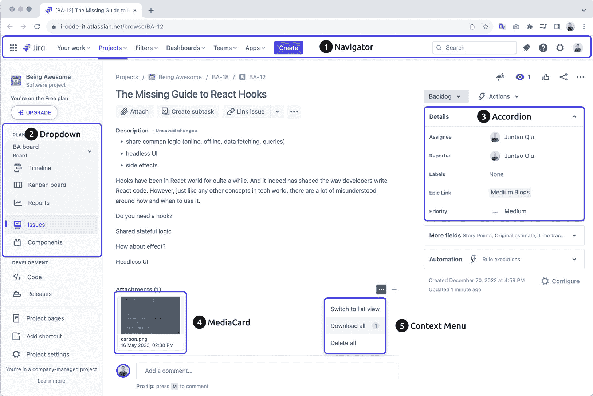
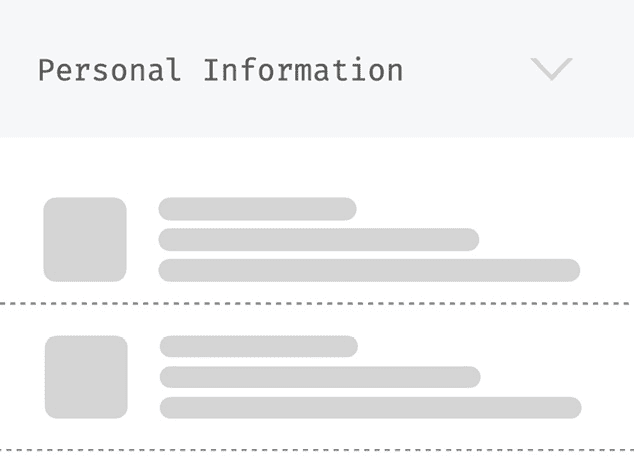
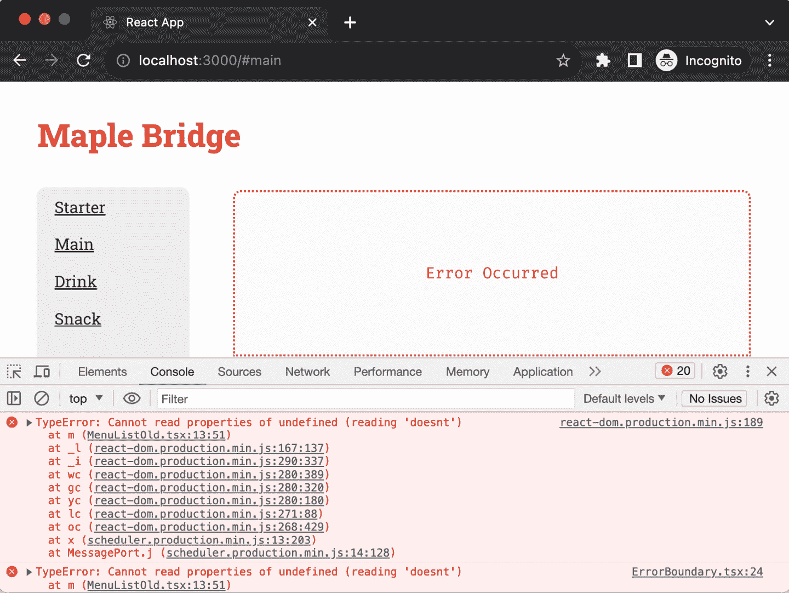

# 1

# 介绍 React 反模式

本书深入探讨了 React 反模式。反模式不一定是技术错误——代码最初通常可以正常工作——但尽管它可能最初看起来是正确的，随着代码库的扩展，这些反模式可能会变得有问题。

在我们浏览本书的过程中，我们将审查可能不符合最佳实践的代码示例；一些可能难以理解，而另一些则难以修改或扩展。虽然某些代码片段可能适用于较小的任务，但当规模扩大时，它们会失败。此外，我们将探索来自广阔软件世界的经过时间考验的模式和原则，并将它们无缝地编织到我们的前端讨论中。

我的目标是实用性。代码示例要么来自过去的项目，要么来自常见的领域，如购物车和用户资料组件，以减少你需要解码领域术语的需求。为了获得全面的视角，最后一章展示了详细的全过程示例，提供了一个更有组织和沉浸式的体验。

具体来说，在本章介绍中，我们将讨论构建高级 React 应用程序的复杂性，强调状态管理和异步操作如何模糊代码的清晰度。我们将列举常见的反模式，并简要介绍书中稍后详细介绍的补救策略。

在本章中，我们将涵盖以下主题：

+   理解构建 UI 的难度

+   理解状态管理

+   探索“不愉快路径”

+   探索 React 中的常见反模式

# 技术要求

已创建一个 GitHub 仓库来托管本书中讨论的所有代码。对于本章，你可以在 [`github.com/PacktPublishing/React-Anti-Patterns/tree/main/code/src/ch1`](https://github.com/PacktPublishing/React-Anti-Patterns/tree/main/code/src/ch1) 找到代码。

# 理解构建 UI 的难度

除非你正在构建一个简单的、文档式的网页——例如，一个没有高级 UI 元素（如搜索框或模态框）的基本文章——否则，网络浏览器提供的内置语言通常是不够的。*图 1.1* 展示了一个使用 **HTML**（**超文本标记语言**）的网站示例：


图 1.1：一个简单的 HTML 文档网站

然而，如今，大多数应用程序都比这个语言最初设计时更复杂，包含的元素也更多。

网页语言与人们日常遇到的 UI 体验之间的差异是巨大的。无论是票务预订平台、项目管理工具还是图片库，现代的 Web UI 非常复杂，而原生的 Web 语言并不容易支持它们。你可以走得更远来“模拟”UI 组件，如手风琴、切换开关或交互式卡片，但本质上，你仍在处理相当于文档的东西，而不是真正的 UI 组件。

在一个理想的世界里，构建用户界面将类似于与视觉 UI 设计师合作。像 C++ Builder 或 Delphi 这样的工具，或者更现代的替代品如 Figma，允许你将组件拖放到画布上，然后在任何屏幕上无缝渲染。但在网页开发中并非如此。例如，要创建一个自定义的搜索输入框，你需要将其包裹在额外的元素中，微调颜色，调整填充和字体，可能还需要添加一个图标以供用户指导。创建一个正好位于搜索框下方、宽度与其完全匹配的自动建议列表，通常比人们最初想象的要费时得多。

如**图 1.2**所示，一个网页可能非常复杂，表面上看起来根本不像一份文档，尽管页面的构建块仍然是纯 HTML：



图 1.2：Jira 问题视图

这张截图显示了 Jira 的问题视图，Jira 是一款流行的基于网络的项目管理工具，用于跟踪、优先排序和协调任务和项目。问题视图包含许多细节，例如问题的标题、描述、附件、评论和链接的问题。它还包含许多用户可以与之交互的元素，例如**分配给我**按钮、更改问题优先级的能力、添加评论等。

对于这样的 UI，你可能会期望有一个导航组件、一个下拉列表、一个手风琴等。表面上看起来，它们确实存在，如**图 1.2**所示。但实际上，它们并不是组件。相反，开发者们努力使用 HTML、CSS 和 JavaScript 来**模拟**这些组件。

既然我们已经浏览了 Web UI 开发中语言不匹配的问题，那么深入探讨表面之下的问题可能是有帮助的——前端应用程序中我们需要管理的不同状态。这将为我们提供即将到来的挑战的预览，并阐明为什么引入模式是解决这些问题的关键步骤。

# 理解状态管理

在现代前端开发中管理状态是一项复杂的任务。几乎每个应用程序都必须通过网络从远程服务器检索数据——我们可以称这些数据为**远程状态**。远程状态源自外部来源，通常是后端服务器或 API。这与本地状态形成对比，本地状态是在前端应用程序内部生成和管理的。

远程状态有许多阴暗面，如果你不密切关注它们，将会使前端开发变得困难。在这里，我将仅列出一些明显的考虑因素：

+   *异步性*：从远程源获取数据通常是一个异步操作。这增加了在时间上的复杂性，尤其是在你需要同步多个远程数据时。

+   *错误处理*：连接到远程源可能会失败，或者服务器可能会返回错误。为了提供流畅的用户体验，正确管理这些场景可能具有挑战性。

+   *加载状态*：在等待从远程源到达数据时，应用程序需要有效地处理“加载”状态。这通常涉及显示加载指示器或回退 UI（当请求组件不可用时，我们暂时使用默认的一个）。

+   *一致性*：保持前端状态与后端同步可能很困难，尤其是在实时应用或涉及多个用户更改同一数据的应用中。

+   *缓存*：将一些远程状态存储在本地可以提高性能，但也会带来自己的挑战，例如失效和过时。换句话说，如果远程数据被他人更改，我们需要一种机制来接收更新或重新获取数据以更新我们的本地状态，这引入了大量的复杂性。

+   *更新和乐观 UI*：当用户进行更改时，你可以乐观地更新 UI，假设服务器调用将成功。但如果它失败了，你需要一种方法来回滚前端状态中的这些更改。

这些只是远程状态的一些挑战。

当数据在前端立即存储和可访问时，你基本上会以线性方式思考。这意味着你以直接顺序访问和操作数据，一个操作紧随另一个操作，导致逻辑流程清晰且直接。这种思维方式与代码的同步性质相吻合，使得开发过程直观且易于遵循。

让我们比较一下渲染静态数据和远程数据所需的代码量。考虑一个在页面上显示引用列表的著名引用应用。

要渲染传入的引用列表，你可以将数据映射到 JSX 元素中，如下所示：

```js
function Quotes(quotes: string[]) {
  return (
    <ul>
      {quotes.map((quote, index) => <li key={index}>{quote}</li>)}
    </ul>
  );
}
```

注意

我们在这里使用`index`作为键，这对于静态引用来说是可行的。然而，通常最好避免这种做法。在实际场景中的动态列表中，使用索引可能导致渲染问题。

如果引用来自远程服务器，代码将变成如下所示：

```js
import React, { useState, useEffect } from 'react';
function Quotes() {
  const [quotes, setQuotes] = useState<string[]>([]);
  useEffect(() => {
    fetch('https://quote-service.com/quotes')
      .then(response => response.json())
      .then(data => setQuotes(data));
  }, []);
  return (
    <ul>
      {quotes.map((quote, index) => <li key={index}>{quote}</li>)}
    </ul>
  );
}
export default Quotes;
```

在这个 React 组件中，我们使用`useState`创建一个引用状态变量，初始设置为空数组。`useEffect` Hook 在组件挂载时从远程服务器获取引用。然后，它使用获取的数据更新引用状态。最后，组件渲染一个引用列表，遍历`quotes`数组。

不要担心，现在没有必要担心细节；我们将在下一章关于 React 必备知识的章节中深入探讨。

之前的代码示例显示了理想场景，但在现实中，异步调用有其自身的挑战。我们必须考虑在数据获取时显示什么，以及如何处理各种错误场景，例如网络问题或资源不可用。这些额外的复杂性可能会使代码更长且更难以理解。

例如，在获取数据时，我们会临时过渡到加载状态，如果出现任何问题，我们会切换到错误状态：

```js
function Quotes() {
  const [quotes, setQuotes] = useState<string[]>([]);
  const [isLoading, setIsLoading] = useState<boolean>(false);
  const [error, setError] = useState<Error | null>(null);
  useEffect(() => {
    setIsLoading(true);
    fetch('https://quote-service.com/quotes')
      .then(response => {
        if (!response.ok) {
          throw new Error('Failed to fetch quotes');
        }
        return response.json();
      })
      .then(data => {
        setQuotes(data);
      })
      .catch(err => {
        setError(err.message);
      })
      .finally(() => {
        setIsLoading(false);
      });
  }, []);
  return (
    <div>
      {isLoading && <p>Loading...</p>}
      {error && <p>Error: {error}</p>}
      <ul>
        {quotes.map((quote, index) => <li key={index}>{quote}</li>)}
      </ul>
    </div>
  );
}
```

代码使用 `useState` 管理三件状态：`quotes` 用于存储引用，`isLoading` 用于跟踪加载状态，`error` 用于任何获取错误。

`useEffect` 钩子触发了获取操作。如果获取成功，则显示引用并设置 `isLoading` 为 `false`。如果发生错误，则显示错误消息并将 `isLoading` 再次设置为 `false`。

如你所见，组件中实际渲染的部分相当小（即 `return` 中的 JSX 代码）。相比之下，管理状态几乎消耗了函数体的大部分。

但这只是状态管理的一个方面。还有管理本地状态的问题，这意味着状态只需要在组件内部维护。例如，如图*图 1**.3*所示，手风琴组件需要跟踪它是展开还是折叠的——当你点击标题上的三角形时，它会切换列表面板：



图 1.3：可展开的部分

当你的应用达到一个使状态跟踪变得困难的高度复杂度时，使用像 Redux 或 MobX 这样的第三方状态管理库可能会有所帮助。然而，使用第三方状态管理库并非没有其缺点（学习曲线、特定库的最佳实践、迁移努力等），因此应仔细考虑。这就是为什么许多开发者倾向于使用 React 内置的 Context API 进行状态管理。

现代前端应用中另一个显著的复杂性，许多开发者往往没有注意到，但它就像一座需要更密切关注的冰山，这就是“不愉快的路径”。让我们接下来看看这些内容。

# 探索“不愉快的路径”

当谈到 UI 开发时，我们通常主要关注“愉快的路径”——一切按计划进行的最佳用户体验。然而，忽视“不愉快的路径”可能会使你的 UI 比最初想象的要复杂得多。以下是一些可能导致不愉快路径并进而复杂化你的 UI 开发工作的场景。

## 来自其他组件抛出的错误

想象一下，你正在使用第三方组件，甚至在你的应用程序中使用另一个团队的组件。如果该组件抛出错误，它可能会破坏你的 UI 或导致你必须考虑的意外行为。这可能涉及添加条件逻辑或错误边界来优雅地处理这些错误，从而使你的 UI 比最初预期的更复杂。

例如，在一个渲染项目数据的`MenuItem`组件中，让我们看看当我们尝试访问传入的属性`item`中不存在的东西时会发生什么（在这种情况下，我们正在寻找名为`item.something.doesnt.exist`的属性）：

```js
const MenuItem = ({
  item,
  onItemClick,
}: {
  item: MenuItemType;
  onItemClick: (item: MenuItemType) => void;
}) => {
  const information = item.something.doesnt.exist;
  return (
    <li key={item.name}>
      <h3>{item.name}</h3>
      <p>{item.description}</p>
      <button onClick={() => onItemClick(item)}>Add to Cart</button>
    </li>
  );
};
```

`MenuItem`组件接收一个`item`对象和一个`onItemClick`函数作为属性。它显示项目的名称和描述，以及包含一个`onItemClick`函数被调用，并使用项目作为参数。

这段代码尝试访问一个不存在的属性，`item.something.doesnt.exist`，这将导致运行时错误。正如*图 1.4*所示，在后台服务返回一些意外数据后，应用程序停止工作：



图 1.4：渲染期间组件抛出的异常

如果我们不将错误隔离到一个**错误边界**中，这可能会导致整个应用程序崩溃，正如我们在*图 1.4*中看到的那样。4* – 菜单没有显示，但类别和页面标题仍然可用；受影响的区域，我用红色虚线标出，是菜单原本应该出现的地方。React 中的错误边界是一个特性，允许你捕获子组件中发生的 JavaScript 错误，记录这些错误，并显示一个回退 UI，而不是让整个应用程序崩溃。错误边界在渲染期间、生命周期方法和它们下面的整个树的构造函数中捕获错误。

在现实世界的项目中，你的 UI 可能依赖于各种微服务或 API 来获取数据。如果这些下游系统中的任何一个出现故障，你的 UI 必须对此做出反应。你需要设计回退方案、加载指示器或友好的错误消息，以指导用户下一步该做什么。有效地处理这些场景通常需要前端和后端逻辑，从而为你的 UI 开发任务增加另一层复杂性。

## 学习意外的用户行为

无论你如何完美地设计你的 UI，用户总会找到使用你的系统的方式，这是你没有预料到的。无论是他们在文本字段中输入特殊字符，尝试快速提交表单，还是使用干扰你网站的浏览器扩展，你必须设计你的 UI 来处理这些边缘情况。这意味着实现额外的验证、检查和安全措施，这些可能会使你的 UI 代码库变得复杂。

让我们考察一个基本的`Form`组件，以了解用户输入的考虑因素。虽然这个单字段表单可能需要在`handleChange`方法中添加额外的逻辑，但重要的是要注意，大多数表单通常由多个字段组成（这意味着我们需要考虑更多的意外用户行为）：

```js
import React, { ChangeEvent, useState } from "react";
const Form = () => {
  const [value, setValue] = useState<string>("");
  const handleChange = (event: ChangeEvent<HTMLInputElement>) => {
    const inputValue = event.target.value;
    const sanitizedValue = inputValue.replace(/[^\w\s]/gi, "");
    setValue(sanitizedValue);
  };
  return (
    <div>
      <form>
        <label>
          Input without special characters:
          <input type="text" value={value} onChange={handleChange} />
        </label>
      </form>
    </div>
  );
};
export default Form;
```

这个`Form`组件由一个单行文本输入字段组成，该字段限制输入为字母数字字符和空格。它使用一个`value`状态变量来存储输入字段的值。`handleChange`函数在每次输入更改时触发，在更新状态为清洗后的值之前，从用户的输入中删除任何非字母数字字符。

理解并有效地管理这些不愉快的路径对于创建一个强大、有弹性和用户友好的界面至关重要。这不仅使你的应用程序更加可靠，而且也有助于创造一个更全面和深思熟虑的用户体验。

我认为你现在应该对在 React 中构建现代前端应用程序的挑战有了更清晰的洞察。解决这些障碍并不简单，尤其是 React 没有提供明确的指南，说明应该采用哪种方法，如何构建你的代码库，管理状态，或者确保代码的可读性（以及由此带来的长期维护的便捷性），或者如何利用既定模式提供帮助，以及其他担忧。这种缺乏指导往往导致开发者创造出可能在短期内有效，但可能充满反模式的解决方案。

# 探索 React 中的常见反模式

在软件开发领域，我们经常遇到看似为特定问题提供有益解决方案的实践和方法。这些被标记为**反模式**的实践，可能提供即时的缓解或看似快速的修复，但它们通常隐藏了潜在的问题。随着时间的推移，依赖这些反模式可能导致更大的复杂性、低效，甚至可能是它们试图解决的问题。

认识和理解这些反模式对于开发者至关重要，因为它使他们能够预见潜在的陷阱，并避开那些可能长期产生反效果的解决方案。在接下来的章节中，我们将突出显示常见的反模式，并附上代码示例。我们将解决每个反模式，并概述可能的解决方案。然而，我们不会在这里深入探讨，因为整个章节都致力于详细讨论这些主题。

## **扩孔钻探**

在复杂的 React 应用程序中，管理状态并确保每个组件都能访问它所需的数据可能变得具有挑战性。这通常以**props 钻探**的形式出现，其中 props 从一个父组件通过多个中间组件传递，最终到达真正需要它们的子组件。

例如，考虑一个`SearchableList`、`List`和`ListItem`的层次结构——一个`SearchableList`组件包含一个`List`组件，而`List`包含多个`ListItem`实例：

```js
function SearchableList({ items, onItemClick }) {
  return (
    <div className="searchable-list">
      {/* Potentially some search functionality here */}
      <List items={items} onItemClick={onItemClick} />
    </div>
  );
}
function List({ items, onItemClick }) {
  return (
    <ul className="list">
      {items.map(item => (
        <ListItem key={item.id} data={item} onItemClick={onItemClick}
         />
      ))}
    </ul>
  );
}
function ListItem({ data, onItemClick }) {
  return (
    <li className="list-item" onClick={() => onItemClick(data.id)}>
      {data.name}
    </li>
  );
}
```

在这个设置中，`onItemClick`属性从`SearchableList`通过`List`最终传递到`ListItem`。尽管`List`组件没有使用这个属性，但它必须将其传递给`ListItem`。

这种方法可能导致复杂性增加和可维护性降低。当多个属性通过多个组件传递时，理解数据流和调试变得困难。

避免在 React 中传递属性钻取的一个潜在解决方案是利用上下文 API。它提供了一种在不需要在组件树中的每一层显式传递属性的情况下，在组件之间共享值（数据和函数）的方法。

## 组件内的数据转换

React 中的组件中心方法主要是将任务和关注点分解成可管理的块，从而提高可维护性。然而，一个常见的错误是开发者直接在组件内部引入复杂的数据转换逻辑。

尤其是处理外部 API 或后端时，通常会遇到数据形状或格式不适合前端的情况。而不是在更高层次或实用函数中调整这些数据，转换是在组件内部定义的。

考虑以下场景：

```js
function UserProfile({ userId }) {
  const [user, setUser] = useState(null);
  useEffect(() => {
    fetch(`/api/users/${userId}`)
      .then(response => response.json())
      .then(data => {
        // Transforming data right inside the component
        const transformedUser = {
          name: `${data.firstName} ${data.lastName}`,
          age: data.age,
          address: `${data.addressLine1}, ${data.city}, ${data.
           country}`
        };
        setUser(transformedUser);
      });
  }, [userId]);
  return (
    <div>
      {user && (
        <>
          <p>Name: {user.name}</p>
          <p>Age: {user.age}</p>
          <p>Address: {user.address}</p>
        </>
      )}
    </div>
  );
}
```

`UserProfile`函数组件根据提供的`userId`属性检索并显示用户的个人资料。一旦远程`data`被获取，它就在组件内部进行转换，以创建一个结构化的用户资料。这个转换后的数据包括用户的全名（名和姓的组合）、年龄和格式化的地址。

通过直接嵌入转换，我们遇到了一些问题：

+   *缺乏清晰度*：将数据获取、转换和渲染任务结合在一个组件中，使得难以准确指出组件的确切目的

+   *降低可复用性*：如果另一个组件需要相同或类似的转换，我们将重复逻辑

+   *测试挑战*：现在测试这个组件需要考虑转换逻辑，使得测试更加复杂

为了克服这种反模式，建议将数据转换从组件中分离出来。这可以通过使用实用函数或自定义钩子来实现，从而确保更干净和模块化的设计。通过外部化这些转换，组件保持专注于渲染，而业务逻辑保持集中，从而使得代码库更加易于维护。

## 视图中的复杂逻辑

现代前端框架，包括 React，的美妙之处在于明确的关注点分离。按照设计，组件应该对业务逻辑的复杂性一无所知，而应专注于呈现。然而，开发者经常遇到的一个常见问题是业务逻辑在视图组件中的注入。这不仅破坏了清晰的分离，还使组件膨胀，并使它们更难测试和重用。

考虑一个简单的例子。想象一个组件，其目的是显示从 API 获取的项目列表。每个项目都有一个价格，但我们想显示高于某个阈值价格的项目：

```js
function PriceListView({ items }) {
  // Business logic within the view
  const filterExpensiveItems = (items) => {
    return items.filter(item => item.price > 100);
  }
  const expensiveItems = filterExpensiveItems(items);
  return (
    <div>
      {expensiveItems.map(item => (
        <div key={item.id}>
          {item.name}: ${item.price}
        </div>
      ))}
    </div>
  );
}
```

在这里，`filterExpensiveItems` 函数，一段业务逻辑，直接位于视图组件中。现在，组件不仅要呈现数据，还要处理数据。

这种方法可能会出现问题：

+   *可重用性*：如果另一个组件需要类似的过滤器，逻辑就需要被复制。

+   *测试*：随着你不仅要测试渲染，还要测试业务逻辑，单元测试会变得更加复杂。

+   *维护*：随着应用程序的增长和逻辑的增加，这个组件可能会变得难以控制且难以维护。

为了确保我们的组件保持可重用性和易于维护，明智的做法是接受**关注点分离**原则。这个原则指出，软件中的每个模块或函数都应该负责应用程序功能的一个部分。通过将业务逻辑与表示层分离，并采用**分层架构**，我们可以确保代码的每一部分都处理其特定的责任，从而实现更模块化和易于维护的代码库。

## 缺乏测试

想象一下为在线商店构建购物车组件。购物车至关重要，因为它处理项目的添加、删除和总价计算。尽管这看起来可能很简单，但它包含了各种移动部件和逻辑连接。没有测试，你为未来的问题敞开了大门，比如价格计算错误、项目添加或删除不正确，甚至安全漏洞。

考虑这个购物车的简化版本：

```js
function ShoppingCart() {
  const [items, setItems] = useState([]);
  const addItem = (item) => {
    setItems([...items, item]);
  };
  const removeItem = (itemId) => {
    setItems(items.filter(item => item.id !== itemId));
  };
  const calculateTotal = () => {
    return items.reduce((total, item) => total + item.price, 0);
  };
  return (
    <div>
      {/* Render items and controls for adding/removing */}
      <p>Total: ${calculateTotal()}</p>
    </div>
  );
}
```

虽然这个购物车的逻辑看起来很简单，但潜在的问题正在潜伏。如果项目被错误地添加多次，或者价格动态变化，或者应用了折扣，会发生什么？如果没有测试，这些场景可能直到用户遇到它们才变得明显，这可能会对业务造成损害。

进入 `ShoppingCart` 组件，意味着要有测试来验证项目是否被正确添加或删除，总价计算是否适当调整，以及处理边缘情况，例如处理折扣等。只有在这些测试到位之后，才应该实现实际的组件逻辑。TDD（测试驱动开发）不仅仅是早期捕捉错误；它推崇结构良好、易于维护的代码。

对于 `ShoppingCart` 组件，采用 TDD（测试驱动开发）将需要确保项目按预期添加或删除，总计正确计算，并且边缘情况能够无缝处理。这样，随着应用程序的增长，基础 TDD 测试确保每次修改或添加都保持应用程序的完整性和正确性。

## 重复的代码

在许多代码库中，这是一种常见的景象——在应用程序的不同部分散布着相同或非常相似的代码块。重复的代码不仅膨胀了代码库，还引入了潜在的故障点。当发现错误或需要增强时，可能需要修改重复代码的每个实例，从而增加了引入错误的可能性。

让我们考虑两个组件，它们重复了相同的过滤逻辑：

```js
function AdminList(props) {
  const filteredUsers = props.users.filter(user => user.isAdmin);
  return <List items={filteredUsers} />;
}
function ActiveList(props) {
  const filteredUsers = props.users.filter(user => user.isActive);
  return <List items={filteredUsers} />;
}
```

**DRY**（不要重复自己）原则在这里发挥了作用。通过将常见逻辑集中到实用函数或 **HOCs**（高阶组件）中，代码变得更加易于维护和阅读，并且更不容易出错。对于这个例子，我们可以抽象过滤逻辑并重用它，确保单一的真实来源和更容易的更新。

## 责任过重的长组件

React 鼓励创建模块化、可重用的组件。然而，随着功能的增加，一个组件可能会迅速增大其规模和责任，变成一个难以驾驭的庞然大物。一个管理各种任务的长组件变得难以维护、理解和测试。

想象一个 `OrderContainer` 组件，它有一个庞大的属性列表，包括许多不同方面的责任：

```js
const OrderContainer = ({
  testID,
  orderData,
  basketError,
  addCoupon,
  voucherSelected,
  validationErrors,
  clearErrors,
  removeLine,
  editLine,
  hideOrderButton,
  hideEditButton,
  loading,
}: OrderContainerProps) => {
  //..
}
```

这样的组件违反了 `OrderContainer` 组件，并将支持逻辑分离到其他更小、更专注的组件中，或者利用 Hooks 进行逻辑分离。

注意

这些列出的反模式有不同的变体，我们将在接下来的章节中相应地讨论解决方案。除此之外，书中还将讨论一些更通用的设计原则和设计模式，以及一些经过验证的工程实践，例如重构和 TDD。

## 揭示我们破坏反模式的方法

当涉及到解决普遍的反模式时，一系列设计模式会浮出水面。**渲染属性**、HOCs（高阶组件）和 **Hooks** 等技术对于增强组件功能而不偏离其核心角色至关重要，同时利用分层架构和关注点分离等基础模式确保代码库的流畅性，以连贯的方式界定逻辑、数据和展示。这些实践不仅提高了 React 应用的可持续性，还为开发者之间的有效团队合作奠定了基础。

同时，**面向接口的编程**在本质上专注于定制以软件模块之间的交互为中心的软件，主要通过接口进行。这种做法促进了敏捷性，使软件模块不仅更加连贯，而且易于修改。另一方面，**无头组件**范式体现了这样的组件，尽管它们没有直接的渲染职责，但负责管理状态或逻辑。这些组件将接力棒传递给它们的消费者，以进行 UI 渲染，从而倡导适应性和可重用性。

通过牢固掌握这些设计模式并明智地部署它们，我们能够避免常见的错误，从而提升我们 React 应用程序的档次。

此外，在编码生态系统中，TDD（测试驱动开发）和持续重构这两大支柱成为提升代码质量的强大工具。TDD 以其“先测试后编码”的明确号召，为潜在的不一致提供了即时反馈循环。与 TDD 携手并进，持续重构的伦理确保代码始终得到优化和精炼。这些方法不仅为代码卓越设定了基准，还培养了应对未来变化的适应性。

随着我们探索重构的领域，深入理解这些技术的本质，辨别它们的复杂性和最佳应用点至关重要。利用这些重构途径有望增强代码的清晰度、可持续性和整体效率。这正是本书将贯穿始终的内容！

# 摘要

在本章中，我们探讨了 UI 开发的挑战，从其复杂性到状态管理问题，我们也讨论了由于其复杂性的本质而产生的常见反模式，并简要介绍了我们的方法，该方法结合了最佳实践和有效的测试策略。这为更高效和稳健的前端开发奠定了基础。

在下一章中，我们将深入探讨 React 基础知识，为您提供掌握这个强大库所需的技术和知识。敬请期待！
