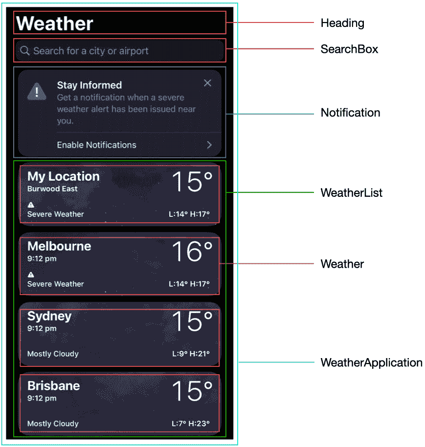
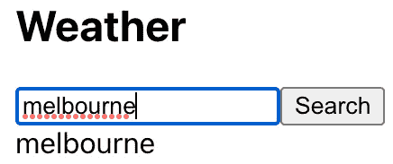
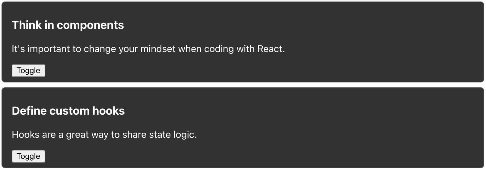

# 第二章：理解 React 基础知识

欢迎来到我们 React 基础知识指南的基本章节！本章为您进入激动人心的 React 开发世界奠定了坚实的基础。我们将深入探讨 React 的基本概念，并为您提供启动 React 项目所需的基本知识，让您有信心地开始。

在本章中，我们将探讨如何以组件的方式思考，这是构建可重用和模块化**用户界面**（**UIs**）的关键心态。您将学习将应用程序分解成更小、自包含组件的艺术，从而能够创建可维护和可扩展的代码库。通过理解这一基本概念，您将具备构建强大和灵活的 React 应用程序的技能。

此外，我们还将向您介绍 React 中最常用的 Hooks，例如`useState`、`useEffect`等。这些 Hooks 是强大的工具，允许您在函数组件中管理状态、处理副作用，并访问 React 的生命周期方法。通过掌握这些 Hooks，您将能够轻松地创建动态和交互式的 UI。

到本章结束时，您将准备好探索更高级的主题，并在指南的后续章节中应对真实的 React 挑战。所以，系好安全带，准备好开始一段激动人心的 React 世界之旅。

因此，在本章中，我们将涵盖以下主题：

+   理解 React 中的静态组件

+   使用属性创建组件

+   将 UI 分解为组件

+   在 React 中管理内部状态

+   理解渲染过程

+   探索常见的 React Hooks

# 技术要求

已创建一个 GitHub 仓库来托管本书中讨论的所有代码。对于本章，您可以在[`github.com/PacktPublishing/React-Anti-Patterns/tree/main/code/src/ch2`](https://github.com/PacktPublishing/React-Anti-Patterns/tree/main/code/src/ch2)找到它。

# 理解 React 中的静态组件

React 应用程序是基于组件构建的。一个**组件**可以从一个简单的返回 HTML 片段的函数到更复杂的组件，它可以与网络请求交互，动态生成 HTML 标签，甚至根据后端服务的变化自动刷新。

让我们从基本场景开始，定义一个**静态组件**。在 React 中，静态组件（也称为展示组件或哑组件）指的是没有状态且不与数据交互或处理任何事件的组件。它是一个仅根据接收到的属性渲染 UI 的组件。以下是一个示例：

```js
const StaticArticle = () => {
  return (
    <article>
      <h3>Think in components</h3>
      <p>It's important to change your mindset when coding with 
       React.</p>
    </article>
  );
};
```

这个静态组件与相应的 HTML 片段非常相似，它使用`<article>`标签来结构化带有标题和段落的内联内容：

```js
<article>
  <h3>Think in components</h3>
  <p>It's important to change your mindset when coding with React.</p>
</article>
```

虽然在组件中封装静态 HTML 很有用，但可能需要组件代表不同的文章，而不仅仅是特定的某篇。就像我们传递参数给函数以使其更灵活一样，我们也可以将参数传递给组件，使其在不同的上下文中有用。这可以通过 props 来实现，我们将在下一节中讨论。

# 使用属性创建组件

在 React 中，组件可以通过属性接收输入，这些属性通常被称为 props。**Props**允许我们将数据从父组件传递到子组件。这种机制使得组件可以重用和适应，因为它们可以接收不同的 props 集合来定制其行为和外观。

Props 本质上是由键值对组成的 JavaScript 对象，其中键代表属性名，值包含相应的数据。这些属性可以包括各种类型的数据，如字符串、数字、布尔值，甚至是函数。

通过向组件传递 props，我们可以动态地控制其渲染和行为。这使我们能够创建灵活且可组合的组件，可以轻松组合在一起来构建复杂的 UI。

现在，让我们超越静态组件，看看我们如何通过使用 props 使其更具通用性。假设我们想要显示一系列博客文章，每篇都有标题和摘要。在 HTML 中，我们会手动编写 HTML 片段。然而，使用 React 组件，我们可以使用 JavaScript 动态生成这些 HTML 片段。

首先，让我们从基本结构开始：

```js
type ArticleType = {
  heading: string;
  summary: string;
};
const Article = ({ heading, summary }: ArticleType) => {
  return (
    <article>
      <h3>{heading}</h3>
      <p>{summary}</p>
    </article>
  );
};
```

然后，我们可以将所需的`heading`和`summary`值传递给`Article`组件：

```js
<Article
  heading="Think in components"
  summary="It's important to change your mindset when coding with React."
/>
```

或者，我们可以定义另一个`Article`组件：

```js
<Article
  heading="Define custom hooks"
  summary="Hooks are a great way to share state logic."
/>
```

通过使用属性，当我们使用`Article`组件时，我们可以向`heading`和`summary`属性传递不同的值。这使得组件更加灵活和可重用，因为它可以根据提供的属性显示具有不同标题和摘要的各种文章。

Props 是 React 中的一个基本概念，它允许我们自定义和配置组件，使它们具有动态性和适应性，以适应不同的数据或需求。

一个组件可以有任意数量的属性，尽管建议将它们保持在可管理的数量，最好不超过五到六个。这有助于保持清晰和可理解性，因为属性过多会使组件更难理解和扩展。

# 将 UI 分解为组件

让我们考察一个更复杂的 UI，并探讨如何将其分解为组件并单独实现。在这个例子中，我们将使用一个天气应用程序：



图 2.1：天气应用程序

整个应用程序可以定义为一个`WeatherApplication`组件，它包括几个子组件：

```js
const WeatherApplication = () => {
  return (
    <>
      <Heading title="Weather" />
      <SearchBox />
      <Notification />
      <WeatherList />
    </>
  );
};
```

每个子组件可以执行各种任务，例如从远程服务器获取数据、条件性地渲染下拉列表或定期自动刷新。

例如，一个`SearchBox`组件可能有以下结构：

```js
const SearchBox = () => {
  return (
    <div className="search-box">
      <input type="text" />
      <button>Search</button>
      <div className="search-results" />
    </div>
  );
};
```

只有在从搜索查询获取数据时，`search-results`部分才会出现。

另一方面，一个`Weather`组件可能更简单，渲染传递给它的任何内容：

```js
type WeatherType = {
  cityName: string;
  temperature: number;
  weather: string;
};
const Weather = ({ cityName, temperature, weather }: WeatherType) => {
  return (
    <div>
      <span>{cityName}</span>
      <span>{temperature}</span>
      <span>{weather}</span>
    </div>
  );
};
```

在实际场景中实现组件时，注意样式并细致地完善 HTML 结构至关重要。此外，组件应有效地管理自己的状态，确保渲染的一致性和响应性。

通过掌握组件及其在 React 中的适当结构化概念，您可以构建动态和可重用的 UI 元素，这些元素有助于您应用程序的整体功能和组织。

在您的 React 开发之旅中不断进步时，不要忘记通过样式美化视觉呈现，并考虑有效的状态管理技术来提高组件的性能和交互性。

一个完整的`Weather`组件可能如下所示：

```js
type Weather = {
  main: string;
  temperature: number;
}
type WeatherType = {
  name: string;
  weather: Weather;
}
export function WeatherCard({ name, weather }: WeatherType) {
  return (
    <div className={`weather-container ${weather.main}`}>
      <h3>{name}</h3>
      <div className="details">
        <p className="temperature">{weather.temperature}</p>
        <div className="weather">
          <span className="weather-category">{weather.main}</span>
        </div>
      </div>
    </div>
  );
}
```

代码片段定义了两种类型：`Weather`和`WeatherType`。`Weather`类型表示带有两个属性（`main`（字符串）和`temperature`（数字））的天气数据。`WeatherType`类型表示特定位置的天气数据结构，具有一个`name`属性（字符串）用于位置名称和一个`weather`属性，该属性为`Weather`类型。

`WeatherCard`组件接收`WeatherType`类型的名称和天气属性。在组件内部，它渲染一个基于`weather.main`值的动态类别的`div`容器。

当处理复杂的 UI 时，将它们分解成更小、更易于管理的组件至关重要。每个组件应代表一个独立的概念，并且可以使用**JSX**（**JavaScript 扩展**）将它们组合在一起，类似于编写 HTML 代码。虽然 props 对于向组件传递数据很有用，但有时我们需要在组件内部本身维护数据。这就是状态发挥作用的地方，它允许我们内部管理和更新数据。

# 在 React 中管理内部状态

**状态**在 React 中指的是组件可以持有和管理的内部数据。它允许组件存储和更新信息，从而实现动态 UI 更新、交互性和数据持久性。状态是 React 中的一个基本概念，有助于构建响应性和交互式应用程序。

应用程序具有各种状态类型，例如用于切换状态的布尔值、用于网络请求的加载状态，或用于查询的用户输入字符串。我们将探索 `useState` 钩子，它非常适合在组件的重新渲染之间维护本地状态。React **Hooks** 是在 React 16.8 中引入的一个特性，它使函数组件能够拥有状态和生命周期特性（我们将在后面的 *探索常见 React Hooks* 部分更详细地讨论 Hooks）。

让我们从使用一个简单的钩子来管理内部状态开始，以了解它是如何在一个组件内维护数据的。例如，以下 `SearchBox` 组件可以这样实现：

```js
const SearchBox = () => {
  const [query, setQuery] = useState<string>();
  const handleChange = (e: ChangeEvent<HTMLInputElement>) => {
    const value = e.target.value;
    setQuery(value);
  };
  return (
    <div className="search-box">
      <input type="text" value={query} onChange={handleChange} />
      <button>Search</button>
      <div className="search-results">{query}</div>
    </div>
  );
};
```

代码片段展示了 `SearchBox` 包含一个输入字段、一个搜索按钮和一个用于显示搜索结果的显示区域。`useState` 钩子用于创建一个名为 `query` 的状态变量，初始化为空字符串。`handleChange` 函数捕获用户的输入并相应地更新查询状态。然后，`component` 渲染输入字段，显示 `query` 的当前值，一个搜索按钮，以及一个用作容器显示搜索结果的 `div` 标签。

注意这里，`useState` 钩子被用于在 `SearchBox` 组件中管理状态：

```js
const [query, setQuery] = useState<string>("");
```

让我们更具体地解释一下这段代码：

+   `useState<string>("")`：这一行声明了一个名为 `query` 的状态变量，并用空字符串（`""`）初始化它

+   `const [query, setQuery]`：这个语法使用数组解构将状态变量（`query`）及其相应的更新函数（`setQuery`）分配给具有相同名称的变量

现在，我们已经有了状态和绑定到输入框的设置函数。当我们输入城市名称到输入框时，`search-results` 区域会自动更新，同时输入值也会更新。尽管在我们输入时会发生多次重新渲染，但状态值在整个过程中保持不变：



图 2.2：使用 useState 管理状态

`useState` 钩子非常适合管理内部状态，但在现实世界的项目中，经常需要处理各种其他状态类型。随着应用程序的扩展，管理跨多个组件共享的全局级数据，例如从父组件到子组件，变得必要。我们将在后面的章节中讨论这种状态管理的不同机制。

现在我们已经了解了如何通过 props 和状态来创建动态组件，那么探索数据变化如何影响 React 中的渲染过程就变得很重要了。通过理解这个过程，我们可以采取措施来优化我们的代码，以提高效率和性能。

# 理解渲染过程

当一个 React 组件依赖的数据发生变化时，无论是通过更新的 props 还是修改的状态，React 都需要更新 UI 以反映这些变化。这个过程被称为 **渲染**，它由以下步骤组成：

+   **初始渲染**：当函数组件首次渲染时，它生成组件 UI 的虚拟表示。这个虚拟表示描述了 UI 元素的结构和内容。

+   **状态和属性变化**：当组件的状态或属性发生变化时，React 重新评估组件的函数体。它执行 diffing 算法来比较之前和新的函数体，确定它们之间的差异。

注意

在 React 中，**diffing** 算法是一个内部机制，它比较组件之前和新的虚拟 **文档对象模型**（**DOM**）表示，并确定更新实际 DOM 所需的最小更改集。

+   **协调**：React 根据在 diffing 过程中识别出的差异确定 UI 需要更新的部分。它只更新 UI 的特定部分，保持其余部分不变。

+   **重新渲染**：React 通过更新 UI 的虚拟表示来重新渲染组件。它根据更新的函数体生成新的虚拟 DOM，替换之前的虚拟 DOM。

+   **DOM 更新**：最后，React 高效地更新实际的 DOM 以反映虚拟 DOM 的变化。它应用必要的 DOM 操作，如添加、删除或更新元素，使 UI 反映更新的状态和属性。

此过程确保 UI 与组件的状态和属性保持同步，实现响应式和动态的 UI。React 的高效渲染方法最小化了不必要的 DOM 操作，并在函数组件中提供高性能的渲染体验。

在这本书中，我们将探讨编写高性能代码至关重要的场景，确保组件仅在必要时重新渲染，同时保留未更改的部分。实现这一点需要有效地利用 Hooks 并采用各种技术来优化渲染。

在应用程序中，数据管理至关重要，但我们也会遇到副作用，如网络请求、DOM 事件以及组件间数据共享的需求。为了应对这些挑战，React 提供了一系列常用的 Hooks，它们是构建应用程序的强大工具。让我们探索这些 Hooks 并看看它们如何极大地帮助我们开发过程。

# 探索常见的 React Hooks

我们在 *管理 React 中的内部状态* 部分简要介绍了 Hooks。此外，Hooks 允许代码重用，提高可读性，并通过分离关注点使组件逻辑更模块化，从而简化测试。

在本节中，让我们讨论一些最常见的 Hooks。请注意，在本章中，我们专注于最常用的 Hooks。随着我们阅读本书的进展，我们将深入探讨这些 Hooks 的更多高级应用。关于最后一个 Hook，`useContext`，我们将在本节末尾初步探讨其基本用法，以提供入门级理解。在后面的章节中，我们将更复杂地使用 `useContext`，以便更深入和更实际地掌握其功能。

## useState

我们在本章中已经看到了 `useState` Hook 的基本用法。你可以在组件内部定义任意多的状态，这在实际项目中非常常见。例如，一个登录表单可能包括用户名、密码以及一个 **记住我** 标志。在用户点击提交（**登录**）按钮之前，所有这些状态都需要被记住：


图 2.3：登录表单

根据用户界面，我们需要为用户名、密码以及一个表示 **记住我** 的布尔标志准备三个不同的状态，如下所示：

```js
const Login = () => {
  const [username, setUsername] = useState<string>("");
  const [password, setPassword] = useState<string>("");
  const [rememberMe, setRememberMe] = useState<boolean>(false);
  return (
    <div className="login-form">
      <div className="field">
        <input
          type="text"
          value={username}
          onChange={(event) => setUsername(event.target.value)}
          placeholder="Username"
        />
      </div>
      <div className="field">
        <input
          type="password"
          value={password}
          onChange={(event) => setPassword(event.target.value)}
          placeholder="Password"
        />
      </div>
      <div className="field">
        <label>
          <input
            type="checkbox"
            checked={rememberMe}
            onChange={(event) => setRememberMe(event.target.checked)}
          />
          Remember Me
        </label>
      </div>
      <div className="field">
        <button>Login</button>
      </div>
    </div>
  );
};
```

在代码片段中，我们必须管理三个不同的状态，因此使用 `useState` Hook 来管理 `username`、`password` 和 `rememberMe` 字段的状态。组件渲染用户名和密码的输入字段、一个用于 **记住我** 的复选框以及一个 **登录** 按钮。用户输入更新相应的状态变量，从而捕获表单数据。

## useEffect

在 React 中，副作用指的是任何与渲染组件直接无关但影响组件范围外代码的代码。副作用通常涉及与外部资源交互，例如进行 API 调用、修改底层 DOM（不使用正常的 React 虚拟 DOM）、订阅事件监听器或管理计时器。

React 提供了一个名为 `useEffect` 的内置 Hook，用于在函数组件中处理副作用。`useEffect` Hook 允许你在渲染后或特定依赖项更改时执行副作用。

通过使用 `useEffect` Hook，你可以确保在组件的生命周期中适当的时间执行副作用。这有助于保持应用程序的一致性和完整性，同时将副作用与核心渲染逻辑分离。

让我们看看 `useEffect` 的一个典型用法。我们在 *使用属性创建组件* 部分创建了一个 `Article` 组件；现在，让我们制作一个文章列表。通常，文章列表可以从一些 API 调用中返回；例如，以 JSON 格式。我们可以使用 `useEffect` Hook 在 API 调用返回响应后发送请求并设置状态，如下所示：

```js
const ArticleList = () => {
  const [articles, setArticles] = useState<ArticleType[]>([]);
  useEffect(() => {
    const fetchArticles = async () => {
      fetch("/api/articles")
        .then((res) => res.json())
        .then((data) => setArticles(data));
    };
    fetchArticles();
  }, []);
  return (
    <div>
      {articles.map((article) => (
        <Article heading={article.heading} summary={article.summary} 
         />
      ))}
    </div>
  );
};
```

代码片段展示了在 React 函数组件中使用 `useEffect` Hook 的用法。让我们分解一下：

+   `useEffect(() => { ... }, []);`：这一行声明了`useEffect`钩子，并提供了两个参数。第一个参数是一个回调函数，其中包含要执行的副作用代码。第二个参数是一个依赖项数组，它决定了何时触发副作用。一个空数组`[]`表示副作用应该只在初始渲染期间运行一次。

+   `const fetchArticles = async () => { ... }`：这一行声明了一个名为`fetchArticles`的异步函数。在这个函数内部，对`/api/articles`端点进行了 API 调用以获取数据。

+   `fetch("/api/articles")...`：这一行使用`fetch`函数向指定的 API 端点发出`GET`请求。然后使用承诺（`then`）处理响应，以提取 JSON 数据。

+   `setArticles(data)`：这一行使用`setArticles`函数更新组件的状态变量`articles`，使用检索到的数据。这将触发组件使用更新后的数据重新渲染。

+   `fetchArticles()`：这一行调用了`fetchArticles`函数，触发了 API 调用并更新了文章的状态。

一旦我们有了这些文章，我们就可以使用`array.map`集合 API 生成文章列表。

值得注意的是，当严格模式开启时，在开发过程中，React 会在实际设置之前额外运行一次设置和清理。实际上，你可以将整个应用程序包裹在 React 的内置组件`StrictMode`中，这样你的组件将额外渲染一次以查找由不纯渲染引起的错误以及其他检查。

此外，请注意`useEffect`的第二个参数是关键的。我们之前使用了一个空数组，因为我们不希望每次都触发效果，但有些情况下我们希望在依赖项之一发生变化时执行效果。

例如，假设我们有一个`ArticleDetail`组件，每当文章的`id`属性发生变化时，我们需要重新获取数据并重新渲染：

```js
const ArticleDetail = ({ id }: { id: string }) => {
  const [article, setArticle] = useState<ArticleType>();
  useEffect(() => {
    const fetchArticleDetail = async (id: string) => {
      fetch(`/api/articles/${id}`)
        .then((res) => res.json())
        .then((data) => setArticle(data));
    };
    fetchArticleDetail(id);
  }, [id]);
  return (
    <div>
      {article && (
        <Article heading={article.heading} summary={article.summary} 
         />
      )}
    </div>
  );
};
```

在`useEffect`钩子内部，定义了`fetchArticleDetail`函数来处理 API 调用。它根据提供的`id`属性获取文章详情，将响应转换为 JSON，并使用`setArticle`更新文章状态。

当`id`属性发生变化时，效果被触发。在成功检索到文章数据后，`Article`组件将使用文章状态中的`heading`和`summary`属性进行渲染。

`useEffect`钩子处理副作用的一个基本特性是清理机制。当使用`useEffect`时，建议返回一个清理函数，React 将在组件卸载时调用它。例如，如果你在`useEffect`中设置了一个计时器，你应该提供一个函数来清除这个计时器作为返回值。这确保了适当的资源管理，并防止了应用程序中潜在的内存泄漏。

例如，假设我们有一个组件需要在初始渲染后 1 秒执行一个效果，如下所示：

```js
const Timer = () => {
  useEffect(() => {
    const timerId = setTimeout(() => {
      console.log("time is up")
    }, 1000);
    return () => {
      clearTimeout(timerId)
    }
  }, [])
  return <div>Hello timer</div>
}
```

因此，在`Timer`组件中，`useEffect` Hook 被用来处理副作用。当组件挂载时，设置一个`setTimeout`函数，在延迟`1000`毫秒后记录消息`time is up`。然后`useEffect` Hook 返回一个清理函数以防止内存泄漏。这个清理函数使用`clearTimeout`在组件卸载时清除由`timerId`标识的计时器。

对于`ArticleDetail`示例，带有清理函数的完整版本可能如下所示：

```js
useEffect(() => {
  const controller = new AbortController();
  const signal = controller.signal;
  const fetchArticleDetail = async (id: string) => {
    fetch(`/api/articles/${id}`, { signal })
      .then((res) => res.json())
      .then((data) => setArticle(data));
  };
  fetchArticleDetail(id);
  return () => {
    controller.abort();
  };
}, [id]);
```

在此代码片段中，使用`useEffect` Hook 在组件内部使用`AbortController`组件来管理网络请求的生命周期。当组件挂载时，`useEffect` Hook 被触发，创建一个新的`AbortController`实例并提取其信号。这个信号被传递给`fetch`函数，将请求链接到控制器。

如果组件在请求完成之前卸载，则会调用清理函数，使用控制器的`abort`方法取消正在进行的获取请求。这可以防止潜在的更新已卸载组件的状态等问题，确保更好的性能并避免内存泄漏。

现在，让我们将注意力转向另一个关键的 Hook，它通过防止在重新渲染期间创建不必要的函数来提高性能。

## useCallback

React 中的`useCallback` Hook 用于记忆化和优化回调函数的创建。它在将回调传递给子组件或在其他 Hooks 中将回调作为依赖项时特别有用。您可以在以下操作中看到它的作用：

```js
const memoizedCallback = useCallback(callback, dependencies);
```

`useCallback` Hook 接受两个参数：

+   `callback`：这是您想要记忆化的函数。它可以是内联函数或函数引用。

+   `dependencies`：这是一个数组，包含记忆化回调所依赖的依赖项。如果任何依赖项发生变化，回调将被重新创建。

让我们探索一个实际例子。我们需要一个编辑器组件来修改文章的摘要。每当用户输入一个字符时，摘要需要更新，触发重新渲染。然而，这种重新渲染可能会导致每次创建一个新的函数，这可能会影响性能。为了减轻这种情况，我们可以利用`useCallback` Hook 来优化渲染过程并避免不必要的函数重新创建：

```js
const ArticleEditor = ({ id }: { id: string }) => {
  const submitChange = useCallback(
    async (summary: string) => {
      try {
        await fetch(`/api/articles/${id}`, {
          method: "POST",
          body: JSON.stringify({ id, summary }),
          headers: {
            "Content-Type": "application/json",
          },
        });
      } catch (error) {
        // handling errors
      }
    },
    [id]
  );
  return (
    <div>
      <ArticleForm onSubmit={submitChange} />
    </div>
  );
};
```

在`ArticleEditor`组件中，使用`useCallback`来记忆化`submitChange`函数，该函数异步使用`fetch` API 发送`POST`请求以更新文章。这种使用`useCallback`的优化确保了只有当`id`属性改变时，`submitChange`才会被重新创建，通过减少不必要的重新计算来提高性能。

组件随后渲染`ArticleForm`，将`submitChange`作为属性传递以处理表单提交：

```js
const ArticleForm = ({ onSubmit }: { onSubmit: (summary: string) => void }) => {
  const [summary, setSummary] = useState<string>("");
  const handleSubmit = (e: FormEvent) => {
    e.preventDefault();
    onSubmit(summary);
  };
  const handleSummaryChange = useCallback(
    (event: ChangeEvent<HTMLTextAreaElement>) => {
      setSummary(event.target.value);
    },
    []
  );
  return (
    <form onSubmit={handleSubmit}>
      <h2>Edit Article</h2>
      <textarea value={summary} onChange={handleSummaryChange} />
      <button type="submit">Save</button>
    </form>
  );
};
```

`ArticleForm` 使用 `useState` 钩子来跟踪摘要状态。当表单提交时，`handleSubmit` 阻止默认表单操作，并使用当前摘要调用 `onSubmit`。`handleSummaryChange` 函数通过 `useCallback` 优化，根据 `textarea` 输入更新摘要状态。这种使用 `useCallback` 的方法确保函数在每次渲染时不会不必要地重新创建，从而提高性能。

## React Context API

**React Context API** 是一个功能，允许您直接通过组件树传递数据，而无需在每一级手动传递属性。当您的应用程序具有许多组件共享的全局数据，或者当您需要通过不需要数据的组件传递数据时，这非常有用。

例如，假设我们正在创建一个应用程序，该应用程序包括根据当前时间（例如，如果是白天，我们使用浅色模式）的深色或浅色主题。我们需要在根级别设置主题。

因此，首先，我们定义一个类型 `ThemeContextType` 并创建一个该类型的上下文实例 `ThemeContext`：

```js
import React from "react";
export type ThemeContextType = {
  theme: "light" | "dark";
};
export const ThemeContext = React.createContext<ThemeContextType | undefined>(
  undefined
);
```

然后，我们创建一个 `ThemeProvider` 组件，该组件将使用 React 状态来管理当前主题：

```js
import React, { useState } from "react";
import { ThemeContext, ThemeContextType } from "./ThemeContext";
export const ThemeProvider = ({ children }) => {
  const [theme, setTheme] = useState<"light" | "dark">("light");
  const value: ThemeContextType = { theme };
  return (
    <ThemeContext.Provider value={value}>{children}</ThemeContext.Provider>
  );
};
```

最后，我们可以在我们的应用程序中使用 `ThemeProvider` 组件：

```js
import React from "react";
import { ThemeProvider } from "./ThemeProvider";
import App from "./App";
const Root = () => {
  return (
    <ThemeProvider>
      <App />
    </ThemeProvider>
  );
};
export default Root;
```

在我们应用程序的任何组件中，我们现在都可以访问当前主题：

```js
import React, { useContext } from "react";
import { ThemeContext } from "./ThemeContext";
const ThemedComponent = () => {
  const context = useContext(ThemeContext);
  const { theme } = context;
  return <div className={theme}>Current Theme: {theme}</div>;
};
export default ThemedComponent;
```

在这种设置中，`ThemeContext` 将当前主题提供给任何对其感兴趣的应用程序树中的组件。主题存储在 `ThemeProvider` 组件的状态变量中，它是应用程序的根组件。

提供的代码可能不会提供很多实用性，因为主题无法修改。然而，通过利用 Context API，您可以定义一个修改器，允许子节点更改状态。这种机制对于数据共享非常有用，使其成为一个有价值的工具。让我们稍微修改一下上下文接口：

```js
type Theme = {
  theme: "light" | "dark";
  toggleTheme: () => void;
};
const ThemeContext = React.createContext<Theme>({
  theme: "light",
  toggleTheme: () => {},
});
```

我们在上下文中添加了一个 `toggleTheme` 函数，以便组件在需要时可以修改 `theme` 值。

要实现提供者，我们可以使用 `useState` 钩子来定义内部状态。通过暴露设置函数，子组件可以利用它来更新主题的值：

```js
const ThemeProvider = ({ children }: { children: ReactNode }) => {
  // default theme is light
  const [theme, setTheme] = useState<"light" | "dark">("light");
  const toggleTheme = useCallback(() => {
    setTheme((prevTheme) => (prevTheme === "light" ? "dark" : "light"));
  }, []);
  return (
    <ThemeContext.Provider value={{ theme, toggleTheme }}>
      {children}
    </ThemeContext.Provider>
  );
};
```

然后，在调用位置，使用 `useContext` 钩子访问上下文中的值是直接的：

```js
const Article = ({ heading, summary }: ArticleType) => {
  const { theme, toggleTheme } = useContext(ThemeContext);
  return (
    <article className={theme}>
      <h3>{heading}</h3>
      <p>{summary}</p>
      <button onClick={toggleTheme}>Toggle</button>
    </article>
  );
};
```

然后，每次我们点击 **切换** 按钮时，它将更改主题并触发重新渲染：



图 2.4：使用主题上下文

在 React 中，Context API 允许您创建和管理可以在整个应用程序中访问的全局状态。这种能力使您能够组合多个上下文提供者，每个提供者代表应用程序状态的不同部分或方面。

通过使用单独的上下文提供者，例如用于安全性的一个，用于日志记录的另一个，以及可能的其他提供者，您可以有效地组织和共享相关数据和功能。每个上下文提供者封装了特定的关注点，这使得管理并更新相关状态变得更加容易，而不会影响应用程序的其他部分：

```js
import InteractionContext from "xui/interaction-context";
import SecurityContext from "xui/security-context";
import LoggingContext from "xui/logging-context";
const Application = ({ children }) => {
  const context = {}; // ... define values for context
  //... define securityContext
  //... define loggingContext
  return (
    <InteractionContext.Provider value={context}>
      <SecurityContext.Provider value={securityContext}>
        <LoggingContext.Provider value={loggingContext}>
          {children}
        </LoggingContext.Provider>
      </SecurityContext.Provider>
    </InteractionContext.Provider>
  );
};
```

这个例子演示了在应用程序组件中使用 React 的 Context API 创建和组合多个上下文提供者的用法。`InteractionContext.Provider`、`SecurityContext.Provider` 和 `LoggingContext.Provider` 用于包装子组件并提供相应的上下文值。

React 中还有几个其他内置的 Hooks，使用频率较低。在接下来的章节中，我们将根据需要介绍这些 Hooks，重点关注与当前主题最相关的那些。

# 摘要

在本介绍性章节中，我们介绍了 React 的基本概念，并为您的 React 开发之旅奠定了基础。我们探讨了组件化思维的概念，强调了将应用程序拆分为可重用和模块化部分的重要性。通过采用这种思维方式，您将能够创建可维护和可扩展的代码库。

此外，我们向您介绍了 React 中最常用的 Hooks，如 `useState` 和 `useEffect`，这些 Hooks 使您能够在函数组件中高效地管理状态和处理副作用。这些 Hooks 提供了灵活性和强大的功能，以构建动态和交互式的用户界面。

通过掌握 React 的基本原理并熟悉组件化思维的概念，您现在已为深入 React 开发世界做好了充分准备。在接下来的章节中，我们将探讨更多高级主题并解决现实世界的挑战，使您能够成为一名熟练的 React 开发者。

记住——React 是一个强大的工具，它为创建现代且健壮的 Web 应用程序打开了无限可能。在接下来的章节中，我们将深入探讨将设计拆分为更小组件的过程，并探讨组织这些组件的有效策略。我们将强调重用性和灵活性，确保我们的组件能够适应未来的变化。
