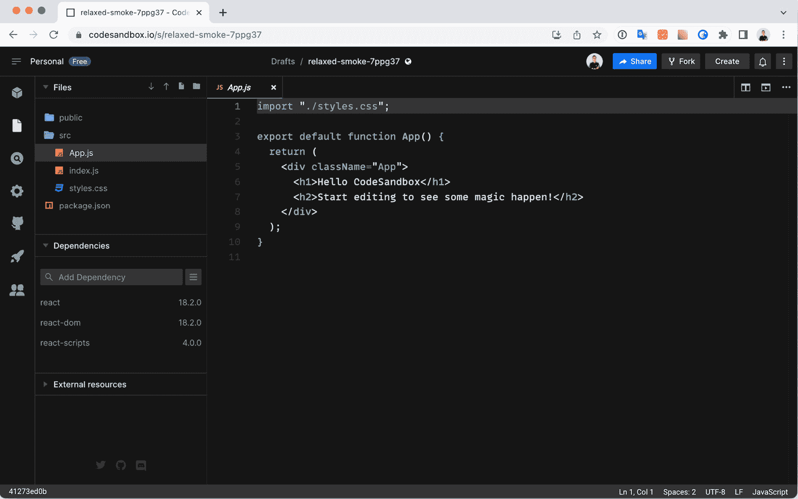
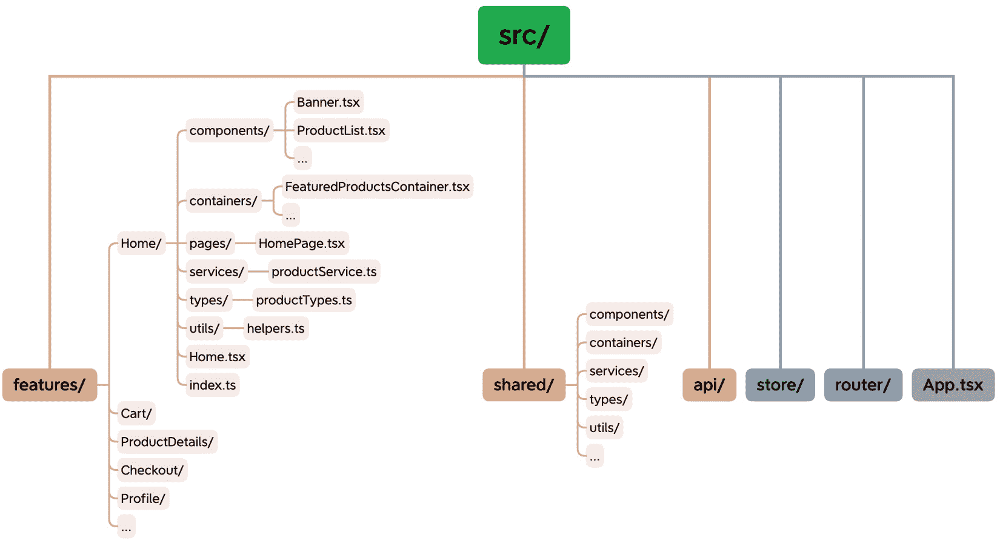
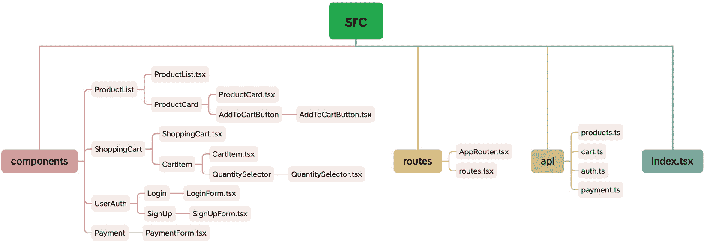
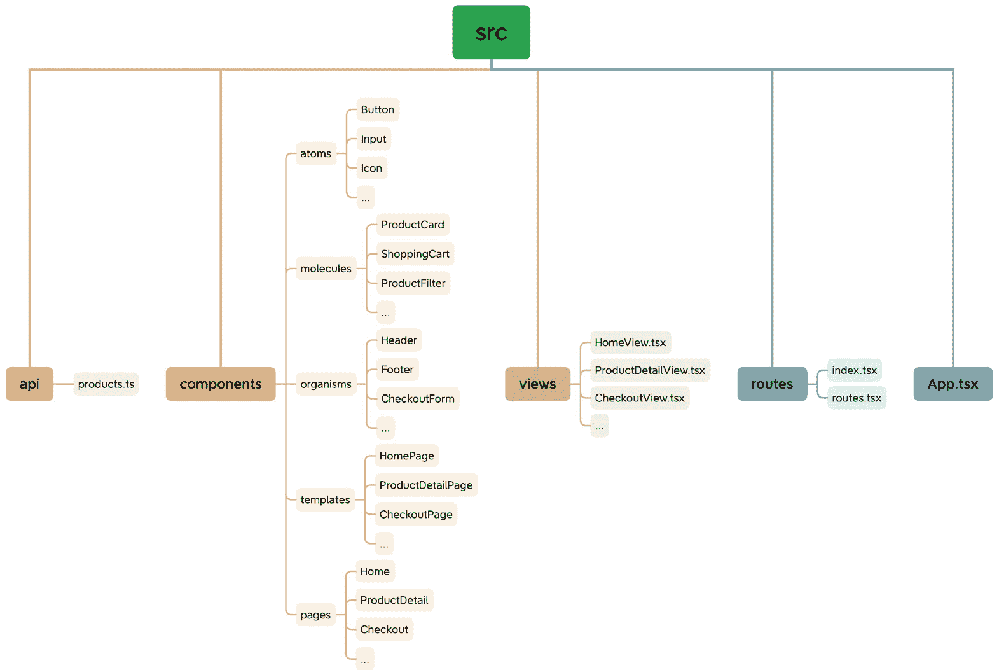
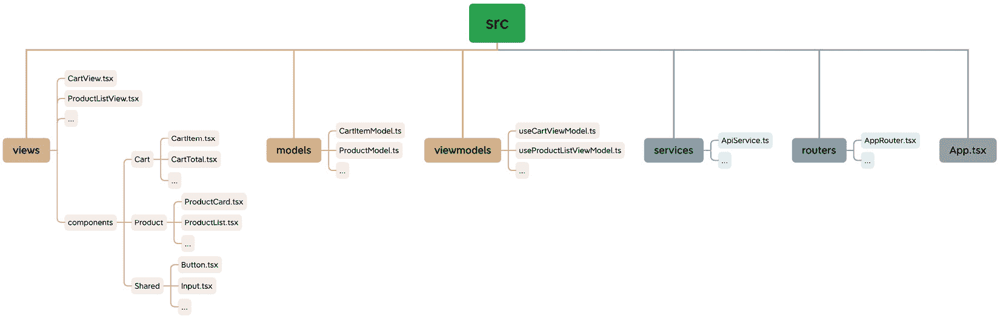
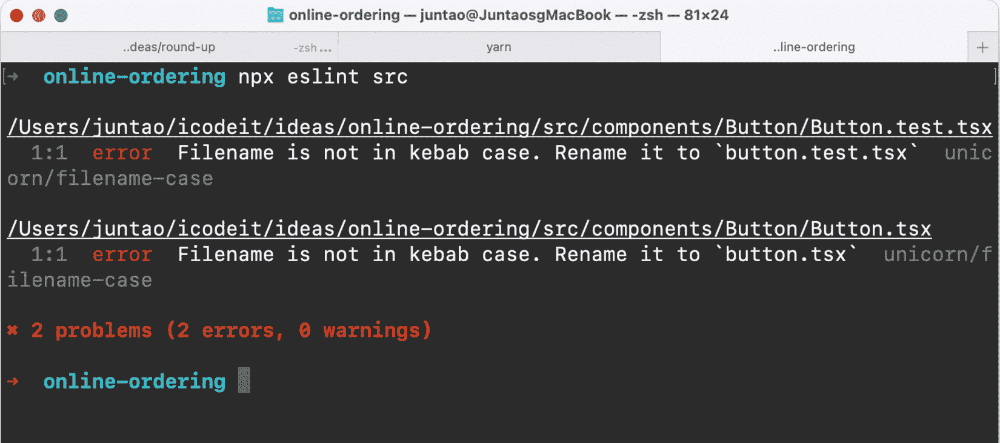
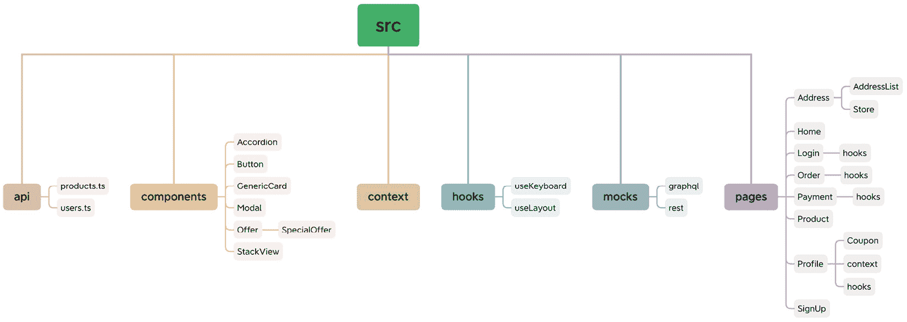

# 3

# 组织你的 React 应用程序

欢迎来到一个专门探讨如何构建 React 项目的策略的章节。在这里，我们将超越代码，深入到应用架构的迷人世界——这是软件开发的一个基本方面，在前端领域往往没有得到应有的关注。

在本章中，你将了解不同的 React 项目结构策略——包括基于功能的结构、基于组件的结构、原子设计结构和 **模型-视图-视图模型**（**MVVM**）结构——以及每种方法带来的独特优势和潜在陷阱。你还将接触到这些结构的实际例子，了解何时使用一种而非另一种，并探索每个决策带来的权衡。

但为什么我们首先应该关心项目结构呢？一个结构良好的项目可以显著提高代码的可维护性，使新团队成员更容易理解系统，并提高可扩展性，甚至影响项目的整体成功。相反，一个低效的结构可能导致代码问题、增加复杂性，并可能成为技术债务的来源。

通过理解这些结构策略，你将更好地做出决策，这些决策可以对项目的健康和成功产生长远的影响。你将能够评估你项目的具体需求和限制，并利用这些策略作为指导，使你能够创建一个提高代码质量、促进高效开发环境，并最终导致项目成功的结构。

在本章中，我们将涵盖以下主题：

+   理解结构不清晰的项目问题

+   理解前端应用程序的复杂性

+   探索 React 应用程序中的常见结构

+   保持项目结构有序

# 技术要求

已创建一个 GitHub 仓库来托管本书中讨论的所有代码。对于本章，你可以在[`github.com/PacktPublishing/React-Anti-Patterns/tree/main/code/src/ch3`](https://github.com/PacktPublishing/React-Anti-Patterns/tree/main/code/src/ch3)找到推荐的架构。

# 理解结构不清晰的项目问题

项目的快速增长可能会令人惊讶，导致事物失控的感觉。初始化前端项目通常是直接的，对于小型项目，由于要管理的文件数量很少，因此对文件结构的关注可能很小。然而，随着项目的扩展，对适当文件组织的需求变得明显：



图 3.1：一个简单的项目可能不需要结构

拥有一个结构较松散的项目的问题在于，它可能导致管理和维护代码库的有效性出现几个挑战和困难。以下是一些由于缺乏结构而产生的主要问题：

+   **代码组织混乱**: 没有清晰的架构，定位特定的代码文件或组件变得更加困难。这可能导致在寻找相关代码时浪费时间和精力，尤其是在项目规模扩大时。

+   **代码复用性差**: 没有合适的结构，识别可重用组件或函数变得具有挑战性。这可能导致代码重复和一致性不足，长期来看，使得维护和更新代码库变得更加困难。

+   **协作困难**: 当团队成员在一个结构较松散的项目上工作时，理解和导航彼此的代码变得更加困难。这可能导致沟通差距、开发速度减慢，以及引入错误或冲突的风险增加。

+   **可扩展性问题**: 随着项目的扩展和新功能的添加，缺乏结构可能会使无缝集成新组件变得具有挑战性。这可能导致难以扩展或修改的混乱代码库，从而导致生产力下降和开发时间增加。

+   **维护复杂性**: 没有清晰的组织，维护代码库变得更加复杂。进行更改或修复问题可能成为耗时的工作，因为代码的结构或命名可能缺乏一致性。

在提出推荐的项目结构之前，让我们先看看现代前端项目的典型组件。了解这些组件将为设计有效的项目结构提供基础。

# 理解前端应用的复杂性

在一个中等规模的前端项目中，你可能会对成功实施所需的众多组件感到惊讶。除了核心功能外，还有许多其他元素有助于项目的功能实现。

React 项目的文件夹结构为你在典型的 React 代码库中需要管理的各个方面提供了一个概览：

+   **源代码**: 这是应用的核心，包含包含应用逻辑的 JavaScript/TypeScript 文件、用于结构的 HTML 文件和用于外观的样式文件。定义应用操作和用户界面的所有内容都可以在这里找到。

+   **资产**: 这个类别包含了应用中使用的所有静态文件，例如图片、视频和字体。这些文件对于增强应用的视觉体验和交互至关重要，有助于提升应用的整体外观和感觉。

+   `package.json` 和环境特定的变量到构建项目的规则中，这些文件对于应用的运行和部署至关重要。

+   **测试**：这个类别致力于确保应用程序的正确性和稳定性。它包含所有单元、集成和**端到端测试**，这些测试模拟用户行为、验证交互并检查应用程序的功能，有助于捕捉和预防潜在的错误。

+   `README` 文件提供了对项目的概述，包括 API 文档和编码风格指南，这些文档有助于维护一致性、理解和易用性，对于与项目交互的任何人都有帮助。

+   **构建工件**：这是构建过程的输出，包括打包和优化的 JavaScript、CSS 和 HTML 文件，以及准备部署的文件，以及其他帮助调试构建问题的临时或诊断文件。它们对于将您的应用程序分发给最终用户至关重要。

+   **开发工具和配置**：这是强制执行代码质量、格式化和版本控制，并促进自动化测试和部署流程的工具包。它们在后台工作，确保开发过程平稳、无错误且高效。

这些多样化的组件共同构成了典型 React 代码库的基础，突显了中型前端项目中涉及的复杂性和广泛性。

探索每个功能文件夹可以是一次愉快的体验，因为它会展开各种元素：

+   常用组件，如模态对话框、导航菜单、按钮和卡片

+   专门针对特定功能的组件，例如 `SpecialOffer`（仅在菜单页面上显示的特殊优惠）或 `PayWithApple`（使用 ApplePay 支付）

+   使用 CSS-in-JS 或 SCSS/LESS 代码定义样式

+   各种类型的测试代码，包括单元测试和浏览器测试

+   封装在实用/辅助函数内的计算逻辑

+   用于可重用功能的自定义钩子

+   安全、**国际化**（**i18n**）和其他特定需求的上下文

+   如 `eslint config`、`jest config`、`webpack settings` 等更多的附加配置文件

考虑到文件众多，我们如何以方便导航和快速修改的方式组织它们？虽然没有一种适合所有情况的解决方案，但持续地组织代码库可以极大地帮助这一努力。

在命名和结构代码元素方面，一致性至关重要。无论选择哪种方法，在整个项目中保持一致性都是至关重要的。例如，如果您决定将样式文件放置在与它们相应的组件旁边，那么在代码库中的所有组件中坚持这一约定是至关重要的。

类似地，如果使用 `tests` 文件夹来存放测试文件，确保在整个代码库中一致地维护这一约定。例如，应避免使用 `__tests__` 或 `specs` 等其他命名模式，以防止混淆并保持一致性。

在理解了中到大型项目固有的复杂性，并认识到无序的代码库可能带来的挑战后，是时候探索一些经过验证的方法来构建我们的代码结构了。这些策略旨在简化开发过程，并为开发者提供便利。

# 探索 React 应用程序中的常见结构

组织大型 React 应用程序有许多不同的方式。在接下来的小节中，我们将讨论四种最常见结构：

+   基于功能的结构

+   组件化结构

+   原子化设计结构

+   MVVM 结构

每种结构都有其自身的优点和缺点，选择取决于项目的具体需求和复杂性。有时，我们可能需要以某种方式混合它们，以便它们符合我们项目的特定需求。

为了进一步探索这些不同的结构方法，我们将以在线购物应用程序为例，因为它相对复杂，并且你应该已经对该领域有所了解。该应用程序还包含 API 调用、路由和状态管理等元素。

## 基于功能的结构

**基于功能的结构**意味着应用程序是根据功能或模块组织的。每个功能都包含其自己的组件集、视图、API 调用和状态管理，从而实现功能的清晰分离和封装。

在在线购物的背景下，采用基于功能的架构，你可以按照以下方式组织你的文件和文件夹：



图 3.2：基于功能的结构

让我们更详细地看看这个结构：

+   `features` 目录代表应用程序的不同功能，例如 `Home`、`Cart`、`ProductDetails`、`Checkout`、`Profile` 等

+   每个功能都有一个包含与该功能相关的 `components`、`containers`、`pages`、`services`、`types` 和 `utils` 的文件夹

+   `shared` 目录包含可重用的 `components`、`containers`、`services`、`types` 和 `utils`，这些可以在多个功能之间共享

+   `api` 目录包含用于发起 API 调用的模块

+   `store` 目录包含状态管理模块（例如，Redux）

+   `router` 目录包含路由配置和相关组件

+   `App.tsx` 文件是应用程序的入口点

此方法有以下优点：

+   **关注点的清晰分离**：每个功能都有一个文件夹，便于定位和修改相关代码

+   **模块化**：功能是自包含的，便于测试、维护和重用

+   **可扩展性**：添加新功能时不会直接影响现有代码

+   **团队协作**：开发者可以同时在不产生最小冲突的情况下工作在不同的功能上

然而，它有以下缺点：

+   **潜在的重复**：功能可能共享相似组件或逻辑，导致一些重复。仔细规划和重构可以帮助减轻这种情况。

## 基于组件的结构

**基于组件的结构**意味着应用是围绕可重用组件组织的。组件根据其功能进行分类，可以组合在一起构建更大的视图。

在在线购物背景下，基于组件的架构下，你可以按照以下方式组织你的文件和文件夹：



图 3.3：基于组件的结构

让我们更详细地看看这个结构：

+   `components` 文件夹包含与在线购物应用各种功能相关的单个组件。每个组件都组织到一个文件夹中，可能包含必要的子组件。

+   `routes` 文件夹处理应用的前端路由。它包括配置路由逻辑的 `AppRouter.tsx` 主文件，以及定义单个路由及其对应组件的 `routes.tsx` 文件。

+   `api` 文件夹包含针对不同 API 域或功能的单独文件。这些文件，如 `products.ts`、`cart.ts`、`auth.ts` 和 `payment.ts`，处理与其相应域相关的 API 调用。

+   该示例还假设使用 Redux 或 React Context API 等状态管理库来管理全局应用状态。

此方法有以下优点：

+   **模块化**：基于功能的组件结构通过将组件组织到单独的文件和文件夹中，促进了模块化。这增强了代码的可维护性和可重用性。

+   **关注点分离**：每个组件专注于其特定的功能，导致代码更清晰且易于调试。关注点分离提高了代码的可读性和可维护性。

+   **代码重用性**：通过模块化组织组件，可以更容易地在应用或未来的项目中重用组件，从而提高开发效率。

然而，它有以下缺点：

+   **项目复杂性**：随着项目的增长，维护复杂的组件结构可能会变得具有挑战性。它需要仔细规划和遵循最佳实践，以避免组件蔓延并保持结构可管理。

+   **学习曲线**：对于新接触这些概念的开发者来说，基于组件的开发和 TypeScript 的初始学习曲线可能更陡峭。然而，在代码组织和可维护性方面获得的好处超过了初始的学习成本。

+   在`components`文件夹中，你可能找到与其它组件文件夹中相同或相似的小元素。你将这些组件分解得越细，就越有可能识别出可重用的组件。当出现这样的可重用组件时，将它们放置在“共享”文件夹中是一个好习惯，就像在基于功能的结构中展示的那样。

## 原子设计结构

**原子设计**是一种设计和组织用户界面的方法。它强调通过将用户界面分解成称为原子的小型、可重用组件来构建用户界面，这些原子组合成分子、有机体、模板和页面。

原子设计背后的关键思想是创建一种系统化的方法来构建 UI 组件，该方法鼓励可重用性、可扩展性和可维护性。它为组织和命名组件提供了一个清晰的框架，使得理解和使用 UI 代码库变得更加容易。

这是原子设计方法对 UI 组件的分类方式：

+   **原子**：原子是 UI 的最小构建块，代表单个元素，如按钮、输入、图标或标签。它们通常是简单且自包含的。

+   **分子**：分子是原子的组合，代表更复杂的 UI 组件。它们封装了一组协同工作的原子，形成一个功能单元，例如表单字段或导航栏。

+   **有机体**：有机体是较大的组件，它们结合分子和/或原子来创建 UI 的更重要的部分。它们代表用户界面的不同部分，如页眉、侧边栏或卡片组件。

+   **模板**：模板为安排有机体和/或分子提供布局结构。它们定义了页面或 UI 特定部分的总体骨架。

+   **页面**：页面代表由模板、有机体、分子和原子组成的完整用户界面屏幕。它们代表用户可见的最终输出。

    在在线购物背景下，使用原子设计架构，你可以按照以下方式组织你的文件和文件夹：



图 3.4：原子设计结构

让我们更详细地看看这个结构：

+   `atoms`、`molecules`、`organisms`、`templates`和`pages`目录代表组件组合和抽象的不同层次。

+   `api`目录包含用于进行 API 调用的 API 相关文件。

+   `views`目录包含渲染组件的单独视图。

+   `routes`目录处理路由配置。

这种方法有以下优点：

+   **可重用性**：组件可以轻松地在应用程序中重用，从而提高代码效率。

+   **一致性**：这种结构鼓励一致的设计语言和 UI 模式。

+   **可扩展性**：模块化方法允许轻松扩展并添加新组件。

+   **可维护性**：组件按照逻辑层次结构组织，这使得它们更容易定位和更新

+   **协作**：原子设计结构促进了设计师和开发者之间的协作，因为它为讨论 UI 组件提供了一个共同的语言

然而，它有以下缺点：

+   **学习曲线**：可能需要一些初始的学习和适应，才能有效地理解和实现原子设计原则

+   **复杂性**：随着应用程序的增长，管理大量组件及其关系可能会变得具有挑战性

+   **过度设计**：在组件可重用性和过度设计之间取得平衡很重要，因为过度的抽象可能会引入不必要的复杂性

## MVVM 结构

**MVVM 结构** 是一种主要用于构建用户界面的软件架构模式：

+   **Model** 代表我们实际处理的数据和/或信息。这可能是数据库、文件、Web 服务，甚至是简单的对象。

+   **View** 是用户看到并与之交互的内容。它是向用户展示模型的用户界面。

+   **ViewModel** 是在这个模式中逻辑主要存在的位置。它是视图的抽象，暴露公共属性和命令，架起了视图和模型之间的桥梁，并将模型中的数据处理成视图易于处理的形式。它可以对数据进行操作并决定如何将其呈现给视图。

在在线购物背景下，使用 MVVM 架构来结构化 React 应用程序，你可以按照以下方式组织你的文件和文件夹：



图 3.5：MVVM 结构

让我们更详细地看看这个结构：

+   `components` 目录包含按其相应功能组织的可重用 UI 组件

+   `models` 目录包含表示应用程序领域对象的数据库、文件、Web 服务或简单对象的数据模型或实体，例如 `CartItemModel` 和 `ProductModel`

+   `viewmodels` 目录包含负责管理视图状态、逻辑和交互的钩子

+   `services` 目录包含处理 API 调用和其他外部服务的模块

+   `views` 目录包括基于 `ViewModel` 状态显示 UI 的视图组件

+   `routers` 目录包含路由配置和组件

+   `App.tsx` 文件作为应用程序的入口点

这种方法有以下优点：

+   **关注点分离**：ViewModel 将业务逻辑与 UI 组件分离，促进了更干净、更易于维护的代码

+   **可测试性**：ViewModel 可以很容易地进行单元测试，而无需实际的 UI 组件

+   **可重用性**：组件、模型和服务可以在不同的功能和视图中重用

+   **可扩展性**：可以在重用现有的 ViewModel 和服务模块的同时添加新功能和视图

然而，它有以下缺点：

+   **复杂性**：实现 MVVM 模式可能会给应用程序引入额外的抽象层和复杂性，尤其是在较小的项目中

+   **学习曲线**：开发者需要理解 MVVM 的概念和原则，以有效地构建和管理应用程序

现在我们已经探讨了这四种流行的结构，让我们深入了解我们应用程序结构的持续演变。这一持续过程确保结构在开发者方面保持有益，便于导航，无缝添加新功能，并能够在长时间内保持可扩展性。

# 保持您的项目结构有序

基于功能的结构始终是一个好的起点。随着项目的扩展和重复模式的出现，可以引入一个额外的层来消除冗余。

例如，让我们再次使用在线购物应用程序。它包含各种页面：

+   首页

+   登录/注册

+   存储地址搜索

+   产品列表

+   购物车

+   订单详情

+   支付

+   个人资料

+   优惠券

在初始阶段，根据功能组织页面是一种常见的方法。我们可以为每个功能创建一个文件夹，并将所有相关组件、样式和测试放入该文件夹中。

## 实施初始结构

在`src`目录中的初始文件夹结构非常简单，遵循基于功能的方法，每个页面都有自己的文件夹：

```js
├── Address
│   ├── AddressList
│   └── Store
├── Home
├── Login
├── Order
├── Payment
├── Product
├── Profile
│   └── Coupon
└── SignUp
```

然而，随着项目的演变，您可能会在不同页面之间遇到组件或功能重复的情况。为了解决这个问题，引入一个额外的抽象层变得必要。

例如，如果`Login`和`Order`页面都需要一个`Button`组件，那么在每一页上分别实现按钮是不切实际的。相反，您可以将`Button`组件提取到一个单独的层，例如组件或共享文件夹。这样，`Button`就可以在多个页面之间重用，而不会出现重复。

## 添加额外层以去除重复项

通过添加这一额外层，您可以在代码库中提高可重用性和可维护性。这有助于消除冗余，简化开发工作，并确保应用程序的一致性。随着项目的扩展，这种模块化方法允许轻松管理并实现可扩展性，使得添加新功能或进行更改时不会影响整个代码库。

因此，您可以创建一个`components`文件夹来存放所有可重用组件，以及一个`pages`文件夹来存放所有功能页面，如下所示：

```js
├── components
│   ├── Accordion
│   ├── GenericCard
│   ├── Modal
│   ├── Offer
│   │   └── SpecialOffer
│   └── StackView
└── pages
    ├── Address
    │   ├── AddressList
    │   └── Store
    ├── Home
    ├── Login
    ├── Order
    ├── Payment
    ├── Product
    ├── Profile
    │   └── Coupon
    └── SignUp
```

随着项目的扩展，有必要创建一个单独的组件文件夹来存放跨不同页面共享的可重用组件。在这种结构中，每个组件都组织在其各自的文件夹中，促进了模块化和代码重用。此外，你可以引入嵌套文件夹来表示组件层次结构，例如包含特定组件`SpecialOffer`的`Offer`文件夹。

除了`components`文件夹外，你可能还需要为其他基本元素创建文件夹。`pages`文件夹包含特定功能的页面，而`hooks`文件夹则存放 React Hooks，它们提供可重用的逻辑和功能。`context`文件夹用于管理全局状态，并提供可以在整个应用程序中共享的不同上下文。

重要的是要注意，并非所有组件都需要移动到`components`文件夹。只有那些在不同页面中表现出重复的组件才应该提升到共享文件夹，以确保在模块化和不必要的复杂性之间保持平衡。

这种文件结构允许在项目增长时更好地组织、代码重用和可扩展性。它通过减少冗余并确保应用程序的一致性来促进可维护性。此外，为 Hooks 和上下文创建单独的文件夹有助于集中相关代码，并使管理全局状态和可重用逻辑变得更加容易。

## 文件命名

在单个组件中，命名文件有不同的方法，每种方法都有其优点和考虑因素。让我们探讨两种方法。

### 使用 index.tsx 和明确的组件名称命名文件

在这种方法中，组件文件夹内的每个文件都有一个明确的名称，与它所代表的组件相对应：

```js
components/Button
├── Button.test.tsx
├── Button.tsx
├── index.tsx
└── style.css
```

`index.tsx`文件作为默认导出文件，允许你直接从文件夹中导入组件。`Button.tsx`是组件的 JSX，而`Button.test.tsx`是对应的测试文件，`style.css`定义 CSS 样式。

这种方法促进了清晰且自我描述的文件名，使得理解每个文件的目的和内容变得更容易。然而，在编辑器或文件浏览器中浏览或搜索组件时，可能会导致索引文件列表过长。

### 使用短横线命名法命名文件

在这种方法中，`components`文件夹内的文件使用**短横线命名法**命名，这是一种命名约定，其中单词为小写，并由连字符分隔。如果只有一个单词，只需使用小写即可——这遵循 JavaScript 社区中使用的持续一致的约定：

```js
components
├── button.test.tsx
├── button.tsx
├── index.tsx
└── style.css
```

组件的文件名明确使用短横线命名法（例如，`button.tsx`）来匹配组件的名称。

这种方法与 kebab case 文件名约定保持一致，并在整个项目中促进统一的命名结构。然而，在导入组件时可能需要明确指定文件名。

这两种方法都有其优点，选择取决于个人偏好和项目需求或团队规范。在项目中建立和维护一致性对于增强团队成员之间的协作和理解至关重要。

无论哪种方式，您都可以使用 ESLint 和 FolderLint 来确保您的团队在文件和文件夹的命名标准上保持一致。例如，以下截图显示文件名应使用短横线分隔法，并建议将`Button.tsx`改为`button.tsx`：



图 3.6：ESLint 检查

## 探索更定制化的结构

随着应用程序的增长和不同类型抽象的增加，相应地组织项目结构变得必要。仅依赖于之前讨论的结构可能不适合您的特定场景。通常需要根据项目需求定制结构，以便与项目需求良好地匹配。记住，建立项目结构的主要目标是简化并优化开发过程。

从基于功能的结构开始，我们需要调整我们当前的文件夹结构到以下结构，以反映这种演变：

+   `api`: 这个文件夹代表管理 API 相关代码的模块或目录，包括用于发起网络请求、处理响应以及与后端服务交互的函数。

+   `components`: 这个文件夹包含可重用的 UI 组件，可以在应用程序的不同页面或功能中使用。它包括`Accordion`、`Button`、`GenericCard`、`Modal`、`Offer`和`StackView`等组件。这些组件可以根据其功能或目的组织到子文件夹中。

+   `context`: 这个文件夹代表管理 React 上下文的模块或目录，它允许跨组件进行全局状态管理和数据共享。

+   `hooks`: 这个文件夹包含封装可重用逻辑和行为的自定义 React Hooks。这些 Hooks 可以在应用程序的不同部分之间共享。

+   `mocks`: 这个文件夹包含用于测试目的的模拟数据或模拟实现。它包括`graphql`和`rest`子文件夹，分别代表 GraphQL 和 REST API 的模拟。

+   `pages`: 这个文件夹代表应用程序的不同页面或功能。每个页面或功能都有一个文件夹。包含的文件夹有`Address`、`Home`、`Login`、`Order`、`Payment`、`Product`、`Profile`、`SignUp`以及它们各自的子文件夹。子文件夹可能包含与该特定页面或功能相关的附加组件、Hooks 或上下文。

以这种方式构建项目，您可以实现模块化和组织化的代码库，这有助于代码重用、关注点分离和可扩展性。每个目录代表应用程序的特定方面，这使得定位和管理与该特定功能相关的代码变得更加容易。

你可以在下面的图中看到这一点，我们回到了我们的购物示例：



图 3.7：在线购物应用程序的混合结构

虽然这种结构提供了一个坚实的基础，但根据你项目的具体需求和规模对其进行调整是很重要的。定期审查和重构结构可以帮助保持其有效性，并适应未来的变化。

随着应用程序变大，将`components`文件夹提取到一个可跨多个项目或作为内部设计系统使用的共享库可能是有益的。这种方法促进了代码重用、一致性和可维护性。共享库可以托管在内部注册表中，或发布到*npmjs Registry* ([`www.npmjs.com/`](https://www.npmjs.com/))以方便分发和消费。

此外，随着你的应用程序发展和新功能的引入，现有的结构可能不再完全满足你的需求。在这种情况下，引入如 MVVM 这样的架构模式可能是有益的，它遵循分层方法。这有助于更好地分离关注点，并更有序地管理复杂的功能和状态。我们将在*第十一章*中深入讨论使用分层架构。

# 摘要

在本章中，我们探讨了管理大型 React 应用程序时出现的挑战以及建立稳固项目结构的重要性。我们讨论了构建 React 应用程序的各种结构风格，包括基于功能、基于组件、MVVM 和原子设计。每种方法都提供了其自身的优势和考虑因素，使开发者能够为他们的特定项目需求选择最合适的结构。

此外，我们提出了一种随着项目增长而不断演进的文件夹结构塑造方法。从简单的初始结构开始，我们强调了适应和引入新层和抽象以减少重复并保持代码组织的需求。通过不断精炼结构并遵守一致的约定，开发者可以有效地导航、添加新功能并维护可伸缩性。

在本章中，我们强调了保持项目结构灵活和不断演进以满足应用程序变化需求的重要性。通过积极塑造文件夹结构，开发者可以减轻管理大型 React 应用程序的挑战，并确保长期的可维护性和可伸缩性。

在接下来的章节中，我们将深入探讨流行的组件实现设计模式和策略。这些技术将使我们能够编写易于添加功能、易于理解且维护工作量较小的代码。
