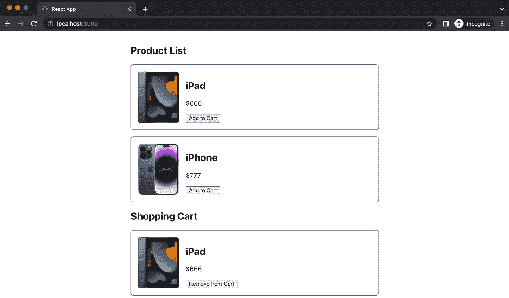

# 4

# 设计您的 React 组件

欢迎来到这个关于掌握 React 组件设计的核心章节。在本章中，我们将开始一段丰富的旅程，以识别和消除设计 React 组件中的常见反模式，包括大型单体组件、属性钻取和其他常见的陷阱，这些陷阱经常困扰开发者，并阻碍 React 应用的可维护性和可扩展性。

首先，我们将介绍单一职责原则。在 React 的领域，这指导我们确保每个组件有一个特定的目的。遵循这个原则使组件更容易理解、测试和维护，同时使您的代码更易于阅读和管理。

接下来，我们将探索“不要重复自己”原则。这是有效编程的核心原则之一，它鼓励开发者最小化重复并促进重用。在 React 的上下文中，这个原则可能是解锁更流畅、高效和可维护的代码库的关键。

最后，我们将深入研究组件组合原则。组合允许我们通过组合更简单、可重用的组件来构建复杂的 UI。在 React 中，组合优于继承，导致更灵活且易于管理的组件。

在本章中，我们将深入探讨这些原则的每一个，提供现实世界的例子和实际应用。通过这样做，我们旨在指导您构建更高效的组件，增强您对 React 潜力的理解，并提高您在这个强大库中的问题解决技能。

因此，在本章中，我们将涵盖以下主题：

+   探索单一职责原则

+   了解“不要重复自己”原则

+   使用组合

+   结合组件设计原则

# 技术要求

已创建一个 GitHub 仓库来托管本书中讨论的所有代码。对于本章，您可以在[`github.com/PacktPublishing/React-Anti-Patterns/tree/main/code/src/ch4`](https://github.com/PacktPublishing/React-Anti-Patterns/tree/main/code/src/ch4)找到推荐的架构。

# 探索单一职责原则

**单一职责原则**（SRP）是软件工程中的基本概念之一，它断言一个函数、类，或者在 React 的上下文中，一个组件，应该只有一个改变的理由。换句话说，每个组件理想上应该处理一个单一的任务或功能。遵循此原则可以使您的代码更易于阅读、维护，并且更容易测试和调试。

让我们用一个例子来说明这一点。假设您最初有一个 `BlogPost` 组件，它在一个组件中获取博客文章数据、显示文章并处理用户对文章的点赞：

```js
import React, { useState, useEffect } from "react";
import fetchPostById from "./fetchPostById";
interface PostType {
  id: string;
  title: string;
  summary: string;
}
const BlogPost = ({ id }: { id: string }) => {
  const [post, setPost] = useState<PostType>(EmptyBlogPost);
  const [isLiked, setIsLiked] = useState(false);
  useEffect(() => {
    fetchPostById(id).then((post) => setPost(post));
  }, [id]);
  const handleClick = () => {
    setIsLiked(!isLiked);
  };
  return (
    <div>
      <h2>{post.title}</h2>
      <p>{post.summary}</p>
      <button onClick={handleClick}>
        {isLiked ? "Unlike" : "Like"}
      </button>
    </div>
  );
};
export default BlogPost;
```

代码定义了一个名为 `BlogPost` 的函数组件，它接受一个 `id` 属性，该属性为 `string` 类型。在组件内部，使用 `useState` 钩子定义了两个状态变量：`post` 和 `isLiked`。`post` 状态表示博客文章数据，初始值为一个空的博客文章。`isLiked` 状态表示文章是否被喜欢，初始值为 `false`。

随后，我们需要在 `useEffect` 钩子中管理副作用（发送网络请求）。它用于根据提供的 `id` 属性从服务器获取博客文章数据。每当 `id` 属性变化时，它都会触发 `fetch` 操作。一旦获取数据，就使用 `setPost` 函数将获取的文章更新到 `post` 状态。

在 `useEffect` 钩子调用中，对于网络请求，有一个名为 `fetchPostById` 的函数。该函数简单地对远程 API 端点进行 `fetch` 调用。我们可以假设该函数是用以下代码片段实现的：

```js
const fetchPostById = (id: string) => {
  return new Promise((resolve, reject) => {
    setTimeout(() => resolve({}), 2000);
  })
};
```

组件从 `post` 状态渲染博客文章的标题和摘要。它还渲染一个按钮，当点击时切换 `isLiked` 状态，显示 `isLiked`。

虽然这段代码可以工作，但它违反了 SRP。它做了三件不同的事情：获取数据、显示博客文章和处理喜欢功能。相反，让我们将其重构为更小、单一职责的组件：

```js
const useFetchPost = (id: string): PostType => {
  const [post, setPost] = useState<PostType>(EmptyBlogPost);
  useEffect(() => {
    fetchPostById(id).then((post) => setPost(post));
  }, [id]);
  return post;
};
const LikeButton: React.FC = () => {
  const [isLiked, setIsLiked] = useState(false);
  const handleClick = () => {
    setIsLiked(!isLiked);
  };
  return <button onClick={handleClick}>
      {isLiked ? "Unlike" : "Like"}
  </button>;
};
const BlogPost = ({ id }: { id: string }) => {
  const post = useFetchPost(id);
  return (
    <div>
      <h2>{post.title}</h2>
      <p>{post.summary}</p>
      <LikeButton />
    </div>
  );
};
```

在这里，我们将 `BlogPost` 重构为更小、单一职责的组件：

+   `useFetchPost` 是一个自定义钩子，负责获取博客文章数据

+   `LikeButton` 是一个组件，负责处理喜欢功能

+   `BlogPost` 现在只负责渲染博客文章内容和 `LikeButton`

每个部分都有一个单一的责任，可以独立进行测试和维护，从而使得代码库更易于管理。

注意

在实际应用中，点击发送到端点（例如 https://post.service/post/<id>）以更改 `isLiked` 状态的 `fetch` 请求。

因此，在第一部分，我们探讨了 SRP。这个原则鼓励每个组件负责单一的功能，使我们的代码更易于维护和理解。在这里，我们应用了这个原则，将大型、单体组件分解为更小、更易于管理的部分。

随着我们进一步深入我们的设计之旅，我们的下一节将引导我们到一个与 SRP 哲学紧密相连的原则——不要重复自己原则。

# 不要重复自己

**不要重复自己**（DRY）原则是软件开发中的一个基本概念，旨在减少代码中的重复。遵循这个原则可以带来更好的可维护性、可读性和可测试性，并可以防止由于逻辑重复而发生的错误。

假设你有一个购物网站，你想要并排显示产品列表和用户的购物车，就像这样：



图 4.1：产品列表页面

`ProductList`组件将显示产品的图像、名称和价格，而`Cart`组件将显示购物车中的项目列表，并带有**从购物车中删除**按钮。

`ProductList`的一个简单实现可能看起来像这样：

```js
type Product = {
  id: string;
  name: string;
  image: string;
  price: number;
};
const ProductList = ({
  products,
  addToCart,
}: {
  products: Product[];
  addToCart: (id: string) => void;
}) => (
  <div>
    <h2>Product List</h2>
    {products.map((product) => (
      <div key={product.id} className="product">
        
        <div>
          <h2>{product.name}</h2>
          <p>${product.price}</p>
          <button onClick={() => addToCart(product.id)}>Add to Cart
           </button>
        </div>
      </div>
    ))}
  </div>
);
export default ProductList;
```

这个名为`ProductList`的功能组件接受两个属性：`products`（产品对象数组）和`addToCart`（用于将产品添加到购物车的函数）。

每个产品对象都是`Product`类型，具有`id`、`name`、`image`和`price`属性。

该组件遍历`products`数组，并为每个产品渲染一个`div`，包括图像、产品名称、价格，并调用带有相应产品`id`属性的参数的`addToCart`函数。

`Cart`组件的结构与您想象中的相似；它需要一个项目列表，并渲染一个带有文本**从购物车中删除**的按钮和一个用户可以调用的回调函数：

```js
const Cart = ({
  cartItems,
  removeFromCart,
}: {
  cartItems: Product[];
  removeFromCart: (id: string) => void;
}) => (
  <div>
    <h2>Shopping Cart</h2>
    {cartItems.map((item) => (
      <div key={item.id} className="product">
        
        <div>
          <h2>{item.name}</h2>
          <p>${item.price}</p>
          <button onClick={() => removeFromCart(item.id)}>
            Remove from Cart
          </button>
        </div>
      </div>
    ))}
  </div>
);
```

`Cart`组件遍历`cartItems`数组，并为每个项目渲染一个包含项目图像、名称、价格和一个`removeFromCart`函数的`div`，该函数以相应的项目`id`属性作为参数，表示应从购物车中删除此项目。

为了减少重复并使每个组件只做一件事，我们可以提取一个`LineItem`组件：

```js
import { Product } from "./types";
const LineItem = ({
  product,
  performAction,
  label,
}: {
  product: Product;
  performAction: (id: string) => void;
  label: string;
}) => {
  const { id, image, name, price } = product;
  return (
    <div key={id} className="product">
      
      <div>
        <h2>{name}</h2>
        <p>${price}</p>
        <button onClick={() => performAction(id)}>{label}</button>
      </div>
    </div>
  );
};
export default LineItem;
```

我们定义了一个名为`LineItem`的功能组件，用于渲染产品的详细信息和一个按钮。它接受`product`、`performAction`和`label`属性，并使用解构来提取必要的值。该组件返回 JSX 代码以显示产品信息，并在按钮被点击时触发`performAction`函数。

对于`ProductList`和`Cart`组件，您只需将不同的属性传递给`LineItem`组件，以减少我们之前存在的重复：

```js
const ProductList = ({
  products,
  addToCart,
}: {
  products: Product[];
  addToCart: (id: string) => void;
}) => (
  <div>
    <h2>Product List</h2>
    {products.map((product) => (
      <LineItem
        key={product.id}
        product={product}
        performAction={addToCart}
        label="Add to Cart"
      />
    ))}
  </div>
);
```

新的`ProductList`组件接收`products`和`addToCart`作为属性。它渲染产品列表，每个产品都有一个**添加到** **购物车**按钮。

类似地，对于`Cart`组件，我们将有一个类似的结构，它将重用`LineItem`组件来渲染产品详情（`image`、`name`和`price`）：

```js
const Cart = ({
  cartItems,
  removeFromCart,
}: {
  cartItems: Product[];
  removeFromCart: (id: string) => void;
}) => (
  <div>
    <h2>Shopping Cart</h2>
    {cartItems.map((item) => (
      <LineItem
        key={item.id}
        product={item}
        performAction={removeFromCart}
        label="Remove from Cart"
      />
    ))}
  </div>
);
```

这是一种更可维护和可重用的方法，遵循 DRY 原则。引入错误的可能性更小，因为更改只需要在一个地方进行，如果我们必须添加`LineItem`的新功能，我们只需要接触一个组件。

在本节中，我们深入探讨了 DRY 原则。它指导我们消除代码中的冗余，降低不一致性和错误的可能性。通过避免代码重复，我们简化了维护工作，因为功能的变化只需要在一个地方解决。随着我们对 DRY 理解的深入，我们准备使用 React 中的一个关键概念——组合来增强我们的组件结构。

# 使用组合

在 React 中，`div`与`h2`标签无缝结合，无需引入任何新内容。

自定义组件并不比内置组件如`div`更特殊；你可以像使用`p`标签一样使用你的`Cart`组件与`div`。这种模式使得组件的重用更加直接，有助于编写更干净、更易于维护的代码。

让我们考虑一个例子。假设我们正在构建一个`UserDashboard`组件，用于显示用户信息。个人资料包括头像、姓名以及用户的朋友列表和最新帖子。以下是它的可能外观：

```js
type User = {
  name: string;
  avatar: string;
  friends: string[];
};
type Post = {
  author: string;
  summary: string;
};
type UserDashboardProps = {
  user: User;
  posts: Post[];
};
function UserDashboard({ user, posts }: UserDashboardProps) {
  return (
    <div>
      <h1>{user.name}</h1>
      
      <h2>Friends</h2>
      <ul>
        {user.friends.map((friend) => (
          <li key={friend}>{friend}</li>
        ))}
      </ul>
      <h2>Latest Posts</h2>
      {posts.map((post) => (
        <div key={post.author}>
          <h3>{post.author}</h3>
          <p>{post.summary}</p>
        </div>
      ))}
    </div>
  );
}
export default UserDashboard;
```

在这个简化的例子中，`UserDashboard`负责渲染用户的个人资料、朋友列表和最新帖子，这违反了单一职责原则。我们可以将其分解为更小的组件，每个组件负责一项任务。

首先，我们可以将与个人资料相关的 JSX 提取到一个`UserProfile`组件中，该组件显示用户的个人资料，包括一个`h1`标签（用户的姓名）和`avatar`图像：

```js
const UserProfile = ({ user }: { user: User }) => {
  return (
    <>
      <h1>{user.name}</h1>
      
    </>
  );
};
```

接下来，我们创建一个`FriendList`组件，用于显示用户的朋友列表；它包括一个`h2`标签和`friends`列表：

```js
const FriendList = ({ friends }: { friends: string[] }) => {
  return (
    <>
      <h2>Friends</h2>
      <ul>
        {friends.map((friend) => (
          <li key={friend}>{friend}</li>
        ))}
      </ul>
    </>
  );
};
```

最后，我们创建一个`PostList`组件，用于显示帖子流，包括一个`h2`标签和`posts`列表：

```js
const PostList = ({ posts }: { posts: Post[] }) => {
  return (
    <>
      <h2>Latest Posts</h2>
      {posts.map((post) => (
        <div key={post.author}>
          <h3>{post.author}</h3>
          <p>{post.summary}</p>
        </div>
      ))}
    </>
  );
};
```

现在，我们的`UserDashboard`组件变得更加简单，并将责任委托给这些较小的组件：

```js
function UserDashboard({ user, posts }: UserDashboardProps) {
  return (
    <div>
      <UserProfile user={user} />
      <FriendList friends={user.friends} />
      <PostList posts={posts} />
    </div>
  );
}
```

重新构建的`UserDashboard`组件之所以更优越，有以下几个原因：

+   通过使用`UserProfile`、`FriendList`和`PostList`（），你确保每个组件只负责一项任务。这提高了代码的可维护性。

+   `UserDashboard`更容易阅读和理解。它立即清楚这个组件渲染了什么：用户个人资料、朋友列表和帖子列表。无需阅读关于每个部分如何渲染的细节。

+   `UserProfile`、`FriendList`和`PostList`组件现在可以在需要时在其他应用程序的部分重用，从而促进代码重用并减少冗余。

+   **可测试性**：较小的、单一职责的组件更容易测试，因为它们通常具有更简单的交互和依赖关系。我们将在*第五章*中介绍测试和可测试性。

这是一个简单的例子，但它说明了 React 中组合的基本思想。随着你处理具有自己状态或逻辑的组件，组合可能会变得更加复杂，但核心原则保持不变：从较小的、可重用的部分构建较大的组件。

这一节让我们领略了 React 中组合的力量。通过组合，我们可以有效地构建和组合我们的组件，从更简单、单一职责的组件中创建复杂的用户界面。我们观察到组合如何使我们充分利用单一职责原则和 DRY 原则，从而创建出既复杂又易于理解、测试和维护的 UI。

# 组合组件设计原则

我们分别分析了单一职责原则、不要重复自己和组合原则。然而，在实际的编码场景中，事情可能会变得复杂，需要同时应用多个原则来提高代码的可读性和可维护性。

让我们考虑一个`Page`组件的例子，它可能具有许多职责，例如管理标题、侧边栏和主要内容区域的状态和行为。此外，还有许多属性用于配置这些区域中的每一个。当个人简单地复制现有的代码库而没有太多考虑或批判性思维时，通常会遇到这样的代码；因此，随着新功能的添加，属性列表会增长。

这里有一个简化的例子：

```js
import React from "react";
type PageProps = {
  headerTitle: string;
  headerSubtitle: string;
  sidebarLinks: string[];
  isLoading: boolean;
  mainContent: React.ReactNode;
  onHeaderClick: () => void;
  onSidebarLinkClick: (link: string) => void;
};
function Page({
  headerTitle,
  headerSubtitle,
  sidebarLinks,
  mainContent,
  isLoading,
  onHeaderClick,
  onSidebarLinkClick,
}: PageProps) {
  return (
    <div>
      <header onClick={onHeaderClick}>
        <h1>{headerTitle}</h1>
        <h2>{headerSubtitle}</h2>
      </header>
      <aside>
        <ul>
          {sidebarLinks.map((link) => (
            <li key={link} onClick={() => onSidebarLinkClick(link)}>
              {link}
            </li>
          ))}
        </ul>
      </aside>
      {!isLoading && <main>{mainContent}</main>}
    </div>
  );
}
```

我们定义了一个`Page`组件；该组件使用前面的属性来渲染一个带有可点击标题、包含可点击链接的侧边栏和主要内容部分的页面。该组件期望其属性为`PageProps`类型的对象。

让我们更仔细地看看`PageProps`内部：

+   `headerTitle`：这个字符串将在页面标题中显示为主要标题

+   `headerSubtitle`：这个字符串将在页面标题中显示为副标题

+   `sidebarLinks`：这是一个字符串数组，其中每个字符串代表将在页面侧边栏中显示的链接

+   `isLoading`：这是一个标志，用于确定主要内容是否已准备好

+   `mainContent`：这可以是任何有效的 React 节点（组件、元素、null 等），它代表页面的主要内容

+   `onHeaderClick`：当点击页面标题部分时，将执行此函数

+   `onSidebarLinkClick`：当点击任何侧边栏链接时，将执行此函数。该函数将接收被点击的链接作为参数

`Page`组件具有多个职责，并且它有一长串属性，这可能会使其难以处理。当组件有超过五个属性时，长属性列表通常表明需要组件分解。这是因为记住每个属性的目的可能具有挑战性，它还增加了传递错误属性或误排序它们的可能性。

我们可以根据它们的使用方式对属性进行分组。`headerTitle`、`headerSubtitle`和`onHeaderClick`属性可以分成一组，而`isLoading`和`mainContent`属于另一组。

从大型组件中提取一小部分始终是一个好的起点。请注意，可能有许多提取的方法；如果信息看起来彼此相关，我们可以将它们分组并为此组数据创建一个新的组件。例如，我们可以首先提取一个`Header`组件：

```js
type HeaderProps = {
  headerTitle: string;
  headerSubtitle: string;
  onHeaderClick: () => void;
};
const Header = ({
  headerTitle,
  headerSubtitle,
  onHeaderClick,
}: HeaderProps) => {
  return (
    <header onClick={onHeaderClick}>
      <h1>{headerTitle}</h1>
      <h2>{headerSubtitle}</h2>
    </header>
  );
};
```

这个 React 中的`Header`组件接受三个属性——`headerTitle`、`headerSubtitle`和`onHeaderClick`——并渲染一个带有提供标题和副标题的标题。当点击标题时，将调用`onHeaderClick`属性。

现在，因为`title`、`subtitle`和`onClick`回调已经在`Header`组件中，我们不需要在属性名称中使用`header`前缀。让我们重命名这些属性：

```js
type HeaderProps = {
  title: string;
  subtitle: string;
  onClick: () => void;
};
const Header = ({
  title,
  subtitle,
  onClick,
}: HeaderProps) => {
  return (
    <header onClick={onClick}>
      <h1>{title}</h1>
      <h2>{subtitle}</h2>
    </header>
  );
};
```

现在关于`Header`的功能已经非常清晰——它接受`title`、`subtitle`和`onClick`，并且不需要知道更多。这种提取也增加了`Header`的可重用性，这意味着我们可能在不同的地方重用这个组件。

现在，我们可以用相同的方法提取一个`Sidebar`组件：

```js
type SidebarProps = {
  links: string[];
  onLinkClick: (link: string) => void;
};
const Sidebar = ({ links, onLinkClick }: SidebarProps) => {
  return (
    <aside>
      <ul>
        {links.map((link) => (
          <li key={link} onClick={() => onLinkClick(link)}>
            {link}
          </li>
        ))}
      </ul>
    </aside>
  );
};
```

`Sidebar`组件接受一个`links`数组和`onLinkClick`函数作为属性，并从`links`数组生成一个可点击的项目列表。当点击链接时，会触发`onLinkClick`函数，并将点击的链接作为参数传递。

在我们从`Page`中提取了`Header`和`Sidebar`之后，`Page`中剩下的唯一部分就是与主要内容相关的部分。我们可以对主要内容采用相同的方法，通过简单的 JSX 片段提取一个`Main`组件，如下面的代码所示：

```js
type MainProps = {
  isLoading: boolean;
  content: React.ReactNode;
};
const Main = ({ isLoading, content }: MainProps) => {
  return <>{!isLoading && <main>{content}</main>}</>;
};
```

由于我们从`Page`组件中提取了大部分内容，我们现在可以使用这些简单的组件，而无需更改`Page`的公共接口：

```js
function Page({
  headerTitle,
  headerSubtitle,
  sidebarLinks,
  mainContent,
  isLoading,
  onHeaderClick,
  onSidebarLinkClick,
}: PageProps) {
  return (
    <div>
      <Header
        title={headerTitle}
        subtitle={headerSubtitle}
        onClick={onHeaderClick}
      />
      <Sidebar links={sidebarLinks} onLinkClick={onSidebarLinkClick} 
       />
      <Main isLoading={isLoading} content={mainContent} />
    </div>
  );
}
```

`Page`组件安排`Header`、`Sidebar`和`Main`组件，并接受几个属性。然后它将这些属性传递给相应的子组件——`Header`获取标题、副标题和一个点击处理程序；`Sidebar`接收一个链接列表和一个点击处理程序；`Main`组件获取主要内容和一个加载状态。

重新设计的`Page`组件看起来更美观，但还不是完美的。让我们考虑当前代码的一个常见问题。如果我们需要向`Sidebar`或`Main`传递新的属性会发生什么？

为了接受传递给`Sidebar`或`Main`的新属性，我们需要扩展属性列表，该列表已经有七个属性。对于使用`Page`组件的人来说，随着属性的增加，他们需要记住更多的属性，这不会是一个好的体验（更不用说因为这些属性而增加的额外测试工作）。

而不是接受这些详细的描述来自定义`Header`或`Sidebar`，我们可以传递一个`Header`实例，然后只需将其插入正确的插槽（以替换`Header`组件）：

```js
type PageProps = {
  header: React.ReactNode;
  sidebarLinks: string[];
  isLoading: boolean;
  mainContent: React.ReactNode;
  onSidebarLinkClick: (link: string) => void;
};
function Page({
  header,
  sidebarLinks,
  mainContent,
  isLoading,
  onSidebarLinkClick,
}: PageProps) {
  return (
    <div>
      {header}
      <Sidebar links={sidebarLinks}
       onLinkClick={onSidebarLinkClick} />
      <Main isLoading={isLoading} content={mainContent} />
    </div>
  );
}
```

现在，`Page`组件接受一个`header`属性（以及侧边栏链接列表、加载状态、主要内容和一个链接点击处理程序作为属性），并直接渲染`Header`组件。这意味着我们可以从`Page`外部传递任何`header`实例。

同样，我们也可以对`Sidebar`和`Main`做同样的事情：

```js
type PageProps = {
  header: React.ReactNode;
  sidebar: React.ReactNode;
  main: React.ReactNode;
};
function Page({ header, sidebar, main }: PageProps) {
  return (
    <div>
      {header}
      {sidebar}
      {main}
    </div>
  );
}
```

`Page`组件接受三个属性——`header`、`sidebar`和`main`——每个属性都期望是一个`Page`组件，`Page`组件简单地按照提供的顺序在`div`中渲染这三个属性，从而形成一个带有标题、侧边栏和主要内容页面的简单布局。

然后，你可以以最灵活的方式使用`Page`组件——你可以将完全定制的`Header`、`Sidebar`和`Main`作为参数传递给`Page`组件：

```js
const MyPage = () => {
  return (
    <Page
      header={
        <Header
          title="My application"
          subtitle="Product page"
          onClick={() => console.log("toggle header")}
        />
      }
      sidebar={
        <Sidebar
          links={["Home", "About", "Contact"]}
          onLinkClick={() => console.log("toggle sidebar")}
        />
      }
      main={<Main isLoading={false}
            content={<div>The main</div>} />}
    />
  );
};
```

这个`MyPage`组件渲染一个`Page`组件，通过 props 传入`Header`、`Sidebar`和`Main`组件，而点击`Header`和`Sidebar`组件将向控制台记录某些消息。

注意，在这里你可以将任何内容传递给`Page`以定义`header`、`sidebar`或`main`。以下是一个示例：

```js
const MySimplePage = () => {
  return (
    <Page
      header={
        <h1>A simple header</h1>
      }
      sidebar={
        <aside>
          <ul>
            <li>Home</li>
            <li>About</li>
          </ul>
        </aside>
      }
      main={<div>The main content</div>}
    />
  );
};
```

`MyPage`组件包裹了一个`Page`组件。`Page`组件接收三个 props：`header`、`sidebar`和`main`，每个都包含 JSX 元素，指定了页面相应部分的渲染内容。`header`prop 包含一个标题，`sidebar`prop 包含一个列表，而`main`部分包含页面的主要内容。

原始的`Page`组件承担了众多责任，导致 props 列表很长。这种设计带来了**prop drilling**问题，其中大量数据必须通过多个组件层传递。这种设置既复杂又难以维护。

因此，让我们回顾一下我们应用不同原则的过程。重构过程始于将单体`Page`组件分解成更小、更易于管理的组件——`Header`、`Sidebar`和`Main`——使用 SRP（单一职责原则）。这些子组件被设计来处理它们各自的责任，从而简化了它们各自的 prop 需求。

一旦提取了这些组件，我们就通过组合使用修改了`Page`组件以接受这些子组件（`Header`、`Sidebar`和`Main`）作为 props。这种方法显著减少了 prop drilling 问题，因为每个子组件现在都直接在使用的点上接收 props。

重构练习简化了`Page`组件，从而得到一个更干净、更易于管理的代码库。它利用了组件组合和单一职责的原则，有效地解决了 prop drilling 问题。

# 摘要

本章介绍了在 React 中设计和开发组件的几个关键原则：SRP（单一职责原则）、DRY（不要重复自己）以及组件组合的使用。这些原则中的每一个都提供了不同的策略，以实现干净、可维护和可扩展的代码库。

通过理解和应用这些原则，我们可以为我们的 React 应用程序打下坚实的基础。这些策略导致更组织化、可扩展和健壮的代码库，最终使我们的开发工作更加高效和愉快。

在下一章中，我们将开始探讨 React 应用程序中的一个令人兴奋的主题——测试，并看看良好的结构化测试如何帮助我们避免犯错，同时帮助我们提高代码质量。

# 第二部分：拥抱测试技术

在本部分，你将深入了解测试在前端开发中的重要性，探索各种测试方法和重构技术，以确保你的 React 应用程序的健壮性和可维护性。

本部分包含以下章节：

+   *第五章*, *React 中的测试*

+   *第六章*, *探索常见的重构技术*

+   *第七章*, *使用 React 介绍测试驱动开发*
