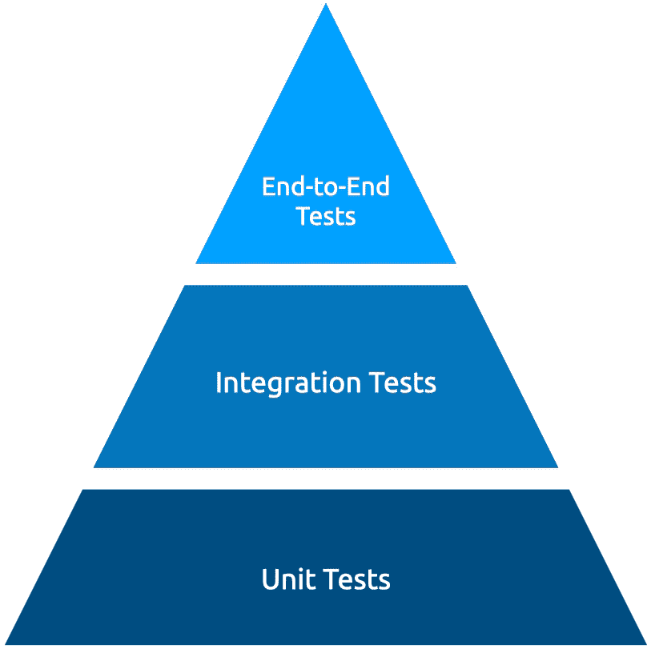
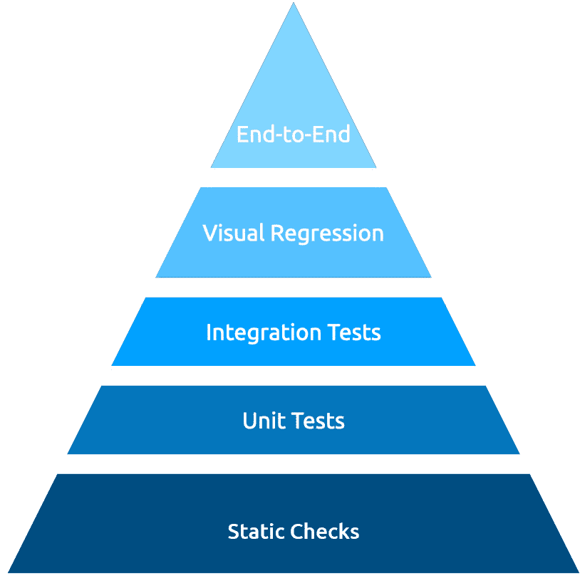
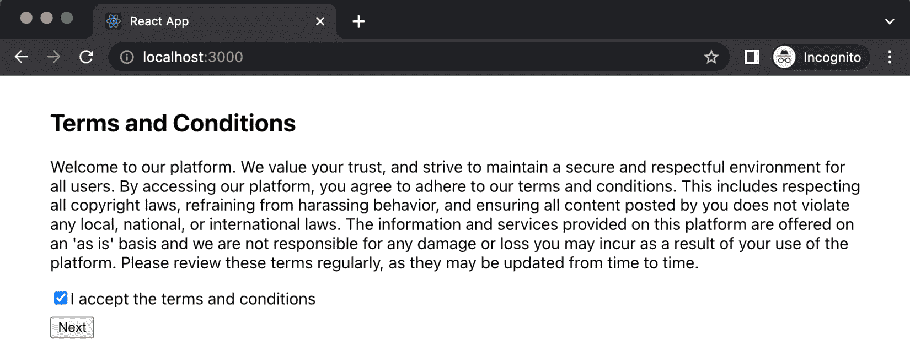
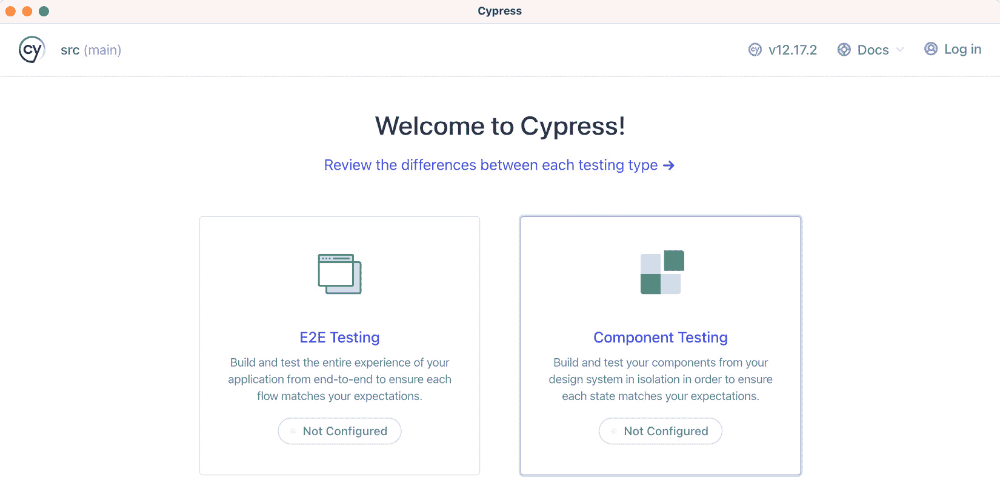
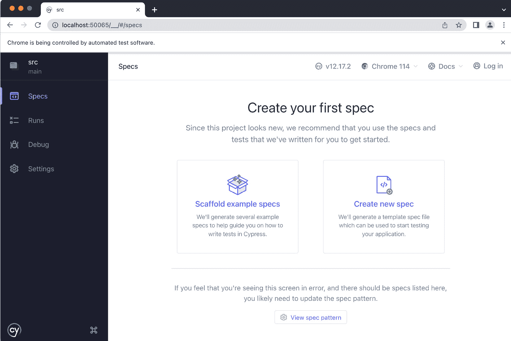
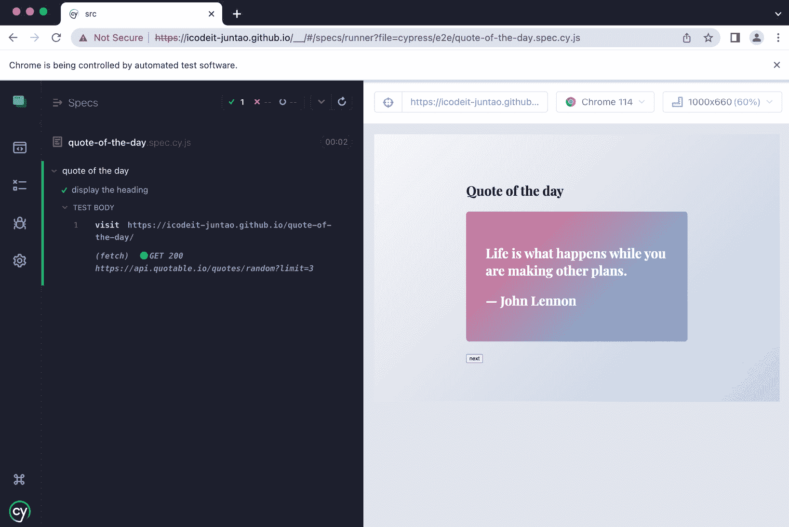

# 5

# React 中的测试

欢迎来到本章节，我们将深入了解 React 中的测试。在本章中，我们将学习软件测试的重要性，了解不同类型的测试——包括单元测试、集成测试和**端到端**（**E2E**）测试——并深入研究 Cypress、Jest 和 React Testing Library 等流行测试工具的使用。此外，我们还将揭开诸如 stubbing 和 mocking 等概念的面纱，确保你能够应对复杂的测试场景。

我们的总目标是培养对测试策略及其在 React 中实现的深入理解。我们旨在提高你编写测试的能力，使你的应用程序能够抵御 bug 和回归，并确保新功能的无缝添加。

在本章结束时，你将全面理解 React 测试，并准备好在你的项目中实施高效的测试实践。那么，让我们开始吧，进入激动人心的 React 测试世界！

在本章中，我们将涵盖以下主题：

+   理解为什么我们需要测试

+   了解不同类型的测试

+   使用 Jest 测试单个单元

+   了解集成测试

+   了解使用 Cypress 进行端到端测试

# 技术要求

已创建一个 GitHub 仓库来托管本书中讨论的所有代码。对于本章，你可以在[`github.com/PacktPublishing/React-Anti-Patterns/tree/main/code/src/ch5`](https://github.com/PacktPublishing/React-Anti-Patterns/tree/main/code/src/ch5)找到推荐的结构。

# 理解为什么我们需要测试

测试不仅仅是一个可选的最佳实践；它是构建可靠和可维护软件的关键部分。没有测试，你就像在没有指南针的情况下在复杂的软件开发海洋中航行。让我们了解测试带来的多重好处：

+   **确保代码正确性**：测试作为验证代码按预期执行的一种保证。一个编写良好的测试可以验证你的函数对于给定的输入返回预期的输出，你的组件渲染正确，以及你的应用程序表现如预期。

+   **防止回归**：随着应用程序的增长和演变，新代码有时会无意中破坏现有的功能。这被称为**回归**。自动化测试充当一个安全网，在它们达到生产环境之前捕捉这些回归。

+   **促进重构和维护**：重构或更新遗留代码的过程常常伴随着恐惧。测试可以缓解这种恐惧。它们提供了一个安全区域，确保如果你在更新或重构过程中意外破坏了某些内容，你的测试将会捕捉到它。

+   **提升代码质量信心**：测试提高了团队的信心水平。当一系列精心编写的测试支持你的代码时，你就有了一个衡量代码质量的量化指标。这种保证在添加新功能或对系统进行更改时特别有益。

+   **文档**：测试也是一种文档形式。它们提供了对函数或组件预期功能的清晰理解，帮助新加入团队的开发者理解项目的功能。

在接下来的章节中，我们将深入了解你在 React 应用程序中常用的各种测试类型，并学习如何有效地使用测试工具。准备好开始一段引人入胜的软件测试之旅。

# 了解不同类型的测试

在软件开发领域，测试并不是一种一刀切的方法。相反，它被分为不同的类型，每种类型都服务于不同的目的，并为应用程序的功能和可靠性提供独特的见解。了解这些类别对于确保应用程序的整体健康和稳健性至关重要。通常，你将在一个代码库中拥有单元测试、集成测试和端到端（E2E）测试。

我们将在这里简要定义每种类型，并在接下来的章节中详细讨论每种类型：

+   **单元测试**：这些测试专注于在隔离状态下测试单个组件或函数，以确保它们按预期工作。

+   **集成测试**：这些测试检查不同模块或服务之间的交互，以验证它们是否协同工作。

+   **端到端（E2E）测试**：这些测试从开始到结束测试整个应用程序流程，模拟真实世界的用户行为，以验证系统作为一个整体是否正常工作。

在项目中如何组织测试结构也很重要。例如，你应该有很多运行速度快且能提供详细反馈的单元测试，同时只应该有少量端到端（E2E）测试来确保所有部分协同工作。这种方法与测试金字塔的原则相一致。

**测试金字塔**最初由 Mike Cohn 提出，建议单元测试的数量应比集成测试或端到端（E2E）测试多。理由很简单——单元测试更快、更简单，且维护成本更低：



图 5.1：传统的测试金字塔

然而，在现代前端世界中，这种模式正在演变。由于前端应用程序的复杂性和交互性的增加，越来越多的价值被放在了集成和端到端（E2E）测试上。像 Cypress 和 Puppeteer 这样的工具使得编写模拟浏览器中用户行为的端到端（E2E）测试变得容易，而像 React Testing Library 这样的库通过简化组件交互测试，鼓励更多的集成测试。

在前端应用中也引入了新的测试类型。视觉回归测试就是其中之一。**视觉回归测试**是一种测试方法，它捕捉并比较 Web 应用的视觉方面与之前的状态或版本。这种类型的测试在捕捉开发过程中可能引入的不期望的视觉错误和用户界面变化方面特别有用。

视觉回归测试通过在不同阶段对网页或组件进行截图（或快照），然后逐像素比较这些截图以识别任何视觉差异来工作。当检测到差异时，它会标记为待审查。然后审查可以确定变化是否是预期的（由于新功能或设计更新）或者是否是不期望的回归，需要修复。

在前端测试中，**静态检查**涉及在不执行代码的情况下分析代码以识别错误并确保编码标准。这包括检查语法错误、通过 linting 强制执行编码风格、通过类型检查验证正确的数据类型、分析代码复杂性、检查依赖关系以及识别安全漏洞。

你的测试金字塔的确切形状可能取决于你的应用需求，但关键是要有一个平衡的测试策略，在不同的应用层级提供快速和有用的反馈：



图 5.2：增强的测试金字塔

本章接下来的部分将为你提供编写 React 应用这类测试的实践经验，确保你能够将这些概念应用到你的项目中。让我们继续前进！

# 使用 Jest 测试单个单元

单元测试是测试金字塔中最小和最基础的部分，它验证代码各个单元的行为，例如函数、方法或组件。这些测试编写和执行速度快，为开发者提供即时反馈。

在本书中，我们将使用 Jest 编写单元测试和集成测试。Jest 是由 Facebook 构建的全面的 JavaScript 测试框架，它注重简单性。它功能丰富，支持异步测试、模拟和快照测试，是 React 应用的绝佳选择。

## 编写你的第一个测试

让我们编写一个简单的测试。假设你有一个名为 `math.ts` 的文件中的 `add` 函数：

```js
export function add(a: number, b: number) {
  return a + b;
}
```

要测试这个函数，你必须在同一目录下创建一个 `math.test.ts` 文件：

```js
import { add } from './math';
test('add adds numbers correctly', () => {
  expect(add(1, 2)).toBe(3);
});
```

你现在已经编写了你的第一个测试！`test` 函数接受两个参数：一个测试的字符串描述和一个实现测试的回调函数。`expect` 是一个 Jest 函数，它接受实际值，而 `toBe` 是一个匹配函数，它比较实际值与预期值。

另一种编写测试的方法是使用`it`函数。在 Jest 中，`test`和`it`实际上是同一个函数，可以互换使用；名称只是来自不同的测试约定：

+   `test`：这是许多测试框架和语言中测试函数的常见名称。如果你来自使用其他测试库的背景，你可能会发现`test`更直观或熟悉。

+   `it`：这来自像 Jasmine 或 Mocha 这样的**行为驱动开发**（**BDD**）风格的框架。

使用`it`的想法是使测试读起来更像句子。例如，`it("adds 1 + 2 to equal 3", () => expect(1 + 2).toBe(3))`读起来像是“它将 1 + 2 相加等于 3。”

注意

BDD 是一种软件开发方法，强调开发人员、QA 和非技术参与者在软件项目中的协作。它强调了在开发开始之前，对期望行为有明确理解的需要，从而将开发与业务需求对齐。

BDD 鼓励用所有利益相关者都能阅读和理解的简单、描述性语言表达软件行为。它利用可执行的规范，通常用 Gherkin 等语言编写，这些规范指导开发并作为验收标准。

BDD 旨在通过鼓励协作、使系统的行为对所有人明确且可理解，并确保开发的软件真正满足业务需求，来减少误解。

这取决于团队偏好以及什么最适合你团队的测试哲学——一些团队可能更喜欢它提供的句子结构，因为它通常可以使测试试图验证的内容更清晰，尤其是对非开发者来说，而另一些团队可能认为`test`更直接且更简洁。我们将在这本书中编写遵循 BDD 风格的测试。

## 分组测试

将相关的测试分组在一个块中可以显著提高你的测试文件的可读性。通过清晰地划分不同的功能区域，一个块可以让阅读测试的人一眼就能理解测试套件的上下文。这种增强的理解对于理解正在验证的功能至关重要。在一个大型代码库中，有众多测试的情况下，这种组织可以大大减少理解应用程序不同部分如何被测试所需的认知负荷。

在 Jest 中，我们可以使用`describe`函数将相关的测试分组到一个单元中。例如，考虑一个包含多个情况的函数`add`：负数的加法、一个负数和一个正数的组合、小数的总和，甚至涉及虚数的计算。明智的做法是将所有这些不同的案例收集在一个`describe`块下，如下所示：

```js
import { add } from './math';
describe('math functions', () => {
  it('adds positive numbers correctly', () => {
    expect(add(1, 2)).toBe(3);
  });
  it('adds negative numbers correctly', () => {
    expect(add(-1, -2)).toBe(-3);
  });
  // More tests...
});
```

`describe` 函数用于分组相关的测试——在这个例子中，是对一些数学函数的测试。在这个组内，有两个 `it` 函数，每个代表一个单独的测试。第一个测试检查 `add` 函数是否正确地加上了两个正数，第二个测试检查 `add` 函数是否正确地加上了两个负数。

使用 Jest，你可以嵌套 `describe` 块来更系统地组织你的测试。例如，假设我们正在扩展我们的测试套件以包括计算器的减法、乘法和除法功能。我们可以按照以下方式构建我们的测试套件：

```js
describe('calculator', () => {
  describe('addition', () => {
    it('adds positive numbers correctly', () => {
        expect(add(1, 2)).toBe(3);
    });
    it('adds negative numbers correctly', () => {
        expect(add(-1, -2)).toBe(-3);
    });
    // More tests...
  })
  describe('subtraction', () => {
    it('subtracts positive numbers', () => {});
  })
  // Other describe blocks for multiplication and division
});
```

在这个代码片段中，我们有一个标记为 `calculator` 的顶级 `describe` 块。在这个块内部，我们为每个数学运算嵌套了 `describe` 块。例如，在 `addition` 块中，我们有针对加法不同场景的单独 `it` 测试。同样，我们为 `subtraction` 开始一个新的 `describe` 块。这种嵌套结构使我们的测试套件更加有序、可读，并且更容易导航，尤其是在处理大量测试或复杂场景时。

## 测试 React 组件

如我们之前提到的，Jest 是一个出色的测试不同类型应用程序的工具，并且它默认支持 React 应用程序。尽管可以单独使用 Jest，但与使用如 **React** **Testing Library** 这样的专用库相比，它可能会稍微繁琐和冗长一些。

React Testing Library 是一个轻量级但功能强大的库，用于测试 React 组件。它建立在流行的 JavaScript 测试框架 Jest 之上，并为处理 React 组件添加了特定的实用工具。React Testing Library 的哲学是鼓励编写与你的软件使用方式相似的测试。它鼓励你像用户一样与你的应用程序交互，这意味着你测试的是功能而不是实现细节。这种方法导致更健壮和可维护的测试，这将让你有信心你的应用程序在生产环境中能够正常工作。

在本书提供的代码中，项目已经为你设置好了 React Testing Library。只需将 *技术要求* 部分中提到的代码克隆到你的本地目录中，你就可以开始了。

好吧——让我们从一个简单的 React 组件开始，看看我们如何使用 React Testing Library 来测试它。`Section` 组件是一个展示组件，它接受两个属性 `heading` 和 `content`，并在 `article` 标签中渲染这些属性：

```js
type SectionProps = {
  heading: string;
  content: string;
};
const Section = ({ heading, content }: SectionProps) => {
  return (
    <article>
      <h1>{heading}</h1>
      <p>{content}</p>
    </article>
  );
};
export { Section };
```

要测试组件，我们可以在 `Section.tsx` 旁边创建一个新文件，我们将称之为 `Section.test.tsx`。这是我们的测试代码将存在的地方。然后，我们将使用 React Testing Library 来检查 `Section` 组件：

```js
import React from "react";
import { render, screen } from "@testing-library/react";
import { Section } from "../component/Section";
describe("Section", () => {
  it("renders a section with heading and content", () => {
    render(<Section heading="Basic" content="Hello world" />);
    expect(screen.getByText("Basic")).toBeInTheDocument();
    expect(screen.getByText("Hello world")).toBeInTheDocument();
  });
});
```

此测试代码使用了`@testing-library/react`来验证`Section`组件的行为是否符合预期——`@testing-library/react`文本用于使用特定的属性渲染`Section`组件：标题为**基本**，内容为**Hello world**。

渲染完成后，使用`screen.getByText`函数查询 DOM（代表`Section`组件的渲染输出）中包含特定文本的元素。

接下来，使用`expect`和`toBeInTheDocument`来对这些元素的状态进行断言。具体来说，测试断言`Section`组件正确渲染了其标题和内容属性。

这个针对 React 组件的简单单元测试是一个有用的起点。然而，在复杂的实际项目中，我们经常遇到多个组件需要和谐交互的场景。例如，考虑一个集成了地址收集组件、支付组件和价格计算逻辑组件的结账页面。

为了自信地确保这些不同组件的无缝交互，我们必须采用更全面的测试策略：集成测试。

# 了解集成测试

集成测试位于金字塔的单元测试之上，验证多个代码单元之间的交互。这些可能是组件之间的交互，或者是客户端和服务器之间的交互。集成测试旨在识别当系统的不同部分组合时可能出现的潜在问题。

其中一个场景涉及测试两个独立组件之间的交互，以验证它们是否能够正确协同工作——这是在 UI 组件级别的集成测试。此外，如果您想确保前端代码和后端服务之间的协作顺畅，为此编写的测试也会被归类为集成测试，这些测试验证了应用程序的不同层是否能够正确协同工作。

让我们看看一个 React 组件的集成测试示例。在*图 5*.3 中，有一个**条款和条件**部分，其中包含关于法律信息的长文本，以及用户同意的复选框。还有一个**下一步**按钮，默认情况下是禁用的。然而，一旦用户选择**接受条款和条件**，按钮将被启用，用户可以继续操作：



图 5.3：条款和条件组件

这个集成测试可以用以下代码片段来描述——我们不是单独测试**复选框**和**下一步**按钮，而是验证它们之间的交互：

```js
describe('Terms and Conditions', () => {
  it("renders learn react link", () => {
    render(<TermsAndConditions />);
    const button = screen.getByText('Next');
    expect(button).toBeDisabled();
    const checkbox = screen.getByRole('checkbox');
    act(() => {
      userEvent.click(checkbox);
    })
    expect(button).toBeEnabled();
  });
})
```

使用`describe`函数来分组与`TermsAndConditions`组件相关的所有测试，形成一个所谓的测试套件。在这个套件中，我们有一个由`it`函数表示的单个测试用例。这个测试的描述是**渲染学习 React 链接**，考虑到这个测试中执行的操作，这似乎是一个误称。一个更合适的描述可能是**在接受条款和条件后启用下一步按钮** **和条件**。

最初，调用`render`函数来显示`TermsAndConditions`组件。这个函数产生一系列输出，或渲染结果，可以通过各种方式查询以评估组件是否按预期工作。

然后，我们尝试通过文本找到按钮，使用`screen.getByText`函数——它返回页面上的元素。在这个时候，我们预计这个按钮将被禁用，因此我们通过调用`expect(button).toBeDisabled()`来确认这个预期。

接下来，我们使用`screen.getByRole`函数查找复选框。这个函数允许我们根据其角色找到复选框，其角色是`checkbox`。

使用`userEvent.click`函数模拟用户点击复选框的交互，该函数被 React 的`act`函数包裹。`act`函数确保在继续之前处理并应用与这些操作相关的所有更新；这样，我们的断言将检查组件的更新状态。

最后，我们验证在点击复选框之后按钮是否被启用。这是通过使用`expect(button).toBeEnabled()`来完成的。如果这个语句为真，我们知道我们的组件表现如预期——也就是说，在用户接受条款和条件之前禁用**下一步**按钮。

现在，让我们看看代码是如何编写的。正在测试的`TermsAndConditions`组件由几个组件组成——`heading`、`LegalContent`和`UserConsent`。此外，`UserConsent`本身由`CheckBox`和`Button`组成：

```js
const TheLegalContent = () => {
  return (
    <p>
      {/*...*/}
    </p>
  );
};
type CheckBoxProps = {
  label: string;
  isChecked: boolean;
  onCheck: (event: any) => void
}
const CheckBox = ({label, isChecked, onCheck}: CheckBoxProps) => {
  return (
    <label>
      <input
        type="checkbox"
        checked={isChecked}
        onChange={onCheck}
      />
      {label}
    </label>
  )
}
type ButtonProps = {
  type: 'standard' | 'primary' | 'secondary';
  label: string;
  disabled?: boolean;
}
const Button = ({label, disabled = true}: ButtonProps) => {
  return (
    <div style={{margin: '0.5rem 0'}}>
      <button disabled={disabled}>{label}</button>
    </div>
  )
}
const UserConsent = () => {
  const [isChecked, setIsChecked] = useState(false);
  const handleCheckboxChange = (event: React.
   ChangeEvent<HTMLInputElement>) => {
    setIsChecked(event.target.checked);
  };
  return (
    <>
      <CheckBox isChecked={isChecked} onCheck={handleCheckboxChange} 
       label="I accept the terms and conditions" />
      <Button type="primary" label="Next" disabled={!isChecked} />
    </>
  );
};
const TermsAndConditions = () => {
  return (
    <div>
      <h2>Terms and Conditions</h2>
      <TheLegalContent />
      <UserConsent />
    </div>
  );
};
export { TermsAndConditions };
```

在这段代码中，唯一被导出的组件是`TermsAndConditions`，这是我们测试策略的主要主题。在我们的测试中，我们使用`userEvent.click`在`jsdom`环境中引发点击事件。

实际上，我们的重点不是测试独立的 React 组件（如`CheckBox`和`Button`；它们应该有自己的单元测试），而是 DOM 元素及其交互。重要的是要澄清，我们在这里没有调用一个完整的浏览器，而是一个存在于内存中的无头`jsdom`变体。尽管这些集成测试是在模拟环境中进行的，但它们仍然为我们提供了信心，即点击事件和按钮启用是按预期工作的。

注意

**jsdom**是一个基于 JavaScript 的无头浏览器，可以用来创建一个模拟浏览器环境的真实测试环境。它是在 JavaScript 中实现 HTML、DOM、CSS 等网络标准的实现。

当我们在浏览器中运行操作 DOM 的 JavaScript 时，浏览器提供 DOM。然而，当我们使用 Jest 等测试框架在 Node.js 环境中运行测试时，默认情况下并没有 DOM。这就是`jsdom`发挥作用的地方。`jsdom`提供了一个虚拟 DOM，从而使我们的测试能够在类似浏览器的环境中运行，即使它们在 Node.js 中运行。

我们为什么需要`jsdom`？在现代前端开发中，尤其是在使用 React、Angular 和 Vue 等框架时，我们的 JavaScript 代码通常会直接与 DOM 交互。为了使我们的测试变得有用，它们需要能够模拟这种交互。`jsdom`允许我们做到这一点，而无需打开浏览器窗口。

在集成测试中，我们关注的是各个模块之间的交互。然而，即使这些交互按预期工作，仍然有可能整个系统会崩溃。用户旅程通常涉及多个步骤，因此确保这些步骤无缝连接的过程对于软件持续可靠地工作至关重要。

# 学习使用 Cypress 进行端到端测试

端到端测试位于测试金字塔的顶部。端到端测试模拟真实用户流程和交互，测试整个系统。这些测试有助于确保应用程序的所有部分按预期协同工作，从用户界面到后端系统。

我们将在本书中使用 Cypress 作为端到端测试框架。**Cypress**是现代 Web 应用端到端测试的强大工具。其独特的方法使其与其他许多测试工具区别开来 – 与使用 Selenium（许多测试系统的常见引擎）不同，Cypress 直接在真实浏览器上操作，从而产生更可靠的测试和更好的调试体验。

## 安装 Cypress

您可以将 Cypress 安装到现有项目（就像我们在本书中所做的那样）或安装到项目以外的另一个文件夹中。Cypress 已被添加到 GitHub 代码库中的项目依赖项（在*技术要求*部分提供），因此您只需在项目根目录中运行`npm install`（有关更多信息，请参阅官方文档：[`docs.cypress.io/guides/getting-started/installing-cypress`](https://docs.cypress.io/guides/getting-started/installing-cypress))。

安装完包后，只需运行`npx cypress open`即可启动配置向导：



图 5.4：Cypress 向导 – 选择测试类型

按照向导配置**端到端测试**，并将**Chrome**作为运行所有测试的浏览器。之后，选择**创建****新的 spec**：



图 5.5：Cypress 向导 – 从模板创建 spec

Cypress 将为我们创建一个包含所有必要文件的文件夹：

```js
cypress
├── downloads
├── e2e
│   └── quote-of-the-day.spec.cy.js
├── fixtures
│   └── example.json
└── support
    ├── commands.js
    └── e2e.js
```

让我们分解一下它的结构：

+   在顶级目录中，我们有`cypress`目录，这是所有与 Cypress 相关的文件的根目录。

+   `downloads`目录通常是 Cypress 测试期间下载的文件存储的地方；我们在这里不会使用它，因为我们在这个阶段没有要保存的内容。

+   `e2e`目录是端到端测试文件所在的位置。在这个例子中，它包含`quote-of-the-day.spec.cy.js`（由 Cypress 向导生成），这是一个用于测试应用程序每日引言功能的 Cypress 测试文件。

+   `fixtures`目录是一个放置外部静态数据的地方，你的测试将使用这些数据。我们可以放置一些可以在测试中使用的静态文件（例如，如果我们的测试需要一些 JSON 数据来模拟网络的响应）。

+   `support`目录包含 Cypress 命令和支持文件，我们也不会触摸它。

一旦我们设置了文件夹结构，我们就可以继续编写我们的第一个测试。

## 运行我们的第一个端到端测试

让我们修改`quote-of-the-day.spec.cy.js`文件，使其访问远程网站。Cypress 将积极监视`cypress/e2e/`文件夹下的文件，并且每当内容发生变化时，它将重新运行测试。

确保你在终端窗口（无论是 MacOS/Linux 的 Terminal 还是 Windows Terminal）中启动了 cypress，使用`npx cypress open`：

```js
describe('quote of the day', () => {
  it('display the heading', () => {
    cy.visit('https://icodeit-juntao.github.io/quote-of-the-day/');
  })
});
```

在这个代码片段中，`describe`用于声明一个测试套件——在这个例子中，是为每日引言功能。在这个套件中，定义了一个由它指定的单个测试用例，标记为`显示标题`。这个测试用例的目的是访问一个网页——在这个例子中，[`icodeit-juntao.github.io/quote-of-the-day/`](https://icodeit-juntao.github.io/quote-of-the-day/)——并且每次用户刷新页面时，这个网页都会返回一个随机引言。

然而，需要注意的是，这个测试用例目前还没有执行任何实际的测试或断言。它只是导航到页面。为了使这个测试有意义，你通常会添加断言来检查页面特定元素的状态，例如标题或显示的引言：

```js
it('display the heading', () => {
  cy.visit('https://icodeit-juntao.github.io/quote-of-the-day/');
  cy.contains("Quote of the day");
})
```

这个代码片段现在是一个有意义的测试。在访问`https://icodeit-juntao.github.io/quote-of-the-day/`之后，这个测试现在包含了一个使用`cy.contains()`方法的额外检查。`cy.contains()`方法用于搜索和获取包含指定文本的 DOM 元素——在这个例子中，是**每日引言**。这个方法将获取它找到的第一个包含文本的元素，如果找不到这样的元素，它将使测试失败。

如果测试可以通过，我们就相信该 URL 对公众是可访问的，并且页面不会抛出任何异常：



图 5.6：在 Cypress 测试运行器中运行端到端测试

注意，在*图 5**.6*的右侧屏幕上，你可以看到真实浏览器上显示的内容，而在左侧，你可以看到测试用例和步骤。你甚至可以使用鼠标悬停在某个步骤上，以查看该点的页面快照。

此外，我们还可以添加另一个测试用例来验证页面上是否存在引用容器；这是每日引用应用最重要的部分——确保引用能够显示：

```js
it('display a quote', () => {
  cy.visit('https://icodeit-juntao.github.io/quote-of-the-day/');
  cy.get('[data-testid="quote-container"]').should('have.length', 1);
})
```

在这个测试中，使用`cy.get()`方法通过其`data-testid`属性检索 DOM 元素。这个属性通常用于测试，允许你选择元素而无需担心它们的 CSS 选择器或内容，这些可能会随时间改变。

在这个测试中，被选择的元素具有`data-testid`属性为`quote-container`。一旦检索到元素，就会调用`should()`方法来断言有关该元素状态的内容。在这种情况下，它检查元素的长度（即匹配元素的数量）为`1`。

因此，在这个测试中，在导航到网页后，它会寻找具有`data-testid`属性为`quote-container`的元素，并检查是否存在恰好一个这样的元素。如果存在，测试将通过；如果不（无论是由于没有匹配的元素还是多于一个），测试将失败。

这很棒，但这里有一个问题：如果页面不是空的，标题渲染正确，但引用的实际内容由于某种原因没有显示出来怎么办？或者，如果我们编写测试时不确定预期的引用是什么，引用是可见的怎么办？以[`icodeit-juntao.github.io/quote-of-the-day/`](https://icodeit-juntao.github.io/quote-of-the-day/)网站为例，每次访问都会生成随机的引用。不同的用户可能在不同的时间遇到不同的引用。为了解决这些变量，我们需要一种结构化的方法来测试具有这种不可预测行为的应用程序。

## 截获网络请求

在某些情况下，我们不想发送实际的网络请求以使 UI 工作，而在其他情况下，直接依赖响应并不实际。我们希望通过检查内容来验证引用是否正确渲染，但由于引用内容是随机生成的，我们无法在网络请求之前预测它。这意味着我们需要一种机制来锁定响应，但我们又希望发送请求。

实现这一点的一种方法是通过截获发送到端点的网络请求并返回一些固定数据。在 Cypress 中，我们可以通过`cy.intercept` API 来实现。

首先，我们可以在`quote-of-the-day.spec.cy.js`文件中定义一个数据数组。它是一个普通的 JavaScript 数组，包含我们期望从服务器端返回的数据：

```js
const quotes = [
  {
    content:
      "Any fool can write code that a computer can understand. Good 
       programmers write code that humans can understand.",
    author: "Martin Fowler",
  },
  {
    content: "Truth can only be found in one place: the code.",
    author: "Robert C. Martin",
  },
  {
    content:
      "Optimism is an occupational hazard of programming: feedback is 
       the treatment.",
    author: "Kent Beck",
  },
];
```

在测试代码中，我们的目标是捕获发送到以 `https://api.quotable.io/quotes/random` 开头的 URL 的任何网络请求。每当请求从 React 发送时，Cypress 将取消请求并返回 `quotes` 数组；这意味着测试不依赖于远程服务是否工作。这样，我们的测试就更加稳定。我们可以在以下代码中看到：

```js
it("display the quote content", () => {
  cy.intercept("GET", "https://api.quotable.io/quotes/random*", {
    statusCode: 200,
    body: quotes,
  });
  cy.visit("https://icodeit-juntao.github.io/quote-of-the-day/");
  cy.contains(
    "Any fool can write code that a computer can understand. Good 
     programmers write code that humans can understand."
  );
  cy.contains(
    "Martin Fowler"
  );
});
```

`cy.intercept` 函数正在被用来模拟对报价 API 的 HTTP GET 请求。当检测到此类请求时，而不是让请求通过到实际 API，Cypress 将以预定义的 HTTP 响应来响应。此响应的状态码为 200，表示成功，响应体被设置为我们的预定义报价数据。这种技术使我们能够控制返回的数据，使我们的测试更加确定性和独立于实际 API 的任何潜在不稳定或变化。

测试随后导航到报价网页。页面加载后，它验证页面是否包含预期的报价文本和报价作者。如果这两个检查都通过，则测试用例成功。

这里有一些有趣的事情需要我们强调。端到端测试，根据定义，测试整个软件栈，从前端到后端，包括所有中间层，如数据库和网络基础设施。端到端测试旨在模拟现实世界场景，并确认整个应用程序是否正常工作。

然而，当我们使用 `cy.intercept` 函数来模拟 HTTP 请求时，我们实际上正在修改这种行为。我们不再测试完整的端到端流程，因为我们正在控制和替换实际的后端响应为模拟响应。这种技术将测试从端到端测试转变为更类似于前端集成测试，因为我们正在测试前端不同组件的集成，同时模拟后端响应。

然而，这并不一定是一件坏事。在测试中，尤其是在复杂的系统中，将系统的不同部分隔离开来以获得对我们测试的更多控制，并确保我们可以更可靠和确定性地测试不同的场景，通常是很有益的。

有了这些，我们已经涵盖了 Cypress 的端到端测试基础知识，你现在可以编写健壮的端到端测试用例来测试你的 Web 应用程序。

# 摘要

在本章中，我们开始了对 React 应用程序测试世界的探索。我们了解到测试的必要性不仅仅是对代码正确性的验证；它铺就了可维护性的道路，提高了可读性，并推动了我们应用程序的进化，最终确保我们构建的软件始终符合预期。

测试是软件开发中的关键实践——它确保我们的应用程序不仅工作正确，而且能够适应未来的变化。React 生态系统，包括 Jest、React Testing Library 和 Cypress 等工具，为我们提供了强大的武器库，以实施全面的测试策略，从而增强我们应用程序的健壮性和可靠性。

在下一章中，我们将探讨常见的重构技术，并了解测试如何在重构过程中帮助我们。
