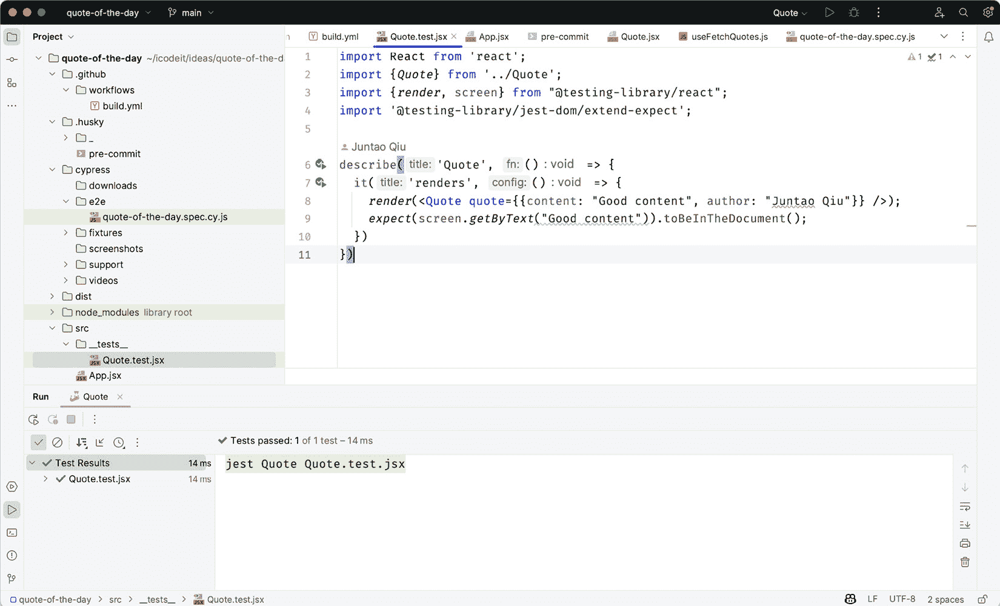
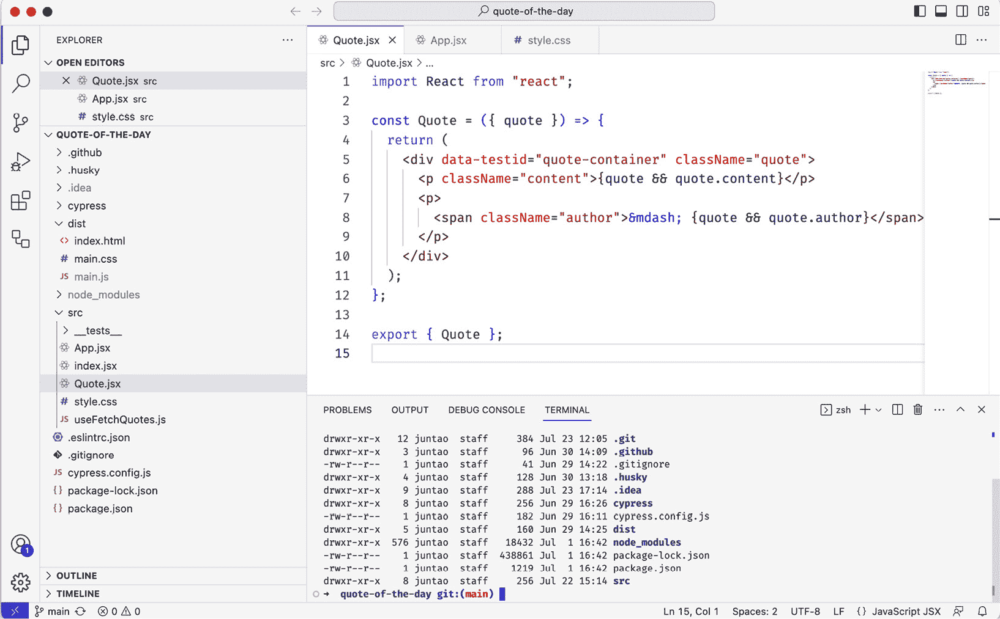

# 第六章：探索常见的重构技术

欢迎来到重构的迷人世界！在本章中，我们将探讨这一基本实践的基础知识，这对于每个开发者在维护和改进代码库方面都是至关重要的。我们的目标是让你熟悉这些最常见重构技术，为你理解和运用这些宝贵工具打下坚实的基础。记住，我们的目标不是提供详尽的指南，而是让你熟悉你在编程旅程中会反复使用的要点。

重构不分语言或框架——它是一个通用的概念，适用于你编写代码的任何地方。我们将讨论的技术包括重命名变量、更改函数声明、提取函数、移动字段等。这些技术乍一看可能很简单，但它们是构建干净、易于理解、易于维护的代码的强大工具。

还要记住，重构不是一个一次性任务，而是一个持续的小型、迭代性更改的过程，这些更改逐渐提高你代码的结构和质量。正是这些频繁的增量改进使代码库保持健康、健壮，并且更容易工作。通过介绍基础知识，我们希望为你提供必要的工具和技术，这些将成为更高级重构方法的垫脚石。

虽然我们将在后面的章节中深入探讨更复杂的重构技术，但你在这里学到的实践将作为一个宝贵的起点。到本章结束时，你将拥有一个常见的重构实践工具包，以及对这些实践在提高代码质量方面重要性的新认识。最终，你在这里开始培养的重构技能将使你能够编写更干净、更高效的代码，并使你走上成为更熟练的开发者的道路。让我们开始吧！

在本章中，我们将涵盖以下主题：

+   理解重构

+   在重构前添加测试

+   使用重命名变量

+   使用提取变量

+   使用管道中的替换循环

+   使用提取函数

+   使用引入参数对象

+   使用分解条件

+   使用移动函数

# 技术要求

已创建一个 GitHub 仓库来托管本书中讨论的所有代码。对于本章，你可以在[`github.com/PacktPublishing/React-Anti-Patterns/tree/main/code/src/ch6`](https://github.com/PacktPublishing/React-Anti-Patterns/tree/main/code/src/ch6)找到推荐的结构。

在我们深入重构之前，让我们与一些有助于我们轻松进行更改的工具保持一致。当谈到重构工具时，前端世界中有很多**集成开发环境**（**IDEs**）和源代码编辑器可用——WebStorm 和 Visual Studio Code（VS Code）是最受欢迎的，它们提供了令人印象深刻的特性，包括强大的重构功能。

**WebStorm**，由 JetBrains 开发，是一个专为 JavaScript 及其相关技术（如 TypeScript、HTML 和 CSS）设计的强大且功能丰富的 IDE。其最显著的特点是其高级自动重构功能，但它还提供了一系列的重构选项，如重命名、提取、内联、移动和复制，这些选项可以应用于变量、类、函数和其他元素。它还具有智能重复代码检测功能，帮助你定位和解决重复的代码块。



图 6.1：WebStorm IDE

WebStorm 的智能感知、自动完成和代码导航功能相当强大，在编写和探索代码时为你提供了很多帮助。然而，WebStorm 是一个商业产品，尽管它提供试用版，但你仍需要购买许可证才能继续使用。

**Visual Studio Code**（**VS Code**），另一方面，是由微软开发的一个免费、开源的集成开发环境（IDE）。与 WebStorm 相比，它更轻量级，以其速度和灵活性而闻名。由于拥有扩展市场，VS Code 支持广泛的编程语言，而不仅仅是 JavaScript。VS Code 的重构功能也很强大，支持常见的操作，如重命名、提取函数或变量以及更改函数签名。通过安装扩展，VS Code 的重构功能可以进一步增强，其可定制性是其关键优势之一。



图 6.2：VS Code

虽然 VS Code 可能没有 WebStorm 那么多的内置自动重构功能，但通过这些扩展，它可以定制以匹配甚至超越 WebStorm 的功能。

在两者之间进行选择通常归结为个人偏好和项目具体需求。如果你重视高度自动化的、功能丰富的环境，并且不介意为此付费，WebStorm 可能是你的最佳选择。然而，如果你更看重速度、灵活性和定制性，并且愿意通过扩展来设置你的环境，那么 VS Code 可能是更好的选择。

我更喜欢 WebStorm 作为我的工作 IDE——部分原因是我已经非常熟悉快捷键，并且我喜欢内置的自动重构功能。然而，我仍然使用 VS Code 进行休闲项目。

# 理解重构

**重构**是一种有纪律、系统的过程，旨在在不改变现有代码库外部行为的情况下改进其设计。它是日常编码的基本方面，是软件开发迭代和增量特性的一个组成部分。这个概念具有普遍适用性，不受任何特定编程语言、框架或范式的限制。无论你是在编写 JavaScript、Python 还是其他任何语言，无论你是在使用 React、Angular 还是自建框架，重构对于维护健康的代码库至关重要。

术语“重构”最初由威廉·奥普迪克和拉尔夫·约翰逊在 1990 年发表的一篇题为《重构：设计应用程序框架和演进面向对象系统的辅助工具》的论文中提出；然而，重构的概念和实践源于软件工程早期的实践。重构的艺术随着马丁·福勒 1999 年出版的书籍《重构：现有代码的设计改进》而获得了显著的关注。在这本书中，福勒将重构描述为“一种控制现有代码库设计的技巧”，强调其在减轻技术债务积累方面的作用，这使得代码更容易理解、维护和扩展。

重构不是关于对代码库进行一次重大、全面的改变以使其完美。相反，它是在一段时间内持续不断地进行小的、渐进的改进。每个单独的改变可能不会显著改变代码的质量，但集体来看，随着时间的推移，这些小的改变可以显著提高代码库的结构、可读性和可维护性。

尽管重构不添加新功能，但它直接影响了团队快速交付新功能的能力，减少错误，并更灵活地应对变化的需求。通过持续重构，我们保持代码的整洁和易于操作，并为长期、可持续的发展奠定基础。

总之，重构是开发者工具箱中的关键工具，无论技术栈或项目的规模和范围如何。它是代码库和团队的长期投资，最终，它是对交付的软件质量的投资。

## 重构的常见错误

人们在重构中犯的最大错误是将代码重构而不是重构代码。术语“重构”和“重构”经常被互换使用，但在软件开发中它们有截然不同的含义。

*重构*是一种提高现有代码库设计的纪律性技术，使其更干净、更容易理解和操作。它涉及在不修改软件外部行为的情况下改变软件的内部结构。这通常以小步骤进行，并且每个重构步骤都应保持软件的功能。它不添加新功能；相反，它使代码更易于阅读、维护，并为未来的变化做好准备。

例如，在一个 React 应用程序中，重构可能包括将一个大型组件拆分成更小、更易于管理的组件，或者用策略模式替换复杂的条件逻辑。

另一方面，重构可以被视为一个更广泛、更彻底的过程。它通常涉及大规模的变更，不仅影响软件的内部结构，还可以影响其外部行为。重构可以包括对软件架构、数据模型、接口等方面的变更。它通常是由引入软件功能或能力的主要变更或添加、提高性能或解决重大技术债务的需求所驱动的。

在 React 应用的背景下，重构可能包括更改状态管理解决方案（例如从 Redux 移动到 React Context API），更新路由机制，或者从单体架构过渡到微前端架构。

虽然重构和重构都旨在提高代码库的质量，但重构通常范围较小，不涉及功能变更，并且是常规开发过程的一部分。相比之下，重构通常范围更广，可以改变功能，并且通常是解决更重大挑战或需求变化的更大项目或倡议的一部分。

除了重构和重构之间的误解之外，人们还倾向于犯的另一个错误是他们测试的频率不够高——有时这是因为他们没有很多测试，而有时他们认为在没有测试的情况下进行这些“小”改动是安全的。让我们在下一节中看看测试。

# 在重构之前添加测试

由于我们不希望在重构期间造成任何可观察的行为变化，我们需要检查代码以确保我们有足够的测试来覆盖当前的行为。如果没有适当的测试，很容易出错，这不仅风险高，而且效率低，因为我们需要手动和反复地检查更改后的代码。

假设我们有一些来自在线购物应用程序的 TypeScript 代码——代码运行正常，但没有与之相关的测试。为了改进代码，使其更容易理解和扩展，我们需要对其进行重构：

```js
interface Item {
  id: string;
  price: number;
  quantity: number;
}
class ShoppingCart {
  cartItems: Item[] = [];
  addItemToCart(id: string, price: number, quantity: number) {
    this.cartItems.push({ id, price, quantity });
  }
  calculateTotal() {
    let total = 0;
    for (let i = 0; i < this.cartItems.length; i++) {
      let item = this.cartItems[i];
      let subTotal = item.price * item.quantity;
      if (item.quantity > 10) {
        subTotal *= 0.9;
      }
      total += subTotal;
    }
    return total;
  }
}
export { ShoppingCart };
```

因此，这段代码定义了一个购物车模型。首先，它定义了一个 `Item` 接口，它代表要添加到购物车中的项目。一个 `Item` 组件由一个 ID、一个价格和一个数量组成。然后，它定义了一个具有 `cartItems` 属性的 `ShoppingCart` 类，该属性是一个 `Item` 对象的数组，最初为空。

`ShoppingCart` 类有两个方法：

+   `addItemToCart` 方法接受一个 ID、价格和数量，然后使用这些参数创建一个项目。然后，这个项目被添加到 `cartItems` 数组中。

+   `calculateTotal` 方法计算购物车中商品的总价。对于每个商品，它将商品的价格乘以其数量以得到小计。如果商品的数量超过 10 个，则对小计应用 10%的折扣。然后将每个商品的子计价相加以得到总价。该方法随后返回总价。

这里有两个重要的计算：计算总价（价格乘以数量）以及在适用的情况下应用折扣。我们通常应该更加关注这些计算的逻辑。

例如，我们需要验证`if-else`语句的两边。由于我们在`for`循环内部有`if-else`，我们至少需要在做出更改之前添加两个测试用例。让我们添加以下 Jest 测试来描述两种计算情况——有折扣和无折扣：

```js
import { ShoppingCart } from "../ShoppingCart";
describe("ShoppingCart", () => {
  it("calculates item prices", () => {
    const shoppingCart = new ShoppingCart();
    shoppingCart.addItemToCart("apple", 2.0, 2);
    shoppingCart.addItemToCart("orange", 3.5, 1);
    const price = shoppingCart.calculateTotal();
    expect(price).toEqual(7.5);
  });
  it('applies discount when applicable', () => {
    const shoppingCart = new ShoppingCart();
    shoppingCart.addItemToCart("apple", 2.0, 11);
    const price = shoppingCart.calculateTotal();
    expect(price).toEqual(19.8);
  })
});
```

第一个测试“计算商品价格”，是验证在没有应用折扣的情况下`calculateTotal`方法是否按预期工作。在这里，创建了一个`ShoppingCart`对象，并向购物车中添加了两个商品（`apple`和`orange`）。这些商品的总价计算出来应该是 7.5，因为有两个苹果，每个 2 美元，还有一个橙子，3.5 美元。

第二个测试“在适用时应用折扣”，是检查当商品的数量超过 10 个时，`calculateTotal`方法是否正确地应用了 10%的折扣。在这种情况下，创建了一个`ShoppingCart`对象，并向购物车中添加了一种商品（`apple`），数量为 11。在应用了 10%折扣后的子计价 22 美元（11 个苹果，每个 2 美元）后，该商品的总价应该是 19.8 美元。然后，计算出的总价与这个预期值进行比较。

一旦我们有测试用例来覆盖重要的逻辑，我们就可以安全地进行更改。在重构过程中，我们需要定期运行这些测试。

重构是小的步骤，可以提高代码质量。让我们看看我们非常第一个，也许是最简单的重构技术：**重命名变量**。

## 使用重命名变量

让我们从一种简单的重构技术“重命名变量”开始。重命名变量是一种非常直接且有效的方法，可以提高代码的可读性和可维护性。它涉及更改变量的名称，以更好地反映其目的和所持有的数据，或遵循某种命名约定或标准。

有时，在编码的初期阶段，开发者可能会为变量选择当时有意义的名称，但随着代码的发展，变量的目的可能会改变或变得更加清晰。然而，变量名往往保持不变。这可能会导致混淆，并使代码更难以理解和维护。将变量重命名为更准确地描述其目的可以减少未来读者（包括当前开发者的未来自我）的认知负担。

让我们回到我们的 `ShoppingCart` 示例。`ShoppingCart` 类内部的变量名 `cartItems` 稍显冗余；然而，我们可以将其重命名为 `items` 以使其更加简洁和清晰：

```js
class ShoppingCart {
  items: Item[] = [];
  addItemToCart(id: string, price: number, quantity: number) {
    this.items.push({ id, price, quantity });
  }
  calculateTotal() {
    let total = 0;
    for (let i = 0; i < this.items.length; i++) {
      let item = this.items[i];
      let subTotal = item.price * item.quantity;
      if (item.quantity > 10) {
        subTotal *= 0.9;
      }
      total += subTotal;
    }
    return total;
  }
}
```

在更改后，请确保再次运行测试，以查看我们是否意外地犯了错误。

在进行一些更改后，定期运行测试并建立习惯是很重要的，并且每当测试失败时，我们需要停下来检查哪里出了问题。一旦所有测试都恢复正常通过，我们就可以继续进行。

# 使用提取变量

**提取变量**是一种常见的重构技术，用于提高代码的可读性和可维护性。这个过程涉及取一段计算值的代码，用一个新的变量替换它，并将原始表达式的结果分配给这个新变量。还有一种类似的重构称为**提取常量**，可以用来提取在运行时不改变的值。

这种重构技术在处理复杂表达式或重复计算时特别有用；通过将表达式的部分提取到具有有意义名称的变量中，代码变得更加易于理解和维护。

在 `ShoppingCart` 示例中，`0.9` 折扣率值得有一个自己的名字；我们可以在函数调用点提取一个变量并引用它。由于变量的值在运行时不会改变，我们可以在这种情况下将其称为**提取常量**：

```js
const DISCOUNT_RATE = 0.9;
class ShoppingCart {
  //...
  calculateTotal() {
    let total = 0;
    for (let i = 0; i < this.items.length; i++) {
      let item = this.items[i];
      let subTotal = item.price * item.quantity;
      if (item.quantity > 10) {
        subTotal *= DISCOUNT_RATE;
      }
      total += subTotal;
    }
    return total;
  }
  //...
}
```

为了清晰起见，讨论中省略了与此次特定更改无关的代码部分；然而，需要注意的是，在这个例子中，我们创建了一个名为 `DISCOUNT_RATE` 的常量，并在代码中使用它来替代之前硬编码的 `0.9` 值。有时，我们可能希望给一个表达式而不是硬编码的值命名，因此我们可以创建一个变量来代表这个表达式，然后引用这个变量。

这只是一个小小的步骤，但它略微改进了代码。如果我们将来需要更改折扣率，常量名称比硬编码的 `0.9` 值更容易搜索和理解。

现在我们可以调查另一种重构技术，使 `for` 循环变得更加简单。

# 使用替换循环与管道

在像 JavaScript 这样的函数式编程语言中的 `map`、`filter` 和 `reduce`。

在 JavaScript 的情况下，数组原型有 `map`、`filter` 和 `reduce` 等方法，可以将它们链接起来形成一个管道。这些方法中的每一个都接收一个函数作为参数，并将此函数应用于数组中的每个元素，从而以某种方式有效地转换数组。

然而，请注意，虽然用管道替换循环可以使代码更简洁、更易读，但这可能并不总是最有效的方法，尤其是在处理非常大的数据集时。因此，就像所有重构一样，在需要多次遍历大型数据集的情况下，你需要平衡可读性和可维护性与性能要求。

上一节中的`for`循环可以用`reduce`函数（我们不需要显式定义索引变量或保存样板代码）来替换：

```js
class ShoppingCart {
  //...
  calculateTotal() {
    return this.items.reduce((total, item) => {
      let subTotal = item.price * item.quantity;
      return total + (item.quantity > 10 ? subTotal * DISCOUNT_RATE : 
       subTotal);
    }, 0);
  }
  //...
}
```

`calculateTotal()`方法正在使用`reduce()`函数来计算购物车中物品的总价。`reduce()`函数是一个高阶函数，它将一个函数应用于累加器和数组中的每个元素（从左到右），以将其减少到单个输出值。

总计从 0 开始，然后对于购物车中的每一项，都会将该项目的`subTotal`变量加到总计中。`subTotal`变量是通过乘以每个项目的价格和数量来计算的。

接下来，我们需要重新运行所有测试，以检查一切是否顺利。由于我们的测试仍然通过，让我们看看如何通过将行提取到更小的函数中来使代码更加完善。

# 使用提取函数

**提取函数**是一种重构技术，通过将大型或复杂的函数分解成更小、更易于管理的部分，有助于提高代码的可读性和可维护性。

假设你遇到一个执行多个任务的函数。也许它正在进行一些数据验证，然后进行一些计算，最后记录结果或更新某些状态。这个函数很长且复杂，使得一眼看去很难理解它在做什么。提取函数重构就是关于识别那些不同的功能部分，将它们拉出到它们自己的独立函数中，然后从原始函数中调用这些新函数。

一个关键的好处是它使代码更具自文档性。如果你将函数的一部分提取到新的函数中并给它一个有意义的名称，它通常可以使代码更容易理解，因为函数名可以描述代码正在做什么。它还提高了代码的可重用性，因为这些较小的函数如果需要可以在其他地方重用。

计算如何计算`subTotal`变量的逻辑可以从`calculateTotal`中提取为一个独立的单元：

```js
function applyDiscountIfEligible(item: Item, subTotal: number) {
  return item.quantity > 10 ? subTotal * DISCOUNT_RATE : subTotal;
}
class ShoppingCart {
  //...
  calculateTotal() {
    return this.items.reduce((total, item) => {
      let subTotal = item.price * item.quantity;
      return total + applyDiscountIfEligible(item, subTotal);
    }, 0);
  }
}
```

在这个代码片段中，我们看到提取函数重构的结果。如果项目数量大于 10，应用折扣的逻辑已经被提取到名为`applyDiscountIfEligible`的独立函数中。

在 `ShoppingCart` 类中，`calculateTotal` 方法使用 `reduce` 函数计算购物车中物品的总价。对于每个物品，它计算小计作为物品价格和数量的乘积，然后将这个小计（在应用任何符合条件的折扣后）加到总金额上。

`applyDiscountIfEligible` 函数接受一个物品及其数量作为参数。如果物品的数量超过 10，它将对参数 `subTotal` 应用折扣率（表示为 `DISCOUNT_RATE`）；否则，它简单地返回参数 `subTotal` 而不改变。

通过将如何应用折扣的细节抽象到单独的、适当命名的函数中，这种重构使 `calculateTotal` 方法更加简洁且易于阅读。

让我们看看另一种重构方法，可以使传入的参数更容易修改。

# 使用引入参数对象

**引入参数对象** 是一种重构技术，用于函数有大量参数或多个函数共享相同参数时。在这种技术中，你将相关的参数组合成一个单一的对象，并将其传递给函数。

函数中有大量参数可能会令人困惑且难以管理。将相关的参数组合成一个对象可以增加代码的可读性，并使理解函数的功能更容易。这还使函数调用更简单、更清晰。此外，如果同一组参数在多个函数调用中使用，这种技术可以减少传递参数顺序错误的机会。

例如，考虑一个 `calculateTotalPrice(quantity, price, discount)` 函数。我们可以使用引入参数对象技术对其进行重构，变为 `calculateTotalPrice({ quantity, price, discount })`。现在，`quantity`、`price` 和 `discount` 参数被组合成一个对象（类型为 `Item`），如下所示：

```js
class ShoppingCart {
  items: Item[] = [];
  addItemToCart({id, price, quantity}: Item) {
    this.items.push({ id, price, quantity });
  }
  //...
}
```

除了这些好处，引入参数对象重构通常可以揭示或激发之前在代码中隐藏和隐含的领域概念。参数对象可能成为一个具有自己行为和数据操作方法的类。这可能导致更面向对象和封装的代码。

接下来，让我们探索另一种重构技术，旨在简化你的 `if-else` 语句并提高代码可读性。

# 使用分解条件

将 `if-else` 或 `switch`）提取到单独的函数中。这种技术有助于提高代码的可读性，使其更易于理解。

条件、`if` 子句和 `else` 子句（如果存在）都各自有自己的函数。然后根据它们所做的工作或它们所检查的内容来命名这些函数。这种重构的好处是，它用有良好命名的函数替换了可能需要注释来理解的代码，使代码更具自解释性。

例如，`applyDiscountIfEligible` 函数中的逻辑实际上可以通过这种重构来简化；我们可以提取一个名为 `isDiscountEligible` 的小函数来替换 `item.quantity > 10` 检查，如下所示：

```js
function isDiscountEligible(item: Item) {
  return item.quantity > 10;
}
function applyDiscountIfEligible(item: Item, subTotal: number) {
  return isDiscountEligible(item) ? subTotal * DISCOUNT_RATE : subTotal;
}
```

在这个代码片段中，将逻辑提取到单独的函数中可能看起来是多余的，因为它添加了一个额外的函数调用。然而，它增强了可读性和可重用性：

```js
function isDiscountEligible(item: Item) {
  return item.quantity > 10;
}
function applyDiscountIfEligible(item: Item, subTotal: number) {
  return isDiscountEligible(item) ? subTotal * DISCOUNT_RATE : 
   subTotal;
}
```

在这个代码片段中，我们将确定项目是否有资格获得折扣的逻辑分离到一个独立的 `isDiscountEligible` 函数中。这种提取使我们的 `applyDiscountIfEligible` 函数更简洁，其意图更明显。此外，它还允许在将来需要时独立更新 `isDiscountEligible` 逻辑，提高可维护性。

提取了这些较小的函数后，它们不必保留在当前文件中。我们可以将它们重新定位到单独的模块中，并在需要时导入它们；这不仅缩短了当前模块的长度，还提高了其可读性。让我们看看下一个例子。

# 使用移动函数

**移动函数**是一种重构方法，涉及将函数的位置更改为更合适或更适当的位置。这可能是同一类、不同类，甚至是单独的模块。这种方法的目标是通过确保函数放置在它们逻辑上最适合的位置来提高代码的可读性、可维护性和结构。

当你的类随着时间的推移而演变责任时，这种重构变得必要。你可能会发现某个函数更适合不同的类，或者也许你有一个在类中一起工作的函数组，它们更适合在自己的类或模块中。

移动函数重构可以通过将函数移动到它们的功能最相关或最需要的地方来帮助减少类的复杂性。这促进了内聚原则，即相关的代码放在一起。它还有助于通过最小化代码不同部分之间不必要的依赖来实现松耦合。

在我们的 `ShoppingCart` 组件中，我们可以将类型定义移动到一个名为 `types.ts` 的新文件中。我们还可以将 `DISCOUNT_RATE`、`isDiscountEligible` 和 `applyDiscountIfEligible` 移动到一个名为 `utils.ts` 的单独文件中：

```js
import { Item } from "./types";
const DISCOUNT_RATE = 0.9;
function isDiscountEligible(item: Item) {
  return item.quantity > 10;
}
export function applyDiscountIfEligible(item: Item, subTotal: number) {
  return isDiscountEligible(item) ? subTotal * DISCOUNT_RATE : 
   subTotal;
}
```

注意，在代码中，只有 `applyDiscountIfEligible` 是公共函数，可以在文件外部访问。这种重构也提高了代码的封装性。

使用了移动函数后，`ShoppingCart` 组件被显著简化，只包含必要的部分：

```js
import { Item } from "./types";
import { applyDiscountIfEligible } from "./utils";
class ShoppingCart {
  items: Item[] = [];
  addItemToCart({ id, price, quantity }: Item) {
    this.items.push({ id, price, quantity });
  }
  calculateTotal() {
    return this.items.reduce((total, item) => {
      let subTotal = item.price * item.quantity;
      return total + applyDiscountIfEligible(item, subTotal);
    }, 0);
  }
}
export { ShoppingCart };
```

与所有重构一样，在移动函数时应小心，以确保系统的整体行为没有改变。应该有测试来验证重构后功能保持不变。

# 摘要

本章重点介绍了各种代码重构技术，这些技术对于维护和改进代码库的结构、可读性和可维护性至关重要。

介绍的重构技术包括：重命名变量，通过使用更具描述性的变量名来提高代码清晰度；提取变量，通过将复杂表达式分解成更小、更易于管理的部分来简化表达式；以及用管道替换循环，将传统的`for`/`while`循环转换为更简洁、声明式的更高阶函数，如`map`、`filter`和`reduce`。

此外，提取函数通过将大函数分解成更小的函数，每个函数都有单一、明确的职责，来鼓励代码模块化和可重用性，而引入参数对象将相关参数组合成一个单一对象，从而简化函数签名。此外，分解条件将复杂的条件逻辑分解成单独的函数，提高可读性，移动函数确保函数被放置在代码库中最合理和适当的位置，促进高内聚和松耦合。

在所有这些技术中，我们强调了保持相同整体系统行为和依赖测试来确保功能在重构后保持一致性的重要性。这些方法如果正确应用，可以导致代码库更加易于理解、易于维护和更健壮。

在下一章中，我们将探讨一种提升代码质量卓越的方法——被称为测试驱动开发的方法。
