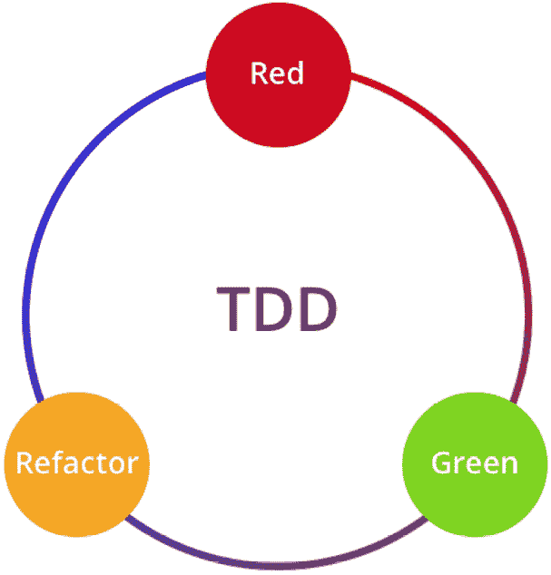
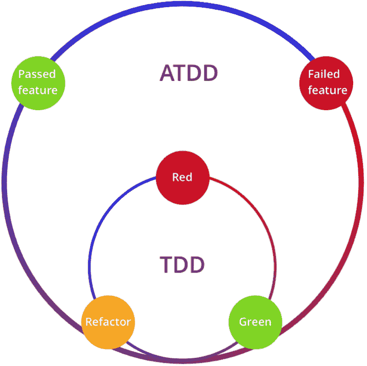
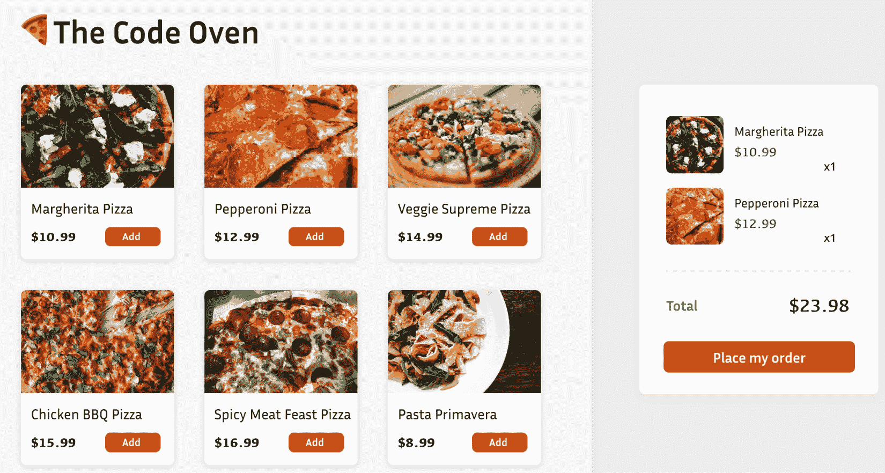
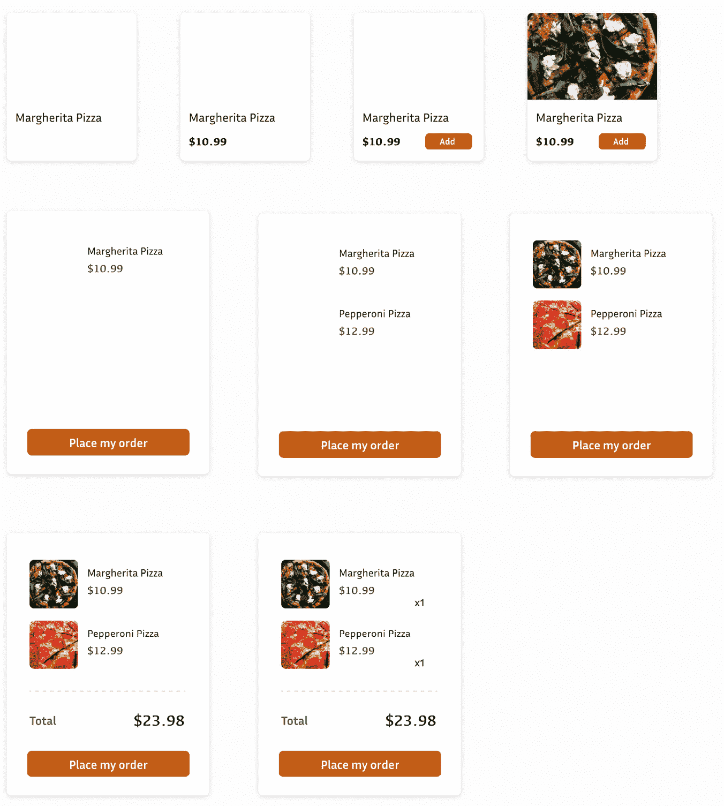
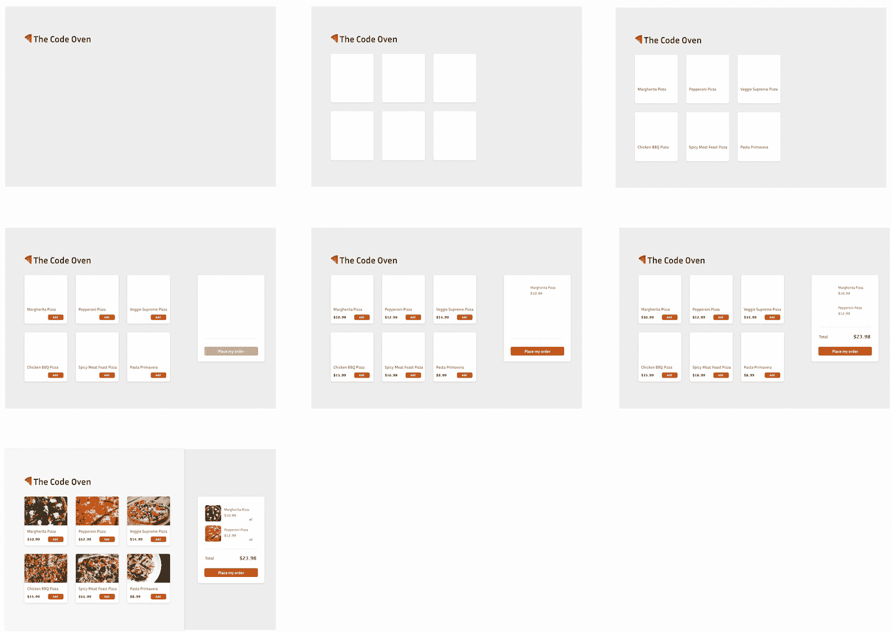
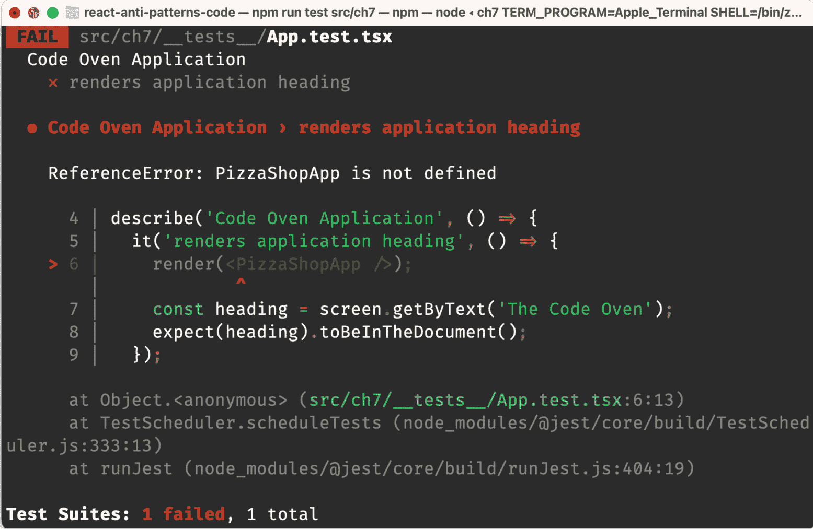

# 第七章：介绍使用 React 的测试驱动开发

欢迎来到一个可能彻底改变你对 React 开发方法的章节——**测试驱动开发**（或简称**TDD**）。如果你一直在构建 React 应用程序，你知道它们可以多么复杂和错综复杂。要管理各种状态、处理组件和促进用户交互，确保代码库的可靠性可能具有挑战性。这就是 TDD 发挥作用的地方。

在软件开发的不断变化环境中，功能持续添加或修改，TDD（测试驱动开发）就像一座灯塔，引导你安全地穿越充满错误和回归的险恶海域。通过在编写实际代码之前编写测试，你不仅确认了你的代码做了它应该做的事情，而且还创建了一个安全网，使得未来的变更风险降低。

本章旨在加深你对 TDD 的理解，以及如何在 React 应用程序中有效地实施它。我们将介绍 TDD 的核心原则，探讨各种风格，包括单元测试驱动开发、**验收测试驱动开发**（**ATDD**）、**行为驱动开发**（**BDD**），甚至检查芝加哥和伦敦风格 TDD 的细微差别。

但我们不会止步于理论——为了使这些概念生动起来，我们将通过创建比萨店菜单页面的实际示例来引导你。从设置初始结构到管理复杂功能，我们将使用 TDD 方法指导你每一步。到本章结束时，你将牢固掌握 TDD 的能力，并准备好开始编写更可靠、更健壮的 React 应用程序。

因此，准备好进入一个测试引领方向、代码跟随的世界，创造出一个和谐平衡，从而产生更好、更可靠的软件。

本章将涵盖以下主题：

+   理解测试驱动开发（TDD）

+   介绍任务管理

+   介绍在线比萨店应用程序

+   拆分应用程序需求

+   实现应用程序标题

+   实现菜单列表

+   创建购物车

+   向购物车添加商品

+   重构购物车

# 技术要求

已创建一个 GitHub 仓库来托管本书中讨论的所有代码。对于本章，你可以在[`github.com/PacktPublishing/React-Anti-Patterns/tree/main/code/src/ch7`](https://github.com/PacktPublishing/React-Anti-Patterns/tree/main/code/src/ch7)找到推荐的结构。

# 理解测试驱动开发（TDD）

TDD 并不是一个新出现的概念。它起源于**极限编程**（**XP**），这是一种鼓励在短周期内频繁发布的软件开发方法，TDD 的根源可以追溯到 20 世纪 90 年代末。是敏捷宣言的原始签署人之一，肯特·贝克，将这一实践普及为 XP 的核心部分。自那时起，这一实践已经超越了 XP 的领域，现在在包括 React 在内的各种方法和框架中普遍使用。

TDD 的核心是一个简单而效果显著的循环，被称为**红-绿-重构循环**：



图 7.1：红-绿-重构循环

如你所见，在实践 TDD 时，本质上有三个步骤：

+   **红**：在这个阶段，你编写一个定义函数或函数改进的测试。这个测试最初应该失败，因为函数尚未实现。在大多数测试框架（例如，Jest）中，将有一些红色文本来指示失败。

+   **绿**：在这个阶段，你编写通过测试所需的最少代码。关键在于编写尽可能少的代码来使测试通过，使文本变为绿色——不多于此。

+   **重构**：最后，你需要保持代码的功能性，同时对其进行清理。重构阶段是关于使代码高效、可读和易于理解，而不改变其行为。重构后编写的测试应该仍然通过。

当开发者第一次接触 TDD 时，它往往感觉不合直觉，因为编写测试在编写实际代码之前与传统的开发直觉相矛盾。然而，一旦你克服了最初的不适，TDD 的优势就很难忽视了：

+   **专注的问题解决**：通过首先编写一个针对特定功能的测试，你将注意力集中在一次解决一个问题，使开发过程不那么令人压倒。

+   **可预测的下一步行动**：当你遵循测试驱动的方法时，你总是知道下一步该做什么：使测试通过。这减少了认知负荷，使你更容易专注于手头的任务。

+   **简单、可维护的设计**：这个过程自然鼓励编写通过测试所需的最简单代码，从而产生尽可能最小化的设计，因此更容易理解和维护。

+   **促进思维流畅性**：这个循环提供了一个结构化的编码方法，有助于保持“思维流畅性”，通过减少打断高效编码会话的持续上下文切换，帮助你保持对任务的专注。

+   **自动测试覆盖率**：TDD 默认确保你的应用程序具有强大的测试覆盖率。你并不是在事后添加测试；它们是开发过程的一部分，确保代码库更加稳定。

TDD 是一种深深植根于敏捷和 XP 原则的实践，但它已经超越了这些方法论的相关性。凭借其结构化的红-绿-重构循环，TDD 为编写高质量代码提供了一个坚实的框架。尽管最初可能看起来有些反直觉，但采用 TDD 可以导致更专注的问题解决、可预测的开发、更简单的设计、提高的生产力和稳健的测试覆盖率。

## TDD 的不同风格

TDD 的核心原则已经被适应和扩展到各种风格中，每种风格都提供了对如何最好地处理测试和开发的不同视角。让我们探索一些这些风格，了解它们如何应用于 React 开发。

TDD 的原始形式，简单地称为 TDD，主要关注单元测试。在这种风格中，你为代码的最小部分编写测试——通常是单个方法或函数。目标是确保代码库的每个部分在独立的情况下都能按预期工作。虽然这对于测试逻辑和算法来说很强大，但它可能无法完全捕捉到各个部分之间的交互，尤其是在像 React 这样的复杂 UI 框架中。

ATDD 通过在开发过程开始时使用用户验收测试来扩展 TDD。这意味着在编写任何代码之前，你需要从用户的角度定义“完成”的样子，这通常与利益相关者合作完成。然后，这些验收测试被用作开发特性的基础。ATDD 特别有助于确保你正在构建用户需要和想要的东西：



图 7.2：ATDD 循环

注意，当你编写一个验收测试时，它通常可以被分解成更小的单元测试。例如，用户登录系统可以是一个验收测试，但还需要考虑忘记密码、密码或用户名错误、记住我功能等情况，这些都需要在更底层的单元测试中涵盖。

BDD 是 TDD 和 ATDD 的进一步细化，专注于给定输入的应用程序行为。而不是编写检查特定方法是否返回预期值的测试，BDD 测试检查系统在受到某些条件影响时是否按预期行为。BDD 经常使用更描述性的语言来定义测试，这使得非技术利益相关者更容易理解正在测试的内容。

BDD 经常使用诸如**Cucumber**之类的工具，以人类可读的格式定义行为规范。在 Cucumber 测试中，你使用一种名为**Gherkin**的纯文本语言来指定行为。以下是一个使用 Cucumber 进行比萨订购功能 BDD 测试用例的简单示例（我们将在本章后面继续探讨这个比萨示例）：

```js
Feature: Pizza Ordering
  Scenario: Customer orders a single pizza
    Given I'm on the PizzaShop website
    When I select the "Order Pizza" button
    And I choose a "Margherita" pizza
    And I add it to the cart
    Then the cart should contain 1 "Margherita" pizza
  Scenario: Customer removes a pizza from the cart
    Given I'm on the PizzaShop website
    And the cart contains 1 "Margherita" pizza
    When I remove the "Margherita" pizza from the cart
    Then the cart should be empty
```

此 Gherkin 文件定义了比萨订购功能的预期行为。每一行被称为一个步骤，可以解释为测试中的一个语句。场景描述了测试的行为，包括要执行的步骤和预期的结果。

Gherkin 语法不仅仅是可读的文档，它还是可执行的。例如，Cucumber 这样的工具可以解析 Gherkin 文件并根据它们执行测试——例如，`cypress.visit("`[`pizzashop.com`](http://pizzashop.com)"`)`。这确保了软件的行为与特性文件中描述的完全一致，使其成为随着应用程序发展而演变的真相来源。

BDD 特性文件（Gherkin）作为活文档的一种形式，随着应用程序的变化而更新。这使得它们对于新团队成员，甚至对于经验丰富的开发者来说，快速理解应用程序的预期行为非常有价值。

## 关注用户价值

无论你选择哪种风格，当与 React 一起工作时，关注用户的视角至关重要。React 组件是用户与之交互的 UI 部分，因此你的测试应该反映这种交互。用户不关心你的状态是如何管理的，或者你的生命周期方法有多高效；他们关心的是点击按钮是否会显示下拉菜单，或者表单提交是否会产生预期的结果。

React Testing Library 的创造者 Kent C. Dodds 说：“*你的测试越接近你的软件的使用方式，它们就能给你带来越多的信心。*”这个原则适用于所有框架或库，无论你使用什么。始终应该关注用户体验。

这种以用户为中心的方法与 BDD 和 ATDD 非常吻合，其中关注的是交互的结果，而不是实现的细节。通过遵循这些原则，你可以确保你的 React 组件不仅工作良好，而且能够提供你希望实现的用户体验。

现在我们已经了解了 TDD 是什么以及它的各种风格如何帮助向我们的客户提供价值，接下来要解决的问题是如何实施它？

# 介绍任务分配

**任务分配**是 TDD 流程中的一个重要步骤，涉及将特性或用户故事分解为小而可管理的任务，这些任务随后成为你的测试用例的基础。任务分配的目标是为你将要编写的代码、如何测试它以及你将如何按顺序进行提供一个清晰的路线图。

将大需求分解成更小的块有很多好处：

+   **它明确了范围**：将特性分解为任务有助于更好地理解需要做什么以及如何着手

+   **它简化了问题**：通过将复杂问题分解成更小的任务，你使它更容易解决

+   **它优先处理工作**：一旦任务被列出，它们可以被优先处理，以首先提供最大的价值，或者按逻辑顺序构建。

+   **它集中精力**：任务分配确保你写的每个测试都有一个明确、直接的目的，使你的 TDD 循环更加高效

+   **促进协作**：团队成员可以挑选个别任务，因为他们知道他们都在为整体贡献。

现在，你可能想知道，既然它如此好且有用，我们该如何进行任务分配？这并不复杂——你可能已经不知不觉中做过。你只需遵循以下步骤：

1.  **回顾用户故事或需求**：理解你要实现的用户故事或功能。

1.  **识别逻辑组件**：将故事分解为其逻辑组件，这些组件通常对应于领域概念、业务规则或用户工作流程中的单个步骤。

1.  **创建任务列表**：写下任务列表。这些任务应该足够小，以至于你可以在短时间内编写一些测试用例和相应的实现代码（比如，15 到 30 分钟）。

1.  **安排任务顺序**：确定完成这些任务的最合理顺序，通常从“正常路径”开始——即一切按预期进行，没有遇到任何错误的默认场景——然后转向边缘情况和错误处理。

1.  **将任务映射到测试上**：对于每个任务，确定将验证该功能部分的测试。在这个阶段，你不需要编写测试；你只是在识别它们。

任务分配可能是你日常工作中的一部分，即使你没有意识到。这是一种系统化的解决问题的方法，涉及将需求分解成可管理的、顺序化的任务。这些任务理想情况下应该在几分钟到一小时内完成。

TDD 的过程类似于绘画艺术。你从一个草图或草案开始，用铅笔勾勒出基本形状和线条，就像为你的代码构建初始结构。一开始，愿景可能很模糊，只是你心中的一个想法或概念。但随着你的绘制——或编写测试和代码——图像开始成形。更多的元素被添加，细节出现，并进行调整，允许持续优化。每一层或迭代，清晰度出现，但确切的最终外观直到最后阶段仍然是个谜。就像艺术家通过逐步发展创作出杰作一样，TDD 塑造了一个强大而优雅的软件作品。

好吧，到目前为止我们已经讨论了很多理论。让我们通过一个具体的例子来深入了解如何进行任务分配，并使用任务作为应用红-绿-重构循环的指南。

# 介绍在线披萨店应用程序

在本节中，我们将通过一个美味实用的例子深入探讨 TDD 过程：*代码烤箱*，一个在线披萨店。这个名字是为了庆祝编码和烹饪艺术的融合，代码烤箱旨在满足你的食欲和智力好奇心。这个数字店面将为我们提供一个全面的沙盒，我们可以在这里应用我们讨论的所有 TDD 原则和技术。

在代码烤箱中，你可以期待看到以下内容：

+   **披萨菜单**：Code Oven 的核心是一个令人垂涎的八种美味披萨菜单。每个披萨都附有它的名称和价格，旨在刺激您的食欲并指导您的选择。

+   **添加按钮**：在每个令人垂涎的选择旁边都有一个“添加”按钮。这使用户能够通过将所选披萨添加到虚拟购物车中来开始订购过程。

+   **购物车**：屏幕上的一个指定区域显示了用户的当前购物车，包括每个所选披萨的名称和价格。

+   **修改购物车**：如果您改变主意或只是想要更多的披萨，Code Oven 允许您通过动态添加或删除项目来修改您的购物车。

+   **订单总额**：无需手动计算 – Code Oven 的购物车会自动计算并显示您所选商品的总价。

+   **下单按钮**：一个显眼的“下单”按钮是最终步骤，在现实世界的应用程序中，这将处理订单以进行配送或自取：



图 7.3：The Code Oven

随着我们构建 The Code Oven，我们将在每个阶段应用 TDD，以确保我们的虚拟比萨店不仅功能齐全，而且稳健且易于维护。准备好卷起袖子，无论是编码还是进行一些虚拟比萨制作！

# 分解应用程序需求。

制作应用程序的需求分解并没有一个通用的正确方法；然而，通常有两种不同的风格 – 自下而上的风格和自上而下的风格。

在 TDD 的自下而上风格中，开发者从编写测试和实现系统中最小和最基本组件的功能开始。这种方法强调构建单个单元或类，在将它们集成到更高层次的组件之前，对它们进行彻底测试。它为系统的底层部分提供了强大的验证，并有助于创建一个稳健的基础。

然而，如果未仔细考虑整体图景和单元之间的交互，这种风格可能会导致组件集成的挑战。

回到在线披萨店，我们可以将整个页面分解为以下任务：

+   实现一个带有披萨名称的单一 `PizzaItem` 组件。

+   向 `PizzaItem` 添加价格。

+   向 `PizzaItem` 添加一个按钮。

+   实现一个 `PizzaList` 组件（例如，一行显示三个项目）。

+   实现一个简单的带有按钮的 `ShoppingCart` 组件。

+   支持向 `ShoppingCart` 组件添加/删除项目的能力。

+   添加计算总披萨数量的计算。

+   使用这些独立的独立组件实现整个应用程序。

如您所见，每个任务都专注于一次一个组件。组件从简单的最小功能开始；然后，我们逐步向它们添加更多功能，包括测试用例以覆盖所需的功能，以及其他合理的边缘情况。

因此，我们从单个`PizzaItem`组件（其中只包含名称）开始，然后给它一个价格，然后是一个按钮。一旦构建了单个项目，我们就开始实现`PizzaList`，然后是`ShoppingCart`。然后，一旦`PizzaList`和`ShoppingCart`完成，我们就将它们集成起来，并从用户的角度测试几个整体功能。

例如，如以下截图所示，我们可能从一个`PizzaItem`组件开始，逐步实现组件，而不必担心应用程序中的其他任何事情。一旦我们有了`PizzaItem`的完整实现（包括图片、名称、价格和`ShoppingCart`）：



图 7.4：自底向上的风格

TDD 的自顶向下风格采取相反的方法，从系统的高层架构和整体功能开始。开发者首先编写测试并为主要组件实现功能，然后逐步向下到更详细和具体的功能。

这种风格有助于确保系统的主要目标和工作流程在早期就确立，为开发过程提供清晰的路线图。它可以促进更好的集成和与整体目标的对齐，但有时可能需要使用临时的“占位符”或“模拟”来在开发之前模拟低级组件。例如，我们可以将功能分解为以下列表：

+   实现页面标题

+   实现一个包含披萨名称的菜单列表

+   实现一个只有按钮的`ShoppingCart`组件（默认禁用）

+   当按钮被点击时，将项目添加到`ShoppingCart`中，之后`ShoppingCart`按钮被启用

+   为`ShoppingCart`组件添加价格

+   为`ShoppingCart`添加所选项目的总数

+   从`ShoppingCart`中移除项目，总数量相应变化

对于自顶向下的方法，我们没有一个清晰的各个单元的图片，只有一个整体工作的应用程序——因此我们是从外部看到应用程序，而不了解实现细节。

例如，一开始并没有`PizzaItem`组件，当我们发现组件太大时，较小的组件会逐渐从较大的组件中提取出来。这意味着我们始终会有功能性的软件在运行（即使我们一开始没有小而精良的组件），这样我们就可以在任何时候停止，而不会破坏功能。

使用自顶向下的方法可能出现的分解情况如下所示。我们从一个空列表开始，然后是一个包含披萨名称的列表，接着是一个允许用户添加项目并进入下一步的购物车：



图 7.5：自顶向下的风格

（前一个图中的文本细节已被最小化，并且与您理解它不直接相关。如果您想查看文本细节，请参阅免费可下载的电子书。）

这两种风格都为现代软件开发中的丰富方法论做出了贡献，并且它们都不是绝对“正确”或“错误”的。相反，它们提供了不同的视角和工具，开发者可以根据自己的特定需求和偏好进行选择。

在本章的后续部分，我们将使用自顶向下的风格，因为它迫使我们从用户的角度思考。我们将在介绍其他设计模式时，在下一章中更详细地探讨自底向上的方法。

# 实现应用程序标题

让我们从实现披萨店应用程序开始。如果您已经克隆了*技术要求*部分中提到的仓库，只需转到`react-anti-patterns-code/src/ch7`文件夹。

由于我们正在应用 TDD，这里的第一件事是编写一个失败的测试。在上一节中，我们提到了我们想要测试的内容：实现页面标题。

那么，让我们创建一个名为`App.test.tsx`的文件，并包含以下代码：

```js
import React from 'react';
import {render, screen} from '@testing-library/react';
describe('Code Oven Application', () => {
  it('renders application heading', () => {
    render(<PizzaShopApp />);
    const heading = screen.getByText('The Code Oven');
    expect(heading).toBeInTheDocument();
  });
});
```

我们正在为尚未创建的`PizzaShopApp` React 组件编写测试。使用 React Testing Library，我们将渲染此组件并验证它是否包含一个标记为`expect(heading).toBeInTheDocument();`的断言，这确认了标题已成功渲染。

现在，让我们在终端窗口中运行以下命令来运行测试：

```js
npm run test src/ch7
```

终端将显示一个错误，说`ReferenceError: PizzaShopApp is not defined`，如下所示：



图 7.6：失败的测试

现在，我们处于红-绿-重构循环的红阶段，因此我们需要使用尽可能简单的代码使代码通过。一个静态组件返回`PizzaShopApp`，在测试文件中返回仅包含字符串的代码：

```js
import React from 'react';
import {render, screen} from '@testing-library/react';
function PizzaShopApp() {
  return <>The Code Oven</>;
}
describe("Code Oven Application", () => {
  it("renders application heading", () => {
    render(<PizzaShopApp />);
    const heading = screen.getByText("The Code Oven");
    expect(heading).toBeInTheDocument();
  });
});
```

当我们重新运行测试时，它通过了，因为`PizzaShopApp`确实做了测试所期望的事情——它显示了**The Code Oven**。现在，我们处于红-绿-重构循环的绿阶段。接下来，我们可以探讨改进的机会。

我们不希望在测试文件中编写所有代码——相反，我们可以将`PizzaShopApp`放入一个名为`App.tsx`的单独文件中。现在，实现部分位于自己的文件中，这使我们能够分别更改测试和组件：

```js
import React from "react";
export function PizzaShopApp() {
  return <>The Code Oven</>;
}
```

太棒了！这样一来，我们就完成了一个完整的红-绿-重构循环。现在我们可以从任务列表中移除这个任务，继续下一个任务。

注意

我们知道 TDD 是一个迭代过程，因此代码在开始时不必完美；我们总有改进代码的机会，因为我们有良好的测试来保护我们。

# 实现菜单列表

即使是一个只显示比萨名称的基本菜单列表，对于想要浏览和决定吃什么顾客来说也是有价值的。虽然《代码烤箱》还没有设置好在线订购，但它是一个有用的起点。

看看我们列表上的第二个任务，我们可以这样编写我们的第二个测试：

```js
it("renders menu list", () => {
  render(<PizzaShopApp />);
  const menuList = screen.getByRole('list');
  const menuItems = within(menuList).getAllByRole('listitem');
  expect(menuItems.length).toEqual(8);
});
```

这个测试首先渲染组件。然后，它从渲染的组件中识别带有`list`角色的 HTML 元素。使用`within`函数，它将搜索范围缩小到仅限于该列表，并定位其中所有带有`listitem`标签的项目。最后，它断言这些项目的数量应该等于`8`（比萨店提供的项目数量）。本质上，我们希望在页面上显示八个列表项。

现在，测试失败了。为了使测试容易通过，我们可以在页面上硬编码八个空列表项：

```js
import React from "react";
export function PizzaShopApp() {
  return <>
    <h1>The Code Oven</h1>
    <ol>
      <li></li>
      <li></li>
      <li></li>
      <li></li>
      <li></li>
      <li></li>
      <li></li>
      <li></li>
    </ol>
  </>;
}
```

它看起来不太好，但测试仍然通过了。这一点很重要要记住——在 TDD（测试驱动开发）过程中，我们总是希望首先让测试通过，然后再寻找改进的机会。这种思维方式的优点迫使我们考虑交付和生产准备；我们应该能够在任何时刻停止编码并将应用程序发布到生产环境——即使代码还不是完美的。

现在，重新运行测试以查看它是否通过；如果通过了，我们就可以开始重构它。为了减少长硬编码的`<li>`（HTML 中的列表项标签），我们可以使用一个包含八个元素的数组，并使用`map`在有序列表（`<ol>`）中动态生成`<li>`。

```js
import React from "react";
export function PizzaShopApp() {
  return <>
    <h1>The Code Oven</h1>
    <ol>
      {new Array(8).fill(0).map(x => <li></li>)}
    </ol>
  </>;
}
```

在这个列表中，一个包含八个元素（所有初始化为 0）的数组被映射，生成八个空列表项（`<li>`）。这符合测试标准，即有一个包含八个项目的菜单列表，并且测试在新结构下通过。

这样，我们又完成了一个红-绿-重构循环。现在，我们可以验证比萨名称是否正确显示。让我们为第二个测试案例添加几行代码：

```js
it("renders menu list", () => {
  render(<PizzaShopApp />);
  const menuList = screen.getByRole('list');
  const menuItems = within(menuList).getAllByRole('listitem');
  expect(menuItems.length).toEqual(8);
  expect(within(menuItems[0]).getByText('Margherita Pizza')).
   toBeInTheDocument();
  expect(within(menuItems[1]).getByText('Pepperoni Pizza')).
   toBeInTheDocument();
  expect(within(menuItems[2]).getByText('Veggie Supreme Pizza')).
   toBeInTheDocument();
  //...
});
```

为了使所有新添加的行通过，我们需要在`PizzaShopApp`中定义一个比萨名称列表，然后使用`pizzas`数组中的`map`函数将这些名称映射到列表项中：

```js
const pizzas = [
  "Margherita Pizza",
  "Pepperoni Pizza",
  "Veggie Supreme Pizza",
  "Chicken BBQ Pizza",
  "Spicy Meat Feast Pizza",
  "Pasta Primavera",
  "Caesar Salad",
  "Chocolate Lava Cake"
];
export function PizzaShopApp() {
  return <>
    <h1>The Code Oven</h1>
    <ol>
      {pizzas.map((x) => <li>{x}</li>)}
    </ol>
  </>;
}
```

测试现在成功通过了。虽然代码可能过于简化，但通过测试让我们有信心进行进一步的更改，而不用担心任何意外的功能损坏。

有一个菜单列表是很好的，但《代码烤箱》的目的在于帮助用户在线订购。所以，让我们看看我们如何创建一个购物车。

# 创建购物车

为了开发`ShoppingCart`组件，我们将从一个简单的测试开始，该测试期望在页面上显示一个空的容器。在这个容器内部，应该有一个按钮供用户下单。

要做到这一点，我们将从一个简单的测试开始，该测试仅检查容器和按钮是否存在：

```js
it('renders a shopping cart', () => {
  render(<PizzaShopApp />);
  const shoppingCartContainer = screen.getByTestId('shopping-cart');
  const placeOrderButton = within(shoppingCartContainer).
  getByRole('button');
  expect(placeOrderButton).toBeInTheDocument();
})
```

Jest 测试渲染`PizzaShopApp`组件，然后通过`data-testid`定位购物车容器。在这个容器中，它通过其角色查找按钮元素。测试通过使用`toBeInTheDocument()`匹配器来验证这个按钮是否存在于渲染输出中。

为了使这个测试通过，我们可以在一个带有`data-testid`的空`div`容器中添加一个空按钮：

```js
export function PizzaShopApp() {
  return <>
    <h1>The Code Oven</h1>
    <ol>
      {pizzas.map((x) => <li>{x}</li>)}
    </ol>
    <div data-testid="shopping-cart">
      <button></button>
    </div>
  </>;
}
```

随着测试通过，我们可以添加更多细节到测试中，检查按钮是否默认禁用。

注意

观察我们如何在测试代码和实际实现之间来回切换，尤其是在开始时。随着你对红-绿-重构循环越来越熟悉，你将能够编写越来越复杂的测试，并调整你的代码以通过它们。最初的关键目标是建立这个快速反馈循环。

我们现在应该给测试添加更多细节，以检查按钮文本和默认禁用状态——我们想要确保用户不能与按钮交互：

```js
it('renders a shopping cart', () => {
  render(<PizzaShopApp />);
  const shoppingCartContainer = screen.getByTestId('shopping-cart');
  const placeOrderButton = within(shoppingCartContainer).
   getByRole('button');
  expect(placeOrderButton).toBeInTheDocument();
  expect(placeOrderButton).toHaveTextContent('Place My Order');
  expect(placeOrderButton).toBeDisabled();
})
```

在添加了新的断言后，测试再次失败，等待我们添加更多实现细节。通过添加文本和`disabled`状态，使测试通过是直接的：

```js
export function PizzaShopApp() {
  return <>
    <h1>The Code Oven</h1>
    <ol>
      {pizzas.map((x) => <li>{x}</li>)}
    </ol>
    <div data-testid="shopping-cart">
      <button disabled>Place My Order</button>
    </div>
  </>;
}
```

测试再次全部通过，所以这是另一个完成的任务（注意如何维护任务列表可以帮助我们集中精力，并逐步塑造我们的应用程序代码）。

接下来，我们将查看下一个任务——将菜单中的项目添加到购物车中。

# 添加购物车项目

一旦我们有`ShoppingCart`组件的基本结构，我们需要添加更多断言来验证它是否正常工作。我们将从添加一个项目到购物车开始，可以使用以下代码完成：

```js
it('adds menu item to shopping cart', () => {
  render(<PizzaShopApp />);
  const menuList = screen.getByRole('list');
  const menuItems = within(menuList).getAllByRole('listitem');
  const addButton = within(menuItems[0]).getByRole('button');
  userEvent.click(addButton);
  const shoppingCartContainer = screen.getByTestId('shopping-cart');
  const placeOrderButton = within(shoppingCartContainer).
   getByRole('button');
  expect(within(shoppingCartContainer).getByText('Margherita Pizza')).
   toBeInTheDocument();
  expect(placeOrderButton).toBeEnabled();
})
```

这个测试渲染了`PizzaShopApp`组件，获取菜单列表，并获取其中的所有列表项。然后，它模拟用户点击第一个菜单项的**添加**按钮。接下来，它定位购物车容器并检查两件事：

+   添加的项目，**玛格丽塔披萨**，出现在购物车中

+   **下订单**按钮已启用

让我们先给菜单项添加按钮，然后添加一个状态来管理用户选择，并根据选择启用**下订单**按钮：

```js
export function PizzaShopApp() {
  const [cartItems, setCartItems] = useState<string[]>([]);
  const addItem = (item: string) => {
    setCartItems([...cartItems, item]);
  }
  return <>
    <h1>The Code Oven</h1>
    <ol>
      {pizzas.map((x) => <li>
        {x}
        <button onClick={() => addItem(x)}>Add</button>
      </li>)}
    </ol>
    <div data-testid="shopping-cart">
      <ol>
        {cartItems.map(x => <li>{x}</li>)}
      </ol>
      <button disabled=>Place My Order</button>
    </div>
  </>;
}
```

`PizzaShopApp`函数组件使用 React 的`useState`钩子来管理`cartItems`数组。它定义了一个函数`addItem`，用于向购物车添加项目。组件渲染一个披萨列表，每个披萨都有一个`addItem`函数，将相应的披萨添加到`cartItems`数组中。

购物车以列表形式显示`cartItems`中的商品。`cartItems`数组。具体来说，当购物车为空时，按钮被禁用 – `(cartItems.length === 0)`。

实现看起来很棒，但如果我们运行测试，会发生一些奇怪的事情。测试在终端中失败，并显示以下错误消息：`TestingLibraryElementError: Found multiple elements with the role "list"`。这是因为现在屏幕上有两个列表（一个在菜单中，另一个在购物车中），React Testing Library 对此感到困惑，不知道应该寻找哪个列表的`data-testid`来修改测试。

首先，让我们更改我们的`PizzaShopApp`组件，并将第一个`<ol>`（有序列表标签）移动到一个带有`data-testid="menu-list"`属性的`div`元素中：

```js
<div data-testid="menu-list">
  <ol>
    {pizzas.map((x) => <li>
      {x}
      <button onClick={() => addItem(x)}>Add</button>
    </li>)}
  </ol>
</div>
```

然后，我们必须修改测试，使其看起来如下（注意，我们明确要求 React Testing Library 在`menu-list`内部搜索所有列表项）：

```js
it('adds menu item to shopping cart', () => {
  render(<PizzaShopApp />);
  const menuItems = within(screen.getByTestId('menu-list')).
   getAllByRole('listitem');
  const addButton = within(menuItems[0]).getByRole('button');
  userEvent.click(addButton);
  const shoppingCartContainer = screen.getByTestId('shopping-cart');
  const placeOrderButton = within(shoppingCartContainer).
   getByRole('button');
  expect(within(shoppingCartContainer).getByText('Margherita Pizza')).
   toBeInTheDocument();
  expect(placeOrderButton).toBeEnabled();
})
```

当我们再次运行测试时，它再次失败，并显示以下消息：`TestingLibraryElementError: Unable to find an element with the text: Margherita Pizza`。这可能是因为文本被多个元素分割。在这种情况下，你可以为你的文本匹配器提供一个函数，使你的匹配器更加灵活。

预期的`cartItems`状态。但是当 React 检测到状态变化并重新渲染时，测试并没有等待这一发生。换句话说，测试看到更新的`cartItems`还为时过早。我们需要给 React 一点时间来消化变化并重新渲染。我们可以将测试用例标记为`async`并等待`userEvent.click`使状态发生变化：

```js
it('adds menu item to shopping cart',  async () => {
  render(<PizzaShopApp />);
  const menuItems = within(screen.getByTestId('menu-list')).getAllByRole('listitem');
  const addButton = within(menuItems[0]).getByRole('button');
  await userEvent.click(addButton);
  const shoppingCartContainer = screen.getByTestId('shopping-cart');
  const placeOrderButton = within(shoppingCartContainer)
   .getByRole('button');
  expect(within(shoppingCartContainer).getByText('Margherita Pizza')).
   toBeInTheDocument();
  expect(placeOrderButton).toBeEnabled();
})
```

在这个代码片段中，`async`和`await`的使用确保了异步操作在测试的下一步之前完成。测试函数本身被标记为`async`，使其返回一个 Promise，Jest 将在测试完成之前等待这个 Promise。

这里的`await userEvent.click(addButton);`行尤其重要。`userEvent.click`模拟了真实用户点击按钮，可能会触发 React 组件中的状态更新或效果。使用`await`确保在继续测试的后续行之前，所有相关的更新和效果都已完全完成。

通过确保`userEvent.click`已被完全处理，测试将安全地继续查询并断言更新后的 DOM 或状态。这对于防止假阴性至关重要，在这种情况下，测试可能失败并不是因为代码错误，而是因为测试在所有更新发生之前检查了 DOM。

由于所有测试都通过了，现在是时候考虑其他改进的机会了。

# 代码重构

我们现在的代码并不难理解，但还有一些改进的空间。让我们快速看一下我们已经取得的成果：

```js
export function PizzaShopApp() {
  const [cartItems, setCartItems] = useState<string[]>([]);
  const addItem = (item: string) => {
    setCartItems([...cartItems, item]);
  }
  return <>
    <h1>The Code Oven</h1>
    <div data-testid="menu-list">
      <ol>
        {pizzas.map((x) => <li>
          {x}
          <button onClick={() => addItem(x)}>Add</button>
        </li>)}
      </ol>
    </div>
    <div data-testid="shopping-cart">
      <ol>
        {cartItems.map(x => <li>{x}</li>)}
      </ol>
      <button disabled={cartItems.length === 0}>Place My Order
       </button>
    </div>
  </>;
}
```

现在，让我们做一些更改。首先，我们可以将 `x` 改为 `item`，使其更具意义。此外，现在终端中有一个警告，说 `Warning: Each child in a list should have a unique "key" prop` —— 因为 React 期望为它渲染的每个项目都有一个唯一的键，所以我们需要为每个 `<li>` 元素提供一个键。目前，我们可以使用项目（披萨名称）作为键来解决这个问题：

```js
export function PizzaShopApp() {
  const [cartItems, setCartItems] = useState<string[]>([]);
  const addItem = (item: string) => {
    setCartItems([...cartItems, item]);
  }
  return <>
    <h1>The Code Oven</h1>
    <div data-testid="menu-list">
      <ol>
        {pizzas.map((item) => <li key={item}>
          {item}
          <button onClick={() => addItem(item)}>Add</button>
        </li>)}
      </ol>
    </div>
    <div data-testid="shopping-cart">
      <ol>
        {cartItems.map(item => <li key={item}>{item}</li>)}
      </ol>
      <button disabled={cartItems.length === 0}>Place My Order
       </button>
    </div>
  </>;
}
```

作为另一个更改，菜单项列表看起来相当独立，不依赖于它所在上下文之外的内容，因此我们可以在这里提取一个新的组件来封装这个逻辑：

```js
const MenuList = ({
  onAddMenuItem,
}: {
  onAddMenuItem: (item: string) => void;
}) => {
  return (
    <div data-testid="menu-list">
      <ol>
        {pizzas.map((item) => (
          <li key={item}>
            {item}
            <button onClick={() => onAddMenuItem(item)}>Add</button>
          </li>
        ))}
      </ol>
    </div>
  );
};
```

`MenuList` 组件接受一个名为 `onAddMenuItem` 的单一属性，这是一个接受代表菜单项的字符串参数的函数。该组件渲染一个披萨列表，这大概是一个字符串数组。对于每一款披萨，它创建一个列表项，并使用相应的披萨名称作为参数调用 `onAddMenuItem` 函数。该组件使用 `data-testid="menu-list"` 属性，以便在测试期间更容易查询此部分。总的来说，这是一个用于显示披萨列表并通过提供的回调处理菜单项添加的展示性组件。

同样，我们可以提取一个新的组件用于购物车，如下所示：

```js
const ShoppingCart = ({ cartItems }: { cartItems: string[] }) => {
  return (
    <div data-testid="shopping-cart">
      <ol>
        {cartItems.map((item) => (
          <li key={item}>{item}</li>
        ))}
      </ol>
      <button disabled={cartItems.length === 0}>Place My Order
       </button>
    </div>
  );
};
```

`ShoppingCart` 组件接受一个名为 `cartItems` 的数组属性。这个数组包含已添加到购物车的项目名称。该组件渲染一个有序列表 (`<ol>`)，其中每个列表项 (`<li>`) 对应购物车中的一个项目。它使用 `data-testid="shopping-cart"` 属性，以便在测试中更容易识别此组件。此外，一个空的 `cartItems` 数组意味着购物车中没有项目。总的来说，这个组件旨在显示购物车中的项目，并提供一个下单选项。

在这些提取之后，我们可以在主组件 `PizzaShopApp` 中使用这些组件：

```js
export function PizzaShopApp() {
  const [cartItems, setCartItems] = useState<string[]>([]);
  const addItem = (item: string) => {
    setCartItems([...cartItems, item]);
  };
  return (
    <>
      <h1>The Code Oven</h1>
      <MenuList onAddMenuItem={addItem} />
      <ShoppingCart cartItems={cartItems} />
    </>
  );
}
```

在这些相对较大的变更期间，我们的测试始终保持在绿色状态——这意味着没有函数被破坏。我们还没有实施我们分解的所有任务，但我相信你已经理解了红-绿-重构循环。你可以使用剩余的任务作为练习，确保你总是先编写测试，只编写最少的代码，并在测试通过后寻找改进。

你可能一开始会觉得这种编码方法具有挑战性，因为它要求你抵制立即深入实现的诱惑。相反，采取逐步的方法，享受这个过程。很快你就会发现，逐步前进的力量，以及保持稳定节奏如何提高你的专注力和生产力。

# 摘要

在本章关于 TDD 的讨论中，我们探讨了 TDD 的各种形式，强调了通过任务分解将复杂问题分解为可管理任务的重要性。我们深入探讨了两种关键方法——自顶向下和自底向上，每种方法都有其独特的优点和应用场景。为了说明这些概念，我们使用了构建比萨店应用程序的实际示例。

这个动手实践示例帮助我们巩固了所讨论的理论和方法，提供了对如何在不同场景下有效应用测试驱动开发（TDD）的全面理解。

在接下来的章节中，我们将深入探讨 React 应用程序中数据管理的复杂世界。具体来说，我们将探索各种常见的设计模式，这些模式被广泛采用以实现高效的数据访问和处理。

# 第三部分：揭示业务逻辑和设计模式

本部分探讨业务逻辑和设计模式，这在应对状态管理中的常见挑战和遵循原则（如单一职责原则）以保持代码库的整洁和高效方面至关重要。

本部分包含以下章节：

+   *第八章*，*探索 React 中的数据管理*

+   *第九章*，*在 React 中应用设计原则*

+   *第十章*，*深入探索组合模式*
