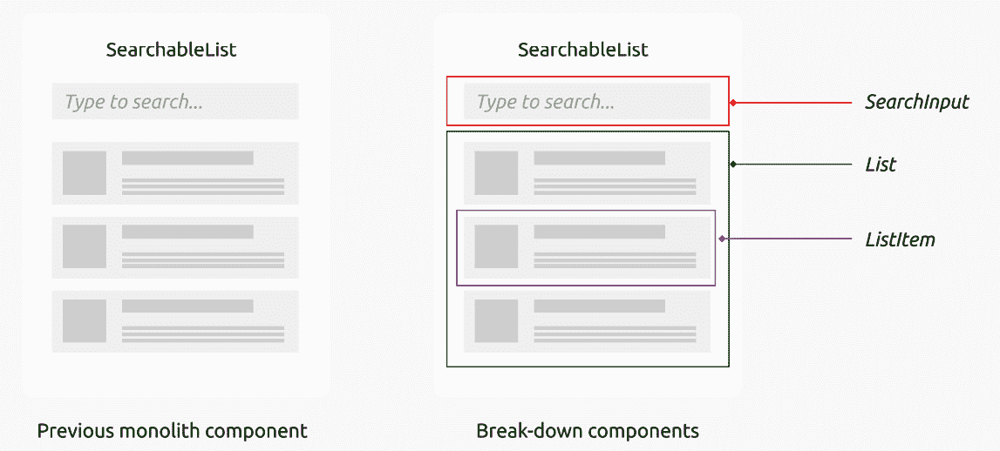

# 8

# 探索 React 中的数据管理

在现代前端开发中，我们处理状态和数据访问的方式可能会使应用程序成功或失败。无论你是独立开发者还是大型团队的一员，理解最佳实践和常见陷阱至关重要。本章旨在提高你在 React 应用程序中状态管理和数据处理方面的熟练度，重点关注可扩展和可维护的方法。

状态管理具有挑战性，尤其是在 React 中，开发者日常工作中会遇到许多问题。其中一个挑战是你在代码库中可以定位业务逻辑的位置。当业务逻辑渗透到 UI 组件中时，它会损害它们的可重用性。许多领域对象以及计算逻辑要么故意要么无意地散布在 UI 组件中，这可能导致难以追踪、调试和测试的复杂逻辑。它也可能导致性能问题，从而对用户体验产生负面影响。

另一个问题就是属性钻取，将属性从父组件传递到深层嵌套的子组件变得既繁琐又容易出错。这通常会导致代码重复，因为相同的代码片段会出现在多个文件中，使得任何未来的更新都变得复杂。

最后，在 React 应用程序中共享状态也带来了一系列挑战。存在各种机制来实现这一点，但选择最有效的方式在组件之间共享状态逻辑可能会相当令人困惑。我们将深入探讨共享状态的问题，并看看 React 的 Context API 如何帮助解决这个问题。

本章将涵盖以下主题：

+   理解业务逻辑泄露

+   介绍反腐败层

+   探索属性钻取问题

+   使用 Context API 解决属性钻取问题

# 技术要求

已创建一个 GitHub 仓库来托管本书中讨论的所有代码。对于本章，你可以在[`github.com/PacktPublishing/React-Anti-Patterns/tree/main/code/src/ch8`](https://github.com/PacktPublishing/React-Anti-Patterns/tree/main/code/src/ch8)找到推荐的架构。

# 理解业务逻辑泄露

**业务逻辑**指的是对业务应用程序操作至关重要的规则、计算和流程。当这种业务逻辑“泄露”到不属于它的组件或应用程序区域时，这被称为**业务****逻辑泄露**。

这个问题在各个项目中经常出现，部分原因是因为在 React 中处理业务逻辑没有广泛达成共识的方法。框架的灵活性允许你直接在组件、Hooks 或辅助函数中实现这种逻辑；因此，开发者往往会将逻辑直接嵌入到需要的组件中——这就是泄露的原因。

这种泄漏可能导致许多问题。业务逻辑泄漏可能导致紧密耦合的组件变得难以测试、维护或重用。当业务逻辑散布在应用程序的不同部分时，会导致代码重复和不一致，使应用程序更容易出错且更难调试。此外，这种分散使得对业务规则的任何未来修改都变得复杂，因为可能需要在多个地方进行更改，从而增加了引入新问题的风险。

有多种指标表明业务逻辑正在渗入你的代码，但最普遍的迹象是在视图中或 UI 组件中直接包含数据转换。在本节中，我们将深入探讨这个问题；在下一节中，我们将探讨缓解这个问题的解决方案。

`UserProfile` 函数：

```js
function UserProfile({ id }: { id: string }) {
  const [user, setUser] = useState<User | null>(null);
  useEffect(() => {
    async function fetchUser() {
      const response = await fetch(`/api/users/${id}`);
      const data = await response.json();
      setUser({
        id: data.user_identification,
        name: data.user_full_name,
        isPremium: data.is_premium_user,
        subscription: data.subscription_details.level,
        expire: data.subscription_details.expiry,
      });
    }
    fetchUser();
  }, [id]);
  if (!user) {
    return <div>Loading...</div>;
  }
  return (
    <div data-testid="user-profile">
      <h1>{user.name}</h1>
    </div>
  );
}
```

`UserProfile` 函数组件从后端 API 获取用户数据。`useEffect` 钩子确保在 ID 发生变化时进行数据获取。获取的数据随后存储在本地状态变量 `user` 中，组件在数据可用时显示用户姓名。如果数据仍在加载中，则显示 **加载中…** 消息。

在 `useEffect` 块中，存储在 `user` 状态变量中的获取数据转换。具体来说，从获取的 JSON 响应中映射的键被映射到更适合前端应用程序的新名称——例如，`data.user_identification` 变为 `id`，`data.user_full_name` 变为 `name`。这种转换使得在 React 组件中更容易处理和阅读。

如你所想，这种类型的转换可以在应用程序的许多地方发生，并不仅限于 React 组件内部；有时，这种转换可以存在于 Hooks 和其他地方，如下面的图所示：


图 8.1：在视图中使用数据转换

后端服务可以以不同技术支持的各种格式提供数据——一些使用 RESTful API，而另一些则使用 GraphQL。从前端代码的角度来看，这些格式的具体细节被抽象化。例如，一个组件可能负责将 XML 数据（用橙色菱形表示）转换为内部类型 *X*（表示为蓝色方块）。同时，另一个组件可能与 GraphQL 端点交互，将接收到的数据（用红色圆圈表示）处理成相同的内部类型 *X*。

这种差异需要在代码的多个区域进行数据转换。当这种转换被重复时，更容易忽略更改，尤其是如果后端更改了其数据结构。

所有这些不同的转换都可以集中到一个单一的位置，在那里进行数据重塑，包括空字段检查、字段重命名和消除不必要的字段。这很自然地过渡到我们下一个主题：**反腐败** **层**（**ACL**）。

# 引入 ACL

在软件开发中，ACL（访问控制列表）充当不同子系统之间的翻译者或调解者，这些子系统可能说着不同的“语言”。想象一下，你有两个系统，每个系统都有自己的规则、结构和复杂性。如果这些系统直接交互，它们可能会以未预料到的方式相互影响，导致领域逻辑中的所谓*腐败*。

在前端开发的背景下，尤其是在复杂的应用程序中，ACL 对于管理前端与各种后端或 API 之间的交互至关重要。前端开发者经常必须处理可能具有不一致或复杂的数据格式的多个服务。在前端实现 ACL 允许你创建一个统一的接口来与这些服务交互。

例如，如果你的前端应用程序需要与多个 RESTful API、GraphQL 服务和甚至 WebSocket 服务器通信，每个都可能有一套自己的规则、数据结构和复杂性。前端 ACL 将承担将这些不同的数据形式转换为前端应用程序理解格式的角色。这意味着你的 UI 组件不必担心每个服务的详细数据格式，这使得组件更容易开发、测试和维护。

ACL 还可以成为处理缓存、错误转换和其他横切关注点的战略位置。通过集中这些功能，你避免了在前端代码库中分散类似的逻辑，从而遵循**不要重复自己**（**DRY**）原则：


图 8.2：引入了用于数据转换的 ACL

如*图 8**.2 所示，所有数据转换现在都集中化，消除了在视图中进行此类操作的需求。你可能想知道如何在代码中实现这一点。

## 引入典型用法

要开始，让我们基于上一节中的示例，引入一个基本函数作为我们 ACL 的起点。我们应该确定外部数据格式以及我们消费的内容，然后定义函数作为转换器，然后再将它们放在一个公共位置。

首先，让我们定义从远程服务器接收的用户数据格式的类型。通过使用 TypeScript，我们获得了编译时检查的优势，从而确保在应用程序运行之前，任何数据格式的不一致性都会被标记出来：

```js
type RemoteUser = {
  user_identification: string;
  user_full_name: string;
  is_premium_user: boolean;
  subscription_details: {
    level: string;
    expiry: string;
  }
}
```

我们还将定义本地的`User`类型——它包括我们在`UserProfile`组件中使用的所有字段（`id`、`name`等）：

```js
type UserSubscription = "Basic" | "Standard" | "Premium" | "Enterprise";
type User = {
  id: string;
  name: string;
  isPremium: boolean;
  subscription: UserSubscription;
  expire: string;
};
```

`type` 定义指定了将在 React 组件中使用的用户对象的结构。请注意，`subscription` 属性使用自定义类型 `UserSubscription`，它可以取四个字符串值之一：`expire` 是一个字符串，表示用户的订阅何时将过期。

使用这种设置，我们可以在名为 `transformer.ts` 的文件中定义一个新的函数，称为 `transformUser`。该文件简单地返回我们刚刚定义的 `User` 类型的映射对象：

```js
import {RemoteUser, User, UserSubscription} from "./types";
export const transformUser = (remoteUser: RemoteUser): User => {
  return {
    id: remoteUser.user_identification,
    name: remoteUser.user_full_name,
    isPremium: remoteUser.is_premium_user,
    subscription: remoteUser.subscription_details.level as 
     UserSubscription,
    expire: remoteUser.subscription_details.expiry,
  };
};
```

使用在 `transformer.ts` 中提取的新函数，我们的组件可以简化如下：

```js
async function fetchUserData<T>(id: string) {
  const response = await fetch(`/api/users/${id}`);
  const rawData = await response.json();
  return transformUser(rawData) as T;
}
function UserProfile({ id }: { id: string }) {
  const [user, setUser] = useState<User | null>(null);
  useEffect(() => {
    async function fetchUser() {
      const response = await fetchUserData<User>(id);
      setUser(response);
    }
    fetchUser();
  }, [id]);
  if (!user) {
    return <div>Loading…</div>;
  }
  return (
    <div data-tested="user-profile">
      <h1>{user.name}</h1>
    </div>
  );
}
```

`UserProfile` 组件依赖于 `fetchUserData` 辅助函数从 API 获取和处理用户数据。这种设计使 `UserProfile` 与对远程数据结构的任何了解隔离开。如果将来对 `RemoteUser` 类型进行了更改，`UserProfile` 仍然不受影响，因为所有调整都将局限于 `transformer.ts`。

拥有一个专门用于管理远程数据并将其塑造成适合高级视图要求的函数是有利的。然而，当后端未能提供必要的数据时，会出现复杂性。在这种情况下，需要在这个层中添加额外的逻辑来建立回退或默认值。

## 使用回退或默认值

与数据转换相关的一个常见问题是 React 视图中过度使用防御性编程。虽然防御性编程通常是良好的实践，并在各种环境中很有用，但过度加载 React 组件过多的空值检查和回退可能会使代码杂乱无章，难以理解。

注意

**防御性编程** 是一种编写代码的方式，它预测可能出现的错误、故障或异常，并以优雅的方式处理它们。目标是使你的应用程序更具弹性和可维护性，通过最小化意外情况的影响。

例如，在 `UserProfile` 示例中，你可能会遇到远程服务中某些值为空的情况。而不是向最终用户显示 `null` 或 `undefined`，你需要实现回退值。

让我们回顾一下我们之前提取的 `transformUser` 函数：

```js
export const transformUser = (remoteUser: RemoteUser): User => {
  return {
    id: remoteUser.user_identification,
    name: remoteUser.user_full_name,
    isPremium: remoteUser.is_premium_user,
    subscription: remoteUser.subscription_details.level as 
     UserSubscription,
    expire: remoteUser.subscription_details.expiry,
  };
};
```

如果 `subscription_details` 不存在，或者当 `expiry` 不是后端有效的日期格式时会发生什么？这些不匹配可能导致运行时异常，因此当远程数据格式不正确时，我们应该回退到一些默认值。

我们可以将回退逻辑放在组件中，在我们渲染它们之前。如果没有 ACL，我们可能会在 `UserProfile` 中遇到一些逻辑，如下所示：

```js
function UserProfile({ user }: { user: User }) {
  const fullName = user && user.name ? user.name : "Loading"…";
  const subscriptionLevel =
    user && user.subscription ? user.subscription": "Basic";
  const subscriptionExpiry = user && user.expire ? user.expire": 
   "Never";
  return (
    <div>
      <h1>{fullName}</h1>
      <p>Subscription Level: {subscriptionLevel}</p>
      <p>Subscription Expiry: {subscriptionExpiry}</p>
    </div>
  );
}
```

`UserProfile` 函数组件接受一个用户对象作为属性。它显示用户的全名、订阅级别和订阅过期日期。如果这些值中的任何一个缺失或为假，它将提供默认回退文本，例如 **加载中…**、**基础** 或 **从未**。

因此，逻辑开始渗透到`UserProfile`组件中，增加了组件的长度和复杂性。

这种逻辑可以通过将其移动到`transformUser`等函数中更好地管理，这样就可以对其进行彻底的测试：

```js
export const transformUser = (remoteUser: RemoteUser): User => {
  return {
    id: remoteUser.user_identification ?? 'N/A',
    name: remoteUser.user_full_name ?? 'Unknown User',
    isPremium: remoteUser.is_premium_user ?? false,
    subscription: (remoteUser.subscription_details?.level ?? 'Basic') 
     as UserSubscription,
    expire: remoteUser.subscription_details?.expiry ?? 'Never',
  };
};
```

`transformUser`函数将远程用户数据结构中的字段映射到应用程序期望的`user`数据结构，为每个字段提供默认值，以防它们缺失或为 null。例如，如果`remoteUser.user_identification`为`null`，则将使用**N/A**作为默认 ID。

注意，在这里，我们使用了`?`，这允许您在不检查每一层嵌套的情况下访问深层嵌套的属性。如果`subscription_details`或`level`为 null 或 undefined，则结果`subscription`也将为 undefined，并且不会抛出错误。我们还使用了`??`进行回退——如果其左侧的值不是 null 或 undefined，则它将采用左侧的值；否则，它将采用右侧的值。

所有这些转换和回退逻辑现在都被封装在了一个共同的地方——ACL。任何对远程或本地数据形状的进一步更改都可以轻松地发生在这个层，我们不需要在整个代码库中查找不同的用法。

优秀——ACL 模式有效地将业务逻辑与视图隔离开来。然而，在 React 应用程序中管理数据时还有额外的挑战，例如在组件之间共享数据和避免属性钻取。在下一节中，我们将探讨如何使用 Context API 来解决这些问题。

# 探索钻进问题

**属性钻取**是在您必须通过不需要数据的多个组件层级传递数据，以便它能够到达需要它的更深层次的组件时出现的问题。这通常会使代码更难跟踪、理解和维护。

考虑一个标准的 React 场景，其中我们有一个通用的可搜索列表组件。该组件接受一个列表并显示每个项目，无论是书籍列表、菜单、票务还是您能想到的任何其他内容。除了显示列表外，该组件还包括一个搜索框，允许用户轻松过滤长列表：


图 8.3：可搜索列表组件

初看之下，实现似乎很简单，并不过于复杂：

```js
import React, { ChangeEvent, useState } from "react";
export type Item = {
  id: string;
  name: string;
  description: string;
};
const SearchableList = ({ items }: { items: Item[] }) => {
  const [filteredItems, setFilteredItems] = useState<Item[]>(items);
  const handleChange = (e: ChangeEvent<HTMLInputElement>) => {
    setFilteredItems(
      items.filter((item) => item.name.includes(e.target.value))
    );
  };
  return (
    <div>
      <input type="text" onChange={handleChange} />
      <ul>
        {filteredItems.map((item, index) => (
          <li key={index}>{item.name}</li>
        ))}
      </ul>
    </div>
  );
};
export default SearchableList;
```

代码在 React 中定义了一个`SearchableList`组件，该组件根据用户输入过滤并显示项目列表。它从一个完整的项目列表开始，并在输入框中的文本更改时更新过滤后的列表。

随着组件的演变和在更多场景中的应用，代码库变得越来越复杂，导致额外的布局更改和更多的代码行。如图 8.4*所示，在右侧，我们可以将可搜索列表输入分解为三个子组件，称为`SearchInput`、`List`和`ListItem`：



图 8.4：将可搜索列表分解成更小的组件

在右侧，`SearchInput` 接受用户的输入（在顶部红色矩形中）。它是 `List` 组件的兄弟组件（在绿色矩形中），其中包含多个 `ListItem`（在紫色矩形中）——每个 `ListItem` 代表一个项目（可能包含标题、描述或按钮）。

让我们详细看看这些提取的组件：

```js
const ListItem = ({ item }: { item: Item }) => {
  return (
    <li>
      <h2>{item.name}</h2>
      <p>{item.description}</p>
    </li>
  );
};
```

`ListItem` 显示项目的名称和描述。对于任何需要的进一步细节，我们只需直接修改此文件即可。

然后，每个 `ListItem` 都被包裹在一个容器组件 `List` 中，如下所示：

```js
const List = ({ items }: { items: Item[] }) => {
  return (
    <section data-testid="searchable-list">
      <ul>
        {items.map((item) => (
          <ListItem item={item} />
        ))}
      </ul>
      <footer>Total items: {items.length}</footer>
    </section>
  );
};
```

这个 `List` 作为所有项目的容器。它还包括一个页脚来显示一些项目的摘要信息。

最后，我们有 `SearchInput` 组件，它负责收集用户输入并在用户输入时触发搜索：

```js
const SearchInput = ({ onSearch }: { onSearch: (keyword: string) => void }) => {
  const handleChange = (e: ChangeEvent<HTMLInputElement>) => {
    onSearch(e.target.value);
  };
  return <input type="text" onChange={handleChange} />;
};
const SearchableList = ({ items }: { items: Item[] }) => {
  const [filteredItems, setFilteredItems] = useState<Item[]>(items);
  const onSearch = (keyword: string) => {
    setFilteredItems(items.filter((item) => item.name.
     includes(keyword)));
  };
  return (
    <div>
      <SearchInput onSearch={onSearch} />
      <List items={filteredItems} />
    </div>
  );
};
```

注意，这个代码分解仅是一个内部结构变化——我们只做了这个变化，以便使每个部分易于阅读和理解。使用 `SearchableList` 的人根本不知道这样的变化——到目前为止，`SearchableList` 的属性还没有改变。

然而，消费者请求了一个新功能：他们希望跟踪用户交互以进行数据分析，特别是为了衡量项目的受欢迎程度和搜索功能的利用率。为了满足这一要求，引入了两个新的属性：一个用于捕获项目点击时的 `onItemClicked` 回调，以及一个用于监控搜索执行时的 `onSearch` 回调。

因此，我们需要修改我们的代码以满足这些要求，从 `SearchableList` 中使用的新类型开始：

```js
type SearchableListProps = {
  items: Item[];
  onSearch: (keyword: string) => void;
  onItemClicked: (item: Item) => void;
};
const SearchableList = ({
  items,
  onSearch,
  onItemClicked,
}: SearchableListProps) => {
  //...
}
```

要传递 `onSearch` 和 `onItemClicked`，我们将对 `ListItem` 进行一些修改。我们需要更改属性列表（添加 `onItemClicked`），然后在列表被点击时调用该函数：

```js
const ListItem = ({
  item,
  onItemClicked,
}: {
  item: Item;
  onItemClicked: (item: Item) => void;
}) => {
  return (
    <li onClick={() => onItemClicked(item)}>
      <h2>{item.name}</h2>
      <p>{item.description}</p>
    </li>
  );
};
```

然而，由于 `ListItem` 没有直接暴露给外部世界，属性是从其父组件 `List` 传递过来的。因此，我们还需要更新 `List` 组件的属性列表，添加 `onItemClicked`：

```js
const List = ({
  items,
  onItemClicked,
}: {
  items: Item[];
  onItemClicked: (item: Item) => void;
}) => {
  return (
    <section data-testid="searchable-list">
      <ul>
        {items.map((item) => (
          <ListItem item={item} onItemClicked={onItemClicked} />
        ))}
      </ul>
      <footer>Total items: {items.length}</footer>
    </section>
  );
};
```

`List` 组件必须接受 `onItemClicked` 作为属性，然后将 `onItemClicked` 属性传递给 `ListItem` 而不对其进行任何操作。这是一个代码异味，表明组件正在处理与其功能不直接相关的事情。

然后，`onItemClick` 属性从 `List` 组件的父组件 `SearchableList` 组件传递过来，如下所示：

```js
const SearchableList = ({
  items,
  onSearch,
  onItemClicked,
}: SearchableListProps) => {
  const [filteredItems, setFilteredItems] = useState<Item[]>(items);
  const handleSearch = (keyword: string) => {
    setFilteredItems(items.filter((item) => item.name.
     includes(keyword)));
  };
  return (
    <div>
      <SearchInput onSearch={handleSearch} />
      <List items={filteredItems} onItemClicked={onItemClicked} />
    </div>
  );
};
```

观察我们如何将 `onItemClicked` 属性传递给 `ListItem` 组件。首先，它通过 `List` 组件传递，该组件直接将其传递给 `ListItem` 而不用于任何操作。这是一个经典的属性钻探示例。同样的事情也可能发生在 `SearchInput` 上。随着我们继续添加越来越多的属性并从外部向下钻探组件树，整个结构很快就会变得难以管理。

幸运的是，Context API 为 prop drilling 问题提供了一个优雅的解决方案，我们将在下一节中对其进行回顾（我们已经在*第二章*中介绍了使用 Context API 的基础知识；如果您想复习，可以回顾一下那一章）。

# 使用 Context API 解决 prop drilling

使用 Context API 来处理 prop drilling 背后的概念是为一个共同的父组件下的所有子组件创建一个共享容器。这消除了从父组件显式传递 props 到子组件的需求。子组件可以在必要时直接访问共享上下文。使用 Context API 的另一个优点是，当上下文中的数据发生变化时，它会触发组件的自动重新渲染。

回到我们的可搜索列表示例，它已经存在 prop drilling 问题，`List`组件中的`onItemClicked`是不必要的，因为`List`没有使用这个 prop。这种场景只涉及一层和一个 prop。现在，设想一个我们需要在`List`和`ListItem`组件之间插入额外元素的情况；我们必须将`onItemClicked` prop 传递到它被使用的地方。如果有多个 props 需要传递，复杂性会进一步增加。

第一步是定义一个具有适当类型的上下文：

```js
import { createContext } from "react";
import { Item } from "./types";
type SearchableListContextType = {
  onSearch: (keyword: string) => void;
  onItemClicked: (item: Item) => void;
};
const noop = () => {};
const SearchableListContext = createContext<SearchableListContextType>({
  onSearch: noop,
  onItemClicked: noop,
});
export { SearchableListContext };
```

这段代码定义了一个名为`SearchableListContext`的 React 上下文。它指定了上下文将持有的`onSearch`和`onItemClicked`函数的类型。它还默认使用无操作(`noop`)函数初始化这些函数。

现在，我们可以将上下文用作可搜索列表的包装器，为所有子组件提供上下文：

```js
const SearchableList = ({
  items,
  onSearch,
  onItemClicked,
}: SearchableListProps) => {
  const [filteredItems, setFilteredItems] = useState<Item[]>(items);
  const handleSearch = (keyword: string) => {
    setFilteredItems(items.filter((item) => item.name.
     includes(keyword)));
  };
  return (
    <SearchableListContext.Provider value={{ onSearch, onItemClicked }}>
      <SearchInput onSearch={handleSearch} />
      <List items={filteredItems} />
    </SearchableListContext.Provider>
  );
};
```

`SearchableList`组件将其子组件`SearchInput`和`List`包裹在`SearchableListContext.Provider`内部。这允许这些子组件无需显式作为 props 传递，就可以从上下文中访问`onSearch`和`onItemClicked`函数。`handleSearch`函数根据搜索关键字过滤项目。

这意味着我们的`List`组件可以恢复到我们在引入`onItemClicked`之前的简单版本：

```js
const List = ({ items }: { items: Item[] }) => {
  return (
    <section data-testid="searchable-list">
      <ul>
        {items.map((item) => (
          <ListItem item={item} />
        ))}
      </ul>
      <footer>Total items: {items.length}</footer>
    </section>
  );
};
```

对于`ListItem`，我们可以直接从上下文中访问`onItemClicked`：

```js
const ListItem = ({ item }: { item: Item }) => {
  const { onItemClicked } = useContext(SearchableListContext);
  return (
    <li onClick={() => onItemClicked(item)}>
      <h2>{item.name}</h2>
      <p>{item.description}</p>
    </li>
  );
};
```

`ListItem`组件现在使用`useContext`从`SearchableListContext`访问`onItemClicked`函数。当点击列表项时，`onItemClicked`会以被点击的项作为参数被调用。

同样，对于`SearchInput`组件，没有必要从`SearchableList`传递额外的 props。相反，我们可以直接从上下文中获取我们需要的：

```js
const SearchInput = ({ onSearch }: { onSearch: (keyword: string) => 
 void }) => {
  const { onSearch: providedOnSearch } = 
   useContext(SearchableListContext);
  const handleChange = (e: ChangeEvent<HTMLInputElement>) => {
    onSearch(e.target.value);
    providedOnSearch(e.target.value);
  };
  return <input type="text" onChange={handleChange} />;
};
```

`SearchInput`组件使用`useContext` Hook 从`SearchableListContext`访问`onSearch`函数。当输入改变时，它调用本地的`onSearch`函数和上下文中的函数，有效地合并了外部和内部行为。

如所示，Context API 导致结构更加清晰。它允许你在不担心不断向下传递 props 的情况下，对子组件进行额外的结构调整。这简化了组件接口，使其更容易阅读和理解。

# 摘要

在本章中，我们深入探讨了在 React 开发中经常遇到的一些最紧迫的挑战，例如业务逻辑的泄漏、与 prop 钻取相关的复杂性以及管理共享状态困难。为了应对这些问题，我们引入了如 ACL 和 Context API 等强大的解决方案。这些策略旨在简化你的代码，使其在长期项目中更具可维护性和有效性。

接下来，我们将深入探讨你可用于进一步磨练编码技能的常见 React 设计模式。敬请期待。
